<!-- This is generated from the docs and patched manually for having  -->

[Source](http:/localhost:4321/js/what-is-cesdk-2e7acd)

# Javascript Creative Editor SDK

CreativeEditor SDK offers a fully-featured JavaScript library for creating and editing rich visual designs directly within the browser.

### What is CE.SDK?[#](#what-is-cesdk)

This CE.SDK configuration is highly customizable and extendable, providing a comprehensive set of design editing features such as templating, layout management, asset integration, and more. All operations are executed directly in the browser, without the need for server dependencies.

[Launch Web Demo](https://img.ly/showcases/cesdk) [Get Started](js/get-started/overview-e18f40/)

## Key Capabilities of the JavaScript Creative Editor SDK[#](#key-capabilities-of-the-javascript-creative-editor-sdk)


### Transform

Perform operations like cropping, rotating, and resizing design elements.

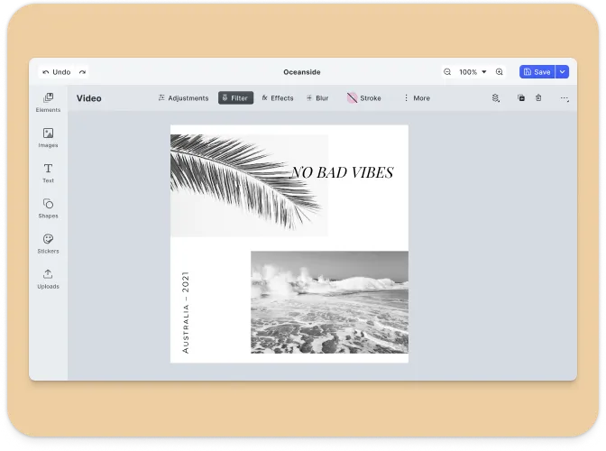

### Templating

Create and apply design templates with placeholders and text variables for dynamic content.

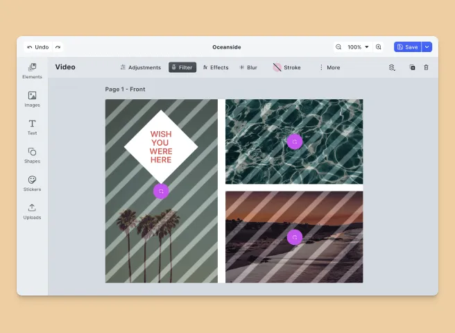

### Placeholders & Lockable Design

Constrain templates to guide your users’ design and ensure brand consistency.

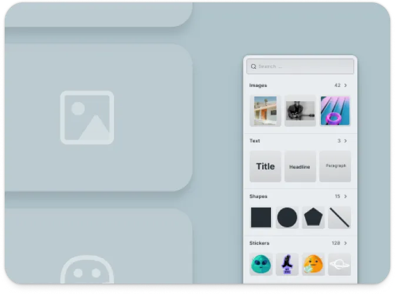

### Asset Management

Import and manage images, shapes, and other assets to build your designs.

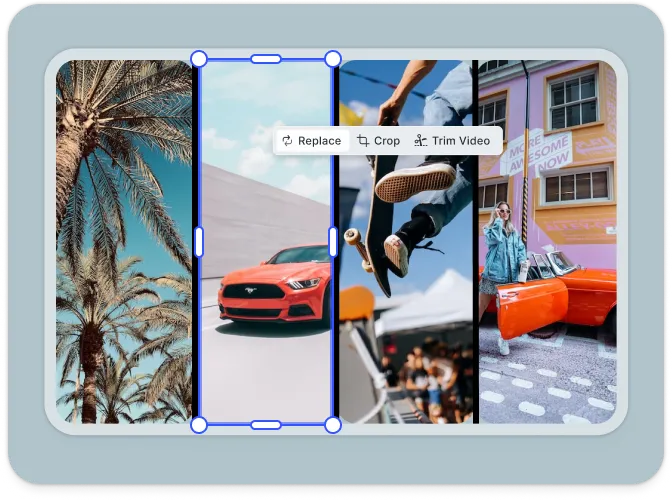

### Design Collage

Arrange multiple elements on a single canvas to create complex layouts.

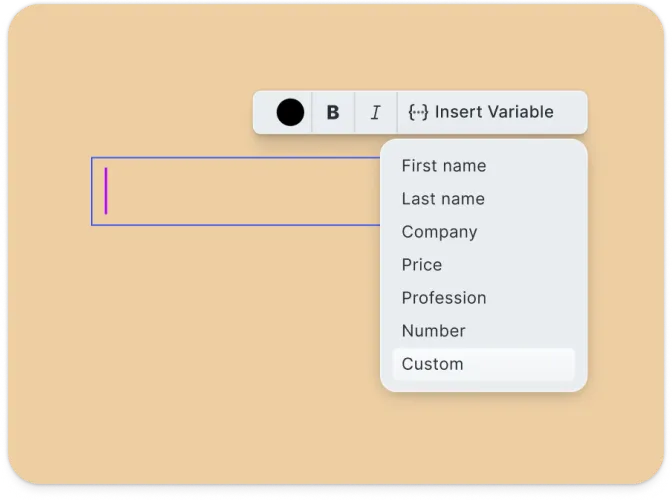

### Text Editing

Add and style text blocks with various fonts, colors, and effects.

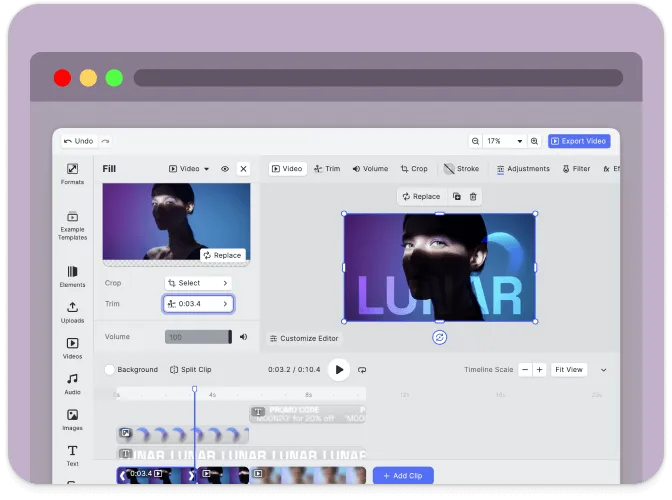

### Client-Side Processing

All design editing operations are executed directly in the browser, with no need for server dependencies.

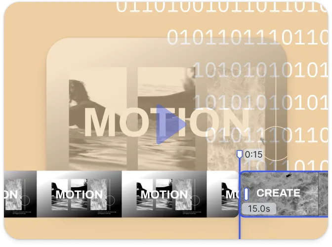

### Headless & Automation

Programmatically edit designs within your React application using the engine API.

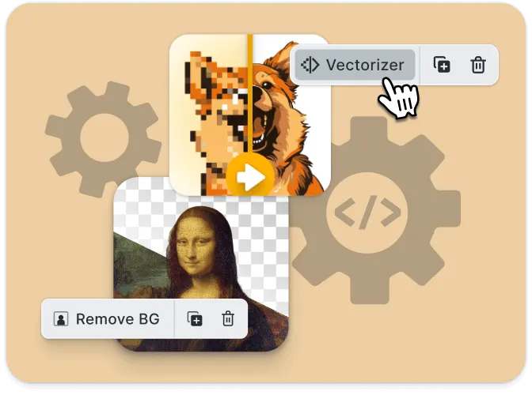

### Extendible

Hook into the engine API and editor events to implement custom features.

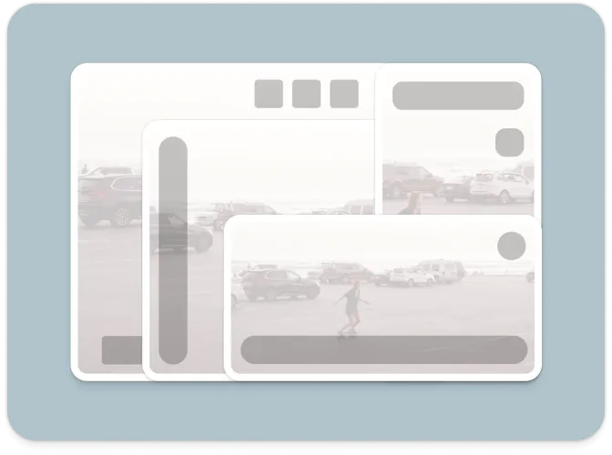

### Customizable UI

Build and integrate custom UIs tailored to your application’s design needs.

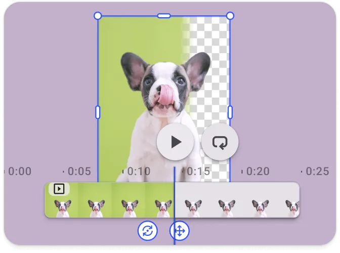
i
### Background Removal

This plugin makes it easy to remove the background from images running entirely in the browser.

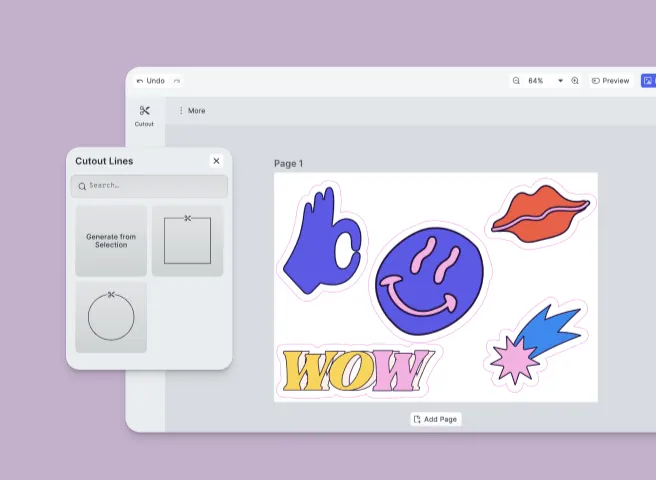

### Optimized for Print

Perfect for web-to-print use cases, supporting spot colors and cut-outs.

## Browser Support[#](#browser-support)

The CE.SDK Design Editor is optimized for use in modern web browsers, ensuring compatibility with the latest versions of Chrome, Firefox, Edge, and Safari.

See the full list of [supported browsers here](js/browser-support-28c1b0/).

## Supported File Types[#](#supported-file-types)

CE.SDK supports a wide range of file types to ensure maximum flexibility for developers:

### Importing Media[#](#importing-media)

| Category | Supported Formats |
| --- | --- |
| **Images** | `.png`, `.jpeg`, `.jpg`, `.gif`, `.webp`, `.svg`, `.bmp` |
| **Video** | `.mp4` (H.264/AVC, H.265/HEVC), `.mov` (H.264/AVC, H.265/HEVC) |
| **Audio** | `.mp3`, `.m4a`, `.mp4` (AAC or MP3), `.mov` (AAC or MP3) |

Need to import a format not listed here? CE.SDK allows you to create custom importers for any file type by using our Scene and Block APIs programmatically.

### Exporting Media[#](#exporting-media)

| Category | Supported Formats |
| --- | --- |
| **Images** | `.png` (with transparency), `.jpeg`, `.webp`, `.tga` |
| **Video** | `.mp4` (H.264 or H.265 on supported platforms with limited transparency support) |
| **Print** | `.pdf` (supports underlayer printing and spot colors) |
| **Scene** | `.scene` (description of the scene without any assets) |
| **Archive** | `.zip` (fully self-contained archive that bundles the `.scene` file with all assets) |

Our custom cross-platform C++ based rendering and layout engine ensures consistent output quality across devices.

### Importing Templates[#](#importing-templates)

| Format | Description |
| --- | --- |
| `.idml` | InDesign |
| `.psd` | Photoshop |
| `.scene` | CE.SDK Native |

Need to import a format not listed here? CE.SDK allows you to create custom importers for any file type by using our Scene and Block APIs to generate scenes programmatically.

For detailed information, see the [full file format support list](js/file-format-support-3c4b2a/).

## Understanding CE.SDK Architecture & API[#](#understanding-cesdk-architecture--api)

The following sections provide an overview of the key components of the CE.SDK design editor UI and its API architecture. If you’re ready to start integrating CE.SDK into your JavaScript application, check out our [Getting Started guide](js/get-started/overview-e18f40/) or dive into the [guides](js/guides-8d8b00/).

### CreativeEditor Design UI[#](#creativeeditor-design-ui)

The CE.SDK design UI is built for intuitive design creation and editing. Here are the main components and customizable elements within the UI:

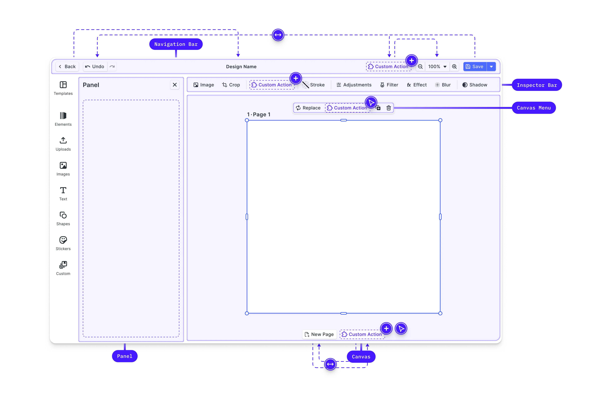

*   **Canvas:** The core interaction area for design content.
*   **Dock:** Entry point for interactions not directly related to the selected design block, often used for accessing asset libraries.
*   **Canvas Menu:** Access block-specific settings like duplication or deletion.
*   **Inspector Bar:** Manage block-specific functionalities, such as adjusting properties of the selected block.
*   **Navigation Bar:** Handles global scene actions like undo/redo and zoom.
*   **Canvas Bar:** Provides tools for managing the overall canvas, such as adding pages or controlling zoom.
*   **Layer Panel:** Manage the stacking order and visibility of design elements.

Learn more about interacting with and manipulating design controls in our design editor UI guide.

### CreativeEngine[#](#creativeengine)

CreativeEngine is the core of CE.SDK, responsible for managing the rendering and manipulation of design scenes. It can be used in headless mode or integrated with the CreativeEditor UI.

Below are key features and APIs provided by the CreativeEngine:

*   **Scene Management:** Create, load, save, and modify design scenes programmatically.
*   **Block Manipulation:** Create and manage design elements, such as shapes, text, and images.
*   **Asset Management:** Load assets like images and SVGs from URLs or local sources.
*   **Variable Management:** Define and manipulate variables within scenes for dynamic content.
*   **Event Handling:** Subscribe to events like block creation or updates for dynamic interaction.

## API Overview[#](#api-overview)

The APIs of CE.SDK are grouped into several categories, reflecting different aspects of scene management and manipulation.

[**Scene API:**](js/concepts/scenes-e8596d/)\- **Creating and Loading Scenes:** `jsx engine.scene.create(); engine.scene.loadFromURL(url);`

*   **Zoom Control:**
    
    ```
    engine.scene.setZoomLevel(1.0);engine.scene.zoomToBlock(blockId);
    ```
    

[**Block API:**](js/concepts/blocks-90241e/)\- **Creating Blocks**: `jsx const block = engine.block.create('shapes/rectangle');`

*   **Setting Properties**:
    
    ```
    engine.block.setColor(blockId, 'fill/color', { r: 1, g: 0, b: 0, a: 1 });engine.block.setString(blockId, 'text/content', 'Hello World');
    ```
    
*   **Querying Properties**:
    
    ```
    const color = engine.block.getColor(blockId, 'fill/color');const text = engine.block.getString(blockId, 'text/content');
    ```
    

[**Variable API:**](js/create-templates/add-dynamic-content/text-variables-7ecb50/) Variables allow dynamic content within scenes to programmatically create variations of a design. - **Managing Variables**: `jsx engine.variable.setString('myVariable', 'value'); const value = engine.variable.getString('myVariable');`

[**Asset API:**](js/import-media/concepts-5e6197/)\- **Managing Assets**: `jsx engine.asset.add('image', 'https://example.com/image.png');`

[**Event API:**](js/concepts/events-353f97/)

*   **Subscribing to Events**:
    
    ```
    // Subscribe to scene changesengine.scene.onActiveChanged(() => {  const newActiveScene = engine.scene.get();});
    ```
    

## Customizing the JavaScript Creative Editor[#](#customizing-the-javascript-creative-editor)

CE.SDK provides extensive customization options to adapt the UI to various use cases. These options range from simple configuration changes to more advanced customizations involving callbacks and custom elements.

### Role-Based Customization[#](#role-based-customization)

Switch between “Creator” and “Adopter” roles to control the editing experience. The “Creator” role allows setting constraints on template elements, while the “Adopter” role is focused on adapting these elements.

*   **Creator:** Set constraints and manage template settings.
*   **Adopter:** Edit elements within the bounds set by the Creator.

### Basic Customizations[#](#basic-customizations)

*   **Configuration Object:** When initializing the CreativeEditor, you can pass a configuration object that defines basic settings such as the base URL for assets, the language, theme, and license key.

```
const config = {  baseURL:    'https://cdn.img.ly/packages/imgly/cesdk-engine/1.57.0/assets',  license: 'your-license-key',  locale: 'en',  theme: 'light',};
```

*   **Localization:** Customize the language and labels used in the editor to support different locales.

```
const config = {  i18n: {    en: {      variables: {        my_custom_variable: {          label: 'Custom Label',        },      },    },  },};
```

*   [Custom Asset Sources](js/import-media/concepts-5e6197/): Serve custom image or SVG assets from a remote URL.

### UI Customization Options[#](#ui-customization-options)

*   **Theme:** Choose between predefined themes such as ‘dark’ or ‘light’.

```
const config = {  theme: 'dark',};
```

*   **UI Components:** Enable or disable specific UI components based on your requirements.

```
const config = {  ui: {    elements: {      toolbar: true,      inspector: false,    },  },};
```

## Advanced Customizations[#](#advanced-customizations)

Learn more about extending editor functionality and customizing its UI to your use case by consulting our in-depth [customization guide](js/user-interface/ui-extensions-d194d1/).

Here is an overview of the APIs and components available to you.

### Order APIs[#](#order-apis)

Customization of the web editor’s components and their order within these locations is managed through specific Order APIs, allowing the addition, removal, or reordering of elements. Each location has its own Order API, e.g., `setDockOrder`, `setCanvasMenuOrder`, `setInspectorBarOrder`, `setNavigationBarOrder`, and `setCanvasBarOrder`.

### Layout Components[#](#layout-components)

CE.SDK provides special components for layout control, such as `ly.img.separator` for separating groups of components and `ly.img.spacer` for adding space between components.

### Registration of New Components[#](#registration-of-new-components)

Custom components can be registered and integrated into the web editor using builder components like buttons, dropdowns, and inputs. These components can replace default ones or introduce new functionalities, deeply integrating custom logic into the editor.

### Feature API[#](#feature-api)

The Feature API enables conditional display and functionality of components based on the current context, allowing for dynamic customization. For example, you can hide certain buttons for specific block types.

## Plugins[#](#plugins)

You can customize the CE.SDK web editor during its initialization using the APIs outlined above. For many use cases, this will be adequate. However, there are times when you might want to encapsulate functionality for reuse. This is where plugins become useful.

Follow our [guide on building your own plugins](js/user-interface/ui-extensions-d194d1/) to learn more or check out one of the plugins we built using this API:

*   [**Background Removal**](js/edit-image/remove-bg-9dfcf7/): Adds a button to the canvas menu to remove image backgrounds.
*   [**Vectorizer**](js/edit-image/vectorize-2b4c7f/): Transform your pixel-based images images into scalable vector graphics.

## Ready to get started?

With a free trial and pricing that fits your needs, it's easy to find the best solution for your product.

[Free Trial](https://img.ly/forms/free-trial)

### 500M+

video and photo creations are powered by IMG.LY every month


---


[Source](http:/localhost:4321/js/user-interface-5a089a)

# User Interface

---


[Source](http:/localhost:4321/js/use-templates-a88fd4)

# Use Templates

---


[Source](http:/localhost:4321/js/upgrade-4f8715)

# Upgrade

---


[Source](http:/localhost:4321/js/to-v1-32-1b6ae8)

# To v1.32

Version v1.32 introduced powerful new APIs for customizing the CE.SDK web editor. These new APIs render some of the existing configurations obsolete, requiring code migration to leverage the more flexible new options.

This guide will help you navigate these changes and explain what you need to do to update your integration.

## Configuring the Dock[#](#configuring-the-dock)

Until version 1.32, the dock was configured by two configuration options (although most users only used one of them and kept the others default):

*   `config.ui.elements.libraries.insert.entries` and
*   `config.ui.elements.dock`

If your configuration adapted one of these two (mostly `config.ui.elements.libraries.insert.entries`), you are affected by this change. For now, it is only deprecated and we will try to do an internal migration for you, but this still might include a breaking change depending on how you used the configuration options before.

### Breaking Change[#](#breaking-change)

`config.ui.elements.libraries.insert.entries` was called repeatedly with a context of currently selected blocks. Most users and configurations have not used this behavior and just returned the same static list of entries for every call. In this case, your configuration should work as before, but if you have relied on this fact, you have to migrate your configuration to the new API, listen to selection changes, and update the asset library entries accordingly.

### Migration to new APIs[#](#migration-to-new-apis)

Defining the dock is now done by our new APIs in a consistent way to all other customizable locations of the editor. With the [Dock API](js/user-interface/customization/dock-cb916c/), you now have much greater control of how and what is displayed in the dock. This does not only include dock buttons to open asset libraries but also arbitrary buttons and other elements. Please take a look at the [Dock API](js/user-interface/customization/dock-cb916c/) or learn about the general concept [here](js/user-interface/overview-41101a/).

If you aren’t affected by the breaking change mentioned above, the easiest way to migrate is to first copy your current dock order after the editor has been inialized. This can be done by calling the new `cesdk.ui.getDockOrder()` method. Now you can take this order and set it during the initialization of the editor by using `cesdk.ui.setDockOrder(copiedDockOrder)`. The old configuration (`config.ui.elements.libraries.insert.entries` and `config.ui.elements.dock`) can be removed afterwards.

Of course, you could also just remove the old configuration and use the new API to define the dock order from scratch.

Please note, that changes to the asset library entries are now done by the [Asset Library Entry API](js/import-media/asset-panel/basics-f29078/) and the dock order is just referring to these. So if you, for instance, want to add an asset source id to be shown in a library, you have to add this asset source id to the asset library entry and not to the dock order.

```
// Before// ======const config: Configuration = {  ui: {    elements: {      libraries: {        insert: {          entries: (defaultEntries) => {            return [              // Changing some of the default entries              ...defaultEntries.map((entry) => {                if (entry.id === 'ly.img.image') {                  entry.sourceIds.push('my-own-image-source');                }                return entry;              }),              // Adding a new entry              {                id: 'my-own-entry',                sourceIds: ['my-own-source']              }            ];          }        }      }    }  }};
// After// ======cesdk.ui.setDockOrder([  ...cesdk.ui.getDockOrder(),  // Add a new button referencing your new entry  {    id: 'ly.img.assetLibrary.dock',    label: 'My Own Entry',    icon: [...],    entries: ['my-own-entry']  }]);
// Adding your custom entrycesdk.ui.addAssetLibraryEntry({  id: 'my-own-entry',  sourceIds: ['my-own-source']});
// Updating an existing default entryconst imageEntry = cesdk.ui.getAssetLibraryEntry('ly.img.image');cesdk.ui.updateAssetLibraryEntry('ly.img.image',{  sourceIds: [...imageEntry.sourceIds, 'my-own-image-source']})
```

## Configuring the Asset Replacement Panel[#](#configuring-the-asset-replacement-panel)

Similar to the definition of the dock, we deprecate the configuration `config.ui.elements.libraries.replace.entries` of the asset library entries for the replacement panel. This method is deprecated but we will try to migrate your configuration internally until it is removed. We recommend you to migrate to the new API as soon as possible.

The new API is similar with subtle differences. With `cesdk.ui.setReplaceAssetLibraryEntries` you register a function that is called with the current context (of selected blocks) but only returns ids of entries.

### Breaking Change[#](#breaking-change-1)

With the `config.ui.elements.libraries.replace.entries` it was possible to take the default entries and modify them. In theory, you could change the entries and have different “default” entries for insert or replace. Now a change to a default entry provided by the editor via the [Asset Library Entry API](js/import-media/asset-panel/basics-f29078/) will be reflected in both the insert and replace entries. To solve this you can just copy one entry for replacement, modify it, and return its id instead.

### Migration to new APIs[#](#migration-to-new-apis-1)

Take the function from `config.ui.elements.libraries.replace.entries` and use it in `cesdk.ui.setReplaceAssetLibraryEntries` by replacing the entries with their ids. If you have made changes to the default entries or added new custom ones you need to add or change them via the [Asset Library Entry API](js/import-media/asset-panel/basics-f29078/) on initialization of the editor.

---


[Source](http:/localhost:4321/js/to-v1-19-55bcad)

# To v1.19

Version v1.19 of CreativeEngineSDK and CreativeEditorSDK introduces structural changes to many of the current design blocks, making them more composable and more powerful. Along with this update, there are mandatory license changes that require attention. This comes with a number of breaking changes. This document will explain the changes and describe the steps you need to take to adapt them to your setup.

## **License Changes**[#](#license-changes)

The `license` parameter is now required for CreativeEngineSDK and CreativeEditorSDK. This means that you will need to update your license parameter in the `CreativeEngine.init` and `CreativeEditorSDK.create` configuration object properties. There is also a new `userId`, an optional unique ID tied to your application’s user. This helps us accurately calculate monthly active users (MAU). Especially useful when one person uses the app on multiple devices with a sign-in feature, ensuring they’re counted once. Providing this aids in better data accuracy.

## **Graphic Design Block**[#](#graphic-design-block)

A new generic `Graphic` design block with the type id `//ly.img.ubq/graphic` has been introduced, which forms the basis of the new unified block structure.

## **Shapes**[#](#shapes)

Similar to how the fill of a block is a separate object which can be attached to and replaced on a design block, we have now introduced a similar concept for the shape of a block.

You use the new `createShape`, `getShape` and `setShape` APIs in order to define the shape of a design block. Only the new `//ly.img.ubq/graphic` block allows for its shape to be changed with these APIs.

The new available shape types are:

*   `//ly.img.ubq/shape/rect`
*   `//ly.img.ubq/shape/line`
*   `//ly.img.ubq/shape/ellipse`
*   `//ly.img.ubq/shape/polygon`
*   `//ly.img.ubq/shape/star`
*   `//ly.img.ubq/shape/vector_path`

The following block types are now removed in favor of using a `Graphic` block with one of the above mentioned shape instances:

*   `//ly.img.ubq/shapes/rect`
*   `//ly.img.ubq/shapes/line`
*   `//ly.img.ubq/shapes/ellipse`
*   `//ly.img.ubq/shapes/polygon`
*   `//ly.img.ubq/shapes/star`
*   `//ly.img.ubq/vector_path`

(The removed type ids use the plural “shapes” and the new shape types use the singular “shape”)

This structural change means that the shape-specific properties (e.g. the number of sides of a polygon) are not available on the design block any more but on the shape instances instead. You will have to add calls to `getShape` to get the instance id of the shape instance and then pass that to the property getter and setter APIs.

Also remember to change property key strings in the getter and setter calls from the plural `shapes/…` to the singular `shape/…` to match the new type identifiers.

## **Image and Sticker**[#](#image-and-sticker)

Previously, `//ly.img.ubq/image` and `//ly.img.ubq/sticker` were their own high-level design block types. They do not support the fill APIs nor the effects APIs.

Both of these blocks are now removed in favor of using a `Graphic` block with an image fill (`//ly.img.ubq/fill/image`) and using the effects APIs instead of the legacy image block’s numerous effects properties.

At its core, the sticker block has always just been an image block that is heavily limited in its capabilities. You can not crop it, nor apply any effects to it. In order to replicate this difference as closely as possible in the new unified structure, more fine-grained scopes have been added. You can now limit the adopter’s ability to crop a block and to edit its appearance.

Note that since these scopes only apply to a user of the editor with the “Adopter” role, a “Creator” user will now have all of the same editing options for both images and for blocks that used to be stickers.

## **Scopes**[#](#scopes)

The following is the list of changes to the design block scopes:

*   (Breaking) The permission to crop a block was split from `content/replace` and `design/style` into a separate scope: `layer/crop`.
*   Deprecated the `design/arrange` scope and renamed `design/arrange/move` → `layer/move` `design/arrange/resize` → `layer/resize` `design/arrange/rotate` → `layer/rotate` `design/arrange/flip` → `layer/flip`
*   Deprecated the `content/replace` scope. For `//ly.img.ubq/text` blocks, it is replaced with the new `text/edit` scope. For other blocks it is replaced with `fill/change`.
*   Deprecated the `design/style` scope and replaced it with the following fine-grained scopes: `text/character`, `stroke/change`, `layer/opacity`, `layer/blendMode`, `layer/visibility`, `layer/clipping`, `appearance/adjustments`, `appearance/filter`, `appearance/effect`, `appearance/blur`, `appearance/shadow`
*   Introduced `fill/change`, `stroke/change`, and `shape/change` scopes that control whether the fill, stroke or shape of a block may be edited by a user with an “Adopter” role.
*   The deprecated scopes are automatically mapped to their new corresponding scopes by the scope APIs for now until they will be removed completely in a future update.

## **Kind**[#](#kind)

While the new unified block structure both simplifies a lot of code and makes design blocks more powerful, it also means that many of the design blocks that used to have unique type ids now all have the same generic `//ly.img.ubq/graphic` type, which means that calls to the `findByType` cannot be used to filter blocks based on their legacy type ids any more.

Simultaneously, there are many instances in which different blocks in the scene which might have the same type and underlying technical structure have different semantic roles in the document and should therefore be treated differently by the user interface.

To solve both of these problems, we have introduced the concept of a block “kind”. This is a mutable string that can be used to tag different blocks with a semantic label.

You can get the kind of a block using the `getKind` API and you can query blocks with a specific kind using the `findByKind` API.

CreativeEngine provides the following default kind values:

*   `image`
*   `video`
*   `sticker`
*   `scene`
*   `camera`
*   `stack`
*   `page`
*   `audio`
*   `text`
*   `shape`
*   `group`

Unlike the immutable design block type id, you can change the kind of a block with the new `setKind` API.

It is important to remember that the underlying structure and properties of a design block are not strictly defined by its kind, since the kind, shape, fill and effects of a block can be changed independent of each other. Therefore, a user-interface should not make assumptions about available properties of a block purely based on its kind.

**Note**

Due to legacy reasons, blocks with the kind “sticker” will continue to not allow their contents to be cropped. This special behavior will be addressed and replaced with a more general-purpose implementation in a future update.

​

## **Asset Definitions**[#](#asset-definitions)

The asset definitions have been updated to reflect the deprecation of legacy block type ids and the introduction of the “kind” property.

In addition to the “blockType” meta property, you can now also define the `“shapeType”` ,`“fillType”` and `“kind”` of the block that should be created by the default implementation of the applyAsset function.

*   `“blockType”` defaults to `“//ly.img.ubq/graphic”` if left unspecified.
*   `“shapeType”` defaults to `“//ly.img.ubq/shape/rect”` if left unspecified
*   `“fillType”` defaults to `“//ly.img.ubq/fill/color”` if left unspecified

Video block asset definitions used to specify the `“blockType”` as `“//ly.img.ubq/fill/video“`. The `“fillType”` meta asset property should now be used instead for such fill type ids.

## **Automatic Migration**[#](#automatic-migration)

CreativeEngine will always continue to support scene files that contain the now removed legacy block types. Those design blocks will be automatically replaced by the equivalent new unified block structure when the scene is loaded, which means that the types of all legacy blocks will change to `“//ly.img.ubq/graphic”`.

Note that this can mean that a block gains new capabilities that it did not have before. For example, the line shape block did not have any stroke properties, so the `hasStroke` API used to return `false`. However, after the automatic migration its `Graphic` design block replacement supports both strokes and fills, so the `hasStroke` API now returns `true` . Similarly, the image block did not support fills or effects, but the `Graphic` block does.

## List of all Removed Block Type IDs[#](#list-of-all-removed-block-type-ids)

*   `//ly.img.ubq/image`
*   `//ly.img.ubq/sticker`
*   `//ly.img.ubq/shapes/rect`
*   `//ly.img.ubq/shapes/line`
*   `//ly.img.ubq/shapes/ellipse`
*   `//ly.img.ubq/shapes/polygon`
*   `//ly.img.ubq/shapes/star`
*   `//ly.img.ubq/vector_path`

## **UI Configuration**[#](#ui-configuration)

The configuration options for the legacy blocks have also been removed under `config.ui.elements.blocks` and a new configuration option for the `ly.img.ubq/graphic` block type have been introduced which will then define which UI controls to enable for graphic blocks (crop, filters, adjustments, effects, blur). This new configuration option follows the same structure as before.

Here is a list of the deprecated block configuration options:

*   `//ly.img.ubq/image`
*   `//ly.img.ubq/fill/video`
*   `//ly.img.ubq/shapes/rect`
*   `//ly.img.ubq/shapes/line`
*   `//ly.img.ubq/shapes/star`
*   `//ly.img.ubq/shapes/polygon`
*   `//ly.img.ubq/shapes/ellipse`
*   `//ly.img.ubq/vector_path`

## Translations[#](#translations)

Some of the translation keys related to Scopes and Placeholder-Settings have been also updated:

*   Removed the following keys:
    *   `scope.content.replace`
    *   `scope.design.arrange`
    *   `scope.design.style`
*   Renamed the following keys:
    *   `scope.design.arrange.flip` is now `scope.layer.flip`
    *   `scope.design.arrange.move` is now `scope.layer.move`
    *   `scope.design.arrange.resize` is now `scope.layer.resize`
    *   `scope.design.arrange.rotate` is now `scope.layer.rotate`
*   Added the following keys:
    *   `component.placeholder.appearance.description`
    *   `component.placeholder.appearance`
    *   `component.placeholder.arrange.description`
    *   `component.placeholder.arrange`
    *   `component.placeholder.disableAll`
    *   `component.placeholder.enableAll`
    *   `component.placeholder.fill.description`
    *   `component.placeholder.fill`
    *   `component.placeholder.general.description`
    *   `component.placeholder.general`
    *   `component.placeholder.shape.description`
    *   `component.placeholder.shape`
    *   `component.placeholder.stroke.description`
    *   `component.placeholder.stroke`
    *   `component.placeholder.text.description`
    *   `component.placeholder.text`
    *   `scope.appearance.adjustments`
    *   `scope.appearance.blur`
    *   `scope.appearance.effect`
    *   `scope.appearance.filter`
    *   `scope.appearance.shadow`
    *   `scope.fill.change`
    *   `scope.layer.blendMode`
    *   `scope.layer.opacity`
    *   `scope.shape.change`
    *   `scope.stroke.change`
    *   `scope.text.character`
    *   `scope.text.edit`

## **Types and API Signatures**[#](#types-and-api-signatures)

To improve the type safety of our APIs, we have moved away from using the `DesignBlockType` enum and replaced with a set of types. Those changes have affected the following APIs:

*   `CESDK.engine.block.create()`
*   `CESDK.engine.block.createFill()`
*   `CESDK.engine.block.createEffect()`
*   `CESDK.engine.block.createBlur()`
*   `CESDK.engine.block.findByType()`
*   `CESDK.engine.block.getType()`

**Note**

The `create`, `findByType`, and `getType` APIs will no longer accept the IDs of the deprecated legacy blocks and will throw an error when those are passed

## **Code Examples**[#](#code-examples)

This section will show some code examples of the breaking changes and how it would look like after migrating.

```
/** Block Creation */
// Creating an Image before migrationconst image = cesdk.engine.block.create('image');cesdk.engine.block.setString(  image,  'image/imageFileURI',  'https://domain.com/link-to-image.jpg',);
// Creating an Image after migrationconst block = cesdk.engine.block.create('graphic');const rectShape = cesdk.engine.block.createShape('rect');const imageFill = cesdk.engine.block.createFill('image');cesdk.engine.block.setString(  imageFill,  'fill/image/imageFileURI',  'https://domain.com/link-to-image.jpg',);cesdk.engine.block.setShape(block, rectShape);cesdk.engine.block.setFill(block, imageFill);cesdk.engine.block.setKind(block, 'image');
// Creating a star shape before migrationconst star = cesdk.engine.block.create('shapes/star');cesdk.engine.block.setInt(star, 'shapes/star/points', 8);
// Creating a star shape after migrationconst block = cesdk.engine.block.create('graphic');const starShape = cesdk.engine.block.createShape('star');const colorFill = cesdk.engine.block.createFill('color');cesdk.engine.block.setInt(starShape, 'shape/star/points', 8);cesdk.engine.block.setShape(block, starShape);cesdk.engine.block.setFill(block, colorFill);cesdk.engine.block.setKind(block, 'shape');
// Creating a sticker before migrationconst sticker = cesdk.engine.block.create('sticker');cesdk.engine.setString(  sticker,  'sticker/imageFileURI',  'https://domain.com/link-to-sticker.png',);
// Creating a sticker after migrationconst block = cesdk.engine.block.create('graphic');const rectShape = cesdk.engine.block.createShape('rect');const imageFill = cesdk.engine.block.createFill('image');cesdk.engine.block.setString(  imageFill,  'fill/image/imageFileURI',  'https://domain.com/link-to-sticker.png',);cesdk.engine.block.setShape(block, rectShape);cesdk.engine.block.setFill(block, imageFill);cesdk.engine.block.setKind(block, 'sticker');
/** Block Creation */
```

```
/** Block Exploration */
// Query all images in the scene before migrationconst images = cesdk.engine.block.findByType('image');
// Query all images in the scene after migrationconst images = cesdk.engine.block.findByType('graphic').filter(block => {  const fill = cesdk.engine.block.getFill(block);  return (    cesdk.engine.block.isValid(fill) &&    cesdk.engine.block.getType(fill) === '//ly.img.ubq/fill/image'  );});
// Query all stickers in the scene before migrationconst stickers = cesdk.engine.block.findByType('sticker');
// Query all stickers in the scene after migrationconst stickers = cesdk.engine.block.findByKind('sticker');
// Query all Polygon shapes in the scene before migrationconst polygons = cesdk.engine.block.findByType('shapes/polygon');
// Query all Polygon shapes in the scene after migrationconst polygons = cesdk.engine.block.findByType('graphic').filter(block => {  const shape = cesdk.engine.block.getShape(block);  return (    cesdk.engine.block.isValid(shape) &&    cesdk.engine.block.getType(shape) === '//ly.img.ubq/shape/polygon'  );});
/** Block Exploration */
```

---


[Source](http:/localhost:4321/js/to-v1-10-1ff469)

# To v1.10

Version v1.10 introduced major changes to how and where engine and the UI store assets. This guide helps you navigate those changes and explains what you need to do to bring your integration up to speed.

## 1\. Scene Uploads are no longer serialized[#](#1-scene-uploads-are-no-longer-serialized)

Image uploads are no longer stored in the scene and will not reappear upon scene load. To offer specific assets in your editor, configure and [add an asset source](js/serve-assets-b0827c/) containing the desired assets.

## 2\. Deprecating Extensions[#](#2-deprecating-extensions)

Starting with `v1.10` we fully embrace [Asset Sources](js/import-media/from-remote-source/unsplash-8f31f0/) as our standard interface for asset management. We’re deprecating extension packs, previously stored in `/assets/extensions` and indexed via `manifest.json` files.

**Fonts are not affected by this deprecation yet, but will receive the same treatment in an upcoming version.**

We’ll deprecate the `config.extensions` field for `CreativeEditorSDK`. As part of this deprecation, we’ll **no longer ship** the following packs in the `/assets/extensions` directory in our `npm` packages:

*   `ly.img.cesdk.images.samples`
*   `ly.img.cesdk.shapes.default`
*   `ly.img.cesdk.stickers.doodle`
*   `ly.img.cesdk.stickers.emoji`
*   `ly.img.cesdk.stickers.emoticons`
*   `ly.img.cesdk.stickers.hand`
*   `ly.img.cesdk.vectorpaths`
*   `ly.img.cesdk.vectorpaths.abstract`

To keep offering the contained assets in your deployment, use our new [convenience functions](#making-use-of-default-and-demo-asset-sources) to instantiate asset sources holding these assets. If you have existing scenes where an asset from an extension pack might be included, you must make sure you’re still serving the corresponding files from your baseURL, so that `<baseURL>/extensions/…` paths still resolve properly. You can acquire a copy of the extension packs shipped in `v1.9.2` [from our CDN](https://cdn.img.ly/packages/imgly/cesdk-engine/1.9.2/assets/extensions.zip). Otherwise your scenes will **render missing asset alerts**.

### 2.1 Making use of Default and Demo Asset Sources[#](#21-making-use-of-default-and-demo-asset-sources)

We still want to offer a package, that has all batteries included and quickly gets you up to speed. To do so, we introduced two new convenience functions, that can be used to add a set of predefined asset sources to your integration:

#### `addDefaultAssetSources`[#](#adddefaultassetsources)

Adds a set of asset sources containing our default assets.

These assets may be used in production and [served from your own servers](js/serve-assets-b0827c/). The assets are parsed from the IMG.LY CDN at `{{base_url}}/<id>/content.json`, where `base_url` defaults to `https://cdn.img.ly/assets/v1`. Each source is created via `addLocalSource` and populated with the parsed assets. You can specify your own `base_url` or exclude certain source IDs.

The following sources are added:

| ID | Description |
| --- | --- |
| `'ly.img.sticker'` | Various stickers |
| `'ly.img.vectorpath'` | Shapes and arrows |
| `'ly.img.filter.lut'` | LUT effects of various kinds. |
| `'ly.img.filter.duotone'` | Color effects of various kinds. |

#### `addDemoAssetSources`[#](#adddemoassetsources)

Registers a set of demo asset sources containing our example assets. These are not to meant to be used in your production code.

The assets are parsed from the IMG.LY CDN at `https://cdn.img.ly/assets/demo/v1`. The `sceneMode` and `withUploadAssetSources` parameters control whether audio/video and upload sources are added.

The following sources are added:

| ID | Description |
| --- | --- |
| `'ly.img.image'` | Sample images |
| `'ly.img.image.upload'` | Demo source to upload image assets |
| `'ly.img.audio'` | Sample audios |
| `'ly.img.audio.upload'` | Demo source to upload audio assets |
| `'ly.img.video'` | Sample audios |
| `'ly.img.video.upload'` | Demo source to upload video assets |

#### Modifying Default & Demo Sources[#](#modifying-default--demo-sources)

After registration you can freely modify the contained assets using the Asset APIs. You can add or remove entire asset sources or individual assets.

#### Upload Asset Sources[#](#upload-asset-sources)

The upload asset sources and library entries for video and audio were added to the default configuration from `addDefaultAssetSources`. If you have added these sources manually (like mentioned in our video docs) you can remove them now.

## 3\. AssetAPI Changes[#](#3-assetapi-changes)

To further streamline interaction, the following breaking changes were made to the AssetAPI:

*   The `applyAsset` callbacks and `defaultApplyAsset` API now return an optional design block id in their callback if they created a new block.
*   `thumbUri` and `size` properties in `AssetDefinition` and `AssetResult` are now part of the `meta` property dictionary.
*   Values of the `blockType` asset meta property must now be design block type ids (e.g. `//ly.img.ubq/image`)

## 4\. A New Way to Add Images[#](#4-a-new-way-to-add-images)

Instead of specifying additional images for the `CreativeEditorSDK` in `config.presets.images`, you should make use of `asset.addAsset` and add your images into the `ly.img.image` asset source.

## 5\. General API Changes[#](#5-general-api-changes)

The `blockType` `meta` property for assets changed from `ly.img.<type>` to fully qualified block types: E.g. `'ly.img.image'` now needs to be `'//ly.img.ubq/image'`.

As we’re starting to apply the ‘fill’ concept to more parts of the interface, we deprecated various fill color related APIs:

*   Deprecated `hasFillColor`, use `hasFill` and query `block.getEnum(id, 'fill/type')` for `Solid` type instead.
*   Deprecated `get/setFillColorRGBA`, use `setFillSolidColor`instead..
*   Deprecated `isFillColorEnabled`, use `isFillEnabled` instead.
*   Deprecated `setFillType` and `setFillGradientType`, use `createFill`, e.g., with type ‘color’ and then apply the fill block with `setFill` to the block instead. If the block has a fill, it should be removed with `getFill` and `destroy`.
*   Deprecated `getFillType` and `getFillGradientType`, query `block.getEnum(id, 'fill/type')` and `block.getEnum(id, 'fill/gradient/type')` instead instead
*   Deprecated `add/removeFillGradientColorStop` and `get/setFillGradientColorStops`.
*   Deprecated `get/setFillGradientControlPointX/Y`, use `block.getFloat(fill, keypath)` and `block.setFloat(fill, keypath, value)` with key paths ‘fill/gradient/linear/startPointX/Y’, ‘fill/gradient/radial/centerPointX/Y’, and ‘fill/gradient/conical/centerPointX/Y’ instead.
*   Deprecated `get/setFillGradientRadius`, use `block.getFloat(fill, 'fill/gradient/radial/radius')` and `block.setFloat(fill, 'fill/gradient/radial/radius', value)` instead.”

`camera/clearColor` property was replaced it with a global `clearColor` setting to allow controlling the clear color before loading a scene.

Properties affecting playback that existed on both `Audio` and `VideoFill` where moved to a common `playback/` namespace:

*   `'fill/video/looping'` and `'audio/looping'` are now `'playback/looping'`
*   `'fill/video/volume'` and `'audio/volume'` are now `'playback/volume'`
*   `'fill/video/muted'` and `'audio/muted'` are now `'playback/muted'`

---


[Source](http:/localhost:4321/js/to-v1-13-d1ac5d)

# To v1.13

In version v1.13, the way the CreativeEngine and CreativeEditor SDK are configured has changed. Several configuration options that were previously passed to `CreativeEngine.init()` or `CreativeEditor SDK.init()` have been removed or replaced. This document will explain the changes and describe the steps you can take to adapt them to your setup.

#### CreativeEditorSDK initialization[#](#creativeeditorsdk-initialization)

We are also introducing a new way of instantiating the CreativeEditorSDK, that provides more precise control over the initialization. Using `CreativeEditorSDK.create()`, you have the chance to configure the SDK before loading or creating a scene. This was not possible before. When using `CreativeEditorSDK.init()`, the SDK would create the initial scene before giving you the option to perform additional configuration via the API.

The `create()` method will not create an initial scene for you. You need to do that yourself, using either the Scene API at `cesdk.editor.scene`, or one of the methods on the CreativeEditorSDK instance itself (`createDesignScene`, `createVideoScene`, `loadFromUrl`, `loadFromString`).

### Rationale[#](#rationale)

Over time the number options you could pass into the call to `CreativeEngine.init({...config})` has grown quite a bit. Initially this was the only place where you could configure the behavior and settings of the CreativeEngine, but over the past year we introduced several new APIs. One of those APIs is the EditorAPI, which lets you

[adjust](js/settings-970c98/) many [settings](js/settings-970c98/) at runtime, not just at the launch of the app.

To improve consistency of our APIs, we decided to scale back the options available in the configuration object in favor of changing settings via the EditorAPI. The only options that remain are those that are strictly necessary for the initialization of the CreativeEngine, such as the `baseUrl` and `license`.

These changes were performed with the Creative Engine in mind, but since the CreativeEditor SDK shares a lot of the same code, the changes described in this document also apply to the configuration for the CE.SDK.

### Changed configuration options[#](#changed-configuration-options)

The following is a list of all configuration options that have been changed or removed, along with instructions on how to migrate the use of these options in your codebase:

*   `scene` options (`dpi`, `pixelScaleFactor`) have been removed. `scene/dpi` and `scene/pixelScaleFactor` can now be found as [properties on the scene in the BlockAPI](js/concepts/blocks-90241e/).
*   `page` options have been removed.
    *   `page.title.show` has been replaced with `cesdk.engine.editor.setSettingBool('page/title/show', enabled)`
    *   `page.title.fontFileUri` has been replaced with `cesdk.engine.editor.setSettingString('page/title/fontFileUri', uri)`
    *   `page.dimOutOfPageAreas` has been replaced with `cesdk.engine.editor.setSettingBool('page/dimOutOfPageAreas', dimEnabled)`
*   `assetSources` have been removed. To add asset sources, use the AssetAPI at `cesdk.engine.asset`.
*   `preset.colors` has been removed as it was never used, previously.
*   `presets.colorPalettes` has been removed from CreativeEngine as it was not used. It has been moved to `ui.colorPalette` in the CESDK.
*   `presets.images` has been removed. To add assets and asset sources, use the AssetAPI at `cesdk.engine.asset`.
*   `presets.pageFormats` has been removed from the CreativeEngine as it was not used. Is has been moved to `ui.pageFormats` in the CESDK. Previously it was possible to mark a page format as default by setting `meta: {default: true}` in it. In `ui.pageFormats`, this has been simplified, to just `default: true`.
*   `variables` has been removed. Use the [VariableAPI](js/create-templates/add-dynamic-content/text-variables-7ecb50/) instead.
*   `callbacks.log` has been moved to `logger`. Previously the logger callback would take a `Loglevel` enum as a second parameter. This enum has been removed. Instead you can define the loglevel with plain strings `'Warning' | 'Error' | 'Info'`

### Change initialization code[#](#change-initialization-code)

To ensure your users perceive a consistent UI experience, settings that have been moved to api calls should be made immediately after initializing the CreativeEngine. For the Creative Editor SDK, use the `create()` method, instead of `init()`

#### CreativeEngine[#](#creativeengine)

```
const engine = await CreativeEngine.init(config);// 1. Configure Engineengine.editor.setSettingEnum('doubleClickSelectionMode', 'Direct');// ... other settings
// 2. Create/load sceneconst sceneId = await engine.scene.create();
// 3. Append Engine canvas element to the DOMdocument.getElementById('my-engine-container').append(engine.element);
// ... your application code
```

#### CreativeEngine SDK[#](#creativeengine-sdk)

```
const cesdk = await CreativeEditorSDK.create('my-engine-container', config);// 1. Configure SDKcesdk.engine.asset.addSource(myAssetSource);// ... other settings
// 2. Create/load sceneconst sceneId = await cesdk.createDesignScene(myPageFormats[pageFormatId]);
// ... your application code
```

### Fallback and warnings[#](#fallback-and-warnings)

The CreativeEngine and CreativeEditor SDK still interpret the config object with its previous settings. If removed configuration options are detected during intialization, a warning is printed to the console, with individual instructions on how to migrate them. It is recommended to adjust your configuration as described above for the best compatibility with future developments and to get rid of these warnings.

The fallback mechanism is not enabled for the new `CreativeEditorSDK.create()` method! Passing removed configuration options to `create()` will cause that option to be ignored and an error will be printed to the console.

### CreativeEngine Typescript definitions[#](#creativeengine-typescript-definitions)

The more complex parts of our configuration (such as the page format definitions) were previously exporting type definitions under the `ConfigTypes` namespace in the CreativeEngine package. This namespace and all the types in it have been removed or moved elsewhere.

For now we still export `ConfigTypes`, but have marked it and its members as `@deprecated`. Most of them are not used at all anymore, the rest have been moved elsewhere:

*   `ConfigTypes.Color` can now be imported directly as `PaletteColor`
*   `ConfigTypes.TypefaceDefinition` can be imported directly, as `TypefaceDefinition`.
*   `ConfigTypes.PageFormatDefinition` can be imported directly as `PageFormatDefinition` (CE.SDK only).
*   `ConfigTypes.Logger` can be imported directly as `Logger`

The `LogLevel` enum that was previously used by `Logger` has been replaced with a string union (`'Warning' | 'Error' | 'Info'`).

### CreativeEditorSDK Typescript definitions[#](#creativeeditorsdk-typescript-definitions)

The CreativeEditor SDK package still _does_ export a `ConfigTypes` namespace.

For use with the new `CreativeEditorSDK.create()`, we are offering a new type `CreateConfiguration`, which is lacking all of the removed keys instead of marking them as deprecated.

### Demo asset sources[#](#demo-asset-sources)

When adding demo asset sources using `cesdk.addDemoAssetSources()`, or `engine.addDemoAssetSources()`, make sure to specify the correct scene mode. The installed demo asset sources vary between Design and Video modes.

If you don’t specify a scene mode, `addDemoAssetSources()` will try to add the correct sources based on the current scene, and default to `'Design'`. If you call `addDemoAssetSources()` _without_ a scene mode, and _before_ loading or creating a video scene, the audio and video asset sources will not be added.

---


[Source](http:/localhost:4321/js/text-8a993a)

# Text

---


[Source](http:/localhost:4321/js/stickers-and-shapes-a000fe)

# Stickers and Shapes

---


[Source](http:/localhost:4321/js/settings-970c98)

# Settings

All keys listed below can be modified through the Editor API. The nested settings inside `UBQSettings` can be reached via key paths, e.g. `page/title/show`.

## Settings[#](#settings)

### `BlockAnimationSettings`[#](#blockanimationsettings)

| Member | Type | Default | Description |
| --- | --- | --- | --- |
| enabled | `bool` | `true` | Whether animations should be enabled or not. |

### `CameraClampingSettings`[#](#cameraclampingsettings)

| Member | Type | Default | Description |
| --- | --- | --- | --- |
| overshootMode | `CameraClampingOvershootMode` | `Reverse` | Controls what happens when the clamp area is smaller than the viewport. Center: the clamp area is centered in the viewport. Reverse: the clamp area can move inside the viewport until it hits the edges. |

### `CameraSettings`[#](#camerasettings)

| Member | Type | Default | Description |
| --- | --- | --- | --- |
| clamping | `CameraClampingSettings: CameraClampingOvershootMode overshootMode` | `{}` | Clamping settings for the camera. |

### `ControlGizmoSettings`[#](#controlgizmosettings)

| Member | Type | Default | Description |
| --- | --- | --- | --- |
| blockScaleDownLimit | `float` | `8.0` | Scale-down limit for blocks in screen pixels when scaling them with the gizmos or with touch gestures. The limit is ensured to be at least 0.1 to prevent scaling to size zero. |
| showCropHandles | `bool` | `{true}` | Whether or not to show the handles to adjust the crop area during crop mode. |
| showCropScaleHandles | `bool` | `{true}` | Whether or not to display the outer handles that scale the full image during crop. |
| showMoveHandles | `bool` | `{true}` | Whether or not to show the move handles. |
| showResizeHandles | `bool` | `{true}` | Whether or not to display the non-proportional resize handles (edge handles) |
| showRotateHandles | `bool` | `{true}` | Whether or not to show the rotation handles. |
| showScaleHandles | `bool` | `{true}` | Whether or not to display the proportional scale handles (corner handles) |

### `DebugFlags`[#](#debugflags)

Flags that control debug outputs.

| Member | Type | Default | Description |
| --- | --- | --- | --- |
| enforceScopesInAPIs | `bool` | `false` | Whether APIs calls that perform edits should throw errors if the corresponding scope does not allow the edit. |
| showHandlesInteractionArea | `bool` | `{false}` | Display the interaction area around the handles. |
| useDebugMipmaps | `bool` | `false` | Enable the use of colored mipmaps to see which mipmap is used. |

### `MouseSettings`[#](#mousesettings)

| Member | Type | Default | Description |
| --- | --- | --- | --- |
| enableScroll | `bool` | `true` | Whether the engine processes mouse scroll events. |
| enableZoom | `bool` | `true` | Whether the engine processes mouse zoom events. |

### `PageSettings`[#](#pagesettings)

| Member | Type | Default | Description |
| --- | --- | --- | --- |
| allowCropInteraction | `bool` | `true` | If crop interaction (by handles and gestures) should be possible when the enabled arrangements allow resizing. |
| allowMoveInteraction | `bool` | `false` | If move interaction (by handles and gestures) should be possible when the enabled arrangements allow moving and if the page layout is not controlled by the scene, e.g., in a ‘VerticalStack’. |
| allowResizeInteraction | `bool` | `false` | If a resize interaction (by handles and gestures) should be possible when the enabled arrangements allow resizing. |
| allowRotateInteraction | `bool` | `false` | If rotation interaction (by handles and gestures) should be possible when the enabled arrangements allow rotation and if the page layout is not controlled by the scene, e.g., in a ‘VerticalStack’. |
| dimOutOfPageAreas | `bool` | `true` | Whether the opacity of the region outside of all pages should be reduced. |
| innerBorderColor | `Color` | `createRGBColor(0.0, 0.0, 0.0, 0.0)` | Color of the inner frame around the page. |
| marginFillColor | `Color` | `createRGBColor(0.79, 0.12, 0.40, 0.1)` | Color of frame around the bleed margin area of the pages. |
| marginFrameColor | `Color` | `createRGBColor(0.79, 0.12, 0.40, 0.0)` | Color filled into the bleed margins of pages. |
| moveChildrenWhenCroppingFill | `bool` | `false` | Whether the children of the page should be transformed to match their old position relative to the page fill when a page fill is cropped. |
| outerBorderColor | `Color` | `createRGBColor(1.0, 1.0, 1.0, 0.0)` | Color of the outer frame around the page. |
| restrictResizeInteractionToFixedAspectRatio | `bool` | `false` | If the resize interaction should be restricted to fixed aspect ratio resizing. |
| title | `PageTitleSettings(bool show, bool showOnSinglePage, bool showPageTitleTemplate, bool appendPageName, string separator, Color color, string fontFileUri)` | “ | Page title settings. |

### `PageTitleSettings`[#](#pagetitlesettings)

| Member | Type | Default | Description |
| --- | --- | --- | --- |
| appendPageName | `bool` | `true` | Whether to append the page name to the title if a page name is set even if the name is not specified in the template or the template is not shown |
| color | `Color` | `createRGBColor(1., 1., 1.)` | Color of page titles visible in preview mode, can change with different themes. |
| fontFileUri | `string` | `DEFAULT_FONT` | Font of page titles. |
| separator | `string` | `"-"` | Title label separator between the page number and the page name. |
| show | `bool` | `true` | Whether to show titles above each page. |
| showOnSinglePage | `bool` | `true` | Whether to hide the the page title when only a single page is given. |
| showPageTitleTemplate | `bool` | `true` | Whether to include the default page title from `page.titleTemplate` |

### `PlaceholderControlsSettings`[#](#placeholdercontrolssettings)

| Member | Type | Default | Description |
| --- | --- | --- | --- |
| showButton | `bool` | `true` | Show the placeholder button. |
| showOverlay | `bool` | `true` | Show the overlay pattern. |

### `Settings`[#](#settings-1)

| Member | Type | Default | Description |
| --- | --- | --- | --- |
| alwaysHighlightPlaceholders | `bool` | `false` | Whether placeholder elements should always be highlighted in the scene. |
| basePath | `string` | `""` | The root directory to be used when resolving relative paths or when accessing `bundle://` URIs on platforms that don’t offer bundles. |
| blockAnimations | `BlockAnimationSettings: bool enabled` | `{}` | Settings that configure the behavior of block animations. |
| borderOutlineColor | `Color` | `createRGBColor(0., 0., 0., 1.0)` | The border outline color, defaults to black. |
| camera | `CameraSettings: CameraClampingSettings clamping` | `{}` | Settings that configure the behavior of the camera. |
| clearColor | `Color` | `createClear()` | The color with which the render target is cleared before scenes get rendered. Only used while renderMode == Preview, else #00000000 (full transparency) is used. |
| colorMaskingSettings | `ColorMaskingSettings(Color maskColor, bool secondPass)` | `{}` | A collection of settings used to perform color masking. |
| controlGizmo | `ControlGizmoSettings(bool showCropHandles, bool showCropScaleHandles, bool showMoveHandles, bool showResizeHandles, bool showScaleHandles, bool showRotateHandles, float blockScaleDownLimit)` | `{}` | Settings that configure which touch/click targets for move/scale/rotate/etc. are enabled and displayed. |
| cropOverlayColor | `Color` | `createRGBColor(0., 0., 0., 0.39)` | Color of the dimming overlay that’s added in crop mode. |
| debug | `DebugFlags(bool useDebugMipmaps, bool showHandlesInteractionArea, bool enforceScopesInAPIs)` | `{}` | ? |
| defaultEmojiFontFileUri | `string` | `EMOJI_FONT` | URI of default font file for emojis. |
| defaultFontFileUri | `string` | `DEFAULT_FONT` | URI of default font file This font file is the default everywhere unless overriden in specific settings. |
| doubleClickSelectionMode | `DoubleClickSelectionMode` | `Hierarchical` | The current mode of selection on double-click. |
| doubleClickToCropEnabled | `bool` | `true` | Whether double clicking on an image element should switch into the crop editing mode. |
| emscriptenCORSConfigurations | `vector< CORSConfiguration >` | `{}` | CORS Configurations: `<origin, value>` pairs. See `FetchAsyncService-emscripten.cpp` for details. |
| errorStateColor | `Color` | `createRGBColor(1., 1., 1., 0.7)` | The error state color for design blocks. |
| fallbackFontUri | `string` | `""` | The URI of the fallback font to use for text that is missing certain characters. |
| forceSystemEmojis | `bool` | `true` | Whether the system emojis should be used for text. |
| globalScopes | `GlobalScopes(Text text, Fill fill, Stroke stroke, Shape shape, Layer layer, Appearance appearance, Lifecycle lifecycle, Editor editor)` | `Allow)` | Global scopes. |
| handleFillColor | `Color` | `createWhite()` | The fill color for handles. |
| highlightColor | `Color` | `createRGBColor(0.2, 85. / 255., 1.)` | Color of the selection, hover, and group frames and for the handle outlines for non-placeholder elements. |
| license | `string` | `""` | A valid license string in JWT format. |
| maxImageSize | `int` | `4096` | The maximum size at which images are loaded into the engine. Images that exceed this size are down-scaled prior to rendering. Reducing this size further reduces the memory footprint. Defaults to 4096x4096. |
| mouse | `MouseSettings(bool enableZoom, bool enableScroll)` | `{}` | Settings that configure the behavior of the mouse. |
| page | `PageSettings(PageTitleSettings title, Color marginFillColor, Color marginFrameColor, Color innerBorderColor, Color outerBorderColor, bool dimOutOfPageAreas, bool allowCropInteraction, bool allowResizeInteraction, bool restrictResizeInteractionToFixedAspectRatio, bool allowRotateInteraction, bool allowMoveInteraction, bool moveChildrenWhenCroppingFill)` | `{}` | Page related settings. |
| placeholderControls | `PlaceholderControlsSettings(bool showOverlay, bool showButton)` | `{}` | Supersedes how the blocks’ placeholder controls are applied. |
| placeholderHighlightColor | `Color` | `createRGBColor(0.77, 0.06, 0.95)` | Color of the selection, hover, and group frames and for the handle outlines for placeholder elements. |
| positionSnappingThreshold | `float` | `4.` | Position snapping threshold in screen space. |
| progressColor | `Color` | `createRGBColor(1., 1., 1., 0.7)` | The progress indicator color. |
| renderTextCursorAndSelectionInEngine | `bool` | `true` | Whether the engine should render the text cursor and selection highlights during text editing. This can be set to false, if the platform wants to perform this rendering itself. |
| rotationSnappingGuideColor | `Color` | `createRGBColor(1., 0.004, 0.361)` | Color of the rotation snapping guides. |
| rotationSnappingThreshold | `float` | `0.15` | Rotation snapping threshold in radians. |
| ruleOfThirdsLineColor | `Color` | `createRGBColor(0.75, 0.75, 0.75, 0.75)` | Color of the rule-of-thirds lines. |
| showBuildVersion | `bool` | `false` | Show the build version on the canvas. |
| snappingGuideColor | `Color` | `createRGBColor(1., 0.004, 0.361)` | Color of the position snapping guides. |
| textVariableHighlightColor | `Color` | `createRGBColor(0.7, 0., 0.7)` | Color of the text variable highlighting borders. |
| touch | `TouchSettings(bool dragStartCanSelect, bool singlePointPanning, PinchGestureAction pinchAction, RotateGestureAction rotateAction)` | `{}` | Settings that configure which touch gestures are enabled and which actions they trigger. |
| useSystemFontFallback | `bool` | `false` | Whether the IMG.LY hosted font fallback is used for fonts that are missing certain characters, covering most of the unicode range. |

### `TouchSettings`[#](#touchsettings)

| Member | Type | Default | Description |
| --- | --- | --- | --- |
| dragStartCanSelect | `bool` | `true` | Whether dragging an element requires selecting it first. When not set, elements can be directly dragged. |
| pinchAction | `PinchGestureAction` | `Scale` | The action to perform when a pinch gesture is performed. |
| rotateAction | `RotateGestureAction` | `Rotate` | Whether or not the two finger turn gesture can rotate selected elements. |
| singlePointPanning | `bool` | `true` | Whether or not dragging on the canvas should move the camera (scrolling). When not set, the scroll bars have to be used. This setting might get overwritten with the feature flag `preventScrolling`. |

```
engine.editor.findAllSettings();engine.editor.getSettingType('doubleClickSelectionMode');
const unsubscribeSettings = engine.editor.onSettingsChanged(() =>  console.log('Editor settings have changed'););
const unsubscribeRoleChange = engine.editor.onRoleChanged((role) => {  console.log('Role': role);});
engine.editor.setSettingBool('doubleClickToCropEnabled', true);engine.editor.getSettingBool('doubleClickToCropEnabled');engine.editor.setSettingInt('integerSetting', 0);engine.editor.getSettingInt('integerSetting');engine.editor.setSettingFloat('positionSnappingThreshold', 2.0);engine.editor.getSettingFloat('positionSnappingThreshold');engine.editor.setSettingString('license', 'invalid');engine.editor.getSettingString('license');engine.editor.setSettingColor('highlightColor', { r: 1, g: 0, b: 1, a: 1 }); // Pinkengine.editor.getSettingColor('highlightColor');engine.editor.setSettingEnum('doubleClickSelectionMode', 'Direct');engine.editor.getSettingEnum('doubleClickSelectionMode');engine.editor.getSettingEnumOptions('doubleClickSelectionMode');engine.editor.getRole();engine.editor.setRole('Adopter');
```

## Change Settings[#](#change-settings)

In this example, we will show you how to use the [CreativeEditor SDK](https://img.ly/products/creative-sdk)’s CreativeEngine to control with the `editor` API. A list of all available settings can be found above.

### Exploration[#](#exploration)

```
findAllSettings(): string[]
```

Returns a list of all the settings available.

*   Returns A list of settings keypaths.

```
getSettingType(keypath: string): SettingType
```

Returns the type of a setting.

*   `keypath`: The settings keypath, e.g. `doubleClickSelectionMode`.
*   Returns The setting type.

### Functions[#](#functions)

```
onSettingsChanged: (callback: () => void) => (() => void)
```

Subscribe to changes to the editor settings.

*   `callback`: This function is called at the end of the engine update, if the editor settings have changed.
*   Returns A method to unsubscribe.

```
onRoleChanged: (callback: (role: RoleString) => void) => (() => void)
```

Subscribe to changes to the editor role. This lets you react to changes in the role of the user and update engine and editor settings in response.

*   `callback`: This function will be called immediately after a role has been set and the default settings for that role have been applied. This function will also be called in case the role is set to the same value as before.
*   Returns A function for unsubscribing

```
setSettingBool(keypath: SettingsBool, value: boolean): void
```

Set a boolean setting.

*   `keypath`: The settings keypath, e.g. `doubleClickToCropEnabled`
*   `value`: The value to set.
*   Throws An error, if the keypath is invalid.

```
setSettingBool(keypath: `ubq://${SettingsBool}`, value: boolean): void
```

Support for `ubq://` prefixed keypaths will be removed in a future release.

```
getSettingBool(keypath: SettingsBool): boolean
```

Get a boolean setting.

*   `keypath`: The settings keypath, e.g. `doubleClickToCropEnabled`
*   Throws An error, if the keypath is invalid.

```
getSettingBool(keypath: `ubq://${SettingsBool}`): boolean
```

Support for `ubq://` prefixed keypaths will be removed in a future release.

```
setSettingInt(keypath: string, value: number): void
```

Set an integer setting.

*   `keypath`: The settings keypath.
*   `value`: The value to set.
*   Throws An error, if the keypath is invalid.

```
getSettingInt(keypath: string): number
```

Get an integer setting.

*   `keypath`: The settings keypath.
*   Throws An error, if the keypath is invalid.

```
setSettingFloat(keypath: SettingsFloat, value: number): void
```

Set a float setting.

*   `keypath`: The settings keypath, e.g. `positionSnappingThreshold`
*   `value`: The value to set.
*   Throws An error, if the keypath is invalid.

```
setSettingFloat(keypath: `ubq://${SettingsFloat}`, value: number): void
```

Support for `ubq://` prefixed keypaths will be removed in a future release.

```
getSettingFloat(keypath: SettingsFloat): number
```

Get a float setting.

*   `keypath`: The settings keypath, e.g. `positionSnappingThreshold`
*   Throws An error, if the keypath is invalid.

```
getSettingFloat(keypath: `ubq://${SettingsFloat}`): number
```

Support for `ubq://` prefixed keypaths will be removed in a future release.

```
setSettingString(keypath: SettingsString, value: string): void
```

Set a string setting.

*   `keypath`: The settings keypath, e.g. `license`
*   `value`: The value to set.
*   Throws An error, if the keypath is invalid.

```
setSettingString(keypath: `ubq://${SettingsString}`, value: string): void
```

Support for `ubq://` prefixed keypaths will be removed in a future release.

```
getSettingString(keypath: SettingsString): string
```

Get a string setting.

*   `keypath`: The settings keypath, e.g. `license`
*   Throws An error, if the keypath is invalid.

```
getSettingString(keypath: `ubq://${SettingsString}`): string
```

Support for `ubq://` prefixed keypaths will be removed in a future release.

```
setSettingColor(keypath: SettingsColor, value: Color): void
```

Set a color setting.

*   `keypath`: The settings keypath, e.g. `highlightColor`.
*   `value`: The The value to set.

```
setSettingColor(keypath: `ubq://${SettingsColor}`, value: Color): void
```

Support for `ubq://` prefixed keypaths will be removed in a future release.

```
getSettingColor(keypath: SettingsColor): Color
```

Get a color setting.

*   `keypath`: The settings keypath, e.g. `highlightColor`.
*   Throws An error, if the keypath is invalid.

```
getSettingColor(keypath: `ubq://${SettingsColor}`): Color
```

Support for `ubq://` prefixed keypaths will be removed in a future release.

```
setSettingEnum<T extends keyof SettingsEnum>(keypath: T, value: SettingsEnum[T]): void
```

Set an enum setting.

*   `keypath`: The settings keypath, e.g. `doubleClickSelectionMode`.
*   `value`: The enum value as string.

```
setSettingEnum<T extends keyof SettingsEnum>(keypath: `ubq://${T}`, value: SettingsEnum[T]): void
```

Support for `ubq://` prefixed keypaths will be removed in a future release.

```
getSettingEnum<T extends keyof SettingsEnum>(keypath: T): SettingsEnum[T]
```

Get an enum setting.

*   `keypath`: The settings keypath, e.g. `doubleClickSelectionMode`.
*   Returns The value as string.

```
getSettingEnum<T extends keyof SettingsEnum>(keypath: `ubq://${T}`): SettingsEnum[T]
```

Support for `ubq://` prefixed keypaths will be removed in a future release.

```
getSettingEnumOptions<T extends keyof SettingsEnum>(keypath: T): string[]
```

Get the possible enum options for a given enum setting.

*   `keypath`: The settings keypath, e.g. `doubleClickSelectionMode`.
*   Returns The possible enum options as strings.

```
getSettingEnumOptions<T extends keyof SettingsEnum>(keypath: `ubq://${T}`): string[]
```

Support for `ubq://` prefixed keypaths will be removed in a future release.

```
getRole(): RoleString
```

Get the current role of the user

```
setRole(role: RoleString): void
```

Set the role of the user and apply role-dependent defaults for scopes and settings

## Full Code[#](#full-code)

Here’s the full code:

```
engine.editor.findAllSettings();engine.editor.getSettingType('doubleClickSelectionMode');
const unsubscribeSettings = engine.editor.onSettingsChanged(() =>  console.log('Editor settings have changed'););
const unsubscribeRoleChange = engine.editor.onRoleChanged((role) => {  console.log('Role': role);});
engine.editor.setSettingBool('doubleClickToCropEnabled', true);engine.editor.getSettingBool('doubleClickToCropEnabled');engine.editor.setSettingInt('integerSetting', 0);engine.editor.getSettingInt('integerSetting');engine.editor.setSettingFloat('positionSnappingThreshold', 2.0);engine.editor.getSettingFloat('positionSnappingThreshold');engine.editor.setSettingString('license', 'invalid');engine.editor.getSettingString('license');engine.editor.setSettingColor('highlightColor', { r: 1, g: 0, b: 1, a: 1 }); // Pinkengine.editor.getSettingColor('highlightColor');engine.editor.setSettingEnum('doubleClickSelectionMode', 'Direct');engine.editor.getSettingEnum('doubleClickSelectionMode');engine.editor.getSettingEnumOptions('doubleClickSelectionMode');engine.editor.getRole();engine.editor.setRole('Adopter');
```

---


[Source](http:/localhost:4321/js/serve-assets-b0827c)

# Serve Assets From Your Server

In this example, we explain how to configure the Creative Engine to use assets hosted on your own servers. While we serve all assets from our own CDN by default, it is highly recommended to serve the assets from your own servers in a production environment.

## Prerequisites[#](#prerequisites)

*   [Get the latest stable version of **Node.js & NPM**](https://www.npmjs.com/get-npm)
*   (Optional): [Get the latest stable version of **Yarn**](https://yarnpkg.com/getting-started)

## 1\. Add the CreativeEngine to Your Project[#](#1-add-the-creativeengine-to-your-project)

Terminal window

```
npm install @imgly/cesdk# oryarn add @imgly/cesdk
```

## 2\. Decide what Assets you need[#](#2-decide-what-assets-you-need)

We offer two sets of assets:

*   _Core_ Assets - Files required for the engine to function.
*   _Default_ Assets - Demo assets to quickstart your development.

### ⚠️ Warning

  

Prior to `v1.10.0`, the `CreativeEngine` and `CreativeEditorSDK` would load referenced default assets from the `assets/extensions/*` directories and hardcode them as `/extensions/…` references in serialized scenes.

  

To **maintain compatibility** for such scenes, make sure you’re still serving version v1.9.2 the `/extensions` directory from your `baseURL`. You can [download them from our CDN](https://cdn.img.ly/packages/imgly/cesdk-engine/1.9.2/assets/extensions.zip).

## 3\. Register IMG.LY’s default assets[#](#3-register-imglys-default-assets)

If you want to use our default asset sources in your integration, call `CreativeEngine.addDefaultAssetSources({ baseURL?: string, excludeAssetSourceIds?: string[] }): void`. Right after initialization:

```
CreativeEngine.init(config).then(engine => {  engine.addDefaultAssetSources();});
```

This call adds IMG.LY’s default asset sources for stickers, vectorpaths and filters to your engine instance. By default, these include the following source ids:

*   `'ly.img.sticker'` - Various stickers.
*   `'ly.img.vectorpath'` - Shapes and arrows.
*   `'ly.img.filter.lut'` - LUT effects of various kinds.
*   `'ly.img.filter.duotone'` - Color effects of various kinds.
*   `'ly.img.colors.defaultPalette'` - Default color palette.
*   `'ly.img.effect'` - Default effects.
*   `'ly.img.blur'` - Default blurs.
*   `'ly.img.typeface'` - Default typefaces.

If you don’t specify a `baseURL` option, the assets are parsed and served from the IMG.LY CDN. It’s it is highly recommended to serve the assets from your own servers in a production environment, if you decide to use them. To do so, follow the steps below and pass a `baseURL` option to `addDefaultAssetSources`. If you only need a subset of the IDs above, use the `excludeAssetSourceIds` option to pass a list of ignored Ids.

## 4\. Copy Assets[#](#4-copy-assets)

Copy the CreativeEditorSDK `core`, `demo`, `i18n`, `ui`, etc. asset folders to your application’s asset folder. The name of the folder depends on your setup and the used bundler, but it’s typically a folder called `assets` or `public` in the project root.

Terminal window

```
cp -r ./node_modules/@cesdk/engine/assets public/
```

Furthermore, if you are using our IMG.LY default assets, download them from [our CDN](https://cdn.img.ly/assets/v4/IMGLY-Assets.zip) and extract them to your public directory as well.

If you deploy the site that embeds the CreativeEngine together with all its assets and static files, this might be all you need to do for this step.

In different setups, you might need to upload this folder to your CDN.

## 5\. Configure the CreativeEngine to use your self-hosted assets[#](#5-configure-the-creativeengine-to-use-your-self-hosted-assets)

Next, we need to configure the SDK to use our local assets instead of the ones served via our CDN. There are two configuration options that are relevant for this:

*   `baseURL` should ideally point to the `assets` folder that was copied in the previous step.
    
    This can be either an absolute URL, or a path. A path will be resolved using the `window.location.href` of the page where the CreativeEngine is embedded. By default `baseURL` is set to our CDN.
    
*   `core.baseURL` must point to the folder containing the core sources and data file for the CreativeEngine. Defaults to `${baseURL}/core`
    
    This can be either an absolute URL, or a relative path. A relative path will be resolved using the the previous `baseURL`. By default, `core.baseURL` is set to `core/`.
    
    Normally you would simply serve the assets directory from the previous step. That directory already contains the `core` folder, and this setting does not need to be changed. For highly customized setups that separate hosting of the WASM files from the hosting of other assets that are used inside scenes, you can set this to a different URL.
    
*   `CreativeEngine.addDefaultAssetSources` offers a `baseURL` option, that needs to be set to an absolute URL.
    
    The given URL will be used to lookup the asset definitions from `{{baseURL}}/<id>/content.json` and for all file references, like `{{baseURL}}/<id>/images/example.png`. By default, default sources parse and reference assets from `https://cdn.img.ly/assets/v4`.
    

```
  const config = {    ...    // Specify baseURL for all relative URLs.    baseURL: '/assets' // or 'https://cdn.mydomain.com/assets'    core: {      // Specify location of core assets, required by the engine.      baseURL: 'core/'    },    ...  };
  // Setup engine and add default sources served from your own server.  CreativeEngine.init(config).then((engine) => {    engine.addDefaultAssetSources({ baseURL: 'https://cdn.mydomain.com/assets'})  })
```

## Versioning of the WASM assets[#](#versioning-of-the-wasm-assets)

The files that the CreativeEngine loads from `core.baseURL` (`.wasm` and`.data` files, and the `worker-host.js`) are changing between different versions of the CreativeEngine. You need to ensure that after a version update, you update your copy of the assets.

The filenames of these assets will also change between updates. This makes it safe to store different versions of these files in the same folder during migrations, as the CreativeEngine will always locate the correct files using the unique filenames.

It also means that if you forget to copy the new assets, the CreativeEngine will fail to load them during initialization and abort with an Error message on the console. Depending on your setup this might only happen in your production or staging environments, but not during development where the assets might be served from a local server. Thus we recommend to ensure that copying of the assets is taken care of by your automated deployments and not performed manually.

---


[Source](http:/localhost:4321/js/security-777bfd)

# Security

This document provides a comprehensive overview of CE.SDK’s security practices, focusing on data handling, privacy, and our commitment to maintaining the highest standards of security for our customers and their end users.

## Key Security Features[#](#key-security-features)

*   **Client-Side Processing**: All image and design processing occurs directly on the user’s device, not on our servers
*   **No Data Transmission**: Your content (e.g. images, designs, templates, videos, audio, etc.) is never uploaded to or processed on IMG.LY servers
*   **Minimal Data Collection**: We only collect device identifiers and count exports for licensing purposes
*   **GDPR Compliance**: Our data collection practices adhere to GDPR regulations
*   **Secure Licensing**: Enterprise licenses are secured with RSA SHA256 encryption

## Data Protection & Access Controls[#](#data-protection--access-controls)

### Data Collection[#](#data-collection)

CE.SDK requires minimal data to provide its services. The only potentially personally identifiable information (PII) collected includes device-specific identifiers such as `identifierForVendor` on iOS and `ANDROID_ID` on Android. These identifiers are:

*   Used solely for tracking monthly active users for our usage-based pricing models
*   Reset when the user reinstalls the app or resets their device
*   Collected under GDPR’s legitimate interest provision (no explicit consent required as they are necessary for our licensing system)

Additionally, we track export operations for billing purposes in usage-based pricing models.

For enterprise customers who prefer more accurate tracking, integrators can provide their own userID. This allows for more precise measurement of usage without requiring additional device identifiers.

### Data Storage & Encryption[#](#data-storage--encryption)

**We do not collect or store user data beyond the device identifiers and export counts mentioned above.** Since CE.SDK operates entirely client-side:

*   All content processing happens on the user’s device
*   No images, designs, or user content is transmitted to IMG.LY servers
*   No content data is stored on IMG.LY infrastructure

We use standard HTTPS (SSL/TLS) encryption for all communications between CE.SDK instances and our licensing backend.

### Access Controls[#](#access-controls)

We are using established industry standard practices to handle sensitive customer data. Therefore access control concerns are minimized. The limited data we do handle is protected as follows:

*   Billing information is stored in Stripe and accessed only by members of our finance team and C-level executives
*   API keys and credentials are stored securely in 1Password or GitHub with granular access levels
*   All employees sign Confidentiality Agreements to protect customer information

This refers to data of our direct customers, not their users or customers.

## Licensing System[#](#licensing-system)

CE.SDK uses a licensing system that works as follows:

1.  During instantiation, an API key is provided to the CE.SDK instance
2.  This API key is held in memory (never stored permanently on the device)
3.  The SDK validates the key with our licensing backend
4.  Upon successful validation, the backend returns a temporary local license
5.  This license is periodically refreshed to maintain valid usage

For browser implementations, we protect licenses against misuse by pinning them to specific domains. For mobile applications, licenses are pinned to the application identifiers to prevent unauthorized use.

For enterprise customers, we offer an alternative model:

*   A license file is passed directly to the instance
*   No communication with our licensing service is required
*   Licenses are secured using RSA SHA256 encryption

## Security Considerations for User Input[#](#security-considerations-for-user-input)

As CE.SDK deals primarily with arbitrary user input, we’ve implemented specific security measures to handle data safely:

*   The CreativeEngine reads files from external resources to fetch images, fonts, structured data, and other sources for designs. These reads are safeguarded by platform-specific default measures.
*   The engine never loads executable code or attempts to execute any data acquired from dynamic content. It generally relies on provided mime types to decode image data or falls back to byte-level inspection to choose the appropriate decoder.
*   For data writing operations, we provide a callback that returns a pointer to the to-be-written data. The engine itself never unconditionally writes to an externally defined path. If it writes to files directly, these are part of internal directories and can’t be modified externally.
*   Generated PDFs may have original image files embedded if the image was not altered via effects or blurs and the [`exportPdfWithHighCompatibility` option](js/export-save-publish/export/overview-9ed3a8/) was **not** enabled. This means a malicious image file could theoretically be included in the exported PDF.
*   Inline text-editing allows arbitrary input of strings by users. The engine uses platform-specific default inputs and APIs and doesn’t apply additional sanitization. The acquired strings are stored and used exclusively for text rendering - they are neither executed nor used for file operations.

## Security Infrastructure[#](#security-infrastructure)

### Vulnerability Management[#](#vulnerability-management)

We take a proactive approach to security vulnerability management:

*   We use GitHub to track dependency vulnerabilities
*   We regularly update affected dependencies
*   We don’t maintain a private network, eliminating network vulnerability concerns in that context
*   We don’t manually maintain servers or infrastructure, as we don’t have live systems beyond those required for licensing
*   For storage and licensing, we use virtual instances in Google Cloud which are managed by the cloud provider
*   All security-related fixes are published in our public changelog at [https://img.ly/docs/cesdk/changelog/](https://img.ly/docs/cesdk/changelog/)

### Security Development Practices[#](#security-development-practices)

Our development practices emphasize security:

*   We rely on established libraries with proven security track records
*   We don’t directly process sensitive user data in our code
*   Secrets (auth tokens, passwords, API credentials, certificates) are stored in GitHub or 1Password with granular access levels
*   We use RSA SHA256 encryption for our enterprise licenses
*   We rely on platform-standard SSL implementations for HTTPS communications

### API Key Management[#](#api-key-management)

API keys for CE.SDK are handled securely:

*   Keys are passed during instantiation and held in memory only
*   Keys are never stored permanently on client devices
*   For web implementation, keys are pinned to specific domains to prevent unauthorized use
*   Enterprise licenses use a file-based approach that doesn’t require API key validation

## Compliance[#](#compliance)

IMG.LY complies with the General Data Protection Regulation (GDPR) in all our operations, including CE.SDK. Our Privacy Policy is publicly available at [https://img.ly/privacy-policy](https://img.ly/privacy-policy).

Our client-side approach to content processing significantly reduces privacy and compliance concerns, as user content never leaves their device environment for processing.

## FAQ[#](#faq)

### Does CE.SDK upload my images or designs to IMG.LY servers?[#](#does-cesdk-upload-my-images-or-designs-to-imgly-servers)

No. CE.SDK processes all content locally on the user’s device. Your images, designs, and other content are never transmitted to IMG.LY servers.

### What data does IMG.LY collect through CE.SDK?[#](#what-data-does-imgly-collect-through-cesdk)

CE.SDK only collects device identifiers (such as identifierForVendor on iOS or ANDROID\_ID on Android) for licensing purposes and export counts. No user content or personal information is collected.

### How does IMG.LY protect API keys?[#](#how-does-imgly-protect-api-keys)

API keys are never stored permanently; they are held in memory during SDK operation. For web implementations, keys are pinned to specific domains to prevent unauthorized use.

### Has IMG.LY experienced any security breaches?[#](#has-imgly-experienced-any-security-breaches)

No, IMG.LY has not been involved in any cybersecurity breaches in the last 12 months.

### Does IMG.LY conduct security audits?[#](#does-imgly-conduct-security-audits)

As we don’t store customer data directly, but rely on third parties to do so, we focus our security efforts on dependency tracking and vulnerability management through GitHub’s security features. We don’t conduct security audits.

## Additional Information[#](#additional-information)

For more detailed information about our data collection practices, please refer to our Data Privacy and Retention information below.

Should you have any additional questions regarding security practices or require more information, please contact our team at [support@img.ly](mailto:support@img.ly).

## Data Privacy and Retention[#](#data-privacy-and-retention)

At IMG.LY, we prioritize your data privacy and ensure that apart from a minimal contractually stipulated set of interactions with our servers all other operations take place on your local device. Below is an overview of our data privacy and retention policies:

### **Data Processing**[#](#data-processing)

All data processed by CE.SDK remains strictly on your device. We do not transfer your data to our servers for processing. This means that operations such as rendering, editing, and other in-app functionalities happen entirely locally, ensuring that sensitive project or personal data stays with you.

### **Data Retention**[#](#data-retention)

We do not store any project-related data on our servers. Since all data operations occur locally, no information about your edits, images, or video content is retained by CE.SDK. The only data that interacts with our servers is related to license validation and telemetry related to usage tied to your pricing plan.

### **License Validation**[#](#license-validation)

CE.SDK performs a license validation check with our servers once upon initialization to validate the software license being used. This interaction is minimal and does not involve the transfer of any personal, project, or media data.

### **Event Tracking**[#](#event-tracking)

While CE.SDK does not track user actions other than the exceptions listed below through telemetry or analytics by default, there are specific events tracked to manage customer usage, particularly for API key usage tracking. We gather the following information during these events:

*   **When the engine loads:** App identifier, platform, engine version, user ID (provided by the client), device ID (mobile only), and session ID.
*   **When a photo or video is exported:** User ID, device ID, session ID, media type (photo/video), resolution (width and height), FPS (video only), and duration (video only).

This tracking is solely for ensuring accurate usage calculation and managing monthly active user billing. Enterprise clients can opt out of this tracking under specific agreements.

### **Personal Identifiable Information (PII)**[#](#personal-identifiable-information-pii)

The only PII that is potentially collected includes device-specific identifiers such as `identifierForVendor` on iOS and `ANDROID_ID` on Android. These IDs are used for tracking purposes and are reset when the user reinstalls the app or resets the device. No consent is required for these identifiers because they are crucial for our usage-based pricing models. This is covered by the GDPR as legitimate interest.

### **User Consent**[#](#user-consent)

As mentioned above, user consent is not required when solely using the CE.SDK. However, this may change depending on the specific enterprise agreement or additional regulatory requirements. IMG.LY is committed to maintaining compliance with **GDPR** and other applicable data protection laws, ensuring your privacy is respected at all times. For details consult our [privacy policy](https://img.ly/privacy-policy).

---


[Source](http:/localhost:4321/js/rules-1427c0)

# Rules

---


[Source](http:/localhost:4321/js/prebuilt-solutions-d0ed07)

# Prebuilt Solutions

---


[Source](http:/localhost:4321/js/performance-3c12eb)

# Improve Performance

Code Splitting

```
// When using node modulues in a bundler:async function loadCreativeEngine() {  const module = await import('@cesdk/engine');  const CreativeEngine = module.default;  return CreativeEngine;}
// When loading the engine module directly from the CDN:async function loadCreativeEngine() {  const module = await import(    'https://cdn.img.ly/packages/imgly/cesdk-engine/1.57.0/index.js'  );  const CreativeEngine = module.default;  return CreativeEngine;}
```

### Code Splitting[#](#code-splitting)

Keep in mind that the CreativeEngine bundle has a substantial size. Depending on your use case, it might make sense to delay loading of the module, using a dynamic import statement:

Consult your bundler’s documentation for more information:

*   [Code Splitting | Webpack](https://webpack.js.org/guides/code-splitting/)
*   [Rollup.js](https://rollupjs.org/guide/en/#code-splitting)
*   [Parcel](https://parceljs.org/features/code-splitting/)

```
// When using node modulues in a bundler:async function loadCreativeEngine() {  const module = await import('@cesdk/engine');  const CreativeEngine = module.default;  return CreativeEngine;}
```

You can also make use of code splitting in the browser, without a bundler. It works in the same way, but you would load our code from the CDN.

```
// When loading the engine module directly from the CDN:async function loadCreativeEngine() {  const module = await import(    'https://cdn.img.ly/packages/imgly/cesdk-engine/1.57.0/index.js'  );  const CreativeEngine = module.default;  return CreativeEngine;}
```

---


[Source](http:/localhost:4321/js/overview-8cc730)

# Overview

---


[Source](http:/localhost:4321/js/overview-7d12d5)

# JavaScript Video Editor SDK

Use CreativeEditor SDK (CE.SDK) to build robust video editing experiences directly in your app. CE.SDK supports both video and audio editing — including trimming, joining, adding text, annotating, and more — all performed client-side without requiring a server. Developers can integrate editing functionality using a built-in UI or programmatically via the SDK API.

CE.SDK also supports voiceover, music, and sound effects alongside video editing. You can integrate custom or third-party AI models to streamline creative workflows, such as converting image to video or generating clips from text.

[Launch Web Demo](https://img.ly/showcases/cesdk)[

Get Started

](js/get-started/overview-e18f40/)

## Core Capabilities[#](#core-capabilities)

CreativeEditor SDK includes a comprehensive set of video editing tools, accessible through both a UI and programmatic interface. Supported editing actions include:

*   **Trim, Split, Join, and Arrange**: Modify clips, reorder segments, and stitch together content.
*   **Transform**: Crop, rotate, resize, scale, and flip.
*   **Audio Editing**: Add, adjust, and synchronize audio including music, voiceovers, and effects.
*   **Programmatic Editing**: Control all editing features via API.

CE.SDK is well-suited for scenarios like short-form content, reels, promotional videos, and other linear video workflows.

## Timeline Editor[#](#timeline-editor)

The built-in timeline editor provides a familiar video editing experience for users. It supports:

*   Layered tracks for video and audio
*   Drag-and-drop sequencing with snapping
*   Trim handles, in/out points, and time offsets
*   Real-time preview updates

The timeline is the main control for video editing:

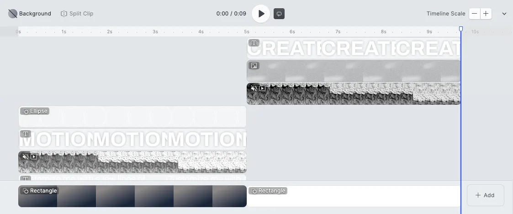

## AI-Powered Editing[#](#ai-powered-editing)

CE.SDK allows you to easily integrate AI tools directly into your video editing workflow. Users can generate images, videos, audio, and voiceovers from simple prompts — all from within the editor’s task bar, without switching tools or uploading external assets.

[Launch AI Editor Demo](https://img.ly/showcases/cesdk/ai-editor/web)

You can bring your own models or third-party APIs with minimal setup. AI tools can be added as standalone plugins, contextual buttons, or task bar actions.

## Supported Input Formats and Codecs[#](#supported-input-formats-and-codecs)

CE.SDK supports a wide range of video input formats and encodings, including:

| Category | Supported Formats |
| --- | --- |
| **Images** | `.png`, `.jpeg`, `.jpg`, `.gif`, `.webp`, `.svg`, `.bmp` |
| **Video** | `.mp4` (H.264/AVC, H.265/HEVC), `.mov` (H.264/AVC, H.265/HEVC) |
| **Audio** | `.mp3`, `.m4a`, `.mp4` (AAC or MP3), `.mov` (AAC or MP3) |

Need to import a format not listed here? CE.SDK allows you to create custom importers for any file type by using our Scene and Block APIs programmatically.

CE.SDK supports the most widely adopted video and audio codecs to ensure compatibility across platforms:

### **Video Codecs**[#](#video-codecs)

*   **H.264 / AVC** (in `.mp4`)
*   **H.265 / HEVC** (in `.mp4`, may require platform-specific support)

### **Audio Codecs**[#](#audio-codecs)

*   **MP3** (in `.mp3` or within `.mp4`)
*   **AAC** (in `.m4a` or within `.mp4` or `.mov`)

## Output and Export Options[#](#output-and-export-options)

You can export edited videos in several formats, with control over resolution, encoding, and file size:

| Category | Supported Formats |
| --- | --- |
| **Images** | `.png` (with transparency), `.jpeg`, `.webp`, `.tga` |
| **Video** | `.mp4` (H.264 or H.265 on supported platforms with limited transparency support) |
| **Print** | `.pdf` (supports underlayer printing and spot colors) |
| **Scene** | `.scene` (description of the scene without any assets) |
| **Archive** | `.zip` (fully self-contained archive that bundles the `.scene` file with all assets) |

Our custom cross-platform C++ based rendering and layout engine ensures consistent output quality across devices.

## UI-Based vs. Programmatic Editing[#](#ui-based-vs-programmatic-editing)

CE.SDK offers a fully interactive editor with intuitive UI tools for creators. At the same time, developers can build workflows entirely programmatically using the SDK API.

*   Use the UI to let users trim, arrange, and caption videos manually
*   Use the API to automate the assembly or editing of videos at scale

## Customization[#](#customization)

You can tailor the editor to match your product’s design and user needs:

*   Show or hide tools
*   Reorder UI elements and dock items
*   Apply custom themes, colors, or typography
*   Add additional plugin components

## Performance and File Size Considerations[#](#performance-and-file-size-considerations)

All editing operations are performed client-side. While this ensures user privacy and responsiveness, it introduces some limits:

| Constraint | Recommendation / Limit |
| --- | --- |
| **Resolution** | Up to **4K UHD** is supported for **playback** and **export**, depending on the user’s hardware and available GPU resources. For **import**, CE.SDK does not impose artificial limits, but maximum video size is bounded by the **32-bit address space of WebAssembly (wasm32)** and the **browser tab’s memory cap (~2 GB)**. |
| **Frame Rate** | 30 FPS at 1080p is broadly supported; 60 FPS and high-res exports benefit from hardware acceleration |
| **Duration** | Stories and reels of up to **2 minutes** are fully supported. Longer videos are also supported, but we generally found a maximum duration of **10 minutes** to be a good balance for a smooth editing experience and a pleasant export duration of around one minute on modern hardware. |

Performance scales with client hardware. For best results with high-resolution or high-frame-rate video, modern CPUs/GPUs with hardware acceleration are recommended.

---


[Source](http:/localhost:4321/js/overview-491658)

# Overview

In CE.SDK, _inserting media into a scene_ means placing visual or audio elements directly onto the canvas—images, videos, audio clips, shapes, or stickers—so they become part of the design. This differs from _importing assets_, which simply makes media available in the asset library.

This guide helps you understand how insertion works, how inserted media behave within scenes, and how to control them via UI or code. By the end, you’ll know how media are represented, modified, saved, and exported.

[Launch Web Demo](https://img.ly/showcases/cesdk)[

Get Started

](js/get-started/overview-e18f40/)

## Inserting Media vs. Importing Assets[#](#inserting-media-vs-importing-assets)

Before you can insert media into a scene, it must first be available to CE.SDK—this is where _importing_ comes in. Imported assets are added to the **Asset Library** (from local uploads, remote sources, etc.), where they become available for use.

_Inserting_ means placing those assets into the actual scene—either as the fill of a design block (like an image inside a rectangle), or as a standalone visual/audio layer. This process creates scene elements that users can see, move, style, and manipulate.

## How Media Is Handled in Scenes[#](#how-media-is-handled-in-scenes)

Internally, inserted media are structured as part of the scene graph. Most are represented as fills or as design blocks:

*   **Images and Videos** are typically inserted as _fills_ for graphic blocks or as independent blocks for visual layering.
*   **Audio** is inserted as a timeline-based media block, often invisible but timeline-active.
*   **Shapes and Stickers** are treated as standalone graphic blocks, with shape or vector fills.

Each inserted item is assigned an ID and properties such as position, size, and rotation, and can be queried or modified programmatically.

## Inserting Media[#](#inserting-media)

### Insert via the UI[#](#insert-via-the-ui)

You can insert media using the built-in CE.SDK interface. The most common methods are:

*   Drag-and-drop from the **Asset Library** into the canvas.
*   Clicking an asset in the panel to place it at the center of the scene.
*   Using context menus or toolbar buttons (e.g., “Add Image” or “Insert Audio”).

You can also configure the UI to show or hide certain media categories, allowing for tailored user experiences. See the **Customize Asset Library** guide for more on controlling visible media types.

### Insert Programmatically[#](#insert-programmatically)

Developers can insert media directly via the SDK. Whether you’re building a dynamic editor or triggering insertions via user input, CE.SDK exposes APIs for:

*   Creating a new design block and applying a media fill (e.g., image, video).
*   Controlling properties like position, size, rotation, opacity, and z-index.
*   Embedding logic to sync insertions with UI actions or backend data.

## Referencing Existing Assets[#](#referencing-existing-assets)

Once an asset is imported, you can reference it multiple times without re-importing. Reuse is based on:

*   **URI** (useful for remote assets)

When reusing an asset, you can apply different visual properties—each inserted instance can have its own size, position, rotation, or visual effects.

## Media Lifecycle Within a Scene[#](#media-lifecycle-within-a-scene)

Inserted media are part of the live scene graph and follow CE.SDK’s scene lifecycle:

*   **Saving a Scene**: Inserted media references (or embedded content) are included in the saved `.scene` or `.archive`.
*   **Reloading a Scene**: CE.SDK reconstructs the scene graph and fetches any required media URIs or binary data.
*   **Exporting**: Media may be embedded directly (e.g., for self-contained exports) or referenced externally (e.g., smaller file sizes, shared assets).

Keep in mind that media integrity on reload/export depends on how the asset was inserted—linked URIs must remain available, whereas embedded assets are bundled.

## Embedding vs. Linking Media[#](#embedding-vs-linking-media)

CE.SDK supports two strategies for handling inserted media:

| Mode | Description | Use Case |
| --- | --- | --- |
| **Referenced** (Scene Files) | Scene references the media via URI. | Smaller file sizes, shared asset use. |
| **Embedded** (Archives) | Media is stored directly in the saved archive. | Offline editing, portable scenes. |

**Embedded** media increase file size but ensure portability. **Referenced** media reduce storage needs but require external hosting. You can control this behavior when saving or exporting a scene.

---


[Source](http:/localhost:4321/js/outlines-b7820c)

# Outlines

---


[Source](http:/localhost:4321/js/open-the-editor-23a1db)

# Open the Editor

---


[Source](http:/localhost:4321/js/llms-txt-eb9cc5)

# LLMs.txt

Our documentation is now available in LLMs.txt format, optimized for AI reasoning engines. To better support platform-specific development, we’ve created separate documentation files for each platform.

For Vanilla JS developers, this means you can now access documentation tailored to your specific platform, whether it’s iOS, Android, Web, or any other supported platform. This approach allows for a more focused and efficient use of AI tools in your development workflow.

[

Download /js/llms-full.txt

](http://localhost:4321/js/llms-full.txt)

These documentation files are substantial in size, with token counts exceeding the context windows of many AI models. This guide explains how to download and effectively use these platform-specific documentation files with AI tools to accelerate your development process.

## What are LLMs.txt files?[#](#what-are-llmstxt-files)

LLMs.txt is an emerging standard for making documentation AI-friendly. Unlike traditional documentation formats, LLMs.txt:

*   Presents content in a clean, markdown-based format
*   Eliminates extraneous HTML, CSS, and JavaScript
*   Optimizes content for AI context windows
*   Provides a comprehensive view of documentation in a single file

By using our platform-specific LLMs.txt files, you’ll ensure that AI tools have the most relevant and complete context for helping with your development tasks.

## Handling Large Documentation Files[#](#handling-large-documentation-files)

Due to the size of our documentation files (upward of 500 000 tokens) most AI tools will face context window limitations. Standard models typically have context windows ranging from 8,000 to 200,000 tokens, making it challenging to process our complete documentation in a single session.

### Recommended AI Model for Full Documentation[#](#recommended-ai-model-for-full-documentation)

For working with our complete documentation files, we recommend:

*   **Gemini 2.5 Flash**: Available via Google AI Studio with a context window of 1-2 million tokens, capable of handling even our largest documentation file

---


[Source](http:/localhost:4321/js/licensing-8aa063)

# Licensing

Thanks for your interest in CreativeEditor SDK (CE.SDK).

We offer flexible commercial licensing options to support teams and projects of all sizes. Whether you’re building a new product or scaling an existing one, our goal is to provide the best creative editing experience—backed by a licensing model that aligns with your needs.

Get in touch with us through our [contact sales form](https://img.ly/forms/contact-sales).

## Commercial Licensing[#](#commercial-licensing)

CE.SDK is offered through a subscription-based commercial model. This allows us to:

*   Deliver ongoing updates and performance improvements
*   Ensure compatibility with new browsers and devices
*   Provide dedicated technical support
*   Build long-term partnerships with our customers

## How Licensing Works[#](#how-licensing-works)

CE.SDK licenses are tied to a single commercial product instance, verified by the hostname for web apps and bundle/app ID for mobile apps.

Licensing typically uses remote validation and includes lightweight event tracking. It’s possible to disable tracking or use offline-compatible options. To explore these options, [contact our sales team](https://img.ly/forms/contact-sales).

## Trial License Key[#](#trial-license-key)

Trial licenses are available for evaluation and testing and are valid for **30 days**. They provide full access to CE.SDK’s features so you can explore its capabilities in your environment.

If you need more time to evaluate, [contact our sales team](https://img.ly/forms/contact-sales).

## Testing and Production[#](#testing-and-production)

Paid license keys can be used across development, staging, and production environments. Multiple domains or app identifiers can be added to support this setup.

---


[Source](http:/localhost:4321/js/key-concepts-21a270)

# Key Concepts

CE.SDK is built on two distinct technical layers that work together seamlessly:

*   [User Interface](js/user-interface-5a089a/)
*   [Engine Interface](js/engine-interface-6fb7cf/)

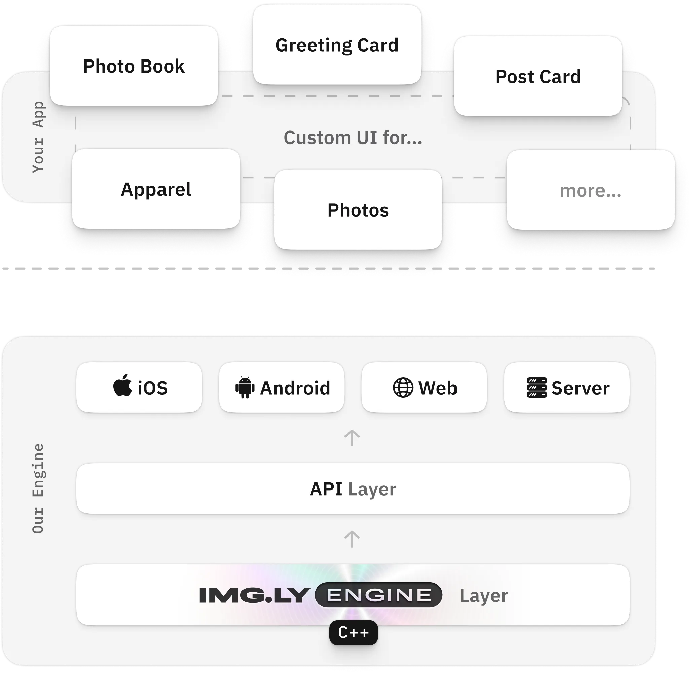

This intentional separation gives you powerful advantages:

1.  **Cross-platform consistency** – The engine is cross-compiled to native web, iOS, Android, and Node.js, ensuring identical output everywhere
2.  **Custom UI** – Build your own UI for simpler tools and workflows
3.  **Headless automation** – Run the engine independently for automations and batch processing, both client-side and server-side

## Creative Engine[#](#creative-engine)

The Creative Engine powers all core editing operations. It handles rendering, processing, and manipulation across images, layouts, text, video, audio, and vectors.

**What the Engine Does:**

*   Maintains the scene file (your structured content)
*   Renders the canvas in real-time
*   Handles block positioning and resizing
*   Applies filters and effects to images
*   Manages text editing and typography
*   Controls templates with role-based permissions
*   Displays smart guides and snap lines

Every engine capability is exposed through a comprehensive API, letting you build custom UIs, workflows, and automations.

## Headless / Engine only[#](#headless--engine-only)

Use the engine without any UI for powerful automation scenarios:

**Client-side automation** Perfect for in-browser batch operations and dynamic content generation without server dependencies.

**Server-side automation with Node.js** Use the [Node.JS SDK](node/what-is-cesdk-2e7acd/) for following scenarios:

*   **High-resolution processing** – Edit on the client with preview quality, then render server-side with full-resolution assets
*   **Bulk generation** – Create a large volume of design variations for variable data printing
*   **Non-blocking workflows** – Let users continue designing while exports process in the background

**Plugin development** When building [CE.SDK plugins](js/user-interface/ui-extensions-d194d1/), you get direct API access to manipulate canvas elements programmatically.

## User Interface Components[#](#user-interface-components)

CE.SDK includes pre-built UI configurations optimized for different use cases:

*   [Photo editing](js/prebuilt-solutions/photo-editor-42ccb2/)
*   [Video editing](js/prebuilt-solutions/video-editor-9e533a/)
*   [Design editing](js/prebuilt-solutions/design-editor-9bf041/) (similar to Canva)
*   2D product design ([apparel](js/prebuilt-solutions/t-shirt-designer-02b48f/), [postcards](js/prebuilt-solutions/postcard-editor-61e1f6/), etc.)

More configurations are coming based on customer needs.

## UI Customization[#](#ui-customization)

While UI configurations provide a solid foundation, you maintain control over the user experience:

*   Apply [custom color schemes](js/user-interface/customization/color-palette-429fd9/) and branding
*   Enable or disable [specific features](js/user-interface/customization/disable-or-enable-f058e2/)
*   Add [custom asset libraries](js/import-media/asset-library-65d6c4/) (fonts, images, graphics, videos, audio)
*   Extend functionality through the [plugin system](js/user-interface/ui-extensions-d194d1/) (e.g. adding [AI features](js/prebuilt-solutions/ai-editor-5409b9/), custom workflows, etc)

The plugin architecture lets you add custom buttons and panels throughout the interface, ensuring the editor feels native to your product.

---


[Source](http:/localhost:4321/js/key-capabilities-dbb5b1)

# Key Capabilities

This guide gives you a high-level look at what CreativeEditor SDK (CE.SDK) can do—and how deeply it can integrate into your workflows. Whether you’re building a design editor into your product, enabling automation, or scaling personalized content creation, CE.SDK provides a flexible and future-ready foundation.

[Launch Web Demo](https://img.ly/showcases/cesdk)

It’s designed for developers, product teams, and technical decision-makers evaluating how CE.SDK fits their use case.

*   100% client-side processing
*   Built from the ground up (not based on open-source libraries)
*   Flexible enough for both low-code and fully custom implementations

## Programmatic and UI-based[#](#programmatic-and-ui-based)

You get full control over how your users interact with CE.SDK.

*   Use the built-in UI for manual workflows
*   Call the same editing and rendering functionality programmatically
*   Combine both for hybrid use cases (e.g., users edit manually, backend creates variations)

Whether you’re serving designers or developers—or both—CE.SDK adapts to your product’s needs.

## Templates and Reusable Layouts[#](#templates-and-reusable-layouts)

Define reusable templates to simplify design creation. These templates support:

*   Role-based editing (lock/unlock elements based on user type)
*   Smart placeholders (predefined image/text drop zones)
*   Preset styles for consistent branding
*   Programmatic or user-driven updates

Templates make it easy to scale consistent design output while keeping editing intuitive.

## Automation and Dynamic Content[#](#automation-and-dynamic-content)

You can generate visuals automatically by combining templates with structured data.

Common use cases include personalized ads, localizations, product catalogs, or A/B testing. The SDK works in headless mode and supports batch workflows, making it easy to automate at scale.

## Multi-modal[#](#multi-modal)

CE.SDK supports a wide range of content types and formats:

*   Input types: images, video, audio, structured data, templates
*   Output formats: PNG, JPEG, WebP, MP4, PDF, raw data

All operations—including export—run client-side, ensuring fast performance and data privacy.

## AI Integration[#](#ai-integration)

Instantly bring best-in-class AI-powered image and video editing to your application with just a few lines of code. All tools run directly inside the existing editor interface—so users stay in the flow while benefiting from powerful automation.

Examples of what you can enable:

*   **Text to Image** – Use prompts to generate original visual content directly in the editor
*   **Text to Graphics** – Create crisp, scalable illustrations from simple text input
*   **Style Transfer** – Change the mood or style of an image while preserving its structure
*   **Create Variants** – Generate endless visual variations of a single subject for campaigns or personalization
*   **Image to Video** – Transform static images into dynamic motion content with a click
*   **Text to Speech** – Turn written copy into natural-sounding voiceovers, with control over tone and speed
*   **Smart Text Editing** – Rewrite or refine text using intelligent editing suggestions
*   **Swap Background** – Remove or replace backgrounds in seconds
*   **Add / Remove Objects** – Modify images with generative precision—no external tools required

These capabilities can be integrated connecting to any third-party AI model or API with minimal setup.

## Customizable UI[#](#customizable-ui)

The built-in interface is designed to be fully customizable:

*   Rearrange or rename tools
*   Apply theming and branding
*   Show/hide features based on user role
*   Add translations for international users

It works across desktop and mobile, and can be extended or replaced entirely if needed.

## Extensibility[#](#extensibility)

Need to add a custom feature or integrate with your backend? CE.SDK supports extensibility at multiple levels:

*   Custom UI components (or build a completely custom UI)
*   Backend data integrations (e.g., asset management systems)
*   Custom logic or validation rules
*   Advanced export workflows

The SDK’s plugin architecture ensures you can scale your functionality without rebuilding the core editor.

## Content Libraries[#](#content-libraries)

CE.SDK ships with a robust system for managing reusable content:

*   Built-in libraries of stickers, icons, overlays, and fonts
*   Integration with third-party providers like Getty Images, Unsplash, or Airtable
*   Programmatic filtering and categorization
*   Access assets from both code and UI
*   Organize by brand, user, or use case

This makes it easy to deliver a seamless editing experience—no matter how many assets you manage.

---


[Source](http:/localhost:4321/js/insert-media-a217f5)

# Insert Media Into Scenes

---


[Source](http:/localhost:4321/js/import-media-4e3703)

# Import Media

---


[Source](http:/localhost:4321/js/guides-8d8b00)

# Guides

---


[Source](http:/localhost:4321/js/filters-and-effects-6f88ac)

# Filters and Effects

---


[Source](http:/localhost:4321/js/fills-402ddc)

# Fills

---


[Source](http:/localhost:4321/js/file-format-support-3c4b2a)

# File Format Support

CreativeEditor SDK (CE.SDK) supports a wide range of modern file types for importing assets and exporting final content. Whether you’re working with images, videos, audio, documents, or fonts, CE.SDK provides a client-side editing environment with excellent media compatibility and performance—optimized for modern client-side hardware.

This guide outlines supported formats, codecs, and known limitations across media types.

## Importing Media[#](#importing-media)

| Category | Supported Formats |
| --- | --- |
| **Images** | `.png`, `.jpeg`, `.jpg`, `.gif`, `.webp`, `.svg`, `.bmp` |
| **Video** | `.mp4` (H.264/AVC, H.265/HEVC), `.mov` (H.264/AVC, H.265/HEVC) |
| **Audio** | `.mp3`, `.m4a`, `.mp4` (AAC or MP3), `.mov` (AAC or MP3) |

Need to import a format not listed here? CE.SDK allows you to create custom importers for any file type by using our Scene and Block APIs programmatically.

## Exporting Media[#](#exporting-media)

| Category | Supported Formats |
| --- | --- |
| **Images** | `.png` (with transparency), `.jpeg`, `.webp`, `.tga` |
| **Video** | `.mp4` (H.264 or H.265 on supported platforms with limited transparency support) |
| **Print** | `.pdf` (supports underlayer printing and spot colors) |
| **Scene** | `.scene` (description of the scene without any assets) |
| **Archive** | `.zip` (fully self-contained archive that bundles the `.scene` file with all assets) |

Our custom cross-platform C++ based rendering and layout engine ensures consistent output quality across devices.

## Importing Templates[#](#importing-templates)

| Format | Description |
| --- | --- |
| `.idml` | InDesign |
| `.psd` | Photoshop |
| `.scene` | CE.SDK Native |

Need to import a format not listed here? CE.SDK allows you to create custom importers for any file type by using our Scene and Block APIs to generate scenes programmatically.

## Font Formats[#](#font-formats)

| Format | Description |
| --- | --- |
| `.ttf` | TrueType Font |
| `.otf` | OpenType Font |
| `.woff` | Web Open Font Format |
| `.woff2` | Compressed Web Open Font Format 2 |

Fonts should be appropriately licensed before being embedded in your application.

## Video & Audio Codecs[#](#video--audio-codecs)

CE.SDK supports the most widely adopted video and audio codecs to ensure compatibility across platforms:

### **Video Codecs**[#](#video-codecs)

*   **H.264 / AVC** (in `.mp4`)
*   **H.265 / HEVC** (in `.mp4`, may require platform-specific support)

### **Audio Codecs**[#](#audio-codecs)

*   **MP3** (in `.mp3` or within `.mp4`)
*   **AAC** (in `.m4a` or within `.mp4` or `.mov`)

## Size Limits[#](#size-limits)

### Image Resolution Limits[#](#image-resolution-limits)

| Constraint | Recommendation / Limit |
| --- | --- |
| **Input Resolution** | Maximum input resolution is **4096×4096 pixels**. Images from external sources (e.g., Unsplash) are resized to this size before rendering on the canvas. You can modify this value using the `maxImageSize` setting. |
| **Output Resolution** | There is no enforced output resolution limit. Theoretically, the editor supports output sizes up to **16,384×16,384 pixels**. However, practical limits depend on the device’s GPU capabilities and available memory. |

All image processing in CE.SDK is handled client-side, so these values depend on the **maximum texture size** supported by the user’s hardware. The default limit of 4096×4096 is a safe baseline that works universally. Higher resolutions (e.g., 8192×8192) may work on certain devices but could fail on others during export if the GPU texture size is exceeded.

To ensure consistent results across devices, it’s best to test higher output sizes on your target hardware and set conservative defaults in production.

### Video Resolution & Duration Limits[#](#video-resolution--duration-limits)

| Constraint | Recommendation / Limit |
| --- | --- |
| **Resolution** | Up to **4K UHD** is supported for **playback** and **export**, depending on the user’s hardware and available GPU resources. For **import**, CE.SDK does not impose artificial limits, but maximum video size is bounded by the **32-bit address space of WebAssembly (wasm32)** and the **browser tab’s memory cap (~2 GB)**. |
| **Frame Rate** | 30 FPS at 1080p is broadly supported; 60 FPS and high-res exports benefit from hardware acceleration |
| **Duration** | Stories and reels of up to **2 minutes** are fully supported. Longer videos are also supported, but we generally found a maximum duration of **10 minutes** to be a good balance for a smooth editing experience and a pleasant export duration of around one minute on modern hardware. |

Performance scales with client hardware. For best results with high-resolution or high-frame-rate video, modern CPUs/GPUs with hardware acceleration are recommended.

---


[Source](http:/localhost:4321/js/export-save-publish-47e28a)

# Export, Save, and Publish

---


[Source](http:/localhost:4321/js/engine-interface-6fb7cf)

# Engine Interface

The Creative Engine is the powerhouse behind CE.SDK’s cross-platform capabilities. While the UI components provide ready-to-use editing experiences, the Engine interface gives you direct programmatic control over all creative operations—from simple batch processing to complex automated workflows.

## Client-Side vs Server-Side Processing[#](#client-side-vs-server-side-processing)

Understanding when to use client-side versus server-side processing is crucial for building efficient creative automation workflows. Each approach offers distinct advantages depending on your use case requirements.

### Client-Side Processing (Browser / Mobile Device)[#](#client-side-processing-browser--mobile-device)

Client-side processing runs the Engine directly in the user’s client — but importantly, this doesn’t mean visible to the user. The Engine operates headlessly in the background, making it perfect for automation tasks that enhance user experience without interrupting their workflow.

**Common Implementation Patterns:**

**Hidden Engine Instances**: Run a second, invisible Engine instance alongside your main UI for background processing. While users edit in the primary interface, the hidden instance can validate designs, generate previews, or prepare export-ready assets.

```
// Hidden engine for background automationconst backgroundEngine = await CreativeEngine.init({  container: null, // Headless - no UI container  license: 'your-license-key',});
// Use background engine for validation while user continues editingasync function validateDesignInBackground(sceneData) {  await backgroundEngine.scene.loadFromString(sceneData);  const issues = await runDesignValidation(backgroundEngine);  return issues;}
```

**Underlying Engine Access**: Access the Engine API directly from prebuilt UI components for custom automation within existing workflows.

**Dedicated Engine Packages**: Use platform-specific Engine packages (Web, iOS, Android) for specialized client-side automation without any UI overhead.

**Ideal Client-Side Use Cases:**

*   **Design Validation**: Check for empty placeholders, low-resolution images, or brand guideline violations in real-time
*   **Thumbnail Generation**: Create preview images for design galleries or version history
*   **Effect Previews**: Generate quick previews of filters or effects before applying them to the main design
*   **Auto-Save Optimization**: Compress and optimize scenes for storage while maintaining editability
*   **Real-Time Feedback**: Provide instant visual feedback for design rules or constraints

```
// Example: Real-time thumbnail generationconst thumbnailEngine = await CreativeEngine.init({ container: null });
async function generateThumbnail(sceneData) {  await thumbnailEngine.scene.loadFromString(sceneData);  const page = thumbnailEngine.scene.getPages()[0];
  // Generate small preview  const thumbnail = await thumbnailEngine.block.export(page, 'image/jpeg', {    targetWidth: 200,    targetHeight: 200,    quality: 0.7,  });
  return thumbnail;}
// Use during design process for gallery viewsdesignHistory.forEach(async version => {  const thumb = await generateThumbnail(version.sceneData);  updateGalleryThumbnail(version.id, thumb);});
```

### Server-Side Processing (Node.js)[#](#server-side-processing-nodejs)

Server-side processing using our [Node.JS SDK](node/what-is-cesdk-2e7acd/) moves the Engine to your backend infrastructure, unlocking powerful capabilities for resource-intensive operations and scalable workflows.

**Key Advantages:**

*   **Enhanced Resources**: Access to more CPU, memory, and storage than client devices
*   **Parallelizable Workflows**: Run multiple Engine instances simultaneously for bulk processing
*   **Secure Asset Access**: Process private assets without exposing them to client-side code
*   **Background Operations**: Handle long-running tasks without affecting user experience
*   **Scheduled Automation**: Trigger design generation based on events, schedules, or external APIs

**Ideal Server-Side Use Cases:**

*   **High-Resolution Exports**: Generate print-quality assets that would be too resource-intensive for client devices
*   **Bulk Generation**: Create thousands of design variations for marketing campaigns or product catalogs
*   **Data Pipeline Integration**: Connect to databases, APIs, or file systems for automated content generation
*   **Multi-Format Output**: Export designs in multiple formats and resolutions simultaneously
*   **Workflow Orchestration**: Coordinate complex multi-step automation processes

**Hybrid Workflows**: Often, the most effective approach combines both client and server-side processing. Users can design and preview on the client with instant feedback, while heavy processing happens on the server in the background.

## Engine-Powered Use Cases[#](#engine-powered-use-cases)

The Engine interface unlocks [powerful automation scenarios](js/automation/overview-34d971/) that can scale creative workflows:

### Batch Processing[#](#batch-processing)

Process multiple designs simultaneously with consistent results. Whether you’re applying filters to hundreds of images or generating variations of a marketing template, the Engine handles bulk operations efficiently both client-side and server-side.

```
// Example: Batch apply filters to multiple imagesfor (const imageData of imageCollection) {  const page = engine.scene.createPage();  const image = engine.block.create('image');  engine.block.setString(image, 'image/imageFileURI', imageData.url);
  // Apply consistent filters  const filter = engine.block.createEffect('filter');  engine.block.appendChild(image, filter);
  // Export processed result  const result = await engine.block.export(page, 'image/png');}
```

### Auto-Resize[#](#auto-resize)

Automatically adapt designs to different aspect ratios and platforms. The Engine intelligently repositions elements, adjusts text sizes, and maintains visual hierarchy across formats—from Instagram stories to LinkedIn posts.

### Data Merge[#](#data-merge)

Connect external data sources (CSV, JSON, APIs) to templates for personalized content generation. Perfect for creating thousands of product cards, personalized certificates, or location-specific campaigns.

```
// Example: Merge product data into templateconst productData = await fetch('/api/products').then(r => r.json());
for (const product of productData) {  // Load template  const scene = await engine.scene.loadFromURL('/templates/product-card.scene');
  // Replace placeholder content  engine.block.setString(titleBlock, 'text/text', product.name);  engine.block.setString(priceBlock, 'text/text', `$${product.price}`);  engine.block.setString(imageBlock, 'image/imageFileURI', product.imageUrl);
  // Export personalized design  const output = await engine.block.export(page, 'image/png');}
```

### Product Variations[#](#product-variations)

Generate multiple versions of product designs with different colors, sizes, or configurations. Ideal for e-commerce platforms needing to showcase product options without manual design work.

### Design Generation[#](#design-generation)

Create entirely new designs programmatically based on rules, templates, or AI inputs. The Engine can compose layouts, select appropriate fonts, and arrange elements according to your design guidelines. See the [full guide](js/automation/design-generation-98a99e/) for details.

### Multiple Image Generation[#](#multiple-image-generation)

Efficiently process and export designs in various formats and resolutions. Generate web-optimized previews alongside print-ready high-resolution files in a single workflow.

### Actions[#](#actions)

Implement complex multi-step operations as reusable actions. Chain together filters, transformations, and exports to create sophisticated automated workflows that can be triggered programmatically.

---


[Source](http:/localhost:4321/js/edit-video-19de01)

# Edit Videos

---


[Source](http:/localhost:4321/js/edit-image-c64912)

# Edit Image

---


[Source](http:/localhost:4321/js/create-video-c41a08)

# Create Videos

---


[Source](http:/localhost:4321/js/create-templates-3aef79)

# Create Templates

---


[Source](http:/localhost:4321/js/create-composition-db709c)

# Create Compositions

---


[Source](http:/localhost:4321/js/conversion-c3fbb3)

# Conversion

---


[Source](http:/localhost:4321/js/configuration-2c1c3d)

# Configuration

The CreativeEditor SDK (CE.SDK) works out of the box with almost zero configuration effort. However, almost every part of CE.SDK can be adapted and its behaviour and look & feel changed.

Here is a list of all available configuration options:

| Key | Type | Description |
| --- | --- | --- |
| baseURL | `string` | Definition of the the base URL of all assets required by the SDK. |
| callbacks | `object` | Definition of callbacks the SDK triggers. |
| i18n | `object` | Options to add custom translations to the SDK. |
| license | `string` | A license key that is unique to your product. |
| userID | `string` | An unique ID tied to your application’s user. This helps us accurately calculate monthly active users (MAU). Especially useful when one person uses the app on multiple devices with a sign-in feature, ensuring they’re counted once. Providing this aids in better data accuracy. |
| locale | `string` | Chosen language the editor is . Possible values are ‘en’, ‘de’, … |
| role | `string` | Chosen role. Possible values are ‘Creator’ or ‘Adopter’. |
| theme | `string` | The theme the SDK is launched in. Possible values are ‘dark’, ‘light’. |
| ui | `object` | Options to adapt the user interface elements. |
| defaultFont | `string` | An ID of the font asset source to be set as a default font. Set to ‘//ly.img.cesdk.fonts/roboto\_regular’ by default. |

```
import CreativeEditorSDK from 'https://cdn.img.ly/packages/imgly/cesdk-js/1.57.0/index.js';
const config = {  license: 'YOUR_API_KEY',  userId: 'USER_ID',  baseURL: 'https://cdn.img.ly/packages/imgly/cesdk-js/1.57.0/assets',  locale: 'en', // 'de'  theme: 'light', // 'dark'  role: 'Creator', // 'Adopter' 'Viewer'  callbacks: { onUpload: 'local' }, // Enable local uploads in Asset Library.  logger: (message, logLevel) => {    console.log(`${logLevel}: ${message}}`);  },};
CreativeEditorSDK.create('#cesdk_container', config).then(async instance => {  // Populate the asset library with default / demo asset sources.  instance.addDefaultAssetSources();  instance.addDemoAssetSources({ sceneMode: 'Design' });
  await instance.createDesignScene();});
```

---


[Source](http:/localhost:4321/js/concepts-b9153a)

# Concepts

---


[Source](http:/localhost:4321/js/compatibility-139ef9)

# System Compatibility

CE.SDK runs entirely on clients and makes use of hardware acceleration provided within that environment. Therefore, the user’s hardware always acts as an upper bound of what’s achievable.

The editor’s performance scales with scene complexity. We generally found scenes with up to 200 blocks well usable, but complex blocks like auto-sizing text or high-resolution image fills may affect performance negatively. This is always constrained by the processing power available on the user’s device, so for low-end devices, the experience may suffer earlier. Therefore, it’s generally desirable to keep scenes only as complex as needed.

## Hardware Limitations[#](#hardware-limitations)

Each device has a limited amount of high performance hardware decoders and encoders. If the maximum number is reached it will fall back to (slow) software de- and encoding. Therefore users may encounter slow export performance when trying to export in parallel with other software that utilizes encoders and decoders, e.g. Zoom, Teams or video content in other tabs / apps. This, unfortunately, is a limitation of hardware, operating system and browser and cannot be solved.

## Recommended Hardware[#](#recommended-hardware)

| Platform | Hardware |
| --- | --- |
| Desktop | A notebook or desktop released in the last 7 years and at least 4GB of memory. |
| Mobile (Apple) | iPhone 8, iPad (6th gen) or newer |
| Mobile (Android) | Phones & tablets released in the last 4 years |

## Video[#](#video)

Our video feature introduces additional requirements and we generally distinguish playback (decoding) and export (encoding) capabilities. On the web, certain browser features directly depend on the host operating system. For video, this currently introduces the following limitations:

*   Transparency in H.265 videos is **not supported** on Windows hosts.
*   **Chrome on Linux** generally doesn’t ship with encoder support for H.264 & AAC, which can cause video exports to fail even though decoding of non-free codecs is supported.
*   **Chromium** although technically the base of Chrome doesn’t include any codecs for licensing reasons and therefore can’t be used for video editing. It does fall back to system-provided media libraries on e.g. macOS, but support is not guaranteed in any way.
*   Video is **not supported** on mobile browsers on any platform due to technical limitations which result in performance issues.

## Export Limitations[#](#export-limitations)

The export size is limited by the hardware capabilities of the device, e.g., due to the maximum texture size that can be allocated. The maximum possible export size can be queried via API, see [export guide](js/export-save-publish/export/overview-9ed3a8/).

---


[Source](http:/localhost:4321/js/colors-a9b79c)

# Colors

---


[Source](http:/localhost:4321/js/automation-715209)

# Automate Workflows

---


[Source](http:/localhost:4321/js/browser-support-28c1b0)

# Browser Support

The CreativeEditor SDK requires specific APIs to fully function. For video-related features, the required APIs are only supported in certain browsers. As a result, the list of supported browsers is currently limited to the following:

| Supported Browser | Image and Photo Editor | Video Editor |
| --- | --- | --- |
| Chrome | **114** or newer | **114** or newer |
| Chrome Android | **114** or newer | not supported |
| Chrome iOS | **114** or newer (on iOS/iPadOS 15 or newer) | not supported |
| Edge | **114** or newer | **114** or newer |
| Firefox | **115** or newer | not supported |
| Safari | **15.6** or newer | not supported |
| Safari iOS | **15.6** or newer (on iOS/iPadOS 15 or newer) | not supported |

For our video features, unsupported browsers will display a warning dialog informing about them not supported when they are being used to access CE.SDK video functionality.

While other browsers based on the Chromium project might work fine (Arc, Brave, Opera, Vivaldi etc.) they are not officially supported.

## Host Platform Restrictions[#](#host-platform-restrictions)

All supported browsers rely on the host’s platform APIs for different kind of functionality (e.g. video support). Check our [known editor limitations](js/compatibility-139ef9/) for more details on these.

---


[Source](http:/localhost:4321/js/animation-ce900c)

# Animation

---


[Source](http:/localhost:4321/js/user-interface/ui-extensions-d194d1)

# UI Extensions

---


[Source](http:/localhost:4321/js/user-interface/overview-41101a)

# Overview

The CreativeEditor SDK (CE.SDK) includes a powerful, fully-integrated user interface that enables your users to create, edit, and export stunning designs—without requiring you to build a UI from scratch. Whether you’re launching a full-featured editor or embedding design tools into a larger application, CE.SDK provides everything you need to get started quickly.

Out of the box, the UI is professional, responsive, and production-ready. But it’s not a one-size-fits-all solution. You can fully **customize**, **extend**, or even **replace the UI entirely** with your own interface built on top of the CE.SDK engine. The SDK is designed to be as flexible as your product demands.

[Launch Web Demo](https://img.ly/showcases/cesdk)[

Get Started

](js/get-started/overview-e18f40/)

## Architecture[#](#architecture)

CE.SDK’s UI is modular, declaratively configured, and tightly integrated with the core engine. At a high level, it consists of:

*   **Core Engine APIs** — The underlying logic for manipulating scenes, blocks, assets, and rendering
*   **UI Components** — Panels, bars, buttons, and menus that interact with the engine through configuration and callbacks
*   **Event System** — A reactive layer that tracks user input, selections, and state transitions

This separation of concerns allows you to extend, replace, or completely rebuild the UI without impacting the rendering and scene logic handled by the engine.

## Default UI[#](#default-ui)

When you initialize CE.SDK in your project, it includes a preconfigured interface with all the essential components you need:

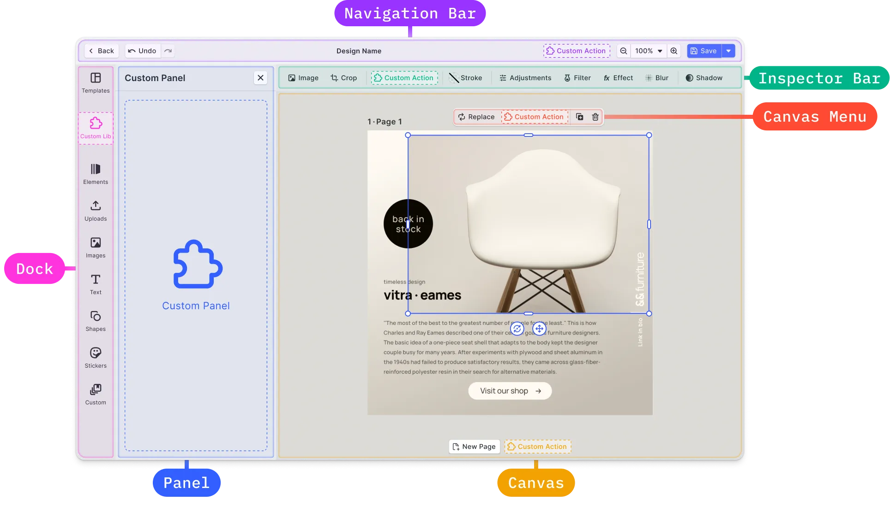

### Canvas[#](#canvas)

The canvas is the main area of the editor where the user interacts with design content. This part is completely controlled by the Creative Engine. It is basically the core of CE.SDK and the web editor is build around it. This is also the part you need to interact with if you want to create a complete custom UI and not use the web editor.

### Dock[#](#dock)

The dock is the main entry point for user interactions not directly related to the currently selected block. It occupies a prominent place in the editor and is primarily, though not exclusively, used to open panels with asset libraries. Therefore, the default and recommended position of the asset library panel is on the side of the dock. However, depending on the use case, it might be beneficial to add other buttons and functionalities (even block-specific ones) to highlight them due to the prominence of the dock.

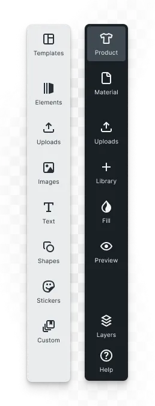

### Canvas Menu[#](#canvas-menu)

For every selected block on the canvas, the canvas menu appears either above or below the frame of the selected block. This menu provides the most important block-specific actions and settings, ensuring they are immediately visible to the user. It is recommended to add as few elements as possible to the canvas menu to keep it clean and focused.


### Inspector Bar[#](#inspector-bar)

The main location for block-specific functionality is the inspector bar. Any action or setting available to the user for the currently selected block that does not appear in the canvas menu should be added here.

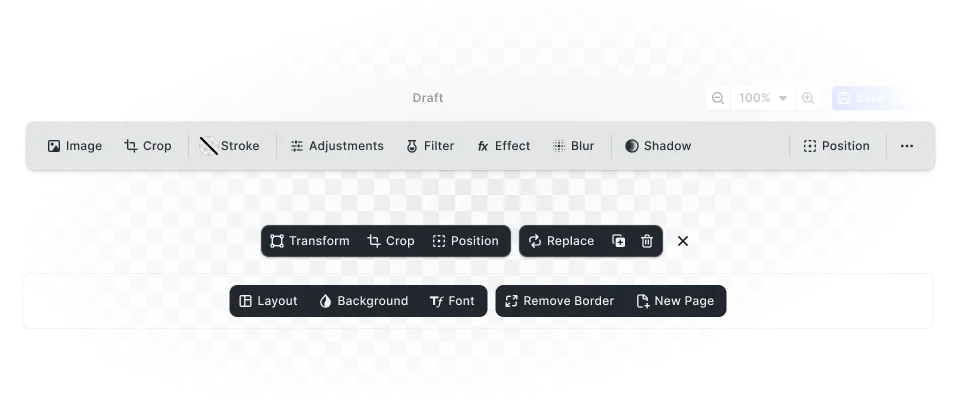

### Navigation Bar[#](#navigation-bar)

Actions that affect browser navigation (e.g. going back or closing the editor), have global effects on the scene (e.g. undo/redo and zoom), or process the scene in some way (e.g. saving and exporting) should be placed in the navigation bar.

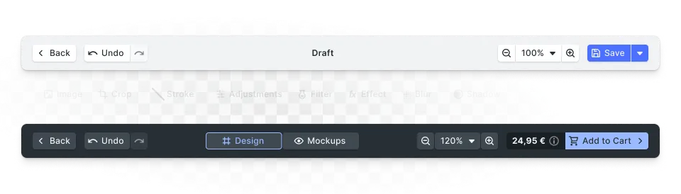

### Canvas Bar[#](#canvas-bar)

The canvas bar is intended for actions that affect the canvas or scene as a whole. Undo/redo or zoom controls can be placed here as an alternative to the navigation bar.

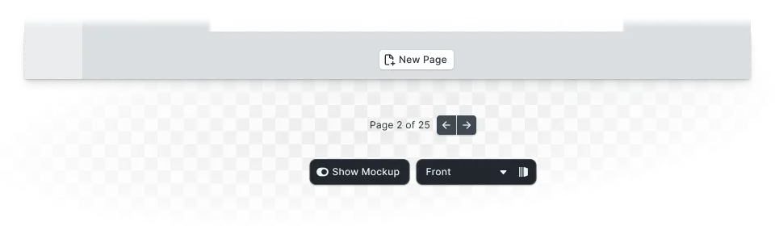

Each of these elements can be customized, removed, rearranged, or extended using the SDK’s UI configuration and plugin APIs.

### Panel[#](#panel)

Panels are flexible UI containers designed to support more advanced and interactive functionality within the editor. Unlike quick actions, which focus on single-click operations, panels give you the space and flexibility to build full user interfaces around complex workflows. You can use panels to:

#### Walk Users Through Workflows[#](#walk-users-through-workflows)

Use panels to guide users step by step through a process—whether it’s customizing a template, setting up a product variation, or configuring export settings. Panels help ensure clarity and structure in more involved tasks.

#### Connect with External APIs or AI Services[#](#connect-with-external-apis-or-ai-services)

While quick actions are great for simple integrations, some features—like AI-powered design generation or third-party content retrieval—require user input or multi-step interaction. Panels let you build richer interfaces that connect with external services and present results directly in the editor.

#### Gather Detailed User Input[#](#gather-detailed-user-input)

Panels are ideal for collecting structured input, such as text, color choices, image uploads, or toggle options. You can use them to power advanced use cases like custom theming, batch updates, or conditional logic based on user selections.

## Customizing the UI[#](#customizing-the-ui)

You can tailor the editor’s interface to match your brand and use case. CE.SDK provides flexible APIs and configuration options for customizing:

### Appearance[#](#appearance)

*   Change the UI theme or colors
*   Use custom fonts and icons
*   Localize labels and messages

### Layout[#](#layout)

*   Show or hide components based on context
*   Reorder buttons or entire sections
*   Rearrange dock elements or panel positions

### Behavior[#](#behavior)

*   Enable or disable specific features
*   Apply feature-based logic (e.g., show certain tools only for certain block types)

## Extending the UI[#](#extending-the-ui)

In addition to customizing what’s already there, you can **add entirely new functionality** to the UI:

*   **Quick Actions** — One-click tools that perform fast edits (e.g., remove background)
*   **Custom Buttons** — Add buttons to the dock, canvas menu, or canvas bar
*   **Custom Panels** — Create complex UIs to support advanced workflows like export wizards or AI tools
*   **Third-Party Integrations** — Connect with external APIs, such as QR generators or content management systems

Use the **Plugin API** to encapsulate these enhancements into portable, declarative extensions. These plugins can be dynamically loaded, reused across projects, and even distributed.

> Tip: You don’t need to use the Plugin API to modify the UI—but it’s the best approach when you want to encapsulate logic, reuse it, or offer it to others.

## Building Your Own UI[#](#building-your-own-ui)

While CE.SDK includes a fully-featured UI by default, you’re not locked into it. Many developers choose to **build a completely custom UI** on top of the CE.SDK engine. This approach gives you full control over layout, interaction patterns, and visual design.

When building your own UI, you interact directly with:

*   **The CE.SDK Engine** — Use the core APIs to manage scenes, create or modify blocks, control playback, and export content
*   **Canvas Rendering** — Render and manipulate the canvas area within your application shell
*   **State and Events** — Observe selections, listen for changes, and update your UI reactively

This approach is ideal when:

*   You need tight integration with a larger application or workflow
*   You want to match a highly specific design system
*   You’re building for a unique form factor or device
*   You need to simplify the UI dramatically for a focused use case

## Integrating with Custom Workflows[#](#integrating-with-custom-workflows)

The CE.SDK UI isn’t a closed system—it plays well with your broader application logic and workflows.

You can:

*   **Sync programmatic state** — Reflect external data (e.g., product names or image URLs) directly in the editor
*   **Control headless rendering** — Run the engine without the UI for automation or server-side rendering
*   **Trigger external logic** — Connect UI actions (like export) to your own backend services

The UI components can be programmatically configured, replaced, or completely bypassed depending on your needs. Whether you’re creating a collaborative editor, running batch jobs, or embedding CE.SDK in a no-code platform, you have full control over how the UI interacts with your app.

## Small Viewports[#](#small-viewports)

By default, CreativeEditor SDK is configured to use an optimized layout for small viewports.

The UI of the CreativeEditor SDK seamlessly adjusts to the available space, much like any other modern web application, without sacrificing functionality. Moreover, it provides a certain degree of customizability, allowing you to tailor the behavior of the UI to your specific needs.

This layout changes the UI to:

*   Render the dock on the bottom
*   Open all panels from the bottom, taking up the bottom half of the screen
*   Use the [large UI scaling](js/user-interface/appearance/theming-4b0938/)

All configuration options related to the panel layout are ignored in favor of the layout optimization for small viewports as described above.

---


[Source](http:/localhost:4321/js/user-interface/localization-508e20)

# Localization

```
import CreativeEditorSDK from 'https://cdn.img.ly/packages/imgly/cesdk-js/1.57.0/index.js';
const config = {  license: 'mtLT-_GJwMhE7LDnO8KKEma7qSuzWuDxiKuQcxHKmz3fjaXWY2lT3o3Z2VdL5twm',  userId: 'guides-user',  locale: 'fr',  i18n: {    fr: {      'common.back': 'Retour',      'meta.currentLanguage': 'Français'    },    it: {      'common.back': 'Indietro',      'meta.currentLanguage': 'Italiano'    }  },  ui: {    elements: {      navigation: {        action: {          back: true // Enable 'Back' button to show translation label.        }      },      panels: {        settings: true // Enable Settings panel for switching languages.      }    }  },  callbacks: { onUpload: 'local' } // Enable local uploads in Asset Library.};
CreativeEditorSDK.create('#cesdk_container', config).then(async (instance) => {  // Populate the asset library with default / demo asset sources.  instance.addDefaultAssetSources();  instance.addDemoAssetSources({ sceneMode: 'Design' });  await instance.createDesignScene();
  const currentLocale = instance.i18n.getLocale();  console.log({ currentLocale }); // Output: "fr"
  instance.i18n.setLocale('it');  const updatedLocale = instance.i18n.getLocale();  console.log({ updatedLocale }); // Output: "it"
  instance.i18n.setTranslations({    hr: {      'common.back': 'Poništi',      'meta.currentLanguage': 'Hrvatski'    },    sv: {      'common.back': 'Ångra',      'meta.currentLanguage': 'Svenska'    }  });});
```

```
<!DOCTYPE html><html lang="en">  <head>    <meta charset="UTF-8" />    <meta name="viewport" content="width=device-width, initial-scale=1.0" />    <meta http-equiv="X-UA-Compatible" content="ie=edge" />    <style>      body {        margin: 0;        overflow: hidden;      }      html {        overscroll-behavior-x: contain;      }    </style>  </head>
  <body>    <div id="cesdk_container" style="width: 100%; height: 100vh"></div>    <script type="module" src="index.js">    </script>  </body></html>
```

The CE.SDK editor includes an internationalization API that facilitates locale configuration management during runtime.

## I18N Configuration[#](#i18n-configuration)

*   `locale: string` defines the default language of the user interface. This can later be changed in the editor customization panel. The CE.SDK currently ships with locales for English `en` and German `de`. Additional languages will be available in the future. Until then, or if you want to provide custom wording and translations, you can provide your own translations under the `i18n` configuration option, as described in the next paragraph.

```
locale: 'fr',
```

*   `i18n: Object` is a map of strings that define the translations for multiple locales. Since the CE.SDK supports maintaining multiple locales at the same time, the first key in the map must always be the locale the translation is targeting. In this example, we change the back-button label for the locales `'fr'` and `'it'`.
    
    Please note that the fallback locale is `'en'`. So, with this configuration, the complete user interface would be English except for the back-button. Also, if you want to change a single label for one of our shipped translations, you do not have to add all keys, but only the one you want to override.
    
    A detailed overview of all available keys can be found in form of predefined language files inside `assets/i18n`. You can download the English version from our CDN here: [en.json](https://cdn.img.ly/packages/imgly/cesdk-js/1.57.0/assets/i18n/en.json)
    

```
i18n: {  fr: {    'common.back': 'Retour',    'meta.currentLanguage': 'Français'  },  it: {    'common.back': 'Indietro',    'meta.currentLanguage': 'Italiano'  }
```

*   Under the special key `meta.currentLanguage`, you should provide a short label for your provided language. This will be used to display the language in the language select dropdown of the editor customization panel.

```
'meta.currentLanguage': 'Français'
```

Here’s the full code:

```
const config = {  license: 'mtLT-_GJwMhE7LDnO8KKEma7qSuzWuDxiKuQcxHKmz3fjaXWY2lT3o3Z2VdL5twm',  userId: 'guides-user',  locale: 'fr',  i18n: {    fr: {      'common.back': 'Retour',      'meta.currentLanguage': 'Français'    },    it: {      'common.back': 'Indietro',      'meta.currentLanguage': 'Italiano'    }  },  ui: {    elements: {      navigation: {        action: {          back: true // Enable 'Back' button to show translation label.        }      },      panels: {        settings: true // Enable Settings panel for switching languages.      }    }  },  callbacks: { onUpload: 'local' } // Enable local uploads in Asset Library.};
```

## I18N API[#](#i18n-api)

Internationalisation can also be handled during runtime with a complementary set of APIs.

*   `cesdk.i18n.getLocale(): string` returns the currently set locale string, e.g. `"en"` for our default english locale.

```
const currentLocale = instance.i18n.getLocale();console.log({ currentLocale }); // Output: "fr"
```

*   `cesdk.i18n.setLocale(locale: string)` updates the locale to the string passed in as `locale` parameter. This is either one of our predefined strings (`"en"` for english or `"de"` for german) or any additionally configured locales.

```
instance.i18n.setLocale('it');const updatedLocale = instance.i18n.getLocale();console.log({ updatedLocale }); // Output: "it"
```

*   `cesdk.i18n.setTranslations(definition: { [locale: string]: object })` adds an object with translations to CE.SDK. This has the same format as the above described `i18n` configuration object.

```
instance.i18n.setTranslations({  hr: {    'common.back': 'Poništi',    'meta.currentLanguage': 'Hrvatski'  },  sv: {    'common.back': 'Ångra',    'meta.currentLanguage': 'Svenska'  }});
```

---


[Source](http:/localhost:4321/js/user-interface/events-514b70)

# UI Events

```
import CreativeEditorSDK from 'https://cdn.img.ly/packages/imgly/cesdk-js/1.57.0/index.js';
const config = {  license: 'mtLT-_GJwMhE7LDnO8KKEma7qSuzWuDxiKuQcxHKmz3fjaXWY2lT3o3Z2VdL5twm',  userId: 'guides-user',  baseURL: 'https://cdn.img.ly/packages/imgly/cesdk-js/1.57.0/assets',  callbacks: {    onUnsupportedBrowser: () => {      /* This is the default window alert which will be shown in case an unsupported       * browser tries to run CE.SDK */      window.alert(        'Your current browser is not supported.\nPlease use one of the following:\n\n- Mozilla Firefox 115 or newer\n- Apple Safari 15.6 or newer\n- Microsoft Edge 114 or newer\n- Google Chrome 114 or newer'      );    },    onBack: () => {      window.alert('Back callback!');    },    onClose: () => {      window.alert('Close callback!');    },    onSave: (scene) => {      window.alert('Save callback!');      console.info(scene);    },    onDownload: (scene) => {      window.alert('Download callback!');      console.info(scene);    },    onLoad: () => {      window.alert('Load callback!');      const scene = '...'; // Fill with sene      return Promise.resolve(scene);    },    onExport: (blobs, options) => {      window.alert('Export callback!');      console.info(options.mimeType);      console.info(options.jpegQuality);      console.info(options.pages);      return Promise.resolve();    },    onUpload: (file, onProgress) => {      window.alert('Upload callback!');      const newImage = {        id: 'exampleImageIdentifier',        meta: {          uri: 'https://YOURSERVER/images/file.jpg',          thumbUri: 'https://YOURSERVER/images/thumb.jpg'        }      };      return Promise.resolve(newImage);    }  },  ui: {    elements: {      navigation: {        action: {          close: true,          back: true,          save: true,          download: true,          load: true,          export: true        }      }    }  }};
CreativeEditorSDK.create('#cesdk_container', config).then(async (instance) => {  // Do something with the instance of CreativeEditor SDK, for example:  // Populate the asset library with default / demo asset sources.  instance.addDefaultAssetSources();  instance.addDemoAssetSources({ sceneMode: 'Design' });  await instance.createDesignScene();});
```

```
<!DOCTYPE html><html lang="en">  <head>    <meta charset="UTF-8" />    <meta name="viewport" content="width=device-width, initial-scale=1.0" />    <meta http-equiv="X-UA-Compatible" content="ie=edge" />    <style>      body {        margin: 0;        overflow: hidden;      }      html {        overscroll-behavior-x: contain;      }    </style>  </head>
  <body>    <div id="cesdk_container" style="width: 100%; height: 100vh"></div>    <script type="module" src="index.js">    </script>  </body></html>
```

In this example, we will show you how to configure the [CreativeEditor SDK](https://img.ly/products/creative-sdk).

## Callbacks[#](#callbacks)

The CE.SDK offers several different callbacks that are triggered by user interaction. Follow this guide to see some examples with descriptions.

```
callbacks: {  onUnsupportedBrowser: () => {    /* This is the default window alert which will be shown in case an unsupported     * browser tries to run CE.SDK */    window.alert(      'Your current browser is not supported.\nPlease use one of the following:\n\n- Mozilla Firefox 115 or newer\n- Apple Safari 15.6 or newer\n- Microsoft Edge 114 or newer\n- Google Chrome 114 or newer'    );  },  onBack: () => {    window.alert('Back callback!');  },  onClose: () => {    window.alert('Close callback!');  },  onSave: (scene) => {    window.alert('Save callback!');    console.info(scene);  },  onDownload: (scene) => {    window.alert('Download callback!');    console.info(scene);  },  onLoad: () => {    window.alert('Load callback!');    const scene = '...'; // Fill with sene    return Promise.resolve(scene);  },  onExport: (blobs, options) => {    window.alert('Export callback!');    console.info(options.mimeType);    console.info(options.jpegQuality);    console.info(options.pages);    return Promise.resolve();  },  onUpload: (file, onProgress) => {    window.alert('Upload callback!');    const newImage = {      id: 'exampleImageIdentifier',      meta: {        uri: 'https://YOURSERVER/images/file.jpg',        thumbUri: 'https://YOURSERVER/images/thumb.jpg'      }    };    return Promise.resolve(newImage);  }},
```

In this example, all corresponding navigational elements in the user interface are enabled so that the callbacks can be tested.

```
navigation: {  action: {    close: true,    back: true,    save: true,    download: true,    load: true,    export: true  }}
```

### General[#](#general)

*   `onUnsupportedBrowser: () => void` will be triggered when the browser version or type is [unsupported](js/browser-support-28c1b0/). If this handle is not configured, CE.SDK shows a native `window.alert` explaining that the current browser is unsupported and showing the list of supported ones. Alternatively a \[separate method can be imported and used to check browser support\](../shared/\_partials/integrate-with-vanilla-js.

```
onUnsupportedBrowser: () => {  /* This is the default window alert which will be shown in case an unsupported   * browser tries to run CE.SDK */  window.alert(    'Your current browser is not supported.\nPlease use one of the following:\n\n- Mozilla Firefox 115 or newer\n- Apple Safari 15.6 or newer\n- Microsoft Edge 114 or newer\n- Google Chrome 114 or newer'  );},
```

### Navigation[#](#navigation)

*   `onBack: () => void | Promise<void>` allows the registration of a function that is called when the `back` action is triggered by the user. When a `Promise<void>` is returned, a loading indicator will be shown on the ‘Back’-button until the Promise resolves.

```
onBack: () => {  window.alert('Back callback!');},
```

*   `onClose: () => void | Promise<void>` allows the registration of a function that is called when the `close` action is triggered by the user. When a `Promise<void>` is returned, a loading indicator will be shown on the ‘Close’-button until the Promise resolves.

```
onClose: () => {  window.alert('Close callback!');},
```

### Scene Load & Save[#](#scene-load--save)

*   `onSave: (scene: string) => Promise<void>` allows the registration of a function that is called when the `save` button is triggered by the user. It contains the information of the current `scene` as a string that can be stored and reloaded at a later time. The user flow is continued when the returned `Promise<void>` is resolved.

```
onSave: (scene) => {  window.alert('Save callback!');  console.info(scene);},onDownload: (scene) => {  window.alert('Download callback!');  console.info(scene);},
```

*   `onDownload: 'download' | (scene: string) => Promise<void>` allows the registration of a function that is called when the `download` button is triggered by the user. It contains the information of the current `scene` as a string and thus is similar to the `onSave` callback. The purpose here is to download the scene to the client and is most useful in developer settings. If the callback is set to the string `download` instead of a function, the current scene is automatically downloaded.

```
onDownload: (scene) => {  window.alert('Download callback!');  console.info(scene);},
```

*   `onLoad: () => Promise<string>` allows the registration of a function that is called when the `load` button is triggered by the user. It returns a `Promise<string>` with the `scene` as `string` as payload.

```
onLoad: () => {  window.alert('Load callback!');  const scene = '...'; // Fill with sene  return Promise.resolve(scene);},
```

### Export & Upload[#](#export--upload)

*   `onExport: (blobs: Blob[], options: ExportOptions) => void` allows the registration of a function that is called when the `export` button is triggered by the user. It’ll receive an array of `Blob` objects, one for each page that was selected for export. `ExportOptions` contains the `mimeType`, `quality` settings and `pages` that where selected for export. See [Exporting Pages](js/export-save-publish/export/overview-9ed3a8/) for details.

```
onExport: (blobs, options) => {  window.alert('Export callback!');  console.info(options.mimeType);  console.info(options.jpegQuality);  console.info(options.pages);  return Promise.resolve();},
```

*   `onUpload: (file: File, onProgress: (progress: number) => void, context: UploadCallbackContext) => Promise<AssetDefinition>` allows the registration of a function that is called when the `upload` button is triggered by the user. The `file` parameter contains the data being uploaded via the upload dialog. The `onProgress` callback can be used to indicate progress to the UI, where a number of `1.0` equals 100 percent completion. The callback must return a Promise that must contain a unique `id: string`, the `uri: string` of the uploaded data, and the `thumbUri: string`. See [Uploading Images](js/import-media/from-local-source/user-upload-c6c7d9/) for details.

```
onUpload: (file, onProgress) => {  window.alert('Upload callback!');  const newImage = {    id: 'exampleImageIdentifier',    meta: {      uri: 'https://YOURSERVER/images/file.jpg',      thumbUri: 'https://YOURSERVER/images/thumb.jpg'    }  };  return Promise.resolve(newImage);}
```

## Full Code[#](#full-code)

Here’s the full code:

```
import CreativeEditorSDK from 'https://cdn.img.ly/packages/imgly/cesdk-js/1.57.0/index.js';
const config = {  license: 'mtLT-_GJwMhE7LDnO8KKEma7qSuzWuDxiKuQcxHKmz3fjaXWY2lT3o3Z2VdL5twm',  userId: 'guides-user',  baseURL: 'https://cdn.img.ly/packages/imgly/cesdk-js/1.57.0/assets',  callbacks: {    onUnsupportedBrowser: () => {      /* This is the default window alert which will be shown in case an unsupported       * browser tries to run CE.SDK */      window.alert(        'Your current browser is not supported.\nPlease use one of the following:\n\n- Mozilla Firefox 115 or newer\n- Apple Safari 15.6 or newer\n- Microsoft Edge 114 or newer\n- Google Chrome 114 or newer',      );    },    onBack: () => {      window.alert('Back callback!');    },    onClose: () => {      window.alert('Close callback!');    },    onSave: scene => {      window.alert('Save callback!');      console.info(scene);    },    onDownload: scene => {      window.alert('Download callback!');      console.info(scene);    },    onLoad: () => {      window.alert('Load callback!');      const scene = '...'; // Fill with sene      return Promise.resolve(scene);    },    onExport: (blobs, options) => {      window.alert('Export callback!');      console.info(options.mimeType);      console.info(options.jpegQuality);      console.info(options.pages);      return Promise.resolve();    },    onUpload: (file, onProgress) => {      window.alert('Upload callback!');      const newImage = {        id: 'exampleImageIdentifier',        meta: {          uri: 'https://YOURSERVER/images/file.jpg',          thumbUri: 'https://YOURSERVER/images/thumb.jpg',          width: 720,          height: 480,        },      };      return Promise.resolve(newImage);    },  },  ui: {    elements: {      navigation: {        action: {          close: true,          back: true,          save: true,          download: true,          load: true,          export: true,        },      },    },  },};
CreativeEditorSDK.create('#cesdk_container', config).then(async instance => {  // Do something with the instance of CreativeEditor SDK, for example:  // Populate the asset library with default / demo asset sources.  instance.addDefaultAssetSources();  instance.addDemoAssetSources({ sceneMode: 'Design' });  await instance.createDesignScene();});
```

---


[Source](http:/localhost:4321/js/user-interface/customization-72b2f8)

# Customization

---


[Source](http:/localhost:4321/js/user-interface/appearance-b155eb)

# Appearance

---


[Source](http:/localhost:4321/js/user-interface/ai-integration-5aa356)

# AI Integration

Learn how CE.SDK’s new AI intgrations bring intelligent content generation and enhancement directly into your creative workflow - no tool-switching, no additional complexity.

---


[Source](http:/localhost:4321/js/use-templates/overview-ae74e1)

# Overview

Templates in CreativeEditor SDK (CE.SDK) are pre-designed layouts that serve as starting points for generating static designs, videos, or print-ready outputs. Templates can be used to produce a wide range of media, including images, PDFs, and videos.

Instead of creating a design from scratch, you can use a template to quickly produce content by adapting pre-defined elements like text, images, and layout structures.

Using templates offers significant advantages: faster content creation, consistent visual style, and scalable design workflows across many outputs.

CE.SDK supports two modes of using templates:

*   **Fully Programmatic**: Generate content variations automatically by merging external data into templates without user intervention.
*   **User-Assisted**: Let users load a template, customize editable elements, and export the result manually.

Template-based generation can be performed entirely on the client, entirely on a server, or in a hybrid setup where users interact with templates client-side before triggering automated server-side generation.

[Launch Web Demo](https://img.ly/showcases/cesdk)[

Get Started

](js/get-started/overview-e18f40/)

## Ways to Use Templates[#](#ways-to-use-templates)

### Programmatic Use[#](#programmatic-use)

You can automate the generation of final assets by merging data into templates entirely through code. This is ideal for workflows like mass personalization, product variations, or dynamic marketing content, where the design layout stays consistent, but the content (e.g., names, images, pricing) varies.

### User-Assisted Use[#](#user-assisted-use)

Alternatively, templates can be used as editable starting points for users. CE.SDK allows you to define which parts of a template are editable and which are locked. This ensures that users can customize elements such as text or images while maintaining brand or design consistency where needed.

This hybrid approach is useful for cases where users need some creative freedom but within structured design constraints.

## Working with Dynamic Content[#](#working-with-dynamic-content)

CE.SDK templates support dynamic placeholders for content such as text, images, and custom elements. You can replace dynamic content in several ways:

*   **Through the UI**: Users can manually edit placeholders directly on the canvas or through a form-based editing interface that lists all editable fields for faster and more structured updates.
*   **Programmatically**: External data (e.g., from a database, CSV file, or API) can be merged automatically into placeholders without requiring user interaction.

This flexibility supports both one-off customizations and large-scale content generation scenarios.

## Exploring the Template Library[#](#exploring-the-template-library)

Templates are stored, organized, and managed through the CE.SDK Template Library. This library acts as a centralized place where templates are categorized and retrieved either programmatically or through the UI.

You can work with:

*   **Default Templates**: Templates that come bundled with the SDK to help you get started quickly.
*   **Custom Templates**: Templates you create based on your specific use case, offering full flexibility over design, dynamic fields, and editing constraints.
*   **Premium Templates**: Additional high-quality templates provided by IMG.LY, which can be integrated into your application if licensed.

## Selecting Templates[#](#selecting-templates)

Users can browse and select templates through the Asset Library, which you can customize to match your application’s design and user experience. You have full control over:

*   The appearance and layout of the template picker.
*   The filters and categories shown to users.
*   Whether to display only a subset of templates based on user roles or project types.

## Switching Between Templates[#](#switching-between-templates)

Users can switch templates during the editing process. When a new template is applied:

*   Existing content may be preserved, repositioned, or reset depending on how the templates are configured.
*   The editor can guide users through the transition to avoid accidental loss of work.

You can control how strict or flexible this behavior is, depending on your application’s needs.

## Applying Templates to Existing Scenes[#](#applying-templates-to-existing-scenes)

It’s possible to apply a template to an existing scene. In these cases:

*   The template structure can be merged with the current content.
*   Alternatively, the scene can be reset and rebuilt based on the new template, depending on the chosen integration approach.

This enables workflows like refreshing an old design with a new branded layout without starting over.

## Output Formats When Using Templates[#](#output-formats-when-using-templates)

When generating outputs from templates, CE.SDK supports:

| Category | Supported Formats |
| --- | --- |
| **Images** | `.png` (with transparency), `.jpeg`, `.webp`, `.tga` |
| **Video** | `.mp4` (H.264 or H.265 on supported platforms with limited transparency support) |
| **Print** | `.pdf` (supports underlayer printing and spot colors) |
| **Scene** | `.scene` (description of the scene without any assets) |
| **Archive** | `.zip` (fully self-contained archive that bundles the `.scene` file with all assets) |

Our custom cross-platform C++ based rendering and layout engine ensures consistent output quality across devices.

Templates are format-aware, allowing you to design once and export to multiple formats seamlessly. For example, a single marketing template could be used to produce a social media graphic, a printable flyer, and a promotional video, all using the same underlying design.

---


[Source](http:/localhost:4321/js/use-templates/library-b3c704)

# Template Library

The IMG.LY Template Library provides a collection of customizable design templates that streamline the creation of graphics. These templates serve as a starting point for your users in generating designs.

Users select the Template from the Template Library, then apply it to their design, or merge it with data.

CE.SDK ships with a predefined set of default templates that can be added to your installation using the `addDemoAssetSources()` method.

You can also [create your own custom templates](js/create-templates-3aef79/).

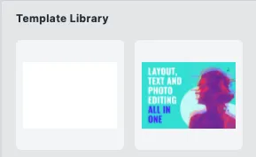

---


[Source](http:/localhost:4321/js/use-templates/apply-template-35c73e)

# Apply a Template

```
engine.scene.applyTemplateFromString('UBQ1ewoiZm9ybWF0Ij...');engine.scene.applyTemplateFromURL(  'https://cdn.img.ly/assets/demo/v1/ly.img.template/templates/cesdk_postcard_1.scene',);engine.scene.get();
```

In this example, we will show you how to use the [CreativeEditor SDK](https://img.ly/products/creative-sdk)’s CreativeEngine to apply the contents of a given template scene to the currently loaded scene through the `scene` API.

## Applying Template Scenes[#](#applying-template-scenes)

```
engine.scene.applyTemplateFromString(content: string): Promise<void>
```

Applies the contents of the given template scene to the currently loaded scene. This loads the template scene while keeping the design unit and page dimensions of the current scene. The content of the pages is automatically adjusted to fit the new dimensions.

*   `content`: The template scene file contents, a base64 string.
*   Returns A Promise that resolves once the template was applied or rejects if there was an error.

```
engine.scene.applyTemplateFromURL(url: string): Promise<void>
```

Applies the contents of the given template scene to the currently loaded scene. This loads the template scene while keeping the design unit and page dimensions of the current scene. The content of the pages is automatically adjusted to fit the new dimensions.

*   `url`: The url to the template scene file.
*   Returns A Promise that resolves once the template was applied or rejects if there was an error.

```
engine.scene.get(): DesignBlockId | null
```

Return the currently active scene.

*   Returns The scene or null, if none was created yet.

## Full Code[#](#full-code)

Here’s the full code:

```
engine.scene.applyTemplateFromString('UBQ1ewoiZm9ybWF0Ij...');engine.scene.applyTemplateFromURL(  'https://cdn.img.ly/assets/demo/v1/ly.img.template/templates/cesdk_postcard_1.scene',);engine.scene.get();
```

---


[Source](http:/localhost:4321/js/text/styling-269c48)

# Text Styling

```
import CreativeEngine from 'https://cdn.img.ly/packages/imgly/cesdk-engine/1.57.0/index.js';
const config = {  license: 'mtLT-_GJwMhE7LDnO8KKEma7qSuzWuDxiKuQcxHKmz3fjaXWY2lT3o3Z2VdL5twm',  userId: 'guides-user',  baseURL: 'https://cdn.img.ly/packages/imgly/cesdk-engine/1.57.0/assets'};
CreativeEngine.init(config).then(async (engine) => {  document.getElementById('cesdk_container').appendChild(engine.element);
  // Add default assets used in scene.  engine.addDefaultAssetSources();
  const scene = engine.scene.create();  const text = engine.block.create('text');  engine.block.appendChild(scene, text);  engine.block.setWidthMode(text, 'Auto');  engine.block.setHeightMode(text, 'Auto');
  engine.block.replaceText(text, 'Hello World');  // Add a "!" at the end of the text  engine.block.replaceText(text, '!', 11);  // Replace "World" with "Alex"  engine.block.replaceText(text, 'Alex', 6, 11);
  engine.scene.zoomToBlock(text, 100, 100, 100, 100);
  // Remove the "Hello "  engine.block.removeText(text, 0, 6);
  engine.block.setTextColor(text, { r: 1.0, g: 1.0, b: 0.0, a: 1.0 });  engine.block.setTextColor(text, { r: 0.0, g: 0.0, b: 0.0, a: 1.0 }, 1, 4);  const allColors = engine.block.getTextColors(text);  const colorsInRange = engine.block.getTextColors(text, 2, 5);

  engine.block.setBool(text, 'backgroundColor/enabled', true);
  var color = engine.block.getColor(text, 'backgroundColor/color');  engine.block.setColor(text, 'backgroundColor/color', { r: 0.0, g: 0.0, b: 1.0, a: 1.0 });
  engine.block.setFloat(text, 'backgroundColor/paddingLeft', 1);  engine.block.setFloat(text, 'backgroundColor/paddingTop', 2);  engine.block.setFloat(text, 'backgroundColor/paddingRight', 3);  engine.block.setFloat(text, 'backgroundColor/paddingBottom', 4);
  engine.block.setFloat(text, 'backgroundColor/cornerRadius', 5);
  const animation = engine.block.createAnimation('slide');  engine.block.setEnum(animation, 'textAnimationWritingStyle', 'Block');
  engine.block.setInAnimation(text, animation)  engine.block.setOutAnimation(text, animation)

  engine.block.setTextCase(text, 'Titlecase');
  const textCases = engine.block.getTextCases(text);
  const typeface = {    name: 'Roboto',    fonts: [      {        uri: 'https://cdn.img.ly/assets/v2/ly.img.typeface/fonts/Roboto/Roboto-Bold.ttf',        subFamily: 'Bold',        weight: 'bold'      },      {        uri: 'https://cdn.img.ly/assets/v2/ly.img.typeface/fonts/Roboto/Roboto-BoldItalic.ttf',        subFamily: 'Bold Italic',        weight: 'bold',        style: 'italic'      },      {        uri: 'https://cdn.img.ly/assets/v2/ly.img.typeface/fonts/Roboto/Roboto-Italic.ttf',        subFamily: 'Italic',        style: 'italic'      },      {        uri: 'https://cdn.img.ly/assets/v2/ly.img.typeface/fonts/Roboto/Roboto-Regular.ttf',        subFamily: 'Regular'      }    ]  };  engine.block.setFont(text, typeface.fonts[3].uri, typeface);
  engine.block.setTypeface(text, typeface);
  const currentDefaultTypeface = engine.block.getTypeface(text);
  const currentTypefaces = engine.block.getTypefaces(text);  const currentTypefacesOfRange = engine.block.getTypefaces(text, 1, 4);
  if (engine.block.canToggleBoldFont(text)) {    engine.block.toggleBoldFont(text);  }  if (engine.block.canToggleBoldFont(text, 1, 4)) {    engine.block.toggleBoldFont(text, 1, 4);  }
  if (engine.block.canToggleItalicFont(text)) {    engine.block.toggleItalicFont(text);  }  if (engine.block.canToggleItalicFont(text, 1, 4)) {    engine.block.toggleItalicFont(text, 1, 4);  }
  const fontWeights = engine.block.getTextFontWeights(text);
  const fontStyles = engine.block.getTextFontStyles(text);});
```

```
<!DOCTYPE html><html lang="en">  <head>    <meta charset="UTF-8" />    <meta name="viewport" content="width=device-width, initial-scale=1.0" />    <meta http-equiv="X-UA-Compatible" content="ie=edge" />    <style>      body {        margin: 0;        overflow: hidden;      }      html {        overscroll-behavior-x: contain;      }    </style>  </head>
  <body>    <div id="cesdk_container" style="width: 100%; height: 100vh"></div>    <script type="module" src="index.js">    </script>  </body></html>
```

In this example, we want to show how to read and modify the text block’s contents via the API in the Headless CreativeEngine.

## Editing the Text String[#](#editing-the-text-string)

You can edit the text string contents of a text block using the `replaceText(id: DesignBlockId, text: string, from: number = -1, to: number = -1)` and `removeText(id: DesignBlockId, from: number = -1, to: number = -1)` APIs. The range of text that should be edited is defined using the UTF-16 indices \[from, to).

When omitting both the `from` and `to` arguments, the entire existing string is replaced.

```
engine.block.replaceText(text, 'Hello World');
```

When only specifying the `from` index, the new text is inserted at this index.

```
// Add a "!" at the end of the textengine.block.replaceText(text, '!', 11);
```

When both `from` and `to` indices are specified, then that range of text is replaced with the new text.

```
// Replace "World" with "Alex"engine.block.replaceText(text, 'Alex', 6, 11);
```

Similarly, the `removeText` API can be called to remove either a specific range or the entire text.

```
// Remove the "Hello "engine.block.removeText(text, 0, 6);
```

## Text Colors[#](#text-colors)

Text blocks in the CreativeEngine allow different ranges to have multiple colors.

Use the `setTextColor(id: DesignBlockId, color: RGBAColor | SpotColor, from: number = -1, to: number = -1)` API to change either the color of the entire text

```
engine.block.setTextColor(text, { r: 1.0, g: 1.0, b: 0.0, a: 1.0 });
```

or only that of a range. After these two calls, the text “Alex!” now starts with one yellow character, followed by three black characters and two more yellow ones.

```
engine.block.setTextColor(text, { r: 0.0, g: 0.0, b: 0.0, a: 1.0 }, 1, 4);
```

The `getTextColors(id: DesignBlockId, from: number = -1, to: number = -1): Array<RGBAColor | SpotColor>` API returns an ordered list of unique colors in the requested range. Here, `allColors` will be an array containing the colors yellow and black (in this order).

```
const allColors = engine.block.getTextColors(text);
```

When only the colors in the UTF-16 range from 2 to 5 are requested, the result will be an array containing black and then yellow, since black appears first in the requested range.

```
const colorsInRange = engine.block.getTextColors(text, 2, 5);
```

## Text Background[#](#text-background)

You can create and edit the background of a text block by setting specific block properties.

To add a colored background to a text block use the `setBool(id: DesignBlockId, property: string, value: boolean)` API and enable the `backgroundColor/enabled` property.

The color of the text background can be queried (by making use of the `getColor(id: DesignBlockID, property: string)` API ) and also changed (with the `setColor(id: DesignBlockID, property: string, color: color)` API).

```
var color = engine.block.getColor(text, 'backgroundColor/color');
```

The padding of the rectangular background shape can be edited by using the `setFloat(id: DesignBlockId, property: string, value: number)` API and setting the target value for the desired padding property like:

*   `backgroundColor/paddingLeft`:
*   `backgroundColor/paddingRight`:
*   `backgroundColor/paddingTop`:
*   `backgroundColor/paddingBottom`:

```
engine.block.setFloat(text, 'backgroundColor/paddingLeft', 1);
```

Additionally, the rectangular shape of the background can be rounded by setting a corner radius with the `setFloat(id: DesignBlockId, property: string, value: number)` API to adjust the value of the `backgroundColor/cornerRadius` property.

```
engine.block.setFloat(text, 'backgroundColor/cornerRadius', 5);
```

Text backgrounds inherit the animations assigned to their respective text block when the animation text writing style is set to `Block`.

```
const animation = engine.block.createAnimation('slide');
```

## Text Case[#](#text-case)

You can apply text case modifications to ranges of text in order to display them in upper case, lower case or title case. It is important to note that these modifiers do not change the `text` string value of the text block but are only applied when the block is rendered.

By default, the text case of all text within a text block is set to `Normal`, which does not modify the appearance of the text at all.

The `setTextCase(id: DesignBlockId, textCase: TextCase, from: number = -1, to: number = -1): void` API sets the given text case for the selected range of text.

Possible values for `TextCase` are:

*   `Normal`: The text string is rendered without modifications.
*   `Uppercase`: All characters are rendered in upper case.
*   `Lowercase`: All characters are rendered in lower case.
*   `Titlecase`: The first character of each word is rendered in upper case.

```
engine.block.setTextCase(text, 'Titlecase');
```

The `getTextCases(id: DesignBlockId, from: number = -1, to: number = -1): TextCase[]` API returns the ordered list of text cases of the text in the selected range.

```
const textCases = engine.block.getTextCases(text);
```

## Typefaces[#](#typefaces)

In order to change the font of a text block, you have to call the `setFont(id: DesignBlockId, fontFileUri: string, typeface: Typeface)` API and provide it with both the uri of the font file to be actively used and the complete typeface definition of the corresponding typeface. Existing formatting of the block is reset.

A typeface definition consists of the unique typeface name (as it is defined within the font files), and a list of all font definitions that belong to this typeface. Each font definition must provide a `uri` string which points to the font file and a `subFamily` string which is this font’s effective name within its typeface. The subfamily value is typically also defined within the font file. The `weight` and `style` properties default to `normal`, but must be provided in other cases.

For the sake of this example, we define a `Roboto` typeface with only four fonts: `Regular`, `Bold`, `Italic`, and `Bold Italic` and we change the font of the text block to the Roboto Regular font.

```
const typeface = {  name: 'Roboto',  fonts: [    {      uri: 'https://cdn.img.ly/assets/v2/ly.img.typeface/fonts/Roboto/Roboto-Bold.ttf',      subFamily: 'Bold',      weight: 'bold'    },    {      uri: 'https://cdn.img.ly/assets/v2/ly.img.typeface/fonts/Roboto/Roboto-BoldItalic.ttf',      subFamily: 'Bold Italic',      weight: 'bold',      style: 'italic'    },    {      uri: 'https://cdn.img.ly/assets/v2/ly.img.typeface/fonts/Roboto/Roboto-Italic.ttf',      subFamily: 'Italic',      style: 'italic'    },    {      uri: 'https://cdn.img.ly/assets/v2/ly.img.typeface/fonts/Roboto/Roboto-Regular.ttf',      subFamily: 'Regular'    }  ]};engine.block.setFont(text, typeface.fonts[3].uri, typeface);
```

If the formatting, e.g., bold or italic, of the text should be kept, you have to call the `fun setTypeface(block: DesignBlock, fontFileUri: Uri, typeface: Typeface)` API and provide it with both the uri of the font file to be used and the complete typeface definition of the corresponding typeface. The font file should be a fallback font, e.g., `Regular`, from the same typeface. The actual font that matches the formatting is chosen automatically with the current formatting retained as much as possible. If the new typeface does not support the current formatting, the formatting changes to a reasonable close one, e.g. thin might change to light, bold to normal, and/or italic to non-italic. If no reasonable font can be found, the fallback font is used.

```
engine.block.setTypeface(text, typeface);
```

You can query the currently used typeface definition of a text block by calling the `getTypeface(id: DesignBlockId): Typeface` API. It is important to note that new text blocks don’t have any explicit typeface set until you call the `setFont` API. In this case, the `getTypeface` API will throw an error.

```
const currentDefaultTypeface = engine.block.getTypeface(text);
```

## Font Weights and Styles[#](#font-weights-and-styles)

Text blocks can also have multiple ranges with different weights and styles.

In order to toggle the text of a text block between the normal and bold font weights, first call the `canToggleBoldFont(id: DesignBlockId, from: number = -1, to: number = -1): boolean` API to check whether such an edit is possible and if so, call the `toggleBoldFont(id: DesignBlockId, from: number = -1, to: number = -1)` API to change the weight.

```
if (engine.block.canToggleBoldFont(text)) {  engine.block.toggleBoldFont(text);}if (engine.block.canToggleBoldFont(text, 1, 4)) {  engine.block.toggleBoldFont(text, 1, 4);}
```

In order to toggle the text of a text block between the normal and italic font styles, first call the `canToggleItalicFont(id: DesignBlockId, from: number = -1, to: number = -1): boolean` API to check whether such an edit is possible and if so, call the `toggleItalicFont(id: DesignBlockId, from: number = -1, to: number = -1)` API to change the style.

```
if (engine.block.canToggleItalicFont(text)) {  engine.block.toggleItalicFont(text);}if (engine.block.canToggleItalicFont(text, 1, 4)) {  engine.block.toggleItalicFont(text, 1, 4);}
```

In order to change the font weight or style, the typeface definition of the text block must include a font definition that corresponds to the requested font weight and style combination. For example, if the text block currently uses a bold font and you want to toggle the font style to italic - such as in the example code - the typeface must contain a font that is both bold and italic.

The `getTextFontWeights(id: DesignBlockId, from: number = -1, to: number = -1): FontWeight[]` API returns an ordered list of unique font weights in the requested range, similar to the `getTextColors` API described above. For this example text, the result will be \[‘bold’\].

```
const fontWeights = engine.block.getTextFontWeights(text);
```

The `getTextFontStyles(id: DesignBlockId, from: number = -1, to: number = -1): FontStyle[]` API returns an ordered list of unique font styles in the requested range, similar to the `getTextColors` API described above. For this example text, the result will be \[‘italic’\].

```
const fontStyles = engine.block.getTextFontStyles(text);
```

## Full Code[#](#full-code)

Here’s the full code:

```
import CreativeEngine from 'https://cdn.img.ly/packages/imgly/cesdk-engine/1.57.0/index.js';
const config = {  license: 'mtLT-_GJwMhE7LDnO8KKEma7qSuzWuDxiKuQcxHKmz3fjaXWY2lT3o3Z2VdL5twm',  userId: 'guides-user',  baseURL:    'https://cdn.img.ly/packages/imgly/cesdk-engine/1.57.0/assets',};
CreativeEngine.init(config).then(async engine => {  document.getElementById('cesdk_container').appendChild(engine.element);
  // Add default assets used in scene.  engine.addDefaultAssetSources();
  const scene = engine.scene.create();  const text = engine.block.create('text');  engine.block.appendChild(scene, text);  engine.block.setWidthMode(text, 'Auto');  engine.block.setHeightMode(text, 'Auto');
  engine.block.replaceText(text, 'Hello World');  // Add a "!" at the end of the text  engine.block.replaceText(text, '!', 11);  // Replace "World" with "Alex"  engine.block.replaceText(text, 'Alex', 6, 11);
  engine.scene.zoomToBlock(text, 100, 100, 100, 100);
  // Remove the "Hello "  engine.block.removeText(text, 0, 6);
  engine.block.setTextColor(text, { r: 1.0, g: 1.0, b: 0.0, a: 1.0 });  engine.block.setTextColor(text, { r: 0.0, g: 0.0, b: 0.0, a: 1.0 }, 1, 4);  const allColors = engine.block.getTextColors(text);  const colorsInRange = engine.block.getTextColors(text, 2, 5);
  engine.block.setBool(text, 'backgroundColor/enabled', true);
  var color = engine.block.getColor(text, 'backgroundColor/color');  engine.block.setColor(text, 'backgroundColor/color', {    r: 0.0,    g: 0.0,    b: 1.0,    a: 1.0,  });
  engine.block.setFloat(text, 'backgroundColor/paddingLeft', 1);  engine.block.setFloat(text, 'backgroundColor/paddingTop', 2);  engine.block.setFloat(text, 'backgroundColor/paddingRight', 3);  engine.block.setFloat(text, 'backgroundColor/paddingBottom', 4);
  engine.block.setFloat(text, 'backgroundColor/cornerRadius', 5);
  const animation = engine.block.createAnimation('slide');  engine.block.setEnum(animation, 'textAnimationWritingStyle', 'Block');
  engine.block.setInAnimation(text, animation);  engine.block.setOutAnimation(text, animation);
  engine.block.setTextCase(text, 'Titlecase');
  const textCases = engine.block.getTextCases(text);
  const typeface = {    name: 'Roboto',    fonts: [      {        uri: 'https://cdn.img.ly/assets/v2/ly.img.typeface/fonts/Roboto/Roboto-Bold.ttf',        subFamily: 'Bold',        weight: 'bold',      },      {        uri: 'https://cdn.img.ly/assets/v2/ly.img.typeface/fonts/Roboto/Roboto-BoldItalic.ttf',        subFamily: 'Bold Italic',        weight: 'bold',        style: 'italic',      },      {        uri: 'https://cdn.img.ly/assets/v2/ly.img.typeface/fonts/Roboto/Roboto-Italic.ttf',        subFamily: 'Italic',        style: 'italic',      },      {        uri: 'https://cdn.img.ly/assets/v2/ly.img.typeface/fonts/Roboto/Roboto-Regular.ttf',        subFamily: 'Regular',      },    ],  };  engine.block.setFont(text, typeface.fonts[3].uri, typeface);
  engine.block.setTypeface(text, typeface);
  const currentDefaultTypeface = engine.block.getTypeface(text);
  const currentTypefaces = engine.block.getTypefaces(text);  const currentTypefacesOfRange = engine.block.getTypefaces(text, 1, 4);
  if (engine.block.canToggleBoldFont(text)) {    engine.block.toggleBoldFont(text);  }  if (engine.block.canToggleBoldFont(text, 1, 4)) {    engine.block.toggleBoldFont(text, 1, 4);  }
  if (engine.block.canToggleItalicFont(text)) {    engine.block.toggleItalicFont(text);  }  if (engine.block.canToggleItalicFont(text, 1, 4)) {    engine.block.toggleItalicFont(text, 1, 4);  }
  const fontWeights = engine.block.getTextFontWeights(text);
  const fontStyles = engine.block.getTextFontStyles(text);});
```

---


[Source](http:/localhost:4321/js/text/overview-0bd620)

# Overview

In CreativeEditor SDK (CE.SDK), a _text element_ is an editable, stylable block that you can add to your design. Whether you’re creating marketing graphics, videos, social media posts, or multilingual layouts, text plays a vital role in conveying information and enhancing your visuals. You can fully manipulate text elements using both the user interface and programmatic APIs, giving you maximum flexibility to control how text behaves and appears. Additionally, text can be animated to bring motion to your designs.

[Launch Web Demo](https://img.ly/showcases/cesdk)[

Get Started

](js/get-started/overview-e18f40/)

## Text Capabilities in CE.SDK[#](#text-capabilities-in-cesdk)

CE.SDK offers robust text editing capabilities designed for both designers and developers:

*   **Adding and editing text objects:** Easily insert text into your designs through the UI or dynamically create and update text blocks via the API.
*   **Resizing and positioning:** Move, align, and resize text objects freely on the canvas to achieve the perfect layout.
*   **Dynamic editing:** Programmatically update text content, style, or position based on data or user input, enabling powerful automation workflows.
*   **Inline Editing:** Directly see changes in the context of your design instead of a separate input.

## Text Styling, Formatting, Effects, and Spacing[#](#text-styling-formatting-effects-and-spacing)

CE.SDK provides a comprehensive set of text styling and formatting options:

*   **Basic styling options:**
    
    *   Choose from a range of fonts.
    *   Adjust font size, color, and opacity.
    *   Apply text formatting such as bold, italic, and underline.
*   **Advanced effects:**
    
    *   Add shadows for depth.
    *   Outline text for emphasis.
    *   Apply glow effects to make text stand out.
*   **Spacing controls:**
    
    *   Fine-tune letter spacing (tracking).
    *   Adjust line height for readability.
    *   Set paragraph spacing for structured layouts.

You can apply all styling, formatting, effects, and spacing adjustments both manually through the UI and programmatically via the API, offering flexibility for user-driven design or fully automated generation.

## Text Containers and Auto-Sizing[#](#text-containers-and-auto-sizing)

Text in CE.SDK can be configured in frames that adapt to different content scenarios:

*   **Fixed-size frame:** Keep text confined within a defined width and height.
*   **Growing frames:** Allow the text block to expand automatically as more text is added in specific directions.

Auto-sizing behaviors can be customized to ensure your text either stays within design constraints or flows naturally as content changes.

## Emojis in Text[#](#emojis-in-text)

CE.SDK fully supports inserting emojis alongside regular text:

*   **Emoji insertion:** Add emojis directly within text blocks, just like any other character.
*   **Styling:** Emojis inherit the styling of surrounding text, ensuring visual consistency.
*   **Format support:** Unicode-based emojis are supported with robust fallback behavior for consistent display across platforms.
*   **Customizable:** The font used for drawing Emojis can be configured.

## Fonts, Language, and Script Support[#](#fonts-language-and-script-support)

Text handling in CE.SDK is built to support a wide range of languages, scripts, and font management needs:

*   **Custom fonts:** Upload and manage your own font collections to match brand guidelines.
*   **Font restrictions:** Control which fonts are available to end users for a curated design experience.
*   **Multi-script handling:** Seamlessly mix different scripts (e.g., Latin, Cyrillic, Kanji) within the same design.
*   **Fallbacks:** Handles an endless amount of characters by providing a robust fallback system that ensures your text is always readable.

---


[Source](http:/localhost:4321/js/text/emojis-510651)

# Emojis

```
import CreativeEngine from 'https://cdn.img.ly/packages/imgly/cesdk-engine/1.57.0/index.js';
const config = {  license: 'mtLT-_GJwMhE7LDnO8KKEma7qSuzWuDxiKuQcxHKmz3fjaXWY2lT3o3Z2VdL5twm',  userId: 'guides-user',  baseURL: 'https://cdn.img.ly/packages/imgly/cesdk-engine/1.57.0/assets'};
CreativeEngine.init(config).then(async (engine) => {  document.getElementById('cesdk_container').append(engine.element);
  let uri = engine.editor.getSettingString('ubq://defaultEmojiFontFileUri');  // From a bundle  engine.editor.setSettingString(    'ubq://defaultEmojiFontFileUri',    'bundle://ly.img.cesdk/fonts/NotoColorEmoji.ttf'  );  // From a URL  engine.editor.setSettingString(    'ubq://defaultEmojiFontFileUri',    'https://cdn.img.ly/assets/v2/emoji/NotoColorEmoji.ttf'  );
  const scene = engine.scene.create();
  const page = engine.block.create('page');  engine.block.setWidth(page, 800);  engine.block.setHeight(page, 600);  engine.block.appendChild(scene, page);
  engine.scene.zoomToBlock(page, 40, 40, 40, 40);
  const text = engine.block.create('text');  engine.block.setString(text, 'text/text', 'Text with an emoji 🧐');  engine.block.setWidthMode(text, 'Auto');  engine.block.setHeightMode(text, 'Auto');  engine.block.appendChild(page, text);});
```

```
<!DOCTYPE html><html lang="en">  <head>    <meta charset="UTF-8" />    <meta name="viewport" content="width=device-width, initial-scale=1.0" />    <meta http-equiv="X-UA-Compatible" content="ie=edge" />    <style>      body {        margin: 0;        overflow: hidden;      }      html {        overscroll-behavior-x: contain;      }    </style>  </head>
  <body>    <div id="cesdk_container" style="width: 100%; height: 100vh"></div>    <script type="module" src="index.js">    </script>  </body></html>
```

Text blocks in CE.SDK support the use of emojis. A default emoji font is used to render these independently from the target platform. This guide shows how to change the default font and use emojis in text blocks.

## Change the Default Emoji Font[#](#change-the-default-emoji-font)

The default font URI can be changed when another emoji font should be used or when the font should be served from another website, a content delivery network (CDN), or a file path.

The preset is to use the [NotoColorEmoji](https://github.com/googlefonts/noto-emoji) font loaded from our [CDN](https://cdn.img.ly/assets/v4/emoji/NotoColorEmoji.ttf). This font file supports a wide variety of Emojis and is licensed under the [Open Font License](https://cdn.img.ly/assets/v4/emoji/LICENSE.txt). The file is relatively small with 9.9 MB but has the emojis stored as PNG images.

As an alternative for higher quality emojis, e.g., this [NotoColorEmoji](https://fonts.google.com/noto/specimen/Noto+Color+Emoji) font can be used. This font file supports also a wide variety of Emojis and is licensed under the [SIL Open Font License, Version 1.1](https://fonts.google.com/noto/specimen/Noto+Color+Emoji/license). The file is significantly larger with 24.3 MB but has the emojis stored as vector graphics.

In order to change the emoji font URI, call the `setSettingString(keypath: string, value: string)` [Editor API](js/settings-970c98/) with ‘defaultEmojiFontFileUri’ as keypath and the new URI as value.

```
let uri = engine.editor.getSettingString('ubq://defaultEmojiFontFileUri');// From a bundleengine.editor.setSettingString(  'ubq://defaultEmojiFontFileUri',  'bundle://ly.img.cesdk/fonts/NotoColorEmoji.ttf');// From a URLengine.editor.setSettingString(  'ubq://defaultEmojiFontFileUri',  'https://cdn.img.ly/assets/v2/emoji/NotoColorEmoji.ttf');
```

## Add a Text Block with an Emoji[#](#add-a-text-block-with-an-emoji)

To add a text block with an emoji, add a text block and set the emoji as text content.

```
const text = engine.block.create('text');engine.block.setString(text, 'text/text', 'Text with an emoji 🧐');engine.block.setWidthMode(text, 'Auto');engine.block.setHeightMode(text, 'Auto');engine.block.appendChild(page, text);
```

## Full Code[#](#full-code)

Here’s the full code:

```
import CreativeEngine from 'https://cdn.img.ly/packages/imgly/cesdk-engine/1.57.0/index.js';
const config = {  license: 'mtLT-_GJwMhE7LDnO8KKEma7qSuzWuDxiKuQcxHKmz3fjaXWY2lT3o3Z2VdL5twm',  userId: 'guides-user',  baseURL:    'https://cdn.img.ly/packages/imgly/cesdk-engine/1.57.0/assets',};
CreativeEngine.init(config).then(async engine => {  document.getElementById('cesdk_container').append(engine.element);
  let uri = engine.editor.getSettingString('ubq://defaultEmojiFontFileUri');  // From a bundle  engine.editor.setSettingString(    'ubq://defaultEmojiFontFileUri',    'bundle://ly.img.cesdk/fonts/NotoColorEmoji.ttf',  );  // From a URL  engine.editor.setSettingString(    'ubq://defaultEmojiFontFileUri',    'https://cdn.img.ly/assets/v2/emoji/NotoColorEmoji.ttf',  );
  const scene = engine.scene.create();
  const page = engine.block.create('page');  engine.block.setWidth(page, 800);  engine.block.setHeight(page, 600);  engine.block.appendChild(scene, page);
  engine.scene.zoomToBlock(page, 40, 40, 40, 40);
  const text = engine.block.create('text');  engine.block.setString(text, 'text/text', 'Text with an emoji 🧐');  engine.block.setWidthMode(text, 'Auto');  engine.block.setHeightMode(text, 'Auto');  engine.block.appendChild(page, text);});
```

---


[Source](http:/localhost:4321/js/text/edit-c5106b)

# Edit Text

```
import CreativeEngine from 'https://cdn.img.ly/packages/imgly/cesdk-engine/1.57.0/index.js';
const config = {  license: 'mtLT-_GJwMhE7LDnO8KKEma7qSuzWuDxiKuQcxHKmz3fjaXWY2lT3o3Z2VdL5twm',  userId: 'guides-user',  baseURL: 'https://cdn.img.ly/packages/imgly/cesdk-engine/1.57.0/assets'};
CreativeEngine.init(config, document.getElementById('cesdk_canvas')).then(  async (instance) => {    // Add default assets used in scene.    instance.addDefaultAssetSources();
    instance.editor.setEditMode('Transform');    instance.editor.onStateChanged(() => {      console.log('EditMode is ', instance.editor.getEditMode());    });
    document.addEventListener('cesdk-blur', (event) => {      const relatedTarget = event.detail;
      if (focusShouldStayOnEngine(relatedTarget)) {        event.preventDefault();      } else if (engineShouldExitTextMode(relatedTarget)) {        instance.editor.setEditMode('Transform');      }    });
    function focusShouldStayOnEngine(newActiveElement) {      // When clicking on blank space, don't blur the engine input      return newActiveElement == null;    }
    function engineShouldExitTextMode() {      return false;    }
    document.addEventListener('cesdk-refocus', (event) => {      const relatedTarget = event.detail;
      if (focusShouldStayOnUI(relatedTarget)) {        event.preventDefault();      }    });
    function focusShouldStayOnUI(newActiveElement) {      // User might have clicked a button that opens a dialog      // Afterwards we want an input in the dialog to receive focus      return newActiveElement?.id === 'open-dialog';    }
    await instance.scene.loadFromURL(      'https://cdn.img.ly/assets/demo/v1/ly.img.template/templates/cesdk_postcard_1.scene'    );  });
```

```
<!DOCTYPE html><html lang="en">  <head>    <meta charset="UTF-8" />    <meta name="viewport" content="width=device-width, initial-scale=1.0" />    <meta http-equiv="X-UA-Compatible" content="ie=edge" />    <style>      body {        margin: 0;        overflow: hidden;      }      html {        overscroll-behavior-x: contain;      }    </style>  </head>
  <body>    <canvas      id="cesdk_canvas"      width="1024"      height="720"      style="width: 1024px; height: 720px"    ></canvas>    <br />    <button>Button will not steal focus</button>    <input      type="text"      name=""      id=""      placeholder="Input field will steal focus"    />
    <script type="module" src="index.js"></script>    <script>      // Make sure to adapt the canvas resolution to high-dpi displays      const canvas = document.getElementById('cesdk_canvas');      const updatePixelRatio = () => {        let dpr = window.devicePixelRatio;        canvas.width = `${dpr * canvas.getBoundingClientRect().width}`;        canvas.height = `${dpr * canvas.getBoundingClientRect().height}`;        matchMedia(`(resolution: ${dpr}dppx)`).addEventListener(          'change',          updatePixelRatio,          { once: true }        );      };      updatePixelRatio();    </script>  </body></html>
```

In this example, we want to show how to set up text editing in the Headless CreativeEngine.

Depending on your use cases, text editing can require a little more complicated setup, because the focus for the user’s keyboard input might need to be managed between the CreativeEngine itself and your UI components.

## Text Edit Mode[#](#text-edit-mode)

The Engine always operates in one of three `EditMode`s:

*   `Transform`: In this mode you can transform blocks in the scene by moving them around, selecting, or resizing them. This is the default mode.
*   `Crop`: This mode is used when cropping image blocks.
*   `Text`: Then double-clicking on a text block, the engine switches to this mode to let you edit the text content of a text block.

You can query and set the `EditMode` using the EditorAPI’s `getEditMode()` and `setEditMode(mode)` methods. Certain interactions will cause the engine to switch the mode by itself (such as double-clicking on a text block).

You get notified of changes in the EditorState using the `onStateChanged` method of the EditorAPI. Inside the callback, use `getEditMode()` to know the current mode.

## Text Editing Focus[#](#text-editing-focus)

When the engine enters `Text` mode, it will focus the browser’s input on the text content of the block you are editing. From here, several things can happen:

*   The user presses `ESC`, clicks somewhere on the canvas outside of the text block, or `Text` mode is ended via a call to `setEditMode('Transform')`. In this case, the browser will blur the text input of the engine, and you are back in the `Transform` mode.
*   The user focuses a text input field, number input field, text area or a contentEditable element outside of the canvas. In this case the engine will stay in `Text` mode, but will no longer have focus. Keyboard input will now go to the input field that has received focus.
*   The user clicks on a blank space or any focusable DOM element, that does not require keyboard input.

This behavior should be sufficient for most use cases. If your requirements are more complicated, we provide a way to customize what’s happening through events.

## CreativeEngine DOM Events[#](#creativeengine-dom-events)

There are currently two types of custom DOM events that the CreativeEngine dispatches on the `canvas` element. You can add a listener for it there or on any of its parent elements.

### `cesdk-blur`[#](#cesdk-blur)

When the text input in the engine has been blurred, this event will be dispatched. You can call `preventDefault()` on the event to force focus back to the canvas input. The `event.detail` property will contain a reference to the element that has received focus (if available, otherwise it’s `null`). You can use that element during the decision whether to call `preventDefault()`.

A use case for this could be to prevent disabling the text-input heuristic, forcing refocus even if the user clicked on a text input, or to call `editor.setEditMode('Transform')` to exit the text edit mode whenever the input is blurred.

### `cesdk-refocus`[#](#cesdk-refocus)

Just before the engine refocuses its text input, you can call `preventDefault()` on this event to prevent this from happening. This event also contains currently focused element (or `null`) it in its `event.detail` property.

A use case for this would be to treat a particular input element as if it were a text input and let it keep keyboard focus after it’s been focused.

### Full Code[#](#full-code)

Here’s the full code:

```
import CreativeEngine from 'https://cdn.img.ly/packages/imgly/cesdk-engine/1.57.0/index.js';
const config = {  license: 'mtLT-_GJwMhE7LDnO8KKEma7qSuzWuDxiKuQcxHKmz3fjaXWY2lT3o3Z2VdL5twm',  userId: 'guides-user',  baseURL:    'https://cdn.img.ly/packages/imgly/cesdk-engine/1.57.0/assets',};
CreativeEngine.init(config, document.getElementById('cesdk_canvas')).then(  async instance => {    // Add default assets used in scene.    instance.addDefaultAssetSources();
    instance.editor.setEditMode('Transform');    instance.editor.onStateChanged(() => {      console.log('EditMode is ', instance.editor.getEditMode());    });
    document.addEventListener('cesdk-blur', event => {      const relatedTarget = event.detail;
      if (focusShouldStayOnEngine(relatedTarget)) {        event.preventDefault();      } else if (engineShouldExitTextMode(relatedTarget)) {        instance.editor.setEditMode('Transform');      }    });
    function focusShouldStayOnEngine(newActiveElement) {      // When clicking on blank space, don't blur the engine input      return newActiveElement == null;    }
    function engineShouldExitTextMode() {      return false;    }
    document.addEventListener('cesdk-refocus', event => {      const relatedTarget = event.detail;
      if (focusShouldStayOnUI(relatedTarget)) {        event.preventDefault();      }    });
    function focusShouldStayOnUI(newActiveElement) {      // User might have clicked a button that opens a dialog      // Afterwards we want an input in the dialog to receive focus      return newActiveElement?.id === 'open-dialog';    }
    await instance.scene.loadFromURL(      'https://cdn.img.ly/assets/demo/v1/ly.img.template/templates/cesdk_postcard_1.scene',    );  },);
```

## Edit Ranges Within Text Blocks[#](#edit-ranges-within-text-blocks)

```
const text = engine.block.create('text');
engine.block.replaceText(text, 'Hello World');engine.block.removeText(text, 0, 6);engine.block.setTextColor(text, { r: 0.0, g: 0.0, b: 0.0, a: 1.0 }, 1, 4);const colorsInRange = engine.block.getTextColors(text, 2, 5);engine.block.setTextFontWeight(text, 'bold', 0, 5);const fontWeights = engine.block.getTextFontWeights(text);engine.block.setTextFontSize(text, 12, 0, 5);const fontSizes = engine.block.getTextFontSizes(text);engine.block.setTextFontStyle(text, 'italic', 0, 5);const fontStyles = engine.block.getTextFontStyles(text);engine.block.setTextCase(text, 'Titlecase');const textCases = engine.block.getTextCases(text);const canToggleBold = engine.block.canToggleBoldFont(text);const canToggleItalic = engine.block.canToggleItalicFont(text);engine.block.toggleBoldFont(text);engine.block.toggleItalicFont(text);const typefaceAssetResults = await engine.asset.findAssets('ly.img.typeface', {  query: 'Open Sans',  page: 0,  perPage: 100,});const typeface = typefaceAssetResults.assets[0].payload.typeface;const font = typeface.fonts.find(font => font.subFamily === 'Bold');engine.block.setFont(text, font.uri, typeface);engine.block.setTypeface(text, typeface, 2, 5);engine.block.setTypeface(text, typeface);const defaultTypeface = engine.block.getTypeface(text);const typeface = engine.block.getTypefaces(text);const selectedRange = engine.block.getTextCursorRange();const lineCount = engine.block.getTextVisibleLineCount(text);const lineBoundingBox = engine.block.getTextVisibleLineGlobalBoundingBoxXYWH(  text,  0,);
```

In this example, we will show you how to use the [CreativeEditor SDK](https://img.ly/products/creative-sdk)’s CreativeEngine to edit ranges within text blocks.

```
replaceText(id: DesignBlockId, text: string, from?: number, to?: number): void
```

Inserts the given text into the selected range of the text block. Required scope: ‘text/edit’

*   `block`: The text block into which to insert the given text.
*   `text`: The text which should replace the selected range in the block.
*   `from`: The start index of the UTF-16 range that should be replaced. If the value is negative, this will fall back to the start of the entire text range.
*   `to`: The UTF-16 index after the last grapheme that should be replaced by the inserted text. If `from` and `to` are negative, a this will fall back to the end of the entire text range, so the entire text will be replaced. If `to` is negative but `from` is greater than or equal to 0, the text will be inserted at the index defined by `from`.

```
removeText(id: DesignBlockId, from?: number, to?: number): void
```

Removes selected range of text of the given text block. Required scope: ‘text/edit’

*   `block`: The text block from which the selected text should be removed.
*   `from`: The start index of the UTF-16 range that should be removed. If the value is negative, this will fall back to the start of the entire text range.
*   `to`: The UTF-16 index after the last grapheme that should be removed. If the value is negative, this will fall back to the end of the entire text range.

```
setTextColor(id: DesignBlockId, color: Color, from?: number, to?: number): void
```

Changes the color of the text in the selected range to the given color. Required scope: ‘text/edit’

*   `block`: The text block whose color should be changed.
*   `color`: The new color of the selected text range.
*   `from`: The start index of the UTF-16 range whose color should be changed. If the value is negative and the block is currently being edited, this will fall back to the start of the current cursor index / selected grapheme range. If the value is negative and the block is not being edited, this will fall back to the start of the entire text range.
*   `to`: The UTF-16 index after the last grapheme whose color should be changed. If the value is negative and the block is currently being edited, this will fall back to the end of the current cursor index / selected grapheme range. If the value is negative and the block is not being edited, this will fall back to the end of the entire text range.

```
getTextColors(id: DesignBlockId, from?: number, to?: number): Array<Color>
```

Returns the ordered unique list of colors of the text in the selected range.

*   `block`: The text block whose colors should be returned.
*   `from`: The start index of the UTF-16 range whose colors should be returned. If the value is negative and the block is currently being edited, this will fall back to the start of the current cursor index / selected grapheme range. If the value is negative and the block is not being edited, this will fall back to the start of the entire text range.
*   `to`: The UTF-16 index after the last grapheme whose colors should be returned. If the value is negative and the block is currently being edited, this will fall back to the end of the current cursor index / selected grapheme range. If the value is negative and the block is not being edited, this will fall back to the end of the entire text range.

```
setTextFontWeight(id: DesignBlockId, fontWeight: FontWeight, from?: number, to?: number): void
```

Changes the weight of the text in the selected range to the given weight. Required scope: ‘text/edit’

*   `block`: The text block whose weight should be changed.
*   `fontWeight`: The new weight of the selected text range.
*   `from`: The start index of the UTF-16 range whose weight should be changed. If the value is negative and the block is currently being edited, this will fall back to the start of the current cursor index / selected grapheme range. If the value is negative and the block is not being edited, this will fall back to the start of the entire text range.
*   `to`: The UTF-16 index after the last grapheme whose weight should be changed. If the value is negative and the block is currently being edited, this will fall back to the end of the current cursor index / selected grapheme range. If the value is negative and the block is not being edited, this will fall back to the end of the entire text range.

```
getTextFontWeights(id: DesignBlockId, from?: number, to?: number): FontWeight[]
```

Returns the ordered unique list of font weights of the text in the selected range.

*   `block`: The text block whose font weights should be returned.
*   `from`: The start index of the UTF-16 range whose font weights should be returned. If the value is negative and the block is currently being edited, this will fall back to the start of the current cursor index / selected grapheme range. If the value is negative and the block is not being edited, this will fall back to the start of the entire text range.
*   `to`: The UTF-16 index after the last grapheme whose font weights should be returned. If the value is negative and the block is currently being edited, this will fall back to the end of the current cursor index / selected grapheme range. If the value is negative and the block is not being edited, this will fall back to the end of the entire text range.

```
setTextFontSize(id: DesignBlockId, fontSize: number, from?: number, to?: number): void
```

Sets the given font size for the text block. If the font size is applied to the entire text block, its font size property will be updated. Required scope: ‘text/character’

*   `block`: The text block whose font size should be changed.
*   `fontSize`: The new font size.
*   `from`: The start index of the UTF-16 range whose font size should be changed. If the value is negative and the block is currently being edited, this will fall back to the start of the current cursor index / selected grapheme range. If the value is negative and the block is not being edited, this will fall back to the start of the entire text range.
*   `to`: The UTF-16 index after the last grapheme whose font size should be changed. If the value is negative and the block is currently being edited, this will fall back to the end of the current cursor index / selected grapheme range. If the value is negative and the block is not being edited, this will fall back to the end of the entire text range.

```
getTextFontSizes(id: DesignBlockId, from?: number, to?: number): number[]
```

Returns the ordered unique list of font sizes of the text in the selected range.

*   `block`: The text block whose font sizes should be returned.
*   `from`: The start index of the grapheme range whose font sizes should be returned. If the value is negative and the block is currently being edited, this will fall back to the start of the current cursor index / selected grapheme range. If the value is negative and the block is not being edited, this will fall back to the start of the entire text range.
*   `to`: The UTF-16 index after the last grapheme whose font sizes should be returned. If the value is negative and the block is currently being edited, this will fall back to the end of the current cursor index / selected grapheme range. If the value is negative and the block is not being edited, this will fall back to the end of the entire text range.

```
setTextFontStyle(id: DesignBlockId, fontStyle: FontStyle, from?: number, to?: number): void
```

Changes the style of the text in the selected range to the given style. Required scope: ‘text/edit’

*   `block`: The text block whose style should be changed.
*   `fontStyle`: The new style of the selected text range.
*   `from`: The start index of the UTF-16 range whose style should be changed. If the value is negative and the block is currently being edited, this will fall back to the start of the current cursor index / selected grapheme range. If the value is negative and the block is not being edited, this will fall back to the start of the entire text range.
*   `to`: The UTF-16 index after the last grapheme whose style should be changed. If the value is negative and the block is currently being edited, this will fall back to the end of the current cursor index / selected grapheme range. If the value is negative and the block is not being edited, this will fall back to the end of the entire text range.

```
getTextFontStyles(id: DesignBlockId, from?: number, to?: number): FontStyle[]
```

Returns the ordered unique list of font styles of the text in the selected range.

*   `block`: The text block whose font styles should be returned.
*   `from`: The start index of the UTF-16 range whose font styles should be returned. If the value is negative and the block is currently being edited, this will fall back to the start of the current cursor index / selected grapheme range. If the value is negative and the block is not being edited, this will fall back to the start of the entire text range.
*   `to`: The UTF-16 index after the last grapheme whose font styles should be returned. If the value is negative and the block is currently being edited, this will fall back to the end of the current cursor index / selected grapheme range. If the value is negative and the block is not being edited, this will fall back to the end of the entire text range.

```
setTextCase(id: DesignBlockId, textCase: TextCase, from?: number, to?: number): void
```

Sets the given text case for the selected range of text. Required scope: ‘text/character’

*   `id`: The text block whose text case should be changed.
*   `textCase`: The new text case value.
*   `from`: The start index of the UTF-16 range whose text cases should be returned. If the value is negative and the block is currently being edited, this will fall back to the start of the current cursor index / selected grapheme range. If the value is negative and the block is not being edited, this will fall back to the start of the entire text range.
*   `to`: The UTF-16 index after the last grapheme whose text cases should be returned. If the value is negative and the block is currently being edited, this will fall back to the end of the current cursor index / selected grapheme range. If the value is negative and the block is not being edited, this will fall back to the end of the entire text range.

```
getTextCases(id: DesignBlockId, from?: number, to?: number): TextCase[]
```

Returns the ordered list of text cases of the text in the selected range.

*   `block`: The text block whose text cases should be returned.
*   `from`: The start index of the UTF-16 range whose text cases should be returned. If the value is negative and the block is currently being edited, this will fall back to the start of the current cursor index / selected grapheme range. If the value is negative and the block is not being edited, this will fall back to the start of the entire text range.
*   `to`: The UTF-16 index after the last grapheme whose text cases should be returned. If the value is negative and the block is currently being edited, this will fall back to the end of the current cursor index / selected grapheme range. If the value is negative and the block is not being edited, this will fall back to the end of the entire text range.

```
canToggleBoldFont(id: DesignBlockId, from?: number, to?: number): boolean
```

Returns whether the font weight of the given text block can be toggled between bold and normal. If any part of the selected range is not already bold and the necessary bold font is available, then this function returns true.

*   `id`: The text block whose font weight should be toggled.
*   `from`: The start index of the UTF-16 range whose font weight should be toggled. If the value is negative and the block is currently being edited, this will fall back to the start of the current cursor index / selected grapheme range. If the value is negative and the block is not being edited, this will fall back to the start of the entire text range.
*   `to`: The UTF-16 index after the last grapheme whose font weight should be toggled. If the value is negative and the block is currently being edited, this will fall back to the end of the current cursor index / selected grapheme range. If the value is negative and the block is not being edited, this will fall back to the end of the entire text range.
*   Returns Whether the font weight of the given block can be toggled between bold and normal.

```
canToggleItalicFont(id: DesignBlockId, from?: number, to?: number): boolean
```

Toggles the bold font style of the given text block. If any part of the selected range is not already italic and the necessary italic font is available, then this function returns true.

*   `id`: The text block whose font style should be toggled.
*   `from`: The start index of the UTF-16 range whose font style should be toggled. If the value is negative and the block is currently being edited, this will fall back to the start of the current cursor index / selected grapheme range. If the value is negative and the block is not being edited, this will fall back to the start of the entire text range.
*   `to`: The UTF-16 index after the last grapheme whose font style should be toggled. If the value is negative and the block is currently being edited, this will fall back to the end of the current cursor index / selected grapheme range. If the value is negative and the block is not being edited, this will fall back to the end of the entire text range.
*   Returns Whether the font style of the given block can be toggled between italic and normal.

```
toggleBoldFont(id: DesignBlockId, from?: number, to?: number): void
```

Toggles the font weight of the given text block between bold and normal. If any part of the selected range is not already bold, all of the selected range will become bold. Only if the entire range is already bold will this function toggle it all back to normal. Required scope: ‘text/character’

*   `id`: The text block whose font weight should be toggled.
*   `from`: The start index of the UTF-16 range whose font weight should be toggled. If the value is negative and the block is currently being edited, this will fall back to the start of the current cursor index / selected grapheme range. If the value is negative and the block is not being edited, this will fall back to the start of the entire text range.
*   `to`: The UTF-16 index after the last grapheme whose font weight should be toggled. If the value is negative and the block is currently being edited, this will fall back to the end of the current cursor index / selected grapheme range. If the value is negative and the block is not being edited, this will fall back to the end of the entire text range.

```
toggleItalicFont(id: DesignBlockId, from?: number, to?: number): void
```

Toggles the font style of the given text block between italic and normal. If any part of the selected range is not already italic, all of the selected range will become italic. Only if the entire range is already italic will this function toggle it all back to normal. Required scope: ‘text/character’

*   `id`: The text block whose font style should be toggled.
*   `from`: The start index of the UTF-16 range whose font style should be toggled. If the value is negative and the block is currently being edited, this will fall back to the start of the current cursor index / selected grapheme range. If the value is negative and the block is not being edited, this will fall back to the start of the entire text range.
*   `to`: The UTF-16 index after the last grapheme whose font style should be toggled. If the value is negative and the block is currently being edited, this will fall back to the end of the current cursor index / selected grapheme range. If the value is negative and the block is not being edited, this will fall back to the end of the entire text range.

```
setFont(id: DesignBlockId, fontFileUri: string, typeface: Typeface): void
```

Sets the given font and typeface for the text block. Existing formatting is reset. Required scope: ‘text/character’

*   `id`: The text block whose font should be changed.
*   `fontFileUri`: The URI of the new font file.
*   `typeface`: The typeface of the new font.

```
setTypeface(id: DesignBlockId, typeface: Typeface, from?: number, to?: number): void
```

Sets the given typeface for the text block. The current formatting, e.g., bold or italic, is retained as far as possible. Some formatting might change if the new typeface does not support it, e.g. thin might change to light, bold to normal, and/or italic to non-italic. If the typeface is applied to the entire text block, its typeface property will be updated. If a run does not support the new typeface, it will fall back to the default typeface from the typeface property. Required scope: ‘text/character’

*   `id`: The text block whose font should be changed.
*   `typeface`: The new typeface.
*   `from`: The start index of the UTF-16 range whose typeface should be changed. If the value is negative and the block is currently being edited, this will fall back to the start of the current cursor index / selected grapheme range. If the value is negative and the block is not being edited, this will fall back to the start of the entire text range.
*   `to`: The UTF-16 index after the last grapheme whose typeface should be changed. If the value is negative and the block is currently being edited, this will fall back to the end of the current cursor index / selected grapheme range. If the value is negative and the block is not being edited, this will fall back to the end of the entire text range.

```
getTypeface(id: DesignBlockId): Typeface
```

Returns the current typeface of the given text block.

*   `id`: The text block whose typeface should be queried.
*   Returns the typeface property of the text block. Does not return the typefaces of the text runs.
*   Throws An error if the block does not have a valid typeface.

```
getTypefaces(id: DesignBlockId, from?: number, to?: number): Typeface[]
```

Returns the current typefaces of the given text block.

*   `id`: The text block whose typefaces should be queried.
*   `from`: The start index of the grapheme range whose typefaces should be returned. If the value is negative and the block is currently being edited, this will fall back to the start of the current cursor index / selected grapheme range. If the value is negative and the block is not being edited, this will fall back to the start of the entire text range.
*   `to`: The UTF-16 index after the last grapheme whose typefaces should be returned. If the value is negative and the block is currently being edited, this will fall back to the end of the current cursor index / selected grapheme range. If the value is negative and the block is not being edited, this will fall back to the end of the entire text range.
*   Returns The typefaces of the text block.
*   Throws An error if the block does not have a valid typeface.

```
getTextCursorRange(): Range
```

Returns the UTF-16 indices of the selected range of the text block that is currently being edited. If both the start and end index of the returned range have the same value, then the text cursor is positioned at that index.

*   Returns The selected UTF-16 range or { from: -1, to: -1 } if no text block is currently being edited.

```
getTextVisibleLineCount(id: DesignBlockId): number
```

Returns the number of visible lines in the given text block.

*   `id`: The text block whose line count should be returned.
*   Returns The number of lines in the text block.

```
getTextVisibleLineGlobalBoundingBoxXYWH(id: DesignBlockId, lineIndex: number): XYWH
```

Returns the bounds of the visible area of the given line of the text block. The values are in the scene’s global coordinate space (which has its origin at the top left).

*   `id`: The text block whose line bounding box should be returned.
*   `lineIndex`: The index of the line whose bounding box should be returned.
*   Returns The bounding box of the line.

## Full Code[#](#full-code-1)

Here’s the full code:

```
const text = engine.block.create('text');
engine.block.replaceText(text, 'Hello World');engine.block.removeText(text, 0, 6);engine.block.setTextColor(text, { r: 0.0, g: 0.0, b: 0.0, a: 1.0 }, 1, 4);const colorsInRange = engine.block.getTextColors(text, 2, 5);engine.block.setTextFontWeight(text, 'bold', 0, 5);const fontWeights = engine.block.getTextFontWeights(text);engine.block.setTextFontSize(text, 12, 0, 5);const fontSizes = engine.block.getTextFontSizes(text);engine.block.setTextFontStyle(text, 'italic', 0, 5);const fontStyles = engine.block.getTextFontStyles(text);engine.block.setTextCase(text, 'Titlecase');const textCases = engine.block.getTextCases(text);const canToggleBold = engine.block.canToggleBoldFont(text);const canToggleItalic = engine.block.canToggleItalicFont(text);engine.block.toggleBoldFont(text);engine.block.toggleItalicFont(text);const typefaceAssetResults = await engine.asset.findAssets('ly.img.typeface', {  query: 'Open Sans',  page: 0,  perPage: 100,});const typeface = typefaceAssetResults.assets[0].payload.typeface;const font = typeface.fonts.find(font => font.subFamily === 'Bold');engine.block.setFont(text, font.uri, typeface);engine.block.setTypeface(text, typeface, 2, 5);engine.block.setTypeface(text, typeface);const defaultTypeface = engine.block.getTypeface(text);const typeface = engine.block.getTypefaces(text);const selectedRange = engine.block.getTextCursorRange();const lineCount = engine.block.getTextVisibleLineCount(text);const lineBoundingBox = engine.block.getTextVisibleLineGlobalBoundingBoxXYWH(  text,  0,);
```

---


[Source](http:/localhost:4321/js/text/custom-fonts-9565b3)

# Customize Fonts

```
import CreativeEditorSDK from 'https://cdn.img.ly/packages/imgly/cesdk-js/1.57.0/index.js';
const config = {  license: 'mtLT-_GJwMhE7LDnO8KKEma7qSuzWuDxiKuQcxHKmz3fjaXWY2lT3o3Z2VdL5twm',  userId: 'guides-user',  baseURL: 'https://cdn.img.ly/packages/imgly/cesdk-js/1.57.0/assets',  theme: 'light',  ui: {    typefaceLibraries: [      // 'ly.img.typeface',      'my-custom-typefaces'    ]  },  presets: {    callbacks: { onUpload: 'local' } // Enable local uploads in Asset Library.  }};
CreativeEditorSDK.create('#cesdk_container', config).then(async (instance) => {  // Do something with the instance of CreativeEditor SDK, for example:  // Populate the asset library with default / demo asset sources.  instance.addDefaultAssetSources();  instance.addDemoAssetSources({ sceneMode: 'Design' });
  // Add a custom typeface asset source.  instance.engine.asset.addLocalSource('my-custom-typefaces');  instance.engine.asset.addAssetToSource('my-custom-typefaces', {    id: 'orbitron',    label: {      en: 'Orbitron'    },    payload: {      typeface: {        name: 'Orbitron',        fonts: [          {            uri: `${window.location.protocol}//${window.location.host}/Orbitron-Regular.ttf`,            subFamily: 'Regular',            weight: 'regular',            style: 'normal'          },          {            uri: `${window.location.protocol}//${window.location.host}/Orbitron-Bold.ttf`,            subFamily: 'Bold',            weight: 'bold',            style: 'normal'          }        ]      }    }  });
  await instance.createDesignScene();});
```

```
<!DOCTYPE html><html lang="en">  <head>    <meta charset="UTF-8" />    <meta name="viewport" content="width=device-width, initial-scale=1.0" />    <meta http-equiv="X-UA-Compatible" content="ie=edge" />    <style>      body {        margin: 0;        overflow: hidden;      }      html {        overscroll-behavior-x: contain;      }    </style>  </head>
  <body>    <div id="cesdk_container" style="width: 100%; height: 100vh"></div>    <script type="module" src="index.js">    </script>  </body></html>
```

The CreativeEditor SDK allows adding text elements to the scene. The available fonts can be controlled through the `config.ui.typefaceLibraries` object and by creating custom asset sources.

Added typefaces are directly accessible from the typeface dropdown in the text inspector:

  

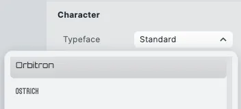

  

## Configuring Custom Typefaces[#](#configuring-custom-typefaces)

You can define your own typefaces by [creating a custom asset source](js/import-media/from-remote-source/unsplash-8f31f0/) and by registering it in the configuration under `ui.typefaceLibraries`. Each of the asset objects in the asset source must define a value for its `payload.typeface` property. A typeface consists of the following properties:

```
// Add a custom typeface asset source.instance.engine.asset.addLocalSource('my-custom-typefaces');instance.engine.asset.addAssetToSource('my-custom-typefaces', {  id: 'orbitron',  label: {    en: 'Orbitron'  },  payload: {    typeface: {      name: 'Orbitron',      fonts: [        {          uri: `${window.location.protocol}//${window.location.host}/Orbitron-Regular.ttf`,          subFamily: 'Regular',          weight: 'regular',          style: 'normal'        },        {          uri: `${window.location.protocol}//${window.location.host}/Orbitron-Bold.ttf`,          subFamily: 'Bold',          weight: 'bold',          style: 'normal'        }      ]    }  }});
```

*   `name: string` the name of the typeface, which is also shown in the dropdown.

```
name: 'Orbitron',
```

*   `fonts[]: Object` an array of objects, where each object describes a single font of the typeface. Each font has the following properties:
    *   `uri: string` points at the font file for this font style. Supports `http(s)://` and relative paths which resolve to the `baseURL`. TrueType, OpenType, and WOFF (and WOFF2) formats are supported.
    *   `subFamily: string` of the font. This is an arbitrary string as defined by the font file, e.g. ‘Regular’, ‘ExtraBold Italic’, ‘Book’, ‘Oblique’, etc. It is shown in the style dropdown in the inspector which lets users choose between all fonts of the selected typeface.
    *   `weight: string` of the font. One of `thin`, `extraLight`, `light`, `normal`, `medium`, `semiBold`, `bold`, `extraBold`, `heavy`. Defaults to `normal`.
    *   `style: string` of the font. One of `normal` & `italic`. Defaults to `normal`.

```
fonts: [  {    uri: `${window.location.protocol}//${window.location.host}/Orbitron-Regular.ttf`,    subFamily: 'Regular',    weight: 'regular',    style: 'normal'  },  {    uri: `${window.location.protocol}//${window.location.host}/Orbitron-Bold.ttf`,    subFamily: 'Bold',    weight: 'bold',    style: 'normal'  }]
```

## Removing the Default Typefaces[#](#removing-the-default-typefaces)

In case you want to remove all of the default typefaces we ship with the CE.SDK editor, you need to remove the id of our default asset source `ly.img.typeface` from the `ui.typefaceLibraries` array in the editor configuration.

```
    // 'ly.img.typeface',    'my-custom-typefaces'  ]},
```

---


[Source](http:/localhost:4321/js/stickers-and-shapes/overview-ebd6eb)

# Overview

CreativeEditor SDK (CE.SDK) lets you enrich your designs with **stickers** and **shapes**—two flexible building blocks for visual creativity.

*   **Stickers** are multi-color, multi-path graphics typically used for icons, emojis, logos, and decorative elements. Stickers cannot be recolored once imported.
*   **Shapes** are customizable graphical elements—such as rectangles, circles, and polygons—that you can freely recolor and adjust.

You can create, edit, and combine stickers and shapes either through the CE.SDK user interface or programmatically using the API. Both elements play essential roles in designing layouts, enhancing branding, and creating marketing graphics.

[Launch Web Demo](https://img.ly/showcases/cesdk)[

Get Started

](js/get-started/overview-e18f40/)

## Stickers vs. Shapes: Key Differences[#](#stickers-vs-shapes-key-differences)

| Category | Stickers | Shapes |
| --- | --- | --- |
| **Color Editing** | Not recolorable after import | Fully recolorable |
| **SVG Support** | Multi-color, multi-path SVGs supported | Single-color, single-path SVGs only |
| **Canvas Behavior** | Movable, resizable, rotatable | Movable, resizable, rotatable, recolorable |
| **Use Cases** | Icons, brand logos, emoji, detailed graphics | Graphical elements, backgrounds, visual framing |

When deciding between the two:

*   Use a **sticker** when you need detailed, multi-colored artwork that remains fixed in appearance.
*   Use a **shape** when you want design elements you can recolor, style, and adapt dynamically.

## Built-In Stickers and Shapes[#](#built-in-stickers-and-shapes)

CE.SDK offers a library of default assets to help you get started quickly.

*   **Default Stickers**: Common categories such as emojis, badges, symbols, and decorative graphics.
*   **Default Shapes**: Predefined types including rectangles, circles, polygons, stars, and custom paths.

These assets can be inserted directly through the UI or dynamically via the API.

## Custom Stickers and Custom Shapes[#](#custom-stickers-and-custom-shapes)

You can also import your own vector sticker and shape assets into CE.SDK:

*   **Custom Stickers**:
    
    *   Supported file type: SVG.
    *   Stickers can contain multiple paths and colors.
    *   Once imported, stickers behave like regular sticker assets but cannot be recolored.
*   **Custom Shapes**:
    
    *   Supported file type: SVG.
    *   Must consist of a **single path** and **single color**.
    *   Shapes can be recolored, resized, and customized after import.

Be mindful of these structural differences when preparing your SVG files.

## Editing Stickers and Shapes[#](#editing-stickers-and-shapes)

Once added to a scene, both stickers and shapes are fully interactive on the canvas.

*   **Editable properties for shapes**:
    
    *   Fill color
    *   Stroke color and width
    *   Border radius (for certain shapes like rectangles)
    *   Opacity
    *   Rotation
    *   Scaling
*   **Editable properties for stickers**:
    
    *   Size
    *   Rotation
    *   Opacity
    *   **Note:** Stickers cannot have their colors changed after import.

Both types of elements can be manipulated manually via the UI or programmatically through the CE.SDK API.

## Combining Stickers and Shapes[#](#combining-stickers-and-shapes)

CE.SDK allows you to combine multiple stickers or shapes using boolean operations to create new, complex designs.

*   **Combine**: Merges all selected elements into a single new shape.
*   **Subtract**: Removes the top element’s area from the bottom element.
*   **Intersect**: Keeps only the overlapping area of all selected elements.
*   **Exclude**: Keeps only the non-overlapping parts, removing the intersections.

These operations allow you to:

*   Create custom compound shapes.
*   Subtract logos or icons from backgrounds.
*   Design intricate, multi-part layouts from basic elements.

After combining, the resulting object behaves like a standard shape or sticker and can be resized, rotated, or styled according to its type.

## Working with Cutouts[#](#working-with-cutouts)

**Cutouts**—also called **cutout lines**—define the outline path around an object, often used for printing applications like custom stickers or die-cut designs.

In CE.SDK:

*   You can create cutouts around shapes or stickers.
*   Cutouts help in generating accurate printable paths or previewing how a sticker would be physically cut.
*   Cutouts are set in a specific spot color to control advanced print & cutting workflows.

Cutouts are an essential tool when preparing designs for production or physical printing workflows.

---


[Source](http:/localhost:4321/js/stickers-and-shapes/create-edit-7a2b5a)

# Create and Edit

---


[Source](http:/localhost:4321/js/stickers-and-shapes/create-cutout-384be3)

# Create Cutout

```
import CreativeEngine from 'https://cdn.img.ly/packages/imgly/cesdk-engine/1.57.0/index.js';
const config = {  license: 'mtLT-_GJwMhE7LDnO8KKEma7qSuzWuDxiKuQcxHKmz3fjaXWY2lT3o3Z2VdL5twm',  userId: 'guides-user',  baseURL: 'https://cdn.img.ly/packages/imgly/cesdk-engine/1.57.0/assets'};
CreativeEngine.init(config).then(async (engine) => {  document.getElementById('cesdk_container').append(engine.element);
  const scene = engine.scene.create();
  const page = engine.block.create('page');  engine.block.setWidth(page, 800);  engine.block.setHeight(page, 600);  engine.block.appendChild(scene, page);  engine.scene.zoomToBlock(page, 50, 50, 50, 50);
  var circle = engine.block.createCutoutFromPath(    'M 0,25 a 25,25 0 1,1 50,0 a 25,25 0 1,1 -50,0 Z'  );  engine.block.appendChild(page, circle);  engine.block.setFloat(circle, 'cutout/offset', 3.0);  engine.block.setEnum(circle, 'cutout/type', 'Dashed');
  var square = engine.block.createCutoutFromPath('M 0,0 H 50 V 50 H 0 Z');  engine.block.appendChild(page, square);  engine.block.setPositionX(square, 50);  engine.block.setFloat(square, 'cutout/offset', 6.0);
  var union = engine.block.createCutoutFromOperation([circle, square], 'Union');  engine.block.appendChild(page, union);  engine.block.destroy(circle);  engine.block.destroy(square);
  engine.editor.setSpotColorRGB('CutContour', 0.0, 0.0, 1.0);});
```

```
<!DOCTYPE html><html lang="en">  <head>    <meta charset="UTF-8" />    <meta name="viewport" content="width=device-width, initial-scale=1.0" />    <meta http-equiv="X-UA-Compatible" content="ie=edge" />    <style>      body {        margin: 0;        overflow: hidden;      }      html {        overscroll-behavior-x: contain;      }    </style>  </head>
  <body>    <div id="cesdk_container" style="width: 100%; height: 100vh"></div>    <script type="module" src="index.js">    </script>  </body></html>
```

Cutouts are a special feature one can use with cuttings printers. When printing a PDF file containing cutouts paths, a cutting printer will cut these paths with a cutter rather than print them with ink. Use cutouts to create stickers, iron on decals, etc.

Cutouts can be created from an SVG string describing its underlying shape. Cutouts can also be created from combining multiple existing cutouts using the boolean operations `Union`, `Difference`, `Intersection` and `XOR`.

Cutouts have a type property which can take one of two values: `Solid` and `Dashed`. Cutting printers recognize cutouts paths through their specially named spot colors. By default, `Solid` cutouts have the spot color `"CutContour"` to produce a continuous cutting line and `Dashed` cutouts have the spot colors `"PerfCutContour"` to produce a perforated cutting line. You may need to adjust these spot color names for you printer.

**Note** Note that the actual color approximation given to the spot color does not affect how the cutting printer interprets the cutout, only how it is rendered. The default color approximations are magenta for “CutContour” and green for “PerfCutContour”.

​Cutouts have an offset property that determines the distance at which the cutout path is rendered from the underlying path set when created.

## Setup the scene[#](#setup-the-scene)

We first create a new scene with a new page.

```
  document.getElementById('cesdk_container').append(engine.element);
  const scene = engine.scene.create();
  const page = engine.block.create('page');  engine.block.setWidth(page, 800);  engine.block.setHeight(page, 600);  engine.block.appendChild(scene, page);  engine.scene.zoomToBlock(page, 50, 50, 50, 50);
```

## Create cutouts[#](#create-cutouts)

Here we add two cutouts. First, a circle of type `Dashed` and with an offset of 3.0. Second, a square of default type `Solid` and an offset of 6.0.

```
  var circle = engine.block.createCutoutFromPath(    'M 0,25 a 25,25 0 1,1 50,0 a 25,25 0 1,1 -50,0 Z'  );  engine.block.appendChild(page, circle);  engine.block.setFloat(circle, 'cutout/offset', 3.0);  engine.block.setEnum(circle, 'cutout/type', 'Dashed');
  var square = engine.block.createCutoutFromPath('M 0,0 H 50 V 50 H 0 Z');  engine.block.appendChild(page, square);  engine.block.setPositionX(square, 50);  engine.block.setFloat(square, 'cutout/offset', 6.0);
```

## Combining multiple cutouts into one[#](#combining-multiple-cutouts-into-one)

Here we use the `Union` operation to create a new cutout that consists of the combination of the earlier two cutouts we have created. Note that we destroy the previously created `circle` and `square` cutouts as we don’t need them anymore and we certainly don’t want to printer to cut through those paths as well.

When combining multiple cutouts, the resulting cutout will be of the type of the first cutout given and an offset of 0. In this example, since the `circle` cutout is of type `Dashed`, the newly created cutout will also be of type `Dashed`.

**Warning** When using the Difference operation, the first cutout is the cutout that is subtracted _from_. For other operations, the order of the cutouts don’t matter.

```
var union = engine.block.createCutoutFromOperation([circle, square], 'Union');engine.block.appendChild(page, union);engine.block.destroy(circle);engine.block.destroy(square);
```

## Change the default color for Solid cutouts[#](#change-the-default-color-for-solid-cutouts)

For some reason, we’d like the cutouts of type `Solid` to not render as magenta but as blue. Knowing that `"CutContour"` is the spot color associated with `Solid`, we change it RGB approximation to blue. Thought the cutout will render as blue, the printer will still interpret this path as a cutting because of its special spot color name.

```
engine.editor.setSpotColorRGB('CutContour', 0.0, 0.0, 1.0);
```

## Full Code[#](#full-code)

Here’s the full code:

```
import CreativeEngine from 'https://cdn.img.ly/packages/imgly/cesdk-engine/1.57.0/index.js';
const config = {  license: 'mtLT-_GJwMhE7LDnO8KKEma7qSuzWuDxiKuQcxHKmz3fjaXWY2lT3o3Z2VdL5twm',  userId: 'guides-user',  baseURL:    'https://cdn.img.ly/packages/imgly/cesdk-engine/1.57.0/assets',};
CreativeEngine.init(config).then(async engine => {  document.getElementById('cesdk_container').append(engine.element);
  const scene = engine.scene.create();
  const page = engine.block.create('page');  engine.block.setWidth(page, 800);  engine.block.setHeight(page, 600);  engine.block.appendChild(scene, page);  engine.scene.zoomToBlock(page, 50, 50, 50, 50);
  var circle = engine.block.createCutoutFromPath(    'M 0,25 a 25,25 0 1,1 50,0 a 25,25 0 1,1 -50,0 Z',  );  engine.block.appendChild(page, circle);  engine.block.setFloat(circle, 'cutout/offset', 3.0);  engine.block.setEnum(circle, 'cutout/type', 'Dashed');
  var square = engine.block.createCutoutFromPath('M 0,0 H 50 V 50 H 0 Z');  engine.block.appendChild(page, square);  engine.block.setPositionX(square, 50);  engine.block.setFloat(square, 'cutout/offset', 6.0);
  var union = engine.block.createCutoutFromOperation([circle, square], 'Union');  engine.block.appendChild(page, union);  engine.block.destroy(circle);  engine.block.destroy(square);
  engine.editor.setSpotColorRGB('CutContour', 0.0, 0.0, 1.0);});
```

---


[Source](http:/localhost:4321/js/stickers-and-shapes/combine-2a9e26)

# Combine

```
import CreativeEngine from 'https://cdn.img.ly/packages/imgly/cesdk-engine/1.57.0/index.js';
const config = {  license: 'mtLT-_GJwMhE7LDnO8KKEma7qSuzWuDxiKuQcxHKmz3fjaXWY2lT3o3Z2VdL5twm',  userId: 'guides-user',  baseURL: 'https://cdn.img.ly/packages/imgly/cesdk-engine/1.57.0/assets'};
CreativeEngine.init(config).then(async (engine) => {  document.getElementById('cesdk_container').append(engine.element);
  const scene = engine.scene.create();
  const page = engine.block.create('page');  engine.block.setWidth(page, 800);  engine.block.setHeight(page, 600);  engine.block.appendChild(scene, page);
  const circle1 = engine.block.create('graphic');  engine.block.setShape(circle1, engine.block.createShape('ellipse'));  engine.block.setFill(circle1, engine.block.createFill('color'));  engine.block.setPositionX(circle1, 30);  engine.block.setPositionY(circle1, 30);  engine.block.setWidth(circle1, 40);  engine.block.setHeight(circle1, 40);  engine.block.appendChild(page, circle1);
  const circle2 = engine.block.create('graphic');  engine.block.setShape(circle2, engine.block.createShape('ellipse'));  engine.block.setFill(circle2, engine.block.createFill('color'));  engine.block.setPositionX(circle2, 80);  engine.block.setPositionY(circle2, 30);  engine.block.setWidth(circle2, 40);  engine.block.setHeight(circle2, 40);  engine.block.appendChild(page, circle2);
  const circle3 = engine.block.create('graphic');  engine.block.setShape(circle3, engine.block.createShape('ellipse'));  engine.block.setFill(circle3, engine.block.createFill('color'));  engine.block.setPositionX(circle3, 50);  engine.block.setPositionY(circle3, 50);  engine.block.setWidth(circle3, 50);  engine.block.setHeight(circle3, 50);  engine.block.appendChild(page, circle3);
  const union = engine.block.combine([circle1, circle2, circle3], 'Union');
  const text = engine.block.create('text');  engine.block.replaceText(text, 'Removed text');  engine.block.setPositionX(text, 10);  engine.block.setPositionY(text, 40);  engine.block.setWidth(text, 80);  engine.block.setHeight(text, 10);  engine.block.appendChild(page, text);
  const image = engine.block.create('graphic');  engine.block.setShape(image, engine.block.createShape('rect'));  const imageFill = engine.block.createFill('image');  engine.block.setFill(image, imageFill);  engine.block.setPositionX(image, 0);  engine.block.setPositionY(image, 0);  engine.block.setWidth(image, 100);  engine.block.setHeight(image, 100);  engine.block.setString(    imageFill,    'fill/image/imageFileURI',    'https://img.ly/static/ubq_samples/sample_1.jpg'  );  engine.block.appendChild(page, image);
  engine.block.sendToBack(image);  const difference = engine.block.combine([image, text], 'Difference');});
```

```
<!DOCTYPE html><html lang="en">  <head>    <meta charset="UTF-8" />    <meta name="viewport" content="width=device-width, initial-scale=1.0" />    <meta http-equiv="X-UA-Compatible" content="ie=edge" />    <style>      body {        margin: 0;        overflow: hidden;      }      html {        overscroll-behavior-x: contain;      }    </style>  </head>
  <body>    <div id="cesdk_container" style="width: 100%; height: 100vh"></div>    <script type="module" src="index.js">    </script>  </body></html>
```

You can use four different boolean operations on blocks to combine them into unique shapes. These operations are:

*   `'Union'`: adds all the blocks’ shapes into one
*   `'Difference'`: removes from the bottom-most block the shapes of the other blocks overlapping with it
*   `'Intersection'`: keeps only the overlapping parts of all the blocks’ shapes
*   `'XOR'`: removes the overlapping parts of all the block’s shapes

Combining blocks allows you to create a new block with a customized shape.

Combining blocks with the `union`, `intersection` or `XOR` operation will result in the new block whose fill is that of the top-most block and whose shape is the result of applying the operation pair-wise on blocks from the top-most block to the bottom-most block.

Combining blocks with the `difference` operation will result in the new block whose fill is that of the bottom-most block and whose shape is the result of applying the operation pair-wise on blocks from the bottom-most block to the top-most block.

The combined blocks will be destroyed.

**Only the following blocks can be combined**

*   A graphics block
*   A text block

```
isCombinable(ids: DesignBlockId[]): boolean
```

Checks whether blocks could be combined. Only graphics blocks and text blocks can be combined. All blocks must have the “lifecycle/duplicate” scope enabled.

*   `ids`: An array of block ids.
*   Returns Whether the blocks can be combined.

```
combine(ids: DesignBlockId[], op: BooleanOperation): DesignBlockId
```

Perform a boolean operation on the given blocks. All blocks must be combinable. See `isCombinable`. The parent, fill and sort order of the new block is that of the prioritized block. When performing a `Union`, `Intersection` or `XOR`, the operation is performed pair-wise starting with the element with the highest sort order. When performing a `Difference`, the operation is performed pair-wise starting with the element with the lowest sort order. Required scopes: ‘lifecycle/duplicate’, ‘lifecycle/destroy’

*   `ids`: The blocks to combine. They will be destroyed if “lifecycle/destroy” scope is enabled.
*   `op`: The boolean operation to perform.
*   Returns The newly created block or an error.

Here’s the full code:

```
// Create blocks and append to sceneconst star = engine.block.create('shapes/star');const rect = engine.block.create('shapes/rect');engine.block.appendChild(page, star);engine.block.appendChild(page, rect);
// Check whether the blocks may be combinedconst combinable = engine.block.isCombinable([star, rect]);if (combinable) {  const combined = engine.block.combine([star, rect], 'Union');}
```

## Combining three circles together[#](#combining-three-circles-together)

We create three circles and arrange in a recognizable pattern. Combing them with `'Union'` result in a single block with a unique shape. The result will inherit the top-most block’s fill, in this case `circle3`’s fill.

```
  const circle1 = engine.block.create('graphic');  engine.block.setShape(circle1, engine.block.createShape('ellipse'));  engine.block.setFill(circle1, engine.block.createFill('color'));  engine.block.setPositionX(circle1, 30);  engine.block.setPositionY(circle1, 30);  engine.block.setWidth(circle1, 40);  engine.block.setHeight(circle1, 40);  engine.block.appendChild(page, circle1);
  const circle2 = engine.block.create('graphic');  engine.block.setShape(circle2, engine.block.createShape('ellipse'));  engine.block.setFill(circle2, engine.block.createFill('color'));  engine.block.setPositionX(circle2, 80);  engine.block.setPositionY(circle2, 30);  engine.block.setWidth(circle2, 40);  engine.block.setHeight(circle2, 40);  engine.block.appendChild(page, circle2);
  const circle3 = engine.block.create('graphic');  engine.block.setShape(circle3, engine.block.createShape('ellipse'));  engine.block.setFill(circle3, engine.block.createFill('color'));  engine.block.setPositionX(circle3, 50);  engine.block.setPositionY(circle3, 50);  engine.block.setWidth(circle3, 50);  engine.block.setHeight(circle3, 50);  engine.block.appendChild(page, circle3);
  const union = engine.block.combine([circle1, circle2, circle3], 'Union');
```

To create a special effect of text punched out from an image, we create an image and a text. We ensure that the image is at the bottom as that is the base block from which we want to remove shapes. The result will be a block with the size, shape and fill of the image but with a hole in it in the shape of the removed text.

```
  const text = engine.block.create('text');  engine.block.replaceText(text, 'Removed text');  engine.block.setPositionX(text, 10);  engine.block.setPositionY(text, 40);  engine.block.setWidth(text, 80);  engine.block.setHeight(text, 10);  engine.block.appendChild(page, text);
  const image = engine.block.create('graphic');  engine.block.setShape(image, engine.block.createShape('rect'));  const imageFill = engine.block.createFill('image');  engine.block.setFill(image, imageFill);  engine.block.setPositionX(image, 0);  engine.block.setPositionY(image, 0);  engine.block.setWidth(image, 100);  engine.block.setHeight(image, 100);  engine.block.setString(    imageFill,    'fill/image/imageFileURI',    'https://img.ly/static/ubq_samples/sample_1.jpg'  );  engine.block.appendChild(page, image);
  engine.block.sendToBack(image);  const difference = engine.block.combine([image, text], 'Difference');
```

### Full Code[#](#full-code)

Here’s the full code:

```
import CreativeEngine from 'https://cdn.img.ly/packages/imgly/cesdk-engine/1.57.0/index.js';
const config = {  license: 'mtLT-_GJwMhE7LDnO8KKEma7qSuzWuDxiKuQcxHKmz3fjaXWY2lT3o3Z2VdL5twm',  userId: 'guides-user',  baseURL:    'https://cdn.img.ly/packages/imgly/cesdk-engine/1.57.0/assets',};
CreativeEngine.init(config).then(async engine => {  document.getElementById('cesdk_container').append(engine.element);
  const scene = engine.scene.create();
  const page = engine.block.create('page');  engine.block.setWidth(page, 800);  engine.block.setHeight(page, 600);  engine.block.appendChild(scene, page);
  const circle1 = engine.block.create('graphic');  engine.block.setShape(circle1, engine.block.createShape('ellipse'));  engine.block.setFill(circle1, engine.block.createFill('color'));  engine.block.setPositionX(circle1, 30);  engine.block.setPositionY(circle1, 30);  engine.block.setWidth(circle1, 40);  engine.block.setHeight(circle1, 40);  engine.block.appendChild(page, circle1);
  const circle2 = engine.block.create('graphic');  engine.block.setShape(circle2, engine.block.createShape('ellipse'));  engine.block.setFill(circle2, engine.block.createFill('color'));  engine.block.setPositionX(circle2, 80);  engine.block.setPositionY(circle2, 30);  engine.block.setWidth(circle2, 40);  engine.block.setHeight(circle2, 40);  engine.block.appendChild(page, circle2);
  const circle3 = engine.block.create('graphic');  engine.block.setShape(circle3, engine.block.createShape('ellipse'));  engine.block.setFill(circle3, engine.block.createFill('color'));  engine.block.setPositionX(circle3, 50);  engine.block.setPositionY(circle3, 50);  engine.block.setWidth(circle3, 50);  engine.block.setHeight(circle3, 50);  engine.block.appendChild(page, circle3);
  const union = engine.block.combine([circle1, circle2, circle3], 'Union');
  const text = engine.block.create('text');  engine.block.replaceText(text, 'Removed text');  engine.block.setPositionX(text, 10);  engine.block.setPositionY(text, 40);  engine.block.setWidth(text, 80);  engine.block.setHeight(text, 10);  engine.block.appendChild(page, text);
  const image = engine.block.create('graphic');  engine.block.setShape(image, engine.block.createShape('rect'));  const imageFill = engine.block.createFill('image');  engine.block.setFill(image, imageFill);  engine.block.setPositionX(image, 0);  engine.block.setPositionY(image, 0);  engine.block.setWidth(image, 100);  engine.block.setHeight(image, 100);  engine.block.setString(    imageFill,    'fill/image/imageFileURI',    'https://img.ly/static/ubq_samples/sample_1.jpg',  );  engine.block.appendChild(page, image);
  engine.block.sendToBack(image);  const difference = engine.block.combine([image, text], 'Difference');});
```

---


[Source](http:/localhost:4321/js/rules/overview-e27832)

# Overview

In CreativeEditor SDK (CE.SDK), _rules_—referred to as **scopes** in the API and code—are automated validations that help enforce design and layout standards during editing. You can use scopes to maintain brand guidelines, ensure print readiness, moderate content, and enhance the overall editing experience.

Scopes can be applied to both designs and videos, helping you deliver high-quality outputs while reducing the risk of common mistakes.

[Launch Web Demo](https://img.ly/showcases/cesdk)[

Get Started

](js/get-started/overview-e18f40/)

## Understanding Rules in CE.SDK[#](#understanding-rules-in-cesdk)

CE.SDK’s Rules system (scopes in code) can enable you to build validation logic to enforce a wide range of design and content requirements automatically. Here are some examples of what can be built on top of the SDK:

*   **Design constraints:**
    *   Minimum image resolution
    *   No elements placed outside visible canvas bounds
*   **Brand guidelines:**
    *   Approved fonts, colors, and logo usage
*   **Print-readiness:**
    *   Safe zones for trimming
    *   Bleed margin requirements
    *   High-resolution assets for print
*   **Content moderation:**
    *   Flagging potentially inappropriate images or text
*   **UI-specific constraints:**
    *   Safe zones to prevent critical content from being obscured by app UI elements
*   **Video editing rules:**
    *   Enforcing required trimming
    *   Protecting key content regions

## How Rules Work[#](#how-rules-work)

Validation with scopes happens continuously and automatically in the background as users edit their designs or videos. When a rule (scope) violation occurs, the SDK immediately notifies the user without requiring manual checks.

If the user corrects an issue (for example, by replacing a low-resolution image), the related notification clears automatically without needing a manual refresh or revalidation step. This dynamic, always-on validation keeps the editing workflow smooth and responsive.

## Automatic Notifications[#](#automatic-notifications)

When a scope is violated, CE.SDK surfaces a notification directly in the user interface. Notifications provide clear feedback and guide users to correct issues easily.

*   **Severity indicators:**
    *   **Critical errors** are shown in red (e.g., content outside the printable area)
    *   **Warnings** are shown in yellow (e.g., low-resolution image detected)
*   **Actionable feedback:**
    *   Clicking a notification brings the user directly to the affected element.
    *   Users can quickly resolve issues without needing technical expertise.

This system simplifies workflows, especially for users who are not familiar with technical print requirements or detailed layout standards.

## Benefits of Using Rules[#](#benefits-of-using-rules)

Integrating scopes into your CE.SDK experience offers multiple advantages:

*   **Reduce errors:** Minimize risks of misprints, layout problems, and brand inconsistency.
*   **Automatic compliance:** Validate designs and videos in real time without disrupting the creative process.
*   **Professional results:** Help users — including those without technical or print knowledge — achieve polished, production-ready outputs.
*   **Streamlined workflows:** Speed up editing and reduce manual review by surfacing issues early and clearly.

By leveraging scopes, you can ensure a higher standard of quality, consistency, and reliability across all designs created with CE.SDK.

---


[Source](http:/localhost:4321/js/prebuilt-solutions/video-editor-9e533a)

# JavaScript Video Editor SDK

CreativeEditor SDK is a Javascript library for creating and editing videos directly in a browser.

This CE.SDK configuration is highly customizable and extendible and offers a well-rounded suite of video editing features such as splitting, cropping and composing clips on a timeline.

[Launch Web Demo](https://img.ly/showcases/cesdk/video-ui/web) [View on GitHub](https://github.com/imgly/cesdk-web-examples/tree/main/showcase-video-ui/src/components/case/CaseComponent.jsx)

## Key Capabilities[#](#key-capabilities)


### Transform

Crop, flip, and rotate video operations.

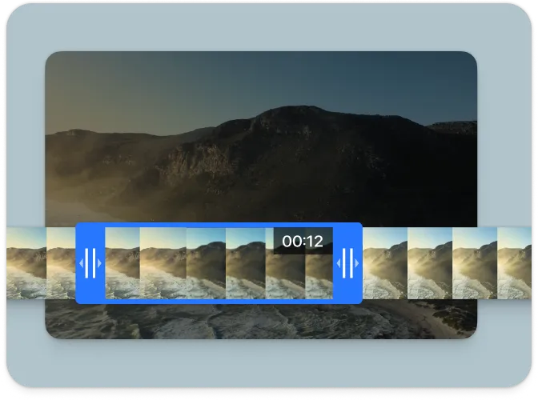

### Trim & Split

Set start and end time and split videos.

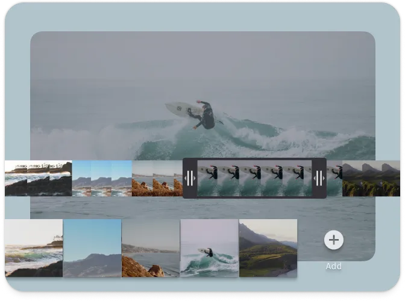

### Merge Videos

Pick, edit and merge several video clips into a single sequence.


### Video Collage

Arrange multiple clips on a single page.


### Client-Side Processing

All video editing operations are performed by our engine in the browser.


### Headless & Automation

Programmatically edit videos inside the browser.


### Extendible

Easily add functionality using the plugins & engine API.


### Customizable UI

Build Custom UIs.


### Asset Libraries

Add custom assets for filters, stickers, images and videos.


### Green Screen

Utilize chroma keying for background removal.


### Templating

Create role based design templates with placeholders and text variables.

## What is the Video Editor Solution?[#](#what-is-the-video-editor-solution)

The Video Editor is a prebuilt solution powered by the CreativeEditor SDK (CE.SDK) that enables fast integration of high-performance video editing into web, mobile, and desktop applications. It’s designed to help your users create professional-grade videos—from short social clips to long-form stories—directly within your app.

Skip building a video editor from scratch. This fully client-side solution provides a solid foundation with an extensible UI and a robust engine API to power video editing in any use case.

## Browser Support[#](#browser-support)

Video editing mode relies on modern web codecs, which are currently only available in the latest versions of Google Chrome, Microsoft Edge, or other Chromium-based browsers.

## Supported File Types[#](#supported-file-types)

[IMG.LY](http://img.ly/)’s Creative Editor SDK enables you to load, edit, and save **MP4 files** directly in the browser without server dependencies.

### Importing Media[#](#importing-media)

| Category | Supported Formats |
| --- | --- |
| **Images** | `.png`, `.jpeg`, `.jpg`, `.gif`, `.webp`, `.svg`, `.bmp` |
| **Video** | `.mp4` (H.264/AVC, H.265/HEVC), `.mov` (H.264/AVC, H.265/HEVC) |
| **Audio** | `.mp3`, `.m4a`, `.mp4` (AAC or MP3), `.mov` (AAC or MP3) |

Need to import a format not listed here? CE.SDK allows you to create custom importers for any file type by using our Scene and Block APIs programmatically.

### Exporting Media[#](#exporting-media)

| Category | Supported Formats |
| --- | --- |
| **Images** | `.png` (with transparency), `.jpeg`, `.webp`, `.tga` |
| **Video** | `.mp4` (H.264 or H.265 on supported platforms with limited transparency support) |
| **Print** | `.pdf` (supports underlayer printing and spot colors) |
| **Scene** | `.scene` (description of the scene without any assets) |
| **Archive** | `.zip` (fully self-contained archive that bundles the `.scene` file with all assets) |

Our custom cross-platform C++ based rendering and layout engine ensures consistent output quality across devices.

### Importing Templates[#](#importing-templates)

| Format | Description |
| --- | --- |
| `.idml` | InDesign |
| `.psd` | Photoshop |
| `.scene` | CE.SDK Native |

Need to import a format not listed here? CE.SDK allows you to create custom importers for any file type by using our Scene and Block APIs to generate scenes programmatically.

For detailed information, see the [full file format support list](js/file-format-support-3c4b2a/).

## Getting Started[#](#getting-started)

If you’re ready to start integrating CE.SDK into your Vue.js application, check out the CE.SDK [Getting Started guide](js/get-started/overview-e18f40/). In order to configure the editor for a video editing use case consult our [video editor UI showcase](https://img.ly/showcases/cesdk/video-ui/web) and its [reference implementation](https://github.com/imgly/cesdk-web-examples/blob/main/showcase-video-ui/src/components/case/CaseComponent.jsx).

## Understanding CE.SDK Architecture & API[#](#understanding-cesdk-architecture--api)

The following sections outline the fundamentals of CE.SDK’s video editor user interface and its technical architecture and APIs. CE.SDK architecture is designed to facilitate the creation, manipulation, and rendering of complex designs. At a high level, it consists of two main components: the CreativeEngine and the CreativeEditor UI. The following is an overview of these components and how they are reflected at the API level.

If you are already familiar with CE.SDK and want to get started integrating CE.SDK video editor check out our “Getting Started” guide or jump ahead to the “Essential Guides” section.

### CreativeEditor Video UI[#](#creativeeditor-video-ui)

CE.SDK’s video UI is designed to facilitate intuitive manipulation and creation of a range of video-based designs. The following are the key locations in the editor UI and extension points for your Ui customizations: 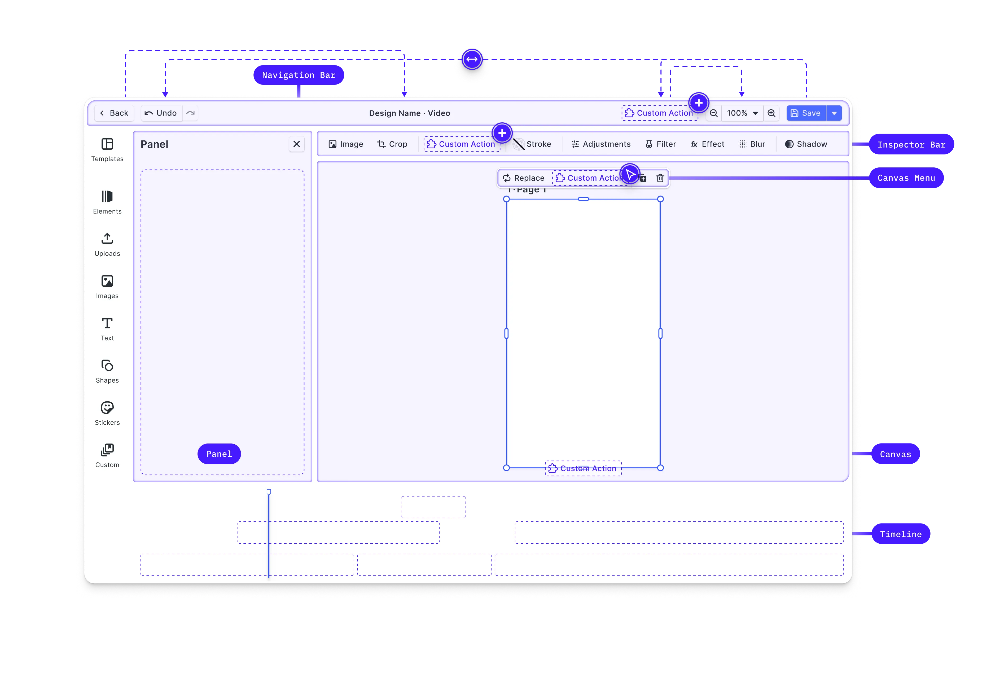

*   _Canvas_: The core interaction area for design content, controlled by the Creative Engine.
*   _Dock_: The primary entry point for user interactions not directly related to the selected block. It is primarily, though not exclusively, used to open panels with asset libraries or add elements to the canvas. [Learn how to add demo videos in the dock.](js/import-media-4e3703/)
*   _Canvas Menu_: Provides block-specific settings and actions such as deletion or duplication.
*   _Inspector Bar_: Main location for block-specific functionality. Any action or setting available for the currently selected block that does not appear in the canvas menu will be shown here.
*   _Navigation Bar_: For actions affecting browser navigation and global scene effects such as zoom or undo/redo.
*   _Canvas Bar_: For actions affecting the canvas or scene as a whole such as adding pages. This is an alternative place for actions such as zoom or redo/undo.
*   _Timeline_: The timeline is the main control for video editing. It is here that clips and audio strips can be positioned in time.

### CreativeEngine[#](#creativeengine)

The CreativeEngine is the core of CE.SDK, responsible for handling the rendering and manipulation of designs. It can be used independently (headless mode) or integrated with the CreativeEditor UI. The CreativeEngine provides several APIs to interact with and manipulate scenes. A scene is the visual context or environment within the CreativeEditor SDK where blocks (elements) are created, manipulated, and rendered.

### Key Features:[#](#key-features)

1.  **Scene Management**:
    *   Create, load, save, and [modify](js/concepts/blocks-90241e/) scenes.
    *   Control the zoom and camera position within scenes.
2.  **Block Manipulation**:
    *   Blocks are the basic building units of a scene, representing elements like shapes, images, and text.
    *   APIs to create, modify, and manage blocks.
    *   Properties of blocks (e.g., color, position, size) can be queried and set using specific methods.
3.  **Asset Management**:
    *   Manage assets like images, videos, and fonts.
    *   Load assets from URLs or local sources.
4.  **Variable Management**:
    *   Define and manipulate variables within scenes.
    *   Useful for template-based designs where dynamic content is required.
5.  **Event Handling**:
    *   Subscribe to events related to block creation, updates, and destruction.
    *   Manage user interactions and state changes.

## API Overview[#](#api-overview)

The APIs of CE.SDK are grouped into several categories, reflecting different aspects of scene management and manipulation.

[**Scene API :**](js/concepts/scenes-e8596d/)\- **Creating and Loading Scenes**: `jsx engine.scene.create(); engine.scene.loadFromURL(url);`

*   **Zoom Control**:
    
    ```
    engine.scene.setZoomLevel(1.0);engine.scene.zoomToBlock(blockId);
    ```
    

[**Block API :**](js/concepts/blocks-90241e/)\- **Creating Blocks**: `jsx const block = engine.block.create('shapes/star');`

*   **Setting Properties**:
    
    ```
    engine.block.setColor(blockId, 'fill/color', { r: 1, g: 0, b: 0, a: 1 });engine.block.setString(blockId, 'text/content', 'Hello World');
    ```
    
*   **Querying Properties**:
    
    ```
    const color = engine.block.getColor(blockId, 'fill/color');const text = engine.block.getString(blockId, 'text/content');
    ```
    

[**Variable API :**](js/create-templates/add-dynamic-content/text-variables-7ecb50/) Variables allow dynamic content within scenes to programmatically create variations of a design. - **Managing Variables**: `jsx engine.variable.setString('myVariable', 'value'); const value = engine.variable.getString('myVariable');`

**Asset API :**\- **Managing Assets**:

```
engine.asset.add('image', 'https://example.com/image.png');
```

[**Event API :**](js/concepts/events-353f97/)\- **Subscribing to Events**:

```
// Subscribe to scene changesengine.scene.onActiveChanged(() => {  const newActiveScene = engine.scene.get();});
```

### Example Usage[#](#example-usage)

Here is a simple example of initializing the CreativeEngine and creating a video scene with a text block:

```
import CreativeEngine from 'https://cdn.img.ly/packages/imgly/cesdk-engine/1.57.0/index.js';
const config = {  baseURL:    'https://cdn.img.ly/packages/imgly/cesdk-engine/1.57.0/assets',};
CreativeEngine.init(config).then(async engine => {  // Create a new scene  await engine.scene.createVideo();
  // Add a text block  const textBlock = engine.block.create('text');  engine.block.setString(textBlock, 'text/content', 'Hello, CE.SDK!');
  // Set the color of the text  engine.block.setColor(textBlock, 'fill/color', { r: 0, g: 0, b: 0, a: 1 });
  // Attach the engine canvas to the DOM  document.getElementById('cesdk_container').append(engine.element);});
```

This example demonstrates how to initialize the CreativeEngine, create a scene, add a text block, and set its properties. The flexibility of the APIs allows for extensive customization and automation of design workflows. To learn more about how to power your own UI or creative workflows with the CreativeEngine have a look at the [engine guides](js/guides-8d8b00/).

### Customization Options[#](#customization-options)

CE.SDK provides extensive customization options to adapt the UI to various use cases. These options range from simple configuration changes to more advanced customizations involving callbacks and custom elements.

### Basic Customizations[#](#basic-customizations)

*   **Configuration Object**: When initializing the CreativeEditor, you can pass a configuration object that defines basic settings such as the base URL for assets, the language, theme, and license key.
    
    ```
    const config = {  baseURL:    'https://cdn.img.ly/packages/imgly/cesdk-engine/1.57.0/assets',  license: 'your-license-key',  locale: 'en',  theme: 'light',};
    ```
    
*   **Localization**: Customize the language and labels used in the editor to support different locales.
    
    ```
    const config = {  i18n: {    en: {      variables: {        my_custom_variable: {          label: 'Custom Label',        },      },    },  },};
    ```
    
*   [Custom Asset Sources](js/import-media/concepts-5e6197/): Serve custom video or image assets from a remote URL.
    

### UI Customization Options[#](#ui-customization-options)

*   **Theme**: Choose between predefined themes such as ‘dark’ or ‘light’.
    
    ```
    const config = {  theme: 'dark',};
    ```
    
*   **UI Components**: Enable or disable specific UI components based on your requirements.
    
    ```
    const config = {  ui: {    elements: {      toolbar: true,      inspector: false,    },  },};
    ```
    

### Advanced Customizations[#](#advanced-customizations)

Learn more about extending editor functionality and customizing its UI to your use case by consulting our in-depth [customization guide](js/user-interface/ui-extensions-d194d1/). Here is an overview of the APIs and components available to you.

### Order APIs[#](#order-apis)

Customization of the web editor’s components and their order within these locations is managed through specific Order APIs, allowing the addition, removal, or reordering of elements. Each location has its own Order API, e.g., `setDockOrder`, `setCanvasMenuOrder`, `setInspectorBarOrder`, `setNavigationBarOrder`, and `setCanvasBarOrder`.

### Layout Components[#](#layout-components)

CE.SDK provides special components for layout control, such as `ly.img.separator` for separating groups of components and `ly.img.spacer` for adding space between components.

### Registration of New Components[#](#registration-of-new-components)

Custom components can be registered and integrated into the web editor using builder components like buttons, dropdowns, and inputs. These components can replace default ones or introduce new functionalities, deeply integrating custom logic into the editor.

### Feature API[#](#feature-api)

The Feature API enables conditional display and functionality of components based on the current context, allowing for dynamic customization. For example, you can hide certain buttons for specific block types.

## Plugins[#](#plugins)

You can customize the CE.SDK web editor during its initialization using the APIs outlined above. For many use cases, this will be adequate. However, there are times when you might want to encapsulate functionality for reuse. This is where plugins become useful. Follow our [guide on building your own plugins](js/user-interface/ui-extensions-d194d1/) to learn more or check out one of the plugins we built using this api:

[**Background Removal**](js/edit-image/remove-bg-9dfcf7/): Adds a button to the canvas menu to remove image backgrounds. [**Vectorizer**](js/edit-image/vectorize-2b4c7f/): Adds a button to the canvas menu to quickly vectorize a graphic.

## Framework Support[#](#framework-support)

CreativeEditor SDK’s video editing library is compatible with any Javascript including, React, Angular, Vue.js, Svelte, Blazor, Next.js, Typescript. It is also compatible with desktop and server-side technologies such as electron, PHP, Laravel and Rails.

## Ready to get started?

With a free trial and pricing that fits your needs, it's easy to find the best solution for your product.

[Free Trial](https://img.ly/forms/free-trial)

### 500M+

video and photo creations are powered by IMG.LY every month


---


[Source](http:/localhost:4321/js/prebuilt-solutions/t-shirt-designer-02b48f)

# T-Shirt Designer in JavaScript

Quickly add a professional-grade t-shirt design editor to your web app with CE.SDK.

[

Launch Web Demo

](https://img.ly/showcases/cesdk/apparel-editor-ui/)[

View on GitHub

](https://github.com/imgly/cesdk-web-examples/tree/main/showcase-apparel-editor-ui)

## What is the T-Shirt Designer Solution?[#](#what-is-the-t-shirt-designer-solution)

The T-Shirt Designer is a pre-configured instance of the CreativeEditor SDK (CE.SDK) tailored for apparel design workflows. It enables your users to create high-quality, print-ready t-shirt designs directly in your app—whether for a custom merchandise platform, print-on-demand storefront, or internal design tool.

This solution comes with a realistic t-shirt mockup background, precise boundary enforcement, and a simplified UI. You can easily integrate it across web, mobile, or desktop platforms and customize it to match your brand or workflow.

## Key Features[#](#key-features)

*   **T-Shirt backdrop with placement guidance**  
    A visually accurate t-shirt background helps users place artwork exactly where it will appear when printed.
    
*   **Strict print area enforcement**  
    Elements that extend beyond the defined print region are clipped automatically, ensuring print precision.
    
*   **Placeholder-based template editing**  
    Supports templates with editable placeholders, such as swappable images. Define which parts of a design are user-editable by toggling between Creator and Adopter modes.
    
*   **Print-ready PDF export**  
    Outputs print-quality PDFs to seamlessly fit into your existing production workflows.
    
*   **Fully customizable UI**  
    Adapt the interface and features to suit your brand and user needs using the CE.SDK configuration API.
    

## Why Use This Solution?[#](#why-use-this-solution)

*   **Accelerated development**  
    Save engineering time with a ready-made editor specifically configured for t-shirt design.
    
*   **Better user experience**  
    The focused UI reduces complexity, guiding users through apparel creation with built-in visual feedback and safeguards.
    
*   **Seamless print integration**  
    The export format and boundary enforcement make it ideal for print-on-demand systems with no additional post-processing required.
    
*   **Flexible and extensible**  
    As with all CE.SDK solutions, the T-Shirt Designer is deeply customizable—extend features, change design constraints, or integrate external data and asset libraries.

---


[Source](http:/localhost:4321/js/prebuilt-solutions/postcard-editor-61e1f6)

# JavaScript Postcard Editor

The Postcard Editor is a prebuilt CreativeEditor SDK (CE.SDK) solution designed for quickly creating and personalizing postcards and greeting cards. It provides an intuitive UI that guides users through selecting a design, editing its contents, and customizing messaging—all without needing design expertise.

This ready-to-use editor can be easily added to your web app and fully customized to match your brand, making it ideal for direct mail campaigns, seasonal greetings, or personalized customer engagement.

[

Launch Web Demo

](https://img.ly/showcases/cesdk/post-greeting-cards/)[

View on GitHub

](https://github.com/imgly/cesdk-web-examples/tree/main/showcase-post-greeting-cards)

## What is the Postcard Editor Solution?[#](#what-is-the-postcard-editor-solution)

The Postcard Editor is a prebuilt CreativeEditor SDK (CE.SDK) solution designed for quickly creating and personalizing postcards and greeting cards. It provides an intuitive UI that guides users through selecting a design, editing its contents, and customizing messaging—all without needing design expertise.

With built-in support for style presets, design constraints, and variable-driven personalization, the Postcard Editor enables scalable creation of high-quality, print-ready content for direct mail, seasonal greetings, and personalized campaigns.

## Key Features[#](#key-features)

*   **Style presets**  
    Jump-start the design process with a collection of professionally crafted postcard templates.
    
*   **Design mode**  
    After selecting a style, users can personalize the design. Depending on the template configuration, they can:
    
    *   Change accent and background colors
    *   Replace photos from a library or upload their own
    *   Edit headings and body text (fonts, colors, layout)
    *   Add stickers, shapes, or other decorative elements
*   **Write mode**  
    Users can add a personal message and address the card. Text styling options include font, size, and color customization.
    
*   **Dynamic variables**  
    Enable scalable personalization using variables like `{{firstname}}` or `{{address}}`. Templates can be connected to external data sources for automated batch generation.
    
*   **Print-ready export**  
    Designs are exported in high-resolution, print-friendly formats, suitable for direct mail or digital delivery.
    

## Why Use This Solution?[#](#why-use-this-solution)

*   **Accelerate development**  
    Save time with a pre-configured UI that’s production-ready and easily customizable via CE.SDK’s headless API.
    
*   **Empower non-designers**  
    Make creative tools accessible to any user by enforcing design constraints and simplifying the editing experience.
    
*   **Scale personalization**  
    Integrate with external data to programmatically generate personalized postcards for marketing, e-commerce, or events.
    
*   **Cross-platform ready**  
    The Postcard Editor works across web, mobile, and desktop environments, offering a seamless user experience wherever it’s deployed.

---


[Source](http:/localhost:4321/js/prebuilt-solutions/photobook-editor-eb3fbe)

# JavaScript Photobook Editor

Easily embed a customizable photobook editor into your web app using CreativeEditor SDK (CE.SDK). Designed for developers building personalized print or digital experiences, this solution offers a clean, guided UI tailored for photobook creation — from theme selection to multi-page layout management.

[

Launch Web Demo

](https://img.ly/showcases/cesdk/photobook-ui/)[

View on GitHub

](https://github.com/imgly/cesdk-web-examples/tree/main/showcase-photobook-ui)

## What is the Photobook Editor Solution?[#](#what-is-the-photobook-editor-solution)

The Photobook Editor is a pre-built solution built with CE.SDK’s headless API. It’s designed to help developers quickly deliver a fully functional photobook creation experience inside their app. This solution limits complexity for end users by exposing only the most relevant tools: theming, layout selection, and photo placement.

From weddings to holidays to portfolios, the Photobook Editor makes it easy to start from themed templates, drop in photos, and customize each page with simple, intuitive controls.

## Key Features[#](#key-features)

*   **Theme selector**  
    Allow users to personalize their photobook based on a specific event or aesthetic. Themes can be applied per page for full creative flexibility.
    
*   **Multi-page layout management**  
    Users can add, remove, and reorder pages, with built-in layout templates guiding them to a clean, finished look.
    
*   **Placeholder-driven editing**  
    Built-in placeholders make adding and replacing photos effortless — just click to upload and crop as needed.
    
*   **Sticker and asset library integration**  
    Quickly add embellishments or brand elements using an extendable asset library.
    
*   **Guided UI**  
    A simplified toolbar and sidebar help users focus on key actions, reducing friction and enabling fast photobook creation.
    
*   **Smart defaults**  
    Users start with a few pre-populated pages that offer different layouts — helping them begin designing immediately without a blank canvas.
    

## Why Use This Solution?[#](#why-use-this-solution)

*   **Accelerated time-to-market**  
    Avoid building a photobook editor from scratch. Use this ready-made UI as a fast foundation for personalization features.
    
*   **Customizable and extensible**  
    Built on CE.SDK’s headless API, the editor can be tailored to fit your branding, data sources, or workflow needs.
    
*   **User-friendly by design**  
    The editor surfaces only the most relevant features for your users, streamlining the experience and boosting completion rates.
    
*   **Ideal for e-commerce, printing, and creative platforms**  
    Whether you’re building a photobook flow for print-on-demand, event keepsakes, or digital albums — this solution helps you deliver a polished experience fast.

---


[Source](http:/localhost:4321/js/prebuilt-solutions/photo-editor-42ccb2)

# Javascript Photo Editor SDK

The CreativeEditor SDK provides a powerful and intuitive solution designed for seamless photo editing directly in the browser.

This CE.SDK configuration is fully customizable, offering a range of features that cater to various use cases, from simple photo adjustments, image compositions with background removal, to programmatic editing at scale.

Whether you are building a photo editing application for social media, e-commerce, or any other platform, the CE.SDK Javascript Image Editor provides the tools you need to deliver a best-in-class user experience.

[Launch Web Demo](https://img.ly/showcases/cesdk/photo-editor-ui/web)[

View on GitHub

](https://github.com/imgly/cesdk-web-examples/tree/main/showcase-photo-editor-ui/src/components/case/CaseComponent.jsx)

## Key Capabilities[#](#key-capabilities)


### Transform

Easily perform operations like cropping, rotating, and resizing your design elements to achieve the perfect composition.


### Asset Management

Import and manage stickers, images, shapes, and other assets to build intricate and visually appealing designs.


### Text Editing

Add and style text blocks with a variety of fonts, colors, and effects, giving users the creative freedom to express themselves.


### Client-Side Processing

All editing operations are performed directly in the browser, ensuring fast performance without the need for server dependencies.


### Headless & Automation

Programmatically edit designs using the engine API, allowing for automated workflows and advanced integrations within your application.


### Extendible

Enhance functionality with plugins and custom scripts, making it easy to tailor the editor to specific needs and use cases.


### Customizable UI

Design and integrate custom user interfaces that align with your application’s branding and user experience requirements.


### Background Removal

Utilize the powerful background removal plugin to allow users to effortlessly remove backgrounds from images, entirely on the Client-Side.

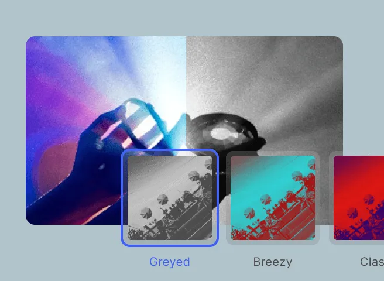

### Filters & Effects

Choose from a wide range of filters and effects to add professional-grade finishing touches to photos, enhancing their visual appeal.


### Size Presets

Access a variety of size presets tailored for different use cases, including social media formats and print-ready dimensions.

## What is the Photo Editor Solution?[#](#what-is-the-photo-editor-solution)

The Photo Editor is a fully customizable CE.SDK configuration focused on photo-centric use cases. It strips down the editor interface to include only the most relevant features for image adjustments — giving users a focused and responsive experience. Whether your users need to fine-tune selfies, prepare product photos, or create profile images, this solution makes it easy.

Get a powerful photo editor into your app with minimal setup. The Photo Editor runs entirely client-side — which helps reduce cloud computing costs and improve privacy.

## Browser Support[#](#browser-support)

The CE.SDK Design Editor is optimized for use in modern web browsers, ensuring compatibility with the latest versions of Chrome, Firefox, Edge, and Safari.

See the full list of [supported browsers here](js/browser-support-28c1b0/).

## Supported File Types[#](#supported-file-types)

[IMG.LY](http://img.ly/)’s Creative Editor SDK enables you to load, edit, and save images directly in the browser without server dependencies.

### Importing Media[#](#importing-media)

| Category | Supported Formats |
| --- | --- |
| **Images** | `.png`, `.jpeg`, `.jpg`, `.gif`, `.webp`, `.svg`, `.bmp` |
| **Video** | `.mp4` (H.264/AVC, H.265/HEVC), `.mov` (H.264/AVC, H.265/HEVC) |
| **Audio** | `.mp3`, `.m4a`, `.mp4` (AAC or MP3), `.mov` (AAC or MP3) |

Need to import a format not listed here? CE.SDK allows you to create custom importers for any file type by using our Scene and Block APIs programmatically.

### Exporting Media[#](#exporting-media)

| Category | Supported Formats |
| --- | --- |
| **Images** | `.png` (with transparency), `.jpeg`, `.webp`, `.tga` |
| **Video** | `.mp4` (H.264 or H.265 on supported platforms with limited transparency support) |
| **Print** | `.pdf` (supports underlayer printing and spot colors) |
| **Scene** | `.scene` (description of the scene without any assets) |
| **Archive** | `.zip` (fully self-contained archive that bundles the `.scene` file with all assets) |

Our custom cross-platform C++ based rendering and layout engine ensures consistent output quality across devices.

### Importing Templates[#](#importing-templates)

| Format | Description |
| --- | --- |
| `.idml` | InDesign |
| `.psd` | Photoshop |
| `.scene` | CE.SDK Native |

Need to import a format not listed here? CE.SDK allows you to create custom importers for any file type by using our Scene and Block APIs to generate scenes programmatically.

For detailed information, see the [full file format support list](js/file-format-support-3c4b2a/).

## Getting Started[#](#getting-started)

If you’re ready to start integrating CE.SDK into your Javascript application, check out the CE.SDK [Getting Started guide](js/get-started/overview-e18f40/).

In order to configure the editor for an image editing use case consult our [photo editor UI showcase](https://img.ly/showcases/cesdk/photo-editor-ui/web#c) and its [reference implementation](https://github.com/imgly/cesdk-web-examples/tree/main/showcase-photo-editor-ui/src/components/case/CaseComponent.jsx).

## Understanding CE.SDK Architecture & API[#](#understanding-cesdk-architecture--api)

The following sections provide an overview of the key components of the CE.SDK photo editor UI and its API architecture.

If you’re ready to start integrating CE.SDK into your application, check out our [Getting Started guide](js/get-started/overview-e18f40/) or explore the Essential Guides.

### CreativeEditor Photo UI[#](#creativeeditor-photo-ui)

The CE.SDK photo editor UI is a specific configuration of the CE.SDK which focuses the Editor UI to essential photo editing features.

It further includes our powerful background removal plugin that runs entirely on the users device, saving on computing costs.

This configuration can be further modified to suit your needs, see the section on customization.

Designed for intuitive interaction, enabling users to create and edit designs with ease. Key components include: 

*   _Canvas_: The primary workspace where users interact with their photo content.
*   _Dock_: Provides access to tools and assets that are not directly related to the selected image or block, often used for adding or managing assets.
*   _Inspector Bar_: Controls properties specific to the selected block, such as size, rotation, and other adjustments.
*   _Canvas Menu_: Provides block-specific settings and actions such as deletion or duplication.
*   _Canvas Bar_: For actions affecting the canvas or scene as a whole such as adding pages. This is an alternative place for actions such as zoom or redo/undo.
*   _Navigation Bar_: Offers global actions such as undo/redo, zoom controls, and access to export options.

Learn more about interacting with and customizing the photo editor UI in our design editor UI guide.

### CreativeEngine[#](#creativeengine)

At the heart of CE.SDK is the CreativeEngine, which powers all rendering and design manipulation tasks.

It can be used in headless mode or in combination with the CreativeEditor UI.

Key features and APIs provided by CreativeEngine include:

*   **Scene Management:** Create, load, save, and manipulate design scenes programmatically.
*   **Block Manipulation:** Create and manage elements such as images, text, and shapes within the scene.
*   **Asset Management:** Load and manage assets like images and SVGs from URLs or local sources.
*   **Variable Management:** Define and manipulate variables for dynamic content within scenes.
*   **Event Handling:** Subscribe to events such as block creation or selection changes for dynamic interaction.

## API Overview[#](#api-overview)

CE.SDK’s APIs are organized into several categories, each addressing different aspects of scene and content management.

The engine API is relevant if you want to programmatically manipulate images to create or modify them at scale.

[**Scene API:**](js/concepts/scenes-e8596d/)\- **Creating and Loading Scenes**:

```
engine.scene.create();engine.scene.loadFromURL(url);
```

*   **Zoom Control**:
    
    ```
    engine.scene.setZoomLevel(1.0);engine.scene.zoomToBlock(blockId);
    ```
    

[**Block API:**](js/concepts/blocks-90241e/)\- **Creating Blocks**:

```
const block = engine.block.create('shapes/rectangle');
```

*   **Setting Properties**:
    
    ```
    engine.block.setColor(blockId, 'fill/color', { r: 1, g: 0, b: 0, a: 1 });engine.block.setString(blockId, 'text/content', 'Hello World');
    ```
    
*   **Querying Properties**:
    
    ```
    const color = engine.block.getColor(blockId, 'fill/color');const text = engine.block.getString(blockId, 'text/content');
    ```
    

[**Variable API:**](js/create-templates/add-dynamic-content/text-variables-7ecb50/)\- **Managing Variables**:

```
engine.variable.setString('myVariable', 'value');const value = engine.variable.getString('myVariable');
```

[**Asset API:**](js/import-media/concepts-5e6197/)\- **Managing Assets**:

```
engine.asset.add('image', 'https://example.com/image.png');
```

[**Event API:**](js/concepts/events-353f97/)\- **Subscribing to Events**:

```
engine.scene.onActiveChanged(() => {  const newActiveScene = engine.scene.get();});
```

### Basic Automation Example[#](#basic-automation-example)

The following automation example shows how to turn an image block into a square format for a platform such as Instagram.

```
// Assuming you have an initialized engine and a selected block (which is an image block)
// Example dimensionsconst newWidth = 1080; // Width in pixelsconst newHeight = 1080; // Height in pixels
// Get the ID of the image block you want to resizeconst imageBlockId = engine.block.findByType('image')[0];
// Resize the image blockengine.block.setWidth(imageBlockId, newWidth);engine.block.setHeight(imageBlockId, newHeight);
// Optionally, you can ensure the content fills the new dimensionsengine.block.setContentFillMode(imageBlockId, 'Cover');
```

## Customizing the CE.SDK Photo Editor[#](#customizing-the-cesdk-photo-editor)

CE.SDK provides extensive customization options, allowing you to tailor the UI and functionality to meet your specific needs.

This can range from basic configuration settings to more advanced customizations involving callbacks and custom elements.

### Basic Customizations[#](#basic-customizations)

*   **Configuration Object:** Customize the editor’s appearance and functionality by passing a configuration object during initialization.
    
    ```
    const config = {  baseURL:    'https://cdn.img.ly/packages/imgly/cesdk-engine/1.57.0/assets',  license: 'your-license-key',  locale: 'en',  theme: 'light',};
    ```
    
*   **Localization:** Adjust the editor’s language and labels to support different locales.
    
    ```
    const config = {  i18n: {    en: {      'libraries.ly.img.insert.text.label': 'Add Caption',    },  },};
    ```
    
*   **Custom Asset Sources:** Serve custom sticker or shape assets from a remote URL.
    

### UI Customization Options[#](#ui-customization-options)

*   **Theme:** Choose between ‘dark’ or ‘light’ themes.
    
    ```
    const config = {  theme: 'dark',};
    ```
    
*   **UI Components:** Enable or disable specific UI components as per your application’s needs.
    
    ```
    const config = {  ui: {    elements: {      toolbar: true,      inspector: false,    },  },};
    ```
    

## Advanced Customizations[#](#advanced-customizations)

For deeper customization, [explore the range of APIs](js/user-interface-5a089a/) available for extending the functionality of the photo editor.

You can customize the order of components, add new UI elements, and even develop your own plugins to introduce new features.

## Plugins[#](#plugins)

For cases where encapsulating functionality for reuse is necessary, plugins provide an effective solution.

Use our [guide on building plugins](js/user-interface/ui-extensions/add-custom-feature-2a26b6/) to get started, or explore existing plugins like **Background Removal** and **Vectorizer**.

## Ready to get started?

With a free trial and pricing that fits your needs, it's easy to find the best solution for your product.

[Free Trial](https://img.ly/forms/free-trial)

### 500M+

video and photo creations are powered by IMG.LY every month


---


[Source](http:/localhost:4321/js/prebuilt-solutions/multi-image-generation-163d37)

# JavaScript Multi-Image Generator

Generate multiple on-brand image variations from a single data source — and embed the entire workflow into your web application using CreativeEditor SDK (CE.SDK).

[

Launch Web Demo

](https://img.ly/showcases/cesdk/multi-image-generation/)[

View on GitHub

](https://github.com/imgly/cesdk-web-examples/tree/main/showcase-multi-image-generation)

## What is the Multiple Image Generator Solution?[#](#what-is-the-multiple-image-generator-solution)

The Multiple Image Generator is a prebuilt web solution built on top of CE.SDK that enables developers to programmatically generate multiple design variations from a single data input. This is especially useful for automating content creation at scale — such as product promotions, social media visuals, or user-generated reviews — while ensuring design consistency.

This solution uses CE.SDK’s headless API to interpolate structured data into customizable templates. Developers can easily embed it into their applications to deliver dynamic image generation without requiring manual design work.

## Key Features[#](#key-features)

*   **Programmatic design generation**  
    Automatically populate templates with structured data using CE.SDK’s variable and placeholder APIs.
    
*   **Multi-template support**  
    Generate different branded variants of the same content for different platforms or audiences.
    
*   **Headless API**  
    Run design logic entirely in code — no UI required — making it easy to integrate with backends or automation workflows.
    
*   **Template-driven design**  
    Easily update or swap templates to reflect new branding, formats, or campaign needs.
    
*   **Live preview and export**  
    Review auto-generated assets in real time and export them in a variety of formats for production use.
    

## Why Use This Solution?[#](#why-use-this-solution)

The Multiple Image Generator helps developers:

*   **Accelerate content workflows**  
    Eliminate repetitive design tasks by generating multiple assets from structured data, such as CSV rows or API responses.
    
*   **Maintain brand consistency at scale**  
    Every output adheres to a pre-defined visual standard — ensuring a polished and on-brand result.
    
*   **Embed creative automation into apps**  
    Offer your users the ability to personalize and publish visual content dynamically, all within your platform.
    
*   **Scale across platforms**  
    Generate variants for different social media formats, marketing channels, or regional campaigns in one flow.
    

This prebuilt solution is ideal for platforms focused on product marketing, social content automation, reviews, or e-commerce — and gives you full control over templates, logic, and output.

---


[Source](http:/localhost:4321/js/prebuilt-solutions/mockup-editor-be928b)

# Product Mockup Generator & Editor in JavaScript

Visualize the final product with confidence using the Mockup Editor, a prebuilt solution built on top of CreativeEditor SDK (CE.SDK). Easily embed it into your web application to enable real-time product previews across a range of formats, from apparel to postcards.

[

Launch Web Demo

](https://img.ly/showcases/cesdk/mockup-editor/)[

View on GitHub

](https://github.com/imgly/cesdk-web-examples/tree/main/showcase-mockup-editor)

## What is the Mockup Editor Solution?[#](#what-is-the-mockup-editor-solution)

The Mockup Editor is a ready-to-use interface powered by CE.SDK that lets users preview designs mapped directly onto real-world product surfaces. This preview experience helps users catch layout issues early and make informed design decisions—especially useful in e-commerce, print-on-demand, and marketing workflows.

This solution is optimized for a seamless in-browser experience and supports a variety of common formats:

*   **Apparel**
*   **Business cards**
*   **Postcards**
*   **Posters**
*   **Social media visuals**

Each format comes with a tailored preview mode, ensuring realistic and product-specific mockups.

## Key Features[#](#key-features)

*   **Live Preview Rendering**  
    All design changes are immediately reflected in the mockup preview, allowing users to validate their work without switching tools.
    
*   **Fullscreen & Export Support**  
    Users can enter fullscreen mode for a closer inspection of the final product and export their mockup directly from the interface.
    
*   **Editable Design Surface**  
    Reopen the design view from within the mockup preview to tweak layout, background, sizing, and other style elements—all without leaving the flow.
    
*   **Multiple Mockup Types**  
    Preconfigured mockups for apparel, stationery, and digital assets let you tailor the experience to your use case.
    

## Why Use This Solution?[#](#why-use-this-solution)

The Mockup Editor offers a powerful combination of usability and flexibility:

*   **Reduce Friction**  
    Let users preview and refine designs in one place—no back-and-forth between editing tools and preview windows.
    
*   **Accelerate Go-to-Market**  
    Help teams move faster by streamlining visual validation in workflows like product launches, custom merchandise, or campaign content.
    
*   **Enhance Personalization**  
    Ideal for platforms offering user-generated content or product customization. Integrate the Mockup Editor to give users a visual proof of concept before ordering or publishing.
    
*   **Easy to Embed**  
    Designed for developers, the Mockup Editor can be added to any web app with minimal setup. Customize the experience or use it as-is to quickly provide professional-grade mockup previews.

---


[Source](http:/localhost:4321/js/prebuilt-solutions/design-generation-0c8c73)

# Generate Designs with JavaScript

Automatically generate on-brand visuals with the Design Generator, a prebuilt solution built on top of CreativeEditor SDK (CE.SDK). Easily embed it into your web application to produce dynamic assets at scale—from social posts to promotional videos.

[

Launch Web Demo

](https://img.ly/showcases/cesdk/headless-design/)[

View on GitHub

](https://github.com/imgly/cesdk-web-examples/tree/main/showcase-headless-design)

## What is the Design Generator Solution?[#](#what-is-the-design-generator-solution)

The Design Generator is a pre-built solution powered by CreativeEditor SDK (CE.SDK) that enables developers to programmatically create design variations from a set of input parameters. Whether you’re building a social media automation tool or a creative content engine, this solution lets you generate ready-to-use assets—such as static images and short video clips—based on user or system-defined data.

Built with CE.SDK’s headless API, this solution runs fully in the browser and can be embedded into any web application. It combines the flexibility of templated design logic with the scalability of automation.

## Key Features[#](#key-features)

*   **Automated Design Generation**  
    Generate assets dynamically using a combination of input fields, preconfigured templates, and the CE.SDK variable and placeholder APIs.
    
*   **Data Integration**  
    Seamlessly connect to external sources (e.g., podcast libraries or CMS data) to drive content generation.
    
*   **Multi-format Output**  
    Export assets in different aspect ratios and sizes, including formats like Instagram Stories, Facebook Posts, and custom resolutions.
    
*   **Real-time Editing**  
    Let users refine auto-generated content in a UI-based editor powered by CE.SDK—perfect for last-mile customization.
    
*   **Custom Templates**  
    Use your own templates or adapt existing ones to define layout, font styles, colors, and asset constraints.
    
*   **Headless API**  
    Fully automate generation tasks with no UI dependencies—or combine with a UI when customization is needed.
    

## Why Use This Solution?[#](#why-use-this-solution)

*   **Save Time with Automation**  
    Eliminate repetitive design tasks by generating content in bulk—no need for manual editing.
    
*   **Enable Personalization at Scale**  
    Dynamically adapt your design assets for different users, campaigns, or content sources.
    
*   **Integrate with Your Stack**  
    This web-based solution can be embedded directly into your app and works seamlessly with your existing data sources and workflows.
    
*   **Flexible and Extensible**  
    Whether you’re producing social graphics, event flyers, podcast visuals, or promotional videos, the Design Generator adapts to your creative needs.

---


[Source](http:/localhost:4321/js/prebuilt-solutions/design-editor-9bf041)

# JavaScript Design Tool & Design Editor

Give your users a fast, intuitive way to personalize templates with layout, text, and image editing — no design experience needed. The Design Editor comes ready to use and can be easily added to your web app with minimal setup.

[

Launch Web Demo

](https://img.ly/showcases/cesdk/default-ui/)[

View on GitHub

](https://github.com/imgly/cesdk-web-examples/tree/main/showcase-default-ui)

## What is the Design Editor Solution?[#](#what-is-the-design-editor-solution)

The Design Editor is a pre-built configuration of the CreativeEditor SDK (CE.SDK), tailored for non-professional users to easily adapt and personalize existing templates. It’s optimized for workflows that focus on editing layout elements like text, images, and shapes — all within clearly defined design constraints.

Whether you’re building a product customization app, dynamic ad creator, or template-based marketing tool, the Design Editor brings a polished, user-friendly interface to your users — right out of the box.

## Key Features[#](#key-features)

*   **Template-based editing**  
    Empower users to customize existing templates while preserving brand integrity and layout rules.
    
*   **Smart context menus**  
    Clicking an element opens a simplified editing toolbar, showing only the most relevant actions — like replacing or cropping an image.
    
*   **Streamlined user interface**  
    The interface is designed to surface essential tools first. A “More” button reveals the full set of features for deeper editing.
    
*   **Role-based permissions**  
    Easily toggle between _Creator_ and _Adopter_ roles to define what elements users can modify, lock, or hide.
    
*   **Cross-platform support**  
    Available for Web, iOS, Android, and Desktop — all powered by the same core SDK.
    

## Why Use This Solution?[#](#why-use-this-solution)

The Design Editor is the fastest way to offer layout editing with production-ready UX. It reduces the effort of building a complete UI from scratch, while giving you full control over customization and integration.

Choose this solution if you want to:

*   Provide a ready-to-use template editor that feels intuitive to end users
*   Accelerate your time to market with a polished layout editing experience
*   Maintain creative control by restricting editable areas with template constraints
*   Avoid building custom design tooling for every use case

---


[Source](http:/localhost:4321/js/prebuilt-solutions/data-merge-1b5c18)

# Data Merge with Images & Videos in JavaScript

Generate personalized designs at scale by merging structured data into CE.SDK templates. The Data Merge prebuilt solution can be embedded into your app, allowing you to automate high-volume content creation while keeping every design on-brand and editable.

[

Launch Web Demo

](https://img.ly/showcases/cesdk/batch-image-generation/)[

View on GitHub

](https://github.com/imgly/cesdk-web-examples/tree/main/showcase-batch-image-generation)

## What is the Data Merge Solution?[#](#what-is-the-data-merge-solution)

The Data Merge solution uses CreativeEditor SDK’s headless API to dynamically generate visual assets from structured data inputs. Whether you’re creating team cards, event badges, certificates, or product listings, this solution lets you interpolate variable content—like names, images, and departments—into reusable design templates.

It’s designed for scalability: update a master template once, and the changes automatically propagate to all generated instances. You can also enable manual edits per instance to fine-tune layout and content where needed.

## Key Features[#](#key-features)

*   **Headless Rendering**  
    Generate scenes programmatically using CE.SDK’s headless API—ideal for server-side or automation workflows.
    
*   **Data Interpolation**  
    Merge content from arrays, spreadsheets, or APIs directly into placeholders and text variables within your templates.
    
*   **Editable Outputs**  
    Each generated design remains editable, allowing for manual adjustments like resizing images or correcting long names.
    
*   **Template Propagation**  
    Edits made to the original template automatically apply to all downstream instances—ensuring brand consistency and saving time.
    
*   **Flexible Input Sources**  
    Use structured data from JSON, databases, or third-party APIs to populate templates.
    

## Why Use This Solution?[#](#why-use-this-solution)

*   **Automate Creative Workflows**  
    Scale content production without scaling your design team. Perfect for marketing campaigns, catalogs, team profiles, and more.
    
*   **Maintain Visual Consistency**  
    Centralized templates and automatic propagation reduce errors and ensure all materials align with brand guidelines.
    
*   **Speed Up Production**  
    Eliminate repetitive design tasks by generating dozens—or thousands—of personalized outputs with a single operation.
    
*   **Flexible Integration**  
    Use the Data Merge solution programmatically in headless environments or combine it with the CE.SDK UI for hybrid workflows.

---


[Source](http:/localhost:4321/js/prebuilt-solutions/automated-video-generation-31187c)

# Automated Video Generation with JavaScript

Generate dynamic videos from reusable templates — right inside your web app. The Automated Video Generator is a pre-built solution powered by CreativeEditor SDK (CE.SDK), designed for developers who want to streamline video content creation at scale.

This solution can be embedded as a fully interactive UI or used headlessly via CE.SDK’s programmatic API, giving you full flexibility to match your product’s workflow and user experience.

[

Launch Web Demo

](https://img.ly/showcases/cesdk/placeholders-video/)[

View on GitHub

](https://github.com/imgly/cesdk-web-examples/tree/main/showcase-placeholders-video)

## What is the Automated Video Generator Solution?[#](#what-is-the-automated-video-generator-solution)

The Automated Video Generator is a customizable web-based solution that enables you to build templated video experiences using CE.SDK. It supports both user-facing UIs and headless automation — so whether you want users to edit videos manually or generate them via scripts and data inputs, the choice is yours.

At its core, the editor supports **video placeholders**, allowing you to create flexible templates where users or automation scripts can drop in new assets, text, or colors — without altering layout integrity or brand guidelines.

This pre-built solution is ideal for content automation platforms, marketing tools, social media management dashboards, or any workflow where video personalization and speed are critical.

## Key Features[#](#key-features)

*   **Video placeholders for automation**  
    Define editable areas in a video template that users or scripts can replace with their own clips, images, or content — all while keeping layout consistency.
    
*   **Permission-based constraints**  
    Configure placeholder behavior in “creator” mode to restrict movement, styling, or deletion — ensuring end-users stay on-brand.
    
*   **UI or headless execution**  
    Use the interactive editor for in-app editing, or automate video generation entirely via CE.SDK’s headless API.
    
*   **Scalable output generation**  
    Generate multiple variations of a video by swapping placeholder content — ideal for social campaigns, product showcases, or ad creatives.
    
*   **Web-optimized experience**  
    Fully compatible with modern browsers and built for seamless integration in React or vanilla JavaScript apps.
    

## Why Use This Solution?[#](#why-use-this-solution)

*   **Fast time to value**  
    Get up and running quickly with a plug-and-play editor that’s already configured for video automation.
    
*   **Boost user productivity**  
    Reduce manual video editing by letting your users start from structured templates — or bypass editing altogether with programmatic generation.
    
*   **Flexible and brand-safe**  
    Empower non-designers to create custom content without breaking brand guidelines.
    
*   **Developer-first architecture**  
    Built on CE.SDK’s modular API and headless engine, so you can adapt it to fit UI-driven workflows or backend automation.

---


[Source](http:/localhost:4321/js/prebuilt-solutions/auto-resize-430d99)

# Auto Resize Images and Videos with JavaScript

Automatically generate size variations of your design and scale your marketing materials across platforms — directly inside your app.

[

Launch Web Demo

](https://img.ly/showcases/cesdk/automated-resizing/)[

View on GitHub

](https://github.com/imgly/cesdk-web-examples/tree/main/showcase-automated-resizing)

## What is the Auto-Resizer Solution?[#](#what-is-the-auto-resizer-solution)

The Auto-Resizer is a prebuilt solution powered by CreativeEditor SDK (CE.SDK) that lets you embed automated design resizing into your web app. Whether you’re building a content creation tool, campaign manager, or internal marketing portal, this solution helps your users create consistent assets across platforms — without relying on manual design work.

This solution can be used programmatically or with a visual UI, and integrates directly into your existing web application.

## Key Features[#](#key-features)

*   **Automatic multi-size generation**  
    Resize a single design template into multiple platform-optimized dimensions in just one click.
    
*   **Supports common formats**  
    Output ready-to-use designs for:
    
    *   Instagram Story (1080 × 1920 px)
    *   Instagram Post 4:5 (1050 × 1350 px)
    *   X (Twitter) Post (1200 × 675 px)
    *   Facebook Post (1200 × 630 px)
*   **Editable results**  
    After auto-resizing, users can still fine-tune each version individually, offering flexibility where needed.
    
*   **Templated consistency**  
    Enforce layout and brand consistency across sizes with predefined design constraints.
    
*   **No design team needed**  
    Empower marketers and non-designers to create professional, on-brand variations at scale.
    

## Why Use This Solution?[#](#why-use-this-solution)

Creating multiple size variations for each campaign can quickly become a bottleneck. The auto-resizer eliminates repetitive work by generating size-adapted versions of a single design — while still allowing edits to fine-tune each one.

With this solution, you can:

*   Accelerate content production across teams and platforms
*   Reduce dependency on design resources
*   Ensure brand consistency in every output
*   Integrate resizing into your app with minimal development effort

---


[Source](http:/localhost:4321/js/prebuilt-solutions/ai-editor-5409b9)

# JavaScript AI Photo & Video Editor

Bring the power of generative AI directly into your app with the AI Editor – a prebuilt, embeddable solution built on top of the CreativeEditor SDK (CE.SDK). Designed for seamless in-editor use, it allows your users to generate and enhance content without switching tools or workflows.

[

Launch Web Demo

](https://img.ly/showcases/cesdk/ai-editor/)[

View on GitHub

](https://github.com/imgly/cesdk-web-examples/tree/main/showcase-ai-editor)

## What is the AI Editor Solution?[#](#what-is-the-ai-editor-solution)

The AI Editor is a fully integrated CE.SDK configuration that enables image, video, audio, and voice generation directly inside your app’s editing interface. Users can start from a text prompt, an existing image, or video element—and generate high-quality, royalty-free content in seconds.

Each AI tool is context-aware and accessible via the task bar or element-specific actions, creating a smooth and uninterrupted creative experience for your users.

## Key Features[#](#key-features)

### Generate images[#](#generate-images)

Turn text prompts or base images into photorealistic or stylized visuals. Output raster or vector formats, with styles such as:

*   Studio portrait
*   Pixel art
*   Moodboard
*   Social post
*   Product mockup

### Generate videos[#](#generate-videos)

Transform a single image or prompt into a short, 5-second animated video. Users can define visual tone and animation style. Great for:

*   Social content
*   Concept animation
*   Branding visuals

### Generate audio[#](#generate-audio)

Create royalty-free soundtracks and effects from simple prompts like “ambient synth loop” or “forest sounds.” Outputs are ready to use in CE.SDK’s video timeline.

### Generate AI voiceovers[#](#generate-ai-voiceovers)

Type a script and select from natural-sounding voice profiles. Adjust speed to match your content and add voiceovers to explainer videos or product demos.

### In-context AI tools[#](#in-context-ai-tools)

Interact with any element on the canvas—text, image, or video—and apply intelligent enhancements:

*   Rewrite or improve text
*   Translate and fix grammar
*   Style and variant generation
*   Convert images to video

## Why Use This Solution?[#](#why-use-this-solution)

*   **Embed AI content generation directly in your app**
*   **Eliminate tool-switching** and keep users in a single creative workspace
*   **Increase user productivity** with fast, intuitive AI assistance
*   **Customize model backends** or use ours out-of-the-box
*   **Build on a proven platform** used by hundreds of production apps

---


[Source](http:/localhost:4321/js/prebuilt-solutions/3d-product-configurator-cd28d2)

# JavaScript 3D Product Configurator & Customizer

Easily embed a customizable 3D product preview experience into your web app with CE.SDK. This prebuilt solution integrates CE.SDK’s design capabilities with external 3D libraries to render real-time, photorealistic mockups of your products. It’s ideal for e-commerce, print-on-demand, and product personalization use cases.

[

Launch Web Demo

](https://img.ly/showcases/cesdk/3d-mockup-editor/)[

View on GitHub

](https://github.com/imgly/cesdk-web-examples/tree/main/showcase-3d-mockup-editor)

## What is the 3D Product Configurator Solution?[#](#what-is-the-3d-product-configurator-solution)

The 3D Product Configurator is a demonstration of how CE.SDK can be extended to support interactive, real-time 3D visualizations. It allows your users to place their designs on lifelike product models and instantly preview the results.

Although 3D rendering isn’t a built-in part of CE.SDK, this solution shows how easy it is to integrate with external 3D engines using CE.SDK’s flexible API. The result is a seamless design-to-visualization workflow—all within a browser.

This solution currently supports business cards, apparel, and base caps. You can easily adapt it to support other product types such as stationery, accessories, or home goods.

## Key Features[#](#key-features)

*   **Live design-to-preview sync**  
    Changes made in the editor are instantly reflected on the 3D product preview.
    
*   **Flexible mockup types**  
    Supports various product categories like apparel, headwear, and cards, with extensibility for more.
    
*   **Interactive full-screen view**  
    Users can click to explore the mockup in full-screen and inspect fine design details.
    
*   **Texture map editing**  
    Modify surface materials or properties (like color or reflectivity) for a realistic final look.
    
*   **Download-ready mockups**  
    Export mockups in the glTF (GL Transmission Format), a widely supported 3D file format.
    

## Why Use This Solution?[#](#why-use-this-solution)

*   **Boost conversions**  
    Seeing a realistic preview of their personalized product builds trust and encourages buyers to complete the purchase.
    
*   **Reduce design errors**  
    Real-time feedback helps users spot mistakes before ordering, reducing costly revisions and reprints.
    
*   **Improve customer experience**  
    Users can engage directly with your product in a more immersive and visual way.
    
*   **Speed up implementation**  
    The solution is fully built and ready to be cloned, giving you a fast path to launch with minimal effort.

---


[Source](http:/localhost:4321/js/outlines/strokes-c2e621)

# Using Strokes

In this example, we will show you how to use the [CreativeEditor SDK](https://img.ly/products/creative-sdk)’s CreativeEngine to modify strokes through the `block` API. Strokes can be added to any shape or text and stroke styles are varying from plain solid lines to dashes and gaps of varying lengths and can have different end caps.

## Strokes[#](#strokes)

```
supportsStroke(id: DesignBlockId): boolean
```

Query if the given block has a stroke property.

*   `id`: The block to query.
*   Returns True if the block has a stroke property.

```
setStrokeEnabled(id: DesignBlockId, enabled: boolean): void
```

Enable or disable the stroke of the given design block. Required scope: ‘stroke/change’

*   `id`: The block whose stroke should be enabled or disabled.
*   `enabled`: If true, the stroke will be enabled.

```
isStrokeEnabled(id: DesignBlockId): boolean
```

Query if the stroke of the given design block is enabled.

*   `id`: The block whose stroke state should be queried.
*   Returns True if the block’s stroke is enabled.

```
setStrokeColor(id: DesignBlockId, color: Color): void
```

Set the stroke color of the given design block. Required scope: ‘stroke/change’

*   `id`: The block whose stroke color should be set.
*   `color`: The color to set.

```
getStrokeColor(id: DesignBlockId): Color
```

Get the stroke color of the given design block.

*   `id`: The block whose stroke color should be queried.
*   Returns The stroke color.

```
setStrokeWidth(id: DesignBlockId, width: number): void
```

Set the stroke width of the given design block. Required scope: ‘stroke/change’

*   `id`: The block whose stroke width should be set.
*   `width`: The stroke width to be set.

```
getStrokeWidth(id: DesignBlockId): number
```

Get the stroke width of the given design block.

*   `id`: The block whose stroke width should be queried.
*   Returns The stroke’s width.

```
setStrokeStyle(id: DesignBlockId, style: StrokeStyle): void
```

Set the stroke style of the given design block. Required scope: ‘stroke/change’

*   `id`: The block whose stroke style should be set.
*   `style`: The stroke style to be set.

```
type StrokeStyle =  | 'Dashed'  | 'DashedRound'  | 'Dotted'  | 'LongDashed'  | 'LongDashedRound'  | 'Solid';
```

```
getStrokeStyle(id: DesignBlockId): StrokeStyle
```

Get the stroke style of the given design block.

*   `id`: The block whose stroke style should be queried.
*   Returns The stroke’s style.

```
setStrokePosition(id: DesignBlockId, position: StrokePosition): void
```

Set the stroke position of the given design block. Required scope: ‘stroke/change’

*   `id`: The block whose stroke position should be set.
*   `position`: The stroke position to be set.

```
type StrokePosition = 'Center' | 'Inner' | 'Outer';
```

```
getStrokePosition(id: DesignBlockId): StrokePosition
```

Get the stroke position of the given design block.

*   `id`: The block whose stroke position should be queried.
*   Returns The stroke position.

```
setStrokeCornerGeometry(id: DesignBlockId, cornerGeometry: StrokeCornerGeometry): void
```

Set the stroke corner geometry of the given design block. Required scope: ‘stroke/change’

*   `id`: The block whose stroke join geometry should be set.
*   `cornerGeometry`: The stroke join geometry to be set.

```
type StrokeCornerGeometry = 'Bevel' | 'Miter' | 'Round';
```

```
getStrokeCornerGeometry(id: DesignBlockId): StrokeCornerGeometry
```

Get the stroke corner geometry of the given design block.

*   `id`: The block whose stroke join geometry should be queried.
*   Returns The stroke join geometry.

## Full Code[#](#full-code)

Here’s the full code for using strokes:

```
// Check if block supports strokesif (engine.block.supportsStroke(block)) {  // Enable the stroke  engine.block.setStrokeEnabled(block, true);  const strokeIsEnabled = engine.block.isStrokeEnabled(block);
  // Configure it  engine.block.setStrokeWidth(block, 5);  const strokeWidth = engine.block.getStrokeWidth(block);  engine.block.setStrokeColor(block, { r: 0, g: 1, b: 0, a: 1 });  const strokeColor = engine.block.getStrokeColor(block);  engine.block.setStrokeStyle(block, 'Dashed');  const strokeStyle = engine.block.getStrokeStyle(block);  engine.block.setStrokePosition(block, 'Outer');  const strokePosition = engine.block.getStrokePosition(block);  engine.block.setStrokeCornerGeometry(block, 'Round');  const strokeCornerGeometry = engine.block.getStrokeCornerGeometry(block);}
```

---


[Source](http:/localhost:4321/js/outlines/shadows-and-glows-6610fa)

# Shadows and Glows

```
// Configure a basic colored drop shadow if the block supports themif (engine.block.supportsDropShadow(block)) {  engine.block.setDropShadowEnabled(block, true);  engine.block.setDropShadowColor(block, { r: 1.0, g: 0.75, b: 0.8, a: 1.0 });  const dropShadowColor = engine.block.getDropShadowColor(block);  engine.block.setDropShadowOffsetX(block, -10);  engine.block.setDropShadowOffsetY(block, 5);  const dropShadowOffsetX = engine.block.getDropShadowOffsetX(block);  const dropShadowOffsetY = engine.block.getDropShadowOffsetY(block);  engine.block.setDropShadowBlurRadiusX(block, -10);  engine.block.setDropShadowBlurRadiusY(block, 5);  engine.block.setDropShadowClip(block, false);  const dropShadowClip = engine.block.getDropShadowClip(block);
  // Query a blocks drop shadow properties  const dropShadowIsEnabled = engine.block.isDropShadowEnabled(block);  const dropShadowBlurRadiusX = engine.block.getDropShadowBlurRadiusX(block);  const dropShadowBlurRadiusY = engine.block.getDropShadowBlurRadiusY(block);}
```

In this example, we will show you how to use the [CreativeEditor SDK](https://img.ly/products/creative-sdk)’s CreativeEngine to modify an block’s drop shadow through the `block` API. Drop shadows can be added to any shape, text or image. One can adjust its offset relative to its block on the X and Y axes, its blur factor on the X and Y axes and whether it is visible behind a transparent block.

## Functions[#](#functions)

```
supportsDropShadow(id: DesignBlockId): boolean
```

Query if the given block has a drop shadow property.

*   `id`: The block to query.
*   Returns True if the block has a drop shadow property.

```
setDropShadowEnabled(id: DesignBlockId, enabled: boolean): void
```

Enable or disable the drop shadow of the given design block. Required scope: ‘appearance/shadow’

*   `id`: The block whose drop shadow should be enabled or disabled.
*   `enabled`: If true, the drop shadow will be enabled.

```
isDropShadowEnabled(id: DesignBlockId): boolean
```

Query if the drop shadow of the given design block is enabled.

*   `id`: The block whose drop shadow state should be queried.
*   Returns True if the block’s drop shadow is enabled.

```
setDropShadowColor(id: DesignBlockId, color: Color): void
```

Set the drop shadow color of the given design block. Required scope: ‘appearance/shadow’

*   `id`: The block whose drop shadow color should be set.
*   `color`: The color to set.

```
getDropShadowColor(id: DesignBlockId): Color
```

Get the drop shadow color of the given design block.

*   `id`: The block whose drop shadow color should be queried.
*   Returns The drop shadow color.

```
setDropShadowOffsetX(id: DesignBlockId, offsetX: number): void
```

Set the drop shadow’s X offset of the given design block. Required scope: ‘appearance/shadow’

*   `id`: The block whose drop shadow’s X offset should be set.
*   `offsetX`: The X offset to be set.

```
setDropShadowOffsetY(id: DesignBlockId, offsetY: number): void
```

Set the drop shadow’s Y offset of the given design block. Required scope: ‘appearance/shadow’

*   `id`: The block whose drop shadow’s Y offset should be set.
*   `offsetY`: The X offset to be set.

```
getDropShadowOffsetX(id: DesignBlockId): number
```

Get the drop shadow’s X offset of the given design block.

*   `id`: The block whose drop shadow’s X offset should be queried.
*   Returns The offset.

```
getDropShadowOffsetY(id: DesignBlockId): number
```

Get the drop shadow’s Y offset of the given design block.

*   `id`: The block whose drop shadow’s Y offset should be queried.
*   Returns The offset.

```
setDropShadowBlurRadiusX(id: DesignBlockId, blurRadiusX: number): void
```

Set the drop shadow’s blur radius on the X axis of the given design block. Required scope: ‘appearance/shadow’

*   `id`: The block whose drop shadow’s blur radius should be set.
*   `blurRadiusX`: The blur radius to be set.

```
setDropShadowBlurRadiusY(id: DesignBlockId, blurRadiusY: number): void
```

Set the drop shadow’s blur radius on the Y axis of the given design block. Required scope: ‘appearance/shadow’

*   `id`: The block whose drop shadow’s blur radius should be set.
*   `blurRadiusY`: The blur radius to be set.

```
getDropShadowBlurRadiusX(id: DesignBlockId): number
```

Get the drop shadow’s blur radius on the X axis of the given design block.

*   `id`: The block whose drop shadow’s blur radius should be queried.
*   Returns The blur radius.

```
getDropShadowBlurRadiusY(id: DesignBlockId): number
```

Get the drop shadow’s blur radius on the Y axis of the given design block.

*   `id`: The block whose drop shadow’s blur radius should be queried.
*   Returns The blur radius.

```
setDropShadowClip(id: DesignBlockId, clip: boolean): void
```

Set the drop shadow’s clipping of the given design block. (Only applies to shapes.)

*   `id`: The block whose drop shadow’s clip should be set.
*   `clip`: The drop shadow’s clip to be set.

```
getDropShadowClip(id: DesignBlockId): boolean
```

Get the drop shadow’s clipping of the given design block.

*   `id`: The block whose drop shadow’s clipping should be queried.
*   Returns The drop shadow’s clipping.

## Full Code[#](#full-code)

Here’s the full code:

```
// Configure a basic colored drop shadow if the block supports themif (engine.block.supportsDropShadow(block)) {  engine.block.setDropShadowEnabled(block, true);  engine.block.setDropShadowColor(block, { r: 1.0, g: 0.75, b: 0.8, a: 1.0 });  const dropShadowColor = engine.block.getDropShadowColor(block);  engine.block.setDropShadowOffsetX(block, -10);  engine.block.setDropShadowOffsetY(block, 5);  const dropShadowOffsetX = engine.block.getDropShadowOffsetX(block);  const dropShadowOffsetY = engine.block.getDropShadowOffsetY(block);  engine.block.setDropShadowBlurRadiusX(block, -10);  engine.block.setDropShadowBlurRadiusY(block, 5);  engine.block.setDropShadowClip(block, false);  const dropShadowClip = engine.block.getDropShadowClip(block);
  // Query a blocks drop shadow properties  const dropShadowIsEnabled = engine.block.isDropShadowEnabled(block);  const dropShadowBlurRadiusX = engine.block.getDropShadowBlurRadiusX(block);  const dropShadowBlurRadiusY = engine.block.getDropShadowBlurRadiusY(block);}
```

---


[Source](http:/localhost:4321/js/outlines/overview-dfeb12)

# Overview

In CreativeEditor SDK (CE.SDK), _outlines_ refer to visual enhancements added around design elements. They include strokes, shadows, and glows, each serving to emphasize, separate, or stylize content. Outlines help improve visibility, create visual contrast, and enhance the overall aesthetic of a design.

You can add, edit, and remove outlines both through the CE.SDK user interface and programmatically via the API.

[Launch Web Demo](https://img.ly/showcases/cesdk)[

Get Started

](js/get-started/overview-e18f40/)

## Understanding Outlines[#](#understanding-outlines)

*   **Stroke (Outline):** A solid line that directly traces the border of an element. Strokes can vary in thickness, color, and style (such as dashed or dotted lines).
*   **Shadow:** A duplicate of the element rendered with an offset and blur effect, creating the illusion of depth.
*   **Glow:** A soft, diffused light that radiates outward from the element, typically used to create a luminous or halo effect.

We don’t support `glow` directly in our API, however, it can be achieved by using a brightly-colored shadow.

Each type of outline offers different visual styles and purposes, allowing you to tailor your design’s look and feel.

## Supported Elements[#](#supported-elements)

You can apply outlines to a wide range of elements in CE.SDK, including:

*   Text elements
*   Shapes
*   Images
*   Stickers

Some asset types or highly customized components may have limitations on which outline effects they support. Always check element capabilities if outline options appear unavailable.

## UI Editing[#](#ui-editing)

In the CE.SDK user interface, you can:

*   **Add outlines** by selecting an element and enabling stroke, shadow, or glow options in the properties panel.
*   **Edit outline properties** such as color, thickness, opacity, blur radius, and offset directly through the UI controls.
*   **Remove outlines** by disabling the stroke, shadow, or glow for a selected element.

These tools allow designers to quickly apply and adjust outlines without needing to write code.

## Programmatic Editing[#](#programmatic-editing)

Developers can also manage outlines programmatically using the CE.SDK API. This includes:

*   **Accessing and modifying properties** such as stroke color, stroke width, shadow blur, and shadow offset.
*   **Enabling or disabling outlines** for individual design blocks.
*   **Removing outlines** programmatically by disabling stroke or shadow effects on a block.

Programmatic control enables dynamic styling and automation for design generation workflows.

## Customizing Outline Properties[#](#customizing-outline-properties)

Outlines in CE.SDK offer a variety of customizable properties to fit different design needs:

*   **Color:** Define the stroke or glow color to match branding or design themes.
*   **Thickness (Stroke Width):** Adjust how bold or subtle the stroke appears around the element.
*   **Opacity:** Control the transparency of strokes, shadows, or glows for subtle or strong effects.
*   **Blur (for Shadows and Glows):** Soften the appearance of shadows or glows by adjusting their blur radius.
*   **Offset (for Shadows):** Set how far a shadow is displaced from the element to control the sense of depth.

---


[Source](http:/localhost:4321/js/open-the-editor/uri-resolver-36b624)

# URI Resolver

```
import CreativeEditorSDK from 'https://cdn.img.ly/packages/imgly/cesdk-js/1.57.0/index.js';
const config = {  license: 'mtLT-_GJwMhE7LDnO8KKEma7qSuzWuDxiKuQcxHKmz3fjaXWY2lT3o3Z2VdL5twm',  userId: 'guides-user',  baseURL: 'https://cdn.img.ly/packages/imgly/cesdk-js/1.57.0/assets'};
CreativeEditorSDK.create('#cesdk_container', config).then((instance) => {  /** This will return 'https://cdn.img.ly/packages/imgly/cesdk-js/1.57.0/assets/banana.jpg'. */  instance.engine.editor.getAbsoluteURI('/banana.jpg');
  /** Replace all .jpg files with the IMG.LY logo! **/  instance.engine.editor.setURIResolver((uri, defaultURIResolver) => {    if (uri.endsWith('.jpg')) {      return 'https://img.ly/static/ubq_samples/imgly_logo.jpg';    }    /** Make use of the default URI resolution behavior. */    return defaultURIResolver(uri);  });
  /**   * The custom resolver will return a path to the IMG.LY logo because the given path ends with '.jpg'.   * This applies regardless if the given path is relative or absolute.   */  instance.engine.editor.getAbsoluteURI('/banana.jpg');
  /** The custom resolver will not modify this path because it ends with '.png'. */  instance.engine.editor.getAbsoluteURI('https://example.com/orange.png');
  /** Because a custom resolver is set, relative paths that the resolver does not transform remain unmodified! */  instance.engine.editor.getAbsoluteURI('/orange.png');
  /** Removes the previously set resolver. */  instance.engine.editor.setURIResolver(null);
  /** Since we've removed the custom resolver, this will return 'https://cdn.img.ly/packages/imgly/cesdk-js/1.57.0/assets/banana.jpg' like before. */  instance.engine.editor.getAbsoluteURI('/banana.jpg');});
```

```
<!DOCTYPE html><html lang="en">  <head>    <meta charset="UTF-8" />    <meta name="viewport" content="width=device-width, initial-scale=1.0" />    <meta http-equiv="X-UA-Compatible" content="ie=edge" />    <style>      body {        margin: 0;        overflow: hidden;      }      html {        overscroll-behavior-x: contain;      }    </style>  </head>
  <body>    <div id="cesdk_container" style="width: 100%; height: 100vh"></div>    <script type="module" src="index.js">    </script>  </body></html>
```

CE.SDK gives you full control over how URIs should be resolved. To register a custom resolver, use `setURIResolver` and pass in a function implementing your resolution logic. If a custom resolver is set, any URI requested by the engine is passed through the resolver. The URI your logic returns is then fetched by the engine. The resolved URI is just used for the current request and not stored. If, and only if, no custom resolver is set, the engine performs the default behaviour: absolute paths are unchanged and relative paths are prepended with the value of the `basePath` setting.

**Warning** Your custom URI resolver must return an absolute path with a scheme.

We can preview the effects of setting a custom URI resolver with the function `getAbsoluteURI`.

Before setting a custom URI resolver, the default behavior is as before and the given relative path will be prepended with the contents of `basePath`.

```
/** This will return 'https://cdn.img.ly/packages/imgly/cesdk-js/1.57.0/assets/banana.jpg'. */instance.engine.editor.getAbsoluteURI('/banana.jpg');
```

To show that the resolver can be fairly free-form, in this example we register a custom URI resolver that replaces all `.jpg` images with our company logo. The resolved URI are expected to be absolute.

Note: you can still access the default URI resolver by calling `defaultURIResolver(relativePath)`.

```
/** Replace all .jpg files with the IMG.LY logo! **/instance.engine.editor.setURIResolver((uri, defaultURIResolver) => {  if (uri.endsWith('.jpg')) {    return 'https://img.ly/static/ubq_samples/imgly_logo.jpg';  }  /** Make use of the default URI resolution behavior. */  return defaultURIResolver(uri);});
```

Given the same path as earlier, the custom resolver transforms it as specified. Note that after a custom resolver is set, relative paths that the resolver does not transform remain unmodified.

```
  /**   * The custom resolver will return a path to the IMG.LY logo because the given path ends with '.jpg'.   * This applies regardless if the given path is relative or absolute.   */  instance.engine.editor.getAbsoluteURI('/banana.jpg');
  /** The custom resolver will not modify this path because it ends with '.png'. */  instance.engine.editor.getAbsoluteURI('https://example.com/orange.png');
  /** Because a custom resolver is set, relative paths that the resolver does not transform remain unmodified! */  instance.engine.editor.getAbsoluteURI('/orange.png');
```

To remove a previously set custom resolver, call the function with a `null` value. The URI resolution is now back to the default behavior.

```
  /** Removes the previously set resolver. */  instance.engine.editor.setURIResolver(null);
  /** Since we've removed the custom resolver, this will return 'https://cdn.img.ly/packages/imgly/cesdk-js/1.57.0/assets/banana.jpg' like before. */  instance.engine.editor.getAbsoluteURI('/banana.jpg');
```

## Full Code[#](#full-code)

Here’s the full code:

```
import CreativeEditorSDK from 'https://cdn.img.ly/packages/imgly/cesdk-js/1.57.0/index.js';
const config = {  license: 'mtLT-_GJwMhE7LDnO8KKEma7qSuzWuDxiKuQcxHKmz3fjaXWY2lT3o3Z2VdL5twm',  userId: 'guides-user',  baseURL: 'https://cdn.img.ly/packages/imgly/cesdk-js/1.57.0/assets',};
CreativeEditorSDK.create('#cesdk_container', config).then(instance => {  /** This will return 'https://cdn.img.ly/packages/imgly/cesdk-js/1.57.0/assets/banana.jpg'. */  instance.engine.editor.getAbsoluteURI('/banana.jpg');
  /** Replace all .jpg files with the IMG.LY logo! **/  instance.engine.editor.setURIResolver((uri, defaultURIResolver) => {    if (uri.endsWith('.jpg')) {      return 'https://img.ly/static/ubq_samples/imgly_logo.jpg';    }    /** Make use of the default URI resolution behavior. */    return defaultURIResolver(uri);  });
  /**   * The custom resolver will return a path to the IMG.LY logo because the given path ends with '.jpg'.   * This applies regardless if the given path is relative or absolute.   */  instance.engine.editor.getAbsoluteURI('/banana.jpg');
  /** The custom resolver will not modify this path because it ends with '.png'. */  instance.engine.editor.getAbsoluteURI('https://example.com/orange.png');
  /** Because a custom resolver is set, relative paths that the resolver does not transform remain unmodified! */  instance.engine.editor.getAbsoluteURI('/orange.png');
  /** Removes the previously set resolver. */  instance.engine.editor.setURIResolver(null);
  /** Since we've removed the custom resolver, this will return 'https://cdn.img.ly/packages/imgly/cesdk-js/1.57.0/assets/banana.jpg' like before. */  instance.engine.editor.getAbsoluteURI('/banana.jpg');});
```

---


[Source](http:/localhost:4321/js/open-the-editor/set-zoom-level-d31896)

# JavaScript Image Zoom Library

```
// Zoom to 100%engine.scene.setZoomLevel(1.0);
// Zoom to 50%engine.scene.setZoomLevel(0.5 * engine.scene.getZoomLevel());
// Bring entire scene in view with padding of 20px in all directionsengine.scene.zoomToBlock(scene, 20.0, 20.0, 20.0, 20.0);
// Follow page with padding of 20px in both directionsengine.scene.enableZoomAutoFit(page, 'Both', 20.0, 20.0, 20.0, 20.0);
// Stop following pageengine.scene.disableZoomAutoFit(scene);// Query if zoom auto-fit is enabled for pageengine.scene.isZoomAutoFitEnabled(scene);
// Keep the scene with padding of 10px within the cameraengine.scene.unstable_enableCameraPositionClamping(  [scene],  10.0,  10.0,  10.0,  10.0,  0.0,  0.0,  0.0,  0.0,);
engine.scene.unstable_disableCameraPositionClamping();// Query if zoom zoom clamping is enabled for the sceneengine.scene.unstable_isCameraPositionClampingEnabled();
// Allow zooming from 12.5% to 800% relative to the size of a pageengine.scene.unstable_enableCameraZoomClamping(  [page],  0.125,  8.0,  0.0,  0.0,  0.0,  0.0,);
engine.scene.unstable_disableCameraZoomClamping();// Query if zoom zoom clamping is enabled for the sceneengine.scene.unstable_isCameraZoomClampingEnabled();
// Get notified when the zoom level changesconst unsubscribeZoomLevelChanged = engine.scene.onZoomLevelChanged(() => {  const zoomLevel = engine.scene.getZoomLevel();  console.log('Zoom level is now: ', zoomLevel);});unsubscribeZoomLevelChanged();
```

In this example, we will show you how to use the [CreativeEditor SDK](https://img.ly/products/creative-sdk)’s CreativeEngine to control and observe camera zoom via the `scene` API.

## Functions[#](#functions)

```
getZoomLevel(): number
```

Get the zoom level of the scene or for a camera in the scene in unit `dpx/dot`. A zoom level of 2.0 results in one pixel in the design to be two pixels on the screen.

*   Returns The zoom level of the block’s camera.

```
setZoomLevel(zoomLevel?: number): void
```

Set the zoom level of the scene, e.g., for headless versions. This only shows an effect if the zoom level is not handled/overwritten by the UI. Setting a zoom level of 2.0f results in one dot in the design to be two pixels on the screen.

*   `zoomLevel`: The new zoom level.

```
zoomToBlock(id: DesignBlockId, paddingLeft?: number, paddingTop?: number, paddingRight?: number, paddingBottom?: number): Promise<void>
```

Sets the zoom and focus to show a block. This only shows an effect if the zoom level is not handled/overwritten by the UI. Without padding, this results in a tight view on the block.

*   `id`: The block that should be focused on.
*   `paddingLeft`: Optional padding in screen pixels to the left of the block.
*   `paddingTop`: Optional padding in screen pixels to the top of the block.
*   `paddingRight`: Optional padding in screen pixels to the right of the block.
*   `paddingBottom`: Optional padding in screen pixels to the bottom of the block.
*   Returns A promise that resolves once the zoom was set or rejects with an error otherwise.

```
enableZoomAutoFit(id: DesignBlockId, axis: 'Horizontal' | 'Vertical', paddingBefore?: number, paddingAfter?: number): void
```

Continually adjusts the zoom level to fit the width or height of a block’s axis-aligned bounding box. This only shows an effect if the zoom level is not handled/overwritten by the UI. Without padding, this results in a tight view on the block. No more than one block per scene can have zoom auto-fit enabled. Calling `setZoomLevel` or `zoomToBlock` disables the continuous adjustment.

*   `id`: The block for which the zoom is adjusted.
*   `axis`: The block axis for which the zoom is adjusted.
*   `paddingBefore`: Optional padding in screen pixels before the block.
*   `paddingAfter`: Optional padding in screen pixels after the block.

```
enableZoomAutoFit(id: DesignBlockId, axis: 'Both', paddingLeft?: number, paddingTop?: number, paddingRight?: number, paddingBottom?: number): void
```

Continually adjusts the zoom level to fit the width or height of a block’s axis-aligned bounding box. This only shows an effect if the zoom level is not handled/overwritten by the UI. Without padding, this results in a tight view on the block. Calling `setZoomLevel` or `zoomToBlock` disables the continuous adjustment.

*   `id`: The block for which the zoom is adjusted.
*   `axis`: The block axis for which the zoom is adjusted.
*   `paddingLeft`: Optional padding in screen pixels to the left of the block.
*   `paddingTop`: Optional padding in screen pixels to the top of the block.
*   `paddingRight`: Optional padding in screen pixels to the right of the block.
*   `paddingBottom`: Optional padding in screen pixels to the bottom of the block.

```
type ZoomAutoFitAxis = 'Horizontal' | 'Vertical' | 'Both';
```

The axis(es) for which to auto-fit.

```
disableZoomAutoFit(blockOrScene: DesignBlockId): void
```

Disables any previously set zoom auto-fit.

*   `blockOrScene`: The scene or a block in the scene for which to disable zoom auto-fit.

```
isZoomAutoFitEnabled(blockOrScene: DesignBlockId): boolean
```

Queries whether zoom auto-fit is enabled.

*   `blockOrScene`: The scene or a block in the scene for which to query the zoom auto-fit.
*   Returns True if the given block has auto-fit set or the scene contains a block for which auto-fit is set, false otherwise.

```
unstable_enableCameraPositionClamping(ids: DesignBlockId[], paddingLeft?: number, paddingTop?: number, paddingRight?: number, paddingBottom?: number, scaledPaddingLeft?: number, scaledPaddingTop?: number, scaledPaddingRight?: number, scaledPaddingBottom?: number): void
```

Continually ensures the camera position to be within the width and height of the blocks axis-aligned bounding box. Without padding, this results in a tight clamp on the block. With padding, the padded part of the blocks is ensured to be visible.

*   `ids`: The blocks to which the camera position is adjusted to, usually, the scene or a page.
*   `paddingLeft`: Optional padding in screen pixels to the left of the block.
*   `paddingTop`: Optional padding in screen pixels to the top of the block.
*   `paddingRight`: Optional padding in screen pixels to the right of the block.
*   `paddingBottom`: Optional padding in screen pixels to the bottom of the block.
*   `scaledPaddingLeft`: Optional padding in screen pixels to the left of the block that scales with the zoom level until five times the initial value.
*   `scaledPaddingTop`: Optional padding in screen pixels to the top of the block that scales with the zoom level until five times the initial value.
*   `scaledPaddingRight`: Optional padding in screen pixels to the right of the block that scales with the zoom level until five times the initial value.
*   `scaledPaddingBottom`: Optional padding in screen pixels to the bottom of the block that scales with the zoom level until five times the initial value.

```
unstable_disableCameraPositionClamping(blockOrScene?: number | null): void
```

Disables any previously set position clamping for the current scene.

*   `blockOrScene`: Optionally, the scene or a block in the scene for which to query the position clamping.

```
unstable_isCameraPositionClampingEnabled(blockOrScene?: number | null): boolean
```

Queries whether position clamping is enabled.

*   `blockOrScene`: Optionally, the scene or a block in the scene for which to query the position clamping.
*   Returns True if the given block has position clamping set or the scene contains a block for which position clamping is set, false otherwise.

```
unstable_enableCameraZoomClamping(ids: DesignBlockId[], minZoomLimit?: number, maxZoomLimit?: number, paddingLeft?: number, paddingTop?: number, paddingRight?: number, paddingBottom?: number): void
```

Continually ensures the zoom level of the camera in the active scene to be in the given range.

*   `ids`: The blocks to which the camera zoom limits are adjusted to, usually, the scene or a page.
*   `minZoomLimit`: The minimum zoom level limit when zooming out, unlimited when negative.
*   `maxZoomLimit`: The maximum zoom level limit when zooming in, unlimited when negative.
*   `paddingLeft`: Optional padding in screen pixels to the left of the block. Only applied when the block is not a camera.
*   `paddingTop`: Optional padding in screen pixels to the top of the block. Only applied when the block is not a camera.
*   `paddingRight`: Optional padding in screen pixels to the right of the block. Only applied when the block is not a camera.
*   `paddingBottom`: Optional padding in screen pixels to the bottom of the block. Only applied when the block is not a camera.

```
unstable_disableCameraZoomClamping(blockOrScene?: number | null): void
```

Disables any previously set zoom clamping for the current scene.

*   `blockOrScene`: Optionally, the scene or a block for which to query the zoom clamping.

```
unstable_isCameraZoomClampingEnabled(blockOrScene?: number | null): boolean
```

Queries whether zoom clamping is enabled.

*   `blockOrScene`: Optionally, the scene or a block for which to query the zoom clamping.
*   Returns True if the given block has zoom clamping set or the scene contains a block for which zoom clamping is set, false otherwise.

```
onZoomLevelChanged: (callback: () => void) => (() => void)
```

Subscribe to changes to the zoom level.

*   `callback`: This function is called at the end of the engine update, if the zoom level has changed.
*   Returns A method to unsubscribe.

## Settings[#](#settings)

## Full Code[#](#full-code)

Here’s the full code:

```
// Zoom to 100%engine.scene.setZoomLevel(1.0);
// Zoom to 50%engine.scene.setZoomLevel(0.5 * engine.scene.getZoomLevel());
// Bring entire scene in view with padding of 20px in all directionsengine.scene.zoomToBlock(scene, 20.0, 20.0, 20.0, 20.0);
// Follow page with padding of 20px in both directionsengine.scene.enableZoomAutoFit(page, 'Both', 20.0, 20.0, 20.0, 20.0);
// Stop following pageengine.scene.disableZoomAutoFit(scene);// Query if zoom auto-fit is enabled for pageengine.scene.isZoomAutoFitEnabled(scene);
// Keep the scene with padding of 10px within the cameraengine.scene.unstable_enableCameraPositionClamping(  [scene],  10.0,  10.0,  10.0,  10.0,  0.0,  0.0,  0.0,  0.0,);
engine.scene.unstable_disableCameraPositionClamping();// Query if zoom zoom clamping is enabled for the sceneengine.scene.unstable_isCameraPositionClampingEnabled();
// Allow zooming from 12.5% to 800% relative to the size of a pageengine.scene.unstable_enableCameraZoomClamping(  [page],  0.125,  8.0,  0.0,  0.0,  0.0,  0.0,);
engine.scene.unstable_disableCameraZoomClamping();// Query if zoom zoom clamping is enabled for the sceneengine.scene.unstable_isCameraZoomClampingEnabled();
// Get notified when the zoom level changesconst unsubscribeZoomLevelChanged = engine.scene.onZoomLevelChanged(() => {  const zoomLevel = engine.scene.getZoomLevel();  console.log('Zoom level is now: ', zoomLevel);});unsubscribeZoomLevelChanged();
```

---


[Source](http:/localhost:4321/js/open-the-editor/overview-99444b)

# Overview

CreativeEditor SDK (CE.SDK) offers multiple ways to open the editor. Whether you’re starting with a blank canvas or importing complex layered files, CE.SDK gives you the building blocks to launch an editing session tailored to your users’ needs.

[Launch Web Demo](https://img.ly/showcases/cesdk)[

Get Started

](js/get-started/overview-e18f40/)

## Ways to Open the Editor[#](#ways-to-open-the-editor)

You can initialize CE.SDK in several ways depending on your content pipeline:

*   **Start with a Blank Canvas**  
    Useful for creating new content from scratch. Define canvas dimensions and scene mode manually or programmatically.
    
*   **Load a Scene**  
    Load a saved scene from JSON, archive, or blob to restore a previous editing session or template.
    
*   **Create from Media**  
    Initialize the editor with a preloaded image, video.
    
*   **Create from Template**  
    Kick off the editor with a predefined template, including placeholders and editing constraints.
    
*   **Import a Design**  
    Import external designs from InDesign or Photoshop by running them through an importer and edit the resulting scene or archive in the SDK.
    

## Using Low-Quality / High-Quality Assets[#](#using-low-quality--high-quality-assets)

To ensure responsive editing and high-quality exports, CE.SDK allows you to dynamically switch between asset resolutions:

*   **Edit with Low-Res Assets**  
    Load smaller versions of images or videos during the editing process to reduce memory usage and improve performance.
    
*   **Export with High-Res Assets**  
    Swap out low-res placeholders for full-quality assets just before exporting. This can be handled using the Scene or Block APIs by switching asset paths or making use of source sets for fills.
    

This pattern is commonly used in design systems that require high-resolution print or web output while maintaining editing performance.

## Working with Watermarked or Placeholder Media[#](#working-with-watermarked-or-placeholder-media)

CE.SDK supports licensing-based workflows where full-resolution assets are only available after purchase or user action:

*   **Use Watermarked or Preview Media on Load**  
    Start with branded, obfuscated, or watermarked assets to limit unauthorized use.
    
*   **Swap with Purchased Assets Post-Checkout**  
    Replace asset URIs within the same scene structure using a one-time update, ensuring consistency without disrupting layout or styling.
    

## Implementing a Custom URI Resolver[#](#implementing-a-custom-uri-resolver)

CE.SDK provides a `setURIResolver()` method to intercept and customize asset loading:

*   **Why Use a URI Resolver?**  
    Handle dynamic URL rewriting, token-based authentication, asset migration, CDN fallbacks, or redirect requests to internal APIs.
    
*   **How It Works**  
    The engine routes every asset URI through your custom resolver function. This function returns the final, resolved URI used for the current fetch operation.
    
*   **Recommended Use Cases**:
    
    *   Add auth headers or query params
    *   Redirect public assets to internal mirrors
    *   Handle signed URLs or token expiration

---


[Source](http:/localhost:4321/js/open-the-editor/load-scene-478833)

# Load a Scene

```
import CreativeEngine from 'https://cdn.img.ly/packages/imgly/cesdk-engine/1.57.0/index.js';
const config = {  license: 'mtLT-_GJwMhE7LDnO8KKEma7qSuzWuDxiKuQcxHKmz3fjaXWY2lT3o3Z2VdL5twm',  userId: 'guides-user',  baseURL: 'https://cdn.img.ly/packages/imgly/cesdk-engine/1.57.0/assets'};
CreativeEngine.init(config).then(async (engine) => {  // Load default assets referenced in the scene  engine.addDefaultAssetSources();
  const sceneUrl =    'https://cdn.img.ly/assets/demo/v1/ly.img.template/templates/cesdk_postcard_1.scene';  const sceneBlob = await fetch(sceneUrl).then((response) => {    return response.blob();  });
  const blobString = await sceneBlob.text();
  let scene = await engine.scene    .loadFromString(blobString)    .then(() => {      console.log('Load succeeded');
      let text = engine.block.findByType('text')[0];      engine.block.setDropShadowEnabled(text, true);    })    .catch((error) => {      console.error('Load failed', error);    });
  // Attach engine canvas to DOM  document.getElementById('cesdk_container').append(engine.element);});
```

```
<!DOCTYPE html><html lang="en">  <head>    <meta charset="UTF-8" />    <meta name="viewport" content="width=device-width, initial-scale=1.0" />    <meta http-equiv="X-UA-Compatible" content="ie=edge" />    <style>      body {        margin: 0;        overflow: hidden;      }      html {        overscroll-behavior-x: contain;      }    </style>  </head>
  <body>    <div id="cesdk_container" style="width: 100%; height: 100vh"></div>    <script type="module" src="index.js">    </script>  </body></html>
```

```
import CreativeEngine from 'https://cdn.img.ly/packages/imgly/cesdk-engine/1.57.0/index.js';
const config = {  license: 'mtLT-_GJwMhE7LDnO8KKEma7qSuzWuDxiKuQcxHKmz3fjaXWY2lT3o3Z2VdL5twm',  userId: 'guides-user',  baseURL: 'https://cdn.img.ly/packages/imgly/cesdk-engine/1.57.0/assets'};
CreativeEngine.init(config).then(async (engine) => {  // Load default assets referenced in the scene  engine.addDefaultAssetSources();
  const sceneUrl =    'https://cdn.img.ly/assets/demo/v1/ly.img.template/templates/cesdk_postcard_1.scene';  const sceneString = await fetch(sceneUrl).then((response) => {    return response.text();  });
  let scene = await engine.scene    .loadFromString(sceneString)    .then(() => {      console.log('Load succeeded');
      let text = engine.block.findByType('text')[0];      engine.block.setDropShadowEnabled(text, true);    })    .catch((error) => {      console.error('Load failed', error);    });
  // Attach engine canvas to DOM  document.getElementById('cesdk_container').append(engine.element);});
```

```
<!DOCTYPE html><html lang="en">  <head>    <meta charset="UTF-8" />    <meta name="viewport" content="width=device-width, initial-scale=1.0" />    <meta http-equiv="X-UA-Compatible" content="ie=edge" />    <style>      body {        margin: 0;        overflow: hidden;      }      html {        overscroll-behavior-x: contain;      }    </style>  </head>
  <body>    <div id="cesdk_container" style="width: 100%; height: 100vh"></div>    <script type="module" src="index.js">    </script>  </body></html>
```

```
import CreativeEngine from 'https://cdn.img.ly/packages/imgly/cesdk-engine/1.57.0/index.js';
const config = {  license: 'mtLT-_GJwMhE7LDnO8KKEma7qSuzWuDxiKuQcxHKmz3fjaXWY2lT3o3Z2VdL5twm',  userId: 'guides-user',  baseURL: 'https://cdn.img.ly/packages/imgly/cesdk-engine/1.57.0/assets'};
CreativeEngine.init(config).then(async (engine) => {  // Load default assets referenced in the scene  engine.addDefaultAssetSources();
  const sceneUrl =    'https://cdn.img.ly/assets/demo/v1/ly.img.template/templates/cesdk_postcard_1.scene';
  let scene = await engine.scene    .loadFromURL(sceneUrl)    .then(() => {      console.log('Load succeeded');
      let text = engine.block.findByType('text')[0];      engine.block.setDropShadowEnabled(text, true);    })    .catch((error) => {      console.error('Load failed', error);    });
  // Attach engine canvas to DOM  document.getElementById('cesdk_container').append(engine.element);});
```

```
<!DOCTYPE html><html lang="en">  <head>    <meta charset="UTF-8" />    <meta name="viewport" content="width=device-width, initial-scale=1.0" />    <meta http-equiv="X-UA-Compatible" content="ie=edge" />    <style>      body {        margin: 0;        overflow: hidden;      }      html {        overscroll-behavior-x: contain;      }    </style>  </head>
  <body>    <div id="cesdk_container" style="width: 100%; height: 100vh"></div>    <script type="module" src="index.js">    </script>  </body></html>
```

Loading an existing scene allows resuming work on a previous session or adapting an existing template to your needs.

**Warning** Saving a scene can be done as a either _scene file_ or as an _archive file_ (c.f. [Saving scenes](js/export-save-publish/save-c8b124/)). A _scene file_ does not include any fonts or images. Only the source URIs of assets, the general layout, and element properties are stored. When loading scenes in a new environment, ensure previously used asset URIs are available. Conversely, an _archive file_ contains within it the scene’s assets and references them as relative URIs.

## Load Scenes from a Remote URL[#](#load-scenes-from-a-remote-url)

Determine a URL that points to a scene binary string.

```
const sceneUrl =  'https://cdn.img.ly/assets/demo/v1/ly.img.template/templates/cesdk_postcard_1.scene';
```

We can then pass that string to the `engine.scene.loadFromURL(url: string): Promise<number>` function. The editor will reset and present the given scene to the user. The function is asynchronous and the returned `Promise` resolves if the scene load succeeded.

```
  let scene = await engine.scene    .loadFromURL(sceneUrl)    .then(() => {      console.log('Load succeeded');
      let text = engine.block.findByType('text')[0];      engine.block.setDropShadowEnabled(text, true);    })    .catch((error) => {      console.error('Load failed', error);    });
```

From this point on we can continue to modify our scene. In this example, assuming the scene contains a text element, we add a drop shadow to it. See [Modifying Scenes](js/concepts/blocks-90241e/) for more details.

```
let text = engine.block.findByType('text')[0];engine.block.setDropShadowEnabled(text, true);
```

Scene loads may be reverted using `cesdk.engine.editor.undo()`.

To later save your scene, see [Saving Scenes](js/export-save-publish/save-c8b124/).

### Full Code[#](#full-code)

Here’s the full code:

```
import CreativeEngine from 'https://cdn.img.ly/packages/imgly/cesdk-engine/1.57.0/index.js';
const config = {  license: 'mtLT-_GJwMhE7LDnO8KKEma7qSuzWuDxiKuQcxHKmz3fjaXWY2lT3o3Z2VdL5twm',  userId: 'guides-user',  baseURL:    'https://cdn.img.ly/packages/imgly/cesdk-engine/1.57.0/assets',};
CreativeEngine.init(config).then(async engine => {  // Load default assets referenced in the scene  engine.addDefaultAssetSources();
  const sceneUrl =    'https://cdn.img.ly/assets/demo/v1/ly.img.template/templates/cesdk_postcard_1.scene';
  let scene = await engine.scene    .loadFromURL(sceneUrl)    .then(() => {      console.log('Load succeeded');
      let text = engine.block.findByType('text')[0];      engine.block.setDropShadowEnabled(text, true);    })    .catch(error => {      console.error('Load failed', error);    });
  // Attach engine canvas to DOM  document.getElementById('cesdk_container').append(engine.element);});
```

## Load Scenes from a String[#](#load-scenes-from-a-string)

In this example, we fetch a scene from a remote URL and load it as a string. This string could also come from the result of `engine.scene.saveToString()`.

```
const sceneUrl =  'https://cdn.img.ly/assets/demo/v1/ly.img.template/templates/cesdk_postcard_1.scene';const sceneString = await fetch(sceneUrl).then((response) => {  return response.text();});
```

We can pass that string to the `engine.scene.loadFromString(sceneContent: string): Promise<number>)` function. The editor will then reset and present the given scene to the user. The function is asynchronous and the returned `Promise` resolves, if the scene load succeeded.

```
  let scene = await engine.scene    .loadFromURL(sceneUrl)    .then(() => {      console.log('Load succeeded');
      let text = engine.block.findByType('text')[0];      engine.block.setDropShadowEnabled(text, true);    })    .catch((error) => {      console.error('Load failed', error);    });
```

From this point on we can continue to modify our scene. In this example, assuming the scene contains a text element, we add a drop shadow to it. See [Modifying Scenes](js/concepts/blocks-90241e/) for more details.

```
let text = engine.block.findByType('text')[0];engine.block.setDropShadowEnabled(text, true);
```

Scene loads may be reverted using `cesdk.engine.editor.undo()`.

To later save your scene, see [Saving Scenes](js/export-save-publish/save-c8b124/).

### Full Code[#](#full-code-1)

Here’s the full code:

```
import CreativeEngine from 'https://cdn.img.ly/packages/imgly/cesdk-engine/1.57.0/index.js';
const config = {  license: 'mtLT-_GJwMhE7LDnO8KKEma7qSuzWuDxiKuQcxHKmz3fjaXWY2lT3o3Z2VdL5twm',  userId: 'guides-user',  baseURL:    'https://cdn.img.ly/packages/imgly/cesdk-engine/1.57.0/assets',};
CreativeEngine.init(config).then(async engine => {  // Load default assets referenced in the scene  engine.addDefaultAssetSources();
  const sceneUrl =    'https://cdn.img.ly/assets/demo/v1/ly.img.template/templates/cesdk_postcard_1.scene';  const sceneString = await fetch(sceneUrl).then(response => {    return response.text();  });
  let scene = await engine.scene    .loadFromString(sceneString)    .then(() => {      console.log('Load succeeded');
      let text = engine.block.findByType('text')[0];      engine.block.setDropShadowEnabled(text, true);    })    .catch(error => {      console.error('Load failed', error);    });
  // Attach engine canvas to DOM  document.getElementById('cesdk_container').append(engine.element);});
```

## Load Scenes From a Blob[#](#load-scenes-from-a-blob)

In this example, we fetch a scene from a remote URL and load it as `sceneBlob`.

```
const sceneUrl =  'https://cdn.img.ly/assets/demo/v1/ly.img.template/templates/cesdk_postcard_1.scene';const sceneBlob = await fetch(sceneUrl).then((response) => {  return response.blob();});
```

To acquire a scene string from `sceneBlob`, we need to read its contents into a string.

```
const blobString = await sceneBlob.text();
```

We can then pass that string to the `engine.scene.loadFromString(sceneContent: string): Promise<number>` function. The editor will reset and present the given scene to the user. The function is asynchronous and the returned `Promise` resolves if the scene load succeeded.

```
  let scene = await engine.scene    .loadFromURL(sceneUrl)    .then(() => {      console.log('Load succeeded');
      let text = engine.block.findByType('text')[0];      engine.block.setDropShadowEnabled(text, true);    })    .catch((error) => {      console.error('Load failed', error);    });
```

From this point on we can continue to modify our scene. In this example, assuming the scene contains a text element, we add a drop shadow to it. See [Modifying Scenes](js/concepts/blocks-90241e/) for more details.

```
let text = engine.block.findByType('text')[0];engine.block.setDropShadowEnabled(text, true);
```

Scene loads may be reverted using `cesdk.engine.editor.undo()`.

To later save your scene, see [Saving Scenes](js/export-save-publish/save-c8b124/).

### Full Code[#](#full-code-2)

Here’s the full code:

```
import CreativeEngine from 'https://cdn.img.ly/packages/imgly/cesdk-engine/1.57.0/index.js';
const config = {  license: 'mtLT-_GJwMhE7LDnO8KKEma7qSuzWuDxiKuQcxHKmz3fjaXWY2lT3o3Z2VdL5twm',  userId: 'guides-user',  baseURL:    'https://cdn.img.ly/packages/imgly/cesdk-engine/1.57.0/assets',};
CreativeEngine.init(config).then(async engine => {  // Load default assets referenced in the scene  engine.addDefaultAssetSources();
  const sceneUrl =    'https://cdn.img.ly/assets/demo/v1/ly.img.template/templates/cesdk_postcard_1.scene';  const sceneBlob = await fetch(sceneUrl).then(response => {    return response.blob();  });
  const blobString = await sceneBlob.text();
  let scene = await engine.scene    .loadFromString(blobString)    .then(() => {      console.log('Load succeeded');
      let text = engine.block.findByType('text')[0];      engine.block.setDropShadowEnabled(text, true);    })    .catch(error => {      console.error('Load failed', error);    });
  // Attach engine canvas to DOM  document.getElementById('cesdk_container').append(engine.element);});
```

## Loading Scene Archives[#](#loading-scene-archives)

Loading a scene archives requires unzipping the archives contents to a location, that’s accessible to the CreativeEngine. One could for example unzip the archive via `unzip archive.zip` and then serve its contents using `$ npx serve`. This spins up a local test server, that serves everything contained in the current directory at `http://localhost:3000`

The archive can then be loaded by calling `await engine.scene.loadFromURL('http://localhost:3000/scene.scene')`. See [loading scenes](js/open-the-editor/load-scene-478833/) for more details. All asset paths in the archive are then resolved relative to the location of the `scene.scene` file. For an image, that would result in `'http://localhost:3000/images/1234.jpeg'`. After loading all URLs are fully resolved with the location of the `scene.scene` file and the scene behaves like any other scene.

### Resolving assets from a different source[#](#resolving-assets-from-a-different-source)

The engine will use its [URI resolver](js/open-the-editor/uri-resolver-36b624/) to resolve all asset paths it encounters. This allows you to redirect requests for the assets contained in archive to a different location. To do so, you can add a custom resolver, that redirects requests for assets to a different location. Assuming you store your archived scenes in a `scenes/` directory, this would be an example of how to do so:

```
engine.editor.setURIResolver(uri => {  const url = new URL(uri);  if (    url.hostname === 'localhost' &&    url.pathname.startsWith('/scenes') &&    !url.pathname.endsWith('.scene')  ) {    // Apply custom logic here, e.g. redirect to a different server  }
  // Use default behaviour for everything else  return engine.editor.defaultURIResolver(uri);});
```

---


[Source](http:/localhost:4321/js/open-the-editor/from-video-86beb0)

# Create From Video

```
import CreativeEngine from 'https://cdn.img.ly/packages/imgly/cesdk-engine/1.57.0/index.js';
const config = {  license: 'mtLT-_GJwMhE7LDnO8KKEma7qSuzWuDxiKuQcxHKmz3fjaXWY2lT3o3Z2VdL5twm',  userId: 'guides-user',  baseURL: 'https://cdn.img.ly/packages/imgly/cesdk-engine/1.57.0/assets'};
CreativeEngine.init(config).then(async (engine) => {  await engine.scene.createFromVideo(    'https://img.ly/static/ubq_video_samples/bbb.mp4'  );
  // Find the automatically added graphic block in the scene that contains the video fill.  const block = engine.block.findByType('graphic')[0];
  // Change its opacity.  engine.block.setOpacity(block, 0.5);
  // Start playback  engine.block.setPlaying(engine.scene.get(), true);
  // Attach engine canvas to DOM  document.getElementById('cesdk_container').append(engine.element);});
```

```
<!DOCTYPE html><html lang="en">  <head>    <meta charset="UTF-8" />    <meta name="viewport" content="width=device-width, initial-scale=1.0" />    <meta http-equiv="X-UA-Compatible" content="ie=edge" />    <style>      body {        margin: 0;        overflow: hidden;      }      html {        overscroll-behavior-x: contain;      }    </style>  </head>
  <body>    <div id="cesdk_container" style="width: 100%; height: 100vh"></div>    <script type="module" src="index.js">    </script>  </body></html>
```

In this example, we will show you how to initialize the [CreativeEditor SDK](https://img.ly/products/creative-sdk) with an initial video.

Starting from an existing video allows you to use the editor for customizing individual assets. This is done by using `engine.scene.createFromVideo(url: string): Promise<number>` and passing a URL as argument.

Specify the source to use for the initial video. This can be a relative path or a remote URL.

```
await engine.scene.createFromVideo(
```

We can retrieve the graphic block id of this initial video using `cesdk.engine.block.findByType(type: ObjectType): number[]`. Note that that function returns an array. Since there’s only a single graphic block in the scene, the block is at index `0`.

```
// Find the automatically added graphic block in the scene that contains the video fill.const block = engine.block.findByType('graphic')[0];
```

We can then manipulate and modify this block. Here we modify its opacity with `cesdk.engine.block.setOpacity(id: number, opacity: number): void`. See [Modifying Scenes](js/concepts/blocks-90241e/) for more details.

```
// Change its opacity.engine.block.setOpacity(block, 0.5);
```

When starting with an initial video, the scene’s page dimensions match the given resource and the scene is configured to be in pixel design units.

To later save your scene, see [Saving Scenes](js/export-save-publish/save-c8b124/).

## Full Code[#](#full-code)

Here’s the full code:

```
import CreativeEngine from 'https://cdn.img.ly/packages/imgly/cesdk-engine/1.57.0/index.js';
const config = {  license: 'mtLT-_GJwMhE7LDnO8KKEma7qSuzWuDxiKuQcxHKmz3fjaXWY2lT3o3Z2VdL5twm',  userId: 'guides-user',  baseURL:    'https://cdn.img.ly/packages/imgly/cesdk-engine/1.57.0/assets',};
CreativeEngine.init(config).then(async engine => {  await engine.scene.createFromVideo(    'https://img.ly/static/ubq_video_samples/bbb.mp4',  );
  // Find the automatically added graphic block in the scene that contains the video fill.  const block = engine.block.findByType('graphic')[0];
  // Change its opacity.  engine.block.setOpacity(block, 0.5);
  // Start playback  engine.block.setPlaying(engine.scene.get(), true);
  // Attach engine canvas to DOM  document.getElementById('cesdk_container').append(engine.element);});
```

---


[Source](http:/localhost:4321/js/open-the-editor/from-image-ad9b5e)

# Create From Image

```
import CreativeEngine from 'https://cdn.img.ly/packages/imgly/cesdk-engine/1.57.0/index.js';
const element = document.getElementById('image-element');const imageURL = element.src;
const config = {  license: 'mtLT-_GJwMhE7LDnO8KKEma7qSuzWuDxiKuQcxHKmz3fjaXWY2lT3o3Z2VdL5twm',  userId: 'guides-user',  baseURL: 'https://cdn.img.ly/packages/imgly/cesdk-engine/1.57.0/assets'};
CreativeEngine.init(config).then(async (engine) => {  let scene = await engine.scene.createFromImage(imageURL);
  // Find the automatically added graphic block with an image fill in the scene.  const block = engine.block.findByType('graphic')[0];
  // Change its opacity.  engine.block.setOpacity(block, 0.5);
  // Attach engine canvas to DOM  document.getElementById('cesdk_container').append(engine.element);});
```

```
<!DOCTYPE html><html lang="en">  <head>    <meta charset="UTF-8" />    <meta name="viewport" content="width=device-width, initial-scale=1.0" />    <meta http-equiv="X-UA-Compatible" content="ie=edge" />    <style>      body {        margin: 0;        overflow: hidden;      }      html {        overscroll-behavior-x: contain;      }    </style>  </head>
  <body>    <div id="cesdk_container" style="width: 100%; height: 100vh"></div>        <script type="module" src="index.js">    </script>  </body></html>
```

Starting from an existing image allows you to use the editor for customizing individual assets. This is done by using `suspend fun createFromImage(imageUri: URI, dpi: Float = 300F, pixelScaleFactor: Float = 1F): DesignBlock` and passing a URI as argument. The `dpi` argument sets the dots per inch of the scene. The `pixelScaleFactor` sets the display’s pixel scale factor.

```
import CreativeEngine from 'https://cdn.img.ly/packages/imgly/cesdk-engine/1.57.0/index.js';
const config = {  license: 'mtLT-_GJwMhE7LDnO8KKEma7qSuzWuDxiKuQcxHKmz3fjaXWY2lT3o3Z2VdL5twm',  userId: 'guides-user',  baseURL: 'https://cdn.img.ly/packages/imgly/cesdk-engine/1.57.0/assets'};
CreativeEngine.init(config).then(async (engine) => {  await engine.scene.createFromImage(    'https://img.ly/static/ubq_samples/sample_4.jpg'  );
  // Find the automatically added graphic block in the scene that contains the image fill.  const block = engine.block.findByType('graphic')[0];
  // Change its opacity.  engine.block.setOpacity(block, 0.5);
  // Attach engine canvas to DOM  document.getElementById('cesdk_container').append(engine.element);});
```

```
<!DOCTYPE html><html lang="en">  <head>    <meta charset="UTF-8" />    <meta name="viewport" content="width=device-width, initial-scale=1.0" />    <meta http-equiv="X-UA-Compatible" content="ie=edge" />    <style>      body {        margin: 0;        overflow: hidden;      }      html {        overscroll-behavior-x: contain;      }    </style>  </head>
  <body>    <div id="cesdk_container" style="width: 100%; height: 100vh"></div>    <script type="module" src="index.js">    </script>  </body></html>
```

## Create a Scene From a Remote URL[#](#create-a-scene-from-a-remote-url)

In this example, we will show you how to initialize the [CreativeEditor SDK](https://img.ly/products/creative-sdk) with an initial image.

Specify the source to use for the initial image. This can be a relative path or a remote URL.

```
await engine.scene.createFromImage(
```

We can retrieve the graphic block id of this initial image using `cesdk.engine.block.findByType(type: ObjectType): number[]`. Note that that function returns an array. Since there’s only a single graphic block in the scene, the block is at index `0`.

```
// Find the automatically added graphic block in the scene that contains the image fill.const block = engine.block.findByType('graphic')[0];
```

We can then manipulate and modify this block. Here we modify its opacity with `cesdk.engine.block.setOpacity(id: number, opacity: number): void`. See [Modifying Scenes](js/concepts/blocks-90241e/) for more details.

```
// Change its opacity.engine.block.setOpacity(block, 0.5);
```

When starting with an initial image, the scene’s page dimensions match the given resource and the scene is configured to be in pixel design units.

To later save your scene, see [Saving Scenes](js/export-save-publish/save-c8b124/).

## Full Code[#](#full-code)

Here’s the full code:

```
import CreativeEngine from 'https://cdn.img.ly/packages/imgly/cesdk-engine/1.57.0/index.js';
const config = {  license: 'mtLT-_GJwMhE7LDnO8KKEma7qSuzWuDxiKuQcxHKmz3fjaXWY2lT3o3Z2VdL5twm',  userId: 'guides-user',  baseURL:    'https://cdn.img.ly/packages/imgly/cesdk-engine/1.57.0/assets',};
CreativeEngine.init(config).then(async engine => {  await engine.scene.createFromImage(    'https://img.ly/static/ubq_samples/sample_4.jpg',  );
  // Find the automatically added graphic block in the scene that contains the image fill.  const block = engine.block.findByType('graphic')[0];
  // Change its opacity.  engine.block.setOpacity(block, 0.5);
  // Attach engine canvas to DOM  document.getElementById('cesdk_container').append(engine.element);});
```

## Create a Scene From an HTMLImageElement[#](#create-a-scene-from-an-htmlimageelement)

In this example, we will show you how to initialize the [CreativeEditor SDK](https://img.ly/products/creative-sdk) with an initial image provided from an image element.

To use the image shown by an image element as the initial image, use the image element’s `src` attribute as the `imageURL`.

```
const element = document.getElementById('image-element');const imageURL = element.src;
```

Use the created URL as a source for the initial image.

```
let scene = await engine.scene.createFromImage(objectURL);
```

We can retrieve the graphic block id of this initial image using `cesdk.engine.block.findByType(type: ObjectType): number[]`. Note that that function returns an array. Since there’s only a single graphic block in the scene, the id is at index `0`.

```
// Find the automatically added graphic block with an image fill in the scene.const block = engine.block.findByType('graphic')[0];
```

We can then manipulate and modify this block. Here we modify its opacity with `cesdk.engine.block.setOpacity(id: number, opacity: number): void`. See [Modifying Scenes](js/concepts/blocks-90241e/) for more details.

```
// Change its opacity.engine.block.setOpacity(block, 0.5);
```

When starting with an initial image, the scenes page dimensions match the given image and the scene is configured to be in pixel design units.

To later save your scene, see [Saving Scenes](js/export-save-publish/save-c8b124/).

### Full Code[#](#full-code-1)

Here’s the full code:

```
import CreativeEngine from 'https://cdn.img.ly/packages/imgly/cesdk-engine/1.57.0/index.js';
const element = document.getElementById('image-element');const imageURL = element.src;
const config = {  license: 'mtLT-_GJwMhE7LDnO8KKEma7qSuzWuDxiKuQcxHKmz3fjaXWY2lT3o3Z2VdL5twm',  userId: 'guides-user',  baseURL:    'https://cdn.img.ly/packages/imgly/cesdk-engine/1.57.0/assets',};
CreativeEngine.init(config).then(async engine => {  let scene = await engine.scene.createFromImage(imageURL);
  // Find the automatically added graphic block with an image fill in the scene.  const block = engine.block.findByType('graphic')[0];
  // Change its opacity.  engine.block.setOpacity(block, 0.5);
  // Attach engine canvas to DOM  document.getElementById('cesdk_container').append(engine.element);});
```

```
import CreativeEngine from 'https://cdn.img.ly/packages/imgly/cesdk-engine/1.57.0/index.js';
const blob = await fetch('https://img.ly/static/ubq_samples/sample_4.jpg').then(  (response) => response.blob());const objectURL = URL.createObjectURL(blob);
const config = {  license: 'mtLT-_GJwMhE7LDnO8KKEma7qSuzWuDxiKuQcxHKmz3fjaXWY2lT3o3Z2VdL5twm',  userId: 'guides-user',  baseURL: 'https://cdn.img.ly/packages/imgly/cesdk-engine/1.57.0/assets'};
CreativeEngine.init(config).then(async (engine) => {  let scene = await engine.scene.createFromImage(objectURL);
  // Find the automatically added graphic block in the scene that contains the image fill.  const block = engine.block.findByType('graphic')[0];
  // Change its opacity.  engine.block.setOpacity(block, 0.5);
  // Attach engine canvas to DOM  document.getElementById('cesdk_container').append(engine.element);});
```

```
<!DOCTYPE html><html lang="en">  <head>    <meta charset="UTF-8" />    <meta name="viewport" content="width=device-width, initial-scale=1.0" />    <meta http-equiv="X-UA-Compatible" content="ie=edge" />    <style>      body {        margin: 0;        overflow: hidden;      }      html {        overscroll-behavior-x: contain;      }    </style>  </head>
  <body>    <div id="cesdk_container" style="width: 100%; height: 100vh"></div>    <script type="module" src="index.js">    </script>  </body></html>
```

## Create a Scene From a Blob[#](#create-a-scene-from-a-blob)

In this example, we will show you how to initialize the [CreativeEditor SDK](https://img.ly/products/creative-sdk) with an initial image provided from a blob.

First, get hold of a `blob` by fetching an image from the web. This is just for demonstration purposes and your `blob` object may come from a different source.

```
const blob = await fetch('https://img.ly/static/ubq_samples/sample_4.jpg').then(  (response) => response.blob());
```

Afterward, create a URL pointing to the blob via `URL.createObjectURL`.

```
const objectURL = URL.createObjectURL(blob);
```

Use the created URL as a source for the initial image.

```
let scene = await engine.scene.createFromImage(objectURL);
```

We can retrieve the graphic block id of this initial image using `cesdk.engine.block.findByType(type: ObjectType): number[]`. Note that that function returns an array. Since there’s only a single graphic block in the scene, the block is at index `0`.

```
// Find the automatically added graphic block in the scene that contains the image fill.const block = engine.block.findByType('graphic')[0];
```

We can then manipulate and modify this block. Here we modify its opacity with `cesdk.engine.block.setOpacity(id: number, opacity: number): void`. See [Modifying Scenes](js/concepts/blocks-90241e/) for more details.

```
// Change its opacity.engine.block.setOpacity(block, 0.5);
```

When starting with an initial image, the scenes page dimensions match the given image, and the scene is configured to be in pixel design units.

To later save your scene, see [Saving Scenes](js/export-save-publish/save-c8b124/).

## Full Code[#](#full-code-2)

Here’s the full code:

```
import CreativeEngine from 'https://cdn.img.ly/packages/imgly/cesdk-engine/1.57.0/index.js';
const blob = await fetch('https://img.ly/static/ubq_samples/sample_4.jpg').then(  response => response.blob(),);const objectURL = URL.createObjectURL(blob);
const config = {  license: 'mtLT-_GJwMhE7LDnO8KKEma7qSuzWuDxiKuQcxHKmz3fjaXWY2lT3o3Z2VdL5twm',  userId: 'guides-user',  baseURL:    'https://cdn.img.ly/packages/imgly/cesdk-engine/1.57.0/assets',};
CreativeEngine.init(config).then(async engine => {  let scene = await engine.scene.createFromImage(objectURL);
  // Find the automatically added graphic block in the scene that contains the image fill.  const block = engine.block.findByType('graphic')[0];
  // Change its opacity.  engine.block.setOpacity(block, 0.5);
  // Attach engine canvas to DOM  document.getElementById('cesdk_container').append(engine.element);});
```

---


[Source](http:/localhost:4321/js/open-the-editor/from-htmlcanvas-2adf30)

# Create From HTMLCanvas

```
import CreativeEngine from 'https://cdn.img.ly/packages/imgly/cesdk-engine/1.57.0/index.js';
// Draw the text 'img.ly' to the demo canvasconst canvas = document.getElementById('my-canvas');const ctx = canvas.getContext('2d');ctx.font = '100px Arial';ctx.fillText('img.ly', 120, 270);
const dataURL = canvas.toDataURL();
const config = {  license: 'mtLT-_GJwMhE7LDnO8KKEma7qSuzWuDxiKuQcxHKmz3fjaXWY2lT3o3Z2VdL5twm',  userId: 'guides-user',  baseURL: 'https://cdn.img.ly/packages/imgly/cesdk-engine/1.57.0/assets'};
CreativeEngine.init(config).then(async (engine) => {  let scene = await engine.scene.createFromImage(dataURL);
  // Find the automatically added graphic block with an image fill in the scene.  const block = engine.block.findByType('graphic')[0];
  // Change its opacity.  engine.block.setOpacity(block, 0.5);
  // Attach engine canvas to DOM  document.getElementById('cesdk_container').append(engine.element);});
```

```
<!DOCTYPE html><html lang="en">  <head>    <meta charset="UTF-8" />    <meta name="viewport" content="width=device-width, initial-scale=1.0" />    <meta http-equiv="X-UA-Compatible" content="ie=edge" />    <style>      body {        margin: 0;        overflow: hidden;      }      html {        overscroll-behavior-x: contain;      }    </style>  </head>
  <body>    <div id="cesdk_container" style="width: 100%; height: 100vh"></div>    <canvas id="my-canvas" width="512px" height="512px" hidden></canvas>    <script type="module" src="index.js">    </script>  </body></html>
```

In this example, we will show you how to initialize the [CreativeEditor SDK](https://img.ly/products/creative-sdk) with an initial image provided from a canvas.

Starting from an existing image allows you to use the editor for customizing individual assets. This is done by using `engine.scene.createFromImage(url: string, dpi = 300, pixelScaleFactor = 1): Promise<number>` and passing a URL as argument. The `dpi` argument sets the dots per inch of the scene. The `pixelScaleFactor` sets the display’s pixel scale factor.

To use the image drawn by a canvas as the initial image, acquire a `dataURL` containing the canvas contents via `canvas.toDataURL()`.

```
const dataURL = canvas.toDataURL();
```

Use the created URL as a source for the initial image.

```
let scene = await engine.scene.createFromImage(dataURL);
```

We can retrieve the graphic block id of this initial image using `cesdk.engine.block.findByType(type: ObjectType): number[]`. Note that that function returns an array. Since there’s only a single graphic block in the scene, the block is at index `0`.

```
// Find the automatically added graphic block with an image fill in the scene.const block = engine.block.findByType('graphic')[0];
```

We can then manipulate and modify this block. Here we modify its opacity with `cesdk.engine.block.setOpacity(id: number, opacity: number): void`. See [Modifying Scenes](js/concepts/blocks-90241e/) for more details.

```
// Change its opacity.engine.block.setOpacity(block, 0.5);
```

When starting with an initial image, the scenes page dimensions match the given image, and the scene is configured to be in pixel design units.

To later save your scene, see [Saving Scenes](js/export-save-publish/save-c8b124/).

## Full Code[#](#full-code)

Here’s the full code:

```
import CreativeEngine from 'https://cdn.img.ly/packages/imgly/cesdk-engine/1.57.0/index.js';
// Draw the text 'img.ly' to the demo canvasconst canvas = document.getElementById('my-canvas');const ctx = canvas.getContext('2d');ctx.font = '100px Arial';ctx.fillText('img.ly', 120, 270);
const dataURL = canvas.toDataURL();
const config = {  license: 'mtLT-_GJwMhE7LDnO8KKEma7qSuzWuDxiKuQcxHKmz3fjaXWY2lT3o3Z2VdL5twm',  userId: 'guides-user',  baseURL:    'https://cdn.img.ly/packages/imgly/cesdk-engine/1.57.0/assets',};
CreativeEngine.init(config).then(async engine => {  let scene = await engine.scene.createFromImage(dataURL);
  // Find the automatically added graphic block with an image fill in the scene.  const block = engine.block.findByType('graphic')[0];
  // Change its opacity.  engine.block.setOpacity(block, 0.5);
  // Attach engine canvas to DOM  document.getElementById('cesdk_container').append(engine.element);});
```

---


[Source](http:/localhost:4321/js/open-the-editor/blank-canvas-18ff05)

# Start With Blank Canvas

```
import CreativeEngine from 'https://cdn.img.ly/packages/imgly/cesdk-engine/1.57.0/index.js';
const config = {  license: 'mtLT-_GJwMhE7LDnO8KKEma7qSuzWuDxiKuQcxHKmz3fjaXWY2lT3o3Z2VdL5twm',  userId: 'guides-user',  baseURL: 'https://cdn.img.ly/packages/imgly/cesdk-engine/1.57.0/assets'};
CreativeEngine.init(config).then(async (engine) => {  let scene = await engine.scene.create();
  let page = engine.block.create('page');  engine.block.appendChild(scene, page);
  let block = engine.block.create('graphic');  engine.block.setShape(block, engine.block.createShape('star'));  engine.block.setFill(block, engine.block.createFill('color'));  engine.block.appendChild(page, block);
  // Attach engine canvas to DOM  document.getElementById('cesdk_container').append(engine.element);});
```

```
<!DOCTYPE html><html lang="en">  <head>    <meta charset="UTF-8" />    <meta name="viewport" content="width=device-width, initial-scale=1.0" />    <meta http-equiv="X-UA-Compatible" content="ie=edge" />    <style>      body {        margin: 0;        overflow: hidden;      }      html {        overscroll-behavior-x: contain;      }    </style>  </head>
  <body>    <div id="cesdk_container" style="width: 100%; height: 100vh"></div>    <script type="module" src="index.js">    </script>  </body></html>
```

In this example, we will show you how to initialize the [CreativeEditor SDK](https://img.ly/products/creative-sdk) from scratch and add a star shape.

We create an empty scene via `engine.scene.create()` which sets up the default scene block with a camera attached. Afterwards, the scene can be populated by creating additional blocks and appending them to the scene. See [Modifying Scenes](js/concepts/blocks-90241e/) for more details.

```
let scene = await engine.scene.create();
```

We first add a page with `create(type: DesignBlockType): number` specifying a `"page"` and set a parent-child relationship between the scene and this page.

```
let page = engine.block.create('page');engine.block.appendChild(scene, page);
```

To this page, we add a graphic block, again with `create(type: DesignBlockType): number`. To make it more interesting, we set a star shape and a color fill to this block to give it a visual representation. Like for the page, we set the parent-child relationship between the page and the newly added block. From then on, modifications to this block are relative to the page.

```
let block = engine.block.create('graphic');engine.block.setShape(block, engine.block.createShape('star'));engine.block.setFill(block, engine.block.createFill('color'));engine.block.appendChild(page, block);
```

This example first appends a page child to the scene as would typically be done but it is not strictly necessary and any child block can be appended directly to a scene.

To later save your scene, see [Saving Scenes](js/export-save-publish/save-c8b124/).

### Full Code[#](#full-code)

Here’s the full code:

```
import CreativeEngine from 'https://cdn.img.ly/packages/imgly/cesdk-engine/1.57.0/index.js';
const config = {  license: 'mtLT-_GJwMhE7LDnO8KKEma7qSuzWuDxiKuQcxHKmz3fjaXWY2lT3o3Z2VdL5twm',  userId: 'guides-user',  baseURL:    'https://cdn.img.ly/packages/imgly/cesdk-engine/1.57.0/assets',};
CreativeEngine.init(config).then(async engine => {  let scene = await engine.scene.create();
  let page = engine.block.create('page');  engine.block.appendChild(scene, page);
  let block = engine.block.create('graphic');  engine.block.setShape(block, engine.block.createShape('star'));  engine.block.setFill(block, engine.block.createFill('color'));  engine.block.appendChild(page, block);
  // Attach engine canvas to DOM  document.getElementById('cesdk_container').append(engine.element);});
```

---


[Source](http:/localhost:4321/js/insert-media/position-and-align-cc6b6a)

# Positioning and Alignment

```
const x = engine.block.getPositionX(block);const xMode = engine.block.getPositionXMode(block);const y = engine.block.getPositionY(block);const yMode = engine.block.getPositionYMode(block);engine.block.setPositionX(block, 0.25);engine.block.setPositionXMode(block, 'Percent');engine.block.setPositionY(block, 0.25);engine.block.setPositionYMode(block, 'Percent');
const rad = engine.block.getRotation(block);engine.block.setRotation(block, Math.PI / 2);
const flipHorizontal = engine.block.getFlipHorizontal(block);const flipVertical = engine.block.getFlipVertical(block);engine.block.setFlipHorizontal(block, true);engine.block.setFlipVertical(block, false);
const width = engine.block.getWidth(block);const widthMode = engine.block.getWidthMode(block);const height = engine.block.getHeight(block);const heightMode = engine.block.getHeightMode(block);engine.block.setWidth(block, 0.5);engine.block.setWidth(block, 2.5, true);engine.block.setWidthMode(block, 'Percent');engine.block.setHeight(block, 0.5);engine.block.setHeight(block, 2.5, true);engine.block.setHeightMode(block, 'Percent');const frameX = engine.block.getFrameX(block);const frameY = engine.block.getFrameY(block);const frameWidth = engine.block.getFrameWidth(block);const frameHeight = engine.block.getFrameHeight(block);
engine.block.setAlwaysOnTop(block, false)val isAlwaysOnTop = engine.block.isAlwaysOnTop(block)engine.block.setAlwaysOnBottom(block, false)val isAlwaysOnBottom = engine.block.isAlwaysOnBottom(block)engine.block.bringToFront(block)engine.block.sendToBack(block)engine.block.bringForward(block)engine.block.sendBackward(block)
const globalX = engine.block.getGlobalBoundingBoxX(block);const globalY = engine.block.getGlobalBoundingBoxY(block);const globalWidth = engine.block.getGlobalBoundingBoxWidth(block);const globalHeight = engine.block.getGlobalBoundingBoxHeight(block);const screenSpaceRect = engine.block.getScreenSpaceBoundingBoxXYWH([block]);
engine.block.scale(block, 2.0, 0.5, 0.5);
engine.block.fillParent(block);
const pages = engine.scene.getPages();engine.block.resizeContentAware(pages, width: 100.0, 100.0);
// Create blocks and append to pageconst member1 = engine.block.create('graphic');const member2 = engine.block.create('graphic');engine.block.appendChild(page, member1);engine.block.appendChild(page, member2);const distributable = engine.block.isDistributable([member1, member2]);if (distributable) {  engine.block.distributeHorizontally([member1, member2], "Left");  engine.block.distributeVertically([member1, member2], "Top");}const alignable = engine.block.isAlignable([member1, member2]);if (alignable) {  engine.block.alignHorizontally([member1, member2], "Left");  engine.block.alignVertically([member1, member2], "Top");}
const isTransformLocked = engine.block.isTransformLocked(block);if (!isTransformLocked) {  engine.block.setTransformLocked(block, true);}
```

In this example, we will show you how to use the [CreativeEditor SDK](https://img.ly/products/creative-sdk)’s CreativeEngine to modify scenes layout through the `block` API.

## Layout of Blocks[#](#layout-of-blocks)

**Note on layout and frame size** The frame size is determined during the layout phase of the render process inside the engine. This means that calling `getFrameSize()` immediately after modifying the scene might return an inaccurate result.

The CreativeEngine supports three different modes for positioning blocks. These can be set for each block and both coordinates independently:

*   `'Absolute'`: the position value is interpreted in the scene’s current design unit.
*   `'Percent'`: the position value is interpreted as percentage of the block’s parent’s size, where 1.0 means 100%.
*   `'Auto'` : the position is automatically determined.

Likewise there are also three different modes for controlling a block’s size. Again both dimensions can be set independently:

*   `'Absolute'`: the size value is interpreted in the scene’s current design unit.
*   `'Percent'`: the size value is interpreted as percentage of the block’s parent’s size, where 1.0 means 100%.
*   `'Auto'` : the block’s size is automatically determined by the size of the block’s content.

### Positioning[#](#positioning)

```
getPositionX(id: DesignBlockId): number
```

Query a block’s x position.

*   `id`: The block to query.
*   Returns The value of the x position.

```
getPositionY(id: DesignBlockId): number
```

Query a block’s y position.

*   `id`: The block to query.
*   Returns The value of the y position.

```
getPositionXMode(id: DesignBlockId): PositionMode
```

Query a block’s mode for its x position.

*   `id`: The block to query.
*   Returns The current mode for the x position: absolute, percent or undefined.

```
getPositionYMode(id: DesignBlockId): PositionMode
```

Query a block’s mode for its y position.

*   `id`: The block to query.
*   Returns The current mode for the y position: absolute, percent or undefined.

```
setPositionX(id: DesignBlockId, value: number): void
```

Update a block’s x position. The position refers to the block’s local space, relative to its parent with the origin at the top left. Required scope: ‘layer/move’

*   `id`: The block to update.
*   `value`: The value of the x position.

```
setPositionY(id: DesignBlockId, value: number): void
```

Update a block’s y position. The position refers to the block’s local space, relative to its parent with the origin at the top left. Required scope: ‘layer/move’

*   `id`: The block to update.
*   `value`: The value of the y position.

```
setPositionXMode(id: DesignBlockId, mode: PositionMode): void
```

Set a block’s mode for its x position. Required scope: ‘layer/move’

*   `id`: The block to update.
*   `mode`: The x position mode: absolute, percent or undefined.

```
setPositionYMode(id: DesignBlockId, mode: PositionMode): void
```

Set a block’s mode for its y position. Required scope: ‘layer/move’

*   `id`: The block to update.
*   `mode`: The y position mode: absolute, percent or undefined.

```
type PositionMode = 'Absolute' | 'Percent' | 'Auto';
```

*   Absolute: Position in absolute design units. - Percent: Position in relation to the block’s parent’s size in percent, where 1.0 means 100%. - Auto: Position is automatically determined

### Size[#](#size)

```
getWidth(id: DesignBlockId): number
```

Query a block’s width.

*   `id`: The block to query.
*   Returns The value of the block’s width.

```
getWidthMode(id: DesignBlockId): SizeMode
```

Query a block’s mode for its width.

*   `id`: The block to query.
*   Returns The current mode for the width: absolute, percent or auto.

```
getHeight(id: DesignBlockId): number
```

Query a block’s height.

*   `id`: The block to query.
*   Returns The value of the block’s height.

```
getHeightMode(id: DesignBlockId): SizeMode
```

Query a block’s mode for its height.

*   `id`: The block to query.
*   Returns The current mode for the height: absolute, percent or auto.

```
setWidth(id: DesignBlockId, value: number, maintainCrop?: boolean): void
```

Update a block’s width and optionally maintain the crop. If the crop is maintained, the crop values will be automatically adjusted. The content fill mode `Cover` is only kept if the `features/transformEditsRetainCoverMode` setting is enabled, otherwise it will change to `Crop`. Required scope: ‘layer/resize’

*   `id`: The block to update.
*   `value`: The new width of the block.
*   `maintainCrop`: Whether or not the crop values, if available, should be automatically adjusted.

```
setWidthMode(id: DesignBlockId, mode: SizeMode): void
```

Set a block’s mode for its width. Required scope: ‘layer/resize’

*   `id`: The block to update.
*   `mode`: The width mode: Absolute, Percent or Auto.

```
setHeight(id: DesignBlockId, value: number, maintainCrop?: boolean): void
```

Update a block’s height and optionally maintain the crop. If the crop is maintained, the crop values will be automatically adjusted. The content fill mode `Cover` is only kept if the `features/transformEditsRetainCoverMode` setting is enabled, otherwise it will change to `Crop`. Required scope: ‘layer/resize’

*   `id`: The block to update.
*   `value`: The new height of the block.
*   `maintainCrop`: Whether or not the crop values, if available, should be automatically adjusted.

```
setHeightMode(id: DesignBlockId, mode: SizeMode): void
```

Set a block’s mode for its height. Required scope: ‘layer/resize’

*   `id`: The block to update.
*   `mode`: The height mode: Absolute, Percent or Auto.

```
type SizeMode = 'Absolute' | 'Percent' | 'Auto';
```

*   Absolute: Size in absolute design units. - Percent: Size in relation to the block’s parent’s size in percent, where 1.0 means 100%. - Auto: Size is automatically determined

### Layers[#](#layers)

```
setAlwaysOnTop(id: DesignBlockId, enabled: boolean): void
```

Update the block’s always-on-top property. If true, this blocks’s global sorting order is automatically adjusted to be higher than all other siblings without this property. If more than one block is set to be always-on-top, the child order decides which is on top.

*   `id`: the block to update.
*   `enabled`: whether the block shall be always-on-top.

```
isAlwaysOnTop(id: DesignBlockId): boolean
```

Query a block’s always-on-top property.

*   `id`: the block to query.
*   Returns true if the block is set to be always-on-top, false otherwise.

```
setAlwaysOnBottom(id: DesignBlockId, enabled: boolean): void
```

Update the block’s always-on-bottom property. If true, this blocks’s global sorting order is automatically adjusted to be lower than all other siblings without this property. If more than one block is set to be always-on-bottom, the child order decides which is on bottom.

*   `id`: the block to update.
*   `enabled`: whether the block shall always be below its siblings.

```
isAlwaysOnBottom(id: DesignBlockId): boolean
```

Query a block’s always-on-bottom property.

*   `id`: the block to query.
*   Returns true if the block is set to be always-on-bottom, false otherwise.

```
bringToFront(id: DesignBlockId): void
```

Updates the sorting order of this block and all of its manually created siblings so that the given block has the highest sorting order. If the block is parented to a track, it is first moved up in the hierarchy.

*   `id`: The id of the block to be given the highest sorting order among its siblings.

```
sendToBack(id: DesignBlockId): void
```

Updates the sorting order of this block and all of its manually created siblings so that the given block has the lowest sorting order. If the block is parented to a track, it is first moved up in the hierarchy.

*   `id`: The id of the block to be given the lowest sorting order among its siblings.

```
bringForward(id: DesignBlockId): void
```

Updates the sorting order of this block and all of its superjacent siblings so that the given block has a higher sorting order than the next superjacent sibling. If the block is parented to a track, it is first moved up in the hierarchy. Empty tracks and empty groups are passed by.

*   `id`: The id of the block to be given a higher sorting than the next superjacent sibling.

```
sendBackward(id: DesignBlockId): void
```

Updates the sorting order of this block and all of its manually created and subjacent siblings so that the given block will have a lower sorting order than the next subjacent sibling. If the block is parented to a track, it is first moved up in the hierarchy. Empty tracks and empty groups are passed by.

*   `id`: The id of the block to be given a lower sorting order than the next subjacent sibling.

### Rotation[#](#rotation)

```
getRotation(id: DesignBlockId): number
```

Query a block’s rotation in radians.

*   `id`: The block to query.
*   Returns The block’s rotation around its center in radians.

```
setRotation(id: DesignBlockId, radians: number): void
```

Update a block’s rotation. Required scope: ‘layer/rotate’

*   `id`: The block to update.
*   `radians`: The new rotation in radians. Rotation is applied around the block’s center.

### Flipping[#](#flipping)

```
getFlipHorizontal(id: DesignBlockId): boolean
```

Query a block’s horizontal flip state.

*   `id`: The block to query.
*   Returns A boolean indicating for whether the block is flipped in the queried direction

```
getFlipVertical(id: DesignBlockId): boolean
```

Query a block’s vertical flip state.

*   `id`: The block to query.
*   Returns A boolean indicating for whether the block is flipped in the queried direction

```
setFlipHorizontal(id: DesignBlockId, flip: boolean): void
```

Update a block’s horizontal flip. Required scope: ‘layer/flip’

*   `id`: The block to update.
*   `flip`: If the flip should be enabled.

```
setFlipVertical(id: DesignBlockId, flip: boolean): void
```

Update a block’s vertical flip. Required scope: ‘layer/flip’

*   `id`: The block to update.
*   `flip`: If the flip should be enabled.

### Scaling[#](#scaling)

```
scale(id: DesignBlockId, scale: number, anchorX?: number, anchorY?: number): void
```

Scales the block and all of its children proportionally around the specified relative anchor point. This updates the position, size and style properties (e.g. stroke width) of the block and its children. Required scope: ‘layer/resize’

*   `id`: The block that should be scaled.
*   `scale`: The scale factor to be applied to the current properties of the block.
*   `anchorX`: The relative position along the width of the block around which the scaling should occur. (0 = left edge, 0.5 = center, 1 = right edge)
*   `anchorY`: The relative position along the height of the block around which the scaling should occur. (0 = top edge, 0.5 = center, 1 = bottom edge)

### Fill a Block’s Parent[#](#fill-a-blocks-parent)

```
fillParent(id: DesignBlockId): void
```

Resize and position a block to entirely fill its parent block. The crop values of the block, except for the flip and crop rotation, are reset if it can be cropped. If the size of the block’s fill is unknown, the content fill mode is changed from `Crop` to `Cover` to prevent invalid crop values. Required scope: ‘layer/move’ - ‘layer/resize’

*   `id`: The block that should fill its parent.

### Resize Blocks Content-aware[#](#resize-blocks-content-aware)

```
resizeContentAware(ids: DesignBlockId[], width: number, height: number): void
```

Resize all blocks to the given size. The content of the blocks is automatically adjusted to fit the new dimensions. Required scope: ‘layer/resize’

*   `ids`: The blocks to resize.
*   `width`: The new width of the blocks.
*   `height`: The new height of the blocks.

### Even Distribution[#](#even-distribution)

Multiple blocks can be distributed horizontally or vertically within their bounding box. The blocks are moved to have the remaining space divided evenly between the blocks. Blocks without a position and blocks that are not allowed to be moved will not be distributed.

```
isDistributable(ids: DesignBlockId[]): boolean
```

Confirms that a given set of blocks can be distributed.

*   `ids`: An array of block ids.
*   Returns Whether the blocks can be distributed.

```
distributeHorizontally(ids: DesignBlockId[]): void
```

Distribute multiple blocks horizontally within their bounding box so that the space between them is even. Required scope: ‘layer/move’

*   `ids`: A non-empty array of block ids.

```
distributeVertically(ids: DesignBlockId[]): void
```

Distribute multiple blocks vertically within their bounding box so that the space between them is even. Required scope: ‘layer/move’

*   `ids`: A non-empty array of block ids.

### Alignment[#](#alignment)

Multiple blocks can be aligned horizontally or vertically within their bounding box. When a group is given, the elements within the group are aligned. If a single block is given, it gets aligned within its parent. Blocks without a position and blocks that are not allowed to be moved will not be aligned.

```
isAlignable(ids: DesignBlockId[]): boolean
```

Confirms that a given set of blocks can be aligned.

*   `ids`: An array of block ids.
*   Returns Whether the blocks can be aligned.

```
alignHorizontally(ids: DesignBlockId[], horizontalBlockAlignment: HorizontalBlockAlignment): void
```

Align multiple blocks horizontally within their bounding box or a single block to its parent. Required scope: ‘layer/move’

*   `ids`: A non-empty array of block ids.
*   `alignment`: How they should be aligned: left, right, or center

```
alignVertically(ids: DesignBlockId[], verticalBlockAlignment: VerticalBlockAlignment): void
```

Align multiple blocks vertically within their bounding box or a single block to its parent. Required scope: ‘layer/move’

*   `ids`: A non-empty array of block ids.
*   `alignment`: How they should be aligned: top, bottom, or center

### Computed Dimensions[#](#computed-dimensions)

```
getFrameX(id: DesignBlockId): number
```

Get a block’s layout position on the x-axis. The position is only available after an internal update loop which only occurs if the `features/implicitUpdatesEnabled` setting is set.

*   `id`: The block to query.
*   Returns The layout position on the x-axis.

```
getFrameY(id: DesignBlockId): number
```

Get a block’s layout position on the y-axis. The position is only available after an internal update loop which only occurs if the `features/implicitUpdatesEnabled` setting is set.

*   `id`: The block to query.
*   Returns The layout position on the y-axis.

```
getFrameWidth(id: DesignBlockId): number
```

Get a block’s layout width. The width is only available after an internal update loop which only occurs if the `features/implicitUpdatesEnabled` setting is set.

*   `id`: The block to query.
*   Returns The layout width.

```
getFrameHeight(id: DesignBlockId): number
```

Get a block’s layout height. The height is only available after an internal update loop which only occurs if the `features/implicitUpdatesEnabled` setting is set.

*   `id`: The block to query.
*   Returns The layout height.

```
getGlobalBoundingBoxX(id: DesignBlockId): number
```

Get the x position of the block’s axis-aligned bounding box in the scene’s global coordinate space. The scene’s global coordinate space has its origin at the top left.

*   `id`: The block whose bounding box should be calculated.
*   Returns float The x coordinate of the position of the axis-aligned bounding box.

```
getGlobalBoundingBoxY(id: DesignBlockId): number
```

Get the y position of the block’s axis-aligned bounding box in the scene’s global coordinate space. The scene’s global coordinate space has its origin at the top left.

*   `id`: The block whose bounding box should be calculated.
*   Returns float The y coordinate of the position of the axis-aligned bounding box.

```
getGlobalBoundingBoxWidth(id: DesignBlockId): number
```

Get the width of the block’s axis-aligned bounding box in the scene’s global coordinate space. The scene’s global coordinate space has its origin at the top left.

*   `id`: The block whose bounding box should be calculated.
*   Returns float The width of the axis-aligned bounding box.

```
getGlobalBoundingBoxHeight(id: DesignBlockId): number
```

Get the height of the block’s axis-aligned bounding box in the scene’s global coordinate space. The scene’s global coordinate space has its origin at the top left.

*   `id`: The block whose bounding box should be calculated.
*   Returns float The height of the axis-aligned bounding box.

```
getScreenSpaceBoundingBoxXYWH(ids: DesignBlockId[]): XYWH
```

Get the position and size of the axis-aligned bounding box for the given blocks in screen space.

*   `ids`: The block to query.
*   Returns The position and size of the bounding box.

### Transform Locking[#](#transform-locking)

You can lock the transform of a block to prevent changes to any of its transformations. That is the block’s position, rotation, scale, and sizing.

```
isTransformLocked(id: DesignBlockId): boolean
```

Query a block’s transform locked state. If true, the block’s transform can’t be changed.

*   `id`: The block to query.
*   Returns True if transform locked, false otherwise.

```
setTransformLocked(id: DesignBlockId, locked: boolean): void
```

Update a block’s transform locked state.

*   `id`: The block to update.
*   `locked`: Whether the block’s transform should be locked.

## Full Code[#](#full-code)

Here’s the full code:

```
const x = engine.block.getPositionX(block);const xMode = engine.block.getPositionXMode(block);const y = engine.block.getPositionY(block);const yMode = engine.block.getPositionYMode(block);engine.block.setPositionX(block, 0.25);engine.block.setPositionXMode(block, 'Percent');engine.block.setPositionY(block, 0.25);engine.block.setPositionYMode(block, 'Percent');

const rad = engine.block.getRotation(block);engine.block.setRotation(block, Math.PI / 2);
const flipHorizontal = engine.block.getFlipHorizontal(block);const flipVertical = engine.block.getFlipVertical(block);engine.block.setFlipHorizontal(block, true);engine.block.setFlipVertical(block, false);
const width = engine.block.getWidth(block);const widthMode = engine.block.getWidthMode(block);const height = engine.block.getHeight(block);const heightMode = engine.block.getHeightMode(block);engine.block.setWidth(block, 0.5);engine.block.setWidth(block, 2.5, true);engine.block.setWidthMode(block, 'Percent');engine.block.setHeight(block, 0.5);engine.block.setHeight(block, 2.5, true);engine.block.setHeightMode(block, 'Percent');const frameX = engine.block.getFrameX(block);const frameY = engine.block.getFrameY(block);const frameWidth = engine.block.getFrameWidth(block);const frameHeight = engine.block.getFrameHeight(block);
engine.block.setAlwaysOnTop(block, false)val isAlwaysOnTop = engine.block.isAlwaysOnTop(block)engine.block.setAlwaysOnBottom(block, false)val isAlwaysOnBottom = engine.block.isAlwaysOnBottom(block)engine.block.bringToFront(block)engine.block.sendToBack(block)engine.block.bringForward(block)engine.block.sendBackward(block)
const globalX = engine.block.getGlobalBoundingBoxX(block);const globalY = engine.block.getGlobalBoundingBoxY(block);const globalWidth = engine.block.getGlobalBoundingBoxWidth(block);const globalHeight = engine.block.getGlobalBoundingBoxHeight(block);const screenSpaceRect = engine.block.getScreenSpaceBoundingBoxXYWH([block]);
engine.block.scale(block, 2.0, 0.5, 0.5);
engine.block.fillParent(block);
const pages = engine.scene.getPages();engine.block.resizeContentAware(pages, width: 100.0, 100.0);
// Create blocks and append to pageconst member1 = engine.block.create('graphic');const member2 = engine.block.create('graphic');engine.block.appendChild(page, member1);engine.block.appendChild(page, member2);const distributable = engine.block.isDistributable([member1, member2]);if (distributable) {  engine.block.distributeHorizontally([member1, member2], "Left");  engine.block.distributeVertically([member1, member2], "Top");}const alignable = engine.block.isAlignable([member1, member2]);if (alignable) {  engine.block.alignHorizontally([member1, member2], "Left");  engine.block.alignVertically([member1, member2], "Top");}
const isTransformLocked = engine.block.isTransformLocked(block);if (!isTransformLocked) {  engine.block.setTransformLocked(block, true);}
```

---


[Source](http:/localhost:4321/js/get-started/without-ui-o1234v)

# Without UI (Headless)

## Who is This Guide For?[#](#who-is-this-guide-for)

This guide is for developers who:

*   Need to **perform image and video editing operations** programmatically without a UI.
*   Want to use **CE.SDK’s headless engine** for batch processing or creative automation.
*   Require **a script-based approach** for design generation.

## What You’ll Achieve[#](#what-youll-achieve)

*   Install and configure **CE.SDK Engine**.
*   Use **the headless API** to manipulate design elements.
*   Generate graphics or videos without rendering a UI.

## Prerequisites[#](#prerequisites)

Before getting started, ensure you have:

*   **Completed a previous CE.SDK Vanilla JS integration guide** (e.g., [Integrate CE.SDK as module](js/get-started/manual-module-a4345g/)).
*   **Node.js installed**, including **npm** (or **npx**) to run command-line tools.
*   A valid **CE.SDK license key** ([Get a free trial](https://img.ly/forms/free-trial)).

## Integrate into your application[#](#integrate-into-your-application)

To get started with CE.SDK in a headless setup (no UI rendering), you first need to import the `CreativeEngine` module and initialize it with the appropriate configuration.

### Import and configure[#](#import-and-configure)

Use the following code snippet to import the CE.SDK from the IMG.LY CDN and configure it with your license and asset base URL:

```
import CreativeEngine from 'https://cdn.img.ly/packages/imgly/cesdk-engine/1.57.0/index.js';
const config = {  license: 'YOUR_LICENSE_KEY', // Replace with a valid license key  baseURL:    'https://cdn.img.ly/packages/imgly/cesdk-engine/1.57.0/assets',};
```

### Initialize the engine[#](#initialize-the-engine)

Call the static `init()` method on `CreativeEngine` to initialize the SDK:

```
CreativeEngine.init(config).then(async engine => {  console.log('CE.SDK Engine initialized');
  // You can now use the engine to perform creative operations...});
```

## Perform a simple operation[#](#perform-a-simple-operation)

Once initialized, you can use the engine’s API to create and manipulate scenes. Below is a breakdown of a simple example that demonstrates core operations:

### 1\. Create a scene[#](#1-create-a-scene)

Scenes are the root containers for all creative content. In headless mode, no visual editor is shown—everything is controlled programmatically:

```
const scene = engine.scene.create();
```

### 2\. Add a page[#](#2-add-a-page)

Pages represent visual containers (like canvases) within the scene. You must add at least one to define a workspace:

```
const page = engine.block.create('page');engine.block.appendChild(scene, page);
```

### 3\. Add a rectangle shape[#](#3-add-a-rectangle-shape)

You can create graphic blocks and assign shapes to them. In this case, a rectangle:

```
const rect = engine.block.create('graphic');engine.block.setShape(rect, engine.block.createShape('rect'));engine.block.appendChild(page, rect);
```

### 4\. Export the scene[#](#4-export-the-scene)

To generate an image output, export the scene as a PNG:

```
const blob = await engine.block.export(scene, { mimeType: 'image/png' });console.log('Export complete', blob);
```

### 5\. Clean up[#](#5-clean-up)

Always dispose of the engine once you’re finished to release resources:

```
engine.dispose();
```

## Serve the Project Locally[#](#serve-the-project-locally)

Since we are using **ES Modules**, we need a local development server that supports them. Run the following command:

Terminal window

```
npx serve
```

This will start a local development server, typically available at `http://localhost:3000`

## Test the Integration[#](#test-the-integration)

1.  Open `http://localhost:3000/` in your browser.
2.  The script will initialize CE.SDK Engine and **programmatically generate and export a scene** without UI interaction.
3.  Check the console for messages indicating a **successful scene export**.

## Using the Headless API for Advanced Editing[#](#using-the-headless-api-for-advanced-editing)

### 1\. Adding an Image Block[#](#1-adding-an-image-block)

```
const imageBlock = engine.block.create('graphic');const imageFill = engine.block.createFill('image');engine.block.setFill(imageBlock, imageFill);engine.block.setString(  imageFill,  'fill/image/imageFileURI',  'https://img.ly/static/ubq_samples/imgly_logo.jpg',);engine.block.appendChild(page, imageBlock);
```

### 2\. Adding Text to the Scene[#](#2-adding-text-to-the-scene)

```
const textBlock = engine.block.create('text');engine.block.setString(textBlock, 'text/content', 'Hello, CE.SDK!');engine.block.appendChild(page, textBlock);
```

### 3\. Exporting the Scene as an Image[#](#3-exporting-the-scene-as-an-image)

```
const exportedImage = await engine.block.export(scene, { mimeType: 'image/png' });console.log('Image Exported:', exportedImage);
```

### 4\. Editing Videos in Headless Mode[#](#4-editing-videos-in-headless-mode)

```
const videoBlock = engine.block.create('graphic');const videoFill = engine.block.createFill('video');engine.block.setFill(videoBlock, videoFill);engine.block.setString(  videoFill,  'fill/video/fileURI',  'https://cdn.img.ly/assets/demo/v2/ly.img.video/videos/pexels-kampus-production-8154913.mp4',);engine.block.appendChild(page, videoBlock);
```

## Troubleshooting & Common Errors[#](#troubleshooting--common-errors)

**❌ Error: `Module not found`**

*   Ensure you’re using `type="module"` in **index.html**.

**❌ Error: `Invalid license key`**

*   Verify that your **license key** is correct and not expired.

**❌ Error: `CE.SDK Engine is not defined`**

*   Ensure the **CDN script** is loaded before calling `CreativeEngine.init()`.

## Next Steps[#](#next-steps)

Congratulations! You’ve successfully integrated **CE.SDK Engine in headless mode**. Next, explore advanced features:

*   [Automate Workflows - Design Generation](js/prebuilt-solutions/design-generation-0c8c73/): see an example of an end-to-end creative automation workflow.
*   [Insert Media into Scenes](js/import-media-4e3703/): Get an overview of different media types and how to programmatically insert them into scenes.

---


[Source](http:/localhost:4321/js/get-started/overview-e18f40)

# Get Started

Welcome to our documentation! This guide will help you get started with our SDK on your preferred platform.

## Choose Your Platform[#](#choose-your-platform)

Download using NPM

Download manually

[→ Integrate as global variable](js/get-started/npm-global-variable-x1012d/)[→ Integrate as module](js/get-started/download-using-npm/integrate-as-module-y2123e/)[→ Clone GitHub Project](js/get-started/clone-github-project-b5456h/)

[→ Integrate as global variable](js/get-started/manual-global-variable-z3234f/)[→ Integrate as module](js/get-started/manual-module-a4345g/)[→ Without UI](js/get-started/without-ui-o1234v/)

---


[Source](http:/localhost:4321/js/get-started/npm-global-variable-x1012d)

# NPM - Global Variable

This guide walks you through integrating the **CreativeEditor SDK (CE.SDK)** into a Vanilla JS project using NPM and a global variable setup. By the end of this guide, you’ll have a functional CE.SDK instance running locally and ready for customization.

## **Who is This Guide For?**[#](#who-is-this-guide-for)

This guide is for developers who:

*   Are using **Vanilla JavaScript** (without frameworks like React, Vue, or Angular).
*   Prefer **global variable** integration instead of module-based imports.
*   Want a quick, no-fuss setup using **NPM**

## **What You’ll Achieve**[#](#what-youll-achieve)

*   Install and configure CE.SDK via NPM.
*   Set up CE.SDK as a **global variable** for easy access.
*   Create a basic editor using default configurations.

## **Prerequisites**[#](#prerequisites)

Before getting started, ensure you have the following:

*   **Node.js** (v20 or higher) and **NPM** installed. [Download Node.js](https://nodejs.org/)
*   A valid **CE.SDK license key** ([Get a free trial](https://img.ly/forms/free-trial)).

## **Step 1: Install CE.SDK**[#](#step-1-install-cesdk)

First, create a new project and install the SDK via NPM:

Terminal window

```
# Initialize a new project (if needed)npm init -y
# Install CE.SDK via npmnpm install @cesdk/cesdk-js
```

## **Step 2: Set Up Your Project Structure**[#](#step-2-set-up-your-project-structure)

Create the following files:

Terminal window

```
/my-cesdk-project  ├── index.html  ├── index.js  ├── package.json
```

### index.html[#](#indexhtml)

```
<!DOCTYPE html><html lang="en">  <head>    <meta charset="UTF-8" />    <meta name="viewport" content="width=device-width, initial-scale=1.0" />    <title>CE.SDK Integration</title>    <style>      body {        margin: 0;        overflow: hidden;      }    </style>  </head>  <body>    <div id="cesdk_container" style="width: 100%; height: 100vh;"></div>    <script src="./index.js" type="module"></script>  </body></html>
```

### index.js[#](#indexjs)

```
import CreativeEditorSDK from '@cesdk/cesdk-js';
// Expose CE.SDK globallywindow.CreativeEditorSDK = CreativeEditorSDK;
const config = {  license: 'YOUR_LICENSE_KEY', // Replace with a valid license key  baseURL: 'https://cdn.img.ly/packages/imgly/cesdk-js/1.57.0/assets',  callbacks: { onUpload: 'local' },};
// Initialize CE.SDKwindow.CreativeEditorSDK.create('#cesdk_container', config).then(  async editor => {    editor.addDefaultAssetSources();    editor.addDemoAssetSources({ sceneMode: 'Design' });    await editor.createDesignScene();
    // Access the engine via global variable    window.editorEngine = editor.engine;
    // Dispose of the editor when done    // editor.dispose();  },);
```

## Step 3: Build Serve the Project Locally[#](#step-3-build-serve-the-project-locally)

Now build the project using your bundler of choice like Webpack, Rollup, Parcel or Vite and serve it locally. In this example we are using [vite](https://vite.dev/).

Terminal window

```
npm run dev
```

By default, the app will be available on your local host.

## **Step 4: Test the Integration**[#](#step-4-test-the-integration)

1.  Open `http://localhost:5000/` in your browser.
2.  A fully functional CE.SDK editor should load.
3.  Use the browser console to test the global variable:

```
window.CreativeEditorSDK;
```

## **Troubleshooting & Common Errors**[#](#troubleshooting--common-errors)

**❌ Error: `Module not found`**

*   Ensure you’ve installed CE.SDK correctly via `npm install @cesdk/cesdk-js`.

**❌ Error: `Invalid license key`**

*   Verify that your license key is valid and not expired.

**❌ Editor does not load**

*   Check the browser console for errors.
*   Confirm that your script paths are correct.

### Next Steps[#](#next-steps)

Congratulations you’ve got CE.SDK up and running. Get to know the SDK and dive into the next steps, when you’re ready:

*   [Perform Basic Configuration](js/user-interface/overview-41101a/)
*   [Serve assets from your own servers](js/serve-assets-b0827c/)
*   [Add Localization](js/user-interface/localization-508e20/)
*   [Adapt the User Interface](js/user-interface/appearance/theming-4b0938/)

---


[Source](http:/localhost:4321/js/get-started/manual-module-a4345g)

# Manual Download - Module

This guide walks you through integrating the **CreativeEditor SDK (CE.SDK)** into a Vanilla JS project using a **manual download via CDN** and an **ES module import**. By the end of this guide, you’ll have a functional CE.SDK instance running locally, imported as a **JavaScript module**.

## **What is CE.SDK?**[#](#what-is-cesdk)

The **CreativeEditor SDK (CE.SDK)** by [IMG.LY](https://img.ly/) allows developers to embed a powerful design and video editor directly into their web applications. It supports **image and video editing**, **templating and composition**, **creative automation**, and **advanced customizations**—ideal for creating modern editing experiences.

## **Who is This Guide For?**[#](#who-is-this-guide-for)

This guide is for developers who:

*   Are using **Vanilla JavaScript** (without frameworks like React, Vue, or Angular).
*   Prefer **a manual download** via **IMG.LY’s CDN** instead of using a package manager (NPM).
*   Want to integrate CE.SDK using an **ES module import** rather than a global variable.

## **What You’ll Achieve**[#](#what-youll-achieve)

*   Load CE.SDK via **IMG.LY’s CDN**.
*   Import CE.SDK as a **JavaScript module**.
*   Create a basic editor using default configurations.

## **Prerequisites**[#](#prerequisites)

Before getting started, ensure you have the following:

*   A modern web browser that supports **ES Modules** (Chrome, Edge, Firefox, Safari).
*   A valid **CE.SDK license key** ([Get a free trial](https://img.ly/forms/free-trial)).

## **Step 1: Set Up Your Project Structure**[#](#step-1-set-up-your-project-structure)

Create the following files:

```
/my-cesdk-project  ├── index.html  ├── index.js
```

### **index.html**[#](#indexhtml)

Modify your `index.html` file to load CE.SDK as an **ES module**:

```
<!DOCTYPE html><html lang="en">  <head>    <meta charset="UTF-8" />    <meta name="viewport" content="width=device-width, initial-scale=1.0" />    <title>CE.SDK Integration</title>    <style>      body {        margin: 0;        overflow: hidden;      }    </style>  </head>  <body>    <div id="cesdk_container" style="width: 100%; height: 100vh;"></div>
    <!-- Load CE.SDK as an ES module -->    <script type="module" src="./index.js"></script>  </body></html>
```

### **index.js**[#](#indexjs)

Since CE.SDK is loaded via the **CDN**, you must import it explicitly as a module:

```
import CreativeEditorSDK from 'https://cdn.img.ly/packages/imgly/cesdk-js/1.57.0/index.js';
const config = {  license: 'YOUR_LICENSE_KEY', // Replace with a valid license key  baseURL: 'https://cdn.img.ly/packages/imgly/cesdk-js/1.57.0/assets',  callbacks: { onUpload: 'local' },};
// Initialize CE.SDKCreativeEditorSDK.create('#cesdk_container', config).then(async editor => {  editor.addDefaultAssetSources();  editor.addDemoAssetSources({ sceneMode: 'Design' });  await editor.createDesignScene();
  // Access the engine if needed  const engine = editor.engine;
  // Dispose of the editor when done  // editor.dispose();});
```

## **Step 2: Serve the Project Locally**[#](#step-2-serve-the-project-locally)

Since we are using **ES Modules**, we need a local development server that supports them. Run the following command:

Terminal window

```
npx serve
```

This will start a local development server, typically available at `http://localhost:3000/`

## **Step 3: Test the Integration**[#](#step-3-test-the-integration)

1.  Open `http://localhost:3000/` in your browser.
2.  A fully functional CE.SDK editor should load.
3.  Open the browser console and verify that the editor is initialized without errors.

## **Troubleshooting & Common Errors**[#](#troubleshooting--common-errors)

**❌ Error: `Cannot use import statement outside a module`**

*   Ensure that your **index.js** file is being loaded with `type="module"` in **index.html**.
*   Use a local server (`npx serve`) instead of opening the file directly.

**❌ Error: `Invalid license key`**

*   Verify that your **license key** is correct and not expired.

**❌ Editor does not load**

*   Check your **browser console** for JavaScript errors.
*   Ensure that your **internet connection** allows access to `cdn.img.ly`.

* * *

## **Next Steps**[#](#next-steps)

Congratulations! You’ve got CE.SDK up and running. Get to know the SDK and dive into the next steps when you’re ready:

*   [Perform Basic Configuration](js/user-interface/overview-41101a/)
*   [Serve assets from your own servers](js/serve-assets-b0827c/)
*   [Add Localization](js/user-interface/localization-508e20/)
*   [Adapt the User Interface](js/user-interface/appearance/theming-4b0938/)

---


[Source](http:/localhost:4321/js/get-started/manual-global-variable-z3234f)

# Manual Download - Global Variable

This guide walks you through integrating the **CreativeEditor SDK (CE.SDK)** into a Vanilla JS project using a **manual download via CDN**. By the end of this guide, you’ll have a functional CE.SDK instance running locally and accessible as a **global variable**.

## **What is CE.SDK?**[#](#what-is-cesdk)

The **CreativeEditor SDK (CE.SDK)** by [IMG.LY](https://img.ly/) allows developers to embed a powerful design and video editor directly into their web applications. It supports image and video editing, templating and composition, creative automation and advanced customizations—ideal for creating modern editing experiences.

## **Who is This Guide For?**[#](#who-is-this-guide-for)

This guide is for developers who:

*   Are using **Vanilla JavaScript** (without frameworks like React, Vue, or Angular).
*   Prefer **a manual download** via **IMG.LY’s CDN** instead of using a package manager (NPM).
*   Want to integrate CE.SDK as a **global variable** for easy access.

## **What You’ll Achieve**[#](#what-youll-achieve)

*   Load CE.SDK via **IMG.LY’s CDN**.
*   Use CE.SDK as a **global variable** in your project.
*   Create a basic editor using default configurations.

## **Prerequisites**[#](#prerequisites)

Before getting started, ensure you have the following:

*   A valid **CE.SDK license key** ([Get a free trial](https://img.ly/forms/free-trial)).

## **Step 1: Set Up Your Project Structure**[#](#step-1-set-up-your-project-structure)

Create the following files:

```
/my-cesdk-project  ├── index.html  ├── index.js
```

### **index.html**[#](#indexhtml)

Modify your `index.html` file to load CE.SDK directly from IMG.LY’s CDN:

```
<!DOCTYPE html><html lang="en">  <head>    <meta charset="UTF-8" />    <meta name="viewport" content="width=device-width, initial-scale=1.0" />    <title>CE.SDK Integration</title>    <style>      body {        margin: 0;        overflow: hidden;      }    </style>  </head>  <body>    <div id="cesdk_container" style="width: 100%; height: 100vh;"></div>
    <!-- Load CE.SDK from IMG.LY's CDN -->    <script src="https://cdn.img.ly/packages/imgly/cesdk-js/1.57.0/index.js"></script>    <script src="./index.js"></script>  </body></html>
```

### **index.js**[#](#indexjs)

Since CE.SDK is loaded via the **CDN**, it is automatically available as a **global variable (`window.CreativeEditorSDK`)**.

```
const config = {  license: 'YOUR_LICENSE_KEY', // Replace with a valid license key  baseURL: 'https://cdn.img.ly/packages/imgly/cesdk-js/1.57.0/assets',  callbacks: { onUpload: 'local' },};
// Initialize CE.SDKwindow.CreativeEditorSDK.create('#cesdk_container', config).then(  async editor => {    editor.addDefaultAssetSources();    editor.addDemoAssetSources({ sceneMode: 'Design' });    await editor.createDesignScene();
    // Access the engine globally if needed    window.editorEngine = editor.engine;
    // Dispose of the editor when done    // editor.dispose();  },);
```

## **Step 2: Serve the Project Locally**[#](#step-2-serve-the-project-locally)

Since we are using a **static HTML file**, we need a simple HTTP server to serve it:

Terminal window

```
npx serve
```

This will start a local development server, typically available at:

```
Local: `http://localhost:3000/`
```

## **Step 3: Test the Integration**[#](#step-3-test-the-integration)

1.  Open `http://localhost:5000/` in your browser.
    
2.  A fully functional CE.SDK editor should load.
    
3.  Use the browser console to test the global variable:
    
    ```
    window.CreativeEditorSDK
    ```
    

## **Troubleshooting & Common Errors**[#](#troubleshooting--common-errors)

**❌ Error: `CE.SDK is not defined`**

*   Ensure that the **CDN script is fully loaded** before running `index.js`.
*   Move `<script src="./index.js"></script>` **below** the CDN script in `index.html`.

**❌ Error: `Invalid license key`**

*   Verify that your **license key** is correct and not expired.

**❌ Editor does not load**

*   Check your **browser console** for JavaScript errors.
*   Ensure that your **internet connection** allows access to `cdn.img.ly`.

## Next Steps[#](#next-steps)

Congratulations you’ve got CE.SDK up and running. Get to know the SDK and dive into the next steps, when you’re ready:

*   [Perform Basic Configuration](js/user-interface/overview-41101a/)
*   [Serve assets from your own servers](js/serve-assets-b0827c/)
*   [Add Localization](js/user-interface/localization-508e20/)
*   [Adapt the User Interface](js/user-interface/appearance/theming-4b0938/)

---


[Source](http:/localhost:4321/js/get-started/clone-github-project-b5456h)

# Clone GitHub Project

This guide walks you through downloading and running a prebuilt CreativeEditor SDK (CE.SDK) integration project hosted on GitHub. It’s the fastest way to explore how CE.SDK works without building anything from scratch.

## **Who is This Guide For?**[#](#who-is-this-guide-for)

This guide is for developers who:

*   Want to **try out CE.SDK** without setting up a custom environment.
*   Prefer working with an existing **template or sample project**.
*   Are comfortable using Git and Node.js to set up local projects.

## **What You’ll Achieve**[#](#what-youll-achieve)

*   Clone a working CE.SDK integration project from GitHub.
*   Install dependencies and run the project locally.
*   Launch a functional editor in your browser.

## **Prerequisites**[#](#prerequisites)

Before getting started, ensure you have the following installed:

*   **Git** – Used to clone the GitHub repository. [Download Git](https://git-scm.com/downloads)
*   **Node.js** (v14 or higher) and **NPM** – Required to run the local server. [Download Node.js](https://nodejs.org/)
*   A valid **CE.SDK license key** ([Get a free trial](https://img.ly/forms/free-trial)).

## **Step 1: Clone the GitHub Repository**[#](#step-1-clone-the-github-repository)

First, clone the CE.SDK examples repository from GitHub:

Terminal window

```
git clone https://github.com/imgly/cesdk-web-examples.git
```

Then navigate to the Vanilla JS integration folder:

Terminal window

```
cd cesdk-web-examples/integrate-with-vanilla-js
```

## **Step 2: Install Dependencies**[#](#step-2-install-dependencies)

Once inside the project directory, install the necessary packages using NPM:

Terminal window

```
npm install
```

This will download all required modules as defined in the project’s `package.json`.

## **Step 3: Add Your License Key**[#](#step-3-add-your-license-key)

Open the main configuration file (typically in `index.js` or `.env` depending on the setup) and replace the placeholder license key with your valid one.

```
const config = {  license: 'YOUR_LICENSE_KEY',  // Replace with your actual key  ...};
```

## **Step 4: Run the Project**[#](#step-4-run-the-project)

Use the project’s dev command to start a local development server. Most sample projects use [Vite](https://vite.dev/):

Terminal window

```
npm run dev
```

By default, the app will be available on your localhost at `http://localhost:5000/`.

## **Troubleshooting & Common Issues**[#](#troubleshooting--common-issues)

**❌ `Module not found` or missing packages**

*   Double-check that you ran `npm install` successfully and there are no errors.

**❌ `Invalid license key`**

*   Make sure the license key is correctly added and valid.

### Next Steps[#](#next-steps)

Congratulations you’ve got CE.SDK up and running. Get to know the SDK and dive into the next steps, when you’re ready:

*   [Perform Basic Configuration](js/user-interface/overview-41101a/)
*   [Serve assets from your own servers](js/serve-assets-b0827c/)
*   [Add Localization](js/user-interface/localization-508e20/)
*   [Adapt the User Interface](js/user-interface/appearance/theming-4b0938/)

---


[Source](http:/localhost:4321/js/import-media/source-sets-5679c8)

# Source Sets

```
import CreativeEngine from 'https://cdn.img.ly/packages/imgly/cesdk-engine/1.57.0/index.js';
const config = {  license: 'mtLT-_GJwMhE7LDnO8KKEma7qSuzWuDxiKuQcxHKmz3fjaXWY2lT3o3Z2VdL5twm',  baseURL: './release/assets'};
CreativeEngine.init(config).then(async (engine) => {  document.getElementById('cesdk_container').append(engine.element);  const scene = engine.scene.create();  const page = engine.block.create('page');  engine.block.setWidth(page, 800);  engine.block.setHeight(page, 600);  engine.block.appendChild(scene, page);  engine.scene.zoomToBlock(page, 50, 50, 50, 50);
  let block = engine.block.create('graphic');  engine.block.setShape(block, engine.block.createShape('rect'));  const imageFill = engine.block.createFill('image');  engine.block.setSourceSet(imageFill, 'fill/image/sourceSet', [    {      uri: 'https://img.ly/static/ubq_samples/sample_1_512x341.jpg',      width: 512,      height: 341    },    {      uri: 'https://img.ly/static/ubq_samples/sample_1_1024x683.jpg',      width: 1024,      height: 683    },    {      uri: 'https://img.ly/static/ubq_samples/sample_1_2048x1366.jpg',      width: 2048,      height: 1366    }  ]);  engine.block.setFill(block, imageFill);  console.log(engine.block.getSourceSet(imageFill, 'fill/image/sourceSet'));  engine.block.appendChild(page, block);
  const assetWithSourceSet = {    id: 'my-image',    meta: {      kind: 'image',      fillType: '//ly.img.ubq/fill/image'    },    payload: {      sourceSet: [        {          uri: 'https://img.ly/static/ubq_samples/sample_1_512x341.jpg',          width: 512,          height: 341        },        {          uri: 'https://img.ly/static/ubq_samples/sample_1_1024x683.jpg',          width: 1024,          height: 683        },        {          uri: 'https://img.ly/static/ubq_samples/sample_1_2048x1366.jpg',          width: 2048,          height: 1366        }      ]    }  };
  await engine.asset.addLocalSource('my-dynamic-images');  engine.asset.addAssetToSource('my-dynamic-images', assetWithSourceSet);
  // Could also acquire the asset using `findAssets` on the source  const result = await engine.asset.defaultApplyAsset(assetWithSourceSet);  console.log(    engine.block.getSourceSet(      engine.block.getFill(result),      'fill/image/sourceSet'    )  ); // Lists the entries from above again.
  const videoFill = engine.block.createFill('video');  engine.block.setSourceSet(videoFill, 'fill/video/sourceSet', [    {      uri: 'https://img.ly/static/example-assets/sourceset/1x.mp4',      width: 1920,      height: 1080    }  ]);
  await engine.block.addVideoFileURIToSourceSet(    videoFill,    'fill/video/sourceSet',    'https://img.ly/static/example-assets/sourceset/2x.mp4'  );});
```

```
<!DOCTYPE html><html lang="en">  <head>    <meta charset="UTF-8" />    <meta name="viewport" content="width=device-width, initial-scale=1.0" />    <meta http-equiv="X-UA-Compatible" content="ie=edge" />    <style>      body {        margin: 0;        overflow: hidden;      }      html {        overscroll-behavior-x: contain;      }    </style>  </head>
  <body>    <div id="cesdk_container" style="width: 100%; height: 100vh"></div>    <script type="module" src="index.js">    </script>  </body></html>
```

Source sets allow specifying an entire set of sources, each with a different size, that should be used for drawing a block. The appropriate source is then dynamically chosen based on the current drawing size. This allows using the same scene to render a preview on a mobile screen using a small image file and a high-resolution file for print in the backend.

This guide will show you how to specify source sets both for existing blocks and when defining assets.

### Drawing[#](#drawing)

When an image needs to be drawn, the current drawing size in screen pixels is calculated and the engine looks up the most appropriate source file to draw at that resolution.

1.  If a source set is set, the source with the closest size exceeding the drawing size is used
2.  If no source set is set, the full resolution image is downscaled to a maximum edge length of 4096 (configurable via `maxImageSize` setting) and drawn to the target area

This also gives more control about up- and downsampling to you, as all intermediate resolutions can be generated using tooling of your choice.

**Source sets are also used during export of your designs and will resolve to the best matching asset for the export resolution.**

## Setup the scene[#](#setup-the-scene)

We first create a new scene with a new page.

```
document.getElementById('cesdk_container').append(engine.element);const scene = engine.scene.create();const page = engine.block.create('page');engine.block.setWidth(page, 800);engine.block.setHeight(page, 600);engine.block.appendChild(scene, page);engine.scene.zoomToBlock(page, 50, 50, 50, 50);
```

## Using a Source Set for an existing Block[#](#using-a-source-set-for-an-existing-block)

To make use of a source set for an existing image fill, we use the `setSourceSet` API. This defines a set of sources and specifies height and width for each of these sources. The engine then chooses the appropriate source during drawing. You may query an existing source set using `getSourceSet`. You can add sources to an existing source set with `addImageFileURIToSourceSet`.

```
let block = engine.block.create('graphic');engine.block.setShape(block, engine.block.createShape('rect'));const imageFill = engine.block.createFill('image');engine.block.setSourceSet(imageFill, 'fill/image/sourceSet', [  {    uri: 'https://img.ly/static/ubq_samples/sample_1_512x341.jpg',    width: 512,    height: 341  },  {    uri: 'https://img.ly/static/ubq_samples/sample_1_1024x683.jpg',    width: 1024,    height: 683  },  {    uri: 'https://img.ly/static/ubq_samples/sample_1_2048x1366.jpg',    width: 2048,    height: 1366  }]);engine.block.setFill(block, imageFill);console.log(engine.block.getSourceSet(imageFill, 'fill/image/sourceSet'));engine.block.appendChild(page, block);
```

## Using a Source Set in an Asset[#](#using-a-source-set-in-an-asset)

For assets, source sets can be defined in the `payload.sourceSet` field. This is directly translated to the `sourceSet` property when applying the asset. The resulting block is configured in the same way as the one described above. The code demonstrates how to add an asset that defines a source set to a local source and how `applyAsset` handles a populated `payload.sourceSet`.

```
const assetWithSourceSet = {  id: 'my-image',  meta: {    kind: 'image',    fillType: '//ly.img.ubq/fill/image'  },  payload: {    sourceSet: [      {        uri: 'https://img.ly/static/ubq_samples/sample_1_512x341.jpg',        width: 512,        height: 341      },      {        uri: 'https://img.ly/static/ubq_samples/sample_1_1024x683.jpg',        width: 1024,        height: 683      },      {        uri: 'https://img.ly/static/ubq_samples/sample_1_2048x1366.jpg',        width: 2048,        height: 1366      }    ]  }};
```

## Video Source Sets[#](#video-source-sets)

Source sets can also be used for video fills. This is done by setting the `sourceSet` property of the video fill. The engine will then use the source with the closest size exceeding the drawing size.

Thumbnails will use the smallest source if `features/matchThumbnailSourceToFill` is disabled, which is the default.

For low end devices or scenes with large videos, you can force the preview to always use the smallest source when editing by enabling `features/forceLowQualityVideoPreview`. On export, the highest quality source is used in any case.

```
  const videoFill = engine.block.createFill('video');  engine.block.setSourceSet(videoFill, 'fill/video/sourceSet', [    {      uri: 'https://img.ly/static/example-assets/sourceset/1x.mp4',      width: 1920,      height: 1080    }  ]);
  await engine.block.addVideoFileURIToSourceSet(    videoFill,    'fill/video/sourceSet',    'https://img.ly/static/example-assets/sourceset/2x.mp4'  );
```

## Full Code[#](#full-code)

Here’s the full code:

```
import CreativeEngine from 'https://cdn.img.ly/packages/imgly/cesdk-engine/1.57.0/index.js';
const config = {  license: 'mtLT-_GJwMhE7LDnO8KKEma7qSuzWuDxiKuQcxHKmz3fjaXWY2lT3o3Z2VdL5twm',  baseURL: './release/assets',};
CreativeEngine.init(config).then(async engine => {  document.getElementById('cesdk_container').append(engine.element);  const scene = engine.scene.create();  const page = engine.block.create('page');  engine.block.setWidth(page, 800);  engine.block.setHeight(page, 600);  engine.block.appendChild(scene, page);  engine.scene.zoomToBlock(page, 50, 50, 50, 50);
  let block = engine.block.create('graphic');  engine.block.setShape(block, engine.block.createShape('rect'));  const imageFill = engine.block.createFill('image');  engine.block.setSourceSet(imageFill, 'fill/image/sourceSet', [    {      uri: 'https://img.ly/static/ubq_samples/sample_1_512x341.jpg',      width: 512,      height: 341,    },    {      uri: 'https://img.ly/static/ubq_samples/sample_1_1024x683.jpg',      width: 1024,      height: 683,    },    {      uri: 'https://img.ly/static/ubq_samples/sample_1_2048x1366.jpg',      width: 2048,      height: 1366,    },  ]);  engine.block.setFill(block, imageFill);  console.log(engine.block.getSourceSet(imageFill, 'fill/image/sourceSet'));  engine.block.appendChild(page, block);
  const assetWithSourceSet = {    id: 'my-image',    meta: {      kind: 'image',      fillType: '//ly.img.ubq/fill/image',    },    payload: {      sourceSet: [        {          uri: 'https://img.ly/static/ubq_samples/sample_1_512x341.jpg',          width: 512,          height: 341,        },        {          uri: 'https://img.ly/static/ubq_samples/sample_1_1024x683.jpg',          width: 1024,          height: 683,        },        {          uri: 'https://img.ly/static/ubq_samples/sample_1_2048x1366.jpg',          width: 2048,          height: 1366,        },      ],    },  };
  await engine.asset.addLocalSource('my-dynamic-images');  engine.asset.addAssetToSource('my-dynamic-images', assetWithSourceSet);
  // Could also acquire the asset using `findAssets` on the source  const result = await engine.asset.defaultApplyAsset(assetWithSourceSet);  console.log(    engine.block.getSourceSet(      engine.block.getFill(result),      'fill/image/sourceSet',    ),  ); // Lists the entries from above again.
  const videoFill = engine.block.createFill('video');  engine.block.setSourceSet(videoFill, 'fill/video/sourceSet', [    {      uri: 'https://img.ly/static/example-assets/sourceset/1x.mp4',      width: 1920,      height: 1080,    },  ]);
  await engine.block.addVideoFileURIToSourceSet(    videoFill,    'fill/video/sourceSet',    'https://img.ly/static/example-assets/sourceset/2x.mp4',  );});
```

---


[Source](http:/localhost:4321/js/import-media/size-limits-c32275)

# Size Limits

CreativeEditor SDK (CE.SDK) supports importing high-resolution images, video, and audio, but there are practical limits to consider based on the user’s device capabilities.

## Image Resolution Limits[#](#image-resolution-limits)

| Constraint | Recommendation / Limit |
| --- | --- |
| **Input Resolution** | Maximum input resolution is **4096×4096 pixels**. Images from external sources (e.g., Unsplash) are resized to this size before rendering on the canvas. You can modify this value using the `maxImageSize` setting. |
| **Output Resolution** | There is no enforced output resolution limit. Theoretically, the editor supports output sizes up to **16,384×16,384 pixels**. However, practical limits depend on the device’s GPU capabilities and available memory. |

All image processing in CE.SDK is handled client-side, so these values depend on the **maximum texture size** supported by the user’s hardware. The default limit of 4096×4096 is a safe baseline that works universally. Higher resolutions (e.g., 8192×8192) may work on certain devices but could fail on others during export if the GPU texture size is exceeded.

To ensure consistent results across devices, it’s best to test higher output sizes on your target hardware and set conservative defaults in production.

## Video Resolution & Duration Limits[#](#video-resolution--duration-limits)

| Constraint | Recommendation / Limit |
| --- | --- |
| **Resolution** | Up to **4K UHD** is supported for **playback** and **export**, depending on the user’s hardware and available GPU resources. For **import**, CE.SDK does not impose artificial limits, but maximum video size is bounded by the **32-bit address space of WebAssembly (wasm32)** and the **browser tab’s memory cap (~2 GB)**. |
| **Frame Rate** | 30 FPS at 1080p is broadly supported; 60 FPS and high-res exports benefit from hardware acceleration |
| **Duration** | Stories and reels of up to **2 minutes** are fully supported. Longer videos are also supported, but we generally found a maximum duration of **10 minutes** to be a good balance for a smooth editing experience and a pleasant export duration of around one minute on modern hardware. |

Performance scales with client hardware. For best results with high-resolution or high-frame-rate video, modern CPUs/GPUs with hardware acceleration are recommended.

---


[Source](http:/localhost:4321/js/import-media/retrieve-mimetype-ed13bf)

# Retrieve Mimetype

When working with media assets in CE.SDK, it is often necessary to determine the mimetype of a resource before processing it. This guide explains how to use the `getMimeType(uri: Uri)` function to retrieve the mimetype of a given resource.

Returns the mimetype of the resources at the given Uri.

If the resource is not already downloaded, this function will download it.

*   `uri:` the Uri of the resource.
*   Returns the mimetype of the resource.

```
// Get the mimetype of a resourceconst mimeType = await engine.editor.getMimeType(  'https://cdn.img.ly/assets/demo/v1/ly.img.image/images/sample_1.jpg',);
```

---


[Source](http:/localhost:4321/js/import-media/overview-84bb23)

# Overview

In CE.SDK, assets are the building blocks of your creative workflow—whether they’re images, videos, audio, fonts, or templates. They power everything from basic image edits to dynamic, template-driven design generation.

This guide gives you a high-level understanding of how to bring assets into CE.SDK, where they can come from, and how to decide on the right strategy for your application. Whether you’re working with local uploads, remote storage, or third-party sources, this guide will help you navigate your options and build an efficient import pipeline.

[Launch Web Demo](https://img.ly/showcases/cesdk)[

Get Started

](js/get-started/overview-e18f40/)

## What is an Asset?[#](#what-is-an-asset)

In CE.SDK, an _asset_ refers to any external media that can be inserted into a design scene. Assets are referenced via URIs, and are not stored or hosted by CE.SDK itself.

Supported asset types include:

*   **Images** – JPEG, PNG, WebP, SVG, etc.
*   **Video** – MP4, MOV
*   **Audio / Music** – MP3, AAC
*   **Fonts** – Custom or system fonts
*   **Stickers** – SVG or PNG elements
*   **Templates** – Design presets or prebuilt scenes
*   **Custom Media** – Any content with a valid URI and supported format

See a [full list of supported file formats](js/file-format-support-3c4b2a/).

Assets are used throughout the editor to fill shapes, provide visual or audio decoration, or serve as core scene content.

## Asset Sources in CE.SDK[#](#asset-sources-in-cesdk)

CE.SDK supports a range of asset sources, allowing developers to import media from:

*   **Local Sources**  
    Assets directly uploaded by the user (e.g., from their device).
*   **Remote Sources**  
    Media served via external servers or your own backend (e.g., S3, CDN).
*   **Third-Party Sources**  
    Create custom integrations with Unsplash, Getty, Airtable, etc.
*   **Dynamic Sources**  
    Assets created or fetched on demand (e.g., generative AI images).

**Note:** When a user opens the editor, CE.SDK downloads any referenced assets to the local environment for use within the editing session.

### When to Use Each Asset Source[#](#when-to-use-each-asset-source)

| Use Case | Recommended Source Type |
| --- | --- |
| End-users upload personal media | Local Source |
| Use your company’s asset library | Remote Source |
| Enable searchable stock assets | Third-Party Source |
| Fetch real-time AI-generated content | Dynamic Source |

With **Local Asset Sources**, CE.SDK powers search functionality directly in the browser. For **Remote Asset Sources**, searching and indexing are typically offloaded to the server to ensure scalability and performance.

**Performance Tip:** If you’re managing **thousands of assets**, it’s best to offload search and filtering to a **remote backend** to avoid performance bottlenecks in the browser.

## Asset Storage and Management in CE.SDK[#](#asset-storage-and-management-in-cesdk)

### No Built-In Storage Provided[#](#no-built-in-storage-provided)

CE.SDK does **not** host or store assets. You must handle storage using your infrastructure:

*   Amazon S3
*   Google Cloud Storage
*   Firebase
*   Your own custom backend

### How It Works[#](#how-it-works)

*   Assets are referenced via **URIs**—not embedded or stored internally.
*   You implement a **custom asset source**, which returns references to assets via CE.SDK’s API.
*   Assets are then made available in the **Asset Library** or loaded programmatically.

### Custom Asset Libraries[#](#custom-asset-libraries)

CE.SDK is fully modular. You define how assets are fetched, filtered, categorized, and presented. This works for all asset types: images, videos, audio, and even uploads.

### Uploading Assets[#](#uploading-assets)

CE.SDK supports upload workflows using your own infrastructure:

*   Use `onUpload` callbacks to trigger uploads.
*   Refresh asset lists after uploads with `refetchAssetSources`.

### Best Practices[#](#best-practices)

Work with your backend team to:

*   Define where assets are stored and how they’re indexed.
*   Ensure secure, performant delivery of media files.
*   Implement custom asset source logic based on CE.SDK’s source API.

## Using and Customizing the Asset Library[#](#using-and-customizing-the-asset-library)

The built-in Asset Library gives users a way to browse and insert assets visually.

You can:

*   Add or remove asset categories (images, stickers, audio, etc.).
*   Customize the layout, filters, and tab order.
*   Show assets from your own remote sources.
*   Dynamically refresh asset lists when new files are uploaded.

## Default Assets[#](#default-assets)

CE.SDK includes a set of default assets (images, templates, stickers, etc.) for testing or bootstrapping a demo.

You can:

*   Use them in development for fast prototyping.
*   Customize or remove them entirely for production apps.

Use `addDefaultAssetSources()` to populate the default library.

By default, CE.SDK references assets from IMG.LY’s CDN (cdn.img.ly). This includes asset sources, but also default fonts and font fallbacks. It is highly recommended to [serve the assets](js/serve-assets-b0827c/) from your own servers in a production environment. This will ensure full availability and guarantee that your integration isn’t affected by changes to IMG.LY’s CDN.

## Third-Party Asset Integrations[#](#third-party-asset-integrations)

CE.SDK supports integrations with popular content platforms:

*   **Unsplash** – High-quality free stock images
*   **Pexels** – Free photos and videos
*   **Getty Images** – Licensed, premium content
*   **Airtable** – Structured media from database rows
*   **Soundstripe** – Music and audio tracks for video scenes

You can also integrate any other source using a custom asset source and the standard asset source API.

## File Type Support[#](#file-type-support)

CreativeEditor SDK (CE.SDK) supports importing high-resolution images, video, and audio content.

| Category | Supported Formats |
| --- | --- |
| **Images** | `.png`, `.jpeg`, `.jpg`, `.gif`, `.webp`, `.svg`, `.bmp` |
| **Video** | `.mp4` (H.264/AVC, H.265/HEVC), `.mov` (H.264/AVC, H.265/HEVC) |
| **Audio** | `.mp3`, `.m4a`, `.mp4` (AAC or MP3), `.mov` (AAC or MP3) |

Need to import a format not listed here? CE.SDK allows you to create custom importers for any file type by using our Scene and Block APIs programmatically.

## Media Constraints[#](#media-constraints)

### Image Resolution Limits[#](#image-resolution-limits)

| Constraint | Recommendation / Limit |
| --- | --- |
| **Input Resolution** | Maximum input resolution is **4096×4096 pixels**. Images from external sources (e.g., Unsplash) are resized to this size before rendering on the canvas. You can modify this value using the `maxImageSize` setting. |
| **Output Resolution** | There is no enforced output resolution limit. Theoretically, the editor supports output sizes up to **16,384×16,384 pixels**. However, practical limits depend on the device’s GPU capabilities and available memory. |

All image processing in CE.SDK is handled client-side, so these values depend on the **maximum texture size** supported by the user’s hardware. The default limit of 4096×4096 is a safe baseline that works universally. Higher resolutions (e.g., 8192×8192) may work on certain devices but could fail on others during export if the GPU texture size is exceeded.

To ensure consistent results across devices, it’s best to test higher output sizes on your target hardware and set conservative defaults in production.

### Video Resolution & Duration Limits[#](#video-resolution--duration-limits)

| Constraint | Recommendation / Limit |
| --- | --- |
| **Resolution** | Up to **4K UHD** is supported for **playback** and **export**, depending on the user’s hardware and available GPU resources. For **import**, CE.SDK does not impose artificial limits, but maximum video size is bounded by the **32-bit address space of WebAssembly (wasm32)** and the **browser tab’s memory cap (~2 GB)**. |
| **Frame Rate** | 30 FPS at 1080p is broadly supported; 60 FPS and high-res exports benefit from hardware acceleration |
| **Duration** | Stories and reels of up to **2 minutes** are fully supported. Longer videos are also supported, but we generally found a maximum duration of **10 minutes** to be a good balance for a smooth editing experience and a pleasant export duration of around one minute on modern hardware. |

Performance scales with client hardware. For best results with high-resolution or high-frame-rate video, modern CPUs/GPUs with hardware acceleration are recommended.

---


[Source](http:/localhost:4321/js/import-media/from-remote-source-b65faf)

# Import From Remote Source

---


[Source](http:/localhost:4321/js/import-media/from-local-source-39b2a9)

# Import From Local Source

---


[Source](http:/localhost:4321/js/import-media/concepts-5e6197)

# Concepts

```
import CreativeEngine from 'https://cdn.img.ly/packages/imgly/cesdk-engine/1.57.0/index.js';
const config = {  baseURL:    'https://cdn.img.ly/packages/imgly/cesdk-engine/1.57.0/assets',};
CreativeEngine.init(config).then(async engine => {  const scene = engine.scene.create();  const page = engine.block.create('page');  engine.block.appendChild(scene, page);
  const customSource = {    id: 'foobar',    async findAssets(queryData) {      return Promise.resolve({        assets: [          {            id: 'logo',            meta: {              uri: 'https://img.ly/static/ubq_samples/imgly_logo.jpg',              thumbUri:                'https://img.ly/static/ubq_samples/thumbnails/imgly_logo.jpg',              blockType: '//ly.img.ubq/image',              width: 320,              height: 116,            },            context: {              sourceId: 'foobar',            },          },        ],        total: 1,        currentPage: queryData.page,        nextPage: undefined,      });    },    async applyAsset(assetResult) {      return engine.asset.defaultApplyAsset(assetResult);    },    async applyAssetToBlock(assetResult, block) {      engine.asset.defaultApplyAssetToBlock(assetResult, block);    },  };
  engine.asset.onAssetSourceAdded(sourceID => {    console.log(`Added source: ${sourceID}`);  });  engine.asset.onAssetSourceRemoved(sourceID => {    console.log(`Removed source: ${sourceID}`);  });  engine.asset.onAssetSourceUpdated(sourceID => {    console.log(`Updated source: ${sourceID}`);  });
  engine.asset.addSource(customSource);
  engine.asset.addLocalSource('local-source');
  engine.asset.addAssetToSource('local-source', {    id: 'ocean-waves-1',    label: {      en: 'relaxing ocean waves',    },    tags: {      en: ['ocean', 'waves', 'soothing', 'slow'],    },    meta: {      uri: `https://example.com/ocean-waves-1.mp4`,      thumbUri: `https://example.com/thumbnails/ocean-waves-1.jpg`,      mimeType: 'video/mp4',      width: 1920,      height: 1080,    },  });  engine.asset.removeAssetFromSource('local-source', 'ocean-waves-1');
  engine.asset.removeSource('local-source');
  engine.asset.findAllSources();
  const mimeTypes = engine.asset.getSupportedMimeTypes(    'ly.img.asset.source.unsplash',  );
  const credits = engine.asset.getCredits(customSource.id);  const license = engine.asset.getLicense(customSource.id);  const groups = engine.asset.getGroups(customSource.id);
  const result = await engine.asset.findAssets(customSource.id, {    page: 0,    perPage: 100,  });  const asset = result.assets[0];  const sortByNewest = await engine.asset.findAssets('ly.img.image.upload', {    page: 0,    perPage: 10,    sortingOrder: 'Descending',  });  const sortById = await engine.asset.findAssets('ly.img.image.upload', {    page: 0,    perPage: 10,    sortingOrder: 'Ascending',    sortKey: 'id',  });  const sortByMetaKeyValue = await engine.asset.findAssets(    'ly.img.image.upload',    {      page: 0,      perPage: 10,      sortingOrder: 'Ascending',      sortKey: 'someMetaKey',    },  );  const search = await engine.asset.findAssets('ly.img.asset.source.unsplash', {    query: 'banana',    page: 0,    perPage: 100,  });
  const sceneColorsResult = await engine.asset.findAssets(    'ly.img.scene.colors',    {      page: 0,      perPage: 99999,    },  );  const colorAsset = sceneColorsResult.assets[0];
  await engine.asset.apply(customSource.id, asset);
  await engine.asset.applyToBlock(customSource.id, asset);
  engine.asset.assetSourceContentsChanged(customSource.id);
  engine.asset.removeSource(customSource.id);
  document.getElementById('cesdk_container').append(engine.element);});
```

In this example, we will show you how to use the [CreativeEditor SDK](https://img.ly/products/creative-sdk)’s CreativeEngine to manage assets through the `asset` API.

To begin working with assets first you need at least one asset source. As the name might imply asset sources provide the engine with assets. These assets then show up in the editor’s asset library. But they can also be independently searched and used to create design blocks. Asset sources can be added dynamically using the `asset` API as we will show in this guide.

## Defining a Custom Asset Source[#](#defining-a-custom-asset-source)

Asset sources need at least an `id` and a `findAssets` function. You may notice asset source functions are all `async`. This way you can use web requests or other long-running operations inside them and return results asynchronously.

Let’s go over these properties one by one:

```
const customSource = {
```

All functions of the `asset` API refer to an asset source by its unique `id`. That’s why it has to be mandatory. Trying to add an asset source with an already registered `id` will fail.

```
id: 'foobar',
```

## Finding and Applying Assets[#](#finding-and-applying-assets)

The `findAssets` function should return paginated asset results for the given `queryData`. The asset results have a set of mandatory and optional properties. For a listing with an explanation for each property please refer to the [Integrate a Custom Asset Source](js/import-media/from-remote-source/unsplash-8f31f0/) guide. The properties of the `queryData` and the pagination mechanism are also explained in this guide.

```
findAssets(sourceId: string, query: AssetQueryData): Promise<AssetsQueryResult<CompleteAssetResult>>
```

Finds assets of a given type in a specific asset source.

*   `sourceId`: The ID of the asset source.
*   `query`: All the options to filter the search results by.
*   Returns The search results.

The optional function ‘applyAsset’ is to define the behavior of what to do when an asset gets applied to the scene. You can use the engine’s APIs to do whatever you want with the given asset result. In this case, we always create an image block and add it to the first page we find.

If you don’t provide this function the engine’s default behavior is to create a block based on the asset result’s `meta.blockType` property, add the block to the active page, and sensibly position and size it.

```
apply(sourceId: string, assetResult: AssetResult): Promise<DesignBlockId | undefined>
```

Apply an asset result to the active scene. The default behavior will instantiate a block and configure it according to the asset’s properties. Note that this can be overridden by providing an `applyAsset` function when adding the asset source.

*   `sourceId`: The ID of the asset source.
*   `assetResult`: A single assetResult of a `findAssets` query.

```
defaultApplyAsset(assetResult: AssetResult): Promise<DesignBlockId | undefined>
```

The default implementation for applying an asset to the scene. This implementation is used when no `applyAsset` function is provided to `addSource`.

*   `assetResult`: A single assetResult of a `findAssets` query.

```
applyToBlock(sourceId: string, assetResult: AssetResult, block: DesignBlockId): Promise<void>
```

Apply an asset result to the given block.

*   `sourceId`: The ID of the asset source.
*   `assetResult`: A single assetResult of a `findAssets` query.
*   `block`: The block the asset should be applied to.

```
defaultApplyAssetToBlock(assetResult: AssetResult, block: DesignBlockId): Promise<void>
```

The default implementation for applying an asset to an existing block.

*   `assetResult`: A single assetResult of a `findAssets` query.
*   `block`: The block to apply the asset result to.

```
getSupportedMimeTypes(sourceId: string): string[]
```

Queries the list of supported mime types of the specified asset source. An empty result means that all mime types are supported.

*   `sourceId`: The ID of the asset source.

## Registering a New Asset Source[#](#registering-a-new-asset-source)

```
addSource(source: AssetSource): void
```

Adds a custom asset source. Its ID has to be unique.

*   `source`: The asset source.

```
addLocalSource(id: string, supportedMimeTypes?: string[], applyAsset?: (asset: CompleteAssetResult) => Promise<DesignBlockId | undefined>, applyAssetToBlock?: (asset: CompleteAssetResult, block: DesignBlockId) => Promise<void>): void
```

Adds a local asset source. Its ID has to be unique.

*   `source`: The asset source.
*   `supportedMimeTypes`: The mime types of assets that are allowed to be added to this local source.
*   `applyAsset`: An optional callback that can be used to override the default behavior of applying a given asset result to the active scene.
*   `applyAssetToBlock`: An optional callback that can be used to override the default behavior of applying an asset result to a given block.

```
findAllSources(): string[]
```

Finds all registered asset sources.

*   Returns A list with the IDs of all registered asset sources.

```
removeSource(id: string): void
```

Removes an asset source with the given ID.

*   `id`: The ID to refer to the asset source.

```
onAssetSourceAdded: (callback: (sourceID: string) => void) => (() => void)
```

Register a callback to be called every time an asset source is added.

*   `callback`: The function that is called whenever an asset source is added.
*   Returns A method to unsubscribe.

```
onAssetSourceRemoved: (callback: (sourceID: string) => void) => (() => void)
```

Register a callback to be called every time an asset source is removed.

*   `callback`: The function that is called whenever an asset source is added.
*   Returns A method to unsubscribe.

```
onAssetSourceUpdated: (callback: (sourceID: string) => void) => (() => void)
```

Register a callback to be called every time an asset source’s contents are changed.

*   `callback`: The function that is called whenever an asset source is updated.
*   Returns A method to unsubscribe.

## Scene Asset Sources[#](#scene-asset-sources)

A scene colors asset source is automatically available that allows listing all colors in the scene. This asset source is read-only and is updated when `findAssets` is called.

## Add an Asset[#](#add-an-asset)

```
addAssetToSource(sourceId: string, asset: AssetDefinition): void
```

Adds the given asset to a local asset source.

*   `sourceId`: The local asset source ID that the asset should be added to.
*   `asset`: The asset to be added to the asset source.

## Remove an Asset[#](#remove-an-asset)

```
removeAssetFromSource(sourceId: string, assetId: string): void
```

Removes the specified asset from its local asset source.

*   `sourceId`: The id of the local asset source that currently contains the asset.
*   `assetId`: The id of the asset to be removed.

## Asset Source Content Updates[#](#asset-source-content-updates)

If the contents of your custom asset source change, you can call the `assetSourceContentsChanged` API to later notify all subscribers of the `onAssetSourceUpdated` API.

```
assetSourceContentsChanged(sourceID: string): void
```

Notifies the engine that the contents of an asset source changed.

*   `sourceID`: The asset source whose contents changed.

## Groups in Assets[#](#groups-in-assets)

```
getGroups(id: string): Promise<string[]>
```

Queries the asset source’s groups for a certain asset type.

*   `id`: The ID of the asset source.
*   Returns The asset groups.

## Credits and License[#](#credits-and-license)

```
getCredits(sourceId: string): {        name: string;        url: string | undefined;    } | undefined
```

Queries the asset source’s credits info.

*   `sourceId`: The ID of the asset source.
*   Returns The asset source’s credits info consisting of a name and an optional URL.

```
getLicense(sourceId: string): {        name: string;        url: string | undefined;    } | undefined
```

Queries the asset source’s license info.

*   `sourceId`: The ID of the asset source.
*   Returns The asset source’s license info consisting of a name and an optional URL.

## Full Code[#](#full-code)

Here’s the full code:

```
import CreativeEngine from 'https://cdn.img.ly/packages/imgly/cesdk-engine/1.57.0/index.js';
const config = {  baseURL:    'https://cdn.img.ly/packages/imgly/cesdk-engine/1.57.0/assets',};
CreativeEngine.init(config).then(async engine => {  const scene = engine.scene.create();  const page = engine.block.create('page');  engine.block.appendChild(scene, page);
  const customSource = {    id: 'foobar',    async findAssets(queryData) {      return Promise.resolve({        assets: [          {            id: 'logo',            meta: {              uri: 'https://img.ly/static/ubq_samples/imgly_logo.jpg',              thumbUri:                'https://img.ly/static/ubq_samples/thumbnails/imgly_logo.jpg',              blockType: '//ly.img.ubq/image',              width: 320,              height: 116,            },            context: {              sourceId: 'foobar',            },          },        ],        total: 1,        currentPage: queryData.page,        nextPage: undefined,      });    },    async applyAsset(assetResult) {      return engine.asset.defaultApplyAsset(assetResult);    },    async applyAssetToBlock(assetResult, block) {      engine.asset.defaultApplyAssetToBlock(assetResult, block);    },  };
  engine.asset.onAssetSourceAdded(sourceID => {    console.log(`Added source: ${sourceID}`);  });  engine.asset.onAssetSourceRemoved(sourceID => {    console.log(`Removed source: ${sourceID}`);  });  engine.asset.onAssetSourceUpdated(sourceID => {    console.log(`Updated source: ${sourceID}`);  });
  engine.asset.addSource(customSource);
  engine.asset.addLocalSource('local-source');
  engine.asset.addAssetToSource('local-source', {    id: 'ocean-waves-1',    label: {      en: 'relaxing ocean waves',    },    tags: {      en: ['ocean', 'waves', 'soothing', 'slow'],    },    meta: {      uri: `https://example.com/ocean-waves-1.mp4`,      thumbUri: `https://example.com/thumbnails/ocean-waves-1.jpg`,      mimeType: 'video/mp4',      width: 1920,      height: 1080,    },  });  engine.asset.removeAssetFromSource('local-source', 'ocean-waves-1');
  engine.asset.removeSource('local-source');
  engine.asset.findAllSources();
  const mimeTypes = engine.asset.getSupportedMimeTypes(    'ly.img.asset.source.unsplash',  );
  const credits = engine.asset.getCredits(customSource.id);  const license = engine.asset.getLicense(customSource.id);  const groups = engine.asset.getGroups(customSource.id);
  const result = await engine.asset.findAssets(customSource.id, {    page: 0,    perPage: 100,  });  const asset = result.assets[0];  const sortByNewest = await engine.asset.findAssets('ly.img.image.upload', {    page: 0,    perPage: 10,    sortingOrder: 'Descending',  });  const sortById = await engine.asset.findAssets('ly.img.image.upload', {    page: 0,    perPage: 10,    sortingOrder: 'Ascending',    sortKey: 'id',  });  const sortByMetaKeyValue = await engine.asset.findAssets(    'ly.img.image.upload',    {      page: 0,      perPage: 10,      sortingOrder: 'Ascending',      sortKey: 'someMetaKey',    },  );  const search = await engine.asset.findAssets('ly.img.asset.source.unsplash', {    query: 'banana',    page: 0,    perPage: 100,  });
  const sceneColorsResult = await engine.asset.findAssets(    'ly.img.scene.colors',    {      page: 0,      perPage: 99999,    },  );  const colorAsset = sceneColorsResult.assets[0];
  await engine.asset.apply(customSource.id, asset);
  await engine.asset.applyToBlock(customSource.id, asset);
  engine.asset.assetSourceContentsChanged(customSource.id);
  engine.asset.removeSource(customSource.id);
  document.getElementById('cesdk_container').append(engine.element);});
```

---


[Source](http:/localhost:4321/js/import-media/capture-from-camera-92f388)

# Capture From Camera

---


[Source](http:/localhost:4321/js/import-media/asset-library-65d6c4)

# Asset Library

---


[Source](http:/localhost:4321/js/filters-and-effects/overview-299b15)

# JavaScript Filters & Effects Library

In CreativeEditor SDK (CE.SDK), _filters_ and _effects_ refer to visual modifications that enhance or transform the appearance of design elements. Filters typically adjust an element’s overall color or tone, while effects add specific visual treatments like blur, sharpness, or distortion.

You can apply both filters and effects through the user interface or programmatically using the CE.SDK API. They allow you to refine the look of images, videos, and graphic elements in your designs with precision and flexibility.

[Launch Web Demo](https://img.ly/showcases/cesdk)[

Get Started

](js/get-started/overview-e18f40/)

## Understanding Filters vs. Effects[#](#understanding-filters-vs-effects)

*   **Filters** are broad transformations that modify the entire appearance of an element. Common examples include:
    
    *   Color adjustments (e.g., brightness, contrast)
    *   Lookup Table (LUT) filters for advanced color grading
    *   Duotone color schemes
*   **Effects** apply targeted visual modifications to an element. Typical examples include:
    
    *   Blurring an area to soften details
    *   Sharpening to enhance clarity
    *   Distorting shapes for creative transformations

**Key Differences:**

| Aspect | Filters | Effects |
| --- | --- | --- |
| Scope | Alters the entire visual appearance | Applies a specific modification |
| Examples | LUTs, duotone, adjustments | Blur, sharpen, distortion |
| Use Case | Color grading, mood setting | Stylizing or emphasizing parts |

Understanding the distinction helps you choose the right tool depending on whether you want broad tonal changes or focused visual alterations.

## Supported Filters and Effects[#](#supported-filters-and-effects)

CE.SDK offers a range of built-in filters and effects ready to use out of the box.

**Available Filters:**

*   **Adjustment Filters:** Modify brightness, contrast, saturation, and more.
*   **LUT (Lookup Table) Filters:** Apply professional-grade color transformations.
*   **Duotone Filters:** Map the shadows and highlights of an image to two custom colors.

**Available Effects:**

*   **Blur:** Soften an area for background separation or artistic focus.
*   **Sharpen:** Enhance fine details for a crisper appearance.
*   **Distortion:** Warp the geometry of an element for creative effects.
*   **Chroma Key (Green Screen):** Remove a background color, often used for compositing images.

**Supported Element Types:**

*   Images
*   Videos
*   Shapes
*   Graphic blocks

Before applying a filter or effect programmatically, you can verify support by checking the element type.

## Custom Filters and LUTs[#](#custom-filters-and-luts)

CE.SDK supports creating **custom filters** to meet specific visual requirements.

One powerful method of creating a custom filter is by using a **LUT (Lookup Table)**:

*   A LUT is a preset map that transforms input colors to output colors, allowing for sophisticated color grading.
*   By importing a custom LUT, you can apply unique color styles across your designs consistently.
*   LUTs are especially useful for achieving cinematic tones, brand color consistency, or specific visual moods.

You can create your own LUT files externally and integrate them into CE.SDK, giving you full control over the look and feel of your projects.

---


[Source](http:/localhost:4321/js/filters-and-effects/blur-71d642)

# Blur

```
// Create and configure a radial blurconst radialBlur = engine.block.createBlur('radial');engine.block.setFloat(radialBlur, 'radial/radius', 100);engine.block.setBlur(block, radialBlur);engine.block.setBlurEnabled(block, true);const isBlurEnabled = engine.block.isBlurEnabled(block);
// Access an existing blurif (engine.block.supportsBlur(block)) {  const existingBlur = engine.block.getBlur(block);}
```

In this example, we will show you how to use the [CreativeEditor SDK](https://img.ly/products/creative-sdk)’s CreativeEngine to modify a block’s blur through the `block` API. Blurs can be added to any shape or page. You can create and configure individual blurs and apply them to blocks. Blocks support at most one blur at a time. The same blur may be used for different blocks at the same time.

## Creating a Blur[#](#creating-a-blur)

To create a blur, simply use `createBlur`.

```
createBlur(type: BlurType): DesignBlockId
```

Create a new blur, fails if type is unknown or not a valid blur type.

*   `type`: The type id of the block.
*   Returns The handle of the newly created blur.

We currently support the following blur types:

*   `'//ly.img.ubq/blur/uniform'`
*   `'//ly.img.ubq/blur/linear'`
*   `'//ly.img.ubq/blur/mirrored'`
*   `'//ly.img.ubq/blur/radial'`

Note: Omitting the prefix is also accepted, e.g. `'uniform'` instead of `'//ly.img.ubq/blur/uniform'`.

```
const radialBlur = engine.block.createBlur('radial');
```

## Configuring a Blur[#](#configuring-a-blur)

You can configure blurs just like you configure design blocks. See [Modify Properties](js/concepts/blocks-90241e/) for more detail.

```
engine.block.setFloat(radialBlur, 'radial/radius', 100);
```

## Functions[#](#functions)

```
setBlur(id: DesignBlockId, blurId: DesignBlockId): void
```

Connects `block`’s blur to the given `blur` block. Required scope: ‘appearance/blur’

*   `id`: The block to update.
*   `blurId`: A ‘blur’ block.

```
setBlurEnabled(id: DesignBlockId, enabled: boolean): void
```

Enable or disable the blur of the given design block.

*   `id`: The block to update.
*   `enabled`: The new enabled value.

```
isBlurEnabled(id: DesignBlockId): boolean
```

Query if blur is enabled for the given block.

*   `id`: The block to query.
*   Returns True, if the blur is enabled. False otherwise.

```
supportsBlur(id: DesignBlockId): boolean
```

Checks whether the block supports blur.

*   `id`: The block to query.
*   Returns True, if the block supports blur.

```
getBlur(id: DesignBlockId): DesignBlockId
```

Get the ‘blur’ block of the given design block.

*   `id`: The block to query.
*   Returns The ‘blur’ block.

## Full Code[#](#full-code)

Here’s the full code:

```
// Create and configure a radial blurconst radialBlur = engine.block.createBlur('radial');engine.block.setFloat(radialBlur, 'radial/radius', 100);engine.block.setBlur(block, radialBlur);engine.block.setBlurEnabled(block, true);const isBlurEnabled = engine.block.isBlurEnabled(block);
// Access an existing blurif (engine.block.supportsBlur(block)) {  const existingBlur = engine.block.getBlur(block);}
```

---


[Source](http:/localhost:4321/js/filters-and-effects/support-a666dd)

# Supported Filters and Effects

The following tables document the currently available effects and their properties.

## Effects[#](#effects)

### `effect/adjustments`[#](#effectadjustments)

| Member | Type | Default | Description |
| --- | --- | --- | --- |
| blacks | `float` | `0.0` | Adjustment of only the blacks. |
| brightness | `float` | `0.0` | Adjustment of the brightness. |
| clarity | `float` | `0.0` | Adjustment of the detail. |
| contrast | `float` | `0.0` | Adjustment of the contrast, the difference in color and light between parts. |
| exposure | `float` | `0.0` | Adjustment of the exposure. |
| gamma | `float` | `0.0` | Gamma correction, non-linear. |
| highlights | `float` | `0.0` | Adjustment of only the highlights. |
| saturation | `float` | `0.0` | Adjustment of the saturation. |
| shadows | `float` | `0.0` | Adjustment of only the shadows. |
| sharpness | `float` | `0.0` | Adjustment of the sharpness. |
| temperature | `float` | `0.0` | Adjustment of the color temperature. |
| whites | `float` | `0.0` | Adjustment of only the whites. |

### `effect/black_and_white_color_mixer`[#](#effectblack_and_white_color_mixer)

| Member | Type | Default | Description |
| --- | --- | --- | --- |
| perceivedBrightnessAqua | `float` | `0.` | Increases or decreases the perceived brightness on the aqua colors. |
| perceivedBrightnessBlue | `float` | `0.` | Increases or decreases the perceived brightness on the blue colors. |
| perceivedBrightnessGreen | `float` | `0.` | Increases or decreases the perceived brightness on the green colors. |
| perceivedBrightnessMagenta | `float` | `0.` | Increases or decreases the perceived brightness on the magenta colors. |
| perceivedBrightnessOrange | `float` | `0.` | Increases or decreases the perceived brightness on the orange colors. |
| perceivedBrightnessPurple | `float` | `0.` | Increases or decreases the perceived brightness on the purple colors. |
| perceivedBrightnessRed | `float` | `0.` | Increases or decreases the perceived brightness on the red colors. |
| perceivedBrightnessYellow | `float` | `0.` | Increases or decreases the perceived brightness on the yellow colors. |

### `effect/cross_cut`[#](#effectcross_cut)

Distorts the image with horizontal slices.

| Member | Type | Default | Description |
| --- | --- | --- | --- |
| offset | `float` | `0.07` | Horizontal offset per slice. |
| slices | `float` | `5.0` | Number of horizontal slices. |
| speedV | `float` | `0.5` | Vertical slice position. |
| time | `float` | `1.0` | Randomness input. |

### `effect/dot_pattern`[#](#effectdot_pattern)

Displays image using a dot matrix.

| Member | Type | Default | Description |
| --- | --- | --- | --- |
| blur | `float` | `0.3` | Global blur. |
| dots | `float` | `30.` | Number of dots. |
| size | `float` | `0.5` | Size of an individual dot. |

### `effect/duotone_filter`[#](#effectduotone_filter)

| Member | Type | Default | Description |
| --- | --- | --- | --- |
| darkColor | `Color` | `{}` | The darker of the two colors. Negative filter intensities emphasize this color. |
| intensity | `float` | `0.0` | The mixing weight of the two colors in the range \[-1, 1\]. |
| lightColor | `Color` | `{}` | The brighter of the two colors. Positive filter intensities emphasize this color. |

### `effect/extrude_blur`[#](#effectextrude_blur)

Applies radial blur.

| Member | Type | Default | Description |
| --- | --- | --- | --- |
| amount | `float` | `0.2` | Blur intensity. |
| time | `float` | `0.5` | Continuous randomness input. |

### `effect/glow`[#](#effectglow)

Applies artificial glow.

| Member | Type | Default | Description |
| --- | --- | --- | --- |
| amount | `float` | `0.5` | Glow brightness. |
| darkness | `float` | `0.3` | Glow darkness. |
| size | `float` | `4.0` | Intensity. |

### `effect/green_screen`[#](#effectgreen_screen)

Replaces a color with transparency.

| Member | Type | Default | Description |
| --- | --- | --- | --- |
| colorMatch | `float` | `0.4` | Threshold between the source color and the from color. Below this threshold, the pixel is made transparent. \[0, 1\] |
| fromColor | `Color` | `createRGBColor(0., 1., 0., 1.)` | The color to be replaced. The alpha channel will be ignored. |
| smoothness | `float` | `0.08` | Controls the rate at which the color transition increases when similarity threshold is exceeded. \[0, 1\] |
| spill | `float` | `0.0` | Controls the desaturation of the source color. This turns the green spill on the subject to gray, making it less jarring. \[0, 1\] |

### `effect/half_tone`[#](#effecthalf_tone)

Overlays halftone pattern.

| Member | Type | Default | Description |
| --- | --- | --- | --- |
| angle | `float` | `0.0` | Angle of pattern. |
| scale | `float` | `0.5` | Scale of pattern. |

### `effect/hsp_selective_adjustments`[#](#effecthsp_selective_adjustments)

| Member | Type | Default | Description |
| --- | --- | --- | --- |
| hueAqua | `float` | `0.0` | Selective hue adjustment applied on the aqua colors. |
| hueBlue | `float` | `0.0` | Selective hue adjustment applied on the blue colors. |
| hueGreen | `float` | `0.0` | Selective hue adjustment applied on the green colors. |
| hueMagenta | `float` | `0.0` | Selective hue adjustment applied on the magenta colors. |
| hueOrange | `float` | `0.0` | Selective hue adjustment applied on the orange colors. |
| huePurple | `float` | `0.0` | Selective hue adjustment applied on the purple colors. |
| hueRed | `float` | `0.0` | Selective hue adjustment applied on the red colors. |
| hueYellow | `float` | `0.0` | Selective hue adjustment applied on the yellow colors. |
| perceivedBrightnessAqua | `float` | `0.0` | Selective perceived brightness adjustment applied on the aqua colors. |
| perceivedBrightnessBlue | `float` | `0.0` | Selective perceived brightness adjustment applied on the blue colors. |
| perceivedBrightnessGreen | `float` | `0.0` | Selective perceived brightness adjustment applied on the green colors. |
| perceivedBrightnessMagenta | `float` | `0.0` | Selective perceived brightness adjustment applied on the magenta colors. |
| perceivedBrightnessOrange | `float` | `0.0` | Selective perceived brightness adjustment applied on the yellow colors. |
| perceivedBrightnessPurple | `float` | `0.0` | Selective perceived brightness adjustment applied on the purple colors. |
| perceivedBrightnessRed | `float` | `0.0` | Selective perceived brightness adjustment applied on the red colors. |
| perceivedBrightnessYellow | `float` | `0.0` | Selective perceived brightness adjustment applied on the orange colors. |
| saturationAqua | `float` | `0.0` | Selective saturation adjustment applied on the aqua colors. |
| saturationBlue | `float` | `0.0` | Selective saturation adjustment applied on the blue colors. |
| saturationGreen | `float` | `0.0` | Selective saturation adjustment applied on the green colors. |
| saturationMagenta | `float` | `0.0` | Selective saturation adjustment applied on the magenta colors. |
| saturationOrange | `float` | `0.0` | Selective saturation adjustment applied on the orange colors. |
| saturationPurple | `float` | `0.0` | Selective saturation adjustment applied on the purple colors. |
| saturationRed | `float` | `0.0` | Selective saturation adjustment applied on the red colors. |
| saturationYellow | `float` | `0.0` | Selective saturation adjustment applied on the yellow colors. |

### `effect/linocut`[#](#effectlinocut)

Overlays linocut pattern.

| Member | Type | Default | Description |
| --- | --- | --- | --- |
| scale | `float` | `0.5` | Scale of pattern. |

### `effect/liquid`[#](#effectliquid)

Applies a liquefy effect.

| Member | Type | Default | Description |
| --- | --- | --- | --- |
| amount | `float` | `0.06` | Severity of the applied effect. |
| scale | `float` | `0.62` | Global scale. |
| speed | `float` | `0.08` | Number of changes per time change. |
| time | `float` | `0.5` | Continuous randomness input. |

### `effect/lut_filter`[#](#effectlut_filter)

| Member | Type | Default | Description |
| --- | --- | --- | --- |
| horizontalTileCount | `int` | `5` | The horizontal number of tiles contained in the LUT image. |
| intensity | `float` | `1.0` | A value in the range of \[0, 1\]. Defaults to 1.0. |
| lutFileURI | `string` | `""` | The URI to a LUT PNG file. |
| verticalTileCount | `int` | `5` | The vertical number of tiles contained in the LUT image. |

### `effect/mask_color`[#](#effectmask_color)

| Member | Type | Default | Description |
| --- | --- | --- | --- |
| maskColor | `Color` | `createWhite()` | All pixel that match this color will be treated as mask pixels. |
| maskMultiplier | `Color` | `createWhite()` | Color multiplier for pixels that match the maskColor. |
| notMaskMultiplier | `Color` | `createWhite()` | Color multiplier for pixels that don’t match the maskColor. |
| replaceInsteadMultiply | `vec2` | `{}` | Blend factors between `x: (maskColor * maskMultiplier) <-> (maskMultiplier)` for pixels matching maskColor `y: (pixelColor * notMaskMultiplier) <-> (notMaskMultiplier)` for pixels not matching maskColor |

### `effect/mirror`[#](#effectmirror)

Mirrors image along center.

| Member | Type | Default | Description |
| --- | --- | --- | --- |
| side | `int` | `1` | Axis to mirror along. |

### `effect/outliner`[#](#effectoutliner)

Highlights outlines.

| Member | Type | Default | Description |
| --- | --- | --- | --- |
| amount | `float` | `0.5` | Intensity of edge highlighting. |
| passthrough | `float` | `0.5` | Visibility of input image in non-edge areas. |

### `effect/pixelize`[#](#effectpixelize)

Reduces the image to individual pixels.

| Member | Type | Default | Description |
| --- | --- | --- | --- |
| horizontalPixelSize | `int` | `20` | The number of pixels on the x-axis. |
| verticalPixelSize | `int` | `20` | The number of pixels on the y-axis. |

### `effect/posterize`[#](#effectposterize)

Displays image in reduced set of color levels.

| Member | Type | Default | Description |
| --- | --- | --- | --- |
| levels | `float` | `3.` | Number of levels. |

### `effect/radial_pixel`[#](#effectradial_pixel)

Reduces the image into radial pixel rows.

| Member | Type | Default | Description |
| --- | --- | --- | --- |
| radius | `float` | `0.1` | Radius of an individual row of pixels, relative to the image. |
| segments | `float` | `0.01` | Proportional size of a pixel in each row. |

### `effect/recolor`[#](#effectrecolor)

Replaces a color with another color.

| Member | Type | Default | Description |
| --- | --- | --- | --- |
| brightnessMatch | `float` | `1.0` | Affects the weight of the brightness when calculating the similarity between source color and from color. This can be useful when recoloring to reach pixels of the same hue and saturation but that are much brighter or darker. \[0, 1\] |
| colorMatch | `float` | `0.4` | Threshold between the source color and the from color. Below this threshold, the pixel is recolored. \[0, 1\] |
| fromColor | `Color` | `createRGBColor(1., 1., 1., 1.)` | The color to be replaced. The alpha channel will be ignored. |
| smoothness | `float` | `0.08` | Controls the rate at which the color transition increases when similarity threshold is exceeded. \[0, 1\] |
| toColor | `Color` | `createRGBColor(0., 0., 1., 1.)` | The color to replace with. |

### `effect/sharpie`[#](#effectsharpie)

Cartoon-like effect.

No block-specific properties.

### `effect/shifter`[#](#effectshifter)

Shifts individual color channels.

| Member | Type | Default | Description |
| --- | --- | --- | --- |
| amount | `float` | `0.05` | Intensity. |
| angle | `float` | `0.3` | Shift direction. |

### `effect/tilt_shift`[#](#effecttilt_shift)

Applies tilt shift effect.

| Member | Type | Default | Description |
| --- | --- | --- | --- |
| amount | `float` | `0.016` | Blur intensity. |
| position | `float` | `0.4` | Horizontal position in image. |

### `effect/tv_glitch`[#](#effecttv_glitch)

Mimics TV banding.

| Member | Type | Default | Description |
| --- | --- | --- | --- |
| distortion | `float` | `3.0` | Rough horizontal distortion. |
| distortion2 | `float` | `1.0` | Fine horizontal distortion. |
| rollSpeed | `float` | `1.0` | Vertical offset. |
| speed | `float` | `2.0` | Number of changes per time change. |
| time | `float` | `0.5` | Continuous randomness input. |

### `effect/vignette`[#](#effectvignette)

Adds a vignette.

| Member | Type | Default | Description |
| --- | --- | --- | --- |
| darkness | `float` | `1.0` | Brightness of vignette. |
| offset | `float` | `1.` | Radial offset. |

---


[Source](http:/localhost:4321/js/filters-and-effects/create-custom-lut-filter-6e3f49)

# Create a Custom LUT Filter

```
<!DOCTYPE html><html lang="en">  <head>    <meta charset="UTF-8" />    <meta name="viewport" content="width=device-width, initial-scale=1.0" />    <meta http-equiv="X-UA-Compatible" content="ie=edge" />    <style>      body {        margin: 0;        overflow: hidden;      }      html {        overscroll-behavior-x: contain;      }    </style>  </head>
  <body>    <div id="cesdk_container" style="width: 100%; height: 100vh"></div>    <script type="module" src="index.js">    </script>  </body></html>
```

We use a technology called Lookup Tables (LUTs) in order to add new filters to our SDK. The main idea is that colors respond to operations that are carried out during the filtering process. We ‘record’ that very response by applying the filter to the identity image shown below.


The resulting image can be used within our SDK and the recorded changes can then be applied to any image by looking up the transformed colors in the modified LUT.

If you want to create a new filter, you’ll need to [download](content-assets/6e3f49/imgly_lut_ad1920_5_5_128.png) the identity LUT shown above, load it into an image editing software of your choice, apply your operations, save it and add it to your app.

> **WARNING:** As any compression artifacts in the edited LUT could lead to distorted results when applying the filter, you need to save your LUT as a PNG file.

## Using Custom Filters[#](#using-custom-filters)

In this example, we will use a hosted CDN LUT filter file. First we will load one of our demo scenes and change the first image to use LUT filter we will provide. We will also configure the necessary setting based on the file.

LUT file we will use:


## Load Scene[#](#load-scene)

After the setup, we create a new scene. Within this scene, we create a page, set its dimensions, and append it to the scene. Lastly, we adjust the zoom level to properly fit the page into the view.

```
const page = engine.block.create('page');engine.block.setWidth(page, 100);engine.block.setHeight(page, 100);engine.block.appendChild(scene, page);engine.scene.zoomToBlock(page, 40, 40, 40, 40);
```

## Create Rectangle[#](#create-rectangle)

Next, we create a rectangle with defined dimensions and append it to the page. We will apply our LUT filter to this rectangle.

```
const rect = engine.block.create('graphic');engine.block.setShape(rect, engine.block.createShape('rect'));engine.block.setWidth(rect, 100);engine.block.setHeight(rect, 100);engine.block.appendChild(page, rect);
```

## Load Image[#](#load-image)

After creating the rectangle, we create an image fill with a specified URL. This will load the image as a fill for the rectangle to which we will apply the LUT filter.

```
const imageFill = engine.block.createFill('image');engine.block.setString(  imageFill,  'fill/image/imageFileURI',  'https://img.ly/static/ubq_samples/sample_1.jpg');
```

## Create LUT Filter[#](#create-lut-filter)

Now, we create a Look-Up Table (LUT) filter effect. We enable the filter, set its intensity, and provide a URL for the LUT file. We also define the tile count for the filter. The LUT filter effect is then applied to the rectangle and image should appear black and white.

```
  const lutFilter = engine.block.createEffect('lut_filter');  engine.block.setBool(lutFilter, 'effect/enabled', true);  engine.block.setFloat(lutFilter, 'effect/lut_filter/intensity', 0.9);  engine.block.setString(    lutFilter,    'effect/lut_filter/lutFileURI',    'https://cdn.img.ly/packages/imgly/cesdk-js/1.57.0/assets/extensions/ly.img.cesdk.filters.lut/LUTs/imgly_lut_ad1920_5_5_128.png'  );
  engine.block.setInt(lutFilter, 'effect/lut_filter/verticalTileCount', 5);  engine.block.setInt(lutFilter, 'effect/lut_filter/horizontalTileCount', 5);
```

## Apply LUT Filter[#](#apply-lut-filter)

Finally, we apply the LUT filter effect to the rectangle, and set the image fill to the rectangle. Before setting an image fill, we destroy the default rectangle fill.

```
engine.block.appendEffect(rect, lutFilter);engine.block.setFill(rect, imageFill);
```

## Full Code[#](#full-code)

Here’s the full code:

```
import CreativeEngine from 'https://cdn.img.ly/packages/imgly/cesdk-engine/1.57.0/index.js';
const config = {  license: 'mtLT-_GJwMhE7LDnO8KKEma7qSuzWuDxiKuQcxHKmz3fjaXWY2lT3o3Z2VdL5twm',  userId: 'guides-user',  baseURL: 'https://cdn.img.ly/packages/imgly/cesdk-engine/1.57.0/assets'};
CreativeEngine.init(config).then(async (engine) => {  document.getElementById('cesdk_container').append(engine.element);  const scene = engine.scene.create();
  const page = engine.block.create('page');  engine.block.setWidth(page, 100);  engine.block.setHeight(page, 100);  engine.block.appendChild(scene, page);  engine.scene.zoomToBlock(page, 40, 40, 40, 40);
  const rect = engine.block.create('graphic');  engine.block.setShape(rect, engine.block.createShape('rect'));  engine.block.setWidth(rect, 100);  engine.block.setHeight(rect, 100);  engine.block.appendChild(page, rect);
  const imageFill = engine.block.createFill('image');  engine.block.setString(    imageFill,    'fill/image/imageFileURI',    'https://img.ly/static/ubq_samples/sample_1.jpg'  );
  const lutFilter = engine.block.createEffect('lut_filter');  engine.block.setBool(lutFilter, 'effect/enabled', true);  engine.block.setFloat(lutFilter, 'effect/lut_filter/intensity', 0.9);  engine.block.setString(    lutFilter,    'effect/lut_filter/lutFileURI',    'https://cdn.img.ly/packages/imgly/cesdk-js/1.57.0/assets/extensions/ly.img.cesdk.filters.lut/LUTs/imgly_lut_ad1920_5_5_128.png'  );
  engine.block.setInt(lutFilter, 'effect/lut_filter/verticalTileCount', 5);  engine.block.setInt(lutFilter, 'effect/lut_filter/horizontalTileCount', 5);
  engine.block.appendEffect(rect, lutFilter);  engine.block.setFill(rect, imageFill);});
```

---


[Source](http:/localhost:4321/js/filters-and-effects/add-c796ba)

# Add a Filter or Effect

```
import CreativeEngine from 'https://cdn.img.ly/packages/imgly/cesdk-engine/1.57.0/index.js';
const config = {  license: 'mtLT-_GJwMhE7LDnO8KKEma7qSuzWuDxiKuQcxHKmz3fjaXWY2lT3o3Z2VdL5twm',  userId: 'guides-user',  baseURL: 'https://cdn.img.ly/packages/imgly/cesdk-engine/1.57.0/assets'};
CreativeEngine.init(config).then(async (engine) => {  document.getElementById('cesdk_container').append(engine.element);
  const scene = engine.scene.create();
  const page = engine.block.create('page');  engine.block.setWidth(page, 800);  engine.block.setHeight(page, 600);  engine.block.appendChild(scene, page);
  engine.scene.zoomToBlock(page, 40, 40, 40, 40);
  const block = engine.block.create('graphic');  engine.block.setShape(block, engine.block.createShape('rect'));  const imageFill = engine.block.createFill('image');  engine.block.setString(    imageFill,    'fill/image/imageFileURI',    'https://img.ly/static/ubq_samples/sample_1.jpg'  );  engine.block.setFill(block, imageFill);  engine.block.setPositionX(block, 100);  engine.block.setPositionY(block, 50);  engine.block.setWidth(block, 300);  engine.block.setHeight(block, 300);  engine.block.appendChild(page, block);
  engine.block.supportsEffects(scene); // Returns false  engine.block.supportsEffects(block); // Returns true
  const pixelize = engine.block.createEffect('pixelize');  const adjustments = engine.block.createEffect('adjustments');
  engine.block.appendEffect(block, pixelize);  engine.block.insertEffect(block, adjustments, 0);  // engine.block.removeEffect(rect, 0);
  // This will return [adjustments, pixelize]  const effectsList = engine.block.getEffects(block);
  const unusedEffect = engine.block.createEffect('half_tone');  engine.block.destroy(unusedEffect);
  const allPixelizeProperties = engine.block.findAllProperties(pixelize);  const allAdjustmentProperties = engine.block.findAllProperties(adjustments);  engine.block.setInt(pixelize, 'pixelize/horizontalPixelSize', 20);  engine.block.setFloat(adjustments, 'effect/adjustments/brightness', 0.2);
  engine.block.setEffectEnabled(pixelize, false);  engine.block.setEffectEnabled(    pixelize,    !engine.block.isEffectEnabled(pixelize)  );});
```

```
<!DOCTYPE html><html lang="en">  <head>    <meta charset="UTF-8" />    <meta name="viewport" content="width=device-width, initial-scale=1.0" />    <meta http-equiv="X-UA-Compatible" content="ie=edge" />    <style>      body {        margin: 0;        overflow: hidden;      }      html {        overscroll-behavior-x: contain;      }    </style>  </head>
  <body>    <div id="cesdk_container" style="width: 100%; height: 100vh"></div>    <script type="module" src="index.js">    </script>  </body></html>
```

Some [design blocks](js/concepts/blocks-90241e/) in CE.SDK such as pages and graphic blocks allow you to add effects to them. An effect can modify the visual output of a block’s [fill](js/fills-402ddc/). CreativeEditor SDK supports many different types of effects, such as adjustments, LUT filters, pixelization, glow, vignette and more.

Similarly to blocks, each effect instance has a numeric id which can be used to query and [modify its properties](js/concepts/blocks-90241e/).

We create a scene containing a graphic block with an image fill and want to apply effects to this image.

```
import CreativeEngine from 'https://cdn.img.ly/packages/imgly/cesdk-engine/1.57.0/index.js';
const config = {  license: 'mtLT-_GJwMhE7LDnO8KKEma7qSuzWuDxiKuQcxHKmz3fjaXWY2lT3o3Z2VdL5twm',  userId: 'guides-user',  baseURL: 'https://cdn.img.ly/packages/imgly/cesdk-engine/1.57.0/assets'};
CreativeEngine.init(config).then(async (engine) => {  document.getElementById('cesdk_container').append(engine.element);
  const scene = engine.scene.create();
  const page = engine.block.create('page');  engine.block.setWidth(page, 800);  engine.block.setHeight(page, 600);  engine.block.appendChild(scene, page);
  engine.scene.zoomToBlock(page, 40, 40, 40, 40);
  const block = engine.block.create('graphic');  engine.block.setShape(block, engine.block.createShape('rect'));  const imageFill = engine.block.createFill('image');  engine.block.setString(    imageFill,    'fill/image/imageFileURI',    'https://img.ly/static/ubq_samples/sample_1.jpg'  );  engine.block.setFill(block, imageFill);  engine.block.setPositionX(block, 100);  engine.block.setPositionY(block, 50);  engine.block.setWidth(block, 300);  engine.block.setHeight(block, 300);  engine.block.appendChild(page, block);
```

## Accessing Effects[#](#accessing-effects)

Not all types of design blocks support effects, so you should always first call the `supportsEffects(id: number): boolean` API before accessing any of the following APIs.

```
engine.block.supportsEffects(scene); // Returns falseengine.block.supportsEffects(block); // Returns true
```

## Creating an Effect[#](#creating-an-effect)

In order to add effects to our block, we first have to create a new effect instance, which we can do by calling `createEffect(type: EffectType): number` and passing it the type of effect that we want. In this example, we create a pixelization and an adjustment effect.

Please refer to [API Docs](js/concepts/blocks-90241e/) for a complete list of supported effect types.

```
const pixelize = engine.block.createEffect('pixelize');const adjustments = engine.block.createEffect('adjustments');
```

## Adding Effects[#](#adding-effects)

Now we have two effects but the output of our scene looks exactly the same as before. That is because we still need to append these effects to the graphic design block’s list of effects, which we can do by calling `appendEffect(id: number, effect: number): void`.

We can also insert or remove effects from specific indices of a block’s effect list using the `insertEffect(id: number, effect: number, index: number): void` and `removeEffect(id: number, index: number): void` APIs.

Effects will be applied to the block in the order they are placed in the block’s effects list. If the same effect appears multiple times in the list, it will also be applied multiple times. In our case, the adjustments effect will be applied to the image first, before the result of that is then pixelated.

```
engine.block.appendEffect(block, pixelize);engine.block.insertEffect(block, adjustments, 0);// engine.block.removeEffect(rect, 0);
```

## Querying Effects[#](#querying-effects)

Use the `getEffects(id: number): number[]` API to query the ordered list of effect ids of a block.

```
// This will return [adjustments, pixelize]const effectsList = engine.block.getEffects(block);
```

## Destroying Effects[#](#destroying-effects)

If we created an effect that we don’t want anymore, we have to make sure to destroy it using the same `destroy(id: number): void` API that we also call for design blocks.

Effects that are attached to a design block will be automatically destroyed when the design block is destroyed.

```
const unusedEffect = engine.block.createEffect('half_tone');engine.block.destroy(unusedEffect);
```

## Effect Properties[#](#effect-properties)

Just like design blocks, effects with different types have different properties that you can query and modify via the API. Use `findAllProperties(id: number): string[]` in order to get a list of all properties of a given effect.

Please refer to the [API Docs](js/concepts/blocks-90241e/) for a complete list of all available properties for each type of effect.

```
const allPixelizeProperties = engine.block.findAllProperties(pixelize);const allAdjustmentProperties = engine.block.findAllProperties(adjustments);
```

Once we know the property keys of an effect, we can use the same APIs as for design blocks in order to [modify those properties](js/concepts/blocks-90241e/).

Our adjustment effect here for example will not modify the output unless we at least change one of its adjustment properties - such as the brightness - to not be zero.

```
engine.block.setInt(pixelize, 'pixelize/horizontalPixelSize', 20);engine.block.setFloat(adjustments, 'effect/adjustments/brightness', 0.2);
```

## Disabling Effects[#](#disabling-effects)

You can temporarily disable and enable the individual effects using the `setEffectEnabled(id: number, enabled: boolean): void` API. When the effects are applied to a block, all disabled effects are simply skipped. Whether an effect is currently enabled or disabled can be queried with `isEffectEnabled(id: number): boolean`.

```
engine.block.setEffectEnabled(pixelize, false);engine.block.setEffectEnabled(  pixelize,  !engine.block.isEffectEnabled(pixelize));
```

## Full Code[#](#full-code)

Here’s the full code:

```
import CreativeEngine from 'https://cdn.img.ly/packages/imgly/cesdk-engine/1.57.0/index.js';
const config = {  license: 'mtLT-_GJwMhE7LDnO8KKEma7qSuzWuDxiKuQcxHKmz3fjaXWY2lT3o3Z2VdL5twm',  userId: 'guides-user',  baseURL:    'https://cdn.img.ly/packages/imgly/cesdk-engine/1.57.0/assets',};
CreativeEngine.init(config).then(async engine => {  document.getElementById('cesdk_container').append(engine.element);
  const scene = engine.scene.create();
  const page = engine.block.create('page');  engine.block.setWidth(page, 800);  engine.block.setHeight(page, 600);  engine.block.appendChild(scene, page);
  engine.scene.zoomToBlock(page, 40, 40, 40, 40);
  const block = engine.block.create('graphic');  engine.block.setShape(block, engine.block.createShape('rect'));  const imageFill = engine.block.createFill('image');  engine.block.setString(    imageFill,    'fill/image/imageFileURI',    'https://img.ly/static/ubq_samples/sample_1.jpg',  );  engine.block.setFill(block, imageFill);  engine.block.setPositionX(block, 100);  engine.block.setPositionY(block, 50);  engine.block.setWidth(block, 300);  engine.block.setHeight(block, 300);  engine.block.appendChild(page, block);
  engine.block.supportsEffects(scene); // Returns false  engine.block.supportsEffects(block); // Returns true
  const pixelize = engine.block.createEffect('pixelize');  const adjustments = engine.block.createEffect('adjustments');
  engine.block.appendEffect(block, pixelize);  engine.block.insertEffect(block, adjustments, 0);  // engine.block.removeEffect(rect, 0);
  // This will return [adjustments, pixelize]  const effectsList = engine.block.getEffects(block);
  const unusedEffect = engine.block.createEffect('half_tone');  engine.block.destroy(unusedEffect);
  const allPixelizeProperties = engine.block.findAllProperties(pixelize);  const allAdjustmentProperties = engine.block.findAllProperties(adjustments);  engine.block.setInt(pixelize, 'pixelize/horizontalPixelSize', 20);  engine.block.setFloat(adjustments, 'effect/adjustments/brightness', 0.2);
  engine.block.setEffectEnabled(pixelize, false);  engine.block.setEffectEnabled(    pixelize,    !engine.block.isEffectEnabled(pixelize),  );});
```

---


[Source](http:/localhost:4321/js/export-save-publish/store-custom-metadata-337248)

# Store Custom Metadata

```
import CreativeEngine from 'https://cdn.img.ly/packages/imgly/cesdk-engine/1.57.0/index.js';
const config = {  license: 'mtLT-_GJwMhE7LDnO8KKEma7qSuzWuDxiKuQcxHKmz3fjaXWY2lT3o3Z2VdL5twm',  userId: 'guides-user',  baseURL: 'https://cdn.img.ly/packages/imgly/cesdk-engine/1.57.0/assets'};
CreativeEngine.init(config).then(async (engine) => {  let scene = await engine.scene.createFromImage(    'https://img.ly/static/ubq_samples/imgly_logo.jpg'  );  // get the graphic block with the image fill  // Note: In this example we know that the first block since there is only one block in the scene  // at this point. You might need to filter by fill type if you have multiple blocks.  const block = engine.block.findByType('graphic')[0];
  engine.block.setMetadata(scene, 'author', 'img.ly');  engine.block.setMetadata(block, 'customer_id', '1234567890');
  /* We can even store complex objects */  const payment = {    id: 5,    method: 'credit_card',    received: true  };  engine.block.setMetadata(block, 'payment', JSON.stringify(payment));
  /* This will return 'img.ly' */  engine.block.getMetadata(scene, 'author');
  /* This will return '1000000' */  engine.block.getMetadata(block, 'customer_id');
  /* This will return ['customer_id'] */  engine.block.findAllMetadata(block);
  engine.block.removeMetadata(block, 'payment');
  /* This will return false */  engine.block.hasMetadata(block, 'payment');
  /* We save our scene and reload it from scratch */  const sceneString = await engine.scene.saveToString();  scene = await engine.scene.loadFromString(sceneString);
  /* This still returns 'img.ly' */  engine.block.getMetadata(scene, 'author');
  /* And this still returns '1234567890' */  engine.block.getMetadata(block, 'customer_id');
  // Attach engine canvas to DOM  document.getElementById('cesdk_container').append(engine.element);});
```

```
<!DOCTYPE html><html lang="en">  <head>    <meta charset="UTF-8" />    <meta name="viewport" content="width=device-width, initial-scale=1.0" />    <meta http-equiv="X-UA-Compatible" content="ie=edge" />    <style>      body {        margin: 0;        overflow: hidden;      }      html {        overscroll-behavior-x: contain;      }    </style>  </head>
  <body>    <div id="cesdk_container" style="width: 100%; height: 100vh"></div>    <script type="module" src="index.js">    </script>  </body></html>
```

CE.SDK allows you to store custom metadata in your scenes. You can attach metadata to your scene or directly to your individual design blocks within the scene. This metadata is persistent across saving and loading of scenes. It simply consists of key value pairs of strings. Using any string-based serialization format such as JSON will allow you to store even complex objects. Please note that when duplicating blocks their metadata will also be duplicated.

## Working with Metadata[#](#working-with-metadata)

We can add metadata to any design block using `setMetadata(block: number, key: string, value: string)`. This also includes the scene block.

```
  engine.block.setMetadata(scene, 'author', 'img.ly');  engine.block.setMetadata(block, 'customer_id', '1234567890');
  /* We can even store complex objects */  const payment = {    id: 5,    method: 'credit_card',    received: true  };  engine.block.setMetadata(block, 'payment', JSON.stringify(payment));
```

We can retrieve metadata from any design block or scene using `getMetadata(block: number, key: string): string`. Before accessing the metadata you check for its existence using `hasMetadata(block: number, key: string): boolean`.

```
  /* This will return 'img.ly' */  engine.block.getMetadata(scene, 'author');
  /* This will return '1000000' */  engine.block.getMetadata(block, 'customer_id');
```

We can query all metadata keys from any design block or scene using `findAllMetadata(block: number): string[]`. For blocks without any metadata, this will return an empty list.

```
/* This will return ['customer_id'] */engine.block.findAllMetadata(block);
```

If you want to get rid of any metadata, you can use `removeMetadata(block: number, key: string)`.

```
  engine.block.removeMetadata(block, 'payment');
  /* This will return false */  engine.block.hasMetadata(block, 'payment');
```

Metadata will automatically be saved and loaded as part the scene. So you don’t have to worry about it getting lost or having to save it separately.

```
  /* We save our scene and reload it from scratch */  const sceneString = await engine.scene.saveToString();  scene = await engine.scene.loadFromString(sceneString);
  /* This still returns 'img.ly' */  engine.block.getMetadata(scene, 'author');
  /* And this still returns '1234567890' */  engine.block.getMetadata(block, 'customer_id');
```

## Full Code[#](#full-code)

Here’s the full code:

```
import CreativeEngine from 'https://cdn.img.ly/packages/imgly/cesdk-engine/1.57.0/index.js';
const config = {  license: 'mtLT-_GJwMhE7LDnO8KKEma7qSuzWuDxiKuQcxHKmz3fjaXWY2lT3o3Z2VdL5twm',  userId: 'guides-user',  baseURL:    'https://cdn.img.ly/packages/imgly/cesdk-engine/1.57.0/assets',};
CreativeEngine.init(config).then(async engine => {  let scene = await engine.scene.createFromImage(    'https://img.ly/static/ubq_samples/imgly_logo.jpg',  );  // get the graphic block with the image fill  // Note: In this example we know that the first block since there is only one block in the scene  // at this point. You might need to filter by fill type if you have multiple blocks.  const block = engine.block.findByType('graphic')[0];
  engine.block.setMetadata(scene, 'author', 'img.ly');  engine.block.setMetadata(block, 'customer_id', '1234567890');
  /* We can even store complex objects */  const payment = {    id: 5,    method: 'credit_card',    received: true,  };  engine.block.setMetadata(block, 'payment', JSON.stringify(payment));
  /* This will return 'img.ly' */  engine.block.getMetadata(scene, 'author');
  /* This will return '1000000' */  engine.block.getMetadata(block, 'customer_id');
  /* This will return ['customer_id'] */  engine.block.findAllMetadata(block);
  engine.block.removeMetadata(block, 'payment');
  /* This will return false */  engine.block.hasMetadata(block, 'payment');
  /* We save our scene and reload it from scratch */  const sceneString = await engine.scene.saveToString();  scene = await engine.scene.loadFromString(sceneString);
  /* This still returns 'img.ly' */  engine.block.getMetadata(scene, 'author');
  /* And this still returns '1234567890' */  engine.block.getMetadata(block, 'customer_id');
  // Attach engine canvas to DOM  document.getElementById('cesdk_container').append(engine.element);});
```

---


[Source](http:/localhost:4321/js/fills/overview-3895ee)

# Fills

```
import CreativeEngine from 'https://cdn.img.ly/packages/imgly/cesdk-engine/1.57.0/index.js';
const config = {  license: 'mtLT-_GJwMhE7LDnO8KKEma7qSuzWuDxiKuQcxHKmz3fjaXWY2lT3o3Z2VdL5twm',  userId: 'guides-user',  baseURL: 'https://cdn.img.ly/packages/imgly/cesdk-engine/1.57.0/assets'};
CreativeEngine.init(config).then(async (engine) => {  document.getElementById('cesdk_container').append(engine.element);
  const scene = engine.scene.create();
  const page = engine.block.create('page');  engine.block.setWidth(page, 800);  engine.block.setHeight(page, 600);  engine.block.appendChild(scene, page);
  engine.scene.zoomToBlock(page, 40, 40, 40, 40);
  const block = engine.block.create('graphic');  engine.block.setShape(block, engine.block.createShape('rect'));  engine.block.setFill(block, engine.block.createFill('color'));  engine.block.setWidth(block, 100);  engine.block.setHeight(block, 100);  engine.block.appendChild(page, block);
  engine.block.supportsFill(scene); // Returns false  engine.block.supportsFill(block); // Returns true
  const colorFill = engine.block.getFill(block);  const defaultRectFillType = engine.block.getType(colorFill);  const allFillProperties = engine.block.findAllProperties(colorFill);  engine.block.setColor(colorFill, 'fill/color/value', {    r: 1.0,    g: 0.0,    b: 0.0,    a: 1.0  });
  engine.block.setFillEnabled(block, false);  engine.block.setFillEnabled(block, !engine.block.isFillEnabled(block));
  const imageFill = engine.block.createFill('image');  engine.block.setString(    imageFill,    'fill/image/imageFileURI',    'https://img.ly/static/ubq_samples/sample_1.jpg'  );
  engine.block.destroy(engine.block.getFill(block));  engine.block.setFill(block, imageFill);
  /* The following line would also destroy imageFill */  // engine.block.destroy(circle);
  const duplicateBlock = engine.block.duplicate(block);  engine.block.setPositionX(duplicateBlock, 450);  const autoDuplicateFill = engine.block.getFill(duplicateBlock);  engine.block.setString(    autoDuplicateFill,    'fill/image/imageFileURI',    'https://img.ly/static/ubq_samples/sample_2.jpg'  );
  // const manualDuplicateFill = engine.block.duplicate(autoDuplicateFill);  // /* We could now assign this fill to another block. */  // engine.block.destroy(manualDuplicateFill);

  const sharedFillBlock = engine.block.create('graphic');  engine.block.setShape(sharedFillBlock, engine.block.createShape('rect'));  engine.block.setPositionX(sharedFillBlock, 350);  engine.block.setPositionY(sharedFillBlock, 400);  engine.block.setWidth(sharedFillBlock, 100);  engine.block.setHeight(sharedFillBlock, 100);  engine.block.appendChild(page, sharedFillBlock);
  engine.block.setFill(sharedFillBlock, engine.block.getFill(block));});
```

```
<!DOCTYPE html><html lang="en">  <head>    <meta charset="UTF-8" />    <meta name="viewport" content="width=device-width, initial-scale=1.0" />    <meta http-equiv="X-UA-Compatible" content="ie=edge" />    <style>      body {        margin: 0;        overflow: hidden;      }      html {        overscroll-behavior-x: contain;      }    </style>  </head>
  <body>    <div id="cesdk_container" style="width: 100%; height: 100vh"></div>    <script type="module" src="index.js">    </script>  </body></html>
```

Some [design blocks](js/concepts/blocks-90241e/) in CE.SDK allow you to modify or replace their fill. The fill is an object that defines the contents within the shape of a block. CreativeEditor SDK supports many different types of fills, such as images, solid colors, gradients and videos.

Similarly to blocks, each fill has a numeric id which can be used to query and [modify its properties](js/concepts/blocks-90241e/).

We currently support the following fill types:

*   `'//ly.img.ubq/fill/color'`
*   `'//ly.img.ubq/fill/gradient/linear'`
*   `'//ly.img.ubq/fill/gradient/radial'`
*   `'//ly.img.ubq/fill/gradient/conical'`
*   `'//ly.img.ubq/fill/image'`
*   `'//ly.img.ubq/fill/video'`
*   `'//ly.img.ubq/fill/pixelStream'`

Note: short types are also accepted, e.g. ‘color’ instead of ‘//ly.img.ubq/fill/color’.

## Accessing Fills[#](#accessing-fills)

Not all types of design blocks support fills, so you should always first call the `supportsFill(id: number): boolean` API before accessing any of the following APIs.

```
engine.block.supportsFill(scene); // Returns falseengine.block.supportsFill(block); // Returns true
```

In order to receive the fill id of a design block, call the `getFill(id: number): number` API. You can now pass this id into other APIs in order to query more information about the fill, e.g. its type via the `getType(id: number): ObjectType` API.

```
const colorFill = engine.block.getFill(block);const defaultRectFillType = engine.block.getType(colorFill);
```

## Fill Properties[#](#fill-properties)

Just like design blocks, fills with different types have different properties that you can query and modify via the API. Use `findAllProperties(id: number): string[]` in order to get a list of all properties of a given fill.

For the solid color fill in this example, the call would return `["fill/color/value", "type"]`.

Please refer to the [design blocks](js/concepts/blocks-90241e/) for a complete list of all available properties for each type of fill.

```
const allFillProperties = engine.block.findAllProperties(colorFill);
```

Once we know the property keys of a fill, we can use the same APIs as for design blocks in order to modify those properties. For example, we can use `setColor(id: number, property: string, value: Color): void` in order to change the color of the fill to red.

Once we do this, our graphic block with rect shape will be filled with solid red.

```
engine.block.setColor(colorFill, 'fill/color/value', {  r: 1.0,  g: 0.0,  b: 0.0,  a: 1.0});
```

## Disabling Fills[#](#disabling-fills)

You can disable and enable a fill using the `setFillEnabled(id: number, enabled: boolean): void` API, for example in cases where the design block should only have a stroke but no fill. Notice that you have to pass the id of the design block and not of the fill to the API.

```
engine.block.setFillEnabled(block, false);engine.block.setFillEnabled(block, !engine.block.isFillEnabled(block));
```

## Changing Fill Types[#](#changing-fill-types)

All design blocks that support fills allow you to also exchange their current fill for any other type of fill. In order to do this, you need to first create a new fill object using `createFill(type: FillType): number`.

```
const imageFill = engine.block.createFill('image');engine.block.setString(  imageFill,  'fill/image/imageFileURI',  'https://img.ly/static/ubq_samples/sample_1.jpg');
```

In order to assign a fill to a design block, simply call `setFill(id: number, fill: number): void`. Make sure to delete the previous fill of the design block first if you don’t need it any more, otherwise we will have leaked it into the scene and won’t be able to access it any more, because we don’t know its id.

Notice that we don’t use the `appendChild` API here, which only works with design blocks and not fills.

When a fill is attached to one design block, it will be automatically destroyed when the block itself gets destroyed.

```
  engine.block.destroy(engine.block.getFill(block));  engine.block.setFill(block, imageFill);
  /* The following line would also destroy imageFill */  // engine.block.destroy(circle);
```

## Duplicating Fills[#](#duplicating-fills)

If we duplicate a design block with a fill that is only attached to this block, the fill will automatically be duplicated as well. In order to modify the properties of the duplicate fill, we have to query its id from the duplicate block.

```
  const duplicateBlock = engine.block.duplicate(block);  engine.block.setPositionX(duplicateBlock, 450);  const autoDuplicateFill = engine.block.getFill(duplicateBlock);  engine.block.setString(    autoDuplicateFill,    'fill/image/imageFileURI',    'https://img.ly/static/ubq_samples/sample_2.jpg'  );
  // const manualDuplicateFill = engine.block.duplicate(autoDuplicateFill);  // /* We could now assign this fill to another block. */  // engine.block.destroy(manualDuplicateFill);
```

## Sharing Fills[#](#sharing-fills)

It is also possible to share a single fill instance between multiple design blocks. In that case, changing the properties of the fill will apply to all of the blocks that it’s attached to at once.

Destroying a block with a shared fill will not destroy the fill until there are no other design blocks left that still use that fill.

```
  const sharedFillBlock = engine.block.create('graphic');  engine.block.setShape(sharedFillBlock, engine.block.createShape('rect'));  engine.block.setPositionX(sharedFillBlock, 350);  engine.block.setPositionY(sharedFillBlock, 400);  engine.block.setWidth(sharedFillBlock, 100);  engine.block.setHeight(sharedFillBlock, 100);  engine.block.appendChild(page, sharedFillBlock);
  engine.block.setFill(sharedFillBlock, engine.block.getFill(block));
```

## Full Code[#](#full-code)

Here is the full code for working with fills:

```
// Check if block supports strokesif (engine.block.supportsStroke(block)) {  // Enable the stroke  engine.block.setStrokeEnabled(block, true);  const strokeIsEnabled = engine.block.isStrokeEnabled(block);
  // Configure it  engine.block.setStrokeWidth(block, 5);  const strokeWidth = engine.block.getStrokeWidth(block);  engine.block.setStrokeColor(block, { r: 0, g: 1, b: 0, a: 1 });  const strokeColor = engine.block.getStrokeColor(block);  engine.block.setStrokeStyle(block, 'Dashed');  const strokeStyle = engine.block.getStrokeStyle(block);  engine.block.setStrokePosition(block, 'Outer');  const strokePosition = engine.block.getStrokePosition(block);  engine.block.setStrokeCornerGeometry(block, 'Round');  const strokeCornerGeometry = engine.block.getStrokeCornerGeometry(block);}
```

---


[Source](http:/localhost:4321/js/export-save-publish/save-c8b124)

# Save Images and Videos Using JavaScript

The CreativeEngine allows you to save scenes in a binary format to share them between editors or store them for later editing.

Saving a scene can be done as a either scene file or as an archive file. A scene file does not include any fonts or images. Only the source URIs of assets, the general layout, and element properties are stored. When loading scenes in a new environment, ensure previously used asset URIs are available. Conversely, an archive file contains within it the scene’s assets and references them as relative URIs.

**Warning** A scene file does not include any fonts or images. Only the source URIs of assets, the general layout, and element properties are stored. When loading scenes in a new environment, ensure previously used asset URIs are available.

```
import CreativeEngine from 'https://cdn.img.ly/packages/imgly/cesdk-engine/1.57.0/index.js';
const config = {  license: 'mtLT-_GJwMhE7LDnO8KKEma7qSuzWuDxiKuQcxHKmz3fjaXWY2lT3o3Z2VdL5twm',  userId: 'guides-user',  baseURL: 'https://cdn.img.ly/packages/imgly/cesdk-engine/1.57.0/assets'};
CreativeEngine.init(config).then(async (engine) => {  engine.scene    .saveToArchive()    .then((blob) => {      const formData = new FormData();      formData.append('file', blob);      fetch('/upload', {        method: 'POST',        body: formData      });    })    .catch((error) => {      console.error('Save failed', error);    });});
```

```
<!DOCTYPE html><html lang="en">  <head>    <meta charset="UTF-8" />    <meta name="viewport" content="width=device-width, initial-scale=1.0" />    <meta http-equiv="X-UA-Compatible" content="ie=edge" />    <style>      body {        margin: 0;        overflow: hidden;      }      html {        overscroll-behavior-x: contain;      }    </style>  </head>
  <body>    <div id="cesdk_container" style="width: 100%; height: 100vh"></div>    <script type="module" src="index.js">    </script>  </body></html>
```

## Save Scenes to an Archive[#](#save-scenes-to-an-archive)

In this example, we will show you how to save scenes as an archive with the [CreativeEditor SDK](https://img.ly/products/creative-sdk).

As an archive, the resulting `Blob` includes all pages and any hidden elements and all the asset data.

To get hold of such a `Blob`, you need to use `engine.scene.saveToArchive()`. This is an asynchronous method returning a `Promise`. After waiting for the `Promise` to resolve, we receive a `Blob` holding the entire scene currently loaded in the editor including its assets’ data.

```
engine.scene  .saveToString()  .then((sceneAsString) => {    console.log('Save succeeded');    console.log(sceneAsString);  })  .catch((error) => {    console.error('Save failed', error);  });
```

That `Blob` can then be treated as a form file parameter and sent to a remote location.

```
const formData = new FormData();formData.append('file', blob);fetch('/upload', {  method: 'POST',  body: formData});
```

### Full Code[#](#full-code)

Here’s the full code:

```
import CreativeEngine from 'https://cdn.img.ly/packages/imgly/cesdk-engine/1.57.0/index.js';
const config = {  license: 'mtLT-_GJwMhE7LDnO8KKEma7qSuzWuDxiKuQcxHKmz3fjaXWY2lT3o3Z2VdL5twm',  userId: 'guides-user',  baseURL:    'https://cdn.img.ly/packages/imgly/cesdk-engine/1.57.0/assets',};
CreativeEngine.init(config).then(async engine => {  engine.scene    .saveToArchive()    .then(blob => {      const formData = new FormData();      formData.append('file', blob);      fetch('/upload', {        method: 'POST',        body: formData,      });    })    .catch(error => {      console.error('Save failed', error);    });});
```

```
import CreativeEngine from 'https://cdn.img.ly/packages/imgly/cesdk-engine/1.57.0/index.js';
const config = {  license: 'mtLT-_GJwMhE7LDnO8KKEma7qSuzWuDxiKuQcxHKmz3fjaXWY2lT3o3Z2VdL5twm',  userId: 'guides-user',  baseURL: 'https://cdn.img.ly/packages/imgly/cesdk-engine/1.57.0/assets'};
CreativeEngine.init(config).then(async (engine) => {  engine.scene    .saveToString()    .then((savedSceneString) => {      const blob = new Blob([savedSceneString], {        type: 'text/plain'      });
      const formData = new FormData();      formData.append('file', blob);      fetch('/upload', {        method: 'POST',        body: formData      });    })    .catch((error) => {      console.error('Save failed', error);    });});
```

```
<!DOCTYPE html><html lang="en">  <head>    <meta charset="UTF-8" />    <meta name="viewport" content="width=device-width, initial-scale=1.0" />    <meta http-equiv="X-UA-Compatible" content="ie=edge" />    <style>      body {        margin: 0;        overflow: hidden;      }      html {        overscroll-behavior-x: contain;      }    </style>  </head>
  <body>    <div id="cesdk_container" style="width: 100%; height: 100vh"></div>    <script type="module" src="index.js">    </script>  </body></html>
```

## Save Scenes to a Blob[#](#save-scenes-to-a-blob)

In this example, we will show you how to save scenes as a `Blob` with the [CreativeEditor SDK](https://img.ly/products/creative-sdk).

This is done by converting the contents of a scene to a string, which can then be stored or transferred. For sending these to a remote location, we wrap them in a `Blob` and treat it as a file object.

To get hold of the scene contents as string, you need to use `engine.scene.saveToString()`. This is an asynchronous method returning a `Promise`. After waiting for the `Promise` to resolve, we receive a plain string holding the entire scene currently loaded in the editor. This includes all pages and any hidden elements but none of the actual asset data.

```
engine.scene  .saveToString()  .then((sceneAsString) => {    console.log('Save succeeded');    console.log(sceneAsString);  })  .catch((error) => {    console.error('Save failed', error);  });
```

The returned string consists solely of ASCII characters and can safely be used further or written to a database. In this case, we need a `Blob` object, so we proceed to wrap the received string into a `Blob`, a file-like object of immutable, raw data.

```
const blob = new Blob([savedSceneString], {  type: 'text/plain'});
```

That object can then be treated as a form file parameter and sent to a remote location.

```
const formData = new FormData();formData.append('file', blob);fetch('/upload', {  method: 'POST',  body: formData});
```

### Full Code[#](#full-code-1)

Here’s the full code:

```
import CreativeEngine from 'https://cdn.img.ly/packages/imgly/cesdk-engine/1.57.0/index.js';
const config = {  license: 'mtLT-_GJwMhE7LDnO8KKEma7qSuzWuDxiKuQcxHKmz3fjaXWY2lT3o3Z2VdL5twm',  userId: 'guides-user',  baseURL:    'https://cdn.img.ly/packages/imgly/cesdk-engine/1.57.0/assets',};
CreativeEngine.init(config).then(async engine => {  engine.scene    .saveToString()    .then(savedSceneString => {      const blob = new Blob([savedSceneString], {        type: 'text/plain',      });
      const formData = new FormData();      formData.append('file', blob);      fetch('/upload', {        method: 'POST',        body: formData,      });    })    .catch(error => {      console.error('Save failed', error);    });});
```

```
import CreativeEngine from 'https://cdn.img.ly/packages/imgly/cesdk-engine/1.57.0/index.js';
const config = {  license: 'mtLT-_GJwMhE7LDnO8KKEma7qSuzWuDxiKuQcxHKmz3fjaXWY2lT3o3Z2VdL5twm',  userId: 'guides-user',  baseURL: 'https://cdn.img.ly/packages/imgly/cesdk-engine/1.57.0/assets'};
CreativeEngine.init(config).then(async (engine) => {  engine.scene    .saveToString()    .then((sceneAsString) => {      console.log('Save succeeded');      console.log(sceneAsString);    })    .catch((error) => {      console.error('Save failed', error);    });});
```

```
<!DOCTYPE html><html lang="en">  <head>    <meta charset="UTF-8" />    <meta name="viewport" content="width=device-width, initial-scale=1.0" />    <meta http-equiv="X-UA-Compatible" content="ie=edge" />    <style>      body {        margin: 0;        overflow: hidden;      }      html {        overscroll-behavior-x: contain;      }    </style>  </head>
  <body>    <div id="cesdk_container" style="width: 100%; height: 100vh"></div>    <script type="module" src="index.js">    </script>  </body></html>
```

## Save Scenes to a String[#](#save-scenes-to-a-string)

In this example, we will show you how to save scenes as a string with the [CreativeEditor SDK](https://img.ly/products/creative-sdk).

This is done by converting the contents of a scene to a single string, which can then be stored or transferred.

To get hold of such a string, you need to use `engine.scene.saveToString()`. This is an asynchronous method returning a `Promise`. After waiting for the `Promise` to resolve, we receive a plain string holding the entire scene currently loaded in the editor. This includes all pages and any hidden elements, but none of the actual asset data.

```
engine.scene  .saveToString()  .then((sceneAsString) => {    console.log('Save succeeded');    console.log(sceneAsString);  })  .catch((error) => {    console.error('Save failed', error);  });
```

The returned string consists solely of ASCII characters and can safely be used further or written to a database.

```
console.log(sceneAsString);
```

### Full Code[#](#full-code-2)

Here’s the full code:

```
import CreativeEngine from 'https://cdn.img.ly/packages/imgly/cesdk-engine/1.57.0/index.js';
const config = {  license: 'mtLT-_GJwMhE7LDnO8KKEma7qSuzWuDxiKuQcxHKmz3fjaXWY2lT3o3Z2VdL5twm',  userId: 'guides-user',  baseURL:    'https://cdn.img.ly/packages/imgly/cesdk-engine/1.57.0/assets',};
CreativeEngine.init(config).then(async engine => {  engine.scene    .saveToString()    .then(sceneAsString => {      console.log('Save succeeded');      console.log(sceneAsString);    })    .catch(error => {      console.error('Save failed', error);    });});
```

---


[Source](http:/localhost:4321/js/export-save-publish/overview-72284a)

# Overview

This guide helps you understand how to persist and share creative work using the CreativeEditor SDK (CE.SDK). Whether you’re building user-driven editors, automations, or backend publishing flows, CE.SDK gives you flexible tools to export, save, and publish projects.

CE.SDK supports **multi-modal output**, allowing you to export creative as:

*   Static designs
*   Print-ready PDFs
*   Videos

All exporting and saving operations are handled **entirely on the client**. You don’t need a server to export files or save scenes, although you can easily integrate uploads or publishing workflows if needed.

[Launch Web Demo](https://img.ly/showcases/cesdk)[

Get Started

](js/get-started/overview-e18f40/)

## Export vs. Save: What’s the Difference?[#](#export-vs-save-whats-the-difference)

**Exporting** creates a media file meant for consumption — like downloading a finalized PNG, uploading a video for YouTube, or printing a poster. Once exported, the file cannot be edited unless you reimport it as a new asset.

**Saving** preserves the entire editable scene, including layers, settings, and asset references. Saved scenes can be reloaded, edited, and exported again later.

| Action | Purpose | Example |
| --- | --- | --- |
| **Export** | Create final output | User downloads a social media asset as PNG |
| **Save** | Save editable project state | User saves a draft design to continue editing later |

## Ways to Export or Save[#](#ways-to-export-or-save)

### Using the UI[#](#using-the-ui)

You can export and save directly through CE.SDK’s built-in UI, such as export buttons, menu items, or publish actions. This behavior is fully customizable — you can modify or extend the UI to fit your app’s specific needs.

### Programmatically[#](#programmatically)

You can trigger exports and saves silently through the API, ideal for background processes, automation workflows, or headless scenarios.

### Supported Export Formats[#](#supported-export-formats)

| Category | Supported Formats |
| --- | --- |
| **Images** | `.png` (with transparency), `.jpeg`, `.webp`, `.tga` |
| **Video** | `.mp4` (H.264 or H.265 on supported platforms with limited transparency support) |
| **Print** | `.pdf` (supports underlayer printing and spot colors) |
| **Scene** | `.scene` (description of the scene without any assets) |
| **Archive** | `.zip` (fully self-contained archive that bundles the `.scene` file with all assets) |

Our custom cross-platform C++ based rendering and layout engine ensures consistent output quality across devices.

## Export Options and Configuration[#](#export-options-and-configuration)

CE.SDK provides rich configuration options when exporting:

*   **Size and Resolution:** Customize dimensions or use presets for different platforms.
*   **Format Selection:** Choose from image, video, or document output.
*   **Compression:** Optimize file size without compromising quality.
*   **Masks:** Export with color masks if needed.
*   **Quality Settings:** Fine-tune output quality based on your requirements.

You can also programmatically create multiple export outputs for different use cases (e.g., Facebook, Instagram, YouTube) from the same design.

## Partial Export and Selective Export[#](#partial-export-and-selective-export)

CE.SDK supports exporting parts of a project instead of the full scene:

*   **Selected Layers/Blocks Export:** Export only selected layers or blocks.

This flexibility is useful for scenarios like asset slicing, batch creation, or modular content publishing.

## Pre-Export Validation[#](#pre-export-validation)

Before exporting, you can run validation checks to ensure quality and compliance:

*   **NSFW Detection:** Flag potentially inappropriate content.
*   **Resolution Checks:** Ensure minimum export dimensions are met.
*   **Content Bounds Check:** Detect elements that extend beyond the visible canvas (this is not available out-of-the-box, but can be achieved with our APIs).

You can hook into the export flow to run your own validation logic before completing an export.

## Saving a Scene for Future Editing[#](#saving-a-scene-for-future-editing)

When saving an editable scene, your approach may vary depending on your use case — especially when working with templates. In most scenarios, the recommended format is to save the scene as an **Archive**. This bundles the entire scene along with all used assets into a self-contained file that can be loaded without requiring access to external asset URLs. This is ideal when portability or offline availability is important.

Alternatively, you can save the scene as a **string**. This format references assets by URL and is only suitable if those asset URLs will be reachable wherever the scene is later used — such as when reloading in a consistent cloud environment.

You have several options when storing saved scenes:

*   **Local Save:** Store in local browser storage or download as a file.
*   **Backend Save:** Upload the archive or string to your server.
*   **Cloud Storage Save:** Integrate with services like AWS S3, GCP Storage, etc.

Saved scenes preserve:

*   Layer structure
*   Applied effects
*   Asset references
*   Variable data (e.g., dynamic fields for templates)

**Pros and Cons:**

| Strategy | Pros | Cons |
| --- | --- | --- |
| Archive | Fully self-contained and portable | Larger file size |
| String | Smaller file size, easy to inspect | Requires externally reachable asset URLs |
| Local Save | Fast, no backend needed | Risk of loss on browser reset |
| Backend Save | Centralized, enables user sessions | Requires server integration |
| Cloud Storage Save | Scalable, ideal for distributed environments | Slightly more complex to set up |

---


[Source](http:/localhost:4321/js/export-save-publish/export-82f968)

# Export

---


[Source](http:/localhost:4321/js/edit-video/add-captions-f67565)

# Add Captions

For video scenes, open captions can be added in CE.SDK. These allow to follow the content without the audio.

Two blocks are available for this. The `Caption` blocks hold the text of individual captions and the `CaptionTrack` is an optional structuring block to hold the `Caption` blocks, e.g., all captions for one video.

The `"playback/timeOffset"` property of each caption block controls when the caption should be shown and the `"playback/duration"` property how long the caption should be shown. Usually, the captions do not overlap. As the playback time of the page progresses, the corresponding caption is shown.

With the `"caption/text"` property, the text of the caption can be set. In addition, all text properties are also available for captions, e.g., to change the font, the font size, or the alignment.

Position, size, and style changes on caption blocks are automatically synced across all caption blocks.

Finally, the whole page can be exported as a video file using the `block.exportVideo` function.

## A Note on Browser Support[#](#a-note-on-browser-support)

Video mode heavily relies on modern features like web codecs. A detailed list of supported browser versions can be found in our [Supported Browsers](js/browser-support-28c1b0/). Please also take note of [possible restrictions based on the host platform](js/compatibility-139ef9/) browsers are running on.

## Creating a Video Scene[#](#creating-a-video-scene)

First, we create a scene that is set up for captions editing by calling the `scene.createVideo()` API. Then we create a page, add it to the scene and define its dimensions. This page will hold our composition.

```
  const scene = engine.scene.createVideo();
  const page = engine.block.create('page');  engine.block.appendChild(scene, page);
  engine.block.setWidth(page, 1280);  engine.block.setHeight(page, 720);
```

## Setting Page Duration[#](#setting-page-duration)

Next, we define the duration of the page using the `setDuration(block: number, duration: number): void` API to be 20 seconds long. This will be the total duration of our exported captions in the end.

```
engine.block.setDuration(page, 20);
```

## Adding Captions[#](#adding-captions)

In this example, we want to show two captions, one after the other. For this, we create two caption blocks.

```
const caption1 = engine.block.create('caption');engine.block.setString(caption1, 'caption/text', 'Caption text 1');const caption2 = engine.block.create('caption');engine.block.setString(caption2, 'caption/text', 'Caption text 2');
```

As an alternative to manually creating the captions, changing the text, and adjusting the timings, the captions can also be loaded from a caption file, i.e., an SRT or VTT file with the `createCaptionsFromURI` API. This return a list of caption blocks, with the parsed texts and timings. These can be added to a caption track as well.

```
// Captions can also be loaded from a caption file, i.e., from SRT and VTT files.// The text and timing of the captions are read from the file.const captions = await api.block.createCaptionsFromURI('https://img.ly/static/examples/captions.srt');for (let i = 0; i < captions.length; i++) {  api.block.appendChild(captionTrack, captions[i]);}
```

## Creating a Captions Track[#](#creating-a-captions-track)

While we could add the two blocks directly to the page, we can alternatively also use the `captionTrack` block to group them.

Caption tracks themselves cannot be selected directly by clicking on the canvas, nor do they have any visual representation.

We create a `captionTrack` block, add it to the page and add both captions in the order in which they should play as the track’s children.

The dimensions of a `captionTrack` are always derived from the dimensions of its children, so you should not call the `setWidth` or `setHeight` APIs on a track, but on its children instead.

```
const captionTrack = engine.block.create('captionTrack');engine.block.appendChild(page, captionTrack);engine.block.appendChild(captionTrack, caption1);engine.block.appendChild(captionTrack, caption2);
```

## Modifying Captions[#](#modifying-captions)

By default, each caption block has a duration of 3 seconds after it is created. If we want to show it on the page for a different amount of time, we can use the `setDuration` API.

```
engine.block.setDuration(caption1, 3);engine.block.setDuration(caption2, 5);
```

The position and size of the captions is automatically synced across all captions that are attached to the scene. Therefore, changes only need to be made on one of the caption blocks.

```
// Once the captions are added to the scene, the position and size are synced with all caption blocks in the scene so only needs to be set once.engine.block.setPositionX(caption1, 0.05);engine.block.setPositionXMode(caption1, "Percent");engine.block.setPositionY(caption1, 0.8);engine.block.setPositionYMode(caption1, "Percent");engine.block.setHeight(caption1, 0.15);engine.block.setHeightMode(caption1, "Percent");engine.block.setWidth(caption1, 0.9);engine.block.setWidthMode(caption1, "Percent");
```

The styling of the captions is also automatically synced across all captions that are attached to the scene. For example, changing the text color to red on the first block, changes it on all caption blocks.

```
// The style is synced with all caption blocks in the scene so only needs to be set once.engine.block.setColor(caption1, "fill/solid/color", { r: 0.9, g: 0.9, b: 0.0, a: 1.0 });engine.block.setBool(caption1, "dropShadow/enabled", true);engine.block.setColor(caption1, "dropShadow/color", { r: 0.0, g: 0.0, b: 0.0, a: 0.8 });
```

## Exporting Video[#](#exporting-video)

You can start exporting the entire page as a captions file by calling `exportVideo()`. The encoding process will run in the background. You can get notified about the progress of the encoding process by the `progressCallback`. It will be called whenever another frame has been encoded.

Since the encoding process runs in the background the engine will stay interactive. So, you can continue to use the engine to manipulate the scene. Please note that these changes won’t be visible in the exported captions file because the scene’s state has been frozen at the start of the export.

```
  /* Export page as mp4 video. */  const blob = await engine.block.exportVideo(    page,    {      mimeType: 'video/mp4',      onProgress: (renderedFrames, encodedFrames, totalFrames) => {        console.log(          'Rendered',          renderedFrames,          'frames and encoded',          encodedFrames,          'frames out of',          totalFrames        );      }    }  );
  /* Download blob. */  const anchor = document.createElement('a');  anchor.href = URL.createObjectURL(blob);  anchor.download = 'exported-video.mp4';  anchor.click();
```

## Full Code[#](#full-code)

Here’s the full code:

```
import CreativeEngine from 'https://cdn.img.ly/packages/imgly/cesdk-engine/1.57.0/index.js';
const config = {  license: 'mtLT-_GJwMhE7LDnO8KKEma7qSuzWuDxiKuQcxHKmz3fjaXWY2lT3o3Z2VdL5twm',  userId: 'guides-user',  baseURL:    'https://cdn.img.ly/packages/imgly/cesdk-engine/1.57.0/assets',};

CreativeEngine.init(config).then(async (engine) => {  // Attach engine canvas to DOM  document.getElementById('cesdk_container').append(engine.element);  const scene = engine.scene.createVideo();
  const page = engine.block.create('page');  engine.block.appendChild(scene, page);
  engine.block.setWidth(page, 1280);  engine.block.setHeight(page, 720);
  engine.block.setDuration(page, 20);
  const caption1 = engine.block.create('caption');  engine.block.setString(caption1, 'caption/text', 'Caption text 1');  const caption2 = engine.block.create('caption');  engine.block.setString(caption2, 'caption/text', 'Caption text 2');
  const captionTrack = engine.block.create('captionTrack');  engine.block.appendChild(page, captionTrack);  engine.block.appendChild(captionTrack, caption1);  engine.block.appendChild(captionTrack, caption2);
  engine.block.setDuration(caption1, 3);  engine.block.setDuration(caption2, 5);
  engine.block.setTimeOffset(caption1, 0);  engine.block.setTimeOffset(caption2, 3);
  // Captions can also be loaded from a caption file, i.e., from SRT and VTT files.  // The text and timing of the captions are read from the file.  const captions = await api.block.createCaptionsFromURI('https://img.ly/static/examples/captions.srt');  for (let i = 0; i < captions.length; i++) {    api.block.appendChild(captionTrack, captions[i]);  }
  // Once the captions are added to the scene, the position and size are synced with all caption blocks in the scene so only needs to be set once.  engine.block.setPositionX(caption1, 0.05);  engine.block.setPositionXMode(caption1, "Percent");  engine.block.setPositionY(caption1, 0.8);  engine.block.setPositionYMode(caption1, "Percent");  engine.block.setHeight(caption1, 0.15);  engine.block.setHeightMode(caption1, "Percent");  engine.block.setWidth(caption1, 0.9);  engine.block.setWidthMode(caption1, "Percent");
  // The style is synced with all caption blocks in the scene so only needs to be set once.  engine.block.setColor(caption1, "fill/solid/color", { r: 0.9, g: 0.9, b: 0.0, a: 1.0 });  engine.block.setBool(caption1, "dropShadow/enabled", true);  engine.block.setColor(caption1, "dropShadow/color", { r: 0.0, g: 0.0, b: 0.0, a: 0.8 });
  /* Export page as mp4 video. */  const blob = await engine.block.exportVideo(    page,    {      mimeType: 'video/mp4',      onProgress: (renderedFrames, encodedFrames, totalFrames) => {        console.log(          'Rendered',          renderedFrames,          'frames and encoded',          encodedFrames,          'frames out of',          totalFrames        );      }    }  );
  /* Download blob. */  const anchor = document.createElement('a');  anchor.href = URL.createObjectURL(blob);  anchor.download = 'exported-video.mp4';  anchor.click();});
```

---


[Source](http:/localhost:4321/js/edit-image/vectorize-2b4c7f)

# Vectorize

This plugin introduces vectorization for the CE.SDK editor, leveraging the power of the [vectorizer library](https://www.npmjs.com/package/@imgly/vectorizer). It integrates seamlessly with CE.SDK, providing users with an efficient tool to vectorize images directly in the browser with ease and no additional costs or privacy concerns.

## Installation[#](#installation)

You can install the plugin via npm or yarn. Use the following commands to install the package:

```
yarn add @imgly/plugin-vectorizer-webnpm install @imgly/plugin-vectorizer-web
```

## Usage[#](#usage)

Adding the plugin to CE.SDK will automatically register a vectorizer canvas menu component that can be rendered for every block with an image fill. To automatically add this button to the canvas menu, please use the `locations` configuration option.

```
import CreativeEditorSDK from '@cesdk/cesdk-js';import VectorizerPlugin from '@imgly/plugin-vectorizer-web';
const config = {  license: '<your-license-here>',  callbacks: {    // Please note that the vectorizer plugin depends on an correctly    // configured upload. 'local' will work for local testing, but in    // production you will need something stable. Please take a look at:    // https://img.ly/docs/cesdk/ui/guides/upload-images/    onUpload: 'local',  },};
const cesdk = await CreativeEditorSDK.create(container, config);await cesdk.addDefaultAssetSources(),  await cesdk.addDemoAssetSources({ sceneMode: 'Design' }),  await cesdk.unstable_addPlugin(    VectorizerPlugin({      // This will automatically prepend a button to the canvas menu      ui: { locations: 'canvasMenu' },    }),  );
await cesdk.createDesignScene();
```

## Configuration[#](#configuration)

### Adding Canvas Menu Component[#](#adding-canvas-menu-component)

After adding the plugin to CE.SDK, it will register a component that can be used inside the canvas menu. It is not added by default but can be included using the following configuration:

```
// Either pass a location via the configuration object, ...VectorizerPlugin({  ui: { locations: 'canvasMenu' },});
```

### Further Configuration Options[#](#further-configuration-options)

#### Timeout[#](#timeout)

The duration of the vectorization process depends on the complexity of the input image. For highly detailed images, it can take a considerable amount of time. A timeout is configured to abort the process after 30 seconds by default, but this can be customized using the `timeout` option.

```
VectorizerPlugin({  // Reduce the timeout to 5s  timeout: 5000,});
```

#### Threshold for Group Creation[#](#threshold-for-group-creation)

For simple vectorized images, using groups makes a lot of sense. Single paths can be selected, allowing the user to change the color, for instance. However, once the number of paths exceeds a certain threshold, the user experience deteriorates significantly as it becomes difficult to select individual paths.

Based on the use case you can adapt this threshold (default is 500).

```
VectorizerPlugin({  // Reducing the maximal number of groups to 200  groupingThreshold: 200,});
```

---


[Source](http:/localhost:4321/js/edit-image/transform-9d189b)

# Transform

Image transformations in CreativeEditor SDK (CE.SDK) allow you to adjust the size, orientation, and framing of images to better fit your designs. Whether you need to crop out unnecessary areas, rotate an image for better composition, or resize assets for different outputs, transformations provide powerful tools for fine-tuning visuals.

You can perform transformations both through the built-in user interface and programmatically using the SDK’s APIs, giving you flexibility depending on your workflow.

[Launch Web Demo](https://img.ly/showcases/cesdk)[

Get Started

](js/get-started/overview-e18f40/)

## Available Transformations[#](#available-transformations)

CE.SDK supports several types of image transformations:

*   **Crop**: Trim an image to focus on a specific area or fit a desired aspect ratio.
*   **Rotate**: Rotate the image by a custom degree to adjust orientation.
*   **Resize**: Change the width and height independently to fit layout requirements.
*   **Scale**: Uniformly enlarge or reduce the size of the image while maintaining its aspect ratio.
*   **Flip**: Mirror the image horizontally or vertically to create a reversed version.

Each transformation can be used individually or combined for more complex edits.

## Applying Transformations[#](#applying-transformations)

### UI-Based Transformation[#](#ui-based-transformation)

You can apply transformations directly in the CE.SDK user interface. The editor provides intuitive controls for cropping, rotating, resizing, scaling, and flipping images. This makes it easy for users to visually adjust images without writing any code.

### Programmatic Transformation[#](#programmatic-transformation)

Developers can also apply transformations programmatically by interacting with the SDK’s API. This allows for dynamic image adjustments based on application logic, user input, or automated processes.

## Combining Transformations[#](#combining-transformations)

CE.SDK lets you chain multiple transformations together in a single operation. For example, you might scale an image before cropping it to ensure the best possible resolution.

When combining transformations, consider applying scaling first to avoid quality loss during cropping or rotation. Structuring transformations thoughtfully helps maintain visual clarity and optimize output quality.

## Guides[#](#guides)

---


[Source](http:/localhost:4321/js/edit-image/remove-bg-9dfcf7)

# Remove Background from Images in JavaScript

The **Remove Background** feature in CE.SDK allows developers to automatically remove the background from an image, making it easy to create cutouts and overlays. Background removal can be applied in two ways:

*   **Using the UI**: A user can remove the background with a simple button click.
*   **Programmatically**: Developers can remove backgrounds using the SDK’s API.

Currently, background removal is **only supported for images**. If you’re looking for background removal for videos, please contact us.

This feature runs **entirely in the browser**, leveraging WebAssembly (WASM) and WebGL/WebGPU, so no server component is required. This ensures **fast processing** and **enhanced privacy**, as images remain on the client side.

Alternatively, you can also remove an image’s background using **chroma keying**. For more details, see the Chroma Key Guide.

[

Launch Web Demo

](https://img.ly/showcases/cesdk/background-removal/web)

## How Background Removal Works[#](#how-background-removal-works)

The background removal feature uses the same technology found in [`@imgly/background-removal`](https://www.npmjs.com/package/@imgly/background-removal), developed by [IMG.LY](http://img.ly/).

*   It is powered by a **neural network-based model**, originally implemented in **PyTorch** and later converted to **ONNX** for compatibility with web applications.
*   The model executes **entirely in the browser** using **WebAssembly (WASM)** and **WebGL/WebGPU**, eliminating the need for external servers.
*   The optimization process reduces model size to improve performance and minimize load times, with support for **fp16 (16-bit floating point)** and **QUINT8 (Quantized 8-bit)** versions for efficient execution.

## Removing a Background Programmatically[#](#removing-a-background-programmatically)

Developers can remove an image’s background programmatically using the [`@imgly/background-removal`](https://www.npmjs.com/package/@imgly/background-removal) package.

Install the package via npm or yarn, along with [`onnxruntime-web`](https://www.npmjs.com/package/onnxruntime-web) package as a peer dependency, as follows:

Terminal window

```
yarn add @imgly/background-removal onnxruntime-web@1.21.0npm install @imgly/background-removal onnxruntime-web@1.21.0
```

The following example shows how to remove the background from an image block on the canvas and export it as a PNG file:

```
import { removeBackground } from '@imgly/background-removal';
// Extract the blob from the image blockconst blob = await engine.block.export(imageBlockId, { mimeType: 'image/png' });
// Remove the background// Alternatively, you can also pass the image URL or ArrayBuffer as an image sourceconst newBlob = await removeBackground(blob);
// Convert the blob to a URL to display the new imageconst url = URL.createObjectURL(blob);
// Or download the new imageconst anchor = document.createElement('a');anchor.href = URL.createObjectURL(newBlob);anchor.download = 'export.png';anchor.click();
```

You can pass a `Config` object to the `removeBackground` function for advanced configuration. See the [documentation](https://www.npmjs.com/package/@imgly/background-removal) for more details.

## Removing a Background Using the UI[#](#removing-a-background-using-the-ui)

IMG.LY offers an [official plugin for CE.SDK](https://www.npmjs.com/package/@imgly/plugin-background-removal-web) that allows the seamless integration of the [background-removal-js library](https://github.com/imgly/background-removal-js) into the editor’s user interface.

Use one of the following commands to install the plugin:

Terminal window

```
yarn add @imgly/plugin-background-removal-web onnxruntime-web@1.21.0npm install @imgly/plugin-background-removal-web onnxruntime-web@1.21.0
```

To easily enable background removal, you can add a button in the Canvas Menu that is shown whenever any image block is selected. The following example shows how to integrate this functionality:

```
import CreativeEditorSDK from '@cesdk/cesdk-js';// Import the background removal pluginimport BackgroundRemovalPlugin from '@imgly/plugin-background-removal-web';
const config = {  license: '<your-license-here>',  callbacks: {    onUpload: 'local',  },};
const cesdk = await CreativeEditorSDK.create(container, config);await cesdk.addDefaultAssetSources();await cesdk.addDemoAssetSources({ sceneMode: 'Design' });await cesdk.addPlugin(  BackgroundRemovalPlugin({    ui: {      locations: ['canvasMenu'],    },  }),);await cesdk.createDesignScene();
```

Please note that the background removal plugin depends on a correctly configured upload setting. ‘local’ will work for local testing, but in production you will need something stable. For further information, please take a look at the Upload Images guide.

Once the editor is initialized, users can select an image and click the **BG Removal** button to process it automatically.

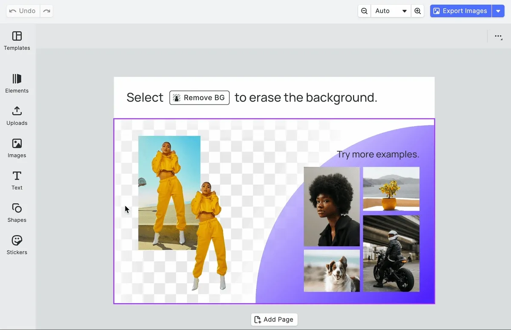

For additional UI configuration options, refer to the [plugin documentation](https://www.npmjs.com/package/@imgly/plugin-background-removal-web), , which provides details on customization.

## Limits and Considerations[#](#limits-and-considerations)

While the background removal feature is optimized for speed and efficiency, keep the following considerations in mind:

*   **Processing large images** may take longer, especially on lower-powered devices.
*   The performance depends on the **user’s hardware**, for example, whether the browser supports WebGL/WebGPU optimizations.
*   Background removal works best with **high-contrast foregrounds**, so images with low contrast between subject and background may yield less accurate results.
*   Currently, background removal is only available for **static images**.
*   Since the asset files are fetched on demand at the first run of the background removal process, it takes longer than its successive runs. This can be mitigated by **preloading the assets**.

For best results, use **optimized input images** and consider adjusting **contrast and lighting** before processing.

---


[Source](http:/localhost:4321/js/edit-image/overview-5249ea)

# JavaScript Image Editor SDK

The CreativeEditor SDK (CE.SDK) offers powerful image editing capabilities designed for seamless integration into your application. You can give your users full control through an intuitive user interface or implement fully automated workflows via the SDK’s programmatic API.

Image editing with CE.SDK is fully client-side, ensuring fast performance, data privacy, and offline compatibility. Whether you’re building a photo editor, design tool, or automation workflow, CE.SDK provides everything you need—plus the flexibility to integrate AI tools for tasks like adding or removing objects, swapping backgrounds, or creating variants.

[Launch Web Demo](https://img.ly/showcases/cesdk)[

Get Started

](js/get-started/overview-e18f40/)

## Core Capabilities[#](#core-capabilities)

CE.SDK includes a wide range of image editing features accessible both through the UI and programmatically. Key capabilities include:

*   **Transformations**: Crop, rotate, resize, scale, and flip images.
*   **Adjustments and effects**: Apply filters, control brightness and contrast, add vignettes, pixelization, and more.
*   **Background removal**: Automatically remove backgrounds from images using plugin integrations.
*   **Color tools**: Replace colors, apply gradients, adjust palettes, and convert to black and white.
*   **Vectorization**: Convert raster images into vector format (SVG).
*   **Programmatic editing**: Make all edits via API—ideal for automation and bulk processing.

All operations are optimized for in-app performance and align with real-time editing needs.

## AI-powered Editing[#](#ai-powered-editing)

CE.SDK allows you to easily integrate AI tools directly into your editing workflow. Users can generate or edit images from simple prompts — all from within the editor’s task bar, without switching tools or uploading external assets.

[Launch AI Editor Demo](https://img.ly/showcases/cesdk/ai-editor/web)

Typical AI use cases include:

*   **Text-to-image**: Generate visuals from user prompts.
*   **Background removal**: Automatically extract subjects from photos.
*   **Style transfer**: Apply the look of one image to another.
*   **Variant generation**: Create multiple versions of a design or product image.
*   **Text-to-graphics**: Render typographic compositions from plain text.
*   **Object add/remove**: Modify compositions by adding or erasing visual elements.

You can bring your own models or third-party APIs with minimal setup. AI tools can be added as standalone plugins, contextual buttons, or task bar actions.

## Supported Input Formats[#](#supported-input-formats)

The SDK supports a broad range of image input types:

| Category | Supported Formats |
| --- | --- |
| **Images** | `.png`, `.jpeg`, `.jpg`, `.gif`, `.webp`, `.svg`, `.bmp` |
| **Video** | `.mp4` (H.264/AVC, H.265/HEVC), `.mov` (H.264/AVC, H.265/HEVC) |
| **Audio** | `.mp3`, `.m4a`, `.mp4` (AAC or MP3), `.mov` (AAC or MP3) |

Need to import a format not listed here? CE.SDK allows you to create custom importers for any file type by using our Scene and Block APIs programmatically.

## Output and export options[#](#output-and-export-options)

Export edited images in the following formats:

| Category | Supported Formats |
| --- | --- |
| **Images** | `.png` (with transparency), `.jpeg`, `.webp`, `.tga` |
| **Video** | `.mp4` (H.264 or H.265 on supported platforms with limited transparency support) |
| **Print** | `.pdf` (supports underlayer printing and spot colors) |
| **Scene** | `.scene` (description of the scene without any assets) |
| **Archive** | `.zip` (fully self-contained archive that bundles the `.scene` file with all assets) |

Our custom cross-platform C++ based rendering and layout engine ensures consistent output quality across devices.

You can define export resolution, compression level, and file metadata. CE.SDK also supports exporting with transparent backgrounds, underlayers, or color masks.

## UI-Based vs. Programmatic Editing[#](#ui-based-vs-programmatic-editing)

CE.SDK provides two equally powerful ways to perform image edits:

*   **UI-based editing**: The built-in editor includes a customizable toolbar, side panels, and inspector views. End users can directly manipulate elements through the visual interface.
*   **Programmatic editing**: Every image transformation, effect, or layout operation can be executed via the SDK’s API. This is ideal for bulk operations, automated design workflows, or serverless rendering.

You can freely combine both approaches in a single application.

## Customization[#](#customization)

The CE.SDK image editor is fully customizable:

*   **Tool configuration**: Enable, disable, or reorder individual editing tools.
*   **Panel visibility**: Show or hide interface elements like inspectors, docks, and canvas menus.
*   **Themes and styling**: Customize the UI appearance with brand colors, fonts, and icons.
*   **Localization**: Translate all interface text via the internationalization API.

You can also add custom buttons, inject quick actions, or build your own interface on top of the engine using the headless mode.

---


[Source](http:/localhost:4321/js/create-video/update-caption-presets-e9c385)

# Adding Custom Caption Presets to CE.SDK

Video captions have become an essential part of digital content, improving accessibility and engagement. With CE.SDK’s caption presets feature, you can offer your users a selection of predefined caption styles that they can apply with a single click.

This guide will show you how to add your own custom caption presets by updating the content.json file that CE.SDK uses to discover available presets. This approach allows you to extend the existing caption presets functionality without implementing a custom asset source from scratch.

## Understanding the Caption Presets Structure[#](#understanding-the-caption-presets-structure)

CE.SDK’s caption presets are organized in a specific folder structure:

```
assets/v4/ly.img.captionPresets/├── content.json                # Master index of all presets├── presets/                    # Folder containing preset files│   ├── my-custom-preset.blocks  # Serialized caption block with styling│   └── …└── thumbnails/                 # Folder containing preview images    ├── my-custom-preset.png    # Preview image for preset    └── …
```

The main `content.json` file acts as an index that lists all available presets with their metadata. Instead of individual folders for each preset, all preset files are organized in two main folders:

1.  `presets/`: Contains all the serialized caption block files (`.blocks` files)
2.  `thumbnails/`: Contains all the preview images for the presets (`.png` files)

When CE.SDK loads the caption presets, it reads the `content.json` file to discover all available presets and their locations. This follows the same pattern as other [asset sources in CE.SDK](js/import-media/from-remote-source-b65faf/), but with this specific folder organization.

## Creating Custom Caption Presets[#](#creating-custom-caption-presets)

Before updating the content.json file, you’ll need to create your custom preset styles. The easiest way to create a custom preset is to design it within CE.SDK itself:

1.  Create a text element in your project. Style and animate it as desired (using a text element as the basis is best since it supports all the styling properties needed for captions)
2.  Use the engine’s serialization API to export the text block:

```
// Assuming 'textBlock' is the ID of your styled text elementconst serializedBlock = await engine.block.saveToString([textBlock]);
```

3.  Save this serialized data as a `.blocks` file (e.g., `my-custom-preset.blocks`)
4.  Create a thumbnail image that visually represents your preset style

> **Important**: Using a text element as the basis for your caption preset is highly recommended. Text elements support all the necessary styling properties (colors, fonts, backgrounds, shadows, etc.) and ensure compatibility with the caption system. For more details on text properties, see the [text styling documentation](js/text-8a993a/).

### Adding Customizable Properties[#](#adding-customizable-properties)

One of the key advantages of the caption presets system is that it allows users to customize specific properties of a preset. To enable this, you need to define which properties should be customizable in the `payload.properties` array in the content.json file.

For each customizable color property, you should define:

1.  The property type (must be “Color”)
2.  The property path (e.g., “fill/solid/color”, “backgroundColor/color”, “dropShadow/color”)
3.  The default value (RGBA color object)
4.  The current value (initially the same as the default)

Example of customizable color properties:

```
"payload": {  "properties": [    {      "type": "Color",      "property": "fill/solid/color",      "value": {        "r": 1,        "g": 1,        "b": 1,        "a": 1      },      "defaultValue": {        "r": 1,        "g": 1,        "b": 1,        "a": 1      }    },    {      "type": "Color",      "property": "backgroundColor/color",      "value": {        "r": 0,        "g": 0,        "b": 0,        "a": 0.5      },      "defaultValue": {        "r": 0,        "g": 0,        "b": 0,        "a": 0.5      }    }  ]}
```

This allows users to modify specific color aspects of a preset without changing the entire style.

## Updating the Content.json File[#](#updating-the-contentjson-file)

Once you have your custom preset files, follow these steps to update the `content.json` file:

1.  Download or create a base `content.json` file if you don’t already have one
2.  Open the file in a text editor or JSON editor
3.  Add new entries to the `assets` array for each of your custom presets
4.  Save the updated file

Here’s an example of what the `content.json` file should look like:

```
{  "version": "3.0.0",  "id": "ly.img.captionPresets",  "assets": [    {      "id": "//ly.img.captionPresets/background",      "label": {        "en": "Background"      },      "meta": {        "uri": "{{base_url}}/ly.img.captionPresets/presets/background.preset",        "thumbUri": "{{base_url}}/ly.img.captionPresets/thumbnails/background.png",        "mimeType": "application/ubq-blocks-string"      },      "payload": {        "properties": [          {            "type": "Color",            "property": "fill/solid/color",            "value": {              "r": 1,              "g": 1,              "b": 1,              "a": 1            },            "defaultValue": {              "r": 1,              "g": 1,              "b": 1,              "a": 1            }          },          {            "type": "Color",            "property": "backgroundColor/color",            "value": {              "r": 0,              "g": 0,              "b": 0,              "a": 0.5            },            "defaultValue": {              "r": 0,              "g": 0,              "b": 0,              "a": 0.5            }          }        ]      }    },    {      "id": "//ly.img.captionPresets/outline",      "label": {        "en": "Outline"      },      "meta": {        "uri": "{{base_url}}/ly.img.captionPresets/presets/outline.preset",        "thumbUri": "{{base_url}}/ly.img.captionPresets/thumbnails/outline.png",        "mimeType": "application/ubq-blocks-string"      },      "payload": {        "properties": [          {            "type": "Color",            "property": "fill/solid/color",            "value": {              "r": 1,              "g": 1,              "b": 1,              "a": 1            },            "defaultValue": {              "r": 1,              "g": 1,              "b": 1,              "a": 1            }          },          {            "type": "Color",            "property": "dropShadow/color",            "value": {              "r": 0,              "g": 0,              "b": 0,              "a": 1            },            "defaultValue": {              "r": 0,              "g": 0,              "b": 0,              "a": 1            }          }        ]      }    }  ]}
```

To add your custom preset, add a new entry to the `assets` array with these required fields:

```
{  "id": "//ly.img.captionPresets/my-custom-preset", // A unique identifier with proper namespace  "label": {    "en": "My Custom Preset" // The name that will appear in the UI  },  "meta": {    "uri": "{{base_url}}/ly.img.captionPresets/presets/my-custom-preset.preset",    "thumbUri": "{{base_url}}/ly.img.captionPresets/thumbnails/my-custom-preset.png",    "mimeType": "application/ubq-blocks-string" // Important: Include this mime type  },  "payload": {    "properties": [      {        "type": "Color",        "property": "fill/solid/color",        "value": {          "r": 1,          "g": 1,          "b": 1,          "a": 1        },        "defaultValue": {          "r": 1,          "g": 1,          "b": 1,          "a": 1        }      },      // Add other properties that can be customized      {        "type": "Color",        "property": "dropShadow/color",        "value": {          "r": 0,          "g": 0,          "b": 0,          "a": 0.8        },        "defaultValue": {          "r": 0,          "g": 0,          "b": 0,          "a": 0.8        }      }    ]  }}
```

## Hosting and Serving Custom Presets[#](#hosting-and-serving-custom-presets)

After updating the content.json file, you need to host the files on your server. Follow these steps:

1.  Create the proper folder structure on your server that matches the standard caption presets organization:
    
    ```
    /assets/v4/ly.img.captionPresets/├── content.json├── presets/│   ├── background.preset│   ├── outline.preset│   ├── my-custom-preset.preset│   └── ...└── thumbnails/    ├── background.png    ├── outline.png    ├── my-custom-preset.png    └── ...
    ```
    
2.  Upload all files to your server, maintaining this exact folder structure:
    
    *   Your updated content.json file should go in the root folder
    *   All .preset files should go in the presets/ folder
    *   All thumbnail images should go in the thumbnails/ folder
3.  Make sure the files are accessible via HTTP/HTTPS and properly configured with CORS headers if needed
    
4.  Test that you can access each file directly via its URL in a browser
    

For more information on hosting assets, see the [asset hosting documentation](js/import-media/from-remote-source-b65faf/).

## Loading Custom Presets into CE.SDK[#](#loading-custom-presets-into-cesdk)

To load your custom caption presets into CE.SDK, you need to tell the engine where to find your updated content.json file. Since CE.SDK already includes a caption presets asset source with the ID “ly.img.captionPresets”, we’ll update this existing source rather than creating a new one.

For that you only have to configure the base URL to the one pointing at the location your assets are being available from:

```
const config = {  baseURL: 'https://yourdomain.com/assets' // Your base assets path};
CreativeEngine.init(config).then(async (engine) => {  // ...});
```

Your custom presets will seamlessly integrate with any built-in presets and automatically appear in the caption presets panel in the UI.

## Related Documentation[#](#related-documentation)

*   [Asset Source Concepts](js/import-media/concepts-5e6197/) - For understanding how asset sources work in CE.SDK
*   [Remote Asset Sources](js/import-media/from-remote-source-b65faf/) - For more details on hosting and serving assets remotely
*   [Asset Library Customization](js/import-media/asset-panel/customize-c9a4de/) - For customizing how assets appear in the UI
*   [Text Styling](js/text-8a993a/) - For understanding the styling properties available for text elements

---


[Source](http:/localhost:4321/js/create-video/timeline-editor-912252)

# JavaScript Video and Audio Timeline Editor

```
import CreativeEditorSDK from 'https://cdn.img.ly/packages/imgly/cesdk-js/1.57.0/index.js';
window.onload = async () => {  const config = {    license: 'mtLT-_GJwMhE7LDnO8KKEma7qSuzWuDxiKuQcxHKmz3fjaXWY2lT3o3Z2VdL5twm',    userId: 'guides-user',    theme: 'light',    baseURL: 'https://cdn.img.ly/packages/imgly/cesdk-js/1.57.0/assets',    ui: {      elements: {        view: 'default',        panels: {          settings: true        },        navigation: {          position: 'top',          action: {            save: true,            load: true,            download: true,            export: true          }        },      }    },    callbacks: {      onUpload: 'local',      onSave: (scene) => {        const element = document.createElement('a');        const base64Data = btoa(unescape(encodeURIComponent(scene)));        element.setAttribute(          'href',          `data:application/octet-stream;base64,${base64Data}`        );        element.setAttribute(          'download',          `cesdk-${new Date().toISOString()}.scene`        );
        element.style.display = 'none';        document.body.appendChild(element);
        element.click();
        document.body.removeChild(element);      },      onLoad: 'upload',      onDownload: 'download',      onExport: 'download'    }  };
  const cesdk = await CreativeEditorSDK.create('#cesdk_container', config);  cesdk.addDefaultAssetSources();  cesdk.addDemoAssetSources({ sceneMode: 'Video' });  cesdk.ui.setBackgroundTrackAssetLibraryEntries(['ly.img.image', 'ly.img.video']);  const scene = await cesdk.createVideoScene();};
```

```
<!DOCTYPE html><html lang="en">  <head>    <meta charset="UTF-8" />    <meta name="viewport" content="width=device-width, initial-scale=1.0" />    <meta http-equiv="X-UA-Compatible" content="ie=edge" />    <style>      body {        margin: 0;        overflow: hidden;      }      html {        overscroll-behavior-x: contain;      }    </style>  </head>
  <body>    <div id="cesdk_container" style="width: 100%; height: 100vh"></div>    <script type="module" src="index.js">    </script>  </body></html>
```

CE.SDK Video Mode allows your users to edit videos in a manner familiar from popular platforms such as TikTok or Instagram. The CE.SDK editor contains a full-featured video editor, complete with Video and Audio trimming, and composition capabilities. Get to know the core concepts in this guide.

To learn about the **available API calls** related to video editing, see the [engine guide on video editing](js/create-video/overview-b06512/).

To learn about the **Video Editor UI**, skip to the UI overview.

## A Note on Browser Support[#](#a-note-on-browser-support)

Video mode heavily relies on modern features like web codecs. A detailed list of supported browser versions can be found in our [Supported Browsers](js/browser-support-28c1b0/). Please also take note of [possible restrictions based on the host platform](js/file-format-support-3c4b2a/) browsers are running on.

Video mode is currently not supported on any mobile web platform due to technical limitations by all mobile browsers.

[Our native mobile SDKs are a great solution for implementing video features on mobile devices today.](js/prebuilt-solutions-d0ed07/)

## UI Overview[#](#ui-overview)

### Timeline[#](#timeline)


The timeline is the main control for video editing. It is here that clips and audio strips can be positioned in time. The timeline is divided into two main areas:

#### Foreground[#](#foreground)

Clips run along the top of the foreground timeline, while audio strips run along the bottom. Click anywhere inside the timeline to set the playback time, or drag the seeker directly. Use the **Split Clip** button to split the clips into two at the position of the seeker. The **zoom controls** allow you to zoom the timeline in and out for better control. Finally, Use the **Play** and **Loop** buttons to view the final result.

*   Drag either of the strip handles to **adjust start and end time** of a clip.
*   Drag the center of the strip to **position** the clip.
*   Drag the center of the strip to **rearrange** the clips.
*   Use the context menu on the strip to **perform specific actions** on the clip.

#### Background[#](#background)

Background clips go at the bottom of the timeline and define the length of the video. Background clips are typically videos and images, but can be configured to support other types of elements as well. They are packed against each other and can’t have time gaps in between, and they define the length of the exported video.

*   Drag either of the strip handles to **adjust start and end time** of a clip.
*   Drag the center of the strip to **rearrange** the clips.
*   Use the context menu on the strip to **perform specific actions** on the clip.

### Video[#](#video)

Videos are handled in a similar fashion to regular elements: You can add them via the Asset Library and position them anywhere on the page. You can select a specific section of video to play by trimming the clip on the timeline and/or using the trim controls (pictured below), accessible by pressing the trim button.

#### Trimming videos[#](#trimming-videos)

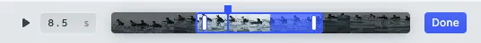

Trim controls will appear near the top of the editor window.

*   While these controls are open, **only the selected video is played** during seeking or playback.
*   You can **adjust the start and end time** by dragging the handles on either side of the strip.
*   The **grayed-out area** indicates the parts of the video that won’t be shown.
*   The **blue overlay** indicates the end of the page duration - to show these parts of the video, extend the duration of the containing page.

### Audio[#](#audio)

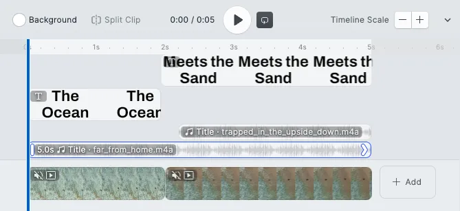

Unlike regular design elements, audio is not visible on the canvas. It is only shown in the timeline, as audio strips. Use the timeline to edit audio:

*   Drag either of the strip handles to **adjust start and end time** of the audio strip.
*   Drag the center of the strip to **position** the strip.
*   Drag the center of the strip to **rearrange** the audio stipes.
*   Use the context menu on the strip to **perform specific actions** on the audio strip.

### Trimming audio[#](#trimming-audio)

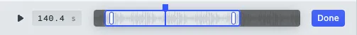

Trimming audio works just like trimming video.

---


[Source](http:/localhost:4321/js/create-video/overview-b06512)

# Create Videos Overview

```
import CreativeEngine from 'https://cdn.img.ly/packages/imgly/cesdk-engine/1.57.0/index.js';
const config = {  license: 'mtLT-_GJwMhE7LDnO8KKEma7qSuzWuDxiKuQcxHKmz3fjaXWY2lT3o3Z2VdL5twm',  userId: 'guides-user',  baseURL: 'https://cdn.img.ly/packages/imgly/cesdk-engine/1.57.0/assets'};
CreativeEngine.init(config).then(async (engine) => {  // Attach engine canvas to DOM  document.getElementById('cesdk_container').append(engine.element);  const scene = engine.scene.createVideo();
  const page = engine.block.create('page');  engine.block.appendChild(scene, page);
  engine.block.setWidth(page, 1280);  engine.block.setHeight(page, 720);
  engine.block.setDuration(page, 20);
  const video1 = engine.block.create('graphic');  engine.block.setShape(video1, engine.block.createShape('rect'));  const videoFill = engine.block.createFill('video');  engine.block.setString(    videoFill,    'fill/video/fileURI',    'https://cdn.img.ly/assets/demo/v2/ly.img.video/videos/pexels-drone-footage-of-a-surfer-barrelling-a-wave-12715991.mp4'  );  engine.block.setFill(video1, videoFill);
  const video2 = engine.block.create('graphic');  engine.block.setShape(video2, engine.block.createShape('rect'));  const videoFill2 = engine.block.createFill('video');  engine.block.setString(    videoFill2,    'fill/video/fileURI',    'https://cdn.img.ly/assets/demo/v2/ly.img.video/videos/pexels-kampus-production-8154913.mp4'  );  engine.block.setFill(video2, videoFill2);
  const track = engine.block.create('track');  engine.block.appendChild(page, track);  engine.block.appendChild(track, video1);  engine.block.appendChild(track, video2);  engine.block.fillParent(track);
  engine.block.setDuration(video1, 15);
  /* Make sure that the video is loaded before calling the trim APIs. */  await engine.block.forceLoadAVResource(videoFill);  engine.block.setTrimOffset(videoFill, 1);  engine.block.setTrimLength(videoFill, 10);
  engine.block.setLooping(videoFill, true);
  engine.block.setMuted(videoFill, true);
  const audio = engine.block.create('audio');  engine.block.appendChild(page, audio);  engine.block.setString(    audio,    'audio/fileURI',    'https://cdn.img.ly/assets/demo/v1/ly.img.audio/audios/far_from_home.m4a'  );
  /* Set the volume level to 70%. */  engine.block.setVolume(audio, 0.7);
  /* Start the audio after two seconds of playback. */  engine.block.setTimeOffset(audio, 2);
  /* Give the Audio block a duration of 7 seconds. */  engine.block.setDuration(audio, 7);
  /* Export page as mp4 video. */  const blob = await engine.block.exportVideo(page, {    mimeType: 'video/mp4',    onProgress: (renderedFrames, encodedFrames, totalFrames) => {      console.log(        'Rendered',        renderedFrames,        'frames and encoded',        encodedFrames,        'frames out of',        totalFrames      );    }  });
  /* Download blob. */  const anchor = document.createElement('a');  anchor.href = URL.createObjectURL(blob);  anchor.download = 'exported-video.mp4';  anchor.click();});
```

```
<!DOCTYPE html><html lang="en">  <head>    <meta charset="UTF-8" />    <meta name="viewport" content="width=device-width, initial-scale=1.0" />    <meta http-equiv="X-UA-Compatible" content="ie=edge" />    <style>      body {        margin: 0;        overflow: hidden;      }      html {        overscroll-behavior-x: contain;      }    </style>  </head>
  <body>    <div id="cesdk_container" style="width: 100%; height: 100vh"></div>    <script type="module" src="index.js">    </script>  </body></html>
```

In addition to static designs, CE.SDK also allows you to create and edit videos. Working with videos introduces the concept of time into the scene, which requires you to switch the scene into the `"Video"` mode.

In this mode, each page in the scene has its own separate timeline within which its children can be placed. The `"playback/time"` property of each page controls the progress of time through the page.

In order to add videos to your pages, you can add a block with a `"//ly.img.ubq/fill/video"` fill. As the playback time of the page progresses, the corresponding point in time of the video fill is rendered by the block.

You can also customize the video fill’s trim in order to control the portion of the video that should be looped while the block is visible.

`//ly.img.ubq/audio` blocks can be added to the page in order to play an audio file during playback.

The `playback/timeOffset` property controls after how many seconds the audio should begin to play, while the duration property defines how long the audio should play. The same APIs can be used for other design blocks as well, such as text or graphic blocks.

Finally, the whole page can be exported as a video file using the `block.exportVideo` function.

## A Note on Browser Support[#](#a-note-on-browser-support)

Video mode heavily relies on modern features like web codecs. A detailed list of supported browser versions can be found in our [Supported Browsers](js/browser-support-28c1b0/). Please also take note of [possible restrictions based on the host platform](js/file-format-support-3c4b2a/) browsers are running on.

## Creating a Video Scene[#](#creating-a-video-scene)

First, we create a scene that is set up for video editing by calling the `scene.createVideo()` API. Then we create a page, add it to the scene and define its dimensions. This page will hold our composition.

```
  const scene = engine.scene.createVideo();
  const page = engine.block.create('page');  engine.block.appendChild(scene, page);
  engine.block.setWidth(page, 1280);  engine.block.setHeight(page, 720);
```

## Setting Page Durations[#](#setting-page-durations)

Next, we define the duration of the page using the `setDuration(block: number, duration: number): void` API to be 20 seconds long. This will be the total duration of our exported video in the end.

```
engine.block.setDuration(page, 20);
```

## Adding Videos[#](#adding-videos)

In this example, we want to show two videos, one after the other. For this, we first create two graphic blocks and assign two `'video'` fills to them.

```
  const video1 = engine.block.create('graphic');  engine.block.setShape(video1, engine.block.createShape('rect'));  const videoFill = engine.block.createFill('video');  engine.block.setString(    videoFill,    'fill/video/fileURI',    'https://cdn.img.ly/assets/demo/v2/ly.img.video/videos/pexels-drone-footage-of-a-surfer-barrelling-a-wave-12715991.mp4'  );  engine.block.setFill(video1, videoFill);
  const video2 = engine.block.create('graphic');  engine.block.setShape(video2, engine.block.createShape('rect'));  const videoFill2 = engine.block.createFill('video');  engine.block.setString(    videoFill2,    'fill/video/fileURI',    'https://cdn.img.ly/assets/demo/v2/ly.img.video/videos/pexels-kampus-production-8154913.mp4'  );  engine.block.setFill(video2, videoFill2);
```

## Creating a Track[#](#creating-a-track)

While we could add the two blocks directly to the page and and manually set their sizes and time offsets, we can alternatively also use the `track` block to simplify this work. A `track` automatically adjusts the time offsets of its children to make sure that they play one after another without any gaps, based on each child’s duration.

Tracks themselves cannot be selected directly by clicking on the canvas, nor do they have any visual representation.

We create a `track` block, add it to the page and add both videos in the order in which they should play as the track’s children. Next, we use the `fillParent` API, which will resize all children of the track to the same dimensions as the page.

The dimensions of a `track` are always derived from the dimensions of its children, so you should not call the `setWidth` or `setHeight` APIs on a track, but on its children instead if you can’t use the `fillParent` API.

```
const track = engine.block.create('track');engine.block.appendChild(page, track);engine.block.appendChild(track, video1);engine.block.appendChild(track, video2);engine.block.fillParent(track);
```

By default, each block has a duration of 5 seconds after it is created. If we want to show it on the page for a different amount of time, we can use the `setDuration` API.

Note that we can just increase the duration of the first video block to 15 seconds without having to adjust anything about the second video. The `track` takes care of that for us automatically so that the second video starts playing after 15 seconds.

```
engine.block.setDuration(video1, 15);
```

If the video is longer than the duration of the graphic block that it’s attached to, it will cut off once the duration of the graphic is reached. If it is too short, the video will automatically loop for as long as its graphic block is visible.

We can also manually define the portion of our video that should loop within the graphic using the `setTrimOffset(block: number, offset: number): void` and `setTrimLength(block: number, length: number): void` APIs. We use the trim offset to cut away the first second of the video and the trim length to only play 10 seconds of the video. Since our graphic is 15 seconds long, the trimmed video will be played fully once and then start looping for the remaining 5 seconds.

```
/* Make sure that the video is loaded before calling the trim APIs. */await engine.block.forceLoadAVResource(videoFill);engine.block.setTrimOffset(videoFill, 1);engine.block.setTrimLength(videoFill, 10);
```

We can control if a video will loop back to its beginning by calling `setLooping(block: number, looping: boolean): void`. Otherwise, the video will simply hold its last frame instead and audio will stop playing. Looping behavior is activated for all blocks by default.

```
engine.block.setLooping(videoFill, true);
```

## Audio[#](#audio)

If the video of a video fill contains an audio track, that audio will play automatically by default when the video is playing. We can mute it by calling `setMuted(block: number, muted: boolean): void`.

```
engine.block.setMuted(videoFill, true);
```

We can also add audio-only files to play together with the contents of the page by adding an `'audio'` block to the page and assigning it the URL of the audio file.

```
const audio = engine.block.create('audio');engine.block.appendChild(page, audio);engine.block.setString(  audio,  'audio/fileURI',  'https://cdn.img.ly/assets/demo/v1/ly.img.audio/audios/far_from_home.m4a');
```

We can adjust the volume level of any audio block or video fill by calling `setVolume(block: number, volume: number): void`. The volume is given as a fraction in the range of 0 to 1.

```
/* Set the volume level to 70%. */engine.block.setVolume(audio, 0.7);
```

By default, our audio block will start playing at the very beginning of the page. We can change this by specifying how many seconds into the scene it should begin to play using the `setTimeOffset(block: number, offset: number): void` API.

```
/* Start the audio after two seconds of playback. */engine.block.setTimeOffset(audio, 2);
```

By default, our audio block will have a duration of 5 seconds. We can change this by specifying its duration in seconds by using the `setDuration(block: number, duration: number): void` API.

```
/* Give the Audio block a duration of 7 seconds. */engine.block.setDuration(audio, 7);
```

## Exporting Video[#](#exporting-video)

You can start exporting the entire page as a video file by calling `exportVideo()`. The encoding process will run in the background. You can get notified about the progress of the encoding process by the `progressCallback`. It will be called whenever another frame has been encoded.

Since the encoding process runs in the background the engine will stay interactive. So, you can continue to use the engine to manipulate the scene. Please note that these changes won’t be visible in the exported video file because the scene’s state has been frozen at the start of the export.

```
  /* Export page as mp4 video. */  const blob = await engine.block.exportVideo(page, {    mimeType: 'video/mp4',    onProgress: (renderedFrames, encodedFrames, totalFrames) => {      console.log(        'Rendered',        renderedFrames,        'frames and encoded',        encodedFrames,        'frames out of',        totalFrames      );    }  });
  /* Download blob. */  const anchor = document.createElement('a');  anchor.href = URL.createObjectURL(blob);  anchor.download = 'exported-video.mp4';  anchor.click();
```

## Full Code[#](#full-code)

Here’s the full code:

```
import CreativeEngine from 'https://cdn.img.ly/packages/imgly/cesdk-engine/1.57.0/index.js';
const config = {  license: 'mtLT-_GJwMhE7LDnO8KKEma7qSuzWuDxiKuQcxHKmz3fjaXWY2lT3o3Z2VdL5twm',  userId: 'guides-user',  baseURL:    'https://cdn.img.ly/packages/imgly/cesdk-engine/1.57.0/assets',};
CreativeEngine.init(config).then(async engine => {  // Attach engine canvas to DOM  document.getElementById('cesdk_container').append(engine.element);  const scene = engine.scene.createVideo();
  const page = engine.block.create('page');  engine.block.appendChild(scene, page);
  engine.block.setWidth(page, 1280);  engine.block.setHeight(page, 720);
  engine.block.setDuration(page, 20);
  const video1 = engine.block.create('graphic');  engine.block.setShape(video1, engine.block.createShape('rect'));  const videoFill = engine.block.createFill('video');  engine.block.setString(    videoFill,    'fill/video/fileURI',    'https://cdn.img.ly/assets/demo/v2/ly.img.video/videos/pexels-drone-footage-of-a-surfer-barrelling-a-wave-12715991.mp4',  );  engine.block.setFill(video1, videoFill);
  const video2 = engine.block.create('graphic');  engine.block.setShape(video2, engine.block.createShape('rect'));  const videoFill2 = engine.block.createFill('video');  engine.block.setString(    videoFill2,    'fill/video/fileURI',    'https://cdn.img.ly/assets/demo/v2/ly.img.video/videos/pexels-kampus-production-8154913.mp4',  );  engine.block.setFill(video2, videoFill2);
  const track = engine.block.create('track');  engine.block.appendChild(page, track);  engine.block.appendChild(track, video1);  engine.block.appendChild(track, video2);  engine.block.fillParent(track);
  engine.block.setDuration(video1, 15);
  /* Make sure that the video is loaded before calling the trim APIs. */  await engine.block.forceLoadAVResource(videoFill);  engine.block.setTrimOffset(videoFill, 1);  engine.block.setTrimLength(videoFill, 10);
  engine.block.setLooping(videoFill, true);
  engine.block.setMuted(videoFill, true);
  const audio = engine.block.create('audio');  engine.block.appendChild(page, audio);  engine.block.setString(    audio,    'audio/fileURI',    'https://cdn.img.ly/assets/demo/v1/ly.img.audio/audios/far_from_home.m4a',  );
  /* Set the volume level to 70%. */  engine.block.setVolume(audio, 0.7);
  /* Start the audio after two seconds of playback. */  engine.block.setTimeOffset(audio, 2);
  /* Give the Audio block a duration of 7 seconds. */  engine.block.setDuration(audio, 7);
  /* Export page as mp4 video. */  const blob = await engine.block.exportVideo(    page,    {      mimeType: 'video/mp4',      onProgress: (renderedFrames, encodedFrames, totalFrames) => {        console.log(          'Rendered',          renderedFrames,          'frames and encoded',          encodedFrames,          'frames out of',          totalFrames,        );      }    },  );
  /* Download blob. */  const anchor = document.createElement('a');  anchor.href = URL.createObjectURL(blob);  anchor.download = 'exported-video.mp4';  anchor.click();});
```

---


[Source](http:/localhost:4321/js/create-video/control-daba54)

# Control Audio and Video

In this example, we will show you how to use the [CreativeEditor SDK](https://img.ly/products/creative-sdk)’s CreativeEngine to configure and control audio and video through the `block` API.

## Time Offset and Duration[#](#time-offset-and-duration)

The time offset determines when a block becomes active during playback on the page’s timeline, and the duration decides how long this block is active. Blocks within tracks are a special case in that they have an implicitly calculated time offset that is determined by their order and the total duration of their preceding blocks in the same track. As with any audio/video-related property, not every block supports these properties. Use `supportsTimeOffset` and `supportsDuration` to check.

```
supportsTimeOffset(id: DesignBlockId): boolean
```

Returns whether the block has a time offset property.

*   `id`: The block to query.
*   Returns true, if the block has a time offset property.

```
setTimeOffset(id: DesignBlockId, offset: number): void
```

Set the time offset of the given block relative to its parent. The time offset controls when the block is first active in the timeline. The time offset is not supported by the page block.

*   `id`: The block whose time offset should be changed.
*   `offset`: The new time offset in seconds.

```
getTimeOffset(id: DesignBlockId): number
```

Get the time offset of the given block relative to its parent.

*   `id`: The block whose time offset should be queried.
*   Returns the time offset of the block.

```
supportsDuration(id: DesignBlockId): boolean
```

Returns whether the block has a duration property.

*   `id`: The block to query.
*   Returns true if the block has a duration property.

```
setDuration(id: DesignBlockId, duration: number): void
```

Set the playback duration of the given block in seconds. The duration defines for how long the block is active in the scene during playback. If a duration is set on the page block, it becomes the duration source block. The duration is ignored when the scene is not in “Video” mode.

*   `id`: The block whose duration should be changed.
*   `duration`: The new duration in seconds.

```
getDuration(id: DesignBlockId): number
```

Get the playback duration of the given block in seconds.

*   `id`: The block whose duration should be returned.
*   Returns The block’s duration.

```
supportsPageDurationSource(page: DesignBlockId, id: DesignBlockId): boolean
```

Returns whether the block can be marked as the element that defines the duration of the given page.

*   `id`: The block to query.
*   Returns true, if the block can be marked as the element that defines the duration of the given page.

```
setPageDurationSource(page: DesignBlockId, id: DesignBlockId): void
```

Set an block as duration source so that the overall page duration is automatically determined by this. If no defining block is set, the page duration is calculated over all children. Only one block per page can be marked as duration source. Will automatically unmark the previously marked. Note: This is only supported for blocks that have a duration.

*   `page`: The page block for which it should be enabled.
*   `id`: The block that should be updated.

```
isPageDurationSource(id: DesignBlockId): boolean
```

Query whether the block is a duration source block for the page.

*   `id`: The block whose duration source property should be queried.
*   Returns If the block is a duration source for a page.

```
removePageDurationSource(id: DesignBlockId): void
```

Remove the block as duration source block for the page. If a scene or page is given as block, it is deactivated for all blocks in the scene or page.

*   `id`: The block whose duration source property should be removed.

```
setNativePixelBuffer(id: number, buffer: HTMLCanvasElement | HTMLVideoElement): void
```

Update the pixels of the given pixel stream fill block.

*   `id`: The pixel stream fill block.
*   `buffer`: Use pixel data from a canvas or a video element.

## Trim[#](#trim)

You can select a specific range of footage from your audio/video resource by providing a trim offset and a trim length. The footage will loop if the trim’s length is shorter than the block’s duration. This behavior can also be disabled using the `setLooping` function.

```
supportsTrim(id: DesignBlockId): boolean
```

Returns whether the block has trim properties.

*   `id`: The block to query.
*   Returns true, if the block has trim properties.

```
setTrimOffset(id: DesignBlockId, offset: number): void
```

Set the trim offset of the given block or fill. Sets the time in seconds within the fill at which playback of the audio or video clip should begin. This requires the video or audio clip to be loaded.

*   `id`: The block whose trim should be updated.
*   `offset`: The new trim offset.

```
getTrimOffset(id: DesignBlockId): number
```

Get the trim offset of this block. \* This requires the video or audio clip to be loaded.

*   `id`: The block whose trim offset should be queried.
*   Returns the trim offset in seconds.

```
setTrimLength(id: DesignBlockId, length: number): void
```

Set the trim length of the given block or fill. The trim length is the duration of the audio or video clip that should be used for playback. After reaching this value during playback, the trim region will loop. This requires the video or audio clip to be loaded.

*   `id`: The object whose trim length should be updated.
*   `length`: The new trim length in seconds.

```
getTrimLength(id: DesignBlockId): number
```

Get the trim length of the given block or fill.

*   `id`: The object whose trim length should be queried.
*   Returns the trim length of the object.

## Playback Control[#](#playback-control)

You can start and pause playback and seek to a certain point on the scene’s timeline. There’s also a solo playback mode to preview audio and video blocks individually while the rest of the scene stays frozen. Finally, you can enable or disable the looping behavior of blocks and control their audio volume.

```
setPlaying(id: DesignBlockId, enabled: boolean): void
```

Set whether the block should be playing during active playback.

*   `id`: The block that should be updated.
*   `enabled`: Whether the block should be playing its contents.

```
isPlaying(id: DesignBlockId): boolean
```

Returns whether the block is playing during active playback.

*   `id`: The block to query.
*   Returns whether the block is playing during playback.

```
setSoloPlaybackEnabled(id: DesignBlockId, enabled: boolean): void
```

Set whether the given block or fill should play its contents while the rest of the scene remains paused. Setting this to true for one block will automatically set it to false on all other blocks.

*   `id`: The block or fill to update.
*   `enabled`: Whether the block’s playback should progress as time moves on.

```
isSoloPlaybackEnabled(id: DesignBlockId): boolean
```

Return whether the given block or fill is currently set to play its contents while the rest of the scene remains paused.

*   `id`: The block or fill to query.
*   Returns Whether solo playback is enabled for this block.

```
supportsPlaybackTime(id: DesignBlockId): boolean
```

Returns whether the block has a playback time property.

*   `id`: The block to query.
*   Returns whether the block has a playback time property.

```
setPlaybackTime(id: DesignBlockId, time: number): void
```

Set the playback time of the given block.

*   `id`: The block whose playback time should be updated.
*   `time`: The new playback time of the block in seconds.

```
getPlaybackTime(id: DesignBlockId): number
```

Get the playback time of the given block.

*   `id`: The block to query.
*   Returns the playback time of the block in seconds.

```
isVisibleAtCurrentPlaybackTime(id: DesignBlockId): boolean
```

Returns whether the block should be visible on the canvas at the current playback time.

*   `id`: The block to query.
*   Returns Whether the block should be visible on the canvas at the current playback time.

```
supportsPlaybackControl(id: DesignBlockId): boolean
```

Returns whether the block supports a playback control.

*   `block`: The block to query.
*   Returns Whether the block has playback control.

```
setLooping(id: DesignBlockId, looping: boolean): void
```

Set whether the block should restart from the beginning again or stop.

*   `block`: The block or video fill to update.
*   `looping`: Whether the block should loop to the beginning or stop.

```
isLooping(id: DesignBlockId): boolean
```

Query whether the block is looping.

*   `block`: The block to query.
*   Returns Whether the block is looping.

```
setMuted(id: DesignBlockId, muted: boolean): void
```

Set whether the audio of the block is muted.

*   `block`: The block or video fill to update.
*   `muted`: Whether the audio should be muted.

```
isMuted(id: DesignBlockId): boolean
```

Query whether the block is muted.

*   `block`: The block to query.
*   Returns Whether the block is muted.

```
setVolume(id: DesignBlockId, volume: number): void
```

Set the audio volume of the given block.

*   `block`: The block or video fill to update.
*   `volume`: The desired volume with a range of `0, 1`.

```
getVolume(id: DesignBlockId): number
```

Get the audio volume of the given block.

*   `block`: The block to query.
*   Returns The volume with a range of `0, 1`.

```
getVideoWidth(id: DesignBlockId): number
```

Get the video width in pixels of the video resource that is attached to the given block.

*   `block`: The video fill.
*   Returns The video width in pixels or an error.

```
getVideoHeight(id: DesignBlockId): number
```

Get the video height in pixels of the video resource that is attached to the given block.

*   `block`: The video fill.
*   Returns The video height in pixels or an error.

## Resource Control[#](#resource-control)

Until an audio/video resource referenced by a block is loaded, properties like the duration of the resource aren’t available, and accessing those will lead to an error. You can avoid this by forcing the resource you want to access to load using `forceLoadAVResource`.

```
forceLoadAVResource(id: DesignBlockId): Promise<void>
```

Begins loading the required audio and video resource for the given video fill or audio block. If the resource had been loaded earlier and resulted in an error, it will be reloaded.

*   `id`: The video fill or audio block whose resource should be loaded.
*   Returns A Promise that resolves once the resource has finished loading.

```
unstable_isAVResourceLoaded(id: DesignBlockId): boolean
```

Returns whether the audio and video resource for the given video fill or audio block is loaded.

*   `id`: The video fill or audio block.
*   Returns The loading state of the resource.

```
getAVResourceTotalDuration(id: DesignBlockId): number
```

Get the duration in seconds of the video or audio resource that is attached to the given block.

*   `id`: The video fill or audio block.
*   Returns The video or audio file duration.

## Thumbnail Previews[#](#thumbnail-previews)

For a user interface, it can be helpful to have image previews in the form of thumbnails for any given video resource. For videos, the engine can provide one or more frames using `generateVideoThumbnailSequence`. Pass the video fill that references the video resource. In addition to video thumbnails, the engine can also render compositions of design blocks over time. To do this pass in the respective design block. The video editor uses these to visually represent blocks in the timeline.

In order to visualize audio signals `generateAudioThumbnailSequence` can be used. This generates a sequence of values in the range of 0 to 1 that represent the loudness of the signal. These values can be used to render a waveform pattern in any custom style.

Note: There can be at most one thumbnail generation request per block at any given time. If you don’t want to wait for the request to finish before issuing a new request, you can cancel it by calling the returned function.

```
generateVideoThumbnailSequence(id: DesignBlockId, thumbnailHeight: number, timeBegin: number, timeEnd: number, numberOfFrames: number, onFrame: (frameIndex: number, result: ImageData | Error) => void): () => void
```

Generate a sequence of thumbnails for the given video fill or design block. Note: There can only be one thumbnail generation request in progress for a given block. Note: During playback, the thumbnail generation will be paused.

*   `id`: The video fill or design block.
*   `thumbnailHeight`: The height of a thumbnail. The width will be calculated from the video aspect ratio.
*   `timeBegin`: The time in seconds relative to the time offset of the design block at which the thumbnail sequence should start.
*   `timeEnd`: The time in seconds relative to the time offset of the design block at which the thumbnail sequence should end.
*   `numberOfFrames`: The number of frames to generate.
*   `onFrame`: Gets passed the frame index and RGBA image data.
*   Returns A method that will cancel any thumbnail generation request in progress for this block.

```
generateAudioThumbnailSequence(id: DesignBlockId, samplesPerChunk: number, timeBegin: number, timeEnd: number, numberOfSamples: number, numberOfChannels: number, onChunk: (chunkIndex: number, result: Float32Array | Error) => void): () => void
```

Generate a thumbnail sequence for the given audio block or video fill. A thumbnail in this case is a chunk of samples in the range of 0 to 1. In case stereo data is requested, the samples are interleaved, starting with the left channel. Note During playback, the thumbnail generation will be paused.

*   `id`: The audio block or video fill.
*   `samplesPerChunk`: The number of samples per chunk. `onChunk` is called when this many samples are ready.
*   `timeBegin`: The time in seconds at which the thumbnail sequence should start.
*   `timeEnd`: The time in seconds at which the thumbnail sequence should end.
*   `numberOfSamples`: The total number of samples to generate.
*   `numberOfChannels`: The number of channels in the output. 1 for mono, 2 for stereo.
*   `onChunk`: This gets passed an index and a chunk of samples whenever it’s ready, or an error.

## Full Code[#](#full-code)

Here’s the full code:

```
// Time offset and durationengine.block.supportsTimeOffset(audio);engine.block.setTimeOffset(audio, 2);engine.block.getTimeOffset(audio); /* Returns 2 */
engine.block.supportsDuration(page);engine.block.setDuration(page, 10);engine.block.getDuration(page); /* Returns 10 */
// Duration of the page can be that of a blockengine.block.supportsPageDurationSource(page, block);engine.block.setPageDurationSource(page, block);engine.block.isPageDurationSource(block);engine.block.getDuration(page); /* Returns duration plus offset of the block */
// Duration of the page can be the maximum end time of all page child blocksengine.block.removePageDurationSource(page);engine.block.getDuration(page); /* Returns the maximum end time of all page child blocks */
// Trimengine.block.supportsTrim(videoFill);engine.block.setTrimOffset(videoFill, 1);engine.block.getTrimOffset(videoFill); /* Returns 1 */engine.block.setTrimLength(videoFill, 5);engine.block.getTrimLength(videoFill); /* Returns 5 */
// Playback Controlengine.block.setPlaying(page, true);engine.block.isPlaying(page);
engine.block.setSoloPlaybackEnabled(videoFill, true);engine.block.isSoloPlaybackEnabled(videoFill);
engine.block.supportsPlaybackTime(page);engine.block.setPlaybackTime(page, 1);engine.block.getPlaybackTime(page);engine.block.isVisibleAtCurrentPlaybackTime(block);
engine.block.supportsPlaybackControl(videoFill);engine.block.setLooping(videoFill, true);engine.block.isLooping(videoFill);engine.block.setMuted(videoFill, true);engine.block.isMuted(videoFill);engine.block.setVolume(videoFill, 0.5); /* 50% volume */engine.block.getVolume(videoFill);
// Resource Controlawait engine.block.forceLoadAVResource(videoFill);const isLoaded = engine.block.unstable_isAVResourceLoaded(videoFill);engine.block.getAVResourceTotalDuration(videoFill);const videoWidth = engine.block.getVideoWidth(videoFill);const videoHeight = engine.block.getVideoHeight(videoFill);
// Thumbnail Previewsconst cancelVideoThumbnailGeneration = engine.block.generateVideoThumbnailSequence(  videoFill /* video fill or any design block */,  128 /* thumbnail height, width will be calculated from aspect ratio */,  0.5 /* begin time */,  9.5 /* end time */,  10 /* number of thumbnails to generate */,  async (frame, width, height, imageData) => {    const image = await createImageBitmap(imageData);    // Draw the image...  });const cancelAudioThumbnailGeneration = engine.block.generateAudioThumbnailSequence(  audio /* audio or video fill */,  20 /* number of samples per chunk */,  0.5 /* begin time */,  9.5 /* end time */,  10 * 20 /* total number of samples, will produce 10 calls with 20 samples per chunk */,  2, /* stereo, interleaved samples for the left and right channels */,  (chunkIndex, chunkSamples) => {    drawWavePattern(chunkSamples);  });
// Piping a native camera stream into the engineconst pixelStreamFill = engine.block.createFill('pixelStream');const video = document.createElement('video');engine.block.setNativePixelBuffer(pixelStreamFill, video);
```

---


[Source](http:/localhost:4321/js/create-templates/overview-4ebe30)

# Overview

In CE.SDK, a _template_ is a reusable, structured design that defines editable areas and constraints for end users. Templates can be based on static visuals or video compositions and are used to guide content creation, enable mass personalization, and enforce design consistency.

Unlike a regular editable design, a template introduces structure through placeholders and constraints, allowing you to define which elements users can change and how. Templates support both static output formats (like PNG, PDF) and videos (like MP4), and can be created or applied using either the CE.SDK UI or API.

Templates are a core part of enabling design automation, personalization, and streamlined workflows in any app that includes creative functionality.

[Launch Web Demo](https://img.ly/showcases/cesdk)[

Get Started

](js/get-started/overview-e18f40/)

## Why Use Templates?[#](#why-use-templates)

Templates are a powerful tool for:

*   Maintaining **brand consistency** across all user-generated designs.
*   **Scaling** asset creation for campaigns, catalogs, or print products.
*   Providing a **guided experience** where users adapt content without starting from scratch.

They are ideal for use cases like:

*   Personalized marketing campaigns
*   Dynamic social media ads
*   Product catalogs and e-commerce visuals
*   Custom print materials and photo books

## Ways to Create Templates[#](#ways-to-create-templates)

You can create templates from scratch or by importing an existing template.

**From Scratch:** Start a new project and design a scene with the intent of turning it into a template. You can define variables, placeholders, and constraints directly in the editor.

**Import Existing Designs:** If you already have assets created in other tools, you can import them as templates.

| Format | Description |
| --- | --- |
| `.idml` | InDesign |
| `.psd` | Photoshop |
| `.scene` | CE.SDK Native |

Need to import a format not listed here? CE.SDK allows you to create custom importers for any file type by using our Scene and Block APIs to generate scenes programmatically.

These imported designs can then be adapted into editable, structured templates inside CE.SDK.

## Dynamic Content in Templates[#](#dynamic-content-in-templates)

Templates support dynamic content to enable data-driven generation of assets. CE.SDK provides several mechanisms:

*   **Text Variables**: Bind text elements to dynamic values (e.g., user names, product SKUs).
*   **Image Placeholders**: Reserve space for images to be inserted later.
*   **Video Placeholders**: Reserve space for videos, enabling dynamic insertion of video clips in a templated layout.

This makes it easy to generate hundreds or thousands of personalized variations from a single design.

## Controlling Template Editing[#](#controlling-template-editing)

Templates in CE.SDK offer powerful tools for controlling the editing experience:

*   **Editing Constraints**: Lock specific properties such as position, style, or content of elements.
*   **Locked Templates**: Prevent any edits outside allowed fields to protect design integrity.
*   **Fully Editable Templates**: Allow unrestricted editing for power users or advanced workflows.
*   **Form-Based Editing**: Build a custom editing interface for users to fill in variables and placeholders via input forms (a ready-made UI is not currently provided, but can be built using our APIs).

These options let you strike a balance between creative freedom and design control.

## Working with Templates Programmatically and Through the UI[#](#working-with-templates-programmatically-and-through-the-ui)

You can manage templates using both the UI and API:

*   **UI Integration**: Users can select, apply, and edit templates directly inside the CE.SDK interface.
*   **Programmatic Access**: Use the SDK’s APIs to create, apply, or modify templates as part of an automated workflow.
*   **Asset Library Integration**: Templates can appear in the asset library, allowing users to browse and pick templates visually.
    *   The Asset Library’s appearance and behavior can be fully customized to fit your app’s needs.

## Managing Templates[#](#managing-templates)

Templates are saved and reused just like any other CE.SDK asset:

*   **Save Templates** to a _Template Library_.
*   **Edit or Remove** existing templates from your asset library.
*   Templates are saved as Scene (`.scene`) or Archive (`.zip`) files and can be loaded across all platforms supported by CE.SDK (Web, Mobile, Server, Desktop)

## Default and Premium Templates[#](#default-and-premium-templates)

*   **Default Templates**: CE.SDK may include a small number of starter templates depending on your configuration.
*   **Premium Templates**: IMG.LY offers a growing collection of professionally designed templates available for licensing.
*   Templates can be imported, customized, and used directly within your app.

Check your license or speak with our team for details on accessing premium templates.

## Templates as Assets[#](#templates-as-assets)

Templates are treated as **assets** in CE.SDK. That means:

*   They can be included in local or remote asset libraries.
*   They can be shared, versioned, and indexed using the same systems as images or videos.
*   You can apply your own metadata, tags, and search capabilities to them.

---


[Source](http:/localhost:4321/js/create-templates/lock-131489)

# Lock the Template

```
import CreativeEngine from 'https://cdn.img.ly/packages/imgly/cesdk-engine/1.57.0/index.js';
const config = {  license: 'mtLT-_GJwMhE7LDnO8KKEma7qSuzWuDxiKuQcxHKmz3fjaXWY2lT3o3Z2VdL5twm',  userId: 'guides-user',  baseURL: 'https://cdn.img.ly/packages/imgly/cesdk-engine/1.57.0/assets'};
CreativeEngine.init(config).then(async (engine) => {  let scene = await engine.scene.createFromImage(    'https://img.ly/static/ubq_samples/imgly_logo.jpg'  );  const block = engine.block.findByType('graphic')[0];
  const scopes = engine.editor.findAllScopes();
  /* Let the global scope defer to the block-level. */  engine.editor.setGlobalScope('layer/move', 'Defer');
  /* Manipulation of layout properties of any block will fail at this point. */  try {    engine.block.setPositionX(block, 100); // Not allowed  } catch (err) {    console.log(err.message);  }
  /* This will return 'Defer'. */  engine.editor.getGlobalScope('layer/move');
  /* Allow the user to control the layout properties of the image block. */  engine.block.setScopeEnabled(block, 'layer/move', true);
  /* Manipulation of layout properties of any block is now allowed. */  try {    engine.block.setPositionX(block, 100); // Allowed  } catch (err) {    console.log(err.message);  }
  /* Verify that the 'layer/move' scope is now enabled for the image block. */  engine.block.isScopeEnabled(block, 'layer/move');
  /* This will return true as well since the global scope is set to 'Defer'. */  engine.block.isAllowedByScope(block, 'layer/move');
  // Attach engine canvas to DOM  document.getElementById('cesdk_container').append(engine.element);});
```

```
<!DOCTYPE html><html lang="en">  <head>    <meta charset="UTF-8" />    <meta name="viewport" content="width=device-width, initial-scale=1.0" />    <meta http-equiv="X-UA-Compatible" content="ie=edge" />    <style>      body {        margin: 0;        overflow: hidden;      }      html {        overscroll-behavior-x: contain;      }    </style>  </head>
  <body>    <div id="cesdk_container" style="width: 100%; height: 100vh"></div>    <script type="module" src="index.js">    </script>  </body></html>
```

CE.SDK allows you to control which parts of a block can be manipulated. Scopes describe different aspects of a block, e.g. layout or style and can be enabled or disabled for every single block. There’s also the option to control a scope globally. When configuring a scope globally you can set an override to always allow or deny a certain type of manipulation for every block. Or you can configure the global scope to defer to the individual block scopes.

Initially, the block-level scopes are all disabled while at the global level all scopes are set to `"Allow"`. This overrides the block-level and allows for any kind of manipulation.

If you want to implement a limited editing mode in your software you can set the desired scopes on the blocks you want the user to manipulate and then restrict the available actions by globally setting the scopes to `"Defer"`. In the same way you can prevent any manipulation of properties covered by a scope by setting the respective global scope to `"Deny"`.

## Available Scopes[#](#available-scopes)

You can retrieve all available scopes by calling `editor.findAllScopes()`.

```
const scopes = engine.editor.findAllScopes();
```

We currently support the following scopes:

| Scope | Explanation |
| --- | --- |
| `"layer/move"` | Whether the block’s position can be changed |
| `"layer/resize"` | Whether the block can be resized |
| `"layer/rotate"` | Whether the block’s rotation can be changed |
| `"layer/flip"` | Whether the block can be flipped |
| `"layer/crop"` | Whether the block’s content can be cropped |
| `"layer/clipping"` | Whether the block’s clipping can be changed |
| `"layer/opacity"` | Whether the block’s opacity can be changed |
| `"layer/blendMode"` | Whether the block’s blend mode can be changed |
| `"layer/visibility"` | Whether the block’s visibility can be changed |
| `"appearance/adjustments"` | Whether the block’s adjustments can be changed |
| `"appearance/filter"` | Whether the block’s filter can be changed |
| `"appearance/effect"` | Whether the block’s effect can be changed |
| `"appearance/blur"` | Whether the block’s blur can be changed |
| `"appearance/shadow"` | Whether the block’s shadow can be changed |
| `"lifecycle/destroy"` | Whether the block can be deleted |
| `"lifecycle/duplicate"` | Whether the block can be duplicated |
| `"editor/add"` | Whether new blocks can be added |
| `"editor/select"` | Whether a block can be selected or not |
| `"fill/change"` | Whether the block’s fill can be changed |
| `"fill/changeType"` | Whether the block’s fill type can be changed |
| `"stroke/change"` | Whether the block’s stroke can be changed |
| `"shape/change"` | Whether the block’s shape can be changed |
| `"text/edit"` | Whether the block’s text can be changed |
| `"text/character"` | Whether the block’s text properties can be changed |

## Managing Scopes[#](#managing-scopes)

First, we globally defer the `'layer/move'` scope to the block-level using `editor.setGlobalScope('layer/move', 'Defer')`. Since all blocks default to having their scopes set to `false` initially, modifying the layout properties of any block will fail at this point.

| Value | Explanation |
| --- | --- |
| `"Allow"` | Manipulation of properties covered by the scope is always allowed |
| `"Deny"` | Manipulation of properties covered by the scope is always denied |
| `"Defer"` | Permission is deferred to the scope of the individual blocks |

```
  /* Let the global scope defer to the block-level. */  engine.editor.setGlobalScope('layer/move', 'Defer');
  /* Manipulation of layout properties of any block will fail at this point. */  try {    engine.block.setPositionX(block, 100); // Not allowed  } catch (err) {    console.log(err.message);  }
```

We can verify the current state of the global `'layer/move'` scope using `editor.getGlobalScope('layer/move')`.

```
/* This will return 'Defer'. */engine.editor.getGlobalScope('layer/move');
```

Now we can allow the `'layer/move'` scope for a single block by setting it to `true` using `block.setScopeEnabled(block: number, key: string, enabled: boolean)`.

```
  /* Allow the user to control the layout properties of the image block. */  engine.block.setScopeEnabled(block, 'layer/move', true);
  /* Manipulation of layout properties of any block is now allowed. */  try {    engine.block.setPositionX(block, 100); // Allowed  } catch (err) {    console.log(err.message);  }
```

Again we can verify this change by calling `block.isScopeEnabled(block: number, key: string): boolean`.

```
/* Verify that the 'layer/move' scope is now enabled for the image block. */engine.block.isScopeEnabled(block, 'layer/move');
```

Finally, `block.isAllowedByScope(block: number, key: string): boolean` will allow us to verify a block’s final scope state by taking both the global state as well as block-level state into account.

```
/* This will return true as well since the global scope is set to 'Defer'. */engine.block.isAllowedByScope(block, 'layer/move');
```

## Full Code[#](#full-code)

Here’s the full code:

```
import CreativeEngine from 'https://cdn.img.ly/packages/imgly/cesdk-engine/1.57.0/index.js';
const config = {  license: 'mtLT-_GJwMhE7LDnO8KKEma7qSuzWuDxiKuQcxHKmz3fjaXWY2lT3o3Z2VdL5twm',  userId: 'guides-user',  baseURL:    'https://cdn.img.ly/packages/imgly/cesdk-engine/1.57.0/assets',};
CreativeEngine.init(config).then(async engine => {  let scene = await engine.scene.createFromImage(    'https://img.ly/static/ubq_samples/imgly_logo.jpg',  );  const block = engine.block.findByType('graphic')[0];
  const scopes = engine.editor.findAllScopes();
  /* Let the global scope defer to the block-level. */  engine.editor.setGlobalScope('layer/move', 'Defer');
  /* Manipulation of layout properties of any block will fail at this point. */  try {    engine.block.setPositionX(block, 100); // Not allowed  } catch (err) {    console.log(err.message);  }
  /* This will return 'Defer'. */  engine.editor.getGlobalScope('layer/move');
  /* Allow the user to control the layout properties of the image block. */  engine.block.setScopeEnabled(block, 'layer/move', true);
  /* Manipulation of layout properties of any block is now allowed. */  try {    engine.block.setPositionX(block, 100); // Allowed  } catch (err) {    console.log(err.message);  }
  /* Verify that the 'layer/move' scope is now enabled for the image block. */  engine.block.isScopeEnabled(block, 'layer/move');
  /* This will return true as well since the global scope is set to 'Defer'. */  engine.block.isAllowedByScope(block, 'layer/move');
  // Attach engine canvas to DOM  document.getElementById('cesdk_container').append(engine.element);});
```

---


[Source](http:/localhost:4321/js/create-templates/add-dynamic-content-53fad7)

# Dynamic Content

---


[Source](http:/localhost:4321/js/create-templates/from-scratch-663cda)

# Create From Scratch

To make the templates you created available to users, you need to create an asset source. This example shows the minimal amount of code you need to write to have your templates appear in the Asset Library. For a more complete description of the different ways you can configure the asset library, take a look at the [customize asset library guide](js/import-media/asset-panel/customize-c9a4de/).

### Add local asset source[#](#add-local-asset-source)

Add a local asset source, using an arbitrary id that identifies the asset source. In this case the asset source id is `my-templates`.

```
instance.engine.asset.addLocalSource(  'my-templates',  undefined,  function applyAsset(asset) {    instance.engine.scene.applyTemplateFromURL(asset.meta.uri);  },);
```

### applyAsset()[#](#applyasset)

Assets that the user has chosen from the asset library are passed to the `applyAsset` function.

This function determines what to do with the selected asset. In our case we want to apply it to the scene using the [scene API](js/concepts/scenes-e8596d/). Note that you can access the entire asset object here. This means you can use it to store and process arbitrary information in the `meta` property. In this example, we are passing a URI to a template file, but you could also pass an internal identifier, a serialized scene string, or additional data to further modify or process the template using the available API methods.

```
function applyAsset(asset) {  instance.engine.scene.applyTemplateFromURL(asset.meta.uri);}
```

### Source Id[#](#source-id)

Every asset source needs a source id. Which one you chose does not really matter, as long as it is unique.

```
    'my-templates',    undefined,
```

### Add template assets to the source[#](#add-template-assets-to-the-source)

Every template asset should have four different properties:

*   `id: string` needs to be a uniqe identifier. It is mainly used internally and can be chosen arbitrarily.
*   `label: string` describes the template and is being rendered inside the template library via tooltip and as ARIA label.
*   `meta.thumbUri: string` pointing to a thumbnail source. Thumbnails are used in the template library shown in the inspector and should ideally have a width of 400px for landscape images. Keep in mind, that a large number of large thumbnails may slow down the library.
*   `meta.uri: string` provides the scene to load, when selecting the template. This can either be a raw scene string starting with `UBQ1`, an absolute or relative URL pointing at a scene file, or an async function that returns a scene string upon resolve.

```
instance.engine.asset.addAssetToSource('my-templates', {  id: 'template1',  label: 'Template 1',  meta: {    uri: `${window.location.protocol}//${window.location.host}/template.scene`,    thumbUri: `${window.location.protocol}//${window.location.host}/template_thumb.png`,  },});
```

### UI Config[#](#ui-config)

It is not enough to add the asset source to the Creative Engine. You also need to configure how the asset source will appear in the asset library. For more information, see the [asset library guide](js/import-media/asset-panel/customize-c9a4de/). In this example we provide the minimal configuration to have the template library we just created appear.

```
instance.ui.addAssetLibraryEntry({  id: 'my-templates-entry',  sourceIds: ['my-templates'],  sceneMode: 'Design',  previewLength: 5,  previewBackgroundType: 'cover',  gridBackgroundType: 'cover',  gridColumns: 3,});instance.ui.setDockOrder([  {    id: 'ly.img.assetLibrary.dock',    key: 'my-templates-dock-entry',    label: 'My Templates',    icon: '@imgly/Template',    entries: ['my-templates-entry'],  },]);
```

## Full Code[#](#full-code)

Here’s the full code:

```
import CreativeEditorSDK from 'https://cdn.img.ly/packages/imgly/cesdk-js/1.57.0/index.js';
const config = {  license: 'mtLT-_GJwMhE7LDnO8KKEma7qSuzWuDxiKuQcxHKmz3fjaXWY2lT3o3Z2VdL5twm',  userId: 'guides-user',  baseURL: 'https://cdn.img.ly/packages/imgly/cesdk-js/1.57.0/assets',  callbacks: { onUpload: 'local' }, // Enable local uploads in Asset Library.};
CreativeEditorSDK.create('#cesdk_container', config).then(async instance => {  instance.addDemoAssetSources({ sceneMode: 'Design' });  instance.engine.asset.addLocalSource(    'my-templates',    undefined,    function applyAsset(asset) {      instance.engine.scene.applyTemplateFromURL(asset.meta.uri);    },  );  instance.engine.asset.addAssetToSource('my-templates', {    id: 'template1',    label: 'Template 1',    meta: {      uri: `${window.location.protocol}//${window.location.host}/template.scene`,      thumbUri: `${window.location.protocol}//${window.location.host}/template_thumb.png`,    },  });  instance.ui.addAssetLibraryEntry({    id: 'my-templates-entry',    sourceIds: ['my-templates'],    sceneMode: 'Design',    previewLength: 5,    previewBackgroundType: 'cover',    gridBackgroundType: 'cover',    gridColumns: 3,  });  instance.ui.setDockOrder([    {      id: 'ly.img.assetLibrary.dock',      key: 'my-templates-dock-entry',      label: 'My Templates',      icon: '@imgly/Template',      entries: ['my-templates-entry'],    },  ]);  instance.createDesignScene();});
```

---


[Source](http:/localhost:4321/js/create-composition/overview-5b19c5)

# Overview

In CreativeEditor SDK (CE.SDK), a _composition_ is an arrangement of multiple design elements—such as images, text, shapes, graphics, and effects—combined into a single, cohesive visual layout. Unlike working with isolated elements, compositions allow you to design complex, multi-element visuals that tell a richer story or support more advanced use cases.

All composition processing is handled entirely on the client side, ensuring fast, secure, and efficient editing without requiring server infrastructure.

You can use compositions to create a wide variety of projects, including social media posts, marketing materials, collages, and multi-page exports like PDFs. Whether you are building layouts manually through the UI or generating them dynamically with code, compositions give you the flexibility and control to design at scale.

[Launch Web Demo](https://img.ly/showcases/cesdk)[

Get Started

](js/get-started/overview-e18f40/)

## Working with Multiple Pages and Artboards[#](#working-with-multiple-pages-and-artboards)

CE.SDK supports working with multiple artboards or canvases within a single document, enabling you to design multi-page layouts or create several design variations within the same project.

Typical multi-page use cases include:

*   Designing multi-page marketing brochures.
*   Exporting designs as multi-page PDFs.
*   Building multiple versions of a design for different audiences or platforms.

## Working with Elements[#](#working-with-elements)

You can easily arrange and manage elements within a composition:

*   **Positioning and Aligning:** Move elements precisely and align them to each other or to the canvas.
*   **Guides and Snapping:** Use visual guides and automatic snapping to align objects accurately.
*   **Grouping:** Group elements for easier collective movement and editing.
*   **Layer Management:** Control the stacking order and organize elements in layers.
*   **Locking:** Lock elements to prevent accidental changes during editing.

## UI vs. Programmatic Creation[#](#ui-vs-programmatic-creation)

### Using the UI[#](#using-the-ui)

The CE.SDK UI provides drag-and-drop editing, alignment tools, a layer panel, and snapping guides, making it easy to visually build complex compositions. You can group, align, lock, and arrange elements directly through intuitive controls.

### Programmatic Creation[#](#programmatic-creation)

You can also build compositions programmatically by using CE.SDK’s APIs. This is especially useful for:

*   Automatically generating large volumes of designs.
*   Creating data-driven layouts.
*   Integrating CE.SDK into a larger automated workflow.

## Exporting Compositions[#](#exporting-compositions)

CE.SDK compositions can be exported in several formats:

| Category | Supported Formats |
| --- | --- |
| **Images** | `.png` (with transparency), `.jpeg`, `.webp`, `.tga` |
| **Video** | `.mp4` (H.264 or H.265 on supported platforms with limited transparency support) |
| **Print** | `.pdf` (supports underlayer printing and spot colors) |
| **Scene** | `.scene` (description of the scene without any assets) |
| **Archive** | `.zip` (fully self-contained archive that bundles the `.scene` file with all assets) |

Our custom cross-platform C++ based rendering and layout engine ensures consistent output quality across devices.

---


[Source](http:/localhost:4321/js/create-composition/group-and-ungroup-62565a)

# Group and Ungroup Objects

In this example, we will show you how to use the [CreativeEditor SDK](https://img.ly/products/creative-sdk)’s CreativeEngine to group blocks through the `block` API. Groups form a cohesive unit.

Groups are not currently available when editing videos.

## Grouping[#](#grouping)

Multiple blocks can be grouped together to form a cohesive unit. A group being a block, it can itself be part of a group.

**What cannot be grouped**

*   A scene
*   A block that already is part of a group

```
isGroupable(ids: DesignBlockId[]): boolean
```

Confirms that a given set of blocks can be grouped together.

*   `ids`: An array of block ids.
*   Returns Whether the blocks can be grouped together.

```
group(ids: DesignBlockId[]): DesignBlockId
```

Group blocks together.

*   `ids`: A non-empty array of block ids.
*   Returns The block id of the created group.

```
ungroup(id: DesignBlockId): void
```

Ungroups a group.

*   `id`: The group id from a previous call to `group`.

```
enterGroup(id: DesignBlockId): void
```

Changes selection from selected group to a block within that group. Nothing happens if `group` is not a group. Required scope: ‘editor/select’

*   `id`: The group id from a previous call to `group`.

```
enterGroup(id: DesignBlockId): void
```

Changes selection from selected group to a block within that group. Nothing happens if `group` is not a group. Required scope: ‘editor/select’

*   `id`: The group id from a previous call to `group`.

```
exitGroup(id: DesignBlockId): void
```

Changes selection from a group’s selected block to that group. Nothing happens if the `id` is not part of a group. Required scope: ‘editor/select’

*   `id`: A block id.

## Full Code[#](#full-code)

Here’s the full code:

```
// Create blocks and append to pageconst member1 = engine.block.create('graphic');const member2 = engine.block.create('graphic');engine.block.appendChild(page, member1);engine.block.appendChild(page, member2);
// Check whether the blocks may be groupedconst groupable = engine.block.isGroupable([member1, member2]);if (groupable) {  const group = engine.block.group([member1, member2]);  engine.block.setSelected(group, true);  engine.block.enterGroup(group);  engine.block.setSelected(member1, true);  engine.block.exitGroup(member1);  engine.block.ungroup(group);}
```

---


[Source](http:/localhost:4321/js/create-composition/layer-management-18f07a)

# Layer Management

```
engine.block.insertChild(page, block, 0);const parent = engine.block.getParent(block);const childIds = engine.block.getChildren(block);engine.block.appendChild(parent, block);
```

In this example, we will show you how to use the [CreativeEditor SDK](https://img.ly/products/creative-sdk)’s CreativeEngine to modify the hierarchy of blocks through the `block` API.

## Manipulate the hierarchy of blocks[#](#manipulate-the-hierarchy-of-blocks)

Only blocks that are direct or indirect children of a `page` block are rendered. Scenes without any `page` child may not be properly displayed by the CE.SDK editor.

```
getParent(id: DesignBlockId): DesignBlockId | null
```

Query a block’s parent.

*   `id`: The block to query.
*   Returns The parent’s handle or null if the block has no parent.

```
getChildren(id: DesignBlockId): DesignBlockId[]
```

Get all children of the given block. Children are sorted in their rendering order: Last child is rendered in front of other children.

*   `id`: The block to query.
*   Returns A list of block ids.

```
insertChild(parent: DesignBlockId, child: DesignBlockId, index: number): void
```

Insert a new or existing child at a certain position in the parent’s children. Required scope: ‘editor/add’

*   `parent`: The block whose children should be updated.
*   `child`: The child to insert. Can be an existing child of `parent`.
*   `index`: The index to insert or move to.

```
appendChild(parent: DesignBlockId, child: DesignBlockId): void
```

Appends a new or existing child to a block’s children. Required scope: ‘editor/add’

*   `parent`: The block whose children should be updated.
*   `child`: The child to insert. Can be an existing child of `parent`.

When adding a block to a new parent, it is automatically removed from its previous parent.

## Full Code[#](#full-code)

Here’s the full code:

```
engine.block.insertChild(page, block, 0);const parent = engine.block.getParent(block);const childIds = engine.block.getChildren(block);engine.block.appendChild(parent, block);
```

---


[Source](http:/localhost:4321/js/create-composition/blend-modes-ad3519)

# Blend Modes

```
engine.block.supportsOpacity(image);engine.block.setOpacity(image, 0.5);engine.block.getOpacity(image);
engine.block.supportsBlendMode(image);engine.block.setBlendMode(image, 'Multiply');engine.block.getBlendMode(image);
```

In this example, we will show you how to use the [CreativeEditor SDK](https://img.ly/products/creative-sdk)’s CreativeEngine to modify a blocks appearance through the `block` API.

## Common Properties[#](#common-properties)

Common properties are properties that occur on multiple block types. For instance, fill color properties are available for all the shape blocks and the text block. That’s why we built convenient setter and getter functions for these properties. So you don’t have to use the generic setters and getters and don’t have to provide a specific property path. There are also `has*` functions to query if a block supports a set of common properties.

### Opacity[#](#opacity)

Set the translucency of the entire block.

```
supportsOpacity(id: DesignBlockId): boolean
```

Query if the given block has an opacity.

*   `id`: The block to query.
*   Returns true, if the block has an opacity.

```
setOpacity(id: DesignBlockId, opacity: number): void
```

Set the opacity of the given design block. Required scope: ‘layer/opacity’

*   `id`: The block whose opacity should be set.
*   `opacity`: The opacity to be set. The valid range is 0 to 1.

```
getOpacity(id: DesignBlockId): number
```

Get the opacity of the given design block.

*   `id`: The block whose opacity should be queried.
*   Returns The opacity.

### Blend Mode[#](#blend-mode)

Define the blending behavior of a block.

```
supportsBlendMode(id: DesignBlockId): boolean
```

Query if the given block has a blend mode.

*   `id`: The block to query.
*   Returns true, if the block has a blend mode.

```
setBlendMode(id: DesignBlockId, blendMode: BlendMode): void
```

Set the blend mode of the given design block. Required scope: ‘layer/blendMode’

*   `id`: The block whose blend mode should be set.
*   `blendMode`: The blend mode to be set.
*   Returns

```
getBlendMode(id: DesignBlockId): BlendMode
```

Get the blend mode of the given design block.

*   `id`: The block whose blend mode should be queried.
*   Returns The blend mode.

```
type BlendMode =  | 'PassThrough'  | 'Normal'  | 'Darken'  | 'Multiply'  | 'ColorBurn'  | 'Lighten'  | 'Screen'  | 'ColorDodge'  | 'Overlay'  | 'SoftLight'  | 'HardLight'  | 'Difference'  | 'Exclusion'  | 'Hue'  | 'Saturation'  | 'Color'  | 'Luminosity';
```

## Full Code[#](#full-code)

Here’s the full code:

```
engine.block.supportsOpacity(image);engine.block.setOpacity(image, 0.5);engine.block.getOpacity(image);
engine.block.supportsBlendMode(image);engine.block.setBlendMode(image, 'Multiply');engine.block.getBlendMode(image);
```

---


[Source](http:/localhost:4321/js/conversion/to-pdf-eb937f)

# To PDF

The CE.SDK allows you to convert JPEG, PNG, WebP, BMP and SVG images into PDFs directly in the browser—no server-side processing required. You can perform this conversion programmatically or through the user interface.

The CE.SDK supports converting single or multiple images to PDF while allowing transformations such as cropping, rotating, and adding text before exporting. You can also customize PDF output settings, including resolution, compatibility and underlayer.

## Convert to PDF Programmatically[#](#convert-to-pdf-programmatically)

You can use the CE.SDK to load an image, apply basic edits, and export it as a PDF programmatically. The following examples demonstrate how to convert a single image and how to merge multiple images into a single PDF.

### Convert a Single Image to PDF[#](#convert-a-single-image-to-pdf)

The example below loads an image, applies transformations, and exports it as a PDF:

```
// Prepare an image URLconst imageURL = 'https://example.com/image.jpg';
// Create a new scene by loading the image immediatelyawait instance.createFromImage(image);
// Find the automatically added graphic block with an image fillconst block = engine.block.findByType('graphic')[0];
// Apply crop with a scale ratio of 2.0engine.block.setCropScaleRatio(block, 2.0);
// Export as PDF Blobconst page = engine.scene.getCurrentPage();const blob = await engine.block.export(page, { mimeType: 'application/pdf' });// You can now save it or display it in your application
```

### Combine Multiple Images into a Single PDF[#](#combine-multiple-images-into-a-single-pdf)

The example below demonstrates how to merge multiple images into a single PDF document:

```
// Prepare image URLsconst images = [  'https://example.com/image1.jpg',  'https://example.com/image2.png',  'https://example.com/image3.webp',];
// Create an empty scene with a 'VerticalStack' layoutconst scene = await engine.scene.create('VerticalStack');const [stack] = engine.block.findByType('stack');
// Load all images as pagesfor (const image of images) {  // Append the new page to the stack  const page = engine.block.create('page');  engine.block.appendChild(stack, page);  // Set the image as the fill of the page  const imageFill = engine.block.createFill('image');  engine.block.setString(imageFill, 'fill/image/imageFileURI', image);  engine.block.setFill(page, imageFill);}
// Export all images as a single PDF blobconst blob = await engine.block.export(scene, { mimeType: 'application/pdf' });// You can now save it or display it in your application
```

## PDF Conversion via the User Interface[#](#pdf-conversion-via-the-user-interface)

The CE.SDK allows you to enable PDF conversion directly from the user interface. You can customize the UI to include a “Convert to PDF” button, allowing users to trigger conversion to PDF after they upload images and perform any edits or adjustments.

## Enable PDF Conversion in the UI[#](#enable-pdf-conversion-in-the-ui)

To modify the UI and add a “Convert to PDF” button to the navigation bar:

```
// Register a custom button componentinstance.ui.registerComponent(  'convert.nav',  ({ builder: { Button }, engine }) => {    Button('conver-to-pdf', {      label: 'Convert To PDF',      icon: '@imgly/Download',      color: 'accent',      onClick: async () => {        // Export the current scene as a PDF blob        const scene = engine.scene.get();        const blob = await engine.block.export(scene, { mimeType: 'application/pdf' });        // Trigger download of the PDF blob        const element = document.createElement('a');        element.setAttribute('href', window.URL.createObjectURL(blob));        element.setAttribute('download', 'converted.pdf');        element.style.display = 'none';        element.click();        element.remove();      },    });  },);
// Add the custom button at the end of the navigation bareditor.ui.setNavigationBarOrder([  ...editor.ui.getNavigationBarOrder(),  'convert.nav',]);
```

For more details on customizing the UI, see the [User Interface Configuration Guide](js/user-interface/customization-72b2f8/).

## Configuring PDF Output[#](#configuring-pdf-output)

The SDK provides various options for customizing PDF exports. You can control resolution, compatibility and underlayer.

### Available PDF Output Settings[#](#available-pdf-output-settings)

*   **Resolution:** Adjust the DPI (dots per inch) to create print-ready PDFs with the desired level of detail.
*   **Page Size:** Define custom dimensions in pixels for the output PDF. If specified, the block will scale to fully cover the target size while maintaining its aspect ratio.
*   **Compatibility:** Enable this setting to improve compatibility with various PDF viewers. When enabled, images and effects are rasterized based on the scene’s DPI instead of being embedded as vector elements.
*   **Underlayer:** Add an underlayer beneath the image content to optimize printing on non-white or specialty media (e.g., fabric, glass). The ink type is defined in `ExportOptions` using a spot color. You can also apply a positive or negative offset, in design units, to adjust the underlayer’s scale. See the guide Export for Printing to learn more.

### Customizing PDF Output[#](#customizing-pdf-output)

You can configure these settings when exporting:

```
const scene = engine.scene.get();
// Adjust the DPI to 72engine.block.setFloat(scene, 'scene/dpi', 72);
// Set spot color to be used as underlayerengine.editor.setSpotColorRGB('RDG_WHITE', 0.8, 0.8, 0.8);
const blob = await engine.block.export(scene, {  mimeType: 'application/pdf',  // Set target width and height in pixels  targetWidth: 800,  targetHeight: 600,  // Increase compatibility with different PDF viewers  exportPdfWithHighCompatibility: true,  // Add an underlayer beneath the image content  exportPdfWithUnderlayer: true,  underlayerSpotColorName: 'RDG_WHITE',  underlayerOffset: -2.0,});
```

---


[Source](http:/localhost:4321/js/conversion/overview-44dc58)

# Overview

CreativeEditor SDK (CE.SDK) allows you to export designs into a variety of formats, making it easy to prepare assets for web publishing, printing, storage, and other workflows.

You can trigger conversions either programmatically through the SDK’s API or manually using the built-in export options available in the UI.

[Launch Web Demo](https://img.ly/showcases/cesdk)[

Get Started

](js/get-started/overview-e18f40/)

## Supported Input and Output Formats[#](#supported-input-and-output-formats)

CE.SDK accepts a range of input formats when working with designs, including:

| Category | Supported Formats |
| --- | --- |
| **Images** | `.png`, `.jpeg`, `.jpg`, `.gif`, `.webp`, `.svg`, `.bmp` |
| **Video** | `.mp4` (H.264/AVC, H.265/HEVC), `.mov` (H.264/AVC, H.265/HEVC) |
| **Audio** | `.mp3`, `.m4a`, `.mp4` (AAC or MP3), `.mov` (AAC or MP3) |

Need to import a format not listed here? CE.SDK allows you to create custom importers for any file type by using our Scene and Block APIs programmatically.

When it comes to exporting or converting designs, the SDK supports the following output formats:

| Category | Supported Formats |
| --- | --- |
| **Images** | `.png` (with transparency), `.jpeg`, `.webp`, `.tga` |
| **Video** | `.mp4` (H.264 or H.265 on supported platforms with limited transparency support) |
| **Print** | `.pdf` (supports underlayer printing and spot colors) |
| **Scene** | `.scene` (description of the scene without any assets) |
| **Archive** | `.zip` (fully self-contained archive that bundles the `.scene` file with all assets) |

Our custom cross-platform C++ based rendering and layout engine ensures consistent output quality across devices.

Each format serves different use cases, giving you the flexibility to adapt designs for your application’s needs.

## Conversion Methods[#](#conversion-methods)

There are two main ways to trigger a conversion:

*   **Programmatically:**  
    Use CE.SDK’s API methods to perform conversions directly from your code. This gives you full control over the export process, allowing you to customize settings, automate workflows, and integrate with other systems.
    
*   **Through the UI:**  
    End users can trigger exports manually through CE.SDK’s built-in export options. The UI provides an intuitive way to export designs without writing code, ideal for non-technical users.
    

Both methods provide access to core conversion features, ensuring you can choose the workflow that fits your project.

## Customization Options[#](#customization-options)

When exporting designs, CE.SDK offers several customization options to meet specific output requirements:

*   **Resolution and DPI Settings:**  
    Adjust the resolution for raster exports like PNG to optimize for screen or print.
    
*   **Output Dimensions:**  
    Define custom width and height settings for the exported file, independent of the original design size.
    
*   **File Quality:**  
    For formats that support compression (such as PNG or PDF), you can control the quality level to balance file size and visual fidelity.
    
*   **Background Transparency:**  
    Choose whether to preserve transparent backgrounds or export with a solid background color.
    
*   **Page Selection:**  
    When exporting multi-page documents (e.g., PDFs), you can select specific pages or export all pages at once.
    
*   **Video Frame Selection:**  
    When exporting from a video, you can select a specific frame to export as an image, allowing for thumbnail generation or frame captures.
    

These options help ensure that your exported content is optimized for its intended platform, whether it’s a website, a mobile app, or a print-ready document.

---


[Source](http:/localhost:4321/js/concepts/undo-and-history-99479d)

# Undo and History

```
// Manage history stacksconst newHistory = engine.editor.createHistory();const oldHistory = engine.editor.getActiveHistory();engine.editor.setActiveHistory(newHistory);engine.editor.destroyHistory(oldHistory);
const unsubscribe = engine.editor.onHistoryUpdated(() => {  const canUndo = engine.editor.canUndo();  const canRedo = engine.editor.canRedo();  console.log('History updated', { canUndo, canRedo });});
// Push a new state to the undo stackengine.editor.addUndoStep();
// Perform an undo, if possible.if (engine.editor.canUndo()) {  engine.editor.undo();}
// Perform a redo, if possible.if (engine.editor.canRedo()) {  engine.editor.redo();}
```

In this example, we will show you how to use the [CreativeEditor SDK](https://img.ly/products/creative-sdk)’s CreativeEngine to undo and redo steps in the `editor` API.

## Functions[#](#functions)

```
createHistory(): HistoryId
```

Create a history which consists of an undo/redo stack for editing operations. There can be multiple. But only one can be active at a time.

*   Returns The handle of the created history.

```
destroyHistory(history: HistoryId): void
```

Destroy the given history, throws an error if the handle doesn’t refer to a history.

*   `history`: The history to destroy.

```
setActiveHistory(history: HistoryId): void
```

Mark the given history as active, throws an error if the handle doesn’t refer to a history. All other histories get cleared from the active state. Undo/redo operations only apply to the active history.

*   `history`: The history to make active.

```
getActiveHistory(): HistoryId
```

Get the handle to the currently active history. If there’s none it will be created.

*   Returns History - The handle of the active history.

```
addUndoStep(): void
```

Adds a new history state to the stack, if undoable changes were made.

```
undo(): void
```

Undo one step in the history if an undo step is available.

```
canUndo(): boolean
```

If an undo step is available.

*   Returns True if an undo step is available.

```
redo(): void
```

Redo one step in the history if a redo step is available.

```
canRedo(): boolean
```

If a redo step is available.

*   Returns True if a redo step is available.

```
onHistoryUpdated: (callback: () => void) => (() => void)
```

Subscribe to changes to the undo/redo history.

*   `callback`: This function is called at the end of the engine update, if the undo/redo history has been changed.
*   Returns A method to unsubscribe

## Full Code[#](#full-code)

Here’s the full code:

```
// Manage history stacksconst newHistory = engine.editor.createHistory();const oldHistory = engine.editor.getActiveHistory();engine.editor.setActiveHistory(newHistory);engine.editor.destroyHistory(oldHistory);
const unsubscribe = engine.editor.onHistoryUpdated(() => {  const canUndo = engine.editor.canUndo();  const canRedo = engine.editor.canRedo();  console.log('History updated', { canUndo, canRedo });});
// Push a new state to the undo stackengine.editor.addUndoStep();
// Perform an undo, if possible.if (engine.editor.canUndo()) {  engine.editor.undo();}
// Perform a redo, if possible.if (engine.editor.canRedo()) {  engine.editor.redo();}
```

---


[Source](http:/localhost:4321/js/concepts/scenes-e8596d)

# Scenes

```
import CreativeEngine from 'https://cdn.img.ly/packages/imgly/cesdk-engine/1.57.0/index.js';
const config = {  license: 'mtLT-_GJwMhE7LDnO8KKEma7qSuzWuDxiKuQcxHKmz3fjaXWY2lT3o3Z2VdL5twm',  userId: 'guides-user',  baseURL: 'https://cdn.img.ly/packages/imgly/cesdk-engine/1.57.0/assets'};
CreativeEngine.init(config).then((engine) => {  document.getElementById('cesdk_container').append(engine.element);  let scene = engine.scene.get();  /* In engine only mode we have to create our own scene and page. */  if (!scene) {    scene = engine.scene.create();    const page = engine.block.create('page');    engine.block.appendChild(scene, page);  }  /* Find all pages in our scene. */  const pages = engine.block.findByType('page');  /* Use the first page we found. */  const page = pages[0];
  /* Create an graphic block with an image fill and add it to the scene's page. */  const block = engine.block.create('graphic');  engine.block.setShape(block, engine.block.createShape('rect'));  const imageFill = engine.block.createFill('image');  engine.block.setFill(block, imageFill);
  engine.block.setString(    imageFill,    'fill/image/imageFileURI',    'https://img.ly/static/ubq_samples/imgly_logo.jpg'  );  /* The content fill mode 'Contain' ensures the entire image is visible. */  engine.block.setEnum(block, 'contentFill/mode', 'Contain');
  engine.block.appendChild(page, block);
  /* Zoom the scene's camera on our page. */  engine.scene.zoomToBlock(page);});
```

```
<!DOCTYPE html><html lang="en">  <head>    <meta charset="UTF-8" />    <meta name="viewport" content="width=device-width, initial-scale=1.0" />    <meta http-equiv="X-UA-Compatible" content="ie=edge" />    <style>      body {        margin: 0;        overflow: hidden;      }      html {        overscroll-behavior-x: contain;      }    </style>  </head>
  <body>    <div id="cesdk_container" style="width: 100%; height: 100vh"></div>    <script type="module" src="index.js">    </script>  </body></html>
```

Commonly, a scene contains several pages which in turn contain any other blocks such as images and texts. A block (or design block) is the main building unit in CE.SDK. Blocks are organized in a hierarchy through parent-child relationships. A scene is a specialized block that acts as the root of this hierarchy.

At any time, the engine holds only a single scene. Loading or creating a scene will replace the current one.

## Interacting With The Scene[#](#interacting-with-the-scene)

### Creating or Using an Existing Scene[#](#creating-or-using-an-existing-scene)

When using the Engine’s API in the context of the CE.SDK editor, there’s already an existing scene. You can obtain a handle to this scene by calling the [SceneAPI](js/concepts/scenes-e8596d/)’s `scene.get(): number` method. However, when using the Engine on its own you first have to create a scene, e.g. using `scene.create(): number`. See the [Creating Scenes](js/open-the-editor-23a1db/) guide for more details and options.

```
  let scene = engine.scene.get();  /* In engine only mode we have to create our own scene and page. */  if (!scene) {    scene = engine.scene.create();
```

Next, we need a page to place our blocks on. The scene automatically arranges its pages either in a vertical (the default) or horizontal layout. Again in the context of the editor, there’s already an existing page. To fetch that page call the [BlockAPI](js/concepts/blocks-90241e/)’s `block.findByType(type: ObjectType): number[]` method and use the first element of the returned array.

When only using the engine, you have to create a page yourself and append it to the scene. To do that create the page using `block.create(type: DesignBlockType): number` and append it to the scene with `block.appendChild(parent: number, child: number)`.

```
    const page = engine.block.create('page');    engine.block.appendChild(scene, page);  }  /* Find all pages in our scene. */  const pages = engine.block.findByType('page');  /* Use the first page we found. */  const page = pages[0];
```

At this point, you should have a handle to an existing scene as well as a handle to its page. Now it gets interesting when we start to add different types of blocks to the scene’s page.

### Modifying the Scene[#](#modifying-the-scene)

As an example, we create a graphic block using the [BlockAPI](js/concepts/blocks-90241e/)’s `create()` method which we already used for creating our page. Then we set a rect shape and an image fill to this newly created block to give it a visual representation. To see what other kinds of blocks are available see the [Block Types](js/concepts/blocks-90241e/) in the API Reference.

```
/* Create an graphic block with an image fill and add it to the scene's page. */const block = engine.block.create('graphic');engine.block.setShape(block, engine.block.createShape('rect'));const imageFill = engine.block.createFill('image');engine.block.setFill(block, imageFill);
```

We set a property of our newly created image fill by giving it a URL to reference an image file from. We also make sure the entire image stays visible by setting the block’s content fill mode to `'Contain'`. To learn more about block properties check out the [Block Properties](js/concepts/blocks-90241e/) API Reference.

```
engine.block.setString(  imageFill,  'fill/image/imageFileURI',  'https://img.ly/static/ubq_samples/imgly_logo.jpg',);/* The content fill mode 'Contain' ensures the entire image is visible. */engine.block.setEnum(block, 'contentFill/mode', 'Contain');
```

And finally, for our image to be visible we have to add it to our page using `appendChild`.

```
engine.block.appendChild(page, block);
```

To frame everything nicely and put it into view we direct the scene’s camera to zoom on our page.

```
/* Zoom the scene's camera on our page. */engine.scene.zoomToBlock(page);
```

### Full Code[#](#full-code)

Here’s the full code snippet for exploring a scene’s contents using the `scene` API:

```
import CreativeEngine from 'https://cdn.img.ly/packages/imgly/cesdk-engine/1.57.0/index.js';
const config = {  license: 'mtLT-_GJwMhE7LDnO8KKEma7qSuzWuDxiKuQcxHKmz3fjaXWY2lT3o3Z2VdL5twm',  userId: 'guides-user',  baseURL:    'https://cdn.img.ly/packages/imgly/cesdk-engine/1.57.0/assets',};
CreativeEngine.init(config).then(engine => {  document.getElementById('cesdk_container').append(engine.element);  let scene = engine.scene.get();  /* In engine only mode we have to create our own scene and page. */  if (!scene) {    scene = engine.scene.create();    const page = engine.block.create('page');    engine.block.appendChild(scene, page);  }  /* Find all pages in our scene. */  const pages = engine.block.findByType('page');  /* Use the first page we found. */  const page = pages[0];
  /* Create an graphic block with an image fill and add it to the scene's page. */  const block = engine.block.create('graphic');  engine.block.setShape(block, engine.block.createShape('rect'));  const imageFill = engine.block.createFill('image');  engine.block.setFill(block, imageFill);
  engine.block.setString(    imageFill,    'fill/image/imageFileURI',    'https://img.ly/static/ubq_samples/imgly_logo.jpg',  );  /* The content fill mode 'Contain' ensures the entire image is visible. */  engine.block.setEnum(block, 'contentFill/mode', 'Contain');
  engine.block.appendChild(page, block);
  /* Zoom the scene's camera on our page. */  engine.scene.zoomToBlock(page);});
```

## Exploring Scene Contents Using The Scene API[#](#exploring-scene-contents-using-the-scene-api)

### Functions[#](#functions)

```
getPages(): DesignBlockId[]
```

Get the sorted list of pages in the scene.

*   Returns The sorted list of pages in the scene.

```
setDesignUnit(designUnit: DesignUnit): void
```

Converts all values of the current scene into the given design unit.

*   `designUnit`: The new design unit of the scene

```
getDesignUnit(): DesignUnit
```

Returns the design unit of the current scene.

*   Returns The current design unit.

```
type DesignUnit = 'Pixel' | 'Millimeter' | 'Inch';
```

The unit type in which the page values (size, distances, etc.) are defined.

```
getCurrentPage(): DesignBlockId | null
```

Get the current page, i.e., the page of the first selected element if this page is at least 25% visible or, otherwise, the page nearest to the viewport center.

*   Returns The current page in the scene or null.

```
findNearestToViewPortCenterByType(type: DesignBlockType): DesignBlockId[]
```

Find all blocks with the given type sorted by the distance to viewport center.

*   `type`: The type to search for.
*   Returns A list of block ids sorted by distance to viewport center.

```
findNearestToViewPortCenterByKind(kind: string): DesignBlockId[]
```

Find all blocks with the given kind sorted by the distance to viewport center.

*   `kind`: The kind to search for.
*   Returns A list of block ids sorted by distance to viewport center.

### Full Code[#](#full-code-1)

Here’s the full code for exploring a scene’s contents:

```
const pages = engine.scene.getPages();const currentPage = engine.scene.getCurrentPage();const nearestPageByType =  engine.scene.findNearestToViewPortCenterByType('//ly.img.ubq/page')[0];const nearestImageByKind =  engine.scene.findNearestToViewPortCenterByKind('image')[0];
engine.scene.setDesignUnit('Pixel');
/* Now returns 'Pixel' */engine.scene.getDesignUnit();
```

## Exploring Scene Contents Using The Block API[#](#exploring-scene-contents-using-the-block-api)

Learn how to use the [CreativeEditor SDK](https://img.ly/products/creative-sdk)’s CreativeEngine to explore scenes through the `block` API.

### Functions[#](#functions-1)

```
findAll(): DesignBlockId[]
```

Return all blocks currently known to the engine.

*   Returns A list of block ids.

```
findAllPlaceholders(): DesignBlockId[]
```

Return all placeholder blocks in the current scene.

*   Returns A list of block ids.

```
findByType(type: ObjectType): DesignBlockId[]
```

Finds all blocks with the given type.

*   `type`: The type to search for.
*   Returns A list of block ids.

```
findByKind(kind: string): DesignBlockId[]
```

Finds all blocks with the given kind.

*   `kind`: The kind to search for.
*   Returns A list of block ids.

```
findByName(name: string): DesignBlockId[]
```

Finds all blocks with the given name.

*   `name`: The name to search for.
*   Returns A list of block ids.

### Full Code[#](#full-code-2)

Here’s the full code snippet for exploring a scene’s contents using the `block` API:

```
const allIds = engine.block.findAll();const allPlaceholderIds = engine.block.findAllPlaceholders();const allPages = engine.block.findByType('page');const allImageFills = engine.block.findByType('fill/image');const allStarShapes = engine.block.findByType('shape/star');const allHalfToneEffects = try engine.block.findByType('effect/half_tone')const allUniformBlurs = try engine.block.findByType('blur/uniform')const allStickers = engine.block.findByKind('sticker');const ids = engine.block.findByName('someName');
```

---


[Source](http:/localhost:4321/js/concepts/resources-a58d71)

# Working With Resources

```
const scene = engine.scene.get();
// Forcing  all resources of all the blocks in a scene or the resources of graphic block to loadawait engine.block.forceLoadResources([scene]);
const graphics = engine.block.findByType('graphic');await engine.block.forceLoadResources(graphics);
```

By default, a scene’s resources are loaded on-demand. You can manually trigger the loading of all resources in a scene of for specific blocks by calling `forceLoadResources`. Any set of blocks can be passed as argument and whatever resources these blocks require will be loaded.

In this example, we will show you how to use the [CreativeEditor SDK](https://img.ly/products/creative-sdk)’s CreativeEngine to forcibly pre-load all resources contained in a scene.

```
forceLoadResources(ids: DesignBlockId[]): Promise<void>
```

Begins loading the resources of the given blocks and their children. If the resource had been loaded earlier and resulted in an error, it will be reloaded. This function is useful for preloading resources before they are needed. Warning: For elements with a source set, all elements in the source set will be loaded.

*   `ids`: The blocks whose resources should be loaded. The given blocks don’t require to have resources and can have children blocks (e.g. a scene block or a page block).
*   Returns A Promise that resolves once the resources have finished loading.

### Full Code[#](#full-code)

Here’s the full code:

```
const scene = engine.scene.get();
// Forcing  all resources of all the blocks in a scene or the resources of graphic block to loadawait engine.block.forceLoadResources([scene]);
const graphics = engine.block.findByType('graphic');await engine.block.forceLoadResources(graphics);
```

---


[Source](http:/localhost:4321/js/concepts/pages-7b6bae)

# Pages

Although the editor can manage a collection of pages with varying dimensions, our interfaces are presently designed to maintain a consistent dimension across all pages. Consequently, loading scenes with pages of different dimensions may lead to unexpected behavior, and the editor might adjust your scene accordingly.

---


[Source](http:/localhost:4321/js/concepts/events-353f97)

# Events

```
import CreativeEngine from 'https://cdn.img.ly/packages/imgly/cesdk-engine/1.57.0/index.js';
const config = {  license: 'mtLT-_GJwMhE7LDnO8KKEma7qSuzWuDxiKuQcxHKmz3fjaXWY2lT3o3Z2VdL5twm',  userId: 'guides-user',  baseURL: 'https://cdn.img.ly/packages/imgly/cesdk-engine/1.57.0/assets'};
CreativeEngine.init(config).then(async (engine) => {  document.getElementById('cesdk_container').append(engine.element);
  const scene = engine.scene.create();  const page = engine.block.create('page');  engine.block.appendChild(scene, page);
  const block = engine.block.create('graphic');  engine.block.setShape(block, engine.block.createShape('star'));  engine.block.setFill(block, engine.block.createFill('color'));  engine.block.appendChild(page, block);
  let unsubscribe = engine.event.subscribe([block], (events) => {    for (var i = 0; i < events.length; i++) {      let event = events[i];      console.log('Event:', event.type, event.block);      if (engine.block.isValid(event.block)) {        console.log('Block type:', engine.block.getType(event.block));      }    }  });
  await sleep(1000);  engine.block.setRotation(block, 0.5 * Math.PI);  await sleep(1000);  engine.block.destroy(block);  await sleep(1000);
  unsubscribe();
  function sleep(ms) {    return new Promise((resolve) => setTimeout(resolve, ms));  }});
```

```
<!DOCTYPE html><html lang="en">  <head>    <meta charset="UTF-8" />    <meta name="viewport" content="width=device-width, initial-scale=1.0" />    <meta http-equiv="X-UA-Compatible" content="ie=edge" />    <style>      body {        margin: 0;        overflow: hidden;      }      html {        overscroll-behavior-x: contain;      }    </style>  </head>
  <body>    <div id="cesdk_container" style="width: 100%; height: 100vh"></div>    <script type="module" src="index.js">    </script>  </body></html>
```

In this example, we will show you how to use the [CreativeEditor SDK](https://img.ly/products/creative-sdk)’s CreativeEngine to subscribe to creation, update, and destruction events of design blocks.

## Subscribing to Events[#](#subscribing-to-events)

The event API provides a single function to subscribe to design block events. The types of events are:

*   `'Created'`: The design block was just created.
    
*   `'Updated'`: A property of the design block was updated.
    
*   `'Destroyed'`: The design block was destroyed. Note that a destroyed block will have become invalid and trying to use Block API functions on it will result in an exception. You can always use the Block API’s `isValid` function to verify whether a block is valid before use.
    

All events that occur during an engine update are batched, deduplicated, and always delivered at the very end of the engine update. Deduplication means you will receive at most one `'Updated'` event per block per subscription, even though there could potentially be multiple updates to a block during the engine update. To be clear, this also means the order of the event list provided to your event callback won’t reflect the actual order of events within an engine update.

*   `subscribe(blocks: number[], callback: (events: {type: string, block: number}[]) => void): () => void`  
    subscribe to events from a given list of blocks. Providing an empty list will subscribe to events from all of the engine’s blocks. The provided callback will receive a list of events that occurred in the last engine update. Each event consists of the event `type` and the affected `block`. The returned function shall be used to unsubscribe from receiving further events.

```
let unsubscribe = engine.event.subscribe([block], (events) => {  for (var i = 0; i < events.length; i++) {    let event = events[i];
```

## Unsubscribing from events[#](#unsubscribing-from-events)

*   `subscribe` returns a function that can be called to unsubscribe from receiving events.

Note that it is important to unsubscribe when done. At the end of each update the engine has to prepare a list of events for each individual subscriber. Unsubscribing will help to reduce unnecessary work and improve performance.

```
unsubscribe();
```

## Full Code[#](#full-code)

Here’s the full code:

```
import CreativeEngine from 'https://cdn.img.ly/packages/imgly/cesdk-engine/1.57.0/index.js';
const config = {  license: 'mtLT-_GJwMhE7LDnO8KKEma7qSuzWuDxiKuQcxHKmz3fjaXWY2lT3o3Z2VdL5twm',  userId: 'guides-user',  baseURL:    'https://cdn.img.ly/packages/imgly/cesdk-engine/1.57.0/assets',};
CreativeEngine.init(config).then(async engine => {  document.getElementById('cesdk_container').append(engine.element);
  const scene = engine.scene.create();  const page = engine.block.create('page');  engine.block.appendChild(scene, page);
  const block = engine.block.create('graphic');  engine.block.setShape(block, engine.block.createShape('star'));  engine.block.setFill(block, engine.block.createFill('color'));  engine.block.appendChild(page, block);
  let unsubscribe = engine.event.subscribe([block], events => {    for (var i = 0; i < events.length; i++) {      let event = events[i];      console.log('Event:', event.type, event.block);      if (engine.block.isValid(event.block)) {        console.log('Block type:', engine.block.getType(event.block));      }    }  });
  await sleep(1000);  engine.block.setRotation(block, 0.5 * Math.PI);  await sleep(1000);  engine.block.destroy(block);  await sleep(1000);
  unsubscribe();
  function sleep(ms) {    return new Promise(resolve => setTimeout(resolve, ms));  }});
```

---


[Source](http:/localhost:4321/js/concepts/edit-modes-1f5b6c)

# Editor State

```
const unsubscribeState = engine.editor.onStateChanged(() =>  console.log('Editor state has changed'),);
// Native modes: 'Transform', 'Crop', 'Text'engine.editor.setEditMode('Crop');engine.editor.getEditMode(); // 'Crop'
engine.editor.unstable_isInteractionHappening();
// Use this information to alter the displayed cursorengine.editor.getCursorType();engine.editor.getCursorRotation();
// Query information about the text cursor positionengine.editor.getTextCursorPositionInScreenSpaceX();engine.editor.getTextCursorPositionInScreenSpaceY();
```

The CreativeEditor SDK operates in different states called **Edit Modes**, each designed for a specific type of interaction on the canvas:

*   `Transform`: this is the default mode which allow to move, resize and manipulate things on the canvas
*   `Text`: Allows to edit the text elements on the canvas
*   `Crop`: Allow to Crop media blocks (images, videos, etc…)
*   `Trim`: Trim the clips in video mode
*   `Playback`: Play the media (mostly video) in video mode

While users typically interact with these modes through the UI (e.g., showing or hiding specific controls based on the active mode), it’s also possible to manage them programmatically via the engine’s API, though this isn’t always required.

In this example, we will show you how to use the [CreativeEditor SDK](https://img.ly/products/creative-sdk)’s CreativeEngine to set and query the editor state in the `editor` API, i.e., what type of content the user is currently able to edit.

## State[#](#state)

The editor state consists of the current edit mode, which informs what type of content the user is currently able to edit. The edit mode can be set to either `'Transform'`, `'Crop'`, `'Text'`, or a custom user-defined one. You can also query the intended mouse cursor and the location of the text cursor while editing text.

Instead of having to constantly query the state in a loop, you can also be notified when the state has changed to then act on these changes in a callback.

```
onStateChanged: (callback: () => void) => (() => void)
```

Subscribe to changes to the editor state.

*   `callback`: This function is called at the end of the engine update, if the editor state has changed.
*   Returns A method to unsubscribe.

```
setEditMode(mode: EditMode): void
```

Set the edit mode of the editor. An edit mode defines what type of content can currently be edited by the user. Hint: the initial edit mode is “Transform”.

*   `mode`: “Transform”, “Crop”, “Text”, “Playback”, “Trim” or a custom value.

```
getEditMode(): EditMode
```

Get the current edit mode of the editor. An edit mode defines what type of content can currently be edited by the user.

*   Returns “Transform”, “Crop”, “Text”, “Playback”, “Trim” or a custom value.

```
unstable_isInteractionHappening(): boolean
```

If an user interaction is happening, e.g., a resize edit with a drag handle or a touch gesture.

*   Returns True if an interaction is happening.

## Cursor[#](#cursor)

```
getCursorType(): 'Arrow' | 'Move' | 'MoveNotPermitted' | 'Resize' | 'Rotate' | 'Text'
```

Get the type of cursor that should be displayed by the application.

*   Returns The cursor type.

```
getCursorRotation(): number
```

Get the rotation with which to render the mouse cursor.

*   Returns The angle in radians.

```
getTextCursorPositionInScreenSpaceX(): number
```

Get the current text cursor’s x position in screen space.

*   Returns The text cursor’s x position in screen space.

```
getTextCursorPositionInScreenSpaceY(): number
```

Get the current text cursor’s y position in screen space.

*   Returns The text cursor’s y position in screen space.

## Full Code[#](#full-code)

Here’s the full code:

```
const unsubscribeState = engine.editor.onStateChanged(() =>  console.log('Editor state has changed'),);
// Native modes: 'Transform', 'Crop', 'Text'engine.editor.setEditMode('Crop');engine.editor.getEditMode(); // 'Crop'
engine.editor.unstable_isInteractionHappening();
// Use this information to alter the displayed cursorengine.editor.getCursorType();engine.editor.getCursorRotation();
// Query information about the text cursor positionengine.editor.getTextCursorPositionInScreenSpaceX();engine.editor.getTextCursorPositionInScreenSpaceY();
```

---


[Source](http:/localhost:4321/js/concepts/editing-workflow-032d27)

# Editing Workflow

## Roles[#](#roles)

User roles allow the CE.SDK to change and adapt its UI layout and functionality to provide the optimal editing experience for a specific purpose.

### Creator[#](#creator)

The `Creator` role is the most powerful and least restrictive role that is offered by the CE.SDK. Running the editor with this role means that there are no limits to what the user can do with the loaded scene.

Elements can be added, moved, deleted, and modified. All types of controls for modifying the selected elements are shown inside of the inspector.

### Adopter[#](#adopter)

The `Adopter` role allows new elements to be added and modified. Existing elements of a scene are only modifiable based on the set of constraints that the `Creator` has manually enabled.

This provides the `Adopter` with a simpler interface that is reduced to only the properties that they should be able to change and prevents them from accidentally changing or deleting parts of a design that should not be modified.

An example use case for how such a distinction between `Creator` and `Adopter` roles can provide a lot of value is the process of designing business cards.

A professional designer (using the `Creator` role) can create a template design of the business card with the company name, logo, colors, etc. They can then use the constraints to make only the name text editable for non-creators. Non-designers (either the employees themselves or the HR department) can then easily open the design in a CE.SDK instance with the `Adopter` role and are able to quickly change the name on the business card and export it for printing, without a designer having to get involved.

### Role customization[#](#role-customization)

Roles in the CE.SDK are sets of global scopes and settings. When changing the role via the `setRole` command in the EditorAPI, the internal defaults for that role are applied as described in the previous sections.

The CE.SDK and Engine provide a `onRoleChanged` callback subscription on the EditorAPI. Callbacks registered here are invoked whenever the role changes and can be used to configure additional settings or adjust the default scopes and settings.

```
instance.engine.editor.onRoleChanged(role => {  if (role === 'Adopter') {    // Enable the filter tab in the appearance panel when previewing the    // design in the Adopter role.    instance.engine.editor.setGlobalScope('appearance/filter', 'Allow');  }});
```

---


[Source](http:/localhost:4321/js/concepts/design-units-cc6597)

# Design Units

The CreativeEditor SDK (CE.SDK) Engine supports three different design units for all layouting values. This includes element positions, sizes and bleed margins.

Supported design units are:

*   Pixels `px`
*   Millimeters `mm`
*   Inches `in`

## Font sizes[#](#font-sizes)

Unlike all other values, font sizes are always defined in points `pt`.

## DPI[#](#dpi)

If a scene uses a unit other than pixel `px`, the `dpi` property of that scene determines all conversions between the unit and pixels whenever necessary. Therefore, the `dpi` controls the export resolution of such a scenes blocks.

This `dpi` value is also used in order to convert all font sizes into the design unit of the current scene. If the `dpi` property is changed in a scene with pixel unit, all text block’s font sizes are automatically adjusted so that the text stays visually the same size.

---


[Source](http:/localhost:4321/js/concepts/blocks-90241e)

# Blocks

Blocks are the base building blocks for scenes and represent elements on the canvas. You’re able to create complex hierarchies of blocks by appending them as children to other blocks either directly or through groups.

By default, the following blocks are available:

*   Page: `//ly.img.ubq/page` or `page`
*   Graphic: `//ly.img.ubq/graphic` or `graphic`
*   Text: `//ly.img.ubq/text` or `text`
*   Audio: `//ly.img.ubq/audio` or `audio`
*   Cutout: `//ly.img.ubq/cutout` or `cutout`

## Lifecycle[#](#lifecycle)

Only blocks that are direct or indirect children of a `page` block are rendered. Scenes without any `page` child may not be properly displayed by the CE.SDK editor.

### Functions[#](#functions)

```
create(type: DesignBlockType): DesignBlockId
```

Create a new block, fails if type is unknown.

*   `type`: The type of the block that shall be created.
*   Returns The created blocks handle.

To create a scene, use [`scene.create`](js/open-the-editor-23a1db/) instead.

```
saveToString(blocks: DesignBlockId[], allowedResourceSchemes?: string[]): Promise<string>
```

Saves the given blocks into a string. If given the root of a block hierarchy, e.g. a page with multiple children, the entire hierarchy is saved.

*   `blocks`: The blocks to save
*   Returns A promise that resolves to a string representing the blocks or an error.

```
saveToArchive(blocks: DesignBlockId[]): Promise<Blob>
```

Saves the given blocks and all of their referenced assets into an archive. The archive contains all assets that were accessible when this function was called. Blocks in the archived scene reference assets relative from to the location of the scene file. These references are resolved when loading such a scene via `loadSceneFromURL`.

*   `blocks`: The blocks to save
*   Returns A promise that resolves with a Blob on success or an error on failure.

```
loadFromString(content: string): Promise<DesignBlockId[]>
```

Loads existing blocks from the given string. The blocks are not attached by default and won’t be visible until attached to a page or the scene. The UUID of the loaded blocks is replaced with a new one.

*   `content`: A string representing the given blocks.
*   Returns A promise that resolves with a list of handles representing the found blocks or an error.

```
loadFromArchiveURL(url: string): Promise<DesignBlockId[]>
```

Loads existing blocks from the given URL. The blocks are not attached by default and won’t be visible until attached to a page or the scene. The UUID of the loaded blocks is replaced with a new one.

*   `url`: The URL to load the blocks from.
*   Returns A promise that resolves with a list of handles representing the found blocks or an error.

```
getType(id: DesignBlockId): ObjectTypeLonghand
```

Get the type of the given block, fails if the block is invalid.

*   `id`: The block to query.
*   Returns The blocks type.

```
setName(id: DesignBlockId, name: string): void
```

Update a block’s name.

*   `id`: The block to update.
*   `name`: The name to set.

```
getName(id: DesignBlockId): string
```

Get a block’s name.

*   `id`: The block to query.

```
getUUID(id: DesignBlockId): string
```

Get a block’s UUID.

*   `id`: The block to query.

```
duplicate(id: DesignBlockId): DesignBlockId
```

Duplicates a block including its children. Required scope: ‘lifecycle/duplicate’ If the block is parented to a track that is set always-on-bottom, the duplicate is inserted in the same track immediately after the block. Otherwise, the duplicate is moved up in the hierarchy.

*   `id`: The block to duplicate.
*   Returns The handle of the duplicate.

```
destroy(id: DesignBlockId): void
```

Destroys a block. Required scope: ‘lifecycle/destroy’

*   `id`: The block to destroy.

```
isValid(id: DesignBlockId): boolean
```

Check if a block is valid. A block becomes invalid once it has been destroyed.

*   `id`: The block to query.
*   Returns True, if the block is valid.

### Full Code[#](#full-code)

In this example, we will show you how to use the [CreativeEditor SDK](https://img.ly/products/creative-sdk)’s CreativeEngine to modify scenes through the `block` API.

```
// Create, save and load blocksconst block = engine.block.create('graphic');const savedBlocksString = await engine.block.saveToString([block]);const loadedBlocksString = await engine.block.loadFromString(savedBlocks);const savedBlocksArchive = await engine.block.saveToArchive([block]);const loadedBlocksArchive = await engine.block.loadFromArchiveURL('https://cdn.img.ly/assets/demo/v1/ly.img.template/templates/cesdk_postcard_1_blocks.zip');
// Check a blocks typeconst blockType = engine.block.getType(block);
// Alter a blocks nameengine.block.setName(block, 'someName');const name = engine.block.getName(block);const uuid = engine.block.getUUID(block);\
// You may duplicate or destroy blocksconst duplicate = engine.block.duplicate(block);engine.block.destroy(duplicate);engine.block.isValid(duplicate); // false
```

## Properties[#](#properties)

### UUID[#](#uuid)

A universally unique identifier (UUID) is assigned to each block upon creation and can be queried. This is stable across save & load and may be used to reference blocks.

```
getUUID(id: DesignBlockId): string
```

Get a block’s UUID.

*   `id`: The block to query.

### Reflection[#](#reflection)

For every block, you can get a list of all its properties by calling `findAllProperties(id: number): string[]`. Properties specific to a block are prefixed with the block’s type followed by a forward slash. There are also common properties shared between blocks which are prefixed by their respective type. A list of all properties can be found in the [Blocks Overview](js/concepts/blocks-90241e/).

```
findAllProperties(id: DesignBlockId): string[]
```

Get all available properties of a block.

*   `id`: The block whose properties should be queried.
*   Returns A list of the property names.

Given a property, you can query its type as an enum using `getPropertyType(property: string): 'Bool' | 'Int' | 'Float' | 'String' | 'Color' | 'Enum' | 'Struct'`.

```
getPropertyType(property: string): PropertyType
```

Get the type of a property given its name.

*   `property`: The name of the property whose type should be queried.
*   Returns The property type.

The property type `'Enum'` is a special type. Properties of this type only accept a set of certain strings. To get a list of possible values for an enum property call `getEnumValues(enumProperty: string): string[]`.

```
getEnumValues<T = string>(enumProperty: string): T[]
```

Get all the possible values of an enum given an enum property.

*   `enumProperty`: The name of the property whose enum values should be queried.
*   Returns A list of the enum value names as string.

Some properties can only be written to or only be read. To find out what is possible with a property, you can use the `isPropertyReadable` and `isPropertyWritable` methods.

```
isPropertyReadable(property: string): boolean
```

Check if a property with a given name is readable

*   `property`: The name of the property whose type should be queried.
*   Returns Whether the property is readable or not. Will return false for unknown properties

```
isPropertyWritable(property: string): boolean
```

Check if a property with a given name is writable

*   `property`: The name of the property whose type should be queried.
*   Returns Whether the property is writable or not. Will return false for unknown properties

### Generic Properties[#](#generic-properties)

There are dedicated setter and getter functions for each property type. You have to provide a block and the property path. Use `findAllProperties` to get a list of all the available properties a block has.

Please make sure you call the setter and getter function matching the type of the property you want to set or query or else you will get an error. Use `getPropertyType` to figure out the pair of functions you need to use.

```
findAllProperties(id: DesignBlockId): string[]
```

Get all available properties of a block.

*   `id`: The block whose properties should be queried.
*   Returns A list of the property names.

```
setBool(id: DesignBlockId, property: string, value: boolean): void
```

Set a bool property of the given design block to the given value.

*   `id`: The block whose property should be set.
*   `property`: The name of the property to set.
*   `value`: The value to set.

```
getBool(id: DesignBlockId, property: string): boolean
```

Get the value of a bool property of the given design block.

*   `id`: The block whose property should be queried.
*   `property`: The name of the property to query.
*   Returns The value of the property.

```
setInt(id: DesignBlockId, property: string, value: number): void
```

Set an int property of the given design block to the given value.

*   `id`: The block whose property should be set.
*   `property`: The name of the property to set.
*   `value`: The value to set.

```
getInt(id: DesignBlockId, property: string): number
```

Get the value of an int property of the given design block.

*   `id`: The block whose property should be queried.
*   `property`: The name of the property to query.
*   Returns The value of the property.

```
setFloat(id: DesignBlockId, property: string, value: number): void
```

Set a float property of the given design block to the given value.

*   `id`: The block whose property should be set.
*   `property`: The name of the property to set.
*   `value`: The value to set.

```
getFloat(id: DesignBlockId, property: string): number
```

Get the value of a float property of the given design block.

*   `id`: The block whose property should be queried.
*   `property`: The name of the property to query.
*   Returns The value of the property.

```
setDouble(id: DesignBlockId, property: string, value: number): void
```

Set a double property of the given design block to the given value.

*   `id`: The block whose property should be set.
*   `property`: The name of the property to set.
*   `value`: The value to set.

```
getDouble(id: DesignBlockId, property: string): number
```

Get the value of a double property of the given design block.

*   `id`: The block whose property should be queried.
*   `property`: The name of the property to query.
*   Returns The value of the property.

```
setString(id: DesignBlockId, property: string, value: string): void
```

Set a string property of the given design block to the given value.

*   `id`: The block whose property should be set.
*   `property`: The name of the property to set.
*   `value`: The value to set.

```
getString(id: DesignBlockId, property: string): string
```

Get the value of a string property of the given design block.

*   `id`: The block whose property should be queried.
*   `property`: The name of the property to query.
*   Returns The value of the property.

```
setColor(id: DesignBlockId, property: string, value: Color): void
```

Set a color property of the given design block to the given value.

*   `id`: The block whose property should be set.
*   `property`: The name of the property to set.
*   `value`: The value to set.

```
getColor(id: DesignBlockId, property: string): Color
```

Get the value of a color property of the given design block.

*   `id`: The block whose property should be queried.
*   `property`: The name of the property to query.
*   Returns The value of the property.

```
setEnum<T extends string = string>(id: DesignBlockId, property: string, value: T): void
```

Set an enum property of the given design block to the given value.

*   `id`: The block whose property should be set.
*   `property`: The name of the property to set.
*   `value`: The enum value as string.

```
getEnum<T extends string = string>(id: DesignBlockId, property: string): T
```

Get the value of an enum property of the given design block.

*   `id`: The block whose property should be queried.
*   `property`: The name of the property to query.
*   Returns The value as string.

```
type HorizontalTextAlignment = 'Left' | 'Right' | 'Center';
```

The horizontal text alignment options.

```
type VerticalTextAlignment = 'Top' | 'Bottom' | 'Center';
```

The vertical text alignment options.

```
setGradientColorStops(id: DesignBlockId, property: string, colors: GradientColorStop[]): void
```

Set a gradient color stops property of the given design block.

*   `id`: The block whose property should be set.
*   `property`: The name of the property to set.

```
getGradientColorStops(id: DesignBlockId, property: string): GradientColorStop[]
```

Get the gradient color stops property of the given design block.

*   `id`: The block whose property should be queried.
*   `property`: The name of the property to query.
*   Returns The gradient colors.

```
setSourceSet(id: DesignBlockId, property: string, sourceSet: Source[]): void
```

Set the property of the given block. The crop and content fill mode of the associated block will be set to the default values.

*   `id`: The block whose property should be set.
*   `property`: The name of the property to set.
*   `sourceSet`: The block’s new source set.

```
getSourceSet(id: DesignBlockId, property: string): Source[]
```

Get the source set value of the given property.

*   `id`: The block that should be queried.
*   `property`: The name of the property to query.
*   Returns The block’s source set.

```
addImageFileURIToSourceSet(id: DesignBlockId, property: string, uri: string): Promise<void>
```

Add a source to the `sourceSet` property of the given block. If there already exists in source set an image with the same width, that existing image will be replaced. If the source set is or gets empty, the crop and content fill mode of the associated block will be set to the default values. Note: This fetches the resource from the given URI to obtain the image dimensions. It is recommended to use setSourceSet if the dimension is known.

*   `id`: The block to update.
*   `property`: The name of the property to modify.
*   `uri`: The source to add to the source set.

```
addVideoFileURIToSourceSet(id: DesignBlockId, property: string, uri: string): Promise<void>
```

Add a video file URI to the `sourceSet` property of the given block. If there already exists in source set an video with the same width, that existing video will be replaced. If the source set is or gets empty, the crop and content fill mode of the associated block will be set to the default values. Note: This fetches the resource from the given URI to obtain the video dimensions. It is recommended to use setSourceSet if the dimension is known.

*   `id`: The block to update.
*   `property`: The name of the property to modify.
*   `uri`: The source to add to the source set.

### Modifying Properties[#](#modifying-properties)

Here’s the full code snippet for modifying a block’s properties:

```
const uuid = engine.block.getUUID(block);
const propertyNamesStar = engine.block.findAllProperties(starShape); // Array [ "shape/star/innerDiameter", "shape/star/points", "opacity/value", ... ]const propertyNamesImage = engine.block.findAllProperties(imageFill); // Array [ "fill/image/imageFileURI", "fill/image/previewFileURI", "fill/image/externalReference", ... ]const propertyNamesText = engine.block.findAllProperties(text); // Array [ "text/text", "text/fontFileUri", "text/externalReference", "text/fontSize", "text/horizontalAlignment", ... ]
const pointsType = engine.block.getPropertyType('shape/star/points'); // "Int"const alignmentType = engine.block.getPropertyType('text/horizontalAlignment'); // "Enum"engine.block.getEnumValues('text/horizontalAlignment');const readable = engine.block.isPropertyReadable('shape/star/points');const writable = engine.block.isPropertyWritable('shape/star/points');
// Generic Propertiesengine.block.setBool(scene, 'scene/aspectRatioLock', false);engine.block.getBool(scene, 'scene/aspectRatioLock');const points = engine.block.getInt(starShape, 'shape/star/points');engine.block.setInt(starShape, 'shape/star/points', points + 2);engine.block.setFloat(starShape, 'shape/star/innerDiameter', 0.75);engine.block.getFloat(starShape, 'shape/star/innerDiameter');const audio = engine.block.create('audio');engine.block.appendChild(scene, audio);engine.block.setDouble(audio, 'playback/duration', 1.0);engine.block.getDouble(audio, 'playback/duration');
engine.block.setString(text, 'text/text', '*o*');engine.block.setString(  imageFill,  'fill/image/imageFileURI',  'https://img.ly/static/ubq_samples/sample_4.jpg',);engine.block.getString(text, 'text/text');engine.block.getString(imageFill, 'fill/image/imageFileURI');engine.block.setColor(colorFill, 'fill/color/value', {  r: 1,  g: 1,  b: 1,  a: 1,}); // Whiteengine.block.getColor(colorFill, 'fill/color/value');engine.block.setEnum(text, 'text/horizontalAlignment', 'Center');engine.block.setEnum(text, 'text/verticalAlignment', 'Center');engine.block.getEnum(text, 'text/horizontalAlignment');engine.block.getEnum(text, 'text/verticalAlignment');engine.block.setGradientColorStops(gradientFill, 'fill/gradient/colors', [  { color: { r: 1.0, g: 0.8, b: 0.2, a: 1.0 }, stop: 0 },  { color: { r: 0.3, g: 0.4, b: 0.7, a: 1.0 }, stop: 1 },]);engine.block.getGradientColorStops(gradientFill, 'fill/gradient/colors');
const imageFill = engine.block.createFill('image');engine.block.setSourceSet(imageFill, 'fill/image/sourceSet', [  {    uri: 'http://img.ly/my-image.png',    width: 800,    height: 600,  },]);const sourceSet = engine.block.getSourceSet(imageFill, 'fill/image/sourceSet');await engine.block.addImageFileURIToSourceSet(  imageFill,  'fill/image/sourceSet',  'https://img.ly/static/ubq_samples/sample_1.jpg',);
const videoFill = engine.block.createFill('video');await engine.block.addVideoFileURIToSourceSet(  videoFill,  'fill/video/sourceSet',  'https://img.ly/static/example-assets/sourceset/1x.mp4',);
```

### Kind Property[#](#kind-property)

The `kind` of a design block is a custom string that can be assigned to a block in order to categorize it and distinguish it from other blocks that have the same type. The user interface can then customize its appearance based on the kind of the selected blocks. It can also be used for automation use cases in order to process blocks in a different way based on their kind.

```
setKind(id: DesignBlockId, kind: string): void
```

Set the kind of the given block, fails if the block is invalid.

*   `id`: The block whose kind should be changed.
*   `kind`: The new kind.
*   Returns The block’s kind.

```
getKind(id: DesignBlockId): string
```

Get the kind of the given block, fails if the block is invalid.

*   `id`: The block to query.
*   Returns The block’s kind.

```
findByKind(kind: string): DesignBlockId[]
```

Finds all blocks with the given kind.

*   `kind`: The kind to search for.
*   Returns A list of block ids.

#### Full Code[#](#full-code-1)

In this example, we will show you how to use the [CreativeEditor SDK](https://img.ly/products/creative-sdk)’s CreativeEngine to modify a and query the kind property of design blocks through the `block` API.

```
engine.block.setKind(text, 'title');const kind = engine.block.getKind(text);const allTitles = engine.block.findByKind('title');
```

## Selection & Visibility[#](#selection--visibility)

A block can potentially be _invisible_ (in the sense that you can’t see it), even though `isVisible()` returns true. This could be the case when a block has not been added to a parent, the parent itself is not visible, or the block is obscured by another block on top of it.

### Select blocks and change their visibility[#](#select-blocks-and-change-their-visibility)

```
setSelected(id: DesignBlockId, selected: boolean): void
```

Update the selection state of a block. Fails for invalid blocks. Required scope: ‘editor/select’

*   `id`: The block to query.
*   `selected`: Whether or not the block should be selected.

```
isSelected(id: DesignBlockId): boolean
```

Get the selected state of a block.

*   `id`: The block to query.
*   Returns True if the block is selected, false otherwise.

```
select(id: DesignBlockId): void
```

Selects the given block and deselects all other blocks.

*   `id`: The block to be selected.

```
findAllSelected(): DesignBlockId[]
```

Get all currently selected blocks.

*   Returns An array of block ids.

```
onSelectionChanged: (callback: () => void) => (() => void)
```

Subscribe to changes in the current set of selected blocks.

*   `callback`: This function is called at the end of the engine update if the selection has changed.
*   Returns A method to unsubscribe.

```
onClicked: (callback: (id: DesignBlockId) => void) => (() => void)
```

Subscribe to block click events.

*   `callback`: This function is called at the end of the engine update if a block has been clicked.
*   Returns A method to unsubscribe.

```
setVisible(id: DesignBlockId, visible: boolean): void
```

Update a block’s visibility. Required scope: ‘layer/visibility’

*   `id`: The block to update.
*   `visible`: Whether the block shall be visible.

```
isVisible(id: DesignBlockId): boolean
```

Query a block’s visibility.

*   `id`: The block to query.
*   Returns True if visible, false otherwise.

```
setClipped(id: DesignBlockId, clipped: boolean): void
```

Update a block’s clipped state. Required scope: ‘layer/clipping’

*   `id`: The block to update.
*   `clipped`: Whether the block should clips its contents to its frame.

```
isClipped(id: DesignBlockId): boolean
```

Query a block’s clipped state. If true, the block should clip its contents to its frame.

*   `id`: The block to query.
*   Returns True if clipped, false otherwise.

```
isIncludedInExport(id: DesignBlockId): boolean
```

Query if the given block is included on the exported result.

*   `id`: The block to query.
*   Returns true, if the block is included on the exported result, false otherwise

```
setIncludedInExport(id: DesignBlockId, enabled: boolean): void
```

Set if you want the given design block to be included in exported result.

*   `id`: The block whose exportable state should be set.
*   `enabled`: If true, the block will be included on the exported result.

### Full Code[#](#full-code-2)

In this example, we will show you how to use the [CreativeEditor SDK](https://img.ly/products/creative-sdk)’s CreativeEngine to modify scenes through the `block` API.

```
engine.block.setSelected(block, true);const isSelected = engine.block.isSelected(block);engine.block.select(block);const selectedIds = engine.block.findAllSelected();const unsubscribeSelectionChanged = engine.block.onSelectionChanged(() => {  const selectedIds = engine.block.findAllSelected();  console.log('Selection changed: ', selectedIds);});const unsubscribeOnClicked = engine.block.onClicked(block => {  console.log('Block clicked: ', block);});const isVisible = engine.block.isVisible(block);engine.block.setVisible(block, true);
const isClipped = engine.block.isClipped(page);engine.block.setClipped(page, true);
const isIncludedInExport = engine.block.isIncludedInExport(block);engine.block.setIncludedInExport(block, true);
```

## State[#](#state)

Blocks can perform operations that take some time or that can end in bad results. When that happens, blocks put themselves in a pending state or an error state and visual feedback is shown pertaining to the state. When an external operation is done to blocks, for example with a plugin, you may want to manually set the block’s state to pending (if that external operation takes time) or to error (if that operation resulted in an error).

The possible states of a block are:

```
BlockStateReady {    type: 'Ready';};
BlockStatePending {    type: 'Pending';    progress: number; // Expected range is [0, 1]}
BlockStateError {  type: 'Error';  error:    | 'AudioDecoding' // Failed to decode the block's audio stream.    | 'ImageDecoding' // Failed to decode the block's image stream.    | 'FileFetch' // Failed to retrieve the block's remote content.    | 'Unknown' // An unknown error occurred.    | 'VideoDecoding'; // Failed to decode the block's video stream.}
```

When calling `getState`, the returned state reflects the combined state of a block, the block’s fill, the block’s shape and the block’s effects. If any of these blocks is in an `Error` state, the returned state will reflect that error. If none of these blocks is in error state but any is in `Pending` state, the returned state will reflect the aggregate progress of the block’s progress. If none of the blocks are in error state or pending state, the returned state is `Ready`.

```
getState(id: DesignBlockId): BlockState
```

Returns the block’s state. If this block is in error state or this block has a `Shape` block, `Fill` block or `Effect` block(s), that is in error state, the returned state will be `Error`. Else, if this block is in pending state or this block has a `Shape` block, `Fill` block or `Effect` block(s), that is in pending state, the returned state will be `Pending`. Else, the returned state will be `Ready`.

*   `id`: The block to query.
*   Returns The block’s state.

```
setState(id: DesignBlockId, state: BlockState): void
```

Set the state of a block.

*   `id`: The block whose state should be set.
*   `state`: The new state to set.

```
onStateChanged: (ids: DesignBlockId[], callback: (ids: DesignBlockId[]) => void) => (() => void)
```

Subscribe to changes to the state of a block. Like `getState`, the state of a block is determined by the state of itself and its `Shape`, `Fill` and `Effect` block(s).

*   `blocks`: A list of blocks to filter events by. If the list is empty, events for every block are sent.
*   `callback`: The event callback.
*   Returns Subscription A handle to the subscription. Use it to unsubscribe when done.

### Full Code[#](#full-code-3)

In this example, we will show you how to use [CreativeEditor SDK](https://img.ly/products/creative-sdk)’s CreativeEngine to retrieve’s a block’s state and to manually set a block in a pending state, an error state or back to a ready state.

```
const subscription = engine.block.onStateChanged([], blocks => {  blocks.forEach(block => console.log(block));});const state = engine.block.getState(block);engine.block.setState(block, { type: 'Pending', progress: 0.5 });engine.block.setState(block, { type: 'Ready' });engine.block.setState(block, { type: 'Error', error: 'ImageDecoding' });
```

---


[Source](http:/localhost:4321/js/colors/for-print-59bc05)

# For Print

---


[Source](http:/localhost:4321/js/colors/overview-16a177)

# Overview

Colors are a fundamental part of design in the CreativeEditor SDK (CE.SDK). Whether you’re designing for digital screens or printed materials, consistent color management ensures your creations look the way you intend. CE.SDK offers flexible tools for working with colors through both the user interface and programmatically, making it easy to manage color workflows at any scale.

[Launch Web Demo](https://img.ly/showcases/cesdk)[

Get Started

](js/get-started/overview-e18f40/)

## For Print and Screen[#](#for-print-and-screen)

Designing for screen and designing for print involve different color requirements, and CreativeEditor SDK (CE.SDK) is built to support both.

*   **Screen workflows** use RGB-based color spaces like sRGB and Display P3. These spaces are optimized for digital displays, ensuring vibrant, consistent colors across different devices.
*   **Print workflows** typically rely on CMYK and Spot Colors. These spaces reflect how physical inks combine on paper and require more precise color control to match print output.

CE.SDK makes it easy to design for both by:

*   Supporting inputs in multiple color spaces, including sRGB, CMYK, and Spot Colors.
*   Automatically managing color conversions between spaces.
*   Providing tooling to ensure that exported files are optimized for either screen (e.g., PNG, WebP) or print (e.g., PDF with Spot Color support).

**Note:** CE.SDK allows you to specify colors using CMYK values, but these are always converted to RGB internally. You cannot produce a true CMYK PDF with CE.SDK, and we do not support print-specific PDF variants like PDF/X. However, Spot Colors are fully supported and properly embedded in exported PDFs.

## Color Management[#](#color-management)

Color management is the process of controlling how colors are represented across different devices and outputs—such as screens, printers, and files—to ensure that the colors you see during design match the final result.

In CreativeEditor SDK (CE.SDK), color management includes:

*   Supporting multiple input color spaces (e.g., sRGB, Display P3 for screens, CMYK, Spot Colors for print).
*   Handling accurate conversions between color spaces (e.g., RGB ↔ CMYK, approximating Spot Colors).
*   Allowing custom color palettes and color libraries to maintain consistent color choices across a project or brand.
*   Providing tools to adjust color properties like brightness, contrast, and temperature.
*   Ensuring consistent color appearance across different export formats and output mediums.

Color management ensures that your designs maintain color accuracy and visual integrity whether they are displayed on a screen or printed professionally.

## Color Libraries and Custom Palettes[#](#color-libraries-and-custom-palettes)

Color libraries in CE.SDK are collections of predefined colors that appear in the color picker, helping users maintain brand or project consistency. Libraries are implemented as asset sources, where each color is represented as an individual asset.

Each color library is identified by a unique source ID, allowing you to create, configure, and manage custom palettes tailored to your design needs. This setup makes it easy to offer curated color options to end users, improving both usability and design consistency.

## Supported Color Spaces[#](#supported-color-spaces)

CreativeEditor SDK supports a wide range of color spaces to meet different design requirements:

*   **sRGB:** The standard color space for most digital screens.
*   **Display P3:** A wider gamut color space often used on high-end displays.
*   **CMYK:** A subtractive color model used primarily for print workflows.
*   **Spot Colors:** Special premixed inks for print-specific designs requiring precise color matching.

Each color space serves different use cases, ensuring that your designs remain accurate whether viewed on a screen or produced in print.

## Applying and Modifying Colors[#](#applying-and-modifying-colors)

CE.SDK allows you to apply and modify colors both through the UI and programmatically via the API. You can set colors for fills, strokes, outlines, and other properties dynamically, enabling a wide range of creative control. Whether you are adjusting a single design element or programmatically updating entire templates, the SDK provides the flexibility you need.

## Color Adjustments and Properties[#](#color-adjustments-and-properties)

CreativeEditor SDK provides a range of color adjustments to fine-tune your designs. Commonly used adjustments include:

*   **Brightness:** Adjust the overall lightness or darkness.
*   **Contrast:** Adjust the difference between light and dark areas.
*   **Saturation:** Increase or decrease the intensity of colors.
*   **Exposure:** Modify the overall exposure level.
*   **Temperature:** Adjust the color balance between warm and cool tones.
*   **Sharpness:** Enhance the crispness and clarity of edges.

In addition to these, CE.SDK supports many more detailed adjustments.

You can also modify specific color-related properties like fill color, stroke color, and opacity. All adjustments and property changes can be applied both through the UI and programmatically.

## Color Conversion[#](#color-conversion)

CreativeEditor SDK automatically manages color conversions to help ensure consistent visual output across different mediums. The following conversion behaviors are supported:

*   **RGB and CMYK colors** can be converted between each other using a mathematical approximation.
*   **Spot colors** can be represented in RGB and CMYK by using a corresponding color approximation.
*   **RGB and CMYK colors cannot be converted to spot colors.**

These automatic conversions help ensure that designs maintain visual consistency whether they are viewed on a digital screen or prepared for professional printing.

---


[Source](http:/localhost:4321/js/colors/create-color-palette-7012e0)

# Create a Color Palette

```
import CreativeEditorSDK from 'https://cdn.img.ly/packages/imgly/cesdk-js/1.57.0/index.js';
const colors = [  {    id: 'RGB Murky Magenta',    label: { en: 'RGB Murky Magenta' },    tags: { en: ['RGB', 'Murky', 'Magenta'] },    payload: {      color: {        colorSpace: 'sRGB',        r: 0.65,        g: 0.3,        b: 0.65,        a: 1      }    }  },  {    id: 'Spot Goo Green',    label: { en: 'Spot Goo Green' },    tags: { en: ['Spot', 'Goo', 'Green'] },    payload: {      color: {        colorSpace: 'SpotColor',        name: 'Spot Goo Green',        externalReference: 'My Spot Color Book',        representation: {          colorSpace: 'sRGB',          r: 0.7,          g: 0.98,          b: 0.13,          a: 1        }      }    }  },  {    id: 'CMYK Baby Blue',    label: { en: 'CMYK Baby Blue' },    tags: { en: ['CMYK', 'Baby', 'Blue'] },    payload: {      color: {        colorSpace: 'CMYK',        c: 0.5,        m: 0,        y: 0,        k: 0      }    }  }];
const config = {  license: 'mtLT-_GJwMhE7LDnO8KKEma7qSuzWuDxiKuQcxHKmz3fjaXWY2lT3o3Z2VdL5twm',  userId: 'guides-user',  locale: 'en',  i18n: {    en: {      'libraries.myCustomColors.label': 'Custom Color Library'    }  },  ui: {    colorLibraries: ['ly.img.colors.defaultPalette', 'myCustomColors'],    elements: {      view: 'default',      panels: {        settings: true      }    }  }};
CreativeEditorSDK.create('#cesdk_container', config).then(async (cesdk) => {  cesdk.addDefaultAssetSources();  cesdk.addDemoAssetSources();
  cesdk.engine.asset.addLocalSource('myCustomColors', ['text/plain']);  for (const asset of colors) {    cesdk.engine.asset.addAssetToSource('myCustomColors', asset);  }
  cesdk.createDesignScene();});
```

```
<!DOCTYPE html><html lang="en">  <head>    <meta charset="UTF-8" />    <meta name="viewport" content="width=device-width, initial-scale=1.0" />    <meta http-equiv="X-UA-Compatible" content="ie=edge" />    <style>      body {        margin: 0;        overflow: hidden;      }      html {        overscroll-behavior-x: contain;      }    </style>  </head>
  <body>    <div id="cesdk_container" style="width: 100%; height: 100vh"></div>    <script type="module" src="index.js">    </script>  </body></html>
```

In this example, we will show you how to configure the [CreativeEditor SDK](https://img.ly/products/creative-sdk). CE.SDK has full support for custom color libraries. These appear in the color picker, and allow users to choose from pre-defined sets of colors to use in their design. They can include RGB colors, CMYK colors, and spot colors. They can be used to support your users with a variety of palettes, brand colors, or color books for printing. Note that many providers of color books (e.g. Pantone) require a license to use their data.

## General Concept[#](#general-concept)

Color libraries are implemented as asset sources, containing individual colors as assets. Each color library is identified by a source ID, a unique string used when establishing and configuring the source.

## Defining Colors[#](#defining-colors)

To integrate colors into a library, we need to supply them in the shape of an `AssetDefinition`. For more details on the `AssetDefinition` type, please consult our Guide on [integrating custom asset sources](js/import-media/from-remote-source/unsplash-8f31f0/).

For colors, we are utilizing the `payload` key, providing an `AssetColor` to the `AssetPayload.color` property. In this example, we define one color for every type; see below for the applicable types:

### `AssetRGBColor`[#](#assetrgbcolor)

| Member | Type | Description |
| --- | --- | --- |
| colorSpace | `'sRGB'` |  |
| r, g, b, a | `number` | Red, green, blue, and alpha color channel components |

### `AssetCMYKColor`[#](#assetcmykcolor)

| Member | Type | Description |
| --- | --- | --- |
| colorSpace | `'CMYK'` |  |
| c, m, y, k | `number` | Cyan, magenta, yellow, and black color channel components |

### `AssetSpotColor`[#](#assetspotcolor)

| Member | Type | Description | | ----------------- | --------------- | ----------------------------------------------------------------------------------------------------------------------------------------------------------- | ---------------------------------------------------------------------------------------------------------------------------------------------- | | colorSpace | `'SpotColor'` | | | name | `string` | Unique identifier of this spot color. Make sure this matches the standardized name of the spot color when using color books like those supplied by Pantone. | | externalReference | `string` | Reference to the source of this spot color (e.g. name of color book), if applicable. | | representation | `AssetRGBColor` | `AssetCMYKColor` | Note that spot colors also require a CMYK or RGB color representation, which is used to display an approximate color on screen during editing. |

In this example, we are defining one of each color type, and add them to a single library, for demonstration purposes. Although there is no technical requirement to do so, it is recommended to separate different color types (RGB, CMYK, Spot) into separate libraries, to avoid confusing users.

```
const colors = [  {    id: 'RGB Murky Magenta',    label: { en: 'RGB Murky Magenta' },    tags: { en: ['RGB', 'Murky', 'Magenta'] },    payload: {      color: {        colorSpace: 'sRGB',        r: 0.65,        g: 0.3,        b: 0.65,        a: 1      }    }  },  {    id: 'Spot Goo Green',    label: { en: 'Spot Goo Green' },    tags: { en: ['Spot', 'Goo', 'Green'] },    payload: {      color: {        colorSpace: 'SpotColor',        name: 'Spot Goo Green',        externalReference: 'My Spot Color Book',        representation: {          colorSpace: 'sRGB',          r: 0.7,          g: 0.98,          b: 0.13,          a: 1        }      }    }  },  {    id: 'CMYK Baby Blue',    label: { en: 'CMYK Baby Blue' },    tags: { en: ['CMYK', 'Baby', 'Blue'] },    payload: {      color: {        colorSpace: 'CMYK',        c: 0.5,        m: 0,        y: 0,        k: 0      }    }  }];
```

## Configuration[#](#configuration)

### Labels[#](#labels)

To show the correct labels for your color library, provide a matching i18n key in your configuration. Color libraries use keys in the format `libraries.<your-library-source-id>.label` to look up the correct label.

```
i18n: {  en: {    'libraries.myCustomColors.label': 'Custom Color Library'  }},
```

### Order[#](#order)

Color libraries appear in the color picker in a specific order. To define this order, provide an array of source IDs to the `ui.colorLibraries` configuration key. The special source `'ly.img.colors.defaultPalette'` is used to place the default palette (See: [Configuring the Default Color Palette](js/user-interface/customization/color-palette-429fd9/)). If you want to hide this default palette, just remove the key from this array.

```
colorLibraries: ['ly.img.colors.defaultPalette', 'myCustomColors'],
```

## Adding the library[#](#adding-the-library)

After initializing the engine, use the Asset API to add a local asset source using `addLocalSource`. Afterwards, add colors to the new source using `addAssetToSource`. Make sure to use the same source ID as is referenced in the configuration. See also [Local Asset Sources](js/import-media/from-remote-source/unsplash-8f31f0/) in our Guide on [integrating custom asset sources](js/import-media/from-remote-source/unsplash-8f31f0/)

```
cesdk.engine.asset.addLocalSource('myCustomColors', ['text/plain']);for (const asset of colors) {  cesdk.engine.asset.addAssetToSource('myCustomColors', asset);}
```

## Full Code[#](#full-code)

Here’s the full code:

```
import CreativeEditorSDK from 'https://cdn.img.ly/packages/imgly/cesdk-js/1.57.0/index.js';
const colors = [  {    id: 'RGB Murky Magenta',    label: { en: 'RGB Murky Magenta' },    tags: { en: ['RGB', 'Murky', 'Magenta'] },    payload: {      color: {        colorSpace: 'sRGB',        r: 0.65,        g: 0.3,        b: 0.65,        a: 1,      },    },  },  {    id: 'Spot Goo Green',    label: { en: 'Spot Goo Green' },    tags: { en: ['Spot', 'Goo', 'Green'] },    payload: {      color: {        colorSpace: 'SpotColor',        name: 'Spot Goo Green',        externalReference: 'My Spot Color Book',        representation: {          colorSpace: 'sRGB',          r: 0.7,          g: 0.98,          b: 0.13,          a: 1,        },      },    },  },  {    id: 'CMYK Baby Blue',    label: { en: 'CMYK Baby Blue' },    tags: { en: ['CMYK', 'Baby', 'Blue'] },    payload: {      color: {        colorSpace: 'CMYK',        c: 0.5,        m: 0,        y: 0,        k: 0,      },    },  },];
const config = {  license: 'mtLT-_GJwMhE7LDnO8KKEma7qSuzWuDxiKuQcxHKmz3fjaXWY2lT3o3Z2VdL5twm',  userId: 'guides-user',  locale: 'en',  i18n: {    en: {      'libraries.myCustomColors.label': 'Custom Color Library',    },  },  ui: {    colorLibraries: ['ly.img.colors.defaultPalette', 'myCustomColors'],    elements: {      view: 'default',      panels: {        settings: true,      },    },  },};
CreativeEditorSDK.create('#cesdk_container', config).then(async cesdk => {  cesdk.addDefaultAssetSources();  cesdk.addDemoAssetSources();
  cesdk.engine.asset.addLocalSource('myCustomColors', ['text/plain']);  for (const asset of colors) {    cesdk.engine.asset.addAssetToSource('myCustomColors', asset);  }
  cesdk.createDesignScene();});
```

---


[Source](http:/localhost:4321/js/colors/conversion-bcd82b)

# Color Conversion

To ease implementing advanced color interfaces, you may rely on the engine to perform color conversions.

Converts a color to the given color space.

*   `color`: The color to convert.
*   `colorSpace`: The color space to convert to.
*   Returns The converted color.

```
// Convert a colorconst color = engine.block.getStrokeColor(block);const cmykColor = engine.editor.convertColorToColorSpace(color, 'CMYK');
```

---


[Source](http:/localhost:4321/js/colors/basics-307115)

# Basics

When specifying a color property, you can use one of three color spaces: [RGB](https://en.wikipedia.org/wiki/RGB_color_model), [CMYK](https://en.wikipedia.org/wiki/CMYK_color_model) and [spot color](https://en.wikipedia.org/wiki/Spot_color).

The following properties can be set with the function `setColor` and support all three color spaces:

*   `'backgroundColor/color'`
*   `'camera/clearColor'`
*   `'dropShadow/color'`
*   `'fill/color/value'`
*   `'stroke/color'`

## RGB[#](#rgb)

RGB is the color space used when rendering a color to a screen. All values of `R`, `G`, `B`must be between `0.0` and `1.0`

When using RGB, you typically also specify opacity or alpha as a value between `0.0` and `1.0` and is then referred to as `RGBA`. When a RGB color has an alpha value that is not `1.0`, it will be rendered to screen with corresponding transparency.

## CMYK[#](#cmyk)

CMYK is the color space used when color printing. All values of `C`, `M`, `Y`, and `K` must be between `0.0` and `1.0`

When using CMYK, you can also specify a tint value between `0.0` and `1.0`. When a CMYK color has a tint value that is not `1.0`, it will be rendered to screen as if transparent over a white background.

When rendering to screen, CMYK colors are first converted to RGB using a simple mathematical conversion. Currently, the same conversion happens when exporting a scene to a PDF file.

## Spot Color[#](#spot-color)

Spot colors are typically used for special printers or other devices that understand how to use them. Spot colors are defined primarily by their name as that is the information that the device will use to render.

For the purpose of rendering a spot color to screen, it must be given either an RGB or CMYK color approximation or both. These approximations adhere to the same restrictions respectively described above. You can specify a tint as a value between `0.0` and `1.0` which will be interpreted as opacity when rendering to screen. It is up to the special printer or device how to interpret the tint value. You can also specify an external reference, a string describing the origin of this spot color.

When rendering to screen, the spot color’s RGB or CMYK approximation will be used, in that order of preference. When exporting a scene to a PDF file, spot colors will be saved as a [Separation Color Space](https://opensource.adobe.com/dc-acrobat-sdk-docs/pdfstandards/pdfreference1.6.pdf#G9.1850648).

Using a spot color is a two step process:

1.  you define a spot color with its name and color approximation(s) in the spot color registry.
2.  you instantiate a spot color with its name, a tint and an external reference.

The spot color registry allows you to:

*   list the defined spot colors
*   define a new a spot color with a name and its RGB or CMYK approximation
*   re-define an existing spot color’s RGB or CMYK approximation
*   retrieve the RGB or CMYK approximation of an already defined spot color
*   remove a spot color from the list of defined spot colors

Multiple blocks and their properties can refer to the same spot color and each can have a different tint and external reference.

**Warning** If a block’s color property refers to an undefined spot color, the default color magenta with an RGB approximation of (1, 0, 1) will be used.

## Converting between colors[#](#converting-between-colors)

A utility function `convertColorToColorSpace` is provided to create a new color from an existing color and a new color space. RGB and CMYK colors can be converted between each other and is done so using a simple mathematical conversion. Spot colors can be converted to RGB and CMYK simply by using the corresponding approximation. RGB and CMYK colors cannot be converted to spot colors.

## Custom Color Libraries[#](#custom-color-libraries)

You can configure CE.SDK with custom color libraries. More information is found [here](js/colors/create-color-palette-7012e0/).

---


[Source](http:/localhost:4321/js/colors/apply-2211e3)

# Apply Colors

```
import CreativeEngine from 'https://cdn.img.ly/packages/imgly/cesdk-engine/1.57.0/index.js';
const config = {  license: 'mtLT-_GJwMhE7LDnO8KKEma7qSuzWuDxiKuQcxHKmz3fjaXWY2lT3o3Z2VdL5twm',  userId: 'guides-user',  baseURL: 'https://cdn.img.ly/packages/imgly/cesdk-engine/1.57.0/assets'};
CreativeEngine.init(config).then(async (engine) => {  document.getElementById('cesdk_container').append(engine.element);
  const scene = engine.scene.create();
  const page = engine.block.create('page');  engine.block.setWidth(page, 800);  engine.block.setHeight(page, 600);  engine.block.appendChild(scene, page);
  engine.scene.zoomToBlock(page, 40, 40, 40, 40);
  const block = engine.block.create('graphic');  engine.block.setShape(block, engine.block.createShape('rect'));  engine.block.setFill(block, engine.block.createFill('color'));  engine.block.setPositionX(block, 350);  engine.block.setPositionY(block, 400);  engine.block.setWidth(block, 100);  engine.block.setHeight(block, 100);
  const fill = engine.block.getFill(block);
  const rgbaBlue = { r: 0.0, g: 0.0, b: 1.0, a: 1.0 };  const cmykRed = { c: 0.0, m: 1.0, y: 1.0, k: 0.0, tint: 1.0 };  const cmykPartialRed = { c: 0.0, m: 1.0, y: 1.0, k: 0.0, tint: 0.5 };
  engine.editor.setSpotColorRGB('Pink-Flamingo', 0.988, 0.455, 0.992);  engine.editor.setSpotColorCMYK('Yellow', 0.0, 0.0, 1.0, 0.0);  const spotPinkFlamingo = {    name: 'Pink-Flamingo',    tint: 1.0,    externalReference: 'Crayola'  };  const spotPartialYellow = {    name: 'Yellow',    tint: 0.3,    externalReference: ''  };
  engine.block.setColor(fill, `fill/color/value`, rgbaBlue);  engine.block.setColor(fill, `fill/color/value`, cmykRed);  engine.block.setColor(block, `stroke/color`, cmykPartialRed);  engine.block.setColor(fill, `fill/color/value`, spotPinkFlamingo);  engine.block.setColor(block, `dropShadow/color`, spotPartialYellow);
  const cmykBlueConverted = engine.editor.convertColorToColorSpace(    rgbaBlue,    'CMYK'  );  const rgbaPinkFlamingoConverted = engine.editor.convertColorToColorSpace(    spotPinkFlamingo,    'sRGB'  );
  engine.editor.findAllSpotColors(); // ['Crayola-Pink-Flamingo', 'Yellow']
  engine.editor.setSpotColorCMYK('Yellow', 0.2, 0.0, 1.0, 0.0);
  engine.editor.removeSpotColor('Yellow');});
```

## Setup the scene[#](#setup-the-scene)

We first create a new scene with a graphic block that has a color fill.

```
  document.getElementById('cesdk_container').append(engine.element);
  const scene = engine.scene.create();
  const page = engine.block.create('page');  engine.block.setWidth(page, 800);  engine.block.setHeight(page, 600);  engine.block.appendChild(scene, page);
  engine.scene.zoomToBlock(page, 40, 40, 40, 40);
  const block = engine.block.create('graphic');  engine.block.setShape(block, engine.block.createShape('rect'));  engine.block.setFill(block, engine.block.createFill('color'));  engine.block.setPositionX(block, 350);  engine.block.setPositionY(block, 400);  engine.block.setWidth(block, 100);  engine.block.setHeight(block, 100);
  const fill = engine.block.getFill(block);
```

## Create colors[#](#create-colors)

Here we instantiate a few colors with RGB and CMYK color spaces. We also define two spot colors, one with an RGB approximation and another with a CMYK approximation. Note that a spot colors can have both color space approximations.

```
  const rgbaBlue = { r: 0.0, g: 0.0, b: 1.0, a: 1.0 };  const cmykRed = { c: 0.0, m: 1.0, y: 1.0, k: 0.0, tint: 1.0 };  const cmykPartialRed = { c: 0.0, m: 1.0, y: 1.0, k: 0.0, tint: 0.5 };
  engine.editor.setSpotColorRGB('Pink-Flamingo', 0.988, 0.455, 0.992);  engine.editor.setSpotColorCMYK('Yellow', 0.0, 0.0, 1.0, 0.0);  const spotPinkFlamingo = {    name: 'Pink-Flamingo',    tint: 1.0,    externalReference: 'Crayola'  };  const spotPartialYellow = {    name: 'Yellow',    tint: 0.3,    externalReference: ''  };
```

## Applying colors to a block[#](#applying-colors-to-a-block)

We can use the defined colors to modify certain properties of a fill or properties of a block. Here we apply it to `'fill/color/value'`, `'stroke/color'` and `'dropShadow/color'`.

```
engine.block.setColor(fill, `fill/color/value`, rgbaBlue);engine.block.setColor(fill, `fill/color/value`, cmykRed);engine.block.setColor(block, `stroke/color`, cmykPartialRed);engine.block.setColor(fill, `fill/color/value`, spotPinkFlamingo);engine.block.setColor(block, `dropShadow/color`, spotPartialYellow);
```

## Converting colors[#](#converting-colors)

Using the utility function `convertColorToColorSpace` we create a new color in the CMYK color space by converting the `rgbaBlue` color to the CMYK color space. We also create a new color in the RGB color space by converting the `spotPinkFlamingo` color to the RGB color space.

```
const cmykBlueConverted = engine.editor.convertColorToColorSpace(  rgbaBlue,  'CMYK');const rgbaPinkFlamingoConverted = engine.editor.convertColorToColorSpace(  spotPinkFlamingo,  'sRGB');
```

## Listing spot colors[#](#listing-spot-colors)

This function returns the list of currently defined spot colors.

```
engine.editor.findAllSpotColors(); // ['Crayola-Pink-Flamingo', 'Yellow']
```

## Redefine a spot color[#](#redefine-a-spot-color)

We can re-define the RGB and CMYK approximations of an already defined spot color. Doing so will change the rendered color of the blocks. We change it for the CMYK approximation of `'Yellow'` and make it a bit greenish. The properties that have `'Yellow'` as their spot color will change when re-rendered.

```
engine.editor.setSpotColorCMYK('Yellow', 0.2, 0.0, 1.0, 0.0);
```

## Removing the definition of a spot color[#](#removing-the-definition-of-a-spot-color)

We can undefine a spot color. Doing so will make all the properties still referring to that spot color (`'Yellow'` in this case) use the default magenta RGB approximation.

```
engine.editor.removeSpotColor('Yellow');
```

## Full Code[#](#full-code)

Here’s the full code:

```
import CreativeEngine from 'https://cdn.img.ly/packages/imgly/cesdk-engine/1.57.0/index.js';
const config = {  license: 'mtLT-_GJwMhE7LDnO8KKEma7qSuzWuDxiKuQcxHKmz3fjaXWY2lT3o3Z2VdL5twm',  userId: 'guides-user',  baseURL:    'https://cdn.img.ly/packages/imgly/cesdk-engine/1.57.0/assets',};
CreativeEngine.init(config).then(async engine => {  document.getElementById('cesdk_container').append(engine.element);
  const scene = engine.scene.create();
  const page = engine.block.create('page');  engine.block.setWidth(page, 800);  engine.block.setHeight(page, 600);  engine.block.appendChild(scene, page);
  engine.scene.zoomToBlock(page, 40, 40, 40, 40);
  const block = engine.block.create('graphic');  engine.block.setShape(block, engine.block.createShape('rect'));  engine.block.setFill(block, engine.block.createFill('color'));  engine.block.setPositionX(block, 350);  engine.block.setPositionY(block, 400);  engine.block.setWidth(block, 100);  engine.block.setHeight(block, 100);
  const fill = engine.block.getFill(block);
  const rgbaBlue = { r: 0.0, g: 0.0, b: 1.0, a: 1.0 };  const cmykRed = { c: 0.0, m: 1.0, y: 1.0, k: 0.0, tint: 1.0 };  const cmykPartialRed = { c: 0.0, m: 1.0, y: 1.0, k: 0.0, tint: 0.5 };
  engine.editor.setSpotColorRGB('Pink-Flamingo', 0.988, 0.455, 0.992);  engine.editor.setSpotColorCMYK('Yellow', 0.0, 0.0, 1.0, 0.0);  const spotPinkFlamingo = {    name: 'Pink-Flamingo',    tint: 1.0,    externalReference: 'Crayola',  };  const spotPartialYellow = {    name: 'Yellow',    tint: 0.3,    externalReference: '',  };
  engine.block.setColor(fill, `fill/color/value`, rgbaBlue);  engine.block.setColor(fill, `fill/color/value`, cmykRed);  engine.block.setColor(block, `stroke/color`, cmykPartialRed);  engine.block.setColor(fill, `fill/color/value`, spotPinkFlamingo);  engine.block.setColor(block, `dropShadow/color`, spotPartialYellow);
  const cmykBlueConverted = engine.editor.convertColorToColorSpace(    rgbaBlue,    'CMYK',  );  const rgbaPinkFlamingoConverted = engine.editor.convertColorToColorSpace(    spotPinkFlamingo,    'sRGB',  );
  engine.editor.findAllSpotColors(); // ['Crayola-Pink-Flamingo', 'Yellow']
  engine.editor.setSpotColorCMYK('Yellow', 0.2, 0.0, 1.0, 0.0);
  engine.editor.removeSpotColor('Yellow');});
```

---


[Source](http:/localhost:4321/js/automation/overview-34d971)

# Overview

Workflow automation with CreativeEditor SDK (CE.SDK) enables you to programmatically generate, manipulate, and export creative assets—at scale. Whether you’re creating thousands of localized ads, preparing platform-specific variants of a campaign, or populating print-ready templates with dynamic data, CE.SDK provides a flexible foundation for automation.

You can run automation entirely on the client, integrate it with your backend, or build hybrid “human-in-the-loop” workflows where users interact with partially automated scenes before export. The automation engine supports static pipelines, making it suitable for a wide range of publishing, e-commerce, and marketing applications. Video support will follow soon.

[Launch Web Demo](https://img.ly/showcases/cesdk)[

Get Started

](js/get-started/overview-e18f40/)

## What Can Be Automated with CE.SDK[#](#what-can-be-automated-with-cesdk)

CE.SDK supports a wide variety of automation use cases, including:

*   **Design generation at scale**: Create thousands of variants from a single template, such as product cards or regionalized campaigns.
*   **Data-driven customization**: Merge external data (e.g., CSV, JSON, APIs) into templates to personalize text, images, or layout.
*   **Responsive output creation**: Automatically resize designs and export assets in different aspect ratios or dimensions for various platforms.
*   **Pre-export validation**: Detect issues like empty placeholders or low-resolution images before generating final output.
*   **Multimodal exporting**: Automate delivery to multiple formats including JPG, PNG, PDF, and MP4.

## Automation Contexts[#](#automation-contexts)

### Headless / Server-Side Automation[#](#headless--server-side-automation)

Server-side automation provides complete control over content generation without rendering a UI. This is ideal for background processing, such as creating assets in response to API requests or batch-generating print files for a mail campaign.

### UI-Integrated Automation (Human-in-the-Loop)[#](#ui-integrated-automation-human-in-the-loop)

For workflows that require user input or final approval, you can embed automation into the CE.SDK UI. Users can review, customize, or finalize designs that were pre-filled with dynamic data—ideal for marketing teams, e-commerce admins, or print professionals.

### Client-Side vs. Backend-Supported Workflows[#](#client-side-vs-backend-supported-workflows)

Many automation workflows can run fully in the browser thanks to CE.SDK’s client-side architecture. However, a backend may be required for use cases involving:

*   Secure access to private assets
*   Large dataset lookups
*   Server-side template rendering
*   Scheduled or event-based triggers

## Customization Capabilities[#](#customization-capabilities)

CE.SDK gives you deep control over how your automation pipeline behaves:

### Data Sources[#](#data-sources)

Connect to a variety of inputs:

*   Local or remote JSON
*   CSV files
*   REST APIs
*   CMS or PIM systems

### Template Customization[#](#template-customization)

*   Define dynamic variables and conditional placeholders
*   Use reusable templates or generate them on-the-fly
*   Lock or constrain specific fields to preserve brand integrity

### Design Rules[#](#design-rules)

Enforce visual and content constraints:

*   Brand-compliant colors and fonts
*   Overflow handling and text auto-resizing
*   Show/hide conditions and fallback logic

### Output Formats[#](#output-formats)

| Category | Supported Formats |
| --- | --- |
| **Images** | `.png` (with transparency), `.jpeg`, `.webp`, `.tga` |
| **Video** | `.mp4` (H.264 or H.265 on supported platforms with limited transparency support) |
| **Print** | `.pdf` (supports underlayer printing and spot colors) |
| **Scene** | `.scene` (description of the scene without any assets) |
| **Archive** | `.zip` (fully self-contained archive that bundles the `.scene` file with all assets) |

Our custom cross-platform C++ based rendering and layout engine ensures consistent output quality across devices.

## UI Customization for Automation[#](#ui-customization-for-automation)

You can extend the CE.SDK UI to trigger and manage automation tasks directly in the interface:

*   Add buttons or panels to trigger workflows
*   Dynamically update the scene based on user input or external data
*   Customize visibility of UI components depending on the stage (e.g., pre-fill vs. review)

This makes it easy to integrate human-in-the-loop flows while preserving a tailored editing experience.

---


[Source](http:/localhost:4321/js/automation/design-generation-98a99e)

# Automate Design Generation

Automating design generation simplifies workflows and allows you to create dynamic, personalized designs at scale. By combining design templates with external data or user-provided input, you can quickly generate professional outputs for various use cases, from banner ads to direct mail.

With IMG.LY, you can use templates to define dynamic elements such as text, images, or other assets. These elements are populated with real-time data or user inputs during the generation process. This guide will walk you through the process of using the CE.SDK for programmatic design generation.

[

Launch Web Demo

](https://img.ly/showcases/cesdk/headless-design/web)

## Populating a Template[#](#populating-a-template)

A design template is a pre-configured layout that includes placeholders for dynamic elements such as text, images, or other assets. These placeholders define where and how specific content will appear in the final design. During the generation process, the placeholders are replaced with actual data to create a completed output.

*   **Creating or Editing Templates:** Design templates can be created or edited directly within the CE.SDK using our UI or programmatically. Learn more in the [Create Templates guide](js/create-templates-3aef79/).
*   **Dynamic Content Sources:** Templates can be populated with data from various sources, such as:
    *   **JSON files:** Useful for batch operations where data is pre-prepared.
    *   **External APIs:** Ideal for real-time updates and dynamic integrations.
    *   **User Input:** Data provided directly by the user through a UI.

For detailed information on using and managing templates, see [Use Templates](js/use-templates-a88fd4/).

Below is a diagram illustrating how data is merged into a template to produce a final design:

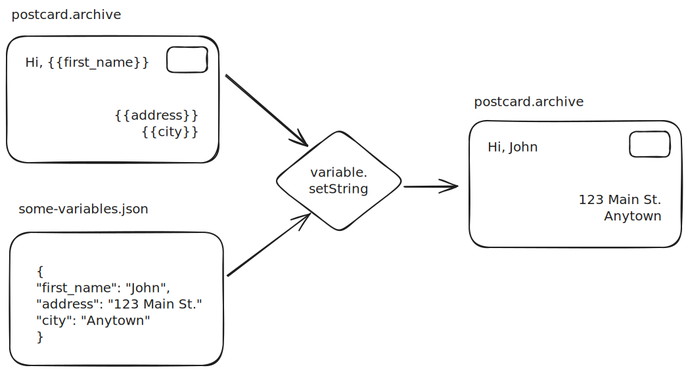

## Example Workflow[#](#example-workflow)

### 1\. Prepare the Template[#](#1-prepare-the-template)

Start by designing a template with text variables. Here’s an example postcard template with placeholders for the recipient’s details:


### 2\. Load the Template into the Editor[#](#2-load-the-template-into-the-editor)

Initialize the CE.SDK and load your prepared template:

```
// Load a template from your server or a CDNconst sceneUrl =  'https://cdn.img.ly/assets/demo/v2/ly.img.template/templates/cesdk_postcard_2.scene';await engine.scene.loadFromURL(sceneUrl);
```

### 3\. Provide Data to Populate the Template[#](#3-provide-data-to-populate-the-template)

Populate your template with data from your chosen source:

```
// Option 1: Prepare your data as a javascript objectconst data = {  textVariables: {    first_name: 'John',    last_name: 'Doe',    address: '123 Main St.',    city: 'Anytown',  },};// Option 2: Fetch from an API// const data = await fetch('https://api.example.com/design-data').then(res => res.json());engine.variable.setString('first_name', data.textVariables.first_name);engine.variable.setString('last_name', data.textVariables.last_name);engine.variable.setString('address', data.textVariables.address);engine.variable.setString('city', data.textVariables.city);
```

### 4\. Export the Final Design[#](#4-export-the-final-design)

Once the template is populated, export the final design in your preferred format:

```
const output = await engine.block.export(engine.scene.get(), { mimeType: 'application/pdf' });// Success: 'output' contains your generated design as a PDF Blob// You can now save it or display it in your application
```

Here’s what your final output should look like:

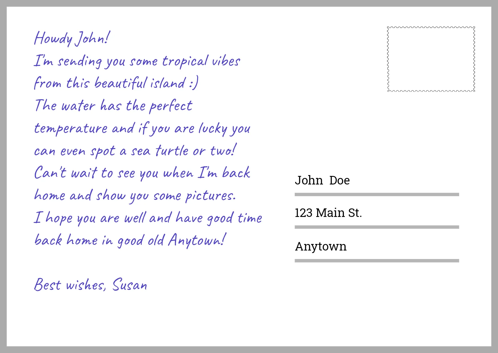

Need help with exports? Check out the [Export Guide](js/export-save-publish/export-82f968/) for detailed instructions and options.

## Troubleshooting[#](#troubleshooting)

If you encounter issues during the generation process:

*   Verify that all your variable names exactly match those in your template
*   Ensure your template is accessible from the provided URL
*   Check that your data values are in the correct format (strings for text variables)
*   Monitor the console for detailed error messages from the CE.SDK

---


[Source](http:/localhost:4321/js/api-reference/overview-8f24e1)

# API Reference

For Vanilla JS we offer the following packages:

*   [@cesdk/cesdk-js](js/api/cesdk-js/) our flagship package that includes our full-featured Editor UI for Design and Video editing
*   [@cesdk/engine](js/api/engine/) for headless applications and for building your own UI

---


[Source](http:/localhost:4321/js/api/engine)

# Package: @cesdk/engine

## Classes[#](#classes)

| Class | Description |
| --- | --- |
| [AssetAPI](http://localhost:4321/js/api/engine/classes/assetapi/) | Manage asset sources and apply assets to scenes. |
| [BlockAPI](http://localhost:4321/js/api/engine/classes/blockapi/) | Create, manipulate, and query the building blocks of your design. |
| [CreativeEngine](http://localhost:4321/js/api/engine/classes/creativeengine/) | The CreativeEngine is the core processing unit of CE.SDK and handles state management, rendering, input handling, and much more. It provides APIs to directly interact with assets, blocks, scenes, and variables. These APIs can be used in a headless environment to build and manipulate designs programmatically, or in a browser to create interactive applications. |
| [EditorAPI](http://localhost:4321/js/api/engine/classes/editorapi/) | Control the design editor’s behavior and settings. |
| [EventAPI](http://localhost:4321/js/api/engine/classes/eventapi/) | Subscribe to block lifecycle events in the design engine. |
| [SceneAPI](http://localhost:4321/js/api/engine/classes/sceneapi/) | Create, load, save, and manipulate scenes. |
| [VariableAPI](http://localhost:4321/js/api/engine/classes/variableapi/) | Manage text variables within design templates. |

## Functions[#](#functions)

| Function | Description |
| --- | --- |
| [defaultLogger](http://localhost:4321/js/api/engine/functions/defaultlogger/) | \- |
| [supportsBrowser](http://localhost:4321/js/api/engine/functions/supportsbrowser/) | Checks if the current browser supports necessary technologies to match our supported browsers |
| [checkVideoSupport](http://localhost:4321/js/api/engine/functions/checkvideosupport/) | Throws an error if the current browser does not support video editing. |
| [supportsVideo](http://localhost:4321/js/api/engine/functions/supportsvideo/) | Checks if the current browser supports video editing. |
| [checkVideoExportSupport](http://localhost:4321/js/api/engine/functions/checkvideoexportsupport/) | Throws an error if the current browser does not support video exporting. |
| [supportsVideoExport](http://localhost:4321/js/api/engine/functions/supportsvideoexport/) | Checks if the current browser supports video exporting. |
| [supportsWasm](http://localhost:4321/js/api/engine/functions/supportswasm/) | Checks if the current browser supports web assembly |
| [isRGBAColor](http://localhost:4321/js/api/engine/functions/isrgbacolor/) | Type guard for [RGBAColor](http://localhost:4321/js/api/engine/interfaces/rgbacolor/). |
| [isSpotColor](http://localhost:4321/js/api/engine/functions/isspotcolor/) | Type guard for [SpotColor](http://localhost:4321/js/api/engine/interfaces/spotcolor/). |
| [isCMYKColor](http://localhost:4321/js/api/engine/functions/iscmykcolor/) | Type guard for [CMYKColor](http://localhost:4321/js/api/engine/interfaces/cmykcolor/). |

## Type Aliases[#](#type-aliases)

| Type Alias | Description |
| --- | --- |
| [HorizontalBlockAlignment](http://localhost:4321/js/api/engine/type-aliases/horizontalblockalignment/) | Represents the horizontal alignment of blocks. |
| [VerticalBlockAlignment](http://localhost:4321/js/api/engine/type-aliases/verticalblockalignment/) | Represents the vertical alignment of blocks. |
| [PositionMode](http://localhost:4321/js/api/engine/type-aliases/positionmode/) | Represents the mode for positioning blocks. |
| [SizeMode](http://localhost:4321/js/api/engine/type-aliases/sizemode/) | Represents the mode for sizing blocks. |
| [ContentFillMode](http://localhost:4321/js/api/engine/type-aliases/contentfillmode/) | Represents the mode for filling content within a block. |
| [PropertyType](http://localhost:4321/js/api/engine/type-aliases/propertytype/) | Represents the various types of properties that can be associated with design blocks. Each type corresponds to a different kind of data that can be used to define the properties of a design block within the system. |
| [StrokePosition](http://localhost:4321/js/api/engine/type-aliases/strokeposition/) | Represents the position of a stroke relative to the shape’s boundary. |
| [StrokeStyle](http://localhost:4321/js/api/engine/type-aliases/strokestyle/) | Represents the style of a stroke. |
| [StrokeCornerGeometry](http://localhost:4321/js/api/engine/type-aliases/strokecornergeometry/) | Represents the corner geometry of a stroke. |
| [BlendMode](http://localhost:4321/js/api/engine/type-aliases/blendmode/) | Represents the blend mode of a layer or effect. |
| [TextCase](http://localhost:4321/js/api/engine/type-aliases/textcase/) | Represents the text case of a text block. |
| [BooleanOperation](http://localhost:4321/js/api/engine/type-aliases/booleanoperation/) | Represents the names of boolean operations. |
| [ExportOptions](http://localhost:4321/js/api/engine/type-aliases/exportoptions/) | Represents the options for exporting a design block. |
| [VideoExportOptions](http://localhost:4321/js/api/engine/type-aliases/videoexportoptions/) | Represents the options for exporting a video. |
| [AudioExportOptions](http://localhost:4321/js/api/engine/type-aliases/audioexportoptions/) | Represents the options for exporting audio. |
| [DropShadowOptions](http://localhost:4321/js/api/engine/type-aliases/dropshadowoptions/) | Options for configuring drop shadow effects on blocks. |
| [AnimationEntry](http://localhost:4321/js/api/engine/type-aliases/animationentry/) | Configuration options for animations. |
| [AnimationOptions](http://localhost:4321/js/api/engine/type-aliases/animationoptions/) | Options for configuring animations (in, loop, out animations). |
| [AddImageOptions](http://localhost:4321/js/api/engine/type-aliases/addimageoptions/) | Options for adding images to the scene. |
| [SettingType](http://localhost:4321/js/api/engine/type-aliases/settingtype/) | Represents the type of a setting. |
| [SettingsBool](http://localhost:4321/js/api/engine/type-aliases/settingsbool/) | Represents the boolean settings available in the editor. |
| [SettingsString](http://localhost:4321/js/api/engine/type-aliases/settingsstring/) | Represents the string settings available in the editor. |
| [SettingsFloat](http://localhost:4321/js/api/engine/type-aliases/settingsfloat/) | Represents the float settings available in the editor. |
| [SettingsColor](http://localhost:4321/js/api/engine/type-aliases/settingscolor/) | Represents the color settings available in the editor. |
| [~SettingsColorRGBA~](http://localhost:4321/js/api/engine/type-aliases/settingscolorrgba/) | Represents the color settings available in the editor. |
| [SettingsEnum](http://localhost:4321/js/api/engine/type-aliases/settingsenum/) | Represents the enum settings available in the editor. |
| [ZoomOptions](http://localhost:4321/js/api/engine/type-aliases/zoomoptions/) | Options for zooming to a block with optional animation. |
| [CreateSceneOptions](http://localhost:4321/js/api/engine/type-aliases/createsceneoptions/) | Options for creating a video scene. |
| [DefaultAssetSourceId](http://localhost:4321/js/api/engine/type-aliases/defaultassetsourceid/) | Represents the default asset source IDs used in the editor. |
| [DemoAssetSourceId](http://localhost:4321/js/api/engine/type-aliases/demoassetsourceid/) | Represents the default demo asset source IDs used in the editor. |
| [~TypefaceDefinition~](http://localhost:4321/js/api/engine/type-aliases/typefacedefinition/) | Represents a typeface definition used in the editor. |
| [EnginePluginContext](http://localhost:4321/js/api/engine/type-aliases/engineplugincontext/) | Represents the context for an engine plugin. |
| [LogLevel](http://localhost:4321/js/api/engine/type-aliases/loglevel/) | Provides logging functionality for the Creative Editor SDK. |
| [MimeType](http://localhost:4321/js/api/engine/type-aliases/mimetype/) | Represents the MIME types used in the editor. |
| [ImageMimeType](http://localhost:4321/js/api/engine/type-aliases/imagemimetype/) | Represents the image MIME types used in the editor. |
| [AudioMimeType](http://localhost:4321/js/api/engine/type-aliases/audiomimetype/) | Represents the audio MIME types used in the editor. |
| [VideoMimeType](http://localhost:4321/js/api/engine/type-aliases/videomimetype/) | Represents the video MIME types used in the editor. |
| [ApplicationMimeType](http://localhost:4321/js/api/engine/type-aliases/applicationmimetype/) | Represents the application MIME types used in the editor. |
| [AssetGroups](http://localhost:4321/js/api/engine/type-aliases/assetgroups/) | An asset can be member of multiple groups. Groups have a semantic meaning used to build and group UIs exploring the assets, e.g.sections in the content library, or for things like topics in Unsplash for instance. |
| [SortingOrder](http://localhost:4321/js/api/engine/type-aliases/sortingorder/) | The order to sort by if the asset source supports sorting. If set to None, the order is the same as the assets were added to the source. |
| [AssetMetaData](http://localhost:4321/js/api/engine/type-aliases/assetmetadata/) | Generic asset information |
| [AssetColor](http://localhost:4321/js/api/engine/type-aliases/assetcolor/) | Asset Color payload |
| [AssetTransformPreset](http://localhost:4321/js/api/engine/type-aliases/assettransformpreset/) | Transform preset payload |
| [AssetProperty](http://localhost:4321/js/api/engine/type-aliases/assetproperty/) | Asset property for payload |
| [DesignBlockTypeShorthand](http://localhost:4321/js/api/engine/type-aliases/designblocktypeshorthand/) | The shorthand block type IDs for the top-level design blocks. These are the IDs used to create new blocks using `cesdk.engine.block.create(id)`. |
| [DesignBlockTypeLonghand](http://localhost:4321/js/api/engine/type-aliases/designblocktypelonghand/) | The longhand block type IDs for the top-level design blocks. These are the IDs used to create new blocks using `cesdk.engine.block.create(id)`. |
| [DesignBlockType](http://localhost:4321/js/api/engine/type-aliases/designblocktype/) | The block type IDs for the top-level design blocks. These are the IDs used to create new blocks using `cesdk.engine.block.create(id)`. Refer to [DesignBlockTypeShorthand](http://localhost:4321/js/api/engine/type-aliases/designblocktypeshorthand/) and [DesignBlockTypeLonghand](http://localhost:4321/js/api/engine/type-aliases/designblocktypelonghand/) for more details. |
| [ShapeTypeShorthand](http://localhost:4321/js/api/engine/type-aliases/shapetypeshorthand/) | The shorthand block type IDs for the shape blocks. These are the IDs used to create new shapes using `cesdk.engine.block.createShape(id)`. |
| [ShapeTypeLonghand](http://localhost:4321/js/api/engine/type-aliases/shapetypelonghand/) | The longhand block type IDs for the blocks. These are the IDs used to create new shapes using `cesdk.engine.block.createShape(id)`. |
| [ShapeType](http://localhost:4321/js/api/engine/type-aliases/shapetype/) | The block type IDs for the shape blocks. These are the IDs used to create new shapes using `cesdk.engine.block.createShape(id)`. Refer to [ShapeTypeShorthand](http://localhost:4321/js/api/engine/type-aliases/shapetypeshorthand/) and [ShapeTypeLonghand](http://localhost:4321/js/api/engine/type-aliases/shapetypelonghand/) for more details. |
| [FillTypeShorthand](http://localhost:4321/js/api/engine/type-aliases/filltypeshorthand/) | The shorthand block type IDs for the fill blocks. These are the IDs used to create new fills using `cesdk.engine.block.createFill(id)`. |
| [FillTypeLonghand](http://localhost:4321/js/api/engine/type-aliases/filltypelonghand/) | The longhand block type IDs for the fill blocks. These are the IDs used to create new fills using `cesdk.engine.block.createFill(id)`. |
| [FillType](http://localhost:4321/js/api/engine/type-aliases/filltype/) | The block type IDs for the fill blocks. These are the IDs used to create new fills using `cesdk.engine.block.createFill(id)`. Refer to [FillTypeShorthand](http://localhost:4321/js/api/engine/type-aliases/filltypeshorthand/) and [FillTypeLonghand](http://localhost:4321/js/api/engine/type-aliases/filltypelonghand/) for more details. |
| [EffectTypeShorthand](http://localhost:4321/js/api/engine/type-aliases/effecttypeshorthand/) | The shorthand block type IDs for the effect blocks. These are the IDs used to create new effects using `cesdk.engine.block.createEffect(id)`. |
| [EffectTypeLonghand](http://localhost:4321/js/api/engine/type-aliases/effecttypelonghand/) | The longhand block type IDs for the effect blocks. These are the IDs used to create new effects using `cesdk.engine.block.createEffect(id)`. |
| [EffectType](http://localhost:4321/js/api/engine/type-aliases/effecttype/) | The block type IDs for the effect blocks. These are the IDs used to create new effects using `cesdk.engine.block.createEffect(id)`. Refer to [EffectTypeShorthand](http://localhost:4321/js/api/engine/type-aliases/effecttypeshorthand/) and [EffectTypeLonghand](http://localhost:4321/js/api/engine/type-aliases/effecttypelonghand/) for more details. |
| [BlurTypeShorthand](http://localhost:4321/js/api/engine/type-aliases/blurtypeshorthand/) | The shorthand block type IDs for the blur blocks. These are the IDs used to create new blurs using `cesdk.engine.block.createBlur(id)`. |
| [BlurTypeLonghand](http://localhost:4321/js/api/engine/type-aliases/blurtypelonghand/) | The longhand block type IDs for the blur blocks. These are the IDs used to create new blurs using `cesdk.engine.block.createBlur(id)`. |
| [BlurType](http://localhost:4321/js/api/engine/type-aliases/blurtype/) | The block type IDs for the blur blocks. These are the IDs used to create new blurs using `cesdk.engine.block.createBlur(id)`. Refer to [BlurTypeShorthand](http://localhost:4321/js/api/engine/type-aliases/blurtypeshorthand/) and [BlurTypeLonghand](http://localhost:4321/js/api/engine/type-aliases/blurtypelonghand/) for more details. |
| [AnimationTypeShorthand](http://localhost:4321/js/api/engine/type-aliases/animationtypeshorthand/) | The shorthand block type IDs for the animation blocks. These are the IDs used to create new animations using `cesdk.engine.block.createAnimation(id)`. |
| [AnimationTypeLonghand](http://localhost:4321/js/api/engine/type-aliases/animationtypelonghand/) | The longhand block type IDs for the animation blocks. These are the IDs used to create new animations using `cesdk.engine.block.createAnimation(id)`. |
| [AnimationType](http://localhost:4321/js/api/engine/type-aliases/animationtype/) | The block type IDs for the animation blocks. These are the IDs used to create new animations using `cesdk.engine.block.createAnimation(id)`. Refer to [AnimationTypeShorthand](http://localhost:4321/js/api/engine/type-aliases/animationtypeshorthand/) and [AnimationTypeLonghand](http://localhost:4321/js/api/engine/type-aliases/animationtypelonghand/) for more details. |
| [ObjectTypeShorthand](http://localhost:4321/js/api/engine/type-aliases/objecttypeshorthand/) | The shorthand block type IDs for all blocks types in the Creative Engine. Those are the types that can be passed to `cesdk.engine.block.findByType(type)` for example. |
| [ObjectTypeLonghand](http://localhost:4321/js/api/engine/type-aliases/objecttypelonghand/) | The longhand block type IDs for all blocks types in the Creative Engine. Those are the Types returned by the engine when calling `cesdk.engine.block.getType(blockId)` for example. |
| [ObjectType](http://localhost:4321/js/api/engine/type-aliases/objecttype/) | The block type IDs for all blocks types in the Creative Engine. Those are the types that can be passed to `cesdk.engine.block.findByType(type)` for example. Refer to [ObjectTypeShorthand](http://localhost:4321/js/api/engine/type-aliases/objecttypeshorthand/) and [ObjectTypeLonghand](http://localhost:4321/js/api/engine/type-aliases/objecttypelonghand/) for more details. |
| [OffscreenCanvas](http://localhost:4321/js/api/engine/type-aliases/offscreencanvas/) | A simplified placeholder type for `OffscreenCanvas`, to avoid a dependency on `@types/offscreencanvas` |
| [Canvas](http://localhost:4321/js/api/engine/type-aliases/canvas/) | An HTML Canvas or an Offscreen Canvas |
| [HexColorString](http://localhost:4321/js/api/engine/type-aliases/hexcolorstring/) | Represents a hexadecimal color value (RGB or RGBA) that starts with a ’#’. |
| [PaletteColor](http://localhost:4321/js/api/engine/type-aliases/palettecolor/) | Represents a color definition for the custom color palette. |
| [Color](http://localhost:4321/js/api/engine/type-aliases/color/) | Represents all color types supported by the engine. |
| [ColorSpace](http://localhost:4321/js/api/engine/type-aliases/colorspace/) | Represents the color space used in the editor. |
| [CutoutType](http://localhost:4321/js/api/engine/type-aliases/cutouttype/) | Represents the type of a cutout. |
| [CutoutOperation](http://localhost:4321/js/api/engine/type-aliases/cutoutoperation/) | Represents the operation performed on a cutout. |
| [DesignBlockId](http://localhost:4321/js/api/engine/type-aliases/designblockid/) | A numerical identifier for a design block |
| [HistoryId](http://localhost:4321/js/api/engine/type-aliases/historyid/) | A numerical identifier for a history stack |
| [SceneLayout](http://localhost:4321/js/api/engine/type-aliases/scenelayout/) | The scene layout determines how the layout stack should layout its pages. |
| [AnimationEasing](http://localhost:4321/js/api/engine/type-aliases/animationeasing/) | The easing options for the camera animation. |
| [SceneMode](http://localhost:4321/js/api/engine/type-aliases/scenemode/) | The mode of the scene defines how the editor and playback should behave. |
| [ZoomAutoFitAxis](http://localhost:4321/js/api/engine/type-aliases/zoomautofitaxis/) | The axis(es) for which to auto-fit. |
| [DesignUnit](http://localhost:4321/js/api/engine/type-aliases/designunit/) | The unit type in which the page values (size, distances, etc.) are defined. |
| [HorizontalTextAlignment](http://localhost:4321/js/api/engine/type-aliases/horizontaltextalignment/) | The horizontal text alignment options. |
| [VerticalTextAlignment](http://localhost:4321/js/api/engine/type-aliases/verticaltextalignment/) | The vertical text alignment options. |
| [EditMode](http://localhost:4321/js/api/engine/type-aliases/editmode/) | Represents the current edit mode of the editor. |
| [FontWeight](http://localhost:4321/js/api/engine/type-aliases/fontweight/) | Represents the weight of a font. |
| [FontStyle](http://localhost:4321/js/api/engine/type-aliases/fontstyle/) | Represents the style of a font. |
| [RoleString](http://localhost:4321/js/api/engine/type-aliases/rolestring/) | Represents a role string. |
| [Scope](http://localhost:4321/js/api/engine/type-aliases/scope/) | Represents the various scopes that define the capabilities and permissions within the Creative Editor SDK. Each scope corresponds to a specific functionality or action that can be performed within the editor. |
| [RGBA](http://localhost:4321/js/api/engine/type-aliases/rgba/) | Represents a color in the RGBA color space. |
| [CMYK](http://localhost:4321/js/api/engine/type-aliases/cmyk/) | Represents a color in the CMYK color space. |
| [XYWH](http://localhost:4321/js/api/engine/type-aliases/xywh/) | Describes a rectangle on the screen. |
| [GradientstopRGBA](http://localhost:4321/js/api/engine/type-aliases/gradientstoprgba/) | Represents a gradient stop in the RGBA color space. |
| [BlockState](http://localhost:4321/js/api/engine/type-aliases/blockstate/) | Represents the state of a design block. |

## Interfaces[#](#interfaces)

| Interface | Description |
| --- | --- |
| [AddVideoOptions](http://localhost:4321/js/api/engine/interfaces/addvideooptions/) | Options for adding videos to the scene. |
| [HTMLCreativeEngineCanvasElement](http://localhost:4321/js/api/engine/interfaces/htmlcreativeenginecanvaselement/) | A wrapper around a plain canvas |
| [Configuration](http://localhost:4321/js/api/engine/interfaces/configuration/) | Specifies the configuration for the Creative Editor SDK. |
| [EnginePlugin](http://localhost:4321/js/api/engine/interfaces/engineplugin/) | Represents an engine plugin. |
| [Reactor](http://localhost:4321/js/api/engine/interfaces/reactor/) | The reactor coordinates the update of registered _Reactions_. |
| [Reaction](http://localhost:4321/js/api/engine/interfaces/reaction/) | Reactions track read calls and provide a way to react if they change. |
| [Logger](http://localhost:4321/js/api/engine/interfaces/logger/) | Represents a logger function. |
| [PageDuration](http://localhost:4321/js/api/engine/interfaces/pageduration/) | \- |
| [Source](http://localhost:4321/js/api/engine/interfaces/source/) | A single source width an intrinsic width & height. |
| [AssetRGBColor](http://localhost:4321/js/api/engine/interfaces/assetrgbcolor/) | Asset Color payload RGB representation |
| [AssetCMYKColor](http://localhost:4321/js/api/engine/interfaces/assetcmykcolor/) | Asset Color payload CMYK representation |
| [AssetSpotColor](http://localhost:4321/js/api/engine/interfaces/assetspotcolor/) | Asset Color payload SpotColor representation |
| [AssetFixedAspectRatio](http://localhost:4321/js/api/engine/interfaces/assetfixedaspectratio/) | Asset transform preset payload fixed aspect ratio |
| [AssetFreeAspectRatio](http://localhost:4321/js/api/engine/interfaces/assetfreeaspectratio/) | Asset transform preset payload free aspect ratio |
| [AssetFixedSize](http://localhost:4321/js/api/engine/interfaces/assetfixedsize/) | Asset transform preset payload fixed size |
| [AssetStringProperty](http://localhost:4321/js/api/engine/interfaces/assetstringproperty/) | Asset string property definition |
| [AssetNumberProperty](http://localhost:4321/js/api/engine/interfaces/assetnumberproperty/) | Asset number property definition |
| [AssetBooleanProperty](http://localhost:4321/js/api/engine/interfaces/assetbooleanproperty/) | Asset boolean property definition |
| [AssetEnumProperty](http://localhost:4321/js/api/engine/interfaces/assetenumproperty/) | Asset enum property definition |
| [AssetColorProperty](http://localhost:4321/js/api/engine/interfaces/assetcolorproperty/) | Asset color property definition |
| [AssetPayload](http://localhost:4321/js/api/engine/interfaces/assetpayload/) | Asset payload |
| [Asset](http://localhost:4321/js/api/engine/interfaces/asset/) | Generic asset information |
| [AssetDefinition](http://localhost:4321/js/api/engine/interfaces/assetdefinition/) | Definition of an asset used if an asset is added to an asset source. |
| [AssetResult](http://localhost:4321/js/api/engine/interfaces/assetresult/) | Single asset result of a query from the engine. |
| [CompleteAssetResult](http://localhost:4321/js/api/engine/interfaces/completeassetresult/) | Asset results that are returned from the engine. |
| [AssetQueryData](http://localhost:4321/js/api/engine/interfaces/assetquerydata/) | Defines a request for querying assets |
| [AssetsQueryResult](http://localhost:4321/js/api/engine/interfaces/assetsqueryresult/) | Return type of a `findAssets` query. |
| [AssetSource](http://localhost:4321/js/api/engine/interfaces/assetsource/) | A source of assets |
| [RGBColor](http://localhost:4321/js/api/engine/interfaces/rgbcolor/) | Represents an RGB color value. |
| [RGBAColor](http://localhost:4321/js/api/engine/interfaces/rgbacolor/) | Represents an RGBA color value. |
| [CMYKColor](http://localhost:4321/js/api/engine/interfaces/cmykcolor/) | Represents a CMYK color value. |
| [SpotColor](http://localhost:4321/js/api/engine/interfaces/spotcolor/) | Represents a spot color value. |
| [GradientColorStop](http://localhost:4321/js/api/engine/interfaces/gradientcolorstop/) | Represents a gradient color stop. |
| [Vec2](http://localhost:4321/js/api/engine/interfaces/vec2/) | \- |
| [Vec3](http://localhost:4321/js/api/engine/interfaces/vec3/) | \- |
| [Size2](http://localhost:4321/js/api/engine/interfaces/size2/) | \- |
| [Range](http://localhost:4321/js/api/engine/interfaces/range/) | An open range. |
| [Font](http://localhost:4321/js/api/engine/interfaces/font/) | Represents a font. |
| [Typeface](http://localhost:4321/js/api/engine/interfaces/typeface/) | Represents a typeface. |
| [Buffer](http://localhost:4321/js/api/engine/interfaces/buffer/) | Represents a buffer of data. |
| [TransientResource](http://localhost:4321/js/api/engine/interfaces/transientresource/) | Represents a transient resource. |
| [BlockEvent](http://localhost:4321/js/api/engine/interfaces/blockevent/) | Represents an event related to a design block. |
| [BlockStateError](http://localhost:4321/js/api/engine/interfaces/blockstateerror/) | Represents an error state for a design block. |
| [BlockStatePending](http://localhost:4321/js/api/engine/interfaces/blockstatepending/) | Represents a pending state for a design block. |
| [BlockStateReady](http://localhost:4321/js/api/engine/interfaces/blockstateready/) | Represents a ready state for a design block. |
| [CursorEvent](http://localhost:4321/js/api/engine/interfaces/cursorevent/) | Dispatched on the engine canvas when the text input has been blurred. Call `preventDefault()` to disallow this and refocus the engine text input. |
| [BlurEvent](http://localhost:4321/js/api/engine/interfaces/blurevent/) | Dispatched on the engine canvas when the text input has been blurred. Call `preventDefault()` to disallow this and refocus the engine text input. |
| [RefocusEvent](http://localhost:4321/js/api/engine/interfaces/refocusevent/) | Dispatched on the engine canvas right before the engine will refocus its text input after a blur. Call `preventDefault()` to prevent the refocusing. |

## Variables[#](#variables)

| Variable | Description |
| --- | --- |
| [~LogLevel~](http://localhost:4321/js/api/engine/variables/loglevel/) | Provides a set of predefined log levels for the Creative Editor SDK. |
| [~MimeType~](http://localhost:4321/js/api/engine/variables/mimetype/) | Represents the MIME types used in the editor. |

---


[Source](http:/localhost:4321/js/api/cesdk-js)

# Package: @cesdk/cesdk-js

## Classes[#](#classes)

| Class | Description |
| --- | --- |
| [FeatureAPI](http://localhost:4321/js/api/cesdk-js/classes/featureapi/) | Controls the availability of features within the Creative Editor SDK. |
| [InternationalizationAPI](http://localhost:4321/js/api/cesdk-js/classes/internationalizationapi/) | Manages localization and internationalization settings for the Creative Editor SDK. |
| [UserInterfaceAPI](http://localhost:4321/js/api/cesdk-js/classes/userinterfaceapi/) | Control the user interface and behavior of the Creative Editor SDK. |
| [CreativeEditorSDK](http://localhost:4321/js/api/cesdk-js/classes/creativeeditorsdk/) | The main entry point for the Creative Editor SDK. |
| [AssetAPI](http://localhost:4321/js/api/cesdk-js/classes/assetapi/) | Manage asset sources and apply assets to scenes. |
| [BlockAPI](http://localhost:4321/js/api/cesdk-js/classes/blockapi/) | Create, manipulate, and query the building blocks of your design. |
| [CreativeEngine](http://localhost:4321/js/api/cesdk-js/classes/creativeengine/) | The CreativeEngine is the core processing unit of CE.SDK and handles state management, rendering, input handling, and much more. It provides APIs to directly interact with assets, blocks, scenes, and variables. These APIs can be used in a headless environment to build and manipulate designs programmatically, or in a browser to create interactive applications. |
| [EditorAPI](http://localhost:4321/js/api/cesdk-js/classes/editorapi/) | Control the design editor’s behavior and settings. |
| [EventAPI](http://localhost:4321/js/api/cesdk-js/classes/eventapi/) | Subscribe to block lifecycle events in the design engine. |
| [SceneAPI](http://localhost:4321/js/api/cesdk-js/classes/sceneapi/) | Create, load, save, and manipulate scenes. |
| [VariableAPI](http://localhost:4321/js/api/cesdk-js/classes/variableapi/) | Manage text variables within design templates. |

## Functions[#](#functions)

| Function | Description |
| --- | --- |
| [supportsBrowser](http://localhost:4321/js/api/cesdk-js/functions/supportsbrowser/) | Checks if the current browser supports necessary technologies to match our supported browsers |
| [checkVideoSupport](http://localhost:4321/js/api/cesdk-js/functions/checkvideosupport/) | Throws an error if the current browser does not support video editing. |
| [supportsVideo](http://localhost:4321/js/api/cesdk-js/functions/supportsvideo/) | Checks if the current browser supports video editing. |
| [checkVideoExportSupport](http://localhost:4321/js/api/cesdk-js/functions/checkvideoexportsupport/) | Throws an error if the current browser does not support video exporting. |
| [supportsVideoExport](http://localhost:4321/js/api/cesdk-js/functions/supportsvideoexport/) | Checks if the current browser supports video exporting. |
| [supportsWasm](http://localhost:4321/js/api/cesdk-js/functions/supportswasm/) | Checks if the current browser supports web assembly |

## Type Aliases[#](#type-aliases)

| Type Alias | Description |
| --- | --- |
| [FeatureId](http://localhost:4321/js/api/cesdk-js/type-aliases/featureid/) | All built-in CE.SDK Feature Ids. |
| [Configuration](http://localhost:4321/js/api/cesdk-js/type-aliases/configuration/) | Represents the user-provided configuration for the Creative Editor SDK. This type allows for partial configuration settings, making all properties optional. |
| [PageFormatDefinition](http://localhost:4321/js/api/cesdk-js/type-aliases/pageformatdefinition/) | Represents the definition of a page format in the Creative Editor SDK. This interface defines the width, height, unit, and optional fixed orientation for a page format. |
| [DockOrderComponentId](http://localhost:4321/js/api/cesdk-js/type-aliases/dockordercomponentid/) | Represents the ID of a dock order component. |
| [CanvasMenuComponentId](http://localhost:4321/js/api/cesdk-js/type-aliases/canvasmenucomponentid/) | Represents the ID of a canvas menu component. |
| [NavigationBarComponentId](http://localhost:4321/js/api/cesdk-js/type-aliases/navigationbarcomponentid/) | Represents the ID of a navigation bar component. |
| [CanvasBarComponentId](http://localhost:4321/js/api/cesdk-js/type-aliases/canvasbarcomponentid/) | Represents the ID of a canvas bar component. |
| [InspectorBarComponentId](http://localhost:4321/js/api/cesdk-js/type-aliases/inspectorbarcomponentid/) | Represents the ID of an inspector bar component. |
| [ComponentId](http://localhost:4321/js/api/cesdk-js/type-aliases/componentid/) | Represents the ID of a component. |
| [AssetLibraryDockComponent](http://localhost:4321/js/api/cesdk-js/type-aliases/assetlibrarydockcomponent/) | Represents an asset library dock component. |
| [DockOrderComponent](http://localhost:4321/js/api/cesdk-js/type-aliases/dockordercomponent/) | Represents a dock order component. |
| [OrderComponentMatcher](http://localhost:4321/js/api/cesdk-js/type-aliases/ordercomponentmatcher/) | Represents a matcher for order components. |
| [DialogType](http://localhost:4321/js/api/cesdk-js/type-aliases/dialogtype/) | Represents the type of dialog. |
| [DialogSize](http://localhost:4321/js/api/cesdk-js/type-aliases/dialogsize/) | Represents the size of the dialog. |
| [DialogContent](http://localhost:4321/js/api/cesdk-js/type-aliases/dialogcontent/) | Represents the content of the dialog. |
| [DialogAction](http://localhost:4321/js/api/cesdk-js/type-aliases/dialogaction/) | Represents an action in the dialog. |
| [DialogProgress](http://localhost:4321/js/api/cesdk-js/type-aliases/dialogprogress/) | Represents the progress of the dialog. |
| [NotificationType](http://localhost:4321/js/api/cesdk-js/type-aliases/notificationtype/) | Represents the type of notification. |
| [NotificationDuration](http://localhost:4321/js/api/cesdk-js/type-aliases/notificationduration/) | Represents the duration of the notification. |
| [PanelId](http://localhost:4321/js/api/cesdk-js/type-aliases/panelid/) | Represents a unique identifier for a panel in the Creative Editor SDK. This type defines specific panel IDs and allows for custom panel IDs. |
| [AssetLibraryPanelPayload](http://localhost:4321/js/api/cesdk-js/type-aliases/assetlibrarypanelpayload/) | Represents the payload for the asset library panel in the Creative Editor SDK. This interface defines the title and entries for the asset library panel. |
| [UnknownPanelPayload](http://localhost:4321/js/api/cesdk-js/type-aliases/unknownpanelpayload/) | Represents an unknown payload for a panel in the Creative Editor SDK. This type defines a generic payload with unknown keys and values. |
| [PanelPayload](http://localhost:4321/js/api/cesdk-js/type-aliases/panelpayload/) | Represents the payload for a panel in the Creative Editor SDK. This type defines the payload based on the panel ID. |
| [PanelOptions](http://localhost:4321/js/api/cesdk-js/type-aliases/paneloptions/) | Represents the options for a panel in the Creative Editor SDK. This interface defines the options for a panel, including whether it is closable by the user, its position, whether it is floating, and its payload. |
| [Optional](http://localhost:4321/js/api/cesdk-js/type-aliases/optional/) | Turn value at K of T into a Partial |
| [EditorPluginContext](http://localhost:4321/js/api/cesdk-js/type-aliases/editorplugincontext/) | Represents the context for an editor plugin. This type extends the `EnginePluginContext` with an optional `cesdk` property. |
| [IsEnabledFeatureContext](http://localhost:4321/js/api/cesdk-js/type-aliases/isenabledfeaturecontext/) | Represents the context for determining if a feature is enabled. This type includes the `CreativeEngine` instance. |
| [FeaturePredicateContext](http://localhost:4321/js/api/cesdk-js/type-aliases/featurepredicatecontext/) | Represents the context for enabling a feature. This type extends `IsEnabledFeatureContext` and includes a function to check the previous enable state and a function to get the default predicate. |
| [FeaturePredicate](http://localhost:4321/js/api/cesdk-js/type-aliases/featurepredicate/) | The feature predicate is used to enable or disable a feature based on the boolean or the return value of the function. |
| [PanelDisposer](http://localhost:4321/js/api/cesdk-js/type-aliases/paneldisposer/) | Represents a function that disposes of a panel. |
| [CustomPanelMountFunction](http://localhost:4321/js/api/cesdk-js/type-aliases/custompanelmountfunction/) | Represents a function that mounts a custom panel. |
| [InsertOrderComponentLocation](http://localhost:4321/js/api/cesdk-js/type-aliases/insertordercomponentlocation/) | Represents the location for inserting an order component. |
| [Suffix](http://localhost:4321/js/api/cesdk-js/type-aliases/suffix/) | Represents additional options for a button, which can be used as a suffix. |
| [ChildrenOrder](http://localhost:4321/js/api/cesdk-js/type-aliases/childrenorder/) | Represents the order of children components in a dropdown. |
| [PreviewTypeImage](http://localhost:4321/js/api/cesdk-js/type-aliases/previewtypeimage/) | Represents an image preview. |
| [PreviewTypeColor](http://localhost:4321/js/api/cesdk-js/type-aliases/previewtypecolor/) | Represents a color preview. |
| [PreviewType](http://localhost:4321/js/api/cesdk-js/type-aliases/previewtype/) | Represents a preview, which can be either an image or a color. |
| [BuilderRenderFunction](http://localhost:4321/js/api/cesdk-js/type-aliases/builderrenderfunction/) | Function that defines a component with the help of the passed builder object. |
| [HorizontalBlockAlignment](http://localhost:4321/js/api/cesdk-js/type-aliases/horizontalblockalignment/) | Represents the horizontal alignment of blocks. |
| [VerticalBlockAlignment](http://localhost:4321/js/api/cesdk-js/type-aliases/verticalblockalignment/) | Represents the vertical alignment of blocks. |
| [PositionMode](http://localhost:4321/js/api/cesdk-js/type-aliases/positionmode/) | Represents the mode for positioning blocks. |
| [SizeMode](http://localhost:4321/js/api/cesdk-js/type-aliases/sizemode/) | Represents the mode for sizing blocks. |
| [ContentFillMode](http://localhost:4321/js/api/cesdk-js/type-aliases/contentfillmode/) | Represents the mode for filling content within a block. |
| [PropertyType](http://localhost:4321/js/api/cesdk-js/type-aliases/propertytype/) | Represents the various types of properties that can be associated with design blocks. Each type corresponds to a different kind of data that can be used to define the properties of a design block within the system. |
| [StrokePosition](http://localhost:4321/js/api/cesdk-js/type-aliases/strokeposition/) | Represents the position of a stroke relative to the shape’s boundary. |
| [StrokeStyle](http://localhost:4321/js/api/cesdk-js/type-aliases/strokestyle/) | Represents the style of a stroke. |
| [StrokeCornerGeometry](http://localhost:4321/js/api/cesdk-js/type-aliases/strokecornergeometry/) | Represents the corner geometry of a stroke. |
| [BlendMode](http://localhost:4321/js/api/cesdk-js/type-aliases/blendmode/) | Represents the blend mode of a layer or effect. |
| [TextCase](http://localhost:4321/js/api/cesdk-js/type-aliases/textcase/) | Represents the text case of a text block. |
| [BooleanOperation](http://localhost:4321/js/api/cesdk-js/type-aliases/booleanoperation/) | Represents the names of boolean operations. |
| [EngineExportOptions](http://localhost:4321/js/api/cesdk-js/type-aliases/engineexportoptions/) | Represents the options for exporting a design block. |
| [VideoExportOptions](http://localhost:4321/js/api/cesdk-js/type-aliases/videoexportoptions/) | Represents the options for exporting a video. |
| [AudioExportOptions](http://localhost:4321/js/api/cesdk-js/type-aliases/audioexportoptions/) | Represents the options for exporting audio. |
| [DropShadowOptions](http://localhost:4321/js/api/cesdk-js/type-aliases/dropshadowoptions/) | Options for configuring drop shadow effects on blocks. |
| [AnimationEntry](http://localhost:4321/js/api/cesdk-js/type-aliases/animationentry/) | Configuration options for animations. |
| [AnimationOptions](http://localhost:4321/js/api/cesdk-js/type-aliases/animationoptions/) | Options for configuring animations (in, loop, out animations). |
| [AddImageOptions](http://localhost:4321/js/api/cesdk-js/type-aliases/addimageoptions/) | Options for adding images to the scene. |
| [SettingType](http://localhost:4321/js/api/cesdk-js/type-aliases/settingtype/) | Represents the type of a setting. |
| [SettingsBool](http://localhost:4321/js/api/cesdk-js/type-aliases/settingsbool/) | Represents the boolean settings available in the editor. |
| [SettingsString](http://localhost:4321/js/api/cesdk-js/type-aliases/settingsstring/) | Represents the string settings available in the editor. |
| [SettingsFloat](http://localhost:4321/js/api/cesdk-js/type-aliases/settingsfloat/) | Represents the float settings available in the editor. |
| [SettingsColor](http://localhost:4321/js/api/cesdk-js/type-aliases/settingscolor/) | Represents the color settings available in the editor. |
| [~SettingsColorRGBA~](http://localhost:4321/js/api/cesdk-js/type-aliases/settingscolorrgba/) | Represents the color settings available in the editor. |
| [SettingsEnum](http://localhost:4321/js/api/cesdk-js/type-aliases/settingsenum/) | Represents the enum settings available in the editor. |
| [ZoomOptions](http://localhost:4321/js/api/cesdk-js/type-aliases/zoomoptions/) | Options for zooming to a block with optional animation. |
| [CreateSceneOptions](http://localhost:4321/js/api/cesdk-js/type-aliases/createsceneoptions/) | Options for creating a video scene. |
| [DefaultAssetSourceId](http://localhost:4321/js/api/cesdk-js/type-aliases/defaultassetsourceid/) | Represents the default asset source IDs used in the editor. |
| [DemoAssetSourceId](http://localhost:4321/js/api/cesdk-js/type-aliases/demoassetsourceid/) | Represents the default demo asset source IDs used in the editor. |
| [~TypefaceDefinition~](http://localhost:4321/js/api/cesdk-js/type-aliases/typefacedefinition/) | Represents a typeface definition used in the editor. |
| [EnginePluginContext](http://localhost:4321/js/api/cesdk-js/type-aliases/engineplugincontext/) | Represents the context for an engine plugin. |
| [LogLevel](http://localhost:4321/js/api/cesdk-js/type-aliases/loglevel/) | Provides logging functionality for the Creative Editor SDK. |
| [MimeType](http://localhost:4321/js/api/cesdk-js/type-aliases/mimetype/) | Represents the MIME types used in the editor. |
| [ImageMimeType](http://localhost:4321/js/api/cesdk-js/type-aliases/imagemimetype/) | Represents the image MIME types used in the editor. |
| [AudioMimeType](http://localhost:4321/js/api/cesdk-js/type-aliases/audiomimetype/) | Represents the audio MIME types used in the editor. |
| [VideoMimeType](http://localhost:4321/js/api/cesdk-js/type-aliases/videomimetype/) | Represents the video MIME types used in the editor. |
| [ApplicationMimeType](http://localhost:4321/js/api/cesdk-js/type-aliases/applicationmimetype/) | Represents the application MIME types used in the editor. |
| [AssetGroups](http://localhost:4321/js/api/cesdk-js/type-aliases/assetgroups/) | An asset can be member of multiple groups. Groups have a semantic meaning used to build and group UIs exploring the assets, e.g.sections in the content library, or for things like topics in Unsplash for instance. |
| [SortingOrder](http://localhost:4321/js/api/cesdk-js/type-aliases/sortingorder/) | The order to sort by if the asset source supports sorting. If set to None, the order is the same as the assets were added to the source. |
| [AssetMetaData](http://localhost:4321/js/api/cesdk-js/type-aliases/assetmetadata/) | Generic asset information |
| [AssetColor](http://localhost:4321/js/api/cesdk-js/type-aliases/assetcolor/) | Asset Color payload |
| [AssetTransformPreset](http://localhost:4321/js/api/cesdk-js/type-aliases/assettransformpreset/) | Transform preset payload |
| [AssetProperty](http://localhost:4321/js/api/cesdk-js/type-aliases/assetproperty/) | Asset property for payload |
| [DesignBlockTypeShorthand](http://localhost:4321/js/api/cesdk-js/type-aliases/designblocktypeshorthand/) | The shorthand block type IDs for the top-level design blocks. These are the IDs used to create new blocks using `cesdk.engine.block.create(id)`. |
| [DesignBlockTypeLonghand](http://localhost:4321/js/api/cesdk-js/type-aliases/designblocktypelonghand/) | The longhand block type IDs for the top-level design blocks. These are the IDs used to create new blocks using `cesdk.engine.block.create(id)`. |
| [DesignBlockType](http://localhost:4321/js/api/cesdk-js/type-aliases/designblocktype/) | The block type IDs for the top-level design blocks. These are the IDs used to create new blocks using `cesdk.engine.block.create(id)`. Refer to [DesignBlockTypeShorthand](http://localhost:4321/js/api/cesdk-js/type-aliases/designblocktypeshorthand/) and [DesignBlockTypeLonghand](http://localhost:4321/js/api/cesdk-js/type-aliases/designblocktypelonghand/) for more details. |
| [ShapeTypeShorthand](http://localhost:4321/js/api/cesdk-js/type-aliases/shapetypeshorthand/) | The shorthand block type IDs for the shape blocks. These are the IDs used to create new shapes using `cesdk.engine.block.createShape(id)`. |
| [ShapeTypeLonghand](http://localhost:4321/js/api/cesdk-js/type-aliases/shapetypelonghand/) | The longhand block type IDs for the blocks. These are the IDs used to create new shapes using `cesdk.engine.block.createShape(id)`. |
| [ShapeType](http://localhost:4321/js/api/cesdk-js/type-aliases/shapetype/) | The block type IDs for the shape blocks. These are the IDs used to create new shapes using `cesdk.engine.block.createShape(id)`. Refer to [ShapeTypeShorthand](http://localhost:4321/js/api/cesdk-js/type-aliases/shapetypeshorthand/) and [ShapeTypeLonghand](http://localhost:4321/js/api/cesdk-js/type-aliases/shapetypelonghand/) for more details. |
| [FillTypeShorthand](http://localhost:4321/js/api/cesdk-js/type-aliases/filltypeshorthand/) | The shorthand block type IDs for the fill blocks. These are the IDs used to create new fills using `cesdk.engine.block.createFill(id)`. |
| [FillTypeLonghand](http://localhost:4321/js/api/cesdk-js/type-aliases/filltypelonghand/) | The longhand block type IDs for the fill blocks. These are the IDs used to create new fills using `cesdk.engine.block.createFill(id)`. |
| [FillType](http://localhost:4321/js/api/cesdk-js/type-aliases/filltype/) | The block type IDs for the fill blocks. These are the IDs used to create new fills using `cesdk.engine.block.createFill(id)`. Refer to [FillTypeShorthand](http://localhost:4321/js/api/cesdk-js/type-aliases/filltypeshorthand/) and [FillTypeLonghand](http://localhost:4321/js/api/cesdk-js/type-aliases/filltypelonghand/) for more details. |
| [EffectTypeShorthand](http://localhost:4321/js/api/cesdk-js/type-aliases/effecttypeshorthand/) | The shorthand block type IDs for the effect blocks. These are the IDs used to create new effects using `cesdk.engine.block.createEffect(id)`. |
| [EffectTypeLonghand](http://localhost:4321/js/api/cesdk-js/type-aliases/effecttypelonghand/) | The longhand block type IDs for the effect blocks. These are the IDs used to create new effects using `cesdk.engine.block.createEffect(id)`. |
| [EffectType](http://localhost:4321/js/api/cesdk-js/type-aliases/effecttype/) | The block type IDs for the effect blocks. These are the IDs used to create new effects using `cesdk.engine.block.createEffect(id)`. Refer to [EffectTypeShorthand](http://localhost:4321/js/api/cesdk-js/type-aliases/effecttypeshorthand/) and [EffectTypeLonghand](http://localhost:4321/js/api/cesdk-js/type-aliases/effecttypelonghand/) for more details. |
| [BlurTypeShorthand](http://localhost:4321/js/api/cesdk-js/type-aliases/blurtypeshorthand/) | The shorthand block type IDs for the blur blocks. These are the IDs used to create new blurs using `cesdk.engine.block.createBlur(id)`. |
| [BlurTypeLonghand](http://localhost:4321/js/api/cesdk-js/type-aliases/blurtypelonghand/) | The longhand block type IDs for the blur blocks. These are the IDs used to create new blurs using `cesdk.engine.block.createBlur(id)`. |
| [BlurType](http://localhost:4321/js/api/cesdk-js/type-aliases/blurtype/) | The block type IDs for the blur blocks. These are the IDs used to create new blurs using `cesdk.engine.block.createBlur(id)`. Refer to [BlurTypeShorthand](http://localhost:4321/js/api/cesdk-js/type-aliases/blurtypeshorthand/) and [BlurTypeLonghand](http://localhost:4321/js/api/cesdk-js/type-aliases/blurtypelonghand/) for more details. |
| [AnimationTypeShorthand](http://localhost:4321/js/api/cesdk-js/type-aliases/animationtypeshorthand/) | The shorthand block type IDs for the animation blocks. These are the IDs used to create new animations using `cesdk.engine.block.createAnimation(id)`. |
| [AnimationTypeLonghand](http://localhost:4321/js/api/cesdk-js/type-aliases/animationtypelonghand/) | The longhand block type IDs for the animation blocks. These are the IDs used to create new animations using `cesdk.engine.block.createAnimation(id)`. |
| [AnimationType](http://localhost:4321/js/api/cesdk-js/type-aliases/animationtype/) | The block type IDs for the animation blocks. These are the IDs used to create new animations using `cesdk.engine.block.createAnimation(id)`. Refer to [AnimationTypeShorthand](http://localhost:4321/js/api/cesdk-js/type-aliases/animationtypeshorthand/) and [AnimationTypeLonghand](http://localhost:4321/js/api/cesdk-js/type-aliases/animationtypelonghand/) for more details. |
| [ObjectTypeShorthand](http://localhost:4321/js/api/cesdk-js/type-aliases/objecttypeshorthand/) | The shorthand block type IDs for all blocks types in the Creative Engine. Those are the types that can be passed to `cesdk.engine.block.findByType(type)` for example. |
| [ObjectTypeLonghand](http://localhost:4321/js/api/cesdk-js/type-aliases/objecttypelonghand/) | The longhand block type IDs for all blocks types in the Creative Engine. Those are the Types returned by the engine when calling `cesdk.engine.block.getType(blockId)` for example. |
| [ObjectType](http://localhost:4321/js/api/cesdk-js/type-aliases/objecttype/) | The block type IDs for all blocks types in the Creative Engine. Those are the types that can be passed to `cesdk.engine.block.findByType(type)` for example. Refer to [ObjectTypeShorthand](http://localhost:4321/js/api/cesdk-js/type-aliases/objecttypeshorthand/) and [ObjectTypeLonghand](http://localhost:4321/js/api/cesdk-js/type-aliases/objecttypelonghand/) for more details. |
| [OffscreenCanvas](http://localhost:4321/js/api/cesdk-js/type-aliases/offscreencanvas/) | A simplified placeholder type for `OffscreenCanvas`, to avoid a dependency on `@types/offscreencanvas` |
| [Canvas](http://localhost:4321/js/api/cesdk-js/type-aliases/canvas/) | An HTML Canvas or an Offscreen Canvas |
| [HexColorString](http://localhost:4321/js/api/cesdk-js/type-aliases/hexcolorstring/) | Represents a hexadecimal color value (RGB or RGBA) that starts with a ’#’. |
| [PaletteColor](http://localhost:4321/js/api/cesdk-js/type-aliases/palettecolor/) | Represents a color definition for the custom color palette. |
| [ColorSpace](http://localhost:4321/js/api/cesdk-js/type-aliases/colorspace/) | Represents the color space used in the editor. |
| [CutoutType](http://localhost:4321/js/api/cesdk-js/type-aliases/cutouttype/) | Represents the type of a cutout. |
| [CutoutOperation](http://localhost:4321/js/api/cesdk-js/type-aliases/cutoutoperation/) | Represents the operation performed on a cutout. |
| [DesignBlockId](http://localhost:4321/js/api/cesdk-js/type-aliases/designblockid/) | A numerical identifier for a design block |
| [HistoryId](http://localhost:4321/js/api/cesdk-js/type-aliases/historyid/) | A numerical identifier for a history stack |
| [SceneLayout](http://localhost:4321/js/api/cesdk-js/type-aliases/scenelayout/) | The scene layout determines how the layout stack should layout its pages. |
| [AnimationEasing](http://localhost:4321/js/api/cesdk-js/type-aliases/animationeasing/) | The easing options for the camera animation. |
| [SceneMode](http://localhost:4321/js/api/cesdk-js/type-aliases/scenemode/) | The mode of the scene defines how the editor and playback should behave. |
| [ZoomAutoFitAxis](http://localhost:4321/js/api/cesdk-js/type-aliases/zoomautofitaxis/) | The axis(es) for which to auto-fit. |
| [DesignUnit](http://localhost:4321/js/api/cesdk-js/type-aliases/designunit/) | The unit type in which the page values (size, distances, etc.) are defined. |
| [EditMode](http://localhost:4321/js/api/cesdk-js/type-aliases/editmode/) | Represents the current edit mode of the editor. |
| [FontWeight](http://localhost:4321/js/api/cesdk-js/type-aliases/fontweight/) | Represents the weight of a font. |
| [FontStyle](http://localhost:4321/js/api/cesdk-js/type-aliases/fontstyle/) | Represents the style of a font. |
| [RoleString](http://localhost:4321/js/api/cesdk-js/type-aliases/rolestring/) | Represents a role string. |
| [Scope](http://localhost:4321/js/api/cesdk-js/type-aliases/scope/) | Represents the various scopes that define the capabilities and permissions within the Creative Editor SDK. Each scope corresponds to a specific functionality or action that can be performed within the editor. |
| [RGBA](http://localhost:4321/js/api/cesdk-js/type-aliases/rgba/) | Represents a color in the RGBA color space. |
| [CMYK](http://localhost:4321/js/api/cesdk-js/type-aliases/cmyk/) | Represents a color in the CMYK color space. |
| [XYWH](http://localhost:4321/js/api/cesdk-js/type-aliases/xywh/) | Describes a rectangle on the screen. |
| [GradientstopRGBA](http://localhost:4321/js/api/cesdk-js/type-aliases/gradientstoprgba/) | Represents a gradient stop in the RGBA color space. |
| [BlockState](http://localhost:4321/js/api/cesdk-js/type-aliases/blockstate/) | Represents the state of a design block. |

## Enumerations[#](#enumerations)

| Enumeration | Description |
| --- | --- |
| [ViewStyle](http://localhost:4321/js/api/cesdk-js/enumerations/viewstyle/) | Represents the view style options in the Creative Editor SDK. This enum defines the possible view styles, which are ‘advanced’ and ‘default’. |
| [PanelPosition](http://localhost:4321/js/api/cesdk-js/enumerations/panelposition/) | This enum is used to specify the position of various panels within the user interface, such as the inspector, settings, and asset library panels. |

## Interfaces[#](#interfaces)

| Interface | Description |
| --- | --- |
| [CESDKConfiguration](http://localhost:4321/js/api/cesdk-js/interfaces/cesdkconfiguration/) | Represents the configuration settings for the Creative Editor SDK. This interface defines various settings such as locale, theme, development mode, user interface, internationalization, accessibility, callbacks, feature flags, and logger. |
| [AssetLibraryEntry](http://localhost:4321/js/api/cesdk-js/interfaces/assetlibraryentry/) | Represents an entry in the asset library, combining data and view configurations. |
| [ReplaceAssetLibraryEntriesContext](http://localhost:4321/js/api/cesdk-js/interfaces/replaceassetlibraryentriescontext/) | Provides context for replacing asset library entries, including selected blocks and default entry IDs. |
| [UserInterface](http://localhost:4321/js/api/cesdk-js/interfaces/userinterface/) | Specifies the configuration for the user interface of the Creative Editor SDK. |
| [ComponentPayload](http://localhost:4321/js/api/cesdk-js/interfaces/componentpayload/) | Represents the payload of a component. |
| [OrderComponent](http://localhost:4321/js/api/cesdk-js/interfaces/ordercomponent/) | Represents an order component. |
| [CustomDockComponent](http://localhost:4321/js/api/cesdk-js/interfaces/customdockcomponent/) | Represents a custom dock component. |
| [ExportOptions](http://localhost:4321/js/api/cesdk-js/interfaces/exportoptions/) | Specifies options for exporting design blocks to various formats. |
| [Dialog](http://localhost:4321/js/api/cesdk-js/interfaces/dialog/) | Represents a dialog configuration. |
| [Notification](http://localhost:4321/js/api/cesdk-js/interfaces/notification/) | Represents a notification configuration. |
| [EditorPlugin](http://localhost:4321/js/api/cesdk-js/interfaces/editorplugin/) | Represents an editor plugin. This interface defines the structure of an editor plugin, including its name, version, and initialization function. |
| [Translations](http://localhost:4321/js/api/cesdk-js/interfaces/translations/) | Represents a set of translations for the Creative Editor SDK. |
| [OrderContext](http://localhost:4321/js/api/cesdk-js/interfaces/ordercontext/) | Interface representing the context for ordering components. |
| [ComponentOptions](http://localhost:4321/js/api/cesdk-js/interfaces/componentoptions/) | Represents options for a component. |
| [ButtonOptions](http://localhost:4321/js/api/cesdk-js/interfaces/buttonoptions/) | Represents options for a button. |
| [ButtonGroupOptions](http://localhost:4321/js/api/cesdk-js/interfaces/buttongroupoptions/) | Represents options for a button group. |
| [CheckboxOptions](http://localhost:4321/js/api/cesdk-js/interfaces/checkboxoptions/) | Represents options for a checkbox. |
| [SelectValue](http://localhost:4321/js/api/cesdk-js/interfaces/selectvalue/) | Represents a value for a select input. |
| [SelectOptions](http://localhost:4321/js/api/cesdk-js/interfaces/selectoptions/) | Represents options for a select input. |
| [DropdownChildrenContext](http://localhost:4321/js/api/cesdk-js/interfaces/dropdownchildrencontext/) | Represents the context for the children of a dropdown. |
| [DropdownOptions](http://localhost:4321/js/api/cesdk-js/interfaces/dropdownoptions/) | Represents options for a dropdown. |
| [MediaPreviewOptions](http://localhost:4321/js/api/cesdk-js/interfaces/mediapreviewoptions/) | Represents options for a media preview. |
| [InputOptions](http://localhost:4321/js/api/cesdk-js/interfaces/inputoptions/) | Represents options for an input. |
| [TextAreaOptions](http://localhost:4321/js/api/cesdk-js/interfaces/textareaoptions/) | Represents options for a text area. |
| [TextInputOptions](http://localhost:4321/js/api/cesdk-js/interfaces/textinputoptions/) | Represents options for a text input. |
| [NumberInputOptions](http://localhost:4321/js/api/cesdk-js/interfaces/numberinputoptions/) | Represents options for a number input. |
| [ColorInputOptions](http://localhost:4321/js/api/cesdk-js/interfaces/colorinputoptions/) | Represents options for a color input. |
| [SliderOptions](http://localhost:4321/js/api/cesdk-js/interfaces/slideroptions/) | Represents options for a slider. |
| [LibraryOptions](http://localhost:4321/js/api/cesdk-js/interfaces/libraryoptions/) | Represents options for a library. |
| [SectionOptions](http://localhost:4321/js/api/cesdk-js/interfaces/sectionoptions/) | Represents options for a section. |
| [TextOptions](http://localhost:4321/js/api/cesdk-js/interfaces/textoptions/) | Represents options for text. |
| [HeadingOptions](http://localhost:4321/js/api/cesdk-js/interfaces/headingoptions/) | Represents options for a heading. |
| [Builder](http://localhost:4321/js/api/cesdk-js/interfaces/builder/) | Interface for all available builder. Depending on the context different implementation might be used. A “Button” in the canvas menu might render different component than a button in the topbar or a panel. |
| [BuilderRenderFunctionContext](http://localhost:4321/js/api/cesdk-js/interfaces/builderrenderfunctioncontext/) | Represents the context for rendering a builder function. |
| [AddVideoOptions](http://localhost:4321/js/api/cesdk-js/interfaces/addvideooptions/) | Options for adding videos to the scene. |
| [HTMLCreativeEngineCanvasElement](http://localhost:4321/js/api/cesdk-js/interfaces/htmlcreativeenginecanvaselement/) | A wrapper around a plain canvas |
| [\_EngineConfiguration](http://localhost:4321/js/api/cesdk-js/interfaces/engineconfiguration/) | Specifies the configuration for the Creative Editor SDK. |
| [EnginePlugin](http://localhost:4321/js/api/cesdk-js/interfaces/engineplugin/) | Represents an engine plugin. |
| [Logger](http://localhost:4321/js/api/cesdk-js/interfaces/logger/) | Represents a logger function. |
| [Source](http://localhost:4321/js/api/cesdk-js/interfaces/source/) | A single source width an intrinsic width & height. |
| [AssetRGBColor](http://localhost:4321/js/api/cesdk-js/interfaces/assetrgbcolor/) | Asset Color payload RGB representation |
| [AssetCMYKColor](http://localhost:4321/js/api/cesdk-js/interfaces/assetcmykcolor/) | Asset Color payload CMYK representation |
| [AssetSpotColor](http://localhost:4321/js/api/cesdk-js/interfaces/assetspotcolor/) | Asset Color payload SpotColor representation |
| [AssetFixedAspectRatio](http://localhost:4321/js/api/cesdk-js/interfaces/assetfixedaspectratio/) | Asset transform preset payload fixed aspect ratio |
| [AssetFreeAspectRatio](http://localhost:4321/js/api/cesdk-js/interfaces/assetfreeaspectratio/) | Asset transform preset payload free aspect ratio |
| [AssetFixedSize](http://localhost:4321/js/api/cesdk-js/interfaces/assetfixedsize/) | Asset transform preset payload fixed size |
| [AssetStringProperty](http://localhost:4321/js/api/cesdk-js/interfaces/assetstringproperty/) | Asset string property definition |
| [AssetNumberProperty](http://localhost:4321/js/api/cesdk-js/interfaces/assetnumberproperty/) | Asset number property definition |
| [AssetBooleanProperty](http://localhost:4321/js/api/cesdk-js/interfaces/assetbooleanproperty/) | Asset boolean property definition |
| [AssetEnumProperty](http://localhost:4321/js/api/cesdk-js/interfaces/assetenumproperty/) | Asset enum property definition |
| [AssetColorProperty](http://localhost:4321/js/api/cesdk-js/interfaces/assetcolorproperty/) | Asset color property definition |
| [AssetPayload](http://localhost:4321/js/api/cesdk-js/interfaces/assetpayload/) | Asset payload |
| [Asset](http://localhost:4321/js/api/cesdk-js/interfaces/asset/) | Generic asset information |
| [AssetDefinition](http://localhost:4321/js/api/cesdk-js/interfaces/assetdefinition/) | Definition of an asset used if an asset is added to an asset source. |
| [AssetResult](http://localhost:4321/js/api/cesdk-js/interfaces/assetresult/) | Single asset result of a query from the engine. |
| [CompleteAssetResult](http://localhost:4321/js/api/cesdk-js/interfaces/completeassetresult/) | Asset results that are returned from the engine. |
| [AssetQueryData](http://localhost:4321/js/api/cesdk-js/interfaces/assetquerydata/) | Defines a request for querying assets |
| [AssetsQueryResult](http://localhost:4321/js/api/cesdk-js/interfaces/assetsqueryresult/) | Return type of a `findAssets` query. |
| [AssetSource](http://localhost:4321/js/api/cesdk-js/interfaces/assetsource/) | A source of assets |
| [RGBColor](http://localhost:4321/js/api/cesdk-js/interfaces/rgbcolor/) | Represents an RGB color value. |
| [RGBAColor](http://localhost:4321/js/api/cesdk-js/interfaces/rgbacolor/) | Represents an RGBA color value. |
| [CMYKColor](http://localhost:4321/js/api/cesdk-js/interfaces/cmykcolor/) | Represents a CMYK color value. |
| [SpotColor](http://localhost:4321/js/api/cesdk-js/interfaces/spotcolor/) | Represents a spot color value. |
| [GradientColorStop](http://localhost:4321/js/api/cesdk-js/interfaces/gradientcolorstop/) | Represents a gradient color stop. |
| [Range](http://localhost:4321/js/api/cesdk-js/interfaces/range/) | An open range. |
| [Font](http://localhost:4321/js/api/cesdk-js/interfaces/font/) | Represents a font. |
| [Typeface](http://localhost:4321/js/api/cesdk-js/interfaces/typeface/) | Represents a typeface. |
| [Buffer](http://localhost:4321/js/api/cesdk-js/interfaces/buffer/) | Represents a buffer of data. |
| [TransientResource](http://localhost:4321/js/api/cesdk-js/interfaces/transientresource/) | Represents a transient resource. |
| [BlockEvent](http://localhost:4321/js/api/cesdk-js/interfaces/blockevent/) | Represents an event related to a design block. |

## Namespaces[#](#namespaces)

| Namespace | Description |
| --- | --- |
| [ConfigTypes](http://localhost:4321/js/api/cesdk-js/cesdk/namespaces/configtypes/) | Defines the configuration settings for the Creative Editor SDK. |
| [CESDKConfiguration](http://localhost:4321/js/api/cesdk-js/cesdk/namespaces/cesdkconfiguration/) | Namespace for `CESDKConfiguration` to include deprecated keys. This namespace includes deprecated keys that are part of the public API via the `CombinedConfiguration` type. These keys are used in the ConfigMigrations but are not used internally. |
| [UserInterfaceElements](http://localhost:4321/js/api/cesdk-js/cesdk/namespaces/userinterfaceelements/) | Defines the configuration for user interface elements, including panels, dock, libraries, blocks, navigation, and inspector bar. |
| [ExperimentalUserInterfaceAPI](http://localhost:4321/js/api/cesdk-js/cesdk/namespaces/experimentaluserinterfaceapi/) | Provides experimental methods for controlling the UI of the Creative Editor SDK. |
| [ExperimentalBuilder](http://localhost:4321/js/api/cesdk-js/cesdk/namespaces/experimentalbuilder/) | Namespace containing experimental features for the builder. These features are subject to change and may not be stable for production use. |

## Variables[#](#variables)

| Variable | Description |
| --- | --- |
| [~LogLevel~](http://localhost:4321/js/api/cesdk-js/variables/loglevel/) | Provides a set of predefined log levels for the Creative Editor SDK. |
| [~MimeType~](http://localhost:4321/js/api/cesdk-js/variables/mimetype/) | Represents the MIME types used in the editor. |

---


[Source](http:/localhost:4321/js/animation/types-4e5f41)

# Supported Animation Types

## Animation Categories[#](#animation-categories)

There are three different categories of animations: _In_, _Out_ and _Loop_ animations.

### In Animations[#](#in-animations)

_In_ animations animate a block for a specified duration after the block first appears in the scene. For example, if a block has a time offset of 4s in the scene and it has an _In_ animation with a duration of 1s, then the appearance of the block will be animated between 4s and 5s with the _In_ animation.

### Out Animations[#](#out-animations)

_Out_ animations animate a block for a specified duration before the block disappears from the scene. For example, if a block has a time offset of 4s in the scene and a duration of 5s and it has an _Out_ animation with a duration of 1s, then the appearance of the block will be animated between 8s and 9s with the _Out_ animation.

### Loop Animations[#](#loop-animations)

_Loop_ animations animate a block for the total duration that the block is visible in the scene. _Loop_ animations also run simultaneously with _In_ and _Out_ animations, if those are present.

## Animation Presets[#](#animation-presets)

We currently support the following _In_ and _Out_ animation presets:

*   `'//ly.img.ubq/animation/slide'`
*   `'//ly.img.ubq/animation/pan'`
*   `'//ly.img.ubq/animation/fade'`
*   `'//ly.img.ubq/animation/blur'`
*   `'//ly.img.ubq/animation/grow'`
*   `'//ly.img.ubq/animation/zoom'`
*   `'//ly.img.ubq/animation/pop'`
*   `'//ly.img.ubq/animation/wipe'`
*   `'//ly.img.ubq/animation/baseline'`
*   `'//ly.img.ubq/animation/crop_zoom'`
*   `'//ly.img.ubq/animation/spin'`
*   `'//ly.img.ubq/animation/ken_burns'`
*   `'//ly.img.ubq/animation/typewriter_text'` (text-only)
*   `'//ly.img.ubq/animation/block_swipe_text'` (text-only)
*   `'//ly.img.ubq/animation/merge_text'` (text-only)
*   `'//ly.img.ubq/animation/spread_text'` (text-only)

and the following _Loop_ animation types:

*   `'//ly.img.ubq/animation/spin_loop'`
*   `'//ly.img.ubq/animation/fade_loop'`
*   `'//ly.img.ubq/animation/blur_loop'`
*   `'//ly.img.ubq/animation/pulsating_loop'`
*   `'//ly.img.ubq/animation/breathing_loop'`
*   `'//ly.img.ubq/animation/jump_loop'`
*   `'//ly.img.ubq/animation/squeeze_loop'`
*   `'//ly.img.ubq/animation/sway_loop'`

---


[Source](http:/localhost:4321/js/animation/overview-6a2ef2)

# Overview

Animations in CreativeEditor SDK (CE.SDK) bring your designs to life by adding motion to images, text, and design elements. Whether you’re creating a dynamic social media post, a video ad, or an engaging product demo, animations help capture attention and communicate ideas more effectively.

With CE.SDK, you can create and edit animations either through the built-in UI timeline or programmatically using the CreativeEngine API. Animated designs can be exported as MP4 videos, allowing you to deliver polished, motion-rich content entirely client-side.

[Launch Web Demo](https://img.ly/showcases/cesdk)[

Get Started

](js/get-started/overview-e18f40/)

## Animation Capabilities in CE.SDK[#](#animation-capabilities-in-cesdk)

CE.SDK enables animation across a variety of design elements, giving you the flexibility to animate:

*   **Images:** Animate image blocks with movements like fades, zooms, or rotations.
*   **Text:** Animate text layers to create effects such as typewriter reveals or slide-ins.
*   **Shapes and Graphics:** Add motion to vector shapes, icons, and graphic blocks to create visually rich layouts.

You can animate key properties of these elements, including:

*   **Position:** Move elements across the canvas.
*   **Scale:** Zoom in or out dynamically.
*   **Rotation:** Spin or pivot elements over time.
*   **Opacity:** Fade elements in and out.

## Supported Animation Types[#](#supported-animation-types)

CE.SDK provides a range of animation types designed for common motion effects. Core categories include:

*   **Fade:** Smooth transitions in or out using opacity changes.
*   **Slide:** Move elements into or out of the frame from any direction.
*   **Zoom:** Scale elements up or down to create dynamic emphasis.
*   **Rotate:** Apply rotational motion for spins or turns.

These animations can be used as in, out or loop animations to create complex sequences.

## Timeline and Keyframes[#](#timeline-and-keyframes)

Animations in CE.SDK are structured around a **timeline-based editing system**. Each scene has a timeline where elements are placed and animated relative to playback time.

Animations can be created entirely through the UI’s timeline editor or managed programmatically by interacting with the CreativeEngine’s animation APIs, offering flexibility for different workflows.

---


[Source](http:/localhost:4321/js/animation/create-15cf50)

# Create Animations

---


[Source](http:/localhost:4321/js/user-interface/ui-extensions/register-new-component-b04a04)

# Register a New Component

The CE.SDK web editor provides a set of built-in components that you can reference and render in a specific order. You can see a list of all available components in the respective documentation, including [Dock](js/user-interface/customization/dock-cb916c/), [Canvas Menu](js/user-interface/customization/canvas-menu-0d2b5b/), [Inspector Bar](js/user-interface/customization/inspector-bar-8ca1cd/), [Navigation Bar](js/user-interface/customization/navigation-bar-4e5d39/) and [Canvas Bar](js/user-interface/customization/canvas-632c8e/).

Additionally, you can write your own custom components, register them, and use them just like the built-in components. This allows you to extend the functionality of the CE.SDK web editor with custom logic and create a more personalized experience for your users.

## Registering a Custom Component[#](#registering-a-custom-component)

The entry point for writing a custom component is the method `registerComponent`. For a given identifier, you add a function that will be called repeatedly to render this component. Several arguments are passed to this function that can be used to access the current state of the `engine` and render an UI with the help of the `builder`.

```
cesdk.ui.registerComponent(  'myCustomComponent',  ({ builder: { Button }, engine }) => {    const selectedIds = engine.block.findAllSelected();
    if (selectedIds.length !== 1) return;
    Button('button-id', {      label: 'My Button',      onClick: () => {        console.log('Button clicked');      },    });  },);
```

### When is a Component Rendered?[#](#when-is-a-component-rendered)

It is important concept to understand when a registered component re-renders after its initial rendering. The component assumes that all its state is stored in the `engine` or the local state. Whenever we detect a change that is relevant for this component it will re-render.

### Using the Engine[#](#using-the-engine)

In the above example, we query for all selected blocks and based on the result we render a button or not. The engine detects the call to `findAllSelected` and now knows that if the selection changes, it needs to re-render this component. This works with all methods provided by the engine.

### Using Local State[#](#using-local-state)

Besides the `engine`, the render function also receives a `state` argument to manage local state. This can be used to control input components or store state in general. When the state changes, the component will be re-rendered as well.

The `state` argument is a function that is called with a unique ID for the state. Any subsequent call to the state within this registered component will return the same state. The second optional argument is the default value for this state. If the state has not been set yet, it will return this value. Without this argument, you’ll need to handle `undefined` values manually.

The return value of the state call is an object with `value` and `setValue` properties, which can be used to get and set the state. Since these property names match those used by input components, the object can be directly spread into the component options.

```
cesdk.ui.registerComponent('counter', ({ builder, state }) => {  const { value, setValue } = state('counter', 0);
  builder.Button('counter-button', {    label: `${value} clicks`,    onClick: () => {      const pressed = value + 1;      setValue(pressed);    }  });});
```

## Passing Data to a Custom Component[#](#passing-data-to-a-custom-component)

If you add a component to an order, you can either pass a string representing the component or an object with the id and additional data. This data can be accessed in the component function with inside the `payload` property.

```
cesdk.ui.registerComponent(  'myDockEnry.dock',  ({ builder: { Button }, engine, payload }) => {    const { label } = payload;    console.log('Label', label);  },);
cesdk.ui.setDockOrder([  {    id: 'myDockEnry.dock',    label: 'Custom Label',  },]);
```

## Using the Builder[#](#using-the-builder)

The `builder` object passed to the render function provides a set of methods to create UI elements. Calling this method will add a builder component to the user interface. This includes buttons, dropdowns, text, etc.

### Available Builder components[#](#available-builder-components)

Not every location supports every builder component yet. It will be extended over time. If you are unsure, you can always check the documentation of the respective component.

| Builder Component | Description | Properties | Available For |
| --- | --- | --- | --- |
| `builder.Button` | A simple button to react on a user click. | **label**: The label inside the button. If it is a i18n key, it will be used for translation.  
**onClick**: Executed when the button is clicked.  
**variant**: The variant of the button. `regular` is the default variant, `plain` is a variant without any background or border.  
**color**: The color of the button. `accent` is the accent color to stand out, `danger` is a red color.  
**icon**: The icon of the button.  
**trailingIcon**: The trailing icon of the button.  
**isActive**: A boolean to indicate that the button is active.  
**isSelected**: A boolean to indicate that the button is selected.  
**isDisabled**: A boolean to indicate that the button is disabled.  
**isLoading**: A boolean to indicate that the button is in a loading state.  
**loadingProgress**: A number between 0 and 1 to indicate the progress of a loading button.  
**tooltip**: A tooltip displayed upon hover. If it is a i18n key, it will be used for translation.  
 | [Dock](js/user-interface/customization/dock-cb916c/), [Canvas Menu](js/user-interface/customization/canvas-menu-0d2b5b/), [Inspector Bar](js/user-interface/customization/inspector-bar-8ca1cd/), [Navigation Bar](js/user-interface/customization/navigation-bar-4e5d39/) and [Canvas Bar](js/user-interface/customization/canvas-632c8e/) |
| `builder.ButtonGroup` | Grouping of multiple buttons in a single segmented control. | **children**: A function executed to render grouped buttons. Only the Button and Dropdown builder components are allowed to be rendered inside this function. | [Dock](js/user-interface/customization/dock-cb916c/), [Canvas Menu](js/user-interface/customization/canvas-menu-0d2b5b/), [Inspector Bar](js/user-interface/customization/inspector-bar-8ca1cd/), [Navigation Bar](js/user-interface/customization/navigation-bar-4e5d39/) and [Canvas Bar](js/user-interface/customization/canvas-632c8e/) |
| `builder.Dropdown` | A button that opens a dropdown with additional content when the user clicks on it. | The same properties as for `builder.Button`, but instead of `onClick` it provides:  
  
**children**: A function executed to render the content of the dropdown. Every builder component called in this children function, will be rendered in the dropdown | [Canvas Menu](js/user-interface/customization/canvas-menu-0d2b5b/), [Inspector Bar](js/user-interface/customization/inspector-bar-8ca1cd/) and [Navigation Bar](js/user-interface/customization/navigation-bar-4e5d39/) |
| `builder.Heading` | Renders its content as heading to the navigation bar. | **content**: The content of the header as a string | [Navigation Bar](js/user-interface/customization/navigation-bar-4e5d39/) |
| `builder.Separator` | Adds a small space (invisible `<hr>` element) in the canvas menu to help the visual separation of entries.  
Separators follow some special layouting rules:  
\- If 2 or more separators end up next to each other (e.g. due to other components not rendering), **only 1** separator will be rendered.  
\- Separators that end up being the first or last element in the canvas menu will **not** be rendered.  
\- Separators directly adjacent _to the top side_ of a spacer (see below) will **not** be rendered. | \- | [Dock](js/user-interface/customization/dock-cb916c/), [Canvas Menu](js/user-interface/customization/canvas-menu-0d2b5b/), [Inspector Bar](js/user-interface/customization/inspector-bar-8ca1cd/), [Navigation Bar](js/user-interface/customization/navigation-bar-4e5d39/) and [Canvas Bar](js/user-interface/customization/canvas-632c8e/) |
| `builder.Component` | Renders a custom component that has been registered with `cesdk.ui.registerComponent`. | **componentId**: The id of the component to render. This must match the id used in the `cesdk.ui.registerComponent` call.  
**payload**: An object that is passed to the component function as the `payload` argument. This can be used to pass additional data to the component or override default behavior. | [Dock](js/user-interface/customization/dock-cb916c/), [Canvas Menu](js/user-interface/customization/canvas-menu-0d2b5b/), [Inspector Bar](js/user-interface/customization/inspector-bar-8ca1cd/), [Navigation Bar](js/user-interface/customization/navigation-bar-4e5d39/) and [Canvas Bar](js/user-interface/customization/canvas-632c8e/) |

---


[Source](http:/localhost:4321/js/user-interface/ui-extensions/quick-actions-1e478d)

# Quick Actions

Custom quick actions are one-click editing functionalities, that either reuse existing functionalities or add new one and combine those into a simple workflow triggered by a user interactions as simple as a button click. There are multiple entry points where this quick action can be added.

## Quick Action: Background Removal[#](#quick-action-background-removal)

The background removal plugin is a great example of a one-click quick action. It allows you to remove the background of an image with a single click. After adding the plugin, you won’t see any immediate change to the editor. You will need to define where to place this feature.

```
import BackgroundRemovalPlugin from '@imgly/plugin-background-removal-web';
[...]
// Adding this plugin will automatically register user interface componentscesdk.addPlugin(BackgroundRemovalPlugin());
// Prepend it to the canvas menu ...cesdk.ui.setCanvasMenuOrder([  'ly.img.background-removal.canvasMenu'  ...cesdk.ui.getCanvasMenuOrder(),]);
// ... or the inspector barcesdk.ui.setInspectorBar([  'ly.img.background-removal.inspectorBar'  ...cesdk.ui.getInspectorBar(),]);
```

## Quick Action: Vectorizer[#](#quick-action-vectorizer)

For the vectorizer plugin, the process is exactly the same. Simply install and add the plugin, then use the component Ids to extend the user interface.

```
import VectorizerPlugin from '@imgly/plugin-vectorizer-web';
[...]
// Adding this plugin will automatically register user interface componentscesdk.addPlugin(VectorizerPlugin());
// Prepend it to the canvas menu ...cesdk.ui.setCanvasMenuOrder([  'ly.img.vectorizer.canvasMenu'  ...cesdk.ui.getCanvasMenuOrder(),]);
// ... or the inspector barcesdk.ui.setInspectorBar([  'ly.img.vectorizer.inspectorBar'  ...cesdk.ui.getInspectorBar(),]);
```

---


[Source](http:/localhost:4321/js/user-interface/ui-extensions/notifications-and-dialogs-fec36a)

# Notifications and Dialogs

The CE.SDK editor brings notification and dialog APIs designed to deliver information to the user. Notifications convey non-intrusive information without disrupting the user’s current workflow. Dialogs are used to convey important information, warnings, or to request user input. They provide a range of customization options to fit your specific needs.

## Notifications[#](#notifications)

The CE.SDK editor notification API delivers messages appearing in the lower right corner of the user interface.

*   `cesdk.ui.showNotification(notification: string | Notification): string` displays a new notification to the user, accepting either a simple string message or a more complex notification object that allows for additional configuration options (detailed below). It returns an id of the notification.
*   `cesdk.ui.updateNotification(notificationId: string, notification: Notification): updates a notification given by the id. All configuration options can be changed. If the` notificationId\` doesn’t exist or the notification has already been dismissed, this action will have no effect.
*   `cesdk.ui.dismissNotification(notificationId: string)` removes a notification identified by the provided notification `notificationId`. If the `notificationId` doesn’t exist or the notification has already been dismissed, this action will have no effect.

### Notification Options[#](#notification-options)

All options apart from `message` are optional

| Option | Description |
| --- | --- |
| `message` | The message displayed on the notification. This can either be a string or an internationalization (i18n) key from the CE.SDK translations, allowing for localized messages. |
| `type` | Notifications can be displayed in various styles, each differing in appearance to convey the appropriate context to the user. The available types include `info` (which is the default setting), `warning`, `error`, `success`, and `loading` (which displays a loading spinner). |
| `duration` | Notifications typically disappear after a set period, but the duration can vary based on the message’s importance. Less critical updates may vanish swiftly, whereas warnings or significant alerts stay open for a longer time. You can specify this duration using either a numerical value representing milliseconds or predefined strings from CE.SDK, such as `short`, `medium` (which is the default setting), or `long`, each corresponding to different default durations. For notifications that should remain visible indefinitely, the `infinite` value can be used to prevent automatic dismissal. |
| `onDismiss` | A callback function that is triggered upon the dismissal of the notification, whether it’s done automatically, programmatically, or manually by the user. |
| `action: { label: "Retry", onClick: () => void }` | Adds a single action button within the notification for user interaction. |

### Example Code[#](#example-code)

```
CreativeEditorSDK.create('#cesdk', config).then(async (cesdk) => {
  await cesdk.addDefaultAssetSources();  await cesdk.addDemoAssetSources();
  await cesdk.createDesignScene();
  cesdk.ui.showNotification("Welcome to our editor!");
  const notificationId = cesdk.ui.showNotification({    type: 'loading', message: 'Loading data...', duration: 'infinite'  });  setTimeout(() => {    cesdk.ui.updateNotification(notificationId, {      type: 'success', message: "Data loaded", duration: 'short'    });  }, 5000);
```

## Dialogs[#](#dialogs)

The dialog API provides methods to show, update, and close dialogs. Dialogs can be updated on the fly to reflect changes in the underlying data or to provide feedback to the user.

*   `cesdk.ui.showDialog(dialog: string | Dialog): string` displays a new dialog to the user, accepting either a simple string message or a more complex dialog object that allows for additional configuration options (detailed below). It returns an id of the dialog.
*   `cesdk.ui.updateDialog(dialogId: string, dialog: Dialog)` updates a dialog given by the id. All configuration options can be changed. If the `dialogId` doesn’t exist or the dialog has already been dismissed, this action will have no effect.
*   `cesdk.ui.closeDialog(dialogId: string)` removes a dialog identified by the provided dialog `dialogId`. If the `dialogId` doesn’t exist or the dialog has already been dismissed, this action will have no effect.

### Dialog Options[#](#dialog-options)

All options apart from `content` are optional. All strings can be internationalization (i18n) keys from the CE.SDK translations, allowing for localized messages.

| Option | Description |
| --- | --- |
| `type` | The type of dialog to display. The available types include `regular`, `success`, `error`, `info`, `warning`, and `loading`. The default type is `regular`. |
| `size` | The size of the dialog. The available sizes include `regular` and `large`. The default size is `regular`. |
| `content` | The content of the dialog. This can either be a `string` or an object with a `title` and `message` property. The `title` is optional. The `message` can be a string or an array of strings. |
| `progress` | The progress of the dialog. This can be a `number`, `indeterminate`, or an object with a `value` and `max` property. |
| `actions` | An array of action objects. Each action object must have a `label` and an `onClick` function. The `variant` and `color` properties are optional. The `variant` can be `regular` or `plain`. The `color` can be `accent` or `danger`. To remove all actions, you can provide an empty array `actions: []` |
| `cancel` | An action object that represents the cancel action. The structure is the same as for the `actions` property. |
| `onClose` | A callback function that is triggered when the dialog is closed. This can be used to perform cleanup operations or to trigger additional actions. |
| `clickOutsideToClose` | A boolean value that determines whether the dialog can be closed by clicking outside of it. The default value is `true`. |

### Code[#](#code)

```
CreativeEditorSDK.create('#cesdk', config).then(async cesdk => {  await cesdk.addDefaultAssetSources();  await cesdk.addDemoAssetSources();
  await cesdk.createDesignScene();
  // Use the dialog API to show a simple dialog  const simpleDialogId = cesdk.ui.showDialog(    'This is a simple information Dialog',  );
  // Use the API to close the dialog  cesdk.ui.closeDialog(simpleDialogId);
  // Show a warning dialog  cesdk.ui.showDialog({    type: 'warning',    content: {      title: 'warning',      message: 'This is a warning dialog',    },    actions: [      { label: 'OK', onClick: context => cesdk.ui.closeDialog(context.id) },    ],    cancel: {      label: 'Cancel',      onClick: context => cesdk.ui.closeDialog(context.id),    },    onClose: () => console.log('Warning dialog closed'),  });
  // Show a simple loading dialog  cesdk.ui.showDialog({    type: 'loading',    content: 'loading...',    progress: 'indeterminate',    cancel: {      label: 'Cancel',      onClick: context => cesdk.ui.closeDialog(context.id),    },  });
  // Show a large loading dialog with a progress value  const largeProgressDialogId = cesdk.ui.showDialog({    type: 'loading',    content: {      title: 'Loading',      message: 'Loading data...',    },    progress: 0,    cancel: {      label: 'Cancel',      onClick: context => cesdk.ui.closeDialog(context.id),    },  });
  // Update the progress value of the large loading dialog  cesdk.ui.updateDialog(largeProgressDialogId, {    progress: 50,  });});
```

---


[Source](http:/localhost:4321/js/user-interface/ui-extensions/add-new-button-74884d)

# Add a New Button

Customization not only includes changing the existing behavior but also extends to adding new features tailored to your needs. This guide will show you how to add new buttons to different locations within the web editor.

## Adding a Document Button to the Dock[#](#adding-a-document-button-to-the-dock)

In our default configuration of the web editor, we only show dock buttons that open asset libraries. In this example, we want to extend that functionality by adding a button that opens the document inspector.

In the default view of the web editor, the inspector panel is not always visible. Additionally, the document inspector only appears if no block is selected. If your use case requires a simple user interface with just the inspector bar and an easy way for the customer to access the document inspector, we can now add a custom button to achieve this.

First, we need to register a new component. This component will check if the document inspector is already open. To open it, we will deselect all blocks and use the [Panel API](js/user-interface/customization/panel-7ce1ee/) to open the inspector panel.

```
cesdk.ui.registerComponent(  'document.dock',  ({ builder: { Button }, engine }) => {    const inspectorOpen = cesdk.ui.isPanelOpen('//ly.img.panel/inspector');
    Button('open-document', {      label: 'Document',      // Using the open state to mark the button as selected      isSelected: inspectorOpen,      onClick: () => {        // Deselect all blocks to enable the document inspector        engine.block.findAllSelected().forEach(blockId => {          engine.block.setSelected(blockId, false);        });
        if (inspectorOpen) {          cesdk.ui.closePanel('//ly.img.panel/inspector');        } else {          cesdk.ui.openPanel('//ly.img.panel/inspector');        }      },    });  },);
```

That is all for the component for now. What is left to do is to add this component to the dock order.

```
cesdk.ui.setDockOrder([  ...cesdk.ui.getDockOrder(),  // We add a spacer to push the document inspector button to the bottom  'ly.img.spacer',  // The id of the component we registered earlier  'document.dock',]);
```

## Add a Button to the Canvas Menu to Mark Blocks[#](#add-a-button-to-the-canvas-menu-to-mark-blocks)

In our next example, we aim to establish a workflow where a designer can review a design and mark blocks that need to be reviewed by another designer. We will define a field in the metadata for this purpose and add a button to the canvas menu that toggles this marker.

Once again, we start by registering a new component.

```
cesdk.ui.registerComponent(  'marker.canvasMenu',  ({ builder: { Button }, engine }) => {    const selectedBlockIds = engine.block.findAllSelected();    // Only show the button if exactly one block is selected    if (selectedBlockIds.length !== 1) return;
    const selectedBlockId = selectedBlockIds[0];
    // Check if the block is already marked    const isMarked = engine.block.hasMetadata(selectedBlockId, 'marker');
    Button('marker-button', {      label: isMarked ? 'Unmark' : 'Mark',      // Change the color if the block is marked to indicate the state      color: isMarked ? 'accent' : undefined,      onClick: () => {        if (isMarked) {          engine.block.removeMetadata(selectedBlockId, 'marker');        } else {          // Metadata is a simple key-value store. We do not care about the          // actual value but only if it was set.          engine.block.setMetadata(selectedBlockId, 'marker', 'marked');        }      },    });  },);
```

Now, instead of appending this button, we want to put it at the beginning as this needs to be a prominent feature.

```
cesdk.ui.setCanvasMenuOrder([  'marker.canvasMenu',  ...cesdk.ui.getCanvasMenuOrder(),]);
```

---


[Source](http:/localhost:4321/js/user-interface/ui-extensions/create-custom-panel-d87b83)

# Create a Custom Panel

Similar to registering [custom components](js/user-interface/ui-extensions/register-new-component-b04a04/), the CE.SDK web editor allows you to render custom panels. Built-in UI elements ensure that your custom panel blends seamlessly with the editor’s look and feel, while still enabling you to adapt the editor to your unique workflows.

```
registerPanel(panelId: string, renderFunction: ({ builder, engine, state }) => void)
```

Registers a panel whose content can be rendered with a panel builder, similar to how custom components are registered.

The builder’s render function is called with three arguments: the builder, the engine, and the state. The builder object is used to define which base components (such as buttons) should be rendered. The engine is used to retrieve any state from the engine. The render function will be called again if any engine-related state changes occur due to engine calls or the local state was updated.

*   `panelId`: The unique ID of the new registered panel.
*   `renderFunction`: The render function of the panel.

## When is a Panel Rendered?[#](#when-is-a-panel-rendered)

It is important concept to understand when a panel re-renders after its initial rendering. The component assumes that all its state is stored in the `engine` or the local state. Whenever we detect a change that is relevant for this panel it will re-render.

### Using the Engine[#](#using-the-engine)

Inside the render function, any calls that retrieve values from the engine will be tracked. If a change is detected, the render function will be automatically re-called.

For example, in a panel, we could query for all selected blocks and decide whether to render a button based on the result. The engine detects the call to findAllSelected and knows that if the selection changes, it needs to re-render the panel. This behavior applies to all methods provided by the engine.

### Using Local State[#](#using-local-state)

Besides the `engine`, the render function also receives a `state` argument to manage local state. This can be used to control input components or store state in general. When the state changes, the panel will be re-rendered as well.

The `state` argument is a function that is called with a unique ID for the state. Any subsequent call to the state within this panel will return the same state. The second optional argument is the default value for this state. If the state has not been set yet, it will return this value. Without this argument, you’ll need to handle `undefined` values manually.

The return value of the state call is an object with `value` and `setValue` properties, which can be used to get and set the state. Since these property names match those used by input components, the object can be directly spread into the component options.

```
cesdk.ui.registerPanel('counter', ({ builder, state }) => {  const urlState = state('url', '');  const { value, setValue } = state('counter', 0);
  builder.Section('counter', {    children: () => {      builder.TextInput('text-input-1', {        inputLabel: 'TextInput 1',        ...urlState      });
      builder.Button('submit-button', {        label: 'Submit',        onClick: () => {          const pressed = value + 1;          setValue(pressed);          console.log(            `Pressed ${pressed} times with the current URL ${urlState.value}`          );        }      });    }  });});
```

## Integrate the Panel into the Editor[#](#integrate-the-panel-into-the-editor)

After registering a component, it is not automatically opened or integrated in any other way. The CE.SDK editor is just aware that there is a panel with this id.

### Opening a Panel[#](#opening-a-panel)

Once a panel is registered, it can be controlled using the [Panel API](js/user-interface/customization/panel-7ce1ee/), just like any other panel. For instance, you can open a custom panel with `cesdk.ui.openPanel(registeredPanelId)`. Other settings, such as position and floating, can also be adjusted accordingly. The payload passed by `openPanel` is also accessible within the panel’s render function.

In most cases, you will want to open it using a custom button, .e.g in a button inside the [Dock](js/user-interface/customization/dock-cb916c/) or [Inspector Bar](js/user-interface/customization/inspector-bar-8ca1cd/).

### Setting the Title of a Custom Panel[#](#setting-the-title-of-a-custom-panel)

The title of a panel is determined by a translation based on the panel’s ID. For example, if the panel ID is `myCustomPanel`, the corresponding translation key would be `panel.myCustomPanel`.

```
cesdk.setTranslations({  en: {    'panel.myCustomPanel': 'My Custom Panel',  },  de: {    'panel.myCustomPanel': 'Mein eigenes Panel',  }});
```

## Using the Builder[#](#using-the-builder)

The `builder` object passed to the render function provides a set of methods to create UI elements. Calling this method will add a builder component to the user interface. This includes buttons, dropdowns, text, etc.

## Builder Components[#](#builder-components)

The following builder components can be used inside a registered panel.

### Button[#](#button)

A simple button to react on a user click.

| Property | Description |
| --- | --- |
| `label` | The label inside the button. If it is a i18n key, it will be used for translation. |
| `labelAlignment` | How the label inside the button is aligned. Either `left` or `center`. |
| `inputLabel` | An optional label next to/above the button. If it is a i18n key, it will be used for translation. |
| `inputLabelPosition` | Input label position relative to the button - either `'top'` or `'left'`. |
| `tooltip` | A tooltip displayed upon hover. If it is a i18n key, it will be used for translation. |
| `onClick` | Executed when the button is clicked. |
| `variant` | The variant of the button. `regular` is the default variant, `plain` is a variant without any background or border. |
| `color` | The color of the button. `accent` is the accent color to stand out, `danger` is a red color. |
| `icon` | The icon of the button. See [Icon API](js/user-interface/appearance/icons-679e32/) for more information about how to add new icons. |
| `trailingIcon` | The trailing icon of the button. See [Icon API](js/user-interface/appearance/icons-679e32/) for more information about how to add new icons. |
| `size` | The size of the button. Either `'normal'` or `'large'`. |
| `isActive` | A boolean to indicate that the button is active. |
| `isSelected` | A boolean to indicate that the button is selected. |
| `isDisabled` | A boolean to indicate that the button is disabled. |
| `isLoading` | A boolean to indicate that the button is in a loading state. |
| `loadingProgress` | A number between 0 and 1 to indicate the progress of a loading button. |
| `suffix` | An object with properties similar to those of a Button. When provided, it will render a button without a label on the right side of the component. If the object includes only an icon (with a tooltip), only the icon will be displayed. An empty object will render as an empty space, which can be useful for aligning multiple components. |

### ButtonGroup[#](#buttongroup)

Grouping of multiple buttons in a single segmented control.

| Property | Description |
| --- | --- |
| `inputLabel` | An optional label next to/above the button group. If it is a i18n key, it will be used for translation. |
| `inputLabelPosition` | Input label position relative to the button group - either `'top'` or `'left'`. |
| `children` | A function executed to render grouped buttons. Only the `Button`, `Dropdown` and `Select` builder components are allowed to be rendered inside this function. |
| `suffix` | An object with properties similar to those of a Button. When provided, it will render a button without a label on the right side of the component. If the object includes only an icon (with a tooltip), only the icon will be displayed. An empty object will render as an empty space, which can be useful for aligning multiple components. |

### Checkbox[#](#checkbox)

A labeled checkbox.

| Property | Description |
| --- | --- |
| `inputLabel` | An optional label next to the checkbox. If it is a i18n key, it will be used for translation. |
| `inputLabelPosition` | Input label position relative to the checkbox - either `'left'` (default) or `'right'`. |
| `icon` | The icon of the checkbox. See [Icon API](js/user-interface/appearance/icons-679e32/) for more information about how to add new icons. |
| `isDisabled` | A boolean to indicate that the checkbox is disabled. |

### ColorInput[#](#colorinput)

A big color swatch that opens a color picker when clicked.

| Property | Description |
| --- | --- |
| `inputLabel` | An optional label next to the color input. If it is a i18n key, it will be used for translation. |
| `inputLabelPosition` | Input label position relative to the color input - either `'left'` (default) or `'top'`. |
| `icon` | The icon of the checkbox. See [Icon API](js/user-interface/appearance/icons-679e32/) for more information about how to add new icons. |
| `isDisabled` | A boolean to indicate that the color input is disabled. |
| `value` | The color value that the input is showing. |
| `setValue` | A callback that receives the new color value when the user picks one. |
| `suffix` | An object with properties similar to those of a Button. When provided, it will render a button without a label on the right side of the component. If the object includes only an icon (with a tooltip), only the icon will be displayed. An empty object will render as an empty space, which can be useful for aligning multiple components. |

### Dropdown[#](#dropdown)

A button that opens a dropdown with additional content when the user clicks on it.

| Property | Description |
| --- | --- |
| `label` | The label inside the button. If it is a i18n key, it will be used for translation. |
| `tooltip` | A tooltip displayed upon hover. If it is a i18n key, it will be used for translation. |
| `variant` | The variant of the button. `regular` is the default variant, `plain` is a variant without any background or border. |
| `color` | The color of the button. `accent` is the accent color to stand out, `danger` is a red color. |
| `icon` | The icon of the button. See [Icon API](js/user-interface/appearance/icons-679e32/) for more information about how to add new icons. |
| `isActive` | A boolean to indicate that the button is active. |
| `isSelected` | A boolean to indicate that the button is selected. |
| `isDisabled` | A boolean to indicate that the button is disabled. |
| `isLoading` | A boolean to indicate that the button is in a loading state. |
| `loadingProgress` | A number between 0 and 1 to indicate the progress of a loading button. |
| `children` | A function executed to render the content of the dropdown. Every builder component called in this children function, will be rendered in the dropdown. |
| `suffix` | An object with properties similar to those of a Button. When provided, it will render a button without a label on the right side of the component. If the object includes only an icon (with a tooltip), only the icon will be displayed. An empty object will render as an empty space, which can be useful for aligning multiple components. |

### Heading[#](#heading)

Renders its content as heading to the panel.

| Property | Description |
| --- | --- |
| `content` | The content of the header as a string. |

### Library[#](#library)

A complete asset library with a search option.

| Property | Description |
| --- | --- |
| `entries` | An array of Asset Library entry IDs that determines which assets are shown in which way. See [Asset Library Entry](js/import-media/asset-panel/basics-f29078/) for reference. |
| `onSelect` | A callback receiving the selected asset when the user picks one. |
| `searchable` | When set, makes the Library searchable. |

### MediaPreview[#](#mediapreview)

A large preview area showing an image or color. Optionally contains a button in the bottom right corner, offering contextual action.

| Property | Description |
| --- | --- |
| `size` | Size of the preview, either `'small'` or `'medium'` (default). |
| `preview` | Determines the kind of preview. Can be either an image, or a color. Use an object with the following shape: `{ type: 'image', uri: string }` or `{ type: 'color', color: string }` |
| `action` | Button option object that is passed along to the overlayed button. See [Button](js/user-interface/ui-extensions/create-custom-panel-d87b83/) for reference. |

### NumberInput[#](#numberinput)

A number input field.

| Property | Description |
| --- | --- |
| `inputLabel` | An optional label next to/above the number input. If it is a i18n key, it will be used for translation. |
| `inputLabelPosition` | Input label position relative to the input - either `'top'` or `'left'`. |
| `value` | The number contained in the input. |
| `setValue` | A callback that receives the new number when it is changed by the user. |
| `min` | Minimum value of the input. |
| `max` | Maximum value of the input. |
| `step` | Interval of changes when using the arrow keys to change the number. |
| `suffix` | An object with properties similar to those of a Button. When provided, it will render a button without a label on the right side of the component. If the object includes only an icon (with a tooltip), only the icon will be displayed. An empty object will render as an empty space, which can be useful for aligning multiple components. |

### Select[#](#select)

A dropdown to select one of multiple choices.

| Property | Description |
| --- | --- |
| `inputLabel` | An optional label next to/above the control. If it is a i18n key, it will be used for translation. |
| `inputLabelPosition` | Input label position relative to the control - either `'top'` or `'left'`. |
| `tooltip` | A tooltip displayed upon hover. If it is a i18n key, it will be used for translation. |
| `value` | The currently selected value. |
| `setValue` | A callback that receives the new selection when it is changed by the user. |
| `values` | The set of values from which the user can select. |
| `isDisabled` | A boolean to indicate that the control is disabled. |
| `isLoading` | A boolean to indicate that the control is in a loading state. |
| `loadingProgress` | A number between 0 and 1 to indicate the progress of loading. |
| `suffix` | An object with properties similar to those of a Button. When provided, it will render a button without a label on the right side of the component. If the object includes only an icon (with a tooltip), only the icon will be displayed. An empty object will render as an empty space, which can be useful for aligning multiple components. |

### Separator[#](#separator)

Adds a separator (`<hr>` element) in the panel to help the visual separation of entries. This builder component has no properties.

### Slider[#](#slider)

A slider for intuitively adjusting a number.

| Property | Description |
| --- | --- |
| `inputLabel` | An optional label next to/above the text field. If it is a i18n key, it will be used for translation. |
| `inputLabelPosition` | Input label position relative to the input - either `'top'` or `'left'`. |
| `value` | The text contained in the field. |
| `setValue` | A callback that receives the new text when it is changed by the user. |
| `min` | Minimum value of the slider. |
| `max` | Maximum value of the slider. |
| `step` | Interval of the slider movement. |
| `centered` | Adds a snapping point in the middle of the slider. |
| `suffix` | An object with properties similar to those of a Button. When provided, it will render a button without a label on the right side of the component. If the object includes only an icon (with a tooltip), only the icon will be displayed. An empty object will render as an empty space, which can be useful for aligning multiple components. |

### Text[#](#text)

A piece of non-interactive text.

| Property | Description |
| --- | --- |
| `content` | The content of the text as a string. |

### TextArea[#](#textarea)

A large text field accepting user input.

| Property | Description |
| --- | --- |
| `inputLabel` | An optional label above the text field. If it is a i18n key, it will be used for translation. |
| `value` | The text contained in the field. |
| `setValue` | A callback that receives the new text when it is changed by the user. |
| `isDisabled` | A boolean to indicate that the text area is disabled. |
| `placeholder` | Hint text shown when the field is empty. |
| `suffix` | An object with properties similar to those of a Button. When provided, it will render a button without a label on the right side of the input label. Please note that the suffix is not rendered if there is no input label. If the object includes only an icon (with a tooltip), only the icon will be displayed. |

### TextInput[#](#textinput)

A small text field accepting user input.

| Property | Description |
| --- | --- |
| `inputLabel` | An optional label next to/above the text field. If it is a i18n key, it will be used for translation. |
| `inputLabelPosition` | Input label position relative to the input - either `'top'` or `'left'`. |
| `value` | The text contained in the field. |
| `setValue` | A callback that receives the new text when it is changed by the user. |
| `isDisabled` | A boolean to indicate that the text field is disabled. |
| `suffix` | An object with properties similar to those of a Button. When provided, it will render a button without a label on the right side of the component. If the object includes only an icon (with a tooltip), only the icon will be displayed. An empty object will render as an empty space, which can be useful for aligning multiple components. |

### Component[#](#component)

Renders a custom component that has been registered with `cesdk.ui.registerComponent`.

| Property | Description |
| --- | --- |
| `componentId` | The id of the component to render. This must match the id used in the `cesdk.ui.registerComponent` call. |
| `payload` | An object that is passed to the component function as the `payload` argument. This can be used to pass additional data to the component or override default behavior. |

---


[Source](http:/localhost:4321/js/user-interface/ui-extensions/add-custom-feature-2a26b6)

# Add a Custom Feature

Creating your own plugin can be useful for your integration if you want to bundle features together or even publish them for others to use.

**Do I Need to Create a Plugin to Customize the Editor?**

Short answer: No. Keep in mind that you neither have to create a plugin to customize the CE.SDK, nor do you have to publish it. Feel free to use all APIs directly after initializing the CE.SDK. This is completely fine. Even if you decide to bundle everything into a plugin, you can still keep it private and use it only for your own integration.

## Create a Plugin[#](#create-a-plugin)

Plugins are added to the editor using the `addPlugin` method. This method takes a plugin object that needs to provide specific properties and methods.

The most important method is `initialize`, which is called when the plugin is added to the editor. It will receive the current execution context as an argument. If the plugin is added only to the engine, the `cesdk` argument will be undefined. This allows you to write plugins that can be used for both the engine and the editor.

You can pass this `MyPlugin` object directly to the `addPlugin` method. If you plan to publish your plugin in private or public repositories, this object is what should be exported.

However, most plugins will need some kind of configuration. If you expose a plugin, it is a good convention to export a function that returns the plugin object and accepts a config object as an argument. Even if you don’t need any configuration yet, it is recommended to use this pattern to avoid breaking user code in the future once you introduce an optional configuration.

```
const MyPlugin = () => ({  name: 'MyPlugin',  version: '1.0.0',  initialize: ({    // This argument is only defined if the plugin is added to the editor.    // If you call the `addPlugin` method on the engine, this argument will be undefined.    cesdk,    // The engine is always defined    engine,  }) => {    // Your plugin code here  },});
cesdk.addPlugin(MyPlugin());
```

## Initialization of a Plugin[#](#initialization-of-a-plugin)

What is supposed to be done in the `initialize` method of a plugin? There are no enforced rules, but some conventions are recommended, especially if you plan to publish your plugin in any way.

Adding a plugin will call the `initialize` method of the plugin object directly. The purpose of this method is to register components, and features, or subscribe to events and changes of blocks. It is not supposed to immediately execute any action or make changes to the editor.

This includes changing the order of any location, such as adding a new component to it. The integrator of the plugin needs to decide when to add which component and where. If the plugin wants to add a shortcut for that, the default locations can be optionally set via the plugin configuration.

```
const MyPlugin = ({ ui: { locations } }) => ({  name: 'MyPlugin',  version: '1.0.0',  initialize: ({ cesdk, engine }) => {    // Register a new components    cesdk.ui.registernComponent('myComponent.canvasMenu', [...]);    cesdk.ui.registernComponent('myComponent.inspectorBar', [...]);
    // Register a new feature    cesdk.feature.enable('myFeature', true);
    // Subscribe to events or similar    // [...]
    if (locations.includes('canvasMenu') {      cesdk.ui.setCanvasMenuOrder(['myComponent.canvasMenu', ...cesdk.ui.getCanvasMenuOrder()]);    }    if (locations.includes('inspectorBar') {      cesdk.ui.setInspectorBarOrder(['myComponent.inspectorBar', ...cesdk.ui.getInspectorBarOrder()]);    }  }});
```

---


[Source](http:/localhost:4321/js/user-interface/customization/rearrange-buttons-97022a)

# Rearrange Buttons

The CE.SDK web editor is carefully designed with a good user experience in mind. However, sometimes these decisions do not apply to your use case, and you might want to move the buttons around to suit your needs better. This guide will show you how to do that.

## Rearranging the Navigation Bar[#](#rearranging-the-navigation-bar)

A common request is to change the order of the buttons in the navigation bar. Let’s say you want to place your Call To Action buttons to save/export your content at the beginning of the navigation bar instead of at the end. Additionally, let’s say that the undo/redo buttons should be placed beside the zoom controls on the right side of the navigation bar. And because we do not want to show a preview in this particular use case, it will be removed as well.

Let us take a look at the default navigation bar:

```
cesdk.ui.getNavigationBarOrder();// => [//    'ly.img.back.navigationBar',//    'ly.img.undoControls.navigationBar',//    'ly.img.spacer',//    'ly.img.title.navigationBar',//    'ly.img.spacer',//    'ly.img.zoom.navigationBar',//    'ly.img.preview.navigationBar',//    'ly.img.actions.navigationBar',//    'ly.img.close.navigationBar'//  ]
```

Since we do not care about the back and close buttons, as well as the title, we will set it to the following order with this result:

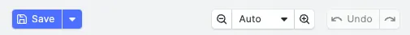

```
cesdk.ui.setNavigationBarOrder([  'ly.img.actions.navigationBar',  'ly.img.spacer',  'ly.img.zoom.navigationBar',  'ly.img.undoRedo.navigationBar',]);
```

## Rearranging the Navigation Bar actions[#](#rearranging-the-navigation-bar-actions)

Similar to how the `setNavigationBarOrder` allows rearranging the elements on the top level, you can use the same API to rearrange the actions of the actions dropdown.

```
cesdk.ui.setNavigationBarOrder([  'ly.img.undoRedo.navigationBar',  'ly.img.spacer',  'ly.img.zoom.navigationBar',  {    id: 'ly.img.actions.navigationBar',    children: [      'ly.img.exportImage.navigationBar',      'ly.img.exportPDF.navigationBar',      'ly.img.save.navigationBar',      'ly.img.load.navigationBar',    ],  },]);
```

This will result in the following order of the actions dropdown: 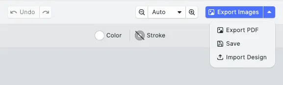

## Reducing the Canvas Menu[#](#reducing-the-canvas-menu)

The canvas menu is a prominent element during the design. In some cases you want to keep it as minimalistic as possible with only the two most important actions in it: Duplicate and Delete. When trying to move existing buttons, it is always a good idea to check the default order first (or take a look at the [Canvas Menu documentation](js/user-interface/customization/canvas-menu-0d2b5b/)).

```
cesdk.ui.getCanvasMenuOrder();// => [//  'ly.img.group.enter.canvasMenu',//  'ly.img.group.select.canvasMenu',////  'ly.img.movePage.up.canvasMenu',//  'ly.img.movePage.down.canvasMenu',////  'ly.img.separator',////  'ly.img.editText.canvasMenu',//  'ly.img.replace.canvasMenu',////  'ly.img.separator',////  'ly.img.placeholder.canvasMenu',////  'ly.img.separator',////  'ly.img.duplicate.canvasMenu',//  'ly.img.delete.canvasMenu'//  ]
```

There is already a lot more going on in the canvas menu compared to the navigation bar, but we can spot the components for duplicate and delete at the end of the order. Now we can just set the order to these two buttons:

```
cesdk.ui.setCanvasMenuOrder([  'ly.img.duplicate.canvasMenu',  'ly.img.delete.canvasMenu',]);
```

## Rearranging the Dock[#](#rearranging-the-dock)

The dock is the area where the user will look for assets to add to the scene. In our default implementation, we show a button to design templates first, followed by the assets like images, stickers, etc.

However, for this integration, we do not want the user to focus on the templates first. Instead, the decision was made to move it to the end of the dock. For even more focus on the assets, we will not only append the templates but also push them to the edge of the dock with the help of a spacer.

```
cesdk.ui.getDock();// => [//     {//         "id": "ly.img.assetLibrary.dock",//         "key": "ly.img.template",//         "icon": "@imgly/Template",//         "label": "libraries.ly.img.template.label",//         "entries": [//             "ly.img.template"//         ]//     },//     {//         "id": "ly.img.assetLibrary.dock",//         "key": "ly.img.video.template",//         "icon": "@imgly/Template",//         "label": "libraries.ly.img.video.template.label",//         "entries": [//             "ly.img.video.template"//         ]//     },//     {//         "id": "ly.img.separator"//     },//     {//         "id": "ly.img.assetLibrary.dock",//         "key": "ly.img.elements",//         "icon": "@imgly/Library",//         "label": "component.library.elements",//         "entries": [//             "ly.img.upload",//             "ly.img.video",//             "ly.img.audio",//             "ly.img.image",//             "ly.img.text",//             "ly.img.vectorpath",//             "ly.img.sticker",//             "cutout-entry"//         ]//     },//     [...]//     A lot more entries we do not care about right now//     [...]// ]
```

Let’s pull the first two components to the end of the dock with a spacer element before them:

```
setDockOrder([  {    id: 'ly.img.assetLibrary.dock',    key: 'ly.img.elements',    icon: '@imgly/Library',    label: 'component.library.elements',    entries: [      'ly.img.upload',      'ly.img.video',      'ly.img.audio',      'ly.img.image',      'ly.img.text',      'ly.img.vectorpath',      'ly.img.sticker',      'cutout-entry',    ],  },  //    [...]  //    A lot more entries we do not care about right now  //    [...]  'ly.img.spacer',  {    id: 'ly.img.assetLibrary.dock',    key: 'ly.img.template',    icon: '@imgly/Template',    label: 'libraries.ly.img.template.label',    entries: ['ly.img.template'],  },  {    id: 'ly.img.assetLibrary.dock',    key: 'ly.img.video.template',    icon: '@imgly/Template',    label: 'libraries.ly.img.video.template.label',    entries: ['ly.img.video.template'],  },]);
```

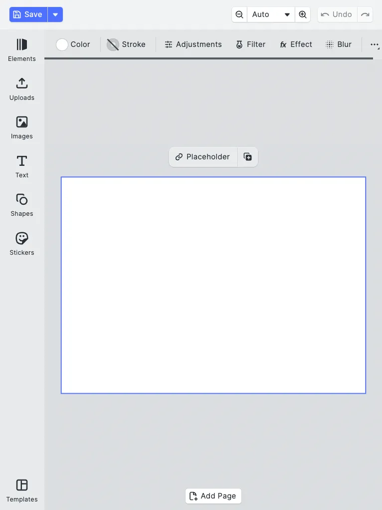

---


[Source](http:/localhost:4321/js/user-interface/customization/panel-7ce1ee)

# Panel

Panels are a basic concept of our UI, e.g. extensively used for asset libraries and inspectors.

## Show or Hide Panels[#](#show-or-hide-panels)

*   `inspector.position: string` is used to set the location of the inspector to either `left` or `right`.
*   `inspector.show: boolean` shows or hides the inspector.
*   `inspector.floating: boolean` configures if the inspector panel is floating over the canvas or set aside of it.
*   `assetLibrary.position: string` is used to set the location of the asset library to either `left` or `right`.
*   `assetLibrary.show: boolean` shows or hides the asset library.
*   `settings: boolean` shows or hides the settings panel.

```
import CreativeEditorSDK from 'https://cdn.img.ly/packages/imgly/cesdk-js/1.57.0/index.js';
const config = {  license: 'mtLT-_GJwMhE7LDnO8KKEma7qSuzWuDxiKuQcxHKmz3fjaXWY2lT3o3Z2VdL5twm',  userId: 'guides-user',  ui: {    elements: {      view: 'default',      /* ... */      navigation: {        /* ... */      },      panels: {        inspector: {          show: true, // true or false          position: 'left', // 'left' or 'right'          floating: false, // true or false        },        assetLibrary: {          show: true, // true or false          position: 'left', // 'left' or 'right'        },        settings: {          show: true, // true or false        },      },      dock: {        /* ... */      },      libraries: {        /* ... */      },      blocks: {        /* ... */      },    },  },  callbacks: { onUpload: 'local' }, // Enable local uploads in Asset Library.};
CreativeEditorSDK.create('#cesdk_container', config).then(async instance => {  // Do something with the instance of CreativeEditor SDK, for example:  // Populate the asset library with default / demo asset sources.  instance.addDefaultAssetSources();  instance.addDemoAssetSources({ sceneMode: 'Design' });  await instance.createDesignScene();});
```

## Configure Libraries[#](#configure-libraries)

*   `insert.floating: boolean` configures if the asset library panel is floating over the canvas or set aside of it.
*   `insert.autoClose: boolean | () => boolean` configures if the asset library panel is closed after an asset was inserted (default is `false`).
*   `replace.floating: boolean` configures if the image replacement library panel is floating over the canvas or set aside of it.
*   `replace.autoClose: boolean | () => boolean` configures if the asset library panel is closed after an asset was replaced (default is `true`).

```
import CreativeEditorSDK from 'https://cdn.img.ly/packages/imgly/cesdk-js/1.57.0/index.js';
const config = {  license: 'mtLT-_GJwMhE7LDnO8KKEma7qSuzWuDxiKuQcxHKmz3fjaXWY2lT3o3Z2VdL5twm',  userId: 'guides-user',  ui: {    elements: {      view: 'default',      /* ... */      navigation: {        /* ... */      },      panels: {        /* ... */      },      dock: {        /* ... */      },      libraries: {        insert: {          floating: true, // true or false          autoClose: false, // true or false        },        replace: {          floating: true, // true or false          autoClose: false, // true or false        },      },      blocks: {        /* ... */      },    },  },  callbacks: { onUpload: 'local' }, // Enable local uploads in Asset Library.};
CreativeEditorSDK.create('#cesdk_container', config).then(async instance => {  // Do something with the instance of CreativeEditor SDK, for example:  // Populate the asset library with default / demo asset sources.  instance.addDefaultAssetSources();  instance.addDemoAssetSources({ sceneMode: 'Design' });  await instance.createDesignScene();});
```

## API[#](#api)

Given a CreativeEditorSDK instance, we can query if a given panel is open as well as access methods to open/close them.

*   `cesdk.ui.isPanelOpen(panelId: string, options?: { position?: PanelPosition, floating?: boolean }): boolean` returns `true` if a panel with the given panel id is open. If options are provided they will be matched against the panel’s options. E.g. `isPanelOpen('//ly.img.panel/assetLibrary', { floating: false })` will only return true if the asset library is open as a floating panel.
    
*   `cesdk.ui.openPanel(panelId: string, options?: { position?: PanelPosition, floating?: boolean, closableByUser?: boolean, payload?: PanelPayload })` opens a panel with the given id if and only if it exists, is not open and is currently registered (known to the UI). Otherwise the method does nothing and is a noop.
    
    Options can be provided additionally that will override the default position and floating of the given panel. (Please note, that the default position and floating behavior are not changed for this panel.) In addition, the `closableByUser` option can control if the panel can be closed by the user. Finally, the payload option is passed to the opened registered panel, where it can be accessed. For example, when the panel `//ly.img.panel/assetLibrary` is opened, it expects a payload of type `{title?: string | string[], entries?: string[]}`. This payload determines the panel’s title and content, such as the asset library entries displayed in the panel.
    
*   `cesdk.ui.closePanel(panelId: string)` closes a panel with the given id if and only if it exists and is open. Otherwise the method does nothing and is a noop.
    

### Panel Position[#](#panel-position)

Every panel in the UI is typically displayed either on the left or right side of the canvas. An exception exists for rendering in [smaller viewports](js/user-interface/overview-41101a/), where all panels are situated at the bottom.

The setPanelPosition API is used to determine a panel’s default placement.

*   `cesdk.ui.setPanelPosition(panelId: string, panelPosition: PanelPosition)` assigns a specific position to a panel identified by `panelId`. This function will also alter the panel’s position while it is open, provided the panel wasn’t initially opened with a pre-defined position option (see above).

### Floating Panel[#](#floating-panel)

Panels can either float over the canvas, potentially obscuring content, or be positioned adjacent to the canvas. The setPanelFloating API allows you to modify this behavior to suit different use cases.

*   `cesdk.ui.setPanelFloating(panelId: string, floating: boolean)` when set to true, the specified panel will float above the canvas. Conversely, setting it to false places the panel beside the canvas.

### Available Panels[#](#available-panels)

By default, CE.SDK provides several different panels for user interaction. Additional panels can be added by the user or through plugins. The findAllPanels function helps retrieve the current panels and filter them based on their state.

*   `cesdk.ui.findAllPanels(options?: { open?: boolean, position?: PanelPosition, floating?: boolean }): string[]` returns all panel ids. If options are provided they will be matched against the panel’s options. E.g. `findAllPanels({ open: true })` will only return panel ids of currently open panels.

Some important panels that are registered by default are:

| Panel Id | Description |
| --- | --- |
| `//ly.img.panel/inspector` | The inspector panel for the currently selected block. Please note, that if no block is selected at all, this will open an empty panel with no content. In the advanced view, inspector panels are always open and cannot be opened/closed. |
| `//ly.img.panel/assetLibrary` | The panel for the asset library, Please note, that currently it is not possible to open a new asset library with library entries defined. Thus, opening an asset library would show an empty library. More useful is `closePanel` to close an already open asset library. |
| `//ly.img.panel/assetLibrary.replace` | The panel containing the replace library for the currently selected block. Please note, that if no block is selected or the selected block does not have asset replacement configured, the opened library will be empty. See [Custom Asset Library](js/import-media/asset-panel/customize-c9a4de/) for more information. |
| `//ly.img.panel/settings` | The settings panel to customize the editor during runtime. |

### Full Code[#](#full-code)

Here is the full code:

```
CreativeEditorSDK.create('#cesdk', config).then(async cesdk => {  await cesdk.addDefaultAssetSources();  await cesdk.addDemoAssetSources();
  // The inspector should be rendered on the left as a non-floating panel  cesdk.ui.setPanelPosition('//ly.img.panel/inspector', 'left');  cesdk.ui.setPanelFloating('//ly.img.panel/inspector', false);
  await cesdk.createDesignScene();
  // Adding some image after creating the scene  const image = await cesdk.engine.asset.defaultApplyAsset({    id: 'ly.img.cesdk.images.samples/sample.1',    meta: {      uri: 'https://cdn.img.ly/assets/demo/v1/ly.img.image/images/sample_1.jpg',      width: 2500,      height: 1667,    },  });
  if (image == null) return;
  // Select the first image after loading the scene ...  cesdk.engine.block.setSelected(image, true);
  // ... and opening the replace asset library for the user to choose a differnt image  if (!cesdk.ui.isPanelOpen('//ly.img.panel/assetLibrary.replace')) {    cesdk.ui.openPanel('//ly.img.panel/assetLibrary.replace');  }
  // Open the inspector panel, but override the default position and floating we set above.  cesdk.ui.openPanel('//ly.img.panel/inspector', {    position: 'right',    floating: true,  });
  // Return all currently open panel ids  const openPanels = cesdk.ui.findAllPanels({ open: true });});
```

---


[Source](http:/localhost:4321/js/user-interface/customization/page-format-496315)

# Page Format

```
import CreativeEditorSDK from 'https://cdn.img.ly/packages/imgly/cesdk-js/1.57.0/index.js';
const config = {  license: 'mtLT-_GJwMhE7LDnO8KKEma7qSuzWuDxiKuQcxHKmz3fjaXWY2lT3o3Z2VdL5twm',  baseURL: 'https://cdn.img.ly/packages/imgly/cesdk-js/1.57.0/assets',  userId: 'guides-user',  ui: {    scale: 'normal',    stylesheets: {      /* ... */    },    elements: {      /* ... */    },    pagePresetLibraries: [      // 'ly.img.page.presets',      // 'ly.img.page.presets.video',      'my-custom-formats'    ]  },  callbacks: { onUpload: 'local' } // Enable local uploads in Asset Library.};
CreativeEditorSDK.create('#cesdk_container', config).then(async (instance) => {  // Do something with the instance of CreativeEditor SDK  // Populate the asset library with default / demo asset sources.  instance.addDefaultAssetSources();  instance.addDemoAssetSources({ sceneMode: 'Design' });
  // Add a custom page preset asset source.  instance.engine.asset.addLocalSource('my-custom-formats');  instance.engine.asset.addAssetToSource(    'my-custom-formats',    {      id: 'din-a1-portrait',      label: {        en: 'DIN A1 Portrait'      },      meta: {        width: 80,        height: 120,        thumbUri: `${window.location.protocol}//${window.location.host}/din-a1-portrait.png`      },      payload: {        transformPreset: {          type: 'FixedSize',          width: 594,          height: 841,          designUnit: 'Millimeter'        }      }    }  );
  await instance.createDesignScene();});
```

```
<!DOCTYPE html><html lang="en">  <head>    <meta charset="UTF-8" />    <meta name="viewport" content="width=device-width, initial-scale=1.0" />    <meta http-equiv="X-UA-Compatible" content="ie=edge" />    <style>      body {        margin: 0;        overflow: hidden;      }      html {        overscroll-behavior-x: contain;      }    </style>  </head>
  <body>    <div id="cesdk_container" style="width: 100%; height: 100vh"></div>    <script type="module" src="index.js">    </script>  </body></html>
```

By default, the CreativeEditor SDK ships with an extensive list of commonly used formats, as shown below:

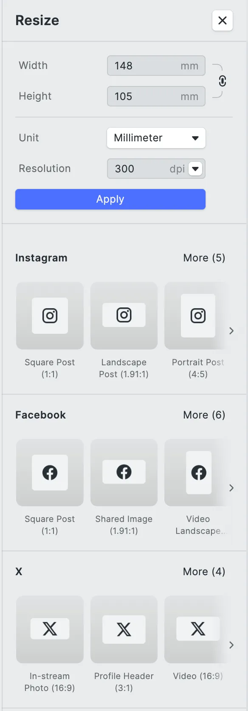

The CE.SDK can be configured with a series of page formats that can then be selected in the editor by a user with the `Creator` [role](js/concepts/editing-workflow-032d27/).

The available page formats can be controlled through the `config.ui.pagePresetLibraries` object and by creating custom asset sources or updating the content.json from the default asset source on the CDN.

To enable the CE.SDK defaults enable our default asset sources by using `addDefaultAssetSources`.

```
await addDefaultAssetSources();
```

## Configuring Custom Page Formats[#](#configuring-custom-page-formats)

You can define your own page formats by [creating a custom asset source](js/import-media/from-remote-source/unsplash-8f31f0/) and by registering it in the configuration under `ui.pagePresetLibraries`. Each of the asset objects in the asset source must define a value for its `payload.transformPreset` property.

```
{  id: 'din-a1-portrait',  label: {    en: 'DIN A1 Portrait'  },  meta: {    width: 80,    height: 120,    thumbUri: `${window.location.protocol}//${window.location.host}/din-a1-portrait.png`  },  payload: {    transformPreset: {      type: 'FixedSize',      width: 594,      height: 841,      designUnit: 'Millimeter'    }  }}
```

*   `type: type` specifies the preset type.

```
type: "FixedSize",
```

*   `width: number` specifies the width of the page in the specified design unit.

```
width: 1280,
```

*   `height: number` specifies the height of the page in the specified design unit.

```
height: 720,
```

*   `unit: 'Millimeter'|'Inch'|'Pixel'` describes unit in which `width`, `height` and `bleedMargin` are specified.

```
designUnit: 'Pixel',
```

*   `default: true` can be used to mark a page format as the default format. The asset source must be available before the scene initialization for the default to take effect.

```
default: true,
```

## Page Orientation[#](#page-orientation)

The initial orientation of a page is simply defined by the `width` and `height` properties in the format definition. For example, the `DIN A6` format defined above defaults to landscape, the `American Letter` to portrait. The orientation of a page can be changed in the editor with the button inside the document inspector. This button is disabled if the `fixedOrientation` property of the applied preset set to `true`.

## Full Code[#](#full-code)

Here’s the full code for configuring the default page formats:

```
import CreativeEditorSDK from 'https://cdn.img.ly/packages/imgly/cesdk-js/1.57.0/index.js';
const config = {  license: 'mtLT-_GJwMhE7LDnO8KKEma7qSuzWuDxiKuQcxHKmz3fjaXWY2lT3o3Z2VdL5twm',  baseURL: 'https://cdn.img.ly/packages/imgly/cesdk-js/1.57.0/assets',  userId: 'guides-user',  ui: {    scale: 'normal',    stylesheets: {      /* ... */    },    elements: {      /* ... */    },    pagePresetLibraries: [      // 'ly.img.page.presets',      // 'ly.img.page.presets.video',      'my-custom-formats'    ]  },  callbacks: { onUpload: 'local' } // Enable local uploads in Asset Library.};
CreativeEditorSDK.create('#cesdk_container', config).then(async (instance) => {  // Do something with the instance of CreativeEditor SDK  // Populate the asset library with default / demo asset sources.  instance.addDefaultAssetSources();  instance.addDemoAssetSources({ sceneMode: 'Design' });
  // Add a custom page preset asset source.  instance.engine.asset.addLocalSource('my-custom-formats');  instance.engine.asset.addAssetToSource(    'my-custom-formats',    {      id: 'din-a1-portrait',      label: {        en: 'DIN A1 Portrait'      },      meta: {        width: 80,        height: 120,        thumbUri: `${window.location.protocol}//${window.location.host}/din-a1-portrait.png`      },      payload: {        transformPreset: {          type: 'FixedSize',          width: 594,          height: 841,          designUnit: 'Millimeter'        }      }    }  );
  await instance.createDesignScene();});
```

---


[Source](http:/localhost:4321/js/user-interface/customization/navigation-bar-4e5d39)

# Navigation Bar

Actions that affect browser navigation (e.g. going back or closing the editor), have global effects on the scene (e.g. undo/redo and zoom), or process the scene in some way (e.g. saving and exporting) should be placed in the navigation bar.

## Show or Hide the Navigation[#](#show-or-hide-the-navigation)

`show: boolean` is used to show or hide the complete navigation

`position: string` is used to set the location of the navigation bar to either top or bottom.

```
import CreativeEditorSDK from 'https://cdn.img.ly/packages/imgly/cesdk-js/1.57.0/index.js';
const config = {  license: 'mtLT-_GJwMhE7LDnO8KKEma7qSuzWuDxiKuQcxHKmz3fjaXWY2lT3o3Z2VdL5twm',  userId: 'guides-user',  ui: {    elements: {      view: 'default',      /* ... */      navigation: {        show: true, // 'false' to hide the navigation completely        position: 'top', // 'top' or 'bottom'        /* ... */      },      panels: {        /* ... */      },      dock: {        /* ... */      },      libraries: {        /* ... */      },      blocks: {        /* ... */      },    },  },  callbacks: { onUpload: 'local' }, // Enable local uploads in Asset Library.};
CreativeEditorSDK.create('#cesdk_container', config).then(async instance => {  // Do something with the instance of CreativeEditor SDK, for example:  // Populate the asset library with default / demo asset sources.  instance.addDefaultAssetSources();  instance.addDemoAssetSources({ sceneMode: 'Design' });  await instance.createDesignScene();});
```

## Configure Navigation Buttons[#](#configure-navigation-buttons)

`action` configures the available buttons in the navigation and call-to-action menu.

*   `close: boolean` shows or hides all close buttons.
*   `back: boolean` shows or hides all back buttons.
*   `load: boolean` shows or hides all load buttons.
*   `save: boolean` shows or hides all save buttons.
*   `export.show: boolean` shows or hides all export buttons.
*   `export.format: 'application/pdf' | 'image/png'` an array of mime types available for export. Supported are `application/pdf` and `image/png`. If not set it will add all supported mime types.
*   `download: boolean` shows or hides all download buttons.

```
import CreativeEditorSDK from 'https://cdn.img.ly/packages/imgly/cesdk-js/1.57.0/index.js';
const config = {  license: 'mtLT-_GJwMhE7LDnO8KKEma7qSuzWuDxiKuQcxHKmz3fjaXWY2lT3o3Z2VdL5twm',  userId: 'guides-user',  ui: {    elements: {      view: 'default',      /* ... */      navigation: {        show: true, // 'false' to hide the navigation completely        position: 'top', // 'top' or 'bottom'        action: {          close: true, // true or false          back: true, // true or false          load: true, // true or false          save: true, // true or false          export: {            show: true,            format: ['application/pdf'],          },          download: true, // true  or false          /* ... */        },      },      panels: {        /* ... */      },      dock: {        /* ... */      },      libraries: {        /* ... */      },      blocks: {        /* ... */      },    },  },  callbacks: { onUpload: 'local' }, // Enable local uploads in Asset Library.};
CreativeEditorSDK.create('#cesdk_container', config).then(async instance => {  // Do something with the instance of CreativeEditor SDK, for example:  // Populate the asset library with default / demo asset sources.  instance.addDefaultAssetSources();  instance.addDemoAssetSources({ sceneMode: 'Design' });  await instance.createDesignScene();});
```

## Custom Call-To-Action Buttons[#](#custom-call-to-action-buttons)

`action.custom` receives an array of custom actions. These will appear as buttons in the call-to-action menu (that also contains the ‘save’, ‘export’ and ‘download’ actions). The first item in the array will be shown in the navigation bar (in place of the ‘save’ action); all other items will be listed in the dropdown menu. A custom actions has the following properties:

*   `label` a string, which can be an i18n key that will be looked up in the translation table.
*   `iconName` defines the icon shown on the button. You can use any of the icon ids found within our IMG.LY Icon Set ‘Essentials’ ([see full list here](js/user-interface/appearance/icons-679e32/)), or any icon id that you’ve added yourself using the `addIconSet` API ([see details here](js/user-interface/appearance/icons-679e32/)).
*   `callback` a custom callback function with the signature `() => void | Promise<void>`. This function is called when the button is clicked. If the function returns a promise, the button is disabled and a spinner is shown on the button until the promise resolves.

```
import CreativeEditorSDK from 'https://cdn.img.ly/packages/imgly/cesdk-js/1.57.0/index.js';
const config = {  license: 'mtLT-_GJwMhE7LDnO8KKEma7qSuzWuDxiKuQcxHKmz3fjaXWY2lT3o3Z2VdL5twm',  userId: 'guides-user',  ui: {    elements: {      view: 'default',      /* ... */      navigation: {        show: true, // 'false' to hide the navigation completely        position: 'top', // 'top' or 'bottom'        action: {          /* ... */          custom: [            {              label: 'common.custom', // string or i18n key              iconName: '@imgly/icons/Essentials/Download', // icon id from our 'Essentials' set, or a custom icon id              callback: () => {                // callback signature is `() => void | Promise<void>`                // place custom functionality here              },            },          ],        },      },      panels: {        /* ... */      },      dock: {        /* ... */      },      libraries: {        /* ... */      },      blocks: {        /* ... */      },    },  },  callbacks: { onUpload: 'local' }, // Enable local uploads in Asset Library.};
CreativeEditorSDK.create('#cesdk_container', config).then(async instance => {  // Do something with the instance of CreativeEditor SDK, for example:  // Populate the asset library with default / demo asset sources.  instance.addDefaultAssetSources();  instance.addDemoAssetSources({ sceneMode: 'Design' });  await instance.createDesignScene();});
```

## Rearrange Components[#](#rearrange-components)

There are 6 APIs for getting, setting, updating, removing, and inserting components in the Navigation Bar.

The content of the Navigation Bar changes based on the current [edit mode](js/concepts/edit-modes-1f5b6c/) (`'Transform'` (the default), `'Text'`, `'Crop'`, `'Trim'`, or a custom value), so all APIs accept an `orderContext` argument to specify the mode.

For example usage of similar APIs, see also [Moving Existing Buttons](js/user-interface/customization/rearrange-buttons-97022a/) or [Adding New Buttons](js/user-interface/ui-extensions/add-new-button-74884d/) in the Guides section.

Note that the Navigation Bar is also configurable using our [UI configuration](js/user-interface/customization-72b2f8/).

### Get the Current Order[#](#get-the-current-order)

```
getNavigationBarOrder(  orderContext: OrderContext = { editMode: 'Transform' })
```

When omitting the `orderContext` parameter, the order for the `'Transform'` edit mode is returned, e.g.

```
cesdk.ui.getNavigationBarOrder();// => [// {id: 'ly.img.back.navigationBar'},// {id: 'ly.img.undoRedo.navigationBar'},// ...// ]
```

### Set a new Order[#](#set-a-new-order)

```
setNavigationBarOrder(  navigationBarOrder: (NavigationBarComponentId | OrderComponent)[],  orderContext: OrderContext = { editMode: 'Transform' })
```

When omitting the `orderContext` parameter, the order is set for the default edit mode (`'Transform'`), e.g.:

```
// Sets the order for transform mode by defaultcesdk.ui.setNavigationBarOrder(['my.component.for.transform.mode']);
```

### Update Components[#](#update-components)

```
updateNavigationBarOrderComponent(  matcher: OrderComponentMatcher<OrderComponent<NavigationBarComponentId>>,  update: NavigationBarComponentId | Partial<OrderComponent<NavigationBarComponentId>> | ((component: OrderComponent<NavigationBarComponentId>) => Partial<OrderComponent<NavigationBarComponentId>>),  orderContext?: OrderContext)
```

Updates existing components in the navigation bar. The matcher can be:

*   A component ID string
*   A partial object describing the component to match
*   A function that receives the component and index, returning true if it matches

The update can be:

*   A new component ID string
*   A partial object with updated properties
*   A function that receives the current component and returns the updated one

Returns an object with the number of updated components and the updated order array.

```
// Change the save button label and style for a specific contextcesdk.ui.updateNavigationBarOrderComponent(  'ly.img.save.navigationBar',  (component) => ({    ...component,    label: 'Save Draft',    color: 'accent'  }));
// Disable export buttons when user doesn't have export permissionscesdk.ui.updateNavigationBarOrderComponent(  { id: 'ly.img.exportImage.navigationBar' },  { isDisabled: true });
// Replace the default actions with a custom action buttoncesdk.ui.updateNavigationBarOrderComponent(  (component) => component.id === 'ly.img.actions.navigationBar',  {    id: 'ly.img.customAction.navigationBar',    label: 'Publish',    icon: '@imgly/Share'  });
```

### Remove Components[#](#remove-components)

```
removeNavigationBarOrderComponent(  matcher: OrderComponentMatcher<OrderComponent<NavigationBarComponentId>>,  orderContext?: OrderContext)
```

Removes components from the navigation bar. The matcher can be:

*   A component ID string
*   A partial object describing the component to match
*   A function that receives the component and index, returning true if it matches

Returns an object with the number of removed components and the updated order array.

```
// Remove PDF export option for mobile userscesdk.ui.removeNavigationBarOrderComponent('ly.img.exportPDF.navigationBar');
// Remove all export buttons for users without export permissionscesdk.ui.removeNavigationBarOrderComponent(  (component) => component.id.includes('export'));
// Remove the close button in embedded modecesdk.ui.removeNavigationBarOrderComponent({ id: 'ly.img.close.navigationBar' });
```

### Insert Components[#](#insert-components)

```
insertNavigationBarOrderComponent(  matcher: OrderComponentMatcher<OrderComponent<NavigationBarComponentId>>,  component: NavigationBarComponentId | OrderComponent<NavigationBarComponentId>,  location?: InsertOrderComponentLocation,  orderContext?: OrderContext)
```

Inserts new components into the navigation bar. The matcher can be:

*   A component ID string
*   A partial object describing the component to match
*   A function that receives the component and index, returning true if it matches

The location can be:

*   `'before'` - Insert before the matched component
*   `'after'` - Insert after the matched component (default)
*   `'replace'` - Replace the matched component
*   `'asChild'` - Insert as a child of the matched component

Returns the updated navigation bar order array.

```
// Add a share button after the save buttoncesdk.ui.insertNavigationBarOrderComponent(  'ly.img.save.navigationBar',  {    id: 'ly.img.share.navigationBar',    label: 'Share',    icon: '@imgly/Share'  });
// Add a custom action as a child of the actions menucesdk.ui.insertNavigationBarOrderComponent(  'ly.img.actions.navigationBar',  {    id: 'ly.img.action.navigationBar',    label: 'Export to Social Media',    icon: 'instagram-icon'  },  'asChild');
// Insert a separator before the zoom controls for better visual groupingcesdk.ui.insertNavigationBarOrderComponent(  'ly.img.zoom.navigationBar',  'ly.img.separator',  'before');
```

## Navigation Bar Components[#](#navigation-bar-components)

The following lists the default Navigation Bar components available within CE.SDK.

### Layout Helpers[#](#layout-helpers)

| Component ID | Description |
| --- | --- |
| `ly.img.separator` | Adds a vertical separator (`<hr>` element) in the Navigation Bar.  
Separators follow some special layouting rules:  
\- If 2 or more separators end up next to each other (e.g. due to other components not rendering), **only 1** separator will be rendered.  
\- Separators that end up being the first or last element in the Inspector Bar will **not** be rendered.  
\- Separators directly adjacent _to the left side_ of a spacer (see below) will **not** be rendered. |
| `ly.img.spacer` | Adds horizontal spacing in the Navigation Bar.  
Spacers will try to fill all available whitespace, by distributing the available space between all spacers found in the Navigation Bar. |

### Common Controls[#](#common-controls)

| Component ID | Description |
| --- | --- |
| `ly.img.title.navigationBar` | Title:  
A section displaying the title of the currently opened scene file.  
  
The title displayed on the UI is set by the `config.ui.elements.navigation.title` parameter. If this parameter is not specified, the system will instead check the component’s payload. To define a payload, rather than adding the ID directly to the order, insert an object structured like this: `{ id: 'ly.img.title.navigationBar', title: 'My Scene' }` |
| `ly.img.back.navigationBar` | Back button:  
A button used to navigate to the previous page. Note that this button is hidden by default, and can be configured using the UI Elements configuration. |
| `ly.img.close.navigationBar` | Close button:  
A button used to close the editor. Note that this button is hidden by default, and can be configured using the UI Elements configuration. |
| `ly.img.undoRedo.navigationBar` | Undo/Redo controls:  
Two buttons for un-doing and re-doing recent changes. |
| `ly.img.pageResize.navigationBar` | Page Resize button:  
A button used to control the page resize panel. |
| `ly.img.zoom.navigationBar` | Zoom controls:  
Two buttons for zooming the view in and out, separated by a third button showing the current zoom level and opening a dropdown offering common zoom operations (Auto-Fit Page, Fit Page, Fit Selection, 200% Zoom, 100% Zoom, 50% Zoom, Zoom In, Zoom Out). |
| `ly.img.preview.navigationBar` | Preview button:  
Toggles Preview mode, which allows viewing and editing the scene like an Adopter would (e.g. with all Placholder constraints enforced). Changes made in Preview are not saved and will be discarded when leaving Preview. |
| `ly.img.actions.navigationBar` | Call To Action buttons:  
A prominent “Save” Button, next to a smaller Button opening a dropdown offering various operations for exporting and loading scene files (Export Images, Export PDF, Export Design File, Export Archive, Import Design File, Import Archive). The prominent Button as well as the contents of the Menu can be customized extensively using our UI Elements Configuration. You can even add custom buttons and callbacks here. |

## Default Order[#](#default-order)

The default order of the Navigation Bar is the following:

```
[  'ly.img.back.navigationBar',  'ly.img.undoRedo.navigationBar',  'ly.img.pageResize.navigationBar',
  'ly.img.spacer',
  'ly.img.title.navigationBar',
  'ly.img.spacer',
  'ly.img.zoom.navigationBar',  'ly.img.preview.navigationBar',  'ly.img.actions.navigationBar',  'ly.img.close.navigationBar',];
```

---


[Source](http:/localhost:4321/js/user-interface/customization/inspector-bar-8ca1cd)

# Inspector Bar

The main location for block-specific functionality is the inspector bar. Any action or setting available to the user for the currently selected block that does not appear in the canvas menu should be added here.

## Show or Hide the Inspector Bar[#](#show-or-hide-the-inspector-bar)

Two different views of the editor are available:

*   The ‘advanced’ view always shows an inspector panel to the side of the canvas.
*   The ‘default’ view hides the inspector panel until it is needed, and uses a minimal inspector bar on top of the canvas instead.

`view: string` is used to toggle between `'advanced'` and `'default'` view when configuring the UI elements.

```
import CreativeEditorSDK from 'https://cdn.img.ly/packages/imgly/cesdk-js/1.57.0/index.js';
const config = {  license: 'mtLT-_GJwMhE7LDnO8KKEma7qSuzWuDxiKuQcxHKmz3fjaXWY2lT3o3Z2VdL5twm',  userId: 'guides-user',  ui: {    elements: {      view: 'default', // 'default' or 'advanced'      /* ... */      navigation: {        /* ... */      },      panels: {        /* ... */      },      dock: {        /* ... */      },      libraries: {        /* ... */      },      blocks: {        /* ... */      }    }  },  callbacks: { onUpload: 'local' } // Enable local uploads in Asset Library.};
CreativeEditorSDK.create('#cesdk_container', config).then(async (instance) => {  // Do something with the instance of CreativeEditor SDK, for example:  // Populate the asset library with default / demo asset sources.  instance.addDefaultAssetSources();  instance.addDemoAssetSources({ sceneMode: 'Design' });  await instance.createDesignScene();});
```

## Show or Hide Sections[#](#show-or-hide-sections)

*   `opacity: boolean` shows or hides the `opacity` section in the inspector ui for every block.
*   `transform: boolean` shows or hides the `transform` section in the inspector ui for every block.
*   `adjustments: boolean` shows or hides the `adjustments` section in the inspector ui for the image block.
*   `filters: boolean` shows or hides the `filters` section in the inspector ui for the image block.
*   `effects: boolean` shows or hides the `effects` section in the inspector ui for the image block.
*   `blur: boolean` shows or hides the `blur` section in the inspector ui for the image block.
*   `crop: boolean` shows or hides the `crop` section in the inspector ui for the image block.

```
import CreativeEditorSDK from 'https://cdn.img.ly/packages/imgly/cesdk-js/1.57.0/index.js';
const config = {  license: 'mtLT-_GJwMhE7LDnO8KKEma7qSuzWuDxiKuQcxHKmz3fjaXWY2lT3o3Z2VdL5twm',  userId: 'guides-user',  ui: {    elements: {      view: 'default', // 'default' or 'advanced'      /* ... */      navigation: {        /* ... */      },      panels: {        /* ... */      },      dock: {        /* ... */      },      libraries: {        /* ... */      },      blocks: {        opacity: false, // true  or false        transform: false, // true  or false        '//ly.img.ubq/graphic': {          adjustments: true, // true  or false          filters: false, // true  or false          effects: false, // true  or false          blur: true, // true  or false          crop: false // true  or false        }        /* ... */      }    }  },  callbacks: { onUpload: 'local' } // Enable local uploads in Asset Library.};
CreativeEditorSDK.create('#cesdk_container', config).then(async (instance) => {  // Do something with the instance of CreativeEditor SDK, for example:  // Populate the asset library with default / demo asset sources.  instance.addDefaultAssetSources();  instance.addDemoAssetSources({ sceneMode: 'Design' });  await instance.createDesignScene();});
```

## Pages[#](#pages)

*   `manage: boolean` if `false` removes all UI elements to add/duplicate/delete pages for every role.
*   `format: boolean` if `false` removes all UI elements to change the format of pages for every role.
*   `maxDuration: number` controls the maximum allowed duration of a page, if in video mode

```
import CreativeEditorSDK from 'https://cdn.img.ly/packages/imgly/cesdk-js/1.57.0/index.js';
const config = {  license: 'mtLT-_GJwMhE7LDnO8KKEma7qSuzWuDxiKuQcxHKmz3fjaXWY2lT3o3Z2VdL5twm',  userId: 'guides-user',  ui: {    elements: {      view: 'default', // 'default' or 'advanced'      /* ... */      navigation: {        /* ... */      },      panels: {        /* ... */      },      dock: {        /* ... */      },      libraries: {        /* ... */      },      blocks: {        /* ... */        '//ly.img.ubq/page': {          manage: true,          format: true,          maxDuration: 30 * 60        }      }    }  },  callbacks: { onUpload: 'local' } // Enable local uploads in Asset Library.};
CreativeEditorSDK.create('#cesdk_container', config).then(async (instance) => {  // Do something with the instance of CreativeEditor SDK, for example:  // Populate the asset library with default / demo asset sources.  instance.addDefaultAssetSources();  instance.addDemoAssetSources({ sceneMode: 'Design' });  await instance.createDesignScene();});
```

## Rearrange Components[#](#rearrange-components)

There are 6 APIs for getting, setting, updating, removing, and inserting components in the Inspector Bar.

The content of the Inspector Bar changes based on the current [edit mode](js/concepts/edit-modes-1f5b6c/) (`'Transform'` (the default), `'Text'`, `'Crop'`, `'Trim'`, or a custom value), so all APIs accept an `orderContext` argument to specify the mode.

For example usage of these APIs, see also [Moving Existing Buttons](js/user-interface/customization/rearrange-buttons-97022a/) in the Guides section.

### Get the Current Order[#](#get-the-current-order)

```
cesdk.ui.getInspectorBarOrder(  ((orderContext: OrderContext) = { editMode: 'Transform' }));
```

When omitting the `orderContext` parameter, the order for the `'Transform'` edit mode is returned, e.g.

```
cesdk.ui.getInspectorBarOrder();// => [// {id: 'ly.img.text.typeFace.inspectorBar'},// {id: 'ly.img.text.fontSize.inspectorBar'},// ...// ]
```

### Set a new Order[#](#set-a-new-order)

```
cesdk.ui.setInspectorBarOrder(  inspectorBarOrder: (InspectorBarComponentId | OrderComponent)[],  orderContext: OrderContext = { editMode: 'Transform' })
```

When omitting the `orderContext` parameter, the order is set for the default edit mode (`'Transform'`), e.g.:

```
// Sets the order for transform mode by defaultcesdk.ui.setInspectorBarOrder(['my.component.for.transform.mode']);
```

### Update Components[#](#update-components)

```
updateInspectorBarOrderComponent(  matcher: OrderComponentMatcher<OrderComponent<InspectorBarComponentId>>,  update: InspectorBarComponentId | Partial<OrderComponent<InspectorBarComponentId>> | ((component: OrderComponent<InspectorBarComponentId>) => Partial<OrderComponent<InspectorBarComponentId>>),  orderContext?: OrderContext)
```

Updates existing components in the inspector bar. The matcher can be:

*   A component ID string
*   A partial object describing the component to match
*   A function that receives the component and index, returning true if it matches

The update can be:

*   A new component ID string
*   A partial object with updated properties
*   A function that receives the current component and returns the updated one

Returns an object with the number of updated components and the updated order array.

```
// Replace the fill controls with a custom fill componentcesdk.ui.updateInspectorBarOrderComponent(  'ly.img.fill.inspectorBar',  'custom-fill');
// Replace text controls with simplified versions for basic userscesdk.ui.updateInspectorBarOrderComponent(  (component) => component.id === 'ly.img.text.fontSize.inspectorBar',  'my-custom-font-size-component');
```

### Remove Components[#](#remove-components)

```
removeInspectorBarOrderComponent(  matcher: OrderComponentMatcher<OrderComponent<InspectorBarComponentId>>,  orderContext?: OrderContext)
```

Removes components from the inspector bar. The matcher can be:

*   A component ID string
*   A partial object describing the component to match
*   A function that receives the component and index, returning true if it matches

Returns an object with the number of removed components and the updated order array.

```
// Remove advanced text controls for simplified interfacecesdk.ui.removeInspectorBarOrderComponent('ly.img.text.advanced.inspectorBar');
// Remove all filter and effect controls for basic userscesdk.ui.removeInspectorBarOrderComponent(  (component) => component.id.includes('filter') || component.id.includes('effect'));
// Remove shadow controls for specific block typescesdk.ui.removeInspectorBarOrderComponent({ id: 'ly.img.shadow.inspectorBar' });
```

### Insert Components[#](#insert-components)

```
insertInspectorBarOrderComponent(  matcher: OrderComponentMatcher<OrderComponent<InspectorBarComponentId>>,  component: InspectorBarComponentId | OrderComponent<InspectorBarComponentId>,  location?: InsertOrderComponentLocation,  orderContext?: OrderContext)
```

Inserts new components into the inspector bar. The matcher can be:

*   A component ID string
*   A partial object describing the component to match
*   A function that receives the component and index, returning true if it matches

The location can be:

*   `'before'` - Insert before the matched component
*   `'after'` - Insert after the matched component (default)
*   `'replace'` - Replace the matched component
*   `'asChild'` - Insert as a child of the matched component

Returns the updated inspector bar order array.

```
// Add a custom control after the fill controlscesdk.ui.insertInspectorBarOrderComponent(  'ly.img.fill.inspectorBar',  'my-custom-component');
// Add a separator before the stroke controls for better organizationcesdk.ui.insertInspectorBarOrderComponent(  'ly.img.stroke.inspectorBar',  'ly.img.separator',  'before');
// Replace the default options with a custom options componentcesdk.ui.insertInspectorBarOrderComponent(  'ly.img.options.inspectorBar',  'ly.img.customOptions.inspectorBar',  'replace');
```

## Inspector Bar Components[#](#inspector-bar-components)

The following lists the default Inspector Bar components available within CE.SDK.

Take special note of the “Feature ID” column. Most components can be hidden/disabled by disabling the corresponding feature using the Feature API.

Also note that many components are only rendered for the block types listed in the “Renders for” column, because their associated controls (e.g. font size) are only meaningful for specific kinds of blocks (e.g. text).

### Layout Helpers[#](#layout-helpers)

| Component ID | Description |
| --- | --- |
| `ly.img.separator` | Adds a vertical separator (`<hr>` element) in the Inspector Bar.  
Separators follow some special layouting rules:  
\- If 2 or more separators end up next to each other (e.g. due to other components not rendering), **only 1** separator will be rendered.  
\- Separators that end up being the first or last element in the Inspector Bar will **not** be rendered.  
\- Separators directly adjacent _to the left side_ of a spacer (see below) will **not** be rendered. |
| `ly.img.spacer` | Adds horizontal spacing in the Inspector Bar.  
Spacers will try to fill all available whitespace, by distributing the available space between all spacers found in the Inspector Bar. |

### Common Controls[#](#common-controls)

These components are useful for editing various different block types.

| Component ID | Description | Feature ID | Renders for |
| --- | --- | --- | --- |
| `ly.img.fill.inspectorBar` | Fill controls button:  
Opens the Fill panel, containing controls for selecting the fill type (Color, Image, Video, Audio) , and for editing the fill. For Color, this contains the Color Picker and the Color Library. For Images, this contains a Preview card, a “Replace” button to replace the media, and a “Crop” button for opening the Crop panel. For Video, this contains a Preview card, a “Replace” button to replace the media, a “Crop” button for opening the Crop panel, a “Trim” button for opening the Trim panel, and a Volume slider. | `ly.img.fill` | All blocks except: Stickers and Cutouts |
| `ly.img.combine.inspectorBar` | Combine button:  
Opens a dropdown offering a choice of boolean operations (Union, Subtract, Intersect, Exclude). | `ly.img.combine` | Selections containing multiple Shapes or Cutouts |
| `ly.img.crop.inspectorBar` | Crop button:  
Enters Crop mode when pressed. See the section on Crop Mode below for components used during that mode. | `ly.img.crop` | Image, Video, Shapes with Image Fill |
| `ly.img.stroke.inspectorBar` | Stroke controls button:  
Renders a labeled color swatch button when stroke is inactive, which opens the Color Panel when pressed. When stroke is active, renders 2 additional controls: a “Width” button opening a dropdown containing a number input to control stroke width, and a “Style” button opening a dropdown containing a selection of stroke styles (Solid, Dashed, Dashed Round, Long Dashes, Long Dashed Round, Dotted). | `ly.img.stroke` | Image, Shape, Text, Video |
| `ly.img.adjustment.inspectorBar` | Adjustment button:  
Opens the Adjustment panel containing sliders to influence numerous image properties (Brightness, Saturation, Contrast, Gamma, Clarity, Exposure, Shadows, Highlights, Blacks, Whites, Temperature, Sharpness). | `ly.img.adjustment` | Image, Shape, Text, Video |
| `ly.img.filter.inspectorBar` | Filter button:  
Opens the Filter panel containing a large selection of image filters, and an “Intensity” slider for the currently selected filter. | `ly.img.filter` | Image, Shape, Text, Video |
| `ly.img.effect.inspectorBar` | Effect button:  
Opens the Effect panel containing a large selection of image effects, and various sliders controlling the properties of the selected effect. | `ly.img.effect` | Image, Shape, Text, Video |
| `ly.img.blur.inspectorBar` | Blur button:  
Opens the Blur panel containing a selection of blur effects, and various sliders controlling the properties of the selected blur. | `ly.img.blur` | Image, Shape, Text, Video |
| `ly.img.shadow.inspectorBar` | Shadow controls button:  
Opens the Shadow panel containing a “Color” Subinspector controlling the shadow color, an “Angle” number input controlling the shadow offset direction, a “Distance” number input controlling the shadow offset, and a “Blur” number input controlling the shadows blur intensity). | `ly.img.shadow` | All blocks expect Pages, Cutouts, and Groups |
| `ly.img.position.inspectorBar` | Position button:  
Opens a dropdown containing a selection of position commands (Bring to Front, Bring Forward, Send Backward, Send to Back, Fixed to Front, Fixed to Back, Align Left/Centered/Right/Top/Middle/Bottom) | `ly.img.position` | Any block except: Pages. Selections containing multiple elements. |
| `ly.img.options.inspectorBar` | More options button:  
Opens a dropdown containing an Opacity slider (if opacity is supported by the selected block), a Blend mode button opening a dropdown containing a selection of different blend modes (if blending is supported by the selected block), a “Copy Element” button to copy the element, a “Paste Element” button to insert a previously copied element, and a “Show Inspector” button that opens the Advanced UI Inspector when pressed. | `ly.img.options` | Every block |
| `ly.img.inspectorToggle.inspectorBar` | Inspector Toggle Button:  
Opens the Advanced UI Inspector when pressed. | `ly.img.inspectorToggle` | Every block |

### Text[#](#text)

These components are relevant for editing text blocks, and will only render when a text block is selected.

| Component ID | Description | Feature ID |
| --- | --- | --- |
| `ly.img.text.typeFace.inspectorBar` | Typeface selection button:  
Opens a dropdown containing available typefaces. | `ly.img.text.typeface` |
| `ly.img.text.fontSize.inspectorBar` | Font size controls:  
A labeled number input to set the font size, with a button to open a dropdown containing many preset sizes and the “Auto-Size” option. | `ly.img.text.fontSize` |
| `ly.img.text.bold.inspectorBar` | Bold font toggle:  
Toggles the bold cut for the selected text, if available in the currently used font. | `ly.img.text.fontStyle` |
| `ly.img.text.italic.inspectorBar` | Italic font toggle:  
Toggles the italic cut for the selected text, if available in the currently used font. | `ly.img.text.fontStyle` |
| `ly.img.text.alignHorizontal.inspectorBar` | Text alignment button:  
Opens a dropdown containing options to align the selected text horizontally (to the left, to the right, or centered). | `ly.img.text.alignment` |

### Shape[#](#shape)

These components are relevant for editing shape blocks, and will only render when a shape block is selected.

| Component ID | Description | Feature ID |
| --- | --- | --- |
| `ly.img.shape.options.inspectorBar` | Shape options button:  
Opens a dropdown containing sliders to set number of sides, number of points, and inner diameter (depending on the specific shape selected).  
Only renders when a shape block is selected. | `ly.img.shape.options` |

### Cutout[#](#cutout)

These components are relevant for editing cutouts, and will only render when a cutout block is selected.

| Component ID | Description | Feature ID |
| --- | --- | --- |
| `ly.img.cutout.type.inspectorBar` | Cutout type button:  
Opens a dropdown to select the cut type (Cut, Perforated). | `ly.img.cutout` |
| `ly.img.cutout.offset.inspectorBar` | Cutout offset button:  
Opens a dropdown containing a labeled number input to set the cutout offset. | `ly.img.cutout` |
| `ly.img.cutout.smoothing.inspectorBar` | Cutout smoothing button:  
Opens a dropdown containing a labeled slider controlling the outline smoothing. | `ly.img.cutout` |

### Video, Audio[#](#video-audio)

These components are relevant for editing video and audio.

| Component ID | Description | Feature ID | Renders for |
| --- | --- | --- | --- |
| `ly.img.trim.inspectorBar` | Trim button:  
Enters Trim mode when pressed. See the section on Trim Mode below for components used during that mode. | `ly.img.trim` | Video, Audio |
| `ly.img.volume.inspectorBar` | Volume control for audio and video. | `ly.img.volume` | Video, Audio |
| `ly.img.audio.replace.inspectorBar` | Replace button:  
Opens the “Replace Audio” panel when pressed. | `ly.img.replace` | Audio |

### Groups[#](#groups)

| Component ID | Description | Feature ID | Renders for |
| --- | --- | --- | --- |
| `ly.img.group.create.inspectorBar` | Group button:  
When pressed, creates a new group from all selected elements. | `ly.img.group` | Selections containing multiple elements |
| `ly.img.group.ungroup.inspectorBar` | Ungroup button:  
When pressed, the selected group is dissolved, and all contained elements are released. | `ly.img.group` | Groups |

### Crop[#](#crop)

This component only appears in Crop mode by default. Registering it for other edit modes is not meaningful.

| Component ID | Description | Feature ID |
| --- | --- | --- |
| `ly.img.cropControls.inspectorBar` | Controls used when cropping images:  
These include a “Done” button to finish cropping, a “Straighten” slider for rotating the image, a “Turn” button to rotate the image by 90 degrees, “Mirror” buttons to flip the image vertically/horizontally, and a “Reset” button to reset the crop.) | `ly.img.crop` |

### Trim[#](#trim)

This component only appears in Trim mode by default. Registering it for other edit modes is not meaningful.

| Component ID | Description | Feature ID |
| --- | --- | --- |
| `ly.img.trimControls.inspectorBar` | Controls used when trimming video and audio:  
These include a “Play” button to preview the trimmed video, a “Duration” number input to set the trim duration, a video/audio strip visualizing the trimmed section in relation to the full media, and a “Done” button to finish trimming. | `ly.img.trim` |

## Default Order[#](#default-order)

The default order of the Inspector Bar is the following:

### Transform Mode[#](#transform-mode)

```
[  'ly.img.spacer',
  'ly.img.shape.options.inspectorBar',  'ly.img.cutout.type.inspectorBar',  'ly.img.cutout.offset.inspectorBar',  'ly.img.cutout.smoothing.inspectorBar',  'ly.img.group.create.inspectorBar',  'ly.img.group.ungroup.inspectorBar',  'ly.img.audio.replace.inspectorBar',
  'ly.img.separator',
  'ly.img.text.typeFace.inspectorBar',  'ly.img.text.style.inspectorBar',  'ly.img.text.bold.inspectorBar',  'ly.img.text.italic.inspectorBar',  'ly.img.text.fontSize.inspectorBar',  'ly.img.text.alignHorizontal.inspectorBar',  'ly.img.text.advanced.inspectorBar',  'ly.img.combine.inspectorBar',
  'ly.img.separator',
  'ly.img.fill.inspectorBar',  'ly.img.trim.inspectorBar',  'ly.img.volume.inspectorBar',  'ly.img.crop.inspectorBar',
  'ly.img.separator',
  'ly.img.stroke.inspectorBar',
  'ly.img.separator',
  'ly.img.text.background.inspectorBar',
  'ly.img.separator',
  'ly.img.animations.inspectorBar',
  'ly.img.separator',
  'ly.img.adjustment.inspectorBar',  'ly.img.filter.inspectorBar',  'ly.img.effect.inspectorBar',  'ly.img.blur.inspectorBar',
  'ly.img.separator',
  'ly.img.shadow.inspectorBar',
  'ly.img.separator',
  'ly.img.opacityOptions.inspectorBar',  'ly.img.separator',  'ly.img.position.inspectorBar',
  'ly.img.spacer',
  'ly.img.separator',
  'ly.img.inspectorToggle.inspectorBar'];
```

### Crop Mode[#](#crop-mode)

```
['ly.img.cropControls.inspectorBar'];
```

### Trim Mode[#](#trim-mode)

```
['ly.img.trimControls.inspectorBar'];
```

---


[Source](http:/localhost:4321/js/user-interface/customization/force-crop-c2854e)

# Force Crop

The `applyForceCrop` API allows you to programmatically apply a crop preset to a specific design block. This is useful in scenarios where you want to enforce a particular format (e.g., fixed aspect ratio) and define how the editor should respond after the preset is applied.

* * *

## Overview[#](#overview)

You can use `applyForceCrop` to apply a predefined crop preset to a selected block (typically an image or other block that supports cropping). The API provides flexible behavior through the `mode` parameter, controlling whether the crop UI is shown and whether cropping is conditionally applied based on the block’s current dimensions.

This API is available on the UI namespace as `cesdk.ui.applyForceCrop`.

```
cesdk.ui.applyForceCrop(blockId: DesignBlock, {  sourceId: string;  presetId: string;  mode: 'silent' | 'always' | 'ifNeeded';}): Promise<void>;
```

* * *

## Parameters[#](#parameters)

| Name | Type | Description |
| --- | --- | --- |
| `blockId` | `DesignBlock` | The ID of the block you want to apply the crop to. Must support cropping. |
| `sourceId` | `string` | ID of the asset source where the crop preset is defined. |
| `presetId` | `string` | ID of the crop preset to apply. |
| `mode` | `"silent" | "always" | "ifNeeded"` | Defines how the UI should behave after applying the crop. See below. |

* * *

## Modes[#](#modes)

| Mode | Behavior |
| --- | --- |
| `silent` | Applies the preset without opening the crop UI. |
| `always` | Applies the preset and always switches to crop mode in the UI. |
| `ifNeeded` | Only applies the preset if the block’s current dimensions or aspect ratio differ from the preset. Switches to crop mode only if a change is made. |

* * *

## Usage Example[#](#usage-example)

```
const ui = cesdk.ui;const engine = cesdk.engine;
const blockId = engine.block.findAllSelected()[0];
// Add a new custom presetengine.asset.addAssetToSource('ly.img.crop.presets', {  id: 'custom-preset',  label: {    en: 'Custom Preset',    de: 'Custom Preset'  },  payload: {    transformPreset: {      type: 'FixedSize',      width: 900,      height: 900,      designUnit: 'Pixel'    }  }});
// Apply the preset to the selected blockawait ui.applyForceCrop(blockId, {  mode: 'ifNeeded',  presetId: 'custom-preset',  sourceId: 'ly.img.crop.presets'});
```

You can also apply presets shipped with CE.SDK, such as:

```
await ui.applyForceCrop(blockId, {  mode: 'ifNeeded',  presetId: 'aspect-ratio-1-1',  sourceId: 'ly.img.crop.presets'});
```

* * *

## Behavior Details[#](#behavior-details)

*   `applyForceCrop` bypasses the usual user interaction required to apply crop presets manually.
*   When used in `always` or `ifNeeded` mode, the crop UI is automatically opened (if appropriate).
*   This function hides the dimension inputs from the crop panel for a cleaner editing experience.
*   Invalid `presetId`, `sourceId`, or `mode` values will result in console warning output.

* * *

## See Also[#](#see-also)

*   [Crop Images in JavaScript](js/edit-image/transform/crop-f67a47/)
*   [Asset Library](js/import-media/asset-library-65d6c4/)
*   [CreativeEngine Settings](js/settings-970c98/)

---


[Source](http:/localhost:4321/js/user-interface/customization/disable-or-enable-f058e2)

# Disable or Enable Features

## Enable Feature[#](#enable-feature)

The following API allows to enable a custom or built-in feature (see the list of built-in features below):

```
enable(featureId: FeatureId | FeatureId[], predicate: FeaturePredicate)
```

The `predicate` is either a boolean that forces the features to be enabled or not, or a function that takes a context and returns a boolean value. (The type `FeaturePredicate` is `boolean | ((context: EnableFeatureContext) => boolean)`, where `EnableFeatureContext` is `{engine: CreativeEngine, isPreviousEnable: () => boolean, defaultPredicate: () => boolean}`.)

Providing a function has the added benefit of receiving the return value of any previous predicates. This is useful for overwriting the default behavior under specific circumstances, or for chaining more complex predicates.

### Example: Chaining Predicates[#](#example-chaining-predicates)

```
// Enable the feature by defaultcesdk.feature.enable('my.feature', true);
// Disable the feature after 10 pmcesdk.feature.enable('my.feature', ({ isPreviousEnable }) =>  new Date().getHours() >= 22 ? false : isPreviousEnable(),);
```

Tip: `FeatureId` can be an arbitrary string, so you can use this mechanism to toggle your own custom features, as well.

### Example: Using Defaults[#](#example-using-defaults)

To use our defaults you can simply omit passing a predicate when enabling a feature.

```
cesdk.feature.enable('ly.img.delete');cesdk.feature.enable('ly.img.duplicate');
```

You can also extend the default predicate provided for built-in features.

```
cesdk.feature.enable('ly.img.delete', ({ defaultPredicate }) =>  return defaultPredicate() && (new Date().getHours() >= 22););
```

### Example: Overwriting Defaults[#](#example-overwriting-defaults)

Let’s say you introduced a new kind of block that represents an Avatar. Regardless of scopes or the current mode of the editor, you want to hide the duplicate & delete button in the canvas menu for this kind of block. You can achieve this by adding new predicates to change the default feature behavior:

```
cesdk.feature.enable('ly.img.delete', ({ engine, isPreviousEnable }) => {  const selectedBlock = engine.block.findAllSelected()[0];  const kind = engine.block.getKind(selectedBlock);  if (kind === 'avatar') {    return false;  } else {    return isPreviousEnable();  }});
cesdk.feature.enable('ly.img.duplicate', ({ engine, isPreviousEnable }) => {  const selectedBlock = engine.block.findAllSelected()[0];  const kind = engine.block.getKind(selectedBlock);  if (kind === 'avatar') {    return false;  } else {    return isPreviousEnable();  }});
```

## Check Feature[#](#check-feature)

The following API allows to query if the feature is currently enabled:

```
isEnabled(featureId: FeatureId, context: FeatureContext)
```

The type `FeatureContext` is `{engine: CreativeEngine}`, meaning that you will need to supply the active engine instance when checking a feature, for Example:

```
if (!cesdk.feature.isEnabled('ly.img.navigate.close', { engine })) {  return null;}
```

## Built-In Features[#](#built-in-features)

The following features are built-in to CE.SDK:

| Feature ID | Description |
| --- | --- |
| `ly.img.navigationBar` | Controls visibility of the Navigation Bar. Defaults to the value of the configuration option `ui.elements.navigation`, or `true` if not set. |
| `ly.img.navigate.back` | Controls visibility of the “Back” button in the Navigation Bar.  
Defaults to the value of the configuration option `ui.elements.navigation.action.back`, or `true` if not set. |
| `ly.img.navigate.close` | Controls visibility of the “Close” button in the Navigation Bar.  
Defaults to the value of the configuration option `ui.elements.navigation.action.close`, or `true` if not set. |
| `ly.img.navigate.undoRedo` | Controls visibility of the “Undo” and “Redo” button in the Navigation Bar. |
| `ly.img.navigate.zoom` | Controls visibility of the “Zoom” controls in the Navigation Bar. |
| `ly.img.navigate.actions` | Controls visibility of the “Actions” in the Navigation Bar. |
| `ly.img.delete` | Controls the ability to delete a block. Changes visibility of the “Delete” button in the Canvas Menu, as well as the ability to delete by pressing the `delete` key. Will return `false` when the operation would delete all pages of the document. Will return `false` when target block is a page and configuration option `ui.elements.blocks['//ly.img.ubq/page'].manage` is `false`, or during `'Video'` scene mode. |
| `ly.img.duplicate` | Controls visibility of the “Duplicate” button in the Canvas Menu. Copy/paste using keyboard shortcuts will be disabled when set to `false`. Will return `false` when target block is a page and configuration option `ui.elements.blocks['//ly.img.ubq/page'].manage` is `false`, or during `'Video'` scene mode, or when scene layout is set to `'Free'` or `'DepthStack'`. |
| `ly.img.placeholder` | Controls visibility of the “Placeholder” button in the Canvas Menu. Will return `true` for blocks of type `'//ly.img.ubq/text'`, `'//ly.img.ubq/group'`, `'//ly.img.ubq/page'`, `'//ly.img.ubq/audio'`, or `'//ly.img.ubq/graphic'`. |
| `ly.img.preview` | Controls existence of the “Preview” button in the Navigation Bar. Returns `true` when `cesdk.engine.editor.getRole()` returns `Creator`, e.g. when editing in the Creator role. |
| `ly.img.page.move` | Controls the ability to move pages, by showing the “Move Up/Down/Left/Right” buttons in the Canvas Menu. Returns `false` during `'Video'` scene mode, or when scene layout is set to `'Free'` or `'DepthStack'`. Note that the “Move Up/Left” components will not show up when the target page is already the first page of the document, and “Move Down/Right” will not show up when the target page is already the last page of the document. |
| `ly.img.page.add` | Controls the ability to add pages, by showing the “Add Page” button in the Canvas Bar. Returns `false` during `'Video'` scene mode, or when scene layout is set to `'Free'` or `'DepthStack'`. |
| `ly.img.group` | Controls features for creating and dissolving groups, currently: The existence of “Group” and “Ungroup” buttons in the Inspector Bar. Returns `false` during `'Video'` scene mode. |
| `ly.img.replace` | Controls presence of the “Replace” button in the Canvas Menu, and in the Fill Panel for image and video fills. Returns `false` by default for stickers. |
| `ly.img.text.edit` | Controls presence of the “Edit” button in the Canvas Menu. Only returns `true` for text blocks by default. |
| `ly.img.text.typeface` | Controls presence of the Typeface dropdown, and can disable the corresponding dropdown in the Advanced UI Inspector Panel. Only returns `true` for text blocks by default. |
| `ly.img.text.fontSize` | Controls presence of the Font Size input, and can disable the corresponding input in the Advanced UI Inspector Panel. Only returns `true` for text blocks by default. |
| `ly.img.text.fontStyle` | Controls presence of the Font Style controls (Bold toggle, Italic toggle), in the Canvas Menu, and can disable the corresponding inputs in the Advanced UI Inspector Panel. Only returns `true` for text blocks by default. |
| `ly.img.text.alignment` | Controls presence of the Text Horizontal Alignment dropdown, and can disable the corresponding controls in the Advanced UI Inspector Panel. Only returns `true` for text blocks by default. |
| `ly.img.text.advanced` | Controls the presence of the Advanced text controls in the Editor. Only returns `true` for text blocks by default. |
| `ly.img.adjustment` | Controls visibility of the “Adjustments” button, and can disable the corresponding button in the Advanced UI Inspector Panel. Returns `false` for stickers by default. |
| `ly.img.filter` | Controls visibility of the “Filter” button, and can disable the corresponding button in the Advanced UI Inspector Panel. Returns `false` for stickers by default. |
| `ly.img.effect` | Controls visibility of the “Effect” button, and can disable the corresponding button in the Advanced UI Inspector Panel. Returns `false` for stickers by default. |
| `ly.img.blur` | Controls visibility of the “Blur” button, and can disable the corresponding button in the Advanced UI Inspector Panel. Returns `false` for stickers by default. |
| `ly.img.shadow` | Controls visibility of the Shadow button, and can disable the corresponding control in the Advanced UI Inspector Panel. Returns `false` for pages by default. |
| `ly.img.cutout` | Controls visibility of the Cutout controls (Cutout Type, Cutout Offset, Cutout Smoothing), and can disable the corresponding controls in the Advanced UI Inspector Panel. Only returns `true` for cutouts by default. |
| `ly.img.fill` | Controls presence of the Fill button (opening the Fill Panel), and can disable the corresponding button in the Advanced UI Inspector Panel. Returns `false` for stickers by default. |
| `ly.img.shape.options` | Controls presence of the Shape Options dropdown in the Default UI Inspector Bar, and can disable the corresponding button in the Advanced UI Inspector Panel. Returns `true` by default, but note that the component itself checks for the target block type and will only render for shape blocks. |
| `ly.img.combine` | Controls presence of the Combine dropdown, and can disable the corresponding button in the Advanced UI Inspector Panel. Returns `true` by default, but note that the component itself checks for the target block type and will only render if the selection contains only shape blocks and text, or only cutouts. |
| `ly.img.trim` | Controls presence of the Trim button, and can disable the corresponding button in the Fill Panel. Only returns `true` when scene mode is `'Video'`. |
| `ly.img.crop` | Controls presence of the Trim button, and can disable the corresponding button in the Fill Panel. Returns `false` for stickers by default. |
| `ly.img.volume` | Controls presence of the Volume control, and can disable the corresponding button in the Fill Panel. Only returns `true` when scene mode is `'Video'`. Disabled for pages by default |
| `ly.img.stroke` | Controls presence of the Stroke controls (Color, Width, Stroke), and can disable the corresponding controls in the Advanced UI Inspector Panel. Returns `false` for stickers by default. |
| `ly.img.position` | Controls presence of the Position dropdown, and can disable the corresponding controls in the Advanced UI Inspector Panel. Returns `false` if target block is a page. |
| `ly.img.options` | Controls presence of the Options button (`...` button) in the Default UI Inspector Bar. Returns `true` by default. |
| `ly.img.animations` | Controls presence of the Animations button. Returns `true` by default for Graphic and Text blocks in video mode. |
| `ly.img.transform.position` | Controls presence of the Transform X and Y Position controls. |
| `ly.img.transform.size` | Controls presence of the Transform width and height controls. |
| `ly.img.transform.rotation` | Controls presence of the Transform Rotation controls. |
| `ly.img.transform.flip` | Controls presence of the Transform Flip controls. |
| `ly.img.inspectorToggle` | Controls presence of the Inspector Toggle button in the Inspector bar. |
| `ly.img.inspectorBar` | Controls the visibility of the “Inspector Bar” in the Editor. Defaults to the value of the configuration option `ui.elements.inspectorBar`, or `true` if not set. |
| `ly.img.inspector` | Controls the visibility of the “Advanced Inspector” in the Editor. Defaults to the value of the configuration option `ui.elements.panels.inspector`, or `true` if not set. |
| `ly.img.page.resize` | Controls the presence of the Resize button in the navigation bar, as well as the page formats button in the document inspector |
| `ly.img.videoTimeline` | Controls the visibility of the “Video Timeline” in the Editor. |
| `ly.img.dock` | Controls the visibility of the “Dock” in the Editor. Defaults to the value of the configuration option `ui.elements.dock`, or `true` if not set. |
| `ly.img.canvasBar` | Controls the visibility of the “Canvas Bar” in the Editor. |
| `ly.img.canvasMenu` | Controls the visibility of the “Canvas Menu” in the Editor. |

---


[Source](http:/localhost:4321/js/user-interface/customization/crop-presets-f94f26)

# Crop Presets

```
import CreativeEditorSDK from 'https://cdn.img.ly/packages/imgly/cesdk-js/1.57.0/index.js';
const config = {  license: 'mtLT-_GJwMhE7LDnO8KKEma7qSuzWuDxiKuQcxHKmz3fjaXWY2lT3o3Z2VdL5twm',  baseURL: 'https://cdn.img.ly/packages/imgly/cesdk-js/1.57.0/assets',  userId: 'guides-user',  ui: {    scale: 'normal',    stylesheets: {      /* ... */    },    elements: {      /* ... */    },    pagePresetLibraries: [      // 'ly.img.crop.presets',      'my-custom-crop-presets'    ]  },  callbacks: { onUpload: 'local' } // Enable local uploads in Asset Library.};
CreativeEditorSDK.create('#cesdk_container', config).then(async (instance) => {  // Do something with the instance of CreativeEditor SDK  // Populate the asset library with default / demo asset sources.  instance.addDefaultAssetSources();  instance.addDemoAssetSources({ sceneMode: 'Design' });
  // Add a custom crop preset asset source.  instance.engine.asset.addLocalSource('my-custom-crop-presets');
  instance.engine.asset.addAssetToSource(    'my-custom-crop-presets',    {      id: 'aspect-ratio-free',      label: {        en: 'Free'      },      meta: {        width: 80,        height: 120,        thumbUri: `${window.location.protocol}//${window.location.host}/ratio-free.png`      },      payload: {        transformPreset: {          type: 'FreeAspectRatio'        }      }    }  );
  instance.engine.asset.addAssetToSource(    'my-custom-crop-presets',    {      id: 'aspect-ratio-16-9',      label: {        en: '16:9'      },      meta: {        width: 80,        height: 120,        thumbUri: `${window.location.protocol}//${window.location.host}/ratio-16-9.png`      },      payload: {        transformPreset: {          type: 'FixedAspectRatio',          width: 16,          height: 9        }      }    }  );
  instance.engine.asset.addAssetToSource(    'my-custom-crop-presets',    {      id: 'din-a1-portrait',      label: {        en: 'DIN A1 Portrait'      },      meta: {        width: 80,        height: 120,        thumbUri: `${window.location.protocol}//${window.location.host}/din-a1-portrait.png`      },      payload: {        transformPreset: {          type: 'FixedSize',          width: 594,          height: 841,          designUnit: 'Millimeter'        }      }    }  );
  await instance.createDesignScene();});
```

```
<!DOCTYPE html><html lang="en">  <head>    <meta charset="UTF-8" />    <meta name="viewport" content="width=device-width, initial-scale=1.0" />    <meta http-equiv="X-UA-Compatible" content="ie=edge" />    <style>      body {        margin: 0;        overflow: hidden;      }      html {        overscroll-behavior-x: contain;      }    </style>  </head>
  <body>    <div id="cesdk_container" style="width: 100%; height: 100vh"></div>    <script type="module" src="index.js">    </script>  </body></html>
```

By default, the CreativeEditor SDK ships with an extensive list of commonly used crop presets, as shown below:

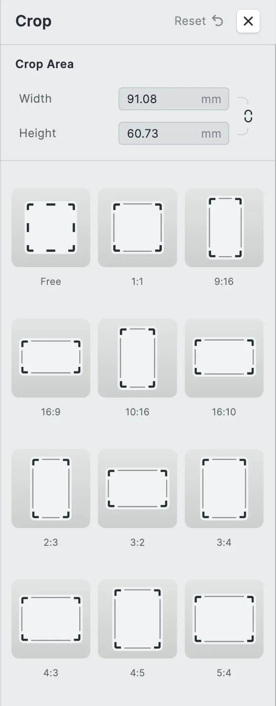

The CE.SDK can be configured with a series of crop presets through the `config.ui.cropPresetsLibraries` object and by creating custom asset sources or updating the content.json from the default asset source on the CDN.

To enable the CE.SDK defaults enable our default asset sources by using `addDefaultAssetSources`.

```
await addDefaultAssetSources();
```

## Configuring Custom Crop Presets[#](#configuring-custom-crop-presets)

You can define your own crop presets by [creating a custom asset source](js/import-media/from-remote-source/unsplash-8f31f0/) and by registering it in the configuration under `ui.cropPresetsLibraries`. Each of the asset objects in the asset source must define a value for its `payload.transformPreset` property.

### Fixed Aspect Ratio[#](#fixed-aspect-ratio)

When a fixed aspect ratio preset is applied it will resize the crop frame based on the `width` and `height` values provided.

```
{  id: 'aspect-ratio-16-9',  label: {    en: '16:9'  },  meta: {    width: 80,    height: 120,    thumbUri: `${window.location.protocol}//${window.location.host}/ratio-16-9.png`  },  payload: {    transformPreset: {      type: 'FixedAspectRatio',      width: 16,      height: 9    }  }}
```

*   `type: type` specifies the preset type.

```
type: "FixedAspectRatio",
```

*   `width: number` specifies the width of the crop frame.

```
width: 16,
```

*   `height: number` specifies the height of the crop frame.

```
height: 9,
```

### Free Aspect Ratio[#](#free-aspect-ratio)

When a free aspect ratio preset is applied it will enable the side-handles of the crop frame.

```
{  id: 'aspect-ratio-free',  label: {    en: 'Free'  },  meta: {    width: 80,    height: 120,    thumbUri: `${window.location.protocol}//${window.location.host}/ratio-free.png`  },  payload: {    transformPreset: {      type: 'FreeAspectRatio'    }  }}
```

*   `type: type` specifies the preset type.

```
type: "FreeAspectRatio",
```

### Fixed Size[#](#fixed-size)

When a fixed size preset is applied it will resize the selected block to the `width` and `height` provided.

```
{  id: 'din-a1-portrait',  label: {    en: 'DIN A1 Portrait'  },  meta: {    width: 80,    height: 120,    thumbUri: `${window.location.protocol}//${window.location.host}/din-a1-portrait.png`  },  payload: {    transformPreset: {      type: 'FixedSize',      width: 594,      height: 841,      designUnit: 'Millimeter'    }  }}
```

*   `type: type` specifies the preset type.

```
type: "FixedSize",
```

*   `width: number` specifies the width of the page in the specified design unit.

```
width: 1280,
```

*   `height: number` specifies the height of the page in the specified design unit.

```
height: 720,
```

*   `unit: 'Millimeter'|'Inch'|'Pixel'` describes unit in which `width`, `height` and `bleedMargin` are specified.

```
designUnit: 'Pixel',
```

## Full Code[#](#full-code)

Here’s the full code for configuring the default page formats:

```
import CreativeEditorSDK from 'https://cdn.img.ly/packages/imgly/cesdk-js/1.57.0/index.js';
const config = {  license: 'mtLT-_GJwMhE7LDnO8KKEma7qSuzWuDxiKuQcxHKmz3fjaXWY2lT3o3Z2VdL5twm',  baseURL: 'https://cdn.img.ly/packages/imgly/cesdk-js/1.57.0/assets',  userId: 'guides-user',  ui: {    scale: 'normal',    stylesheets: {      /* ... */    },    elements: {      /* ... */    },    pagePresetLibraries: [      // 'ly.img.crop.presets',      'my-custom-crop-presets'    ]  },  callbacks: { onUpload: 'local' } // Enable local uploads in Asset Library.};
CreativeEditorSDK.create('#cesdk_container', config).then(async (instance) => {  // Do something with the instance of CreativeEditor SDK  // Populate the asset library with default / demo asset sources.  instance.addDefaultAssetSources();  instance.addDemoAssetSources({ sceneMode: 'Design' });
  // Add a custom crop preset asset source.  instance.engine.asset.addLocalSource('my-custom-crop-presets');
  instance.engine.asset.addAssetToSource(    'my-custom-crop-presets',    {      id: 'aspect-ratio-free',      label: {        en: 'Free'      },      meta: {        width: 80,        height: 120,        thumbUri: `${window.location.protocol}//${window.location.host}/ratio-free.png`      },      payload: {        transformPreset: {          type: 'FreeAspectRatio'        }      }    }  );
  instance.engine.asset.addAssetToSource(    'my-custom-crop-presets',    {      id: 'aspect-ratio-16-9',      label: {        en: '16:9'      },      meta: {        width: 80,        height: 120,        thumbUri: `${window.location.protocol}//${window.location.host}/ratio-16-9.png`      },      payload: {        transformPreset: {          type: 'FixedAspectRatio',          width: 16,          height: 9        }      }    }  );
  instance.engine.asset.addAssetToSource(    'my-custom-crop-presets',    {      id: 'din-a1-portrait',      label: {        en: 'DIN A1 Portrait'      },      meta: {        width: 80,        height: 120,        thumbUri: `${window.location.protocol}//${window.location.host}/din-a1-portrait.png`      },      payload: {        transformPreset: {          type: 'FixedSize',          width: 594,          height: 841,          designUnit: 'Millimeter'        }      }    }  );
  await instance.createDesignScene();});
```

---


[Source](http:/localhost:4321/js/user-interface/customization/dock-cb916c)

# Dock

The dock is the main entry point for user interactions not directly related to the currently selected block. It occupies a prominent place in the editor and is primarily, though not exclusively, used to open panels with asset libraries. Therefore, the default and recommended position of the asset library panel is on the side of the dock. However, depending on the use case, it might be beneficial to add other buttons and functionalities (even block-specific ones) to highlight them due to the prominence of the dock.

## Configure Dock[#](#configure-dock)

*   `iconSize: string` is used to set the dock button icon size to `large` (24px) or `normal` (16px).
*   `hideLabels: boolean` shows or hides the labels inside the docks buttons.

```
import CreativeEditorSDK from 'https://cdn.img.ly/packages/imgly/cesdk-js/1.57.0/index.js';
const config = {  license: 'mtLT-_GJwMhE7LDnO8KKEma7qSuzWuDxiKuQcxHKmz3fjaXWY2lT3o3Z2VdL5twm',  userId: 'guides-user',  ui: {    elements: {      view: 'default',      /* ... */      navigation: {        /* ... */      },      panels: {        /* ... */      },      dock: {        iconSize: 'large', // 'large' or 'normal'        hideLabels: false, // false or true      },      libraries: {        /* ... */      },      blocks: {        /* ... */      },    },  },  callbacks: { onUpload: 'local' }, // Enable local uploads in Asset Library.};
CreativeEditorSDK.create('#cesdk_container', config).then(async instance => {  // Do something with the instance of CreativeEditor SDK, for example:  // Populate the asset library with default / demo asset sources.  instance.addDefaultAssetSources();  instance.addDemoAssetSources({ sceneMode: 'Design' });  await instance.createDesignScene();});
```

## Rearrange Dock Components[#](#rearrange-dock-components)

There are 6 APIs for getting, setting, updating, removing, and inserting components in the Dock.

The content of the Dock changes based on the current [edit mode](js/concepts/edit-modes-1f5b6c/) (`'Transform'` (the default), `'Text'`, `'Crop'`, `'Trim'`, or a custom value), so all APIs accept an `orderContext` argument to specify the mode.

For example usage of these APIs, see also [Moving Existing Buttons](js/user-interface/customization/rearrange-buttons-97022a/) or [Adding New Buttons](js/user-interface/ui-extensions/add-new-button-74884d/) in the Guides section.

### Get the Current Order[#](#get-the-current-order)

```
getDockOrder(  orderContext: OrderContext = { editMode: 'Transform' })
```

When omitting the `orderContext` parameter, the order for the `'Transform'` edit mode is returned, e.g.

```
cesdk.ui.getDockOrder();// [//   {//     id: 'ly.img.assetLibrary.dock',//     key: 'ly.img.template',//     icon: '@imgly/Template',//     label: 'libraries.ly.img.template.label',//     entries: [ 'ly.img.template' ]//   },//   ...// ]
```

### Set a new Order[#](#set-a-new-order)

```
setDockOrder(  dockOrder: (DockOrderComponentId | DockOrderComponent)[],  orderContext: OrderContext = { editMode: 'Transform' })
```

When omitting the `orderContext` parameter, the order is set for the default edit mode (`'Transform'`), e.g.:

```
// Sets the order for transform mode by defaultcesdk.ui.setDockOrder(['my.component.for.transform.mode']);
```

### Update Components[#](#update-components)

```
updateDockOrderComponent(  matcher: OrderComponentMatcher<OrderComponent<DockOrderComponentId>>,  update: DockOrderComponentId | Partial<OrderComponent<DockOrderComponentId>> | ((component: OrderComponent<DockOrderComponentId>) => Partial<OrderComponent<DockOrderComponentId>>),  orderContext?: OrderContext)
```

Updates existing components in the dock. The matcher can be:

*   A component ID string
*   A partial object describing the component to match
*   A function that receives the component and index, returning true if it matches

The update can be:

*   A new component ID string
*   A partial object with updated properties
*   A function that receives the current component and returns the updated one

Returns an object with the number of updated components and the updated order array.

```
// Change the icon and label for the image librarycesdk.ui.updateDockOrderComponent(  { id: 'ly.img.assetLibrary.dock', key: 'ly.img.image' },  (component) => ({    ...component,    icon: '@imgly/Photo',    label: 'My Photos',    entries: ['ly.img.image', 'ly.img.custom.photos']  }));
// Update the upload library label for different user contextscesdk.ui.updateDockOrderComponent(  { id: 'ly.img.assetLibrary.dock', key: 'ly.img.upload' },  { label: 'Upload Files' });
// Update the entries for the elements library to show only specific categoriescesdk.ui.updateDockOrderComponent(  { id: 'ly.img.assetLibrary.dock', key: 'ly.img.elements' },  { entries: ['ly.img.image', 'ly.img.text', 'ly.img.vectorpath'] });
```

### Remove Components[#](#remove-components)

```
removeDockOrderComponent(  matcher: OrderComponentMatcher<OrderComponent<DockOrderComponentId>>,  orderContext?: OrderContext)
```

Removes components from the dock. The matcher can be:

*   A component ID string
*   A partial object describing the component to match
*   A function that receives the component and index, returning true if it matches

Returns an object with the number of removed components and the updated order array.

```
// Remove the video library for mobile userscesdk.ui.removeDockOrderComponent(  (component) => component.id === 'ly.img.assetLibrary.dock' && component.key === 'ly.img.video');
// Remove all template libraries for users without template accesscesdk.ui.removeDockOrderComponent(  (component) => component.id === 'ly.img.assetLibrary.dock' && component.key && component.key.includes('template'));
// Remove the audio library by keycesdk.ui.removeDockOrderComponent({ id: 'ly.img.assetLibrary.dock', key: 'ly.img.audio' });
```

### Insert Components[#](#insert-components)

```
insertDockOrderComponent(  matcher: OrderComponentMatcher<OrderComponent<DockOrderComponentId>>,  component: DockOrderComponentId | OrderComponent<DockOrderComponentId>,  location?: InsertOrderComponentLocation,  orderContext?: OrderContext)
```

Inserts new components into the dock. The matcher can be:

*   A component ID string
*   A partial object describing the component to match
*   A function that receives the component and index, returning true if it matches

The location can be:

*   `'before'` - Insert before the matched component
*   `'after'` - Insert after the matched component (default)
*   `'replace'` - Replace the matched component
*   `'asChild'` - Insert as a child of the matched component

> **Note:** The `'asChild'` option is only supported for custom components that you register via `registerComponent`. Built-in dock components like `ly.img.assetLibrary.dock` do not support yet take advantage of this pattern.

Returns the updated dock order array.

```
// Add a custom asset library after the image librarycesdk.ui.insertDockOrderComponent(  { id: 'ly.img.assetLibrary.dock', key: 'ly.img.image' },  {    id: 'ly.img.assetLibrary.dock',    key: 'ly.img.custom',    icon: 'custom-icon',    label: 'Custom Assets',    entries: ['ly.img.custom', 'ly.img.brand']  });
// Add a separator before the upload library for better organizationcesdk.ui.insertDockOrderComponent(  { id: 'ly.img.assetLibrary.dock', key: 'ly.img.upload' },  'ly.img.separator',  'before');
// Replace the elements library with a simplified versioncesdk.ui.insertDockOrderComponent(  { id: 'ly.img.assetLibrary.dock', key: 'ly.img.elements' },  {    id: 'ly.img.assetLibrary.dock',    key: 'ly.img.elements.simple',    icon: '@imgly/Library',    label: 'Basic Elements',    entries: ['ly.img.image', 'ly.img.text']  },  'replace');
```

## Dock Components[#](#dock-components)

The following lists the default Dock components available within CE.SDK.

### Layout Helpers[#](#layout-helpers)

| Component ID | Description |
| --- | --- |
| `ly.img.separator` | Adds a small space (invisible `<hr>` element) in the Dock to help the visual separation of entries.  
Separators follow some special layouting rules:  
\- If 2 or more separators end up next to each other (e.g. due to other components not rendering), **only 1** separator will be rendered.  
\- Separators that end up being the first or last element in the Dock will **not** be rendered.  
\- Separators directly adjacent _to the top side_ of a spacer (see below) will **not** be rendered. |
| `ly.img.spacer` | Adds vertical spacing in the Dock.  
Spacers will try to fill all available whitespace, by distributing the available space between all spacers found in the Dock. |

### Asset Library[#](#asset-library)

| Component ID | Description |
| --- | --- |
| `ly.img.assetLibrary.dock` | Asset Library:  
A button that opens the Asset Library Panel, showing the content of one or more associated asset entries. Requires additional keys to be set on the object passed to `setDockOrder`, as described below. |

#### Payload[#](#payload)

| Key | Type | Description |
| --- | --- | --- |
| `key` | `string` | Needs to be unique within the set of components in the Dock. |
| `label` | `string` | Used as a label for the button. If a matching I18N key is found, the label is localized. |
| `icon` | `CustomIcon` | One of 3 things:  
\-A URL string pointing to an SVG image, or:  
\- The string identifier of a custom or built-in icon (see [Icons](js/user-interface/appearance/icons-679e32/)), or:  
\- A callback returning a URL, which takes a single parameter of type `{theme: string, iconSize: 'normal' | 'large' }`. |
| `entries` | `string[]` | List of Asset Entries that will be shown in the Asset Library Panel when pressing the button. A single entry will open that entry directly. Multiple entries will show a group overview. |

#### Example Usage[#](#example-usage)

```
// Set the Dock Order to show only the Image Asset Library.cesdk.ui.setDockOrder([  {    id: 'ly.img.assetLibrary.dock', // Component id    // All other keys are payload / parameters passed to the component    key: 'ly.img.image',    icon: '@imgly/Image',    label: 'libraries.ly.img.image.label', // Using a I18N key    entries: [      'ly.img.image', // Only 1 entry is to be shown    ],  },]);
```

## Default Order[#](#default-order)

```
[  {    id: 'ly.img.assetLibrary.dock',    key: 'ly.img.template',    icon: '@imgly/Template',    label: 'libraries.ly.img.template.label',    entries: ['ly.img.template'],  },  {    id: 'ly.img.assetLibrary.dock',    key: 'ly.img.video.template',    icon: '@imgly/Template',    label: 'libraries.ly.img.video.template.label',    entries: ['ly.img.video.template'],  },  {    id: 'ly.img.separator',  },  {    id: 'ly.img.assetLibrary.dock',    key: 'ly.img.elements',    icon: '@imgly/Library',    label: 'component.library.elements',    entries: [      'ly.img.upload',      'ly.img.video',      'ly.img.audio',      'ly.img.image',      'ly.img.text',      'ly.img.vectorpath',      'ly.img.sticker',      'cutout-entry',    ],  },  {    id: 'ly.img.assetLibrary.dock',    key: 'ly.img.upload',    icon: '@imgly/Upload',    label: 'libraries.ly.img.upload.label',    entries: ['ly.img.upload'],  },  {    id: 'ly.img.assetLibrary.dock',    key: 'ly.img.video',    icon: '@imgly/Video',    label: 'libraries.ly.img.video.label',    entries: ['ly.img.video'],  },  {    id: 'ly.img.assetLibrary.dock',    key: 'ly.img.audio',    icon: '@imgly/Audio',    label: 'libraries.ly.img.audio.label',    entries: ['ly.img.audio'],  },  {    id: 'ly.img.assetLibrary.dock',    key: 'ly.img.image',    icon: '@imgly/Image',    label: 'libraries.ly.img.image.label',    entries: ['ly.img.image'],  },  {    id: 'ly.img.assetLibrary.dock',    key: 'ly.img.text',    icon: '@imgly/Text',    label: 'libraries.ly.img.text.label',    entries: ['ly.img.text'],  },  {    id: 'ly.img.assetLibrary.dock',    key: 'ly.img.vectorpath',    icon: '@imgly/Shapes',    label: 'libraries.ly.img.vectorpath.label',    entries: ['ly.img.vectorpath'],  },  {    id: 'ly.img.assetLibrary.dock',    key: 'ly.img.sticker',    icon: '@imgly/Sticker',    label: 'libraries.ly.img.sticker.label',    entries: ['ly.img.sticker'],  },];
```

---


[Source](http:/localhost:4321/js/user-interface/customization/canvas-menu-0d2b5b)

# Canvas Menu

## Rearrange Components[#](#rearrange-components)

There are 6 APIs for getting, setting, updating, removing, and inserting components in the Canvas Menu.

The content of the Canvas Menu changes based on the current [edit mode](js/concepts/edit-modes-1f5b6c/) (`'Transform'` (the default), `'Text'`, `'Crop'`, `'Trim'`, or a custom value), so all APIs accept an `orderContext` argument to specify the mode.

For example usage of these APIs, see also [Moving Existing Buttons](js/user-interface/customization/rearrange-buttons-97022a/) or [Adding New Buttons](js/user-interface/ui-extensions/add-new-button-74884d/) in the Guides section.

### Get the Current Order[#](#get-the-current-order)

```
cesdk.ui.getCanvasMenuOrder(  orderContext: OrderContext = { editMode: 'Transform' })
```

When omitting the `orderContext` parameter, the order for the `'Transform'` edit mode is returned, e.g.

```
cesdk.ui.getCanvasMenuOrder();// => [// {id: 'ly.img.group.enter.canvasMenu'},// {id: 'ly.img.group.select.canvasMenu'},// ...// ]
```

### Set a new Order[#](#set-a-new-order)

```
setCanvasMenuOrder(  canvasMenuOrder: (CanvasMenuComponentId | OrderComponent)[],  orderContext: OrderContext = { editMode: 'Transform' })
```

When omitting the `orderContext` parameter, the order is set for the default edit mode (`'Transform'`), e.g.:

```
// Sets the order for transform mode by defaultcesdk.ui.setCanvasMenuOrder(['my.component.for.transform.mode']);
```

### Update Components[#](#update-components)

```
updateCanvasMenuOrderComponent(  matcher: OrderComponentMatcher<OrderComponent<CanvasMenuComponentId>>,  update: CanvasMenuComponentId | Partial<OrderComponent<CanvasMenuComponentId>> | ((component: OrderComponent<CanvasMenuComponentId>) => Partial<OrderComponent<CanvasMenuComponentId>>),  orderContext?: OrderContext)
```

Updates existing components in the canvas menu. The matcher can be:

*   A component ID string
*   A partial object describing the component to match
*   A function that receives the component and index, returning true if it matches

The update can be:

*   A new component ID string
*   A partial object with updated properties
*   A function that receives the current component and returns the updated one

Returns an object with the number of updated components and the updated order array.

```
// Replace the duplicate button with a custom duplicate componentcesdk.ui.updateCanvasMenuOrderComponent(  'ly.img.duplicate.canvasMenu',  'my-custom-duplicate-component');
// Replace text edit controls with simplified versions for basic userscesdk.ui.updateCanvasMenuOrderComponent(  (component) => component.id === 'ly.img.text.edit.canvasMenu',  'my-simple-text-edit-component');
```

### Remove Components[#](#remove-components)

```
removeCanvasMenuOrderComponent(  matcher: OrderComponentMatcher<OrderComponent<CanvasMenuComponentId>>,  orderContext?: OrderContext)
```

Removes components from the canvas menu. The matcher can be:

*   A component ID string
*   A partial object describing the component to match
*   A function that receives the component and index, returning true if it matches

Returns an object with the number of removed components and the updated order array.

```
// Remove placeholder controls for simplified interfacecesdk.ui.removeCanvasMenuOrderComponent('ly.img.placeholder.canvasMenu');
// Remove all text editing controls for basic userscesdk.ui.removeCanvasMenuOrderComponent(  (component) => component.id.includes('text'));
// Remove group controls for single-element contextscesdk.ui.removeCanvasMenuOrderComponent({ id: 'ly.img.group.enter.canvasMenu' });
```

### Insert Components[#](#insert-components)

```
insertCanvasMenuOrderComponent(  matcher: OrderComponentMatcher<OrderComponent<CanvasMenuComponentId>>,  component: CanvasMenuComponentId | OrderComponent<CanvasMenuComponentId>,  location?: InsertOrderComponentLocation,  orderContext?: OrderContext)
```

Inserts new components into the canvas menu. The matcher can be:

*   A component ID string
*   A partial object describing the component to match
*   A function that receives the component and index, returning true if it matches

The location can be:

*   `'before'` - Insert before the matched component
*   `'after'` - Insert after the matched component (default)
*   `'replace'` - Replace the matched component
*   `'asChild'` - Insert as a child of the matched component

Returns the updated canvas menu order array.

```
// Add a custom action after the duplicate buttoncesdk.ui.insertCanvasMenuOrderComponent(  'ly.img.duplicate.canvasMenu',  'my-custom-action-component');
// Add a separator before the delete button for better organizationcesdk.ui.insertCanvasMenuOrderComponent(  'ly.img.delete.canvasMenu',  'ly.img.separator',  'before');
// Replace the default replace button with a custom onecesdk.ui.insertCanvasMenuOrderComponent(  'ly.img.replace.canvasMenu',  'my-custom-replace-component',  'replace');
```

## Canvas Menu Components[#](#canvas-menu-components)

The following lists the default Canvas Menu components available within CE.SDK.

Take special note of the “Feature ID” column. Most components can be hidden/disabled by disabling the corresponding feature using the Feature API.

Also note that many components are only rendered for the block types listed in the “Renders for” column, because their associated controls (e.g. font size) are only meaningful for specific kinds of blocks (e.g. text).

### Layout Helpers[#](#layout-helpers)

| Component ID | Description |
| --- | --- |
| `ly.img.separator` | Adds a vertical separator (`<hr>` element) in the Canvas Menu.  
Separators follow some special layouting rules:  
\- If 2 or more separators end up next to each other (e.g. due to other components not rendering), **only 1** separator will be rendered.  
\- Separators that end up being the first or last element in the Canvas Menu will **not** be rendered.  
\- Separators directly adjacent _to the left side_ of a spacer (see below) will **not** be rendered. |

### Common Controls[#](#common-controls)

These components are useful for editing various different block types.

| Component ID | Description | Feature ID | Renders for |
| --- | --- | --- | --- |
| `ly.img.replace.canvasMenu` | Replace button:  
Opens the “Replace” Panel offering to replace the current image or video fill. | `ly.img.replace` | Images, Videos |
| `ly.img.placeholder.canvasMenu` | Placeholder button:  
Opens the “Placeholder” panel, allowing the user to toggle specific [constraints](js/create-templates/add-dynamic-content/placeholders-d9ba8a/) on the selected block. | `ly.img.placeholder` | Every block |
| `ly.img.duplicate.canvasMenu` | Duplicate button:  
Duplicates the selected elements when pressed. | `ly.img.duplicate` | Every block |
| `ly.img.delete.canvasMenu` | Delete button:  
Deletes the selected elements when pressed. | `ly.img.delete` | Every block |

### Text[#](#text)

These components are relevant for editing text blocks, and will only render when a text block is selected.

| Component ID | Description | Feature ID |
| --- | --- | --- |
| `ly.img.text.edit.canvasMenu` | Edit button:  
Switches to text edit mode when pressed. | `ly.img.text.edit` |
| `ly.img.text.color.canvasMenu` | Color swatch button:  
Opens the Color Panel, where the user can set the color for the currently selected text run. | `ly.img.fill` |
| `ly.img.text.bold.canvasMenu` | Bold toggle:  
Toggles the bold cut (if available) for the currently selected text run. | `ly.img.text.edit` |
| `ly.img.text.italic.canvasMenu` | Italic toggle:  
Toggles the italic cut (if available) for the currently selected text run. | `ly.img.text.edit` |
| `ly.img.text.variables.canvasMenu` | Insert Variable button:  
Opens a dropdown containing the selection of available text variables. |  |

### Groups[#](#groups)

These controls will only render when a group or an element of a group is selected.

| Component ID | Description | Feature ID | Renders for |
| --- | --- | --- | --- |
| `ly.img.group.enter.canvasMenu` | Enter group button:  
Moves selection to the first element of the group when pressed. | `ly.img.group` | Groups |
| `ly.img.group.select.canvasMenu` | Select group button:  
Moves selection to the parent group of the currently selected element when pressed. | `ly.img.group` | Elements within groups |

### Page[#](#page)

These controls will only render when a page is selected.

| Component ID | Description | Feature ID |
| --- | --- | --- |
| `ly.img.page.moveUp.canvasMenu` | Move Up/Left button:  
Moves the current page closer to the **start** of a multi-page document. | `ly.img.page.move` |
| `ly.img.page.moveDown.canvasMenu` | Move Down/Right button:  
Moves the current page closer to the **end** of a multi-page document. | `ly.img.page.move` |

## Default Order[#](#default-order)

The default order of the Canvas Menu is the following:

### Transform Mode[#](#transform-mode)

```
[  'ly.img.group.enter.canvasMenu',  'ly.img.group.select.canvasMenu',
  'ly.img.page.moveUp.canvasMenu',  'ly.img.page.moveDown.canvasMenu',
  'ly.img.separator',
  'ly.img.text.edit.canvasMenu',  'ly.img.replace.canvasMenu',
  'ly.img.separator',
  'ly.img.placeholder.canvasMenu',
  'ly.img.separator',
  'ly.img.duplicate.canvasMenu',  'ly.img.delete.canvasMenu',];
```

### Text Mode[#](#text-mode)

```
[  'ly.img.text.color.canvasMenu',
  'ly.img.separator',
  'ly.img.text.bold.canvasMenu',  'ly.img.text.italic.canvasMenu',
  'ly.img.separator',
  'ly.img.text.variables.canvasMenu',];
```

---


[Source](http:/localhost:4321/js/user-interface/customization/color-palette-429fd9)

# Color Palette

By default, the CreativeEditor SDK ships with a predefined set of default colors:

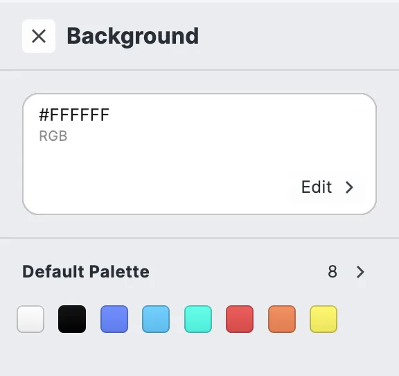

The CE.SDK can be configured with a series of colors that can be directly used whenever a color needs to be chosen. These color libraries need to be provided as asset sources - see our guide on [Custom Color Libraries](js/colors/create-color-palette-7012e0/) for more details on how this is achieved.

## Configure library list[#](#configure-library-list)

*   The list of libraries can be configured using the `ui.colorLibraries` key. Each asset source listed here will appear in the color picker, in the same order.
*   The pre-defined asset source `'ly.img.colors.defaultPalette'` contains the default color palette. Use this source ID to re-position or remove the default color palette.
*   To replace it (like we do in this example), use the configuration keys `ui.colorPalettes` and `ui.i18n` to insert and label one (1) single new asset source.

```
    colorLibraries: ['myDefaultPalette'],    i18n: {      en: {        'libraries.myDefaultPalette.label': 'My Default Palette'      }    },
```

## Add custom library[#](#add-custom-library)

*   Next, use the asset API to add the asset source, then populate it with your preferred colors. See our guide on [Custom Color Libraries](js/colors/create-color-palette-7012e0/) for more details.

```
// Add an asset source with your own colors:instance.engine.asset.addLocalSource('myDefaultPalette');instance.engine.asset.addAssetToSource('myDefaultPalette', {  id: 'red',  label: { en: 'red' },  tags: { en: ['red'] },  payload: {    color: {      colorSpace: 'sRGB',      r: 1,      g: 0,      b: 0,    },  },});
```

## Full Code[#](#full-code)

Here’s the full code for configuring the default color palette:

```
import CreativeEditorSDK from 'https://cdn.img.ly/packages/imgly/cesdk-js/1.57.0/index.js';
const config = {  license: 'mtLT-_GJwMhE7LDnO8KKEma7qSuzWuDxiKuQcxHKmz3fjaXWY2lT3o3Z2VdL5twm',  userId: 'guides-user',  ui: {    colorLibraries: ['myDefaultPalette'],    i18n: {      en: {        'libraries.myDefaultPalette.label': 'My Default Palette',      },    },    scale: 'normal',    stylesheets: {      /* ... */    },    elements: {      /* ... */    },  },  callbacks: { onUpload: 'local' }, // Enable local uploads in Asset Library.};
CreativeEditorSDK.create('#cesdk_container', config).then(async instance => {  // Do something with the instance of CreativeEditor SDK  // Populate the asset library with default / demo asset sources.  instance.addDefaultAssetSources();  instance.addDemoAssetSources({ sceneMode: 'Design' });  // Add an asset source with your own colors:  instance.engine.asset.addLocalSource('myDefaultPalette');  instance.engine.asset.addAssetToSource('myDefaultPalette', {    id: 'red',    label: { en: 'red' },    tags: { en: ['red'] },    payload: {      color: {        colorSpace: 'sRGB',        r: 1,        g: 0,        b: 0,      },    },  });  await instance.createDesignScene();});
```

---


[Source](http:/localhost:4321/js/user-interface/customization/canvas-632c8e)

# Canvas Bar

## Rearrange Components[#](#rearrange-components)

There are 6 APIs for getting, setting, updating, removing, and inserting components in the Canvas Bar.

The Canvas Bar can appear in 2 positions: At the top of the canvas, and at the bottom of the canvas. The APIs can get and set the content for both of these positions independently.

The content of the Canvas Bar changes based on the current [edit mode](js/concepts/edit-modes-1f5b6c/) (`'Transform'` (the default), `'Text'`, `'Crop'`, `'Trim'`, or a custom value), so all APIs accept an `orderContext` argument to specify the mode.

For example usage of similar APIs, see also [Moving Existing Buttons](js/user-interface/customization/rearrange-buttons-97022a/) or [Adding New Buttons](js/user-interface/ui-extensions/add-new-button-74884d/) in the Guides section.

### Get the Current Order[#](#get-the-current-order)

```
getCanvasBarOrder(  position: 'top' | 'bottom',  orderContext: OrderContext = {    editMode: 'Transform'  })
```

When omitting the `orderContext` parameter, the order for the `'Transform'` edit mode is returned, e.g.

```
cesdk.ui.getCanvasBarOrder('bottom');// => [// {id: 'ly.img.settings.canvasBar'},// {id: 'ly.img.spacer'},// ...// ]
```

### Set a new Order[#](#set-a-new-order)

```
setCanvasBarOrder(  canvasBarOrder: (CanvasBarComponentId | OrderComponent)[],  position: 'top' | 'bottom',  orderContext: OrderContext = {    editMode: 'Transform'  })
```

When omitting the `orderContext` parameter, the order is set for the default edit mode (`'Transform'`), e.g.:

```
// Sets the order for transform mode by defaultcesdk.ui.setCanvasBarOrder('bottom', ['my.component.for.transform.mode']);
```

### Update Components[#](#update-components)

```
updateCanvasBarOrderComponent(  matcher: OrderComponentMatcher<OrderComponent<CanvasBarComponentId>>,  update: CanvasBarComponentId | Partial<OrderComponent<CanvasBarComponentId>> | ((component: OrderComponent<CanvasBarComponentId>) => Partial<OrderComponent<CanvasBarComponentId>>),  position: 'top' | 'bottom',  orderContext?: OrderContext)
```

Updates existing components in the canvas bar. The matcher can be:

*   A component ID string
*   A partial object describing the component to match
*   A function that receives the component and index, returning true if it matches

The update can be:

*   A new component ID string
*   A partial object with updated properties
*   A function that receives the current component and returns the updated one

Returns an object with the number of updated components and the updated order array.

```
// Replace the settings button with a custom settings componentcesdk.ui.updateCanvasBarOrderComponent(  'ly.img.settings.canvasBar',  'my-custom-settings-component',  'bottom');
// Replace the add page button with a custom page management componentcesdk.ui.updateCanvasBarOrderComponent(  (component) => component.id === 'ly.img.page.add.canvasBar',  'my-custom-page-component',  'top');
```

### Remove Components[#](#remove-components)

```
removeCanvasBarOrderComponent(  matcher: OrderComponentMatcher<OrderComponent<CanvasBarComponentId>>,  position: 'top' | 'bottom',  orderContext?: OrderContext)
```

Removes components from the canvas bar. The matcher can be:

*   A component ID string
*   A partial object describing the component to match
*   A function that receives the component and index, returning true if it matches

Returns an object with the number of removed components and the updated order array.

```
// Remove the add page button for single-page documentscesdk.ui.removeCanvasBarOrderComponent(  'ly.img.page.add.canvasBar',  'bottom');
// Remove all settings controls for basic userscesdk.ui.removeCanvasBarOrderComponent(  (component) => component.id.includes('settings'),  'top');
// Remove specific components by IDcesdk.ui.removeCanvasBarOrderComponent(  { id: 'ly.img.settings.canvasBar' },  'bottom');
```

### Insert Components[#](#insert-components)

```
insertCanvasBarOrderComponent(  matcher: OrderComponentMatcher<OrderComponent<CanvasBarComponentId>>,  component: CanvasBarComponentId | OrderComponent<CanvasBarComponentId>,  position: 'top' | 'bottom',  location?: InsertOrderComponentLocation,  orderContext?: OrderContext)
```

Inserts new components into the canvas bar. The matcher can be:

*   A component ID string
*   A partial object describing the component to match
*   A function that receives the component and index, returning true if it matches

The location can be:

*   `'before'` - Insert before the matched component
*   `'after'` - Insert after the matched component (default)
*   `'replace'` - Replace the matched component
*   `'asChild'` - Insert as a child of the matched component

Returns the updated canvas bar order array.

```
// Add a custom action after the settings buttoncesdk.ui.insertCanvasBarOrderComponent(  'ly.img.settings.canvasBar',  'my-custom-action-component',  'bottom');
// Add a separator before the add page button for better organizationcesdk.ui.insertCanvasBarOrderComponent(  'ly.img.page.add.canvasBar',  'ly.img.separator',  'bottom',  'before');
// Replace the default settings button with a custom onecesdk.ui.insertCanvasBarOrderComponent(  'ly.img.settings.canvasBar',  'my-custom-settings-component',  'top',  'replace');
```

## Canvas Bar Components[#](#canvas-bar-components)

The following lists the default Canvas Bar components available within CE.SDK.

### Layout Helpers[#](#layout-helpers)

| Component ID | Description |
| --- | --- |
| `ly.img.separator` | Adds a vertical separator (`<hr>` element) in the Canvas Bar.  
Separators follow some special layouting rules:  
\- If 2 or more separators end up next to each other (e.g. due to other components not rendering), **only 1** separator will be rendered.  
\- Separators that end up being the first or last element in the Canvas Bar will **not** be rendered.  
\- Separators directly adjacent _to the left side_ of a spacer (see below) will **not** be rendered. |
| `ly.img.spacer` | Adds horizontal spacing in the Canvas Bar.  
Spacers will try to fill all available whitespace, by distributing the available space between all spacers found in the Canvas Bar. |

### Common Controls[#](#common-controls)

| Component ID | Description |
| --- | --- |
| `ly.img.settings.canvasBar` | Customize Editor button:  
Opens the Settings Panel when pressed. |
| `ly.img.page.add.canvasBar` | Add Page button:  
Adds a new page to the end of the document when pressed. |

## Default Order[#](#default-order)

The default order of the Canvas Bar is the following:

```
[  'ly.img.settings.canvasBar',  'ly.img.spacer',  'ly.img.page.add.canvasBar',  'ly.img.spacer',];
```

---


[Source](http:/localhost:4321/js/user-interface/appearance/theming-4b0938)

# Theming

Theming involves adjusting the colors, fonts, and sizes of the Editor UI. We have provisioned three levels of support for themes:

1.  Our built-in themes can be used out-of-the-box.
2.  Our theme generator can be used for quickly generating new themes based on three main colors
3.  A custom theme can be added by leveraging our theming API for the most detailed customization of our UI.

## Using the built-in Themes and Scale[#](#using-the-built-in-themes-and-scale)

We provide two built-in themes, which can be configured via

*   `theme: string` can be set to either `dark` or `light`. Both styles cover popular defaults offered by many current operating systems and apps. By default the ‘dark’ theme is active.
*   `ui.scale: "normal" | "large" | ({ containerWidth, isTouch }: { containerWidth?: number, isTouch?: boolean }) => "normal" | "large"` In `large` mode, many UI elements, margins and fonts are increased in size. In addition to the stylistic choice, this improves readability and can aid users with slight visual or motor impairments, and users with small screens. By default, the `normal` scale is applied. For more flexibility, a callback can be passed as a value that needs to return either of the two string values mentioned above. Inside that callback, two parameters are available. `containerWidth` returns the width of the HTML element into which the CE.SDK editor is being rendered. A potential use case is rendering different scalings on devices with a small width, like mobile phones. `isTouch` returns a boolean which indicates if the user agent supports touch input or not. For example, this can be used to render the `large` UI scaling if a device has touch input to make it easier to target the UI elements with a finger.

```
import CreativeEditorSDK from 'https://cdn.img.ly/packages/imgly/cesdk-js/1.57.0/index.js';
const config = {  license: 'mtLT-_GJwMhE7LDnO8KKEma7qSuzWuDxiKuQcxHKmz3fjaXWY2lT3o3Z2VdL5twm',  userId: 'guides-user',  baseURL: 'https://cdn.img.ly/packages/imgly/cesdk-js/1.57.0/assets',  theme: 'light', // 'light' or 'dark'  ui: {    scale: ({ containerWidth, isTouch }) => {      if (containerWidth < 600 || isTouch) {        return 'large';      } else {        return 'normal';      }    }, // or 'normal' or 'large'  },  callbacks: { onUpload: 'local' }, // Enable local uploads in Asset Library.};
CreativeEditorSDK.create('#cesdk_container', config).then(async instance => {  // Do something with the instance of CreativeEditor SDK, for example:  // Populate the asset library with default / demo asset sources.  instance.addDefaultAssetSources();  instance.addDemoAssetSources({ sceneMode: 'Design' });  await instance.createDesignScene();});
```

## Using the Theme Generator[#](#using-the-theme-generator)

In order to get started quickly with building a custom theme, use our built-in theme generator found in the ‘Settings’ panel. Using only three base colors, this will generate a theme file that you can directly use. See Theming API below on how to provide your theme.

```
elements: {  panels: {    settings: true;  }}
```

## Using a Custom Theme[#](#using-a-custom-theme)

To provide a theme to the editor, link your themes `index.css` files or populate a `<style>` tag on the same page that includes the editor.

💡 We suggest to provide one `light` and one `dark` theme for the best possible user experience.

💡 We suggest to allow users to switch between `large` and `normal` scale, and to build your themes so that the desired scaling is taken into account.

```
.ubq-public[data-ubq-theme='dark'][data-ubq-scale='normal'] {  --ubq-canvas: hsl(230.27, 52.11%, 13.92%);  --ubq-elevation-1: hsl(230.4, 52.08%, 18.82%);  --ubq-elevation-2: hsl(229.69, 52.46%, 23.92%);  --ubq-foreground-default: hsla(0, 0%, 100%, 0.9);  --ubq-foreground-light: hsla(0, 0%, 100%, 0.7);  --ubq-foreground-info: hsla(0, 0%, 100%, 0.5);  --ubq-interactive-default: hsl(229.87, 52.38%, 28.82%);  --ubq-interactive-hover: hsl(229.69, 52.46%, 23.92%);  --ubq-interactive-pressed: hsl(230.45, 52.38%, 16.47%);  --ubq-input-default: hsl(234, 50%, 3.92%);  --ubq-input-hover: hsl(228, 55.56%, 1.76%);  --ubq-border-default: hsla(230, 52.17%, 63.92%, 0.1);  --ubq-stroke-contrast-1: hsla(230, 52.17%, 63.92%, 0.08);  --ubq-stroke-contrast-2: hsla(230, 52.17%, 63.92%, 0.25);  --ubq-focus-outline: hsl(230.27, 52.11%, 13.92%);  --ubq-overlay-default: hsla(230.27, 52.11%, 13.92%, 0.8);  --ubq-foreground-active: hsla(210, 30%, 10%, 0.9);  --ubq-interactive-active-default:    linear-gradient(to bottom, hsla(0, 0%, 100%, 1), hsla(0, 0%, 100%, 0)),    hsla(0, 0%, 100%, 0.88);  --ubq-interactive-active-hover:    linear-gradient(to bottom, hsla(0, 0%, 100%, 1), hsla(0, 0%, 100%, 0)),    hsla(210, 100%, 95%, 0.98);  --ubq-interactive-active-pressed:    linear-gradient(to bottom, hsla(0, 0%, 100%, 1), hsla(0, 0%, 100%, 0)),    hsla(0, 0%, 100%, 0.5);  --ubq-notice-info: hsla(0, 0%, 100%, 1);  --ubq-foreground-accent: hsl(0, 0%, 0%);  --ubq-interactive-accent-default: hsl(0, 0%, 100%);  --ubq-interactive-accent-hover: hsl(0, 0%, 100%);  --ubq-interactive-accent-pressed: hsl(0, 0%, 95%);  --ubq-focus-default: hsl(288.99, 0%, 92.5%);  --ubq-notice-warning: hsl(37.45, 0%, 93.5%);  --ubq-notice-error: hsl(311.23, 0%, 88.9%);  --ubq-notice-success: hsl(166.23, 0%, 92.19%);
  --ubq-typography-headline-l-size: 16px;  --ubq-typography-headline-l-line_height: 20px;  --ubq-typography-headline-l-letter_spacing: 0.01em;  --ubq-typography-headline-l-font_family: var(    --ubq-typography-font_family,    'Inter',    sans-serif  );  --ubq-typography-headline-l-weight: 600;
  --ubq-typography-headline-m-size: 12px;  --ubq-typography-headline-m-line_height: 16px;  --ubq-typography-headline-m-letter_spacing: 0.03em;  --ubq-typography-headline-m-font_family: var(    --ubq-typography-font_family,    'Inter',    sans-serif  );  --ubq-typography-headline-m-weight: 600;
  --ubq-typography-label-m-size: 12px;  --ubq-typography-label-m-line_height: 16px;  --ubq-typography-label-m-letter_spacing: 0.02em;  --ubq-typography-label-m-font_family: var(    --ubq-typography-font_family,    'Inter',    sans-serif  );  --ubq-typography-label-m-weight: normal;
  --ubq-typography-label-s-size: 10px;  --ubq-typography-label-s-line_height: 14px;  --ubq-typography-label-s-letter_spacing: 0.02em;  --ubq-typography-label-s-font_family: var(    --ubq-typography-font_family,    'Inter',    sans-serif  );  --ubq-typography-label-s-weight: normal;
  --ubq-typography-body-m-size: 12px;  --ubq-typography-body-m-line_height: 18px;  --ubq-typography-body-m-letter_spacing: 0.02em;  --ubq-typography-body-m-font_family: var(    --ubq-typography-font_family,    'Inter',    sans-serif  );  --ubq-typography-body-m-weight: normal;
  --ubq-typography-input-m-size: 12px;  --ubq-typography-input-m-line_height: 16px;  --ubq-typography-input-m-letter_spacing: 0.02em;  --ubq-typography-input-m-font_family: var(    --ubq-typography-font_family,    'Inter',    sans-serif  );  --ubq-typography-input-m-weight: unset;
  --ubq-typography-button-m-size: 12px;  --ubq-typography-button-m-line_height: 16px;  --ubq-typography-button-m-letter_spacing: 0.02em;  --ubq-typography-button-m-font_family: var(    --ubq-typography-font_family,    'Inter',    sans-serif  );  --ubq-typography-button-m-weight: unset;}
```

## Theming API[#](#theming-api)

Our theming API consists of several custom CSS properties, allowing you to adapt the look and feel of the editor to your needs.

To limit the scope of a theme to the CE.SDK Editor UI wrap any CSS properties in the `ubq-public` class.

The CE.SDK Editor supports switching between `dark` and `light` mode UI, which is a popular default in current operating systems. To adjust your theme based on that switch, use the data attribute `data-ubq-theme`.

The CE.SDK Editor also supports switching between a ‘normal’ and ‘large’ mode UI. The data attribute `data-ubq-scale` contains information on which scaling is currently requested:

---


[Source](http:/localhost:4321/js/user-interface/ai-integration/proxy-server-61f901)

# Proxy Server

For security reasons, you should never include your AI service API keys directly in client-side code. Instead, you should set up proxy services that securely forward requests to AI providers while keeping your API keys secure on the server side.

Each AI provider configuration requires a `proxyUrl` parameter, which should point to your server-side endpoint that handles authentication and forwards requests to the AI service:

```
text2image: FalAiImage.RecraftV3({    proxyUrl: 'http://your-proxy-server.com/api/proxy'});
// Or use Recraft20b with icon style support:// text2image: FalAiImage.Recraft20b({//     proxyUrl: 'http://your-proxy-server.com/api/proxy'// });
```

### Proxy Implementation Requirements[#](#proxy-implementation-requirements)

Your proxy should implement specific requirements for each AI service:

#### 1\. Anthropic Proxy[#](#1-anthropic-proxy)

*   **Target URL**: `https://api.anthropic.com/`
*   **Authentication Header**: Add `X-Api-Key` header with your Anthropic API key
*   **Request Handling**: Forward request body as-is to Anthropic API
*   **Response Handling**: Remove `content-encoding` headers to handle compressed responses correctly

#### 2\. fal.ai Proxy[#](#2-falai-proxy)

*   **Dynamic URL**: Use a special header called `x-fal-target-url` to determine the actual endpoint
*   **Authentication Header**: Add `Authorization: Key YOUR_FAL_KEY` header
*   **Request Forwarding**: Preserve the complete request body and query parameters
*   For more information on the requirements, refer to fal.ai’s [documentation](https://docs.fal.ai/model-endpoints/server-side/#the-proxy-formula).

#### 3\. ElevenLabs Proxy[#](#3-elevenlabs-proxy)

*   **Target URL**: `https://api.elevenlabs.io/`
*   **Authentication Header**: Add `xi-api-key` header with your ElevenLabs API key
*   **Headers**: Add an `Accept: audio/mpeg` header for audio requests.
*   **Response Handling**: Remove `content-encoding` headers to handle compressed responses correctly

#### 4\. OpenAI Proxy[#](#4-openai-proxy)

*   **Target URL**: `https://api.openai.com/v1/`
*   **Authentication Header**: Add `Authorization: Bearer YOUR_OPENAI_API_KEY` header
*   **Response Handling**: Remove `content-encoding` headers to handle compressed responses correctly
*   **Rate Limiting**: Implement rate limiting based on your OpenAI plan tier (recommended)
*   For more information on the requirements, refer to OpenAI’s [documentation](https://platform.openai.com/docs/api-reference/debugging-requests)

### Important Information for All Proxies[#](#important-information-for-all-proxies)

**Response Streaming**

To handle large responses efficiently, response streaming should be enabled for all proxies. Common approaches include:

*   **Axios**: `responseType: 'stream'`
*   **Fetch API**: Access `response.body` as a `ReadableStream`
*   **Node.js native HTTP clients**: Use stream-based responses
*   **Other HTTP clients**: Check documentation for streaming support

### General Proxy Design[#](#general-proxy-design)

A well-designed proxy service should:

1.  **Route requests** to the appropriate AI service based on the endpoint path
2.  **Add authentication** headers containing your API keys
3.  **Forward the request body** to maintain payload integrity
4.  **Handle response streaming** for services that support it (like Anthropic)
5.  **Implement proper CORS headers** to allow browser requests
6.  **Add appropriate error handling** and logging
7.  **Consider rate limiting** to protect your API keys from overuse

### Security Considerations[#](#security-considerations)

When implementing your proxy:

*   Store API keys securely as environment variables
*   Implement request validation to prevent abuse
*   Consider adding user authentication to your proxy endpoints
*   Monitor usage to detect unusual patterns
*   Implement proper error handling without leaking sensitive information

This approach ensures your API keys remain secure while still allowing your application to utilize AI services. For a complete example of a proxy implementation, you can find various proxy templates online that can be adapted for your specific needs.

---


[Source](http:/localhost:4321/js/user-interface/appearance/icons-679e32)

# Icons

Using our API, you can register your own icon sets for usage within the CE.SDK editor. The API is as follows:

## Add new Icon Set[#](#add-new-icon-set)

```
cesdk.ui.addIconSet(id: string, svgSprite: string)
```

The icon set is a string containing a SVG sprite with symbols. The id of each symbol is used to reference the icon in the editor. These ids need to start with a `@` to be recognized in the editor.

Please Note: The SVG sprite will be injected into the (shadow) DOM without any sanitization. Make sure to only use trusted sources to prevent e.g. XSS attacks. If you are unsure about the source of the sprite, consider using libraries like DOMPurify to sanitize the SVG string before adding it.

## Examples[#](#examples)

### Register an Icon Set[#](#register-an-icon-set)

Registering an SVG string with a single symbol might look like this:

```
cesdk.ui.addIconSet(  '@imgly/custom',  `    <svg>      <symbol        fill="none"        xmlns="http://www.w3.org/2000/svg"        viewBox="0 0 16 16"        id="@some/icon/ZoomIn"      >        <path          fillRule="evenodd"          clipRule="evenodd"          d="M3 7.5C3 5.01472 5.01472 3 7.5 3C9.98528 3 12 5.01472 12 7.5C12 9.98528 9.98528 12 7.5 12C5.01472 12 3 9.98528 3 7.5ZM7.5 2C4.46243 2 2 4.46243 2 7.5C2 10.5376 4.46243 13 7.5 13C8.74835 13 9.89957 12.5841 10.8226 11.8833L10.9697 12.0303L12.4697 13.5303L13 14.0607L14.0607 13L13.5303 12.4697L12.0303 10.9697L11.8833 10.8226C12.5841 9.89957 13 8.74835 13 7.5C13 4.46243 10.5376 2 7.5 2ZM7 7V5H8V7H10V8H8V10H7V8H5V7H7Z"          fill="currentColor"          fillOpacity="0.9"        />      </symbol>    </svg>  `,);
```

### Replace a Dock Icon[#](#replace-a-dock-icon)

You could use your custom icon set to replace the “Image” icon of the default Dock:

```
cesdk.ui.setDockOrder(  cesdk.ui.getDockOrder().map(entry => {    if (entry.key === 'ly.img.image')      return {        ...entry,        icon: '@some/icon/ZoomIn', // Note the ID referencing the SVG symbol      };    else return entry;  }),);
```

### Use within a custom Component[#](#use-within-a-custom-component)

Using your new symbol in a [custom component](js/user-interface/ui-extensions/register-new-component-b04a04/) is then done by referencing the symbol ID directly:

```
cesdk.ui.registerComponent('CustomIcon', ({ builder: { Button } }) => {  Button('customIcon', {    label: 'Custom Icon',    icon: '@some/icon/ZoomIn', // Note the ID referencing the SVG symbol    onClick: () => {      console.log('Custom Icon clicked');    },  });});
```

## Built-In Icons[#](#built-in-icons)

These built-in icons can be referenced by their name string directly:

### Set ‘Essentials’[#](#set-essentials)

| Name | Icon |
| --- | --- |
| 
`@imgly/Adjustments`

 | 


 |
| 

`@imgly/Animation`

 | 


 |
| 

`@imgly/Appearance`

 | 


 |
| 

`@imgly/Apps`

 | 


 |
| 

`@imgly/ArrowDown`

 | 


 |
| 

`@imgly/ArrowLeft`

 | 


 |
| 

`@imgly/ArrowRight`

 | 


 |
| 

`@imgly/ArrowUp`

 | 


 |
| 

`@imgly/ArrowsDirectionHorizontal`

 | 


 |
| 

`@imgly/ArrowsDirectionVertical`

 | 


 |
| 

`@imgly/AsClip`

 | 


 |
| 

`@imgly/AsOverlay`

 | 


 |
| 

`@imgly/Audio`

 | 


 |
| 

`@imgly/AudioAdd`

 | 


 |
| 

`@imgly/Backward`

 | 


 |
| 

`@imgly/Blendmode`

 | 


 |
| 

`@imgly/Blur`

 | 


 |
| 

`@imgly/BooleanExclude`

 | 


 |
| 

`@imgly/BooleanIntersect`

 | 


 |
| 

`@imgly/BooleanSubstract`

 | 


 |
| 

`@imgly/BooleanUnion`

 | 


 |
| 

`@imgly/CaseAsTyped`

 | 


 |
| 

`@imgly/CaseLowercase`

 | 


 |
| 

`@imgly/CaseSmallCaps`

 | 


 |
| 

`@imgly/CaseTitleCase`

 | 


 |
| 

`@imgly/CaseUppercase`

 | 


 |
| 

`@imgly/CheckboxCheckmark`

 | 


 |
| 

`@imgly/CheckboxMixed`

 | 


 |
| 

`@imgly/Checkmark`

 | 


 |
| 

`@imgly/ChevronDown`

 | 


 |
| 

`@imgly/ChevronLeft`

 | 


 |
| 

`@imgly/ChevronRight`

 | 


 |
| 

`@imgly/ChevronUp`

 | 


 |
| 

`@imgly/Collage`

 | 


 |
| 

`@imgly/ColorFill`

 | 


 |
| 

`@imgly/ColorGradientAngular`

 | 


 |
| 

`@imgly/ColorGradientLinear`

 | 


 |
| 

`@imgly/ColorGradientRadial`

 | 


 |
| 

`@imgly/ColorOpacity`

 | 


 |
| 

`@imgly/ColorSolid`

 | 


 |
| 

`@imgly/ConnectionLostSlash`

 | 


 |
| 

`@imgly/Copy`

 | 


 |
| 

`@imgly/CornerJoinBevel`

 | 


 |
| 

`@imgly/CornerJoinMiter`

 | 


 |
| 

`@imgly/CornerJoinRound`

 | 


 |
| 

`@imgly/Crop`

 | 


 |
| 

`@imgly/CropCoverMode`

 | 


 |
| 

`@imgly/CropCropMode`

 | 


 |
| 

`@imgly/CropFitMode`

 | 


 |
| 

`@imgly/CropFreefromMode`

 | 


 |
| 

`@imgly/Cross`

 | 


 |
| 

`@imgly/CrossRoundSolid`

 | 


 |
| 

`@imgly/CustomLibrary`

 | 


 |
| 

`@imgly/Download`

 | 


 |
| 

`@imgly/DropShadow`

 | 


 |
| 

`@imgly/Duplicate`

 | 


 |
| 

`@imgly/Edit`

 | 


 |
| 

`@imgly/Effects`

 | 


 |
| 

`@imgly/ExternalLink`

 | 


 |
| 

`@imgly/EyeClosed`

 | 


 |
| 

`@imgly/EyeOpen`

 | 


 |
| 

`@imgly/Filter`

 | 


 |
| 

`@imgly/FlipHorizontal`

 | 


 |
| 

`@imgly/FlipVertical`

 | 


 |
| 

`@imgly/FontAutoSizing`

 | 


 |
| 

`@imgly/FontSize`

 | 


 |
| 

`@imgly/Forward`

 | 


 |
| 

`@imgly/FullscreenEnter`

 | 


 |
| 

`@imgly/FullscreenLeave`

 | 


 |
| 

`@imgly/Group`

 | 


 |
| 

`@imgly/GroupEnter`

 | 


 |
| 

`@imgly/GroupExit`

 | 


 |
| 

`@imgly/Home`

 | 


 |
| 

`@imgly/Image`

 | 


 |
| 

`@imgly/Info`

 | 


 |
| 

`@imgly/LayerBringForward`

 | 


 |
| 

`@imgly/LayerBringForwardArrow`

 | 


 |
| 

`@imgly/LayerBringToFront`

 | 


 |
| 

`@imgly/LayerBringToFrontArrow`

 | 


 |
| 

`@imgly/LayerOpacity`

 | 


 |
| 

`@imgly/LayerSendBackward`

 | 


 |
| 

`@imgly/LayerSendBackwardArrow`

 | 


 |
| 

`@imgly/LayerSendToBack`

 | 


 |
| 

`@imgly/LayerSendToBackArrow`

 | 


 |
| 

`@imgly/LayoutHorizontal`

 | 


 |
| 

`@imgly/LayoutVertical`

 | 


 |
| 

`@imgly/Library`

 | 


 |
| 

`@imgly/LineHeight`

 | 


 |
| 

`@imgly/LinkClosed`

 | 


 |
| 

`@imgly/LinkOpen`

 | 


 |
| 

`@imgly/LoopClip`

 | 


 |
| 

`@imgly/LoadingSpinner`

 | 


 |
| 

`@imgly/LockClosed`

 | 


 |
| 

`@imgly/LockOpen`

 | 


 |
| 

`@imgly/Minus`

 | 


 |
| 

`@imgly/MoreOptionsHorizontal`

 | 


 |
| 

`@imgly/MoreOptionsVertical`

 | 


 |
| 

`@imgly/Move`

 | 


 |
| 

`@imgly/Next`

 | 


 |
| 

`@imgly/None`

 | 


 |
| 

`@imgly/ObjectAlignBottom`

 | 


 |
| 

`@imgly/ObjectAlignDistributedHorizontal`

 | 


 |
| 

`@imgly/ObjectAlignDistributedVertical`

 | 


 |
| 

`@imgly/ObjectAlignHorizontalCenter`

 | 


 |
| 

`@imgly/ObjectAlignLeft`

 | 


 |
| 

`@imgly/ObjectAlignRight`

 | 


 |
| 

`@imgly/ObjectAlignTop`

 | 


 |
| 

`@imgly/ObjectAlignVerticalCenter`

 | 


 |
| 

`@imgly/OrientationToggleLandscape`

 | 


 |
| 

`@imgly/OrientationTogglePortrait`

 | 


 |
| 

`@imgly/PageResize`

 | 


 |
| 

`@imgly/Paste`

 | 


 |
| 

`@imgly/Pause`

 | 


 |
| 

`@imgly/PlaceholderConnected`

 | 


 |
| 

`@imgly/PlaceholderStripes`

 | 


 |
| 

`@imgly/Play`

 | 


 |
| 

`@imgly/Plus`

 | 


 |
| 

`@imgly/Position`

 | 


 |
| 

`@imgly/Previous`

 | 


 |
| 

`@imgly/Redo`

 | 


 |
| 

`@imgly/Rename`

 | 


 |
| 

`@imgly/Reorder`

 | 


 |
| 

`@imgly/Repeat`

 | 


 |
| 

`@imgly/RepeatOff`

 | 


 |
| 

`@imgly/Replace`

 | 


 |
| 

`@imgly/Reset`

 | 


 |
| 

`@imgly/RotateCCW90`

 | 


 |
| 

`@imgly/RotateCW`

 | 


 |
| 

`@imgly/RotateCW90`

 | 


 |
| 

`@imgly/Save`

 | 


 |
| 

`@imgly/Scale`

 | 


 |
| 

`@imgly/Search`

 | 


 |
| 

`@imgly/Settings`

 | 


 |
| 

`@imgly/SettingsCog`

 | 


 |
| 

`@imgly/ShapeOval`

 | 


 |
| 

`@imgly/ShapePolygon`

 | 


 |
| 

`@imgly/ShapeRectangle`

 | 


 |
| 

`@imgly/ShapeStar`

 | 


 |
| 

`@imgly/Shapes`

 | 


 |
| 

`@imgly/Share`

 | 


 |
| 

`@imgly/SidebarOpen`

 | 


 |
| 

`@imgly/Split`

 | 


 |
| 

`@imgly/Sticker`

 | 


 |
| 

`@imgly/Stop`

 | 


 |
| 

`@imgly/Straighten`

 | 


 |
| 

`@imgly/StrokeDash`

 | 


 |
| 

`@imgly/StrokeDotted`

 | 


 |
| 

`@imgly/StrokePositionCenter`

 | 


 |
| 

`@imgly/StrokePositionInside`

 | 


 |
| 

`@imgly/StrokePositionOutside`

 | 


 |
| 

`@imgly/StrokeSolid`

 | 


 |
| 

`@imgly/StrokeWeight`

 | 


 |
| 

`@imgly/Template`

 | 


 |
| 

`@imgly/Text`

 | 


 |
| 

`@imgly/TextAlignBottom`

 | 


 |
| 

`@imgly/TextAlignCenter`

 | 


 |
| 

`@imgly/TextAlignLeft`

 | 


 |
| 

`@imgly/TextAlignMiddle`

 | 


 |
| 

`@imgly/TextAlignRight`

 | 


 |
| 

`@imgly/TextAlignTop`

 | 


 |
| 

`@imgly/TextAutoHeight`

 | 


 |
| 

`@imgly/TextAutoSize`

 | 


 |
| 

`@imgly/TextBold`

 | 


 |
| 

`@imgly/TextFixedSize`

 | 


 |
| 

`@imgly/TextItalic`

 | 


 |
| 

`@imgly/Timeline`

 | 


 |
| 

`@imgly/ToggleIconOff`

 | 


 |
| 

`@imgly/ToggleIconOn`

 | 


 |
| 

`@imgly/TransformSection`

 | 


 |
| 

`@imgly/TrashBin`

 | 


 |
| 

`@imgly/TriangleDown`

 | 


 |
| 

`@imgly/TriangleUp`

 | 


 |
| 

`@imgly/TrimMedia`

 | 


 |
| 

`@imgly/Typeface`

 | 


 |
| 

`@imgly/Undo`

 | 


 |
| 

`@imgly/Ungroup`

 | 


 |
| 

`@imgly/Upload`

 | 


 |
| 

`@imgly/Video`

 | 


 |
| 

`@imgly/VideoCamera`

 | 


 |
| 

`@imgly/Volume`

 | 


 |
| 

`@imgly/VolumeMute`

 | 


 |
| 

`@imgly/ZoomIn`

 | 


 |
| 

`@imgly/ZoomOut`

 | 


 |

---


[Source](http:/localhost:4321/js/user-interface/ai-integration/integrate-8e906c)

# Integrate AI Into CE.SDK

This tutorial will guide you through integrating AI-powered generation capabilities into your CreativeEditor SDK application using the `@imgly/plugin-ai-apps-web` package. You’ll learn how to set up various AI providers for generating images, videos, audio, and text.

## Prerequisites[#](#prerequisites)

*   Basic knowledge of JavaScript/TypeScript and React
*   Familiarity with CreativeEditor SDK
*   API keys for AI services (Anthropic, fal.ai, ElevenLabs, etc.)

## 1\. Project Setup[#](#1-project-setup)

First, set up your project and install the necessary packages:

Terminal window

```
# Initialize a new project or use an existing onenpm install @cesdk/cesdk-jsnpm install @imgly/plugin-ai-apps-web
# Install individual AI generation packages as needednpm install @imgly/plugin-ai-image-generation-webnpm install @imgly/plugin-ai-video-generation-webnpm install @imgly/plugin-ai-audio-generation-webnpm install @imgly/plugin-ai-text-generation-web
```

## 2\. Full Integration Example[#](#2-full-integration-example)

Here’s a comprehensive example demonstrating how to integrate all AI capabilities with CreativeEditor SDK:

```
import React, { useRef } from 'react';import CreativeEditorSDK from '@cesdk/cesdk-js';import AiApps from '@imgly/plugin-ai-apps-web';
// Import providers from individual AI generation packagesimport Anthropic from '@imgly/plugin-ai-text-generation-web/anthropic';import FalAiImage from '@imgly/plugin-ai-image-generation-web/fal-ai';import OpenAiImage from '@imgly/plugin-ai-image-generation-web/open-ai';import FalAiVideo from '@imgly/plugin-ai-video-generation-web/fal-ai';import Elevenlabs from '@imgly/plugin-ai-audio-generation-web/elevenlabs';
// Import middleware utilitiesimport { uploadMiddleware } from '@imgly/plugin-ai-generation-web';
function App() {    const cesdk = useRef<CreativeEditorSDK>();
    return (        <div            style={{ width: '100vw', height: '100vh' }}            ref={(domElement) => {                if (domElement != null) {                    CreativeEditorSDK.create(domElement, {                        license: 'your-license-key',                        callbacks: {                            onUpload: 'local',                            onExport: 'download'                        },                        ui: {                            elements: {                                navigation: {                                    action: {                                        load: true,                                        export: true                                    }                                }                            }                        }                    }).then(async (instance) => {                        cesdk.current = instance;
                        // Add asset sources                        await Promise.all([                            instance.addDefaultAssetSources(),                            instance.addDemoAssetSources({ sceneMode: 'Video' })                        ]);
                        // Configure AI Apps dock position                        instance.ui.setDockOrder([                            'ly.img.ai.apps.dock',                            ...instance.ui.getDockOrder()                        ]);
                        // Add AI options to canvas menu                        instance.ui.setCanvasMenuOrder([                            'ly.img.ai.text.canvasMenu',                            'ly.img.ai.image.canvasMenu',                            ...instance.ui.getCanvasMenuOrder()                        ]);
                        // Create a video scene to utilize all capabilities                        await instance.createVideoScene();
                        // Add the AI Apps plugin with all providers                        instance.addPlugin(                            AiApps({                                providers: {                                    // Text generation and transformation                                    text2text: Anthropic.AnthropicProvider({                                        proxyUrl:                                            'http://your-proxy-server.com/api/proxy',                                        headers: {                                            'x-client-version': '1.0.0',                                            'x-request-source': 'cesdk-tutorial'                                        }                                    }),
                                    // Image generation - Multiple providers with selection UI                                    text2image: [                                        FalAiImage.RecraftV3({                                            proxyUrl: 'http://your-proxy-server.com/api/proxy',                                            headers: {                                                'x-client-version': '1.0.0',                                                'x-request-source': 'cesdk-tutorial'                                            },                                            // Add upload middleware to store generated images on your server                                            middleware: [                                                uploadMiddleware(async (output) => {                                                    // Upload the generated image to your server                                                    const response = await fetch('https://your-server.com/api/store-image', {                                                        method: 'POST',                                                        headers: { 'Content-Type': 'application/json' },                                                        body: JSON.stringify({                                                            imageUrl: output.url,                                                            metadata: { source: 'ai-generation' }                                                        })                                                    });
                                                    const result = await response.json();
                                                    // Return the output with your server's URL                                                    return {                                                        ...output,                                                        url: result.permanentUrl                                                    };                                                })                                            ]                                        }),                                        // Alternative with icon style support                                        FalAiImage.Recraft20b({                                            proxyUrl: 'http://your-proxy-server.com/api/proxy',                                            headers: {                                                'x-client-version': '1.0.0',                                                'x-request-source': 'cesdk-tutorial'                                            }                                        }),                                        // Additional image provider for user selection                                        OpenAiImage.GptImage1.Text2Image({                                            proxyUrl: 'http://your-proxy-server.com/api/proxy',                                            headers: {                                                'x-api-key': 'your-key',                                                'x-request-source': 'cesdk-tutorial'                                            }                                        })                                    ],
                                    // Image-to-image transformation                                    image2image: FalAiImage.GeminiFlashEdit({                                        proxyUrl:                                            'https://your-server.com/api/fal-ai-proxy',                                        headers: {                                            'x-client-version': '1.0.0',                                            'x-request-source': 'cesdk-tutorial'                                        }                                    }),
                                    // Video generation - Multiple providers                                    text2video: [                                        FalAiVideo.MinimaxVideo01Live({                                            proxyUrl:                                                'https://your-server.com/api/fal-ai-proxy',                                            headers: {                                                'x-client-version': '1.0.0',                                                'x-request-source': 'cesdk-tutorial'                                            }                                        }),                                        FalAiVideo.PixverseV35TextToVideo({                                            proxyUrl:                                                'https://your-server.com/api/fal-ai-proxy',                                            headers: {                                                'x-client-version': '1.0.0',                                                'x-request-source': 'cesdk-tutorial'                                            }                                        })                                    ],                                    image2video:                                        FalAiVideo.MinimaxVideo01LiveImageToVideo(                                            {                                                proxyUrl:                                                    'https://your-server.com/api/fal-ai-proxy',                                                headers: {                                                    'x-client-version': '1.0.0',                                                    'x-request-source': 'cesdk-tutorial'                                                }                                            }                                        ),
                                    // Audio generation                                    text2speech:                                        Elevenlabs.ElevenMultilingualV2({                                            proxyUrl:                                                'https://your-server.com/api/elevenlabs-proxy',                                            headers: {                                                'x-client-version': '1.0.0',                                                'x-request-source': 'cesdk-tutorial'                                            }                                        }),                                    text2sound: Elevenlabs.ElevenSoundEffects({                                        proxyUrl:                                            'https://your-server.com/api/elevenlabs-proxy',                                        headers: {                                            'x-client-version': '1.0.0',                                            'x-request-source': 'cesdk-tutorial'                                        }                                    })                                }                            })                        );                    });                } else if (cesdk.current != null) {                    cesdk.current.dispose();                }            }}        ></div>    );}
export default App;
```

## 3\. AI Provider Configuration[#](#3-ai-provider-configuration)

Each AI provider type serves a specific purpose and creates different types of content:

### Text Generation (Anthropic)[#](#text-generation-anthropic)

```
text2text: AnthropicProvider({    proxyUrl: 'http://your-proxy-server.com/api/proxy',    headers: {        'x-client-version': '1.0.0',        'x-request-source': 'cesdk-tutorial'    }});
```

The text provider enables capabilities like:

*   Improving writing quality
*   Fixing spelling and grammar
*   Making text shorter or longer
*   Changing tone (professional, casual, friendly)
*   Translating to different languages
*   Custom text transformations

### Image Generation[#](#image-generation)

#### Multiple Providers Configuration[#](#multiple-providers-configuration)

```
// Text-to-image generation with multiple providers for user selectiontext2image: [    FalAiImage.RecraftV3({        proxyUrl: 'http://your-proxy-server.com/api/proxy',        headers: {            'x-client-version': '1.0.0',            'x-request-source': 'cesdk-tutorial'        }    }),    // Alternative with icon style support    FalAiImage.Recraft20b({        proxyUrl: 'http://your-proxy-server.com/api/proxy',        headers: {            'x-client-version': '1.0.0',            'x-request-source': 'cesdk-tutorial'        }    }),    OpenAiImage.GptImage1.Text2Image({        proxyUrl: 'http://your-proxy-server.com/api/proxy',        headers: {            'x-api-key': 'your-key',            'x-request-source': 'cesdk-tutorial'        }    })],
// Image-to-image transformationimage2image: FalAiImage.GeminiFlashEdit({    proxyUrl: 'http://your-proxy-server.com/api/proxy',    headers: {        'x-client-version': '1.0.0',        'x-request-source': 'cesdk-tutorial'    }})
```

When multiple providers are configured, users will see a selection box to choose between them.

Image generation features include:

*   Creating images from text descriptions
*   Multiple style options (realistic, illustration, vector)
*   Various size presets and custom dimensions
*   Transforming existing images based on text prompts

### Video Generation[#](#video-generation)

#### Multiple Providers Configuration[#](#multiple-providers-configuration-1)

```
// Text-to-video generation with multiple providers for user selectiontext2video: [    FalAiVideo.MinimaxVideo01Live({        proxyUrl: 'http://your-proxy-server.com/api/proxy',        headers: {            'x-client-version': '1.0.0',            'x-request-source': 'cesdk-tutorial'        }    }),    FalAiVideo.PixverseV35TextToVideo({        proxyUrl: 'http://your-proxy-server.com/api/proxy',        headers: {            'x-client-version': '1.0.0',            'x-request-source': 'cesdk-tutorial'        }    })],
// Image-to-video transformationimage2video: FalAiVideo.MinimaxVideo01LiveImageToVideo({    proxyUrl: 'http://your-proxy-server.com/api/proxy',    headers: {        'x-client-version': '1.0.0',        'x-request-source': 'cesdk-tutorial'    }})
```

Video generation capabilities include:

*   Creating videos from text descriptions
*   Transforming still images into videos
*   Fixed output dimensions (typically 1280×720)
*   5-second video duration

### Audio Generation (ElevenLabs)[#](#audio-generation-elevenlabs)

```
// Text-to-speech generationtext2speech: Elevenlabs.ElevenMultilingualV2({    proxyUrl: 'http://your-proxy-server.com/api/proxy',    headers: {        'x-client-version': '1.0.0',        'x-request-source': 'cesdk-tutorial'    }}),
// Sound effect generationtext2sound: Elevenlabs.ElevenSoundEffects({    proxyUrl: 'http://your-proxy-server.com/api/proxy',    headers: {        'x-client-version': '1.0.0',        'x-request-source': 'cesdk-tutorial'    }})
```

Audio generation features include:

*   Text-to-speech with multiple voices
*   Multilingual support
*   Adjustable speaking speed
*   Sound effect generation from text descriptions
*   Creating ambient sounds and effects

## 4\. UI Integration[#](#4-ui-integration)

The AI Apps plugin registers several UI components to CreativeEditor SDK:

### AI Dock Button[#](#ai-dock-button)

The main entry point for AI features is the AI dock button, which you can position in the dock:

```
// Add the AI dock component to the beginning of the dockcesdk.ui.setDockOrder(['ly.img.ai.apps.dock', ...cesdk.ui.getDockOrder()]);
// Or add it at a specific positionconst currentOrder = cesdk.ui.getDockOrder();currentOrder.splice(2, 0, 'ly.img.ai.apps.dock');cesdk.ui.setDockOrder(currentOrder);
```

### Canvas Menu Options[#](#canvas-menu-options)

AI text and image transformations are available in the canvas context menu:

```
cesdk.ui.setCanvasMenuOrder([    'ly.img.ai.text.canvasMenu',    'ly.img.ai.image.canvasMenu',    ...cesdk.ui.getCanvasMenuOrder()]);
```

### AI Apps Menu[#](#ai-apps-menu)

In video mode, clicking the AI dock button shows cards for all available AI generation types. This menu automatically adjusts based on the available providers you’ve configured.

## 5\. Using Middleware[#](#5-using-middleware)

The AI generation framework supports middleware that can enhance or modify the generation process. Middleware functions are executed in sequence and can perform operations before generation, after generation, or both.

### Common Middleware Types[#](#common-middleware-types)

#### Upload Middleware[#](#upload-middleware)

The `uploadMiddleware` is useful when you need to store generated content on your server before it’s used:

```
import { uploadMiddleware } from '@imgly/plugin-ai-generation-web';
// In your provider configurationmiddleware: [  uploadMiddleware(async (output) => {    // Upload the output to your server    const response = await fetch('https://your-server.com/api/upload', {      method: 'POST',      headers: { 'Content-Type': 'application/json' },      body: JSON.stringify({ url: output.url })    });
    const result = await response.json();
    // Return updated output with your server's URL    return {      ...output,      url: result.permanentUrl    };  })]
```

Use cases for upload middleware:

*   Storing generated assets in your own cloud storage
*   Adding watermarks or processing assets before use
*   Tracking/logging generated content
*   Implementing licensing or rights management

#### Rate Limiting Middleware[#](#rate-limiting-middleware)

To prevent abuse of AI services, you can implement rate limiting:

```
import { rateLimitMiddleware } from '@imgly/plugin-ai-generation-web';
// In your provider configurationmiddleware: [  rateLimitMiddleware({    maxRequests: 10,    timeWindowMs: 60 * 60 * 1000, // 1 hour    onRateLimitExceeded: (input, options, info) => {      // Show a notice to the user      console.log(`Rate limit reached: ${info.currentCount}/${info.maxRequests}`);      return false; // Reject the request    }  })]
```

#### Custom Error Handling Middleware[#](#custom-error-handling-middleware)

You can create custom middleware for error handling:

```
const errorMiddleware = async (input, options, next) => {  try {    return await next(input, options);  } catch (error) {    // Handle error (show UI notification, log, etc.)    console.error('Generation failed:', error);    // You can rethrow or return a fallback    throw error;  }};
```

### Middleware Order[#](#middleware-order)

The order of middleware is important - they’re executed in the sequence provided:

```
middleware: [  // Executes first  rateLimitMiddleware({ maxRequests: 10, timeWindowMs: 3600000 }),
  // Executes second (only if rate limit wasn't exceeded)  loggingMiddleware(),
  // Executes third (after generation completes)  uploadMiddleware(async (output) => { /* ... */ })]
```

## Conclusion[#](#conclusion)

By following this tutorial, you’ve learned how to integrate powerful AI generation capabilities into your CreativeEditor SDK application. You now know how to:

1.  Set up various AI providers for different content types
2.  Configure the AI Apps plugin with all necessary providers
3.  Integrate AI features into the editor UI
4.  Protect your API keys with proxy services

This integration enables your users to create impressive content with AI assistance directly within your application, enhancing their creative workflow and the overall value of your product.

For more details about each AI provider, refer to the individual package documentation:

*   [@imgly/plugin-ai-generation-web](https://github.com/imgly/plugins/tree/main/packages/plugin-ai-generation-web)
*   [@imgly/plugin-ai-image-generation-web](https://github.com/imgly/plugins/tree/main/packages/plugin-ai-image-generation-web)
*   [@imgly/plugin-ai-video-generation-web](https://github.com/imgly/plugins/tree/main/packages/plugin-ai-video-generation-web)
*   [@imgly/plugin-ai-audio-generation-web](https://github.com/imgly/plugins/tree/main/packages/plugin-ai-audio-generation-web)
*   [@imgly/plugin-ai-text-generation-web](https://github.com/imgly/plugins/tree/main/packages/plugin-ai-text-generation-web)

---


[Source](http:/localhost:4321/js/user-interface/ai-integration/custom-provider-16e851)

# Custom AI Provider

This tutorial will guide you through creating a custom AI-powered image generation provider for CreativeEditor SDK (CE.SDK) using the `@imgly/plugin-ai-generation-web` package. You’ll learn how to implement an AI provider from scratch using the schema-based approach and how to seamlessly integrate sophisticated AI image generation capabilities with CE.SDK.

## Prerequisites[#](#prerequisites)

*   Basic knowledge of TypeScript and React
*   Familiarity with CreativeEditor SDK
*   An image generation API to integrate with

## 1\. Project Setup[#](#1-project-setup)

First, set up your project and install the necessary packages:

Terminal window

```
# Create a new project or use an existing onemkdir my-image-providercd my-image-provider
# Initialize package.jsonnpm init -y
# Install required dependenciesnpm install @imgly/plugin-ai-generation-web @cesdk/cesdk-js typescript
```

## 2\. Understanding the Provider Interface[#](#2-understanding-the-provider-interface)

The core of the AI generation system is the `Provider` interface. For image generation, we implement this interface with `kind: 'image'`.

Key components of an image provider:

*   **id**: Unique identifier for your provider
*   **kind**: Always ‘image’ for image generation
*   **initialize**: Setup function for any necessary configuration
*   **input**: Configuration for the input UI panel and parameters
*   **output**: Configuration for generation behavior and result handling

## 3\. Creating an OpenAPI Schema[#](#3-creating-an-openapi-schema)

For schema-based input, you need an OpenAPI schema that defines your input parameters. Create a file called `myApiSchema.json`:

```
{    "openapi": "3.0.0",    "info": {        "title": "My Image Generator API",        "version": "1.0.0"    },    "components": {        "schemas": {            "GenerationInput": {                "type": "object",                "required": ["prompt"],                "properties": {                    "prompt": {                        "type": "string",                        "title": "Description",                        "description": "Describe the image you want to generate",                        "x-imgly-builder": {                            "component": "TextArea"                        }                    },                    "width": {                        "type": "integer",                        "title": "Width",                        "default": 512,                        "enum": [256, 512, 768, 1024],                        "x-imgly-builder": {                            "component": "Select"                        }                    },                    "height": {                        "type": "integer",                        "title": "Height",                        "default": 512,                        "enum": [256, 512, 768, 1024],                        "x-imgly-builder": {                            "component": "Select"                        }                    },                    "style": {                        "type": "string",                        "title": "Style",                        "default": "photorealistic",                        "enum": [                            "photorealistic",                            "cartoon",                            "sketch",                            "painting"                        ],                        "x-imgly-builder": {                            "component": "Select"                        }                    }                },                "x-order-properties": ["prompt", "width", "height", "style"]            }        }    }}
```

## 4\. Understanding CommonProviderConfiguration[#](#4-understanding-commonproviderconfiguration)

Before creating your provider, it’s important to understand the `CommonProviderConfiguration` interface. This interface provides standardized configuration options that all providers should extend:

```
interface CommonProviderConfiguration<I, O extends Output> {    // The proxy URL to use for the provider    proxyUrl: string;
    // Enable debug mode for additional logging    debug?: boolean;
    // Middleware for request/response processing    middleware?: Middleware<I, O>[];
    // Custom headers to include in all API requests    headers?: Record<string, string>;}
```

The `headers` property is particularly useful for:

*   Adding custom client identification headers
*   Including version information
*   Passing through metadata required by your API
*   Adding correlation IDs for request tracing

## 5\. Creating a Schema-Based Image Provider[#](#5-creating-a-schema-based-image-provider)

**Important Note**: The tutorial below shows the legacy quick action structure using `actions` array. The current architecture uses the `supported` object with quick action IDs. The example has been updated to reflect the new structure.

Let’s create a simple provider that generates images by calling your API. Create a file called `MyImageProvider.ts`:

```
import {    Provider,    ImageOutput,    loggingMiddleware,    uploadMiddleware,    CommonProviderConfiguration} from '@imgly/plugin-ai-generation-web';import type CreativeEditorSDK from '@cesdk/cesdk-js';import apiSchema from './myApiSchema.json';
// Define your input type based on your schemainterface MyProviderInput {    prompt: string;    width: number;    height: number;    style: string;    image_url?: string; // For image-to-image operations}
// Define provider configuration interface extending CommonProviderConfigurationinterface MyProviderConfiguration extends CommonProviderConfiguration<MyProviderInput, ImageOutput> {    // Add any provider-specific configuration here    customApiKey?: string;}
// Create a function that returns your providerexport function MyImageProvider(config: MyProviderConfiguration): (context: {    cesdk: CreativeEditorSDK;}) => Promise<Provider<'image', MyProviderInput, ImageOutput>> {    // Return a function that returns the provider    return async ({ cesdk }) => {        // Create and return the provider        const provider: Provider<'image', MyProviderInput, ImageOutput> = {            // Unique identifier for your provider            id: 'my-image-provider',
            // Define output type as 'image'            kind: 'image',
            // Initialize your provider            initialize: async ({ engine, cesdk }) => {                console.log('Initializing my image provider');                // Any setup needed (e.g., API client initialization)            },
            // Define input panel and UI using schema            input: {                panel: {                    type: 'schema',                    document: apiSchema, // Your OpenAPI schema                    inputReference: '#/components/schemas/GenerationInput', // Reference to your input schema                    userFlow: 'placeholder', // Creates a block first, then updates it with the generated content                    orderExtensionKeyword: 'x-order-properties', // Used to control property display order
                    // Convert API input to block parameters                    getBlockInput: async (input) => ({                        image: {                            width: input.width || 512,                            height: input.height || 512,                            label: `AI: ${input.prompt?.substring(0, 20)}...`                        }                    })                },
                // Add quick actions for canvas menu                quickActions: {                    supported: {                        // Map quick action IDs to provider input transformations                        'ly.img.editImage': {                            mapInput: (quickActionInput) => ({                                prompt: quickActionInput.prompt,                                image_url: quickActionInput.uri,                                width: 512,                                height: 512,                                style: 'photorealistic'                            })                        },                        'ly.img.swapBackground': {                            mapInput: (quickActionInput) => ({                                prompt: quickActionInput.prompt,                                image_url: quickActionInput.uri,                                width: 512,                                height: 512,                                style: 'photorealistic'                            })                        },                        'ly.img.createVariant': {                            mapInput: (quickActionInput) => ({                                prompt: quickActionInput.prompt,                                image_url: quickActionInput.uri,                                width: 512,                                height: 512,                                style: 'photorealistic'                            })                        },                        'ly.img.styleTransfer': {                            mapInput: (quickActionInput) => ({                                prompt: quickActionInput.style,                                image_url: quickActionInput.uri,                                width: 512,                                height: 512,                                style: 'photorealistic'                            })                        }                    }                }            },
            // Define output generation behavior            output: {                // Allow cancellation of generation                abortable: true,
                // Store generated assets in browser's IndexedDB                history: '@imgly/indexedDB',
                // Add middleware for logging and uploading                middleware: [                    loggingMiddleware(),                    // Example of upload middleware that stores generated images on your server                    uploadMiddleware(async (output) => {                        // Upload the image to your server                        const response = await fetch('https://your-server.com/api/upload', {                            method: 'POST',                            headers: {                                'Content-Type': 'application/json'                            },                            body: JSON.stringify({                                url: output.url,                                type: 'ai-generated-image'                            })                        });
                        const result = await response.json();
                        // Return the output with the updated URL from your server                        return {                            ...output,                            url: result.storedImageUrl                        };                    })                ],
                // Configure success/error notifications                notification: {                    success: {                        show: true,                        message: 'Image generated successfully!'                    },                    error: {                        show: true,                        message: (context) =>                            `Generation failed: ${context.error}`                    }                },
                // The core generation function                generate: async (input, { abortSignal }) => {                    try {                        const requestBody: any = {                            prompt: input.prompt,                            width: input.width,                            height: input.height,                            style: input.style                        };
                        // If we have an image_url, this is an image-to-image operation                        if (input.image_url) {                            requestBody.image_url = input.image_url;                        }
                        // Call your API to generate an image                        const response = await fetch(config.proxyUrl, {                            method: 'POST',                            headers: {                                'Content-Type': 'application/json',                                ...config.headers  // Include custom headers                            },                            body: JSON.stringify(requestBody),                            signal: abortSignal                        });
                        if (!response.ok) {                            throw new Error(                                `API error: ${response.statusText}`                            );                        }
                        const data = await response.json();
                        // Return the image URL                        return {                            kind: 'image',                            url: data.imageUrl // Replace with the actual property from your API response                        };                    } catch (error) {                        console.error('Image generation failed:', error);                        throw error;                    }                }            }        };
        return provider;    };}
```

## 6\. Integrating with CE.SDK[#](#6-integrating-with-cesdk)

Now let’s integrate your provider with CE.SDK using the `@imgly/plugin-ai-image-generation-web` package.

Create an `index.ts` file:

```
import CreativeEditorSDK from '@cesdk/cesdk-js';import ImageGeneration from '@imgly/plugin-ai-image-generation-web';import { MyImageProvider } from './MyImageProvider';
// Initialize the editorasync function initializeEditor(container: HTMLElement) {    const cesdk = await CreativeEditorSDK.create(container, {        license: 'your-cesdk-license-key'    });
    // Add default asset sources    await cesdk.addDefaultAssetSources();
    // Add your image generation provider    cesdk.addPlugin(        ImageGeneration({            text2image: MyImageProvider({                proxyUrl: 'http://your-proxy-server.com/api/proxy',                headers: {                    'x-client-version': '1.0.0',                    'x-request-source': 'cesdk-tutorial',                    'x-api-key': 'your-api-key'                },                customApiKey: 'your-custom-key'            }),            debug: true        })    );
    // Create a design scene    await cesdk.createDesignScene();
    // Add the dock component to open the AI image generation panel    cesdk.ui.setDockOrder([      'ly.img.ai.image-generation.dock',      ...cesdk.ui.getDockOrder()    ]);
    return cesdk;}
// Start the editor when the DOM is loadeddocument.addEventListener('DOMContentLoaded', () => {    const container = document.getElementById('cesdk-container');    if (container) {        initializeEditor(container);    }});
```

## 7\. Create an HTML Page[#](#7-create-an-html-page)

Create an `index.html` file to host your editor:

```
<!DOCTYPE html><html lang="en">    <head>        <meta charset="UTF-8" />        <meta name="viewport" content="width=device-width, initial-scale=1.0" />        <title>AI Image Generation with CE.SDK</title>        <style>            body,            html {                margin: 0;                padding: 0;                height: 100%;                width: 100%;                overflow: hidden;            }            #cesdk-container {                width: 100%;                height: 100vh;            }        </style>    </head>    <body>        <div id="cesdk-container"></div>        <script src="./dist/index.js"></script>    </body></html>
```

## 8\. Build and Run the Example[#](#8-build-and-run-the-example)

Let’s set up a complete build and run process using esbuild. Note that you’re free to use whatever build setup you’re most comfortable with (webpack, Vite, Parcel, etc.) - the following is just an example to get you started quickly.

### Setting up TypeScript[#](#setting-up-typescript)

Create a basic TypeScript configuration:

Terminal window

```
# Create a tsconfig.json filenpx tsc --init
```

Edit the generated `tsconfig.json` to include these recommended settings:

```
{    "compilerOptions": {        "target": "ES2020",        "module": "ESNext",        "moduleResolution": "node",        "esModuleInterop": true,        "strict": true,        "skipLibCheck": true,        "forceConsistentCasingInFileNames": true,        "resolveJsonModule": true,        "outDir": "./dist",        "jsx": "react"    },    "include": ["src/**/*"],    "exclude": ["node_modules", "dist"]}
```

### Setting up esbuild[#](#setting-up-esbuild)

Install esbuild as a development dependency:

Terminal window

```
npm install --save-dev esbuild
```

Create a build script in your `package.json`:

```
{    "name": "my-image-provider",    "version": "1.0.0",    "scripts": {        "build": "esbuild index.ts --bundle --outfile=dist/index.js --platform=browser",        "dev": "esbuild index.ts --bundle --outfile=dist/index.js --platform=browser --watch --servedir=."    },    "dependencies": {        "@cesdk/cesdk-js": "^1.48.0",        "@imgly/plugin-ai-generation-web": "^0.1.0",        "@imgly/plugin-ai-image-generation-web": "^0.1.0"    },    "devDependencies": {        "esbuild": "^0.19.0",        "typescript": "^5.0.0"    }}
```

### Project Structure[#](#project-structure)

Make sure your files are organized as follows:

```
my-image-provider/├── index.html├── index.ts├── MyImageProvider.ts├── myApiSchema.json├── package.json└── tsconfig.json
```

### Running the Example[#](#running-the-example)

Now you can build and run your example:

Terminal window

```
# For production buildnpm run build
# For development with live reloadnpm run dev
```

If you use `npm run dev`, esbuild will start a development server and you can view your project at [http://localhost:8000](http://localhost:8000).

Alternatively, you can use any static file server after building:

Terminal window

```
# Using serve (you might need to install it first with: npm install -g serve)serve
# Or with Python's built-in HTTP serverpython -m http.server
# Or with PHP's built-in serverphp -S localhost:8000
```

### Troubleshooting[#](#troubleshooting)

If you encounter issues:

1.  Check browser console for errors
2.  Verify that your API endpoint is correctly configured
3.  Make sure the CE.SDK license key is valid
4.  Check that all dependencies are installed correctly

Remember that this build setup is just an example - feel free to adapt it to your existing workflow or preferred build tools. The key components are:

1.  TypeScript compilation
2.  Bundling your code
3.  Serving the HTML and bundled JavaScript

## Conclusion[#](#conclusion)

You’ve now created a custom image generation provider for CE.SDK using the schema-based approach! Your provider integrates with the AI image generation plugin and provides a seamless user experience for generating images.

The schema-based approach offers several advantages:

*   Automatic UI generation based on your schema
*   Built-in validation of input parameters
*   Consistent UI experience that matches the CE.SDK style
*   Easy ordering of properties using the `x-order-properties` extension

### Updated Architecture Features[#](#updated-architecture-features)

The new architecture includes:

*   **Quick Action Registry**: Uses `supported` object with action IDs instead of action arrays
*   **Custom Headers**: All providers support headers configuration for API requests
*   **Enhanced Type Safety**: Improved TypeScript support with better provider interfaces
*   **Cross-plugin Support**: Actions can work across different AI generation plugins

Next steps:

1.  Explore more quick action IDs from the available list (editImage, swapBackground, createVariant, styleTransfer, etc.)
2.  Implement multiple providers with selection UI using provider arrays
3.  Add custom middleware for request/response processing
4.  Implement proper error handling and retry logic
5.  Add custom asset sources for generated images

## Additional Resources[#](#additional-resources)

*   [CreativeEditor SDK Documentation](https://docs.img.ly/cesdk)
*   [`@imgly/plugin-ai-generation-web` Documentation](https://www.npmjs.com/package/@imgly/plugin-ai-generation-web)
*   [OpenAPI Specification](https://spec.openapis.org/oas/v3.0.3)

---


[Source](http:/localhost:4321/js/stickers-and-shapes/create-edit/edit-shapes-d67cfb)

# Edit Shapes

```
import CreativeEngine from 'https://cdn.img.ly/packages/imgly/cesdk-engine/1.57.0/index.js';
const config = {  license: 'mtLT-_GJwMhE7LDnO8KKEma7qSuzWuDxiKuQcxHKmz3fjaXWY2lT3o3Z2VdL5twm',  userId: 'guides-user',  baseURL: 'https://cdn.img.ly/packages/imgly/cesdk-engine/1.57.0/assets'};
CreativeEngine.init(config).then(async (engine) => {  document.getElementById('cesdk_container').append(engine.element);
  const scene = engine.scene.create();  engine.editor.setSettingBool('page/dimOutOfPageAreas', false);
  const graphic = engine.block.create('graphic');  const imageFill = engine.block.createFill('image');  engine.block.setString(    imageFill,    'fill/image/imageFileURI',    'https://img.ly/static/ubq_samples/sample_1.jpg'  );  engine.block.setFill(graphic, imageFill);  engine.block.setWidth(graphic, 100);  engine.block.setHeight(graphic, 100);  engine.block.appendChild(scene, graphic);
  engine.scene.zoomToBlock(graphic, 40, 40, 40, 40);

  engine.block.supportsShape(graphic); // Returns true  const text = engine.block.create('text');  engine.block.supportsShape(text); // Returns false
  const rectShape = engine.block.createShape('rect');  engine.block.setShape(graphic, rectShape);  const shape = engine.block.getShape(graphic);  const shapeType = engine.block.getType(shape);
  const starShape = engine.block.createShape('star');  engine.block.destroy(engine.block.getShape(graphic));  engine.block.setShape(graphic, starShape);  /* The following line would also destroy the currently attached starShape */  // engine.block.destroy(graphic);
  const allShapeProperties = engine.block.findAllProperties(starShape);  engine.block.setInt(starShape, 'shape/star/points', 6);});
```

```
<!DOCTYPE html><html lang="en">  <head>    <meta charset="UTF-8" />    <meta name="viewport" content="width=device-width, initial-scale=1.0" />    <meta http-equiv="X-UA-Compatible" content="ie=edge" />    <style>      body {        margin: 0;        overflow: hidden;      }      html {        overscroll-behavior-x: contain;      }    </style>  </head>
  <body>    <div id="cesdk_container" style="width: 100%; height: 100vh"></div>    <script type="module" src="index.js">    </script>  </body></html>
```

The `graphic` [design block](js/concepts/blocks-90241e/) in CE.SDK allows you to modify and replace its shape. CreativeEditor SDK supports many different types of shapes, such as rectangles, lines, ellipses, polygons and custom vector paths.

Similarly to blocks, each shape object has a numeric id which can be used to query and [modify its properties](js/concepts/blocks-90241e/).

## Accessing Shapes[#](#accessing-shapes)

In order to query whether a block supports shapes, you should call the `supportsShape(id: number): boolean` API. Currently, only the `graphic` design block supports shape objects.

```
engine.block.supportsShape(graphic); // Returns trueconst text = engine.block.create('text');engine.block.supportsShape(text); // Returns false
```

To query the shape id of a design block, call the `getShape(id: number): number` API. You can now pass this id into other APIs in order to query more information about the shape, e.g. its type via the `getType(id: number): string` API.

```
const shape = engine.block.getShape(graphic);const shapeType = engine.block.getType(shape);
```

When replacing the shape of a design block, remember to destroy the previous shape object if you don’t intend to use it any further. Shape objects that are not attached to a design block will never be automatically destroyed.

Destroying a design block will also destroy its attached shape block.

```
const starShape = engine.block.createShape('star');engine.block.destroy(engine.block.getShape(graphic));engine.block.setShape(graphic, starShape);/* The following line would also destroy the currently attached starShape */// engine.block.destroy(graphic);
```

## Shape Properties[#](#shape-properties)

Just like design blocks, shapes with different types have different properties that you can query and modify via the API. Use `findAllProperties(id: number): string[]` in order to get a list of all properties of a given shape.

For the star shape in this example, the call would return `['name', 'shape/star/innerDiameter', 'shape/star/points', 'type', 'uuid']`.

Please refer to the [API docs](js/stickers-and-shapes/create-edit/edit-shapes-d67cfb/) for a complete list of all available properties for each type of shape.

```
const allShapeProperties = engine.block.findAllProperties(starShape);
```

Once we know the property keys of a shape, we can use the same APIs as for design blocks in order to modify those properties. For example, we can use `setInt(id: number, property: string, value: number): void` in order to change the number of points of the star to six.

```
engine.block.setInt(starShape, 'shape/star/points', 6);
```

## Full Code[#](#full-code)

Here’s the full code:

```
import CreativeEngine from 'https://cdn.img.ly/packages/imgly/cesdk-engine/1.57.0/index.js';
const config = {  license: 'mtLT-_GJwMhE7LDnO8KKEma7qSuzWuDxiKuQcxHKmz3fjaXWY2lT3o3Z2VdL5twm',  userId: 'guides-user',  baseURL:    'https://cdn.img.ly/packages/imgly/cesdk-engine/1.57.0/assets',};
CreativeEngine.init(config).then(async engine => {  document.getElementById('cesdk_container').append(engine.element);
  const scene = engine.scene.create();  engine.editor.setSettingBool('page/dimOutOfPageAreas', false);
  const graphic = engine.block.create('graphic');  const imageFill = engine.block.createFill('image');  engine.block.setString(    imageFill,    'fill/image/imageFileURI',    'https://img.ly/static/ubq_samples/sample_1.jpg',  );  engine.block.setFill(graphic, imageFill);  engine.block.setWidth(graphic, 100);  engine.block.setHeight(graphic, 100);  engine.block.appendChild(scene, graphic);
  engine.scene.zoomToBlock(graphic, 40, 40, 40, 40);
  engine.block.supportsShape(graphic); // Returns true  const text = engine.block.create('text');  engine.block.supportsShape(text); // Returns false
  const rectShape = engine.block.createShape('rect');  engine.block.setShape(graphic, rectShape);  const shape = engine.block.getShape(graphic);  const shapeType = engine.block.getType(shape);
  const starShape = engine.block.createShape('star');  engine.block.destroy(engine.block.getShape(graphic));  engine.block.setShape(graphic, starShape);  /* The following line would also destroy the currently attached starShape */  // engine.block.destroy(graphic);
  const allShapeProperties = engine.block.findAllProperties(starShape);  engine.block.setInt(starShape, 'shape/star/points', 6);});
```

---


[Source](http:/localhost:4321/js/get-started/download-using-npm/integrate-as-module-y2123e)

# NPM with Module

This guide walks you through integrating the **CreativeEditor SDK (CE.SDK)** into a Vanilla JS project using **NPM and ES Modules**. By the end of this guide, you’ll have a functional CE.SDK instance running locally, imported as a **JavaScript module**.

## Who is This Guide For?[#](#who-is-this-guide-for)

This guide is for developers who:

*   Are using **Vanilla JavaScript** (without frameworks like React, Vue, or Angular).
*   Want to integrate CE.SDK as an **imported ES module** instead of a global variable.
*   Prefer a **module-based** approach for better maintainability.

## What You’ll Achieve[#](#what-youll-achieve)

*   Install and configure CE.SDK via NPM.
*   Import CE.SDK as a **JavaScript module**.
*   Create a basic editor using default configurations.

## Prerequisites[#](#prerequisites)

Before getting started, ensure you have the following:

*   **Node.js** (v20 or higher) and **NPM** installed. [Download Node.js](https://nodejs.org/)
*   A valid **CE.SDK license key** ([Get a free trial](https://img.ly/forms/free-trial)).

## Step 1: Install CE.SDK[#](#step-1-install-cesdk)

First, create a new project and install the SDK via NPM:

Terminal window

```
# Initialize a new project (if needed)npm init -y
# Install CE.SDK via npmnpm install @cesdk/cesdk-js
```

## Step 2: Set Up Your Project Structure[#](#step-2-set-up-your-project-structure)

Create the following files:

Terminal window

```
/my-cesdk-project  ├── index.html  ├── index.js  ├── package.json
```

### index.html[#](#indexhtml)

Reference `index.js` inside `index.html` as a module:

```
<!DOCTYPE html><html lang="en">  <head>    <meta charset="UTF-8" />    <meta name="viewport" content="width=device-width, initial-scale=1.0" />    <title>CE.SDK Integration</title>    <style>      body {        margin: 0;        overflow: hidden;      }    </style>  </head>  <body>    <div id="cesdk_container" style="width: 100%; height: 100vh;"></div>    <script type="module" src="./index.js"></script>  </body></html>
```

### index.js[#](#indexjs)

Import CE.SDK as an ES module and initialize it:

```
import CreativeEditorSDK from '@cesdk/cesdk-js';
const config = {  license: 'YOUR_LICENSE_KEY', // Replace with a valid license key  baseURL: 'https://cdn.img.ly/packages/imgly/cesdk-js/1.57.0/assets',  callbacks: { onUpload: 'local' },};
// Initialize CE.SDKCreativeEditorSDK.create('#cesdk_container', config).then(async editor => {  editor.addDefaultAssetSources();  editor.addDemoAssetSources({ sceneMode: 'Design' });  await editor.createDesignScene();
  // Access the engine if needed  const engine = editor.engine;
  // Dispose of the editor when done  // editor.dispose();});
```

## Step 3: Build Serve the Project Locally[#](#step-3-build-serve-the-project-locally)

Now build the project using your bundler of choice like Webpack, Rollup, Parcel or Vite and serve it locally. In this example we are using [vite](https://vite.dev/).

Terminal window

```
npm run dev
```

By default, the app will be available on your local host.

## Step 4: Test the Integration[#](#step-4-test-the-integration)

1.  Open `http://localhost:5000/` in your browser.
2.  A fully functional CE.SDK editor should load.
3.  Check for errors in the browser console.

## Troubleshooting & Common Errors[#](#troubleshooting--common-errors)

**❌ Error: `Module not found`**

*   Ensure you’ve installed CE.SDK correctly via `npm install @cesdk/cesdk-js`.

**❌ Error: `Cannot use import statement outside a module`**

*   Make sure you’re using `type="module"` in your **index.html** script tag.
*   Use **Vite** instead of `npx serve`.

**❌ Error: `Invalid license key`**

*   Verify that your license key is valid and not expired.

## Next Steps[#](#next-steps)

Congratulations you’ve got CE.SDK up and running. Get to know the SDK and dive into the next steps, when you’re ready:

*   [Perform Basic Configuration](js/user-interface/overview-41101a/)
*   [Serve assets from your own servers](js/serve-assets-b0827c/)
*   [Add Localization](js/user-interface/localization-508e20/)
*   [Adapt the User Interface](js/user-interface/appearance/theming-4b0938/)

---


[Source](http:/localhost:4321/js/stickers-and-shapes/create-edit/create-shapes-64acc0)

# Create Shapes

```
import CreativeEngine from 'https://cdn.img.ly/packages/imgly/cesdk-engine/1.57.0/index.js';
const config = {  license: 'mtLT-_GJwMhE7LDnO8KKEma7qSuzWuDxiKuQcxHKmz3fjaXWY2lT3o3Z2VdL5twm',  userId: 'guides-user',  baseURL: 'https://cdn.img.ly/packages/imgly/cesdk-engine/1.57.0/assets'};
CreativeEngine.init(config).then(async (engine) => {  document.getElementById('cesdk_container').append(engine.element);
  const scene = engine.scene.create();  engine.editor.setSettingBool('page/dimOutOfPageAreas', false);
  const graphic = engine.block.create('graphic');  const imageFill = engine.block.createFill('image');  engine.block.setString(    imageFill,    'fill/image/imageFileURI',    'https://img.ly/static/ubq_samples/sample_1.jpg'  );  engine.block.setFill(graphic, imageFill);  engine.block.setWidth(graphic, 100);  engine.block.setHeight(graphic, 100);  engine.block.appendChild(scene, graphic);
  engine.scene.zoomToBlock(graphic, 40, 40, 40, 40);

  engine.block.supportsShape(graphic); // Returns true  const text = engine.block.create('text');  engine.block.supportsShape(text); // Returns false
  const rectShape = engine.block.createShape('rect');  engine.block.setShape(graphic, rectShape);  const shape = engine.block.getShape(graphic);  const shapeType = engine.block.getType(shape);
  const starShape = engine.block.createShape('star');  engine.block.destroy(engine.block.getShape(graphic));  engine.block.setShape(graphic, starShape);  /* The following line would also destroy the currently attached starShape */  // engine.block.destroy(graphic);
  const allShapeProperties = engine.block.findAllProperties(starShape);  engine.block.setInt(starShape, 'shape/star/points', 6);});
```

```
<!DOCTYPE html><html lang="en">  <head>    <meta charset="UTF-8" />    <meta name="viewport" content="width=device-width, initial-scale=1.0" />    <meta http-equiv="X-UA-Compatible" content="ie=edge" />    <style>      body {        margin: 0;        overflow: hidden;      }      html {        overscroll-behavior-x: contain;      }    </style>  </head>
  <body>    <div id="cesdk_container" style="width: 100%; height: 100vh"></div>    <script type="module" src="index.js">    </script>  </body></html>
```

The CE.SDK provides a flexible way to create and customize shapes, including rectangles, circles, lines, and polygons.

## Supported Shapes[#](#supported-shapes)

The following shapes are supported in CE.SDK:

*   `'//ly.img.ubq/shape/rect'`
*   `'//ly.img.ubq/shape/line'`
*   `'//ly.img.ubq/shape/ellipse'`
*   `'//ly.img.ubq/shape/polygon'`
*   `'//ly.img.ubq/shape/star'`
*   `'//ly.img.ubq/shape/vector_path'`

Note: short types are also accepted, e.g. ‘rect’ instead of ‘//ly.img.ubq/shape/rect’.

## Creating Shapes[#](#creating-shapes)

`graphic` blocks don’t have any shape after you create them, which leaves them invisible by default. In order to make them visible, we need to assign both a shape and a fill to the `graphic` block. You can find more information on fills [here](js/fills-402ddc/). In this example we have created and attached an image fill.

In order to create a new shape, we must call the `createShape(type: string): number` API.

```
const rectShape = engine.block.createShape('rect');
```

In order to assign this shape to the `graphic` block, call the `setShape(id: number, shape: number): void` API.

```
engine.block.setShape(graphic, rectShape);
```

Just like design blocks, shapes with different types have different properties that you can set via the API. Please refer to the [API docs](js/stickers-and-shapes/create-edit/edit-shapes-d67cfb/) for a complete list of all available properties for each type of shape.

## Full Code[#](#full-code)

Here’s the full code:

```
import CreativeEngine from 'https://cdn.img.ly/packages/imgly/cesdk-engine/1.57.0/index.js';
const config = {  license: 'mtLT-_GJwMhE7LDnO8KKEma7qSuzWuDxiKuQcxHKmz3fjaXWY2lT3o3Z2VdL5twm',  userId: 'guides-user',  baseURL:    'https://cdn.img.ly/packages/imgly/cesdk-engine/1.57.0/assets',};
CreativeEngine.init(config).then(async engine => {  document.getElementById('cesdk_container').append(engine.element);
  const scene = engine.scene.create();  engine.editor.setSettingBool('page/dimOutOfPageAreas', false);
  const graphic = engine.block.create('graphic');  const imageFill = engine.block.createFill('image');  engine.block.setString(    imageFill,    'fill/image/imageFileURI',    'https://img.ly/static/ubq_samples/sample_1.jpg',  );  engine.block.setFill(graphic, imageFill);  engine.block.setWidth(graphic, 100);  engine.block.setHeight(graphic, 100);  engine.block.appendChild(scene, graphic);
  engine.scene.zoomToBlock(graphic, 40, 40, 40, 40);
  engine.block.supportsShape(graphic); // Returns true  engine.block.supportsShape(text); // Returns false});
```

---


[Source](http:/localhost:4321/js/import-media/from-remote-source/unsplash-8f31f0)

# From A Custom Source

```
import CreativeEngine from 'https://cdn.img.ly/packages/imgly/cesdk-engine/1.57.0/index.js';
import * as unsplash from './vendor/unsplash-js.esm.js';
const unsplashApi = unsplash.createApi({  apiUrl: '...'});
const EMPTY_RESULT = {  assets: [],  total: 0,  currentPage: 0,  nextPage: undefined};
const findUnsplashAssets = async (queryData) => {  /* Unsplash page indices are 1-based. */  const unsplashPage = queryData.page + 1;
  if (queryData.query) {    const response = await unsplashApi.search.getPhotos({      query: queryData.query,      page: unsplashPage,      perPage: queryData.perPage    });    if (response.type === 'success') {      const { results, total, total_pages } = response.response;
      return {        assets: await Promise.all(results.map(translateToAssetResult)),
        total,        currentPage: queryData.page,        nextPage:          queryData.page + 1 < total_pages ? queryData.page + 1 : undefined      };    } else if (response.type === 'error') {      throw new Error(response.errors.join('. '));    } else {      return Promise.resolve(EMPTY_RESULT);    }  } else {    const response = await unsplashApi.photos.list({      orderBy: 'popular',      page: unsplashPage,      perPage: queryData.perPage    });
    if (response.type === 'success') {      const { results, total } = response.response;      const totalFetched = queryData.page * queryData.perPage + results.length;
      const nextPage = totalFetched < total ? queryData.page + 1 : undefined;
      return {        assets: await Promise.all(results.map(translateToAssetResult)),
        total,        currentPage: queryData.page,        nextPage      };    } else if (response.type === 'error') {      throw new Error(response.errors.join('. '));    } else {      return Promise.resolve(EMPTY_RESULT);    }  }};
const getUnsplashUrl = async (unsplashResult) => {  const trackDownloadResponse = await unsplashApi.photos.trackDownload({    downloadLocation: unsplashResult.links.download_location  });
  if (trackDownloadResponse.type === 'error') {    throw new Error(trackDownloadResponse.errors.join('. '));  }  return trackDownloadResponse.response?.url;};
const config = {  license: 'mtLT-_GJwMhE7LDnO8KKEma7qSuzWuDxiKuQcxHKmz3fjaXWY2lT3o3Z2VdL5twm',  userId: 'guides-user',  baseURL: 'https://cdn.img.ly/packages/imgly/cesdk-engine/1.57.0/assets'};
CreativeEngine.init(config).then(async (engine) => {  document.getElementById('cesdk_container').append(engine.element);
  const scene = engine.scene.create();  const page = engine.block.create('page');  engine.block.appendChild(scene, page);  engine.scene.zoomToBlock(page);
  const customSource = {    id: 'unsplash',    findAssets: findUnsplashAssets,    credits: {      name: 'Unsplash',      url: 'https://unsplash.com/'    },    license: {      name: 'Unsplash license (free)',      url: 'https://unsplash.com/license'    }  };
  engine.asset.addSource(customSource);
  const result = await engine.asset.findAssets(customSource.id, {    page: 0,    perPage: 3  });  const asset = result.assets[0];
  await engine.asset.apply(customSource.id, asset);
  const localSourceId = 'background-videos';  engine.asset.addLocalSource(localSourceId);
  engine.asset.addAssetToSource(localSourceId, {    id: 'ocean-waves-1',    label: {      en: 'relaxing ocean waves',      es: 'olas del mar relajantes'    },    tags: {      en: ['ocean', 'waves', 'soothing', 'slow'],      es: ['mar', 'olas', 'calmante', 'lento']    },    meta: {      uri: `https://example.com/ocean-waves-1.mp4`,      thumbUri: `https://example.com/thumbnails/ocean-waves-1.jpg`,      mimeType: 'video/mp4',      width: 1920,      height: 1080    },    credits: {      name: 'John Doe',      url: 'https://example.com/johndoe'    }  });});
async function translateToAssetResult(image) {  const artistName = image?.user?.name;  const artistUrl = image?.user?.links?.html;
  return {    id: image.id,    locale: 'en',    //    label: image.description ?? image.alt_description ?? undefined,    tags: image.tags ? image.tags.map((tag) => tag.title) : undefined,
    meta: {      uri: await getUnsplashUrl(image),      thumbUri: image.urls.thumb,      blockType: '//ly.img.ubq/graphic',      fillType: '//ly.img.ubq/fill/image',      shapeType: '//ly.img.ubq/shape/rect',      kind: 'image',      width: image.width,      height: image.height    },
    context: {      sourceId: 'unsplash'    },
    credits: artistName      ? {          name: artistName,          url: artistUrl        }      : undefined,
    utm: {      source: 'CE.SDK Demo',      medium: 'referral'    }  };}
```

```
<!DOCTYPE html><html lang="en">  <head>    <meta charset="UTF-8" />    <meta name="viewport" content="width=device-width, initial-scale=1.0" />    <meta http-equiv="X-UA-Compatible" content="ie=edge" />    <style>      body {        margin: 0;        overflow: hidden;      }      html {        overscroll-behavior-x: contain;      }    </style>  </head>
  <body>    <div id="cesdk_container" style="width: 100%; height: 100vh"></div>    <script type="module" src="index.js">    </script>  </body></html>
```

In this example, we will show you how to integrate your custom asset sources into [CE.SDK](https://img.ly/products/creative-sdk).

With CE.SDK you can directly add external image providers like Unsplash or your own backend. A third option we will explore in this guide is using the engine’s Asset API directly. Follow along with this example while we are going to add the Unsplash library.

Adding an asset source is done creating an asset source definition and adding it using `asset.addSource(source: AssetSource)`. The asset source needs a unique identifier as part of an object implementing the interface of the source. All Asset API methods require the asset source’s unique identifier.

```
const customSource = {  id: 'unsplash',  findAssets: findUnsplashAssets,  credits: {    name: 'Unsplash',    url: 'https://unsplash.com/'  },  license: {    name: 'Unsplash license (free)',    url: 'https://unsplash.com/license'  }};
```

The most important function to implement is `findAssets(query: AssetQueryData): AssetQueryResult`. With this function alone you can define the complete asset source. It receives the asset query as an argument and returns a promise with the results.

*   The argument is the `queryData` and describes the slice of data the engine wants to use. This includes a query string and pagination information.
*   The result of this query is a promise that, besides the actual asset data, returns information like the current page, the next page and the total number of assets available for this specific query.

Returning a promise gives us great flexibility since we are completely agnostic of how we want to get the assets. We can use `fetch`, `XMLHttpRequest` or import a library to return a result.

```
const findUnsplashAssets = async (queryData) => {
```

Let us implement an Unsplash asset source. Please note that this is just for demonstration purposes only and may not be ideal if you want to integrate Unsplash in your production environment.

We will use the official `unsplash-js` library to query the Unsplash API ([Link to Github page](https://github.com/unsplash/unsplash-js)). According to their documentation and guidelines, we have to create an access key and use a proxy to query the API, but this is out of scope for this example. Take a look at Unsplash’s documentation for further details.

```
const unsplashApi = unsplash.createApi({  apiUrl: '...'});
```

Unsplash has different API endpoints for different use cases. If we want to search we need to call a different endpoint as if we just want to display images without any search term.

Therefore we need to check if the query data contains a `query` string. If `findAssets` was called with a non-empty `query` we can call the asynchronous method `search.getPhotos`. As we can see in the example, we are passing the query arguments to this method.

*   `queryData.query`: The current search string from the search bar in the asset library.
*   `queryData.page`: For Unsplash specifically the requested page number starts with 1. We do not query all assets at once but by pages. As the user scrolls down more pages will be requested by calls to the `findAssets` method.
*   `queryData.perPage`: Determines how many assets we want to have included per page. This might change between calls. For instance, `perPage` can be called with a small number to display a small preview, but with a higher number e.g. if we want to show more assets in a grid view.

```
const response = await unsplashApi.search.getPhotos({  query: queryData.query,  page: unsplashPage,  perPage: queryData.perPage});
```

Once we receive the response and check for success we need to map Unsplash’s result to what the asset source API needs as a result. The CE.SDK expects an object with the following properties:

*   `assets`: An array of assets for the current query. We will take a look at what these have to look like in the next paragraph.
*   `total`: The total number of assets available for the current query. If we search for “Cat” with `perPage` set to 30, we will get 30 assets, but `total` likely will be a much higher number.
*   `currentPage`: Return the current page that was requested.
*   `nextPage`: This is the next page that can be requested after the current one. Should be `undefined` if there is no other page (no more assets). In this case we stop querying for more even if the user has scrolled to the bottom.

```
      const { results, total, total_pages } = response.response;
      return {        assets: await Promise.all(results.map(translateToAssetResult)),
        total,        currentPage: queryData.page,        nextPage:          queryData.page + 1 < total_pages ? queryData.page + 1 : undefined      };
```

Every image we get as a result of Unsplash needs to be translated into an object that is expected by the asset source API. We will describe every mandatory and optional property in the following paragraphs.

```
async function translateToAssetResult(image) {
```

`id`: The id of the asset (mandatory). This has to be unique for this source configuration.

```
id: image.id,
```

`locale` (optional): The language locale for this asset is used in `label` and `tags`.

```
locale: 'en',
```

`label` (optional): The label of this asset. It could be displayed in the tooltip as well as in the credits of the asset.

```
label: image.description ?? image.alt_description ?? undefined,
```

`tags` (optional): The tags of this asset. It could be displayed in the credits of the asset.

```
tags: image.tags ? image.tags.map((tag) => tag.title) : undefined,
```

`meta`: The meta object stores asset properties that depend on the specific asset type.

```
meta: {
```

`uri`: For an image asset this is the URL to the image file that will be used to add the image to the scene.

Note that we have to use the Unsplash API to obtain a usable URL at first.

```
uri: await getUnsplashUrl(image),
```

`thumbUri`: The URI of the asset’s thumbnail. It could be used in an asset library.

```
thumbUri: image.urls.thumb,
```

`blockType`: The type id of the design block that should be created when this asset is applied to the scene.

If omitted, CE.SDK will try to infer the block type from an optionally provided `mimeType` property (e.g. `image/jpeg`) or by loading the asset data behind `uri` and parsing the mime type from that. However, this will cause a delay before the asset can be added to the scene, which is why it is always recommended to specify the `blockType` upfront.

```
blockType: '//ly.img.ubq/graphic',
```

`fillType`: The type id of the fill that should be attached to the block when this asset is applied to the scene.

If omitted, CE.SDK will default to a solid color fill `//ly.img.ubq/fill/color`.

```
fillType: '//ly.img.ubq/fill/image',
```

`shapeType`: The type id of the shape that should be attached to the block when this asset is applied to the scene.

If omitted, CE.SDK will default to a rect shape `//ly.img.ubq/shape/rect`.

```
shapeType: '//ly.img.ubq/shape/rect',
```

`kind`: The kind that should be set to the block when this asset is applied to the scene.

If omitted, CE.SDK will default to an empty string.

```
kind: 'image',
```

`width`: The original width of the image.

`height`: The original height of the image.

```
width: image.width,height: image.height
```

`looping`: Determines whether the asset allows looping (applicable only to Video and GIF). When set to `true`, the asset can extend beyond its original length by looping for the specified duration. Default is set to `false`.

`context`: Adds contextual information to the asset. Right now, this only includes the source id of the source configuration.

```
context: {  sourceId: 'unsplash'},
```

`credits` (optional): Some image providers require to display credits to the asset’s artist. If set, it has to be an object with the artist’s `name` and a `url` to the artist page.

```
credits: artistName  ? {      name: artistName,      url: artistUrl    }  : undefined,
```

`utm` (optional): Some image providers require to add UTM parameters to all links to the source or the artist. If set, it contains a string to the `source` (added as `utm_source`) and the `medium` (added as `utm_medium`)

```
utm: {  source: 'CE.SDK Demo',  medium: 'referral'}
```

After translating the asset to match the interface from the asset source API, the array of assets for the current page can be returned.

In case, we’ve encountered an error, we need to reject the promise. Since we use the async/await language feature this means throwing a new error.

```
throw new Error(response.errors.join('. '));
```

An empty result can be returned instead of the result object if for some reason it does not make sense to throw an error but just show an empty result.

```
return Promise.resolve(EMPTY_RESULT);
```

Going further with our Unsplash integration we need to handle the case when no query was provided. Unsplash requires us to call a different API endpoint (`photos.list`) with slightly different parameters but the basics are the same. We need to check for success, calculate `total` and `nextPage` and translate the assets.

```
    const response = await unsplashApi.photos.list({      orderBy: 'popular',      page: unsplashPage,      perPage: queryData.perPage    });
    if (response.type === 'success') {      const { results, total } = response.response;      const totalFetched = queryData.page * queryData.perPage + results.length;
      const nextPage = totalFetched < total ? queryData.page + 1 : undefined;
      return {        assets: await Promise.all(results.map(translateToAssetResult)),
        total,        currentPage: queryData.page,        nextPage      };    } else if (response.type === 'error') {      throw new Error(response.errors.join('. '));    } else {      return Promise.resolve(EMPTY_RESULT);    }
```

We have already seen that an asset can define credits for the artist. Depending on the image provider you might need to add credits and the license for the source. In case of Unsplash, this includes a link as well as the license of all assets from this source.

```
credits: {  name: 'Unsplash',  url: 'https://unsplash.com/'},license: {  name: 'Unsplash license (free)',  url: 'https://unsplash.com/license'}
```

## Local Asset Sources[#](#local-asset-sources)

In many cases, you already have various finite sets of assets that you want to make available via asset sources. In order to save you the effort of having to implement custom asset query callbacks for each of these asset sources, CE.SDK also allows you to create “local” asset sources, which are managed by the engine and provide search and pagination functionalities.

In order to add such a local asset source, simply call the `addLocalSource` API and choose a unique id with which you can later access the asset source.

```
const localSourceId = 'background-videos';engine.asset.addLocalSource(localSourceId);
```

The `addAssetToSource(sourceId: string, asset: AssetDefinition): void` API allows you to add new asset instances to your local asset source. The local asset source then keeps track of these assets and returns matching items as the result of asset queries. Asset queries return the assets in the same order in which they were inserted into the local asset source.

Note that the `AssetDefinition` type that we pass to the `addAssetToSource` API is slightly different than the `AssetResult` type which is returned by asset queries. The `AssetDefinition` for example contains all localizations of the labels and tags of the same asset whereas the `AssetResult` is specific to the locale property of the query.

```
engine.asset.addAssetToSource(localSourceId, {  id: 'ocean-waves-1',  label: {    en: 'relaxing ocean waves',    es: 'olas del mar relajantes'  },  tags: {    en: ['ocean', 'waves', 'soothing', 'slow'],    es: ['mar', 'olas', 'calmante', 'lento']  },  meta: {    uri: `https://example.com/ocean-waves-1.mp4`,    thumbUri: `https://example.com/thumbnails/ocean-waves-1.jpg`,    mimeType: 'video/mp4',    width: 1920,    height: 1080  },  credits: {    name: 'John Doe',    url: 'https://example.com/johndoe'  }});
```

## Full Code[#](#full-code)

Here’s the full code:

```
import CreativeEngine from 'https://cdn.img.ly/packages/imgly/cesdk-engine/1.57.0/index.js';
import * as unsplash from './vendor/unsplash-js.esm.js';
const unsplashApi = unsplash.createApi({  apiUrl: '...',});
const EMPTY_RESULT = {  assets: [],  total: 0,  currentPage: 0,  nextPage: undefined,};
const findUnsplashAssets = async queryData => {  /* Unsplash page indices are 1-based. */  const unsplashPage = queryData.page + 1;
  if (queryData.query) {    const response = await unsplashApi.search.getPhotos({      query: queryData.query,      page: unsplashPage,      perPage: queryData.perPage,    });    if (response.type === 'success') {      const { results, total, total_pages } = response.response;
      return {        assets: await Promise.all(results.map(translateToAssetResult)),
        total,        currentPage: queryData.page,        nextPage:          queryData.page + 1 < total_pages ? queryData.page + 1 : undefined,      };    } else if (response.type === 'error') {      throw new Error(response.errors.join('. '));    } else {      return Promise.resolve(EMPTY_RESULT);    }  } else {    const response = await unsplashApi.photos.list({      orderBy: 'popular',      page: unsplashPage,      perPage: queryData.perPage,    });
    if (response.type === 'success') {      const { results, total } = response.response;      const totalFetched = queryData.page * queryData.perPage + results.length;
      const nextPage = totalFetched < total ? queryData.page + 1 : undefined;
      return {        assets: await Promise.all(results.map(translateToAssetResult)),
        total,        currentPage: queryData.page,        nextPage,      };    } else if (response.type === 'error') {      throw new Error(response.errors.join('. '));    } else {      return Promise.resolve(EMPTY_RESULT);    }  }};
const getUnsplashUrl = async unsplashResult => {  const trackDownloadResponse = await unsplashApi.photos.trackDownload({    downloadLocation: unsplashResult.links.download_location,  });
  if (trackDownloadResponse.type === 'error') {    throw new Error(trackDownloadResponse.errors.join('. '));  }  return trackDownloadResponse.response?.url;};
const config = {  license: 'mtLT-_GJwMhE7LDnO8KKEma7qSuzWuDxiKuQcxHKmz3fjaXWY2lT3o3Z2VdL5twm',  userId: 'guides-user',  baseURL:    'https://cdn.img.ly/packages/imgly/cesdk-engine/1.57.0/assets',};
CreativeEngine.init(config).then(async engine => {  document.getElementById('cesdk_container').append(engine.element);
  const scene = engine.scene.create();  const page = engine.block.create('page');  engine.block.appendChild(scene, page);  engine.scene.zoomToBlock(page);
  const customSource = {    id: 'unsplash',    findAssets: findUnsplashAssets,    credits: {      name: 'Unsplash',      url: 'https://unsplash.com/',    },    license: {      name: 'Unsplash license (free)',      url: 'https://unsplash.com/license',    },  };
  engine.asset.addSource(customSource);
  const result = await engine.asset.findAssets(customSource.id, {    page: 0,    perPage: 3,  });  const asset = result.assets[0];
  await engine.asset.apply(customSource.id, asset);
  const localSourceId = 'background-videos';  engine.asset.addLocalSource(localSourceId);
  engine.asset.addAssetToSource(localSourceId, {    id: 'ocean-waves-1',    label: {      en: 'relaxing ocean waves',      es: 'olas del mar relajantes',    },    tags: {      en: ['ocean', 'waves', 'soothing', 'slow'],      es: ['mar', 'olas', 'calmante', 'lento'],    },    meta: {      uri: `https://example.com/ocean-waves-1.mp4`,      thumbUri: `https://example.com/thumbnails/ocean-waves-1.jpg`,      mimeType: 'video/mp4',      width: 1920,      height: 1080,    },    credits: {      name: 'John Doe',      url: 'https://example.com/johndoe',    },  });});
async function translateToAssetResult(image) {  const artistName = image?.user?.name;  const artistUrl = image?.user?.links?.html;
  return {    id: image.id,    locale: 'en',    //    label: image.description ?? image.alt_description ?? undefined,    tags: image.tags ? image.tags.map(tag => tag.title) : undefined,
    meta: {      uri: await getUnsplashUrl(image),      thumbUri: image.urls.thumb,      blockType: '//ly.img.ubq/graphic',      fillType: '//ly.img.ubq/fill/image',      shapeType: '//ly.img.ubq/shape/rect',      kind: 'image',      width: image.width,      height: image.height,    },
    context: {      sourceId: 'unsplash',    },
    credits: artistName      ? {          name: artistName,          url: artistUrl,        }      : undefined,
    utm: {      source: 'CE.SDK Demo',      medium: 'referral',    },  };}
```

---


[Source](http:/localhost:4321/js/import-media/from-remote-source/imgly-premium-assets-eb1688)

# From IMG.LY Premium Assets

This guide explains how to integrate and serve [premium templates from IMG.LY](https://img.ly/templates) in your application using the provided asset archive. The premium template package contains the following structure:

1.  **`content.json`**: An index file listing all the template assets that can be loaded into CE.SDK.
2.  Directories for each template containing the following:
    1.  **`asset.json`**: A manifest file containing metadata about the template.
    2.  **`thumbnail.jpg`**: A preview image of the template.
    3.  **`design.zip`**: A CE.SDK archive file also containing all associated assets.

Here’s a step-by-step tutorial to set up and use these templates.

## Prerequisites[#](#prerequisites)

1.  Ensure you have a self-hosted server to host the asset files.
2.  Have a working CE.SDK instance integrated into your application.

## Steps to Serve Premium Templates[#](#steps-to-serve-premium-templates)

### Organize and Host Assets[#](#organize-and-host-assets)

Unzip the provided archive and upload the folders (`ecommerce-retro-story-n99`, etc.) to your hosting server. Ensure the following files are hosted:

*   `asset.json`
*   `thumbnail.jpg`
*   `design.zip`

A manifest file listing all templates and their meta data:

*   `content.json`

These files should be accessible via URLs (e.g., `https://yourdomain.com/assets/ecommerce-retro-story-n99/`).

### Configure CE.SDK[#](#configure-cesdk)

Update your CE.SDK configuration to serve templates from your hosted assets.

Example Configuration:

```
const config = {  baseURL: 'https://yourdomain.com/assets', // Your hosting URL base path};
let contentJSON = await fetch(  'https://yourdomain.com/assets/templates/content.json',).then(res => res.json());
CreativeEngine.init(config).then(engine => {  loadAssetSourceFromContentJSON(    engine,    contentJSON,    'https://yourdomain.com/assets/templates',  );});
```

This configuration tells CE.SDK to fetch templates and resources from your server.

### Load Templates from `content.json`[#](#load-templates-from-contentjson)

Use the `content.json` file to load templates into CE.SDK:

```
import { AssetDefinition, AssetResult, CreativeEngine } from '@cesdk/cesdk-js';
async function loadAssetSourceFromContentJSON(  engine: CreativeEngine,  content: ContentJSON,  baseURL = '',  applyAsset?: ((asset: AssetResult) => Promise<number | undefined>) | undefined) {  const { assets, id: sourceId } = content;
  engine.asset.addLocalSource(sourceId, undefined, applyAsset);  assets.forEach((asset) => {    if (asset.meta) {      Object.entries(asset.meta).forEach(([key, value]: [any, any]) => {        const stringValue: string = value.toString();        if (stringValue.includes('{{base_url}}')) {          const updated = stringValue.replace('{{base_url}}', baseURL);          if (asset.meta) {            asset.meta[key] = updated;          }        }      });    }
    if (asset.payload?.sourceSet) {      asset.payload.sourceSet.forEach((sourceSet) => {        sourceSet.uri = sourceSet.uri.replace('{{base_url}}', baseURL);      });    }
    engine.asset.addAssetToSource(sourceId, asset);  });}export type ContentJSON = {  version: string,  id: string,  assets: AssetDefinition[]};
export default loadAssetSourceFromContentJSON;
```

### Test and Verify[#](#test-and-verify)

1.  Load your application.
2.  Ensure that the template thumbnails appear in the library.
3.  Select a template to verify it loads correctly into the editor.

## Additional Tips[#](#additional-tips)

*   **Cache templates**: Use CDN or caching mechanisms for faster load times.
*   **Secure your assets**: If assets are meant for authenticated users only, ensure they are protected with proper access controls.

This guide should get you started with integrating and serving IMG.LY premium templates in your application. If you encounter issues or have questions, refer to the CE.SDK [Customize The Asset Library](js/serve-assets-b0827c/) or [contact support](https://img.ly/support).

---


[Source](http:/localhost:4321/js/import-media/from-local-source/user-upload-c6c7d9)

# Upload Images and Photos Using JavaScript

Giving your users the option to use their own images within their creations will boost their creative output to new levels. While CE.SDK handles the bulk of the uploading process, handling the uploaded files requires implementing the `onUpload` callback on your side.

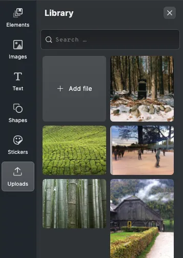

## Local Uploads[#](#local-uploads)

To quickly get going, you may want to use the `localUpload` callback, that ships with CE.SDK and allows uploading images locally. To do so, pass `local` for the `callbacks.onUpload` configuration setting:

```
callbacks: {    ...    onUpload: 'local'}
```

This enables the “Add file” button within the image library but only stores the uploaded files locally. Therefore they won’t be available when opening the same scene in a different environment or after a page reload.

## Remote Uploads[#](#remote-uploads)

To manage uploads within your application, you may provide an `onUpload` handler that processes the received `file` somewhere appropriate and returns an object describing the stored image:

```
callbacks.onUpload = file => {  // Handle the received `File` object  window.alert('Upload callback triggered!');
  // For example, upload the file to your server  const newImage = {    id: 'uniqueImageIdentifier', // A unique ID for the uploaded image    meta: {      uri: 'https://YOURSERVER/images/file.jpg', // Fully qualified URL to the image source, e.g., `http://yourdomain.com/image.png`      thumbUri: 'https://YOURSERVER/images/thumb.jpg', // Fully qualified URL to a thumbnail version of the image      // Width and height are optional, but recommended as the image will be cropped otherwise      width: 720,      height: 480,    },  };
  // Usually, return a Promise that resolves with the new image object  return Promise.resolve(newImage);};
```

Once provided, the “Add file” button will be visible to your users and they can start adding images to their creations.

---


[Source](http:/localhost:4321/js/import-media/capture-from-camera/record-video-47819b)

# Record Video

```
import CreativeEngine from 'https://cdn.img.ly/packages/imgly/cesdk-engine/1.57.0/index.js';
const config = {  license: 'mtLT-_GJwMhE7LDnO8KKEma7qSuzWuDxiKuQcxHKmz3fjaXWY2lT3o3Z2VdL5twm',  userId: 'guides-user',  baseURL: 'https://cdn.img.ly/packages/imgly/cesdk-engine/1.57.0/assets'};
CreativeEngine.init(config).then(async (engine) => {  document.getElementById('cesdk_container').append(engine.element);
  engine.scene.createVideo();  const stack = engine.block.findByType('stack')[0];  const page = engine.block.create('page');  engine.block.appendChild(stack, page);
  const pixelStreamFill = engine.block.createFill('pixelStream');  engine.block.setFill(page, pixelStreamFill);
  engine.block.appendEffect(page, engine.block.createEffect('half_tone'));
  // Horizontal mirroring  engine.block.setEnum(    pixelStreamFill,    'fill/pixelStream/orientation',    'UpMirrored'  );
  navigator.mediaDevices.getUserMedia({ video: true }).then(    (stream) => {      const video = document.createElement('video');      video.autoplay = true;      video.srcObject = stream;      video.addEventListener('loadedmetadata', () => {        engine.block.setWidth(page, video.videoWidth);        engine.block.setHeight(page, video.videoHeight);        engine.scene.zoomToBlock(page, 40, 40, 40, 40);        const onVideoFrame = () => {          engine.block.setNativePixelBuffer(pixelStreamFill, video);          video.requestVideoFrameCallback(onVideoFrame);        };        video.requestVideoFrameCallback(onVideoFrame);      });    },    (err) => {      console.error(err);    }  );});
```

```
<!DOCTYPE html><html lang="en">  <head>    <meta charset="UTF-8" />    <meta name="viewport" content="width=device-width, initial-scale=1.0" />    <meta http-equiv="X-UA-Compatible" content="ie=edge" />    <style>      body {        margin: 0;        overflow: hidden;      }      html {        overscroll-behavior-x: contain;      }    </style>  </head>
  <body>    <div id="cesdk_container" style="width: 100%; height: 100vh"></div>    <script type="module" src="index.js">    </script>  </body></html>
```

Other than having pre-recorded [video](js/create-video-c41a08/) in your scene you can also have a live preview from a camera in the engine. This allows you to make full use of the engine’s capabilities such as [effects](js/filters-and-effects-6f88ac/), [strokes](js/outlines/strokes-c2e621/) and [drop shadows](js/outlines/shadows-and-glows-6610fa/), while the preview integrates with the composition of your scene. Simply swap out the `VideoFill` of a block with a `PixelStreamFill`. This guide shows you how the `PixelStreamFill` can be used in combination with a camera.

We create a video scene with a single page. Then we create a `PixelStreamFill` and assign it to the page. To demonstrate the live preview capabilities of the engine we also apply an effect to the page.

```
import CreativeEngine from 'https://cdn.img.ly/packages/imgly/cesdk-engine/1.57.0/index.js';
const config = {  license: 'mtLT-_GJwMhE7LDnO8KKEma7qSuzWuDxiKuQcxHKmz3fjaXWY2lT3o3Z2VdL5twm',  userId: 'guides-user',  baseURL: 'https://cdn.img.ly/packages/imgly/cesdk-engine/1.57.0/assets'};
CreativeEngine.init(config).then(async (engine) => {  document.getElementById('cesdk_container').append(engine.element);
  engine.scene.createVideo();  const stack = engine.block.findByType('stack')[0];  const page = engine.block.create('page');  engine.block.appendChild(stack, page);
  const pixelStreamFill = engine.block.createFill('pixelStream');  engine.block.setFill(page, pixelStreamFill);
  engine.block.appendEffect(page, engine.block.createEffect('half_tone'));
```

## Orientation[#](#orientation)

To not waste expensive compute time by transforming the pixel data of the buffer itself, it’s often beneficial to apply a transformation during rendering and let the GPU handle this work much more efficiently. For this purpose the `PixelStreamFill` has an `orientation` property. You can use it to mirror the image or rotate it in 90° steps. This property lets you easily mirror an image from a front facing camera or rotate the image by 90° when the user holds a device sideways.

```
// Horizontal mirroringengine.block.setEnum(  pixelStreamFill,  'fill/pixelStream/orientation',  'UpMirrored');
```

## Camera[#](#camera)

We use the `MediaDevices.getUserMedia()` API to prompt the user for permission to use a media input video device. This can be a camera, video recording device, or a screen sharing service. To access frames of the `MediaStream` we create an HTML video element. Once the video meta data is available we adjust the page size to the match the video resolution and zoom the camera to include the entire page.

```
navigator.mediaDevices.getUserMedia({ video: true }).then(  (stream) => {    const video = document.createElement('video');    video.autoplay = true;    video.srcObject = stream;    video.addEventListener('loadedmetadata', () => {      engine.block.setWidth(page, video.videoWidth);      engine.block.setHeight(page, video.videoHeight);      engine.scene.zoomToBlock(page, 40, 40, 40, 40);
```

## Updating the Fill[#](#updating-the-fill)

We use the video’s `requestVideoFrameCallback` to update the contents of the `PixelStreamFill`. The callback is fired whenever a new video frame is available. We use the engine’s `setNativePixelBuffer` method to update the fill with the new video frame. This method is optimized to avoid unnecessary copies of the pixel data. The method accepts either an `HTMLVideoElement` or an `HTMLCanvasElement` as input.

```
const onVideoFrame = () => {  engine.block.setNativePixelBuffer(pixelStreamFill, video);  video.requestVideoFrameCallback(onVideoFrame);};video.requestVideoFrameCallback(onVideoFrame);
```

## Full Code[#](#full-code)

Here’s the full code:

```
import CreativeEngine from 'https://cdn.img.ly/packages/imgly/cesdk-engine/1.57.0/index.js';
const config = {  license: 'mtLT-_GJwMhE7LDnO8KKEma7qSuzWuDxiKuQcxHKmz3fjaXWY2lT3o3Z2VdL5twm',  userId: 'guides-user',  baseURL:    'https://cdn.img.ly/packages/imgly/cesdk-engine/1.57.0/assets',};
CreativeEngine.init(config).then(async engine => {  document.getElementById('cesdk_container').append(engine.element);
  engine.scene.createVideo();  const stack = engine.block.findByType('stack')[0];  const page = engine.block.create('page');  engine.block.appendChild(stack, page);
  const pixelStreamFill = engine.block.createFill('pixelStream');  engine.block.setFill(page, pixelStreamFill);
  engine.block.appendEffect(page, engine.block.createEffect('half_tone'));
  // Horizontal mirroring  engine.block.setEnum(    pixelStreamFill,    'fill/pixelStream/orientation',    'UpMirrored',  );
  navigator.mediaDevices.getUserMedia({ video: true }).then(    stream => {      const video = document.createElement('video');      video.autoplay = true;      video.srcObject = stream;      video.addEventListener('loadedmetadata', () => {        engine.block.setWidth(page, video.videoWidth);        engine.block.setHeight(page, video.videoHeight);        engine.scene.zoomToBlock(page, 40, 40, 40, 40);        const onVideoFrame = () => {          engine.block.setNativePixelBuffer(pixelStreamFill, video);          video.requestVideoFrameCallback(onVideoFrame);        };        video.requestVideoFrameCallback(onVideoFrame);      });    },    err => {      console.error(err);    },  );});
```

---


[Source](http:/localhost:4321/js/import-media/asset-panel/refresh-assets-382060)

# Refresh Assets

In this example, we explain how to use the [`assetSourceContentsChanged` API](js/import-media/concepts-5e6197/) to notify the engine that asset content has been updated after a specific action has been taken.

By default, the CreativeEditorSDK takes care of refreshing the asset library entries in most cases. For example, when uploading or deleting elements. In other cases, however, we might need to refresh the asset library on demand. An example would be a custom asset source that can be updated from outside the CreativeEditorSDK.

## API Signature[#](#api-signature)

The `assetSourceContentsChanged` API will notify the engine about the asset source update which in turn will update the asset library panel with the new items accordingly. It can be used like the following:

```
// To refetch a specific asset source, you can pass the ID of the asset source as a parametercesdk.engine.asset.assetSourceContentsChanged('ly.img.audio.upload');
```

## Prerequisites[#](#prerequisites)

*   [Get the latest stable version of **Node.js & NPM**](https://www.npmjs.com/get-npm)
*   (Optional): [Get the latest stable version of **Yarn**](https://yarnpkg.com/getting-started)

## 1\. Add the CreativeEditorSDK to Your Project[#](#1-add-the-creativeeditorsdk-to-your-project)

Terminal window

```
npm install @imgly/cesdk# oryarn add @imgly/cesdk
```

Terminal window

```
npm install @imgly/cesdk# oryarn add @imgly/cesdk
```

## 2\. Configure a custom asset source[#](#2-configure-a-custom-asset-source)

We will take Cloudinary as an example by adding a custom asset source to the configuration. Check out the [Customize The Asset Library](js/import-media/asset-panel/customize-c9a4de/) guide for detailed information about adding customizing the asset library.

```
const config = {  /* ...configuration options */  assetSources: {    'cloudinary-images': {      findAssets: () => {        /* fetch the images from Cloudinary to display in the asset panel */      },    },  },  ui: {    elements: {      libraries: {        insert: {          /* append the Cloudinary asset source to the image asset library entry */        },      },    },  },};
```

## 3\. Refresh the asset source when a new image is uploaded[#](#3-refresh-the-asset-source-when-a-new-image-is-uploaded)

Let’s consider that an image can be uploaded to Cloudinary from our application outside of the context of the CreativeEditorSDK. In this case, we can use the `assetSourceContentsChanged` API to refresh the `cloudinary-images` asset source and update the asset panel with the new items.

```
CreativeEditorSDK.create(config).then(async instance => {  await instance.createDesignScene();  // create a Cloudinary upload widget  const myWidget = cloudinary.createUploadWidget(    {      cloudName: 'my-cloud-name',    },    (error, result) => {      if (!error && result && result.event === 'success') {        // refresh the asset panel after the image has been successfully uploaded        instance.engine.asset.assetSourceContentsChanged('cloudinary-images');      }    },  );
  // attach the widget to the upload button  document.getElementById('upload_widget').addEventListener('click', () => {    myWidget.open();  });});
```

---


[Source](http:/localhost:4321/js/import-media/asset-panel/customize-c9a4de)

# Customize

```
import CreativeEditorSDK from 'https://cdn.img.ly/packages/imgly/cesdk-js/1.57.0/index.js';
const config = {  license: 'mtLT-_GJwMhE7LDnO8KKEma7qSuzWuDxiKuQcxHKmz3fjaXWY2lT3o3Z2VdL5twm',  userId: 'guides-user',  baseURL: 'https://cdn.img.ly/packages/imgly/cesdk-js/1.57.0/assets',  i18n: {    en: {      'libraries.empty-custom-asset-source.label': 'Empty'    }  },  callbacks: { onUpload: 'local' } // Enable local uploads in Asset Library.};
CreativeEditorSDK.create('#cesdk_container', config).then(async (instance) => {  // Do something with the instance of CreativeEditor SDK, for example:  // Populate the asset library with default / demo asset sources.  instance.addDefaultAssetSources();  instance.addDemoAssetSources({ sceneMode: 'Design' });
  instance.engine.asset.addSource({    id: 'emptySource',    findAssets: () => {      return Promise.resolve({        assets: [],        total: 0,        currentPage: 1,        nextPage: undefined      });    }  });
  instance.ui.addAssetLibraryEntry({    id: 'empty-custom-asset-source',    sourceIds: ['emptySource'],    previewLength: 3,    gridColumns: 3,    gridItemHeight: 'square',    previewBackgroundType: 'contain',    gridBackgroundType: 'contain',    icon: ({ theme, iconSize }) => {      if (theme === 'dark') {        if (iconSize === 'normal') {          return 'https://img.ly/static/cesdk/guides/icon-normal-dark.svg';        } else {          return 'https://img.ly/static/cesdk/guides/icon-large-dark.svg';        }      }
      if (iconSize === 'normal') {        return 'https://img.ly/static/cesdk/guides/icon-normal-light.svg';      } else {        return 'https://img.ly/static/cesdk/guides/icon-large-light.svg';      }    }  });
  instance.ui.addAssetLibraryEntry({    id: 'empty-custom-asset-source-for-replace',    sourceIds: ['emptySource'],    previewLength: 3,    gridColumns: 3,    gridItemHeight: 'square'  });
  instance.ui.addAssetLibraryEntry({    id: 'custom-images',    sourceIds: ['ly.img.image'],    previewLength: 5,    gridColumns: 5,    icon: 'https://img.ly/static/cesdk/guides/icon-normal-dark.svg'  });
  instance.ui.updateAssetLibraryEntry('ly.img.image', {    ...instance.ui.getAssetLibraryEntry('ly.img.image'),    gridColumns: 4  });
  instance.ui.setReplaceAssetLibraryEntries(    ({ defaultEntryIds, selectedBlocks }) => {      if (selectedBlocks.length !== 1) {        return [];      }      const [selectedBlock] = selectedBlocks;      if (selectedBlock.blockType === '//ly.img.ubq/graphic') {        return [...defaultEntryIds, 'empty-custom-asset-source-for-replace'];      }      return [];    }  );
  instance.ui.setDockOrder([    ...instance.ui.getDockOrder(),    {      id: 'ly.img.assetLibrary.dock',      key: 'empty-custom-asset-source',      icon: '@imgly/CustomLibrary',      label: 'libraries.empty-custom-asset-source.label',      entries: ['empty-custom-asset-source']    },    {      id: 'ly.img.assetLibrary.dock',      key: 'custom-images',      icon: '@imgly/CustomLibrary',      label: 'libraries.custom-images.label',      entries: ['custom-images']    }  ]);
  await instance.createDesignScene();});
```

```
<!DOCTYPE html><html lang="en">  <head>    <meta charset="UTF-8" />    <meta name="viewport" content="width=device-width, initial-scale=1.0" />    <meta http-equiv="X-UA-Compatible" content="ie=edge" />    <style>      body {        margin: 0;        overflow: hidden;      }      html {        overscroll-behavior-x: contain;      }    </style>  </head>
  <body>    <div id="cesdk_container" style="width: 100%; height: 100vh"></div>    <script type="module" src="index.js">    </script>  </body></html>
```

In this example, we will show you how to customize the asset library in [CreativeEditor SDK](https://img.ly/products/creative-sdk).

The asset library is used to find assets to insert them into a scene or replace a currently selected asset. By default, we have already added a configuration of entries shown in the dock panel for images, text, stickers, shapes, and more. You can add and remove every entry or change the appearance of any entry.

Every entry has a couple of configuration options to determine what and how assets will be displayed. See the documentation on the [Asset Library Entry](js/import-media/asset-panel/basics-f29078/) for more information.

```
  instance.ui.addAssetLibraryEntry({    id: 'empty-custom-asset-source',    sourceIds: ['emptySource'],    previewLength: 3,    gridColumns: 3,    gridItemHeight: 'square',    previewBackgroundType: 'contain',    gridBackgroundType: 'contain',    icon: ({ theme, iconSize }) => {      if (theme === 'dark') {        if (iconSize === 'normal') {          return 'https://img.ly/static/cesdk/guides/icon-normal-dark.svg';        } else {          return 'https://img.ly/static/cesdk/guides/icon-large-dark.svg';        }      }
      if (iconSize === 'normal') {        return 'https://img.ly/static/cesdk/guides/icon-normal-light.svg';      } else {        return 'https://img.ly/static/cesdk/guides/icon-large-light.svg';      }    }  });
  instance.ui.addAssetLibraryEntry({    id: 'empty-custom-asset-source-for-replace',    sourceIds: ['emptySource'],    previewLength: 3,    gridColumns: 3,    gridItemHeight: 'square'  });
  instance.ui.addAssetLibraryEntry({    id: 'custom-images',    sourceIds: ['ly.img.image'],    previewLength: 5,    gridColumns: 5,    icon: 'https://img.ly/static/cesdk/guides/icon-normal-dark.svg'  });
```

Adding, changing, or removing entries is done using the [Asset Library Entries API](js/import-media/asset-panel/basics-f29078/). You can for example use `cesdk.ui.updateAssetLibraryEntry` to change the number of grid columns in the images library.

```
instance.ui.updateAssetLibraryEntry('ly.img.image', {  ...instance.ui.getAssetLibraryEntry('ly.img.image'),  gridColumns: 4});
```

The basics of customizing the entries for replacement are the same as for insertion. The main difference is that these entries might vary depending on what block is currently selected and that the returned entries will determine if a replace action is shown on a selected block.

Most of the time it makes sense to provide a custom function to return different entries based on the type or fill of a block. If no replacement should be available for the current block, an empty array has to be returned. The UI will not show a replace button in that case.

As an argument to the callback, you will get the current context in the editor, mainly what blocks are selected, their block type as well as fills. This makes it more convenient to quickly decide what to return, but of course, you can also use the API for further checks as well.

```
instance.ui.setReplaceAssetLibraryEntries(  ({ defaultEntryIds, selectedBlocks }) => {    if (selectedBlocks.length !== 1) {      return [];    }    const [selectedBlock] = selectedBlocks;    if (selectedBlock.blockType === '//ly.img.ubq/graphic') {      return [...defaultEntryIds, 'empty-custom-asset-source-for-replace'];    }    return [];  });
```

If you do not use a custom `title` function for an entry, you need a translation provided with the following keys in the `i18n` configuration:

*   `libraries.<entry-id>.label` The label used in the dock panel
*   `libraries.<entry-id><group-id>.label` The label for groups for a given entry.
*   `libraries.<entry-id>.<source-id>.label` The label for a source in the source overview of a given entry
*   `libraries.<entry-id>.<source-id>.<group-id>.label` The label for a given group in the group overview for a given entry.
*   `libraries.<source-id>.label` The label used for a source in all entries
*   `libraries.<source-id><group-id>.label` The label for groups for source in all entries.

```
i18n: {  en: {    'libraries.empty-custom-asset-source.label': 'Empty'  }},
```

## Full Code[#](#full-code)

Here’s the full code:

```
import CreativeEditorSDK from 'https://cdn.img.ly/packages/imgly/cesdk-js/1.57.0/index.js';
const config = {  license: 'mtLT-_GJwMhE7LDnO8KKEma7qSuzWuDxiKuQcxHKmz3fjaXWY2lT3o3Z2VdL5twm',  userId: 'guides-user',  baseURL: 'https://cdn.img.ly/packages/imgly/cesdk-js/1.57.0/assets',  i18n: {    en: {      'libraries.empty-custom-asset-source.label': 'Empty',    },  },  callbacks: { onUpload: 'local' }, // Enable local uploads in Asset Library.};
CreativeEditorSDK.create('#cesdk_container', config).then(async instance => {  // Do something with the instance of CreativeEditor SDK, for example:  // Populate the asset library with default / demo asset sources.  instance.addDefaultAssetSources();  instance.addDemoAssetSources({ sceneMode: 'Design' });
  instance.engine.asset.addSource({    id: 'emptySource',    findAssets: () => {      return Promise.resolve({        assets: [],        total: 0,        currentPage: 1,        nextPage: undefined,      });    },  });
  instance.ui.addAssetLibraryEntry({    id: 'empty-custom-asset-source',    sourceIds: ['emptySource'],    previewLength: 3,    gridColumns: 3,    gridItemHeight: 'square',    previewBackgroundType: 'contain',    gridBackgroundType: 'contain',    icon: ({ theme, iconSize }) => {      if (theme === 'dark') {        if (iconSize === 'normal') {          return 'https://img.ly/static/cesdk/guides/icon-normal-dark.svg';        } else {          return 'https://img.ly/static/cesdk/guides/icon-large-dark.svg';        }      }
      if (iconSize === 'normal') {        return 'https://img.ly/static/cesdk/guides/icon-normal-light.svg';      } else {        return 'https://img.ly/static/cesdk/guides/icon-large-light.svg';      }    },  });
  instance.ui.addAssetLibraryEntry({    id: 'empty-custom-asset-source-for-replace',    sourceIds: ['emptySource'],    previewLength: 3,    gridColumns: 3,    gridItemHeight: 'square',  });
  instance.ui.addAssetLibraryEntry({    id: 'custom-images',    sourceIds: ['ly.img.image'],    previewLength: 5,    gridColumns: 5,    icon: 'https://img.ly/static/cesdk/guides/icon-normal-dark.svg',  });
  instance.ui.updateAssetLibraryEntry('ly.img.image', {    ...instance.ui.getAssetLibraryEntry('ly.img.image'),    gridColumns: 4,  });
  instance.ui.setReplaceAssetLibraryEntries(    ({ defaultEntryIds, selectedBlocks }) => {      if (selectedBlocks.length !== 1) {        return [];      }      const [selectedBlock] = selectedBlocks;      if (selectedBlock.blockType === '//ly.img.ubq/graphic') {        return [...defaultEntryIds, 'empty-custom-asset-source-for-replace'];      }      return [];    },  );
  instance.ui.setDockOrder([    ...instance.ui.getDockOrder(),    {      id: 'ly.img.assetLibrary.dock',      key: 'empty-custom-asset-source',      icon: '@imgly/CustomLibrary',      label: 'libraries.empty-custom-asset-source.label',      entries: ['empty-custom-asset-source'],    },    {      id: 'ly.img.assetLibrary.dock',      key: 'custom-images',      icon: '@imgly/CustomLibrary',      label: 'libraries.custom-images.label',      entries: ['custom-images'],    },  ]);
  await instance.createDesignScene();});
```

---


[Source](http:/localhost:4321/js/import-media/asset-panel/basics-f29078)

# Basics

An Asset Source is defined within the engine and can be seen as some sort of database of assets, it does not define how these assets are presented to the user. The web editor provides a versatile asset library that will display the assets in a user-friendly way inside a panel. However since an asset source does not provide any presentational information, the web editor needs to be told how to display the assets. This connection is made with an `Asset Library Entry`.

When you open the asset library, either by calling `openPanel` or adding a `ly.img.assetLibrary.dock` component to the dock, you must provide asset library entries. Only with these entries, the asset library will know what and how to display assets.

## Managing Asset Library Entries[#](#managing-asset-library-entries)

The CE.SDK web editor has an internal store of asset library entries that are referenced by asset libraries. You can find, add, remove, and update entries in this store.

```
CreativeEditorSDK.create('#cesdk', config).then(async (cesdk) => {  await cesdk.addDefaultAssetSources();  await cesdk.addDemoAssetSources();
  await cesdk.createDesignScene();
  // Find all asset library entries  const entryIds = cesdk.ui.findAllAssetLibraryEntries();  if (entryIds.includes('ly.img.image')) {    // Get the default image entry of the web editor    const entry = cesdk.ui.getAssetLibraryEntry('ly.img.image');    // ... to add a new source id.    cesdk.ui.updateAssetLibraryEntry('ly.img.image', {      sourceIds: [...entry.sourceIds, 'my.own.image.source'],    });  }
  // Add a new custom asset library entry  cesdk.ui.addAssetLibraryEntry({    id: 'my.own.image.entry',    sourceIds: ['my.own.image.source'],    sceneMode: 'Design',    previewLength: 5,    previewBackgroundType: 'cover',    gridBackgroundType: 'cover',    gridColumns: 2  });
  // Remove a default entry for stickers.  cesdk.ui.removeAssetLibraryEntry('ly.img.sticker');
```

| Method | Description |
| --- | --- |
| `findAllAssetLibraryEntries()` | Returns all available asset library entries by their id. |
| `addAssetLibraryEntry(entry)` | Adds a new asset library entry to the store. |
| `getAssetLibraryEntry(id)` | Returns the asset library entry for the given id if present and `undefined` otherwise. |
| `updateAssetLibraryEntry(id, entry)` | Updates the asset library entry for the given id with the provided entry object. It does not replace the entry but is merged with a present entry. |
| `removeAssetLibraryEntry(id)` | Removes the asset library entry for the given id. |

## Using Asset Library Entries[#](#using-asset-library-entries)

Asset library entries are used by an asset library. How the library gets the entries depends on the context. The main use case for a library is the dock. This is described in the [Dock API](js/user-interface/customization/dock-cb916c/) documentation. We will describe further use cases here.

### Replace Asset Library[#](#replace-asset-library)

The fill of a block can be replaced with another asset. What assets are applicable is different for each block. The web editor provides a function `setReplaceAssetLibraryEntries`. It gets a function that is used to define what block should be replaced with what asset. It will get the current context (most importantly the selected block) and will return ids to asset library entries that shall be used by the replace asset library.

```
cesdk.ui.setReplaceAssetLibraryEntries(context => {  const { selectedBlocks, defaultEntryIds } = context;
  // Most of the time replace makes only sense if one block is selected.  if (selectedBlocks.length !== 1) {    // If no entry ids are returned, a replace button will not be shown.    return [];  }
  // id, block and fill type are provided for the selected block.  const { id, blockType, fillType } = selectedBlocks[0];  if (fillType === '//ly.img.ubq/fill/image') {    return ['my.own.image.entry'];  }
  return [];});
```

### Background Tracks Asset Library[#](#background-tracks-asset-library)

In the video timeline, the background track allows only certain type of assets. With `setBackgroundTrackAssetLibraryEntries` you can define what asset library entries are allowed for the background track when the user clicks on the “Add to Background Track” button.

```
// Only the image and video entries are allowed for the background track.cesdk.ui.setBackgroundTrackAssetLibraryEntries([  'ly.img.image',  'ly.img.video',]);
```

## Asset Library Entry Definition[#](#asset-library-entry-definition)

### Define What to Display[#](#define-what-to-display)

The following properties tell the asset library what data should be queried and displayed.

| Property | Type | Description |
| --- | --- | --- |
| `id` | `string` | The unique id of this entry that is referenced by other APIs and passed to the asset library. |
| `sourceIds` | `string[]` | Defines what asset sources should be queried by the asset library. |
| `excludeGroups` | `string[]` | If the asset sources support groups, these will be excluded and not displayed. |
| `includeGroups` | `string[]` | If the asset sources support groups, only these will be displayed and all other groups will be ignored. |
| `sceneMode` | `'Design'` or `'Video'` or `'All'` or (context) => `'Design'` or `'Video'` or `'All'` | If set, the asset library will use this entry exclusively in the respective scene mode. |

### Define How to Display[#](#define-how-to-display)

Besides properties that define what data should be displayed, there are also properties that specify how the data should be displayed to meet specific use case requirements.

#### Preview and Grid[#](#preview-and-grid)

Some settings are for the preview and some for the grid view. If multiple asset sources or groups within a source are used, the asset library will show short sections with only a few assets shown. This is what we call the preview. The grid view is the main view where all assets are shown.

| Property | Type | Description |
| --- | --- | --- |
| `title` | `string` or `((options: { group?: string; sourceId?: string }) => string` | Use for custom translation in the overviews for a group or a source. If undefined is returned by the function it will be handled like there wasn’t a title function set at all. |
| `canAdd` | `boolean'` or `'(sourceId: string) => boolean'` | If `true` an upload button will be shown and the uploaded file will be added to the source. Please note that the asset source needs to support `addAsset` as well. |
| `canRemove` | `boolean'` or `'(sourceId: string) => boolean'` | If `true` a remove button will be shown which will remove the asset from the source. Please note that the asset source needs to support `removeAsset` as well. |
| `promptBeforeApply` | `boolean` or `{ show: boolean, sourceIds?: string[] }` | If `true` a prompt will be shown before applying the asset to the block. If an object is provided, the prompt will only be shown for the specified sources. |
| `previewLength` | `number` | Defines how many assets will be shown in a preview section of a source or group. |
| `previewBackgroundType` | `cover` or `contain` | If the thumbUri is set as a background that will be contained or covered by the card in the preview view. |
| `gridBackgroundType` | `cover` or `contain` | If the thumbUri is set as a background that will be contained or covered by the card in the grid view. |
| `gridColumns` | `number` | Number of columns in the grid view. |
| `gridItemHeight` | `auto` or `square` | The height of an item in the grid view:  
\- `auto` automatically determines height yielding a masonry-like grid view.  
\- `square` every card will have the same square size. |
| `cardBorder` | `boolean` | Draws a border around the card if set to true. |
| `cardLabel` | `(assetResult: AssetResult) => string` | Overwrites the label of a card for a specific asset result |
| `cardLabelPosition` | `(assetResult: AssetResult) => 'inside' or 'below'` | Position of the label `inside` or `below` the card. |
| `cardLabelTruncateLines` | `(assetResult: AssetResult) => 'single' or 'multi'` | Controls label truncation to occur at end of first line (`single`), or at end of second line (`multi`). |
| `cardBackground` | `CardBackground[]` | Determines what will be used as the card background from the asset and in which priorities. The first preference for which the `path` returns a value will be used to decide what and how the background will be rendered. E.g. a path of `meta.thumbUri` will look inside the asset for a value `asset.meta.thumbUri`. This non-null value will be used.  
The type of preference decides how the card will render the background.  
  
`svgVectorPath` creates a `<svg>` element with the given vector path. Adapts the color depending on the theme. `image` uses a CSS background image |
| `sortBy` | The value can be one of the following:
*   `"None" ｜"Ascending" ｜"Descending"`
*   `{ sortingOrder?: "None" ｜ "Ascending" ｜ "Descending", sortKey?: string }`
*   `{ sourceId: string, sortingOrder?: "None" ｜"Ascending" ｜"Descending", sortKey?: string }[]`

 | Controls the sorting of asset source entries inside the asset library. This can be one of three possible values:

1.  `"None" ｜"Ascending" ｜"Descending"` applies the sorting direction for all sources.
2.  An object which defines the sort order via its `sortingOrder` key and an additional `sortKey` controlling the context of the sorting. This `sortKey` can be either any key which has been saved to the [Asset Source](js/import-media/from-remote-source/unsplash-8f31f0/) or the special `id` value which uses the asset ids as a sorting context.
3.  An array which contains multiple of the above mentioned objects including a `sourceId` key defining to with asset source this configuration applies to.

 |

---


[Source](http:/localhost:4321/js/export-save-publish/export/to-pdf-95e04b)

# To PDF

```
import CreativeEngine from 'https://cdn.img.ly/packages/imgly/cesdk-engine/1.57.0/index.js';
const config = {  license: 'mtLT-_GJwMhE7LDnO8KKEma7qSuzWuDxiKuQcxHKmz3fjaXWY2lT3o3Z2VdL5twm',  userId: 'guides-user',  baseURL: 'https://cdn.img.ly/packages/imgly/cesdk-engine/1.57.0/assets'};
CreativeEngine.init(config).then(async (engine) => {  document.getElementById('cesdk_container').append(engine.element);
  const scene = engine.scene.create();
  const page = engine.block.create('page');  engine.block.setWidth(page, 800);  engine.block.setHeight(page, 600);  engine.block.appendChild(scene, page);
  engine.scene.zoomToBlock(page, 40, 40, 40, 40);
  const block = engine.block.create('graphic');  engine.block.setShape(block, engine.block.createShape('star'));  engine.block.setPositionX(block, 350);  engine.block.setPositionY(block, 400);  engine.block.setWidth(block, 100);  engine.block.setHeight(block, 100);
  const fill = engine.block.createFill('color');  engine.block.setFill(block, fill);  const rgbaBlue = { r: 0.0, g: 0.0, b: 1.0, a: 1.0 };  engine.block.setColor(fill, `fill/color/value`, rgbaBlue);
  engine.editor.setSpotColorRGB('RDG_WHITE', 0.8, 0.8, 0.8);
  await block    .export(page, {      mimeType: 'application/pdf',      exportPdfWithUnderlayer: true,      underlayerSpotColorName: 'RDG_WHITE',      underlayerOffset: -2.0    })    .then((blob) => {      const element = document.createElement('a');      element.setAttribute('href', window.URL.createObjectURL(blob));      element.setAttribute('download', 'underlayer_example.pdf');      element.style.display = 'none';      element.click();      element.remove();    });});
```

```
<!DOCTYPE html><html lang="en">  <head>    <meta charset="UTF-8" />    <meta name="viewport" content="width=device-width, initial-scale=1.0" />    <meta http-equiv="X-UA-Compatible" content="ie=edge" />    <style>      body {        margin: 0;        overflow: hidden;      }      html {        overscroll-behavior-x: contain;      }    </style>  </head>
  <body>    <div id="cesdk_container" style="width: 100%; height: 100vh"></div>    <script type="module" src="index.js">    </script>  </body></html>
```

When printing on a non-white medium or on a special medium like fabric or glass, printing your design over an underlayer helps achieve the desired result. An underlayer will typically be printed using a special ink and be of the exact shape of your design.

When exporting to PDF, you can specify that an underlayer be automatically generated in the [ExportOptions](js/export-save-publish/export/overview-9ed3a8/). An underlayer will be generated by detecting the contour of all elements on a page and inserting a new block with the shape of the detected contour. This new block will be positioned behind all existing block. After exporting, the new block will be removed. The result will be a PDF file containing an additional shape of the same shape as your design and sitting behind it.

The ink to be used by the printer is specified in the [ExportOptions](js/export-save-publish/export/overview-9ed3a8/) with a [spot color](js/colors-a9b79c/). You can also adjust the scale of the underlayer shape with a negative or positive offset, in design units.

**Warning** Do not flatten the resulting PDF file or you will lose the underlayer shape which sits behind your design.

## Setup the scene[#](#setup-the-scene)

We first create a new scene with a graphic block that has a color fill.

```
  document.getElementById('cesdk_container').append(engine.element);
  const scene = engine.scene.create();
  const page = engine.block.create('page');  engine.block.setWidth(page, 800);  engine.block.setHeight(page, 600);  engine.block.appendChild(scene, page);
  engine.scene.zoomToBlock(page, 40, 40, 40, 40);
  const block = engine.block.create('graphic');  engine.block.setShape(block, engine.block.createShape('star'));  engine.block.setPositionX(block, 350);  engine.block.setPositionY(block, 400);  engine.block.setWidth(block, 100);  engine.block.setHeight(block, 100);
  const fill = engine.block.createFill('color');  engine.block.setFill(block, fill);  const rgbaBlue = { r: 0.0, g: 0.0, b: 1.0, a: 1.0 };  engine.block.setColor(fill, `fill/color/value`, rgbaBlue);
```

## Add the underlayer’s spot color[#](#add-the-underlayers-spot-color)

Here we instantiate a spot color with the known name of the ink the printer should use for the underlayer. The visual color approximation is not so important, so long as the name matches what the printer expects.

```
engine.editor.setSpotColorRGB('RDG_WHITE', 0.8, 0.8, 0.8);
```

## Exporting with an underlayer[#](#exporting-with-an-underlayer)

We enable the automatic generation of an underlayer on export with the option `exportPdfWithUnderlayer = true`. We specify the ink to use with `underlayerSpotColorName = 'RDG_WHITE'`. In this instance, we make the underlayer a bit smaller than our design so we specify an offset of 2 design units (e.g. millimeters) with `underlayerOffset = -2.0`.

```
await block  .export(page, {    mimeType: 'application/pdf',    exportPdfWithUnderlayer: true,    underlayerSpotColorName: 'RDG_WHITE',    underlayerOffset: -2.0  })  .then((blob) => {    const element = document.createElement('a');    element.setAttribute('href', window.URL.createObjectURL(blob));    element.setAttribute('download', 'underlayer_example.pdf');    element.style.display = 'none';    element.click();    element.remove();  });
```

## Full Code[#](#full-code)

Here’s the full code:

```
import CreativeEngine from 'https://cdn.img.ly/packages/imgly/cesdk-engine/1.57.0/index.js';
const config = {  license: 'mtLT-_GJwMhE7LDnO8KKEma7qSuzWuDxiKuQcxHKmz3fjaXWY2lT3o3Z2VdL5twm',  userId: 'guides-user',  baseURL:    'https://cdn.img.ly/packages/imgly/cesdk-engine/1.57.0/assets',};
CreativeEngine.init(config).then(async engine => {  document.getElementById('cesdk_container').append(engine.element);
  const scene = engine.scene.create();
  const page = engine.block.create('page');  engine.block.setWidth(page, 800);  engine.block.setHeight(page, 600);  engine.block.appendChild(scene, page);
  engine.scene.zoomToBlock(page, 40, 40, 40, 40);
  const block = engine.block.create('graphic');  engine.block.setShape(block, engine.block.createShape('star'));  engine.block.setPositionX(block, 350);  engine.block.setPositionY(block, 400);  engine.block.setWidth(block, 100);  engine.block.setHeight(block, 100);
  const fill = engine.block.createFill('color');  engine.block.setFill(block, fill);  const rgbaBlue = { r: 0.0, g: 0.0, b: 1.0, a: 1.0 };  engine.block.setColor(fill, `fill/color/value`, rgbaBlue);
  engine.editor.setSpotColorRGB('RDG_WHITE', 0.8, 0.8, 0.8);
  await block    .export(page, {      mimeType: 'application/pdf',      exportPdfWithUnderlayer: true,      underlayerSpotColorName: 'RDG_WHITE',      underlayerOffset: -2.0,    })    .then(blob => {      const element = document.createElement('a');      element.setAttribute('href', window.URL.createObjectURL(blob));      element.setAttribute('download', 'underlayer_example.pdf');      element.style.display = 'none';      element.click();      element.remove();    });});
```

---


[Source](http:/localhost:4321/js/export-save-publish/export/size-limits-6f0695)

# Size Limits

CreativeEditor SDK (CE.SDK) supports exporting high-resolution image, video, and audio content, but there are practical limits to consider based on the user’s device capabilities.

## Image Resolution Limits[#](#image-resolution-limits)

| Constraint | Recommendation / Limit |
| --- | --- |
| **Input Resolution** | Maximum input resolution is **4096×4096 pixels**. Images from external sources (e.g., Unsplash) are resized to this size before rendering on the canvas. You can modify this value using the `maxImageSize` setting. |
| **Output Resolution** | There is no enforced output resolution limit. Theoretically, the editor supports output sizes up to **16,384×16,384 pixels**. However, practical limits depend on the device’s GPU capabilities and available memory. |

All image processing in CE.SDK is handled client-side, so these values depend on the **maximum texture size** supported by the user’s hardware. The default limit of 4096×4096 is a safe baseline that works universally. Higher resolutions (e.g., 8192×8192) may work on certain devices but could fail on others during export if the GPU texture size is exceeded.

To ensure consistent results across devices, it’s best to test higher output sizes on your target hardware and set conservative defaults in production.

## Video Resolution & Duration Limits[#](#video-resolution--duration-limits)

| Constraint | Recommendation / Limit |
| --- | --- |
| **Resolution** | Up to **4K UHD** is supported for **playback** and **export**, depending on the user’s hardware and available GPU resources. For **import**, CE.SDK does not impose artificial limits, but maximum video size is bounded by the **32-bit address space of WebAssembly (wasm32)** and the **browser tab’s memory cap (~2 GB)**. |
| **Frame Rate** | 30 FPS at 1080p is broadly supported; 60 FPS and high-res exports benefit from hardware acceleration |
| **Duration** | Stories and reels of up to **2 minutes** are fully supported. Longer videos are also supported, but we generally found a maximum duration of **10 minutes** to be a good balance for a smooth editing experience and a pleasant export duration of around one minute on modern hardware. |

Performance scales with client hardware. For best results with high-resolution or high-frame-rate video, modern CPUs/GPUs with hardware acceleration are recommended.

---


[Source](http:/localhost:4321/js/export-save-publish/export/overview-9ed3a8)

# Options

Exporting via the `block.export` endpoint allows fine-grained control of the target format. CE.SDK currently supports exporting scenes, pages, groups, or individual blocks in the MP4, PNG, TGA, JPEG, WEBP, BINARY and PDF formats. To specify the desired type, just pass in the corresponding `mimeType`. Pass additional options in a mime-type specific object.

## Static Design Export Options[#](#static-design-export-options)

| Format | MimeType | Options (Default) |
| --- | --- | --- |
| PNG | `image/png` | `pngCompressionLevel (5)` - The compression level is a trade-off between file size and encoding/decoding speed, but doesn’t affect quality. Valid values are `[0-9]` ranging from no to maximum compression. |
| JPEG | `image/jpeg` | `jpegQuality (0.9)` - Directly influences the resulting files visual quality. Smaller = worse quality, but lower file size. Valid values are `(0-1]` |
| WEBP | `image/webp` | `webpQuality (1.0)` - Controls the desired output quality. 1.0 results in a special lossless encoding that usually produces smaller file sizes than PNG. Valid values are (0-1\], higher means better quality. |
| BINARY | `application/octet-stream` | No additional options. This type returns the raw image data in RGBA8888 order in a blob. |
| PDF | `application/pdf` | `exportPdfWithHighCompatibility (true)` - Increase compatibility with different PDF viewers. Images and effects will be rasterized with regard to the scene’s DPI value instead of simply being embedded. |
| PDF | `application/pdf` | `exportPdfWithUnderlayer (false)` - An underlayer is generated by adding a graphics block behind the existing elements of the shape of the elements on the page. |
| PDF | `application/pdf` | `underlayerSpotColorName ("")` - The name of the spot color to be used for the underlayer’s fill. |
| PDF | `application/pdf` | `underlayerOffset (0.0)` - The adjustment in size of the shape of the underlayer. |

Certain formats allow additional configuration, e.g., `options.jpegQuality` controls the output quality level when exporting to JPEG. These format-specific options are ignored when exporting to other formats. You can choose which part of the scene to export by passing in the respective block as the first parameter.

For all formats, an optional `targetWidth` and `targetHeight` in pixels can be specified. If used, the block will be rendered large enough, that it fills the target size entirely while maintaining its aspect ratio. The supported export size limit can be queried with `editor.getMaxExportSize()`, the width and height should not exceed this value.

## Video Export Options[#](#video-export-options)

*   `mimeType`
*   `h264Profile`
*   `h264Level`
*   `videoBitrate`
*   `audioBitrate`
*   `timeOffset`
*   `duration`
*   `framerate`
*   `targetWidth`
*   `targetHeight`
*   `abortSignal`

## Export a Static Design[#](#export-a-static-design)

Export a design block element, e.g., a scene, a page, a group, or a single block, as a file of the given mime type.

```
export(handle: DesignBlockId, options?: ExportOptions): Promise<Blob>
```

Exports a design block element as a file of the given mime type. Performs an internal update to resolve the final layout for the blocks.

*   `handle`: The design block element to export.
*   `options`: The options for exporting the block type
*   Returns A promise that resolves with the exported image or is rejected with an error.

Export details:

*   Exporting automatically performs an internal update to resolve the final layout for all blocks.
*   Only blocks that belong to the scene hierarchy can be exported.
*   The export will include the block and all child elements in the block hierarchy.
*   If the exported block itself is rotated it will be exported without rotation.
*   If a margin is set on the block it will be included.
*   If an outside stroke is set on the block it will be included except for pages.
*   Exporting a scene with more than one page may result in transparent areas between the pages, it is recommended to export the individual pages instead.
*   Exporting as JPEG drops any transparency on the final image and may lead to unexpected results.

## Export with a Color Mask[#](#export-with-a-color-mask)

```
exportWithColorMask(handle: DesignBlockId, maskColorR: number, maskColorG: number, maskColorB: number, options?: ExportOptions): Promise<Blob[]>
```

Exports a design block element as a file of the given mime type. Performs an internal update to resolve the final layout for the blocks.

*   `handle`: The design block element to export.
*   `maskColorR`: The red component of the special color mask color.
*   `maskColorG`: The green component of the special color mask color.
*   `maskColorB`: The blue component of the special color mask color.
*   `options`: The options for exporting the block type
*   Returns A promise that resolves with an array of the exported image and mask or is rejected with an error.

Export details:

*   Removes all pixels that exactly match the given RGB color and replaces them with transparency.
*   The output includes two files: the masked image and the mask itself.

## Export a Video[#](#export-a-video)

Export a page as a video file of the given mime type.

```
exportVideo(handle: DesignBlockId, options?: VideoExportOptions): Promise<Blob>
```

Exports a design block as a video file of the given mime type. Note: The export will run across multiple iterations of the update loop. In each iteration a frame is scheduled for encoding.

*   `handle`: The design block element to export. Currently, only page blocks are supported.
*   `options`: The options for exporting the video.
*   Returns A promise that resolves with a video blob or is rejected with an error.

```
type VideoExportOptions = {  mimeType?: VideoMimeType;  onProgress?: (    numberOfRenderedFrames: number,    numberOfEncodedFrames: number,    totalNumberOfFrames: number  ) => void;  h264Profile?: number;  h264Level?: number;  videoBitrate?: number;  audioBitrate?: number;  timeOffset?: number;  duration?: number;  framerate?: number;  targetWidth?: number;  targetHeight?: number;  abortSignal?: AbortSignal;};
```

Video export details:

*   Exporting automatically performs an internal update to resolve the final layout for all blocks and waits until all pending assets have been loaded.
*   Only blocks that belong to the scene hierarchy can be exported.
*   The given block determines the size, camera position, and rotation in the same manner as the static design export.
*   The given block does not influence the time offset and duration of the video. This can be controlled using the `timeOffset` and `duration` options.
*   The video resolution is determined by the largest page width and the largest page height. This can be overridden using the `targetWidth` and `targetHeight` options.
*   When using H.264, transparency info is lost and the video will be exported with a black background.

## Export Information[#](#export-information)

Before exporting, the maximum export size and available memory can be queried.

```
getMaxExportSize(): number
```

Get the export size limit in pixels on the current device. An export is only possible when both the width and height of the output are below or equal this limit. However, this is only an upper limit as the export might also not be possible due to other reasons, e.g., memory constraints.

*   Returns The upper export size limit in pixels or an unlimited size, i.e, the maximum signed 32-bit integer value, if the limit is unknown.

```
getAvailableMemory(): number
```

Get the currently available memory in bytes.

*   Returns The currently available memory in bytes.

## Exporting via the Export button[#](#exporting-via-the-export-button)

When a user triggers an export by clicking the corresponding button, the editor will export the current page to a PDF or PNG image and notify the `onExport` callback if configured. The callback handler receives the encoded data as a `Blob` object along with the `options` used during export.

Besides the `onExport` callback, you have to enable the export button in the navigation bar. See the configuration of elements for further information.

## Full Code[#](#full-code)

Here’s the full code:

```
import CreativeEngine from 'https://cdn.img.ly/packages/imgly/cesdk-engine/1.57.0/index.js';
const config = {  license: 'mtLT-_GJwMhE7LDnO8KKEma7qSuzWuDxiKuQcxHKmz3fjaXWY2lT3o3Z2VdL5twm',  userId: 'guides-user',  baseURL:    'https://cdn.img.ly/packages/imgly/cesdk-engine/1.57.0/assets',};
const exportButton = document.getElementById('export_button');
const scene = engine.scene.get();const page = engine.scene.getCurrentPage();
const sceneBlob = await engine.block.export(scene, {  mimeType: 'application/pdf',});
const pageBlob = await engine.block.export(page, { mimeType: 'image/png' });
const [image, mask] = await engine.block.exportWithColorMask(  page,  0.5,  0.5,  0.5,  {    mimeType: 'image/png',  },);
if (groupable) {  const group = engine.block.group([member1, member2]);  const groupBlob = await engine.block.export(group, { mimeType: 'image/png' });}
const blockBlob = await engine.block.export(block, {  /**   * The mime type of the output file.   *   * Supported values are:   * - `image/png`   * - `image/jpeg`   * - `image/webp`   * - `image/x-tga`   * - `application/octet-stream`   * - `application/pdf`   */  mimeType: 'image/jpeg',  /**   * The JPEG quality to use when encoding to JPEG.   *   * Valid values are (0-1], higher means better quality.   * Ignored for other encodings.   *   * @defaultValue 0.9   */  jpegQuality: 0.9,  /**   * The PNG compression level to use, when exporting to PNG.   *   * Valid values are 0 to 9, higher means smaller, but slower.   * Quality is not affected.   * Ignored for other encodings.   * @defaultValue 5.   */  pngCompressionLevel: 5,  /**   * An optional target width used in conjunction with target height.   * If used, the block will be rendered large enough, that it fills the target   * size entirely while maintaining its aspect ratio.   */  targetWidth: null,  /**   * An optional target height used in conjunction with target width.   * If used, the block will be rendered large enough, that it fills the target   * size entirely while maintaining its aspect ratio.   */  targetHeight: null,});
// Video Exportconst videoOptions = {  /**   * The mime type of the output file.   *   * Supported values are:   * - `video/mp4`   * - `video/quicktime`   */  mimeType: 'video/mp4',  /**   * A callback which reports on the progress of the export.   * It informs the receiver of the current frame index, which   * currently gets exported and the total frame count.   */  onProgress: (renderedFrames, encodedFrames, totalFrames) => {    console.log(      'Rendered',      renderedFrames,      'frames and encoded',      encodedFrames,      'frames out of',      totalFrames,    );  },  /**   * Determines the encoder feature set and in turn the quality, size and speed of the encoding process.   *   * @defaultValue 77 (Main)   */  h264Profile: 77,  /**   * Controls the H.264 encoding level. This relates to parameters used by the encoder such as bit rate,   * timings and motion vectors. Defined by the spec are levels 1.0 up to 6.2. To arrive at an integer value,   * the level is multiplied by ten. E.g. to get level 5.2, pass a value of 52.   *   * @defaultValue 52   */  h264Level: 52,  /**   * The video bitrate in bits per second. The maximum bitrate is determined by h264Profile and h264Level.   * If the value is 0, the bitrate is automatically determined by the engine.   */  videoBitrate: 0,  /**   * The audio bitrate in bits per second. If the value is 0, the bitrate is automatically determined by the engine (128kbps for stereo AAC stream).   */  audioBitrate: 0,  /**   * The time offset in seconds of the scene's timeline from which the video will start.   *   * @defaultValue 0   */  timeOffset: 0,  /**   * The duration in seconds of the final video.   *   * @defaultValue The duration of the given page.   */  duration: 10,  /**   * The target framerate of the exported video in Hz.   *   * @defaultValue 30   */  framerate: 30,  /**   * An optional target width used in conjunction with target height.   * If used, the block will be rendered large enough, that it fills the target   * size entirely while maintaining its aspect ratio.   */  targetWidth: 1280,  /**   * An optional target height used in conjunction with target width.   * If used, the block will be rendered large enough, that it fills the target   * size entirely while maintaining its aspect ratio.   */  targetHeight: 720,};const videoBlob = await engine.block.exportVideo(  page,  videoOptions,);
const maxExportSizeInPixels = engine.editor.getMaxExportSize();
const availableMemoryInBytes = engine.editor.getAvailableMemory();
CreativeEngine.init(config).then(async engine => {  document.getElementById('cesdk_container').append(engine.element);
  await engine.addDefaultAssetSources();  await engine.scene.loadFromURL(    'https://cdn.img.ly/assets/demo/v1/ly.img.template/templates/cesdk_postcard_1.scene',  );  exportButton.removeAttribute('disabled');
  exportButton.onclick = async () => {    /* Export scene as PNG image. */    const scene = engine.scene.get();    /* Optionally, the maximum supported export size can be checked before exporting. */    const maxExportSizeInPixels = engine.editor.getMaxExportSize();    /* Optionally, the compression level and the target size can be specified. */    const options = {      mimeType: 'image/png',      pngCompressionLevel: 9,      targetWidth: null,      targetHeight: null,    };    const blob = await engine.block.export(scene, options);
    /* Download blob. */    const anchor = document.createElement('a');    anchor.href = URL.createObjectURL(blob);    anchor.download = 'export.png';    anchor.click();  };});
```

---


[Source](http:/localhost:4321/js/edit-image/transform/crop-f67a47)

# Crop Images in JavaScript

```
engine.block.supportsCrop(image);engine.block.setCropScaleX(image, 2.0);engine.block.setCropScaleY(image, 1.5);engine.block.setCropScaleRatio(image, 3.0);engine.block.setCropRotation(image, Math.PI);engine.block.setCropTranslationX(image, -1.0);engine.block.setCropTranslationY(image, 1.0);engine.block.adjustCropToFillFrame(image, 1.0);engine.block.setContentFillMode(image, 'Contain');engine.block.resetCrop(image);engine.block.getCropScaleX(image);engine.block.getCropScaleY(image);engine.block.getCropScaleRatio(image);engine.block.getCropRotation(image);engine.block.getCropTranslationX(image);engine.block.getCropTranslationY(image);engine.block.flipCropHorizontal(image);engine.block.flipCropVertical(image);engine.block.supportsContentFillMode(image);engine.block.getContentFillMode(image);
```

In this example, we will show you how to use the [CreativeEditor SDK](https://img.ly/products/creative-sdk)’s CreativeEngine to modify a blocks crop through the `block` API.

## Common Properties[#](#common-properties)

Common properties are properties that occur on multiple block types. For instance, fill color properties are available for all the shape blocks and the text block. That’s why we built convenient setter and getter functions for these properties. So you don’t have to use the generic setters and getters and don’t have to provide a specific property path. There are also `has*` functions to query if a block supports a set of common properties.

### Crop[#](#crop)

Manipulate the cropping region of a block by setting its scale, rotation, and translation.

```
supportsCrop(id: DesignBlockId): boolean
```

Query if the given block has crop properties.

*   `id`: The block to query.
*   Returns true, if the block has crop properties.

```
setCropScaleX(id: DesignBlockId, scaleX: number): void
```

Set the crop scale in x direction of the given design block. Required scope: ‘layer/crop’

*   `id`: The block whose crop should be set.
*   `scaleX`: The scale in x direction.

```
setCropScaleY(id: DesignBlockId, scaleY: number): void
```

Set the crop scale in y direction of the given design block. Required scope: ‘layer/crop’

*   `id`: The block whose crop should be set.
*   `scaleY`: The scale in y direction.

```
setCropScaleRatio(id: DesignBlockId, scaleRatio: number): void
```

Set the crop scale ratio of the given design block. This will uniformly scale the content up or down. The center of the scale operation is the center of the crop frame. Required scope: ‘layer/crop’

*   `id`: The block whose crop should be set.
*   `scaleRatio`: The crop scale ratio.

```
setCropRotation(id: DesignBlockId, rotation: number): void
```

Set the crop rotation of the given design block. Required scope: ‘layer/crop’

*   `id`: The block whose crop should be set.
*   `rotation`: The rotation in radians.

```
setCropTranslationX(id: DesignBlockId, translationX: number): void
```

Set the crop translation in x direction of the given design block. Required scope: ‘layer/crop’

*   `id`: The block whose crop should be set.
*   `translationX`: The translation in x direction.

```
setCropTranslationY(id: DesignBlockId, translationY: number): void
```

Set the crop translation in y direction of the given design block. Required scope: ‘layer/crop’

*   `id`: The block whose crop should be set.
*   `translationY`: The translation in y direction.

```
adjustCropToFillFrame(id: DesignBlockId, minScaleRatio: number): number
```

Adjust the crop position/scale to at least fill the crop frame.

*   `id`: The block whose crop scale ratio should be queried.
*   `minScaleRatio`: The minimal crop scale ratio to go down to.

```
setContentFillMode(id: DesignBlockId, mode: ContentFillMode): void
```

Set a block’s content fill mode. Required scope: ‘layer/crop’

*   `id`: The block to update.
*   `mode`: The content fill mode mode: crop, cover or contain.

```
resetCrop(id: DesignBlockId): void
```

Resets the manually set crop of the given design block. The block’s content fill mode is set to ‘cover’. If the block has a fill, the crop values are updated so that it covers the block. Required scope: ‘layer/crop’

*   `id`: The block whose crop should be reset.

```
getCropScaleX(id: DesignBlockId): number
```

Get the crop scale on the x axis of the given design block.

*   `id`: The block whose scale should be queried.
*   Returns The scale on the x axis.

```
getCropScaleY(id: DesignBlockId): number
```

Get the crop scale on the y axis of the given design block.

*   `id`: The block whose scale should be queried.
*   Returns The scale on the y axis.

```
flipCropHorizontal(id: DesignBlockId): void
```

Adjusts the crop in order to flip the content along its own horizontal axis.

*   `block`: The block whose crop should be updated.

```
flipCropVertical(id: DesignBlockId): void
```

Adjusts the crop in order to flip the content along its own vertical axis.

*   `block`: The block whose crop should be updated.

```
getCropScaleRatio(id: DesignBlockId): number
```

Get the crop scale ratio of the given design block.

*   `id`: The block whose crop scale ratio should be queried.
*   Returns The crop scale ratio.

```
getCropRotation(id: DesignBlockId): number
```

Get the crop rotation of the given design block.

*   `id`: The block whose crop rotation should be queried.
*   Returns The crop rotation.

```
getCropTranslationX(id: DesignBlockId): number
```

Get the crop translation on the x axis of the given design block.

*   `id`: The block whose translation should be queried.
*   Returns The translation on the x axis.

```
getCropTranslationY(id: DesignBlockId): number
```

Get the crop translation on the y axis of the given design block.

*   `id`: The block whose translation should be queried.
*   Returns The translation on the y axis.

```
supportsContentFillMode(id: DesignBlockId): boolean
```

Query if the given block has a content fill mode.

*   `id`: The block to query.
*   Returns true, if the block has a content fill mode.

```
getContentFillMode(id: DesignBlockId): ContentFillMode
```

Query a block’s content fill mode.

*   `id`: The block to query.
*   Returns The current mode: crop, cover or contain.

## Full Code[#](#full-code)

Here’s the full code:

```
engine.block.supportsCrop(image);engine.block.setCropScaleX(image, 2.0);engine.block.setCropScaleY(image, 1.5);engine.block.setCropScaleRatio(image, 3.0);engine.block.setCropRotation(image, Math.PI);engine.block.setCropTranslationX(image, -1.0);engine.block.setCropTranslationY(image, 1.0);engine.block.adjustCropToFillFrame(image, 1.0);engine.block.setContentFillMode(image, 'Contain');engine.block.resetCrop(image);engine.block.getCropScaleX(image);engine.block.getCropScaleY(image);engine.block.getCropScaleRatio(image);engine.block.getCropRotation(image);engine.block.getCropTranslationX(image);engine.block.getCropTranslationY(image);engine.block.flipCropHorizontal(image);engine.block.flipCropVertical(image);engine.block.supportsContentFillMode(image);engine.block.getContentFillMode(image);
```

---


[Source](http:/localhost:4321/js/create-video/audio/buffers-9c565b)

# Buffers

```
// Create an audio block and append it to the pageconst audioBlock = engine.block.create('audio');engine.block.appendChild(page, audioBlock);
// Create a bufferconst audioBuffer = engine.editor.createBuffer();
// Reference the audio buffer resource from the audio blockengine.block.setString(audioBlock, 'audio/fileURI', audioBuffer);
// Generate 10 seconds of stereo 48 kHz audio dataconst samples = new Float32Array(10 * 2 * 48000);for (let i = 0; i < samples.length; i += 2) {  samples[i] = samples[i + 1] = Math.sin((440 * i * Math.PI) / 48000);}
// Assign the audio data to the bufferengine.editor.setBufferData(audioBuffer, 0, new Uint8Array(samples.buffer));
// We can get subranges of the buffer dataconst chunk = engine.editor.getBufferData(audioBuffer, 0, 4096);
// Get current length of the buffer in bytesconst length = engine.editor.getBufferLength(audioBuffer);
// Reduce the buffer to half its length, leading to 5 seconds worth of audioengine.editor.setBufferLength(audioBuffer, length / 2);
// Free dataengine.editor.destroyBuffer(audioBuffer);
```

In this example, we will show you how to use the [CreativeEditor SDK](https://img.ly/products/creative-sdk)’s CreativeEngine to create buffers through the `editor` API. Buffers can hold arbitrary data.

**Limitations**

Buffers are intended for temporary data only.

*   Buffer data is not part of the [scene serialization](js/concepts/scenes-e8596d/)
*   Changes to buffers can’t be undone using the [history system](js/concepts/undo-and-history-99479d/)

```
createBuffer(): string
```

Create a resizable buffer that can hold arbitrary data.

*   Returns A URI to identify the buffer.

```
destroyBuffer(uri: string): void
```

Destroy a buffer and free its resources.

*   `uri`: The URI of the buffer to destroy.

```
setBufferData(uri: string, offset: number, data: Uint8Array): void
```

Set the data of a buffer at a given offset.

*   `uri`: The URI of the buffer to update.
*   `offset`: The offset in bytes at which to start writing.
*   `data`: The data to write.

```
getBufferData(uri: string, offset: number, length: number): Uint8Array
```

Get the data of a buffer at a given offset.

*   `uri`: The URI of the buffer to query.
*   `offset`: The offset in bytes at which to start reading.
*   `length`: The number of bytes to read.
*   Returns The data at the given offset.

```
setBufferLength(uri: string, length: number): void
```

Set the length of a buffer.

*   `uri`: The URI of the buffer to update.
*   `length`: The new length of the buffer in bytes.

```
getBufferLength(uri: string): number
```

Get the length of a buffer.

*   `uri`: The URI of the buffer to query.
*   Returns The length of the buffer in bytes.

## Full Code[#](#full-code)

Here’s the full code:

```
// Create an audio block and append it to the pageconst audioBlock = engine.block.create('audio');engine.block.appendChild(page, audioBlock);
// Create a bufferconst audioBuffer = engine.editor.createBuffer();
// Reference the audio buffer resource from the audio blockengine.block.setString(audioBlock, 'audio/fileURI', audioBuffer);
// Generate 10 seconds of stereo 48 kHz audio dataconst samples = new Float32Array(10 * 2 * 48000);for (let i = 0; i < samples.length; i += 2) {  samples[i] = samples[i + 1] = Math.sin((440 * i * Math.PI) / 48000);}
// Assign the audio data to the bufferengine.editor.setBufferData(audioBuffer, 0, new Uint8Array(samples.buffer));
// We can get subranges of the buffer dataconst chunk = engine.editor.getBufferData(audioBuffer, 0, 4096);
// Get current length of the buffer in bytesconst length = engine.editor.getBufferLength(audioBuffer);
// Reduce the buffer to half its length, leading to 5 seconds worth of audioengine.editor.setBufferLength(audioBuffer, length / 2);
// Free dataengine.editor.destroyBuffer(audioBuffer);
```

---


[Source](http:/localhost:4321/js/create-templates/add-dynamic-content/text-variables-7ecb50)

# Text Variables

CreativeEngine

```
let config = {  baseURL: 'https://cdn.img.ly/packages/imgly/cesdk-js/1.57.0/assets',};
CreativeEngine.init(config).then(engine => {  const variableNames = engine.variable.findAll();  variableNames.forEach(name => {    engine.variable.remove(name);  });  engine.variable.setString('my_custom_variable', 'IMG.LY');  const name = engine.variable.getString('my_custom_variable');
  const block = engine.block.create('graphic');  engine.block.referencesAnyVariables(block);});
```

CreativeEditorSDK

```
let config = {  baseURL: 'https://cdn.img.ly/packages/imgly/cesdk-js/1.57.0/assets',  i18n: {    en: {      'variables.my_custom_variable.label': 'My Variable',    },  },};
CreativeEditorSDK.create('#cesdk_container', config).then(cesdk => {  const variableNames = cesdk.engine.variable.findAll();  variableNames.forEach(name => {    cesdk.engine.variable.remove(name);  });  cesdk.engine.variable.setString('my_custom_variable', 'IMG.LY');  const name = cesdk.engine.variable.getString('my_custom_variable');  cesdk.createDesignScene();});
```

In this example, we will show you how to use the [CreativeEditor SDK](https://img.ly/products/creative-sdk)’s CreativeEngine to modify variables through the `variable` API. The `variable` API lets you set or get the contents of variables that exist in your scene.

## Functions[#](#functions)

```
findAll(): string[]
```

Get all text variables currently stored in the engine.

*   Returns Return a list of variable names

```
setString(key: string, value: string): void
```

Set a text variable.

*   `key`: The variable’s key.
*   `value`: The text to replace the variable with.

```
getString(key: string): string
```

Set a text variable.

*   `key`: The variable’s key.
*   Returns The text value of the variable.

```
remove(key: string): void
```

Destroy a text variable.

*   `key`: The variable’s key.

```
referencesAnyVariables(id: DesignBlockId): boolean
```

Checks whether the given block references any variables. Doesn’t check the block’s children.

*   `id`: The block to inspect.
*   Returns true if the block references variables and false otherwise.

## Localizing Variable Keys (CE.SDK only)[#](#localizing-variable-keys-cesdk-only)

You can show localized labels for the registered variables to your users by adding a corresponding label property to the object stored at `i18n.<language>.variables.<key>.label` in the configuration. Otherwise, the name used in `variable.setString()` will be shown.

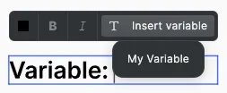

## Full Code[#](#full-code)

Here’s the full code:

```
let config = {  baseURL: 'https://cdn.img.ly/packages/imgly/cesdk-js/1.57.0/assets',};
CreativeEngine.init(config).then(engine => {  const variableNames = engine.variable.findAll();  variableNames.forEach(name => {    engine.variable.remove(name);  });  engine.variable.setString('my_custom_variable', 'IMG.LY');  const name = engine.variable.getString('my_custom_variable');
  const block = engine.block.create('graphic');  engine.block.referencesAnyVariables(block);});
```

---


[Source](http:/localhost:4321/js/create-templates/add-dynamic-content/placeholders-d9ba8a)

# Placeholders

A unique feature of the `Creator` role is that it allows the user to define various Placeholders for every element which contain Constraints that can be individually set. Such constraints only apply to users with non-creator roles and define in which way such users are allowed to interact with this element.

For example, in the following image, an element has been defined as a Placeholder and the constraints have been set accordingly so that other users can only change its contents. The element is now selectable by default but cannot be deleted, styled or duplicated by users outside the role of `Creator`.

## Defining Placeholders and setting Constraints[#](#defining-placeholders-and-setting-constraints)

Placeholders can be defined by users with the `Creator` role from the element itself…

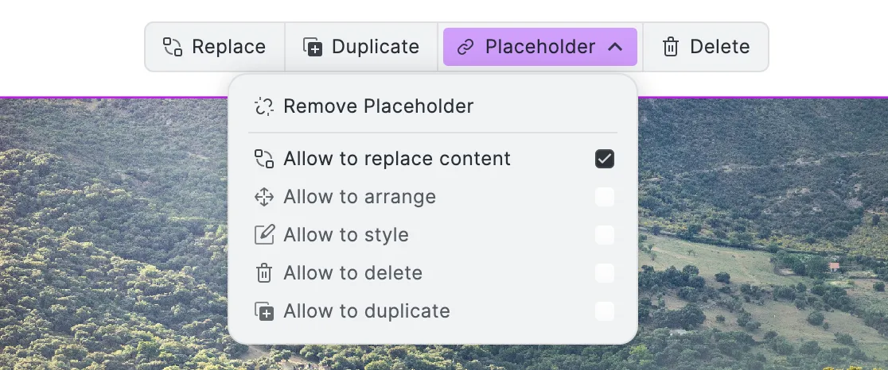

…or from the Inspector.  

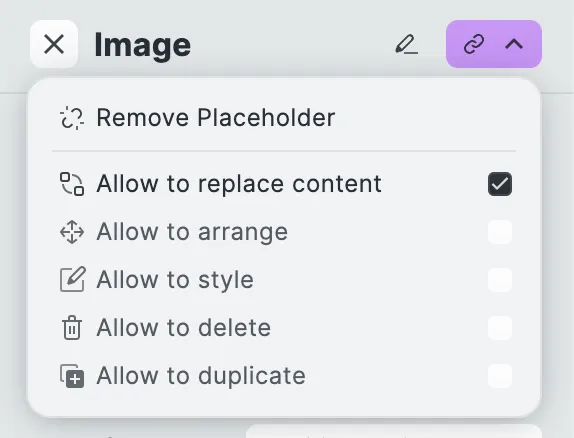

Constraints can then be set by opening the Placeholder menu. Additionally, Placeholders may also be removed from said menu, which means they are reverted back to regular non-editable elements.

By default, elements that were not defined as Placeholders by a `Creator` cannot be selected and modified by a non-creator user.

## Identifying elements defined as Placeholders as a non-creator user[#](#identifying-elements-defined-as-placeholders-as-a-non-creator-user)

Users outside the role of `Creator` may interact with elements defined as Placeholders. To identify all of these elements users may click on the canvas to shortly highlight them.

```
// Check if block supports placeholder behaviorif (engine.block.supportsPlaceholderBehavior(block)) {  // Enable the placeholder behavior  engine.block.setPlaceholderBehaviorEnabled(block, true);  const placeholderBehaviorIsEnabled =    engine.block.isPlaceholderBehaviorEnabled(block);}// Enable the placeholder capabilities (interaction in Adopter mode)engine.block.setPlaceholderEnabled(block, true);const placeholderIsEnabled = engine.block.isPlaceholderEnabled(block);
// Check if block supports placeholder controlsif (engine.block.supportsPlaceholderControls(block)) {  // Enable the visibility of the placeholder overlay pattern  engine.block.setPlaceholderControlsOverlayEnabled(block, true);  const overlayEnabled =    engine.block.isPlaceholderControlsOverlayEnabled(block);
  // Enable the visibility of the placeholder button  engine.block.setPlaceholderControlsButtonEnabled(block, true);  const buttonEnabled = engine.block.isPlaceholderControlsButtonEnabled(block);}
```

## Placeholder Behavior and Controls[#](#placeholder-behavior-and-controls)

```
supportsPlaceholderBehavior(id: DesignBlockId): boolean
```

Checks whether the block supports placeholder behavior.

*   `block`: The block to query.
*   Returns True, if the block supports placeholder behavior.

```
setPlaceholderBehaviorEnabled(id: DesignBlockId, enabled: boolean): void
```

Enable or disable the placeholder behavior for a block.

*   `id`: The block whose placeholder behavior should be enabled or disabled.
*   `enabled`: Whether the placeholder behavior should be enabled or disabled.

```
isPlaceholderBehaviorEnabled(id: DesignBlockId): boolean
```

Query whether the placeholder behavior for a block is enabled.

*   `id`: The block whose placeholder behavior state should be queried.
*   Returns the enabled state of the placeholder behavior.

```
setPlaceholderEnabled(id: DesignBlockId, enabled: boolean): void
```

Enable or disable the placeholder function for a block.

*   `id`: The block whose placeholder function should be enabled or disabled.
*   `enabled`: Whether the function should be enabled or disabled.

```
isPlaceholderEnabled(id: DesignBlockId): boolean
```

Query whether the placeholder function for a block is enabled.

*   `id`: The block whose placeholder function state should be queried.
*   Returns the enabled state of the placeholder function.

```
supportsPlaceholderControls(id: DesignBlockId): boolean
```

Checks whether the block supports placeholder controls.

*   `block`: The block to query.
*   Returns True, if the block supports placeholder controls.

```
setPlaceholderControlsOverlayEnabled(id: DesignBlockId, enabled: boolean): void
```

Enable or disable the visibility of the placeholder overlay pattern for a block.

*   `block`: The block whose placeholder overlay should be enabled or disabled.
*   `enabled`: Whether the placeholder overlay should be shown or not.
*   Returns An empty result on success, an error otherwise.

```
isPlaceholderControlsOverlayEnabled(id: DesignBlockId): boolean
```

Query whether the placeholder overlay pattern for a block is shown.

*   `block`: The block whose placeholder overlay visibility state should be queried.
*   Returns An error if the block was invalid, otherwise the visibility state of the block’s placeholder overlay pattern.

```
setPlaceholderControlsButtonEnabled(id: DesignBlockId, enabled: boolean): void
```

Enable or disable the visibility of the placeholder button for a block.

*   `block`: The block whose placeholder button should be shown or not.
*   `enabled`: Whether the placeholder button should be shown or not.
*   Returns An empty result on success, an error otherwise.

```
isPlaceholderControlsButtonEnabled(id: DesignBlockId): boolean
```

Query whether the placeholder button for a block is shown.

*   `block`: The block whose placeholder button visibility state should be queried.
*   Returns An error if the block was invalid, otherwise

## Full Code[#](#full-code)

Here’s the full code:

```
// Check if block supports placeholder behaviorif (engine.block.supportsPlaceholderBehavior(block)) {  // Enable the placeholder behavior  engine.block.setPlaceholderBehaviorEnabled(block, true);  const placeholderBehaviorIsEnabled =    engine.block.isPlaceholderBehaviorEnabled(block);}// Enable the placeholder capabilities (interaction in Adopter mode)engine.block.setPlaceholderEnabled(block, true);const placeholderIsEnabled = engine.block.isPlaceholderEnabled(block);
// Check if block supports placeholder controlsif (engine.block.supportsPlaceholderControls(block)) {  // Enable the visibility of the placeholder overlay pattern  engine.block.setPlaceholderControlsOverlayEnabled(block, true);  const overlayEnabled =    engine.block.isPlaceholderControlsOverlayEnabled(block);
  // Enable the visibility of the placeholder button  engine.block.setPlaceholderControlsButtonEnabled(block, true);  const buttonEnabled = engine.block.isPlaceholderControlsButtonEnabled(block);}
```

---


[Source](http:/localhost:4321/js/colors/for-print/spot-c3a150)

# Spot Colors

```
// Create a spot color with an RGB color approximation.engine.editor.setSpotColorRGB('Red', 1.0, 0.0, 0.0);
// Create a spot color with a CMYK color approximation.// Add a CMYK approximation to the already defined 'Red' spot color.engine.editor.setSpotColorCMYK('Yellow', 0.0, 0.0, 1.0, 0.0);engine.editor.setSpotColorCMYK('Red', 0.0, 1.0, 1.0, 0.0);
// List all defined spot colors.engine.editor.findAllSpotColors(); // ['Red', 'Yellow']
// Retrieve the RGB color approximation for a defined color.// The alpha value will always be 1.0.const rgbaSpotRed = engine.editor.getSpotColorRGBA('Red');
// Retrieve the CMYK color approximation for a defined color.const cmykSpotRed = engine.editor.getSpotColorCMYK('Red');
// Retrieving the approximation of an undefined spot color returns magenta.const cmykSpotUnknown = engine.editor.getSpotColorCMYK('Unknown'); // Returns CMYK values for magenta.
// Removes a spot color from the list of defined spot colors.engine.editor.removeSpotColor('Red');
```

In this example, we will show you how to use the [CreativeEditor SDK](https://img.ly/creative-sdk)’s CreativeEngine to manage spot colors in the `editor` API.

## Functions[#](#functions)

```
findAllSpotColors(): string[]
```

Queries the names of currently set spot colors previously set with `setSpotColorRGB`.

*   Returns The names of set spot colors.

```
getSpotColorRGBA(name: string): RGBA
```

Queries the RGB representation set for a spot color. If the value of the queried spot color has not been set yet, returns the default RGB representation (of magenta). The alpha value is always 1.0.

*   `name`: The name of a spot color.
*   Returns A result holding a float array of the four color components.

```
getSpotColorCMYK(name: string): CMYK
```

Queries the CMYK representation set for a spot color. If the value of the queried spot color has not been set yet, returns the default CMYK representation (of magenta).

*   `name`: The name of a spot color.
*   Returns A result holding a float array of the four color components.

```
setSpotColorRGB(name: string, r: number, g: number, b: number): void
```

Sets the RGB representation of a spot color. Use this function to both create a new spot color or update an existing spot color.

*   `name`: The name of a spot color.
*   `r`: The red color component in the range of 0 to 1.
*   `g`: The green color component in the range of 0 to 1.
*   `b`: The blue color component in the range of 0 to 1.

```
setSpotColorCMYK(name: string, c: number, m: number, y: number, k: number): void
```

Sets the CMYK representation of a spot color. Use this function to both create a new spot color or update an existing spot color.

*   `name`: The name of a spot color.
*   `c`: The cyan color component in the range of 0 to 1.
*   `m`: The magenta color component in the range of 0 to 1.
*   `y`: The yellow color component in the range of 0 to 1.
*   `k`: The key color component in the range of 0 to 1.

```
removeSpotColor(name: string): void
```

Removes a spot color from the list of set spot colors.

*   `name`: The name of a spot color.
*   Returns An empty result on success, an error otherwise.

## Full Code[#](#full-code)

Here’s the full code:

```
// Create a spot color with an RGB color approximation.engine.editor.setSpotColorRGB('Red', 1.0, 0.0, 0.0);
// Create a spot color with a CMYK color approximation.// Add a CMYK approximation to the already defined 'Red' spot color.engine.editor.setSpotColorCMYK('Yellow', 0.0, 0.0, 1.0, 0.0);engine.editor.setSpotColorCMYK('Red', 0.0, 1.0, 1.0, 0.0);
// List all defined spot colors.engine.editor.findAllSpotColors(); // ['Red', 'Yellow']
// Retrieve the RGB color approximation for a defined color.// The alpha value will always be 1.0.const rgbaSpotRed = engine.editor.getSpotColorRGBA('Red');
// Retrieve the CMYK color approximation for a defined color.const cmykSpotRed = engine.editor.getSpotColorCMYK('Red');
// Retrieving the approximation of an undefined spot color returns magenta.const cmykSpotUnknown = engine.editor.getSpotColorCMYK('Unknown'); // Returns CMYK values for magenta.
// Removes a spot color from the list of defined spot colors.engine.editor.removeSpotColor('Red');
```

---


[Source](http:/localhost:4321/js/animation/create/text-d6f4aa)

# Text Animations

When applied to text blocks, some animations allow you to control whether the animation should be applied to the entire text at once, line by line, word by word or character by character.

We can use the `setEnum(id: number, value: number): void` API in order to change the text writing style. Call `engine.block.getEnumValues('textAnimationWritingStyle')` in order to get a list of currently supported text writing style options. The default writing style is `Line`.

In this example, we set the easing to `Word` so that the text animates in one word at a time.

```
const text = engine.block.create('text');const textAnimation = engine.block.createAnimation('baseline');engine.block.setInAnimation(text, textAnimation);engine.block.appendChild(page, text);engine.block.setPositionX(text, 100);engine.block.setPositionY(text, 100);engine.block.setWidthMode(text, 'Auto');engine.block.setHeightMode(text, 'Auto');engine.block.replaceText(  text,  'You can animate text\nline by line,\nword by word,\nor character by character\nwith CE.SDK',);engine.block.setEnum(textAnimation, 'textAnimationWritingStyle', 'Word');engine.block.setDuration(textAnimation, 2.0);engine.block.setEnum(textAnimation, 'animationEasing', 'EaseOut');
```

Together with the writing style, you can also configure the overlap between the individual segments of a text animation using the `textAnimationOverlap` property.

With an overlap value of `0`, the next segment only starts its animation once the previous segment’s animation has finished. With an overlap value of `1`, all segments animate at the same time.

```
const text2 = engine.block.create('text');const textAnimation2 = engine.block.createAnimation('pan');engine.block.setInAnimation(text2, textAnimation2);engine.block.appendChild(page, text2);engine.block.setPositionX(text2, 100);engine.block.setPositionY(text2, 500);engine.block.setWidth(text2, 500);engine.block.setHeightMode(text2, 'Auto');engine.block.replaceText(  text2,  'You can use the textAnimationOverlap property to control the overlap between text animation segments.',);engine.block.setFloat(textAnimation2, 'textAnimationOverlap', 0.4);engine.block.setDuration(textAnimation2, 1.0);engine.block.setEnum(textAnimation2, 'animationEasing', 'EaseOut');
```

## Full Code[#](#full-code)

Here’s the full code:

```
import CreativeEngine from 'https://cdn.img.ly/packages/imgly/cesdk-engine/1.57.0/index.js';
const config = {  license: 'mtLT-_GJwMhE7LDnO8KKEma7qSuzWuDxiKuQcxHKmz3fjaXWY2lT3o3Z2VdL5twm',  userId: 'guides-user',  baseURL:    'https://cdn.img.ly/packages/imgly/cesdk-engine/1.57.0/assets',};
CreativeEngine.init(config).then(async engine => {  document.getElementById('cesdk_container').append(engine.element);
  const scene = engine.scene.createVideo();  const page = engine.block.create('page');  engine.block.setWidth(page, 1920);  engine.block.setHeight(page, 1080);  engine.block.appendChild(scene, page);
  const text = engine.block.create('text');  const textAnimation = engine.block.createAnimation('baseline');  engine.block.setInAnimation(text, textAnimation);  engine.block.appendChild(page, text);  engine.block.setPositionX(text, 100);  engine.block.setPositionY(text, 100);  engine.block.setWidthMode(text, 'Auto');  engine.block.setHeightMode(text, 'Auto');  engine.block.replaceText(    text,    'You can animate text\nline by line,\nword by word,\nor character by character\nwith CE.SDK',  );  engine.block.setEnum(textAnimation, 'textAnimationWritingStyle', 'Word');  engine.block.setDuration(textAnimation, 2.0);  engine.block.setEnum(textAnimation, 'animationEasing', 'EaseOut');
  const text2 = engine.block.create('text');  const textAnimation2 = engine.block.createAnimation('pan');  engine.block.setInAnimation(text2, textAnimation2);  engine.block.appendChild(page, text2);  engine.block.setPositionX(text2, 100);  engine.block.setPositionY(text2, 500);  engine.block.setWidth(text2, 500);  engine.block.setHeightMode(text2, 'Auto');  engine.block.replaceText(    text2,    'You can use the textAnimationOverlap property to control the overlap between text animation segments.',  );  engine.block.setFloat(textAnimation2, 'textAnimationOverlap', 0.4);  engine.block.setDuration(textAnimation2, 1.0);  engine.block.setEnum(textAnimation2, 'animationEasing', 'EaseOut');
  engine.block.setPlaying(page, true);  engine.block.setLooping(page, true);});
```

---


[Source](http:/localhost:4321/js/animation/create/base-0fc5c4)

# Base Animations

```
import CreativeEngine from 'https://cdn.img.ly/packages/imgly/cesdk-engine/1.57.0/index.js';
const config = {  license: 'mtLT-_GJwMhE7LDnO8KKEma7qSuzWuDxiKuQcxHKmz3fjaXWY2lT3o3Z2VdL5twm',  userId: 'guides-user',  baseURL: 'https://cdn.img.ly/packages/imgly/cesdk-engine/1.33.0/assets'};
CreativeEngine.init(config).then(async (engine) => {  document.getElementById('cesdk_container').append(engine.element);
  const scene = engine.scene.createVideo();  const page = engine.block.create('page');  engine.block.setWidth(page, 1920);  engine.block.setHeight(page, 1080);  engine.block.appendChild(scene, page);
  engine.editor.setSettingColor('clearColor', { r: 0.2, g: 0.2, b: 0.2, a: 1 });
  const graphic = engine.block.create('graphic');  const imageFill = engine.block.createFill('image');  engine.block.setString(    imageFill,    'fill/image/imageFileURI',    'https://cdn.img.ly/assets/v4/ly.img.sticker/images/emoticons/imgly_sticker_emoticons_star.svg'  );  engine.block.setFill(graphic, imageFill);  engine.block.setShape(graphic, engine.block.createShape('rect'));  engine.block.setWidth(graphic, 500);  engine.block.setHeight(graphic, 500);  engine.block.setPositionX(graphic, (1920 - 500) / 2);  engine.block.setPositionY(graphic, (1080 - 500) / 2);  engine.block.appendChild(page, graphic);
  engine.scene.zoomToBlock(page, 60, 60, 60, 60);
  if (!engine.block.supportsAnimation(graphic)) {    return;  }
  const slideInAnimation = engine.block.createAnimation('slide');  const breathingLoopAnimation = engine.block.createAnimation('breathing_loop');  const fadeOutAnimation = engine.block.createAnimation('fade');  engine.block.setInAnimation(graphic, slideInAnimation);  engine.block.setLoopAnimation(graphic, breathingLoopAnimation);  engine.block.setOutAnimation(graphic, fadeOutAnimation);  const animation = engine.block.getLoopAnimation(graphic);  const animationType = engine.block.getType(animation);
  const squeezeLoopAnimation = engine.block.createAnimation('squeeze_loop');  engine.block.destroy(engine.block.getLoopAnimation(graphic));  engine.block.setLoopAnimation(graphic, squeezeLoopAnimation);  /* The following line would also destroy all currently attached animations */  // engine.block.destroy(graphic);
  const allAnimationProperties = engine.block.findAllProperties(slideInAnimation);  engine.block.setFloat(slideInAnimation, 'animation/slide/direction', 0.5 * Math.PI);  engine.block.setDuration(slideInAnimation, 0.6);  engine.block.setEnum(slideInAnimation, 'animationEasing', 'EaseOut');  console.log("Available easing options:", engine.block.getEnumValues('animationEasing'));
  const text = engine.block.create('text');  const textAnimation = engine.block.createAnimation('baseline');  engine.block.setInAnimation(text, textAnimation);  engine.block.appendChild(page, text);  engine.block.setPositionX(text, 100);  engine.block.setPositionY(text, 100);  engine.block.setWidthMode(text, 'Auto');  engine.block.setHeightMode(text, 'Auto');  engine.block.replaceText(text, "You can animate text\nline by line,\nword by word,\nor character by character\nwith CE.SDK");  engine.block.setEnum(textAnimation, 'textAnimationWritingStyle', 'Word');  engine.block.setDuration(textAnimation, 2.0);  engine.block.setEnum(textAnimation, 'animationEasing', 'EaseOut');
  const text2 = engine.block.create('text');  const textAnimation2 = engine.block.createAnimation('pan');  engine.block.setInAnimation(text2, textAnimation2);  engine.block.appendChild(page, text2);  engine.block.setPositionX(text2, 100);  engine.block.setPositionY(text2, 500);  engine.block.setWidth(text2, 500);  engine.block.setHeightMode(text2, 'Auto');  engine.block.replaceText(text2, "You can use the textAnimationOverlap property to control the overlap between text animation segments.");  engine.block.setFloat(textAnimation2, 'textAnimationOverlap', 0.4);  engine.block.setDuration(textAnimation2, 1.0);  engine.block.setEnum(textAnimation2, 'animationEasing', 'EaseOut');
  engine.block.setPlaying(page, true);  engine.block.setLooping(page, true);});
```

```
<!DOCTYPE html><html lang="en">  <head>    <meta charset="UTF-8" />    <meta name="viewport" content="width=device-width, initial-scale=1.0" />    <meta http-equiv="X-UA-Compatible" content="ie=edge" />    <style>      body {        margin: 0;        overflow: hidden;      }      html {        overscroll-behavior-x: contain;      }    </style>  </head>
  <body>    <div id="cesdk_container" style="width: 100%; height: 100vh"></div>    <script type="module" src="index.js">    </script>  </body></html>
```

CreativeEditor SDK supports many different types of configurable animations for animating the appearance of design blocks in video scenes.

Similarly to blocks, each animation object has a numeric id which can be used to query and [modify its properties](js/concepts/blocks-90241e/).

## Accessing Animation APIs[#](#accessing-animation-apis)

In order to query whether a block supports animations, you should call the `supportsAnimation(id: number): boolean` API.

```
if (!engine.block.supportsAnimation(graphic)) {  return;}
```

```
const slideInAnimation = engine.block.createAnimation('slide');const breathingLoopAnimation = engine.block.createAnimation('breathing_loop');const fadeOutAnimation = engine.block.createAnimation('fade');
```

## Assigning Animations[#](#assigning-animations)

In order to assign an _In_ animation to the block, call the `setInAnimation(id: number, animation: number): void` API.

```
engine.block.setInAnimation(graphic, slideInAnimation);
```

In order to assign a _Loop_ animation to the block, call the `setLoopAnimation(id: number, animation: number): void` API.

```
engine.block.setLoopAnimation(graphic, breathingLoopAnimation);
```

In order to assign an _Out_ animation to the block, call the `setOutAnimation(id: number, animation: number): void` API.

```
engine.block.setOutAnimation(graphic, fadeOutAnimation);
```

To query the current animation ids of a design block, call the `getInAnimation(id: number): number`, `getLoopAnimation(id: number): number` or `getOutAnimation(id: number): number` API. You can now pass this id into other APIs in order to query more information about the animation, e.g. its type via the `getType(id: number): string` API.

```
const animation = engine.block.getLoopAnimation(graphic);const animationType = engine.block.getType(animation);
```

When replacing the animation of a design block, remember to destroy the previous animation object if you don’t intend to use it any further. Animation objects that are not attached to a design block will never be automatically destroyed.

Destroying a design block will also destroy all of its attached animations.

```
const squeezeLoopAnimation = engine.block.createAnimation('squeeze_loop');engine.block.destroy(engine.block.getLoopAnimation(graphic));engine.block.setLoopAnimation(graphic, squeezeLoopAnimation);/* The following line would also destroy all currently attached animations */// engine.block.destroy(graphic);
```

## Animation Properties[#](#animation-properties)

Just like design blocks, animations with different types have different properties that you can query and modify via the API. Use `findAllProperties(id: number): string[]` in order to get a list of all properties of a given animation.

For the slide animation in this example, the call would return `['name', 'animation/slide/direction', 'animationEasing', 'includedInExport', 'playback/duration', 'type', 'uuid']`.

Please refer to the [API docs](js/animation/types-4e5f41/) for a complete list of all available properties for each type of animation.

```
const allAnimationProperties = engine.block.findAllProperties(slideInAnimation);
```

Once we know the property keys of an animation, we can use the same APIs as for design blocks in order to modify those properties. For example, we can use `setFloat(id: number, property: string, value: number): void` in order to change the direction of the slide animation to make our block slide in from the top.

```
engine.block.setFloat(slideInAnimation, 'animation/slide/direction', 0.5 * Math.PI);
```

All animations have a duration. For _In_ and _Out_ animations, the duration defines the total length of the animation as described above. For _Loop_ animations, the duration defines the length of each loop cycle.

We can use the `setDuration(id: number, value: number): void` API in order to change the animation duration.

Note that changing the duration of an _In_ animation will automatically adjust the duration of the _Out_ animation (and vice versa) in order to avoid overlaps between the two animations.

```
engine.block.setDuration(slideInAnimation, 0.6);
```

Some animations allow you to configure their easing behavior by choosing from a list of common easing curves. The easing controls the acceleration throughout the animation.

We can use the `setEnum(id: number, value: number): void` API in order to change the easing curve. Call `engine.block.getEnumValues('animationEasing')` in order to get a list of currently supported easing options.

In this example, we set the easing to `EaseOut` so that the animation starts fast and then slows down towards the end. An `EaseIn` easing would start slow and then speed up, while `EaseInOut` starts slow, speeds up towards the middle of the animation and then slows down towards the end again.

```
engine.block.setEnum(slideInAnimation, 'animationEasing', 'EaseOut');console.log("Available easing options:", engine.block.getEnumValues('animationEasing'));
```

## Full Code[#](#full-code)

Here’s the full code:

```
import CreativeEngine from 'https://cdn.img.ly/packages/imgly/cesdk-engine/1.57.0/index.js';
const config = {  license: 'mtLT-_GJwMhE7LDnO8KKEma7qSuzWuDxiKuQcxHKmz3fjaXWY2lT3o3Z2VdL5twm',  userId: 'guides-user',  baseURL: 'https://cdn.img.ly/packages/imgly/cesdk-engine/1.57.0/assets'};
CreativeEngine.init(config).then(async (engine) => {  document.getElementById('cesdk_container').append(engine.element);
  const scene = engine.scene.createVideo();  const page = engine.block.create('page');  engine.block.setWidth(page, 1920);  engine.block.setHeight(page, 1080);  engine.block.appendChild(scene, page);
  engine.editor.setSettingColor('clearColor', { r: 0.2, g: 0.2, b: 0.2, a: 1 });
  const graphic = engine.block.create('graphic');  const imageFill = engine.block.createFill('image');  engine.block.setString(    imageFill,    'fill/image/imageFileURI',    'https://cdn.img.ly/assets/v4/ly.img.sticker/images/emoticons/imgly_sticker_emoticons_star.svg'  );  engine.block.setFill(graphic, imageFill);  engine.block.setShape(graphic, engine.block.createShape('rect'));  engine.block.setWidth(graphic, 500);  engine.block.setHeight(graphic, 500);  engine.block.setPositionX(graphic, (1920 - 500) / 2);  engine.block.setPositionY(graphic, (1080 - 500) / 2);  engine.block.appendChild(page, graphic);
  engine.scene.zoomToBlock(page, 60, 60, 60, 60);
  if (!engine.block.supportsAnimation(graphic)) {    return;  }
  const slideInAnimation = engine.block.createAnimation('slide');  const breathingLoopAnimation = engine.block.createAnimation('breathing_loop');  const fadeOutAnimation = engine.block.createAnimation('fade');  engine.block.setInAnimation(graphic, slideInAnimation);  engine.block.setLoopAnimation(graphic, breathingLoopAnimation);  engine.block.setOutAnimation(graphic, fadeOutAnimation);  const animation = engine.block.getLoopAnimation(graphic);  const animationType = engine.block.getType(animation);
  const squeezeLoopAnimation = engine.block.createAnimation('squeeze_loop');  engine.block.destroy(engine.block.getLoopAnimation(graphic));  engine.block.setLoopAnimation(graphic, squeezeLoopAnimation);  /* The following line would also destroy all currently attached animations */  // engine.block.destroy(graphic);
  const allAnimationProperties =    engine.block.findAllProperties(slideInAnimation);  engine.block.setFloat(    slideInAnimation,    'animation/slide/direction',    0.5 * Math.PI  );  engine.block.setDuration(slideInAnimation, 0.6);  engine.block.setEnum(slideInAnimation, 'animationEasing', 'EaseOut');  console.log(    'Available easing options:',    engine.block.getEnumValues('animationEasing')  );
  engine.block.setPlaying(page, true);  engine.block.setLooping(page, true);});
```

---


[Source](http:/localhost:4321/js/api/engine/variables/mimetype)

# Variable: MimeType

```
const MimeType: object;
```

Represents the MIME types used in the editor.

## Type declaration[#](#type-declaration)

| Name | Type | Default value |
| --- | --- | --- |
| `Png` | `"image/png"` | `'image/png'` |
| `Jpeg` | `"image/jpeg"` | `'image/jpeg'` |
| `WebP` | `"image/webp"` | `'image/webp'` |
| `Tga` | `"image/x-tga"` | `'image/x-tga'` |
| `Wav` | `"audio/wav"` | `'audio/wav'` |
| `Mp4` | `"video/mp4"` | `'video/mp4'` |
| `QuickTime` | `"video/quicktime"` | `'video/quicktime'` |
| `Binary` | `"application/octet-stream"` | `'application/octet-stream'` |
| `Pdf` | `"application/pdf"` | `'application/pdf'` |
| `Zip` | `"application/zip"` | `'application/zip'` |

## Deprecated[#](#deprecated)

Use the `MimeType` string literal types instead.

---


[Source](http:/localhost:4321/js/api/engine/variables/loglevel)

# Variable: LogLevel

```
LogLevel: object;
```

Provides a set of predefined log levels for the Creative Editor SDK.

The `LogLevel` object contains constants representing different severity levels for logging messages. These levels can be used to categorize log messages based on their importance and urgency.

## Type declaration[#](#type-declaration)

| Name | Type | Default value |
| --- | --- | --- |
| `Info` | `"Info"` | `'Info'` |
| `Warning` | `"Warning"` | `'Warning'` |
| `Error` | `"Error"` | `'Error'` |

## Deprecated[#](#deprecated)

Specifying log levels via `LogLevel.Info` has been deprecated. Please use the desired LogLevel string directly.

---


[Source](http:/localhost:4321/js/api/engine/functions/supportswasm)

# Function: supportsWasm

```
function supportsWasm(): boolean;
```

Checks if the current browser supports web assembly

## Returns[#](#returns)

`boolean`

---


[Source](http:/localhost:4321/js/api/engine/functions/supportsvideoexport)

# Function: supportsVideoExport

```
function supportsVideoExport(): Promise<boolean>;
```

Checks if the current browser supports video exporting.

## Returns[#](#returns)

`Promise`<`boolean`\>

---


[Source](http:/localhost:4321/js/api/engine/functions/supportsvideo)

# Function: supportsVideo

```
function supportsVideo(): boolean;
```

Checks if the current browser supports video editing.

## Returns[#](#returns)

`boolean`

false if the browser does not support the required APIs.

---


[Source](http:/localhost:4321/js/api/engine/functions/supportsbrowser)

# Function: supportsBrowser

```
function supportsBrowser(): boolean;
```

Checks if the current browser supports necessary technologies to match our supported browsers

## Returns[#](#returns)

`boolean`

---


[Source](http:/localhost:4321/js/api/engine/functions/isspotcolor)

# Function: isSpotColor

```
function isSpotColor(color): color is SpotColor;
```

Type guard for [SpotColor](http://localhost:4321/js/api/engine/interfaces/spotcolor/).

## Parameters[#](#parameters)

| Parameter | Type |
| --- | --- |
| `color` | [`Color`](http://localhost:4321/js/api/engine/type-aliases/color/) |

## Returns[#](#returns)

`color is SpotColor`

---


[Source](http:/localhost:4321/js/api/engine/functions/isrgbacolor)

# Function: isRGBAColor

```
function isRGBAColor(color): color is RGBAColor;
```

Type guard for [RGBAColor](http://localhost:4321/js/api/engine/interfaces/rgbacolor/).

## Parameters[#](#parameters)

| Parameter | Type |
| --- | --- |
| `color` | [`Color`](http://localhost:4321/js/api/engine/type-aliases/color/) |

## Returns[#](#returns)

`color is RGBAColor`

---


[Source](http:/localhost:4321/js/api/engine/functions/iscmykcolor)

# Function: isCMYKColor

```
function isCMYKColor(color): color is CMYKColor;
```

Type guard for [CMYKColor](http://localhost:4321/js/api/engine/interfaces/cmykcolor/).

## Parameters[#](#parameters)

| Parameter | Type |
| --- | --- |
| `color` | [`Color`](http://localhost:4321/js/api/engine/type-aliases/color/) |

## Returns[#](#returns)

`color is CMYKColor`

---


[Source](http:/localhost:4321/js/api/engine/functions/defaultlogger)

# Function: defaultLogger

```
function defaultLogger(message, level?): void;
```

## Parameters[#](#parameters)

| Parameter | Type |
| --- | --- |
| `message` | `string` |
| `level?` | [`LogLevel`](http://localhost:4321/js/api/engine/type-aliases/loglevel/) |

## Returns[#](#returns)

`void`

---


[Source](http:/localhost:4321/js/api/engine/functions/checkvideosupport)

# Function: checkVideoSupport

```
function checkVideoSupport(): void;
```

Throws an error if the current browser does not support video editing.

## Returns[#](#returns)

`void`

---


[Source](http:/localhost:4321/js/api/engine/functions/checkvideoexportsupport)

# Function: checkVideoExportSupport

```
function checkVideoExportSupport(): Promise<void>;
```

Throws an error if the current browser does not support video exporting.

## Returns[#](#returns)

`Promise`<`void`\>

---


[Source](http:/localhost:4321/js/api/engine/classes/variableapi)

# Class: VariableAPI

Manage text variables within design templates.

Text variables enable dynamic content replacement in design templates. Variables are stored as key-value pairs and can be referenced in text blocks for automated content updates.

```
// Configure a text block that displays 'Hello, World'const block = cesdk.engine.block.create('text');cesdk.engine.block.setText(block, 'Hello, {{name}}!');cesdk.engine.variable.setString('name', 'World');
```

## Variable Management[#](#variable-management)

Create, update, retrieve, and remove text variables from the engine.

### findAll()[#](#findall)

  

Get all text variable names currently stored in the engine.

#### Returns[#](#returns)

`string`\[\]

List of variable names.

#### Signature[#](#signature)

```
findAll(): string[]
```

* * *

### setString()[#](#setstring)

  

Set a text variable’s value.

Creates a new variable if the key doesn’t exist, or updates an existing one.

#### Parameters[#](#parameters)

| Parameter | Type | Description |
| --- | --- | --- |
| `key` | `string` | The variable’s key. |
| `value` | `string` | The text value to assign to the variable. |

#### Returns[#](#returns-1)

`void`

#### Signature[#](#signature-1)

```
setString(key: string, value: string): void
```

* * *

### getString()[#](#getstring)

  

Get a text variable’s value.

#### Parameters[#](#parameters-1)

| Parameter | Type | Description |
| --- | --- | --- |
| `key` | `string` | The variable’s key. |

#### Returns[#](#returns-2)

`string`

The text value of the variable.

#### Signature[#](#signature-2)

```
getString(key: string): string
```

* * *

### remove()[#](#remove)

  

Remove a text variable from the engine.

#### Parameters[#](#parameters-2)

| Parameter | Type | Description |
| --- | --- | --- |
| `key` | `string` | The variable’s key to remove. |

#### Returns[#](#returns-3)

`void`

#### Signature[#](#signature-3)

```
remove(key: string): void
```

---


[Source](http:/localhost:4321/js/api/engine/classes/sceneapi)

# Class: SceneAPI

Create, load, save, and manipulate scenes.

Scenes are the root element of every design hierarchy. Their children, stacks of pages, individual pages or other blocks, define the content of the design. Scenes can be created from scratch, loaded from a file or URL, or created from an image or video. After manipulation, they can be saved to a string or an archive. This allows further processing in another editor instance, automated processing in scripts or sharing with other users.

## Scene Creation[#](#scene-creation)

Create new scenes from scratch or from media files.

### create()[#](#create)

  

Create a new design scene, along with its own camera.

```
const scene = engine.scene.create(layout);
```

#### Parameters[#](#parameters)

| Parameter | Type | Default value | Description |
| --- | --- | --- | --- |
| `sceneLayout` | [`SceneLayout`](http://localhost:4321/js/api/engine/type-aliases/scenelayout/) | `'Free'` | The layout of the scene. |
| `options?` | [`CreateSceneOptions`](http://localhost:4321/js/api/engine/type-aliases/createsceneoptions/) | `undefined` | Optional parameters for the scene. Properties: - `page` - Page options. Properties: - `size` - The size of the page. - `color` - Optional background color of the page. |

#### Returns[#](#returns)

`number`

The scene’s handle.

#### Signature[#](#signature)

```
create(sceneLayout?: SceneLayout, options?: CreateSceneOptions): number
```

* * *

### createVideo()[#](#createvideo)

  

Create a new scene in video mode, along with its own camera.

```
const scene = engine.scene.createVideo();
```

#### Parameters[#](#parameters-1)

| Parameter | Type | Description |
| --- | --- | --- |
| `options?` | [`CreateSceneOptions`](http://localhost:4321/js/api/engine/type-aliases/createsceneoptions/) | Optional parameters for the scene. Properties: - `page` - Page options. Properties: - `size` - The size of the page. - `color` - Optional background color of the page. |

#### Returns[#](#returns-1)

`number`

The scene’s handle.

#### Signature[#](#signature-1)

```
createVideo(options?: CreateSceneOptions): number
```

* * *

### createFromImage()[#](#createfromimage)

  

Loads the given image and creates a scene with a single page showing the image.

Fetching the image may take an arbitrary amount of time, so the scene isn’t immediately available.

```
const scene = await engine.scene.createFromImage('https://img.ly/static/ubq_samples/sample_4.jpg');
```

#### Parameters[#](#parameters-2)

| Parameter | Type | Default value | Description |
| --- | --- | --- | --- |
| `url` | `string` | `undefined` | The image URL. |
| `dpi` | `number` | `300` | The scene’s DPI. |
| `pixelScaleFactor` | `number` | `1` | The display’s pixel scale factor. |
| `sceneLayout` | [`SceneLayout`](http://localhost:4321/js/api/engine/type-aliases/scenelayout/) | `'Free'` | \- |
| `spacing` | `number` | `0` | \- |
| `spacingInScreenSpace` | `boolean` | `false` | \- |

#### Returns[#](#returns-2)

`Promise`<`number`\>

A promise that resolves with the scene ID on success or rejected with an error otherwise.

#### Signature[#](#signature-2)

```
createFromImage(url: string, dpi?: number, pixelScaleFactor?: number, sceneLayout?: SceneLayout, spacing?: number, spacingInScreenSpace?: boolean): Promise<number>
```

* * *

### createFromVideo()[#](#createfromvideo)

  

Loads the given video and creates a scene with a single page showing the video.

Fetching the video may take an arbitrary amount of time, so the scene isn’t immediately available.

```
const scene = await engine.scene.createFromVideo('https://img.ly/static/ubq_video_samples/bbb.mp4');
```

#### Parameters[#](#parameters-3)

| Parameter | Type | Description |
| --- | --- | --- |
| `url` | `string` | The video URL. |

#### Returns[#](#returns-3)

`Promise`<`number`\>

A promise that resolves with the scene ID on success or rejected with an error otherwise.

#### Signature[#](#signature-3)

```
createFromVideo(url: string): Promise<number>
```

## Scene Loading[#](#scene-loading)

Load scenes from various sources including strings, URLs, and archives.

### loadFromString()[#](#loadfromstring)

  

Load the contents of a scene file.

The string must be the binary contents of a scene file and is directly imported as blocks. Any existing scene is replaced by the new one. This is useful for loading scenes that were saved with `saveToString` or scenes that were created in another editor instance.

```
const sceneContent = await creativeEngine.scene.saveToString();creativeEngine.scene.loadFromString(sceneContent);
```

#### Parameters[#](#parameters-4)

| Parameter | Type | Description |
| --- | --- | --- |
| `sceneContent` | `string` | The scene file contents, a base64 string. |

#### Returns[#](#returns-4)

`Promise`<`number`\>

A handle to the loaded scene.

#### Signature[#](#signature-4)

```
loadFromString(sceneContent: string): Promise<number>
```

* * *

### loadFromURL()[#](#loadfromurl)

  

Load a scene from the URL to the scene file.

The scene file will be fetched asynchronously by the engine and loaded into the engine once it is available. Any existing scene is replaced by the new one.

```
const sceneURL = 'https://example.com/my-scene.json';creativeEngine.scene.loadFromURL(sceneURL);
```

#### Parameters[#](#parameters-5)

| Parameter | Type | Description |
| --- | --- | --- |
| `url` | `string` | The URL of the scene file. |

#### Returns[#](#returns-5)

`Promise`<`number`\>

scene A promise that resolves once the scene was loaded or rejects with an error otherwise.

#### Signature[#](#signature-5)

```
loadFromURL(url: string): Promise<number>
```

* * *

### loadFromArchiveURL()[#](#loadfromarchiveurl)

  

Load a previously archived scene from the URL to the scene file.

The scene file will be fetched asynchronously by the engine. This requires continuous `render` calls on this engines instance.

#### Parameters[#](#parameters-6)

| Parameter | Type | Description |
| --- | --- | --- |
| `url` | `string` | The URL of the scene file. |

#### Returns[#](#returns-6)

`Promise`<`number`\>

scene A promise that resolves once the scene was loaded or rejects with an error otherwise.

#### Signature[#](#signature-6)

```
loadFromArchiveURL(url: string): Promise<number>
```

## Scene Saving[#](#scene-saving)

Save and export scenes to different formats.

### saveToString()[#](#savetostring)

  

Serializes the current scene into a string. Selection is discarded.

#### Parameters[#](#parameters-7)

| Parameter | Type |
| --- | --- |
| `allowedResourceSchemes` | `string`\[\] |

#### Returns[#](#returns-7)

`Promise`<`string`\>

A promise that resolves with a string on success or an error on failure.

#### Signature[#](#signature-7)

```
saveToString(allowedResourceSchemes?: string[]): Promise<string>
```

* * *

### saveToArchive()[#](#savetoarchive)

  

Saves the current scene and all of its referenced assets into an archive.

The archive contains all assets, that were accessible when this function was called. Blocks in the archived scene reference assets relative from to the location of the scene file. These references are resolved when loading such a scene via `loadSceneFromURL`.

#### Returns[#](#returns-8)

`Promise`<`Blob`\>

A promise that resolves with a Blob on success or an error on failure.

#### Signature[#](#signature-8)

```
saveToArchive(): Promise<Blob>
```

## Page Management[#](#page-management)

Manage pages within scenes and find elements.

### getPages()[#](#getpages)

  

Get the sorted list of pages in the scene.

```
const pages = engine.scene.getPages();
```

#### Returns[#](#returns-9)

`number`\[\]

The sorted list of pages in the scene.

#### Signature[#](#signature-9)

```
getPages(): number[]
```

* * *

### getCurrentPage()[#](#getcurrentpage)

  

Get the current page, i.e., the page of the first selected element if this page is at least 25% visible or, otherwise, the page nearest to the viewport center.

```
const currentPage = engine.scene.getCurrentPage();
```

#### Returns[#](#returns-10)

`null` | `number`

The current page in the scene or null.

#### Signature[#](#signature-10)

```
getCurrentPage(): null | number
```

* * *

### findNearestToViewPortCenterByType()[#](#findnearesttoviewportcenterbytype)

  

Find all blocks with the given type sorted by the distance to viewport center.

```
// Use longhand block type ID to find nearest pages.let nearestPageByType = engine.scene.findNearestToViewPortCenterByType('//ly.img.ubq/page')[0];// Or use shorthand block type ID.nearestPageByType = engine.scene.findNearestToViewPortCenterByType('page')[0];
```

#### Parameters[#](#parameters-8)

| Parameter | Type | Description |
| --- | --- | --- |
| `type` | [`DesignBlockType`](http://localhost:4321/js/api/engine/type-aliases/designblocktype/) | The type to search for. |

#### Returns[#](#returns-11)

`number`\[\]

A list of block ids sorted by distance to viewport center.

#### Signature[#](#signature-11)

```
findNearestToViewPortCenterByType(type: DesignBlockType): number[]
```

* * *

### findNearestToViewPortCenterByKind()[#](#findnearesttoviewportcenterbykind)

  

Find all blocks with the given kind sorted by the distance to viewport center.

```
let nearestImageByKind = engine.scene.findNearestToViewPortCenterByKind('image')[0];
```

#### Parameters[#](#parameters-9)

| Parameter | Type | Description |
| --- | --- | --- |
| `kind` | `string` | The kind to search for. |

#### Returns[#](#returns-12)

`number`\[\]

A list of block ids sorted by distance to viewport center.

#### Signature[#](#signature-12)

```
findNearestToViewPortCenterByKind(kind: string): number[]
```

## Event Subscriptions[#](#event-subscriptions)

Subscribe to scene-related events and changes.

### onZoomLevelChanged()[#](#onzoomlevelchanged)

  

Subscribe to changes to the zoom level.

```
const unsubscribeZoomLevelChanged = engine.scene.onZoomLevelChanged(() => {  const zoomLevel = engine.scene.getZoomLevel();  console.log('Zoom level is now: ', zoomLevel);});
```

#### Parameters[#](#parameters-10)

| Parameter | Type | Description |
| --- | --- | --- |
| `callback` | () => `void` | This function is called at the end of the engine update, if the zoom level has changed. |

#### Returns[#](#returns-13)

A method to unsubscribe.

```
(): void;
```

##### Returns[#](#returns-14)

`void`

#### Signature[#](#signature-13)

```
onZoomLevelChanged(callback: () => void): () => void
```

* * *

### onActiveChanged()[#](#onactivechanged)

  

Subscribe to changes to the active scene rendered by the engine.

```
const unsubscribe = engine.scene.onActiveChanged(() => {  const newActiveScene = engine.scene.get();});
```

#### Parameters[#](#parameters-11)

| Parameter | Type | Description |
| --- | --- | --- |
| `callback` | () => `void` | This function is called at the end of the engine update, if the active scene has changed. |

#### Returns[#](#returns-15)

A method to unsubscribe.

```
(): void;
```

##### Returns[#](#returns-16)

`void`

#### Signature[#](#signature-14)

```
onActiveChanged(callback: () => void): () => void
```

## Scene Properties[#](#scene-properties)

Get and set scene properties like design units and mode.

### get()[#](#get)

  

Return the currently active scene.

```
const scene = engine.scene.get();
```

#### Returns[#](#returns-17)

`null` | `number`

The scene or null, if none was created yet.

#### Signature[#](#signature-15)

```
get(): null | number
```

* * *

### getMode()[#](#getmode)

  

Get the current scene mode.

```
const mode = scene.getMode();
```

#### Returns[#](#returns-18)

[`SceneMode`](http://localhost:4321/js/api/engine/type-aliases/scenemode/)

The current mode of the scene.

#### Signature[#](#signature-16)

```
getMode(): SceneMode
```

* * *

### setDesignUnit()[#](#setdesignunit)

  

Converts all values of the current scene into the given design unit.

```
engine.scene.setDesignUnit('Pixel');
```

#### Parameters[#](#parameters-12)

| Parameter | Type | Description |
| --- | --- | --- |
| `designUnit` | [`DesignUnit`](http://localhost:4321/js/api/engine/type-aliases/designunit/) | The new design unit of the scene |

#### Returns[#](#returns-19)

`void`

#### Signature[#](#signature-17)

```
setDesignUnit(designUnit: DesignUnit): void
```

* * *

### getDesignUnit()[#](#getdesignunit)

  

Returns the design unit of the current scene.

```
engine.scene.getDesignUnit();
```

#### Returns[#](#returns-20)

[`DesignUnit`](http://localhost:4321/js/api/engine/type-aliases/designunit/)

The current design unit.

#### Signature[#](#signature-18)

```
getDesignUnit(): DesignUnit
```

## Template Operations[#](#template-operations)

Apply templates to existing scenes.

### applyTemplateFromString()[#](#applytemplatefromstring)

  

Applies the contents of the given template scene to the currently loaded scene.

This loads the template scene while keeping the design unit and page dimensions of the current scene. The content of the pages is automatically adjusted to fit the new dimensions.

```
engine.scene.applyTemplateFromString("UBQ1ewoiZm9ybWF0Ij...");
```

#### Parameters[#](#parameters-13)

| Parameter | Type | Description |
| --- | --- | --- |
| `content` | `string` | The template scene file contents, a base64 string. |

#### Returns[#](#returns-21)

`Promise`<`void`\>

A Promise that resolves once the template was applied or rejects if there was an error.

#### Signature[#](#signature-19)

```
applyTemplateFromString(content: string): Promise<void>
```

* * *

### applyTemplateFromURL()[#](#applytemplatefromurl)

  

Applies the contents of the given template scene to the currently loaded scene.

This loads the template scene while keeping the design unit and page dimensions of the current scene. The content of the pages is automatically adjusted to fit the new dimensions.

```
engine.scene.applyTemplateFromURL('https://cdn.img.ly/assets/demo/v1/ly.img.template/templates/cesdk_postcard_1.scene');
```

#### Parameters[#](#parameters-14)

| Parameter | Type | Description |
| --- | --- | --- |
| `url` | `string` | The url to the template scene file. |

#### Returns[#](#returns-22)

`Promise`<`void`\>

A Promise that resolves once the template was applied or rejects if there was an error.

#### Signature[#](#signature-20)

```
applyTemplateFromURL(url: string): Promise<void>
```

## Camera & Zoom[#](#camera--zoom)

Control camera position, zoom levels, and auto-fit behavior.

### setZoomLevel()[#](#setzoomlevel)

  

Set the zoom level of the scene, e.g., for headless versions.

This only shows an effect if the zoom level is not handled/overwritten by the UI. Setting a zoom level of 2.0f results in one dot in the design to be two pixels on the screen.

```
// Zoom to 100%engine.scene.setZoomLevel(1.0);
// Zoom to 50%engine.scene.setZoomLevel(0.5 * engine.scene.getZoomLevel());
```

#### Parameters[#](#parameters-15)

| Parameter | Type | Default value | Description |
| --- | --- | --- | --- |
| `zoomLevel` | `number` | `1.0` | The new zoom level. |

#### Returns[#](#returns-23)

`void`

#### Signature[#](#signature-21)

```
setZoomLevel(zoomLevel?: number): void
```

* * *

### getZoomLevel()[#](#getzoomlevel)

  

Get the zoom level of the scene or for a camera in the scene in unit `dpx/dot`. A zoom level of 2.0 results in one pixel in the design to be two pixels on the screen.

```
const zoomLevel = engine.scene.getZoomLevel();
```

#### Returns[#](#returns-24)

`number`

The zoom level of the block’s camera.

#### Signature[#](#signature-22)

```
getZoomLevel(): number
```

* * *

### zoomToBlock()[#](#zoomtoblock)

  

Sets the zoom and focus to show a block, optionally with animation. This only shows an effect if the zoom level is not handled/overwritten by the UI. Without padding, this results in a tight view on the block.

##### Parameters[#](#parameters-16)

| Parameter | Type | Description |
| --- | --- | --- |
| `id` | `number` | The block that should be focused on. |
| `options?` | [`ZoomOptions`](http://localhost:4321/js/api/engine/type-aliases/zoomoptions/) | Configuration for padding and animation. |

##### Returns[#](#returns-25)

`Promise`<`void`\>

A promise that resolves once the zoom was set or rejects with an error otherwise.

#### Call Signature[#](#call-signature)

```
zoomToBlock(   id,   paddingLeft?,   paddingTop?,   paddingRight?,paddingBottom?): Promise<void>;
```

Sets the zoom and focus to show a block.

This only shows an effect if the zoom level is not handled/overwritten by the UI. Without padding, this results in a tight view on the block.

```
// Bring entire scene in view with padding of 20px in all directionsengine.scene.zoomToBlock(scene, 20.0, 20.0, 20.0, 20.0);
```

##### Parameters[#](#parameters-17)

| Parameter | Type | Description |
| --- | --- | --- |
| `id` | `number` | The block that should be focused on. |
| `paddingLeft?` | `number` | Optional padding in screen pixels to the left of the block. |
| `paddingTop?` | `number` | Optional padding in screen pixels to the top of the block. |
| `paddingRight?` | `number` | Optional padding in screen pixels to the right of the block. |
| `paddingBottom?` | `number` | Optional padding in screen pixels to the bottom of the block. |

##### Returns[#](#returns-26)

`Promise`<`void`\>

A promise that resolves once the zoom was set or rejects with an error otherwise.

##### Deprecated[#](#deprecated)

Use zoomToBlock with options object instead

#### Signatures[#](#signatures)

```
zoomToBlock(id: number, options?: ZoomOptions): Promise<void>
```

```
zoomToBlock(id: number, paddingLeft?: number, paddingTop?: number, paddingRight?: number, paddingBottom?: number): Promise<void>
```

* * *

### enableZoomAutoFit()[#](#enablezoomautofit)

  

Continually adjusts the zoom level to fit the width or height of a block’s axis-aligned bounding box.

This only shows an effect if the zoom level is not handled/overwritten by the UI. Without padding, this results in a tight view on the block. No more than one block per scene can have zoom auto-fit enabled. Calling `setZoomLevel` or `zoomToBlock` disables the continuous adjustment.

```
// Follow page with padding of 20px horizontally before and after the blockengine.scene.enableZoomAutoFit(page, 'Horizontal', 20, 20)
```

##### Parameters[#](#parameters-18)

| Parameter | Type | Description |
| --- | --- | --- |
| `id` | `number` | The block for which the zoom is adjusted. |
| `axis` | `"Horizontal"` | `"Vertical"` |
| `paddingBefore?` | `number` | Optional padding in screen pixels before the block. |
| `paddingAfter?` | `number` | Optional padding in screen pixels after the block. |

##### Returns[#](#returns-27)

`void`

#### Call Signature[#](#call-signature-1)

```
enableZoomAutoFit(   id,   axis,   paddingLeft?,   paddingTop?,   paddingRight?,   paddingBottom?): void;
```

Continually adjusts the zoom level to fit the width or height of a block’s axis-aligned bounding box.

This only shows an effect if the zoom level is not handled/overwritten by the UI. Without padding, this results in a tight view on the block. Calling `setZoomLevel` or `zoomToBlock` disables the continuous adjustment.

```
// Follow page with padding of 20px in both directionsengine.scene.enableZoomAutoFit(page, 'Both', 20.0, 20.0, 20.0, 20.0);
```

##### Parameters[#](#parameters-19)

| Parameter | Type | Description |
| --- | --- | --- |
| `id` | `number` | The block for which the zoom is adjusted. |
| `axis` | `"Both"` | The block axis for which the zoom is adjusted. |
| `paddingLeft?` | `number` | Optional padding in screen pixels to the left of the block. |
| `paddingTop?` | `number` | Optional padding in screen pixels to the top of the block. |
| `paddingRight?` | `number` | Optional padding in screen pixels to the right of the block. |
| `paddingBottom?` | `number` | Optional padding in screen pixels to the bottom of the block. |

##### Returns[#](#returns-28)

`void`

#### Signatures[#](#signatures-1)

```
enableZoomAutoFit(id: number, axis: "Horizontal" | "Vertical", paddingBefore?: number, paddingAfter?: number): void
```

```
enableZoomAutoFit(id: number, axis: "Both", paddingLeft?: number, paddingTop?: number, paddingRight?: number, paddingBottom?: number): void
```

* * *

### disableZoomAutoFit()[#](#disablezoomautofit)

  

Disables any previously set zoom auto-fit.

```
engine.scene.disableZoomAutoFit(scene);
```

#### Parameters[#](#parameters-20)

| Parameter | Type | Description |
| --- | --- | --- |
| `blockOrScene` | `number` | The scene or a block in the scene for which to disable zoom auto-fit. |

#### Returns[#](#returns-29)

`void`

#### Signature[#](#signature-23)

```
disableZoomAutoFit(blockOrScene: number): void
```

* * *

### isZoomAutoFitEnabled()[#](#iszoomautofitenabled)

  

Queries whether zoom auto-fit is enabled for the given block.

```
engine.scene.isZoomAutoFitEnabled(scene);
```

#### Parameters[#](#parameters-21)

| Parameter | Type | Description |
| --- | --- | --- |
| `blockOrScene` | `number` | The scene or a block in the scene for which to query the zoom auto-fit. |

#### Returns[#](#returns-30)

`boolean`

True if the given block has auto-fit set or the scene contains a block for which auto-fit is set, false otherwise.

#### Signature[#](#signature-24)

```
isZoomAutoFitEnabled(blockOrScene: number): boolean
```

## Experimental Features[#](#experimental-features)

Experimental features that may change or be removed in future versions.

### unstable\_enableCameraPositionClamping()[#](#unstable_enablecamerapositionclamping)

Continually ensures the camera position to be within the width and height of the blocks axis-aligned bounding box.

```
// Keep the scene with padding of 10px within the cameraengine.scene.unstable_enableCameraPositionClamping([scene], 10.0, 10.0, 10.0, 10.0, 0.0, 0.0, 0.0, 0.0);
```

Without padding, this results in a tight clamp on the block. With padding, the padded part of the blocks is ensured to be visible.

#### Parameters[#](#parameters-22)

| Parameter | Type | Default value | Description |
| --- | --- | --- | --- |
| `ids` | `number`\[\] | `undefined` | The blocks to which the camera position is adjusted to, usually, the scene or a page. |
| `paddingLeft` | `number` | `0` | Optional padding in screen pixels to the left of the block. |
| `paddingTop` | `number` | `0` | Optional padding in screen pixels to the top of the block. |
| `paddingRight` | `number` | `0` | Optional padding in screen pixels to the right of the block. |
| `paddingBottom` | `number` | `0` | Optional padding in screen pixels to the bottom of the block. |
| `scaledPaddingLeft` | `number` | `0` | Optional padding in screen pixels to the left of the block that scales with the zoom level until five times the initial value. |
| `scaledPaddingTop` | `number` | `0` | Optional padding in screen pixels to the top of the block that scales with the zoom level until five times the initial value. |
| `scaledPaddingRight` | `number` | `0` | Optional padding in screen pixels to the right of the block that scales with the zoom level until five times the initial value. |
| `scaledPaddingBottom` | `number` | `0` | Optional padding in screen pixels to the bottom of the block that scales with the zoom level until five times the initial value. This API is experimental and may change or be removed in future versions. |

#### Returns[#](#returns-31)

`void`

* * *

### unstable\_disableCameraPositionClamping()[#](#unstable_disablecamerapositionclamping)

Disables any previously set position clamping for the current scene.

```
engine.scene.unstable_disableCameraPositionClamping();
```

#### Parameters[#](#parameters-23)

| Parameter | Type | Description |
| --- | --- | --- |
| `blockOrScene` | `null` | `number` |

#### Returns[#](#returns-32)

`void`

* * *

### unstable\_isCameraPositionClampingEnabled()[#](#unstable_iscamerapositionclampingenabled)

Queries whether position clamping is enabled.

```
engine.scene.unstable_isCameraPositionClampingEnabled();
```

#### Parameters[#](#parameters-24)

| Parameter | Type | Description |
| --- | --- | --- |
| `blockOrScene` | `null` | `number` |

#### Returns[#](#returns-33)

`boolean`

True if the given block has position clamping set or the scene contains a block for which position clamping is set, false otherwise. This API is experimental and may change or be removed in future versions.

* * *

### unstable\_enableCameraZoomClamping()[#](#unstable_enablecamerazoomclamping)

Continually ensures the zoom level of the camera in the active scene to be in the given range.

```
// Allow zooming from 12.5% to 800% relative to the size of a pageengine.scene.unstable_enableCameraZoomClamping([page], 0.125, 8.0, 0.0, 0.0, 0.0, 0.0);
```

#### Parameters[#](#parameters-25)

| Parameter | Type | Default value | Description |
| --- | --- | --- | --- |
| `ids` | `number`\[\] | `undefined` | The blocks to which the camera zoom limits are adjusted to, usually, the scene or a page. |
| `minZoomLimit` | `number` | `-1.0` | The minimum zoom level limit when zooming out, unlimited when negative. |
| `maxZoomLimit` | `number` | `-1.0` | The maximum zoom level limit when zooming in, unlimited when negative. |
| `paddingLeft` | `number` | `0` | Optional padding in screen pixels to the left of the block. Only applied when the block is not a camera. |
| `paddingTop` | `number` | `0` | Optional padding in screen pixels to the top of the block. Only applied when the block is not a camera. |
| `paddingRight` | `number` | `0` | Optional padding in screen pixels to the right of the block. Only applied when the block is not a camera. |
| `paddingBottom` | `number` | `0` | Optional padding in screen pixels to the bottom of the block. Only applied when the block is not a camera. This API is experimental and may change or be removed in future versions. |

#### Returns[#](#returns-34)

`void`

* * *

### unstable\_disableCameraZoomClamping()[#](#unstable_disablecamerazoomclamping)

Disables any previously set zoom clamping for the current scene.

```
engine.scene.unstable_disableCameraZoomClamping();
```

#### Parameters[#](#parameters-26)

| Parameter | Type | Description |
| --- | --- | --- |
| `blockOrScene` | `null` | `number` |

#### Returns[#](#returns-35)

`void`

* * *

### unstable\_isCameraZoomClampingEnabled()[#](#unstable_iscamerazoomclampingenabled)

Queries whether zoom clamping is enabled.

```
engine.scene.unstable_isCameraZoomClampingEnabled();
```

#### Parameters[#](#parameters-27)

| Parameter | Type | Description |
| --- | --- | --- |
| `blockOrScene` | `null` | `number` |

#### Returns[#](#returns-36)

`boolean`

True if the given block has zoom clamping set or the scene contains a block for which zoom clamping is set, false otherwise. This API is experimental and may change or be removed in future versions.

## Other[#](#other)

### setPlaying()[#](#setplaying)

  

Starts or stops playback of the current scene. Only works in Video mode, not in Design mode.

#### Parameters[#](#parameters-28)

| Parameter | Type | Description |
| --- | --- | --- |
| `play` | `boolean` | True to start playback, false to stop |

#### Returns[#](#returns-37)

`void`

#### Throws[#](#throws)

Error if no page is available for playback

#### Signature[#](#signature-25)

```
setPlaying(play: boolean): void
```

---


[Source](http:/localhost:4321/js/api/engine/classes/eventapi)

# Class: EventAPI

Subscribe to block lifecycle events in the design engine.

The EventAPI enables real-time monitoring of block changes through event subscriptions. Events are bundled and delivered efficiently at the end of each engine update cycle.

## Event Subscriptions[#](#event-subscriptions)

Subscribe to block lifecycle events with filtering and callback management.

### subscribe()[#](#subscribe)

  

Subscribe to block lifecycle events.

Events are bundled and delivered at the end of each engine update cycle for efficient processing.

#### Parameters[#](#parameters)

| Parameter | Type | Description |
| --- | --- | --- |
| `blocks` | `number`\[\] | List of blocks to filter events by. If empty, events for all blocks are sent. |
| `callback` | (`events`) => `void` | Function called with bundled events. |

#### Returns[#](#returns)

A method to unsubscribe from the events.

```
(): void;
```

##### Returns[#](#returns-1)

`void`

#### Signature[#](#signature)

```
subscribe(blocks: number[], callback: (events: BlockEvent[]) => void): () => void
```

---


[Source](http:/localhost:4321/js/api/engine/classes/editorapi)

# Class: EditorAPI

Control the design editor’s behavior and settings.

The EditorAPI provides access to edit modes, history management, editor settings, color management, resource handling, and global scope controls. It serves as the central configuration and control interface for the design editor engine.

## Role & Scope Management[#](#role--scope-management)

Manage user roles and global scope permissions.

### setRole()[#](#setrole)

  

Set the user role and apply role-dependent defaults.

Automatically configures scopes and settings based on the specified role.

#### Parameters[#](#parameters)

| Parameter | Type | Description |
| --- | --- | --- |
| `role` | [`RoleString`](http://localhost:4321/js/api/engine/type-aliases/rolestring/) | The role to assign to the user. |

#### Returns[#](#returns)

`void`

#### Signature[#](#signature)

```
setRole(role: RoleString): void
```

* * *

### getRole()[#](#getrole)

  

Get the current user role.

#### Returns[#](#returns-1)

[`RoleString`](http://localhost:4321/js/api/engine/type-aliases/rolestring/)

The current role of the user.

#### Signature[#](#signature-1)

```
getRole(): RoleString
```

* * *

### findAllScopes()[#](#findallscopes)

  

Get all available global scope names.

#### Returns[#](#returns-2)

[`Scope`](http://localhost:4321/js/api/engine/type-aliases/scope/)\[\]

The names of all available global scopes.

#### Signature[#](#signature-2)

```
findAllScopes(): Scope[]
```

* * *

### setGlobalScope()[#](#setglobalscope)

  

Set a global scope permission level.

#### Parameters[#](#parameters-1)

| Parameter | Type | Description |
| --- | --- | --- |
| `key` | [`Scope`](http://localhost:4321/js/api/engine/type-aliases/scope/) | The scope to configure. |
| `value` | `"Allow"` | `"Deny"` |

#### Returns[#](#returns-3)

`void`

#### Signature[#](#signature-3)

```
setGlobalScope(key: Scope, value: "Allow" | "Deny" | "Defer"): void
```

* * *

### getGlobalScope()[#](#getglobalscope)

  

Get a global scope’s permission level.

#### Parameters[#](#parameters-2)

| Parameter | Type | Description |
| --- | --- | --- |
| `key` | [`Scope`](http://localhost:4321/js/api/engine/type-aliases/scope/) | The scope to query. |

#### Returns[#](#returns-4)

`"Allow"` | `"Deny"` | `"Defer"`

`Allow`, `Deny`, or `Defer` indicating the scope’s permission level.

#### Signature[#](#signature-4)

```
getGlobalScope(key: Scope): "Allow" | "Deny" | "Defer"
```

## Event Subscriptions[#](#event-subscriptions)

Subscribe to editor state changes, history updates, and role changes.

### onStateChanged()[#](#onstatechanged)

  

Subscribe to editor state changes.

#### Parameters[#](#parameters-3)

| Parameter | Type | Description |
| --- | --- | --- |
| `callback` | () => `void` | Function called when the editor state changes. |

#### Returns[#](#returns-5)

A method to unsubscribe from the event.

```
(): void;
```

##### Returns[#](#returns-6)

`void`

#### Signature[#](#signature-5)

```
onStateChanged(callback: () => void): () => void
```

* * *

### onHistoryUpdated()[#](#onhistoryupdated)

  

Subscribe to undo/redo history changes.

```
const unsubscribe = engine.editor.onHistoryUpdated(() => {  const canUndo = engine.editor.canUndo();  const canRedo = engine.editor.canRedo();  console.log("History updated", {canUndo, canRedo});})
```

#### Parameters[#](#parameters-4)

| Parameter | Type | Description |
| --- | --- | --- |
| `callback` | () => `void` | Function called when the undo/redo history changes. |

#### Returns[#](#returns-7)

A method to unsubscribe from the event.

```
(): void;
```

##### Returns[#](#returns-8)

`void`

#### Signature[#](#signature-6)

```
onHistoryUpdated(callback: () => void): () => void
```

* * *

### onSettingsChanged()[#](#onsettingschanged)

  

Subscribe to editor settings changes.

#### Parameters[#](#parameters-5)

| Parameter | Type | Description |
| --- | --- | --- |
| `callback` | () => `void` | Function called when editor settings change. |

#### Returns[#](#returns-9)

A method to unsubscribe from the event.

```
(): void;
```

##### Returns[#](#returns-10)

`void`

#### Signature[#](#signature-7)

```
onSettingsChanged(callback: () => void): () => void
```

* * *

### onRoleChanged()[#](#onrolechanged)

  

Subscribe to editor role changes.

Allows reacting to role changes and updating engine settings accordingly. The callback is triggered immediately after role changes and default settings are applied.

#### Parameters[#](#parameters-6)

| Parameter | Type | Description |
| --- | --- | --- |
| `callback` | (`role`) => `void` | Function called when the user role changes. |

#### Returns[#](#returns-11)

A method to unsubscribe from the event.

```
(): void;
```

##### Returns[#](#returns-12)

`void`

#### Signature[#](#signature-8)

```
onRoleChanged(callback: (role: RoleString) => void): () => void
```

## Edit Mode Management[#](#edit-mode-management)

Control the editor’s current editing mode and interaction state.

### setEditMode()[#](#seteditmode)

  

Set the editor’s current edit mode.

Edit modes represent different tools or interaction states within the editor. Common ones, are “Crop” while the crop tool is shown or “Text” when inline-editing text.

```
engine.editor.setEditMode('Crop');
```

#### Parameters[#](#parameters-7)

| Parameter | Type | Description |
| --- | --- | --- |
| `mode` | [`EditMode`](http://localhost:4321/js/api/engine/type-aliases/editmode/) | ”Transform”, “Crop”, “Text”, “Playback”, “Trim” or a custom value. |

#### Returns[#](#returns-13)

`void`

#### Signature[#](#signature-9)

```
setEditMode(mode: EditMode): void
```

* * *

### getEditMode()[#](#geteditmode)

  

Get the editor’s current edit mode.

Edit modes represent different tools or interaction states within the editor. Common ones, are “Crop” while the crop tool is shown or “Text” when inline-editing text.

#### Returns[#](#returns-14)

[`EditMode`](http://localhost:4321/js/api/engine/type-aliases/editmode/)

“Transform”, “Crop”, “Text”, “Playback”, “Trim” or a custom value.

#### Signature[#](#signature-10)

```
getEditMode(): EditMode
```

* * *

### getCursorType()[#](#getcursortype)

  

Get the cursor type that should be displayed.

#### Returns[#](#returns-15)

`"Text"` | `"Arrow"` | `"Move"` | `"MoveNotPermitted"` | `"Resize"` | `"Rotate"`

The cursor type.

#### Signature[#](#signature-11)

```
getCursorType(): "Text" | "Arrow" | "Move" | "MoveNotPermitted" | "Resize" | "Rotate"
```

* * *

### getCursorRotation()[#](#getcursorrotation)

  

Get the cursor rotation angle.

#### Returns[#](#returns-16)

`number`

The angle in radians.

#### Signature[#](#signature-12)

```
getCursorRotation(): number
```

* * *

### getTextCursorPositionInScreenSpaceX()[#](#gettextcursorpositioninscreenspacex)

  

Get the text cursor’s x position in screen space.

#### Returns[#](#returns-17)

`number`

The text cursor’s x position in screen space.

#### Signature[#](#signature-13)

```
getTextCursorPositionInScreenSpaceX(): number
```

* * *

### getTextCursorPositionInScreenSpaceY()[#](#gettextcursorpositioninscreenspacey)

  

Get the text cursor’s y position in screen space.

#### Returns[#](#returns-18)

`number`

The text cursor’s y position in screen space.

#### Signature[#](#signature-14)

```
getTextCursorPositionInScreenSpaceY(): number
```

## History Management[#](#history-management)

Create, manage, and operate on undo/redo history stacks.

### createHistory()[#](#createhistory)

  

Create a new undo/redo history stack.

Multiple histories can exist, but only one can be active at a time.

```
const newHistory = engine.editor.createHistory();
```

#### Returns[#](#returns-19)

`number`

The handle of the created history.

#### Signature[#](#signature-15)

```
createHistory(): number
```

* * *

### destroyHistory()[#](#destroyhistory)

  

Destroy a history stack and free its resources.

```
engine.editor.destroyHistory(oldHistory);
```

#### Parameters[#](#parameters-8)

| Parameter | Type | Description |
| --- | --- | --- |
| `history` | `number` | The history handle to destroy. |

#### Returns[#](#returns-20)

`void`

#### Throws[#](#throws)

Error if the handle doesn’t refer to a valid history.

#### Signature[#](#signature-16)

```
destroyHistory(history: number): void
```

* * *

### setActiveHistory()[#](#setactivehistory)

  

Set a history as the active undo/redo stack.

All other histories lose their active state. Undo/redo operations only apply to the active history.

```
engine.editor.setActiveHistory(newHistory);
```

#### Parameters[#](#parameters-9)

| Parameter | Type | Description |
| --- | --- | --- |
| `history` | `number` | The history handle to make active. |

#### Returns[#](#returns-21)

`void`

#### Throws[#](#throws-1)

Error if the handle doesn’t refer to a valid history.

#### Signature[#](#signature-17)

```
setActiveHistory(history: number): void
```

* * *

### getActiveHistory()[#](#getactivehistory)

  

Get the currently active history handle.

Creates a new history if none exists.

```
const oldHistory = engine.editor.getActiveHistory();
```

#### Returns[#](#returns-22)

`number`

The handle of the active history.

#### Signature[#](#signature-18)

```
getActiveHistory(): number
```

* * *

### addUndoStep()[#](#addundostep)

  

Add a new history state to the undo stack.

Only adds a state if undoable changes were made since the last undo step.

```
  engine.editor.addUndoStep();
```

#### Returns[#](#returns-23)

`void`

#### Signature[#](#signature-19)

```
addUndoStep(): void
```

* * *

### undo()[#](#undo)

  

Undo one step in the active history if an undo step is available.

```
engine.editor.undo();
```

#### Returns[#](#returns-24)

`void`

#### Signature[#](#signature-20)

```
undo(): void
```

* * *

### redo()[#](#redo)

  

Redo one step in the active history if a redo step is available.

```
engine.editor.redo();
```

#### Returns[#](#returns-25)

`void`

#### Signature[#](#signature-21)

```
redo(): void
```

* * *

### canUndo()[#](#canundo)

  

Check if an undo step is available.

```
if (engine.editor.canUndo()) {  engine.editor.undo();}
```

#### Returns[#](#returns-26)

`boolean`

True if an undo step is available.

#### Signature[#](#signature-22)

```
canUndo(): boolean
```

* * *

### canRedo()[#](#canredo)

  

Check if a redo step is available.

```
if (engine.editor.canRedo()) {  engine.editor.redo();}
```

#### Returns[#](#returns-27)

`boolean`

True if a redo step is available.

#### Signature[#](#signature-23)

```
canRedo(): boolean
```

## Color Management[#](#color-management)

Handle spot colors, color conversion, and color space operations.

### findAllSpotColors()[#](#findallspotcolors)

  

Get all spot color names currently defined.

#### Returns[#](#returns-28)

`string`\[\]

The names of all defined spot colors.

#### Signature[#](#signature-24)

```
findAllSpotColors(): string[]
```

* * *

### getSpotColorRGBA()[#](#getspotcolorrgba)

  

Queries the RGB representation set for a spot color.

If the value of the queried spot color has not been set yet, returns the default RGB representation (of magenta). The alpha value is always 1.0.

#### Parameters[#](#parameters-10)

| Parameter | Type | Description |
| --- | --- | --- |
| `name` | `string` | The name of a spot color. |

#### Returns[#](#returns-29)

[`RGBA`](http://localhost:4321/js/api/engine/type-aliases/rgba/)

A result holding a float array of the four color components.

#### Signature[#](#signature-25)

```
getSpotColorRGBA(name: string): RGBA
```

* * *

### getSpotColorCMYK()[#](#getspotcolorcmyk)

  

Queries the CMYK representation set for a spot color.

If the value of the queried spot color has not been set yet, returns the default CMYK representation (of magenta).

#### Parameters[#](#parameters-11)

| Parameter | Type | Description |
| --- | --- | --- |
| `name` | `string` | The name of a spot color. |

#### Returns[#](#returns-30)

[`CMYK`](http://localhost:4321/js/api/engine/type-aliases/cmyk/)

A result holding a float array of the four color components.

#### Signature[#](#signature-26)

```
getSpotColorCMYK(name: string): CMYK
```

* * *

### setSpotColorRGB()[#](#setspotcolorrgb)

  

Sets the RGB representation of a spot color.

Use this function to both create a new spot color or update an existing spot color.

#### Parameters[#](#parameters-12)

| Parameter | Type | Description |
| --- | --- | --- |
| `name` | `string` | The name of a spot color. |
| `r` | `number` | The red color component in the range of 0 to 1. |
| `g` | `number` | The green color component in the range of 0 to 1. |
| `b` | `number` | The blue color component in the range of 0 to 1. |

#### Returns[#](#returns-31)

`void`

#### Signature[#](#signature-27)

```
setSpotColorRGB(name: string, r: number, g: number, b: number): void
```

* * *

### setSpotColorCMYK()[#](#setspotcolorcmyk)

  

Sets the CMYK representation of a spot color.

Use this function to both create a new spot color or update an existing spot color.

#### Parameters[#](#parameters-13)

| Parameter | Type | Description |
| --- | --- | --- |
| `name` | `string` | The name of a spot color. |
| `c` | `number` | The cyan color component in the range of 0 to 1. |
| `m` | `number` | The magenta color component in the range of 0 to 1. |
| `y` | `number` | The yellow color component in the range of 0 to 1. |
| `k` | `number` | The key color component in the range of 0 to 1. |

#### Returns[#](#returns-32)

`void`

#### Signature[#](#signature-28)

```
setSpotColorCMYK(name: string, c: number, m: number, y: number, k: number): void
```

* * *

### removeSpotColor()[#](#removespotcolor)

  

Removes a spot color from the list of set spot colors.

#### Parameters[#](#parameters-14)

| Parameter | Type | Description |
| --- | --- | --- |
| `name` | `string` | The name of a spot color. |

#### Returns[#](#returns-33)

`void`

An empty result on success, an error otherwise.

#### Signature[#](#signature-29)

```
removeSpotColor(name: string): void
```

* * *

### setSpotColorForCutoutType()[#](#setspotcolorforcutouttype)

  

Set the spot color assign to a cutout type.

All cutout blocks of the given type will be immediately assigned that spot color.

#### Parameters[#](#parameters-15)

| Parameter | Type | Description |
| --- | --- | --- |
| `type` | [`CutoutType`](http://localhost:4321/js/api/engine/type-aliases/cutouttype/) | The cutout type. |
| `color` | `string` | The spot color name to assign. |

#### Returns[#](#returns-34)

`void`

#### Signature[#](#signature-30)

```
setSpotColorForCutoutType(type: CutoutType, color: string): void
```

* * *

### getSpotColorForCutoutType()[#](#getspotcolorforcutouttype)

  

Get the name of the spot color assigned to a cutout type.

#### Parameters[#](#parameters-16)

| Parameter | Type | Description |
| --- | --- | --- |
| `type` | [`CutoutType`](http://localhost:4321/js/api/engine/type-aliases/cutouttype/) | The cutout type. |

#### Returns[#](#returns-35)

`string`

The color spot name.

#### Signature[#](#signature-31)

```
getSpotColorForCutoutType(type: CutoutType): string
```

* * *

### convertColorToColorSpace()[#](#convertcolortocolorspace)

  

Converts a color to the given color space.

##### Parameters[#](#parameters-17)

| Parameter | Type | Description |
| --- | --- | --- |
| `color` | [`Color`](http://localhost:4321/js/api/engine/type-aliases/color/) | The color to convert. |
| `colorSpace` | `"sRGB"` | The color space to convert to. |

##### Returns[#](#returns-36)

[`RGBAColor`](http://localhost:4321/js/api/engine/interfaces/rgbacolor/)

The converted color.

#### Call Signature[#](#call-signature)

```
convertColorToColorSpace(color, colorSpace): CMYKColor;
```

##### Parameters[#](#parameters-18)

| Parameter | Type |
| --- | --- |
| `color` | [`Color`](http://localhost:4321/js/api/engine/type-aliases/color/) |
| `colorSpace` | `"CMYK"` |

##### Returns[#](#returns-37)

[`CMYKColor`](http://localhost:4321/js/api/engine/interfaces/cmykcolor/)

#### Call Signature[#](#call-signature-1)

```
convertColorToColorSpace(color, colorSpace): never;
```

##### Parameters[#](#parameters-19)

| Parameter | Type |
| --- | --- |
| `color` | [`Color`](http://localhost:4321/js/api/engine/type-aliases/color/) |
| `colorSpace` | [`ColorSpace`](http://localhost:4321/js/api/engine/type-aliases/colorspace/) |

##### Returns[#](#returns-38)

`never`

#### Signatures[#](#signatures)

```
convertColorToColorSpace(color: Color, colorSpace: "sRGB"): RGBAColor
```

```
convertColorToColorSpace(color: Color, colorSpace: "CMYK"): CMYKColor
```

```
convertColorToColorSpace(color: Color, colorSpace: ColorSpace): never
```

## Resource Management[#](#resource-management)

Manage buffers, URIs, and resource data handling.

### createBuffer()[#](#createbuffer)

  

Create a resizable buffer for arbitrary data.

```
const buffer = engine.editor.createBuffer();
// Reference the buffer resource from the audio blockengine.block.setString(audioBlock, 'audio/fileURI', buffer);
```

#### Returns[#](#returns-39)

`string`

A URI to identify the created buffer.

#### Signature[#](#signature-32)

```
createBuffer(): string
```

* * *

### destroyBuffer()[#](#destroybuffer)

  

Destroy a buffer and free its resources.

```
engine.editor.destroyBuffer(buffer);
```

#### Parameters[#](#parameters-20)

| Parameter | Type | Description |
| --- | --- | --- |
| `uri` | `string` | The URI of the buffer to destroy. |

#### Returns[#](#returns-40)

`void`

#### Signature[#](#signature-33)

```
destroyBuffer(uri: string): void
```

* * *

### setBufferData()[#](#setbufferdata)

  

Set the data of a buffer at a given offset.

```
// Generate 10 seconds of stereo 48 kHz audio dataconst samples = new Float32Array(10 * 2 * 48000);for (let i = 0; i < samples.length; i += 2) {  samples[i] = samples[i + 1] = Math.sin((440 * i * Math.PI) / 48000);}// Assign the audio data to the bufferengine.editor.setBufferData(buffer, 0, new Uint8Array(samples.buffer));
```

#### Parameters[#](#parameters-21)

| Parameter | Type | Description |
| --- | --- | --- |
| `uri` | `string` | The URI of the buffer to update. |
| `offset` | `number` | The offset in bytes at which to start writing. |
| `data` | `Uint8Array` | The data to write. |

#### Returns[#](#returns-41)

`void`

#### Signature[#](#signature-34)

```
setBufferData(uri: string, offset: number, data: Uint8Array): void
```

* * *

### getBufferData()[#](#getbufferdata)

  

Get the data of a buffer at a given offset.

```
engine.editor.findAllTransientResources().forEach((resource) => {  const bufferURI = resource.url;  const length = engine.editor.getBufferLength(buffer);  const data = engine.editor.getBufferData(buffer, 0, length);  const blob = new Blob([data]);})
```

#### Parameters[#](#parameters-22)

| Parameter | Type | Description |
| --- | --- | --- |
| `uri` | `string` | The URI of the buffer to query. |
| `offset` | `number` | The offset in bytes at which to start reading. |
| `length` | `number` | The number of bytes to read. |

#### Returns[#](#returns-42)

`Uint8Array`

The data at the given offset.

#### Signature[#](#signature-35)

```
getBufferData(uri: string, offset: number, length: number): Uint8Array
```

* * *

### setBufferLength()[#](#setbufferlength)

  

Set the length of a buffer.

```
// Reduce the buffer to half its lengthconst currentLength = engine.editor.getBufferLength(buffer);engine.editor.setBufferLength(buffer, currentLength / 2);
```

#### Parameters[#](#parameters-23)

| Parameter | Type | Description |
| --- | --- | --- |
| `uri` | `string` | The URI of the buffer to update. |
| `length` | `number` | The new length of the buffer in bytes. |

#### Returns[#](#returns-43)

`void`

#### Signature[#](#signature-36)

```
setBufferLength(uri: string, length: number): void
```

* * *

### getBufferLength()[#](#getbufferlength)

  

Get the length of a buffer.

```
const length = engine.editor.getBufferLength(buffer);
```

#### Parameters[#](#parameters-24)

| Parameter | Type | Description |
| --- | --- | --- |
| `uri` | `string` | The URI of the buffer to query. |

#### Returns[#](#returns-44)

`number`

The length of the buffer in bytes.

#### Signature[#](#signature-37)

```
getBufferLength(uri: string): number
```

* * *

### getMimeType()[#](#getmimetype)

  

Get the MIME type of a resource.

Downloads the resource if not already cached.

#### Parameters[#](#parameters-25)

| Parameter | Type | Description |
| --- | --- | --- |
| `uri` | `string` | The URI of the resource. |

#### Returns[#](#returns-45)

`Promise`<`string`\>

Promise resolving to the resource’s MIME type.

#### Throws[#](#throws-2)

Error if the resource cannot be downloaded or MIME type determined.

#### Signature[#](#signature-38)

```
getMimeType(uri: string): Promise<string>
```

* * *

### findAllTransientResources()[#](#findalltransientresources)

  

Get all transient resources that would be lost during export.

Useful for identifying resources that need relocation (e.g., to a CDN) before export, as these resources are not included in the exported scene.

#### Returns[#](#returns-46)

[`TransientResource`](http://localhost:4321/js/api/engine/interfaces/transientresource/)\[\]

The URLs and sizes of transient resources.

#### Signature[#](#signature-39)

```
findAllTransientResources(): TransientResource[]
```

* * *

### getResourceData()[#](#getresourcedata)

  

Provides the data of a resource at the given URL.

#### Parameters[#](#parameters-26)

| Parameter | Type | Description |
| --- | --- | --- |
| `uri` | `string` | The URL of the resource. |
| `chunkSize` | `number` | The size of the chunks in which the resource data is provided. |
| `onData` | (`result`) => `boolean` | The callback function that is called with the resource data or an error if an error occurred. The callback will be called as long as there is data left to provide and the callback returns `true`. |

#### Returns[#](#returns-47)

`void`

#### Signature[#](#signature-40)

```
getResourceData(uri: string, chunkSize: number, onData: (result: Uint8Array) => boolean): void
```

* * *

### relocateResource()[#](#relocateresource)

  

Changes the URL associated with a resource.

This function can be used change the URL of a resource that has been relocated (e.g., to a CDN).

#### Parameters[#](#parameters-27)

| Parameter | Type | Description |
| --- | --- | --- |
| `currentUrl` | `string` | The current URL of the resource. |
| `relocatedUrl` | `string` | The new URL of the resource. |

#### Returns[#](#returns-48)

`void`

#### Signature[#](#signature-41)

```
relocateResource(currentUrl: string, relocatedUrl: string): void
```

## Editor Settings[#](#editor-settings)

Configure editor behavior through typed settings for different data types.

### setSettingBool()[#](#setsettingbool)

  

Set a boolean setting value.

##### Parameters[#](#parameters-28)

| Parameter | Type | Description |
| --- | --- | --- |
| `keypath` | [`SettingsBool`](http://localhost:4321/js/api/engine/type-aliases/settingsbool/) | The settings keypath, e.g. `doubleClickToCropEnabled`. |
| `value` | `boolean` | The boolean value to set. |

##### Returns[#](#returns-49)

`void`

##### Throws[#](#throws-3)

Error if the keypath is invalid.

#### Call Signature[#](#call-signature-2)

```
setSettingBool(keypath, value): void;
```

##### Parameters[#](#parameters-29)

| Parameter | Type |
| --- | --- |
| `keypath` |  |
| `value` | `boolean` |

##### Returns[#](#returns-50)

`void`

##### Deprecated[#](#deprecated)

Support for `ubq://` prefixed keypaths will be removed in a future release.

#### Signatures[#](#signatures-1)

```
setSettingBool(keypath: SettingsBool, value: boolean): void
```

```
setSettingBool(keypath: "ubq://controlGizmo/showCropHandles" | "ubq://controlGizmo/showCropScaleHandles" | "ubq://controlGizmo/showMoveHandles" | "ubq://controlGizmo/showResizeHandles" | "ubq://controlGizmo/showRotateHandles" | "ubq://controlGizmo/showScaleHandles" | "ubq://doubleClickToCropEnabled" | "ubq://features/singlePageModeEnabled" | "ubq://features/pageCarouselEnabled" | "ubq://features/transformEditsRetainCoverMode" | "ubq://mouse/enableScroll" | "ubq://mouse/enableZoom" | "ubq://page/allowCropInteraction" | "ubq://page/allowMoveInteraction" | "ubq://page/allowResizeInteraction" | "ubq://page/allowRotateInteraction" | "ubq://page/dimOutOfPageAreas" | "ubq://page/restrictResizeInteractionToFixedAspectRatio" | "ubq://page/moveChildrenWhenCroppingFill" | "ubq://page/selectWhenNoBlocksSelected" | "ubq://page/title/appendPageName" | "ubq://page/title/show" | "ubq://page/title/showOnSinglePage" | "ubq://page/title/showPageTitleTemplate" | "ubq://placeholderControls/showButton" | "ubq://placeholderControls/showOverlay" | "ubq://blockAnimations/enabled" | "ubq://showBuildVersion" | "ubq://touch/dragStartCanSelect" | "ubq://touch/singlePointPanning" | "ubq://useSystemFontFallback" | "ubq://forceSystemEmojis", value: boolean): void
```

* * *

### getSettingBool()[#](#getsettingbool)

  

Get a boolean setting value.

##### Parameters[#](#parameters-30)

| Parameter | Type | Description |
| --- | --- | --- |
| `keypath` | [`SettingsBool`](http://localhost:4321/js/api/engine/type-aliases/settingsbool/) | The settings keypath, e.g. `doubleClickToCropEnabled`. |

##### Returns[#](#returns-51)

`boolean`

The boolean value of the setting.

##### Throws[#](#throws-4)

Error if the keypath is invalid.

#### Call Signature[#](#call-signature-3)

```
getSettingBool(keypath): boolean;
```

##### Parameters[#](#parameters-31)

| Parameter | Type |
| --- | --- |
| `keypath` |  |

##### Returns[#](#returns-52)

`boolean`

##### Deprecated[#](#deprecated-1)

Support for `ubq://` prefixed keypaths will be removed in a future release.

#### Signatures[#](#signatures-2)

```
getSettingBool(keypath: SettingsBool): boolean
```

```
getSettingBool(keypath: "ubq://controlGizmo/showCropHandles" | "ubq://controlGizmo/showCropScaleHandles" | "ubq://controlGizmo/showMoveHandles" | "ubq://controlGizmo/showResizeHandles" | "ubq://controlGizmo/showRotateHandles" | "ubq://controlGizmo/showScaleHandles" | "ubq://doubleClickToCropEnabled" | "ubq://features/singlePageModeEnabled" | "ubq://features/pageCarouselEnabled" | "ubq://features/transformEditsRetainCoverMode" | "ubq://mouse/enableScroll" | "ubq://mouse/enableZoom" | "ubq://page/allowCropInteraction" | "ubq://page/allowMoveInteraction" | "ubq://page/allowResizeInteraction" | "ubq://page/allowRotateInteraction" | "ubq://page/dimOutOfPageAreas" | "ubq://page/restrictResizeInteractionToFixedAspectRatio" | "ubq://page/moveChildrenWhenCroppingFill" | "ubq://page/selectWhenNoBlocksSelected" | "ubq://page/title/appendPageName" | "ubq://page/title/show" | "ubq://page/title/showOnSinglePage" | "ubq://page/title/showPageTitleTemplate" | "ubq://placeholderControls/showButton" | "ubq://placeholderControls/showOverlay" | "ubq://blockAnimations/enabled" | "ubq://showBuildVersion" | "ubq://touch/dragStartCanSelect" | "ubq://touch/singlePointPanning" | "ubq://useSystemFontFallback" | "ubq://forceSystemEmojis"): boolean
```

* * *

### setSettingInt()[#](#setsettingint)

  

Set an integer setting value.

#### Parameters[#](#parameters-32)

| Parameter | Type | Description |
| --- | --- | --- |
| `keypath` | `string` | The settings keypath. |
| `value` | `number` | The integer value to set. |

#### Returns[#](#returns-53)

`void`

#### Throws[#](#throws-5)

Error if the keypath is invalid.

#### Signature[#](#signature-42)

```
setSettingInt(keypath: string, value: number): void
```

* * *

### getSettingInt()[#](#getsettingint)

  

Get an integer setting value.

#### Parameters[#](#parameters-33)

| Parameter | Type | Description |
| --- | --- | --- |
| `keypath` | `string` | The settings keypath. |

#### Returns[#](#returns-54)

`number`

The integer value of the setting.

#### Throws[#](#throws-6)

Error if the keypath is invalid.

#### Signature[#](#signature-43)

```
getSettingInt(keypath: string): number
```

* * *

### setSettingFloat()[#](#setsettingfloat)

  

Set a float setting value.

##### Parameters[#](#parameters-34)

| Parameter | Type | Description |
| --- | --- | --- |
| `keypath` | [`SettingsFloat`](http://localhost:4321/js/api/engine/type-aliases/settingsfloat/) | The settings keypath, e.g. `positionSnappingThreshold`. |
| `value` | `number` | The float value to set. |

##### Returns[#](#returns-55)

`void`

##### Throws[#](#throws-7)

Error if the keypath is invalid.

#### Call Signature[#](#call-signature-4)

```
setSettingFloat(keypath, value): void;
```

##### Parameters[#](#parameters-35)

| Parameter | Type |
| --- | --- |
| `keypath` |  |
| `value` | `number` |

##### Returns[#](#returns-56)

`void`

##### Deprecated[#](#deprecated-2)

Support for `ubq://` prefixed keypaths will be removed in a future release.

#### Signatures[#](#signatures-3)

```
setSettingFloat(keypath: SettingsFloat, value: number): void
```

```
setSettingFloat(keypath: "ubq://controlGizmo/blockScaleDownLimit" | "ubq://positionSnappingThreshold" | "ubq://rotationSnappingThreshold", value: number): void
```

* * *

### getSettingFloat()[#](#getsettingfloat)

  

Get a float setting value.

##### Parameters[#](#parameters-36)

| Parameter | Type | Description |
| --- | --- | --- |
| `keypath` | [`SettingsFloat`](http://localhost:4321/js/api/engine/type-aliases/settingsfloat/) | The settings keypath, e.g. `positionSnappingThreshold`. |

##### Returns[#](#returns-57)

`number`

The float value of the setting.

##### Throws[#](#throws-8)

Error if the keypath is invalid.

#### Call Signature[#](#call-signature-5)

```
getSettingFloat(keypath): number;
```

##### Parameters[#](#parameters-37)

| Parameter | Type |
| --- | --- |
| `keypath` |  |

##### Returns[#](#returns-58)

`number`

##### Deprecated[#](#deprecated-3)

Support for `ubq://` prefixed keypaths will be removed in a future release.

#### Signatures[#](#signatures-4)

```
getSettingFloat(keypath: SettingsFloat): number
```

```
getSettingFloat(keypath: "ubq://controlGizmo/blockScaleDownLimit" | "ubq://positionSnappingThreshold" | "ubq://rotationSnappingThreshold"): number
```

* * *

### setSettingString()[#](#setsettingstring)

  

Set a string setting value.

##### Parameters[#](#parameters-38)

| Parameter | Type | Description |
| --- | --- | --- |
| `keypath` | [`SettingsString`](http://localhost:4321/js/api/engine/type-aliases/settingsstring/) | The settings keypath, e.g. `license`. |
| `value` | `string` | The string value to set. |

##### Returns[#](#returns-59)

`void`

##### Throws[#](#throws-9)

Error if the keypath is invalid.

#### Call Signature[#](#call-signature-6)

```
setSettingString(keypath, value): void;
```

##### Parameters[#](#parameters-39)

| Parameter | Type |
| --- | --- |
| `keypath` |  |
| `value` | `string` |

##### Returns[#](#returns-60)

`void`

##### Deprecated[#](#deprecated-4)

Support for `ubq://` prefixed keypaths will be removed in a future release.

#### Signatures[#](#signatures-5)

```
setSettingString(keypath: SettingsString, value: string): void
```

```
setSettingString(keypath: "ubq://basePath" | "ubq://defaultEmojiFontFileUri" | "ubq://defaultFontFileUri" | "ubq://license" | "ubq://page/title/fontFileUri" | "ubq://page/title/separator" | "ubq://fallbackFontUri", value: string): void
```

* * *

### getSettingString()[#](#getsettingstring)

  

Get a string setting value.

##### Parameters[#](#parameters-40)

| Parameter | Type | Description |
| --- | --- | --- |
| `keypath` | [`SettingsString`](http://localhost:4321/js/api/engine/type-aliases/settingsstring/) | The settings keypath, e.g. `license`. |

##### Returns[#](#returns-61)

`string`

The string value of the setting.

##### Throws[#](#throws-10)

Error if the keypath is invalid.

#### Call Signature[#](#call-signature-7)

```
getSettingString(keypath): string;
```

##### Parameters[#](#parameters-41)

| Parameter | Type |
| --- | --- |
| `keypath` |  |

##### Returns[#](#returns-62)

`string`

##### Deprecated[#](#deprecated-5)

Support for `ubq://` prefixed keypaths will be removed in a future release.

#### Signatures[#](#signatures-6)

```
getSettingString(keypath: SettingsString): string
```

```
getSettingString(keypath: "ubq://basePath" | "ubq://defaultEmojiFontFileUri" | "ubq://defaultFontFileUri" | "ubq://license" | "ubq://page/title/fontFileUri" | "ubq://page/title/separator" | "ubq://fallbackFontUri"): string
```

* * *

### setSettingColor()[#](#setsettingcolor)

  

Set a color setting.

##### Parameters[#](#parameters-42)

| Parameter | Type | Description |
| --- | --- | --- |
| `keypath` | [`SettingsColor`](http://localhost:4321/js/api/engine/type-aliases/settingscolor/) | The settings keypath, e.g. `highlightColor`. |
| `value` | [`Color`](http://localhost:4321/js/api/engine/type-aliases/color/) | The The value to set. |

##### Returns[#](#returns-63)

`void`

#### Call Signature[#](#call-signature-8)

```
setSettingColor(keypath, value): void;
```

##### Parameters[#](#parameters-43)

| Parameter | Type |
| --- | --- |
| `keypath` |  |
| `value` | [`Color`](http://localhost:4321/js/api/engine/type-aliases/color/) |

##### Returns[#](#returns-64)

`void`

##### Deprecated[#](#deprecated-6)

Support for `ubq://` prefixed keypaths will be removed in a future release.

#### Signatures[#](#signatures-7)

```
setSettingColor(keypath: SettingsColor, value: Color): void
```

```
setSettingColor(keypath: "ubq://borderOutlineColor" | "ubq://clearColor" | "ubq://colorMaskingSettings/maskColor" | "ubq://cropOverlayColor" | "ubq://errorStateColor" | "ubq://highlightColor" | "ubq://page/innerBorderColor" | "ubq://page/marginFillColor" | "ubq://page/marginFrameColor" | "ubq://page/outerBorderColor" | "ubq://page/title/color" | "ubq://placeholderHighlightColor" | "ubq://progressColor" | "ubq://rotationSnappingGuideColor" | "ubq://ruleOfThirdsLineColor" | "ubq://snappingGuideColor" | "ubq://textVariableHighlightColor", value: Color): void
```

* * *

### getSettingColor()[#](#getsettingcolor)

  

Get a color setting.

##### Parameters[#](#parameters-44)

| Parameter | Type | Description |
| --- | --- | --- |
| `keypath` | [`SettingsColor`](http://localhost:4321/js/api/engine/type-aliases/settingscolor/) | The settings keypath, e.g. `highlightColor`. |

##### Returns[#](#returns-65)

[`Color`](http://localhost:4321/js/api/engine/type-aliases/color/)

##### Throws[#](#throws-11)

An error, if the keypath is invalid.

#### Call Signature[#](#call-signature-9)

```
getSettingColor(keypath): Color;
```

##### Parameters[#](#parameters-45)

| Parameter | Type |
| --- | --- |
| `keypath` |  |

##### Returns[#](#returns-66)

[`Color`](http://localhost:4321/js/api/engine/type-aliases/color/)

##### Deprecated[#](#deprecated-7)

Support for `ubq://` prefixed keypaths will be removed in a future release.

#### Signatures[#](#signatures-8)

```
getSettingColor(keypath: SettingsColor): Color
```

```
getSettingColor(keypath: "ubq://borderOutlineColor" | "ubq://clearColor" | "ubq://colorMaskingSettings/maskColor" | "ubq://cropOverlayColor" | "ubq://errorStateColor" | "ubq://highlightColor" | "ubq://page/innerBorderColor" | "ubq://page/marginFillColor" | "ubq://page/marginFrameColor" | "ubq://page/outerBorderColor" | "ubq://page/title/color" | "ubq://placeholderHighlightColor" | "ubq://progressColor" | "ubq://rotationSnappingGuideColor" | "ubq://ruleOfThirdsLineColor" | "ubq://snappingGuideColor" | "ubq://textVariableHighlightColor"): Color
```

* * *

### setSettingEnum()[#](#setsettingenum)

  

Set an enum setting.

##### Type Parameters[#](#type-parameters)

| Type Parameter |
| --- |
| `T` _extends_ keyof [`SettingsEnum`](http://localhost:4321/js/api/engine/type-aliases/settingsenum/) |

##### Parameters[#](#parameters-46)

| Parameter | Type | Description |
| --- | --- | --- |
| `keypath` | `T` | The settings keypath, e.g. `doubleClickSelectionMode`. |
| `value` | [`SettingsEnum`](http://localhost:4321/js/api/engine/type-aliases/settingsenum/)\[`T`\] | The enum value as string. |

##### Returns[#](#returns-67)

`void`

#### Call Signature[#](#call-signature-10)

```
setSettingEnum<T>(keypath, value): void;
```

##### Type Parameters[#](#type-parameters-1)

| Type Parameter |
| --- |
| `T` _extends_ keyof [`SettingsEnum`](http://localhost:4321/js/api/engine/type-aliases/settingsenum/) |

##### Parameters[#](#parameters-47)

| Parameter | Type |
| --- | --- |
| `keypath` | `` `ubq://${T}` `` |
| `value` | [`SettingsEnum`](http://localhost:4321/js/api/engine/type-aliases/settingsenum/)\[`T`\] |

##### Returns[#](#returns-68)

`void`

##### Deprecated[#](#deprecated-8)

Support for `ubq://` prefixed keypaths will be removed in a future release.

#### Signatures[#](#signatures-9)

```
setSettingEnum(keypath: T, value: SettingsEnum[T]): void
```

```
setSettingEnum(keypath: `ubq://${T}`, value: SettingsEnum[T]): void
```

* * *

### getSettingEnum()[#](#getsettingenum)

  

Get an enum setting.

##### Type Parameters[#](#type-parameters-2)

| Type Parameter |
| --- |
| `T` _extends_ keyof [`SettingsEnum`](http://localhost:4321/js/api/engine/type-aliases/settingsenum/) |

##### Parameters[#](#parameters-48)

| Parameter | Type | Description |
| --- | --- | --- |
| `keypath` | `T` | The settings keypath, e.g. `doubleClickSelectionMode`. |

##### Returns[#](#returns-69)

[`SettingsEnum`](http://localhost:4321/js/api/engine/type-aliases/settingsenum/)\[`T`\]

The value as string.

#### Call Signature[#](#call-signature-11)

```
getSettingEnum<T>(keypath): SettingsEnum[T];
```

##### Type Parameters[#](#type-parameters-3)

| Type Parameter |
| --- |
| `T` _extends_ keyof [`SettingsEnum`](http://localhost:4321/js/api/engine/type-aliases/settingsenum/) |

##### Parameters[#](#parameters-49)

| Parameter | Type |
| --- | --- |
| `keypath` | `` `ubq://${T}` `` |

##### Returns[#](#returns-70)

[`SettingsEnum`](http://localhost:4321/js/api/engine/type-aliases/settingsenum/)\[`T`\]

##### Deprecated[#](#deprecated-9)

Support for `ubq://` prefixed keypaths will be removed in a future release.

#### Signatures[#](#signatures-10)

```
getSettingEnum(keypath: T): SettingsEnum[T]
```

```
getSettingEnum(keypath: `ubq://${T}`): SettingsEnum[T]
```

* * *

### getSettingEnumOptions()[#](#getsettingenumoptions)

  

Get the possible enum options for a given enum setting.

##### Type Parameters[#](#type-parameters-4)

| Type Parameter |
| --- |
| `T` _extends_ keyof [`SettingsEnum`](http://localhost:4321/js/api/engine/type-aliases/settingsenum/) |

##### Parameters[#](#parameters-50)

| Parameter | Type | Description |
| --- | --- | --- |
| `keypath` | `T` | The settings keypath, e.g. `doubleClickSelectionMode`. |

##### Returns[#](#returns-71)

`string`\[\]

The possible enum options as strings.

#### Call Signature[#](#call-signature-12)

```
getSettingEnumOptions<T>(keypath): string[];
```

##### Type Parameters[#](#type-parameters-5)

| Type Parameter |
| --- |
| `T` _extends_ keyof [`SettingsEnum`](http://localhost:4321/js/api/engine/type-aliases/settingsenum/) |

##### Parameters[#](#parameters-51)

| Parameter | Type |
| --- | --- |
| `keypath` | `` `ubq://${T}` `` |

##### Returns[#](#returns-72)

`string`\[\]

##### Deprecated[#](#deprecated-10)

Support for `ubq://` prefixed keypaths will be removed in a future release.

#### Signatures[#](#signatures-11)

```
getSettingEnumOptions(keypath: T): string[]
```

```
getSettingEnumOptions(keypath: `ubq://${T}`): string[]
```

* * *

### findAllSettings()[#](#findallsettings)

  

Returns a list of all the settings available.

#### Returns[#](#returns-73)

`string`\[\]

A list of settings keypaths.

#### Signature[#](#signature-44)

```
findAllSettings(): string[]
```

* * *

### getSettingType()[#](#getsettingtype)

  

Returns the type of a setting.

#### Parameters[#](#parameters-52)

| Parameter | Type | Description |
| --- | --- | --- |
| `keypath` | `string` | The settings keypath, e.g. `doubleClickSelectionMode`. |

#### Returns[#](#returns-74)

[`SettingType`](http://localhost:4321/js/api/engine/type-aliases/settingtype/)

The setting type.

#### Signature[#](#signature-45)

```
getSettingType(keypath: string): SettingType
```

* * *

### setURIResolver()[#](#seturiresolver)

  

Sets a custom URI resolver.

This function can be called more than once. Subsequent calls will overwrite previous calls. To remove a previously set resolver, pass the value `null`. The given function must return an absolute path with a scheme and cannot be asynchronous. The input is allowed to be invalid URI, e.g., due to placeholders.

```
// Replace all .jpg files with the IMG.LY logoengine.editor.setURIResolver((uri) => {  if (uri.endsWith('.jpg')) {    return 'https://img.ly/static/ubq_samples/imgly_logo.jpg';  }  // Make use of the default URI resolution behavior.  return engine.editor.defaultURIResolver(uri);});
```

#### Parameters[#](#parameters-53)

| Parameter | Type | Description |
| --- | --- | --- |
| `resolver` | (`URI`, `defaultURIResolver`) => `string` | Custom resolution function. The resolution function should not reference variables outside of its scope. It receives the default URI resolver as its second argument |

#### Returns[#](#returns-75)

`void`

#### Signature[#](#signature-46)

```
setURIResolver(resolver: (URI: string, defaultURIResolver: (URI: string) => string) => string): void
```

* * *

### defaultURIResolver()[#](#defaulturiresolver)

  

This is the default implementation for the URI resolver.

It resolves the given path relative to the `basePath` setting.

```
engine.editor.defaultURIResolver(uri);
```

#### Parameters[#](#parameters-54)

| Parameter | Type | Description |
| --- | --- | --- |
| `relativePath` | `string` | The relative path that should be resolved. |

#### Returns[#](#returns-76)

`string`

The resolved absolute URI.

#### Signature[#](#signature-47)

```
defaultURIResolver(relativePath: string): string
```

* * *

### getAbsoluteURI()[#](#getabsoluteuri)

  

Resolves the given path.

If a custom resolver has been set with `setURIResolver`, it invokes it with the given path. Else, it resolves it as relative to the `basePath` setting. This performs NO validation of whether a file exists at the specified location.

#### Parameters[#](#parameters-55)

| Parameter | Type | Description |
| --- | --- | --- |
| `relativePath` | `string` | A relative path string |

#### Returns[#](#returns-77)

`string`

The resolved absolute uri or an error if an invalid path was given.

#### Signature[#](#signature-48)

```
getAbsoluteURI(relativePath: string): string
```

## System Information[#](#system-information)

Access memory usage, export limits, and system capabilities.

### getAvailableMemory()[#](#getavailablememory)

  

Get the currently available memory.

#### Returns[#](#returns-78)

`number`

The available memory in bytes.

#### Signature[#](#signature-49)

```
getAvailableMemory(): number
```

* * *

### getUsedMemory()[#](#getusedmemory)

  

Get the engine’s current memory usage.

#### Returns[#](#returns-79)

`number`

The current memory usage in bytes.

#### Signature[#](#signature-50)

```
getUsedMemory(): number
```

* * *

### getMaxExportSize()[#](#getmaxexportsize)

  

Get the maximum export size limit for the current device.

Exports are only possible when both width and height are below this limit. Note that exports may still fail due to other constraints like memory.

#### Returns[#](#returns-80)

`number`

The upper export size limit in pixels, or maximum 32-bit integer if unlimited.

#### Signature[#](#signature-51)

```
getMaxExportSize(): number
```

## Experimental[#](#experimental)

### unstable\_isInteractionHappening()[#](#unstable_isinteractionhappening)

Check if a user interaction is currently happening.

Detects active interactions like resize edits with drag handles or touch gestures.

#### Returns[#](#returns-81)

`boolean`

True if an interaction is happening. This API is experimental and may change or be removed in future versions.

## Other[#](#other)

### ~setSettingColorRGBA()~[#](#setsettingcolorrgba)

  

Set a color setting.

#### Parameters[#](#parameters-56)

| Parameter | Type | Default value | Description |
| --- | --- | --- | --- |
| `keypath` |  | [`SettingsColor`](http://localhost:4321/js/api/engine/type-aliases/settingscolor/) | `"ubq://borderOutlineColor"` |
| `r` | `number` | `undefined` | The red color component in the range of 0 to 1. |
| `g` | `number` | `undefined` | The green color component in the range of 0 to 1. |
| `b` | `number` | `undefined` | The blue color component in the range of 0 to 1. |
| `a` | `number` | `1` | The alpha color component in the range of 0 to 1. |

#### Returns[#](#returns-82)

`void`

#### Deprecated[#](#deprecated-11)

Use setSettingColor() instead.

* * *

### ~getSettingColorRGBA()~[#](#getsettingcolorrgba)

  

Get a color setting.

#### Parameters[#](#parameters-57)

| Parameter | Type | Description |
| --- | --- | --- |
| `keypath` |  | [`SettingsColor`](http://localhost:4321/js/api/engine/type-aliases/settingscolor/) |

#### Returns[#](#returns-83)

[`RGBA`](http://localhost:4321/js/api/engine/type-aliases/rgba/)

A tuple of channels red, green, blue and alpha in the range of 0 to 1.

#### Deprecated[#](#deprecated-12)

Use getSettingColor() instead.

* * *

### isHighlightingEnabled()[#](#ishighlightingenabled)

  

Checks wether the block has selection and hover highlighting enabled or disabled.

```
const highlightingIsEnabled = engine.editor.isHighlightingEnabled(block);
```

#### Parameters[#](#parameters-58)

| Parameter | Type | Description |
| --- | --- | --- |
| `id` | `number` | The block to query. |

#### Returns[#](#returns-84)

`boolean`

True if highlighting is enabled, false otherwise.

#### Signature[#](#signature-52)

```
isHighlightingEnabled(id: number): boolean
```

* * *

### setHighlightingEnabled()[#](#sethighlightingenabled)

  

Enable or disable selection and hover highlighting for a block.

```
engine.editor.setHighlightingEnabled(block, true);
```

#### Parameters[#](#parameters-59)

| Parameter | Type | Description |
| --- | --- | --- |
| `id` | `number` | The block to update. |
| `enabled` | `boolean` | Whether or not the block should show highlighting when selected or hovered. |

#### Returns[#](#returns-85)

`void`

#### Signature[#](#signature-53)

```
setHighlightingEnabled(id: number, enabled: boolean): void
```

---


[Source](http:/localhost:4321/js/api/engine/classes/creativeengine)

# Class: CreativeEngine

The CreativeEngine is the core processing unit of CE.SDK and handles state management, rendering, input handling, and much more. It provides APIs to directly interact with assets, blocks, scenes, and variables. These APIs can be used in a headless environment to build and manipulate designs programmatically, or in a browser to create interactive applications.

## Engine Management[#](#engine-management)

Methods for initializing, configuring, and managing the engine lifecycle.

### version[#](#version)

  

The SDK version

* * *

### addPlugin()[#](#addplugin)

  

Add and initialize a plugin to the engine.

#### Parameters[#](#parameters)

| Parameter | Type | Description |
| --- | --- | --- |
| `plugin` | [`EnginePlugin`](http://localhost:4321/js/api/engine/interfaces/engineplugin/) | The plugin to add and initialize. |

#### Returns[#](#returns)

`void`

#### Signature[#](#signature)

```
addPlugin(plugin: EnginePlugin): void
```

* * *

### setWheelEventTarget()[#](#setwheeleventtarget)

  

Install the mousewheel event handler for the CreativeEngine on a different element than the canvas.

This can be useful if you are rendering HTML elements on top of the canvas and want to scroll the canvas when the mouse is over those elements.

#### Parameters[#](#parameters-1)

| Parameter | Type | Description |
| --- | --- | --- |
| `target` | `HTMLElement` | The HTML element to attach the wheel event handler to. |

#### Returns[#](#returns-1)

A function that removes the event handler from the target and adds it back to the canvas.

```
(): void;
```

##### Returns[#](#returns-2)

`void`

#### Signature[#](#signature-1)

```
setWheelEventTarget(target: HTMLElement): () => void
```

* * *

### element[#](#element)

  

Access the canvas element used by the CreativeEngine.

##### Returns[#](#returns-3)

| `undefined` | [`HTMLCreativeEngineCanvasElement`](http://localhost:4321/js/api/engine/interfaces/htmlcreativeenginecanvaselement/)

* * *

### dispose()[#](#dispose)

  

Dispose the engine and clean up all resources.

#### Returns[#](#returns-4)

`void`

#### Signature[#](#signature-2)

```
dispose(): void
```

* * *

### init()[#](#init)

  

Initialize a CreativeEngine with an optional configuration.

#### Type Parameters[#](#type-parameters)

| Type Parameter |
| --- |
| `C` _extends_ `Partial`<[`Configuration`](http://localhost:4321/js/api/engine/interfaces/configuration/)\> |

#### Parameters[#](#parameters-2)

| Parameter | Type | Description |
| --- | --- | --- |
| `config?` | `C` | Optional configuration object for engine initialization. |

#### Returns[#](#returns-5)

`Promise`<`CreativeEngine` & `C` _extends_ `object` ? `object` : `object`\>

A promise that resolves to an engine instance.

#### Signature[#](#signature-3)

```
init(config?: C): Promise<CreativeEngine & C extends { canvas: any } ? { element: undefined } : { element: HTMLCreativeEngineCanvasElement }>
```

## Core APIs[#](#core-apis)

### asset[#](#asset)

  

Manage and interact with assets in the engine.

* * *

### block[#](#block)

  

Create, find, delete and modify with blocks in the engine.

* * *

### editor[#](#editor)

  

Manage the editor state, including edit modes and undo/redo operations.

* * *

### event[#](#event)

  

Subscribe to events in the engine.

* * *

### scene[#](#scene)

  

Manage scenes, including creating, modifying, and deleting scenes.

* * *

### variable[#](#variable)

  

Manage variables in the engine, allowing for dynamic data handling and manipulation.

## Asset Sources[#](#asset-sources)

Methods for adding default and demo asset sources to the engine.

### addDefaultAssetSources()[#](#adddefaultassetsources)

  

Register a set of asset sources containing default assets.

Available default asset sources:

*   `'ly.img.sticker'` - Various stickers
*   `'ly.img.vectorpath'` - Shapes and arrows
*   `'ly.img.filter.lut'` - LUT effects of various kinds
*   `'ly.img.filter.duotone'` - Color effects of various kinds

These assets are parsed from the IMG.LY CDN at `\{\{base_url\}\}/<id>/content.json`, where `base_url` defaults to ‘[https://cdn.img.ly/assets/v4](https://cdn.img.ly/assets/v4)’. Each source is created via `addLocalSource` and populated with the parsed assets. To modify the available assets, you may either exclude certain IDs via `excludeAssetSourceIds` or alter the sources after creation.

#### Parameters[#](#parameters-3)

| Parameter | Type | Description |
| --- | --- | --- |
| `options` | { `baseURL?`: `string`; `excludeAssetSourceIds?`: [`DefaultAssetSourceId`](http://localhost:4321/js/api/engine/type-aliases/defaultassetsourceid/)\[\]; } | Configuration options for loading default asset sources. |
| `options.baseURL?` | `string` | The source of the asset definitions, must be absolute. Defaults to `'https://cdn.img.ly/assets/v4'`. |
| `options.excludeAssetSourceIds?` | [`DefaultAssetSourceId`](http://localhost:4321/js/api/engine/type-aliases/defaultassetsourceid/)\[\] | A list of IDs, that will be ignored during load. |

#### Returns[#](#returns-6)

`Promise`<`void`\>

A promise that resolves when all asset sources are loaded.

#### Signature[#](#signature-4)

```
addDefaultAssetSources(options?: object): Promise<void>
```

* * *

### addDemoAssetSources()[#](#adddemoassetsources)

  

Register a set of demo asset sources containing example assets.

**Note**: These are demonstration assets not meant for production use.

Available demo asset sources:

*   `'ly.img.image'` - Sample images
*   `'ly.img.image.upload'` - Demo source to upload image assets
*   `'ly.img.audio'` - Sample audios
*   `'ly.img.audio.upload'` - Demo source to upload audio assets
*   `'ly.img.video'` - Sample videos
*   `'ly.img.video.upload'` - Demo source to upload video assets

#### Parameters[#](#parameters-4)

| Parameter | Type | Description |
| --- | --- | --- |
| `options` | { `baseURL?`: `string`; `excludeAssetSourceIds?`: [`DemoAssetSourceId`](http://localhost:4321/js/api/engine/type-aliases/demoassetsourceid/)\[\]; `sceneMode?`: [`SceneMode`](http://localhost:4321/js/api/engine/type-aliases/scenemode/); `withUploadAssetSources?`: `boolean`; } | Configuration options for loading demo asset sources. |
| `options.baseURL?` | `string` | The source of the demo asset definitions, must be absolute. Defaults to `'https://cdn.img.ly/assets/demo/v2'`. |
| `options.excludeAssetSourceIds?` | [`DemoAssetSourceId`](http://localhost:4321/js/api/engine/type-aliases/demoassetsourceid/)\[\] | A list of IDs, that will be ignored during load |
| `options.sceneMode?` | [`SceneMode`](http://localhost:4321/js/api/engine/type-aliases/scenemode/) | If ‘Video’ video specific demo asset sources will be loaded as well (default ‘Design’) |
| `options.withUploadAssetSources?` | `boolean` | If ‘true’ asset sources for uploads are added (default false) |

#### Returns[#](#returns-7)

`Promise`<`void`\>

A promise that resolves when all demo asset sources are loaded.

#### Signature[#](#signature-5)

```
addDemoAssetSources(options?: object): Promise<void>
```

## Experimental Features[#](#experimental-features)

Experimental APIs that may change or be removed in future versions.

### unstable\_setVideoExportInactivityTimeout()[#](#unstable_setvideoexportinactivitytimeout)

Configure the timeout for video export inactivity detection.

Some browsers exhibit a bug where support for certain video codecs is offered, but when attempting to decode or encode in these codecs, the request will simply never return. We detect that situation using a timeout. To prevent this mechanism from triggering in situations where the export simply takes long because of a slow device, you can configure the timeout here.

#### Parameters[#](#parameters-5)

| Parameter | Type | Description |
| --- | --- | --- |
| `timeout` | `number` | Timeout in milliseconds. Defaults to 10 seconds. This API is experimental and may change or be removed in future versions. |

#### Returns[#](#returns-8)

`void`

* * *

### unstable\_setExportInactivityTimeout()[#](#unstable_setexportinactivitytimeout)

Configure the timeout for block-exports in WebWorkers.

If exporting a block hangs because resources take too long to initialize, the export will be aborted after this many ms.

#### Parameters[#](#parameters-6)

| Parameter | Type | Description |
| --- | --- | --- |
| `timeout` | `number` | Timeout in milliseconds (default: 10 000) This API is experimental and may change or be removed in future versions. |

#### Returns[#](#returns-9)

`void`

---


[Source](http:/localhost:4321/js/api/engine/classes/blockapi)

# Class: BlockAPI

Create, manipulate, and query the building blocks of your design.

This is the primary interface for all block-level operations. Use it to manage the entire lifecycle of blocks from creation and serialization to destruction. You can precisely control a block’s appearance by modifying its fills, strokes, and effects, or transform its position, size, and rotation. The API also includes powerful features for managing complex content like text and video, organizing blocks into groups and hierarchies, and exporting final designs to various formats.

## Block Lifecycle[#](#block-lifecycle)

Manage the complete lifecycle: create, find, duplicate, destroy, and serialize blocks.

### loadFromString()[#](#loadfromstring)

  

Loads blocks from a serialized string.

The blocks are not attached by default and won’t be visible until attached to a page or the scene. The UUID of the loaded blocks is replaced with a new one.

#### Parameters[#](#parameters)

| Parameter | Type | Description |
| --- | --- | --- |
| `content` | `string` | A string representing the given blocks. |

#### Returns[#](#returns)

`Promise`<`number`\[\]>

A promise that resolves with a list of handles representing the found blocks or an error.

#### Example[#](#example)

```
const serializedBlocks = await engine.block.saveToString([pageBlockId]);// Later, load those blocksconst loadedBlocks = await engine.block.loadFromString(serializedBlocks);// Attach the first loaded block to the sceneengine.block.appendChild(sceneBlockId, loadedBlocks[0]);
```

#### Signature[#](#signature)

```
loadFromString(content: string): Promise<number[]>
```

* * *

### loadFromArchiveURL()[#](#loadfromarchiveurl)

  

Loads blocks from a remote archive URL.

The blocks are not attached by default and won’t be visible until attached to a page or the scene. The UUID of the loaded blocks is replaced with a new one.

#### Parameters[#](#parameters-1)

| Parameter | Type | Description |
| --- | --- | --- |
| `url` | `string` | The URL to load the blocks from. |

#### Returns[#](#returns-1)

`Promise`<`number`\[\]>

A promise that resolves with a list of handles representing the found blocks or an error.

#### Example[#](#example-1)

```
// Load blocks from a remote archiveconst loadedBlocks = await engine.block.loadFromArchiveURL('https://example.com/blocks.zip');// Attach the first loaded block to the sceneengine.block.appendChild(sceneBlockId, loadedBlocks[0]);
```

#### Signature[#](#signature-1)

```
loadFromArchiveURL(url: string): Promise<number[]>
```

* * *

### saveToString()[#](#savetostring)

  

Saves the given blocks to a serialized string.

If a page with multiple children is given, the entire hierarchy is saved.

#### Parameters[#](#parameters-2)

| Parameter | Type | Description |
| --- | --- | --- |
| `blocks` | `number`\[\] | The blocks to save. |
| `allowedResourceSchemes` | `string`\[\] | The resource schemes to allow in the saved string. Defaults to \[‘buffer’, ‘http’, ‘https’\]. |

#### Returns[#](#returns-2)

`Promise`<`string`\>

A promise that resolves to a string representing the blocks or an error.

#### Example[#](#example-2)

```
// Create a page with a text elementconst page = engine.block.create('page');const text = engine.block.create('text');engine.block.appendChild(page, text);
// Save the whole page hierarchy to a stringconst serialized = await engine.block.saveToString([page]);
```

#### Signature[#](#signature-2)

```
saveToString(blocks: number[], allowedResourceSchemes?: string[]): Promise<string>
```

* * *

### saveToArchive()[#](#savetoarchive)

  

Saves the given blocks and their assets to a zip archive.

The archive contains all assets that were accessible when this function was called. Blocks in the archived scene reference assets relative to the location of the scene file.

#### Parameters[#](#parameters-3)

| Parameter | Type | Description |
| --- | --- | --- |
| `blocks` | `number`\[\] | The blocks to save. |

#### Returns[#](#returns-3)

`Promise`<`Blob`\>

A promise that resolves with a Blob on success or an error on failure.

#### Signature[#](#signature-3)

```
saveToArchive(blocks: number[]): Promise<Blob>
```

* * *

### create()[#](#create)

  

Creates a new block of a given type.

```
// Create a new text blockconst text = engine.block.create('text');const page = engine.scene.getCurrentPage();engine.block.appendChild(page, text);
// Create a new image blockconst image = engine.block.create('graphic');engine.block.setShape(image, engine.block.createShape('rect'));const imageFill = engine.block.createFill('image');engine.block.setFill(image, imageFill);engine.block.setString(imageFill, 'fill/image/imageFileURI', 'https://img.ly/static/ubq_samples/sample_1.jpg');engine.block.appendChild(page, image);
// Create a new video blockconst video = engine.block.create('graphic');engine.block.setShape(video, engine.block.createShape('rect'));const videoFill = engine.block.createFill('video');engine.block.setString(videoFill, 'fill/video/fileURI', 'https://cdn.img.ly/assets/demo/v2/ly.img.video/videos/pexels-drone-footage-of-a-surfer-barrelling-a-wave-12715991.mp4');engine.block.setFill(video, videoFill);engine.block.appendChild(page, video);
```

#### Parameters[#](#parameters-4)

| Parameter | Type | Description |
| --- | --- | --- |
| `type` | [`DesignBlockType`](http://localhost:4321/js/api/engine/type-aliases/designblocktype/) | The type of the block that shall be created. |

#### Returns[#](#returns-4)

`number`

The created block’s handle.

#### Signature[#](#signature-4)

```
create(type: DesignBlockType): number
```

* * *

### duplicate()[#](#duplicate)

  

Duplicates a block and its children.

#### Parameters[#](#parameters-5)

| Parameter | Type | Default value | Description |
| --- | --- | --- | --- |
| `id` | `number` | `undefined` | The block to duplicate. |
| `attachToParent` | `boolean` | `true` | Whether the duplicated block should be attached to the original’s parent. Defaults to true. |

#### Returns[#](#returns-5)

`number`

The handle of the duplicate.

#### Signature[#](#signature-5)

```
duplicate(id: number, attachToParent?: boolean): number
```

* * *

### destroy()[#](#destroy)

  

Destroys a block and its children.

#### Parameters[#](#parameters-6)

| Parameter | Type | Description |
| --- | --- | --- |
| `id` | `number` | The block to destroy. |

#### Returns[#](#returns-6)

`void`

#### Signature[#](#signature-6)

```
destroy(id: number): void
```

* * *

### forceLoadResources()[#](#forceloadresources)

  

Forces the loading of resources for a set of blocks and their children.

This is useful for preloading resources. If a resource failed to load previously, it will be reloaded.

#### Parameters[#](#parameters-7)

| Parameter | Type | Description |
| --- | --- | --- |
| `ids` | `number`\[\] | The blocks whose resources should be loaded. |

#### Returns[#](#returns-7)

`Promise`<`void`\>

A Promise that resolves once all resources have finished loading.

#### Signature[#](#signature-7)

```
forceLoadResources(ids: number[]): Promise<void>
```

## Block Exploration[#](#block-exploration)

Find blocks by properties like name, type, or kind.

### findByName()[#](#findbyname)

  

Finds all blocks with a given name.

#### Parameters[#](#parameters-8)

| Parameter | Type | Description |
| --- | --- | --- |
| `name` | `string` | The name to search for. |

#### Returns[#](#returns-8)

`number`\[\]

A list of block ids.

#### Signature[#](#signature-8)

```
findByName(name: string): number[]
```

* * *

### findByType()[#](#findbytype)

  

Finds all blocks with a given type.

#### Parameters[#](#parameters-9)

| Parameter | Type | Description |
| --- | --- | --- |
| `type` | [`ObjectType`](http://localhost:4321/js/api/engine/type-aliases/objecttype/) | The type to search for. |

#### Returns[#](#returns-9)

`number`\[\]

A list of block ids.

#### Signature[#](#signature-9)

```
findByType(type: ObjectType): number[]
```

* * *

### findByKind()[#](#findbykind)

  

Finds all blocks with a given kind.

```
const allTitles = engine.block.findByKind('title');
```

#### Parameters[#](#parameters-10)

| Parameter | Type | Description |
| --- | --- | --- |
| `kind` | `string` | The kind to search for. |

#### Returns[#](#returns-10)

`number`\[\]

A list of block ids.

#### Signature[#](#signature-10)

```
findByKind(kind: string): number[]
```

* * *

### findAll()[#](#findall)

  

Finds all blocks known to the engine.

#### Returns[#](#returns-11)

`number`\[\]

A list of block ids.

#### Signature[#](#signature-11)

```
findAll(): number[]
```

* * *

### findAllPlaceholders()[#](#findallplaceholders)

  

Finds all placeholder blocks in the current scene.

#### Returns[#](#returns-12)

`number`\[\]

A list of block ids.

#### Signature[#](#signature-12)

```
findAllPlaceholders(): number[]
```

## Block Export[#](#block-export)

Export blocks to various formats like images, videos, and audio.

### export()[#](#export)

  

Exports a design block to a Blob.

Performs an internal update to resolve the final layout for the blocks.

##### Parameters[#](#parameters-11)

| Parameter | Type | Description |
| --- | --- | --- |
| `handle` | `number` | The design block element to export. |
| `options?` | [`ExportOptions`](http://localhost:4321/js/api/engine/type-aliases/exportoptions/) | The options for exporting the block type, including mime type and export settings. |

##### Returns[#](#returns-13)

`Promise`<`Blob`\>

A promise that resolves with the exported image or is rejected with an error.

#### Call Signature[#](#call-signature)

```
export(   handle,   mimeType?,options?): Promise<Blob>;
```

Exports a design block to a Blob.

Performs an internal update to resolve the final layout for the blocks.

##### Parameters[#](#parameters-12)

| Parameter | Type | Description |
| --- | --- | --- |
| `handle` | `number` | The design block element to export. |
| `mimeType?` |  | `"application/octet-stream"` |
| `options?` | `Omit`<[`ExportOptions`](http://localhost:4321/js/api/engine/type-aliases/exportoptions/), `"mimeType"`\> | The options for exporting the block type |

##### Returns[#](#returns-14)

`Promise`<`Blob`\>

A promise that resolves with the exported image or is rejected with an error.

##### Deprecated[#](#deprecated)

Use the new `export` signature instead

##### Example[#](#example-3)

```
// Before migrationconst blob = await cesdk.block.export(blockId, MimeType.Png, { pngCompressionLevel: 5 })// After migrationconst blob = await cesdk.block.export(blockId, { mimeType: 'image/png', pngCompressionLevel: 5 })
```

#### Signatures[#](#signatures)

```
export(handle: number, options?: ExportOptions): Promise<Blob>
```

```
export(handle: number, mimeType?: "application/octet-stream" | "application/pdf" | ImageMimeType, options?: Omit<ExportOptions, "mimeType">): Promise<Blob>
```

* * *

### exportWithColorMask()[#](#exportwithcolormask)

  

Exports a design block and a color mask to two separate Blobs.

Performs an internal update to resolve the final layout for the blocks.

##### Parameters[#](#parameters-13)

| Parameter | Type | Description |
| --- | --- | --- |
| `handle` | `number` | The design block element to export. |
| `maskColorR` | `number` | The red component of the special color mask color. |
| `maskColorG` | `number` | The green component of the special color mask color. |
| `maskColorB` | `number` | The blue component of the special color mask color. |
| `options?` | [`ExportOptions`](http://localhost:4321/js/api/engine/type-aliases/exportoptions/) | The options for exporting the block type |

##### Returns[#](#returns-15)

`Promise`<`Blob`\[\]>

A promise that resolves with an array of the exported image and mask or is rejected with an error.

#### Call Signature[#](#call-signature-1)

```
exportWithColorMask(   handle,   mimeType,   maskColorR,   maskColorG,   maskColorB,options?): Promise<Blob[]>;
```

Exports a design block and a color mask to two separate Blobs.

Performs an internal update to resolve the final layout for the blocks. Removes all pixels that exactly match the given RGB color and replaces them with transparency. The output includes two files: the masked image and the mask itself.

##### Parameters[#](#parameters-14)

| Parameter | Type | Description |
| --- | --- | --- |
| `handle` | `number` | The design block element to export. |
| `mimeType` |  | `undefined` |
| `maskColorR` | `number` | The red component of the special color mask color. |
| `maskColorG` | `number` | The green component of the special color mask color. |
| `maskColorB` | `number` | The blue component of the special color mask color. |
| `options?` | `Omit`<[`ExportOptions`](http://localhost:4321/js/api/engine/type-aliases/exportoptions/), `"mimeType"`\> | The options for exporting the block type |

##### Returns[#](#returns-16)

`Promise`<`Blob`\[\]>

A promise that resolves with an array of the exported image and mask or is rejected with an error.

##### Deprecated[#](#deprecated-1)

Use the new `exportWithColorMask` signature instead

##### Example[#](#example-4)

```
// Before migrationconst blob = await cesdk.block.exportWithColorMask(   blockId,   MimeType.Png,   0.5,   0,   0,   {     pngCompressionLevel: 5   });// After migrationconst blob = await cesdk.block.exportWithColorMask(   blockId,   0.5,   0,   0,   {     mimeType: 'image/png',     pngCompressionLevel: 5   });
```

#### Signatures[#](#signatures-1)

```
exportWithColorMask(handle: number, maskColorR: number, maskColorG: number, maskColorB: number, options?: ExportOptions): Promise<Blob[]>
```

```
exportWithColorMask(handle: number, mimeType: undefined | "application/octet-stream" | "application/pdf" | ImageMimeType, maskColorR: number, maskColorG: number, maskColorB: number, options?: Omit<ExportOptions, "mimeType">): Promise<Blob[]>
```

* * *

### exportVideo()[#](#exportvideo)

  

Exports a design block as a video file.

Note: The export will run across multiple iterations of the update loop. In each iteration a frame is scheduled for encoding.

##### Parameters[#](#parameters-15)

| Parameter | Type | Description |
| --- | --- | --- |
| `handle` | `number` | The design block element to export. Currently, only page blocks are supported. |
| `options?` | [`VideoExportOptions`](http://localhost:4321/js/api/engine/type-aliases/videoexportoptions/) | The options for exporting the video, including mime type, h264 profile, level, bitrate, time offset, duration, framerate, target width and height. |

##### Returns[#](#returns-17)

`Promise`<`Blob`\>

A promise that resolves with a video blob or is rejected with an error.

##### Example[#](#example-5)

```
const page = engine.block.create('page');// Set up a progress tracking functionconst progressTracker = (renderedFrames, encodedFrames, totalFrames) => {  console.log(`Progress: ${Math.round((encodedFrames / totalFrames) * 100)}%`);};const videoOptions = { framerate: 30, duration: 5 };const videoBlob = await engine.block.exportVideo(page, MimeType.Mp4, progressTracker, videoOptions);
```

#### Call Signature[#](#call-signature-2)

```
exportVideo(   handle,   mimeType?,   progressCallback?,options?): Promise<Blob>;
```

Exports a design block as a video file.

Note: The export will run across multiple iterations of the update loop. In each iteration a frame is scheduled for encoding.

##### Parameters[#](#parameters-16)

| Parameter | Type | Description |
| --- | --- | --- |
| `handle` | `number` | The design block element to export. Currently, only page blocks are supported. |
| `mimeType?` | [`VideoMimeType`](http://localhost:4321/js/api/engine/type-aliases/videomimetype/) | The MIME type of the output video file. |
| `progressCallback?` | (`numberOfRenderedFrames`, `numberOfEncodedFrames`, `totalNumberOfFrames`) => `void` | A callback which reports on the progress of the export. |
| `options?` | `Omit`<[`VideoExportOptions`](http://localhost:4321/js/api/engine/type-aliases/videoexportoptions/), `"mimeType"` | `"onProgress"`\> |

##### Returns[#](#returns-18)

`Promise`<`Blob`\>

A promise that resolves with a video blob or is rejected with an error.

##### Deprecated[#](#deprecated-2)

Use the new `exportVideo` signature instead

##### Example[#](#example-6)

```
// Before migrationconst blob = await cesdk.block.exportVideo(blockId, 'video/mp4', handleProgress, {  targetWidth: 1920,  targetHeight: 1080,})// After migrationconst blob = await cesdk.block.exportVideo(blockId, {  mimeType: 'video/mp4',  progressCallback: handleProgress,  targetWidth: 1920,  targetHeight: 1080,})
```

#### Signatures[#](#signatures-2)

```
exportVideo(handle: number, options?: VideoExportOptions): Promise<Blob>
```

```
exportVideo(handle: number, mimeType?: VideoMimeType, progressCallback?: (numberOfRenderedFrames: number, numberOfEncodedFrames: number, totalNumberOfFrames: number) => void, options?: Omit<VideoExportOptions, "mimeType" | "onProgress">): Promise<Blob>
```

* * *

### unstable\_exportAudio()[#](#unstable_exportaudio)

Exports a design block as an audio file.

#### Parameters[#](#parameters-17)

| Parameter | Type | Description |
| --- | --- | --- |
| `handle` | `number` | The design block element to export. Currently, only audio blocks are supported. |
| `options` | [`AudioExportOptions`](http://localhost:4321/js/api/engine/type-aliases/audioexportoptions/) | The options for exporting the audio, including mime type, progress callback, and export settings. |

#### Returns[#](#returns-19)

`Promise`<`Blob`\>

A promise that resolves with an audio blob or is rejected with an error. This API is experimental and may change or be removed in future versions.

#### Example[#](#example-7)

```
const audioBlock = engine.block.create('audio');// Set up a progress tracking functionconst progressTracker = (renderedFrames, encodedFrames, totalFrames) => {  console.log(`Audio export progress: ${Math.round((encodedFrames / totalFrames) * 100)}%`);};const audioOptions = { duration: 10 };const audioBlob = await engine.block.unstable_exportAudio(audioBlock, MimeType.Wav, progressTracker, audioOptions);
```

## Block Hierarchies[#](#block-hierarchies)

Manage parent-child relationships and the scene graph structure.

### getParent()[#](#getparent)

  

Gets the parent of a block.

#### Parameters[#](#parameters-18)

| Parameter | Type | Description |
| --- | --- | --- |
| `id` | `number` | The block to query. |

#### Returns[#](#returns-20)

`null` | `number`

The parent’s handle or null if the block has no parent.

#### Signature[#](#signature-13)

```
getParent(id: number): null | number
```

* * *

### getChildren()[#](#getchildren)

  

Gets all direct children of a block.

Children are sorted in their rendering order: Last child is rendered in front of other children.

#### Parameters[#](#parameters-19)

| Parameter | Type | Description |
| --- | --- | --- |
| `id` | `number` | The block to query. |

#### Returns[#](#returns-21)

`number`\[\]

A list of block ids.

#### Signature[#](#signature-14)

```
getChildren(id: number): number[]
```

* * *

### insertChild()[#](#insertchild)

  

Inserts a child block at a specific index.

#### Parameters[#](#parameters-20)

| Parameter | Type | Description |
| --- | --- | --- |
| `parent` | `number` | The block whose children should be updated. |
| `child` | `number` | The child to insert. Can be an existing child of `parent`. |
| `index` | `number` | The index to insert or move to. |

#### Returns[#](#returns-22)

`void`

#### Signature[#](#signature-15)

```
insertChild(parent: number, child: number, index: number): void
```

* * *

### appendChild()[#](#appendchild)

  

Appends a child block to a parent.

#### Parameters[#](#parameters-21)

| Parameter | Type | Description |
| --- | --- | --- |
| `parent` | `number` | The block whose children should be updated. |
| `child` | `number` | The child to insert. Can be an existing child of `parent`. |

#### Returns[#](#returns-23)

`void`

#### Signature[#](#signature-16)

```
appendChild(parent: number, child: number): void
```

## Block Layout[#](#block-layout)

Structure designs by positioning, sizing, layering, aligning, and distributing blocks.

### isTransformLocked()[#](#istransformlocked)

  

Gets the transform-locked state of a block.

If true, the block’s transform can’t be changed.

#### Parameters[#](#parameters-22)

| Parameter | Type | Description |
| --- | --- | --- |
| `id` | `number` | The block to query. |

#### Returns[#](#returns-24)

`boolean`

True if transform locked, false otherwise.

#### Signature[#](#signature-17)

```
isTransformLocked(id: number): boolean
```

* * *

### setTransformLocked()[#](#settransformlocked)

  

Sets the transform-locked state of a block.

#### Parameters[#](#parameters-23)

| Parameter | Type | Description |
| --- | --- | --- |
| `id` | `number` | The block to update. |
| `locked` | `boolean` | Whether the block’s transform should be locked. |

#### Returns[#](#returns-25)

`void`

#### Signature[#](#signature-18)

```
setTransformLocked(id: number, locked: boolean): void
```

* * *

### getPositionX()[#](#getpositionx)

  

Gets the X position of a block.

#### Parameters[#](#parameters-24)

| Parameter | Type | Description |
| --- | --- | --- |
| `id` | `number` | The block to query. |

#### Returns[#](#returns-26)

`number`

The value of the x position.

#### Signature[#](#signature-19)

```
getPositionX(id: number): number
```

* * *

### getPositionXMode()[#](#getpositionxmode)

  

Gets the mode for the block’s X position.

#### Parameters[#](#parameters-25)

| Parameter | Type | Description |
| --- | --- | --- |
| `id` | `number` | The block to query. |

#### Returns[#](#returns-27)

[`PositionMode`](http://localhost:4321/js/api/engine/type-aliases/positionmode/)

The current mode for the x position: ‘Absolute’ or ‘Percent’.

#### Signature[#](#signature-20)

```
getPositionXMode(id: number): PositionMode
```

* * *

### getPositionY()[#](#getpositiony)

  

Gets the Y position of a block.

#### Parameters[#](#parameters-26)

| Parameter | Type | Description |
| --- | --- | --- |
| `id` | `number` | The block to query. |

#### Returns[#](#returns-28)

`number`

The value of the y position.

#### Signature[#](#signature-21)

```
getPositionY(id: number): number
```

* * *

### getPositionYMode()[#](#getpositionymode)

  

Gets the mode for the block’s Y position.

#### Parameters[#](#parameters-27)

| Parameter | Type | Description |
| --- | --- | --- |
| `id` | `number` | The block to query. |

#### Returns[#](#returns-29)

[`PositionMode`](http://localhost:4321/js/api/engine/type-aliases/positionmode/)

The current mode for the y position: ‘Absolute’ or ‘Percent’.

#### Signature[#](#signature-22)

```
getPositionYMode(id: number): PositionMode
```

* * *

### setPositionX()[#](#setpositionx)

  

Sets the X position of a block.

The position refers to the block’s local space, relative to its parent with the origin at the top left.

```
engine.block.setPositionX(block, 0.25);
```

#### Parameters[#](#parameters-28)

| Parameter | Type | Description |
| --- | --- | --- |
| `id` | `number` | The block to update. |
| `value` | `number` | The value of the x position. |

#### Returns[#](#returns-30)

`void`

#### Signature[#](#signature-23)

```
setPositionX(id: number, value: number): void
```

* * *

### setPositionXMode()[#](#setpositionxmode)

  

Sets the mode for the block’s X position.

```
engine.block.setPositionXMode(block, 'Percent');
```

#### Parameters[#](#parameters-29)

| Parameter | Type | Description |
| --- | --- | --- |
| `id` | `number` | The block to update. |
| `mode` | [`PositionMode`](http://localhost:4321/js/api/engine/type-aliases/positionmode/) | The x position mode: ‘Absolute’ or ‘Percent’. |

#### Returns[#](#returns-31)

`void`

#### Signature[#](#signature-24)

```
setPositionXMode(id: number, mode: PositionMode): void
```

* * *

### setPositionY()[#](#setpositiony)

  

Sets the Y position of a block.

The position refers to the block’s local space, relative to its parent with the origin at the top left.

```
engine.block.setPositionY(block, 0.25);
```

#### Parameters[#](#parameters-30)

| Parameter | Type | Description |
| --- | --- | --- |
| `id` | `number` | The block to update. |
| `value` | `number` | The value of the y position. |

#### Returns[#](#returns-32)

`void`

#### Signature[#](#signature-25)

```
setPositionY(id: number, value: number): void
```

* * *

### setPositionYMode()[#](#setpositionymode)

  

Sets the mode for the block’s Y position.

```
engine.block.setPositionYMode(block, 'Absolute');
```

#### Parameters[#](#parameters-31)

| Parameter | Type | Description |
| --- | --- | --- |
| `id` | `number` | The block to update. |
| `mode` | [`PositionMode`](http://localhost:4321/js/api/engine/type-aliases/positionmode/) | The y position mode: ‘Absolute’ or ‘Percent’. |

#### Returns[#](#returns-33)

`void`

#### Signature[#](#signature-26)

```
setPositionYMode(id: number, mode: PositionMode): void
```

* * *

### setAlwaysOnTop()[#](#setalwaysontop)

  

Sets a block to always be rendered on top of its siblings.

If true, this block’s sorting order is automatically adjusted to be higher than all other siblings without this property.

#### Parameters[#](#parameters-32)

| Parameter | Type | Description |
| --- | --- | --- |
| `id` | `number` | the block to update. |
| `enabled` | `boolean` | whether the block shall be always-on-top. |

#### Returns[#](#returns-34)

`void`

#### Signature[#](#signature-27)

```
setAlwaysOnTop(id: number, enabled: boolean): void
```

* * *

### setAlwaysOnBottom()[#](#setalwaysonbottom)

  

Sets a block to always be rendered below its siblings.

If true, this block’s sorting order is automatically adjusted to be lower than all other siblings without this property.

#### Parameters[#](#parameters-33)

| Parameter | Type | Description |
| --- | --- | --- |
| `id` | `number` | the block to update. |
| `enabled` | `boolean` | whether the block shall always be below its siblings. |

#### Returns[#](#returns-35)

`void`

#### Signature[#](#signature-28)

```
setAlwaysOnBottom(id: number, enabled: boolean): void
```

* * *

### isAlwaysOnTop()[#](#isalwaysontop)

  

Checks if a block is set to always be on top.

#### Parameters[#](#parameters-34)

| Parameter | Type | Description |
| --- | --- | --- |
| `id` | `number` | the block to query. |

#### Returns[#](#returns-36)

`boolean`

true if the block is set to be always-on-top, false otherwise.

#### Signature[#](#signature-29)

```
isAlwaysOnTop(id: number): boolean
```

* * *

### isAlwaysOnBottom()[#](#isalwaysonbottom)

  

Checks if a block is set to always be on the bottom.

#### Parameters[#](#parameters-35)

| Parameter | Type | Description |
| --- | --- | --- |
| `id` | `number` | the block to query. |

#### Returns[#](#returns-37)

`boolean`

true if the block is set to be always-on-bottom, false otherwise.

#### Signature[#](#signature-30)

```
isAlwaysOnBottom(id: number): boolean
```

* * *

### bringToFront()[#](#bringtofront)

  

Brings a block to the front of its siblings.

Updates the sorting order so that the given block has the highest sorting order.

#### Parameters[#](#parameters-36)

| Parameter | Type | Description |
| --- | --- | --- |
| `id` | `number` | The id of the block to bring to the front. |

#### Returns[#](#returns-38)

`void`

#### Signature[#](#signature-31)

```
bringToFront(id: number): void
```

* * *

### sendToBack()[#](#sendtoback)

  

Sends a block to the back of its siblings.

Updates the sorting order so that the given block has the lowest sorting order.

#### Parameters[#](#parameters-37)

| Parameter | Type | Description |
| --- | --- | --- |
| `id` | `number` | The id of the block to send to the back. |

#### Returns[#](#returns-39)

`void`

#### Signature[#](#signature-32)

```
sendToBack(id: number): void
```

* * *

### bringForward()[#](#bringforward)

  

Brings a block one layer forward.

Updates the sorting order to be higher than its next sibling.

#### Parameters[#](#parameters-38)

| Parameter | Type | Description |
| --- | --- | --- |
| `id` | `number` | The id of the block to bring forward. |

#### Returns[#](#returns-40)

`void`

#### Signature[#](#signature-33)

```
bringForward(id: number): void
```

* * *

### sendBackward()[#](#sendbackward)

  

Sends a block one layer backward.

Updates the sorting order to be lower than its previous sibling.

#### Parameters[#](#parameters-39)

| Parameter | Type | Description |
| --- | --- | --- |
| `id` | `number` | The id of the block to send backward. |

#### Returns[#](#returns-41)

`void`

#### Signature[#](#signature-34)

```
sendBackward(id: number): void
```

* * *

### getRotation()[#](#getrotation)

  

Gets the rotation of a block in radians.

#### Parameters[#](#parameters-40)

| Parameter | Type | Description |
| --- | --- | --- |
| `id` | `number` | The block to query. |

#### Returns[#](#returns-42)

`number`

The block’s rotation around its center in radians.

#### Signature[#](#signature-35)

```
getRotation(id: number): number
```

* * *

### setRotation()[#](#setrotation)

  

Sets the rotation of a block in radians.

Rotation is applied around the block’s center.

#### Parameters[#](#parameters-41)

| Parameter | Type | Description |
| --- | --- | --- |
| `id` | `number` | The block to update. |
| `radians` | `number` | The new rotation in radians. |

#### Returns[#](#returns-43)

`void`

#### Signature[#](#signature-36)

```
setRotation(id: number, radians: number): void
```

* * *

### getWidth()[#](#getwidth)

  

Gets the width of a block in the current width mode.

```
const width = engine.block.getWidth(block);
```

#### Parameters[#](#parameters-42)

| Parameter | Type | Description |
| --- | --- | --- |
| `id` | `number` | The block to query. |

#### Returns[#](#returns-44)

`number`

The value of the block’s width.

#### Signature[#](#signature-37)

```
getWidth(id: number): number
```

* * *

### getWidthMode()[#](#getwidthmode)

  

Gets the mode for the block’s width.

```
const widthMode = engine.block.getWidthMode(block);
```

#### Parameters[#](#parameters-43)

| Parameter | Type | Description |
| --- | --- | --- |
| `id` | `number` | The block to query. |

#### Returns[#](#returns-45)

[`SizeMode`](http://localhost:4321/js/api/engine/type-aliases/sizemode/)

The current mode for the width: ‘Absolute’, ‘Percent’ or ‘Auto’.

#### Signature[#](#signature-38)

```
getWidthMode(id: number): SizeMode
```

* * *

### getHeight()[#](#getheight)

  

Gets the height of a block in the current height mode.

```
const height = engine.block.getHeight(block);
```

#### Parameters[#](#parameters-44)

| Parameter | Type | Description |
| --- | --- | --- |
| `id` | `number` | The block to query. |

#### Returns[#](#returns-46)

`number`

The value of the block’s height.

#### Signature[#](#signature-39)

```
getHeight(id: number): number
```

* * *

### getHeightMode()[#](#getheightmode)

  

Gets the mode for the block’s height.

```
const heightMode = engine.block.getHeightMode(block);
```

#### Parameters[#](#parameters-45)

| Parameter | Type | Description |
| --- | --- | --- |
| `id` | `number` | The block to query. |

#### Returns[#](#returns-47)

[`SizeMode`](http://localhost:4321/js/api/engine/type-aliases/sizemode/)

The current mode for the height: ‘Absolute’, ‘Percent’ or ‘Auto’.

#### Signature[#](#signature-40)

```
getHeightMode(id: number): SizeMode
```

* * *

### setWidth()[#](#setwidth)

  

Sets the width of a block in the current width mode.

If the crop is maintained, the crop values will be automatically adjusted.

```
engine.block.setWidth(block, 2.5, true);
```

#### Parameters[#](#parameters-46)

| Parameter | Type | Description |
| --- | --- | --- |
| `id` | `number` | The block to update. |
| `value` | `number` | The new width of the block. |
| `maintainCrop?` | `boolean` | Whether or not the crop values, if available, should be automatically adjusted. |

#### Returns[#](#returns-48)

`void`

#### Signature[#](#signature-41)

```
setWidth(id: number, value: number, maintainCrop?: boolean): void
```

* * *

### setWidthMode()[#](#setwidthmode)

  

Sets the mode for the block’s width.

```
engine.block.setWidthMode(block, 'Percent');
```

#### Parameters[#](#parameters-47)

| Parameter | Type | Description |
| --- | --- | --- |
| `id` | `number` | The block to update. |
| `mode` | [`SizeMode`](http://localhost:4321/js/api/engine/type-aliases/sizemode/) | The width mode: ‘Absolute’, ‘Percent’ or ‘Auto’. |

#### Returns[#](#returns-49)

`void`

#### Signature[#](#signature-42)

```
setWidthMode(id: number, mode: SizeMode): void
```

* * *

### setHeight()[#](#setheight)

  

Sets the height of a block in the current height mode.

If the crop is maintained, the crop values will be automatically adjusted.

```
engine.block.setHeight(block, 0.5);engine.block.setHeight(block, 2.5, true);
```

#### Parameters[#](#parameters-48)

| Parameter | Type | Description |
| --- | --- | --- |
| `id` | `number` | The block to update. |
| `value` | `number` | The new height of the block. |
| `maintainCrop?` | `boolean` | Whether or not the crop values, if available, should be automatically adjusted. |

#### Returns[#](#returns-50)

`void`

#### Signature[#](#signature-43)

```
setHeight(id: number, value: number, maintainCrop?: boolean): void
```

* * *

### setHeightMode()[#](#setheightmode)

  

Sets the mode for the block’s height.

```
engine.block.setHeightMode(block, 'Percent');
```

#### Parameters[#](#parameters-49)

| Parameter | Type | Description |
| --- | --- | --- |
| `id` | `number` | The block to update. |
| `mode` | [`SizeMode`](http://localhost:4321/js/api/engine/type-aliases/sizemode/) | The height mode: ‘Absolute’, ‘Percent’ or ‘Auto’. |

#### Returns[#](#returns-51)

`void`

#### Signature[#](#signature-44)

```
setHeightMode(id: number, mode: SizeMode): void
```

* * *

### getFrameX()[#](#getframex)

  

Gets the final calculated X position of a block’s frame.

The position is only available after an internal update loop.

```
const frameX = engine.block.getFrameX(block);
```

#### Parameters[#](#parameters-50)

| Parameter | Type | Description |
| --- | --- | --- |
| `id` | `number` | The block to query. |

#### Returns[#](#returns-52)

`number`

The layout position on the x-axis.

#### Signature[#](#signature-45)

```
getFrameX(id: number): number
```

* * *

### getFrameY()[#](#getframey)

  

Gets the final calculated Y position of a block’s frame.

The position is only available after an internal update loop.

```
const frameY = engine.block.getFrameY(block);
```

#### Parameters[#](#parameters-51)

| Parameter | Type | Description |
| --- | --- | --- |
| `id` | `number` | The block to query. |

#### Returns[#](#returns-53)

`number`

The layout position on the y-axis.

#### Signature[#](#signature-46)

```
getFrameY(id: number): number
```

* * *

### getFrameWidth()[#](#getframewidth)

  

Gets the final calculated width of a block’s frame.

The width is only available after an internal update loop.

```
const frameWidth = engine.block.getFrameWidth(block);
```

#### Parameters[#](#parameters-52)

| Parameter | Type | Description |
| --- | --- | --- |
| `id` | `number` | The block to query. |

#### Returns[#](#returns-54)

`number`

The layout width.

#### Signature[#](#signature-47)

```
getFrameWidth(id: number): number
```

* * *

### getFrameHeight()[#](#getframeheight)

  

Gets the final calculated height of a block’s frame.

The height is only available after an internal update loop.

```
const frameHeight = engine.block.getFrameHeight(block);
```

#### Parameters[#](#parameters-53)

| Parameter | Type | Description |
| --- | --- | --- |
| `id` | `number` | The block to query. |

#### Returns[#](#returns-55)

`number`

The layout height.

#### Signature[#](#signature-48)

```
getFrameHeight(id: number): number
```

* * *

### getGlobalBoundingBoxX()[#](#getglobalboundingboxx)

  

Gets the X position of the block’s global bounding box.

The position is in the scene’s global coordinate space, with the origin at the top left.

```
const globalX = engine.block.getGlobalBoundingBoxX(block);
```

#### Parameters[#](#parameters-54)

| Parameter | Type | Description |
| --- | --- | --- |
| `id` | `number` | The block whose bounding box should be calculated. |

#### Returns[#](#returns-56)

`number`

The x coordinate of the axis-aligned bounding box.

#### Signature[#](#signature-49)

```
getGlobalBoundingBoxX(id: number): number
```

* * *

### getGlobalBoundingBoxY()[#](#getglobalboundingboxy)

  

Gets the Y position of the block’s global bounding box.

The position is in the scene’s global coordinate space, with the origin at the top left.

```
const globalY = engine.block.getGlobalBoundingBoxY(block);
```

#### Parameters[#](#parameters-55)

| Parameter | Type | Description |
| --- | --- | --- |
| `id` | `number` | The block whose bounding box should be calculated. |

#### Returns[#](#returns-57)

`number`

The y coordinate of the axis-aligned bounding box.

#### Signature[#](#signature-50)

```
getGlobalBoundingBoxY(id: number): number
```

* * *

### getGlobalBoundingBoxWidth()[#](#getglobalboundingboxwidth)

  

Gets the width of the block’s global bounding box.

The width is in the scene’s global coordinate space.

```
const globalWidth = engine.block.getGlobalBoundingBoxWidth(block);
```

#### Parameters[#](#parameters-56)

| Parameter | Type | Description |
| --- | --- | --- |
| `id` | `number` | The block whose bounding box should be calculated. |

#### Returns[#](#returns-58)

`number`

The width of the axis-aligned bounding box.

#### Signature[#](#signature-51)

```
getGlobalBoundingBoxWidth(id: number): number
```

* * *

### getGlobalBoundingBoxHeight()[#](#getglobalboundingboxheight)

  

Gets the height of the block’s global bounding box.

The height is in the scene’s global coordinate space.

```
const globalHeight = engine.block.getGlobalBoundingBoxHeight(block);
```

#### Parameters[#](#parameters-57)

| Parameter | Type | Description |
| --- | --- | --- |
| `id` | `number` | The block whose bounding box should be calculated. |

#### Returns[#](#returns-59)

`number`

The height of the axis-aligned bounding box.

#### Signature[#](#signature-52)

```
getGlobalBoundingBoxHeight(id: number): number
```

* * *

### getScreenSpaceBoundingBoxXYWH()[#](#getscreenspaceboundingboxxywh)

  

Gets the screen-space bounding box for a set of blocks.

```
const boundingBox = engine.block.getScreenSpaceBoundingBoxXYWH([block]);
```

#### Parameters[#](#parameters-58)

| Parameter | Type | Description |
| --- | --- | --- |
| `ids` | `number`\[\] | The block to query. |

#### Returns[#](#returns-60)

[`XYWH`](http://localhost:4321/js/api/engine/type-aliases/xywh/)

The position and size of the bounding box.

#### Signature[#](#signature-53)

```
getScreenSpaceBoundingBoxXYWH(ids: number[]): XYWH
```

* * *

### alignHorizontally()[#](#alignhorizontally)

  

Aligns blocks horizontally.

Aligns multiple blocks within their bounding box or a single block to its parent.

#### Parameters[#](#parameters-59)

| Parameter | Type | Description |
| --- | --- | --- |
| `ids` | `number`\[\] | A non-empty array of block ids. |
| `horizontalBlockAlignment` | [`HorizontalBlockAlignment`](http://localhost:4321/js/api/engine/type-aliases/horizontalblockalignment/) | How they should be aligned: ‘Left’, ‘Right’, or ‘Center’. |

#### Returns[#](#returns-61)

`void`

#### Signature[#](#signature-54)

```
alignHorizontally(ids: number[], horizontalBlockAlignment: HorizontalBlockAlignment): void
```

* * *

### alignVertically()[#](#alignvertically)

  

Aligns blocks vertically.

Aligns multiple blocks within their bounding box or a single block to its parent.

#### Parameters[#](#parameters-60)

| Parameter | Type | Description |
| --- | --- | --- |
| `ids` | `number`\[\] | A non-empty array of block ids. |
| `verticalBlockAlignment` | [`VerticalBlockAlignment`](http://localhost:4321/js/api/engine/type-aliases/verticalblockalignment/) | How they should be aligned: ‘Top’, ‘Bottom’, or ‘Center’. |

#### Returns[#](#returns-62)

`void`

#### Signature[#](#signature-55)

```
alignVertically(ids: number[], verticalBlockAlignment: VerticalBlockAlignment): void
```

* * *

### distributeHorizontally()[#](#distributehorizontally)

  

Distributes blocks horizontally with even spacing.

Distributes multiple blocks horizontally within their bounding box.

#### Parameters[#](#parameters-61)

| Parameter | Type | Description |
| --- | --- | --- |
| `ids` | `number`\[\] | A non-empty array of block ids. |

#### Returns[#](#returns-63)

`void`

#### Signature[#](#signature-56)

```
distributeHorizontally(ids: number[]): void
```

* * *

### distributeVertically()[#](#distributevertically)

  

Distributes blocks vertically with even spacing.

Distributes multiple blocks vertically within their bounding box.

#### Parameters[#](#parameters-62)

| Parameter | Type | Description |
| --- | --- | --- |
| `ids` | `number`\[\] | A non-empty array of block ids. |

#### Returns[#](#returns-64)

`void`

#### Signature[#](#signature-57)

```
distributeVertically(ids: number[]): void
```

* * *

### fillParent()[#](#fillparent)

  

Resizes and positions a block to fill its parent.

The crop values of the block are reset if it can be cropped.

#### Parameters[#](#parameters-63)

| Parameter | Type | Description |
| --- | --- | --- |
| `id` | `number` | The block that should fill its parent. |

#### Returns[#](#returns-65)

`void`

#### Signature[#](#signature-58)

```
fillParent(id: number): void
```

* * *

### resizeContentAware()[#](#resizecontentaware)

  

Resizes blocks while adjusting content to fit.

The content of the blocks is automatically adjusted to fit the new dimensions. Full-page blocks are resized to remain as full-page afterwards, while the blocks that are not full-page get resized as a group to the same scale factor and centered.

```
const pages = engine.scene.getPages();engine.block.resizeContentAware(pages, width: 100.0, 100.0);
```

#### Parameters[#](#parameters-64)

| Parameter | Type | Description |
| --- | --- | --- |
| `ids` | `number`\[\] | The blocks to resize. |
| `width` | `number` | The new width of the blocks. |
| `height` | `number` | The new height of the blocks. |

#### Returns[#](#returns-66)

`void`

#### Signature[#](#signature-59)

```
resizeContentAware(ids: number[], width: number, height: number): void
```

* * *

### scale()[#](#scale)

  

Scales a block and its children proportionally.

This updates the position, size and style properties (e.g. stroke width) of the block and its children around the specified anchor point.

```
// Scale a block to double its size, anchored at the center.engine.block.scale(block, 2.0, 0.5, 0.5);
```

#### Parameters[#](#parameters-65)

| Parameter | Type | Default value | Description |
| --- | --- | --- | --- |
| `id` | `number` | `undefined` | The block that should be scaled. |
| `scale` | `number` | `undefined` | The scale factor to be applied to the current properties of the block. |
| `anchorX` | `number` | `0` | The relative position along the width of the block around which the scaling should occur (0=left, 0.5=center, 1=right). Defaults to 0. |
| `anchorY` | `number` | `0` | The relative position along the height of the block around which the scaling should occur (0=top, 0.5=center, 1=bottom). Defaults to 0. |

#### Returns[#](#returns-67)

`void`

#### Signature[#](#signature-60)

```
scale(id: number, scale: number, anchorX?: number, anchorY?: number): void
```

## Block Selection & Visibility[#](#block-selection--visibility)

Manage a block’s selection state and visibility on the canvas.

### select()[#](#select)

  

Selects a block, deselecting all others.

#### Parameters[#](#parameters-66)

| Parameter | Type | Description |
| --- | --- | --- |
| `id` | `number` | The block to be selected. |

#### Returns[#](#returns-68)

`void`

#### Signature[#](#signature-61)

```
select(id: number): void
```

* * *

### setSelected()[#](#setselected)

  

Sets the selection state of a block.

#### Parameters[#](#parameters-67)

| Parameter | Type | Description |
| --- | --- | --- |
| `id` | `number` | The block to query. |
| `selected` | `boolean` | Whether or not the block should be selected. |

#### Returns[#](#returns-69)

`void`

#### Signature[#](#signature-62)

```
setSelected(id: number, selected: boolean): void
```

* * *

### isSelected()[#](#isselected)

  

Gets the selection state of a block.

#### Parameters[#](#parameters-68)

| Parameter | Type | Description |
| --- | --- | --- |
| `id` | `number` | The block to query. |

#### Returns[#](#returns-70)

`boolean`

True if the block is selected, false otherwise.

#### Signature[#](#signature-63)

```
isSelected(id: number): boolean
```

* * *

### findAllSelected()[#](#findallselected)

  

Finds all currently selected blocks.

#### Returns[#](#returns-71)

`number`\[\]

An array of block ids.

#### Signature[#](#signature-64)

```
findAllSelected(): number[]
```

* * *

### isVisible()[#](#isvisible)

  

Gets the visibility state of a block.

#### Parameters[#](#parameters-69)

| Parameter | Type | Description |
| --- | --- | --- |
| `id` | `number` | The block to query. |

#### Returns[#](#returns-72)

`boolean`

True if visible, false otherwise.

#### Signature[#](#signature-65)

```
isVisible(id: number): boolean
```

* * *

### setVisible()[#](#setvisible)

  

Sets the visibility state of a block.

#### Parameters[#](#parameters-70)

| Parameter | Type | Description |
| --- | --- | --- |
| `id` | `number` | The block to update. |
| `visible` | `boolean` | Whether the block shall be visible. |

#### Returns[#](#returns-73)

`void`

#### Signature[#](#signature-66)

```
setVisible(id: number, visible: boolean): void
```

## Block Appearance[#](#block-appearance)

Control general appearance, including opacity, blend modes, flipping, and other visual properties.

### isClipped()[#](#isclipped)

  

Gets the clipped state of a block.

If true, the block should clip its contents to its frame.

#### Parameters[#](#parameters-71)

| Parameter | Type | Description |
| --- | --- | --- |
| `id` | `number` | The block to query. |

#### Returns[#](#returns-74)

`boolean`

True if clipped, false otherwise.

#### Signature[#](#signature-67)

```
isClipped(id: number): boolean
```

* * *

### setClipped()[#](#setclipped)

  

Sets the clipped state of a block.

#### Parameters[#](#parameters-72)

| Parameter | Type | Description |
| --- | --- | --- |
| `id` | `number` | The block to update. |
| `clipped` | `boolean` | Whether the block should clips its contents to its frame. |

#### Returns[#](#returns-75)

`void`

#### Signature[#](#signature-68)

```
setClipped(id: number, clipped: boolean): void
```

* * *

### getFlipHorizontal()[#](#getfliphorizontal)

  

Gets the horizontal flip state of a block.

#### Parameters[#](#parameters-73)

| Parameter | Type | Description |
| --- | --- | --- |
| `id` | `number` | The block to query. |

#### Returns[#](#returns-76)

`boolean`

A boolean indicating whether the block is flipped horizontally.

#### Signature[#](#signature-69)

```
getFlipHorizontal(id: number): boolean
```

* * *

### getFlipVertical()[#](#getflipvertical)

  

Gets the vertical flip state of a block.

#### Parameters[#](#parameters-74)

| Parameter | Type | Description |
| --- | --- | --- |
| `id` | `number` | The block to query. |

#### Returns[#](#returns-77)

`boolean`

A boolean indicating whether the block is flipped vertically.

#### Signature[#](#signature-70)

```
getFlipVertical(id: number): boolean
```

* * *

### setFlipHorizontal()[#](#setfliphorizontal)

  

Sets the horizontal flip state of a block.

#### Parameters[#](#parameters-75)

| Parameter | Type | Description |
| --- | --- | --- |
| `id` | `number` | The block to update. |
| `flip` | `boolean` | If the flip should be enabled. |

#### Returns[#](#returns-78)

`void`

#### Signature[#](#signature-71)

```
setFlipHorizontal(id: number, flip: boolean): void
```

* * *

### setFlipVertical()[#](#setflipvertical)

  

Sets the vertical flip state of a block.

#### Parameters[#](#parameters-76)

| Parameter | Type | Description |
| --- | --- | --- |
| `id` | `number` | The block to update. |
| `flip` | `boolean` | If the flip should be enabled. |

#### Returns[#](#returns-79)

`void`

#### Signature[#](#signature-72)

```
setFlipVertical(id: number, flip: boolean): void
```

* * *

### ~hasOpacity()~[#](#hasopacity)

  

Checks if a block has an opacity property.

#### Parameters[#](#parameters-77)

| Parameter | Type | Description |
| --- | --- | --- |
| `id` | `number` | The block to query. |

#### Returns[#](#returns-80)

`boolean`

true, if the block has an opacity.

#### Deprecated[#](#deprecated-3)

Use supportsOpacity() instead.

* * *

### supportsOpacity()[#](#supportsopacity)

  

Checks if a block supports opacity.

#### Parameters[#](#parameters-78)

| Parameter | Type | Description |
| --- | --- | --- |
| `id` | `number` | The block to query. |

#### Returns[#](#returns-81)

`boolean`

true, if the block supports opacity.

#### Signature[#](#signature-73)

```
supportsOpacity(id: number): boolean
```

* * *

### setOpacity()[#](#setopacity)

  

Sets the opacity of a block.

#### Parameters[#](#parameters-79)

| Parameter | Type | Description |
| --- | --- | --- |
| `id` | `number` | The block whose opacity should be set. |
| `opacity` | `number` | The opacity to be set. The valid range is 0 to 1. |

#### Returns[#](#returns-82)

`void`

#### Signature[#](#signature-74)

```
setOpacity(id: number, opacity: number): void
```

* * *

### getOpacity()[#](#getopacity)

  

Gets the opacity of a block.

#### Parameters[#](#parameters-80)

| Parameter | Type | Description |
| --- | --- | --- |
| `id` | `number` | The block whose opacity should be queried. |

#### Returns[#](#returns-83)

`number`

The opacity value.

#### Signature[#](#signature-75)

```
getOpacity(id: number): number
```

* * *

### ~hasBlendMode()~[#](#hasblendmode)

  

Checks if a block has a blend mode property.

#### Parameters[#](#parameters-81)

| Parameter | Type | Description |
| --- | --- | --- |
| `id` | `number` | The block to query. |

#### Returns[#](#returns-84)

`boolean`

true, if the block has a blend mode.

#### Deprecated[#](#deprecated-4)

Use supportsBlendMode() instead.

* * *

### supportsBlendMode()[#](#supportsblendmode)

  

Checks if a block supports blend modes.

#### Parameters[#](#parameters-82)

| Parameter | Type | Description |
| --- | --- | --- |
| `id` | `number` | The block to query. |

#### Returns[#](#returns-85)

`boolean`

true, if the block supports blend modes.

#### Signature[#](#signature-76)

```
supportsBlendMode(id: number): boolean
```

* * *

### setBlendMode()[#](#setblendmode)

  

Sets the blend mode of a block.

#### Parameters[#](#parameters-83)

| Parameter | Type | Description |
| --- | --- | --- |
| `id` | `number` | The block whose blend mode should be set. |
| `blendMode` | [`BlendMode`](http://localhost:4321/js/api/engine/type-aliases/blendmode/) | The blend mode to be set. |

#### Returns[#](#returns-86)

`void`

#### Signature[#](#signature-77)

```
setBlendMode(id: number, blendMode: BlendMode): void
```

* * *

### getBlendMode()[#](#getblendmode)

  

Gets the blend mode of a block.

#### Parameters[#](#parameters-84)

| Parameter | Type | Description |
| --- | --- | --- |
| `id` | `number` | The block whose blend mode should be queried. |

#### Returns[#](#returns-87)

[`BlendMode`](http://localhost:4321/js/api/engine/type-aliases/blendmode/)

The blend mode.

#### Signature[#](#signature-78)

```
getBlendMode(id: number): BlendMode
```

* * *

### ~hasBackgroundColor()~[#](#hasbackgroundcolor)

  

Checks if a block has background color properties.

#### Parameters[#](#parameters-85)

| Parameter | Type | Description |
| --- | --- | --- |
| `id` | `number` | The block to query. |

#### Returns[#](#returns-88)

`boolean`

true, if the block has background color properties.

#### Deprecated[#](#deprecated-5)

Use supportsBackgroundColor() instead.

* * *

### supportsBackgroundColor()[#](#supportsbackgroundcolor)

  

Checks if a block supports a background color.

#### Parameters[#](#parameters-86)

| Parameter | Type | Description |
| --- | --- | --- |
| `id` | `number` | The block to query. |

#### Returns[#](#returns-89)

`boolean`

true, if the block supports a background color.

#### Signature[#](#signature-79)

```
supportsBackgroundColor(id: number): boolean
```

* * *

### ~setBackgroundColorRGBA()~[#](#setbackgroundcolorrgba)

  

Sets the background color of a block using RGBA values.

#### Parameters[#](#parameters-87)

| Parameter | Type | Default value | Description |
| --- | --- | --- | --- |
| `id` | `number` | `undefined` | The block whose background color should be set. |
| `r` | `number` | `undefined` | The red color component in the range of 0 to 1. |
| `g` | `number` | `undefined` | The green color component in the range of 0 to 1. |
| `b` | `number` | `undefined` | The blue color component in the range of 0 to 1. |
| `a` | `number` | `1` | The alpha color component in the range of 0 to 1. |

#### Returns[#](#returns-90)

`void`

#### Deprecated[#](#deprecated-6)

Use `Use setColor() with the key path 'backgroundColor/color' instead.`.

* * *

### ~getBackgroundColorRGBA()~[#](#getbackgroundcolorrgba)

  

Gets the background color of a block as RGBA values.

#### Parameters[#](#parameters-88)

| Parameter | Type | Description |
| --- | --- | --- |
| `id` | `number` | The block whose background color should be queried. |

#### Returns[#](#returns-91)

[`RGBA`](http://localhost:4321/js/api/engine/type-aliases/rgba/)

The background color.

#### Deprecated[#](#deprecated-7)

Use `Use getColor() with the key path 'backgroundColor/color' instead.`.

* * *

### setBackgroundColorEnabled()[#](#setbackgroundcolorenabled)

  

Enables or disables the background of a block.

```
engine.block.setBackgroundColorEnabled(block, true);
```

#### Parameters[#](#parameters-89)

| Parameter | Type | Description |
| --- | --- | --- |
| `id` | `number` | The block whose background should be enabled or disabled. |
| `enabled` | `boolean` | If true, the background will be enabled. |

#### Returns[#](#returns-92)

`void`

#### Signature[#](#signature-80)

```
setBackgroundColorEnabled(id: number, enabled: boolean): void
```

* * *

### isBackgroundColorEnabled()[#](#isbackgroundcolorenabled)

  

Checks if the background of a block is enabled.

```
const backgroundColorIsEnabled = engine.block.isBackgroundColorEnabled(block);
```

#### Parameters[#](#parameters-90)

| Parameter | Type | Description |
| --- | --- | --- |
| `id` | `number` | The block whose background state should be queried. |

#### Returns[#](#returns-93)

`boolean`

True, if background is enabled.

#### Signature[#](#signature-81)

```
isBackgroundColorEnabled(id: number): boolean
```

## Block Fills[#](#block-fills)

Create, configure, and manage block fills, including solid colors, gradients, and images.

### createFill()[#](#createfill)

  

Creates a new fill block.

```
const solidColoFill = engine.block.createFill('color');// Longhand fill types are also supportedconst imageFill = engine.block.createFill('//ly.img.ubq/fill/image');
```

#### Parameters[#](#parameters-91)

| Parameter | Type | Description |
| --- | --- | --- |
| `type` | [`FillType`](http://localhost:4321/js/api/engine/type-aliases/filltype/) | The type of the fill object that shall be created. |

#### Returns[#](#returns-94)

`number`

The created fill’s handle.

#### Signature[#](#signature-82)

```
createFill(type: FillType): number
```

* * *

### ~hasContentFillMode()~[#](#hascontentfillmode)

  

Checks if a block supports content fill modes.

#### Parameters[#](#parameters-92)

| Parameter | Type | Description |
| --- | --- | --- |
| `id` | `number` | The block to query. |

#### Returns[#](#returns-95)

`boolean`

true, if the block has a content fill mode.

#### Deprecated[#](#deprecated-8)

Use supportsContentFillMode instead.

* * *

### supportsContentFillMode()[#](#supportscontentfillmode)

  

Checks if a block supports content fill modes.

#### Parameters[#](#parameters-93)

| Parameter | Type | Description |
| --- | --- | --- |
| `id` | `number` | The block to query. |

#### Returns[#](#returns-96)

`boolean`

true, if the block has a content fill mode.

#### Signature[#](#signature-83)

```
supportsContentFillMode(id: number): boolean
```

* * *

### setContentFillMode()[#](#setcontentfillmode)

  

Sets the content fill mode of a block.

```
engine.block.setContentFillMode(image, 'Cover');
```

#### Parameters[#](#parameters-94)

| Parameter | Type | Description |
| --- | --- | --- |
| `id` | `number` | The block to update. |
| `mode` | [`ContentFillMode`](http://localhost:4321/js/api/engine/type-aliases/contentfillmode/) | The content fill mode: ‘Crop’, ‘Cover’ or ‘Contain’. |

#### Returns[#](#returns-97)

`void`

#### Signature[#](#signature-84)

```
setContentFillMode(id: number, mode: ContentFillMode): void
```

* * *

### getContentFillMode()[#](#getcontentfillmode)

  

Gets the content fill mode of a block.

```
engine.block.getContentFillMode(image);
```

#### Parameters[#](#parameters-95)

| Parameter | Type | Description |
| --- | --- | --- |
| `id` | `number` | The block to query. |

#### Returns[#](#returns-98)

[`ContentFillMode`](http://localhost:4321/js/api/engine/type-aliases/contentfillmode/)

The current mode: ‘Crop’, ‘Cover’ or ‘Contain’.

#### Signature[#](#signature-85)

```
getContentFillMode(id: number): ContentFillMode
```

* * *

### setGradientColorStops()[#](#setgradientcolorstops)

  

Sets the color stops for a gradient property.

```
engine.block.setGradientColorStops(gradientFill, 'fill/gradient/colors', [  { color: { r: 1.0, g: 0.8, b: 0.2, a: 1.0 }, stop: 0 },  { color: { r: 0.3, g: 0.4, b: 0.7, a: 1.0 }, stop: 1 }]);
```

#### Parameters[#](#parameters-96)

| Parameter | Type | Description |
| --- | --- | --- |
| `id` | `number` | The block whose property should be set. |
| `property` | `string` | The name of the property to set, e.g. ‘fill/gradient/colors’. |
| `colors` | [`GradientColorStop`](http://localhost:4321/js/api/engine/interfaces/gradientcolorstop/)\[\] | An array of gradient color stops. |

#### Returns[#](#returns-99)

`void`

#### Signature[#](#signature-86)

```
setGradientColorStops(id: number, property: string, colors: GradientColorStop[]): void
```

* * *

### getGradientColorStops()[#](#getgradientcolorstops)

  

Gets the color stops from a gradient property.

```
engine.block.getGradientColorStops(gradientFill, 'fill/gradient/colors');
```

#### Parameters[#](#parameters-97)

| Parameter | Type | Description |
| --- | --- | --- |
| `id` | `number` | The block whose property should be queried. |
| `property` | `string` | The name of the property to query. |

#### Returns[#](#returns-100)

[`GradientColorStop`](http://localhost:4321/js/api/engine/interfaces/gradientcolorstop/)\[\]

The gradient colors.

#### Signature[#](#signature-87)

```
getGradientColorStops(id: number, property: string): GradientColorStop[]
```

* * *

### getSourceSet()[#](#getsourceset)

  

Gets the source set from a block property.

```
const sourceSet = engine.block.getSourceSet(imageFill, 'fill/image/sourceSet');
```

#### Parameters[#](#parameters-98)

| Parameter | Type | Description |
| --- | --- | --- |
| `id` | `number` | The block that should be queried. |
| `property` | `string` | The name of the property to query, e.g. ‘fill/image/sourceSet’. |

#### Returns[#](#returns-101)

[`Source`](http://localhost:4321/js/api/engine/interfaces/source/)\[\]

The block’s source set.

#### Signature[#](#signature-88)

```
getSourceSet(id: number, property: string): Source[]
```

* * *

### setSourceSet()[#](#setsourceset)

  

Sets the source set for a block property.

The crop and content fill mode of the associated block will be reset to default values.

```
engine.block.setSourceSet(imageFill, 'fill/image/sourceSet', [{  uri: 'https://example.com/sample.jpg',  width: 800,  height: 600}]);
```

#### Parameters[#](#parameters-99)

| Parameter | Type | Description |
| --- | --- | --- |
| `id` | `number` | The block whose property should be set. |
| `property` | `string` | The name of the property to set. |
| `sourceSet` | [`Source`](http://localhost:4321/js/api/engine/interfaces/source/)\[\] | The block’s new source set. |

#### Returns[#](#returns-102)

`void`

#### Signature[#](#signature-89)

```
setSourceSet(id: number, property: string, sourceSet: Source[]): void
```

* * *

### addImageFileURIToSourceSet()[#](#addimagefileuritosourceset)

  

Adds an image file URI to a source set property.

If an image with the same width already exists in the source set, it will be replaced.

```
await engine.block.addImageFileURIToSourceSet(imageFill, 'fill/image/sourceSet', 'https://example.com/sample.jpg');
```

#### Parameters[#](#parameters-100)

| Parameter | Type | Description |
| --- | --- | --- |
| `id` | `number` | The block to update. |
| `property` | `string` | The name of the property to modify. |
| `uri` | `string` | The source to add to the source set. |

#### Returns[#](#returns-103)

`Promise`<`void`\>

A promise that resolves when the operation is complete.

#### Signature[#](#signature-90)

```
addImageFileURIToSourceSet(id: number, property: string, uri: string): Promise<void>
```

* * *

### addVideoFileURIToSourceSet()[#](#addvideofileuritosourceset)

  

Adds a video file URI to a source set property.

If a video with the same width already exists in the source set, it will be replaced.

```
await engine.block.addVideoFileURIToSourceSet(videoFill, 'fill/video/sourceSet', 'https://example.com/sample.mp4');
```

#### Parameters[#](#parameters-101)

| Parameter | Type | Description |
| --- | --- | --- |
| `id` | `number` | The block to update. |
| `property` | `string` | The name of the property to modify. |
| `uri` | `string` | The source to add to the source set. |

#### Returns[#](#returns-104)

`Promise`<`void`\>

A promise that resolves when the operation is complete.

#### Signature[#](#signature-91)

```
addVideoFileURIToSourceSet(id: number, property: string, uri: string): Promise<void>
```

* * *

### ~hasFillColor()~[#](#hasfillcolor)

  

Checks if a block has fill color properties.

#### Parameters[#](#parameters-102)

| Parameter | Type | Description |
| --- | --- | --- |
| `id` | `number` | The block to query. |

#### Returns[#](#returns-105)

`boolean`

true, if the block has fill color properties.

#### Deprecated[#](#deprecated-9)

Query the fill’s type using getFill() and getType() instead.

* * *

### ~setFillColorRGBA()~[#](#setfillcolorrgba)

  

Sets the fill color of a block using RGBA values.

#### Parameters[#](#parameters-103)

| Parameter | Type | Default value | Description |
| --- | --- | --- | --- |
| `id` | `number` | `undefined` | The block whose fill color should be set. |
| `r` | `number` | `undefined` | The red color component in the range of 0 to 1. |
| `g` | `number` | `undefined` | The green color component in the range of 0 to 1. |
| `b` | `number` | `undefined` | The blue color component in the range of 0 to 1. |
| `a` | `number` | `1` | The alpha color component in the range of 0 to 1. |

#### Returns[#](#returns-106)

`void`

#### Deprecated[#](#deprecated-10)

Use setFillSolidColor() instead.

* * *

### ~getFillColorRGBA()~[#](#getfillcolorrgba)

  

Gets the fill color of a block as RGBA values.

#### Parameters[#](#parameters-104)

| Parameter | Type | Description |
| --- | --- | --- |
| `id` | `number` | The block whose fill color should be queried. |

#### Returns[#](#returns-107)

[`RGBA`](http://localhost:4321/js/api/engine/type-aliases/rgba/)

The fill color.

#### Deprecated[#](#deprecated-11)

Use getFillSolidColor() instead.

* * *

### ~setFillColorEnabled()~[#](#setfillcolorenabled)

  

Enables or disables the fill of a block.

#### Parameters[#](#parameters-105)

| Parameter | Type | Description |
| --- | --- | --- |
| `id` | `number` | The block whose fill should be enabled or disabled. |
| `enabled` | `boolean` | If true, the fill will be enabled. |

#### Returns[#](#returns-108)

`void`

#### Deprecated[#](#deprecated-12)

Use setFillEnabled() instead.

* * *

### ~isFillColorEnabled()~[#](#isfillcolorenabled)

  

Checks if the fill of a block is enabled.

#### Parameters[#](#parameters-106)

| Parameter | Type | Description |
| --- | --- | --- |
| `id` | `number` | The block whose fill state should be queried. |

#### Returns[#](#returns-109)

`boolean`

True, if fill is enabled.

#### Deprecated[#](#deprecated-13)

Use isFillEnabled() instead.

* * *

### ~hasFill()~[#](#hasfill)

  

Checks if a block has fill properties.

#### Parameters[#](#parameters-107)

| Parameter | Type | Description |
| --- | --- | --- |
| `id` | `number` | The block to query. |

#### Returns[#](#returns-110)

`boolean`

true, if the block has fill properties.

#### Deprecated[#](#deprecated-14)

Use supportsFill instead.

* * *

### supportsFill()[#](#supportsfill)

  

Checks if a block supports a fill.

#### Parameters[#](#parameters-108)

| Parameter | Type | Description |
| --- | --- | --- |
| `id` | `number` | The block to query. |

#### Returns[#](#returns-111)

`boolean`

true, if the block supports a fill.

#### Signature[#](#signature-92)

```
supportsFill(id: number): boolean
```

* * *

### isFillEnabled()[#](#isfillenabled)

  

Checks if the fill of a block is enabled.

```
engine.block.isFillEnabled(block);
```

#### Parameters[#](#parameters-109)

| Parameter | Type | Description |
| --- | --- | --- |
| `id` | `number` | The block whose fill state should be queried. |

#### Returns[#](#returns-112)

`boolean`

The fill state.

#### Signature[#](#signature-93)

```
isFillEnabled(id: number): boolean
```

* * *

### setFillEnabled()[#](#setfillenabled)

  

Enables or disables the fill of a block.

```
engine.block.setFillEnabled(block, false);
```

#### Parameters[#](#parameters-110)

| Parameter | Type | Description |
| --- | --- | --- |
| `id` | `number` | The block whose fill should be enabled or disabled. |
| `enabled` | `boolean` | If true, the fill will be enabled. |

#### Returns[#](#returns-113)

`void`

#### Signature[#](#signature-94)

```
setFillEnabled(id: number, enabled: boolean): void
```

* * *

### getFill()[#](#getfill)

  

Gets the fill block attached to a given block.

#### Parameters[#](#parameters-111)

| Parameter | Type | Description |
| --- | --- | --- |
| `id` | `number` | The block whose fill block should be returned. |

#### Returns[#](#returns-114)

`number`

The block that currently defines the given block’s fill.

#### Signature[#](#signature-95)

```
getFill(id: number): number
```

* * *

### setFill()[#](#setfill)

  

Sets the fill block for a given block.

The previous fill block is not destroyed automatically.

#### Parameters[#](#parameters-112)

| Parameter | Type | Description |
| --- | --- | --- |
| `id` | `number` | The block whose fill should be changed. |
| `fill` | `number` | The new fill block. |

#### Returns[#](#returns-115)

`void`

#### Signature[#](#signature-96)

```
setFill(id: number, fill: number): void
```

* * *

### setFillSolidColor()[#](#setfillsolidcolor)

  

Sets the solid fill color of a block.

#### Parameters[#](#parameters-113)

| Parameter | Type | Default value | Description |
| --- | --- | --- | --- |
| `id` | `number` | `undefined` | The block whose fill color should be set. |
| `r` | `number` | `undefined` | The red color component in the range of 0 to 1. |
| `g` | `number` | `undefined` | The green color component in the range of 0 to 1. |
| `b` | `number` | `undefined` | The blue color component in the range of 0 to 1. |
| `a` | `number` | `1` | The alpha color component in the range of 0 to 1. Defaults to 1. |

#### Returns[#](#returns-116)

`void`

#### Signature[#](#signature-97)

```
setFillSolidColor(id: number, r: number, g: number, b: number, a?: number): void
```

* * *

### getFillSolidColor()[#](#getfillsolidcolor)

  

Gets the solid fill color of a block as RGBA values.

#### Parameters[#](#parameters-114)

| Parameter | Type | Description |
| --- | --- | --- |
| `id` | `number` | The block whose fill color should be queried. |

#### Returns[#](#returns-117)

[`RGBA`](http://localhost:4321/js/api/engine/type-aliases/rgba/)

The fill color.

#### Signature[#](#signature-98)

```
getFillSolidColor(id: number): RGBA
```

## Block Shapes[#](#block-shapes)

Create and configure shape blocks and geometric forms.

### createShape()[#](#createshape)

  

Creates a new shape block of a given type.

```
const star = engine.block.createShape('star');// Longhand shape types are also supportedconst rect = engine.block.createShape('//ly.img.ubq/shape/rect');
```

#### Parameters[#](#parameters-115)

| Parameter | Type | Description |
| --- | --- | --- |
| `type` | [`ShapeType`](http://localhost:4321/js/api/engine/type-aliases/shapetype/) | The type of the shape object that shall be created. |

#### Returns[#](#returns-118)

`number`

The created shape’s handle.

#### Signature[#](#signature-99)

```
createShape(type: ShapeType): number
```

* * *

### ~hasShape()~[#](#hasshape)

  

Checks if a block has a shape property.

#### Parameters[#](#parameters-116)

| Parameter | Type | Description |
| --- | --- | --- |
| `id` | `number` | The block to query. |

#### Returns[#](#returns-119)

`boolean`

true, if the block has a shape property, an error otherwise.

#### Deprecated[#](#deprecated-15)

Use supportsShape instead.

* * *

### supportsShape()[#](#supportsshape)

  

Checks if a block supports having a shape.

#### Parameters[#](#parameters-117)

| Parameter | Type | Description |
| --- | --- | --- |
| `id` | `number` | The block to query. |

#### Returns[#](#returns-120)

`boolean`

true, if the block has a shape property, an error otherwise.

#### Signature[#](#signature-100)

```
supportsShape(id: number): boolean
```

* * *

### getShape()[#](#getshape)

  

Gets the shape block attached to a given block.

#### Parameters[#](#parameters-118)

| Parameter | Type | Description |
| --- | --- | --- |
| `id` | `number` | The block whose shape block should be returned. |

#### Returns[#](#returns-121)

`number`

The block that currently defines the given block’s shape.

#### Signature[#](#signature-101)

```
getShape(id: number): number
```

* * *

### setShape()[#](#setshape)

  

Sets the shape block for a given block.

Note that the previous shape block is not destroyed automatically. The new shape is disconnected from its previously attached block.

#### Parameters[#](#parameters-119)

| Parameter | Type | Description |
| --- | --- | --- |
| `id` | `number` | The block whose shape should be changed. |
| `shape` | `number` | The new shape. |

#### Returns[#](#returns-122)

`void`

#### Signature[#](#signature-102)

```
setShape(id: number, shape: number): void
```

## Block Text[#](#block-text)

Create, edit, and style text content.

### replaceText()[#](#replacetext)

  

Replaces a range of text in a text block.

```
engine.block.replaceText(text, 'Hello World');engine.block.replaceText(text, 'Alex', 6, 11);
```

#### Parameters[#](#parameters-120)

| Parameter | Type | Default value | Description |
| --- | --- | --- | --- |
| `id` | `number` | `undefined` | The text block into which to insert the given text. |
| `text` | `string` | `undefined` | The text which should replace the selected range in the block. |
| `from` | `number` | `-1` | The start index of the UTF-16 range to replace. Defaults to the start of the current selection or text. |
| `to` | `number` | `-1` | The end index of the UTF-16 range to replace. Defaults to the end of the current selection or text. |

#### Returns[#](#returns-123)

`void`

#### Signature[#](#signature-103)

```
replaceText(id: number, text: string, from?: number, to?: number): void
```

* * *

### removeText()[#](#removetext)

  

Removes a range of text from a text block.

```
engine.block.removeText(text, 0, 6);
```

#### Parameters[#](#parameters-121)

| Parameter | Type | Default value | Description |
| --- | --- | --- | --- |
| `id` | `number` | `undefined` | The text block from which the selected text should be removed. |
| `from` | `number` | `-1` | The start index of the UTF-16 range to remove. Defaults to the start of the current selection or text. |
| `to` | `number` | `-1` | The end index of the UTF-16 range to remove. Defaults to the end of the current selection or text. |

#### Returns[#](#returns-124)

`void`

#### Signature[#](#signature-104)

```
removeText(id: number, from?: number, to?: number): void
```

* * *

### setTextColor()[#](#settextcolor)

  

Sets the color for a range of text.

```
engine.block.setTextColor(text, { r: 0.0, g: 0.0, b: 0.0, a: 1.0 }, 1, 4);
```

#### Parameters[#](#parameters-122)

| Parameter | Type | Default value | Description |
| --- | --- | --- | --- |
| `id` | `number` | `undefined` | The text block whose color should be changed. |
| `color` | [`Color`](http://localhost:4321/js/api/engine/type-aliases/color/) | `undefined` | The new color of the selected text range. |
| `from` | `number` | `-1` | The start index of the UTF-16 range to change. Defaults to the start of the current selection or text. |
| `to` | `number` | `-1` | The end index of the UTF-16 range to change. Defaults to the end of the current selection or text. |

#### Returns[#](#returns-125)

`void`

#### Signature[#](#signature-105)

```
setTextColor(id: number, color: Color, from?: number, to?: number): void
```

* * *

### getTextColors()[#](#gettextcolors)

  

Gets the unique colors within a range of text.

```
const colorsInRange = engine.block.getTextColors(text, 2, 5);
```

#### Parameters[#](#parameters-123)

| Parameter | Type | Default value | Description |
| --- | --- | --- | --- |
| `id` | `number` | `undefined` | The text block whose colors should be returned. |
| `from` | `number` | `-1` | The start index of the UTF-16 range. Defaults to the start of the current selection or text. |
| `to` | `number` | `-1` | The end index of the UTF-16 range. Defaults to the end of the current selection or text. |

#### Returns[#](#returns-126)

[`Color`](http://localhost:4321/js/api/engine/type-aliases/color/)\[\]

The ordered unique list of colors.

#### Signature[#](#signature-106)

```
getTextColors(id: number, from?: number, to?: number): Color[]
```

* * *

### setTextFontWeight()[#](#settextfontweight)

  

Sets the font weight for a range of text.

```
engine.block.setTextFontWeight(text, 'bold', 0, 5);
```

#### Parameters[#](#parameters-124)

| Parameter | Type | Default value | Description |
| --- | --- | --- | --- |
| `id` | `number` | `undefined` | The text block whose weight should be changed. |
| `fontWeight` | [`FontWeight`](http://localhost:4321/js/api/engine/type-aliases/fontweight/) | `undefined` | The new weight of the selected text range. |
| `from` | `number` | `-1` | The start index of the UTF-16 range. Defaults to the start of the current selection or text. |
| `to` | `number` | `-1` | The end index of the UTF-16 range. Defaults to the end of the current selection or text. |

#### Returns[#](#returns-127)

`void`

#### Signature[#](#signature-107)

```
setTextFontWeight(id: number, fontWeight: FontWeight, from?: number, to?: number): void
```

* * *

### getTextFontWeights()[#](#gettextfontweights)

  

Gets the unique font weights within a range of text.

```
const fontWeights = engine.block.getTextFontWeights(text, 0, 6);
```

#### Parameters[#](#parameters-125)

| Parameter | Type | Default value | Description |
| --- | --- | --- | --- |
| `id` | `number` | `undefined` | The text block whose font weights should be returned. |
| `from` | `number` | `-1` | The start index of the UTF-16 range. Defaults to the start of the current selection or text. |
| `to` | `number` | `-1` | The end index of the UTF-16 range. Defaults to the end of the current selection or text. |

#### Returns[#](#returns-128)

[`FontWeight`](http://localhost:4321/js/api/engine/type-aliases/fontweight/)\[\]

The ordered unique list of font weights.

#### Signature[#](#signature-108)

```
getTextFontWeights(id: number, from?: number, to?: number): FontWeight[]
```

* * *

### setTextFontSize()[#](#settextfontsize)

  

Sets the font size for a range of text.

```
engine.block.setTextFontSize(text, 12, 0, 5);
```

#### Parameters[#](#parameters-126)

| Parameter | Type | Default value | Description |
| --- | --- | --- | --- |
| `id` | `number` | `undefined` | The text block whose font size should be changed. |
| `fontSize` | `number` | `undefined` | The new font size. |
| `from` | `number` | `-1` | The start index of the UTF-16 range. Defaults to the start of the current selection or text. |
| `to` | `number` | `-1` | The end index of the UTF-16 range. Defaults to the end of the current selection or text. |

#### Returns[#](#returns-129)

`void`

#### Signature[#](#signature-109)

```
setTextFontSize(id: number, fontSize: number, from?: number, to?: number): void
```

* * *

### getTextFontSizes()[#](#gettextfontsizes)

  

Gets the unique font sizes within a range of text.

```
const fontSizes = engine.block.getTextFontSizes(text);
```

#### Parameters[#](#parameters-127)

| Parameter | Type | Default value | Description |
| --- | --- | --- | --- |
| `id` | `number` | `undefined` | The text block whose font sizes should be returned. |
| `from` | `number` | `-1` | The start index of the UTF-16 range. Defaults to the start of the current selection or text. |
| `to` | `number` | `-1` | The end index of the UTF-16 range. Defaults to the end of the current selection or text. |

#### Returns[#](#returns-130)

`number`\[\]

The ordered unique list of font sizes.

#### Signature[#](#signature-110)

```
getTextFontSizes(id: number, from?: number, to?: number): number[]
```

* * *

### setTextFontStyle()[#](#settextfontstyle)

  

Sets the font style for a range of text.

```
engine.block.setTextFontStyle(text, 'italic', 0, 5);
```

#### Parameters[#](#parameters-128)

| Parameter | Type | Default value | Description |
| --- | --- | --- | --- |
| `id` | `number` | `undefined` | The text block whose style should be changed. |
| `fontStyle` | [`FontStyle`](http://localhost:4321/js/api/engine/type-aliases/fontstyle/) | `undefined` | The new style of the selected text range. |
| `from` | `number` | `-1` | The start index of the UTF-16 range. Defaults to the start of the current selection or text. |
| `to` | `number` | `-1` | The end index of the UTF-16 range. Defaults to the end of the current selection or text. |

#### Returns[#](#returns-131)

`void`

#### Signature[#](#signature-111)

```
setTextFontStyle(id: number, fontStyle: FontStyle, from?: number, to?: number): void
```

* * *

### getTextFontStyles()[#](#gettextfontstyles)

  

Gets the unique font styles within a range of text.

```
const fontStyles = engine.block.getTextFontStyles(text);
```

#### Parameters[#](#parameters-129)

| Parameter | Type | Default value | Description |
| --- | --- | --- | --- |
| `id` | `number` | `undefined` | The text block whose font styles should be returned. |
| `from` | `number` | `-1` | The start index of the UTF-16 range. Defaults to the start of the current selection or text. |
| `to` | `number` | `-1` | The end index of the UTF-16 range. Defaults to the end of the current selection or text. |

#### Returns[#](#returns-132)

[`FontStyle`](http://localhost:4321/js/api/engine/type-aliases/fontstyle/)\[\]

The ordered unique list of font styles.

#### Signature[#](#signature-112)

```
getTextFontStyles(id: number, from?: number, to?: number): FontStyle[]
```

* * *

### getTextCases()[#](#gettextcases)

  

Gets the unique text cases within a range of text.

```
const textCases = engine.block.getTextCases(text);
```

#### Parameters[#](#parameters-130)

| Parameter | Type | Default value | Description |
| --- | --- | --- | --- |
| `id` | `number` | `undefined` | The text block whose text cases should be returned. |
| `from` | `number` | `-1` | The start index of the UTF-16 range. Defaults to the start of the current selection or text. |
| `to` | `number` | `-1` | The end index of the UTF-16 range. Defaults to the end of the current selection or text. |

#### Returns[#](#returns-133)

[`TextCase`](http://localhost:4321/js/api/engine/type-aliases/textcase/)\[\]

The ordered list of text cases.

#### Signature[#](#signature-113)

```
getTextCases(id: number, from?: number, to?: number): TextCase[]
```

* * *

### setTextCase()[#](#settextcase)

  

Sets the text case for a range of text.

```
engine.block.setTextCase(text, 'Titlecase');
```

#### Parameters[#](#parameters-131)

| Parameter | Type | Default value | Description |
| --- | --- | --- | --- |
| `id` | `number` | `undefined` | The text block whose text case should be changed. |
| `textCase` | [`TextCase`](http://localhost:4321/js/api/engine/type-aliases/textcase/) | `undefined` | The new text case value. |
| `from` | `number` | `-1` | The start index of the UTF-16 range. Defaults to the start of the current selection or text. |
| `to` | `number` | `-1` | The end index of the UTF-16 range. Defaults to the end of the current selection or text. |

#### Returns[#](#returns-134)

`void`

#### Signature[#](#signature-114)

```
setTextCase(id: number, textCase: TextCase, from?: number, to?: number): void
```

* * *

### canToggleBoldFont()[#](#cantoggleboldfont)

  

Checks if the bold font weight can be toggled for a range of text.

Returns true if any part of the range is not bold and the bold font is available.

```
const canToggleBold = engine.block.canToggleBoldFont(text);
```

#### Parameters[#](#parameters-132)

| Parameter | Type | Default value | Description |
| --- | --- | --- | --- |
| `id` | `number` | `undefined` | The text block to check. |
| `from` | `number` | `-1` | The start index of the UTF-16 range. Defaults to the start of the current selection or text. |
| `to` | `number` | `-1` | The end index of the UTF-16 range. Defaults to the end of the current selection or text. |

#### Returns[#](#returns-135)

`boolean`

Whether the font weight can be toggled.

#### Signature[#](#signature-115)

```
canToggleBoldFont(id: number, from?: number, to?: number): boolean
```

* * *

### canToggleItalicFont()[#](#cantoggleitalicfont)

  

Checks if the italic font style can be toggled for a range of text.

Returns true if any part of the range is not italic and the italic font is available.

```
const canToggleItalic = engine.block.canToggleItalicFont(text);
```

#### Parameters[#](#parameters-133)

| Parameter | Type | Default value | Description |
| --- | --- | --- | --- |
| `id` | `number` | `undefined` | The text block to check. |
| `from` | `number` | `-1` | The start index of the UTF-16 range. Defaults to the start of the current selection or text. |
| `to` | `number` | `-1` | The end index of the UTF-16 range. Defaults to the end of the current selection or text. |

#### Returns[#](#returns-136)

`boolean`

Whether the font style can be toggled.

#### Signature[#](#signature-116)

```
canToggleItalicFont(id: number, from?: number, to?: number): boolean
```

* * *

### toggleBoldFont()[#](#toggleboldfont)

  

Toggles the font weight of a text range between bold and normal.

If any part of the range is not bold, the entire range becomes bold. If the entire range is already bold, it becomes normal.

```
engine.block.toggleBoldFont(text);
```

#### Parameters[#](#parameters-134)

| Parameter | Type | Default value | Description |
| --- | --- | --- | --- |
| `id` | `number` | `undefined` | The text block to modify. |
| `from` | `number` | `-1` | The start index of the UTF-16 range. Defaults to the start of the current selection or text. |
| `to` | `number` | `-1` | The end index of the UTF-16 range. Defaults to the end of the current selection or text. |

#### Returns[#](#returns-137)

`void`

#### Signature[#](#signature-117)

```
toggleBoldFont(id: number, from?: number, to?: number): void
```

* * *

### toggleItalicFont()[#](#toggleitalicfont)

  

Toggles the font style of a text range between italic and normal.

If any part of the range is not italic, the entire range becomes italic. If the entire range is already italic, it becomes normal.

```
engine.block.toggleItalicFont(text);
```

#### Parameters[#](#parameters-135)

| Parameter | Type | Default value | Description |
| --- | --- | --- | --- |
| `id` | `number` | `undefined` | The text block to modify. |
| `from` | `number` | `-1` | The start index of the UTF-16 range. Defaults to the start of the current selection or text. |
| `to` | `number` | `-1` | The end index of the UTF-16 range. Defaults to the end of the current selection or text. |

#### Returns[#](#returns-138)

`void`

#### Signature[#](#signature-118)

```
toggleItalicFont(id: number, from?: number, to?: number): void
```

* * *

### setFont()[#](#setfont)

  

Sets the font and typeface for an entire text block.

Existing formatting is reset.

```
engine.block.setFont(text, font.uri, typeface);
```

#### Parameters[#](#parameters-136)

| Parameter | Type | Description |
| --- | --- | --- |
| `id` | `number` | The text block whose font should be changed. |
| `fontFileUri` | `string` | The URI of the new font file. |
| `typeface` | [`Typeface`](http://localhost:4321/js/api/engine/interfaces/typeface/) | The typeface of the new font. |

#### Returns[#](#returns-139)

`void`

#### Signature[#](#signature-119)

```
setFont(id: number, fontFileUri: string, typeface: Typeface): void
```

* * *

### setTypeface()[#](#settypeface)

  

Sets the typeface for a range of text.

The current formatting is retained as much as possible.

```
engine.block.setTypeface(text, typeface, 2, 5);
```

#### Parameters[#](#parameters-137)

| Parameter | Type | Default value | Description |
| --- | --- | --- | --- |
| `id` | `number` | `undefined` | The text block whose font should be changed. |
| `typeface` | [`Typeface`](http://localhost:4321/js/api/engine/interfaces/typeface/) | `undefined` | The new typeface. |
| `from` | `number` | `-1` | The start index of the UTF-16 range. Defaults to the start of the current selection or text. |
| `to` | `number` | `-1` | The end index of the UTF-16 range. Defaults to the end of the current selection or text. |

#### Returns[#](#returns-140)

`void`

#### Signature[#](#signature-120)

```
setTypeface(id: number, typeface: Typeface, from?: number, to?: number): void
```

* * *

### getTypeface()[#](#gettypeface)

  

Gets the base typeface of a text block.

This does not return the typefaces of individual text runs.

```
const defaultTypeface = engine.block.getTypeface(text);
```

#### Parameters[#](#parameters-138)

| Parameter | Type | Description |
| --- | --- | --- |
| `id` | `number` | The text block whose typeface should be queried. |

#### Returns[#](#returns-141)

[`Typeface`](http://localhost:4321/js/api/engine/interfaces/typeface/)

the typeface property of the text block.

#### Signature[#](#signature-121)

```
getTypeface(id: number): Typeface
```

* * *

### getTypefaces()[#](#gettypefaces)

  

Gets the unique typefaces within a range of text.

```
const currentTypefaces = engine.block.getTypefaces(text);
```

#### Parameters[#](#parameters-139)

| Parameter | Type | Default value | Description |
| --- | --- | --- | --- |
| `id` | `number` | `undefined` | The text block whose typefaces should be queried. |
| `from` | `number` | `-1` | The start index of the UTF-16 range. Defaults to the start of the current selection or text. |
| `to` | `number` | `-1` | The end index of the UTF-16 range. Defaults to the end of the current selection or text. |

#### Returns[#](#returns-142)

[`Typeface`](http://localhost:4321/js/api/engine/interfaces/typeface/)\[\]

The unique typefaces in the range.

#### Signature[#](#signature-122)

```
getTypefaces(id: number, from?: number, to?: number): Typeface[]
```

* * *

### getTextCursorRange()[#](#gettextcursorrange)

  

Gets the current text cursor or selection range.

Returns the UTF-16 indices of the selected range of the text block that is currently being edited.

```
const selectedRange = engine.block.getTextCursorRange();
```

#### Returns[#](#returns-143)

[`Range`](http://localhost:4321/js/api/engine/interfaces/range/)

The selected UTF-16 range or `{ from: -1, to: -1 }` if no text block is being edited.

#### Signature[#](#signature-123)

```
getTextCursorRange(): Range
```

* * *

### getTextVisibleLineCount()[#](#gettextvisiblelinecount)

  

Gets the number of visible lines in a text block.

```
const lineCount = engine.block.getTextVisibleLineCount(text);
```

#### Parameters[#](#parameters-140)

| Parameter | Type | Description |
| --- | --- | --- |
| `id` | `number` | The text block whose line count should be returned. |

#### Returns[#](#returns-144)

`number`

The number of lines in the text block.

#### Signature[#](#signature-124)

```
getTextVisibleLineCount(id: number): number
```

* * *

### getTextVisibleLineGlobalBoundingBoxXYWH()[#](#gettextvisiblelineglobalboundingboxxywh)

  

Gets the global bounding box of a visible line of text.

The values are in the scene’s global coordinate space.

```
const lineBoundingBox = engine.block.getTextVisibleLineGlobalBoundingBoxXYWH(text, 0);
```

#### Parameters[#](#parameters-141)

| Parameter | Type | Description |
| --- | --- | --- |
| `id` | `number` | The text block whose line bounding box should be returned. |
| `lineIndex` | `number` | The index of the line whose bounding box should be returned. |

#### Returns[#](#returns-145)

[`XYWH`](http://localhost:4321/js/api/engine/type-aliases/xywh/)

The bounding box of the line.

#### Signature[#](#signature-125)

```
getTextVisibleLineGlobalBoundingBoxXYWH(id: number, lineIndex: number): XYWH
```

* * *

### getTextVisibleLineContent()[#](#gettextvisiblelinecontent)

  

Gets the text content of a visible line.

#### Parameters[#](#parameters-142)

| Parameter | Type | Description |
| --- | --- | --- |
| `id` | `number` | The text block whose line content should be returned. |
| `lineIndex` | `number` | The index of the line whose content should be returned. |

#### Returns[#](#returns-146)

`string`

The text content of the line.

#### Signature[#](#signature-126)

```
getTextVisibleLineContent(id: number, lineIndex: number): string
```

## Block Video[#](#block-video)

Manage time-based media like video and audio, including playback, timing, and controls.

### createCaptionsFromURI()[#](#createcaptionsfromuri)

  

Creates new caption blocks from an SRT or VTT file URI.

#### Parameters[#](#parameters-143)

| Parameter | Type | Description |
| --- | --- | --- |
| `uri` | `string` | The URI for the captions file to load. Supported file formats are: SRT and VTT. |

#### Returns[#](#returns-147)

`Promise`<`number`\[\]>

A promise that resolves with a list of the created caption blocks.

#### Signature[#](#signature-127)

```
createCaptionsFromURI(uri: string): Promise<number[]>
```

* * *

### ~hasDuration()~[#](#hasduration)

  

Checks if a block has a duration property.

#### Parameters[#](#parameters-144)

| Parameter | Type | Description |
| --- | --- | --- |
| `id` | `number` | The block to query. |

#### Returns[#](#returns-148)

`boolean`

true if the block has a duration property.

#### Deprecated[#](#deprecated-16)

Use supportsDuration instead.

* * *

### supportsDuration()[#](#supportsduration)

  

Checks if a block supports a duration property.

#### Parameters[#](#parameters-145)

| Parameter | Type | Description |
| --- | --- | --- |
| `id` | `number` | The block to query. |

#### Returns[#](#returns-149)

`boolean`

true if the block supports a duration property.

#### Signature[#](#signature-128)

```
supportsDuration(id: number): boolean
```

* * *

### setDuration()[#](#setduration)

  

Sets the playback duration of a block.

The duration defines how long the block is active in the scene during playback.

#### Parameters[#](#parameters-146)

| Parameter | Type | Description |
| --- | --- | --- |
| `id` | `number` | The block whose duration should be changed. |
| `duration` | `number` | The new duration in seconds. |

#### Returns[#](#returns-150)

`void`

#### Signature[#](#signature-129)

```
setDuration(id: number, duration: number): void
```

* * *

### getDuration()[#](#getduration)

  

Gets the playback duration of a block.

#### Parameters[#](#parameters-147)

| Parameter | Type | Description |
| --- | --- | --- |
| `id` | `number` | The block whose duration should be returned. |

#### Returns[#](#returns-151)

`number`

The block’s duration in seconds.

#### Signature[#](#signature-130)

```
getDuration(id: number): number
```

* * *

### setPageDurationSource()[#](#setpagedurationsource)

  

Sets a block as the page’s duration source.

This causes the page’s total duration to be automatically determined by this block.

#### Parameters[#](#parameters-148)

| Parameter | Type | Description |
| --- | --- | --- |
| `page` | `number` | The page block for which it should be enabled. |
| `id` | `number` | The block that should become the duration source. |

#### Returns[#](#returns-152)

`void`

#### Signature[#](#signature-131)

```
setPageDurationSource(page: number, id: number): void
```

* * *

### isPageDurationSource()[#](#ispagedurationsource)

  

Checks if a block is the duration source for its page.

#### Parameters[#](#parameters-149)

| Parameter | Type | Description |
| --- | --- | --- |
| `id` | `number` | The block whose duration source property should be queried. |

#### Returns[#](#returns-153)

`boolean`

true if the block is a duration source for a page.

#### Signature[#](#signature-132)

```
isPageDurationSource(id: number): boolean
```

* * *

### supportsPageDurationSource()[#](#supportspagedurationsource)

  

Checks if a block can be set as the page’s duration source.

#### Parameters[#](#parameters-150)

| Parameter | Type | Description |
| --- | --- | --- |
| `page` | `number` | The page to check against. |
| `id` | `number` | The block to query. |

#### Returns[#](#returns-154)

`boolean`

true, if the block can be marked as the page’s duration source.

#### Signature[#](#signature-133)

```
supportsPageDurationSource(page: number, id: number): boolean
```

* * *

### removePageDurationSource()[#](#removepagedurationsource)

  

Removes a block as the page’s duration source.

If a scene or page is given, it is deactivated for all blocks within it.

#### Parameters[#](#parameters-151)

| Parameter | Type | Description |
| --- | --- | --- |
| `id` | `number` | The block whose duration source property should be removed. |

#### Returns[#](#returns-155)

`void`

#### Signature[#](#signature-134)

```
removePageDurationSource(id: number): void
```

* * *

### ~hasTimeOffset()~[#](#hastimeoffset)

  

Checks if a block has a time offset property.

#### Parameters[#](#parameters-152)

| Parameter | Type | Description |
| --- | --- | --- |
| `id` | `number` | The block to query. |

#### Returns[#](#returns-156)

`boolean`

true, if the block has a time offset property.

#### Deprecated[#](#deprecated-17)

Use supportsTimeOffset instead.

* * *

### supportsTimeOffset()[#](#supportstimeoffset)

  

Checks if a block supports a time offset.

#### Parameters[#](#parameters-153)

| Parameter | Type | Description |
| --- | --- | --- |
| `id` | `number` | The block to query. |

#### Returns[#](#returns-157)

`boolean`

true, if the block supports a time offset.

#### Signature[#](#signature-135)

```
supportsTimeOffset(id: number): boolean
```

* * *

### setTimeOffset()[#](#settimeoffset)

  

Sets the time offset of a block relative to its parent.

The time offset controls when the block first becomes active in the timeline.

#### Parameters[#](#parameters-154)

| Parameter | Type | Description |
| --- | --- | --- |
| `id` | `number` | The block whose time offset should be changed. |
| `offset` | `number` | The new time offset in seconds. |

#### Returns[#](#returns-158)

`void`

#### Signature[#](#signature-136)

```
setTimeOffset(id: number, offset: number): void
```

* * *

### getTimeOffset()[#](#gettimeoffset)

  

Gets the time offset of a block relative to its parent.

#### Parameters[#](#parameters-155)

| Parameter | Type | Description |
| --- | --- | --- |
| `id` | `number` | The block whose time offset should be queried. |

#### Returns[#](#returns-159)

`number`

The time offset of the block in seconds.

#### Signature[#](#signature-137)

```
getTimeOffset(id: number): number
```

* * *

### ~hasTrim()~[#](#hastrim)

  

Checks if a block has trim properties.

#### Parameters[#](#parameters-156)

| Parameter | Type | Description |
| --- | --- | --- |
| `id` | `number` | The block to query. |

#### Returns[#](#returns-160)

`boolean`

true, if the block has trim properties.

#### Deprecated[#](#deprecated-18)

Use supportsTrim instead.

* * *

### supportsTrim()[#](#supportstrim)

  

Checks if a block supports trim properties.

#### Parameters[#](#parameters-157)

| Parameter | Type | Description |
| --- | --- | --- |
| `id` | `number` | The block to query. |

#### Returns[#](#returns-161)

`boolean`

true, if the block supports trim properties.

#### Signature[#](#signature-138)

```
supportsTrim(id: number): boolean
```

* * *

### setTrimOffset()[#](#settrimoffset)

  

Sets the trim offset of a block’s media content.

This sets the time within the media clip where playback should begin.

#### Parameters[#](#parameters-158)

| Parameter | Type | Description |
| --- | --- | --- |
| `id` | `number` | The block whose trim should be updated. |
| `offset` | `number` | The new trim offset in seconds. |

#### Returns[#](#returns-162)

`void`

#### Signature[#](#signature-139)

```
setTrimOffset(id: number, offset: number): void
```

* * *

### getTrimOffset()[#](#gettrimoffset)

  

Gets the trim offset of a block’s media content.

#### Parameters[#](#parameters-159)

| Parameter | Type | Description |
| --- | --- | --- |
| `id` | `number` | The block whose trim offset should be queried. |

#### Returns[#](#returns-163)

`number`

the trim offset in seconds.

#### Signature[#](#signature-140)

```
getTrimOffset(id: number): number
```

* * *

### setTrimLength()[#](#settrimlength)

  

Sets the trim length of a block’s media content.

This is the duration of the media clip that should be used for playback.

#### Parameters[#](#parameters-160)

| Parameter | Type | Description |
| --- | --- | --- |
| `id` | `number` | The object whose trim length should be updated. |
| `length` | `number` | The new trim length in seconds. |

#### Returns[#](#returns-164)

`void`

#### Signature[#](#signature-141)

```
setTrimLength(id: number, length: number): void
```

* * *

### getTrimLength()[#](#gettrimlength)

  

Gets the trim length of a block’s media content.

#### Parameters[#](#parameters-161)

| Parameter | Type | Description |
| --- | --- | --- |
| `id` | `number` | The object whose trim length should be queried. |

#### Returns[#](#returns-165)

`number`

The trim length of the object in seconds.

#### Signature[#](#signature-142)

```
getTrimLength(id: number): number
```

* * *

### ~getTotalSceneDuration()~[#](#gettotalsceneduration)

  

Gets the total duration of a scene in video mode.

#### Parameters[#](#parameters-162)

| Parameter | Type | Description |
| --- | --- | --- |
| `scene` | `number` | The scene whose duration is being queried. |

#### Returns[#](#returns-166)

`number`

the total scene duration.

#### Deprecated[#](#deprecated-19)

Use `getDuration` and pass a page block.

* * *

### setPlaying()[#](#setplaying)

  

Sets whether a block should play its content during active playback.

#### Parameters[#](#parameters-163)

| Parameter | Type | Description |
| --- | --- | --- |
| `id` | `number` | The block that should be updated. |
| `enabled` | `boolean` | Whether the block should be playing its contents. |

#### Returns[#](#returns-167)

`void`

#### Signature[#](#signature-143)

```
setPlaying(id: number, enabled: boolean): void
```

* * *

### isPlaying()[#](#isplaying)

  

Checks if a block is playing its content.

#### Parameters[#](#parameters-164)

| Parameter | Type | Description |
| --- | --- | --- |
| `id` | `number` | The block to query. |

#### Returns[#](#returns-168)

`boolean`

whether the block is playing during playback.

#### Signature[#](#signature-144)

```
isPlaying(id: number): boolean
```

* * *

### ~hasPlaybackTime()~[#](#hasplaybacktime)

  

Checks if a block has a playback time property.

#### Parameters[#](#parameters-165)

| Parameter | Type | Description |
| --- | --- | --- |
| `id` | `number` | The block to query. |

#### Returns[#](#returns-169)

`boolean`

whether the block has a playback time property.

#### Deprecated[#](#deprecated-20)

Use supportsPlaybackTime instead.

* * *

### supportsPlaybackTime()[#](#supportsplaybacktime)

  

Checks if a block supports a playback time property.

#### Parameters[#](#parameters-166)

| Parameter | Type | Description |
| --- | --- | --- |
| `id` | `number` | The block to query. |

#### Returns[#](#returns-170)

`boolean`

whether the block supports a playback time property.

#### Signature[#](#signature-145)

```
supportsPlaybackTime(id: number): boolean
```

* * *

### setPlaybackTime()[#](#setplaybacktime)

  

Sets the current playback time of a block’s content.

#### Parameters[#](#parameters-167)

| Parameter | Type | Description |
| --- | --- | --- |
| `id` | `number` | The block whose playback time should be updated. |
| `time` | `number` | The new playback time of the block in seconds. |

#### Returns[#](#returns-171)

`void`

#### Signature[#](#signature-146)

```
setPlaybackTime(id: number, time: number): void
```

* * *

### getPlaybackTime()[#](#getplaybacktime)

  

Gets the current playback time of a block’s content.

#### Parameters[#](#parameters-168)

| Parameter | Type | Description |
| --- | --- | --- |
| `id` | `number` | The block to query. |

#### Returns[#](#returns-172)

`number`

The playback time of the block in seconds.

#### Signature[#](#signature-147)

```
getPlaybackTime(id: number): number
```

* * *

### setSoloPlaybackEnabled()[#](#setsoloplaybackenabled)

  

Enables or disables solo playback for a block.

When enabled, only this block’s content will play while the rest of the scene remains paused.

```
engine.block.setSoloPlaybackEnabled(videoFill, true);
```

#### Parameters[#](#parameters-169)

| Parameter | Type | Description |
| --- | --- | --- |
| `id` | `number` | The block or fill to update. |
| `enabled` | `boolean` | Whether solo playback should be enabled. |

#### Returns[#](#returns-173)

`void`

#### Signature[#](#signature-148)

```
setSoloPlaybackEnabled(id: number, enabled: boolean): void
```

* * *

### isSoloPlaybackEnabled()[#](#issoloplaybackenabled)

  

Checks if solo playback is enabled for a block.

```
engine.block.isSoloPlaybackEnabled(videoFill);
```

#### Parameters[#](#parameters-170)

| Parameter | Type | Description |
| --- | --- | --- |
| `id` | `number` | The block or fill to query. |

#### Returns[#](#returns-174)

`boolean`

Whether solo playback is enabled for this block.

#### Signature[#](#signature-149)

```
isSoloPlaybackEnabled(id: number): boolean
```

* * *

### ~hasPlaybackControl()~[#](#hasplaybackcontrol)

  

Checks if a block has playback controls.

#### Parameters[#](#parameters-171)

| Parameter | Type | Description |
| --- | --- | --- |
| `id` | `number` | The block to query. |

#### Returns[#](#returns-175)

`boolean`

Whether the block has playback control.

#### Deprecated[#](#deprecated-21)

Use supportsPlaybackControl instead

* * *

### supportsPlaybackControl()[#](#supportsplaybackcontrol)

  

Checks if a block supports playback controls.

#### Parameters[#](#parameters-172)

| Parameter | Type | Description |
| --- | --- | --- |
| `id` | `number` | The block to query. |

#### Returns[#](#returns-176)

`boolean`

Whether the block supports playback control.

#### Signature[#](#signature-150)

```
supportsPlaybackControl(id: number): boolean
```

* * *

### setLooping()[#](#setlooping)

  

Sets whether a block’s media content should loop.

#### Parameters[#](#parameters-173)

| Parameter | Type | Description |
| --- | --- | --- |
| `id` | `number` | The block or video fill to update. |
| `looping` | `boolean` | Whether the block should loop to the beginning or stop. |

#### Returns[#](#returns-177)

`void`

#### Signature[#](#signature-151)

```
setLooping(id: number, looping: boolean): void
```

* * *

### isLooping()[#](#islooping)

  

Checks if a block’s media content is set to loop.

#### Parameters[#](#parameters-174)

| Parameter | Type | Description |
| --- | --- | --- |
| `id` | `number` | The block to query. |

#### Returns[#](#returns-178)

`boolean`

Whether the block is looping.

#### Signature[#](#signature-152)

```
isLooping(id: number): boolean
```

* * *

### setMuted()[#](#setmuted)

  

Sets whether the audio of a block is muted.

#### Parameters[#](#parameters-175)

| Parameter | Type | Description |
| --- | --- | --- |
| `id` | `number` | The block or video fill to update. |
| `muted` | `boolean` | Whether the audio should be muted. |

#### Returns[#](#returns-179)

`void`

#### Signature[#](#signature-153)

```
setMuted(id: number, muted: boolean): void
```

* * *

### isMuted()[#](#ismuted)

  

Checks if a block’s audio is muted.

#### Parameters[#](#parameters-176)

| Parameter | Type | Description |
| --- | --- | --- |
| `id` | `number` | The block to query. |

#### Returns[#](#returns-180)

`boolean`

Whether the block is muted.

#### Signature[#](#signature-154)

```
isMuted(id: number): boolean
```

* * *

### setVolume()[#](#setvolume)

  

Sets the audio volume of a block.

#### Parameters[#](#parameters-177)

| Parameter | Type | Description |
| --- | --- | --- |
| `id` | `number` | The block or video fill to update. |
| `volume` | `number` | The desired volume, ranging from 0.0 to 1.0. |

#### Returns[#](#returns-181)

`void`

#### Signature[#](#signature-155)

```
setVolume(id: number, volume: number): void
```

* * *

### getVolume()[#](#getvolume)

  

Gets the audio volume of a block.

#### Parameters[#](#parameters-178)

| Parameter | Type | Description |
| --- | --- | --- |
| `id` | `number` | The block to query. |

#### Returns[#](#returns-182)

`number`

The volume, ranging from 0.0 to 1.0.

#### Signature[#](#signature-156)

```
getVolume(id: number): number
```

* * *

### forceLoadAVResource()[#](#forceloadavresource)

  

Forces the loading of a block’s audio/video resource.

If the resource failed to load previously, it will be reloaded.

#### Parameters[#](#parameters-179)

| Parameter | Type | Description |
| --- | --- | --- |
| `id` | `number` | The video fill or audio block whose resource should be loaded. |

#### Returns[#](#returns-183)

`Promise`<`void`\>

A Promise that resolves once the resource has finished loading.

#### Signature[#](#signature-157)

```
forceLoadAVResource(id: number): Promise<void>
```

* * *

### unstable\_isAVResourceLoaded()[#](#unstable_isavresourceloaded)

Checks if a block’s audio/video resource is loaded.

#### Parameters[#](#parameters-180)

| Parameter | Type | Description |
| --- | --- | --- |
| `id` | `number` | The video fill or audio block. |

#### Returns[#](#returns-184)

`boolean`

The loading state of the resource. This API is experimental and may change or be removed in future versions.

* * *

### getAVResourceTotalDuration()[#](#getavresourcetotalduration)

  

Gets the total duration of a block’s audio/video resource.

#### Parameters[#](#parameters-181)

| Parameter | Type | Description |
| --- | --- | --- |
| `id` | `number` | The video fill or audio block. |

#### Returns[#](#returns-185)

`number`

The video or audio file duration in seconds.

#### Signature[#](#signature-158)

```
getAVResourceTotalDuration(id: number): number
```

* * *

### getVideoWidth()[#](#getvideowidth)

  

Gets the width of a block’s video resource.

#### Parameters[#](#parameters-182)

| Parameter | Type | Description |
| --- | --- | --- |
| `id` | `number` | The video fill block. |

#### Returns[#](#returns-186)

`number`

The video width in pixels.

#### Signature[#](#signature-159)

```
getVideoWidth(id: number): number
```

* * *

### getVideoHeight()[#](#getvideoheight)

  

Gets the height of a block’s video resource.

#### Parameters[#](#parameters-183)

| Parameter | Type | Description |
| --- | --- | --- |
| `id` | `number` | The video fill block. |

#### Returns[#](#returns-187)

`number`

The video height in pixels.

#### Signature[#](#signature-160)

```
getVideoHeight(id: number): number
```

* * *

### generateVideoThumbnailSequence()[#](#generatevideothumbnailsequence)

  

Generate a sequence of thumbnails for the given video fill or design block.

Note: There can only be one thumbnail generation request in progress for a given block. Note: During playback, the thumbnail generation will be paused.

#### Parameters[#](#parameters-184)

| Parameter | Type | Description |
| --- | --- | --- |
| `id` | `number` | The video fill or design block. |
| `thumbnailHeight` | `number` | The height of each thumbnail. |
| `timeBegin` | `number` | The start time in seconds for the thumbnail sequence. |
| `timeEnd` | `number` | The end time in seconds for the thumbnail sequence. |
| `numberOfFrames` | `number` | The number of frames to generate. |
| `onFrame` | (`frameIndex`, `result`) => `void` | A callback that receives the frame index and image data. |

#### Returns[#](#returns-188)

A function to cancel the thumbnail generation request.

```
(): void;
```

##### Returns[#](#returns-189)

`void`

#### Signature[#](#signature-161)

```
generateVideoThumbnailSequence(id: number, thumbnailHeight: number, timeBegin: number, timeEnd: number, numberOfFrames: number, onFrame: (frameIndex: number, result: ImageData | Error) => void): () => void
```

* * *

### generateAudioThumbnailSequence()[#](#generateaudiothumbnailsequence)

  

Generate a thumbnail sequence for the given audio block or video fill.

A thumbnail in this case is a chunk of samples in the range of 0 to 1. In case stereo data is requested, the samples are interleaved, starting with the left channel. Note: During playback, the thumbnail generation will be paused.

#### Parameters[#](#parameters-185)

| Parameter | Type | Description |
| --- | --- | --- |
| `id` | `number` | The audio block or video fill. |
| `samplesPerChunk` | `number` | The number of samples per chunk. |
| `timeBegin` | `number` | The start time in seconds for the thumbnail sequence. |
| `timeEnd` | `number` | The end time in seconds for the thumbnail sequence. |
| `numberOfSamples` | `number` | The total number of samples to generate. |
| `numberOfChannels` | `number` | The number of channels in the output (1 for mono, 2 for stereo). |
| `onChunk` | (`chunkIndex`, `result`) => `void` | A callback that receives the chunk index and sample data. |

#### Returns[#](#returns-190)

A function to cancel the thumbnail generation request.

```
(): void;
```

##### Returns[#](#returns-191)

`void`

#### Signature[#](#signature-162)

```
generateAudioThumbnailSequence(id: number, samplesPerChunk: number, timeBegin: number, timeEnd: number, numberOfSamples: number, numberOfChannels: number, onChunk: (chunkIndex: number, result: Error | Float32Array) => void): () => void
```

* * *

### ~getVideoFillThumbnail()~[#](#getvideofillthumbnail)

  

Generates a thumbnail for a video fill.

#### Parameters[#](#parameters-186)

| Parameter | Type | Description |
| --- | --- | --- |
| `id` | `number` | The video fill. |
| `thumbnailHeight` | `number` | The height of a thumbnail. The width will be calculated from the video aspect ratio. |

#### Returns[#](#returns-192)

`Promise`<`Blob`\>

A promise that resolves with a thumbnail encoded as a JPEG blob.

#### Deprecated[#](#deprecated-22)

Use `generateVideoThumbnailSequence` instead.

* * *

### ~getVideoFillThumbnailAtlas()~[#](#getvideofillthumbnailatlas)

  

Generates a thumbnail atlas for a video fill.

#### Parameters[#](#parameters-187)

| Parameter | Type | Description |
| --- | --- | --- |
| `id` | `number` | The video fill. |
| `numberOfColumns` | `number` | The number of columns in the atlas. |
| `numberOfRows` | `number` | The number of rows in the atlas. |
| `thumbnailHeight` | `number` | The height of a single thumbnail. |

#### Returns[#](#returns-193)

`Promise`<`Blob`\>

A promise that resolves with a thumbnail atlas encoded as a JPEG blob.

#### Deprecated[#](#deprecated-23)

Use `generateVideoThumbnailSequence` instead.

* * *

### ~getPageThumbnailAtlas()~[#](#getpagethumbnailatlas)

  

Generates a thumbnail atlas for a page.

#### Parameters[#](#parameters-188)

| Parameter | Type | Description |
| --- | --- | --- |
| `id` | `number` | The page. |
| `numberOfColumns` | `number` | The number of columns in the atlas. |
| `numberOfRows` | `number` | The number of rows in the atlas. |
| `thumbnailHeight` | `number` | The height of a single thumbnail. |

#### Returns[#](#returns-194)

`Promise`<`Blob`\>

A promise that resolves with a thumbnail atlas encoded as a JPEG blob.

#### Deprecated[#](#deprecated-24)

Use `generateVideoThumbnailSequence` instead.

* * *

### setNativePixelBuffer()[#](#setnativepixelbuffer)

  

Updates a pixel stream fill block with a new pixel buffer.

#### Parameters[#](#parameters-189)

| Parameter | Type | Description |
| --- | --- | --- |
| `id` | `number` | The pixel stream fill block. |
| `buffer` | `HTMLCanvasElement` | `HTMLVideoElement` |

#### Returns[#](#returns-195)

`void`

#### Signature[#](#signature-163)

```
setNativePixelBuffer(id: number, buffer: HTMLCanvasElement | HTMLVideoElement): void
```

## Block Animations[#](#block-animations)

Create and manage animations and timeline-based effects.

### createAnimation()[#](#createanimation)

  

Creates a new animation block.

#### Parameters[#](#parameters-190)

| Parameter | Type | Description |
| --- | --- | --- |
| `type` | [`AnimationType`](http://localhost:4321/js/api/engine/type-aliases/animationtype/) | The type of animation to create. |

#### Returns[#](#returns-196)

`number`

The handle of the new animation instance.

#### Signature[#](#signature-164)

```
createAnimation(type: AnimationType): number
```

* * *

### supportsAnimation()[#](#supportsanimation)

  

Checks if a block supports animation.

#### Parameters[#](#parameters-191)

| Parameter | Type | Description |
| --- | --- | --- |
| `id` | `number` | The block to query. |

#### Returns[#](#returns-197)

`boolean`

Whether the block supports animation.

#### Signature[#](#signature-165)

```
supportsAnimation(id: number): boolean
```

* * *

### setInAnimation()[#](#setinanimation)

  

Sets the “in” animation of a block.

#### Parameters[#](#parameters-192)

| Parameter | Type | Description |
| --- | --- | --- |
| `id` | `number` | The block whose “in” animation should be set. |
| `animation` | `number` | The animation to set. |

#### Returns[#](#returns-198)

`void`

#### Signature[#](#signature-166)

```
setInAnimation(id: number, animation: number): void
```

* * *

### setLoopAnimation()[#](#setloopanimation)

  

Sets the “loop” animation of a block.

#### Parameters[#](#parameters-193)

| Parameter | Type | Description |
| --- | --- | --- |
| `id` | `number` | The block whose “loop” animation should be set. |
| `animation` | `number` | The animation to set. |

#### Returns[#](#returns-199)

`void`

#### Signature[#](#signature-167)

```
setLoopAnimation(id: number, animation: number): void
```

* * *

### setOutAnimation()[#](#setoutanimation)

  

Sets the “out” animation of a block.

#### Parameters[#](#parameters-194)

| Parameter | Type | Description |
| --- | --- | --- |
| `id` | `number` | The block whose “out” animation should be set. |
| `animation` | `number` | The animation to set. |

#### Returns[#](#returns-200)

`void`

#### Signature[#](#signature-168)

```
setOutAnimation(id: number, animation: number): void
```

* * *

### getInAnimation()[#](#getinanimation)

  

Gets the “in” animation of a block.

#### Parameters[#](#parameters-195)

| Parameter | Type | Description |
| --- | --- | --- |
| `id` | `number` | The block whose “in” animation should be queried. |

#### Returns[#](#returns-201)

`number`

The “in” animation of the block.

#### Signature[#](#signature-169)

```
getInAnimation(id: number): number
```

* * *

### getLoopAnimation()[#](#getloopanimation)

  

Gets the “loop” animation of a block.

#### Parameters[#](#parameters-196)

| Parameter | Type | Description |
| --- | --- | --- |
| `id` | `number` | The block whose “loop” animation should be queried. |

#### Returns[#](#returns-202)

`number`

The “loop” animation of the block.

#### Signature[#](#signature-170)

```
getLoopAnimation(id: number): number
```

* * *

### getOutAnimation()[#](#getoutanimation)

  

Gets the “out” animation of a block.

#### Parameters[#](#parameters-197)

| Parameter | Type | Description |
| --- | --- | --- |
| `id` | `number` | The block whose “out” animation should be queried. |

#### Returns[#](#returns-203)

`number`

The “out” animation of the block.

#### Signature[#](#signature-171)

```
getOutAnimation(id: number): number
```

## Block Groups[#](#block-groups)

Create and manage groups of blocks.

### isGroupable()[#](#isgroupable)

  

Checks if a set of blocks can be grouped.

A scene block or a block that is already part of a group cannot be grouped.

```
const groupable = engine.block.isGroupable([block1, block2])
```

#### Parameters[#](#parameters-198)

| Parameter | Type | Description |
| --- | --- | --- |
| `ids` | `number`\[\] | An array of block ids. |

#### Returns[#](#returns-204)

`boolean`

Whether the blocks can be grouped together.

#### Signature[#](#signature-172)

```
isGroupable(ids: number[]): boolean
```

* * *

### group()[#](#group)

  

Groups multiple blocks into a new group block.

```
if (engine.block.isGroupable([block1, block2])) {  const group = engine.block.group(block1, block2]);}
```

#### Parameters[#](#parameters-199)

| Parameter | Type | Description |
| --- | --- | --- |
| `ids` | `number`\[\] | A non-empty array of block ids. |

#### Returns[#](#returns-205)

`number`

The block id of the created group.

#### Signature[#](#signature-173)

```
group(ids: number[]): number
```

* * *

### ungroup()[#](#ungroup)

  

Ungroups a group block, releasing its children.

```
engine.block.ungroup(group);
```

#### Parameters[#](#parameters-200)

| Parameter | Type | Description |
| --- | --- | --- |
| `id` | `number` | The group id from a previous call to `group`. |

#### Returns[#](#returns-206)

`void`

#### Signature[#](#signature-174)

```
ungroup(id: number): void
```

* * *

### enterGroup()[#](#entergroup)

  

Changes selection to a block within a selected group.

Nothing happens if the target is not a group.

```
engine.block.enterGroup(group);
```

#### Parameters[#](#parameters-201)

| Parameter | Type | Description |
| --- | --- | --- |
| `id` | `number` | The group id from a previous call to `group`. |

#### Returns[#](#returns-207)

`void`

#### Signature[#](#signature-175)

```
enterGroup(id: number): void
```

* * *

### exitGroup()[#](#exitgroup)

  

Changes selection from a block to its parent group.

Nothing happens if the block is not part of a group.

```
engine.block.exitGroup(member1);
```

#### Parameters[#](#parameters-202)

| Parameter | Type | Description |
| --- | --- | --- |
| `id` | `number` | A block id. |

#### Returns[#](#returns-208)

`void`

#### Signature[#](#signature-176)

```
exitGroup(id: number): void
```

## Block State[#](#block-state)

Query the intrinsic state or identity of a block, such as its name, UUID, or lock status.

### getType()[#](#gettype)

  

Gets the longhand type of a given block.

#### Parameters[#](#parameters-203)

| Parameter | Type | Description |
| --- | --- | --- |
| `id` | `number` | The block to query. |

#### Returns[#](#returns-209)

[`ObjectTypeLonghand`](http://localhost:4321/js/api/engine/type-aliases/objecttypelonghand/)

The block’s type.

#### Signature[#](#signature-177)

```
getType(id: number): ObjectTypeLonghand
```

* * *

### setName()[#](#setname)

  

Sets the name of a block.

#### Parameters[#](#parameters-204)

| Parameter | Type | Description |
| --- | --- | --- |
| `id` | `number` | The block to update. |
| `name` | `string` | The name to set. |

#### Returns[#](#returns-210)

`void`

#### Signature[#](#signature-178)

```
setName(id: number, name: string): void
```

* * *

### getName()[#](#getname)

  

Gets the name of a block.

#### Parameters[#](#parameters-205)

| Parameter | Type | Description |
| --- | --- | --- |
| `id` | `number` | The block to query. |

#### Returns[#](#returns-211)

`string`

The block’s name.

#### Signature[#](#signature-179)

```
getName(id: number): string
```

* * *

### getUUID()[#](#getuuid)

  

Gets the unique universal identifier (UUID) of a block.

#### Parameters[#](#parameters-206)

| Parameter | Type | Description |
| --- | --- | --- |
| `id` | `number` | The block to query. |

#### Returns[#](#returns-212)

`string`

The block’s UUID.

#### Signature[#](#signature-180)

```
getUUID(id: number): string
```

* * *

### isValid()[#](#isvalid)

  

Checks if a block handle is valid.

A block becomes invalid once it has been destroyed.

#### Parameters[#](#parameters-207)

| Parameter | Type | Description |
| --- | --- | --- |
| `id` | `number` | The block to query. |

#### Returns[#](#returns-213)

`boolean`

True, if the block is valid.

#### Signature[#](#signature-181)

```
isValid(id: number): boolean
```

* * *

### referencesAnyVariables()[#](#referencesanyvariables)

  

Checks if a block references any variables.

This check does not recurse into children.

#### Parameters[#](#parameters-208)

| Parameter | Type | Description |
| --- | --- | --- |
| `id` | `number` | The block to inspect. |

#### Returns[#](#returns-214)

`boolean`

true if the block references variables and false otherwise.

#### Signature[#](#signature-182)

```
referencesAnyVariables(id: number): boolean
```

* * *

### isIncludedInExport()[#](#isincludedinexport)

  

Checks if a block is included in exports.

#### Parameters[#](#parameters-209)

| Parameter | Type | Description |
| --- | --- | --- |
| `id` | `number` | The block to query. |

#### Returns[#](#returns-215)

`boolean`

true, if the block is included on the exported result, false otherwise.

#### Signature[#](#signature-183)

```
isIncludedInExport(id: number): boolean
```

* * *

### setIncludedInExport()[#](#setincludedinexport)

  

Sets whether a block should be included in exports.

#### Parameters[#](#parameters-210)

| Parameter | Type | Description |
| --- | --- | --- |
| `id` | `number` | The block whose exportable state should be set. |
| `enabled` | `boolean` | If true, the block will be included on the exported result. |

#### Returns[#](#returns-216)

`void`

#### Signature[#](#signature-184)

```
setIncludedInExport(id: number, enabled: boolean): void
```

* * *

### isVisibleAtCurrentPlaybackTime()[#](#isvisibleatcurrentplaybacktime)

  

Checks if a block is visible at the current scene playback time.

#### Parameters[#](#parameters-211)

| Parameter | Type | Description |
| --- | --- | --- |
| `id` | `number` | The block to query. |

#### Returns[#](#returns-217)

`boolean`

Whether the block should be visible on the canvas at the current playback time.

#### Signature[#](#signature-185)

```
isVisibleAtCurrentPlaybackTime(id: number): boolean
```

* * *

### getState()[#](#getstate)

  

Gets the current state of a block.

A block’s state is determined by its own state and that of its shape, fill, and effects.

```
const state = engine.block.getState(block);
```

#### Parameters[#](#parameters-212)

| Parameter | Type | Description |
| --- | --- | --- |
| `id` | `number` | The block to query. |

#### Returns[#](#returns-218)

[`BlockState`](http://localhost:4321/js/api/engine/type-aliases/blockstate/)

The block’s state: ‘Ready’, ‘Pending’, or ‘Error’.

#### Signature[#](#signature-186)

```
getState(id: number): BlockState
```

* * *

### setState()[#](#setstate)

  

Sets the state of a block.

```
engine.block.setState(video, {type: 'Pending', progress: 0.5});engine.block.setState(page, {type: 'Ready'});engine.block.setState(image, {type: 'Error', error: 'ImageDecoding'});
```

#### Parameters[#](#parameters-213)

| Parameter | Type | Description |
| --- | --- | --- |
| `id` | `number` | The block whose state should be set. |
| `state` | [`BlockState`](http://localhost:4321/js/api/engine/type-aliases/blockstate/) | The new state to set. |

#### Returns[#](#returns-219)

`void`

#### Signature[#](#signature-187)

```
setState(id: number, state: BlockState): void
```

## Block Crop[#](#block-crop)

Crop, scale, translate, and transform block content.

### ~hasCrop()~[#](#hascrop)

  

Checks if a block has crop properties.

#### Parameters[#](#parameters-214)

| Parameter | Type | Description |
| --- | --- | --- |
| `id` | `number` | The block to query. |

#### Returns[#](#returns-220)

`boolean`

true, if the block has crop properties.

#### Deprecated[#](#deprecated-25)

Use supportsCrop() instead.

* * *

### supportsCrop()[#](#supportscrop)

  

Checks if a block supports cropping.

```
engine.block.supportsCrop(image);
```

#### Parameters[#](#parameters-215)

| Parameter | Type | Description |
| --- | --- | --- |
| `id` | `number` | The block to query. |

#### Returns[#](#returns-221)

`boolean`

true, if the block supports cropping.

#### Signature[#](#signature-188)

```
supportsCrop(id: number): boolean
```

* * *

### setCropScaleX()[#](#setcropscalex)

  

Sets the horizontal crop scale of a block.

```
engine.block.setCropScaleX(image, 2.0);
```

#### Parameters[#](#parameters-216)

| Parameter | Type | Description |
| --- | --- | --- |
| `id` | `number` | The block whose crop should be set. |
| `scaleX` | `number` | The scale in x direction. |

#### Returns[#](#returns-222)

`void`

#### Signature[#](#signature-189)

```
setCropScaleX(id: number, scaleX: number): void
```

* * *

### setCropScaleY()[#](#setcropscaley)

  

Sets the vertical crop scale of a block.

```
engine.block.setCropScaleY(image, 1.5);
```

#### Parameters[#](#parameters-217)

| Parameter | Type | Description |
| --- | --- | --- |
| `id` | `number` | The block whose crop should be set. |
| `scaleY` | `number` | The scale in y direction. |

#### Returns[#](#returns-223)

`void`

#### Signature[#](#signature-190)

```
setCropScaleY(id: number, scaleY: number): void
```

* * *

### setCropRotation()[#](#setcroprotation)

  

Sets the crop rotation of a block in radians.

```
engine.block.setCropRotation(image, Math.PI);
```

#### Parameters[#](#parameters-218)

| Parameter | Type | Description |
| --- | --- | --- |
| `id` | `number` | The block whose crop should be set. |
| `rotation` | `number` | The rotation in radians. |

#### Returns[#](#returns-224)

`void`

#### Signature[#](#signature-191)

```
setCropRotation(id: number, rotation: number): void
```

* * *

### setCropScaleRatio()[#](#setcropscaleratio)

  

Sets the uniform crop scale ratio of a block.

This scales the content up or down from the center of the crop frame.

```
engine.block.setCropScaleRatio(image, 3.0);
```

#### Parameters[#](#parameters-219)

| Parameter | Type | Description |
| --- | --- | --- |
| `id` | `number` | The block whose crop should be set. |
| `scaleRatio` | `number` | The crop scale ratio. |

#### Returns[#](#returns-225)

`void`

#### Signature[#](#signature-192)

```
setCropScaleRatio(id: number, scaleRatio: number): void
```

* * *

### setCropTranslationX()[#](#setcroptranslationx)

  

Sets the horizontal crop translation of a block in percentage of the crop frame width.

```
engine.block.setCropTranslationX(image, -1.0);
```

#### Parameters[#](#parameters-220)

| Parameter | Type | Description |
| --- | --- | --- |
| `id` | `number` | The block whose crop should be set. |
| `translationX` | `number` | The translation in x direction. |

#### Returns[#](#returns-226)

`void`

#### Signature[#](#signature-193)

```
setCropTranslationX(id: number, translationX: number): void
```

* * *

### setCropTranslationY()[#](#setcroptranslationy)

  

Sets the vertical crop translation of a block in percentage of the crop frame height.

```
engine.block.setCropTranslationY(image, 1.0);
```

#### Parameters[#](#parameters-221)

| Parameter | Type | Description |
| --- | --- | --- |
| `id` | `number` | The block whose crop should be set. |
| `translationY` | `number` | The translation in y direction. |

#### Returns[#](#returns-227)

`void`

#### Signature[#](#signature-194)

```
setCropTranslationY(id: number, translationY: number): void
```

* * *

### resetCrop()[#](#resetcrop)

  

Resets the crop of a block to its default state.

The block’s content fill mode is set to ‘Cover’.

```
engine.block.resetCrop(image);
```

#### Parameters[#](#parameters-222)

| Parameter | Type | Description |
| --- | --- | --- |
| `id` | `number` | The block whose crop should be reset. |

#### Returns[#](#returns-228)

`void`

#### Signature[#](#signature-195)

```
resetCrop(id: number): void
```

* * *

### getCropScaleX()[#](#getcropscalex)

  

Gets the horizontal crop scale of a block.

```
const scaleX = engine.block.getCropScaleX(image);
```

#### Parameters[#](#parameters-223)

| Parameter | Type | Description |
| --- | --- | --- |
| `id` | `number` | The block whose scale should be queried. |

#### Returns[#](#returns-229)

`number`

The scale on the x axis.

#### Signature[#](#signature-196)

```
getCropScaleX(id: number): number
```

* * *

### getCropScaleY()[#](#getcropscaley)

  

Gets the vertical crop scale of a block.

```
const scaleY = engine.block.getCropScaleY(image);
```

#### Parameters[#](#parameters-224)

| Parameter | Type | Description |
| --- | --- | --- |
| `id` | `number` | The block whose scale should be queried. |

#### Returns[#](#returns-230)

`number`

The scale on the y axis.

#### Signature[#](#signature-197)

```
getCropScaleY(id: number): number
```

* * *

### getCropRotation()[#](#getcroprotation)

  

Gets the crop rotation of a block in radians.

```
const cropRotation = engine.block.getCropRotation(image);
```

#### Parameters[#](#parameters-225)

| Parameter | Type | Description |
| --- | --- | --- |
| `id` | `number` | The block whose crop rotation should be queried. |

#### Returns[#](#returns-231)

`number`

The crop rotation in radians.

#### Signature[#](#signature-198)

```
getCropRotation(id: number): number
```

* * *

### getCropScaleRatio()[#](#getcropscaleratio)

  

Gets the uniform crop scale ratio of a block.

```
const cropScaleRatio = engine.block.getCropScaleRatio(image);
```

#### Parameters[#](#parameters-226)

| Parameter | Type | Description |
| --- | --- | --- |
| `id` | `number` | The block whose crop scale ratio should be queried. |

#### Returns[#](#returns-232)

`number`

The crop scale ratio.

#### Signature[#](#signature-199)

```
getCropScaleRatio(id: number): number
```

* * *

### getCropTranslationX()[#](#getcroptranslationx)

  

Gets the horizontal crop translation of a block in percentage of the crop frame width.

```
const cropTranslationX = engine.block.getCropTranslationX(image);
```

#### Parameters[#](#parameters-227)

| Parameter | Type | Description |
| --- | --- | --- |
| `id` | `number` | The block whose translation should be queried. |

#### Returns[#](#returns-233)

`number`

The translation on the x axis.

#### Signature[#](#signature-200)

```
getCropTranslationX(id: number): number
```

* * *

### getCropTranslationY()[#](#getcroptranslationy)

  

Gets the vertical crop translation of a block in percentage of the crop frame height.

```
const cropTranslationY = engine.block.getCropTranslationY(image);
```

#### Parameters[#](#parameters-228)

| Parameter | Type | Description |
| --- | --- | --- |
| `id` | `number` | The block whose translation should be queried. |

#### Returns[#](#returns-234)

`number`

The translation on the y axis.

#### Signature[#](#signature-201)

```
getCropTranslationY(id: number): number
```

* * *

### adjustCropToFillFrame()[#](#adjustcroptofillframe)

  

Adjusts the crop position and scale of the given image block to fill its crop frame, while maintaining the position and size of the crop frame.

```
const adjustedScaleRatio = engine.block.adjustCropToFillFrame(image, 1.0);
```

#### Parameters[#](#parameters-229)

| Parameter | Type | Description |
| --- | --- | --- |
| `id` | `number` | The block whose crop should be adjusted. |
| `minScaleRatio` | `number` | The minimal crop scale ratio to use. |

#### Returns[#](#returns-235)

`number`

The adjusted scale ratio.

#### Signature[#](#signature-202)

```
adjustCropToFillFrame(id: number, minScaleRatio: number): number
```

* * *

### flipCropHorizontal()[#](#flipcrophorizontal)

  

Flips the content horizontally within its crop frame.

```
engine.block.flipCropHorizontal(image);
```

#### Parameters[#](#parameters-230)

| Parameter | Type | Description |
| --- | --- | --- |
| `id` | `number` | The block whose crop should be updated. |

#### Returns[#](#returns-236)

`void`

#### Signature[#](#signature-203)

```
flipCropHorizontal(id: number): void
```

* * *

### flipCropVertical()[#](#flipcropvertical)

  

Flips the content vertically within its crop frame.

```
engine.block.flipCropVertical(image);
```

#### Parameters[#](#parameters-231)

| Parameter | Type | Description |
| --- | --- | --- |
| `id` | `number` | The block whose crop should be updated. |

#### Returns[#](#returns-237)

`void`

#### Signature[#](#signature-204)

```
flipCropVertical(id: number): void
```

## Block Events[#](#block-events)

Subscribe to user actions and state changes related to blocks.

### onSelectionChanged()[#](#onselectionchanged)

  

Subscribes to changes in the selection.

#### Parameters[#](#parameters-232)

| Parameter | Type | Description |
| --- | --- | --- |
| `callback` | () => `void` | This function is called at the end of the engine update if the selection has changed. |

#### Returns[#](#returns-238)

A method to unsubscribe.

```
(): void;
```

##### Returns[#](#returns-239)

`void`

#### Signature[#](#signature-205)

```
onSelectionChanged(callback: () => void): () => void
```

* * *

### onClicked()[#](#onclicked)

  

Subscribes to block click events.

#### Parameters[#](#parameters-233)

| Parameter | Type | Description |
| --- | --- | --- |
| `callback` | (`id`) => `void` | This function is called at the end of the engine update if a block has been clicked. |

#### Returns[#](#returns-240)

A method to unsubscribe.

```
(): void;
```

##### Returns[#](#returns-241)

`void`

#### Signature[#](#signature-206)

```
onClicked(callback: (id: number) => void): () => void
```

* * *

### onStateChanged()[#](#onstatechanged)

  

Subscribes to state changes for a set of blocks.

The state is determined by the block and its associated shape, fill, and effects.

```
const unsubscribe = engine.block.onStateChanged([], (blocks) => {  blocks.forEach(block => console.log(block));});
```

#### Parameters[#](#parameters-234)

| Parameter | Type | Description |
| --- | --- | --- |
| `ids` | `number`\[\] | A list of block IDs to monitor. If empty, all blocks are monitored. |
| `callback` | (`ids`) => `void` | The function to call when a state changes. |

#### Returns[#](#returns-242)

A function to unsubscribe from the event.

```
(): void;
```

##### Returns[#](#returns-243)

`void`

#### Signature[#](#signature-207)

```
onStateChanged(ids: number[], callback: (ids: number[]) => void): () => void
```

## Block Utils[#](#block-utils)

Check block capabilities like alignability or distributability.

### isAlignable()[#](#isalignable)

  

Checks if a set of blocks can be aligned.

#### Parameters[#](#parameters-235)

| Parameter | Type | Description |
| --- | --- | --- |
| `ids` | `number`\[\] | An array of block ids. |

#### Returns[#](#returns-244)

`boolean`

Whether the blocks can be aligned.

#### Signature[#](#signature-208)

```
isAlignable(ids: number[]): boolean
```

* * *

### isDistributable()[#](#isdistributable)

  

Checks if a set of blocks can be distributed.

#### Parameters[#](#parameters-236)

| Parameter | Type | Description |
| --- | --- | --- |
| `ids` | `number`\[\] | An array of block ids. |

#### Returns[#](#returns-245)

`boolean`

Whether the blocks can be distributed.

#### Signature[#](#signature-209)

```
isDistributable(ids: number[]): boolean
```

## Block Kind[#](#block-kind)

Get and set a block’s ‘kind’ identifier for custom categorization.

### getKind()[#](#getkind)

  

Gets the kind of a given block.

```
const kind = engine.block.getKind(block);
```

#### Parameters[#](#parameters-237)

| Parameter | Type | Description |
| --- | --- | --- |
| `id` | `number` | The block to query. |

#### Returns[#](#returns-246)

`string`

The block’s kind.

#### Signature[#](#signature-210)

```
getKind(id: number): string
```

* * *

### setKind()[#](#setkind)

  

Sets the kind of a given block, a custom string for categorization of blocks.

```
engine.block.setKind(text, 'title');
```

#### Parameters[#](#parameters-238)

| Parameter | Type | Description |
| --- | --- | --- |
| `id` | `number` | The block whose kind should be changed. |
| `kind` | `string` | The new kind. |

#### Returns[#](#returns-247)

`void`

#### Signature[#](#signature-211)

```
setKind(id: number, kind: string): void
```

## Block Properties[#](#block-properties)

Get and set any block property by name using low-level, generic accessors.

### findAllProperties()[#](#findallproperties)

  

Gets all available properties of a block.

#### Parameters[#](#parameters-239)

| Parameter | Type | Description |
| --- | --- | --- |
| `id` | `number` | The block whose properties should be queried. |

#### Returns[#](#returns-248)

`string`\[\]

A list of the property names.

#### Signature[#](#signature-212)

```
findAllProperties(id: number): string[]
```

* * *

### isPropertyReadable()[#](#ispropertyreadable)

  

Checks if a property is readable.

#### Parameters[#](#parameters-240)

| Parameter | Type | Description |
| --- | --- | --- |
| `property` | `string` | The name of the property to check. |

#### Returns[#](#returns-249)

`boolean`

Whether the property is readable. Returns false for unknown properties.

#### Signature[#](#signature-213)

```
isPropertyReadable(property: string): boolean
```

* * *

### isPropertyWritable()[#](#ispropertywritable)

  

Checks if a property is writable.

#### Parameters[#](#parameters-241)

| Parameter | Type | Description |
| --- | --- | --- |
| `property` | `string` | The name of the property to check. |

#### Returns[#](#returns-250)

`boolean`

Whether the property is writable. Returns false for unknown properties.

#### Signature[#](#signature-214)

```
isPropertyWritable(property: string): boolean
```

* * *

### getPropertyType()[#](#getpropertytype)

  

Gets the type of a property by its name.

#### Parameters[#](#parameters-242)

| Parameter | Type | Description |
| --- | --- | --- |
| `property` | `string` | The name of the property whose type should be queried. |

#### Returns[#](#returns-251)

[`PropertyType`](http://localhost:4321/js/api/engine/type-aliases/propertytype/)

The property type.

#### Signature[#](#signature-215)

```
getPropertyType(property: string): PropertyType
```

* * *

### getEnumValues()[#](#getenumvalues)

  

Gets all possible values of an enum property.

#### Type Parameters[#](#type-parameters)

| Type Parameter | Default type |
| --- | --- |
| `T` | `string` |

#### Parameters[#](#parameters-243)

| Parameter | Type | Description |
| --- | --- | --- |
| `enumProperty` | `string` | The name of the property whose enum values should be queried. |

#### Returns[#](#returns-252)

`T`\[\]

A list of the enum value names as a string array.

#### Signature[#](#signature-216)

```
getEnumValues(enumProperty: string): T[]
```

* * *

### setBool()[#](#setbool)

  

Sets a boolean property on a block.

```
engine.block.setBool(scene, 'scene/aspectRatioLock', false);
```

#### Parameters[#](#parameters-244)

| Parameter | Type | Description |
| --- | --- | --- |
| `id` | `number` | The block whose property should be set. |
| `property` | `string` | The name of the property to set. |
| `value` | `boolean` | The value to set. |

#### Returns[#](#returns-253)

`void`

#### Signature[#](#signature-217)

```
setBool(id: number, property: string, value: boolean): void
```

* * *

### getBool()[#](#getbool)

  

Gets a boolean property from a block.

```
engine.block.getBool(scene, 'scene/aspectRatioLock');
```

#### Parameters[#](#parameters-245)

| Parameter | Type | Description |
| --- | --- | --- |
| `id` | `number` | The block whose property should be queried. |
| `property` | `string` | The name of the property to query. |

#### Returns[#](#returns-254)

`boolean`

The value of the property.

#### Signature[#](#signature-218)

```
getBool(id: number, property: string): boolean
```

* * *

### setInt()[#](#setint)

  

Sets an integer property on a block.

```
engine.block.setInt(starShape, 'shape/star/points', points + 2);
```

#### Parameters[#](#parameters-246)

| Parameter | Type | Description |
| --- | --- | --- |
| `id` | `number` | The block whose property should be set. |
| `property` | `string` | The name of the property to set. |
| `value` | `number` | The value to set. |

#### Returns[#](#returns-255)

`void`

#### Signature[#](#signature-219)

```
setInt(id: number, property: string, value: number): void
```

* * *

### getInt()[#](#getint)

  

Gets an integer property from a block.

```
engine.block.setInt(starShape, 'shape/star/points', points + 2);
```

#### Parameters[#](#parameters-247)

| Parameter | Type | Description |
| --- | --- | --- |
| `id` | `number` | The block whose property should be queried. |
| `property` | `string` | The name of the property to query. |

#### Returns[#](#returns-256)

`number`

The value of the property.

#### Signature[#](#signature-220)

```
getInt(id: number, property: string): number
```

* * *

### setFloat()[#](#setfloat)

  

Sets a float property on a block.

```
engine.block.setFloat(text, "text/letterSpacing", 0.2);engine.block.setFloat(text, "text/lineHeight", 1.2);
```

#### Parameters[#](#parameters-248)

| Parameter | Type | Description |
| --- | --- | --- |
| `id` | `number` | The block whose property should be set. |
| `property` | `string` | The name of the property to set. |
| `value` | `number` | The value to set. |

#### Returns[#](#returns-257)

`void`

#### Signature[#](#signature-221)

```
setFloat(id: number, property: string, value: number): void
```

* * *

### getFloat()[#](#getfloat)

  

Gets a float property from a block.

```
engine.block.getFloat(starShape, 'shape/star/innerDiameter');
```

#### Parameters[#](#parameters-249)

| Parameter | Type | Description |
| --- | --- | --- |
| `id` | `number` | The block whose property should be queried. |
| `property` | `string` | The name of the property to query. |

#### Returns[#](#returns-258)

`number`

The value of the property.

#### Signature[#](#signature-222)

```
getFloat(id: number, property: string): number
```

* * *

### setDouble()[#](#setdouble)

  

Sets a double-precision float property on a block.

```
engine.block.setDouble(audio, 'playback/duration', 1.0);
```

#### Parameters[#](#parameters-250)

| Parameter | Type | Description |
| --- | --- | --- |
| `id` | `number` | The block whose property should be set. |
| `property` | `string` | The name of the property to set. |
| `value` | `number` | The value to set. |

#### Returns[#](#returns-259)

`void`

#### Signature[#](#signature-223)

```
setDouble(id: number, property: string, value: number): void
```

* * *

### getDouble()[#](#getdouble)

  

Gets a double-precision float property from a block.

```
engine.block.getDouble(audio, 'playback/duration');
```

#### Parameters[#](#parameters-251)

| Parameter | Type | Description |
| --- | --- | --- |
| `id` | `number` | The block whose property should be queried. |
| `property` | `string` | The name of the property to query. |

#### Returns[#](#returns-260)

`number`

The value of the property.

#### Signature[#](#signature-224)

```
getDouble(id: number, property: string): number
```

* * *

### setString()[#](#setstring)

  

Sets a string property on a block.

```
engine.block.setString(text, 'text/text', 'Hello World');engine.block.setString(imageFill, 'fill/image/imageFileURI', 'https://example.com/sample.jpg');
```

#### Parameters[#](#parameters-252)

| Parameter | Type | Description |
| --- | --- | --- |
| `id` | `number` | The block whose property should be set. |
| `property` | `string` | The name of the property to set. |
| `value` | `string` | The value to set. |

#### Returns[#](#returns-261)

`void`

#### Signature[#](#signature-225)

```
setString(id: number, property: string, value: string): void
```

* * *

### getString()[#](#getstring)

  

Gets a string property from a block.

```
engine.block.getString(text, 'text/text');engine.block.getString(imageFill, 'fill/image/imageFileURI');
```

#### Parameters[#](#parameters-253)

| Parameter | Type | Description |
| --- | --- | --- |
| `id` | `number` | The block whose property should be queried. |
| `property` | `string` | The name of the property to query. |

#### Returns[#](#returns-262)

`string`

The value of the property.

#### Signature[#](#signature-226)

```
getString(id: number, property: string): string
```

* * *

### setColor()[#](#setcolor)

  

Sets a color property on a block.

```
// Set the block's fill color to white.engine.block.setColor(colorFill, 'fill/color/value', { r: 1, g: 1, b: 1, a: 1 });
```

#### Parameters[#](#parameters-254)

| Parameter | Type | Description |
| --- | --- | --- |
| `id` | `number` | The block whose property should be set. |
| `property` | `string` | The name of the property to set. |
| `value` | [`Color`](http://localhost:4321/js/api/engine/type-aliases/color/) | The value to set. |

#### Returns[#](#returns-263)

`void`

#### Signature[#](#signature-227)

```
setColor(id: number, property: string, value: Color): void
```

* * *

### getColor()[#](#getcolor)

  

Gets a color property from a block.

```
engine.block.getColor(colorFill, 'fill/color/value');
```

#### Parameters[#](#parameters-255)

| Parameter | Type | Description |
| --- | --- | --- |
| `id` | `number` | The block whose property should be queried. |
| `property` | `string` | The name of the property to query. |

#### Returns[#](#returns-264)

[`Color`](http://localhost:4321/js/api/engine/type-aliases/color/)

The value of the property.

#### Signature[#](#signature-228)

```
getColor(id: number, property: string): Color
```

* * *

### ~setColorRGBA()~[#](#setcolorrgba)

  

Sets a color property on a block using RGBA values.

#### Parameters[#](#parameters-256)

| Parameter | Type | Default value | Description |
| --- | --- | --- | --- |
| `id` | `number` | `undefined` | The block whose property should be set. |
| `property` | `string` | `undefined` | The name of the property to set. |
| `r` | `number` | `undefined` | The red color component in the range of 0 to 1. |
| `g` | `number` | `undefined` | The green color component in the range of 0 to 1. |
| `b` | `number` | `undefined` | The blue color component in the range of 0 to 1. |
| `a` | `number` | `1` | The alpha color component in the range of 0 to 1. Defaults to 1. |

#### Returns[#](#returns-265)

`void`

#### Deprecated[#](#deprecated-26)

Use setColor() instead.

* * *

### ~getColorRGBA()~[#](#getcolorrgba)

  

Gets a color property from a block as RGBA values.

#### Parameters[#](#parameters-257)

| Parameter | Type | Description |
| --- | --- | --- |
| `id` | `number` | The block whose property should be queried. |
| `property` | `string` | The name of the property to query. |

#### Returns[#](#returns-266)

[`RGBA`](http://localhost:4321/js/api/engine/type-aliases/rgba/)

A tuple of channels red, green, blue and alpha in the range of 0 to 1.

#### Deprecated[#](#deprecated-27)

Use getColor() instead.

* * *

### ~setColorSpot()~[#](#setcolorspot)

  

Sets a spot color property on a block.

#### Parameters[#](#parameters-258)

| Parameter | Type | Default value | Description |
| --- | --- | --- | --- |
| `id` | `number` | `undefined` | The block whose property should be set. |
| `property` | `string` | `undefined` | The name of the property to set. |
| `name` | `string` | `undefined` | The name of the spot color. |
| `tint` | `number` | `1` | The tint factor in the range of 0 to 1. Defaults to 1. |

#### Returns[#](#returns-267)

`void`

#### Deprecated[#](#deprecated-28)

Use setColor() instead.

* * *

### ~getColorSpotName()~[#](#getcolorspotname)

  

Gets the spot color name from a color property.

#### Parameters[#](#parameters-259)

| Parameter | Type | Description |
| --- | --- | --- |
| `id` | `number` | The block whose property should be queried. |
| `property` | `string` | The name of the property to query. |

#### Returns[#](#returns-268)

`string`

The name of the spot color.

#### Deprecated[#](#deprecated-29)

Use getColor() instead.

* * *

### ~getColorSpotTint()~[#](#getcolorspottint)

  

Gets the spot color tint from a color property.

#### Parameters[#](#parameters-260)

| Parameter | Type | Description |
| --- | --- | --- |
| `id` | `number` | The block whose property should be queried. |
| `property` | `string` | The name of the property to query. |

#### Returns[#](#returns-269)

`number`

The tint factor of the spot color.

#### Deprecated[#](#deprecated-30)

Use getColor() instead.

* * *

### setEnum()[#](#setenum)

  

Sets an enum property on a block.

```
engine.block.setEnum(text, 'text/horizontalAlignment', 'Center');engine.block.setEnum(text, 'text/verticalAlignment', 'Center');
```

#### Type Parameters[#](#type-parameters-1)

| Type Parameter | Default type |
| --- | --- |
| `T` _extends_ `string` | `string` |

#### Parameters[#](#parameters-261)

| Parameter | Type | Description |
| --- | --- | --- |
| `id` | `number` | The block whose property should be set. |
| `property` | `string` | The name of the property to set. |
| `value` | `T` | The enum value as a string. |

#### Returns[#](#returns-270)

`void`

#### Signature[#](#signature-229)

```
setEnum(id: number, property: string, value: T): void
```

* * *

### getEnum()[#](#getenum)

  

Gets an enum property from a block.

```
engine.block.getEnum(text, 'text/horizontalAlignment');engine.block.getEnum(text, 'text/verticalAlignment');
```

#### Type Parameters[#](#type-parameters-2)

| Type Parameter | Default type |
| --- | --- |
| `T` _extends_ `string` | `string` |

#### Parameters[#](#parameters-262)

| Parameter | Type | Description |
| --- | --- | --- |
| `id` | `number` | The block whose property should be queried. |
| `property` | `string` | The name of the property to query. |

#### Returns[#](#returns-271)

`T`

The value as a string.

#### Signature[#](#signature-230)

```
getEnum(id: number, property: string): T
```

## Block Strokes[#](#block-strokes)

Control stroke appearance, including color, width, style, and position.

### ~hasStroke()~[#](#hasstroke)

  

Checks if a block has a stroke property.

#### Parameters[#](#parameters-263)

| Parameter | Type | Description |
| --- | --- | --- |
| `id` | `number` | The block to query. |

#### Returns[#](#returns-272)

`boolean`

True if the block has a stroke property.

#### Deprecated[#](#deprecated-31)

Use supportsStroke() instead.

* * *

### supportsStroke()[#](#supportsstroke)

  

Checks if a block supports a stroke.

#### Parameters[#](#parameters-264)

| Parameter | Type | Description |
| --- | --- | --- |
| `id` | `number` | The block to query. |

#### Returns[#](#returns-273)

`boolean`

True if the block supports a stroke.

#### Signature[#](#signature-231)

```
supportsStroke(id: number): boolean
```

* * *

### setStrokeEnabled()[#](#setstrokeenabled)

  

Enables or disables the stroke of a block.

```
engine.block.setStrokeEnabled(block, true);
```

#### Parameters[#](#parameters-265)

| Parameter | Type | Description |
| --- | --- | --- |
| `id` | `number` | The block whose stroke should be enabled or disabled. |
| `enabled` | `boolean` | If true, the stroke will be enabled. |

#### Returns[#](#returns-274)

`void`

#### Signature[#](#signature-232)

```
setStrokeEnabled(id: number, enabled: boolean): void
```

* * *

### isStrokeEnabled()[#](#isstrokeenabled)

  

Checks if the stroke of a block is enabled.

```
const strokeIsEnabled = engine.block.isStrokeEnabled(block);
```

#### Parameters[#](#parameters-266)

| Parameter | Type | Description |
| --- | --- | --- |
| `id` | `number` | The block whose stroke state should be queried. |

#### Returns[#](#returns-275)

`boolean`

True if the block’s stroke is enabled.

#### Signature[#](#signature-233)

```
isStrokeEnabled(id: number): boolean
```

* * *

### ~setStrokeColorRGBA()~[#](#setstrokecolorrgba)

  

Sets the stroke color of a block using RGBA values.

#### Parameters[#](#parameters-267)

| Parameter | Type | Default value | Description |
| --- | --- | --- | --- |
| `id` | `number` | `undefined` | The block whose stroke color should be set. |
| `r` | `number` | `undefined` | The red color component in the range of 0 to 1. |
| `g` | `number` | `undefined` | The green color component in the range of 0 to 1. |
| `b` | `number` | `undefined` | The blue color component in the range of 0 to 1. |
| `a` | `number` | `1` | The alpha color component in the range of 0 to 1. |

#### Returns[#](#returns-276)

`void`

#### Deprecated[#](#deprecated-32)

Use setStrokeColor() instead.

* * *

### setStrokeColor()[#](#setstrokecolor)

  

Sets the stroke color of a block.

#### Parameters[#](#parameters-268)

| Parameter | Type | Description |
| --- | --- | --- |
| `id` | `number` | The block whose stroke color should be set. |
| `color` | [`Color`](http://localhost:4321/js/api/engine/type-aliases/color/) | The color to set. |

#### Returns[#](#returns-277)

`void`

#### Signature[#](#signature-234)

```
setStrokeColor(id: number, color: Color): void
```

* * *

### ~getStrokeColorRGBA()~[#](#getstrokecolorrgba)

  

Gets the stroke color of a block as RGBA values.

#### Parameters[#](#parameters-269)

| Parameter | Type | Description |
| --- | --- | --- |
| `id` | `number` | The block whose stroke color should be queried. |

#### Returns[#](#returns-278)

[`RGBA`](http://localhost:4321/js/api/engine/type-aliases/rgba/)

The stroke color.

#### Deprecated[#](#deprecated-33)

Use getStrokeColor() instead.

* * *

### getStrokeColor()[#](#getstrokecolor)

  

Gets the stroke color of a block.

#### Parameters[#](#parameters-270)

| Parameter | Type | Description |
| --- | --- | --- |
| `id` | `number` | The block whose stroke color should be queried. |

#### Returns[#](#returns-279)

[`Color`](http://localhost:4321/js/api/engine/type-aliases/color/)

The stroke color.

#### Signature[#](#signature-235)

```
getStrokeColor(id: number): Color
```

* * *

### setStrokeWidth()[#](#setstrokewidth)

  

Sets the stroke width of a block.

#### Parameters[#](#parameters-271)

| Parameter | Type | Description |
| --- | --- | --- |
| `id` | `number` | The block whose stroke width should be set. |
| `width` | `number` | The stroke width to be set. |

#### Returns[#](#returns-280)

`void`

#### Signature[#](#signature-236)

```
setStrokeWidth(id: number, width: number): void
```

* * *

### getStrokeWidth()[#](#getstrokewidth)

  

Gets the stroke width of a block.

#### Parameters[#](#parameters-272)

| Parameter | Type | Description |
| --- | --- | --- |
| `id` | `number` | The block whose stroke width should be queried. |

#### Returns[#](#returns-281)

`number`

The stroke’s width.

#### Signature[#](#signature-237)

```
getStrokeWidth(id: number): number
```

* * *

### setStrokeStyle()[#](#setstrokestyle)

  

Sets the stroke style of a block.

#### Parameters[#](#parameters-273)

| Parameter | Type | Description |
| --- | --- | --- |
| `id` | `number` | The block whose stroke style should be set. |
| `style` | [`StrokeStyle`](http://localhost:4321/js/api/engine/type-aliases/strokestyle/) | The stroke style to be set. |

#### Returns[#](#returns-282)

`void`

#### Signature[#](#signature-238)

```
setStrokeStyle(id: number, style: StrokeStyle): void
```

* * *

### getStrokeStyle()[#](#getstrokestyle)

  

Gets the stroke style of a block.

#### Parameters[#](#parameters-274)

| Parameter | Type | Description |
| --- | --- | --- |
| `id` | `number` | The block whose stroke style should be queried. |

#### Returns[#](#returns-283)

[`StrokeStyle`](http://localhost:4321/js/api/engine/type-aliases/strokestyle/)

The stroke’s style.

#### Signature[#](#signature-239)

```
getStrokeStyle(id: number): StrokeStyle
```

* * *

### setStrokePosition()[#](#setstrokeposition)

  

Sets the stroke position of a block.

#### Parameters[#](#parameters-275)

| Parameter | Type | Description |
| --- | --- | --- |
| `id` | `number` | The block whose stroke position should be set. |
| `position` | [`StrokePosition`](http://localhost:4321/js/api/engine/type-aliases/strokeposition/) | The stroke position to be set. |

#### Returns[#](#returns-284)

`void`

#### Signature[#](#signature-240)

```
setStrokePosition(id: number, position: StrokePosition): void
```

* * *

### getStrokePosition()[#](#getstrokeposition)

  

Gets the stroke position of a block.

#### Parameters[#](#parameters-276)

| Parameter | Type | Description |
| --- | --- | --- |
| `id` | `number` | The block whose stroke position should be queried. |

#### Returns[#](#returns-285)

[`StrokePosition`](http://localhost:4321/js/api/engine/type-aliases/strokeposition/)

The stroke position.

#### Signature[#](#signature-241)

```
getStrokePosition(id: number): StrokePosition
```

* * *

### setStrokeCornerGeometry()[#](#setstrokecornergeometry)

  

Sets the stroke corner geometry of a block.

#### Parameters[#](#parameters-277)

| Parameter | Type | Description |
| --- | --- | --- |
| `id` | `number` | The block whose stroke corner geometry should be set. |
| `cornerGeometry` | [`StrokeCornerGeometry`](http://localhost:4321/js/api/engine/type-aliases/strokecornergeometry/) | The stroke corner geometry to be set. |

#### Returns[#](#returns-286)

`void`

#### Signature[#](#signature-242)

```
setStrokeCornerGeometry(id: number, cornerGeometry: StrokeCornerGeometry): void
```

* * *

### getStrokeCornerGeometry()[#](#getstrokecornergeometry)

  

Gets the stroke corner geometry of a block.

#### Parameters[#](#parameters-278)

| Parameter | Type | Description |
| --- | --- | --- |
| `id` | `number` | The block whose stroke corner geometry should be queried. |

#### Returns[#](#returns-287)

[`StrokeCornerGeometry`](http://localhost:4321/js/api/engine/type-aliases/strokecornergeometry/)

The stroke corner geometry.

#### Signature[#](#signature-243)

```
getStrokeCornerGeometry(id: number): StrokeCornerGeometry
```

## Block Drop Shadow[#](#block-drop-shadow)

Configure drop shadow effects, including blur, color, and offset.

### ~hasDropShadow()~[#](#hasdropshadow)

  

Checks if a block has a drop shadow property.

#### Parameters[#](#parameters-279)

| Parameter | Type | Description |
| --- | --- | --- |
| `id` | `number` | The block to query. |

#### Returns[#](#returns-288)

`boolean`

True if the block has a drop shadow property.

#### Deprecated[#](#deprecated-34)

Use supportsDropShadow() instead.

* * *

### supportsDropShadow()[#](#supportsdropshadow)

  

Checks if a block supports a drop shadow.

#### Parameters[#](#parameters-280)

| Parameter | Type | Description |
| --- | --- | --- |
| `id` | `number` | The block to query. |

#### Returns[#](#returns-289)

`boolean`

True if the block supports a drop shadow.

#### Signature[#](#signature-244)

```
supportsDropShadow(id: number): boolean
```

* * *

### setDropShadowEnabled()[#](#setdropshadowenabled)

  

Enables or disables the drop shadow of a block.

```
engine.block.setDropShadowEnabled(block, true);
```

#### Parameters[#](#parameters-281)

| Parameter | Type | Description |
| --- | --- | --- |
| `id` | `number` | The block whose drop shadow should be enabled or disabled. |
| `enabled` | `boolean` | If true, the drop shadow will be enabled. |

#### Returns[#](#returns-290)

`void`

#### Signature[#](#signature-245)

```
setDropShadowEnabled(id: number, enabled: boolean): void
```

* * *

### isDropShadowEnabled()[#](#isdropshadowenabled)

  

Checks if the drop shadow of a block is enabled.

```
const dropShadowIsEnabled = engine.block.isDropShadowEnabled(block);
```

#### Parameters[#](#parameters-282)

| Parameter | Type | Description |
| --- | --- | --- |
| `id` | `number` | The block whose drop shadow state should be queried. |

#### Returns[#](#returns-291)

`boolean`

True if the block’s drop shadow is enabled.

#### Signature[#](#signature-246)

```
isDropShadowEnabled(id: number): boolean
```

* * *

### ~setDropShadowColorRGBA()~[#](#setdropshadowcolorrgba)

  

Sets the drop shadow color of a block using RGBA values.

#### Parameters[#](#parameters-283)

| Parameter | Type | Default value | Description |
| --- | --- | --- | --- |
| `id` | `number` | `undefined` | The block whose drop shadow color should be set. |
| `r` | `number` | `undefined` | The red color component in the range of 0 to 1. |
| `g` | `number` | `undefined` | The green color component in the range of 0 to 1. |
| `b` | `number` | `undefined` | The blue color component in the range of 0 to 1. |
| `a` | `number` | `1` | The alpha color component in the range of 0 to 1. |

#### Returns[#](#returns-292)

`void`

#### Deprecated[#](#deprecated-35)

Use setDropShadowColor() instead.

* * *

### setDropShadowColor()[#](#setdropshadowcolor)

  

Sets the drop shadow color of a block.

#### Parameters[#](#parameters-284)

| Parameter | Type | Description |
| --- | --- | --- |
| `id` | `number` | The block whose drop shadow color should be set. |
| `color` | [`Color`](http://localhost:4321/js/api/engine/type-aliases/color/) | The color to set. |

#### Returns[#](#returns-293)

`void`

#### Signature[#](#signature-247)

```
setDropShadowColor(id: number, color: Color): void
```

* * *

### ~getDropShadowColorRGBA()~[#](#getdropshadowcolorrgba)

  

Gets the drop shadow color of a block as RGBA values.

#### Parameters[#](#parameters-285)

| Parameter | Type | Description |
| --- | --- | --- |
| `id` | `number` | The block whose drop shadow color should be queried. |

#### Returns[#](#returns-294)

[`RGBA`](http://localhost:4321/js/api/engine/type-aliases/rgba/)

The drop shadow color.

#### Deprecated[#](#deprecated-36)

Use getDropShadowColor instead.

* * *

### getDropShadowColor()[#](#getdropshadowcolor)

  

Gets the drop shadow color of a block.

#### Parameters[#](#parameters-286)

| Parameter | Type | Description |
| --- | --- | --- |
| `id` | `number` | The block whose drop shadow color should be queried. |

#### Returns[#](#returns-295)

[`Color`](http://localhost:4321/js/api/engine/type-aliases/color/)

The drop shadow color.

#### Signature[#](#signature-248)

```
getDropShadowColor(id: number): Color
```

* * *

### setDropShadowOffsetX()[#](#setdropshadowoffsetx)

  

Sets the drop shadow’s horizontal offset.

#### Parameters[#](#parameters-287)

| Parameter | Type | Description |
| --- | --- | --- |
| `id` | `number` | The block whose drop shadow’s X offset should be set. |
| `offsetX` | `number` | The X offset to be set. |

#### Returns[#](#returns-296)

`void`

#### Signature[#](#signature-249)

```
setDropShadowOffsetX(id: number, offsetX: number): void
```

* * *

### getDropShadowOffsetX()[#](#getdropshadowoffsetx)

  

Gets the drop shadow’s horizontal offset.

#### Parameters[#](#parameters-288)

| Parameter | Type | Description |
| --- | --- | --- |
| `id` | `number` | The block whose drop shadow’s X offset should be queried. |

#### Returns[#](#returns-297)

`number`

The offset.

#### Signature[#](#signature-250)

```
getDropShadowOffsetX(id: number): number
```

* * *

### setDropShadowOffsetY()[#](#setdropshadowoffsety)

  

Sets the drop shadow’s vertical offset.

#### Parameters[#](#parameters-289)

| Parameter | Type | Description |
| --- | --- | --- |
| `id` | `number` | The block whose drop shadow’s Y offset should be set. |
| `offsetY` | `number` | The Y offset to be set. |

#### Returns[#](#returns-298)

`void`

#### Signature[#](#signature-251)

```
setDropShadowOffsetY(id: number, offsetY: number): void
```

* * *

### getDropShadowOffsetY()[#](#getdropshadowoffsety)

  

Gets the drop shadow’s vertical offset.

#### Parameters[#](#parameters-290)

| Parameter | Type | Description |
| --- | --- | --- |
| `id` | `number` | The block whose drop shadow’s Y offset should be queried. |

#### Returns[#](#returns-299)

`number`

The offset.

#### Signature[#](#signature-252)

```
getDropShadowOffsetY(id: number): number
```

* * *

### setDropShadowBlurRadiusX()[#](#setdropshadowblurradiusx)

  

Sets the drop shadow’s horizontal blur radius.

#### Parameters[#](#parameters-291)

| Parameter | Type | Description |
| --- | --- | --- |
| `id` | `number` | The block whose drop shadow’s blur radius should be set. |
| `blurRadiusX` | `number` | The blur radius to be set. |

#### Returns[#](#returns-300)

`void`

#### Signature[#](#signature-253)

```
setDropShadowBlurRadiusX(id: number, blurRadiusX: number): void
```

* * *

### getDropShadowBlurRadiusX()[#](#getdropshadowblurradiusx)

  

Gets the drop shadow’s horizontal blur radius.

#### Parameters[#](#parameters-292)

| Parameter | Type | Description |
| --- | --- | --- |
| `id` | `number` | The block whose drop shadow’s blur radius should be queried. |

#### Returns[#](#returns-301)

`number`

The blur radius.

#### Signature[#](#signature-254)

```
getDropShadowBlurRadiusX(id: number): number
```

* * *

### setDropShadowBlurRadiusY()[#](#setdropshadowblurradiusy)

  

Sets the drop shadow’s vertical blur radius.

#### Parameters[#](#parameters-293)

| Parameter | Type | Description |
| --- | --- | --- |
| `id` | `number` | The block whose drop shadow’s blur radius should be set. |
| `blurRadiusY` | `number` | The blur radius to be set. |

#### Returns[#](#returns-302)

`void`

#### Signature[#](#signature-255)

```
setDropShadowBlurRadiusY(id: number, blurRadiusY: number): void
```

* * *

### getDropShadowBlurRadiusY()[#](#getdropshadowblurradiusy)

  

Gets the drop shadow’s vertical blur radius.

#### Parameters[#](#parameters-294)

| Parameter | Type | Description |
| --- | --- | --- |
| `id` | `number` | The block whose drop shadow’s blur radius should be queried. |

#### Returns[#](#returns-303)

`number`

The blur radius.

#### Signature[#](#signature-256)

```
getDropShadowBlurRadiusY(id: number): number
```

* * *

### setDropShadowClip()[#](#setdropshadowclip)

  

Sets the drop shadow’s clipping behavior.

This only applies to shapes.

#### Parameters[#](#parameters-295)

| Parameter | Type | Description |
| --- | --- | --- |
| `id` | `number` | The block whose drop shadow’s clip should be set. |
| `clip` | `boolean` | The drop shadow’s clip to be set. |

#### Returns[#](#returns-304)

`void`

#### Signature[#](#signature-257)

```
setDropShadowClip(id: number, clip: boolean): void
```

* * *

### getDropShadowClip()[#](#getdropshadowclip)

  

Gets the drop shadow’s clipping behavior.

#### Parameters[#](#parameters-296)

| Parameter | Type | Description |
| --- | --- | --- |
| `id` | `number` | The block whose drop shadow’s clipping should be queried. |

#### Returns[#](#returns-305)

`boolean`

The drop shadow’s clipping state.

#### Signature[#](#signature-258)

```
getDropShadowClip(id: number): boolean
```

## Block Effects[#](#block-effects)

Create, manage, and apply various visual effects to blocks.

### createEffect()[#](#createeffect)

  

Creates a new effect block.

#### Parameters[#](#parameters-297)

| Parameter | Type | Description |
| --- | --- | --- |
| `type` | [`EffectType`](http://localhost:4321/js/api/engine/type-aliases/effecttype/) | The type of the effect. |

#### Returns[#](#returns-306)

`number`

The created effect’s handle.

#### Signature[#](#signature-259)

```
createEffect(type: EffectType): number
```

* * *

### ~hasEffects()~[#](#haseffects)

  

Checks if a block supports effects.

#### Parameters[#](#parameters-298)

| Parameter | Type | Description |
| --- | --- | --- |
| `id` | `number` | The block to query. |

#### Returns[#](#returns-307)

`boolean`

True, if the block can render effects, false otherwise.

#### Deprecated[#](#deprecated-37)

Use supportsEffects instead.

* * *

### supportsEffects()[#](#supportseffects)

  

Checks if a block supports effects.

#### Parameters[#](#parameters-299)

| Parameter | Type | Description |
| --- | --- | --- |
| `id` | `number` | The block to query. |

#### Returns[#](#returns-308)

`boolean`

True, if the block can render effects, false otherwise.

#### Signature[#](#signature-260)

```
supportsEffects(id: number): boolean
```

* * *

### getEffects()[#](#geteffects)

  

Gets all effects attached to a block.

#### Parameters[#](#parameters-300)

| Parameter | Type | Description |
| --- | --- | --- |
| `id` | `number` | The block to query. |

#### Returns[#](#returns-309)

`number`\[\]

A list of effects or an error, if the block doesn’t support effects.

#### Signature[#](#signature-261)

```
getEffects(id: number): number[]
```

* * *

### insertEffect()[#](#inserteffect)

  

Inserts an effect into a block’s effect list at a given index.

#### Parameters[#](#parameters-301)

| Parameter | Type | Description |
| --- | --- | --- |
| `id` | `number` | The block to update. |
| `effectId` | `number` | The effect to insert. |
| `index` | `number` | The index at which the effect shall be inserted. |

#### Returns[#](#returns-310)

`void`

#### Signature[#](#signature-262)

```
insertEffect(id: number, effectId: number, index: number): void
```

* * *

### appendEffect()[#](#appendeffect)

  

Appends an effect to a block’s effect list.

#### Parameters[#](#parameters-302)

| Parameter | Type | Description |
| --- | --- | --- |
| `id` | `number` | The block to append the effect to. |
| `effectId` | `number` | The effect to append. |

#### Returns[#](#returns-311)

`void`

#### Signature[#](#signature-263)

```
appendEffect(id: number, effectId: number): void
```

* * *

### removeEffect()[#](#removeeffect)

  

Removes an effect from a block’s effect list at a given index.

#### Parameters[#](#parameters-303)

| Parameter | Type | Description |
| --- | --- | --- |
| `id` | `number` | The block to remove the effect from. |
| `index` | `number` | The index where the effect is stored. |

#### Returns[#](#returns-312)

`void`

#### Signature[#](#signature-264)

```
removeEffect(id: number, index: number): void
```

* * *

### ~hasEffectEnabled()~[#](#haseffectenabled)

  

Checks if an effect block can be enabled or disabled.

#### Parameters[#](#parameters-304)

| Parameter | Type | Description |
| --- | --- | --- |
| `effectId` | `number` | The ‘effect’ block to query. |

#### Returns[#](#returns-313)

`boolean`

True, if the block supports enabling and disabling, false otherwise.

#### Deprecated[#](#deprecated-38)

Calls to this function can be removed. All effects can be enabled and disabled.

* * *

### setEffectEnabled()[#](#seteffectenabled)

  

Sets the enabled state of an effect block.

```
engine.block.setEffectEnabled(effects[0], false);
```

#### Parameters[#](#parameters-305)

| Parameter | Type | Description |
| --- | --- | --- |
| `effectId` | `number` | The ‘effect’ block to update. |
| `enabled` | `boolean` | The new state. |

#### Returns[#](#returns-314)

`void`

#### Signature[#](#signature-265)

```
setEffectEnabled(effectId: number, enabled: boolean): void
```

* * *

### isEffectEnabled()[#](#iseffectenabled)

  

Queries if an effect block is enabled.

```
engine.block.isEffectEnabled(effects[0]);
```

#### Parameters[#](#parameters-306)

| Parameter | Type | Description |
| --- | --- | --- |
| `effectId` | `number` | The ‘effect’ block to query. |

#### Returns[#](#returns-315)

`boolean`

True, if the effect is enabled. False otherwise.

#### Signature[#](#signature-266)

```
isEffectEnabled(effectId: number): boolean
```

## Block Blur[#](#block-blur)

Apply and configure blur effects on blocks.

### createBlur()[#](#createblur)

  

Creates a new blur block.

#### Parameters[#](#parameters-307)

| Parameter | Type | Description |
| --- | --- | --- |
| `type` | [`BlurType`](http://localhost:4321/js/api/engine/type-aliases/blurtype/) | The type of blur. |

#### Returns[#](#returns-316)

`number`

The handle of the newly created blur.

#### Signature[#](#signature-267)

```
createBlur(type: BlurType): number
```

* * *

### ~hasBlur()~[#](#hasblur)

  

Checks if a block supports blur.

#### Parameters[#](#parameters-308)

| Parameter | Type | Description |
| --- | --- | --- |
| `id` | `number` | The block to query. |

#### Returns[#](#returns-317)

`boolean`

True, if the block supports blur.

#### Deprecated[#](#deprecated-39)

Use supportsBlur instead.

* * *

### supportsBlur()[#](#supportsblur)

  

Checks if a block supports blur.

#### Parameters[#](#parameters-309)

| Parameter | Type | Description |
| --- | --- | --- |
| `id` | `number` | The block to query. |

#### Returns[#](#returns-318)

`boolean`

True, if the block supports blur.

#### Signature[#](#signature-268)

```
supportsBlur(id: number): boolean
```

* * *

### setBlur()[#](#setblur)

  

Sets the blur effect for a block.

#### Parameters[#](#parameters-310)

| Parameter | Type | Description |
| --- | --- | --- |
| `id` | `number` | The block to update. |
| `blurId` | `number` | A ‘blur’ block to apply. |

#### Returns[#](#returns-319)

`void`

#### Signature[#](#signature-269)

```
setBlur(id: number, blurId: number): void
```

* * *

### getBlur()[#](#getblur)

  

Gets the blur block of a given design block.

#### Parameters[#](#parameters-311)

| Parameter | Type | Description |
| --- | --- | --- |
| `id` | `number` | The block to query. |

#### Returns[#](#returns-320)

`number`

The ‘blur’ block.

#### Signature[#](#signature-270)

```
getBlur(id: number): number
```

* * *

### setBlurEnabled()[#](#setblurenabled)

  

Enables or disables the blur effect on a block.

```
engine.block.setBlurEnabled(block, true);
```

#### Parameters[#](#parameters-312)

| Parameter | Type | Description |
| --- | --- | --- |
| `id` | `number` | The block to update. |
| `enabled` | `boolean` | The new enabled value. |

#### Returns[#](#returns-321)

`void`

#### Signature[#](#signature-271)

```
setBlurEnabled(id: number, enabled: boolean): void
```

* * *

### isBlurEnabled()[#](#isblurenabled)

  

Checks if blur is enabled for a block.

```
const isBlurEnabled = engine.block.isBlurEnabled(block);
```

#### Parameters[#](#parameters-313)

| Parameter | Type | Description |
| --- | --- | --- |
| `id` | `number` | The block to query. |

#### Returns[#](#returns-322)

`boolean`

True, if the blur is enabled. False otherwise.

#### Signature[#](#signature-272)

```
isBlurEnabled(id: number): boolean
```

## Block Placeholder[#](#block-placeholder)

Manage placeholder functionality, controls, and behavior.

### setPlaceholderEnabled()[#](#setplaceholderenabled)

  

Enables or disables the placeholder function for a block.

When set to `true`, the given block becomes selectable by users and its placeholder capabilities are enabled in Adopter mode.

```
engine.block.setPlaceholderEnabled(block, true);
```

#### Parameters[#](#parameters-314)

| Parameter | Type | Description |
| --- | --- | --- |
| `id` | `number` | The block whose placeholder function should be enabled or disabled. |
| `enabled` | `boolean` | Whether the function should be enabled or disabled. |

#### Returns[#](#returns-323)

`void`

#### Signature[#](#signature-273)

```
setPlaceholderEnabled(id: number, enabled: boolean): void
```

* * *

### isPlaceholderEnabled()[#](#isplaceholderenabled)

  

Checks if the placeholder function for a block is enabled and can be selected by users in Adopter mode.

```
const placeholderIsEnabled = engine.block.isPlaceholderEnabled(block);
```

#### Parameters[#](#parameters-315)

| Parameter | Type | Description |
| --- | --- | --- |
| `id` | `number` | The block whose placeholder function state should be queried. |

#### Returns[#](#returns-324)

`boolean`

The enabled state of the placeholder function.

#### Signature[#](#signature-274)

```
isPlaceholderEnabled(id: number): boolean
```

* * *

### ~hasPlaceholderBehavior()~[#](#hasplaceholderbehavior)

  

Checks if a block supports placeholder behavior.

#### Parameters[#](#parameters-316)

| Parameter | Type | Description |
| --- | --- | --- |
| `id` | `number` | The block to query. |

#### Returns[#](#returns-325)

`boolean`

True, if the block supports placeholder behavior.

#### Deprecated[#](#deprecated-40)

Use supportsPlaceholderBehavior instead.

* * *

### supportsPlaceholderBehavior()[#](#supportsplaceholderbehavior)

  

Checks if a block supports placeholder behavior.

```
const placeholderBehaviorSupported = engine.block.supportsPlaceholderBehavior(block);
```

#### Parameters[#](#parameters-317)

| Parameter | Type | Description |
| --- | --- | --- |
| `id` | `number` | The block to query. |

#### Returns[#](#returns-326)

`boolean`

True, if the block supports placeholder behavior.

#### Signature[#](#signature-275)

```
supportsPlaceholderBehavior(id: number): boolean
```

* * *

### setPlaceholderBehaviorEnabled()[#](#setplaceholderbehaviorenabled)

  

Enables or disables the placeholder behavior for a block.

When its fill block is set to `true`, an image block will act as a placeholder, showing a control overlay and a replacement button.

```
engine.block.setPlaceholderBehaviorEnabled(block, true);
```

#### Parameters[#](#parameters-318)

| Parameter | Type | Description |
| --- | --- | --- |
| `id` | `number` | The block whose placeholder behavior should be enabled or disabled. |
| `enabled` | `boolean` | Whether the placeholder behavior should be enabled or disabled. |

#### Returns[#](#returns-327)

`void`

#### Signature[#](#signature-276)

```
setPlaceholderBehaviorEnabled(id: number, enabled: boolean): void
```

* * *

### isPlaceholderBehaviorEnabled()[#](#isplaceholderbehaviorenabled)

  

Checks if the placeholder behavior for a block is enabled.

```
engine.block.setPlaceholderBehaviorEnabled(block, true);
```

#### Parameters[#](#parameters-319)

| Parameter | Type | Description |
| --- | --- | --- |
| `id` | `number` | The block whose placeholder behavior state should be queried. |

#### Returns[#](#returns-328)

`boolean`

The enabled state of the placeholder behavior.

#### Signature[#](#signature-277)

```
isPlaceholderBehaviorEnabled(id: number): boolean
```

* * *

### ~hasPlaceholderControls()~[#](#hasplaceholdercontrols)

  

Checks if a block supports placeholder controls.

#### Parameters[#](#parameters-320)

| Parameter | Type | Description |
| --- | --- | --- |
| `id` | `number` | The block to query. |

#### Returns[#](#returns-329)

`boolean`

True, if the block supports placeholder controls.

#### Deprecated[#](#deprecated-41)

Use supportsPlaceholderControls instead.

* * *

### supportsPlaceholderControls()[#](#supportsplaceholdercontrols)

  

Checks if a block supports placeholder controls, e.g. a control overlay and a replacement button.

#### Parameters[#](#parameters-321)

| Parameter | Type | Description |
| --- | --- | --- |
| `id` | `number` | The block to query. |

#### Returns[#](#returns-330)

`boolean`

True, if the block supports placeholder controls.

#### Signature[#](#signature-278)

```
supportsPlaceholderControls(id: number): boolean
```

* * *

### setPlaceholderControlsOverlayEnabled()[#](#setplaceholdercontrolsoverlayenabled)

  

Enables or disables the placeholder overlay pattern.

```
engine.block.setPlaceholderControlsOverlayEnabled(block, true);
```

#### Parameters[#](#parameters-322)

| Parameter | Type | Description |
| --- | --- | --- |
| `id` | `number` | The block whose placeholder overlay should be enabled or disabled. |
| `enabled` | `boolean` | Whether the placeholder overlay should be shown or not. |

#### Returns[#](#returns-331)

`void`

#### Signature[#](#signature-279)

```
setPlaceholderControlsOverlayEnabled(id: number, enabled: boolean): void
```

* * *

### isPlaceholderControlsOverlayEnabled()[#](#isplaceholdercontrolsoverlayenabled)

  

Checks if the placeholder overlay pattern is enabled.

```
const overlayEnabled = engine.block.isPlaceholderControlsOverlayEnabled(block);
```

#### Parameters[#](#parameters-323)

| Parameter | Type | Description |
| --- | --- | --- |
| `id` | `number` | The block whose placeholder overlay visibility state should be queried. |

#### Returns[#](#returns-332)

`boolean`

The visibility state of the block’s placeholder overlay pattern.

#### Signature[#](#signature-280)

```
isPlaceholderControlsOverlayEnabled(id: number): boolean
```

* * *

### setPlaceholderControlsButtonEnabled()[#](#setplaceholdercontrolsbuttonenabled)

  

Enables or disables the placeholder button.

```
engine.block.setPlaceholderControlsButtonEnabled(block, true);
```

#### Parameters[#](#parameters-324)

| Parameter | Type | Description |
| --- | --- | --- |
| `id` | `number` | The block whose placeholder button should be shown or not. |
| `enabled` | `boolean` | Whether the placeholder button should be shown or not. |

#### Returns[#](#returns-333)

`void`

#### Signature[#](#signature-281)

```
setPlaceholderControlsButtonEnabled(id: number, enabled: boolean): void
```

* * *

### isPlaceholderControlsButtonEnabled()[#](#isplaceholdercontrolsbuttonenabled)

  

Checks if the placeholder button is enabled.

```
const buttonEnabled = engine.block.isPlaceholderControlsButtonEnabled(block);
```

#### Parameters[#](#parameters-325)

| Parameter | Type | Description |
| --- | --- | --- |
| `id` | `number` | The block whose placeholder button visibility state should be queried. |

#### Returns[#](#returns-334)

`boolean`

The visibility state of the block’s placeholder button.

#### Signature[#](#signature-282)

```
isPlaceholderControlsButtonEnabled(id: number): boolean
```

## Block Scopes[#](#block-scopes)

Manage permissions and capabilities per block.

### setScopeEnabled()[#](#setscopeenabled)

  

Enables or disables a scope for a block.

```
// Allow the user to move the image block.engine.block.setScopeEnabled(image, 'layer/move', true);
```

#### Parameters[#](#parameters-326)

| Parameter | Type | Description |
| --- | --- | --- |
| `id` | `number` | The block whose scope should be enabled or disabled. |
| `key` | [`Scope`](http://localhost:4321/js/api/engine/type-aliases/scope/) | The scope to enable or disable. |
| `enabled` | `boolean` | Whether the scope should be enabled or disabled. |

#### Returns[#](#returns-335)

`void`

#### Signature[#](#signature-283)

```
setScopeEnabled(id: number, key: Scope, enabled: boolean): void
```

* * *

### isScopeEnabled()[#](#isscopeenabled)

  

Checks if a scope is enabled for a block.

```
engine.block.isScopeEnabled(image, 'layer/move');
```

#### Parameters[#](#parameters-327)

| Parameter | Type | Description |
| --- | --- | --- |
| `id` | `number` | The block whose scope state should be queried. |
| `key` | [`Scope`](http://localhost:4321/js/api/engine/type-aliases/scope/) | The scope to query. |

#### Returns[#](#returns-336)

`boolean`

The enabled state of the scope for the given block.

#### Signature[#](#signature-284)

```
isScopeEnabled(id: number, key: Scope): boolean
```

* * *

### isAllowedByScope()[#](#isallowedbyscope)

  

Checks if an operation is allowed by a block’s scopes.

```
// This will return true when the global scope is set to 'Defer'.engine.block.isAllowedByScope(image, 'layer/move');
```

#### Parameters[#](#parameters-328)

| Parameter | Type | Description |
| --- | --- | --- |
| `id` | `number` | The block to check. |
| `key` | [`Scope`](http://localhost:4321/js/api/engine/type-aliases/scope/) | The scope to check. |

#### Returns[#](#returns-337)

`boolean`

Whether the scope is allowed for the given block.

#### Signature[#](#signature-285)

```
isAllowedByScope(id: number, key: Scope): boolean
```

## Block Boolean Operations[#](#block-boolean-operations)

Combine multiple blocks into a single new block using boolean path operations.

### isCombinable()[#](#iscombinable)

  

Checks if a set of blocks can be combined using a boolean operation.

Only graphics blocks and text blocks can be combined. All blocks must have the “lifecycle/duplicate” scope enabled.

#### Parameters[#](#parameters-329)

| Parameter | Type | Description |
| --- | --- | --- |
| `ids` | `number`\[\] | An array of block ids. |

#### Returns[#](#returns-338)

`boolean`

Whether the blocks can be combined.

#### Signature[#](#signature-286)

```
isCombinable(ids: number[]): boolean
```

* * *

### combine()[#](#combine)

  

Performs a boolean operation on a set of blocks.

All blocks must be combinable. See `isCombinable`. The parent, fill and sort order of the new block is that of the prioritized block.

#### Parameters[#](#parameters-330)

| Parameter | Type | Description |
| --- | --- | --- |
| `ids` | `number`\[\] | The blocks to combine. They will be destroyed if “lifecycle/destroy” scope is enabled. |
| `op` | [`BooleanOperation`](http://localhost:4321/js/api/engine/type-aliases/booleanoperation/) | The boolean operation to perform. |

#### Returns[#](#returns-339)

`number`

The newly created block or an error.

#### Signature[#](#signature-287)

```
combine(ids: number[], op: BooleanOperation): number
```

## Block Cutout[#](#block-cutout)

Create cutout operations and path-based modifications.

### createCutoutFromBlocks()[#](#createcutoutfromblocks)

  

Creates a cutout block from the contours of other blocks.

The path is derived from either existing vector paths or by vectorizing the block’s appearance.

#### Parameters[#](#parameters-331)

| Parameter | Type | Default value | Description |
| --- | --- | --- | --- |
| `ids` | `number`\[\] | `undefined` | The blocks whose shape will serve as the basis for the cutout’s path. |
| `vectorizeDistanceThreshold` | `number` | `2` | Max deviation from the original contour during vectorization. |
| `simplifyDistanceThreshold` | `number` | `4` | Max deviation for path simplification. 0 disables simplification. |
| `useExistingShapeInformation` | `boolean` | `true` | If true, use existing vector paths. |

#### Returns[#](#returns-340)

`number`

The newly created block or an error.

#### Signature[#](#signature-288)

```
createCutoutFromBlocks(ids: number[], vectorizeDistanceThreshold?: number, simplifyDistanceThreshold?: number, useExistingShapeInformation?: boolean): number
```

* * *

### createCutoutFromPath()[#](#createcutoutfrompath)

  

Creates a cutout block from an SVG path string.

#### Parameters[#](#parameters-332)

| Parameter | Type | Description |
| --- | --- | --- |
| `path` | `string` | An SVG string describing a path. |

#### Returns[#](#returns-341)

`number`

The newly created block or an error.

#### Signature[#](#signature-289)

```
createCutoutFromPath(path: string): number
```

* * *

### createCutoutFromOperation()[#](#createcutoutfromoperation)

  

Creates a new cutout block by performing a boolean operation on existing cutout blocks.

#### Parameters[#](#parameters-333)

| Parameter | Type | Description |
| --- | --- | --- |
| `ids` | `number`\[\] | The cutout blocks with which to perform to the operation. |
| `op` | [`CutoutOperation`](http://localhost:4321/js/api/engine/type-aliases/cutoutoperation/) | The boolean operation to perform. |

#### Returns[#](#returns-342)

`number`

The newly created block or an error.

#### Signature[#](#signature-290)

```
createCutoutFromOperation(ids: number[], op: CutoutOperation): number
```

## Block Metadata[#](#block-metadata)

### setMetadata()[#](#setmetadata)

  

Sets a metadata value for a given key on a block.

If the key does not exist, it will be added.

#### Parameters[#](#parameters-334)

| Parameter | Type | Description |
| --- | --- | --- |
| `id` | `number` | The block whose metadata will be accessed. |
| `key` | `string` | The key used to identify the desired piece of metadata. |
| `value` | `string` | The value to set. |

#### Returns[#](#returns-343)

`void`

#### Signature[#](#signature-291)

```
setMetadata(id: number, key: string, value: string): void
```

* * *

### getMetadata()[#](#getmetadata)

  

Gets a metadata value for a given key from a block.

#### Parameters[#](#parameters-335)

| Parameter | Type | Description |
| --- | --- | --- |
| `id` | `number` | The block whose metadata will be accessed. |
| `key` | `string` | The key used to identify the desired piece of metadata. |

#### Returns[#](#returns-344)

`string`

The value associated with the key.

#### Signature[#](#signature-292)

```
getMetadata(id: number, key: string): string
```

* * *

### hasMetadata()[#](#hasmetadata)

  

Checks if a block has metadata for a given key.

#### Parameters[#](#parameters-336)

| Parameter | Type | Description |
| --- | --- | --- |
| `id` | `number` | The block whose metadata will be accessed. |
| `key` | `string` | The key used to identify the desired piece of metadata. |

#### Returns[#](#returns-345)

`boolean`

Whether the key exists.

#### Signature[#](#signature-293)

```
hasMetadata(id: number, key: string): boolean
```

* * *

### findAllMetadata()[#](#findallmetadata)

  

Finds all metadata keys on a block.

#### Parameters[#](#parameters-337)

| Parameter | Type | Description |
| --- | --- | --- |
| `id` | `number` | The block whose metadata will be accessed. |

#### Returns[#](#returns-346)

`string`\[\]

A list of all metadata keys on this block.

#### Signature[#](#signature-294)

```
findAllMetadata(id: number): string[]
```

* * *

### removeMetadata()[#](#removemetadata)

  

Removes metadata for a given key from a block.

#### Parameters[#](#parameters-338)

| Parameter | Type | Description |
| --- | --- | --- |
| `id` | `number` | The block whose metadata will be accessed. |
| `key` | `string` | The key used to identify the desired piece of metadata. |

#### Returns[#](#returns-347)

`void`

#### Signature[#](#signature-295)

```
removeMetadata(id: number, key: string): void
```

## Helper[#](#helper)

Convenient high-level functions that combine multiple operations into single, easy-to-use methods for common tasks like adding media, applying effects, and positioning blocks.

### setSize()[#](#setsize)

  

Update a block’s size.

#### Parameters[#](#parameters-339)

| Parameter | Type | Description |
| --- | --- | --- |
| `id` | `number` | The block to update. |
| `width` | `number` | The new width of the block. |
| `height` | `number` | The new height of the block. |
| `options?` | { `maintainCrop?`: `boolean`; `sizeMode?`: [`SizeMode`](http://localhost:4321/js/api/engine/type-aliases/sizemode/); } | Optional parameters for the size. Properties: - `maintainCrop` - Whether or not the crop values, if available, should be automatically adjusted. - `sizeMode` - The size mode: Absolute, Percent or Auto. |
| `options.maintainCrop?` | `boolean` | \- |
| `options.sizeMode?` | [`SizeMode`](http://localhost:4321/js/api/engine/type-aliases/sizemode/) | \- |

#### Returns[#](#returns-348)

`void`

#### Signature[#](#signature-296)

```
setSize(id: number, width: number, height: number, options?: object): void
```

* * *

### setPosition()[#](#setposition)

  

Update a block’s position.

#### Parameters[#](#parameters-340)

| Parameter | Type | Description |
| --- | --- | --- |
| `id` | `number` | The block to update. |
| `x` | `number` | The new x position of the block. |
| `y` | `number` | The new y position of the block. |
| `options?` | { `positionMode?`: [`PositionMode`](http://localhost:4321/js/api/engine/type-aliases/positionmode/); } | Optional parameters for the position. Properties: - `positionMode` - The position mode: absolute, percent or undefined. |
| `options.positionMode?` | [`PositionMode`](http://localhost:4321/js/api/engine/type-aliases/positionmode/) | \- |

#### Returns[#](#returns-349)

`void`

#### Signature[#](#signature-297)

```
setPosition(id: number, x: number, y: number, options?: object): void
```

* * *

### addImage()[#](#addimage)

  

Adds an image to the current page. The image will be automatically loaded and sized appropriately. In Video mode, timeline and animation options can be applied.

#### Parameters[#](#parameters-341)

| Parameter | Type | Description |
| --- | --- | --- |
| `url` | `string` | URL or path to the image file |
| `options` | [`AddImageOptions`](http://localhost:4321/js/api/engine/type-aliases/addimageoptions/) | Configuration options for the image |

#### Returns[#](#returns-350)

`Promise`<`number`\>

Promise that resolves to the ID of the created image block

#### Throws[#](#throws)

Error if no current page exists

#### Signature[#](#signature-298)

```
addImage(url: string, options?: AddImageOptions): Promise<number>
```

* * *

### addVideo()[#](#addvideo)

  

Adds a video block to the current scene page. The video will be positioned and sized according to the provided parameters. Timeline and animation effects can be applied. Only works in Video mode, not in Design mode.

#### Parameters[#](#parameters-342)

| Parameter | Type | Description |
| --- | --- | --- |
| `url` | `string` | URL or path to the video file |
| `width` | `number` | Width of the video in scene design units |
| `height` | `number` | Height of the video in scene design units |
| `options` | [`AddVideoOptions`](http://localhost:4321/js/api/engine/interfaces/addvideooptions/) | Configuration options for the video |

#### Returns[#](#returns-351)

`Promise`<`number`\>

Promise that resolves to the ID of the created video block

#### Throws[#](#throws-1)

Error if called in Design mode or if no current page exists

#### Signature[#](#signature-299)

```
addVideo(url: string, width: number, height: number, options?: AddVideoOptions): Promise<number>
```

* * *

### applyAnimation()[#](#applyanimation)

  

Applies an animation to a block.

#### Parameters[#](#parameters-343)

| Parameter | Type | Description |
| --- | --- | --- |
| `block` | `number` | The ID of the block to apply the animation to |
| `animation` | [`AnimationOptions`](http://localhost:4321/js/api/engine/type-aliases/animationoptions/) | The animation configuration options |

#### Returns[#](#returns-352)

`void`

#### Signature[#](#signature-300)

```
applyAnimation(block: number, animation?: AnimationOptions): void
```

* * *

### applyDropShadow()[#](#applydropshadow)

  

Applies a drop shadow effect to any block.

#### Parameters[#](#parameters-344)

| Parameter | Type | Description |
| --- | --- | --- |
| `block` | `number` | The ID of the block to apply the shadow to |
| `options` | [`DropShadowOptions`](http://localhost:4321/js/api/engine/type-aliases/dropshadowoptions/) | Shadow configuration options. If not provided, enables shadow with default settings |

#### Returns[#](#returns-353)

`void`

#### Signature[#](#signature-301)

```
applyDropShadow(block: number, options?: DropShadowOptions): void
```

* * *

### generateThumbnailAtTimeOffset()[#](#generatethumbnailattimeoffset)

  

Generates a thumbnail image of the scene at a specific time. Only works in Video mode, not in Design mode.

#### Parameters[#](#parameters-345)

| Parameter | Type | Description |
| --- | --- | --- |
| `height` | `number` | Height of the thumbnail in scene design units (maximum 512) |
| `time` | `number` | Time position in seconds to capture the thumbnail |

#### Returns[#](#returns-354)

`Promise`<`Blob`\>

Promise that resolves to a Blob containing the PNG thumbnail image

#### Throws[#](#throws-2)

Error if no page exists, if called in Design mode, or if height exceeds 512 pixels

#### Signature[#](#signature-302)

```
generateThumbnailAtTimeOffset(height: number, time: number): Promise<Blob>
```

* * *

### getBackgroundTrack()[#](#getbackgroundtrack)

  

Gets the background track of the current scene. The background track is the track that determines the page duration. Only works in Video mode, not in Design mode.

#### Returns[#](#returns-355)

`null` | `number`

The ID of the background track, or null if none exists

#### Throws[#](#throws-3)

Error if called in Design mode

#### Signature[#](#signature-303)

```
getBackgroundTrack(): null | number
```

* * *

### moveToBackgroundTrack()[#](#movetobackgroundtrack)

  

Moves a block to the background track. This is useful for organizing content in video scenes where you want certain elements to be part of the background layer. The background track is the track that determines the page duration.

#### Parameters[#](#parameters-346)

| Parameter | Type | Description |
| --- | --- | --- |
| `block` | `number` | The ID of the block to move to the background track |

#### Returns[#](#returns-356)

`void`

#### Throws[#](#throws-4)

Error if no background track is found

#### Signature[#](#signature-304)

```
moveToBackgroundTrack(block: number): void
```

---


[Source](http:/localhost:4321/js/api/cesdk-js/variables/mimetype)

# Variable: MimeType

```
const MimeType: object;
```

Represents the MIME types used in the editor.

## Type declaration[#](#type-declaration)

| Name | Type | Default value |
| --- | --- | --- |
| `Png` | `"image/png"` | `'image/png'` |
| `Jpeg` | `"image/jpeg"` | `'image/jpeg'` |
| `WebP` | `"image/webp"` | `'image/webp'` |
| `Tga` | `"image/x-tga"` | `'image/x-tga'` |
| `Wav` | `"audio/wav"` | `'audio/wav'` |
| `Mp4` | `"video/mp4"` | `'video/mp4'` |
| `QuickTime` | `"video/quicktime"` | `'video/quicktime'` |
| `Binary` | `"application/octet-stream"` | `'application/octet-stream'` |
| `Pdf` | `"application/pdf"` | `'application/pdf'` |
| `Zip` | `"application/zip"` | `'application/zip'` |

## Deprecated[#](#deprecated)

Use the `MimeType` string literal types instead.

---


[Source](http:/localhost:4321/js/api/engine/classes/assetapi)

# Class: AssetAPI

Manage asset sources and apply assets to scenes.

Asset sources provide assets like images, videos, fonts, and other media that can be applied to design blocks. This API allows registering custom asset sources, querying available assets, and applying them to scenes or specific blocks. It supports both local and remote asset sources, with extensible middleware for custom asset handling.

## Event Subscriptions[#](#event-subscriptions)

Subscribe to asset source changes and lifecycle events.

### onAssetSourceAdded()[#](#onassetsourceadded)

  

Subscribe to asset source addition events.

```
engine.asset.onAssetSourceAdded((sourceID) => {  console.log(`Added source: ${sourceID}`);});
```

#### Parameters[#](#parameters)

| Parameter | Type | Description |
| --- | --- | --- |
| `callback` | (`sourceID`) => `void` | The function called whenever an asset source is added. |

#### Returns[#](#returns)

A method to unsubscribe from the event.

```
(): void;
```

##### Returns[#](#returns-1)

`void`

#### Signature[#](#signature)

```
onAssetSourceAdded(callback: (sourceID: string) => void): () => void
```

* * *

### onAssetSourceRemoved()[#](#onassetsourceremoved)

  

Subscribe to asset source removal events.

```
engine.asset.onAssetSourceRemoved((sourceID) => {  console.log(`Removed source: ${sourceID}`);});
```

#### Parameters[#](#parameters-1)

| Parameter | Type | Description |
| --- | --- | --- |
| `callback` | (`sourceID`) => `void` | The function called whenever an asset source is removed. |

#### Returns[#](#returns-2)

A method to unsubscribe from the event.

```
(): void;
```

##### Returns[#](#returns-3)

`void`

#### Signature[#](#signature-1)

```
onAssetSourceRemoved(callback: (sourceID: string) => void): () => void
```

* * *

### onAssetSourceUpdated()[#](#onassetsourceupdated)

  

Subscribe to asset source content change events.

```
engine.asset.onAssetSourceUpdated((sourceID) => {  console.log(`Updated source: ${sourceID}`);});
```

#### Parameters[#](#parameters-2)

| Parameter | Type | Description |
| --- | --- | --- |
| `callback` | (`sourceID`) => `void` | The function called whenever an asset source’s contents are updated. |

#### Returns[#](#returns-4)

A method to unsubscribe from the event.

```
(): void;
```

##### Returns[#](#returns-5)

`void`

#### Signature[#](#signature-2)

```
onAssetSourceUpdated(callback: (sourceID: string) => void): () => void
```

## Asset Source Management[#](#asset-source-management)

Register, remove, and query asset sources for different types of media.

### addSource()[#](#addsource)

  

Add a custom asset source with unique ID.

The asset source provides methods for finding assets, applying them to scenes or blocks, and managing asset lifecycle. All source operations are handled asynchronously.

```
engine.asset.addSource({  id: 'foobar',  async findAssets(queryData) {    return Promise.resolve({      assets: [        {          id: 'logo',          meta: {            uri: 'https://img.ly/static/ubq_samples/imgly_logo.jpg',          }        }      ],      total: 1,      currentPage: queryData.page,      nextPage: undefined    });  },});
```

#### Parameters[#](#parameters-3)

| Parameter | Type | Description |
| --- | --- | --- |
| `source` | [`AssetSource`](http://localhost:4321/js/api/engine/interfaces/assetsource/) | The asset source configuration. |

#### Returns[#](#returns-6)

`void`

#### Signature[#](#signature-3)

```
addSource(source: AssetSource): void
```

* * *

### addLocalSource()[#](#addlocalsource)

  

Add a local asset source.

Local asset sources allow dynamic asset management through the add/remove methods. You can specify supported MIME types to restrict what assets can be added.

```
engine.asset.addLocalSource('local-source');
```

#### Parameters[#](#parameters-4)

| Parameter | Type | Description |
| --- | --- | --- |
| `id` | `string` | Unique identifier for the asset source. |
| `supportedMimeTypes?` | `string`\[\] | The mime types of assets that are allowed to be added to this local source. |
| `applyAsset?` | (`asset`) => `Promise`<`undefined` | `number`\> |
| `applyAssetToBlock?` | (`asset`, `block`) => `Promise`<`void`\> | An optional callback that can be used to override the default behavior of applying an asset result to a given block. |

#### Returns[#](#returns-7)

`void`

#### Signature[#](#signature-4)

```
addLocalSource(id: string, supportedMimeTypes?: string[], applyAsset?: (asset: CompleteAssetResult) => Promise<undefined | number>, applyAssetToBlock?: (asset: CompleteAssetResult, block: number) => Promise<void>): void
```

* * *

### removeSource()[#](#removesource)

  

Remove a registered asset source.

This permanently removes the asset source and all its associated assets. Any ongoing operations with this source will be cancelled.

```
engine.asset.removeSource('asset-source-id');
```

#### Parameters[#](#parameters-5)

| Parameter | Type | Description |
| --- | --- | --- |
| `id` | `string` | The ID of the asset source to remove. |

#### Returns[#](#returns-8)

`void`

#### Signature[#](#signature-5)

```
removeSource(id: string): void
```

* * *

### findAllSources()[#](#findallsources)

  

Get all registered asset source IDs.

```
engine.asset.findAllSources();
```

#### Returns[#](#returns-9)

`string`\[\]

A list with the IDs of all registered asset sources.

#### Signature[#](#signature-6)

```
findAllSources(): string[]
```

## Asset Discovery[#](#asset-discovery)

Search and filter assets from registered sources with advanced query options.

### findAssets()[#](#findassets)

  

Search for assets in a specific source with advanced filtering.

Supports pagination, text search, tag filtering, grouping, and sorting options. Results include asset metadata, thumbnails, and application context.

```
const result = await engine.asset.findAssets('asset-source-id', {  page: 0,  perPage: 100});const asset = result.assets[0];
```

#### Parameters[#](#parameters-6)

| Parameter | Type | Description |
| --- | --- | --- |
| `sourceId` | `string` | The ID of the asset source. |
| `query` | [`AssetQueryData`](http://localhost:4321/js/api/engine/interfaces/assetquerydata/) | Query options to filter and sort the search results. |

#### Returns[#](#returns-10)

`Promise`<[`AssetsQueryResult`](http://localhost:4321/js/api/engine/interfaces/assetsqueryresult/)<[`CompleteAssetResult`](http://localhost:4321/js/api/engine/interfaces/completeassetresult/)\>>

Promise resolving to paginated search results.

#### Signature[#](#signature-7)

```
findAssets(sourceId: string, query: AssetQueryData): Promise<AssetsQueryResult<CompleteAssetResult>>
```

* * *

### fetchAsset()[#](#fetchasset)

  

Fetch a specific asset by ID from an asset source.

#### Parameters[#](#parameters-7)

| Parameter | Type | Description |
| --- | --- | --- |
| `sourceId` | `string` | The ID of the asset source to search in. |
| `assetId` | `string` | The ID of the asset to fetch. |

#### Returns[#](#returns-11)

`Promise`< | `null` | [`CompleteAssetResult`](http://localhost:4321/js/api/engine/interfaces/completeassetresult/)\>

Promise resolving to the complete asset result, or undefined if not found.

#### Signature[#](#signature-8)

```
fetchAsset(sourceId: string, assetId: string): Promise<null | CompleteAssetResult>
```

## Asset Information[#](#asset-information)

Retrieve metadata, credits, licenses, and supported formats from asset sources.

### getGroups()[#](#getgroups)

  

Get available asset groups from a source.

Groups provide categorization for assets within a source, enabling filtered discovery.

```
const groups = engine.asset.getGroups(customSource.id);
```

#### Parameters[#](#parameters-8)

| Parameter | Type | Description |
| --- | --- | --- |
| `id` | `string` | The ID of the asset source. |

#### Returns[#](#returns-12)

`Promise`<`string`\[\]>

Promise resolving to list of available group names.

#### Signature[#](#signature-9)

```
getGroups(id: string): Promise<string[]>
```

* * *

### getSupportedMimeTypes()[#](#getsupportedmimetypes)

  

Get supported MIME types for an asset source.

Returns the file types that can be added to this source. An empty result means all MIME types are supported.

```
const mimeTypes = engine.asset.getSupportedMimeTypes('asset-source-id');
```

#### Parameters[#](#parameters-9)

| Parameter | Type | Description |
| --- | --- | --- |
| `sourceId` | `string` | The ID of the asset source. |

#### Returns[#](#returns-13)

`string`\[\]

Array of supported MIME type strings.

#### Signature[#](#signature-10)

```
getSupportedMimeTypes(sourceId: string): string[]
```

* * *

### getCredits()[#](#getcredits)

  

Get attribution credits for an asset source.

```
const credits = engine.asset.getCredits('asset-source-id');
```

#### Parameters[#](#parameters-10)

| Parameter | Type | Description |
| --- | --- | --- |
| `sourceId` | `string` | The ID of the asset source. |

#### Returns[#](#returns-14)

| `undefined` | { `name`: `string`; `url`: `undefined` | `string`; }

The asset source’s credits info consisting of a name and an optional URL.

#### Signature[#](#signature-11)

```
getCredits(sourceId: string): undefined | object
```

* * *

### getLicense()[#](#getlicense)

  

Get license information for an asset source.

```
const license = engine.asset.getLicense('asset-source-id');
```

#### Parameters[#](#parameters-11)

| Parameter | Type | Description |
| --- | --- | --- |
| `sourceId` | `string` | The ID of the asset source. |

#### Returns[#](#returns-15)

| `undefined` | { `name`: `string`; `url`: `undefined` | `string`; }

The asset source’s license info consisting of a name and an optional URL.

#### Signature[#](#signature-12)

```
getLicense(sourceId: string): undefined | object
```

* * *

### canManageAssets()[#](#canmanageassets)

  

Check if an asset source supports asset management.

Returns true if the source allows adding and removing assets dynamically, via ‘Add File’ and ‘Delete’ button on the UI. This is typically true for local asset sources and false for remote sources.

```
engine.asset.canManageAssets('asset-source-id');
```

#### Parameters[#](#parameters-12)

| Parameter | Type | Description |
| --- | --- | --- |
| `sourceId` | `string` | The ID of the asset source to check. |

#### Returns[#](#returns-16)

`boolean`

True if the source supports asset management operations.

#### Signature[#](#signature-13)

```
canManageAssets(sourceId: string): boolean
```

## Asset Application[#](#asset-application)

Apply assets to scenes, blocks, or specific properties with customizable behavior.

### apply()[#](#apply)

  

Apply an asset to the active scene.

Creates a new block configured according to the asset’s properties and adds it to the scene. The behavior can be customized by providing an `applyAsset` function when registering the asset source.

```
await engine.asset.apply('asset-source-id', assetResult.assets[0]);
```

#### Parameters[#](#parameters-13)

| Parameter | Type | Description |
| --- | --- | --- |
| `sourceId` | `string` | The ID of the asset source. |
| `assetResult` | [`AssetResult`](http://localhost:4321/js/api/engine/interfaces/assetresult/) | A single asset result from a `findAssets` query. |

#### Returns[#](#returns-17)

`Promise`<`undefined` | `number`\>

Promise resolving to the created block ID, or undefined if no block was created.

#### Signature[#](#signature-14)

```
apply(sourceId: string, assetResult: AssetResult): Promise<undefined | number>
```

* * *

### applyToBlock()[#](#applytoblock)

  

Apply an asset to a specific block.

Modifies the target block’s properties according to the asset’s configuration. The behavior can be customized by providing an `applyAssetToBlock` function when registering the asset source.

```
await engine.asset.applyToBlock('asset-source-id', assetResult.assets[0]);
```

#### Parameters[#](#parameters-14)

| Parameter | Type | Description |
| --- | --- | --- |
| `sourceId` | `string` | The ID of the asset source. |
| `assetResult` | [`AssetResult`](http://localhost:4321/js/api/engine/interfaces/assetresult/) | A single asset result from a `findAssets` query. |
| `block` | `number` | The block to apply the asset to. |

#### Returns[#](#returns-18)

`Promise`<`void`\>

#### Signature[#](#signature-15)

```
applyToBlock(sourceId: string, assetResult: AssetResult, block: number): Promise<void>
```

* * *

### applyProperty()[#](#applyproperty)

  

Apply a specific asset property to the currently selected element.

Allows applying individual properties (like colors, fonts, or effects) from an asset without creating a new block. The behavior can be customized by providing an `applyAssetProperty` function.

```
const asset = assetResult.assets[0];if (asset.payload && asset.payload.properties) {  for (const property of asset.payload.properties) {    await engine.asset.applyProperty('asset-source-id', asset, property);  }}
```

#### Parameters[#](#parameters-15)

| Parameter | Type | Description |
| --- | --- | --- |
| `sourceId` | `string` | The ID of the asset source. |
| `assetResult` | [`AssetResult`](http://localhost:4321/js/api/engine/interfaces/assetresult/) | A single asset result from a `findAssets` query. |
| `property` | [`AssetProperty`](http://localhost:4321/js/api/engine/type-aliases/assetproperty/) | The specific asset property to apply. |

#### Returns[#](#returns-19)

`Promise`<`void`\>

#### Signature[#](#signature-16)

```
applyProperty(sourceId: string, assetResult: AssetResult, property: AssetProperty): Promise<void>
```

* * *

### defaultApplyAsset()[#](#defaultapplyasset)

  

Apply an asset using the engine’s default implementation.

The default implementation already handles various different kinds of assets and acts as a good starting point.

```
engine.asset.addSource({  id: 'foobar',  async findAssets(queryData) {    return Promise.resolve({      assets: [        {          id: 'logo',          meta: {            uri: 'https://img.ly/static/ubq_samples/imgly_logo.jpg',          }        }      ],      total: 1,      currentPage: queryData.page,      nextPage: undefined    });  },  async applyAsset(assetResult) {    return engine.asset.defaultApplyAsset(assetResult);  },});
```

#### Parameters[#](#parameters-16)

| Parameter | Type | Description |
| --- | --- | --- |
| `assetResult` | [`AssetResult`](http://localhost:4321/js/api/engine/interfaces/assetresult/) | A single asset result from a `findAssets` query. |

#### Returns[#](#returns-20)

`Promise`<`undefined` | `number`\>

Promise resolving to the created block ID, or undefined if no block was created.

#### Signature[#](#signature-17)

```
defaultApplyAsset(assetResult: AssetResult): Promise<undefined | number>
```

* * *

### defaultApplyAssetToBlock()[#](#defaultapplyassettoblock)

  

Apply an asset to a block using the engine’s default implementation.

The default implementation already handles various different kinds of assets and acts as a good starting point.

```
engine.asset.addSource({  id: 'foobar',  async findAssets(queryData) {    return Promise.resolve({      assets: [        {          id: 'logo',          meta: {            uri: 'https://img.ly/static/ubq_samples/imgly_logo.jpg',          }        }      ],      total: 1,      currentPage: queryData.page,      nextPage: undefined    });  },  async applyAssetToBlock(assetResult, block) {    engine.asset.defaultApplyAssetToBlock(assetResult, block);  },});
```

#### Parameters[#](#parameters-17)

| Parameter | Type | Description |
| --- | --- | --- |
| `assetResult` | [`AssetResult`](http://localhost:4321/js/api/engine/interfaces/assetresult/) | A single asset result from a `findAssets` query. |
| `block` | `number` | The block to apply the asset to. |

#### Returns[#](#returns-21)

`Promise`<`void`\>

#### Signature[#](#signature-18)

```
defaultApplyAssetToBlock(assetResult: AssetResult, block: number): Promise<void>
```

## Asset Lifecycle[#](#asset-lifecycle)

Add, remove, and manage assets within local asset sources.

### addAssetToSource()[#](#addassettosource)

  

Add an asset to a local asset source.

Only works with local asset sources that support asset management. The asset will be validated against the source’s supported MIME types.

```
engine.asset.addAssetToSource('local-source', {  id: 'asset-id',  label: {    en: 'My Asset'  },  meta: {    uri: 'https://example.com/asset.jpg',    mimeType: 'image/jpeg'  }});
```

#### Parameters[#](#parameters-18)

| Parameter | Type | Description |
| --- | --- | --- |
| `sourceId` | `string` | The local asset source ID that the asset should be added to. |
| `asset` | [`AssetDefinition`](http://localhost:4321/js/api/engine/interfaces/assetdefinition/) | The asset definition to add to the source. |

#### Returns[#](#returns-22)

`void`

#### Signature[#](#signature-19)

```
addAssetToSource(sourceId: string, asset: AssetDefinition): void
```

* * *

### removeAssetFromSource()[#](#removeassetfromsource)

  

Remove an asset from a local asset source.

Only works with local asset sources that support asset management. The asset will be permanently deleted from the source.

```
engine.asset.removeAssetFromSource('local-source', 'asset-id');
```

#### Parameters[#](#parameters-19)

| Parameter | Type | Description |
| --- | --- | --- |
| `sourceId` | `string` | The id of the local asset source that currently contains the asset. |
| `assetId` | `string` | The id of the asset to be removed. |

#### Returns[#](#returns-23)

`void`

#### Signature[#](#signature-20)

```
removeAssetFromSource(sourceId: string, assetId: string): void
```

* * *

### assetSourceContentsChanged()[#](#assetsourcecontentschanged)

  

Notify the engine that an asset source’s contents have changed.

This triggers refresh of any UI components that display assets from this source and notifies subscribers to the asset source update events.

```
engine.asset.assetSourceContentsChanged('asset-source-id');
```

#### Parameters[#](#parameters-20)

| Parameter | Type | Description |
| --- | --- | --- |
| `sourceID` | `string` | The asset source whose contents changed. |

#### Returns[#](#returns-24)

`void`

#### Signature[#](#signature-21)

```
assetSourceContentsChanged(sourceID: string): void
```

## Experimental Features[#](#experimental-features)

Experimental middleware system for custom asset processing workflows.

### unstable\_registerApplyAssetMiddleware()[#](#unstable_registerapplyassetmiddleware)

Register middleware that intercepts asset application to scenes.

The middleware function receives the source ID, asset result, and the original apply function. It can perform custom logic before, after, or instead of the default asset application.

#### Parameters[#](#parameters-21)

| Parameter | Type | Description |
| --- | --- | --- |
| `middleware` | (`sourceId`, `assetResult`, `apply`) => `Promise`<`undefined` | `number`\> |

#### Returns[#](#returns-25)

`VoidFunction`

A function that can be used to remove the middleware. This API is experimental and may change or be removed in future versions.

#### Example[#](#example)

```
engine.asset.unstable_registerApplyAssetMiddleware(async (sourceId, assetResult, apply) => {  // do something before applying the asset  // You still have the choice to call apply or skip it  const blockId = await apply(sourceId, assetResult);  // do something after applying the asset  return blockId;})
```

* * *

### unstable\_registerApplyAssetToBlockMiddleware()[#](#unstable_registerapplyassettoblockmiddleware)

Register middleware that intercepts asset application to specific blocks.

The middleware function receives the source ID, asset result, target block, and the original apply function. It can perform custom logic before, after, or instead of the default block asset application.

#### Parameters[#](#parameters-22)

| Parameter | Type | Description |
| --- | --- | --- |
| `middleware` | (`sourceId`, `assetResult`, `block`, `applyToBlock`) => `Promise`<`void`\> | The middleware function that is called before applying the asset. |

#### Returns[#](#returns-26)

`VoidFunction`

A function that can be used to remove the middleware. This API is experimental and may change or be removed in future versions.

#### Example[#](#example-1)

```
engine.asset.unstable_registerApplyAssetToBlockMiddleware(async (sourceId, assetResult, block, applyToBlock) => {  // do something before applying the asset  // You still have the choice to call applyToBlock or skip it  await applyToBlock(sourceId, assetResult, block);  // do something after applying the asset})
```

## Other[#](#other)

### addLocalAssetSourceFromJSONString()[#](#addlocalassetsourcefromjsonstring)

  

Creates a new local asset source from a JSON string containing asset definitions.

#### Parameters[#](#parameters-23)

| Parameter | Type | Description |
| --- | --- | --- |
| `contentJSON` | `string` | The JSON string containing the asset definitions. |
| `basePath?` | `string` | An optional base path with which {{base\_url}} strings in the assets should be replaced. If no value is provided, settings.basePath is used. |

#### Returns[#](#returns-27)

`Promise`<`string`\>

The ID of the newly created asset source or an error if that could not be created.

#### Signature[#](#signature-22)

```
addLocalAssetSourceFromJSONString(contentJSON: string, basePath?: string): Promise<string>
```

---


[Source](http:/localhost:4321/js/api/cesdk-js/variables/loglevel)

# Variable: LogLevel

```
LogLevel: object;
```

Provides a set of predefined log levels for the Creative Editor SDK.

The `LogLevel` object contains constants representing different severity levels for logging messages. These levels can be used to categorize log messages based on their importance and urgency.

## Type declaration[#](#type-declaration)

| Name | Type | Default value |
| --- | --- | --- |
| `Info` | `"Info"` | `'Info'` |
| `Warning` | `"Warning"` | `'Warning'` |
| `Error` | `"Error"` | `'Error'` |

## Deprecated[#](#deprecated)

Specifying log levels via `LogLevel.Info` has been deprecated. Please use the desired LogLevel string directly.

---


[Source](http:/localhost:4321/js/api/engine/interfaces/vec3)

# Interface: Vec3

## Properties[#](#properties)

| Property | Type |
| --- | --- |
| `x` | `number` |
| `y` | `number` |
| `z` | `number` |

---


[Source](http:/localhost:4321/js/api/engine/interfaces/typeface)

# Interface: Typeface

Represents a typeface.

The Typeface interface defines the structure of a typeface within the Creative Editor SDK. It includes properties for the name and fonts.

## Properties[#](#properties)

| Property | Type | Description |
| --- | --- | --- |
| `name` | `string` | The unique name of this typeface |
| `fonts` | [`Font`](http://localhost:4321/js/api/engine/interfaces/font/)\[\] | The list of all fonts that are part of this typeface. |

---


[Source](http:/localhost:4321/js/api/engine/interfaces/vec2)

# Interface: Vec2

## Properties[#](#properties)

| Property | Type |
| --- | --- |
| `x` | `number` |
| `y` | `number` |

---


[Source](http:/localhost:4321/js/api/engine/interfaces/transientresource)

# Interface: TransientResource

Represents a transient resource.

The `TransientResource` interface provides a set of properties that describe a transient resource, including a URI and the size of the resource.

## Properties[#](#properties)

| Property | Type |
| --- | --- |
| `uri` | `string` |
| `size` | `number` |

---


[Source](http:/localhost:4321/js/api/engine/interfaces/spotcolor)

# Interface: SpotColor

Represents a spot color value.

## Properties[#](#properties)

| Property | Type |
| --- | --- |
| `name` | `string` |
| `tint` | `number` |
| `externalReference` | `string` |

---


[Source](http:/localhost:4321/js/api/engine/interfaces/source)

# Interface: Source

A single source width an intrinsic width & height.

## Properties[#](#properties)

| Property | Type |
| --- | --- |
| `uri` | `string` |
| `width` | `number` |
| `height` | `number` |

---


[Source](http:/localhost:4321/js/api/engine/interfaces/size2)

# Interface: Size2

## Properties[#](#properties)

| Property | Type |
| --- | --- |
| `width` | `number` |
| `height` | `number` |

---


[Source](http:/localhost:4321/js/api/engine/interfaces/rgbacolor)

# Interface: RGBAColor

Represents an RGBA color value.

## Properties[#](#properties)

| Property | Type | Description |
| --- | --- | --- |
| `r` | `number` | Red |
| `g` | `number` | Green |
| `b` | `number` | Blue |
| `a` | `number` | Alpha |

---


[Source](http:/localhost:4321/js/api/engine/interfaces/rgbcolor)

# Interface: RGBColor

Represents an RGB color value.

## Properties[#](#properties)

| Property | Type | Description |
| --- | --- | --- |
| `r` | `number` | Red |
| `g` | `number` | Green |
| `b` | `number` | Blue |

---


[Source](http:/localhost:4321/js/api/engine/interfaces/reaction)

# Interface: Reaction

Reactions track read calls and provide a way to react if they change.

*   Read calls are tracked by passing a function to `track`. That function will be executed, and any read calls made during that execution will be tracked and associated with this reaction.
*   Reactions can be subscribed to by passing a callback to `subscribe`. That callback will be executed whenever any of the read calls associated with this reaction change.

## Methods[#](#methods)

### track()[#](#track)

```
track<T>(cb): T;
```

Execute the callback and track all engine read calls that happen during the execution. These read calls are associated with this reaction.

#### Type Parameters[#](#type-parameters)

| Type Parameter |
| --- |
| `T` |

#### Parameters[#](#parameters)

| Parameter | Type |
| --- | --- |
| `cb` | () => `T` |

#### Returns[#](#returns)

`T`

* * *

### subscribe()[#](#subscribe)

```
subscribe(cb): () => void;
```

When the Reactor detects that the engine read calls associated with this reaction might have changed, it will invoke the subscription handler.

#### Parameters[#](#parameters-1)

| Parameter | Type |
| --- | --- |
| `cb` | () => `void` |

#### Returns[#](#returns-1)

A function that can be called to unsubscribe the handler.

```
(): void;
```

##### Returns[#](#returns-2)

`void`

* * *

### dispose()[#](#dispose)

```
dispose(): void;
```

Unsubscribe all handlers, nullify the reference to the Reactor and dispose the reaction.

#### Returns[#](#returns-3)

`void`

---


[Source](http:/localhost:4321/js/api/engine/interfaces/reactor)

# Interface: Reactor

The reactor coordinates the update of registered _Reactions_.

*   Reactions are created with `createReaction()`
*   `reaction.track(effect)` will run the effect and associate any engine read calls during the execution with the Reaction.
*   `reaction.subscribe(handler)` will invoke the handler whenever the engine read calls in the reaction might have changed after an update.

## Methods[#](#methods)

### createReaction()[#](#createreaction)

```
createReaction(debugName?): Reaction;
```

Create and return a new Reaction that is associated with this Reactor.

#### Parameters[#](#parameters)

| Parameter | Type |
| --- | --- |
| `debugName?` | `string` |

#### Returns[#](#returns)

[`Reaction`](http://localhost:4321/js/api/engine/interfaces/reaction/)

* * *

### dispose()[#](#dispose)

```
dispose(): void;
```

Dispose the reactor and all reactions. After this call, the reactor is no longer usable.

#### Returns[#](#returns-1)

`void`

## Properties[#](#properties)

| Property | Type | Description |
| --- | --- | --- |
| `nextReaction` | `Promise`<`void`\> | A promise that will resolve after the next update of the Reactor. This can be used to wait for the next update of the Reactor in an async function. `await reactor.nextReaction;` This is useful in situations where you want to make sure that the effects of a reactor update have propagated to any dependent code before continuing. Particularly, this can be used to ensure that the UI has updated before continuing with other operations. |

---


[Source](http:/localhost:4321/js/api/engine/interfaces/range)

# Interface: Range

An open range.

## Properties[#](#properties)

| Property | Type | Description |
| --- | --- | --- |
| `from` | `number` | The starting value of the range |
| `to` | `number` | The non-inclusive ending value of the range |

---


[Source](http:/localhost:4321/js/api/engine/interfaces/refocusevent)

# Interface: RefocusEvent

Dispatched on the engine canvas right before the engine will refocus its text input after a blur. Call `preventDefault()` to prevent the refocusing.

## Extends[#](#extends)

*   `CustomEvent`<`EventTarget` | `null`\>

## Methods[#](#methods)

### preventDefault()[#](#preventdefault)

```
preventDefault(): void;
```

Prevent refocusing the engine input

#### Returns[#](#returns)

`void`

#### Overrides[#](#overrides)

```
CustomEvent.preventDefault
```

* * *

### ~initCustomEvent()~[#](#initcustomevent)

```
initCustomEvent(   type,   bubbles?,   cancelable?,   detail?): void;
```

#### Parameters[#](#parameters)

| Parameter | Type |
| --- | --- |
| `type` | `string` |
| `bubbles?` | `boolean` |
| `cancelable?` | `boolean` |
| `detail?` | `null` |

#### Returns[#](#returns-1)

`void`

#### Deprecated[#](#deprecated)

[MDN Reference](http://localhost:4321/js/api/engine/https://developer.mozilla.org/docs/Web/API/CustomEvent/initCustomEvent)

#### Inherited from[#](#inherited-from)

```
CustomEvent.initCustomEvent
```

* * *

### composedPath()[#](#composedpath)

```
composedPath(): EventTarget[];
```

Returns the invocation target objects of event’s path (objects on which listeners will be invoked), except for any nodes in shadow trees of which the shadow root’s mode is “closed” that are not reachable from event’s currentTarget.

[MDN Reference](http://localhost:4321/js/api/engine/https://developer.mozilla.org/docs/Web/API/Event/composedPath)

#### Returns[#](#returns-2)

`EventTarget`\[\]

#### Inherited from[#](#inherited-from-1)

```
CustomEvent.composedPath
```

* * *

### ~initEvent()~[#](#initevent)

```
initEvent(   type,   bubbles?,   cancelable?): void;
```

#### Parameters[#](#parameters-1)

| Parameter | Type |
| --- | --- |
| `type` | `string` |
| `bubbles?` | `boolean` |
| `cancelable?` | `boolean` |

#### Returns[#](#returns-3)

`void`

#### Deprecated[#](#deprecated-1)

[MDN Reference](http://localhost:4321/js/api/engine/https://developer.mozilla.org/docs/Web/API/Event/initEvent)

#### Inherited from[#](#inherited-from-2)

```
CustomEvent.initEvent
```

* * *

### stopImmediatePropagation()[#](#stopimmediatepropagation)

```
stopImmediatePropagation(): void;
```

Invoking this method prevents event from reaching any registered event listeners after the current one finishes running and, when dispatched in a tree, also prevents event from reaching any other objects.

[MDN Reference](http://localhost:4321/js/api/engine/https://developer.mozilla.org/docs/Web/API/Event/stopImmediatePropagation)

#### Returns[#](#returns-4)

`void`

#### Inherited from[#](#inherited-from-3)

```
CustomEvent.stopImmediatePropagation
```

* * *

### stopPropagation()[#](#stoppropagation)

```
stopPropagation(): void;
```

When dispatched in a tree, invoking this method prevents event from reaching any objects other than the current object.

[MDN Reference](http://localhost:4321/js/api/engine/https://developer.mozilla.org/docs/Web/API/Event/stopPropagation)

#### Returns[#](#returns-5)

`void`

#### Inherited from[#](#inherited-from-4)

```
CustomEvent.stopPropagation
```

## Properties[#](#properties)

| Property | Modifier | Type | Description | Overrides | Inherited from |
| --- | --- | --- | --- | --- | --- |
| `type` | `readonly` | `"cesdk-refocus"` | Returns the type of event, e.g. “click”, “hashchange”, or “submit”. [MDN Reference](http://localhost:4321/js/api/engine/https://developer.mozilla.org/docs/Web/API/Event/type) | `CustomEvent.type` | \- |
| `detail` | `readonly` | `null` | `EventTarget` | Contains the element that has received focus during the blur, or null | `CustomEvent.detail` |
| `bubbles` | `readonly` | `boolean` | Returns true or false depending on how event was initialized. True if event goes through its target’s ancestors in reverse tree order, and false otherwise. [MDN Reference](http://localhost:4321/js/api/engine/https://developer.mozilla.org/docs/Web/API/Event/bubbles) | \- | `CustomEvent.bubbles` |
| ~`cancelBubble`~ | `public` | `boolean` | **Deprecated** [MDN Reference](http://localhost:4321/js/api/engine/https://developer.mozilla.org/docs/Web/API/Event/cancelBubble) | \- | `CustomEvent.cancelBubble` |
| `cancelable` | `readonly` | `boolean` | Returns true or false depending on how event was initialized. Its return value does not always carry meaning, but true can indicate that part of the operation during which event was dispatched, can be canceled by invoking the preventDefault() method. [MDN Reference](http://localhost:4321/js/api/engine/https://developer.mozilla.org/docs/Web/API/Event/cancelable) | \- | `CustomEvent.cancelable` |
| `composed` | `readonly` | `boolean` | Returns true or false depending on how event was initialized. True if event invokes listeners past a ShadowRoot node that is the root of its target, and false otherwise. [MDN Reference](http://localhost:4321/js/api/engine/https://developer.mozilla.org/docs/Web/API/Event/composed) | \- | `CustomEvent.composed` |
| `currentTarget` | `readonly` | `null` | `EventTarget` | Returns the object whose event listener’s callback is currently being invoked. [MDN Reference](http://localhost:4321/js/api/engine/https://developer.mozilla.org/docs/Web/API/Event/currentTarget) | \- |
| `defaultPrevented` | `readonly` | `boolean` | Returns true if preventDefault() was invoked successfully to indicate cancelation, and false otherwise. [MDN Reference](http://localhost:4321/js/api/engine/https://developer.mozilla.org/docs/Web/API/Event/defaultPrevented) | \- | `CustomEvent.defaultPrevented` |
| `eventPhase` | `readonly` | `number` | Returns the event’s phase, which is one of NONE, CAPTURING\_PHASE, AT\_TARGET, and BUBBLING\_PHASE. [MDN Reference](http://localhost:4321/js/api/engine/https://developer.mozilla.org/docs/Web/API/Event/eventPhase) | \- | `CustomEvent.eventPhase` |
| `isTrusted` | `readonly` | `boolean` | Returns true if event was dispatched by the user agent, and false otherwise. [MDN Reference](http://localhost:4321/js/api/engine/https://developer.mozilla.org/docs/Web/API/Event/isTrusted) | \- | `CustomEvent.isTrusted` |
| ~`returnValue`~ | `public` | `boolean` | **Deprecated** [MDN Reference](http://localhost:4321/js/api/engine/https://developer.mozilla.org/docs/Web/API/Event/returnValue) | \- | `CustomEvent.returnValue` |
| ~`srcElement`~ | `readonly` | `null` | `EventTarget` | **Deprecated** [MDN Reference](http://localhost:4321/js/api/engine/https://developer.mozilla.org/docs/Web/API/Event/srcElement) | \- |
| `target` | `readonly` | `null` | `EventTarget` | Returns the object to which event is dispatched (its target). [MDN Reference](http://localhost:4321/js/api/engine/https://developer.mozilla.org/docs/Web/API/Event/target) | \- |
| `timeStamp` | `readonly` | `number` | Returns the event’s timestamp as the number of milliseconds measured relative to the time origin. [MDN Reference](http://localhost:4321/js/api/engine/https://developer.mozilla.org/docs/Web/API/Event/timeStamp) | \- | `CustomEvent.timeStamp` |
| `NONE` | `readonly` | `0` | \- | \- | `CustomEvent.NONE` |
| `CAPTURING_PHASE` | `readonly` | `1` | \- | \- | `CustomEvent.CAPTURING_PHASE` |
| `AT_TARGET` | `readonly` | `2` | \- | \- | `CustomEvent.AT_TARGET` |
| `BUBBLING_PHASE` | `readonly` | `3` | \- | \- | `CustomEvent.BUBBLING_PHASE` |

---


[Source](http:/localhost:4321/js/api/engine/interfaces/pageduration)

# Interface: PageDuration

## Properties[#](#properties)

| Property | Type |
| --- | --- |
| `pageId` | `number` |
| `duration` | `number` |
| `start` | `number` |
| `end` | `number` |

---


[Source](http:/localhost:4321/js/api/engine/interfaces/logger)

# Interface: Logger

Represents a logger function.

The Logger interface defines the structure of a logger function within the Creative Editor SDK. It includes a method for logging messages with an optional log level.

```
Logger(message, level?): void;
```

Represents a logger function.

The Logger interface defines the structure of a logger function within the Creative Editor SDK. It includes a method for logging messages with an optional log level.

## Parameters[#](#parameters)

| Parameter | Type |
| --- | --- |
| `message` | `string` |
| `level?` | [`LogLevel`](http://localhost:4321/js/api/engine/type-aliases/loglevel/) |

## Returns[#](#returns)

`void`

---


[Source](http:/localhost:4321/js/api/engine/interfaces/gradientcolorstop)

# Interface: GradientColorStop

Represents a gradient color stop.

## Properties[#](#properties)

| Property | Type | Description |
| --- | --- | --- |
| `color` | [`Color`](http://localhost:4321/js/api/engine/type-aliases/color/) | A color value within a gradient. |
| `stop` | `number` | The relative position of the color within the gradient in the range \[0, 1\]. |

---


[Source](http:/localhost:4321/js/api/engine/interfaces/htmlcreativeenginecanvaselement)

# Interface: HTMLCreativeEngineCanvasElement

A wrapper around a plain canvas

The idea is to shield the user from the weird semantics of changing width and height of a canvas by making this a opaque block element instead and managing the internal render resolution of the canvas dynamically

## Extends[#](#extends)

*   `HTMLElement`

## Methods[#](#methods)

### clear()[#](#clear)

```
clear(): void;
```

Clear the canvas

This is useful when mounting the canvas into a new position in the DOM. If the canvas is not cleared, it will appear in the new DOM position, with its contents stretched to the new size. It will re-render correctly during the next animation frame, but for a brief moment the canvas contents can flash distorted.

Call `clear()` before mounting into the DOM to avoid this. This will cause the canvas to be cleared until rendering the next frame.

#### Returns[#](#returns)

`void`

* * *

### animate()[#](#animate)

```
animate(keyframes, options?): Animation;
```

[MDN Reference](http://localhost:4321/js/api/engine/https://developer.mozilla.org/docs/Web/API/Element/animate)

#### Parameters[#](#parameters)

| Parameter | Type |
| --- | --- |
| `keyframes` | `null` |
| `options?` | `number` |

#### Returns[#](#returns-1)

`Animation`

#### Inherited from[#](#inherited-from)

```
HTMLElement.animate
```

* * *

### getAnimations()[#](#getanimations)

```
getAnimations(options?): Animation[];
```

[MDN Reference](http://localhost:4321/js/api/engine/https://developer.mozilla.org/docs/Web/API/Element/getAnimations)

#### Parameters[#](#parameters-1)

| Parameter | Type |
| --- | --- |
| `options?` | `GetAnimationsOptions` |

#### Returns[#](#returns-2)

`Animation`\[\]

#### Inherited from[#](#inherited-from-1)

```
HTMLElement.getAnimations
```

* * *

### after()[#](#after)

```
after(...nodes): void;
```

Inserts nodes just after node, while replacing strings in nodes with equivalent Text nodes.

Throws a “HierarchyRequestError” DOMException if the constraints of the node tree are violated.

[MDN Reference](http://localhost:4321/js/api/engine/https://developer.mozilla.org/docs/Web/API/CharacterData/after)

#### Parameters[#](#parameters-2)

| Parameter | Type |
| --- | --- |
| …`nodes` | (`string` |

#### Returns[#](#returns-3)

`void`

#### Inherited from[#](#inherited-from-2)

```
HTMLElement.after
```

* * *

### before()[#](#before)

```
before(...nodes): void;
```

Inserts nodes just before node, while replacing strings in nodes with equivalent Text nodes.

Throws a “HierarchyRequestError” DOMException if the constraints of the node tree are violated.

[MDN Reference](http://localhost:4321/js/api/engine/https://developer.mozilla.org/docs/Web/API/CharacterData/before)

#### Parameters[#](#parameters-3)

| Parameter | Type |
| --- | --- |
| …`nodes` | (`string` |

#### Returns[#](#returns-4)

`void`

#### Inherited from[#](#inherited-from-3)

```
HTMLElement.before
```

* * *

### remove()[#](#remove)

```
remove(): void;
```

Removes node.

[MDN Reference](http://localhost:4321/js/api/engine/https://developer.mozilla.org/docs/Web/API/CharacterData/remove)

#### Returns[#](#returns-5)

`void`

#### Inherited from[#](#inherited-from-4)

```
HTMLElement.remove
```

* * *

### replaceWith()[#](#replacewith)

```
replaceWith(...nodes): void;
```

Replaces node with nodes, while replacing strings in nodes with equivalent Text nodes.

Throws a “HierarchyRequestError” DOMException if the constraints of the node tree are violated.

[MDN Reference](http://localhost:4321/js/api/engine/https://developer.mozilla.org/docs/Web/API/CharacterData/replaceWith)

#### Parameters[#](#parameters-4)

| Parameter | Type |
| --- | --- |
| …`nodes` | (`string` |

#### Returns[#](#returns-6)

`void`

#### Inherited from[#](#inherited-from-5)

```
HTMLElement.replaceWith
```

* * *

### attachShadow()[#](#attachshadow)

```
attachShadow(init): ShadowRoot;
```

Creates a shadow root for element and returns it.

[MDN Reference](http://localhost:4321/js/api/engine/https://developer.mozilla.org/docs/Web/API/Element/attachShadow)

#### Parameters[#](#parameters-5)

| Parameter | Type |
| --- | --- |
| `init` | `ShadowRootInit` |

#### Returns[#](#returns-7)

`ShadowRoot`

#### Inherited from[#](#inherited-from-6)

```
HTMLElement.attachShadow
```

* * *

### checkVisibility()[#](#checkvisibility)

```
checkVisibility(options?): boolean;
```

[MDN Reference](http://localhost:4321/js/api/engine/https://developer.mozilla.org/docs/Web/API/Element/checkVisibility)

#### Parameters[#](#parameters-6)

| Parameter | Type |
| --- | --- |
| `options?` | `CheckVisibilityOptions` |

#### Returns[#](#returns-8)

`boolean`

#### Inherited from[#](#inherited-from-7)

```
HTMLElement.checkVisibility
```

* * *

### closest()[#](#closest)

#### Call Signature[#](#call-signature)

```
closest<K>(selector): null | HTMLElementTagNameMap[K];
```

Returns the first (starting at element) inclusive ancestor that matches selectors, and null otherwise.

[MDN Reference](http://localhost:4321/js/api/engine/https://developer.mozilla.org/docs/Web/API/Element/closest)

##### Type Parameters[#](#type-parameters)

| Type Parameter |
| --- |
| `K` _extends_ keyof `HTMLElementTagNameMap` |

##### Parameters[#](#parameters-7)

| Parameter | Type |
| --- | --- |
| `selector` | `K` |

##### Returns[#](#returns-9)

`null` | `HTMLElementTagNameMap`\[`K`\]

##### Inherited from[#](#inherited-from-8)

```
HTMLElement.closest
```

#### Call Signature[#](#call-signature-1)

```
closest<K>(selector): null | SVGElementTagNameMap[K];
```

##### Type Parameters[#](#type-parameters-1)

| Type Parameter |
| --- |
| `K` _extends_ keyof `SVGElementTagNameMap` |

##### Parameters[#](#parameters-8)

| Parameter | Type |
| --- | --- |
| `selector` | `K` |

##### Returns[#](#returns-10)

`null` | `SVGElementTagNameMap`\[`K`\]

##### Inherited from[#](#inherited-from-9)

```
HTMLElement.closest
```

#### Call Signature[#](#call-signature-2)

```
closest<K>(selector): null | MathMLElementTagNameMap[K];
```

##### Type Parameters[#](#type-parameters-2)

| Type Parameter |
| --- |
| `K` _extends_ keyof `MathMLElementTagNameMap` |

##### Parameters[#](#parameters-9)

| Parameter | Type |
| --- | --- |
| `selector` | `K` |

##### Returns[#](#returns-11)

`null` | `MathMLElementTagNameMap`\[`K`\]

##### Inherited from[#](#inherited-from-10)

```
HTMLElement.closest
```

#### Call Signature[#](#call-signature-3)

```
closest<E>(selectors): null | E;
```

##### Type Parameters[#](#type-parameters-3)

| Type Parameter | Default type |
| --- | --- |
| `E` _extends_ `Element` | `Element` |

##### Parameters[#](#parameters-10)

| Parameter | Type |
| --- | --- |
| `selectors` | `string` |

##### Returns[#](#returns-12)

`null` | `E`

##### Inherited from[#](#inherited-from-11)

```
HTMLElement.closest
```

* * *

### computedStyleMap()[#](#computedstylemap)

```
computedStyleMap(): StylePropertyMapReadOnly;
```

[MDN Reference](http://localhost:4321/js/api/engine/https://developer.mozilla.org/docs/Web/API/Element/computedStyleMap)

#### Returns[#](#returns-13)

`StylePropertyMapReadOnly`

#### Inherited from[#](#inherited-from-12)

```
HTMLElement.computedStyleMap
```

* * *

### getAttribute()[#](#getattribute)

```
getAttribute(qualifiedName): null | string;
```

Returns element’s first attribute whose qualified name is qualifiedName, and null if there is no such attribute otherwise.

[MDN Reference](http://localhost:4321/js/api/engine/https://developer.mozilla.org/docs/Web/API/Element/getAttribute)

#### Parameters[#](#parameters-11)

| Parameter | Type |
| --- | --- |
| `qualifiedName` | `string` |

#### Returns[#](#returns-14)

`null` | `string`

#### Inherited from[#](#inherited-from-13)

```
HTMLElement.getAttribute
```

* * *

### getAttributeNS()[#](#getattributens)

```
getAttributeNS(namespace, localName): null | string;
```

Returns element’s attribute whose namespace is namespace and local name is localName, and null if there is no such attribute otherwise.

[MDN Reference](http://localhost:4321/js/api/engine/https://developer.mozilla.org/docs/Web/API/Element/getAttributeNS)

#### Parameters[#](#parameters-12)

| Parameter | Type |
| --- | --- |
| `namespace` | `null` |
| `localName` | `string` |

#### Returns[#](#returns-15)

`null` | `string`

#### Inherited from[#](#inherited-from-14)

```
HTMLElement.getAttributeNS
```

* * *

### getAttributeNames()[#](#getattributenames)

```
getAttributeNames(): string[];
```

Returns the qualified names of all element’s attributes. Can contain duplicates.

[MDN Reference](http://localhost:4321/js/api/engine/https://developer.mozilla.org/docs/Web/API/Element/getAttributeNames)

#### Returns[#](#returns-16)

`string`\[\]

#### Inherited from[#](#inherited-from-15)

```
HTMLElement.getAttributeNames
```

* * *

### getAttributeNode()[#](#getattributenode)

```
getAttributeNode(qualifiedName): null | Attr;
```

[MDN Reference](http://localhost:4321/js/api/engine/https://developer.mozilla.org/docs/Web/API/Element/getAttributeNode)

#### Parameters[#](#parameters-13)

| Parameter | Type |
| --- | --- |
| `qualifiedName` | `string` |

#### Returns[#](#returns-17)

`null` | `Attr`

#### Inherited from[#](#inherited-from-16)

```
HTMLElement.getAttributeNode
```

* * *

### getAttributeNodeNS()[#](#getattributenodens)

```
getAttributeNodeNS(namespace, localName): null | Attr;
```

[MDN Reference](http://localhost:4321/js/api/engine/https://developer.mozilla.org/docs/Web/API/Element/getAttributeNodeNS)

#### Parameters[#](#parameters-14)

| Parameter | Type |
| --- | --- |
| `namespace` | `null` |
| `localName` | `string` |

#### Returns[#](#returns-18)

`null` | `Attr`

#### Inherited from[#](#inherited-from-17)

```
HTMLElement.getAttributeNodeNS
```

* * *

### getBoundingClientRect()[#](#getboundingclientrect)

```
getBoundingClientRect(): DOMRect;
```

[MDN Reference](http://localhost:4321/js/api/engine/https://developer.mozilla.org/docs/Web/API/Element/getBoundingClientRect)

#### Returns[#](#returns-19)

`DOMRect`

#### Inherited from[#](#inherited-from-18)

```
HTMLElement.getBoundingClientRect
```

* * *

### getClientRects()[#](#getclientrects)

```
getClientRects(): DOMRectList;
```

[MDN Reference](http://localhost:4321/js/api/engine/https://developer.mozilla.org/docs/Web/API/Element/getClientRects)

#### Returns[#](#returns-20)

`DOMRectList`

#### Inherited from[#](#inherited-from-19)

```
HTMLElement.getClientRects
```

* * *

### getElementsByClassName()[#](#getelementsbyclassname)

```
getElementsByClassName(classNames): HTMLCollectionOf<Element>;
```

Returns a HTMLCollection of the elements in the object on which the method was invoked (a document or an element) that have all the classes given by classNames. The classNames argument is interpreted as a space-separated list of classes.

[MDN Reference](http://localhost:4321/js/api/engine/https://developer.mozilla.org/docs/Web/API/Element/getElementsByClassName)

#### Parameters[#](#parameters-15)

| Parameter | Type |
| --- | --- |
| `classNames` | `string` |

#### Returns[#](#returns-21)

`HTMLCollectionOf`<`Element`\>

#### Inherited from[#](#inherited-from-20)

```
HTMLElement.getElementsByClassName
```

* * *

### getElementsByTagName()[#](#getelementsbytagname)

#### Call Signature[#](#call-signature-4)

```
getElementsByTagName<K>(qualifiedName): HTMLCollectionOf<HTMLElementTagNameMap[K]>;
```

[MDN Reference](http://localhost:4321/js/api/engine/https://developer.mozilla.org/docs/Web/API/Element/getElementsByTagName)

##### Type Parameters[#](#type-parameters-4)

| Type Parameter |
| --- |
| `K` _extends_ keyof `HTMLElementTagNameMap` |

##### Parameters[#](#parameters-16)

| Parameter | Type |
| --- | --- |
| `qualifiedName` | `K` |

##### Returns[#](#returns-22)

`HTMLCollectionOf`<`HTMLElementTagNameMap`\[`K`\]>

##### Inherited from[#](#inherited-from-21)

```
HTMLElement.getElementsByTagName
```

#### Call Signature[#](#call-signature-5)

```
getElementsByTagName<K>(qualifiedName): HTMLCollectionOf<SVGElementTagNameMap[K]>;
```

##### Type Parameters[#](#type-parameters-5)

| Type Parameter |
| --- |
| `K` _extends_ keyof `SVGElementTagNameMap` |

##### Parameters[#](#parameters-17)

| Parameter | Type |
| --- | --- |
| `qualifiedName` | `K` |

##### Returns[#](#returns-23)

`HTMLCollectionOf`<`SVGElementTagNameMap`\[`K`\]>

##### Inherited from[#](#inherited-from-22)

```
HTMLElement.getElementsByTagName
```

#### Call Signature[#](#call-signature-6)

```
getElementsByTagName<K>(qualifiedName): HTMLCollectionOf<MathMLElementTagNameMap[K]>;
```

##### Type Parameters[#](#type-parameters-6)

| Type Parameter |
| --- |
| `K` _extends_ keyof `MathMLElementTagNameMap` |

##### Parameters[#](#parameters-18)

| Parameter | Type |
| --- | --- |
| `qualifiedName` | `K` |

##### Returns[#](#returns-24)

`HTMLCollectionOf`<`MathMLElementTagNameMap`\[`K`\]>

##### Inherited from[#](#inherited-from-23)

```
HTMLElement.getElementsByTagName
```

#### Call Signature[#](#call-signature-7)

```
getElementsByTagName<K>(qualifiedName): HTMLCollectionOf<HTMLElementDeprecatedTagNameMap[K]>;
```

##### Type Parameters[#](#type-parameters-7)

| Type Parameter |
| --- |
| `K` _extends_ keyof `HTMLElementDeprecatedTagNameMap` |

##### Parameters[#](#parameters-19)

| Parameter | Type |
| --- | --- |
| `qualifiedName` | `K` |

##### Returns[#](#returns-25)

`HTMLCollectionOf`<`HTMLElementDeprecatedTagNameMap`\[`K`\]>

##### Deprecated[#](#deprecated)

##### Inherited from[#](#inherited-from-24)

```
HTMLElement.getElementsByTagName
```

#### Call Signature[#](#call-signature-8)

```
getElementsByTagName(qualifiedName): HTMLCollectionOf<Element>;
```

##### Parameters[#](#parameters-20)

| Parameter | Type |
| --- | --- |
| `qualifiedName` | `string` |

##### Returns[#](#returns-26)

`HTMLCollectionOf`<`Element`\>

##### Inherited from[#](#inherited-from-25)

```
HTMLElement.getElementsByTagName
```

* * *

### getElementsByTagNameNS()[#](#getelementsbytagnamens)

#### Call Signature[#](#call-signature-9)

```
getElementsByTagNameNS(namespaceURI, localName): HTMLCollectionOf<HTMLElement>;
```

[MDN Reference](http://localhost:4321/js/api/engine/https://developer.mozilla.org/docs/Web/API/Element/getElementsByTagNameNS)

##### Parameters[#](#parameters-21)

| Parameter | Type |
| --- | --- |
| `namespaceURI` | `"http://www.w3.org/1999/xhtml"` |
| `localName` | `string` |

##### Returns[#](#returns-27)

`HTMLCollectionOf`<`HTMLElement`\>

##### Inherited from[#](#inherited-from-26)

```
HTMLElement.getElementsByTagNameNS
```

#### Call Signature[#](#call-signature-10)

```
getElementsByTagNameNS(namespaceURI, localName): HTMLCollectionOf<SVGElement>;
```

##### Parameters[#](#parameters-22)

| Parameter | Type |
| --- | --- |
| `namespaceURI` | `"http://www.w3.org/2000/svg"` |
| `localName` | `string` |

##### Returns[#](#returns-28)

`HTMLCollectionOf`<`SVGElement`\>

##### Inherited from[#](#inherited-from-27)

```
HTMLElement.getElementsByTagNameNS
```

#### Call Signature[#](#call-signature-11)

```
getElementsByTagNameNS(namespaceURI, localName): HTMLCollectionOf<MathMLElement>;
```

##### Parameters[#](#parameters-23)

| Parameter | Type |
| --- | --- |
| `namespaceURI` | `"http://www.w3.org/1998/Math/MathML"` |
| `localName` | `string` |

##### Returns[#](#returns-29)

`HTMLCollectionOf`<`MathMLElement`\>

##### Inherited from[#](#inherited-from-28)

```
HTMLElement.getElementsByTagNameNS
```

#### Call Signature[#](#call-signature-12)

```
getElementsByTagNameNS(namespace, localName): HTMLCollectionOf<Element>;
```

##### Parameters[#](#parameters-24)

| Parameter | Type |
| --- | --- |
| `namespace` | `null` |
| `localName` | `string` |

##### Returns[#](#returns-30)

`HTMLCollectionOf`<`Element`\>

##### Inherited from[#](#inherited-from-29)

```
HTMLElement.getElementsByTagNameNS
```

* * *

### getHTML()[#](#gethtml)

```
getHTML(options?): string;
```

[MDN Reference](http://localhost:4321/js/api/engine/https://developer.mozilla.org/docs/Web/API/Element/getHTML)

#### Parameters[#](#parameters-25)

| Parameter | Type |
| --- | --- |
| `options?` | `GetHTMLOptions` |

#### Returns[#](#returns-31)

`string`

#### Inherited from[#](#inherited-from-30)

```
HTMLElement.getHTML
```

* * *

### hasAttribute()[#](#hasattribute)

```
hasAttribute(qualifiedName): boolean;
```

Returns true if element has an attribute whose qualified name is qualifiedName, and false otherwise.

[MDN Reference](http://localhost:4321/js/api/engine/https://developer.mozilla.org/docs/Web/API/Element/hasAttribute)

#### Parameters[#](#parameters-26)

| Parameter | Type |
| --- | --- |
| `qualifiedName` | `string` |

#### Returns[#](#returns-32)

`boolean`

#### Inherited from[#](#inherited-from-31)

```
HTMLElement.hasAttribute
```

* * *

### hasAttributeNS()[#](#hasattributens)

```
hasAttributeNS(namespace, localName): boolean;
```

Returns true if element has an attribute whose namespace is namespace and local name is localName.

[MDN Reference](http://localhost:4321/js/api/engine/https://developer.mozilla.org/docs/Web/API/Element/hasAttributeNS)

#### Parameters[#](#parameters-27)

| Parameter | Type |
| --- | --- |
| `namespace` | `null` |
| `localName` | `string` |

#### Returns[#](#returns-33)

`boolean`

#### Inherited from[#](#inherited-from-32)

```
HTMLElement.hasAttributeNS
```

* * *

### hasAttributes()[#](#hasattributes)

```
hasAttributes(): boolean;
```

Returns true if element has attributes, and false otherwise.

[MDN Reference](http://localhost:4321/js/api/engine/https://developer.mozilla.org/docs/Web/API/Element/hasAttributes)

#### Returns[#](#returns-34)

`boolean`

#### Inherited from[#](#inherited-from-33)

```
HTMLElement.hasAttributes
```

* * *

### hasPointerCapture()[#](#haspointercapture)

```
hasPointerCapture(pointerId): boolean;
```

[MDN Reference](http://localhost:4321/js/api/engine/https://developer.mozilla.org/docs/Web/API/Element/hasPointerCapture)

#### Parameters[#](#parameters-28)

| Parameter | Type |
| --- | --- |
| `pointerId` | `number` |

#### Returns[#](#returns-35)

`boolean`

#### Inherited from[#](#inherited-from-34)

```
HTMLElement.hasPointerCapture
```

* * *

### insertAdjacentElement()[#](#insertadjacentelement)

```
insertAdjacentElement(where, element): null | Element;
```

[MDN Reference](http://localhost:4321/js/api/engine/https://developer.mozilla.org/docs/Web/API/Element/insertAdjacentElement)

#### Parameters[#](#parameters-29)

| Parameter | Type |
| --- | --- |
| `where` | `InsertPosition` |
| `element` | `Element` |

#### Returns[#](#returns-36)

`null` | `Element`

#### Inherited from[#](#inherited-from-35)

```
HTMLElement.insertAdjacentElement
```

* * *

### insertAdjacentHTML()[#](#insertadjacenthtml)

```
insertAdjacentHTML(position, string): void;
```

[MDN Reference](http://localhost:4321/js/api/engine/https://developer.mozilla.org/docs/Web/API/Element/insertAdjacentHTML)

#### Parameters[#](#parameters-30)

| Parameter | Type |
| --- | --- |
| `position` | `InsertPosition` |
| `string` | `string` |

#### Returns[#](#returns-37)

`void`

#### Inherited from[#](#inherited-from-36)

```
HTMLElement.insertAdjacentHTML
```

* * *

### insertAdjacentText()[#](#insertadjacenttext)

```
insertAdjacentText(where, data): void;
```

[MDN Reference](http://localhost:4321/js/api/engine/https://developer.mozilla.org/docs/Web/API/Element/insertAdjacentText)

#### Parameters[#](#parameters-31)

| Parameter | Type |
| --- | --- |
| `where` | `InsertPosition` |
| `data` | `string` |

#### Returns[#](#returns-38)

`void`

#### Inherited from[#](#inherited-from-37)

```
HTMLElement.insertAdjacentText
```

* * *

### matches()[#](#matches)

```
matches(selectors): boolean;
```

Returns true if matching selectors against element’s root yields element, and false otherwise.

[MDN Reference](http://localhost:4321/js/api/engine/https://developer.mozilla.org/docs/Web/API/Element/matches)

#### Parameters[#](#parameters-32)

| Parameter | Type |
| --- | --- |
| `selectors` | `string` |

#### Returns[#](#returns-39)

`boolean`

#### Inherited from[#](#inherited-from-38)

```
HTMLElement.matches
```

* * *

### releasePointerCapture()[#](#releasepointercapture)

```
releasePointerCapture(pointerId): void;
```

[MDN Reference](http://localhost:4321/js/api/engine/https://developer.mozilla.org/docs/Web/API/Element/releasePointerCapture)

#### Parameters[#](#parameters-33)

| Parameter | Type |
| --- | --- |
| `pointerId` | `number` |

#### Returns[#](#returns-40)

`void`

#### Inherited from[#](#inherited-from-39)

```
HTMLElement.releasePointerCapture
```

* * *

### removeAttribute()[#](#removeattribute)

```
removeAttribute(qualifiedName): void;
```

Removes element’s first attribute whose qualified name is qualifiedName.

[MDN Reference](http://localhost:4321/js/api/engine/https://developer.mozilla.org/docs/Web/API/Element/removeAttribute)

#### Parameters[#](#parameters-34)

| Parameter | Type |
| --- | --- |
| `qualifiedName` | `string` |

#### Returns[#](#returns-41)

`void`

#### Inherited from[#](#inherited-from-40)

```
HTMLElement.removeAttribute
```

* * *

### removeAttributeNS()[#](#removeattributens)

```
removeAttributeNS(namespace, localName): void;
```

Removes element’s attribute whose namespace is namespace and local name is localName.

[MDN Reference](http://localhost:4321/js/api/engine/https://developer.mozilla.org/docs/Web/API/Element/removeAttributeNS)

#### Parameters[#](#parameters-35)

| Parameter | Type |
| --- | --- |
| `namespace` | `null` |
| `localName` | `string` |

#### Returns[#](#returns-42)

`void`

#### Inherited from[#](#inherited-from-41)

```
HTMLElement.removeAttributeNS
```

* * *

### removeAttributeNode()[#](#removeattributenode)

```
removeAttributeNode(attr): Attr;
```

[MDN Reference](http://localhost:4321/js/api/engine/https://developer.mozilla.org/docs/Web/API/Element/removeAttributeNode)

#### Parameters[#](#parameters-36)

| Parameter | Type |
| --- | --- |
| `attr` | `Attr` |

#### Returns[#](#returns-43)

`Attr`

#### Inherited from[#](#inherited-from-42)

```
HTMLElement.removeAttributeNode
```

* * *

### requestFullscreen()[#](#requestfullscreen)

```
requestFullscreen(options?): Promise<void>;
```

Displays element fullscreen and resolves promise when done.

When supplied, options’s navigationUI member indicates whether showing navigation UI while in fullscreen is preferred or not. If set to “show”, navigation simplicity is preferred over screen space, and if set to “hide”, more screen space is preferred. User agents are always free to honor user preference over the application’s. The default value “auto” indicates no application preference.

[MDN Reference](http://localhost:4321/js/api/engine/https://developer.mozilla.org/docs/Web/API/Element/requestFullscreen)

#### Parameters[#](#parameters-37)

| Parameter | Type |
| --- | --- |
| `options?` | `FullscreenOptions` |

#### Returns[#](#returns-44)

`Promise`<`void`\>

#### Inherited from[#](#inherited-from-43)

```
HTMLElement.requestFullscreen
```

* * *

### requestPointerLock()[#](#requestpointerlock)

```
requestPointerLock(options?): Promise<void>;
```

[MDN Reference](http://localhost:4321/js/api/engine/https://developer.mozilla.org/docs/Web/API/Element/requestPointerLock)

#### Parameters[#](#parameters-38)

| Parameter | Type |
| --- | --- |
| `options?` | `PointerLockOptions` |

#### Returns[#](#returns-45)

`Promise`<`void`\>

#### Inherited from[#](#inherited-from-44)

```
HTMLElement.requestPointerLock
```

* * *

### scroll()[#](#scroll)

#### Call Signature[#](#call-signature-13)

```
scroll(options?): void;
```

[MDN Reference](http://localhost:4321/js/api/engine/https://developer.mozilla.org/docs/Web/API/Element/scroll)

##### Parameters[#](#parameters-39)

| Parameter | Type |
| --- | --- |
| `options?` | `ScrollToOptions` |

##### Returns[#](#returns-46)

`void`

##### Inherited from[#](#inherited-from-45)

```
HTMLElement.scroll
```

#### Call Signature[#](#call-signature-14)

```
scroll(x, y): void;
```

##### Parameters[#](#parameters-40)

| Parameter | Type |
| --- | --- |
| `x` | `number` |
| `y` | `number` |

##### Returns[#](#returns-47)

`void`

##### Inherited from[#](#inherited-from-46)

```
HTMLElement.scroll
```

* * *

### scrollBy()[#](#scrollby)

#### Call Signature[#](#call-signature-15)

```
scrollBy(options?): void;
```

[MDN Reference](http://localhost:4321/js/api/engine/https://developer.mozilla.org/docs/Web/API/Element/scrollBy)

##### Parameters[#](#parameters-41)

| Parameter | Type |
| --- | --- |
| `options?` | `ScrollToOptions` |

##### Returns[#](#returns-48)

`void`

##### Inherited from[#](#inherited-from-47)

```
HTMLElement.scrollBy
```

#### Call Signature[#](#call-signature-16)

```
scrollBy(x, y): void;
```

##### Parameters[#](#parameters-42)

| Parameter | Type |
| --- | --- |
| `x` | `number` |
| `y` | `number` |

##### Returns[#](#returns-49)

`void`

##### Inherited from[#](#inherited-from-48)

```
HTMLElement.scrollBy
```

* * *

### scrollIntoView()[#](#scrollintoview)

```
scrollIntoView(arg?): void;
```

[MDN Reference](http://localhost:4321/js/api/engine/https://developer.mozilla.org/docs/Web/API/Element/scrollIntoView)

#### Parameters[#](#parameters-43)

| Parameter | Type |
| --- | --- |
| `arg?` | `boolean` |

#### Returns[#](#returns-50)

`void`

#### Inherited from[#](#inherited-from-49)

```
HTMLElement.scrollIntoView
```

* * *

### scrollTo()[#](#scrollto)

#### Call Signature[#](#call-signature-17)

```
scrollTo(options?): void;
```

[MDN Reference](http://localhost:4321/js/api/engine/https://developer.mozilla.org/docs/Web/API/Element/scrollTo)

##### Parameters[#](#parameters-44)

| Parameter | Type |
| --- | --- |
| `options?` | `ScrollToOptions` |

##### Returns[#](#returns-51)

`void`

##### Inherited from[#](#inherited-from-50)

```
HTMLElement.scrollTo
```

#### Call Signature[#](#call-signature-18)

```
scrollTo(x, y): void;
```

##### Parameters[#](#parameters-45)

| Parameter | Type |
| --- | --- |
| `x` | `number` |
| `y` | `number` |

##### Returns[#](#returns-52)

`void`

##### Inherited from[#](#inherited-from-51)

```
HTMLElement.scrollTo
```

* * *

### setAttribute()[#](#setattribute)

```
setAttribute(qualifiedName, value): void;
```

Sets the value of element’s first attribute whose qualified name is qualifiedName to value.

[MDN Reference](http://localhost:4321/js/api/engine/https://developer.mozilla.org/docs/Web/API/Element/setAttribute)

#### Parameters[#](#parameters-46)

| Parameter | Type |
| --- | --- |
| `qualifiedName` | `string` |
| `value` | `string` |

#### Returns[#](#returns-53)

`void`

#### Inherited from[#](#inherited-from-52)

```
HTMLElement.setAttribute
```

* * *

### setAttributeNS()[#](#setattributens)

```
setAttributeNS(   namespace,   qualifiedName,   value): void;
```

Sets the value of element’s attribute whose namespace is namespace and local name is localName to value.

[MDN Reference](http://localhost:4321/js/api/engine/https://developer.mozilla.org/docs/Web/API/Element/setAttributeNS)

#### Parameters[#](#parameters-47)

| Parameter | Type |
| --- | --- |
| `namespace` | `null` |
| `qualifiedName` | `string` |
| `value` | `string` |

#### Returns[#](#returns-54)

`void`

#### Inherited from[#](#inherited-from-53)

```
HTMLElement.setAttributeNS
```

* * *

### setAttributeNode()[#](#setattributenode)

```
setAttributeNode(attr): null | Attr;
```

[MDN Reference](http://localhost:4321/js/api/engine/https://developer.mozilla.org/docs/Web/API/Element/setAttributeNode)

#### Parameters[#](#parameters-48)

| Parameter | Type |
| --- | --- |
| `attr` | `Attr` |

#### Returns[#](#returns-55)

`null` | `Attr`

#### Inherited from[#](#inherited-from-54)

```
HTMLElement.setAttributeNode
```

* * *

### setAttributeNodeNS()[#](#setattributenodens)

```
setAttributeNodeNS(attr): null | Attr;
```

[MDN Reference](http://localhost:4321/js/api/engine/https://developer.mozilla.org/docs/Web/API/Element/setAttributeNodeNS)

#### Parameters[#](#parameters-49)

| Parameter | Type |
| --- | --- |
| `attr` | `Attr` |

#### Returns[#](#returns-56)

`null` | `Attr`

#### Inherited from[#](#inherited-from-55)

```
HTMLElement.setAttributeNodeNS
```

* * *

### setHTMLUnsafe()[#](#sethtmlunsafe)

```
setHTMLUnsafe(html): void;
```

[MDN Reference](http://localhost:4321/js/api/engine/https://developer.mozilla.org/docs/Web/API/Element/setHTMLUnsafe)

#### Parameters[#](#parameters-50)

| Parameter | Type |
| --- | --- |
| `html` | `string` |

#### Returns[#](#returns-57)

`void`

#### Inherited from[#](#inherited-from-56)

```
HTMLElement.setHTMLUnsafe
```

* * *

### setPointerCapture()[#](#setpointercapture)

```
setPointerCapture(pointerId): void;
```

[MDN Reference](http://localhost:4321/js/api/engine/https://developer.mozilla.org/docs/Web/API/Element/setPointerCapture)

#### Parameters[#](#parameters-51)

| Parameter | Type |
| --- | --- |
| `pointerId` | `number` |

#### Returns[#](#returns-58)

`void`

#### Inherited from[#](#inherited-from-57)

```
HTMLElement.setPointerCapture
```

* * *

### toggleAttribute()[#](#toggleattribute)

```
toggleAttribute(qualifiedName, force?): boolean;
```

If force is not given, “toggles” qualifiedName, removing it if it is present and adding it if it is not present. If force is true, adds qualifiedName. If force is false, removes qualifiedName.

Returns true if qualifiedName is now present, and false otherwise.

[MDN Reference](http://localhost:4321/js/api/engine/https://developer.mozilla.org/docs/Web/API/Element/toggleAttribute)

#### Parameters[#](#parameters-52)

| Parameter | Type |
| --- | --- |
| `qualifiedName` | `string` |
| `force?` | `boolean` |

#### Returns[#](#returns-59)

`boolean`

#### Inherited from[#](#inherited-from-58)

```
HTMLElement.toggleAttribute
```

* * *

### ~webkitMatchesSelector()~[#](#webkitmatchesselector)

```
webkitMatchesSelector(selectors): boolean;
```

#### Parameters[#](#parameters-53)

| Parameter | Type |
| --- | --- |
| `selectors` | `string` |

#### Returns[#](#returns-60)

`boolean`

#### Deprecated[#](#deprecated-1)

This is a legacy alias of `matches`.

[MDN Reference](http://localhost:4321/js/api/engine/https://developer.mozilla.org/docs/Web/API/Element/matches)

#### Inherited from[#](#inherited-from-59)

```
HTMLElement.webkitMatchesSelector
```

* * *

### dispatchEvent()[#](#dispatchevent)

```
dispatchEvent(event): boolean;
```

Dispatches a synthetic event event to target and returns true if either event’s cancelable attribute value is false or its preventDefault() method was not invoked, and false otherwise.

[MDN Reference](http://localhost:4321/js/api/engine/https://developer.mozilla.org/docs/Web/API/EventTarget/dispatchEvent)

#### Parameters[#](#parameters-54)

| Parameter | Type |
| --- | --- |
| `event` | `Event` |

#### Returns[#](#returns-61)

`boolean`

#### Inherited from[#](#inherited-from-60)

```
HTMLElement.dispatchEvent
```

* * *

### attachInternals()[#](#attachinternals)

```
attachInternals(): ElementInternals;
```

[MDN Reference](http://localhost:4321/js/api/engine/https://developer.mozilla.org/docs/Web/API/HTMLElement/attachInternals)

#### Returns[#](#returns-62)

`ElementInternals`

#### Inherited from[#](#inherited-from-61)

```
HTMLElement.attachInternals
```

* * *

### click()[#](#click)

```
click(): void;
```

[MDN Reference](http://localhost:4321/js/api/engine/https://developer.mozilla.org/docs/Web/API/HTMLElement/click)

#### Returns[#](#returns-63)

`void`

#### Inherited from[#](#inherited-from-62)

```
HTMLElement.click
```

* * *

### hidePopover()[#](#hidepopover)

```
hidePopover(): void;
```

[MDN Reference](http://localhost:4321/js/api/engine/https://developer.mozilla.org/docs/Web/API/HTMLElement/hidePopover)

#### Returns[#](#returns-64)

`void`

#### Inherited from[#](#inherited-from-63)

```
HTMLElement.hidePopover
```

* * *

### showPopover()[#](#showpopover)

```
showPopover(): void;
```

[MDN Reference](http://localhost:4321/js/api/engine/https://developer.mozilla.org/docs/Web/API/HTMLElement/showPopover)

#### Returns[#](#returns-65)

`void`

#### Inherited from[#](#inherited-from-64)

```
HTMLElement.showPopover
```

* * *

### togglePopover()[#](#togglepopover)

```
togglePopover(force?): boolean;
```

[MDN Reference](http://localhost:4321/js/api/engine/https://developer.mozilla.org/docs/Web/API/HTMLElement/togglePopover)

#### Parameters[#](#parameters-55)

| Parameter | Type |
| --- | --- |
| `force?` | `boolean` |

#### Returns[#](#returns-66)

`boolean`

#### Inherited from[#](#inherited-from-65)

```
HTMLElement.togglePopover
```

* * *

### addEventListener()[#](#addeventlistener)

#### Call Signature[#](#call-signature-19)

```
addEventListener<K>(   type,   listener,   options?): void;
```

##### Type Parameters[#](#type-parameters-8)

| Type Parameter |
| --- |
| `K` _extends_ keyof `HTMLElementEventMap` |

##### Parameters[#](#parameters-56)

| Parameter | Type |
| --- | --- |
| `type` | `K` |
| `listener` | (`this`, `ev`) => `any` |
| `options?` | `boolean` |

##### Returns[#](#returns-67)

`void`

##### Inherited from[#](#inherited-from-66)

```
HTMLElement.addEventListener
```

#### Call Signature[#](#call-signature-20)

```
addEventListener(   type,   listener,   options?): void;
```

##### Parameters[#](#parameters-57)

| Parameter | Type |
| --- | --- |
| `type` | `string` |
| `listener` | `EventListenerOrEventListenerObject` |
| `options?` | `boolean` |

##### Returns[#](#returns-68)

`void`

##### Inherited from[#](#inherited-from-67)

```
HTMLElement.addEventListener
```

* * *

### removeEventListener()[#](#removeeventlistener)

#### Call Signature[#](#call-signature-21)

```
removeEventListener<K>(   type,   listener,   options?): void;
```

##### Type Parameters[#](#type-parameters-9)

| Type Parameter |
| --- |
| `K` _extends_ keyof `HTMLElementEventMap` |

##### Parameters[#](#parameters-58)

| Parameter | Type |
| --- | --- |
| `type` | `K` |
| `listener` | (`this`, `ev`) => `any` |
| `options?` | `boolean` |

##### Returns[#](#returns-69)

`void`

##### Inherited from[#](#inherited-from-68)

```
HTMLElement.removeEventListener
```

#### Call Signature[#](#call-signature-22)

```
removeEventListener(   type,   listener,   options?): void;
```

##### Parameters[#](#parameters-59)

| Parameter | Type |
| --- | --- |
| `type` | `string` |
| `listener` | `EventListenerOrEventListenerObject` |
| `options?` | `boolean` |

##### Returns[#](#returns-70)

`void`

##### Inherited from[#](#inherited-from-69)

```
HTMLElement.removeEventListener
```

* * *

### blur()[#](#blur)

```
blur(): void;
```

[MDN Reference](http://localhost:4321/js/api/engine/https://developer.mozilla.org/docs/Web/API/HTMLElement/blur)

#### Returns[#](#returns-71)

`void`

#### Inherited from[#](#inherited-from-70)

```
HTMLElement.blur
```

* * *

### focus()[#](#focus)

```
focus(options?): void;
```

[MDN Reference](http://localhost:4321/js/api/engine/https://developer.mozilla.org/docs/Web/API/HTMLElement/focus)

#### Parameters[#](#parameters-60)

| Parameter | Type |
| --- | --- |
| `options?` | `FocusOptions` |

#### Returns[#](#returns-72)

`void`

#### Inherited from[#](#inherited-from-71)

```
HTMLElement.focus
```

* * *

### appendChild()[#](#appendchild)

```
appendChild<T>(node): T;
```

[MDN Reference](http://localhost:4321/js/api/engine/https://developer.mozilla.org/docs/Web/API/Node/appendChild)

#### Type Parameters[#](#type-parameters-10)

| Type Parameter |
| --- |
| `T` _extends_ `Node` |

#### Parameters[#](#parameters-61)

| Parameter | Type |
| --- | --- |
| `node` | `T` |

#### Returns[#](#returns-73)

`T`

#### Inherited from[#](#inherited-from-72)

```
HTMLElement.appendChild
```

* * *

### cloneNode()[#](#clonenode)

```
cloneNode(deep?): Node;
```

Returns a copy of node. If deep is true, the copy also includes the node’s descendants.

[MDN Reference](http://localhost:4321/js/api/engine/https://developer.mozilla.org/docs/Web/API/Node/cloneNode)

#### Parameters[#](#parameters-62)

| Parameter | Type |
| --- | --- |
| `deep?` | `boolean` |

#### Returns[#](#returns-74)

`Node`

#### Inherited from[#](#inherited-from-73)

```
HTMLElement.cloneNode
```

* * *

### compareDocumentPosition()[#](#comparedocumentposition)

```
compareDocumentPosition(other): number;
```

Returns a bitmask indicating the position of other relative to node.

[MDN Reference](http://localhost:4321/js/api/engine/https://developer.mozilla.org/docs/Web/API/Node/compareDocumentPosition)

#### Parameters[#](#parameters-63)

| Parameter | Type |
| --- | --- |
| `other` | `Node` |

#### Returns[#](#returns-75)

`number`

#### Inherited from[#](#inherited-from-74)

```
HTMLElement.compareDocumentPosition
```

* * *

### contains()[#](#contains)

```
contains(other): boolean;
```

Returns true if other is an inclusive descendant of node, and false otherwise.

[MDN Reference](http://localhost:4321/js/api/engine/https://developer.mozilla.org/docs/Web/API/Node/contains)

#### Parameters[#](#parameters-64)

| Parameter | Type |
| --- | --- |
| `other` | `null` |

#### Returns[#](#returns-76)

`boolean`

#### Inherited from[#](#inherited-from-75)

```
HTMLElement.contains
```

* * *

### getRootNode()[#](#getrootnode)

```
getRootNode(options?): Node;
```

Returns node’s root.

[MDN Reference](http://localhost:4321/js/api/engine/https://developer.mozilla.org/docs/Web/API/Node/getRootNode)

#### Parameters[#](#parameters-65)

| Parameter | Type |
| --- | --- |
| `options?` | `GetRootNodeOptions` |

#### Returns[#](#returns-77)

`Node`

#### Inherited from[#](#inherited-from-76)

```
HTMLElement.getRootNode
```

* * *

### hasChildNodes()[#](#haschildnodes)

```
hasChildNodes(): boolean;
```

Returns whether node has children.

[MDN Reference](http://localhost:4321/js/api/engine/https://developer.mozilla.org/docs/Web/API/Node/hasChildNodes)

#### Returns[#](#returns-78)

`boolean`

#### Inherited from[#](#inherited-from-77)

```
HTMLElement.hasChildNodes
```

* * *

### insertBefore()[#](#insertbefore)

```
insertBefore<T>(node, child): T;
```

[MDN Reference](http://localhost:4321/js/api/engine/https://developer.mozilla.org/docs/Web/API/Node/insertBefore)

#### Type Parameters[#](#type-parameters-11)

| Type Parameter |
| --- |
| `T` _extends_ `Node` |

#### Parameters[#](#parameters-66)

| Parameter | Type |
| --- | --- |
| `node` | `T` |
| `child` | `null` |

#### Returns[#](#returns-79)

`T`

#### Inherited from[#](#inherited-from-78)

```
HTMLElement.insertBefore
```

* * *

### isDefaultNamespace()[#](#isdefaultnamespace)

```
isDefaultNamespace(namespace): boolean;
```

[MDN Reference](http://localhost:4321/js/api/engine/https://developer.mozilla.org/docs/Web/API/Node/isDefaultNamespace)

#### Parameters[#](#parameters-67)

| Parameter | Type |
| --- | --- |
| `namespace` | `null` |

#### Returns[#](#returns-80)

`boolean`

#### Inherited from[#](#inherited-from-79)

```
HTMLElement.isDefaultNamespace
```

* * *

### isEqualNode()[#](#isequalnode)

```
isEqualNode(otherNode): boolean;
```

Returns whether node and otherNode have the same properties.

[MDN Reference](http://localhost:4321/js/api/engine/https://developer.mozilla.org/docs/Web/API/Node/isEqualNode)

#### Parameters[#](#parameters-68)

| Parameter | Type |
| --- | --- |
| `otherNode` | `null` |

#### Returns[#](#returns-81)

`boolean`

#### Inherited from[#](#inherited-from-80)

```
HTMLElement.isEqualNode
```

* * *

### isSameNode()[#](#issamenode)

```
isSameNode(otherNode): boolean;
```

[MDN Reference](http://localhost:4321/js/api/engine/https://developer.mozilla.org/docs/Web/API/Node/isSameNode)

#### Parameters[#](#parameters-69)

| Parameter | Type |
| --- | --- |
| `otherNode` | `null` |

#### Returns[#](#returns-82)

`boolean`

#### Inherited from[#](#inherited-from-81)

```
HTMLElement.isSameNode
```

* * *

### lookupNamespaceURI()[#](#lookupnamespaceuri)

```
lookupNamespaceURI(prefix): null | string;
```

[MDN Reference](http://localhost:4321/js/api/engine/https://developer.mozilla.org/docs/Web/API/Node/lookupNamespaceURI)

#### Parameters[#](#parameters-70)

| Parameter | Type |
| --- | --- |
| `prefix` | `null` |

#### Returns[#](#returns-83)

`null` | `string`

#### Inherited from[#](#inherited-from-82)

```
HTMLElement.lookupNamespaceURI
```

* * *

### lookupPrefix()[#](#lookupprefix)

```
lookupPrefix(namespace): null | string;
```

[MDN Reference](http://localhost:4321/js/api/engine/https://developer.mozilla.org/docs/Web/API/Node/lookupPrefix)

#### Parameters[#](#parameters-71)

| Parameter | Type |
| --- | --- |
| `namespace` | `null` |

#### Returns[#](#returns-84)

`null` | `string`

#### Inherited from[#](#inherited-from-83)

```
HTMLElement.lookupPrefix
```

* * *

### normalize()[#](#normalize)

```
normalize(): void;
```

Removes empty exclusive Text nodes and concatenates the data of remaining contiguous exclusive Text nodes into the first of their nodes.

[MDN Reference](http://localhost:4321/js/api/engine/https://developer.mozilla.org/docs/Web/API/Node/normalize)

#### Returns[#](#returns-85)

`void`

#### Inherited from[#](#inherited-from-84)

```
HTMLElement.normalize
```

* * *

### removeChild()[#](#removechild)

```
removeChild<T>(child): T;
```

[MDN Reference](http://localhost:4321/js/api/engine/https://developer.mozilla.org/docs/Web/API/Node/removeChild)

#### Type Parameters[#](#type-parameters-12)

| Type Parameter |
| --- |
| `T` _extends_ `Node` |

#### Parameters[#](#parameters-72)

| Parameter | Type |
| --- | --- |
| `child` | `T` |

#### Returns[#](#returns-86)

`T`

#### Inherited from[#](#inherited-from-85)

```
HTMLElement.removeChild
```

* * *

### replaceChild()[#](#replacechild)

```
replaceChild<T>(node, child): T;
```

[MDN Reference](http://localhost:4321/js/api/engine/https://developer.mozilla.org/docs/Web/API/Node/replaceChild)

#### Type Parameters[#](#type-parameters-13)

| Type Parameter |
| --- |
| `T` _extends_ `Node` |

#### Parameters[#](#parameters-73)

| Parameter | Type |
| --- | --- |
| `node` | `Node` |
| `child` | `T` |

#### Returns[#](#returns-87)

`T`

#### Inherited from[#](#inherited-from-86)

```
HTMLElement.replaceChild
```

* * *

### append()[#](#append)

```
append(...nodes): void;
```

Inserts nodes after the last child of node, while replacing strings in nodes with equivalent Text nodes.

Throws a “HierarchyRequestError” DOMException if the constraints of the node tree are violated.

[MDN Reference](http://localhost:4321/js/api/engine/https://developer.mozilla.org/docs/Web/API/Document/append)

#### Parameters[#](#parameters-74)

| Parameter | Type |
| --- | --- |
| …`nodes` | (`string` |

#### Returns[#](#returns-88)

`void`

#### Inherited from[#](#inherited-from-87)

```
HTMLElement.append
```

* * *

### prepend()[#](#prepend)

```
prepend(...nodes): void;
```

Inserts nodes before the first child of node, while replacing strings in nodes with equivalent Text nodes.

Throws a “HierarchyRequestError” DOMException if the constraints of the node tree are violated.

[MDN Reference](http://localhost:4321/js/api/engine/https://developer.mozilla.org/docs/Web/API/Document/prepend)

#### Parameters[#](#parameters-75)

| Parameter | Type |
| --- | --- |
| …`nodes` | (`string` |

#### Returns[#](#returns-89)

`void`

#### Inherited from[#](#inherited-from-88)

```
HTMLElement.prepend
```

* * *

### querySelector()[#](#queryselector)

#### Call Signature[#](#call-signature-23)

```
querySelector<K>(selectors): null | HTMLElementTagNameMap[K];
```

Returns the first element that is a descendant of node that matches selectors.

[MDN Reference](http://localhost:4321/js/api/engine/https://developer.mozilla.org/docs/Web/API/Document/querySelector)

##### Type Parameters[#](#type-parameters-14)

| Type Parameter |
| --- |
| `K` _extends_ keyof `HTMLElementTagNameMap` |

##### Parameters[#](#parameters-76)

| Parameter | Type |
| --- | --- |
| `selectors` | `K` |

##### Returns[#](#returns-90)

`null` | `HTMLElementTagNameMap`\[`K`\]

##### Inherited from[#](#inherited-from-89)

```
HTMLElement.querySelector
```

#### Call Signature[#](#call-signature-24)

```
querySelector<K>(selectors): null | SVGElementTagNameMap[K];
```

##### Type Parameters[#](#type-parameters-15)

| Type Parameter |
| --- |
| `K` _extends_ keyof `SVGElementTagNameMap` |

##### Parameters[#](#parameters-77)

| Parameter | Type |
| --- | --- |
| `selectors` | `K` |

##### Returns[#](#returns-91)

`null` | `SVGElementTagNameMap`\[`K`\]

##### Inherited from[#](#inherited-from-90)

```
HTMLElement.querySelector
```

#### Call Signature[#](#call-signature-25)

```
querySelector<K>(selectors): null | MathMLElementTagNameMap[K];
```

##### Type Parameters[#](#type-parameters-16)

| Type Parameter |
| --- |
| `K` _extends_ keyof `MathMLElementTagNameMap` |

##### Parameters[#](#parameters-78)

| Parameter | Type |
| --- | --- |
| `selectors` | `K` |

##### Returns[#](#returns-92)

`null` | `MathMLElementTagNameMap`\[`K`\]

##### Inherited from[#](#inherited-from-91)

```
HTMLElement.querySelector
```

#### Call Signature[#](#call-signature-26)

```
querySelector<K>(selectors): null | HTMLElementDeprecatedTagNameMap[K];
```

##### Type Parameters[#](#type-parameters-17)

| Type Parameter |
| --- |
| `K` _extends_ keyof `HTMLElementDeprecatedTagNameMap` |

##### Parameters[#](#parameters-79)

| Parameter | Type |
| --- | --- |
| `selectors` | `K` |

##### Returns[#](#returns-93)

`null` | `HTMLElementDeprecatedTagNameMap`\[`K`\]

##### Deprecated[#](#deprecated-2)

##### Inherited from[#](#inherited-from-92)

```
HTMLElement.querySelector
```

#### Call Signature[#](#call-signature-27)

```
querySelector<E>(selectors): null | E;
```

##### Type Parameters[#](#type-parameters-18)

| Type Parameter | Default type |
| --- | --- |
| `E` _extends_ `Element` | `Element` |

##### Parameters[#](#parameters-80)

| Parameter | Type |
| --- | --- |
| `selectors` | `string` |

##### Returns[#](#returns-94)

`null` | `E`

##### Inherited from[#](#inherited-from-93)

```
HTMLElement.querySelector
```

* * *

### querySelectorAll()[#](#queryselectorall)

#### Call Signature[#](#call-signature-28)

```
querySelectorAll<K>(selectors): NodeListOf<HTMLElementTagNameMap[K]>;
```

Returns all element descendants of node that match selectors.

[MDN Reference](http://localhost:4321/js/api/engine/https://developer.mozilla.org/docs/Web/API/Document/querySelectorAll)

##### Type Parameters[#](#type-parameters-19)

| Type Parameter |
| --- |
| `K` _extends_ keyof `HTMLElementTagNameMap` |

##### Parameters[#](#parameters-81)

| Parameter | Type |
| --- | --- |
| `selectors` | `K` |

##### Returns[#](#returns-95)

`NodeListOf`<`HTMLElementTagNameMap`\[`K`\]>

##### Inherited from[#](#inherited-from-94)

```
HTMLElement.querySelectorAll
```

#### Call Signature[#](#call-signature-29)

```
querySelectorAll<K>(selectors): NodeListOf<SVGElementTagNameMap[K]>;
```

##### Type Parameters[#](#type-parameters-20)

| Type Parameter |
| --- |
| `K` _extends_ keyof `SVGElementTagNameMap` |

##### Parameters[#](#parameters-82)

| Parameter | Type |
| --- | --- |
| `selectors` | `K` |

##### Returns[#](#returns-96)

`NodeListOf`<`SVGElementTagNameMap`\[`K`\]>

##### Inherited from[#](#inherited-from-95)

```
HTMLElement.querySelectorAll
```

#### Call Signature[#](#call-signature-30)

```
querySelectorAll<K>(selectors): NodeListOf<MathMLElementTagNameMap[K]>;
```

##### Type Parameters[#](#type-parameters-21)

| Type Parameter |
| --- |
| `K` _extends_ keyof `MathMLElementTagNameMap` |

##### Parameters[#](#parameters-83)

| Parameter | Type |
| --- | --- |
| `selectors` | `K` |

##### Returns[#](#returns-97)

`NodeListOf`<`MathMLElementTagNameMap`\[`K`\]>

##### Inherited from[#](#inherited-from-96)

```
HTMLElement.querySelectorAll
```

#### Call Signature[#](#call-signature-31)

```
querySelectorAll<K>(selectors): NodeListOf<HTMLElementDeprecatedTagNameMap[K]>;
```

##### Type Parameters[#](#type-parameters-22)

| Type Parameter |
| --- |
| `K` _extends_ keyof `HTMLElementDeprecatedTagNameMap` |

##### Parameters[#](#parameters-84)

| Parameter | Type |
| --- | --- |
| `selectors` | `K` |

##### Returns[#](#returns-98)

`NodeListOf`<`HTMLElementDeprecatedTagNameMap`\[`K`\]>

##### Deprecated[#](#deprecated-3)

##### Inherited from[#](#inherited-from-97)

```
HTMLElement.querySelectorAll
```

#### Call Signature[#](#call-signature-32)

```
querySelectorAll<E>(selectors): NodeListOf<E>;
```

##### Type Parameters[#](#type-parameters-23)

| Type Parameter | Default type |
| --- | --- |
| `E` _extends_ `Element` | `Element` |

##### Parameters[#](#parameters-85)

| Parameter | Type |
| --- | --- |
| `selectors` | `string` |

##### Returns[#](#returns-99)

`NodeListOf`<`E`\>

##### Inherited from[#](#inherited-from-98)

```
HTMLElement.querySelectorAll
```

* * *

### replaceChildren()[#](#replacechildren)

```
replaceChildren(...nodes): void;
```

Replace all children of node with nodes, while replacing strings in nodes with equivalent Text nodes.

Throws a “HierarchyRequestError” DOMException if the constraints of the node tree are violated.

[MDN Reference](http://localhost:4321/js/api/engine/https://developer.mozilla.org/docs/Web/API/Document/replaceChildren)

#### Parameters[#](#parameters-86)

| Parameter | Type |
| --- | --- |
| …`nodes` | (`string` |

#### Returns[#](#returns-100)

`void`

#### Inherited from[#](#inherited-from-99)

```
HTMLElement.replaceChildren
```

## Properties[#](#properties)

| Property | Modifier | Type | Description | Inherited from |
| --- | --- | --- | --- | --- |
| `ariaAtomic` | `public` | `null` | `string` | [MDN Reference](http://localhost:4321/js/api/engine/https://developer.mozilla.org/docs/Web/API/Element/ariaAtomic) |
| `ariaAutoComplete` | `public` | `null` | `string` | [MDN Reference](http://localhost:4321/js/api/engine/https://developer.mozilla.org/docs/Web/API/Element/ariaAutoComplete) |
| `ariaBrailleLabel` | `public` | `null` | `string` | [MDN Reference](http://localhost:4321/js/api/engine/https://developer.mozilla.org/docs/Web/API/Element/ariaBrailleLabel) |
| `ariaBrailleRoleDescription` | `public` | `null` | `string` | [MDN Reference](http://localhost:4321/js/api/engine/https://developer.mozilla.org/docs/Web/API/Element/ariaBrailleRoleDescription) |
| `ariaBusy` | `public` | `null` | `string` | [MDN Reference](http://localhost:4321/js/api/engine/https://developer.mozilla.org/docs/Web/API/Element/ariaBusy) |
| `ariaChecked` | `public` | `null` | `string` | [MDN Reference](http://localhost:4321/js/api/engine/https://developer.mozilla.org/docs/Web/API/Element/ariaChecked) |
| `ariaColCount` | `public` | `null` | `string` | [MDN Reference](http://localhost:4321/js/api/engine/https://developer.mozilla.org/docs/Web/API/Element/ariaColCount) |
| `ariaColIndex` | `public` | `null` | `string` | [MDN Reference](http://localhost:4321/js/api/engine/https://developer.mozilla.org/docs/Web/API/Element/ariaColIndex) |
| `ariaColSpan` | `public` | `null` | `string` | [MDN Reference](http://localhost:4321/js/api/engine/https://developer.mozilla.org/docs/Web/API/Element/ariaColSpan) |
| `ariaCurrent` | `public` | `null` | `string` | [MDN Reference](http://localhost:4321/js/api/engine/https://developer.mozilla.org/docs/Web/API/Element/ariaCurrent) |
| `ariaDescription` | `public` | `null` | `string` | [MDN Reference](http://localhost:4321/js/api/engine/https://developer.mozilla.org/docs/Web/API/Element/ariaDescription) |
| `ariaDisabled` | `public` | `null` | `string` | [MDN Reference](http://localhost:4321/js/api/engine/https://developer.mozilla.org/docs/Web/API/Element/ariaDisabled) |
| `ariaExpanded` | `public` | `null` | `string` | [MDN Reference](http://localhost:4321/js/api/engine/https://developer.mozilla.org/docs/Web/API/Element/ariaExpanded) |
| `ariaHasPopup` | `public` | `null` | `string` | [MDN Reference](http://localhost:4321/js/api/engine/https://developer.mozilla.org/docs/Web/API/Element/ariaHasPopup) |
| `ariaHidden` | `public` | `null` | `string` | [MDN Reference](http://localhost:4321/js/api/engine/https://developer.mozilla.org/docs/Web/API/Element/ariaHidden) |
| `ariaInvalid` | `public` | `null` | `string` | \- |
| `ariaKeyShortcuts` | `public` | `null` | `string` | [MDN Reference](http://localhost:4321/js/api/engine/https://developer.mozilla.org/docs/Web/API/Element/ariaKeyShortcuts) |
| `ariaLabel` | `public` | `null` | `string` | [MDN Reference](http://localhost:4321/js/api/engine/https://developer.mozilla.org/docs/Web/API/Element/ariaLabel) |
| `ariaLevel` | `public` | `null` | `string` | [MDN Reference](http://localhost:4321/js/api/engine/https://developer.mozilla.org/docs/Web/API/Element/ariaLevel) |
| `ariaLive` | `public` | `null` | `string` | [MDN Reference](http://localhost:4321/js/api/engine/https://developer.mozilla.org/docs/Web/API/Element/ariaLive) |
| `ariaModal` | `public` | `null` | `string` | [MDN Reference](http://localhost:4321/js/api/engine/https://developer.mozilla.org/docs/Web/API/Element/ariaModal) |
| `ariaMultiLine` | `public` | `null` | `string` | [MDN Reference](http://localhost:4321/js/api/engine/https://developer.mozilla.org/docs/Web/API/Element/ariaMultiLine) |
| `ariaMultiSelectable` | `public` | `null` | `string` | [MDN Reference](http://localhost:4321/js/api/engine/https://developer.mozilla.org/docs/Web/API/Element/ariaMultiSelectable) |
| `ariaOrientation` | `public` | `null` | `string` | [MDN Reference](http://localhost:4321/js/api/engine/https://developer.mozilla.org/docs/Web/API/Element/ariaOrientation) |
| `ariaPlaceholder` | `public` | `null` | `string` | [MDN Reference](http://localhost:4321/js/api/engine/https://developer.mozilla.org/docs/Web/API/Element/ariaPlaceholder) |
| `ariaPosInSet` | `public` | `null` | `string` | [MDN Reference](http://localhost:4321/js/api/engine/https://developer.mozilla.org/docs/Web/API/Element/ariaPosInSet) |
| `ariaPressed` | `public` | `null` | `string` | [MDN Reference](http://localhost:4321/js/api/engine/https://developer.mozilla.org/docs/Web/API/Element/ariaPressed) |
| `ariaReadOnly` | `public` | `null` | `string` | [MDN Reference](http://localhost:4321/js/api/engine/https://developer.mozilla.org/docs/Web/API/Element/ariaReadOnly) |
| `ariaRequired` | `public` | `null` | `string` | [MDN Reference](http://localhost:4321/js/api/engine/https://developer.mozilla.org/docs/Web/API/Element/ariaRequired) |
| `ariaRoleDescription` | `public` | `null` | `string` | [MDN Reference](http://localhost:4321/js/api/engine/https://developer.mozilla.org/docs/Web/API/Element/ariaRoleDescription) |
| `ariaRowCount` | `public` | `null` | `string` | [MDN Reference](http://localhost:4321/js/api/engine/https://developer.mozilla.org/docs/Web/API/Element/ariaRowCount) |
| `ariaRowIndex` | `public` | `null` | `string` | [MDN Reference](http://localhost:4321/js/api/engine/https://developer.mozilla.org/docs/Web/API/Element/ariaRowIndex) |
| `ariaRowSpan` | `public` | `null` | `string` | [MDN Reference](http://localhost:4321/js/api/engine/https://developer.mozilla.org/docs/Web/API/Element/ariaRowSpan) |
| `ariaSelected` | `public` | `null` | `string` | [MDN Reference](http://localhost:4321/js/api/engine/https://developer.mozilla.org/docs/Web/API/Element/ariaSelected) |
| `ariaSetSize` | `public` | `null` | `string` | [MDN Reference](http://localhost:4321/js/api/engine/https://developer.mozilla.org/docs/Web/API/Element/ariaSetSize) |
| `ariaSort` | `public` | `null` | `string` | [MDN Reference](http://localhost:4321/js/api/engine/https://developer.mozilla.org/docs/Web/API/Element/ariaSort) |
| `ariaValueMax` | `public` | `null` | `string` | [MDN Reference](http://localhost:4321/js/api/engine/https://developer.mozilla.org/docs/Web/API/Element/ariaValueMax) |
| `ariaValueMin` | `public` | `null` | `string` | [MDN Reference](http://localhost:4321/js/api/engine/https://developer.mozilla.org/docs/Web/API/Element/ariaValueMin) |
| `ariaValueNow` | `public` | `null` | `string` | [MDN Reference](http://localhost:4321/js/api/engine/https://developer.mozilla.org/docs/Web/API/Element/ariaValueNow) |
| `ariaValueText` | `public` | `null` | `string` | [MDN Reference](http://localhost:4321/js/api/engine/https://developer.mozilla.org/docs/Web/API/Element/ariaValueText) |
| `role` | `public` | `null` | `string` | \- |
| `attributes` | `readonly` | `NamedNodeMap` | [MDN Reference](http://localhost:4321/js/api/engine/https://developer.mozilla.org/docs/Web/API/Element/attributes) | `HTMLElement.attributes` |
| `classList` | `readonly` | `DOMTokenList` | Allows for manipulation of element’s class content attribute as a set of whitespace-separated tokens through a DOMTokenList object. [MDN Reference](http://localhost:4321/js/api/engine/https://developer.mozilla.org/docs/Web/API/Element/classList) | `HTMLElement.classList` |
| `className` | `public` | `string` | Returns the value of element’s class content attribute. Can be set to change it. [MDN Reference](http://localhost:4321/js/api/engine/https://developer.mozilla.org/docs/Web/API/Element/className) | `HTMLElement.className` |
| `clientHeight` | `readonly` | `number` | [MDN Reference](http://localhost:4321/js/api/engine/https://developer.mozilla.org/docs/Web/API/Element/clientHeight) | `HTMLElement.clientHeight` |
| `clientLeft` | `readonly` | `number` | [MDN Reference](http://localhost:4321/js/api/engine/https://developer.mozilla.org/docs/Web/API/Element/clientLeft) | `HTMLElement.clientLeft` |
| `clientTop` | `readonly` | `number` | [MDN Reference](http://localhost:4321/js/api/engine/https://developer.mozilla.org/docs/Web/API/Element/clientTop) | `HTMLElement.clientTop` |
| `clientWidth` | `readonly` | `number` | [MDN Reference](http://localhost:4321/js/api/engine/https://developer.mozilla.org/docs/Web/API/Element/clientWidth) | `HTMLElement.clientWidth` |
| `id` | `public` | `string` | Returns the value of element’s id content attribute. Can be set to change it. [MDN Reference](http://localhost:4321/js/api/engine/https://developer.mozilla.org/docs/Web/API/Element/id) | `HTMLElement.id` |
| `innerHTML` | `public` | `string` | [MDN Reference](http://localhost:4321/js/api/engine/https://developer.mozilla.org/docs/Web/API/Element/innerHTML) | `HTMLElement.innerHTML` |
| `localName` | `readonly` | `string` | Returns the local name. [MDN Reference](http://localhost:4321/js/api/engine/https://developer.mozilla.org/docs/Web/API/Element/localName) | `HTMLElement.localName` |
| `namespaceURI` | `readonly` | `null` | `string` | Returns the namespace. [MDN Reference](http://localhost:4321/js/api/engine/https://developer.mozilla.org/docs/Web/API/Element/namespaceURI) |
| `onfullscreenchange` | `public` | `null` | (`this`, `ev`) => `any` | [MDN Reference](http://localhost:4321/js/api/engine/https://developer.mozilla.org/docs/Web/API/Element/fullscreenchange_event) |
| `onfullscreenerror` | `public` | `null` | (`this`, `ev`) => `any` | [MDN Reference](http://localhost:4321/js/api/engine/https://developer.mozilla.org/docs/Web/API/Element/fullscreenerror_event) |
| `outerHTML` | `public` | `string` | [MDN Reference](http://localhost:4321/js/api/engine/https://developer.mozilla.org/docs/Web/API/Element/outerHTML) | `HTMLElement.outerHTML` |
| `ownerDocument` | `readonly` | `Document` | Returns the node document. Returns null for documents. [MDN Reference](http://localhost:4321/js/api/engine/https://developer.mozilla.org/docs/Web/API/Node/ownerDocument) | `HTMLElement.ownerDocument` |
| `part` | `readonly` | `DOMTokenList` | [MDN Reference](http://localhost:4321/js/api/engine/https://developer.mozilla.org/docs/Web/API/Element/part) | `HTMLElement.part` |
| `prefix` | `readonly` | `null` | `string` | Returns the namespace prefix. [MDN Reference](http://localhost:4321/js/api/engine/https://developer.mozilla.org/docs/Web/API/Element/prefix) |
| `scrollHeight` | `readonly` | `number` | [MDN Reference](http://localhost:4321/js/api/engine/https://developer.mozilla.org/docs/Web/API/Element/scrollHeight) | `HTMLElement.scrollHeight` |
| `scrollLeft` | `public` | `number` | [MDN Reference](http://localhost:4321/js/api/engine/https://developer.mozilla.org/docs/Web/API/Element/scrollLeft) | `HTMLElement.scrollLeft` |
| `scrollTop` | `public` | `number` | [MDN Reference](http://localhost:4321/js/api/engine/https://developer.mozilla.org/docs/Web/API/Element/scrollTop) | `HTMLElement.scrollTop` |
| `scrollWidth` | `readonly` | `number` | [MDN Reference](http://localhost:4321/js/api/engine/https://developer.mozilla.org/docs/Web/API/Element/scrollWidth) | `HTMLElement.scrollWidth` |
| `shadowRoot` | `readonly` | `null` | `ShadowRoot` | Returns element’s shadow root, if any, and if shadow root’s mode is “open”, and null otherwise. [MDN Reference](http://localhost:4321/js/api/engine/https://developer.mozilla.org/docs/Web/API/Element/shadowRoot) |
| `slot` | `public` | `string` | Returns the value of element’s slot content attribute. Can be set to change it. [MDN Reference](http://localhost:4321/js/api/engine/https://developer.mozilla.org/docs/Web/API/Element/slot) | `HTMLElement.slot` |
| `tagName` | `readonly` | `string` | Returns the HTML-uppercased qualified name. [MDN Reference](http://localhost:4321/js/api/engine/https://developer.mozilla.org/docs/Web/API/Element/tagName) | `HTMLElement.tagName` |
| `attributeStyleMap` | `readonly` | `StylePropertyMap` | [MDN Reference](http://localhost:4321/js/api/engine/https://developer.mozilla.org/docs/Web/API/HTMLElement/attributeStyleMap) | `HTMLElement.attributeStyleMap` |
| `style` | `readonly` | `CSSStyleDeclaration` | [MDN Reference](http://localhost:4321/js/api/engine/https://developer.mozilla.org/docs/Web/API/HTMLElement/style) | `HTMLElement.style` |
| `contentEditable` | `public` | `string` | [MDN Reference](http://localhost:4321/js/api/engine/https://developer.mozilla.org/docs/Web/API/HTMLElement/contentEditable) | `HTMLElement.contentEditable` |
| `enterKeyHint` | `public` | `string` | [MDN Reference](http://localhost:4321/js/api/engine/https://developer.mozilla.org/docs/Web/API/HTMLElement/enterKeyHint) | `HTMLElement.enterKeyHint` |
| `inputMode` | `public` | `string` | [MDN Reference](http://localhost:4321/js/api/engine/https://developer.mozilla.org/docs/Web/API/HTMLElement/inputMode) | `HTMLElement.inputMode` |
| `isContentEditable` | `readonly` | `boolean` | [MDN Reference](http://localhost:4321/js/api/engine/https://developer.mozilla.org/docs/Web/API/HTMLElement/isContentEditable) | `HTMLElement.isContentEditable` |
| `onabort` | `public` | `null` | (`this`, `ev`) => `any` | Fires when the user aborts the download. **Param** The event. [MDN Reference](http://localhost:4321/js/api/engine/https://developer.mozilla.org/docs/Web/API/HTMLMediaElement/abort_event) |
| `onanimationcancel` | `public` | `null` | (`this`, `ev`) => `any` | [MDN Reference](http://localhost:4321/js/api/engine/https://developer.mozilla.org/docs/Web/API/Element/animationcancel_event) |
| `onanimationend` | `public` | `null` | (`this`, `ev`) => `any` | [MDN Reference](http://localhost:4321/js/api/engine/https://developer.mozilla.org/docs/Web/API/Element/animationend_event) |
| `onanimationiteration` | `public` | `null` | (`this`, `ev`) => `any` | [MDN Reference](http://localhost:4321/js/api/engine/https://developer.mozilla.org/docs/Web/API/Element/animationiteration_event) |
| `onanimationstart` | `public` | `null` | (`this`, `ev`) => `any` | [MDN Reference](http://localhost:4321/js/api/engine/https://developer.mozilla.org/docs/Web/API/Element/animationstart_event) |
| `onauxclick` | `public` | `null` | (`this`, `ev`) => `any` | [MDN Reference](http://localhost:4321/js/api/engine/https://developer.mozilla.org/docs/Web/API/Element/auxclick_event) |
| `onbeforeinput` | `public` | `null` | (`this`, `ev`) => `any` | [MDN Reference](http://localhost:4321/js/api/engine/https://developer.mozilla.org/docs/Web/API/Element/beforeinput_event) |
| `onbeforetoggle` | `public` | `null` | (`this`, `ev`) => `any` | [MDN Reference](http://localhost:4321/js/api/engine/https://developer.mozilla.org/docs/Web/API/HTMLElement/beforetoggle_event) |
| `onblur` | `public` | `null` | (`this`, `ev`) => `any` | Fires when the object loses the input focus. **Param** The focus event. [MDN Reference](http://localhost:4321/js/api/engine/https://developer.mozilla.org/docs/Web/API/Element/blur_event) |
| `oncancel` | `public` | `null` | (`this`, `ev`) => `any` | [MDN Reference](http://localhost:4321/js/api/engine/https://developer.mozilla.org/docs/Web/API/HTMLElement/cancel_event) |
| `oncanplay` | `public` | `null` | (`this`, `ev`) => `any` | Occurs when playback is possible, but would require further buffering. **Param** The event. [MDN Reference](http://localhost:4321/js/api/engine/https://developer.mozilla.org/docs/Web/API/HTMLMediaElement/canplay_event) |
| `oncanplaythrough` | `public` | `null` | (`this`, `ev`) => `any` | [MDN Reference](http://localhost:4321/js/api/engine/https://developer.mozilla.org/docs/Web/API/HTMLMediaElement/canplaythrough_event) |
| `onchange` | `public` | `null` | (`this`, `ev`) => `any` | Fires when the contents of the object or selection have changed. **Param** The event. [MDN Reference](http://localhost:4321/js/api/engine/https://developer.mozilla.org/docs/Web/API/HTMLElement/change_event) |
| `onclick` | `public` | `null` | (`this`, `ev`) => `any` | Fires when the user clicks the left mouse button on the object **Param** The mouse event. [MDN Reference](http://localhost:4321/js/api/engine/https://developer.mozilla.org/docs/Web/API/Element/click_event) |
| `onclose` | `public` | `null` | (`this`, `ev`) => `any` | [MDN Reference](http://localhost:4321/js/api/engine/https://developer.mozilla.org/docs/Web/API/HTMLDialogElement/close_event) |
| `oncontextlost` | `public` | `null` | (`this`, `ev`) => `any` | [MDN Reference](http://localhost:4321/js/api/engine/https://developer.mozilla.org/docs/Web/API/HTMLCanvasElement/webglcontextlost_event) |
| `oncontextmenu` | `public` | `null` | (`this`, `ev`) => `any` | Fires when the user clicks the right mouse button in the client area, opening the context menu. **Param** The mouse event. [MDN Reference](http://localhost:4321/js/api/engine/https://developer.mozilla.org/docs/Web/API/Element/contextmenu_event) |
| `oncontextrestored` | `public` | `null` | (`this`, `ev`) => `any` | [MDN Reference](http://localhost:4321/js/api/engine/https://developer.mozilla.org/docs/Web/API/HTMLCanvasElement/contextrestored_event) |
| `oncopy` | `public` | `null` | (`this`, `ev`) => `any` | [MDN Reference](http://localhost:4321/js/api/engine/https://developer.mozilla.org/docs/Web/API/Element/copy_event) |
| `oncuechange` | `public` | `null` | (`this`, `ev`) => `any` | [MDN Reference](http://localhost:4321/js/api/engine/https://developer.mozilla.org/docs/Web/API/HTMLTrackElement/cuechange_event) |
| `oncut` | `public` | `null` | (`this`, `ev`) => `any` | [MDN Reference](http://localhost:4321/js/api/engine/https://developer.mozilla.org/docs/Web/API/Element/cut_event) |
| `ondblclick` | `public` | `null` | (`this`, `ev`) => `any` | Fires when the user double-clicks the object. **Param** The mouse event. [MDN Reference](http://localhost:4321/js/api/engine/https://developer.mozilla.org/docs/Web/API/Element/dblclick_event) |
| `ondrag` | `public` | `null` | (`this`, `ev`) => `any` | Fires on the source object continuously during a drag operation. **Param** The event. [MDN Reference](http://localhost:4321/js/api/engine/https://developer.mozilla.org/docs/Web/API/HTMLElement/drag_event) |
| `ondragend` | `public` | `null` | (`this`, `ev`) => `any` | Fires on the source object when the user releases the mouse at the close of a drag operation. **Param** The event. [MDN Reference](http://localhost:4321/js/api/engine/https://developer.mozilla.org/docs/Web/API/HTMLElement/dragend_event) |
| `ondragenter` | `public` | `null` | (`this`, `ev`) => `any` | Fires on the target element when the user drags the object to a valid drop target. **Param** The drag event. [MDN Reference](http://localhost:4321/js/api/engine/https://developer.mozilla.org/docs/Web/API/HTMLElement/dragenter_event) |
| `ondragleave` | `public` | `null` | (`this`, `ev`) => `any` | Fires on the target object when the user moves the mouse out of a valid drop target during a drag operation. **Param** The drag event. [MDN Reference](http://localhost:4321/js/api/engine/https://developer.mozilla.org/docs/Web/API/HTMLElement/dragleave_event) |
| `ondragover` | `public` | `null` | (`this`, `ev`) => `any` | Fires on the target element continuously while the user drags the object over a valid drop target. **Param** The event. [MDN Reference](http://localhost:4321/js/api/engine/https://developer.mozilla.org/docs/Web/API/HTMLElement/dragover_event) |
| `ondragstart` | `public` | `null` | (`this`, `ev`) => `any` | Fires on the source object when the user starts to drag a text selection or selected object. **Param** The event. [MDN Reference](http://localhost:4321/js/api/engine/https://developer.mozilla.org/docs/Web/API/HTMLElement/dragstart_event) |
| `ondrop` | `public` | `null` | (`this`, `ev`) => `any` | [MDN Reference](http://localhost:4321/js/api/engine/https://developer.mozilla.org/docs/Web/API/HTMLElement/drop_event) |
| `ondurationchange` | `public` | `null` | (`this`, `ev`) => `any` | Occurs when the duration attribute is updated. **Param** The event. [MDN Reference](http://localhost:4321/js/api/engine/https://developer.mozilla.org/docs/Web/API/HTMLMediaElement/durationchange_event) |
| `onemptied` | `public` | `null` | (`this`, `ev`) => `any` | Occurs when the media element is reset to its initial state. **Param** The event. [MDN Reference](http://localhost:4321/js/api/engine/https://developer.mozilla.org/docs/Web/API/HTMLMediaElement/emptied_event) |
| `onended` | `public` | `null` | (`this`, `ev`) => `any` | Occurs when the end of playback is reached. **Param** The event [MDN Reference](http://localhost:4321/js/api/engine/https://developer.mozilla.org/docs/Web/API/HTMLMediaElement/ended_event) |
| `onerror` | `public` | `OnErrorEventHandler` | Fires when an error occurs during object loading. **Param** The event. [MDN Reference](http://localhost:4321/js/api/engine/https://developer.mozilla.org/docs/Web/API/HTMLElement/error_event) | `HTMLElement.onerror` |
| `onfocus` | `public` | `null` | (`this`, `ev`) => `any` | Fires when the object receives focus. **Param** The event. [MDN Reference](http://localhost:4321/js/api/engine/https://developer.mozilla.org/docs/Web/API/Element/focus_event) |
| `onformdata` | `public` | `null` | (`this`, `ev`) => `any` | [MDN Reference](http://localhost:4321/js/api/engine/https://developer.mozilla.org/docs/Web/API/HTMLFormElement/formdata_event) |
| `ongotpointercapture` | `public` | `null` | (`this`, `ev`) => `any` | [MDN Reference](http://localhost:4321/js/api/engine/https://developer.mozilla.org/docs/Web/API/Element/gotpointercapture_event) |
| `oninput` | `public` | `null` | (`this`, `ev`) => `any` | [MDN Reference](http://localhost:4321/js/api/engine/https://developer.mozilla.org/docs/Web/API/Element/input_event) |
| `oninvalid` | `public` | `null` | (`this`, `ev`) => `any` | [MDN Reference](http://localhost:4321/js/api/engine/https://developer.mozilla.org/docs/Web/API/HTMLInputElement/invalid_event) |
| `onkeydown` | `public` | `null` | (`this`, `ev`) => `any` | Fires when the user presses a key. **Param** The keyboard event [MDN Reference](http://localhost:4321/js/api/engine/https://developer.mozilla.org/docs/Web/API/Element/keydown_event) |
| ~`onkeypress`~ | `public` | `null` | (`this`, `ev`) => `any` | Fires when the user presses an alphanumeric key. **Param** The event. **Deprecated** [MDN Reference](http://localhost:4321/js/api/engine/https://developer.mozilla.org/docs/Web/API/Element/keypress_event) |
| `onkeyup` | `public` | `null` | (`this`, `ev`) => `any` | Fires when the user releases a key. **Param** The keyboard event [MDN Reference](http://localhost:4321/js/api/engine/https://developer.mozilla.org/docs/Web/API/Element/keyup_event) |
| `onload` | `public` | `null` | (`this`, `ev`) => `any` | Fires immediately after the browser loads the object. **Param** The event. [MDN Reference](http://localhost:4321/js/api/engine/https://developer.mozilla.org/docs/Web/API/SVGElement/load_event) |
| `onloadeddata` | `public` | `null` | (`this`, `ev`) => `any` | Occurs when media data is loaded at the current playback position. **Param** The event. [MDN Reference](http://localhost:4321/js/api/engine/https://developer.mozilla.org/docs/Web/API/HTMLMediaElement/loadeddata_event) |
| `onloadedmetadata` | `public` | `null` | (`this`, `ev`) => `any` | Occurs when the duration and dimensions of the media have been determined. **Param** The event. [MDN Reference](http://localhost:4321/js/api/engine/https://developer.mozilla.org/docs/Web/API/HTMLMediaElement/loadedmetadata_event) |
| `onloadstart` | `public` | `null` | (`this`, `ev`) => `any` | Occurs when Internet Explorer begins looking for media data. **Param** The event. [MDN Reference](http://localhost:4321/js/api/engine/https://developer.mozilla.org/docs/Web/API/HTMLMediaElement/loadstart_event) |
| `onlostpointercapture` | `public` | `null` | (`this`, `ev`) => `any` | [MDN Reference](http://localhost:4321/js/api/engine/https://developer.mozilla.org/docs/Web/API/Element/lostpointercapture_event) |
| `onmousedown` | `public` | `null` | (`this`, `ev`) => `any` | Fires when the user clicks the object with either mouse button. **Param** The mouse event. [MDN Reference](http://localhost:4321/js/api/engine/https://developer.mozilla.org/docs/Web/API/Element/mousedown_event) |
| `onmouseenter` | `public` | `null` | (`this`, `ev`) => `any` | [MDN Reference](http://localhost:4321/js/api/engine/https://developer.mozilla.org/docs/Web/API/Element/mouseenter_event) |
| `onmouseleave` | `public` | `null` | (`this`, `ev`) => `any` | [MDN Reference](http://localhost:4321/js/api/engine/https://developer.mozilla.org/docs/Web/API/Element/mouseleave_event) |
| `onmousemove` | `public` | `null` | (`this`, `ev`) => `any` | Fires when the user moves the mouse over the object. **Param** The mouse event. [MDN Reference](http://localhost:4321/js/api/engine/https://developer.mozilla.org/docs/Web/API/Element/mousemove_event) |
| `onmouseout` | `public` | `null` | (`this`, `ev`) => `any` | Fires when the user moves the mouse pointer outside the boundaries of the object. **Param** The mouse event. [MDN Reference](http://localhost:4321/js/api/engine/https://developer.mozilla.org/docs/Web/API/Element/mouseout_event) |
| `onmouseover` | `public` | `null` | (`this`, `ev`) => `any` | Fires when the user moves the mouse pointer into the object. **Param** The mouse event. [MDN Reference](http://localhost:4321/js/api/engine/https://developer.mozilla.org/docs/Web/API/Element/mouseover_event) |
| `onmouseup` | `public` | `null` | (`this`, `ev`) => `any` | Fires when the user releases a mouse button while the mouse is over the object. **Param** The mouse event. [MDN Reference](http://localhost:4321/js/api/engine/https://developer.mozilla.org/docs/Web/API/Element/mouseup_event) |
| `onpaste` | `public` | `null` | (`this`, `ev`) => `any` | [MDN Reference](http://localhost:4321/js/api/engine/https://developer.mozilla.org/docs/Web/API/Element/paste_event) |
| `onpause` | `public` | `null` | (`this`, `ev`) => `any` | Occurs when playback is paused. **Param** The event. [MDN Reference](http://localhost:4321/js/api/engine/https://developer.mozilla.org/docs/Web/API/HTMLMediaElement/pause_event) |
| `onplay` | `public` | `null` | (`this`, `ev`) => `any` | Occurs when the play method is requested. **Param** The event. [MDN Reference](http://localhost:4321/js/api/engine/https://developer.mozilla.org/docs/Web/API/HTMLMediaElement/play_event) |
| `onplaying` | `public` | `null` | (`this`, `ev`) => `any` | Occurs when the audio or video has started playing. **Param** The event. [MDN Reference](http://localhost:4321/js/api/engine/https://developer.mozilla.org/docs/Web/API/HTMLMediaElement/playing_event) |
| `onpointercancel` | `public` | `null` | (`this`, `ev`) => `any` | [MDN Reference](http://localhost:4321/js/api/engine/https://developer.mozilla.org/docs/Web/API/Element/pointercancel_event) |
| `onpointerdown` | `public` | `null` | (`this`, `ev`) => `any` | [MDN Reference](http://localhost:4321/js/api/engine/https://developer.mozilla.org/docs/Web/API/Element/pointerdown_event) |
| `onpointerenter` | `public` | `null` | (`this`, `ev`) => `any` | [MDN Reference](http://localhost:4321/js/api/engine/https://developer.mozilla.org/docs/Web/API/Element/pointerenter_event) |
| `onpointerleave` | `public` | `null` | (`this`, `ev`) => `any` | [MDN Reference](http://localhost:4321/js/api/engine/https://developer.mozilla.org/docs/Web/API/Element/pointerleave_event) |
| `onpointermove` | `public` | `null` | (`this`, `ev`) => `any` | [MDN Reference](http://localhost:4321/js/api/engine/https://developer.mozilla.org/docs/Web/API/Element/pointermove_event) |
| `onpointerout` | `public` | `null` | (`this`, `ev`) => `any` | [MDN Reference](http://localhost:4321/js/api/engine/https://developer.mozilla.org/docs/Web/API/Element/pointerout_event) |
| `onpointerover` | `public` | `null` | (`this`, `ev`) => `any` | [MDN Reference](http://localhost:4321/js/api/engine/https://developer.mozilla.org/docs/Web/API/Element/pointerover_event) |
| `onpointerup` | `public` | `null` | (`this`, `ev`) => `any` | [MDN Reference](http://localhost:4321/js/api/engine/https://developer.mozilla.org/docs/Web/API/Element/pointerup_event) |
| `onprogress` | `public` | `null` | (`this`, `ev`) => `any` | Occurs to indicate progress while downloading media data. **Param** The event. [MDN Reference](http://localhost:4321/js/api/engine/https://developer.mozilla.org/docs/Web/API/HTMLMediaElement/progress_event) |
| `onratechange` | `public` | `null` | (`this`, `ev`) => `any` | Occurs when the playback rate is increased or decreased. **Param** The event. [MDN Reference](http://localhost:4321/js/api/engine/https://developer.mozilla.org/docs/Web/API/HTMLMediaElement/ratechange_event) |
| `onreset` | `public` | `null` | (`this`, `ev`) => `any` | Fires when the user resets a form. **Param** The event. [MDN Reference](http://localhost:4321/js/api/engine/https://developer.mozilla.org/docs/Web/API/HTMLFormElement/reset_event) |
| `onresize` | `public` | `null` | (`this`, `ev`) => `any` | [MDN Reference](http://localhost:4321/js/api/engine/https://developer.mozilla.org/docs/Web/API/HTMLVideoElement/resize_event) |
| `onscroll` | `public` | `null` | (`this`, `ev`) => `any` | Fires when the user repositions the scroll box in the scroll bar on the object. **Param** The event. [MDN Reference](http://localhost:4321/js/api/engine/https://developer.mozilla.org/docs/Web/API/Document/scroll_event) |
| `onscrollend` | `public` | `null` | (`this`, `ev`) => `any` | [MDN Reference](http://localhost:4321/js/api/engine/https://developer.mozilla.org/docs/Web/API/Document/scrollend_event) |
| `onsecuritypolicyviolation` | `public` | `null` | (`this`, `ev`) => `any` | [MDN Reference](http://localhost:4321/js/api/engine/https://developer.mozilla.org/docs/Web/API/Document/securitypolicyviolation_event) |
| `onseeked` | `public` | `null` | (`this`, `ev`) => `any` | Occurs when the seek operation ends. **Param** The event. [MDN Reference](http://localhost:4321/js/api/engine/https://developer.mozilla.org/docs/Web/API/HTMLMediaElement/seeked_event) |
| `onseeking` | `public` | `null` | (`this`, `ev`) => `any` | Occurs when the current playback position is moved. **Param** The event. [MDN Reference](http://localhost:4321/js/api/engine/https://developer.mozilla.org/docs/Web/API/HTMLMediaElement/seeking_event) |
| `onselect` | `public` | `null` | (`this`, `ev`) => `any` | Fires when the current selection changes. **Param** The event. [MDN Reference](http://localhost:4321/js/api/engine/https://developer.mozilla.org/docs/Web/API/HTMLInputElement/select_event) |
| `onselectionchange` | `public` | `null` | (`this`, `ev`) => `any` | [MDN Reference](http://localhost:4321/js/api/engine/https://developer.mozilla.org/docs/Web/API/Document/selectionchange_event) |
| `onselectstart` | `public` | `null` | (`this`, `ev`) => `any` | [MDN Reference](http://localhost:4321/js/api/engine/https://developer.mozilla.org/docs/Web/API/Node/selectstart_event) |
| `onslotchange` | `public` | `null` | (`this`, `ev`) => `any` | [MDN Reference](http://localhost:4321/js/api/engine/https://developer.mozilla.org/docs/Web/API/HTMLSlotElement/slotchange_event) |
| `onstalled` | `public` | `null` | (`this`, `ev`) => `any` | Occurs when the download has stopped. **Param** The event. [MDN Reference](http://localhost:4321/js/api/engine/https://developer.mozilla.org/docs/Web/API/HTMLMediaElement/stalled_event) |
| `onsubmit` | `public` | `null` | (`this`, `ev`) => `any` | [MDN Reference](http://localhost:4321/js/api/engine/https://developer.mozilla.org/docs/Web/API/HTMLFormElement/submit_event) |
| `onsuspend` | `public` | `null` | (`this`, `ev`) => `any` | Occurs if the load operation has been intentionally halted. **Param** The event. [MDN Reference](http://localhost:4321/js/api/engine/https://developer.mozilla.org/docs/Web/API/HTMLMediaElement/suspend_event) |
| `ontimeupdate` | `public` | `null` | (`this`, `ev`) => `any` | Occurs to indicate the current playback position. **Param** The event. [MDN Reference](http://localhost:4321/js/api/engine/https://developer.mozilla.org/docs/Web/API/HTMLMediaElement/timeupdate_event) |
| `ontoggle` | `public` | `null` | (`this`, `ev`) => `any` | [MDN Reference](http://localhost:4321/js/api/engine/https://developer.mozilla.org/docs/Web/API/HTMLDetailsElement/toggle_event) |
| `ontouchcancel?` | `public` | `null` | (`this`, `ev`) => `any` | [MDN Reference](http://localhost:4321/js/api/engine/https://developer.mozilla.org/docs/Web/API/Element/touchcancel_event) |
| `ontouchend?` | `public` | `null` | (`this`, `ev`) => `any` | [MDN Reference](http://localhost:4321/js/api/engine/https://developer.mozilla.org/docs/Web/API/Element/touchend_event) |
| `ontouchmove?` | `public` | `null` | (`this`, `ev`) => `any` | [MDN Reference](http://localhost:4321/js/api/engine/https://developer.mozilla.org/docs/Web/API/Element/touchmove_event) |
| `ontouchstart?` | `public` | `null` | (`this`, `ev`) => `any` | [MDN Reference](http://localhost:4321/js/api/engine/https://developer.mozilla.org/docs/Web/API/Element/touchstart_event) |
| `ontransitioncancel` | `public` | `null` | (`this`, `ev`) => `any` | [MDN Reference](http://localhost:4321/js/api/engine/https://developer.mozilla.org/docs/Web/API/Element/transitioncancel_event) |
| `ontransitionend` | `public` | `null` | (`this`, `ev`) => `any` | [MDN Reference](http://localhost:4321/js/api/engine/https://developer.mozilla.org/docs/Web/API/Element/transitionend_event) |
| `ontransitionrun` | `public` | `null` | (`this`, `ev`) => `any` | [MDN Reference](http://localhost:4321/js/api/engine/https://developer.mozilla.org/docs/Web/API/Element/transitionrun_event) |
| `ontransitionstart` | `public` | `null` | (`this`, `ev`) => `any` | [MDN Reference](http://localhost:4321/js/api/engine/https://developer.mozilla.org/docs/Web/API/Element/transitionstart_event) |
| `onvolumechange` | `public` | `null` | (`this`, `ev`) => `any` | Occurs when the volume is changed, or playback is muted or unmuted. **Param** The event. [MDN Reference](http://localhost:4321/js/api/engine/https://developer.mozilla.org/docs/Web/API/HTMLMediaElement/volumechange_event) |
| `onwaiting` | `public` | `null` | (`this`, `ev`) => `any` | Occurs when playback stops because the next frame of a video resource is not available. **Param** The event. [MDN Reference](http://localhost:4321/js/api/engine/https://developer.mozilla.org/docs/Web/API/HTMLMediaElement/waiting_event) |
| ~`onwebkitanimationend`~ | `public` | `null` | (`this`, `ev`) => `any` | **Deprecated** This is a legacy alias of `onanimationend`. [MDN Reference](http://localhost:4321/js/api/engine/https://developer.mozilla.org/docs/Web/API/Element/animationend_event) |
| ~`onwebkitanimationiteration`~ | `public` | `null` | (`this`, `ev`) => `any` | **Deprecated** This is a legacy alias of `onanimationiteration`. [MDN Reference](http://localhost:4321/js/api/engine/https://developer.mozilla.org/docs/Web/API/Element/animationiteration_event) |
| ~`onwebkitanimationstart`~ | `public` | `null` | (`this`, `ev`) => `any` | **Deprecated** This is a legacy alias of `onanimationstart`. [MDN Reference](http://localhost:4321/js/api/engine/https://developer.mozilla.org/docs/Web/API/Element/animationstart_event) |
| ~`onwebkittransitionend`~ | `public` | `null` | (`this`, `ev`) => `any` | **Deprecated** This is a legacy alias of `ontransitionend`. [MDN Reference](http://localhost:4321/js/api/engine/https://developer.mozilla.org/docs/Web/API/Element/transitionend_event) |
| `onwheel` | `public` | `null` | (`this`, `ev`) => `any` | [MDN Reference](http://localhost:4321/js/api/engine/https://developer.mozilla.org/docs/Web/API/Element/wheel_event) |
| `accessKey` | `public` | `string` | [MDN Reference](http://localhost:4321/js/api/engine/https://developer.mozilla.org/docs/Web/API/HTMLElement/accessKey) | `HTMLElement.accessKey` |
| `accessKeyLabel` | `readonly` | `string` | [MDN Reference](http://localhost:4321/js/api/engine/https://developer.mozilla.org/docs/Web/API/HTMLElement/accessKeyLabel) | `HTMLElement.accessKeyLabel` |
| `autocapitalize` | `public` | `string` | [MDN Reference](http://localhost:4321/js/api/engine/https://developer.mozilla.org/docs/Web/API/HTMLElement/autocapitalize) | `HTMLElement.autocapitalize` |
| `dir` | `public` | `string` | [MDN Reference](http://localhost:4321/js/api/engine/https://developer.mozilla.org/docs/Web/API/HTMLElement/dir) | `HTMLElement.dir` |
| `draggable` | `public` | `boolean` | [MDN Reference](http://localhost:4321/js/api/engine/https://developer.mozilla.org/docs/Web/API/HTMLElement/draggable) | `HTMLElement.draggable` |
| `hidden` | `public` | `boolean` | [MDN Reference](http://localhost:4321/js/api/engine/https://developer.mozilla.org/docs/Web/API/HTMLElement/hidden) | `HTMLElement.hidden` |
| `inert` | `public` | `boolean` | [MDN Reference](http://localhost:4321/js/api/engine/https://developer.mozilla.org/docs/Web/API/HTMLElement/inert) | `HTMLElement.inert` |
| `innerText` | `public` | `string` | [MDN Reference](http://localhost:4321/js/api/engine/https://developer.mozilla.org/docs/Web/API/HTMLElement/innerText) | `HTMLElement.innerText` |
| `lang` | `public` | `string` | [MDN Reference](http://localhost:4321/js/api/engine/https://developer.mozilla.org/docs/Web/API/HTMLElement/lang) | `HTMLElement.lang` |
| `offsetHeight` | `readonly` | `number` | [MDN Reference](http://localhost:4321/js/api/engine/https://developer.mozilla.org/docs/Web/API/HTMLElement/offsetHeight) | `HTMLElement.offsetHeight` |
| `offsetLeft` | `readonly` | `number` | [MDN Reference](http://localhost:4321/js/api/engine/https://developer.mozilla.org/docs/Web/API/HTMLElement/offsetLeft) | `HTMLElement.offsetLeft` |
| `offsetParent` | `readonly` | `null` | `Element` | [MDN Reference](http://localhost:4321/js/api/engine/https://developer.mozilla.org/docs/Web/API/HTMLElement/offsetParent) |
| `offsetTop` | `readonly` | `number` | [MDN Reference](http://localhost:4321/js/api/engine/https://developer.mozilla.org/docs/Web/API/HTMLElement/offsetTop) | `HTMLElement.offsetTop` |
| `offsetWidth` | `readonly` | `number` | [MDN Reference](http://localhost:4321/js/api/engine/https://developer.mozilla.org/docs/Web/API/HTMLElement/offsetWidth) | `HTMLElement.offsetWidth` |
| `outerText` | `public` | `string` | [MDN Reference](http://localhost:4321/js/api/engine/https://developer.mozilla.org/docs/Web/API/HTMLElement/outerText) | `HTMLElement.outerText` |
| `popover` | `public` | `null` | `string` | [MDN Reference](http://localhost:4321/js/api/engine/https://developer.mozilla.org/docs/Web/API/HTMLElement/popover) |
| `spellcheck` | `public` | `boolean` | [MDN Reference](http://localhost:4321/js/api/engine/https://developer.mozilla.org/docs/Web/API/HTMLElement/spellcheck) | `HTMLElement.spellcheck` |
| `title` | `public` | `string` | [MDN Reference](http://localhost:4321/js/api/engine/https://developer.mozilla.org/docs/Web/API/HTMLElement/title) | `HTMLElement.title` |
| `translate` | `public` | `boolean` | [MDN Reference](http://localhost:4321/js/api/engine/https://developer.mozilla.org/docs/Web/API/HTMLElement/translate) | `HTMLElement.translate` |
| `autofocus` | `public` | `boolean` | [MDN Reference](http://localhost:4321/js/api/engine/https://developer.mozilla.org/docs/Web/API/HTMLElement/autofocus) | `HTMLElement.autofocus` |
| `dataset` | `readonly` | `DOMStringMap` | [MDN Reference](http://localhost:4321/js/api/engine/https://developer.mozilla.org/docs/Web/API/HTMLElement/dataset) | `HTMLElement.dataset` |
| `nonce?` | `public` | `string` | [MDN Reference](http://localhost:4321/js/api/engine/https://developer.mozilla.org/docs/Web/API/HTMLElement/nonce) | `HTMLElement.nonce` |
| `tabIndex` | `public` | `number` | [MDN Reference](http://localhost:4321/js/api/engine/https://developer.mozilla.org/docs/Web/API/HTMLElement/tabIndex) | `HTMLElement.tabIndex` |
| `baseURI` | `readonly` | `string` | Returns node’s node document’s document base URL. [MDN Reference](http://localhost:4321/js/api/engine/https://developer.mozilla.org/docs/Web/API/Node/baseURI) | `HTMLElement.baseURI` |
| `childNodes` | `readonly` | `NodeListOf`<`ChildNode`\> | Returns the children. [MDN Reference](http://localhost:4321/js/api/engine/https://developer.mozilla.org/docs/Web/API/Node/childNodes) | `HTMLElement.childNodes` |
| `firstChild` | `readonly` | `null` | `ChildNode` | Returns the first child. [MDN Reference](http://localhost:4321/js/api/engine/https://developer.mozilla.org/docs/Web/API/Node/firstChild) |
| `isConnected` | `readonly` | `boolean` | Returns true if node is connected and false otherwise. [MDN Reference](http://localhost:4321/js/api/engine/https://developer.mozilla.org/docs/Web/API/Node/isConnected) | `HTMLElement.isConnected` |
| `lastChild` | `readonly` | `null` | `ChildNode` | Returns the last child. [MDN Reference](http://localhost:4321/js/api/engine/https://developer.mozilla.org/docs/Web/API/Node/lastChild) |
| `nextSibling` | `readonly` | `null` | `ChildNode` | Returns the next sibling. [MDN Reference](http://localhost:4321/js/api/engine/https://developer.mozilla.org/docs/Web/API/Node/nextSibling) |
| `nodeName` | `readonly` | `string` | Returns a string appropriate for the type of node. [MDN Reference](http://localhost:4321/js/api/engine/https://developer.mozilla.org/docs/Web/API/Node/nodeName) | `HTMLElement.nodeName` |
| `nodeType` | `readonly` | `number` | Returns the type of node. [MDN Reference](http://localhost:4321/js/api/engine/https://developer.mozilla.org/docs/Web/API/Node/nodeType) | `HTMLElement.nodeType` |
| `nodeValue` | `public` | `null` | `string` | [MDN Reference](http://localhost:4321/js/api/engine/https://developer.mozilla.org/docs/Web/API/Node/nodeValue) |
| `parentElement` | `readonly` | `null` | `HTMLElement` | Returns the parent element. [MDN Reference](http://localhost:4321/js/api/engine/https://developer.mozilla.org/docs/Web/API/Node/parentElement) |
| `parentNode` | `readonly` | `null` | `ParentNode` | Returns the parent. [MDN Reference](http://localhost:4321/js/api/engine/https://developer.mozilla.org/docs/Web/API/Node/parentNode) |
| `previousSibling` | `readonly` | `null` | `ChildNode` | Returns the previous sibling. [MDN Reference](http://localhost:4321/js/api/engine/https://developer.mozilla.org/docs/Web/API/Node/previousSibling) |
| `textContent` | `public` | `null` | `string` | [MDN Reference](http://localhost:4321/js/api/engine/https://developer.mozilla.org/docs/Web/API/Node/textContent) |
| `ELEMENT_NODE` | `readonly` | `1` | node is an element. | `HTMLElement.ELEMENT_NODE` |
| `ATTRIBUTE_NODE` | `readonly` | `2` | \- | `HTMLElement.ATTRIBUTE_NODE` |
| `TEXT_NODE` | `readonly` | `3` | node is a Text node. | `HTMLElement.TEXT_NODE` |
| `CDATA_SECTION_NODE` | `readonly` | `4` | node is a CDATASection node. | `HTMLElement.CDATA_SECTION_NODE` |
| `ENTITY_REFERENCE_NODE` | `readonly` | `5` | \- | `HTMLElement.ENTITY_REFERENCE_NODE` |
| `ENTITY_NODE` | `readonly` | `6` | \- | `HTMLElement.ENTITY_NODE` |
| `PROCESSING_INSTRUCTION_NODE` | `readonly` | `7` | node is a ProcessingInstruction node. | `HTMLElement.PROCESSING_INSTRUCTION_NODE` |
| `COMMENT_NODE` | `readonly` | `8` | node is a Comment node. | `HTMLElement.COMMENT_NODE` |
| `DOCUMENT_NODE` | `readonly` | `9` | node is a document. | `HTMLElement.DOCUMENT_NODE` |
| `DOCUMENT_TYPE_NODE` | `readonly` | `10` | node is a doctype. | `HTMLElement.DOCUMENT_TYPE_NODE` |
| `DOCUMENT_FRAGMENT_NODE` | `readonly` | `11` | node is a DocumentFragment node. | `HTMLElement.DOCUMENT_FRAGMENT_NODE` |
| `NOTATION_NODE` | `readonly` | `12` | \- | `HTMLElement.NOTATION_NODE` |
| `DOCUMENT_POSITION_DISCONNECTED` | `readonly` | `1` | Set when node and other are not in the same tree. | `HTMLElement.DOCUMENT_POSITION_DISCONNECTED` |
| `DOCUMENT_POSITION_PRECEDING` | `readonly` | `2` | Set when other is preceding node. | `HTMLElement.DOCUMENT_POSITION_PRECEDING` |
| `DOCUMENT_POSITION_FOLLOWING` | `readonly` | `4` | Set when other is following node. | `HTMLElement.DOCUMENT_POSITION_FOLLOWING` |
| `DOCUMENT_POSITION_CONTAINS` | `readonly` | `8` | Set when other is an ancestor of node. | `HTMLElement.DOCUMENT_POSITION_CONTAINS` |
| `DOCUMENT_POSITION_CONTAINED_BY` | `readonly` | `16` | Set when other is a descendant of node. | `HTMLElement.DOCUMENT_POSITION_CONTAINED_BY` |
| `DOCUMENT_POSITION_IMPLEMENTATION_SPECIFIC` | `readonly` | `32` | \- | `HTMLElement.DOCUMENT_POSITION_IMPLEMENTATION_SPECIFIC` |
| `nextElementSibling` | `readonly` | `null` | `Element` | Returns the first following sibling that is an element, and null otherwise. [MDN Reference](http://localhost:4321/js/api/engine/https://developer.mozilla.org/docs/Web/API/CharacterData/nextElementSibling) |
| `previousElementSibling` | `readonly` | `null` | `Element` | Returns the first preceding sibling that is an element, and null otherwise. [MDN Reference](http://localhost:4321/js/api/engine/https://developer.mozilla.org/docs/Web/API/CharacterData/previousElementSibling) |
| `childElementCount` | `readonly` | `number` | [MDN Reference](http://localhost:4321/js/api/engine/https://developer.mozilla.org/docs/Web/API/Document/childElementCount) | `HTMLElement.childElementCount` |
| `children` | `readonly` | `HTMLCollection` | Returns the child elements. [MDN Reference](http://localhost:4321/js/api/engine/https://developer.mozilla.org/docs/Web/API/Document/children) | `HTMLElement.children` |
| `firstElementChild` | `readonly` | `null` | `Element` | Returns the first child that is an element, and null otherwise. [MDN Reference](http://localhost:4321/js/api/engine/https://developer.mozilla.org/docs/Web/API/Document/firstElementChild) |
| `lastElementChild` | `readonly` | `null` | `Element` | Returns the last child that is an element, and null otherwise. [MDN Reference](http://localhost:4321/js/api/engine/https://developer.mozilla.org/docs/Web/API/Document/lastElementChild) |
| `assignedSlot` | `readonly` | `null` | `HTMLSlotElement` | [MDN Reference](http://localhost:4321/js/api/engine/https://developer.mozilla.org/docs/Web/API/Element/assignedSlot) |

---


[Source](http:/localhost:4321/js/api/engine/interfaces/configuration)

# Interface: Configuration

Specifies the configuration for the Creative Editor SDK.

The `Configuration` interface provides a set of properties that control the behavior and settings of the editor. These options include settings for the base URL, license, user ID, core settings, logger, feature flags, presets, force WebGL1, audio output, and role.

## Properties[#](#properties)

| Property | Type | Description |
| --- | --- | --- |
| `baseURL` | `string` | \- |
| `license` | `string` | \- |
| `userId?` | `string` | \- |
| `core` | `object` | \- |
| `core.baseURL` | `string` | \- |
| `logger` | [`Logger`](http://localhost:4321/js/api/engine/interfaces/logger/) | \- |
| `featureFlags?` | `object` | \- |
| ~`presets`~ | `object` | **Deprecated** This config key is not used anymore and will be removed. |
| `presets.typefaces?` | `object` | **Deprecated** The configuration option `presets.typefaces` does not exist anymore. Custom typefaces should be defined as asset sources using the `cesdk.engine.asset.addSource` or `cesdk.engine.asset.addLocalSource` instead. |
| `forceWebGL1?` | `boolean` | By default the engine tries to create a webgl2 context. If this fails it falls back to trying to create a webgl1 context. If this configuration option is set to true, it will no longer try to create a webgl2 context and always create a webgl1 context. |
| `audioOutput?` | `"auto"` | `"none"` |
| `role?` | [`RoleString`](http://localhost:4321/js/api/engine/type-aliases/rolestring/) | \- |

---


[Source](http:/localhost:4321/js/api/engine/interfaces/cursorevent)

# Interface: CursorEvent

Dispatched on the engine canvas when the text input has been blurred. Call `preventDefault()` to disallow this and refocus the engine text input.

## Extends[#](#extends)

*   `CustomEvent`<`string`\>

## Methods[#](#methods)

### preventDefault()[#](#preventdefault)

```
preventDefault(): void;
```

If default is prevented, the Creative Engine won’t apply the cursor style to itself.

#### Returns[#](#returns)

`void`

#### Overrides[#](#overrides)

```
CustomEvent.preventDefault
```

* * *

### ~initCustomEvent()~[#](#initcustomevent)

```
initCustomEvent(   type,   bubbles?,   cancelable?,   detail?): void;
```

#### Parameters[#](#parameters)

| Parameter | Type |
| --- | --- |
| `type` | `string` |
| `bubbles?` | `boolean` |
| `cancelable?` | `boolean` |
| `detail?` | `string` |

#### Returns[#](#returns-1)

`void`

#### Deprecated[#](#deprecated)

[MDN Reference](http://localhost:4321/js/api/engine/https://developer.mozilla.org/docs/Web/API/CustomEvent/initCustomEvent)

#### Inherited from[#](#inherited-from)

```
CustomEvent.initCustomEvent
```

* * *

### composedPath()[#](#composedpath)

```
composedPath(): EventTarget[];
```

Returns the invocation target objects of event’s path (objects on which listeners will be invoked), except for any nodes in shadow trees of which the shadow root’s mode is “closed” that are not reachable from event’s currentTarget.

[MDN Reference](http://localhost:4321/js/api/engine/https://developer.mozilla.org/docs/Web/API/Event/composedPath)

#### Returns[#](#returns-2)

`EventTarget`\[\]

#### Inherited from[#](#inherited-from-1)

```
CustomEvent.composedPath
```

* * *

### ~initEvent()~[#](#initevent)

```
initEvent(   type,   bubbles?,   cancelable?): void;
```

#### Parameters[#](#parameters-1)

| Parameter | Type |
| --- | --- |
| `type` | `string` |
| `bubbles?` | `boolean` |
| `cancelable?` | `boolean` |

#### Returns[#](#returns-3)

`void`

#### Deprecated[#](#deprecated-1)

[MDN Reference](http://localhost:4321/js/api/engine/https://developer.mozilla.org/docs/Web/API/Event/initEvent)

#### Inherited from[#](#inherited-from-2)

```
CustomEvent.initEvent
```

* * *

### stopImmediatePropagation()[#](#stopimmediatepropagation)

```
stopImmediatePropagation(): void;
```

Invoking this method prevents event from reaching any registered event listeners after the current one finishes running and, when dispatched in a tree, also prevents event from reaching any other objects.

[MDN Reference](http://localhost:4321/js/api/engine/https://developer.mozilla.org/docs/Web/API/Event/stopImmediatePropagation)

#### Returns[#](#returns-4)

`void`

#### Inherited from[#](#inherited-from-3)

```
CustomEvent.stopImmediatePropagation
```

* * *

### stopPropagation()[#](#stoppropagation)

```
stopPropagation(): void;
```

When dispatched in a tree, invoking this method prevents event from reaching any objects other than the current object.

[MDN Reference](http://localhost:4321/js/api/engine/https://developer.mozilla.org/docs/Web/API/Event/stopPropagation)

#### Returns[#](#returns-5)

`void`

#### Inherited from[#](#inherited-from-4)

```
CustomEvent.stopPropagation
```

## Properties[#](#properties)

| Property | Modifier | Type | Description | Overrides | Inherited from |
| --- | --- | --- | --- | --- | --- |
| `type` | `readonly` | `"cesdk-cursor"` | Returns the type of event, e.g. “click”, “hashchange”, or “submit”. [MDN Reference](http://localhost:4321/js/api/engine/https://developer.mozilla.org/docs/Web/API/Event/type) | `CustomEvent.type` | \- |
| `detail` | `readonly` | `string` | Contains the cursor style | `CustomEvent.detail` | \- |
| `bubbles` | `readonly` | `boolean` | Returns true or false depending on how event was initialized. True if event goes through its target’s ancestors in reverse tree order, and false otherwise. [MDN Reference](http://localhost:4321/js/api/engine/https://developer.mozilla.org/docs/Web/API/Event/bubbles) | \- | `CustomEvent.bubbles` |
| ~`cancelBubble`~ | `public` | `boolean` | **Deprecated** [MDN Reference](http://localhost:4321/js/api/engine/https://developer.mozilla.org/docs/Web/API/Event/cancelBubble) | \- | `CustomEvent.cancelBubble` |
| `cancelable` | `readonly` | `boolean` | Returns true or false depending on how event was initialized. Its return value does not always carry meaning, but true can indicate that part of the operation during which event was dispatched, can be canceled by invoking the preventDefault() method. [MDN Reference](http://localhost:4321/js/api/engine/https://developer.mozilla.org/docs/Web/API/Event/cancelable) | \- | `CustomEvent.cancelable` |
| `composed` | `readonly` | `boolean` | Returns true or false depending on how event was initialized. True if event invokes listeners past a ShadowRoot node that is the root of its target, and false otherwise. [MDN Reference](http://localhost:4321/js/api/engine/https://developer.mozilla.org/docs/Web/API/Event/composed) | \- | `CustomEvent.composed` |
| `currentTarget` | `readonly` | `null` | `EventTarget` | Returns the object whose event listener’s callback is currently being invoked. [MDN Reference](http://localhost:4321/js/api/engine/https://developer.mozilla.org/docs/Web/API/Event/currentTarget) | \- |
| `defaultPrevented` | `readonly` | `boolean` | Returns true if preventDefault() was invoked successfully to indicate cancelation, and false otherwise. [MDN Reference](http://localhost:4321/js/api/engine/https://developer.mozilla.org/docs/Web/API/Event/defaultPrevented) | \- | `CustomEvent.defaultPrevented` |
| `eventPhase` | `readonly` | `number` | Returns the event’s phase, which is one of NONE, CAPTURING\_PHASE, AT\_TARGET, and BUBBLING\_PHASE. [MDN Reference](http://localhost:4321/js/api/engine/https://developer.mozilla.org/docs/Web/API/Event/eventPhase) | \- | `CustomEvent.eventPhase` |
| `isTrusted` | `readonly` | `boolean` | Returns true if event was dispatched by the user agent, and false otherwise. [MDN Reference](http://localhost:4321/js/api/engine/https://developer.mozilla.org/docs/Web/API/Event/isTrusted) | \- | `CustomEvent.isTrusted` |
| ~`returnValue`~ | `public` | `boolean` | **Deprecated** [MDN Reference](http://localhost:4321/js/api/engine/https://developer.mozilla.org/docs/Web/API/Event/returnValue) | \- | `CustomEvent.returnValue` |
| ~`srcElement`~ | `readonly` | `null` | `EventTarget` | **Deprecated** [MDN Reference](http://localhost:4321/js/api/engine/https://developer.mozilla.org/docs/Web/API/Event/srcElement) | \- |
| `target` | `readonly` | `null` | `EventTarget` | Returns the object to which event is dispatched (its target). [MDN Reference](http://localhost:4321/js/api/engine/https://developer.mozilla.org/docs/Web/API/Event/target) | \- |
| `timeStamp` | `readonly` | `number` | Returns the event’s timestamp as the number of milliseconds measured relative to the time origin. [MDN Reference](http://localhost:4321/js/api/engine/https://developer.mozilla.org/docs/Web/API/Event/timeStamp) | \- | `CustomEvent.timeStamp` |
| `NONE` | `readonly` | `0` | \- | \- | `CustomEvent.NONE` |
| `CAPTURING_PHASE` | `readonly` | `1` | \- | \- | `CustomEvent.CAPTURING_PHASE` |
| `AT_TARGET` | `readonly` | `2` | \- | \- | `CustomEvent.AT_TARGET` |
| `BUBBLING_PHASE` | `readonly` | `3` | \- | \- | `CustomEvent.BUBBLING_PHASE` |

---


[Source](http:/localhost:4321/js/api/engine/interfaces/engineplugin)

# Interface: EnginePlugin

Represents an engine plugin.

## Properties[#](#properties)

| Property | Type |
| --- | --- |
| `name` | `string` |
| `version` | `string` |
| `initialize` | (`context`) => `void` |

---


[Source](http:/localhost:4321/js/api/engine/interfaces/font)

# Interface: Font

Represents a font.

The Font interface defines the structure of a font within the Creative Editor SDK. It includes properties for the uri, subFamily, weight, and style.

## Properties[#](#properties)

| Property | Type |
| --- | --- |
| `uri` | `string` |
| `subFamily` | `string` |
| `weight?` | [`FontWeight`](http://localhost:4321/js/api/engine/type-aliases/fontweight/) |
| `style?` | [`FontStyle`](http://localhost:4321/js/api/engine/type-aliases/fontstyle/) |

---


[Source](http:/localhost:4321/js/api/engine/interfaces/completeassetresult)

# Interface: CompleteAssetResult

Asset results that are returned from the engine.

They contain additional information about the context of the asset.

## Extends[#](#extends)

*   [`AssetResult`](http://localhost:4321/js/api/engine/interfaces/assetresult/)

## Properties[#](#properties)

| Property | Type | Description | Overrides | Inherited from |
| --- | --- | --- | --- | --- |
| `id` | `string` | The unique id of this asset. | \- | [`AssetResult`](http://localhost:4321/js/api/engine/interfaces/assetresult/).[`id`](http://localhost:4321/js/api/engine/interfaces/assetresult/) |
| `groups?` | [`AssetGroups`](http://localhost:4321/js/api/engine/type-aliases/assetgroups/) | Groups of the asset. | \- | [`AssetResult`](http://localhost:4321/js/api/engine/interfaces/assetresult/).[`groups`](http://localhost:4321/js/api/engine/interfaces/assetresult/) |
| `meta?` | [`AssetMetaData`](http://localhost:4321/js/api/engine/type-aliases/assetmetadata/) | Asset-specific and custom meta information | \- | [`AssetResult`](http://localhost:4321/js/api/engine/interfaces/assetresult/).[`meta`](http://localhost:4321/js/api/engine/interfaces/assetresult/) |
| `payload?` | [`AssetPayload`](http://localhost:4321/js/api/engine/interfaces/assetpayload/) | Structured asset-specific data | \- | [`AssetResult`](http://localhost:4321/js/api/engine/interfaces/assetresult/).[`payload`](http://localhost:4321/js/api/engine/interfaces/assetresult/) |
| `locale?` | `string` | The locale of the label and tags | \- | [`AssetResult`](http://localhost:4321/js/api/engine/interfaces/assetresult/).[`locale`](http://localhost:4321/js/api/engine/interfaces/assetresult/) |
| `label?` | `string` | The label of the result. Used for description and tooltips. | \- | [`AssetResult`](http://localhost:4321/js/api/engine/interfaces/assetresult/).[`label`](http://localhost:4321/js/api/engine/interfaces/assetresult/) |
| `tags?` | `string`\[\] | The tags of this asset. Used for filtering and free-text searching. | \- | [`AssetResult`](http://localhost:4321/js/api/engine/interfaces/assetresult/).[`tags`](http://localhost:4321/js/api/engine/interfaces/assetresult/) |
| `credits?` | `object` | Credits for the artist of the asset | \- | [`AssetResult`](http://localhost:4321/js/api/engine/interfaces/assetresult/).[`credits`](http://localhost:4321/js/api/engine/interfaces/assetresult/) |
| `credits.name` | `string` | \- | \- | \- |
| `credits.url?` | `string` | \- | \- | \- |
| `license?` | `object` | License for this asset. Overwrites the source license if present | \- | [`AssetResult`](http://localhost:4321/js/api/engine/interfaces/assetresult/).[`license`](http://localhost:4321/js/api/engine/interfaces/assetresult/) |
| `license.name` | `string` | \- | \- | \- |
| `license.url?` | `string` | \- | \- | \- |
| `utm?` | `object` | UTM parameters for the links inside the credits | \- | [`AssetResult`](http://localhost:4321/js/api/engine/interfaces/assetresult/).[`utm`](http://localhost:4321/js/api/engine/interfaces/assetresult/) |
| `utm.source?` | `string` | \- | \- | \- |
| `utm.medium?` | `string` | \- | \- | \- |
| `context` | `object` | Context how an asset was added or shall be used in the future. This is added to all assets coming from the engine. | \- | \- |
| `context.sourceId` | `string` | \- | \- | \- |
| `active` | `boolean` | This is optional in `AssetResult` but always present here | [`AssetResult`](http://localhost:4321/js/api/engine/interfaces/assetresult/).[`active`](http://localhost:4321/js/api/engine/interfaces/assetresult/) | \- |

---


[Source](http:/localhost:4321/js/api/engine/interfaces/cmykcolor)

# Interface: CMYKColor

Represents a CMYK color value.

## Properties[#](#properties)

| Property | Type | Description |
| --- | --- | --- |
| `c` | `number` | Cyan |
| `m` | `number` | Magenta |
| `y` | `number` | Yellow |
| `k` | `number` | Black |
| `tint` | `number` | The tint factor |

---


[Source](http:/localhost:4321/js/api/engine/interfaces/buffer)

# Interface: Buffer

Represents a buffer of data.

The `Buffer` interface provides a set of properties that describe a buffer of data, including a handle and the buffer itself.

## Properties[#](#properties)

| Property | Type |
| --- | --- |
| `handle` | `string` |
| `buffer` | `Uint8Array` |

---


[Source](http:/localhost:4321/js/api/engine/interfaces/blurevent)

# Interface: BlurEvent

Dispatched on the engine canvas when the text input has been blurred. Call `preventDefault()` to disallow this and refocus the engine text input.

## Extends[#](#extends)

*   `CustomEvent`<`EventTarget` | `null`\>

## Methods[#](#methods)

### preventDefault()[#](#preventdefault)

```
preventDefault(): void;
```

Force focus back to the engine input

#### Returns[#](#returns)

`void`

#### Overrides[#](#overrides)

```
CustomEvent.preventDefault
```

* * *

### ~initCustomEvent()~[#](#initcustomevent)

```
initCustomEvent(   type,   bubbles?,   cancelable?,   detail?): void;
```

#### Parameters[#](#parameters)

| Parameter | Type |
| --- | --- |
| `type` | `string` |
| `bubbles?` | `boolean` |
| `cancelable?` | `boolean` |
| `detail?` | `null` |

#### Returns[#](#returns-1)

`void`

#### Deprecated[#](#deprecated)

[MDN Reference](http://localhost:4321/js/api/engine/https://developer.mozilla.org/docs/Web/API/CustomEvent/initCustomEvent)

#### Inherited from[#](#inherited-from)

```
CustomEvent.initCustomEvent
```

* * *

### composedPath()[#](#composedpath)

```
composedPath(): EventTarget[];
```

Returns the invocation target objects of event’s path (objects on which listeners will be invoked), except for any nodes in shadow trees of which the shadow root’s mode is “closed” that are not reachable from event’s currentTarget.

[MDN Reference](http://localhost:4321/js/api/engine/https://developer.mozilla.org/docs/Web/API/Event/composedPath)

#### Returns[#](#returns-2)

`EventTarget`\[\]

#### Inherited from[#](#inherited-from-1)

```
CustomEvent.composedPath
```

* * *

### ~initEvent()~[#](#initevent)

```
initEvent(   type,   bubbles?,   cancelable?): void;
```

#### Parameters[#](#parameters-1)

| Parameter | Type |
| --- | --- |
| `type` | `string` |
| `bubbles?` | `boolean` |
| `cancelable?` | `boolean` |

#### Returns[#](#returns-3)

`void`

#### Deprecated[#](#deprecated-1)

[MDN Reference](http://localhost:4321/js/api/engine/https://developer.mozilla.org/docs/Web/API/Event/initEvent)

#### Inherited from[#](#inherited-from-2)

```
CustomEvent.initEvent
```

* * *

### stopImmediatePropagation()[#](#stopimmediatepropagation)

```
stopImmediatePropagation(): void;
```

Invoking this method prevents event from reaching any registered event listeners after the current one finishes running and, when dispatched in a tree, also prevents event from reaching any other objects.

[MDN Reference](http://localhost:4321/js/api/engine/https://developer.mozilla.org/docs/Web/API/Event/stopImmediatePropagation)

#### Returns[#](#returns-4)

`void`

#### Inherited from[#](#inherited-from-3)

```
CustomEvent.stopImmediatePropagation
```

* * *

### stopPropagation()[#](#stoppropagation)

```
stopPropagation(): void;
```

When dispatched in a tree, invoking this method prevents event from reaching any objects other than the current object.

[MDN Reference](http://localhost:4321/js/api/engine/https://developer.mozilla.org/docs/Web/API/Event/stopPropagation)

#### Returns[#](#returns-5)

`void`

#### Inherited from[#](#inherited-from-4)

```
CustomEvent.stopPropagation
```

## Properties[#](#properties)

| Property | Modifier | Type | Description | Overrides | Inherited from |
| --- | --- | --- | --- | --- | --- |
| `type` | `readonly` | `"cesdk-blur"` | Returns the type of event, e.g. “click”, “hashchange”, or “submit”. [MDN Reference](http://localhost:4321/js/api/engine/https://developer.mozilla.org/docs/Web/API/Event/type) | `CustomEvent.type` | \- |
| `detail` | `readonly` | `null` | `EventTarget` | Contains the element that has received focus during the blur, or null | `CustomEvent.detail` |
| `bubbles` | `readonly` | `boolean` | Returns true or false depending on how event was initialized. True if event goes through its target’s ancestors in reverse tree order, and false otherwise. [MDN Reference](http://localhost:4321/js/api/engine/https://developer.mozilla.org/docs/Web/API/Event/bubbles) | \- | `CustomEvent.bubbles` |
| ~`cancelBubble`~ | `public` | `boolean` | **Deprecated** [MDN Reference](http://localhost:4321/js/api/engine/https://developer.mozilla.org/docs/Web/API/Event/cancelBubble) | \- | `CustomEvent.cancelBubble` |
| `cancelable` | `readonly` | `boolean` | Returns true or false depending on how event was initialized. Its return value does not always carry meaning, but true can indicate that part of the operation during which event was dispatched, can be canceled by invoking the preventDefault() method. [MDN Reference](http://localhost:4321/js/api/engine/https://developer.mozilla.org/docs/Web/API/Event/cancelable) | \- | `CustomEvent.cancelable` |
| `composed` | `readonly` | `boolean` | Returns true or false depending on how event was initialized. True if event invokes listeners past a ShadowRoot node that is the root of its target, and false otherwise. [MDN Reference](http://localhost:4321/js/api/engine/https://developer.mozilla.org/docs/Web/API/Event/composed) | \- | `CustomEvent.composed` |
| `currentTarget` | `readonly` | `null` | `EventTarget` | Returns the object whose event listener’s callback is currently being invoked. [MDN Reference](http://localhost:4321/js/api/engine/https://developer.mozilla.org/docs/Web/API/Event/currentTarget) | \- |
| `defaultPrevented` | `readonly` | `boolean` | Returns true if preventDefault() was invoked successfully to indicate cancelation, and false otherwise. [MDN Reference](http://localhost:4321/js/api/engine/https://developer.mozilla.org/docs/Web/API/Event/defaultPrevented) | \- | `CustomEvent.defaultPrevented` |
| `eventPhase` | `readonly` | `number` | Returns the event’s phase, which is one of NONE, CAPTURING\_PHASE, AT\_TARGET, and BUBBLING\_PHASE. [MDN Reference](http://localhost:4321/js/api/engine/https://developer.mozilla.org/docs/Web/API/Event/eventPhase) | \- | `CustomEvent.eventPhase` |
| `isTrusted` | `readonly` | `boolean` | Returns true if event was dispatched by the user agent, and false otherwise. [MDN Reference](http://localhost:4321/js/api/engine/https://developer.mozilla.org/docs/Web/API/Event/isTrusted) | \- | `CustomEvent.isTrusted` |
| ~`returnValue`~ | `public` | `boolean` | **Deprecated** [MDN Reference](http://localhost:4321/js/api/engine/https://developer.mozilla.org/docs/Web/API/Event/returnValue) | \- | `CustomEvent.returnValue` |
| ~`srcElement`~ | `readonly` | `null` | `EventTarget` | **Deprecated** [MDN Reference](http://localhost:4321/js/api/engine/https://developer.mozilla.org/docs/Web/API/Event/srcElement) | \- |
| `target` | `readonly` | `null` | `EventTarget` | Returns the object to which event is dispatched (its target). [MDN Reference](http://localhost:4321/js/api/engine/https://developer.mozilla.org/docs/Web/API/Event/target) | \- |
| `timeStamp` | `readonly` | `number` | Returns the event’s timestamp as the number of milliseconds measured relative to the time origin. [MDN Reference](http://localhost:4321/js/api/engine/https://developer.mozilla.org/docs/Web/API/Event/timeStamp) | \- | `CustomEvent.timeStamp` |
| `NONE` | `readonly` | `0` | \- | \- | `CustomEvent.NONE` |
| `CAPTURING_PHASE` | `readonly` | `1` | \- | \- | `CustomEvent.CAPTURING_PHASE` |
| `AT_TARGET` | `readonly` | `2` | \- | \- | `CustomEvent.AT_TARGET` |
| `BUBBLING_PHASE` | `readonly` | `3` | \- | \- | `CustomEvent.BUBBLING_PHASE` |

---


[Source](http:/localhost:4321/js/api/engine/interfaces/blockstateready)

# Interface: BlockStateReady

Represents a ready state for a design block.

The `BlockStateReady` interface provides a set of properties that describe a ready state for a design block, including the type of state.

## Properties[#](#properties)

| Property | Type |
| --- | --- |
| `type` | `"Ready"` |

---


[Source](http:/localhost:4321/js/api/engine/interfaces/blockstateerror)

# Interface: BlockStateError

Represents an error state for a design block.

The `BlockStateError` interface provides a set of properties that describe an error state for a design block, including the type of error and a description of the error.

## Properties[#](#properties)

| Property | Type |
| --- | --- |
| `type` | `"Error"` |
| `error` |  |

---


[Source](http:/localhost:4321/js/api/engine/interfaces/blockevent)

# Interface: BlockEvent

Represents an event related to a design block.

The `BlockEvent` interface provides a set of properties that describe an event related to a design block, including the block ID and the type of event.

## Properties[#](#properties)

| Property | Type |
| --- | --- |
| `block` | `number` |
| `type` | `"Created"` |

---


[Source](http:/localhost:4321/js/api/engine/interfaces/blockstatepending)

# Interface: BlockStatePending

Represents a pending state for a design block.

The `BlockStatePending` interface provides a set of properties that describe a pending state for a design block, including the type of state and the progress of the operation.

## Properties[#](#properties)

| Property | Type | Description |
| --- | --- | --- |
| `type` | `"Pending"` | \- |
| `progress` | `number` | Expected range is \[0, 1\] |

---


[Source](http:/localhost:4321/js/api/engine/interfaces/assetstringproperty)

# Interface: AssetStringProperty

Asset string property definition

## Properties[#](#properties)

| Property | Type |
| --- | --- |
| `property` | `string` |
| `type` | `"String"` |
| `value` | `string` |
| `defaultValue` | `string` |

---


[Source](http:/localhost:4321/js/api/engine/interfaces/assetsqueryresult)

# Interface: AssetsQueryResult

Return type of a `findAssets` query.

## Type Parameters[#](#type-parameters)

| Type Parameter | Default type |
| --- | --- |
| `T` _extends_ [`AssetResult`](http://localhost:4321/js/api/engine/interfaces/assetresult/) | [`AssetResult`](http://localhost:4321/js/api/engine/interfaces/assetresult/) |

## Properties[#](#properties)

| Property | Type | Description |
| --- | --- | --- |
| `assets` | `T`\[\] | The assets in the requested page |
| `currentPage` | `number` | The current, requested page |
| `nextPage?` | `number` | The next page to query if it exists |
| `total` | `number` | How many assets are there in total for the current query regardless of the page |

---


[Source](http:/localhost:4321/js/api/engine/interfaces/assetspotcolor)

# Interface: AssetSpotColor

Asset Color payload SpotColor representation

## Properties[#](#properties)

| Property | Type |
| --- | --- |
| `colorSpace` | `"SpotColor"` |
| `name` | `string` |
| `externalReference` | `string` |
| `representation` |  |

---


[Source](http:/localhost:4321/js/api/engine/interfaces/assetsource)

# Interface: AssetSource

A source of assets

## Methods[#](#methods)

### findAssets()[#](#findassets)

```
findAssets(queryData): Promise<  | undefined| AssetsQueryResult<AssetResult>>;
```

Find all asset for the given type and the provided query data.

#### Parameters[#](#parameters)

| Parameter | Type |
| --- | --- |
| `queryData` | [`AssetQueryData`](http://localhost:4321/js/api/engine/interfaces/assetquerydata/) |

#### Returns[#](#returns)

`Promise`< | `undefined` | [`AssetsQueryResult`](http://localhost:4321/js/api/engine/interfaces/assetsqueryresult/)<[`AssetResult`](http://localhost:4321/js/api/engine/interfaces/assetresult/)\>>

* * *

### addAsset()?[#](#addasset)

```
optional addAsset(asset): void;
```

Adds the given asset to this source. Throws an error if the asset source does not support adding assets.

#### Parameters[#](#parameters-1)

| Parameter | Type |
| --- | --- |
| `asset` | [`AssetDefinition`](http://localhost:4321/js/api/engine/interfaces/assetdefinition/) |

#### Returns[#](#returns-1)

`void`

* * *

### removeAsset()?[#](#removeasset)

```
optional removeAsset(assetId): void;
```

Removes the given asset from this source.

#### Parameters[#](#parameters-2)

| Parameter | Type |
| --- | --- |
| `assetId` | `string` |

#### Returns[#](#returns-2)

`void`

* * *

### getSupportedMimeTypes()?[#](#getsupportedmimetypes)

```
optional getSupportedMimeTypes(): undefined | string[];
```

Generates a list of supported mime types for this source.

#### Returns[#](#returns-3)

`undefined` | `string`\[\]

a list of the mime types should be supported by this source

## Properties[#](#properties)

| Property | Type | Description |
| --- | --- | --- |
| `id` | `string` | The unique id of the API |
| `fetchAsset?` | (`id`) => `Promise`< | `null` |
| `getGroups?` | () => `Promise`<`string`\[\]> | Return every available group |
| `credits?` | `object` | Credits for the source/api |
| `credits.name` | `string` | \- |
| `credits.url?` | `string` | \- |
| `license?` | `object` | General license for all asset from this source |
| `license.name` | `string` | \- |
| `license.url?` | `string` | \- |
| ~`canManageAssets?`~ | `boolean` | Can the source add and remove assets dynamically? If `false` methods like `addAsset` and `removeAsset` will throw an error. **Deprecated** Will be removed in v1.11. Use `canAdd` and `canRemove` in the asset library configuration |
| `applyAsset?` | (`asset`) => `Promise`<`undefined` | `number`\> |
| `applyAssetToBlock?` | (`asset`, `block`) => `Promise`<`void`\> | Apply the given asset result to the given block. You can override this with custom behavior. |
| `applyAssetProperty?` | (`asset`, `property`) => `Promise`<`void`\> | Apply a property of the given asset result to the active scene. You can override this with custom behavior. |

---


[Source](http:/localhost:4321/js/api/engine/interfaces/assetrgbcolor)

# Interface: AssetRGBColor

Asset Color payload RGB representation

## Properties[#](#properties)

| Property | Type |
| --- | --- |
| `colorSpace` | `"sRGB"` |
| `r` | `number` |
| `g` | `number` |
| `b` | `number` |

---


[Source](http:/localhost:4321/js/api/engine/interfaces/assetresult)

# Interface: AssetResult

Single asset result of a query from the engine.

## Extends[#](#extends)

*   [`Asset`](http://localhost:4321/js/api/engine/interfaces/asset/)

## Extended by[#](#extended-by)

*   [`CompleteAssetResult`](http://localhost:4321/js/api/engine/interfaces/completeassetresult/)

## Properties[#](#properties)

| Property | Type | Description | Inherited from |
| --- | --- | --- | --- |
| `id` | `string` | The unique id of this asset. | [`Asset`](http://localhost:4321/js/api/engine/interfaces/asset/).[`id`](http://localhost:4321/js/api/engine/interfaces/asset/) |
| `groups?` | [`AssetGroups`](http://localhost:4321/js/api/engine/type-aliases/assetgroups/) | Groups of the asset. | [`Asset`](http://localhost:4321/js/api/engine/interfaces/asset/).[`groups`](http://localhost:4321/js/api/engine/interfaces/asset/) |
| `meta?` | [`AssetMetaData`](http://localhost:4321/js/api/engine/type-aliases/assetmetadata/) | Asset-specific and custom meta information | [`Asset`](http://localhost:4321/js/api/engine/interfaces/asset/).[`meta`](http://localhost:4321/js/api/engine/interfaces/asset/) |
| `payload?` | [`AssetPayload`](http://localhost:4321/js/api/engine/interfaces/assetpayload/) | Structured asset-specific data | [`Asset`](http://localhost:4321/js/api/engine/interfaces/asset/).[`payload`](http://localhost:4321/js/api/engine/interfaces/asset/) |
| `locale?` | `string` | The locale of the label and tags | \- |
| `label?` | `string` | The label of the result. Used for description and tooltips. | \- |
| `tags?` | `string`\[\] | The tags of this asset. Used for filtering and free-text searching. | \- |
| `active?` | `boolean` | If the asset is marked as active, i.e., used in a currently selected element. | \- |
| `credits?` | `object` | Credits for the artist of the asset | \- |
| `credits.name` | `string` | \- | \- |
| `credits.url?` | `string` | \- | \- |
| `license?` | `object` | License for this asset. Overwrites the source license if present | \- |
| `license.name` | `string` | \- | \- |
| `license.url?` | `string` | \- | \- |
| `utm?` | `object` | UTM parameters for the links inside the credits | \- |
| `utm.source?` | `string` | \- | \- |
| `utm.medium?` | `string` | \- | \- |

---


[Source](http:/localhost:4321/js/api/engine/interfaces/assetquerydata)

# Interface: AssetQueryData

Defines a request for querying assets

## Properties[#](#properties)

| Property | Type | Description |
| --- | --- | --- |
| `query?` | `string` | A query string used for (fuzzy) searching of labels and tags |
| `page` | `number` | The current page queried for paginated views. |
| `tags?` | `string` | `string`\[\] |
| `groups?` | [`AssetGroups`](http://localhost:4321/js/api/engine/type-aliases/assetgroups/) | Query only these groups |
| `excludeGroups?` | [`AssetGroups`](http://localhost:4321/js/api/engine/type-aliases/assetgroups/) | Filter out assets with this groups |
| `locale?` | `string` | Choose the locale of the labels and tags for localized search and filtering |
| `perPage` | `number` | The number of results queried. How many assets shall be returned regardless of the total number of assets available. Together with `page` this can be used for pagination. |
| `sortingOrder?` | [`SortingOrder`](http://localhost:4321/js/api/engine/type-aliases/sortingorder/) | The order to sort by if the asset source supports sorting. If set to None, the order is the same as the assets were added to the source. |
| `sortKey?` | `string` | The key that identifies the meta data value to sort by or ‘id’ to sort by the asset ID. If empty, the assets are sorted by the index. |
| `sortActiveFirst?` | `boolean` | Sort assets that are marked as active first. |

---


[Source](http:/localhost:4321/js/api/engine/interfaces/assetpayload)

# Interface: AssetPayload

Asset payload

## Properties[#](#properties)

| Property | Type |
| --- | --- |
| `color?` | [`AssetColor`](http://localhost:4321/js/api/engine/type-aliases/assetcolor/) |
| `sourceSet?` | [`Source`](http://localhost:4321/js/api/engine/interfaces/source/)\[\] |
| `typeface?` | [`Typeface`](http://localhost:4321/js/api/engine/interfaces/typeface/) |
| `transformPreset?` | [`AssetTransformPreset`](http://localhost:4321/js/api/engine/type-aliases/assettransformpreset/) |
| `properties?` | [`AssetProperty`](http://localhost:4321/js/api/engine/type-aliases/assetproperty/)\[\] |

---


[Source](http:/localhost:4321/js/api/engine/interfaces/assetnumberproperty)

# Interface: AssetNumberProperty

Asset number property definition

## Properties[#](#properties)

| Property | Type |
| --- | --- |
| `property` | `string` |
| `type` | `"Int"` |
| `value` | `number` |
| `defaultValue` | `number` |
| `min` | `number` |
| `max` | `number` |
| `step` | `number` |

---


[Source](http:/localhost:4321/js/api/engine/interfaces/assetfreeaspectratio)

# Interface: AssetFreeAspectRatio

Asset transform preset payload free aspect ratio

## Properties[#](#properties)

| Property | Type |
| --- | --- |
| `type` | `"FreeAspectRatio"` |

---


[Source](http:/localhost:4321/js/api/engine/interfaces/assetfixedsize)

# Interface: AssetFixedSize

Asset transform preset payload fixed size

## Properties[#](#properties)

| Property | Type |
| --- | --- |
| `type` | `"FixedSize"` |
| `width` | `number` |
| `height` | `number` |
| `designUnit` | [`DesignUnit`](http://localhost:4321/js/api/engine/type-aliases/designunit/) |

---


[Source](http:/localhost:4321/js/api/engine/interfaces/assetfixedaspectratio)

# Interface: AssetFixedAspectRatio

Asset transform preset payload fixed aspect ratio

## Properties[#](#properties)

| Property | Type |
| --- | --- |
| `type` | `"FixedAspectRatio"` |
| `width` | `number` |
| `height` | `number` |

---


[Source](http:/localhost:4321/js/api/engine/interfaces/assetenumproperty)

# Interface: AssetEnumProperty

Asset enum property definition

## Properties[#](#properties)

| Property | Type |
| --- | --- |
| `property` | `string` |
| `type` | `"Enum"` |
| `value` | `string` |
| `defaultValue` | `string` |
| `options` | `string`\[\] |

---


[Source](http:/localhost:4321/js/api/engine/interfaces/assetdefinition)

# Interface: AssetDefinition

Definition of an asset used if an asset is added to an asset source.

## Extends[#](#extends)

*   [`Asset`](http://localhost:4321/js/api/engine/interfaces/asset/)

## Properties[#](#properties)

| Property | Type | Description | Inherited from |
| --- | --- | --- | --- |
| `id` | `string` | The unique id of this asset. | [`Asset`](http://localhost:4321/js/api/engine/interfaces/asset/).[`id`](http://localhost:4321/js/api/engine/interfaces/asset/) |
| `groups?` | [`AssetGroups`](http://localhost:4321/js/api/engine/type-aliases/assetgroups/) | Groups of the asset. | [`Asset`](http://localhost:4321/js/api/engine/interfaces/asset/).[`groups`](http://localhost:4321/js/api/engine/interfaces/asset/) |
| `meta?` | [`AssetMetaData`](http://localhost:4321/js/api/engine/type-aliases/assetmetadata/) | Asset-specific and custom meta information | [`Asset`](http://localhost:4321/js/api/engine/interfaces/asset/).[`meta`](http://localhost:4321/js/api/engine/interfaces/asset/) |
| `payload?` | [`AssetPayload`](http://localhost:4321/js/api/engine/interfaces/assetpayload/) | Structured asset-specific data | [`Asset`](http://localhost:4321/js/api/engine/interfaces/asset/).[`payload`](http://localhost:4321/js/api/engine/interfaces/asset/) |
| `label?` | `Record`<`string`, `string`\> | Label used to display in aria-label and as a tooltip. Will be also searched in a query and should be localized | \- |
| `tags?` | `Record`<`string`, `string`\[\]> | Tags for this asset. Can be used for filtering, but is also useful for free-text search. Since the label is searched as well as used for tooltips you do not want to overdo it, but still add things which are searched. Thus, it should be localized similar to the `label`. | \- |

---


[Source](http:/localhost:4321/js/api/engine/interfaces/assetcolorproperty)

# Interface: AssetColorProperty

Asset color property definition

## Properties[#](#properties)

| Property | Type |
| --- | --- |
| `property` | `string` |
| `type` | `"Color"` |
| `value` | [`Color`](http://localhost:4321/js/api/engine/type-aliases/color/) |
| `defaultValue` | [`Color`](http://localhost:4321/js/api/engine/type-aliases/color/) |

---


[Source](http:/localhost:4321/js/api/engine/interfaces/assetcmykcolor)

# Interface: AssetCMYKColor

Asset Color payload CMYK representation

## Properties[#](#properties)

| Property | Type |
| --- | --- |
| `colorSpace` | `"CMYK"` |
| `c` | `number` |
| `m` | `number` |
| `y` | `number` |
| `k` | `number` |

---


[Source](http:/localhost:4321/js/api/engine/interfaces/assetbooleanproperty)

# Interface: AssetBooleanProperty

Asset boolean property definition

## Properties[#](#properties)

| Property | Type |
| --- | --- |
| `property` | `string` |
| `type` | `"Boolean"` |
| `value` | `boolean` |
| `defaultValue` | `boolean` |

---


[Source](http:/localhost:4321/js/api/engine/interfaces/asset)

# Interface: Asset

Generic asset information

## Extended by[#](#extended-by)

*   [`AssetDefinition`](http://localhost:4321/js/api/engine/interfaces/assetdefinition/)
*   [`AssetResult`](http://localhost:4321/js/api/engine/interfaces/assetresult/)

## Properties[#](#properties)

| Property | Type | Description |
| --- | --- | --- |
| `id` | `string` | The unique id of this asset. |
| `groups?` | [`AssetGroups`](http://localhost:4321/js/api/engine/type-aliases/assetgroups/) | Groups of the asset. |
| `meta?` | [`AssetMetaData`](http://localhost:4321/js/api/engine/type-aliases/assetmetadata/) | Asset-specific and custom meta information |
| `payload?` | [`AssetPayload`](http://localhost:4321/js/api/engine/interfaces/assetpayload/) | Structured asset-specific data |

---


[Source](http:/localhost:4321/js/api/engine/interfaces/addvideooptions)

# Interface: AddVideoOptions

Options for adding videos to the scene.

## Properties[#](#properties)

| Property | Type | Description |
| --- | --- | --- |
| `sizeMode?` | [`SizeMode`](http://localhost:4321/js/api/engine/type-aliases/sizemode/) | How the video should be sized and positioned |
| `positionMode?` | [`PositionMode`](http://localhost:4321/js/api/engine/type-aliases/positionmode/) | How the position should be interpreted |
| `x?` | `number` | X position in scene design units |
| `y?` | `number` | Y position in scene design units |
| `cornerRadius?` | `number` | Corner radius for rounded corners in scene design units |
| `timeline?` | `object` | Timeline configuration |
| `timeline.timeOffset?` | `number` | Start time offset in seconds |
| `timeline.duration?` | `number` | Duration in seconds |
| `shadow?` | [`DropShadowOptions`](http://localhost:4321/js/api/engine/type-aliases/dropshadowoptions/) | Drop shadow configuration |
| `animation?` | [`AnimationOptions`](http://localhost:4321/js/api/engine/type-aliases/animationoptions/) | Animation configuration |

---


[Source](http:/localhost:4321/js/api/cesdk-js/functions/supportswasm)

# Function: supportsWasm

```
function supportsWasm(): boolean;
```

Checks if the current browser supports web assembly

## Returns[#](#returns)

`boolean`

---


[Source](http:/localhost:4321/js/api/cesdk-js/functions/supportsvideoexport)

# Function: supportsVideoExport

```
function supportsVideoExport(): Promise<boolean>;
```

Checks if the current browser supports video exporting.

## Returns[#](#returns)

`Promise`<`boolean`\>

---


[Source](http:/localhost:4321/js/api/cesdk-js/functions/supportsvideo)

# Function: supportsVideo

```
function supportsVideo(): boolean;
```

Checks if the current browser supports video editing.

## Returns[#](#returns)

`boolean`

false if the browser does not support the required APIs.

---


[Source](http:/localhost:4321/js/api/cesdk-js/functions/supportsbrowser)

# Function: supportsBrowser

```
function supportsBrowser(): boolean;
```

Checks if the current browser supports necessary technologies to match our supported browsers

## Returns[#](#returns)

`boolean`

---


[Source](http:/localhost:4321/js/api/cesdk-js/functions/checkvideosupport)

# Function: checkVideoSupport

```
function checkVideoSupport(): void;
```

Throws an error if the current browser does not support video editing.

## Returns[#](#returns)

`void`

---


[Source](http:/localhost:4321/js/api/cesdk-js/functions/checkvideoexportsupport)

# Function: checkVideoExportSupport

```
function checkVideoExportSupport(): Promise<void>;
```

Throws an error if the current browser does not support video exporting.

## Returns[#](#returns)

`Promise`<`void`\>

---


[Source](http:/localhost:4321/js/api/engine/type-aliases/zoomoptions)

# Type Alias: ZoomOptions

```
type ZoomOptions = object;
```

Options for zooming to a block with optional animation.

## Properties[#](#properties)

| Property | Type | Description |
| --- | --- | --- |
| `padding?` |  | `number` |
| `animate?` |  | `boolean` |

---


[Source](http:/localhost:4321/js/api/engine/type-aliases/xywh)

# Type Alias: XYWH

```
type XYWH = [number, number, number, number];
```

Describes a rectangle on the screen.

The `XYWH` type is a tuple that contains four numbers representing the x and y coordinates of the top-left corner of the rectangle, as well as the width and height of the rectangle.

---


[Source](http:/localhost:4321/js/api/engine/type-aliases/zoomautofitaxis)

# Type Alias: ZoomAutoFitAxis

```
type ZoomAutoFitAxis = "Horizontal" | "Vertical" | "Both";
```

The axis(es) for which to auto-fit.

---


[Source](http:/localhost:4321/js/api/engine/type-aliases/videomimetype)

# Type Alias: VideoMimeType

```
type VideoMimeType = Extract<MimeType, "video/mp4" | "video/quicktime">;
```

Represents the video MIME types used in the editor.

---


[Source](http:/localhost:4321/js/api/engine/type-aliases/videoexportoptions)

# Type Alias: VideoExportOptions

```
type VideoExportOptions = object;
```

Represents the options for exporting a video.

## Properties[#](#properties)

| Property | Type | Default value | Description |
| --- | --- | --- | --- |
| `mimeType?` | [`VideoMimeType`](http://localhost:4321/js/api/engine/type-aliases/videomimetype/) | `'video/mp4'` | The MIME type of the output video file. |
| `onProgress?` | (`numberOfRenderedFrames`, `numberOfEncodedFrames`, `totalNumberOfFrames`) => `void` | `undefined` | A callback which reports on the progress of the export. |
| `h264Profile?` | `number` | `77 (Main)` | Determines the encoder feature set and in turn the quality, size and speed of the encoding process. |
| `h264Level?` | `number` | `52` | Controls the H.264 encoding level. This relates to parameters used by the encoder such as bit rate, timings and motion vectors. Defined by the spec are levels 1.0 up to 6.2. To arrive at an integer value, the level is multiplied by ten. E.g. to get level 5.2, pass a value of 52. |
| `videoBitrate?` | `number` | `undefined` | The video bitrate in bits per second. Maximum bitrate is determined by h264Profile and h264Level. If the value is 0, the bitrate is automatically determined by the engine. |
| `audioBitrate?` | `number` | `undefined` | The audio bitrate in bits per second. If the value is 0, the bitrate is automatically determined by the engine (128kbps for stereo AAC stream). |
| `timeOffset?` | `number` | `0` | The time offset in seconds of the scene’s timeline from which the video will start. |
| `duration?` | `number` | `The duration of the scene.` | The duration in seconds of the final video. |
| `framerate?` | `number` | `30` | The target framerate of the exported video in Hz. |
| `targetWidth?` | `number` | `undefined` | An optional target width used in conjunction with target height. If used, the block will be rendered large enough, that it fills the target size entirely while maintaining its aspect ratio. |
| `targetHeight?` | `number` | `undefined` | An optional target height used in conjunction with target width. If used, the block will be rendered large enough, that it fills the target size entirely while maintaining its aspect ratio. |
| `abortSignal?` | `AbortSignal` | `undefined` | An abortsignal that can be used to cancel the export. |

---


[Source](http:/localhost:4321/js/api/engine/type-aliases/verticaltextalignment)

# Type Alias: VerticalTextAlignment

```
type VerticalTextAlignment = "Top" | "Bottom" | "Center";
```

The vertical text alignment options.

---


[Source](http:/localhost:4321/js/api/engine/type-aliases/verticalblockalignment)

# Type Alias: VerticalBlockAlignment

```
type VerticalBlockAlignment = "Top" | "Bottom" | "Center";
```

Represents the vertical alignment of blocks.

The `VerticalBlockAlignment` type provides a set of values that control the vertical alignment of blocks. These options include settings for aligning blocks to the top, bottom, or center.

---


[Source](http:/localhost:4321/js/api/engine/type-aliases/typefacedefinition)

# Type Alias: TypefaceDefinition

```
type TypefaceDefinition = object;
```

Represents a typeface definition used in the editor.

## Deprecated[#](#deprecated)

This type definition is not used anymore and will be removed.

## Properties[#](#properties)

| Property | Type | Description |
| --- | --- | --- |
| ~`meta?`~ | `object` | **Deprecated** The meta field is not used anymore |
| `meta.default?` | `boolean` | \- |
| `meta.library?` | `string` | \- |
| `meta.categories?` | `string`\[\] | \- |
| ~`family`~ | `string` | \- |
| ~`fonts`~ | `object`\[\] | \- |

---


[Source](http:/localhost:4321/js/api/engine/type-aliases/textcase)

# Type Alias: TextCase

```
type TextCase = "Normal" | "Uppercase" | "Lowercase" | "Titlecase";
```

Represents the text case of a text block.

---


[Source](http:/localhost:4321/js/api/engine/type-aliases/strokestyle)

# Type Alias: StrokeStyle

```
type StrokeStyle =  | "Dashed"  | "DashedRound"  | "Dotted"  | "LongDashed"  | "LongDashedRound"  | "Solid";
```

Represents the style of a stroke.

---


[Source](http:/localhost:4321/js/api/engine/type-aliases/strokeposition)

# Type Alias: StrokePosition

```
type StrokePosition = "Center" | "Inner" | "Outer";
```

Represents the position of a stroke relative to the shape’s boundary.

---


[Source](http:/localhost:4321/js/api/engine/type-aliases/strokecornergeometry)

# Type Alias: StrokeCornerGeometry

```
type StrokeCornerGeometry = "Bevel" | "Miter" | "Round";
```

Represents the corner geometry of a stroke.

---


[Source](http:/localhost:4321/js/api/engine/type-aliases/sortingorder)

# Type Alias: SortingOrder

```
type SortingOrder = "None" | "Ascending" | "Descending";
```

The order to sort by if the asset source supports sorting. If set to None, the order is the same as the assets were added to the source.

---


[Source](http:/localhost:4321/js/api/engine/type-aliases/sizemode)

# Type Alias: SizeMode

```
type SizeMode = "Absolute" | "Percent" | "Auto";
```

Represents the mode for sizing blocks.

The `SizeMode` type provides a set of values that control the mode for sizing blocks. These options include settings for absolute sizing, percentage-based sizing, and automatic sizing.

---


[Source](http:/localhost:4321/js/api/engine/type-aliases/shapetypeshorthand)

# Type Alias: ShapeTypeShorthand

```
type ShapeTypeShorthand = "rect" | "line" | "ellipse" | "polygon" | "star" | "vector_path";
```

The shorthand block type IDs for the shape blocks. These are the IDs used to create new shapes using `cesdk.engine.block.createShape(id)`.

---


[Source](http:/localhost:4321/js/api/engine/type-aliases/shapetype)

# Type Alias: ShapeType

```
type ShapeType =  | ShapeTypeShorthand  | ShapeTypeLonghand;
```

The block type IDs for the shape blocks. These are the IDs used to create new shapes using `cesdk.engine.block.createShape(id)`. Refer to [ShapeTypeShorthand](http://localhost:4321/js/api/engine/type-aliases/shapetypeshorthand/) and [ShapeTypeLonghand](http://localhost:4321/js/api/engine/type-aliases/shapetypelonghand/) for more details.

---


[Source](http:/localhost:4321/js/api/engine/type-aliases/shapetypelonghand)

# Type Alias: ShapeTypeLonghand

```
type ShapeTypeLonghand = `//ly.img.ubq/shape/${ShapeTypeShorthand}`;
```

The longhand block type IDs for the blocks. These are the IDs used to create new shapes using `cesdk.engine.block.createShape(id)`.

---


[Source](http:/localhost:4321/js/api/engine/type-aliases/settingtype)

# Type Alias: SettingType

```
type SettingType = "Bool" | "Int" | "Float" | "String" | "Color" | "Enum";
```

Represents the type of a setting.

---


[Source](http:/localhost:4321/js/api/engine/type-aliases/settingsfloat)

# Type Alias: SettingsFloat

```
type SettingsFloat =  | "controlGizmo/blockScaleDownLimit"  | "positionSnappingThreshold"  | "rotationSnappingThreshold";
```

Represents the float settings available in the editor.

---


[Source](http:/localhost:4321/js/api/engine/type-aliases/settingsstring)

# Type Alias: SettingsString

```
type SettingsString =  | "basePath"  | "defaultEmojiFontFileUri"  | "defaultFontFileUri"  | "license"  | "page/title/fontFileUri"  | "page/title/separator"  | "fallbackFontUri";
```

Represents the string settings available in the editor.

---


[Source](http:/localhost:4321/js/api/engine/type-aliases/settingscolorrgba)

# Type Alias: SettingsColorRGBA

```
type SettingsColorRGBA = SettingsColor;
```

Represents the color settings available in the editor.

## Deprecated[#](#deprecated)

Use SettingsColor instead.

---


[Source](http:/localhost:4321/js/api/engine/type-aliases/settingsenum)

# Type Alias: SettingsEnum

```
type SettingsEnum = object;
```

Represents the enum settings available in the editor.

## Properties[#](#properties)

| Property | Type |
| --- | --- |
| `doubleClickSelectionMode` | `"Direct"` |
| `touch/pinchAction` | `"None"` |
| `touch/rotateAction` | `"None"` |
| `camera/clamping/overshootMode` | `"Center"` |

---


[Source](http:/localhost:4321/js/api/engine/type-aliases/settingscolor)

# Type Alias: SettingsColor

```
type SettingsColor =  | "borderOutlineColor"  | "clearColor"  | "colorMaskingSettings/maskColor"  | "cropOverlayColor"  | "errorStateColor"  | "highlightColor"  | "page/innerBorderColor"  | "page/marginFillColor"  | "page/marginFrameColor"  | "page/outerBorderColor"  | "page/title/color"  | "placeholderHighlightColor"  | "progressColor"  | "rotationSnappingGuideColor"  | "ruleOfThirdsLineColor"  | "snappingGuideColor"  | "textVariableHighlightColor";
```

Represents the color settings available in the editor.

---


[Source](http:/localhost:4321/js/api/engine/type-aliases/settingsbool)

# Type Alias: SettingsBool

```
type SettingsBool =  | "controlGizmo/showCropHandles"  | "controlGizmo/showCropScaleHandles"  | "controlGizmo/showMoveHandles"  | "controlGizmo/showResizeHandles"  | "controlGizmo/showRotateHandles"  | "controlGizmo/showScaleHandles"  | "doubleClickToCropEnabled"  | "features/singlePageModeEnabled"  | "features/pageCarouselEnabled"  | "features/transformEditsRetainCoverMode"  | "mouse/enableScroll"  | "mouse/enableZoom"  | "page/allowCropInteraction"  | "page/allowMoveInteraction"  | "page/allowResizeInteraction"  | "page/allowRotateInteraction"  | "page/dimOutOfPageAreas"  | "page/restrictResizeInteractionToFixedAspectRatio"  | "page/moveChildrenWhenCroppingFill"  | "page/selectWhenNoBlocksSelected"  | "page/title/appendPageName"  | "page/title/show"  | "page/title/showOnSinglePage"  | "page/title/showPageTitleTemplate"  | "placeholderControls/showButton"  | "placeholderControls/showOverlay"  | "blockAnimations/enabled"  | "showBuildVersion"  | "touch/dragStartCanSelect"  | "touch/singlePointPanning"  | "useSystemFontFallback"  | "forceSystemEmojis";
```

Represents the boolean settings available in the editor.

---


[Source](http:/localhost:4321/js/api/engine/type-aliases/scope)

# Type Alias: Scope

```
type Scope =  | "text/edit"  | "text/character"  | "fill/change"  | "fill/changeType"  | "stroke/change"  | "shape/change"  | "layer/move"  | "layer/resize"  | "layer/rotate"  | "layer/flip"  | "layer/crop"  | "layer/opacity"  | "layer/blendMode"  | "layer/visibility"  | "layer/clipping"  | "appearance/adjustments"  | "appearance/filter"  | "appearance/effect"  | "appearance/blur"  | "appearance/shadow"  | "appearance/animation"  | "lifecycle/destroy"  | "lifecycle/duplicate"  | "editor/add"  | "editor/select";
```

Represents the various scopes that define the capabilities and permissions within the Creative Editor SDK. Each scope corresponds to a specific functionality or action that can be performed within the editor.

The `Scope` type is used to control access to different features and operations, allowing for fine-grained control over what actions are permitted.

---


[Source](http:/localhost:4321/js/api/engine/type-aliases/scenemode)

# Type Alias: SceneMode

```
type SceneMode = "Design" | "Video";
```

The mode of the scene defines how the editor and playback should behave.

---


[Source](http:/localhost:4321/js/api/engine/type-aliases/scenelayout)

# Type Alias: SceneLayout

```
type SceneLayout = "Free" | "VerticalStack" | "HorizontalStack" | "DepthStack";
```

The scene layout determines how the layout stack should layout its pages.

---


[Source](http:/localhost:4321/js/api/engine/type-aliases/rolestring)

# Type Alias: RoleString

```
type RoleString = "Creator" | "Adopter" | "Viewer" | "Presenter";
```

Represents a role string.

The RoleString type defines the possible roles within the Creative Editor SDK. Each role corresponds to a different level of access and permissions, allowing for flexibility in how users are managed.

---


[Source](http:/localhost:4321/js/api/engine/type-aliases/rgba)

# Type Alias: RGBA

```
type RGBA = [number, number, number, number];
```

Represents a color in the RGBA color space.

The `RGBA` type is a tuple that contains four numbers representing the red, green, blue, and alpha components of the color.

---


[Source](http:/localhost:4321/js/api/engine/type-aliases/propertytype)

# Type Alias: PropertyType

```
type PropertyType =  | "Bool"  | "Int"  | "Float"  | "String"  | "Color"  | "Enum"  | "Struct"  | "Double"  | "SourceSet";
```

Represents the various types of properties that can be associated with design blocks. Each type corresponds to a different kind of data that can be used to define the properties of a design block within the system.

---


[Source](http:/localhost:4321/js/api/engine/type-aliases/positionmode)

# Type Alias: PositionMode

```
type PositionMode = "Absolute" | "Percent" | "Auto";
```

Represents the mode for positioning blocks.

The `PositionMode` type provides a set of values that control the mode for positioning blocks. These options include settings for absolute positioning, percentage-based positioning, and automatic positioning.

---


[Source](http:/localhost:4321/js/api/engine/type-aliases/palettecolor)

# Type Alias: PaletteColor

```
type PaletteColor =  | HexColorString  | RGBColor  | RGBAColor  | SpotColor;
```

Represents a color definition for the custom color palette.

---


[Source](http:/localhost:4321/js/api/engine/type-aliases/offscreencanvas)

# Type Alias: OffscreenCanvas

```
type OffscreenCanvas = object;
```

A simplified placeholder type for `OffscreenCanvas`, to avoid a dependency on `@types/offscreencanvas`

## Properties[#](#properties)

| Property | Type |
| --- | --- |
| `width` | `number` |
| `height` | `number` |

---


[Source](http:/localhost:4321/js/api/engine/type-aliases/objecttypeshorthand)

# Type Alias: ObjectTypeShorthand

```
type ObjectTypeShorthand =  | DesignBlockTypeShorthand  | `shape/${ShapeTypeShorthand}`  | `fill/${FillTypeShorthand}`  | `effect/${EffectTypeShorthand}`  | `blur/${BlurTypeShorthand}`  | `animation/${AnimationTypeShorthand}`;
```

The shorthand block type IDs for all blocks types in the Creative Engine. Those are the types that can be passed to `cesdk.engine.block.findByType(type)` for example.

---


[Source](http:/localhost:4321/js/api/engine/type-aliases/objecttypelonghand)

# Type Alias: ObjectTypeLonghand

```
type ObjectTypeLonghand =  | DesignBlockTypeLonghand  | ShapeTypeLonghand  | FillTypeLonghand  | EffectTypeLonghand  | BlurTypeLonghand  | AnimationTypeLonghand;
```

The longhand block type IDs for all blocks types in the Creative Engine. Those are the Types returned by the engine when calling `cesdk.engine.block.getType(blockId)` for example.

---


[Source](http:/localhost:4321/js/api/engine/type-aliases/objecttype)

# Type Alias: ObjectType

```
type ObjectType =  | ObjectTypeShorthand  | ObjectTypeLonghand;
```

The block type IDs for all blocks types in the Creative Engine. Those are the types that can be passed to `cesdk.engine.block.findByType(type)` for example. Refer to [ObjectTypeShorthand](http://localhost:4321/js/api/engine/type-aliases/objecttypeshorthand/) and [ObjectTypeLonghand](http://localhost:4321/js/api/engine/type-aliases/objecttypelonghand/) for more details.

---


[Source](http:/localhost:4321/js/api/engine/type-aliases/mimetype)

# Type Alias: MimeType

```
type MimeType = typeof MimeType[keyof typeof MimeType];
```

Represents the MIME types used in the editor.

---


[Source](http:/localhost:4321/js/api/engine/type-aliases/loglevel)

# Type Alias: LogLevel

```
type LogLevel = "Info" | "Warning" | "Error";
```

Provides logging functionality for the Creative Editor SDK.

The `Logger` interface and associated types define a standardized way to log messages at different severity levels within the SDK. This allows developers to track the behavior of the editor, diagnose issues, and understand the flow of operations.

---


[Source](http:/localhost:4321/js/api/engine/type-aliases/imagemimetype)

# Type Alias: ImageMimeType

```
type ImageMimeType = Extract<MimeType, "image/png" | "image/jpeg" | "image/webp" | "image/x-tga">;
```

Represents the image MIME types used in the editor.

---


[Source](http:/localhost:4321/js/api/engine/type-aliases/horizontaltextalignment)

# Type Alias: HorizontalTextAlignment

```
type HorizontalTextAlignment = "Left" | "Right" | "Center";
```

The horizontal text alignment options.

---


[Source](http:/localhost:4321/js/api/engine/type-aliases/horizontalblockalignment)

# Type Alias: HorizontalBlockAlignment

```
type HorizontalBlockAlignment = "Left" | "Right" | "Center";
```

Represents the horizontal alignment of blocks.

The `HorizontalBlockAlignment` type provides a set of values that control the horizontal alignment of blocks. These options include settings for aligning blocks to the left, right, or center.

---


[Source](http:/localhost:4321/js/api/engine/type-aliases/historyid)

# Type Alias: HistoryId

```
type HistoryId = number;
```

A numerical identifier for a history stack

---


[Source](http:/localhost:4321/js/api/engine/type-aliases/hexcolorstring)

# Type Alias: HexColorString

```
type HexColorString = string;
```

Represents a hexadecimal color value (RGB or RGBA) that starts with a ’#’.

---


[Source](http:/localhost:4321/js/api/engine/type-aliases/gradientstoprgba)

# Type Alias: GradientstopRGBA

```
type GradientstopRGBA = [number, number, number, number, number];
```

Represents a gradient stop in the RGBA color space.

The `GradientstopRGBA` type is a tuple that contains five numbers representing the stop position and the red, green, blue, and alpha components of the color.

---


[Source](http:/localhost:4321/js/api/engine/type-aliases/fontweight)

# Type Alias: FontWeight

```
type FontWeight =  | "thin"  | "extraLight"  | "light"  | "normal"  | "medium"  | "semiBold"  | "bold"  | "extraBold"  | "heavy";
```

Represents the weight of a font.

The FontWeight type defines the possible weights of a font within the Creative Editor SDK. Each weight corresponds to a different thickness, allowing for flexibility in how fonts are styled.

---


[Source](http:/localhost:4321/js/api/engine/type-aliases/fontstyle)

# Type Alias: FontStyle

```
type FontStyle = "normal" | "italic";
```

Represents the style of a font.

The FontStyle type defines the possible styles of a font within the Creative Editor SDK. Each style corresponds to a different appearance, allowing for flexibility in how fonts are styled.

---


[Source](http:/localhost:4321/js/api/engine/type-aliases/filltypeshorthand)

# Type Alias: FillTypeShorthand

```
type FillTypeShorthand =  | "color"  | "gradient/linear"  | "gradient/radial"  | "gradient/conical"  | "image"  | "video"  | "pixelStream";
```

The shorthand block type IDs for the fill blocks. These are the IDs used to create new fills using `cesdk.engine.block.createFill(id)`.

---


[Source](http:/localhost:4321/js/api/engine/type-aliases/filltypelonghand)

# Type Alias: FillTypeLonghand

```
type FillTypeLonghand = `//ly.img.ubq/fill/${FillTypeShorthand}`;
```

The longhand block type IDs for the fill blocks. These are the IDs used to create new fills using `cesdk.engine.block.createFill(id)`.

---


[Source](http:/localhost:4321/js/api/engine/type-aliases/filltype)

# Type Alias: FillType

```
type FillType =  | FillTypeShorthand  | FillTypeLonghand;
```

The block type IDs for the fill blocks. These are the IDs used to create new fills using `cesdk.engine.block.createFill(id)`. Refer to [FillTypeShorthand](http://localhost:4321/js/api/engine/type-aliases/filltypeshorthand/) and [FillTypeLonghand](http://localhost:4321/js/api/engine/type-aliases/filltypelonghand/) for more details.

---


[Source](http:/localhost:4321/js/api/engine/type-aliases/exportoptions)

# Type Alias: ExportOptions

```
type ExportOptions = object;
```

Represents the options for exporting a design block.

## Properties[#](#properties)

| Property | Type | Default value | Description |
| --- | --- | --- | --- |
| `mimeType?` |  | [`ImageMimeType`](http://localhost:4321/js/api/engine/type-aliases/imagemimetype/) | `Exclude`<[`ApplicationMimeType`](http://localhost:4321/js/api/engine/type-aliases/applicationmimetype/), `"application/zip"`\> |
| `pngCompressionLevel?` | `number` | `5.` | The PNG compression level to use, when exporting to PNG. Valid values are 0 to 9, higher means smaller, but slower. Quality is not affected. Ignored for other encodings. |
| `jpegQuality?` | `number` | `0.9` | The JPEG quality to use when encoding to JPEG. Valid values are (0-1\], higher means better quality. Ignored for other encodings. |
| `webpQuality?` | `number` | `undefined` | The WebP quality to use when encoding to WebP. Valid values are (0-1\], higher means better quality. WebP uses a special lossless encoding that usually produces smaller file sizes than PNG. Ignored for other encodings. Defaults to 1.0. |
| `targetWidth?` | `number` | `undefined` | An optional target width used in conjunction with target height. If used, the block will be rendered large enough, that it fills the target size entirely while maintaining its aspect ratio. |
| `targetHeight?` | `number` | `undefined` | An optional target height used in conjunction with target width. If used, the block will be rendered large enough, that it fills the target size entirely while maintaining its aspect ratio. |
| `exportPdfWithHighCompatibility?` | `boolean` | `undefined` | Export the PDF document with a higher compatibility to different PDF viewers. Bitmap images and some effects like gradients will be rasterized with the DPI setting instead of embedding them directly. |
| `exportPdfWithUnderlayer?` | `boolean` | `undefined` | Export the PDF document with an underlayer. An underlayer is generated by adding a graphics block behind the existing elements of the shape of the elements on the page. |
| `underlayerSpotColorName?` | `string` | `undefined` | The name of the spot color to be used for the underlayer’s fill. |
| `underlayerOffset?` | `number` | `undefined` | The adjustment in size of the shape of the underlayer. |
| `abortSignal?` | `AbortSignal` | `undefined` | An abortsignal that can be used to cancel the export. |

---


[Source](http:/localhost:4321/js/api/engine/type-aliases/engineplugincontext)

# Type Alias: EnginePluginContext

```
type EnginePluginContext = object;
```

Represents the context for an engine plugin.

## Properties[#](#properties)

| Property | Type |
| --- | --- |
| `engine` | `object` |
| `engine.asset` | [`AssetAPI`](http://localhost:4321/js/api/engine/classes/assetapi/) |
| `engine.block` | [`BlockAPI`](http://localhost:4321/js/api/engine/classes/blockapi/) |
| `engine.scene` | [`SceneAPI`](http://localhost:4321/js/api/engine/classes/sceneapi/) |
| `engine.editor` | [`EditorAPI`](http://localhost:4321/js/api/engine/classes/editorapi/) |
| `engine.event` | [`EventAPI`](http://localhost:4321/js/api/engine/classes/eventapi/) |
| `engine.variable` | [`VariableAPI`](http://localhost:4321/js/api/engine/classes/variableapi/) |

---


[Source](http:/localhost:4321/js/api/engine/type-aliases/effecttypeshorthand)

# Type Alias: EffectTypeShorthand

```
type EffectTypeShorthand =  | "adjustments"  | "cross_cut"  | "dot_pattern"  | "duotone_filter"  | "extrude_blur"  | "glow"  | "green_screen"  | "half_tone"  | "linocut"  | "liquid"  | "lut_filter"  | "mirror"  | "outliner"  | "pixelize"  | "posterize"  | "radial_pixel"  | "recolor"  | "sharpie"  | "shifter"  | "tilt_shift"  | "tv_glitch"  | "vignette";
```

The shorthand block type IDs for the effect blocks. These are the IDs used to create new effects using `cesdk.engine.block.createEffect(id)`.

---


[Source](http:/localhost:4321/js/api/engine/type-aliases/effecttypelonghand)

# Type Alias: EffectTypeLonghand

```
type EffectTypeLonghand = `//ly.img.ubq/effect/${EffectTypeShorthand}`;
```

The longhand block type IDs for the effect blocks. These are the IDs used to create new effects using `cesdk.engine.block.createEffect(id)`.

---


[Source](http:/localhost:4321/js/api/engine/type-aliases/effecttype)

# Type Alias: EffectType

```
type EffectType =  | EffectTypeShorthand  | EffectTypeLonghand;
```

The block type IDs for the effect blocks. These are the IDs used to create new effects using `cesdk.engine.block.createEffect(id)`. Refer to [EffectTypeShorthand](http://localhost:4321/js/api/engine/type-aliases/effecttypeshorthand/) and [EffectTypeLonghand](http://localhost:4321/js/api/engine/type-aliases/effecttypelonghand/) for more details.

---


[Source](http:/localhost:4321/js/api/engine/type-aliases/editmode)

# Type Alias: EditMode

```
type EditMode = "Transform" | "Crop" | "Text" | "Playback" | "Trim" | string & object;
```

Represents the current edit mode of the editor.

---


[Source](http:/localhost:4321/js/api/engine/type-aliases/dropshadowoptions)

# Type Alias: DropShadowOptions

```
type DropShadowOptions = object;
```

Options for configuring drop shadow effects on blocks.

## Properties[#](#properties)

| Property | Type | Description |
| --- | --- | --- |
| `color?` | [`Color`](http://localhost:4321/js/api/engine/type-aliases/color/) | The color of the drop shadow |
| `offset?` | `object` | The offset position of the shadow |
| `offset.x?` | `number` | Horizontal offset in scene design units |
| `offset.y?` | `number` | Vertical offset in scene design units |
| `blur?` | `object` | The blur radius of the shadow |
| `blur.x?` | `number` | Horizontal blur radius in scene design units |
| `blur.y?` | `number` | Vertical blur radius in scene design units |

---


[Source](http:/localhost:4321/js/api/engine/type-aliases/designunit)

# Type Alias: DesignUnit

```
type DesignUnit = "Pixel" | "Millimeter" | "Inch";
```

The unit type in which the page values (size, distances, etc.) are defined.

---


[Source](http:/localhost:4321/js/api/engine/type-aliases/designblocktypeshorthand)

# Type Alias: DesignBlockTypeShorthand

```
type DesignBlockTypeShorthand =  | "scene"  | "stack"  | "camera"  | "page"  | "graphic"  | "audio"  | "text"  | "group"  | "cutout"  | "track"  | "caption"  | "captionTrack";
```

The shorthand block type IDs for the top-level design blocks. These are the IDs used to create new blocks using `cesdk.engine.block.create(id)`.

---


[Source](http:/localhost:4321/js/api/engine/type-aliases/designblocktypelonghand)

# Type Alias: DesignBlockTypeLonghand

```
type DesignBlockTypeLonghand = `//ly.img.ubq/${DesignBlockTypeShorthand}`;
```

The longhand block type IDs for the top-level design blocks. These are the IDs used to create new blocks using `cesdk.engine.block.create(id)`.

---


[Source](http:/localhost:4321/js/api/engine/type-aliases/designblocktype)

# Type Alias: DesignBlockType

```
type DesignBlockType =  | DesignBlockTypeShorthand  | DesignBlockTypeLonghand;
```

The block type IDs for the top-level design blocks. These are the IDs used to create new blocks using `cesdk.engine.block.create(id)`. Refer to [DesignBlockTypeShorthand](http://localhost:4321/js/api/engine/type-aliases/designblocktypeshorthand/) and [DesignBlockTypeLonghand](http://localhost:4321/js/api/engine/type-aliases/designblocktypelonghand/) for more details.

---


[Source](http:/localhost:4321/js/api/engine/type-aliases/designblockid)

# Type Alias: DesignBlockId

```
type DesignBlockId = number;
```

A numerical identifier for a design block

---


[Source](http:/localhost:4321/js/api/engine/type-aliases/defaultassetsourceid)

# Type Alias: DefaultAssetSourceId

```
type DefaultAssetSourceId =  | "ly.img.sticker"  | "ly.img.vectorpath"  | "ly.img.colors.defaultPalette"  | "ly.img.filter.lut"  | "ly.img.filter.duotone"  | "ly.img.effect"  | "ly.img.blur"  | "ly.img.typeface"  | "ly.img.page.presets"  | "ly.img.page.presets.video"  | "ly.img.crop.presets"  | "ly.img.captionPresets";
```

Represents the default asset source IDs used in the editor.

---


[Source](http:/localhost:4321/js/api/engine/type-aliases/cutouttype)

# Type Alias: CutoutType

```
type CutoutType = "Solid" | "Dashed";
```

Represents the type of a cutout.

---


[Source](http:/localhost:4321/js/api/engine/type-aliases/demoassetsourceid)

# Type Alias: DemoAssetSourceId

```
type DemoAssetSourceId =  | "ly.img.template"  | "ly.img.image.upload"  | "ly.img.video.upload"  | "ly.img.audio.upload"  | "ly.img.image"  | "ly.img.video"  | "ly.img.video.template"  | "ly.img.audio"  | "ly.img.textComponents";
```

Represents the default demo asset source IDs used in the editor.

---


[Source](http:/localhost:4321/js/api/engine/type-aliases/cutoutoperation)

# Type Alias: CutoutOperation

```
type CutoutOperation = "Difference" | "Intersection" | "Union" | "XOR";
```

Represents the operation performed on a cutout.

---


[Source](http:/localhost:4321/js/api/engine/type-aliases/contentfillmode)

# Type Alias: ContentFillMode

```
type ContentFillMode = "Crop" | "Cover" | "Contain";
```

Represents the mode for filling content within a block.

The `ContentFillMode` type provides a set of values that control the mode for filling content within a block. These options include settings for cropping, covering, and containing the content.

---


[Source](http:/localhost:4321/js/api/engine/type-aliases/colorspace)

# Type Alias: ColorSpace

```
type ColorSpace = "sRGB" | "CMYK" | "SpotColor";
```

Represents the color space used in the editor.

---


[Source](http:/localhost:4321/js/api/engine/type-aliases/createsceneoptions)

# Type Alias: CreateSceneOptions

```
type CreateSceneOptions = object;
```

Options for creating a video scene.

## Properties[#](#properties)

| Property | Type | Description |
| --- | --- | --- |
| `page` | `object` | The page options |
| `page.size` |  | `number` |
| `page.color?` | [`Color`](http://localhost:4321/js/api/engine/type-aliases/color/) | The background color of the page |

---


[Source](http:/localhost:4321/js/api/engine/type-aliases/color)

# Type Alias: Color

```
type Color =  | RGBAColor  | CMYKColor  | SpotColor;
```

Represents all color types supported by the engine.

---


[Source](http:/localhost:4321/js/api/engine/type-aliases/cmyk)

# Type Alias: CMYK

```
type CMYK = [number, number, number, number];
```

Represents a color in the CMYK color space.

The `CMYK` type is a tuple that contains four numbers representing the cyan, magenta, yellow, and black components of the color.

---


[Source](http:/localhost:4321/js/api/engine/type-aliases/canvas)

# Type Alias: Canvas

```
type Canvas =  | HTMLCanvasElement  | OffscreenCanvas;
```

An HTML Canvas or an Offscreen Canvas

---


[Source](http:/localhost:4321/js/api/engine/type-aliases/booleanoperation)

# Type Alias: BooleanOperation

```
type BooleanOperation = "Difference" | "Intersection" | "Union" | "XOR";
```

Represents the names of boolean operations.

---


[Source](http:/localhost:4321/js/api/engine/type-aliases/blurtypeshorthand)

# Type Alias: BlurTypeShorthand

```
type BlurTypeShorthand = "uniform" | "linear" | "mirrored" | "radial";
```

The shorthand block type IDs for the blur blocks. These are the IDs used to create new blurs using `cesdk.engine.block.createBlur(id)`.

---


[Source](http:/localhost:4321/js/api/engine/type-aliases/blurtypelonghand)

# Type Alias: BlurTypeLonghand

```
type BlurTypeLonghand = `//ly.img.ubq/blur/${BlurTypeShorthand}`;
```

The longhand block type IDs for the blur blocks. These are the IDs used to create new blurs using `cesdk.engine.block.createBlur(id)`.

---


[Source](http:/localhost:4321/js/api/engine/type-aliases/blurtype)

# Type Alias: BlurType

```
type BlurType =  | BlurTypeShorthand  | BlurTypeLonghand;
```

The block type IDs for the blur blocks. These are the IDs used to create new blurs using `cesdk.engine.block.createBlur(id)`. Refer to [BlurTypeShorthand](http://localhost:4321/js/api/engine/type-aliases/blurtypeshorthand/) and [BlurTypeLonghand](http://localhost:4321/js/api/engine/type-aliases/blurtypelonghand/) for more details.

---


[Source](http:/localhost:4321/js/api/engine/type-aliases/blockstate)

# Type Alias: BlockState

```
type BlockState =  | BlockStateError  | BlockStatePending  | BlockStateReady;
```

Represents the state of a design block.

The `BlockState` type is a union of the `BlockStateError`, `BlockStatePending`, and `BlockStateReady` interfaces, which describe the possible states of a design block.

---


[Source](http:/localhost:4321/js/api/engine/type-aliases/blendmode)

# Type Alias: BlendMode

```
type BlendMode =  | "PassThrough"  | "Normal"  | "Darken"  | "Multiply"  | "ColorBurn"  | "LinearBurn"  | "DarkenColor"  | "Lighten"  | "Screen"  | "ColorDodge"  | "LinearDodge"  | "LightenColor"  | "Overlay"  | "SoftLight"  | "HardLight"  | "VividLight"  | "LinearLight"  | "PinLight"  | "HardMix"  | "Difference"  | "Exclusion"  | "Subtract"  | "Divide"  | "Hue"  | "Saturation"  | "Color"  | "Luminosity";
```

Represents the blend mode of a layer or effect.

---


[Source](http:/localhost:4321/js/api/engine/type-aliases/audiomimetype)

# Type Alias: AudioMimeType

```
type AudioMimeType = Extract<MimeType, "audio/wav">;
```

Represents the audio MIME types used in the editor.

---


[Source](http:/localhost:4321/js/api/engine/type-aliases/audioexportoptions)

# Type Alias: AudioExportOptions

```
type AudioExportOptions = object;
```

Represents the options for exporting audio.

## Properties[#](#properties)

| Property | Type | Default value | Description |
| --- | --- | --- | --- |
| `mimeType?` | [`AudioMimeType`](http://localhost:4321/js/api/engine/type-aliases/audiomimetype/) | `'audio/wav'` | The MIME type of the output audio file. |
| `onProgress?` | (`numberOfRenderedFrames`, `numberOfEncodedFrames`, `totalNumberOfFrames`) => `void` | `undefined` | A callback which reports on the progress of the export. |
| `timeOffset?` | `number` | `0` | The time offset in seconds relative to the target block. |
| `duration?` | `number` | `The duration of the block.` | The duration in seconds of the final audio. |
| `sampleRate?` | `number` | `48000` | The sample rate of the exported audio. |
| `numberOfChannels?` | `number` | `2` | The number of channels of the exported audio. |

---


[Source](http:/localhost:4321/js/api/engine/type-aliases/assettransformpreset)

# Type Alias: AssetTransformPreset

```
type AssetTransformPreset =  | AssetFixedAspectRatio  | AssetFreeAspectRatio  | AssetFixedSize;
```

Transform preset payload

---


[Source](http:/localhost:4321/js/api/engine/type-aliases/assetproperty)

# Type Alias: AssetProperty

```
type AssetProperty =  | AssetBooleanProperty  | AssetColorProperty  | AssetEnumProperty  | AssetNumberProperty  | AssetStringProperty;
```

Asset property for payload

---


[Source](http:/localhost:4321/js/api/engine/type-aliases/assetmetadata)

# Type Alias: AssetMetaData

```
type AssetMetaData = object & Record<string, unknown>;
```

Generic asset information

## Type declaration[#](#type-declaration)

| Name | Type | Description |
| --- | --- | --- |
| `mimeType?` | `string` | The mime type of this asset or the data behind the asset’s uri. |
| `blockType?` | `string` | The type id of the design block that should be created from this asset. |
| `fillType?` | `string` | \- |
| `shapeType?` | `string` | \- |
| `kind?` | `string` | \- |
| `uri?` | `string` | \- |
| `thumbUri?` | `string` | \- |
| `previewUri?` | `string` | \- |
| `sourceSet?` | [`Source`](http://localhost:4321/js/api/engine/interfaces/source/)\[\] | \- |
| `filename?` | `string` | \- |
| `vectorPath?` | `string` | \- |
| `width?` | `number` | \- |
| `height?` | `number` | \- |
| `duration?` | `string` | \- |
| `effectType?` | [`EffectType`](http://localhost:4321/js/api/engine/type-aliases/effecttype/) | \- |
| `blurType?` | [`BlurType`](http://localhost:4321/js/api/engine/type-aliases/blurtype/) | \- |
| `looping?` | `boolean` | \- |

---


[Source](http:/localhost:4321/js/api/engine/type-aliases/assetgroups)

# Type Alias: AssetGroups

```
type AssetGroups = string[];
```

An asset can be member of multiple groups. Groups have a semantic meaning used to build and group UIs exploring the assets, e.g.sections in the content library, or for things like topics in Unsplash for instance.

Tags in comparison have are more loosely hold meaning used for extended searching/filtering.

---


[Source](http:/localhost:4321/js/api/engine/type-aliases/assetcolor)

# Type Alias: AssetColor

```
type AssetColor =  | AssetRGBColor  | AssetCMYKColor  | AssetSpotColor;
```

Asset Color payload

---


[Source](http:/localhost:4321/js/api/engine/type-aliases/applicationmimetype)

# Type Alias: ApplicationMimeType

```
type ApplicationMimeType = Extract<MimeType, "application/octet-stream" | "application/pdf" | "application/zip">;
```

Represents the application MIME types used in the editor.

---


[Source](http:/localhost:4321/js/api/engine/type-aliases/animationtypeshorthand)

# Type Alias: AnimationTypeShorthand

```
type AnimationTypeShorthand =  | "slide"  | "pan"  | "fade"  | "blur"  | "grow"  | "zoom"  | "pop"  | "wipe"  | "baseline"  | "crop_zoom"  | "spin"  | "spin_loop"  | "fade_loop"  | "blur_loop"  | "pulsating_loop"  | "breathing_loop"  | "jump_loop"  | "squeeze_loop"  | "sway_loop"  | "typewriter_text"  | "block_swipe_text"  | "spread_text"  | "merge_text"  | "ken_burns";
```

The shorthand block type IDs for the animation blocks. These are the IDs used to create new animations using `cesdk.engine.block.createAnimation(id)`.

---


[Source](http:/localhost:4321/js/api/engine/type-aliases/animationtypelonghand)

# Type Alias: AnimationTypeLonghand

```
type AnimationTypeLonghand = `//ly.img.ubq/animation/${AnimationTypeShorthand}`;
```

The longhand block type IDs for the animation blocks. These are the IDs used to create new animations using `cesdk.engine.block.createAnimation(id)`.

---


[Source](http:/localhost:4321/js/api/engine/type-aliases/animationtype)

# Type Alias: AnimationType

```
type AnimationType =  | AnimationTypeShorthand  | AnimationTypeLonghand;
```

The block type IDs for the animation blocks. These are the IDs used to create new animations using `cesdk.engine.block.createAnimation(id)`. Refer to [AnimationTypeShorthand](http://localhost:4321/js/api/engine/type-aliases/animationtypeshorthand/) and [AnimationTypeLonghand](http://localhost:4321/js/api/engine/type-aliases/animationtypelonghand/) for more details.

---


[Source](http:/localhost:4321/js/api/engine/type-aliases/animationoptions)

# Type Alias: AnimationOptions

```
type AnimationOptions = object;
```

Options for configuring animations (in, loop, out animations).

## Properties[#](#properties)

| Property | Type | Description |
| --- | --- | --- |
| `in?` | [`AnimationEntry`](http://localhost:4321/js/api/engine/type-aliases/animationentry/) | Animation when the element enters |
| `loop?` | [`AnimationEntry`](http://localhost:4321/js/api/engine/type-aliases/animationentry/) | Animation that loops while the element is visible |
| `out?` | [`AnimationEntry`](http://localhost:4321/js/api/engine/type-aliases/animationentry/) | Animation when the element exits |

---


[Source](http:/localhost:4321/js/api/engine/type-aliases/animationentry)

# Type Alias: AnimationEntry

```
type AnimationEntry = object;
```

Configuration options for animations.

## Properties[#](#properties)

| Property | Type | Description |
| --- | --- | --- |
| `type` | [`AnimationType`](http://localhost:4321/js/api/engine/type-aliases/animationtype/) | The type of animation to apply |
| `duration` | `number` | Duration of the animation in seconds |
| `easing?` | [`AnimationEasing`](http://localhost:4321/js/api/engine/type-aliases/animationeasing/) | Easing function for the animation |

---


[Source](http:/localhost:4321/js/api/engine/type-aliases/animationeasing)

# Type Alias: AnimationEasing

```
type AnimationEasing =  | "Linear"  | "EaseIn"  | "EaseOut"  | "EaseInOut"  | "EaseInQuart"  | "EaseOutQuart"  | "EaseInOutQuart"  | "EaseInQuint"  | "EaseOutQuint"  | "EaseInOutQuint"  | "EaseInBack"  | "EaseOutBack"  | "EaseInOutBack"  | "EaseInSpring"  | "EaseOutSpring"  | "EaseInOutSpring";
```

The easing options for the camera animation.

---


[Source](http:/localhost:4321/js/api/engine/type-aliases/addimageoptions)

# Type Alias: AddImageOptions

```
type AddImageOptions = object;
```

Options for adding images to the scene.

## Properties[#](#properties)

| Property | Type | Description |
| --- | --- | --- |
| `sizeMode?` | [`SizeMode`](http://localhost:4321/js/api/engine/type-aliases/sizemode/) | How the image should be sized and positioned |
| `positionMode?` | [`PositionMode`](http://localhost:4321/js/api/engine/type-aliases/positionmode/) | How the position should be interpreted |
| `x?` | `number` | X position in scene design units |
| `y?` | `number` | Y position in scene design units |
| `cornerRadius?` | `number` | Corner radius for rounded corners in scene design units |
| `size?` |  | `number` |
| `timeline?` | `object` | Timeline configuration for video scenes |
| `timeline.timeOffset?` | `number` | Start time offset in seconds |
| `timeline.duration?` | `number` | Duration in seconds |
| `shadow?` | [`DropShadowOptions`](http://localhost:4321/js/api/engine/type-aliases/dropshadowoptions/) | Drop shadow configuration |
| `animation?` | [`AnimationOptions`](http://localhost:4321/js/api/engine/type-aliases/animationoptions/) | Animation configuration |

---


[Source](http:/localhost:4321/js/api/cesdk-js/enumerations/viewstyle)

# Enum: ViewStyle

Represents the view style options in the Creative Editor SDK. This enum defines the possible view styles, which are ‘advanced’ and ‘default’.

## Enumeration Members[#](#enumeration-members)

| Enumeration Member | Value |
| --- | --- |
| `Advanced` | `"advanced"` |
| `Default` | `"default"` |

---


[Source](http:/localhost:4321/js/api/cesdk-js/classes/variableapi)

# Class: VariableAPI

Manage text variables within design templates.

Text variables enable dynamic content replacement in design templates. Variables are stored as key-value pairs and can be referenced in text blocks for automated content updates.

```
// Configure a text block that displays 'Hello, World'const block = cesdk.engine.block.create('text');cesdk.engine.block.setText(block, 'Hello, {{name}}!');cesdk.engine.variable.setString('name', 'World');
```

## Variable Management[#](#variable-management)

Create, update, retrieve, and remove text variables from the engine.

### findAll()[#](#findall)

  

Get all text variable names currently stored in the engine.

#### Returns[#](#returns)

`string`\[\]

List of variable names.

#### Signature[#](#signature)

```
findAll(): string[]
```

* * *

### setString()[#](#setstring)

  

Set a text variable’s value.

Creates a new variable if the key doesn’t exist, or updates an existing one.

#### Parameters[#](#parameters)

| Parameter | Type | Description |
| --- | --- | --- |
| `key` | `string` | The variable’s key. |
| `value` | `string` | The text value to assign to the variable. |

#### Returns[#](#returns-1)

`void`

#### Signature[#](#signature-1)

```
setString(key: string, value: string): void
```

* * *

### getString()[#](#getstring)

  

Get a text variable’s value.

#### Parameters[#](#parameters-1)

| Parameter | Type | Description |
| --- | --- | --- |
| `key` | `string` | The variable’s key. |

#### Returns[#](#returns-2)

`string`

The text value of the variable.

#### Signature[#](#signature-2)

```
getString(key: string): string
```

* * *

### remove()[#](#remove)

  

Remove a text variable from the engine.

#### Parameters[#](#parameters-2)

| Parameter | Type | Description |
| --- | --- | --- |
| `key` | `string` | The variable’s key to remove. |

#### Returns[#](#returns-3)

`void`

#### Signature[#](#signature-3)

```
remove(key: string): void
```

---


[Source](http:/localhost:4321/js/api/cesdk-js/enumerations/panelposition)

# Enum: PanelPosition

This enum is used to specify the position of various panels within the user interface, such as the inspector, settings, and asset library panels.

By setting the position to `Left` or `Right`, you can control the layout and placement of these panels to better suit the user’s workflow and preferences.

## Enumeration Members[#](#enumeration-members)

| Enumeration Member | Value |
| --- | --- |
| `Left` | `"left"` |
| `Right` | `"right"` |

---


[Source](http:/localhost:4321/js/api/cesdk-js/classes/userinterfaceapi)

# Class: UserInterfaceAPI

Control the user interface and behavior of the Creative Editor SDK.

The UserInterfaceAPI provides comprehensive methods for managing panels, notifications, dialogs, component registration, UI ordering, asset libraries, and custom interface elements within the editor.

## Experimental Features[#](#experimental-features)

Experimental APIs that may change or be removed in future versions.

### unstable\_registerCustomPanel()[#](#unstable_registercustompanel)

Registers a custom panel that hooks into a DOM element for custom UI rendering.

The onMount function is called when the panel opens, and its return value (if a function) is called when the panel closes for cleanup.

#### Parameters[#](#parameters)

| Parameter | Type | Description |
| --- | --- | --- |
| `panelId` | `string` | The unique ID for the custom panel. |
| `onMount` | [`CustomPanelMountFunction`](http://localhost:4321/js/api/cesdk-js/type-aliases/custompanelmountfunction/) | Function called when the panel is mounted, should return a cleanup function. This API may change or be removed in future versions. |

#### Returns[#](#returns)

`void`

* * *

### unstable\_getView()[#](#unstable_getview)

Gets the current view style of the editor interface.

#### Returns[#](#returns-1)

[`ViewStyle`](http://localhost:4321/js/api/cesdk-js/enumerations/viewstyle/)

The current view style (‘default’ or ‘advanced’). This API may change or be removed in future versions.

## Asset Library[#](#asset-library)

Methods for managing asset library entries and configurations.

### addAssetLibraryEntry()[#](#addassetlibraryentry)

  

Adds a new asset library entry for display in asset libraries.

If an entry with the same ID already exists, it will be replaced. The method validates sorting configurations and warns about duplicates.

#### Parameters[#](#parameters-1)

| Parameter | Type | Description |
| --- | --- | --- |
| `AssetLibraryEntry` | [`AssetLibraryEntry`](http://localhost:4321/js/api/cesdk-js/interfaces/assetlibraryentry/) | The asset library entry configuration to add. |

#### Returns[#](#returns-2)

`void`

#### Signature[#](#signature)

```
addAssetLibraryEntry(AssetLibraryEntry: AssetLibraryEntry): void
```

* * *

### updateAssetLibraryEntry()[#](#updateassetlibraryentry)

  

Updates an existing asset library entry with new properties.

The provided properties will be merged with the existing entry.

#### Parameters[#](#parameters-2)

| Parameter | Type | Description |
| --- | --- | --- |
| `id` | `string` | The ID of the asset library entry to update. |
| `assetLibraryEntry` | `Partial`<`Omit`<[`AssetLibraryEntry`](http://localhost:4321/js/api/cesdk-js/interfaces/assetlibraryentry/), `"id"`\>> | Partial entry properties to merge with the existing entry. |

#### Returns[#](#returns-3)

`void`

#### Signature[#](#signature-1)

```
updateAssetLibraryEntry(id: string, assetLibraryEntry: Partial<Omit<AssetLibraryEntry, "id">>): void
```

* * *

### removeAssetLibraryEntry()[#](#removeassetlibraryentry)

  

Removes an asset library entry from the available entries.

#### Parameters[#](#parameters-3)

| Parameter | Type | Description |
| --- | --- | --- |
| `id` | `string` | The ID of the asset library entry to remove. |

#### Returns[#](#returns-4)

`void`

#### Signature[#](#signature-2)

```
removeAssetLibraryEntry(id: string): void
```

* * *

### getAssetLibraryEntry()[#](#getassetlibraryentry)

  

Gets a specific asset library entry by its ID.

#### Parameters[#](#parameters-4)

| Parameter | Type | Description |
| --- | --- | --- |
| `id` | `string` | The ID of the asset library entry to retrieve. |

#### Returns[#](#returns-5)

| `undefined` | [`AssetLibraryEntry`](http://localhost:4321/js/api/cesdk-js/interfaces/assetlibraryentry/)

The asset library entry configuration, or undefined if not found.

#### Signature[#](#signature-3)

```
getAssetLibraryEntry(id: string): undefined | AssetLibraryEntry
```

* * *

### findAllAssetLibraryEntries()[#](#findallassetlibraryentries)

  

Gets all currently registered asset library entry IDs.

#### Returns[#](#returns-6)

`string`\[\]

Array of asset library entry IDs.

#### Signature[#](#signature-4)

```
findAllAssetLibraryEntries(): string[]
```

* * *

### setBackgroundTrackAssetLibraryEntries()[#](#setbackgroundtrackassetlibraryentries)

  

Sets the asset library entries to use for the background track in video scenes.

This setting only affects video scenes and has no impact on other scene types.

#### Parameters[#](#parameters-5)

| Parameter | Type | Description |
| --- | --- | --- |
| `backgroundTrackAssetLibraryEntries` | `string`\[\] | Array of asset library entry IDs for the background track. |

#### Returns[#](#returns-7)

`void`

#### Signature[#](#signature-5)

```
setBackgroundTrackAssetLibraryEntries(backgroundTrackAssetLibraryEntries: string[]): void
```

* * *

### getBackgroundTrackAssetLibraryEntries()[#](#getbackgroundtrackassetlibraryentries)

  

Gets the asset library entries configured for the background track in video scenes.

This setting only affects video scenes and has no impact on other scene types.

#### Returns[#](#returns-8)

`string`\[\]

Array of asset library entry IDs configured for the background track.

#### Signature[#](#signature-6)

```
getBackgroundTrackAssetLibraryEntries(): string[]
```

* * *

### setReplaceAssetLibraryEntries()[#](#setreplaceassetlibraryentries)

  

Sets a function that determines which asset library entries to use for replacement operations.

The function receives context information (like selected blocks or default entry IDs) and returns the appropriate asset library entry IDs for replacement.

#### Parameters[#](#parameters-6)

| Parameter | Type | Description |
| --- | --- | --- |
| `replaceAssetLibraryEntries` | (`context`) => `string`\[\] | Function that receives context and returns an array of asset library entry IDs for replacement. |

#### Returns[#](#returns-9)

`void`

#### Signature[#](#signature-7)

```
setReplaceAssetLibraryEntries(replaceAssetLibraryEntries: (context: ReplaceAssetLibraryEntriesContext) => string[]): void
```

## Component Registration[#](#component-registration)

Methods for registering custom components and panels in the editor.

### registerPanel()[#](#registerpanel)

  

Registers a panel with builder-based rendering system.

The builder render function will be called with a builder and the engine as arguments. The builder object is used to defined what base components should be rendered (such as a button). The engine can be used to get any state from the engine. The render function will be re-called if anything in the engine changes regarding the made engine calls.

#### Type Parameters[#](#type-parameters)

| Type Parameter | Default type |
| --- | --- |
| `P` _extends_ [`ComponentPayload`](http://localhost:4321/js/api/cesdk-js/interfaces/componentpayload/) | [`ComponentPayload`](http://localhost:4321/js/api/cesdk-js/interfaces/componentpayload/) |

#### Parameters[#](#parameters-7)

| Parameter | Type | Description |
| --- | --- | --- |
| `panelId` | `string` | The panel ID for use with panel management APIs. |
| `renderPanel` | [`BuilderRenderFunction`](http://localhost:4321/js/api/cesdk-js/type-aliases/builderrenderfunction/)<`P`\> | Function that renders the panel content using the builder system. |

#### Returns[#](#returns-10)

`void`

#### Signature[#](#signature-8)

```
registerPanel(panelId: string, renderPanel: BuilderRenderFunction<P>): void
```

* * *

### ~unstable\_registerPanel()~[#](#unstable_registerpanel)

  

Registers a panel with builder-based rendering system.

#### Type Parameters[#](#type-parameters-1)

| Type Parameter | Default type |
| --- | --- |
| `P` _extends_ [`ComponentPayload`](http://localhost:4321/js/api/cesdk-js/interfaces/componentpayload/) | [`ComponentPayload`](http://localhost:4321/js/api/cesdk-js/interfaces/componentpayload/) |

#### Parameters[#](#parameters-8)

| Parameter | Type | Description |
| --- | --- | --- |
| `panelId` | `string` | The panel ID for use with panel management APIs. |
| `renderComponent` | [`BuilderRenderFunction`](http://localhost:4321/js/api/cesdk-js/type-aliases/builderrenderfunction/)<`P`\> | Function that renders the panel content using the builder system. |

#### Returns[#](#returns-11)

`void`

#### Deprecated[#](#deprecated)

Use `registerPanel` instead.

* * *

### registerComponent()[#](#registercomponent)

  

Registers a component that can be rendered at different UI locations.

The builder render function will be called with a builder and the engine as arguments. The builder object is used to defined what base components should be rendered (such as a button). The engine can be used to get any state from the engine. The render function will be re-called if anything in the engine changes regarding the made engine calls.

#### Type Parameters[#](#type-parameters-2)

| Type Parameter | Default type |
| --- | --- |
| `P` _extends_ [`ComponentPayload`](http://localhost:4321/js/api/cesdk-js/interfaces/componentpayload/) | [`ComponentPayload`](http://localhost:4321/js/api/cesdk-js/interfaces/componentpayload/) |

#### Parameters[#](#parameters-9)

| Parameter | Type | Description |
| --- | --- | --- |
| `ids` | `string` | `string`\[\] |
| `renderComponent` | [`BuilderRenderFunction`](http://localhost:4321/js/api/cesdk-js/type-aliases/builderrenderfunction/)<`P`\> | Function that renders the component using the builder system. |

#### Returns[#](#returns-12)

`void`

#### Signature[#](#signature-9)

```
registerComponent(ids: string | string[], renderComponent: BuilderRenderFunction<P>): void
```

## Dialogs[#](#dialogs)

Methods for showing, updating, and closing modal dialogs.

### showDialog()[#](#showdialog)

  

Displays a modal dialog with custom content and actions.

Dialogs can have different types (info, success, warning, error, loading) and support custom actions like OK, Cancel, or custom buttons.

#### Parameters[#](#parameters-10)

| Parameter | Type | Description |
| --- | --- | --- |
| `dialog` | `string` | [`Dialog`](http://localhost:4321/js/api/cesdk-js/interfaces/dialog/) |

#### Returns[#](#returns-13)

`string`

The dialog ID for programmatic updates or closure.

#### Signature[#](#signature-10)

```
showDialog(dialog: string | Dialog): string
```

* * *

### updateDialog()[#](#updatedialog)

  

Updates an existing dialog with new content or properties.

The dialog properties will be merged with the existing dialog configuration.

#### Parameters[#](#parameters-11)

| Parameter | Type | Description |
| --- | --- | --- |
| `id` | `string` | The ID of the dialog to update. |
| `dialog` |  | `Partial`<[`Dialog`](http://localhost:4321/js/api/cesdk-js/interfaces/dialog/)\> |

#### Returns[#](#returns-14)

`void`

#### Signature[#](#signature-11)

```
updateDialog(id: string, dialog: Partial<Dialog> | (dialog: Dialog) => Partial<Dialog>): void
```

* * *

### closeDialog()[#](#closedialog)

  

Closes a dialog programmatically.

If the dialog has an onClose callback, it will be executed before removal. Closing an already closed dialog has no effect.

#### Parameters[#](#parameters-12)

| Parameter | Type | Description |
| --- | --- | --- |
| `id` | `string` | The ID of the dialog to close. |

#### Returns[#](#returns-15)

`void`

#### Signature[#](#signature-12)

```
closeDialog(id: string): void
```

## Notifications[#](#notifications)

Methods for displaying and managing user notifications and messages.

### showNotification()[#](#shownotification)

  

Displays a non-blocking notification message to the user.

Notifications appear temporarily and can be dismissed by the user. They support different types (info, success, warning, error) and durations.

#### Parameters[#](#parameters-13)

| Parameter | Type | Description |
| --- | --- | --- |
| `notification` |  | `string` |

#### Returns[#](#returns-16)

`string`

The notification ID for programmatic updates or dismissal.

#### Signature[#](#signature-13)

```
showNotification(notification: string | Notification): string
```

* * *

### dismissNotification()[#](#dismissnotification)

  

Dismisses a notification programmatically.

#### Parameters[#](#parameters-14)

| Parameter | Type | Description |
| --- | --- | --- |
| `id` | `string` | The ID of the notification to dismiss. |

#### Returns[#](#returns-17)

`void`

#### Signature[#](#signature-14)

```
dismissNotification(id: string): void
```

* * *

### updateNotification()[#](#updatenotification)

  

Updates an existing notification with new content or properties.

The notification object will be merged with the existing notification. If the duration is updated, the timeout will be reset. Updates to dismissed notifications are ignored.

#### Parameters[#](#parameters-15)

| Parameter | Type | Description |
| --- | --- | --- |
| `id` | `string` | The ID of the notification to update. |
| `notification` | `Partial`<[`Notification`](http://localhost:4321/js/api/cesdk-js/interfaces/notification/)\> | Partial notification properties to merge. |

#### Returns[#](#returns-18)

`void`

#### Signature[#](#signature-15)

```
updateNotification(id: string, notification: Partial<Notification>): void
```

## Other[#](#other)

### experimental[#](#experimental)

  

PLEASE NOTE: This contains experimental APIs.

Use them with caution since they might change without warning and might be replaced with a completely different concept or maybe not at all.

* * *

### applyForceCrop()[#](#applyforcecrop)

  

programmatically applies a crop preset to a design block.

This is useful in scenarios where you want to enforce a particular format (e.g., fixed aspect ratio) and define how the editor should respond after the preset is applied.

#### Parameters[#](#parameters-16)

| Parameter | Type | Description |
| --- | --- | --- |
| `id` | `number` | The ID of the design block to apply the crop preset to. |
| `options` | { `sourceId`: `string`; `presetId`: `string`; `mode`: `"silent"` | `"always"` |
| `options.sourceId` | `string` | \- |
| `options.presetId` | `string` | \- |
| `options.mode` | `"silent"` | `"always"` |

#### Returns[#](#returns-19)

`Promise`<`void`\>

#### Signature[#](#signature-16)

```
applyForceCrop(id: number, options: object): Promise<void>
```

## Panel Management[#](#panel-management)

Methods for opening, closing, and configuring panels within the editor interface.

### openPanel()[#](#openpanel)

  

Opens a panel if it exists, is not already open, and is currently registered.

If requirements are not met, this is a no-op.

Available built-in panel IDs:

*   `//ly.img.panel/inspector` - Opens the inspector panel for the selected block
*   `//ly.img.panel/assetLibrary.replace` - Opens the asset library for replacing the selected block. Beware that the library might show nothing depending on how it was configured.

#### Type Parameters[#](#type-parameters-3)

| Type Parameter |
| --- |
| `T` _extends_ [`PanelId`](http://localhost:4321/js/api/cesdk-js/type-aliases/panelid/) |

#### Parameters[#](#parameters-17)

| Parameter | Type | Description |
| --- | --- | --- |
| `panelId` | `T` | The ID of the panel to open. |
| `options?` | [`PanelOptions`](http://localhost:4321/js/api/cesdk-js/type-aliases/paneloptions/)<`T`\> | Optional configuration for panel position and floating state. |

#### Returns[#](#returns-20)

`void`

#### Signature[#](#signature-17)

```
openPanel(panelId: T, options?: PanelOptions<T>): void
```

* * *

### closePanel()[#](#closepanel)

  

Closes a panel if it exists and is currently open.

Otherwise the method does nothing and is a noop.

Available built-in panel IDs:

*   `//ly.img.panel/inspector` - Closes the inspector panel
*   `//ly.img.panel/assetLibrary` - Closes the asset library
*   `//ly.img.panel/assetLibrary.replace` - Closes the replacement asset library

#### Parameters[#](#parameters-18)

| Parameter | Type | Description |
| --- | --- | --- |
| `panelId` | `string` | The ID of the panel to close. |

#### Returns[#](#returns-21)

`void`

#### Signature[#](#signature-18)

```
closePanel(panelId: string): void
```

* * *

### isPanelOpen()[#](#ispanelopen)

  

Checks if a panel is currently open.

Available built-in panel IDs:

*   `//ly.img.panel/inspector` - Inspector panel for the selected block
*   `//ly.img.panel/assetLibrary` - Asset library panel
*   `//ly.img.panel/assetLibrary.replace` - Replacement asset library panel

#### Type Parameters[#](#type-parameters-4)

| Type Parameter |
| --- |
| `T` _extends_ [`PanelId`](http://localhost:4321/js/api/cesdk-js/type-aliases/panelid/) |

#### Parameters[#](#parameters-19)

| Parameter | Type | Description |
| --- | --- | --- |
| `panelId` | `T` | The ID of the panel to check. |
| `options?` | [`PanelOptions`](http://localhost:4321/js/api/cesdk-js/type-aliases/paneloptions/)<`T`\> | Optional criteria to match against the panel’s current state. |

#### Returns[#](#returns-22)

`boolean`

True if the panel is open and matches the specified options, false otherwise.

#### Signature[#](#signature-19)

```
isPanelOpen(panelId: T, options?: PanelOptions<T>): boolean
```

* * *

### findAllPanels()[#](#findallpanels)

  

Gets all panel IDs, optionally filtered by state or position.

#### Type Parameters[#](#type-parameters-5)

| Type Parameter |
| --- |
| `T` _extends_ [`PanelId`](http://localhost:4321/js/api/cesdk-js/type-aliases/panelid/) |

#### Parameters[#](#parameters-20)

| Parameter | Type | Description |
| --- | --- | --- |
| `options?` | [`PanelOptions`](http://localhost:4321/js/api/cesdk-js/type-aliases/paneloptions/)<`T`\> & `object` | Optional filter criteria for panel state and position. |

#### Returns[#](#returns-23)

`string`\[\]

Array of panel IDs matching the specified criteria.

#### Example[#](#example)

```
cesdk.ui.findAllPanels();cesdk.ui.findAllPanels({ open: true, position: 'left' });
```

#### Signature[#](#signature-20)

```
findAllPanels(options?: PanelOptions<T> & object): string[]
```

* * *

### setPanelPosition()[#](#setpanelposition)

  

Sets the position of a panel within the editor interface.

#### Parameters[#](#parameters-21)

| Parameter | Type | Description |
| --- | --- | --- |
| `panelId` | `string` | The ID of the panel to position. |
| `panelPosition` |  | [`PanelPosition`](http://localhost:4321/js/api/cesdk-js/enumerations/panelposition/) |

#### Returns[#](#returns-24)

`void`

#### Signature[#](#signature-21)

```
setPanelPosition(panelId: string, panelPosition: PanelPosition | () => PanelPosition): void
```

* * *

### getPanelPosition()[#](#getpanelposition)

  

Gets the current position of a panel.

#### Parameters[#](#parameters-22)

| Parameter | Type | Description |
| --- | --- | --- |
| `panelId` | `string` | The ID of the panel. |

#### Returns[#](#returns-25)

[`PanelPosition`](http://localhost:4321/js/api/cesdk-js/enumerations/panelposition/)

The panel’s position (‘left’ or ‘right’).

#### Signature[#](#signature-22)

```
getPanelPosition(panelId: string): PanelPosition
```

* * *

### setPanelFloating()[#](#setpanelfloating)

  

Sets whether a panel floats over the canvas.

#### Parameters[#](#parameters-23)

| Parameter | Type | Description |
| --- | --- | --- |
| `panelId` | `string` | The ID of the panel to configure. |
| `floating` | `boolean` | () => `boolean` |

#### Returns[#](#returns-26)

`void`

#### Signature[#](#signature-23)

```
setPanelFloating(panelId: string, floating: boolean | () => boolean): void
```

* * *

### getPanelFloating()[#](#getpanelfloating)

  

Checks if a panel is currently floating over the canvas.

#### Parameters[#](#parameters-24)

| Parameter | Type | Description |
| --- | --- | --- |
| `panelId` | `string` | The ID of the panel to check. |

#### Returns[#](#returns-27)

`boolean`

True if the panel is floating, false if it’s docked.

#### Signature[#](#signature-24)

```
getPanelFloating(panelId: string): boolean
```

## UI Layout[#](#ui-layout)

Methods for controlling the order and arrangement of UI components.

### setDockOrder()[#](#setdockorder)

  

Sets the rendering order of components in the dock area.

The ids in this order refer to registered default components or custom components registered in `registerComponent`.

Different orders can be set depending on different contexts. The context consists of the edit mode (e.g. `Transform` or `Text`) right now. If no context is given, the default order is set for the `Transform` edit mode.

#### Parameters[#](#parameters-25)

| Parameter | Type | Description |
| --- | --- | --- |
| `dockOrder` | ( | [`DockOrderComponentId`](http://localhost:4321/js/api/cesdk-js/type-aliases/dockordercomponentid/) |
| `orderContext?` | [`OrderContext`](http://localhost:4321/js/api/cesdk-js/interfaces/ordercontext/) | Optional context specifying when this order applies. |

#### Returns[#](#returns-28)

`void`

#### Signature[#](#signature-25)

```
setDockOrder(dockOrder: DockOrderComponentId | DockOrderComponent[], orderContext?: OrderContext): void
```

* * *

### getDockOrder()[#](#getdockorder)

  

Gets the current rendering order of dock components.

The id in this order refer to registered default components or custom components registered in `registerComponent`.

Different orders could have been set depending on different contexts. The context consists of the edit mode (e.g. `Transform` or `Text`) right now. If no context is given, the default order (with `Transform` edit mode) is returned.

#### Parameters[#](#parameters-26)

| Parameter | Type | Description |
| --- | --- | --- |
| `orderContext?` | [`OrderContext`](http://localhost:4321/js/api/cesdk-js/interfaces/ordercontext/) | Optional context specifying which order to retrieve. |

#### Returns[#](#returns-29)

[`DockOrderComponent`](http://localhost:4321/js/api/cesdk-js/type-aliases/dockordercomponent/)\[\]

Array of component configurations defining the dock order.

#### Signature[#](#signature-26)

```
getDockOrder(orderContext?: OrderContext): DockOrderComponent[]
```

* * *

### updateDockOrderComponent()[#](#updatedockordercomponent)

  

Updates a component in the render order of the dock area.

This method finds a dock order component matching the provided matcher and updates it with the given component, ID, or updater function. The matcher can be a function or an object describing the component to match. The update can be a new ID, a partial object with updated properties, or a function that receives the current component and returns the updated one.

The update API can be used in different contexts (such as edit modes).

#### Parameters[#](#parameters-27)

| Parameter | Type | Description |
| --- | --- | --- |
| `matcher` | [`OrderComponentMatcher`](http://localhost:4321/js/api/cesdk-js/type-aliases/ordercomponentmatcher/)<[`OrderComponent`](http://localhost:4321/js/api/cesdk-js/interfaces/ordercomponent/)<[`DockOrderComponentId`](http://localhost:4321/js/api/cesdk-js/type-aliases/dockordercomponentid/)\>> | Function or object to match the component to update. |
| `update` |  | [`DockOrderComponentId`](http://localhost:4321/js/api/cesdk-js/type-aliases/dockordercomponentid/) |
| `orderContext?` | [`OrderContext`](http://localhost:4321/js/api/cesdk-js/interfaces/ordercontext/) | Optional context specifying which order to update. |

#### Returns[#](#returns-30)

`object`

The updated dock order array.

| Name | Type |
| --- | --- |
| `updated` | `number` |
| `order` | [`DockOrderComponent`](http://localhost:4321/js/api/cesdk-js/type-aliases/dockordercomponent/)\[\] |

#### Signature[#](#signature-27)

```
updateDockOrderComponent(matcher: OrderComponentMatcher<OrderComponent<DockOrderComponentId>>, update: DockOrderComponentId | Partial<OrderComponent<DockOrderComponentId>> | (component: OrderComponent<DockOrderComponentId>) => Partial<OrderComponent<DockOrderComponentId>>, orderContext?: OrderContext): object
```

* * *

### removeDockOrderComponent()[#](#removedockordercomponent)

  

Removes a component from the render order of the dock area.

This method finds a dock order component matching the provided matcher and removes it from the current order. The matcher can be a function or an object describing the component to match.

The remove API can be used in different contexts (such as edit modes).

#### Parameters[#](#parameters-28)

| Parameter | Type | Description |
| --- | --- | --- |
| `matcher` | [`OrderComponentMatcher`](http://localhost:4321/js/api/cesdk-js/type-aliases/ordercomponentmatcher/)<[`OrderComponent`](http://localhost:4321/js/api/cesdk-js/interfaces/ordercomponent/)<[`DockOrderComponentId`](http://localhost:4321/js/api/cesdk-js/type-aliases/dockordercomponentid/)\>> | Function or object to match the component to remove. |
| `orderContext?` | [`OrderContext`](http://localhost:4321/js/api/cesdk-js/interfaces/ordercontext/) | Optional context specifying which order to update. |

#### Returns[#](#returns-31)

`object`

The updated dock order array.

| Name | Type |
| --- | --- |
| `removed` | `number` |
| `order` | [`DockOrderComponent`](http://localhost:4321/js/api/cesdk-js/type-aliases/dockordercomponent/)\[\] |

#### Signature[#](#signature-28)

```
removeDockOrderComponent(matcher: OrderComponentMatcher<OrderComponent<DockOrderComponentId>>, orderContext?: OrderContext): object
```

* * *

### insertDockOrderComponent()[#](#insertdockordercomponent)

  

Inserts a component into the render order of the dock area.

This method inserts a new dock order component before, after, or to replace a component matching the provided matcher. The matcher can be a function or an object describing the component to match. The location can be ‘before’, ‘after’, or ‘replace’.

The insert API can be used in different contexts (such as edit modes).

#### Parameters[#](#parameters-29)

| Parameter | Type | Description |
| --- | --- | --- |
| `matcher` | [`OrderComponentMatcher`](http://localhost:4321/js/api/cesdk-js/type-aliases/ordercomponentmatcher/)<[`OrderComponent`](http://localhost:4321/js/api/cesdk-js/interfaces/ordercomponent/)<[`DockOrderComponentId`](http://localhost:4321/js/api/cesdk-js/type-aliases/dockordercomponentid/)\>> | Function or object to match the component to insert relative to. |
| `component` |  | [`DockOrderComponentId`](http://localhost:4321/js/api/cesdk-js/type-aliases/dockordercomponentid/) |
| `location?` | [`InsertOrderComponentLocation`](http://localhost:4321/js/api/cesdk-js/type-aliases/insertordercomponentlocation/) | Where to insert the new component relative to the matched component (‘before’ or ‘after’). |
| `orderContext?` | [`OrderContext`](http://localhost:4321/js/api/cesdk-js/interfaces/ordercontext/) | Optional context specifying which order to update. |

#### Returns[#](#returns-32)

`object`

The updated dock order array.

| Name | Type |
| --- | --- |
| `inserted` | `boolean` |
| `order` | [`DockOrderComponent`](http://localhost:4321/js/api/cesdk-js/type-aliases/dockordercomponent/)\[\] |

#### Signature[#](#signature-29)

```
insertDockOrderComponent(matcher: OrderComponentMatcher<OrderComponent<DockOrderComponentId>>, component: DockOrderComponentId | OrderComponent<DockOrderComponentId>, location?: InsertOrderComponentLocation, orderContext?: OrderContext): object
```

* * *

### setInspectorBarOrder()[#](#setinspectorbarorder)

  

Sets the rendering order of components in the inspector bar.

The id in this order refer to registered default components or custom components registered in `registerComponent`.

Different orders can be set depending on different contexts. The context consists of the edit mode (e.g. `Transform` or `Text`) right now. If no context is given, the default order is set for the `Transform` edit mode.

#### Parameters[#](#parameters-30)

| Parameter | Type | Description |
| --- | --- | --- |
| `inspectorBarOrder` | ( | [`InspectorBarComponentId`](http://localhost:4321/js/api/cesdk-js/type-aliases/inspectorbarcomponentid/) |
| `orderContext?` | [`OrderContext`](http://localhost:4321/js/api/cesdk-js/interfaces/ordercontext/) | Optional context specifying when this order applies. |

#### Returns[#](#returns-33)

`void`

#### Signature[#](#signature-30)

```
setInspectorBarOrder(inspectorBarOrder: InspectorBarComponentId | OrderComponent<InspectorBarComponentId>[], orderContext?: OrderContext): void
```

* * *

### getInspectorBarOrder()[#](#getinspectorbarorder)

  

Gets the current rendering order of inspector bar components.

Component IDs refer to built-in components or those registered via registerComponent. Returns the order for the specified context, or defaults to Transform mode if no context is provided.

#### Parameters[#](#parameters-31)

| Parameter | Type | Description |
| --- | --- | --- |
| `orderContext?` | [`OrderContext`](http://localhost:4321/js/api/cesdk-js/interfaces/ordercontext/) | Optional context specifying which order to retrieve. |

#### Returns[#](#returns-34)

[`OrderComponent`](http://localhost:4321/js/api/cesdk-js/interfaces/ordercomponent/)<[`ComponentId`](http://localhost:4321/js/api/cesdk-js/type-aliases/componentid/)\>\[\]

Array of component configurations defining the inspector bar order.

#### Signature[#](#signature-31)

```
getInspectorBarOrder(orderContext?: OrderContext): OrderComponent<ComponentId>[]
```

* * *

### updateInspectorBarOrderComponent()[#](#updateinspectorbarordercomponent)

  

Updates a component in the render order of the inspector bar.

This method finds an inspector bar order component matching the provided matcher and updates it with the given component, ID, or updater function. The matcher can be a function or an object describing the component to match. The update can be a new ID, a partial object with updated properties, or a function that receives the current component and returns the updated one.

The update API can be used in different contexts (such as edit modes).

#### Parameters[#](#parameters-32)

| Parameter | Type | Description |
| --- | --- | --- |
| `matcher` | [`OrderComponentMatcher`](http://localhost:4321/js/api/cesdk-js/type-aliases/ordercomponentmatcher/)<[`OrderComponent`](http://localhost:4321/js/api/cesdk-js/interfaces/ordercomponent/)<[`InspectorBarComponentId`](http://localhost:4321/js/api/cesdk-js/type-aliases/inspectorbarcomponentid/)\>> | Function or object to match the component to update. |
| `update` |  | [`InspectorBarComponentId`](http://localhost:4321/js/api/cesdk-js/type-aliases/inspectorbarcomponentid/) |
| `orderContext?` | [`OrderContext`](http://localhost:4321/js/api/cesdk-js/interfaces/ordercontext/) | Optional context specifying which order to update. |

#### Returns[#](#returns-35)

`object`

The updated inspector bar order array.

| Name | Type |
| --- | --- |
| `updated` | `number` |
| `order` | [`OrderComponent`](http://localhost:4321/js/api/cesdk-js/interfaces/ordercomponent/)<[`ComponentId`](http://localhost:4321/js/api/cesdk-js/type-aliases/componentid/)\>\[\] |

#### Signature[#](#signature-32)

```
updateInspectorBarOrderComponent(matcher: OrderComponentMatcher<OrderComponent<InspectorBarComponentId>>, update: InspectorBarComponentId | Partial<OrderComponent<InspectorBarComponentId>> | (component: OrderComponent<InspectorBarComponentId>) => Partial<OrderComponent<InspectorBarComponentId>>, orderContext?: OrderContext): object
```

* * *

### removeInspectorBarOrderComponent()[#](#removeinspectorbarordercomponent)

  

Removes a component from the render order of the inspector bar.

This method finds an inspector bar order component matching the provided matcher and removes it from the current order. The matcher can be a function or an object describing the component to match.

The remove API can be used in different contexts (such as edit modes).

#### Parameters[#](#parameters-33)

| Parameter | Type | Description |
| --- | --- | --- |
| `matcher` | [`OrderComponentMatcher`](http://localhost:4321/js/api/cesdk-js/type-aliases/ordercomponentmatcher/)<[`OrderComponent`](http://localhost:4321/js/api/cesdk-js/interfaces/ordercomponent/)<[`InspectorBarComponentId`](http://localhost:4321/js/api/cesdk-js/type-aliases/inspectorbarcomponentid/)\>> | Function or object to match the component to remove. |
| `orderContext?` | [`OrderContext`](http://localhost:4321/js/api/cesdk-js/interfaces/ordercontext/) | Optional context specifying which order to update. |

#### Returns[#](#returns-36)

`object`

The updated inspector bar order array.

| Name | Type |
| --- | --- |
| `removed` | `number` |
| `order` | [`OrderComponent`](http://localhost:4321/js/api/cesdk-js/interfaces/ordercomponent/)<[`InspectorBarComponentId`](http://localhost:4321/js/api/cesdk-js/type-aliases/inspectorbarcomponentid/)\>\[\] |

#### Signature[#](#signature-33)

```
removeInspectorBarOrderComponent(matcher: OrderComponentMatcher<OrderComponent<InspectorBarComponentId>>, orderContext?: OrderContext): object
```

* * *

### insertInspectorBarOrderComponent()[#](#insertinspectorbarordercomponent)

  

Inserts a component into the render order of the inspector bar.

This method inserts a new inspector bar order component before, after, or to replace a component matching the provided matcher. The matcher can be a function or an object describing the component to match. The location can be ‘before’, ‘after’, or ‘replace’.

The insert API can be used in different contexts (such as edit modes).

#### Parameters[#](#parameters-34)

| Parameter | Type | Description |
| --- | --- | --- |
| `matcher` | [`OrderComponentMatcher`](http://localhost:4321/js/api/cesdk-js/type-aliases/ordercomponentmatcher/)<[`OrderComponent`](http://localhost:4321/js/api/cesdk-js/interfaces/ordercomponent/)<[`InspectorBarComponentId`](http://localhost:4321/js/api/cesdk-js/type-aliases/inspectorbarcomponentid/)\>> | Function or object to match the component to insert relative to. |
| `component` |  | [`InspectorBarComponentId`](http://localhost:4321/js/api/cesdk-js/type-aliases/inspectorbarcomponentid/) |
| `location?` | [`InsertOrderComponentLocation`](http://localhost:4321/js/api/cesdk-js/type-aliases/insertordercomponentlocation/) | Where to insert the new component relative to the matched component (‘before’ or ‘after’). |
| `orderContext?` | [`OrderContext`](http://localhost:4321/js/api/cesdk-js/interfaces/ordercontext/) | Optional context specifying which order to update. |

#### Returns[#](#returns-37)

`object`

The updated inspector bar order array.

| Name | Type |
| --- | --- |
| `inserted` | `boolean` |
| `order` | [`OrderComponent`](http://localhost:4321/js/api/cesdk-js/interfaces/ordercomponent/)<[`InspectorBarComponentId`](http://localhost:4321/js/api/cesdk-js/type-aliases/inspectorbarcomponentid/)\>\[\] |

#### Signature[#](#signature-34)

```
insertInspectorBarOrderComponent(matcher: OrderComponentMatcher<OrderComponent<InspectorBarComponentId>>, component: InspectorBarComponentId | OrderComponent<InspectorBarComponentId>, location?: InsertOrderComponentLocation, orderContext?: OrderContext): object
```

* * *

### setCanvasMenuOrder()[#](#setcanvasmenuorder)

  

Sets the rendering order of components in the canvas menu.

Component IDs refer to built-in components or those registered via registerComponent. Different orders can be set for different contexts (e.g., Transform or Text edit modes). Defaults to Transform mode if no context is provided.

#### Parameters[#](#parameters-35)

| Parameter | Type | Description |
| --- | --- | --- |
| `canvasMenuOrder` | ( | [`CanvasMenuComponentId`](http://localhost:4321/js/api/cesdk-js/type-aliases/canvasmenucomponentid/) |
| `orderContext?` | [`OrderContext`](http://localhost:4321/js/api/cesdk-js/interfaces/ordercontext/) | Optional context specifying when this order applies. |

#### Returns[#](#returns-38)

`void`

#### Signature[#](#signature-35)

```
setCanvasMenuOrder(canvasMenuOrder: CanvasMenuComponentId | OrderComponent<CanvasMenuComponentId>[], orderContext?: OrderContext): void
```

* * *

### getCanvasMenuOrder()[#](#getcanvasmenuorder)

  

Gets the current rendering order of canvas menu components.

Component IDs refer to built-in components or those registered via registerComponent. Returns the order for the specified context, or defaults to Transform mode if no context is provided.

#### Parameters[#](#parameters-36)

| Parameter | Type | Description |
| --- | --- | --- |
| `orderContext?` | [`OrderContext`](http://localhost:4321/js/api/cesdk-js/interfaces/ordercontext/) | Optional context specifying which order to retrieve. |

#### Returns[#](#returns-39)

[`OrderComponent`](http://localhost:4321/js/api/cesdk-js/interfaces/ordercomponent/)<[`ComponentId`](http://localhost:4321/js/api/cesdk-js/type-aliases/componentid/)\>\[\]

Array of component configurations defining the canvas menu order.

#### Signature[#](#signature-36)

```
getCanvasMenuOrder(orderContext?: OrderContext): OrderComponent<ComponentId>[]
```

* * *

### updateCanvasMenuOrderComponent()[#](#updatecanvasmenuordercomponent)

  

Updates a component in the render order of the canvas menu.

This method finds a canvas menu order component matching the provided matcher and updates it with the given component, ID, or updater function. The matcher can be a function or an object describing the component to match. The update can be a new ID, a partial object with updated properties, or a function that receives the current component and returns the updated one.

The update API can be used in different contexts (such as edit modes).

#### Parameters[#](#parameters-37)

| Parameter | Type | Description |
| --- | --- | --- |
| `matcher` | [`OrderComponentMatcher`](http://localhost:4321/js/api/cesdk-js/type-aliases/ordercomponentmatcher/)<[`OrderComponent`](http://localhost:4321/js/api/cesdk-js/interfaces/ordercomponent/)<[`CanvasMenuComponentId`](http://localhost:4321/js/api/cesdk-js/type-aliases/canvasmenucomponentid/)\>> | Function or object to match the component to update. |
| `update` |  | [`CanvasMenuComponentId`](http://localhost:4321/js/api/cesdk-js/type-aliases/canvasmenucomponentid/) |
| `orderContext?` | [`OrderContext`](http://localhost:4321/js/api/cesdk-js/interfaces/ordercontext/) | Optional context specifying which order to update. |

#### Returns[#](#returns-40)

`object`

The updated canvas menu order array.

| Name | Type |
| --- | --- |
| `updated` | `number` |
| `order` | [`OrderComponent`](http://localhost:4321/js/api/cesdk-js/interfaces/ordercomponent/)<[`ComponentId`](http://localhost:4321/js/api/cesdk-js/type-aliases/componentid/)\>\[\] |

#### Signature[#](#signature-37)

```
updateCanvasMenuOrderComponent(matcher: OrderComponentMatcher<OrderComponent<CanvasMenuComponentId>>, update: CanvasMenuComponentId | Partial<OrderComponent<CanvasMenuComponentId>> | (component: OrderComponent<CanvasMenuComponentId>) => Partial<OrderComponent<CanvasMenuComponentId>>, orderContext?: OrderContext): object
```

* * *

### removeCanvasMenuOrderComponent()[#](#removecanvasmenuordercomponent)

  

Removes a component from the render order of the canvas menu.

This method finds a canvas menu order component matching the provided matcher and removes it from the current order. The matcher can be a function or an object describing the component to match.

The remove API can be used in different contexts (such as edit modes).

#### Parameters[#](#parameters-38)

| Parameter | Type | Description |
| --- | --- | --- |
| `matcher` | [`OrderComponentMatcher`](http://localhost:4321/js/api/cesdk-js/type-aliases/ordercomponentmatcher/)<[`OrderComponent`](http://localhost:4321/js/api/cesdk-js/interfaces/ordercomponent/)<[`CanvasMenuComponentId`](http://localhost:4321/js/api/cesdk-js/type-aliases/canvasmenucomponentid/)\>> | Function or object to match the component to remove. |
| `orderContext?` | [`OrderContext`](http://localhost:4321/js/api/cesdk-js/interfaces/ordercontext/) | Optional context specifying which order to update. |

#### Returns[#](#returns-41)

`object`

The updated canvas menu order array.

| Name | Type |
| --- | --- |
| `removed` | `number` |
| `order` | [`OrderComponent`](http://localhost:4321/js/api/cesdk-js/interfaces/ordercomponent/)<[`CanvasMenuComponentId`](http://localhost:4321/js/api/cesdk-js/type-aliases/canvasmenucomponentid/)\>\[\] |

#### Signature[#](#signature-38)

```
removeCanvasMenuOrderComponent(matcher: OrderComponentMatcher<OrderComponent<CanvasMenuComponentId>>, orderContext?: OrderContext): object
```

* * *

### insertCanvasMenuOrderComponent()[#](#insertcanvasmenuordercomponent)

  

Inserts a component into the render order of the canvas menu.

This method inserts a new canvas menu order component before, after, or to replace a component matching the provided matcher. The matcher can be a function or an object describing the component to match. The location can be ‘before’, ‘after’, or ‘replace’.

The insert API can be used in different contexts (such as edit modes).

#### Parameters[#](#parameters-39)

| Parameter | Type | Description |
| --- | --- | --- |
| `matcher` | [`OrderComponentMatcher`](http://localhost:4321/js/api/cesdk-js/type-aliases/ordercomponentmatcher/)<[`OrderComponent`](http://localhost:4321/js/api/cesdk-js/interfaces/ordercomponent/)<[`CanvasMenuComponentId`](http://localhost:4321/js/api/cesdk-js/type-aliases/canvasmenucomponentid/)\>> | Function or object to match the component to insert relative to. |
| `component` |  | [`CanvasMenuComponentId`](http://localhost:4321/js/api/cesdk-js/type-aliases/canvasmenucomponentid/) |
| `location?` | [`InsertOrderComponentLocation`](http://localhost:4321/js/api/cesdk-js/type-aliases/insertordercomponentlocation/) | Where to insert the new component relative to the matched component (‘before’ or ‘after’). |
| `orderContext?` | [`OrderContext`](http://localhost:4321/js/api/cesdk-js/interfaces/ordercontext/) | Optional context specifying which order to update. |

#### Returns[#](#returns-42)

`object`

The updated canvas menu order array.

| Name | Type |
| --- | --- |
| `inserted` | `boolean` |
| `order` | [`OrderComponent`](http://localhost:4321/js/api/cesdk-js/interfaces/ordercomponent/)<[`CanvasMenuComponentId`](http://localhost:4321/js/api/cesdk-js/type-aliases/canvasmenucomponentid/)\>\[\] |

#### Signature[#](#signature-39)

```
insertCanvasMenuOrderComponent(matcher: OrderComponentMatcher<OrderComponent<CanvasMenuComponentId>>, component: CanvasMenuComponentId | OrderComponent<CanvasMenuComponentId>, location?: InsertOrderComponentLocation, orderContext?: OrderContext): object
```

* * *

### setNavigationBarOrder()[#](#setnavigationbarorder)

  

Sets the rendering order of components in the navigation bar.

Component IDs refer to built-in components or those registered via registerComponent. Different orders can be set for different contexts (e.g., Transform or Text edit modes). Defaults to Transform mode if no context is provided.

#### Parameters[#](#parameters-40)

| Parameter | Type | Description |
| --- | --- | --- |
| `navigationBarOrder` | ( | [`NavigationBarComponentId`](http://localhost:4321/js/api/cesdk-js/type-aliases/navigationbarcomponentid/) |
| `orderContext?` | [`OrderContext`](http://localhost:4321/js/api/cesdk-js/interfaces/ordercontext/) | Optional context specifying when this order applies. |

#### Returns[#](#returns-43)

`void`

#### Signature[#](#signature-40)

```
setNavigationBarOrder(navigationBarOrder: NavigationBarComponentId | OrderComponent<NavigationBarComponentId>[], orderContext?: OrderContext): void
```

* * *

### updateNavigationBarOrderComponent()[#](#updatenavigationbarordercomponent)

  

Updates a component in the render order of the navigation bar.

This method finds a navigation bar order component matching the provided matcher and updates it with the given component, ID, or updater function. The matcher can be a function or an object describing the component to match. The update can be a new ID, a partial object with updated properties, or a function that receives the current component and returns the updated one.

The update API can be used in different contexts (such as edit modes).

#### Parameters[#](#parameters-41)

| Parameter | Type | Description |
| --- | --- | --- |
| `matcher` | [`OrderComponentMatcher`](http://localhost:4321/js/api/cesdk-js/type-aliases/ordercomponentmatcher/)<[`OrderComponent`](http://localhost:4321/js/api/cesdk-js/interfaces/ordercomponent/)<[`NavigationBarComponentId`](http://localhost:4321/js/api/cesdk-js/type-aliases/navigationbarcomponentid/)\>> | Function or object to match the component to update. |
| `update` |  | [`NavigationBarComponentId`](http://localhost:4321/js/api/cesdk-js/type-aliases/navigationbarcomponentid/) |
| `orderContext?` | [`OrderContext`](http://localhost:4321/js/api/cesdk-js/interfaces/ordercontext/) | Optional context specifying which order to update. |

#### Returns[#](#returns-44)

`object`

An object containing the number of updated components and the updated navigation bar order array.

| Name | Type |
| --- | --- |
| `updated` | `number` |
| `order` | [`OrderComponent`](http://localhost:4321/js/api/cesdk-js/interfaces/ordercomponent/)<[`NavigationBarComponentId`](http://localhost:4321/js/api/cesdk-js/type-aliases/navigationbarcomponentid/)\>\[\] |

#### Signature[#](#signature-41)

```
updateNavigationBarOrderComponent(matcher: OrderComponentMatcher<OrderComponent<NavigationBarComponentId>>, update: NavigationBarComponentId | Partial<OrderComponent<NavigationBarComponentId>> | (component: OrderComponent<NavigationBarComponentId>) => Partial<OrderComponent<NavigationBarComponentId>>, orderContext?: OrderContext): object
```

* * *

### removeNavigationBarOrderComponent()[#](#removenavigationbarordercomponent)

  

Removes a component from the render order of the navigation bar.

This method finds a navigation bar order component matching the provided matcher and removes it from the current order. The matcher can be a function or an object describing the component to match.

The remove API can be used in different contexts (such as edit modes).

#### Parameters[#](#parameters-42)

| Parameter | Type | Description |
| --- | --- | --- |
| `matcher` | [`OrderComponentMatcher`](http://localhost:4321/js/api/cesdk-js/type-aliases/ordercomponentmatcher/)<[`OrderComponent`](http://localhost:4321/js/api/cesdk-js/interfaces/ordercomponent/)<[`NavigationBarComponentId`](http://localhost:4321/js/api/cesdk-js/type-aliases/navigationbarcomponentid/)\>> | Function or object to match the component to remove. |
| `orderContext?` | [`OrderContext`](http://localhost:4321/js/api/cesdk-js/interfaces/ordercontext/) | Optional context specifying which order to update. |

#### Returns[#](#returns-45)

`object`

An object containing the number of removed components and the updated navigation bar order array.

| Name | Type |
| --- | --- |
| `removed` | `number` |
| `order` | [`OrderComponent`](http://localhost:4321/js/api/cesdk-js/interfaces/ordercomponent/)<[`NavigationBarComponentId`](http://localhost:4321/js/api/cesdk-js/type-aliases/navigationbarcomponentid/)\>\[\] |

#### Signature[#](#signature-42)

```
removeNavigationBarOrderComponent(matcher: OrderComponentMatcher<OrderComponent<NavigationBarComponentId>>, orderContext?: OrderContext): object
```

* * *

### insertNavigationBarOrderComponent()[#](#insertnavigationbarordercomponent)

  

Inserts a component into the render order of the navigation bar.

This method inserts a new navigation bar order component before, after, or to replace a component matching the provided matcher. The matcher can be a function or an object describing the component to match. The location can be ‘before’, ‘after’, or ‘replace’.

The insert API can be used in different contexts (such as edit modes).

#### Parameters[#](#parameters-43)

| Parameter | Type | Description |
| --- | --- | --- |
| `matcher` | [`OrderComponentMatcher`](http://localhost:4321/js/api/cesdk-js/type-aliases/ordercomponentmatcher/)<[`OrderComponent`](http://localhost:4321/js/api/cesdk-js/interfaces/ordercomponent/)<[`NavigationBarComponentId`](http://localhost:4321/js/api/cesdk-js/type-aliases/navigationbarcomponentid/)\>> | Function or object to match the component to insert relative to. |
| `component` |  | [`NavigationBarComponentId`](http://localhost:4321/js/api/cesdk-js/type-aliases/navigationbarcomponentid/) |
| `location?` | [`InsertOrderComponentLocation`](http://localhost:4321/js/api/cesdk-js/type-aliases/insertordercomponentlocation/) | Where to insert the new component relative to the matched component (‘before’ or ‘after’). |
| `orderContext?` | [`OrderContext`](http://localhost:4321/js/api/cesdk-js/interfaces/ordercontext/) | Optional context specifying which order to update. |

#### Returns[#](#returns-46)

`object`

The updated navigation bar order array.

| Name | Type |
| --- | --- |
| `inserted` | `boolean` |
| `order` | [`OrderComponent`](http://localhost:4321/js/api/cesdk-js/interfaces/ordercomponent/)<[`NavigationBarComponentId`](http://localhost:4321/js/api/cesdk-js/type-aliases/navigationbarcomponentid/)\>\[\] |

#### Signature[#](#signature-43)

```
insertNavigationBarOrderComponent(matcher: OrderComponentMatcher<OrderComponent<NavigationBarComponentId>>, component: NavigationBarComponentId | OrderComponent<NavigationBarComponentId>, location?: InsertOrderComponentLocation, orderContext?: OrderContext): object
```

* * *

### getNavigationBarOrder()[#](#getnavigationbarorder)

  

Gets the current rendering order of navigation bar components.

Component IDs refer to built-in components or those registered via registerComponent. Returns the order for the specified context, or defaults to Transform mode if no context is provided.

#### Parameters[#](#parameters-44)

| Parameter | Type | Description |
| --- | --- | --- |
| `orderContext?` | [`OrderContext`](http://localhost:4321/js/api/cesdk-js/interfaces/ordercontext/) | Optional context specifying which order to retrieve. |

#### Returns[#](#returns-47)

[`OrderComponent`](http://localhost:4321/js/api/cesdk-js/interfaces/ordercomponent/)<[`ComponentId`](http://localhost:4321/js/api/cesdk-js/type-aliases/componentid/)\>\[\]

Array of component configurations defining the navigation bar order.

#### Signature[#](#signature-44)

```
getNavigationBarOrder(orderContext?: OrderContext): OrderComponent<ComponentId>[]
```

* * *

### setCanvasBarOrder()[#](#setcanvasbarorder)

  

Sets the rendering order of components in the canvas bar.

Component IDs refer to built-in components or those registered via registerComponent. Canvas bars can be positioned at the top or bottom of the canvas. Different orders can be set for different contexts (e.g., Transform or Text edit modes). Defaults to Transform mode if no context is provided.

#### Parameters[#](#parameters-45)

| Parameter | Type | Description |
| --- | --- | --- |
| `canvasBarOrder` | ( | [`CanvasBarComponentId`](http://localhost:4321/js/api/cesdk-js/type-aliases/canvasbarcomponentid/) |
| `position` | `"top"` | `"bottom"` |
| `orderContext?` | [`OrderContext`](http://localhost:4321/js/api/cesdk-js/interfaces/ordercontext/) | Optional context specifying when this order applies. |

#### Returns[#](#returns-48)

`void`

#### Signature[#](#signature-45)

```
setCanvasBarOrder(canvasBarOrder: CanvasBarComponentId | OrderComponent<CanvasBarComponentId>[], position: "top" | "bottom", orderContext?: OrderContext): void
```

* * *

### getCanvasBarOrder()[#](#getcanvasbarorder)

  

Gets the current rendering order of canvas bar components at the specified position.

Component IDs refer to built-in components or those registered via registerComponent. Returns the order for the specified context, or defaults to Transform mode if no context is provided.

#### Parameters[#](#parameters-46)

| Parameter | Type | Description |
| --- | --- | --- |
| `position` | `"top"` | `"bottom"` |
| `orderContext?` | [`OrderContext`](http://localhost:4321/js/api/cesdk-js/interfaces/ordercontext/) | Optional context specifying which order to retrieve. |

#### Returns[#](#returns-49)

[`OrderComponent`](http://localhost:4321/js/api/cesdk-js/interfaces/ordercomponent/)<[`ComponentId`](http://localhost:4321/js/api/cesdk-js/type-aliases/componentid/)\>\[\]

Array of component configurations defining the canvas bar order.

#### Signature[#](#signature-46)

```
getCanvasBarOrder(position: "top" | "bottom", orderContext?: OrderContext): OrderComponent<ComponentId>[]
```

* * *

### updateCanvasBarOrderComponent()[#](#updatecanvasbarordercomponent)

  

Updates a component in the render order of the canvas bar.

This method finds a canvas bar order component matching the provided matcher and updates it with the given component, ID, or updater function. The matcher can be a function or an object describing the component to match. The update can be a new ID, a partial object with updated properties, or a function that receives the current component and returns the updated one.

The update API can be used in different contexts (such as edit modes and bar positions).

#### Parameters[#](#parameters-47)

| Parameter | Type | Description |
| --- | --- | --- |
| `matcher` | [`OrderComponentMatcher`](http://localhost:4321/js/api/cesdk-js/type-aliases/ordercomponentmatcher/)<[`OrderComponent`](http://localhost:4321/js/api/cesdk-js/interfaces/ordercomponent/)<[`CanvasBarComponentId`](http://localhost:4321/js/api/cesdk-js/type-aliases/canvasbarcomponentid/)\>> | Function or object to match the component to update. |
| `update` |  | [`CanvasBarComponentId`](http://localhost:4321/js/api/cesdk-js/type-aliases/canvasbarcomponentid/) |
| `position` | `"top"` | `"bottom"` |
| `orderContext?` | [`OrderContext`](http://localhost:4321/js/api/cesdk-js/interfaces/ordercontext/) | Optional context specifying which order to update. |

#### Returns[#](#returns-50)

`object`

The updated canvas bar order array.

| Name | Type |
| --- | --- |
| `updated` | `number` |
| `order` | [`OrderComponent`](http://localhost:4321/js/api/cesdk-js/interfaces/ordercomponent/)<[`ComponentId`](http://localhost:4321/js/api/cesdk-js/type-aliases/componentid/)\>\[\] |

#### Signature[#](#signature-47)

```
updateCanvasBarOrderComponent(matcher: OrderComponentMatcher<OrderComponent<CanvasBarComponentId>>, update: CanvasBarComponentId | Partial<OrderComponent<CanvasBarComponentId>> | (component: OrderComponent<CanvasBarComponentId>) => Partial<OrderComponent<CanvasBarComponentId>>, position: "top" | "bottom", orderContext?: OrderContext): object
```

* * *

### removeCanvasBarOrderComponent()[#](#removecanvasbarordercomponent)

  

Removes a component from the render order of the canvas bar.

This method finds a canvas bar order component matching the provided matcher and removes it from the current order. The matcher can be a function or an object describing the component to match.

The remove API can be used in different contexts (such as edit modes and bar positions).

#### Parameters[#](#parameters-48)

| Parameter | Type | Description |
| --- | --- | --- |
| `matcher` | [`OrderComponentMatcher`](http://localhost:4321/js/api/cesdk-js/type-aliases/ordercomponentmatcher/)<[`OrderComponent`](http://localhost:4321/js/api/cesdk-js/interfaces/ordercomponent/)<[`CanvasBarComponentId`](http://localhost:4321/js/api/cesdk-js/type-aliases/canvasbarcomponentid/)\>> | Function or object to match the component to remove. |
| `position` | `"top"` | `"bottom"` |
| `orderContext?` | [`OrderContext`](http://localhost:4321/js/api/cesdk-js/interfaces/ordercontext/) | Optional context specifying which order to update. |

#### Returns[#](#returns-51)

`object`

The updated canvas bar order array.

| Name | Type |
| --- | --- |
| `removed` | `number` |
| `order` | [`OrderComponent`](http://localhost:4321/js/api/cesdk-js/interfaces/ordercomponent/)<[`CanvasBarComponentId`](http://localhost:4321/js/api/cesdk-js/type-aliases/canvasbarcomponentid/)\>\[\] |

#### Signature[#](#signature-48)

```
removeCanvasBarOrderComponent(matcher: OrderComponentMatcher<OrderComponent<CanvasBarComponentId>>, position: "top" | "bottom", orderContext?: OrderContext): object
```

* * *

### insertCanvasBarOrderComponent()[#](#insertcanvasbarordercomponent)

  

Inserts a component into the render order of the canvas bar.

This method inserts a new canvas bar order component before, after, or to replace a component matching the provided matcher. The matcher can be a function or an object describing the component to match. The location can be ‘before’, ‘after’, or ‘replace’.

The insert API can be used in different contexts (such as edit modes and bar positions).

#### Parameters[#](#parameters-49)

| Parameter | Type | Description |
| --- | --- | --- |
| `matcher` | [`OrderComponentMatcher`](http://localhost:4321/js/api/cesdk-js/type-aliases/ordercomponentmatcher/)<[`OrderComponent`](http://localhost:4321/js/api/cesdk-js/interfaces/ordercomponent/)<[`CanvasBarComponentId`](http://localhost:4321/js/api/cesdk-js/type-aliases/canvasbarcomponentid/)\>> | Function or object to match the component to insert relative to. |
| `component` |  | [`CanvasBarComponentId`](http://localhost:4321/js/api/cesdk-js/type-aliases/canvasbarcomponentid/) |
| `position` | `"top"` | `"bottom"` |
| `location?` | [`InsertOrderComponentLocation`](http://localhost:4321/js/api/cesdk-js/type-aliases/insertordercomponentlocation/) | Where to insert the new component relative to the matched component (‘before’ or ‘after’). |
| `orderContext?` | [`OrderContext`](http://localhost:4321/js/api/cesdk-js/interfaces/ordercontext/) | Optional context specifying which order to update. |

#### Returns[#](#returns-52)

`object`

The updated canvas bar order array.

| Name | Type |
| --- | --- |
| `inserted` | `boolean` |
| `order` | [`OrderComponent`](http://localhost:4321/js/api/cesdk-js/interfaces/ordercomponent/)<[`CanvasBarComponentId`](http://localhost:4321/js/api/cesdk-js/type-aliases/canvasbarcomponentid/)\>\[\] |

#### Signature[#](#signature-49)

```
insertCanvasBarOrderComponent(matcher: OrderComponentMatcher<OrderComponent<CanvasBarComponentId>>, component: CanvasBarComponentId | OrderComponent<CanvasBarComponentId>, position: "top" | "bottom", location?: InsertOrderComponentLocation, orderContext?: OrderContext): object
```

* * *

### addIconSet()[#](#addiconset)

  

Adds a custom icon set to the editor interface.

The icon set should be an SVG sprite containing symbol elements. Symbol IDs must start with ’@’ to be recognized by the editor.

**Security Warning**: The SVG sprite is injected into the DOM without sanitization. Only use trusted sources to prevent XSS attacks. Consider using libraries like DOMPurify for untrusted content.

#### Parameters[#](#parameters-50)

| Parameter | Type | Description |
| --- | --- | --- |
| `id` | `string` | The unique identifier for the icon set. |
| `svgSprite` | `string` | The SVG sprite string containing symbol definitions. |

#### Returns[#](#returns-53)

`void`

#### Signature[#](#signature-50)

```
addIconSet(id: string, svgSprite: string): void
```

---


[Source](http:/localhost:4321/js/api/cesdk-js/classes/sceneapi)

# Class: SceneAPI

Create, load, save, and manipulate scenes.

Scenes are the root element of every design hierarchy. Their children, stacks of pages, individual pages or other blocks, define the content of the design. Scenes can be created from scratch, loaded from a file or URL, or created from an image or video. After manipulation, they can be saved to a string or an archive. This allows further processing in another editor instance, automated processing in scripts or sharing with other users.

## Scene Creation[#](#scene-creation)

Create new scenes from scratch or from media files.

### create()[#](#create)

  

Create a new design scene, along with its own camera.

```
const scene = engine.scene.create(layout);
```

#### Parameters[#](#parameters)

| Parameter | Type | Default value | Description |
| --- | --- | --- | --- |
| `sceneLayout` | [`SceneLayout`](http://localhost:4321/js/api/cesdk-js/type-aliases/scenelayout/) | `'Free'` | The layout of the scene. |
| `options?` | [`CreateSceneOptions`](http://localhost:4321/js/api/cesdk-js/type-aliases/createsceneoptions/) | `undefined` | Optional parameters for the scene. Properties: - `page` - Page options. Properties: - `size` - The size of the page. - `color` - Optional background color of the page. |

#### Returns[#](#returns)

`number`

The scene’s handle.

#### Signature[#](#signature)

```
create(sceneLayout?: SceneLayout, options?: CreateSceneOptions): number
```

* * *

### createVideo()[#](#createvideo)

  

Create a new scene in video mode, along with its own camera.

```
const scene = engine.scene.createVideo();
```

#### Parameters[#](#parameters-1)

| Parameter | Type | Description |
| --- | --- | --- |
| `options?` | [`CreateSceneOptions`](http://localhost:4321/js/api/cesdk-js/type-aliases/createsceneoptions/) | Optional parameters for the scene. Properties: - `page` - Page options. Properties: - `size` - The size of the page. - `color` - Optional background color of the page. |

#### Returns[#](#returns-1)

`number`

The scene’s handle.

#### Signature[#](#signature-1)

```
createVideo(options?: CreateSceneOptions): number
```

* * *

### createFromImage()[#](#createfromimage)

  

Loads the given image and creates a scene with a single page showing the image.

Fetching the image may take an arbitrary amount of time, so the scene isn’t immediately available.

```
const scene = await engine.scene.createFromImage('https://img.ly/static/ubq_samples/sample_4.jpg');
```

#### Parameters[#](#parameters-2)

| Parameter | Type | Default value | Description |
| --- | --- | --- | --- |
| `url` | `string` | `undefined` | The image URL. |
| `dpi` | `number` | `300` | The scene’s DPI. |
| `pixelScaleFactor` | `number` | `1` | The display’s pixel scale factor. |
| `sceneLayout` | [`SceneLayout`](http://localhost:4321/js/api/cesdk-js/type-aliases/scenelayout/) | `'Free'` | \- |
| `spacing` | `number` | `0` | \- |
| `spacingInScreenSpace` | `boolean` | `false` | \- |

#### Returns[#](#returns-2)

`Promise`<`number`\>

A promise that resolves with the scene ID on success or rejected with an error otherwise.

#### Signature[#](#signature-2)

```
createFromImage(url: string, dpi?: number, pixelScaleFactor?: number, sceneLayout?: SceneLayout, spacing?: number, spacingInScreenSpace?: boolean): Promise<number>
```

* * *

### createFromVideo()[#](#createfromvideo)

  

Loads the given video and creates a scene with a single page showing the video.

Fetching the video may take an arbitrary amount of time, so the scene isn’t immediately available.

```
const scene = await engine.scene.createFromVideo('https://img.ly/static/ubq_video_samples/bbb.mp4');
```

#### Parameters[#](#parameters-3)

| Parameter | Type | Description |
| --- | --- | --- |
| `url` | `string` | The video URL. |

#### Returns[#](#returns-3)

`Promise`<`number`\>

A promise that resolves with the scene ID on success or rejected with an error otherwise.

#### Signature[#](#signature-3)

```
createFromVideo(url: string): Promise<number>
```

## Scene Loading[#](#scene-loading)

Load scenes from various sources including strings, URLs, and archives.

### loadFromString()[#](#loadfromstring)

  

Load the contents of a scene file.

The string must be the binary contents of a scene file and is directly imported as blocks. Any existing scene is replaced by the new one. This is useful for loading scenes that were saved with `saveToString` or scenes that were created in another editor instance.

```
const sceneContent = await creativeEngine.scene.saveToString();creativeEngine.scene.loadFromString(sceneContent);
```

#### Parameters[#](#parameters-4)

| Parameter | Type | Description |
| --- | --- | --- |
| `sceneContent` | `string` | The scene file contents, a base64 string. |

#### Returns[#](#returns-4)

`Promise`<`number`\>

A handle to the loaded scene.

#### Signature[#](#signature-4)

```
loadFromString(sceneContent: string): Promise<number>
```

* * *

### loadFromURL()[#](#loadfromurl)

  

Load a scene from the URL to the scene file.

The scene file will be fetched asynchronously by the engine and loaded into the engine once it is available. Any existing scene is replaced by the new one.

```
const sceneURL = 'https://example.com/my-scene.json';creativeEngine.scene.loadFromURL(sceneURL);
```

#### Parameters[#](#parameters-5)

| Parameter | Type | Description |
| --- | --- | --- |
| `url` | `string` | The URL of the scene file. |

#### Returns[#](#returns-5)

`Promise`<`number`\>

scene A promise that resolves once the scene was loaded or rejects with an error otherwise.

#### Signature[#](#signature-5)

```
loadFromURL(url: string): Promise<number>
```

* * *

### loadFromArchiveURL()[#](#loadfromarchiveurl)

  

Load a previously archived scene from the URL to the scene file.

The scene file will be fetched asynchronously by the engine. This requires continuous `render` calls on this engines instance.

#### Parameters[#](#parameters-6)

| Parameter | Type | Description |
| --- | --- | --- |
| `url` | `string` | The URL of the scene file. |

#### Returns[#](#returns-6)

`Promise`<`number`\>

scene A promise that resolves once the scene was loaded or rejects with an error otherwise.

#### Signature[#](#signature-6)

```
loadFromArchiveURL(url: string): Promise<number>
```

## Scene Saving[#](#scene-saving)

Save and export scenes to different formats.

### saveToString()[#](#savetostring)

  

Serializes the current scene into a string. Selection is discarded.

#### Parameters[#](#parameters-7)

| Parameter | Type |
| --- | --- |
| `allowedResourceSchemes` | `string`\[\] |

#### Returns[#](#returns-7)

`Promise`<`string`\>

A promise that resolves with a string on success or an error on failure.

#### Signature[#](#signature-7)

```
saveToString(allowedResourceSchemes?: string[]): Promise<string>
```

* * *

### saveToArchive()[#](#savetoarchive)

  

Saves the current scene and all of its referenced assets into an archive.

The archive contains all assets, that were accessible when this function was called. Blocks in the archived scene reference assets relative from to the location of the scene file. These references are resolved when loading such a scene via `loadSceneFromURL`.

#### Returns[#](#returns-8)

`Promise`<`Blob`\>

A promise that resolves with a Blob on success or an error on failure.

#### Signature[#](#signature-8)

```
saveToArchive(): Promise<Blob>
```

## Page Management[#](#page-management)

Manage pages within scenes and find elements.

### getPages()[#](#getpages)

  

Get the sorted list of pages in the scene.

```
const pages = engine.scene.getPages();
```

#### Returns[#](#returns-9)

`number`\[\]

The sorted list of pages in the scene.

#### Signature[#](#signature-9)

```
getPages(): number[]
```

* * *

### getCurrentPage()[#](#getcurrentpage)

  

Get the current page, i.e., the page of the first selected element if this page is at least 25% visible or, otherwise, the page nearest to the viewport center.

```
const currentPage = engine.scene.getCurrentPage();
```

#### Returns[#](#returns-10)

`null` | `number`

The current page in the scene or null.

#### Signature[#](#signature-10)

```
getCurrentPage(): null | number
```

* * *

### findNearestToViewPortCenterByType()[#](#findnearesttoviewportcenterbytype)

  

Find all blocks with the given type sorted by the distance to viewport center.

```
// Use longhand block type ID to find nearest pages.let nearestPageByType = engine.scene.findNearestToViewPortCenterByType('//ly.img.ubq/page')[0];// Or use shorthand block type ID.nearestPageByType = engine.scene.findNearestToViewPortCenterByType('page')[0];
```

#### Parameters[#](#parameters-8)

| Parameter | Type | Description |
| --- | --- | --- |
| `type` | [`DesignBlockType`](http://localhost:4321/js/api/cesdk-js/type-aliases/designblocktype/) | The type to search for. |

#### Returns[#](#returns-11)

`number`\[\]

A list of block ids sorted by distance to viewport center.

#### Signature[#](#signature-11)

```
findNearestToViewPortCenterByType(type: DesignBlockType): number[]
```

* * *

### findNearestToViewPortCenterByKind()[#](#findnearesttoviewportcenterbykind)

  

Find all blocks with the given kind sorted by the distance to viewport center.

```
let nearestImageByKind = engine.scene.findNearestToViewPortCenterByKind('image')[0];
```

#### Parameters[#](#parameters-9)

| Parameter | Type | Description |
| --- | --- | --- |
| `kind` | `string` | The kind to search for. |

#### Returns[#](#returns-12)

`number`\[\]

A list of block ids sorted by distance to viewport center.

#### Signature[#](#signature-12)

```
findNearestToViewPortCenterByKind(kind: string): number[]
```

## Event Subscriptions[#](#event-subscriptions)

Subscribe to scene-related events and changes.

### onZoomLevelChanged()[#](#onzoomlevelchanged)

  

Subscribe to changes to the zoom level.

```
const unsubscribeZoomLevelChanged = engine.scene.onZoomLevelChanged(() => {  const zoomLevel = engine.scene.getZoomLevel();  console.log('Zoom level is now: ', zoomLevel);});
```

#### Parameters[#](#parameters-10)

| Parameter | Type | Description |
| --- | --- | --- |
| `callback` | () => `void` | This function is called at the end of the engine update, if the zoom level has changed. |

#### Returns[#](#returns-13)

A method to unsubscribe.

```
(): void;
```

##### Returns[#](#returns-14)

`void`

#### Signature[#](#signature-13)

```
onZoomLevelChanged(callback: () => void): () => void
```

* * *

### onActiveChanged()[#](#onactivechanged)

  

Subscribe to changes to the active scene rendered by the engine.

```
const unsubscribe = engine.scene.onActiveChanged(() => {  const newActiveScene = engine.scene.get();});
```

#### Parameters[#](#parameters-11)

| Parameter | Type | Description |
| --- | --- | --- |
| `callback` | () => `void` | This function is called at the end of the engine update, if the active scene has changed. |

#### Returns[#](#returns-15)

A method to unsubscribe.

```
(): void;
```

##### Returns[#](#returns-16)

`void`

#### Signature[#](#signature-14)

```
onActiveChanged(callback: () => void): () => void
```

## Scene Properties[#](#scene-properties)

Get and set scene properties like design units and mode.

### get()[#](#get)

  

Return the currently active scene.

```
const scene = engine.scene.get();
```

#### Returns[#](#returns-17)

`null` | `number`

The scene or null, if none was created yet.

#### Signature[#](#signature-15)

```
get(): null | number
```

* * *

### getMode()[#](#getmode)

  

Get the current scene mode.

```
const mode = scene.getMode();
```

#### Returns[#](#returns-18)

[`SceneMode`](http://localhost:4321/js/api/cesdk-js/type-aliases/scenemode/)

The current mode of the scene.

#### Signature[#](#signature-16)

```
getMode(): SceneMode
```

* * *

### setDesignUnit()[#](#setdesignunit)

  

Converts all values of the current scene into the given design unit.

```
engine.scene.setDesignUnit('Pixel');
```

#### Parameters[#](#parameters-12)

| Parameter | Type | Description |
| --- | --- | --- |
| `designUnit` | [`DesignUnit`](http://localhost:4321/js/api/cesdk-js/type-aliases/designunit/) | The new design unit of the scene |

#### Returns[#](#returns-19)

`void`

#### Signature[#](#signature-17)

```
setDesignUnit(designUnit: DesignUnit): void
```

* * *

### getDesignUnit()[#](#getdesignunit)

  

Returns the design unit of the current scene.

```
engine.scene.getDesignUnit();
```

#### Returns[#](#returns-20)

[`DesignUnit`](http://localhost:4321/js/api/cesdk-js/type-aliases/designunit/)

The current design unit.

#### Signature[#](#signature-18)

```
getDesignUnit(): DesignUnit
```

## Template Operations[#](#template-operations)

Apply templates to existing scenes.

### applyTemplateFromString()[#](#applytemplatefromstring)

  

Applies the contents of the given template scene to the currently loaded scene.

This loads the template scene while keeping the design unit and page dimensions of the current scene. The content of the pages is automatically adjusted to fit the new dimensions.

```
engine.scene.applyTemplateFromString("UBQ1ewoiZm9ybWF0Ij...");
```

#### Parameters[#](#parameters-13)

| Parameter | Type | Description |
| --- | --- | --- |
| `content` | `string` | The template scene file contents, a base64 string. |

#### Returns[#](#returns-21)

`Promise`<`void`\>

A Promise that resolves once the template was applied or rejects if there was an error.

#### Signature[#](#signature-19)

```
applyTemplateFromString(content: string): Promise<void>
```

* * *

### applyTemplateFromURL()[#](#applytemplatefromurl)

  

Applies the contents of the given template scene to the currently loaded scene.

This loads the template scene while keeping the design unit and page dimensions of the current scene. The content of the pages is automatically adjusted to fit the new dimensions.

```
engine.scene.applyTemplateFromURL('https://cdn.img.ly/assets/demo/v1/ly.img.template/templates/cesdk_postcard_1.scene');
```

#### Parameters[#](#parameters-14)

| Parameter | Type | Description |
| --- | --- | --- |
| `url` | `string` | The url to the template scene file. |

#### Returns[#](#returns-22)

`Promise`<`void`\>

A Promise that resolves once the template was applied or rejects if there was an error.

#### Signature[#](#signature-20)

```
applyTemplateFromURL(url: string): Promise<void>
```

## Camera & Zoom[#](#camera--zoom)

Control camera position, zoom levels, and auto-fit behavior.

### setZoomLevel()[#](#setzoomlevel)

  

Set the zoom level of the scene, e.g., for headless versions.

This only shows an effect if the zoom level is not handled/overwritten by the UI. Setting a zoom level of 2.0f results in one dot in the design to be two pixels on the screen.

```
// Zoom to 100%engine.scene.setZoomLevel(1.0);
// Zoom to 50%engine.scene.setZoomLevel(0.5 * engine.scene.getZoomLevel());
```

#### Parameters[#](#parameters-15)

| Parameter | Type | Default value | Description |
| --- | --- | --- | --- |
| `zoomLevel` | `number` | `1.0` | The new zoom level. |

#### Returns[#](#returns-23)

`void`

#### Signature[#](#signature-21)

```
setZoomLevel(zoomLevel?: number): void
```

* * *

### getZoomLevel()[#](#getzoomlevel)

  

Get the zoom level of the scene or for a camera in the scene in unit `dpx/dot`. A zoom level of 2.0 results in one pixel in the design to be two pixels on the screen.

```
const zoomLevel = engine.scene.getZoomLevel();
```

#### Returns[#](#returns-24)

`number`

The zoom level of the block’s camera.

#### Signature[#](#signature-22)

```
getZoomLevel(): number
```

* * *

### zoomToBlock()[#](#zoomtoblock)

  

Sets the zoom and focus to show a block, optionally with animation. This only shows an effect if the zoom level is not handled/overwritten by the UI. Without padding, this results in a tight view on the block.

##### Parameters[#](#parameters-16)

| Parameter | Type | Description |
| --- | --- | --- |
| `id` | `number` | The block that should be focused on. |
| `options?` | [`ZoomOptions`](http://localhost:4321/js/api/cesdk-js/type-aliases/zoomoptions/) | Configuration for padding and animation. |

##### Returns[#](#returns-25)

`Promise`<`void`\>

A promise that resolves once the zoom was set or rejects with an error otherwise.

#### Call Signature[#](#call-signature)

```
zoomToBlock(   id,   paddingLeft?,   paddingTop?,   paddingRight?,paddingBottom?): Promise<void>;
```

Sets the zoom and focus to show a block.

This only shows an effect if the zoom level is not handled/overwritten by the UI. Without padding, this results in a tight view on the block.

```
// Bring entire scene in view with padding of 20px in all directionsengine.scene.zoomToBlock(scene, 20.0, 20.0, 20.0, 20.0);
```

##### Parameters[#](#parameters-17)

| Parameter | Type | Description |
| --- | --- | --- |
| `id` | `number` | The block that should be focused on. |
| `paddingLeft?` | `number` | Optional padding in screen pixels to the left of the block. |
| `paddingTop?` | `number` | Optional padding in screen pixels to the top of the block. |
| `paddingRight?` | `number` | Optional padding in screen pixels to the right of the block. |
| `paddingBottom?` | `number` | Optional padding in screen pixels to the bottom of the block. |

##### Returns[#](#returns-26)

`Promise`<`void`\>

A promise that resolves once the zoom was set or rejects with an error otherwise.

##### Deprecated[#](#deprecated)

Use zoomToBlock with options object instead

#### Signatures[#](#signatures)

```
zoomToBlock(id: number, options?: ZoomOptions): Promise<void>
```

```
zoomToBlock(id: number, paddingLeft?: number, paddingTop?: number, paddingRight?: number, paddingBottom?: number): Promise<void>
```

* * *

### enableZoomAutoFit()[#](#enablezoomautofit)

  

Continually adjusts the zoom level to fit the width or height of a block’s axis-aligned bounding box.

This only shows an effect if the zoom level is not handled/overwritten by the UI. Without padding, this results in a tight view on the block. No more than one block per scene can have zoom auto-fit enabled. Calling `setZoomLevel` or `zoomToBlock` disables the continuous adjustment.

```
// Follow page with padding of 20px horizontally before and after the blockengine.scene.enableZoomAutoFit(page, 'Horizontal', 20, 20)
```

##### Parameters[#](#parameters-18)

| Parameter | Type | Description |
| --- | --- | --- |
| `id` | `number` | The block for which the zoom is adjusted. |
| `axis` | `"Horizontal"` | `"Vertical"` |
| `paddingBefore?` | `number` | Optional padding in screen pixels before the block. |
| `paddingAfter?` | `number` | Optional padding in screen pixels after the block. |

##### Returns[#](#returns-27)

`void`

#### Call Signature[#](#call-signature-1)

```
enableZoomAutoFit(   id,   axis,   paddingLeft?,   paddingTop?,   paddingRight?,   paddingBottom?): void;
```

Continually adjusts the zoom level to fit the width or height of a block’s axis-aligned bounding box.

This only shows an effect if the zoom level is not handled/overwritten by the UI. Without padding, this results in a tight view on the block. Calling `setZoomLevel` or `zoomToBlock` disables the continuous adjustment.

```
// Follow page with padding of 20px in both directionsengine.scene.enableZoomAutoFit(page, 'Both', 20.0, 20.0, 20.0, 20.0);
```

##### Parameters[#](#parameters-19)

| Parameter | Type | Description |
| --- | --- | --- |
| `id` | `number` | The block for which the zoom is adjusted. |
| `axis` | `"Both"` | The block axis for which the zoom is adjusted. |
| `paddingLeft?` | `number` | Optional padding in screen pixels to the left of the block. |
| `paddingTop?` | `number` | Optional padding in screen pixels to the top of the block. |
| `paddingRight?` | `number` | Optional padding in screen pixels to the right of the block. |
| `paddingBottom?` | `number` | Optional padding in screen pixels to the bottom of the block. |

##### Returns[#](#returns-28)

`void`

#### Signatures[#](#signatures-1)

```
enableZoomAutoFit(id: number, axis: "Horizontal" | "Vertical", paddingBefore?: number, paddingAfter?: number): void
```

```
enableZoomAutoFit(id: number, axis: "Both", paddingLeft?: number, paddingTop?: number, paddingRight?: number, paddingBottom?: number): void
```

* * *

### disableZoomAutoFit()[#](#disablezoomautofit)

  

Disables any previously set zoom auto-fit.

```
engine.scene.disableZoomAutoFit(scene);
```

#### Parameters[#](#parameters-20)

| Parameter | Type | Description |
| --- | --- | --- |
| `blockOrScene` | `number` | The scene or a block in the scene for which to disable zoom auto-fit. |

#### Returns[#](#returns-29)

`void`

#### Signature[#](#signature-23)

```
disableZoomAutoFit(blockOrScene: number): void
```

* * *

### isZoomAutoFitEnabled()[#](#iszoomautofitenabled)

  

Queries whether zoom auto-fit is enabled for the given block.

```
engine.scene.isZoomAutoFitEnabled(scene);
```

#### Parameters[#](#parameters-21)

| Parameter | Type | Description |
| --- | --- | --- |
| `blockOrScene` | `number` | The scene or a block in the scene for which to query the zoom auto-fit. |

#### Returns[#](#returns-30)

`boolean`

True if the given block has auto-fit set or the scene contains a block for which auto-fit is set, false otherwise.

#### Signature[#](#signature-24)

```
isZoomAutoFitEnabled(blockOrScene: number): boolean
```

## Experimental Features[#](#experimental-features)

Experimental features that may change or be removed in future versions.

### unstable\_enableCameraPositionClamping()[#](#unstable_enablecamerapositionclamping)

Continually ensures the camera position to be within the width and height of the blocks axis-aligned bounding box.

```
// Keep the scene with padding of 10px within the cameraengine.scene.unstable_enableCameraPositionClamping([scene], 10.0, 10.0, 10.0, 10.0, 0.0, 0.0, 0.0, 0.0);
```

Without padding, this results in a tight clamp on the block. With padding, the padded part of the blocks is ensured to be visible.

#### Parameters[#](#parameters-22)

| Parameter | Type | Default value | Description |
| --- | --- | --- | --- |
| `ids` | `number`\[\] | `undefined` | The blocks to which the camera position is adjusted to, usually, the scene or a page. |
| `paddingLeft` | `number` | `0` | Optional padding in screen pixels to the left of the block. |
| `paddingTop` | `number` | `0` | Optional padding in screen pixels to the top of the block. |
| `paddingRight` | `number` | `0` | Optional padding in screen pixels to the right of the block. |
| `paddingBottom` | `number` | `0` | Optional padding in screen pixels to the bottom of the block. |
| `scaledPaddingLeft` | `number` | `0` | Optional padding in screen pixels to the left of the block that scales with the zoom level until five times the initial value. |
| `scaledPaddingTop` | `number` | `0` | Optional padding in screen pixels to the top of the block that scales with the zoom level until five times the initial value. |
| `scaledPaddingRight` | `number` | `0` | Optional padding in screen pixels to the right of the block that scales with the zoom level until five times the initial value. |
| `scaledPaddingBottom` | `number` | `0` | Optional padding in screen pixels to the bottom of the block that scales with the zoom level until five times the initial value. This API is experimental and may change or be removed in future versions. |

#### Returns[#](#returns-31)

`void`

* * *

### unstable\_disableCameraPositionClamping()[#](#unstable_disablecamerapositionclamping)

Disables any previously set position clamping for the current scene.

```
engine.scene.unstable_disableCameraPositionClamping();
```

#### Parameters[#](#parameters-23)

| Parameter | Type | Description |
| --- | --- | --- |
| `blockOrScene` | `null` | `number` |

#### Returns[#](#returns-32)

`void`

* * *

### unstable\_isCameraPositionClampingEnabled()[#](#unstable_iscamerapositionclampingenabled)

Queries whether position clamping is enabled.

```
engine.scene.unstable_isCameraPositionClampingEnabled();
```

#### Parameters[#](#parameters-24)

| Parameter | Type | Description |
| --- | --- | --- |
| `blockOrScene` | `null` | `number` |

#### Returns[#](#returns-33)

`boolean`

True if the given block has position clamping set or the scene contains a block for which position clamping is set, false otherwise. This API is experimental and may change or be removed in future versions.

* * *

### unstable\_enableCameraZoomClamping()[#](#unstable_enablecamerazoomclamping)

Continually ensures the zoom level of the camera in the active scene to be in the given range.

```
// Allow zooming from 12.5% to 800% relative to the size of a pageengine.scene.unstable_enableCameraZoomClamping([page], 0.125, 8.0, 0.0, 0.0, 0.0, 0.0);
```

#### Parameters[#](#parameters-25)

| Parameter | Type | Default value | Description |
| --- | --- | --- | --- |
| `ids` | `number`\[\] | `undefined` | The blocks to which the camera zoom limits are adjusted to, usually, the scene or a page. |
| `minZoomLimit` | `number` | `-1.0` | The minimum zoom level limit when zooming out, unlimited when negative. |
| `maxZoomLimit` | `number` | `-1.0` | The maximum zoom level limit when zooming in, unlimited when negative. |
| `paddingLeft` | `number` | `0` | Optional padding in screen pixels to the left of the block. Only applied when the block is not a camera. |
| `paddingTop` | `number` | `0` | Optional padding in screen pixels to the top of the block. Only applied when the block is not a camera. |
| `paddingRight` | `number` | `0` | Optional padding in screen pixels to the right of the block. Only applied when the block is not a camera. |
| `paddingBottom` | `number` | `0` | Optional padding in screen pixels to the bottom of the block. Only applied when the block is not a camera. This API is experimental and may change or be removed in future versions. |

#### Returns[#](#returns-34)

`void`

* * *

### unstable\_disableCameraZoomClamping()[#](#unstable_disablecamerazoomclamping)

Disables any previously set zoom clamping for the current scene.

```
engine.scene.unstable_disableCameraZoomClamping();
```

#### Parameters[#](#parameters-26)

| Parameter | Type | Description |
| --- | --- | --- |
| `blockOrScene` | `null` | `number` |

#### Returns[#](#returns-35)

`void`

* * *

### unstable\_isCameraZoomClampingEnabled()[#](#unstable_iscamerazoomclampingenabled)

Queries whether zoom clamping is enabled.

```
engine.scene.unstable_isCameraZoomClampingEnabled();
```

#### Parameters[#](#parameters-27)

| Parameter | Type | Description |
| --- | --- | --- |
| `blockOrScene` | `null` | `number` |

#### Returns[#](#returns-36)

`boolean`

True if the given block has zoom clamping set or the scene contains a block for which zoom clamping is set, false otherwise. This API is experimental and may change or be removed in future versions.

## Other[#](#other)

### setPlaying()[#](#setplaying)

  

Starts or stops playback of the current scene. Only works in Video mode, not in Design mode.

#### Parameters[#](#parameters-28)

| Parameter | Type | Description |
| --- | --- | --- |
| `play` | `boolean` | True to start playback, false to stop |

#### Returns[#](#returns-37)

`void`

#### Throws[#](#throws)

Error if no page is available for playback

#### Signature[#](#signature-25)

```
setPlaying(play: boolean): void
```

---


[Source](http:/localhost:4321/js/api/cesdk-js/classes/internationalizationapi)

# Class: InternationalizationAPI

Manages localization and internationalization settings for the Creative Editor SDK.

The InternationalisationAPI provides methods to get and set the current locale, as well as add custom translations for the editor interface.

## Localization[#](#localization)

Methods for managing locale settings and custom translations within the editor.

### getLocale()[#](#getlocale)

  

Gets the currently active locale.

#### Returns[#](#returns)

`string`

The currently set locale as a string, or the fallback locale if none is set.

#### Signature[#](#signature)

```
getLocale(): string
```

* * *

### setLocale()[#](#setlocale)

  

Sets the active locale for the editor interface.

This will **not check** whether translations for the given locale are available.

#### Parameters[#](#parameters)

| Parameter | Type | Description |
| --- | --- | --- |
| `locale` | `string` | The locale string to set as active (e.g., ‘en’, ‘de’, ‘fr’). |

#### Returns[#](#returns-1)

`void`

* * *

### setTranslations()[#](#settranslations)

  

Adds custom translations for the editor interface.

This method allows you to provide custom translations that will be used by the editor interface. Translations are organized by locale and can override or extend the default editor translations.

#### Parameters[#](#parameters-1)

| Parameter | Type | Description |
| --- | --- | --- |
| `definition` | { \[`locale`: `string`\]: `object`; } | An object mapping locale strings to translation objects. |

#### Returns[#](#returns-2)

`void`

#### Example[#](#example)

```
setTranslations({ en: {   presets: {     scene: ...   } }})
```

#### Signature[#](#signature-1)

```
setTranslations(definition: object): void
```

---


[Source](http:/localhost:4321/js/api/cesdk-js/classes/eventapi)

# Class: EventAPI

Subscribe to block lifecycle events in the design engine.

The EventAPI enables real-time monitoring of block changes through event subscriptions. Events are bundled and delivered efficiently at the end of each engine update cycle.

## Event Subscriptions[#](#event-subscriptions)

Subscribe to block lifecycle events with filtering and callback management.

### subscribe()[#](#subscribe)

  

Subscribe to block lifecycle events.

Events are bundled and delivered at the end of each engine update cycle for efficient processing.

#### Parameters[#](#parameters)

| Parameter | Type | Description |
| --- | --- | --- |
| `blocks` | `number`\[\] | List of blocks to filter events by. If empty, events for all blocks are sent. |
| `callback` | (`events`) => `void` | Function called with bundled events. |

#### Returns[#](#returns)

A method to unsubscribe from the events.

```
(): void;
```

##### Returns[#](#returns-1)

`void`

#### Signature[#](#signature)

```
subscribe(blocks: number[], callback: (events: BlockEvent[]) => void): () => void
```

---


[Source](http:/localhost:4321/js/api/cesdk-js/classes/featureapi)

# Class: FeatureAPI

Controls the availability of features within the Creative Editor SDK.

The FeatureAPI allows you to enable or disable specific functionality within the editor based on custom conditions or user permissions.

## Feature Control[#](#feature-control)

Methods for enabling and checking the status of editor features based on custom predicates.

### enable()[#](#enable)

  

Enables one or more features based on the provided predicate.

The predicate can be either a boolean value that determines if the feature is enabled or disabled, a function that receives a context object and returns a boolean, or omitted to get the default behavior. The context contains the `isPreviousEnabled` function which allows you to check if a feature was previously enabled by other enable calls, including the CE.SDK editor defaults. This enables you to further restrict features without reimplementing existing logic.

To use our defaults you can simply omit passing a predicate when enabling a feature.

```
cesdk.feature.enable('ly.img.delete');cesdk.feature.enable('ly.img.duplicate');
```

You can also extend the default predicate provided for built-in features.

```
cesdk.feature.enable('ly.img.delete', ({ defaultPredicate }) =>  return defaultPredicate() && (new Date().getHours() >= 22););
```

#### Parameters[#](#parameters)

| Parameter | Type | Description |
| --- | --- | --- |
| `featureId` |  | [`FeatureId`](http://localhost:4321/js/api/cesdk-js/type-aliases/featureid/) |
| `predicate?` | [`FeaturePredicate`](http://localhost:4321/js/api/cesdk-js/type-aliases/featurepredicate/) | The condition that determines if the feature is enabled. |

#### Returns[#](#returns)

`void`

#### Signature[#](#signature)

```
enable(featureId: FeatureId | FeatureId[], predicate?: FeaturePredicate): void
```

* * *

### isEnabled()[#](#isenabled)

  

Checks if a specific feature is currently enabled.

#### Parameters[#](#parameters-1)

| Parameter | Type | Description |
| --- | --- | --- |
| `featureId` | [`FeatureId`](http://localhost:4321/js/api/cesdk-js/type-aliases/featureid/) | The feature ID to check. |
| `context` | [`IsEnabledFeatureContext`](http://localhost:4321/js/api/cesdk-js/type-aliases/isenabledfeaturecontext/) | The context object containing a reference to the underlying engine. |

#### Returns[#](#returns-1)

`boolean`

True if the feature is enabled, false otherwise.

#### Signature[#](#signature-1)

```
isEnabled(featureId: FeatureId, context: IsEnabledFeatureContext): boolean
```

---


[Source](http:/localhost:4321/js/api/cesdk-js/classes/editorapi)

# Class: EditorAPI

Control the design editor’s behavior and settings.

The EditorAPI provides access to edit modes, history management, editor settings, color management, resource handling, and global scope controls. It serves as the central configuration and control interface for the design editor engine.

## Role & Scope Management[#](#role--scope-management)

Manage user roles and global scope permissions.

### setRole()[#](#setrole)

  

Set the user role and apply role-dependent defaults.

Automatically configures scopes and settings based on the specified role.

#### Parameters[#](#parameters)

| Parameter | Type | Description |
| --- | --- | --- |
| `role` | [`RoleString`](http://localhost:4321/js/api/cesdk-js/type-aliases/rolestring/) | The role to assign to the user. |

#### Returns[#](#returns)

`void`

#### Signature[#](#signature)

```
setRole(role: RoleString): void
```

* * *

### getRole()[#](#getrole)

  

Get the current user role.

#### Returns[#](#returns-1)

[`RoleString`](http://localhost:4321/js/api/cesdk-js/type-aliases/rolestring/)

The current role of the user.

#### Signature[#](#signature-1)

```
getRole(): RoleString
```

* * *

### findAllScopes()[#](#findallscopes)

  

Get all available global scope names.

#### Returns[#](#returns-2)

[`Scope`](http://localhost:4321/js/api/cesdk-js/type-aliases/scope/)\[\]

The names of all available global scopes.

#### Signature[#](#signature-2)

```
findAllScopes(): Scope[]
```

* * *

### setGlobalScope()[#](#setglobalscope)

  

Set a global scope permission level.

#### Parameters[#](#parameters-1)

| Parameter | Type | Description |
| --- | --- | --- |
| `key` | [`Scope`](http://localhost:4321/js/api/cesdk-js/type-aliases/scope/) | The scope to configure. |
| `value` | `"Allow"` | `"Deny"` |

#### Returns[#](#returns-3)

`void`

#### Signature[#](#signature-3)

```
setGlobalScope(key: Scope, value: "Allow" | "Deny" | "Defer"): void
```

* * *

### getGlobalScope()[#](#getglobalscope)

  

Get a global scope’s permission level.

#### Parameters[#](#parameters-2)

| Parameter | Type | Description |
| --- | --- | --- |
| `key` | [`Scope`](http://localhost:4321/js/api/cesdk-js/type-aliases/scope/) | The scope to query. |

#### Returns[#](#returns-4)

`"Allow"` | `"Deny"` | `"Defer"`

`Allow`, `Deny`, or `Defer` indicating the scope’s permission level.

#### Signature[#](#signature-4)

```
getGlobalScope(key: Scope): "Allow" | "Deny" | "Defer"
```

## Event Subscriptions[#](#event-subscriptions)

Subscribe to editor state changes, history updates, and role changes.

### onStateChanged()[#](#onstatechanged)

  

Subscribe to editor state changes.

#### Parameters[#](#parameters-3)

| Parameter | Type | Description |
| --- | --- | --- |
| `callback` | () => `void` | Function called when the editor state changes. |

#### Returns[#](#returns-5)

A method to unsubscribe from the event.

```
(): void;
```

##### Returns[#](#returns-6)

`void`

#### Signature[#](#signature-5)

```
onStateChanged(callback: () => void): () => void
```

* * *

### onHistoryUpdated()[#](#onhistoryupdated)

  

Subscribe to undo/redo history changes.

```
const unsubscribe = engine.editor.onHistoryUpdated(() => {  const canUndo = engine.editor.canUndo();  const canRedo = engine.editor.canRedo();  console.log("History updated", {canUndo, canRedo});})
```

#### Parameters[#](#parameters-4)

| Parameter | Type | Description |
| --- | --- | --- |
| `callback` | () => `void` | Function called when the undo/redo history changes. |

#### Returns[#](#returns-7)

A method to unsubscribe from the event.

```
(): void;
```

##### Returns[#](#returns-8)

`void`

#### Signature[#](#signature-6)

```
onHistoryUpdated(callback: () => void): () => void
```

* * *

### onSettingsChanged()[#](#onsettingschanged)

  

Subscribe to editor settings changes.

#### Parameters[#](#parameters-5)

| Parameter | Type | Description |
| --- | --- | --- |
| `callback` | () => `void` | Function called when editor settings change. |

#### Returns[#](#returns-9)

A method to unsubscribe from the event.

```
(): void;
```

##### Returns[#](#returns-10)

`void`

#### Signature[#](#signature-7)

```
onSettingsChanged(callback: () => void): () => void
```

* * *

### onRoleChanged()[#](#onrolechanged)

  

Subscribe to editor role changes.

Allows reacting to role changes and updating engine settings accordingly. The callback is triggered immediately after role changes and default settings are applied.

#### Parameters[#](#parameters-6)

| Parameter | Type | Description |
| --- | --- | --- |
| `callback` | (`role`) => `void` | Function called when the user role changes. |

#### Returns[#](#returns-11)

A method to unsubscribe from the event.

```
(): void;
```

##### Returns[#](#returns-12)

`void`

#### Signature[#](#signature-8)

```
onRoleChanged(callback: (role: RoleString) => void): () => void
```

## Edit Mode Management[#](#edit-mode-management)

Control the editor’s current editing mode and interaction state.

### setEditMode()[#](#seteditmode)

  

Set the editor’s current edit mode.

Edit modes represent different tools or interaction states within the editor. Common ones, are “Crop” while the crop tool is shown or “Text” when inline-editing text.

```
engine.editor.setEditMode('Crop');
```

#### Parameters[#](#parameters-7)

| Parameter | Type | Description |
| --- | --- | --- |
| `mode` | [`EditMode`](http://localhost:4321/js/api/cesdk-js/type-aliases/editmode/) | ”Transform”, “Crop”, “Text”, “Playback”, “Trim” or a custom value. |

#### Returns[#](#returns-13)

`void`

#### Signature[#](#signature-9)

```
setEditMode(mode: EditMode): void
```

* * *

### getEditMode()[#](#geteditmode)

  

Get the editor’s current edit mode.

Edit modes represent different tools or interaction states within the editor. Common ones, are “Crop” while the crop tool is shown or “Text” when inline-editing text.

#### Returns[#](#returns-14)

[`EditMode`](http://localhost:4321/js/api/cesdk-js/type-aliases/editmode/)

“Transform”, “Crop”, “Text”, “Playback”, “Trim” or a custom value.

#### Signature[#](#signature-10)

```
getEditMode(): EditMode
```

* * *

### getCursorType()[#](#getcursortype)

  

Get the cursor type that should be displayed.

#### Returns[#](#returns-15)

`"Text"` | `"Arrow"` | `"Move"` | `"MoveNotPermitted"` | `"Resize"` | `"Rotate"`

The cursor type.

#### Signature[#](#signature-11)

```
getCursorType(): "Text" | "Arrow" | "Move" | "MoveNotPermitted" | "Resize" | "Rotate"
```

* * *

### getCursorRotation()[#](#getcursorrotation)

  

Get the cursor rotation angle.

#### Returns[#](#returns-16)

`number`

The angle in radians.

#### Signature[#](#signature-12)

```
getCursorRotation(): number
```

* * *

### getTextCursorPositionInScreenSpaceX()[#](#gettextcursorpositioninscreenspacex)

  

Get the text cursor’s x position in screen space.

#### Returns[#](#returns-17)

`number`

The text cursor’s x position in screen space.

#### Signature[#](#signature-13)

```
getTextCursorPositionInScreenSpaceX(): number
```

* * *

### getTextCursorPositionInScreenSpaceY()[#](#gettextcursorpositioninscreenspacey)

  

Get the text cursor’s y position in screen space.

#### Returns[#](#returns-18)

`number`

The text cursor’s y position in screen space.

#### Signature[#](#signature-14)

```
getTextCursorPositionInScreenSpaceY(): number
```

## History Management[#](#history-management)

Create, manage, and operate on undo/redo history stacks.

### createHistory()[#](#createhistory)

  

Create a new undo/redo history stack.

Multiple histories can exist, but only one can be active at a time.

```
const newHistory = engine.editor.createHistory();
```

#### Returns[#](#returns-19)

`number`

The handle of the created history.

#### Signature[#](#signature-15)

```
createHistory(): number
```

* * *

### destroyHistory()[#](#destroyhistory)

  

Destroy a history stack and free its resources.

```
engine.editor.destroyHistory(oldHistory);
```

#### Parameters[#](#parameters-8)

| Parameter | Type | Description |
| --- | --- | --- |
| `history` | `number` | The history handle to destroy. |

#### Returns[#](#returns-20)

`void`

#### Throws[#](#throws)

Error if the handle doesn’t refer to a valid history.

#### Signature[#](#signature-16)

```
destroyHistory(history: number): void
```

* * *

### setActiveHistory()[#](#setactivehistory)

  

Set a history as the active undo/redo stack.

All other histories lose their active state. Undo/redo operations only apply to the active history.

```
engine.editor.setActiveHistory(newHistory);
```

#### Parameters[#](#parameters-9)

| Parameter | Type | Description |
| --- | --- | --- |
| `history` | `number` | The history handle to make active. |

#### Returns[#](#returns-21)

`void`

#### Throws[#](#throws-1)

Error if the handle doesn’t refer to a valid history.

#### Signature[#](#signature-17)

```
setActiveHistory(history: number): void
```

* * *

### getActiveHistory()[#](#getactivehistory)

  

Get the currently active history handle.

Creates a new history if none exists.

```
const oldHistory = engine.editor.getActiveHistory();
```

#### Returns[#](#returns-22)

`number`

The handle of the active history.

#### Signature[#](#signature-18)

```
getActiveHistory(): number
```

* * *

### addUndoStep()[#](#addundostep)

  

Add a new history state to the undo stack.

Only adds a state if undoable changes were made since the last undo step.

```
  engine.editor.addUndoStep();
```

#### Returns[#](#returns-23)

`void`

#### Signature[#](#signature-19)

```
addUndoStep(): void
```

* * *

### undo()[#](#undo)

  

Undo one step in the active history if an undo step is available.

```
engine.editor.undo();
```

#### Returns[#](#returns-24)

`void`

#### Signature[#](#signature-20)

```
undo(): void
```

* * *

### redo()[#](#redo)

  

Redo one step in the active history if a redo step is available.

```
engine.editor.redo();
```

#### Returns[#](#returns-25)

`void`

#### Signature[#](#signature-21)

```
redo(): void
```

* * *

### canUndo()[#](#canundo)

  

Check if an undo step is available.

```
if (engine.editor.canUndo()) {  engine.editor.undo();}
```

#### Returns[#](#returns-26)

`boolean`

True if an undo step is available.

#### Signature[#](#signature-22)

```
canUndo(): boolean
```

* * *

### canRedo()[#](#canredo)

  

Check if a redo step is available.

```
if (engine.editor.canRedo()) {  engine.editor.redo();}
```

#### Returns[#](#returns-27)

`boolean`

True if a redo step is available.

#### Signature[#](#signature-23)

```
canRedo(): boolean
```

## Color Management[#](#color-management)

Handle spot colors, color conversion, and color space operations.

### findAllSpotColors()[#](#findallspotcolors)

  

Get all spot color names currently defined.

#### Returns[#](#returns-28)

`string`\[\]

The names of all defined spot colors.

#### Signature[#](#signature-24)

```
findAllSpotColors(): string[]
```

* * *

### getSpotColorRGBA()[#](#getspotcolorrgba)

  

Queries the RGB representation set for a spot color.

If the value of the queried spot color has not been set yet, returns the default RGB representation (of magenta). The alpha value is always 1.0.

#### Parameters[#](#parameters-10)

| Parameter | Type | Description |
| --- | --- | --- |
| `name` | `string` | The name of a spot color. |

#### Returns[#](#returns-29)

[`RGBA`](http://localhost:4321/js/api/cesdk-js/type-aliases/rgba/)

A result holding a float array of the four color components.

#### Signature[#](#signature-25)

```
getSpotColorRGBA(name: string): RGBA
```

* * *

### getSpotColorCMYK()[#](#getspotcolorcmyk)

  

Queries the CMYK representation set for a spot color.

If the value of the queried spot color has not been set yet, returns the default CMYK representation (of magenta).

#### Parameters[#](#parameters-11)

| Parameter | Type | Description |
| --- | --- | --- |
| `name` | `string` | The name of a spot color. |

#### Returns[#](#returns-30)

[`CMYK`](http://localhost:4321/js/api/cesdk-js/type-aliases/cmyk/)

A result holding a float array of the four color components.

#### Signature[#](#signature-26)

```
getSpotColorCMYK(name: string): CMYK
```

* * *

### setSpotColorRGB()[#](#setspotcolorrgb)

  

Sets the RGB representation of a spot color.

Use this function to both create a new spot color or update an existing spot color.

#### Parameters[#](#parameters-12)

| Parameter | Type | Description |
| --- | --- | --- |
| `name` | `string` | The name of a spot color. |
| `r` | `number` | The red color component in the range of 0 to 1. |
| `g` | `number` | The green color component in the range of 0 to 1. |
| `b` | `number` | The blue color component in the range of 0 to 1. |

#### Returns[#](#returns-31)

`void`

#### Signature[#](#signature-27)

```
setSpotColorRGB(name: string, r: number, g: number, b: number): void
```

* * *

### setSpotColorCMYK()[#](#setspotcolorcmyk)

  

Sets the CMYK representation of a spot color.

Use this function to both create a new spot color or update an existing spot color.

#### Parameters[#](#parameters-13)

| Parameter | Type | Description |
| --- | --- | --- |
| `name` | `string` | The name of a spot color. |
| `c` | `number` | The cyan color component in the range of 0 to 1. |
| `m` | `number` | The magenta color component in the range of 0 to 1. |
| `y` | `number` | The yellow color component in the range of 0 to 1. |
| `k` | `number` | The key color component in the range of 0 to 1. |

#### Returns[#](#returns-32)

`void`

#### Signature[#](#signature-28)

```
setSpotColorCMYK(name: string, c: number, m: number, y: number, k: number): void
```

* * *

### removeSpotColor()[#](#removespotcolor)

  

Removes a spot color from the list of set spot colors.

#### Parameters[#](#parameters-14)

| Parameter | Type | Description |
| --- | --- | --- |
| `name` | `string` | The name of a spot color. |

#### Returns[#](#returns-33)

`void`

An empty result on success, an error otherwise.

#### Signature[#](#signature-29)

```
removeSpotColor(name: string): void
```

* * *

### setSpotColorForCutoutType()[#](#setspotcolorforcutouttype)

  

Set the spot color assign to a cutout type.

All cutout blocks of the given type will be immediately assigned that spot color.

#### Parameters[#](#parameters-15)

| Parameter | Type | Description |
| --- | --- | --- |
| `type` | [`CutoutType`](http://localhost:4321/js/api/cesdk-js/type-aliases/cutouttype/) | The cutout type. |
| `color` | `string` | The spot color name to assign. |

#### Returns[#](#returns-34)

`void`

#### Signature[#](#signature-30)

```
setSpotColorForCutoutType(type: CutoutType, color: string): void
```

* * *

### getSpotColorForCutoutType()[#](#getspotcolorforcutouttype)

  

Get the name of the spot color assigned to a cutout type.

#### Parameters[#](#parameters-16)

| Parameter | Type | Description |
| --- | --- | --- |
| `type` | [`CutoutType`](http://localhost:4321/js/api/cesdk-js/type-aliases/cutouttype/) | The cutout type. |

#### Returns[#](#returns-35)

`string`

The color spot name.

#### Signature[#](#signature-31)

```
getSpotColorForCutoutType(type: CutoutType): string
```

* * *

### convertColorToColorSpace()[#](#convertcolortocolorspace)

  

Converts a color to the given color space.

##### Parameters[#](#parameters-17)

| Parameter | Type | Description |
| --- | --- | --- |
| `color` | `Color` | The color to convert. |
| `colorSpace` | `"sRGB"` | The color space to convert to. |

##### Returns[#](#returns-36)

[`RGBAColor`](http://localhost:4321/js/api/cesdk-js/interfaces/rgbacolor/)

The converted color.

#### Call Signature[#](#call-signature)

```
convertColorToColorSpace(color, colorSpace): CMYKColor;
```

##### Parameters[#](#parameters-18)

| Parameter | Type |
| --- | --- |
| `color` | `Color` |
| `colorSpace` | `"CMYK"` |

##### Returns[#](#returns-37)

[`CMYKColor`](http://localhost:4321/js/api/cesdk-js/interfaces/cmykcolor/)

#### Call Signature[#](#call-signature-1)

```
convertColorToColorSpace(color, colorSpace): never;
```

##### Parameters[#](#parameters-19)

| Parameter | Type |
| --- | --- |
| `color` | `Color` |
| `colorSpace` | [`ColorSpace`](http://localhost:4321/js/api/cesdk-js/type-aliases/colorspace/) |

##### Returns[#](#returns-38)

`never`

#### Signatures[#](#signatures)

```
convertColorToColorSpace(color: Color, colorSpace: "sRGB"): RGBAColor
```

```
convertColorToColorSpace(color: Color, colorSpace: "CMYK"): CMYKColor
```

```
convertColorToColorSpace(color: Color, colorSpace: ColorSpace): never
```

## Resource Management[#](#resource-management)

Manage buffers, URIs, and resource data handling.

### createBuffer()[#](#createbuffer)

  

Create a resizable buffer for arbitrary data.

```
const buffer = engine.editor.createBuffer();
// Reference the buffer resource from the audio blockengine.block.setString(audioBlock, 'audio/fileURI', buffer);
```

#### Returns[#](#returns-39)

`string`

A URI to identify the created buffer.

#### Signature[#](#signature-32)

```
createBuffer(): string
```

* * *

### destroyBuffer()[#](#destroybuffer)

  

Destroy a buffer and free its resources.

```
engine.editor.destroyBuffer(buffer);
```

#### Parameters[#](#parameters-20)

| Parameter | Type | Description |
| --- | --- | --- |
| `uri` | `string` | The URI of the buffer to destroy. |

#### Returns[#](#returns-40)

`void`

#### Signature[#](#signature-33)

```
destroyBuffer(uri: string): void
```

* * *

### setBufferData()[#](#setbufferdata)

  

Set the data of a buffer at a given offset.

```
// Generate 10 seconds of stereo 48 kHz audio dataconst samples = new Float32Array(10 * 2 * 48000);for (let i = 0; i < samples.length; i += 2) {  samples[i] = samples[i + 1] = Math.sin((440 * i * Math.PI) / 48000);}// Assign the audio data to the bufferengine.editor.setBufferData(buffer, 0, new Uint8Array(samples.buffer));
```

#### Parameters[#](#parameters-21)

| Parameter | Type | Description |
| --- | --- | --- |
| `uri` | `string` | The URI of the buffer to update. |
| `offset` | `number` | The offset in bytes at which to start writing. |
| `data` | `Uint8Array` | The data to write. |

#### Returns[#](#returns-41)

`void`

#### Signature[#](#signature-34)

```
setBufferData(uri: string, offset: number, data: Uint8Array): void
```

* * *

### getBufferData()[#](#getbufferdata)

  

Get the data of a buffer at a given offset.

```
engine.editor.findAllTransientResources().forEach((resource) => {  const bufferURI = resource.url;  const length = engine.editor.getBufferLength(buffer);  const data = engine.editor.getBufferData(buffer, 0, length);  const blob = new Blob([data]);})
```

#### Parameters[#](#parameters-22)

| Parameter | Type | Description |
| --- | --- | --- |
| `uri` | `string` | The URI of the buffer to query. |
| `offset` | `number` | The offset in bytes at which to start reading. |
| `length` | `number` | The number of bytes to read. |

#### Returns[#](#returns-42)

`Uint8Array`

The data at the given offset.

#### Signature[#](#signature-35)

```
getBufferData(uri: string, offset: number, length: number): Uint8Array
```

* * *

### setBufferLength()[#](#setbufferlength)

  

Set the length of a buffer.

```
// Reduce the buffer to half its lengthconst currentLength = engine.editor.getBufferLength(buffer);engine.editor.setBufferLength(buffer, currentLength / 2);
```

#### Parameters[#](#parameters-23)

| Parameter | Type | Description |
| --- | --- | --- |
| `uri` | `string` | The URI of the buffer to update. |
| `length` | `number` | The new length of the buffer in bytes. |

#### Returns[#](#returns-43)

`void`

#### Signature[#](#signature-36)

```
setBufferLength(uri: string, length: number): void
```

* * *

### getBufferLength()[#](#getbufferlength)

  

Get the length of a buffer.

```
const length = engine.editor.getBufferLength(buffer);
```

#### Parameters[#](#parameters-24)

| Parameter | Type | Description |
| --- | --- | --- |
| `uri` | `string` | The URI of the buffer to query. |

#### Returns[#](#returns-44)

`number`

The length of the buffer in bytes.

#### Signature[#](#signature-37)

```
getBufferLength(uri: string): number
```

* * *

### getMimeType()[#](#getmimetype)

  

Get the MIME type of a resource.

Downloads the resource if not already cached.

#### Parameters[#](#parameters-25)

| Parameter | Type | Description |
| --- | --- | --- |
| `uri` | `string` | The URI of the resource. |

#### Returns[#](#returns-45)

`Promise`<`string`\>

Promise resolving to the resource’s MIME type.

#### Throws[#](#throws-2)

Error if the resource cannot be downloaded or MIME type determined.

#### Signature[#](#signature-38)

```
getMimeType(uri: string): Promise<string>
```

* * *

### findAllTransientResources()[#](#findalltransientresources)

  

Get all transient resources that would be lost during export.

Useful for identifying resources that need relocation (e.g., to a CDN) before export, as these resources are not included in the exported scene.

#### Returns[#](#returns-46)

[`TransientResource`](http://localhost:4321/js/api/cesdk-js/interfaces/transientresource/)\[\]

The URLs and sizes of transient resources.

#### Signature[#](#signature-39)

```
findAllTransientResources(): TransientResource[]
```

* * *

### getResourceData()[#](#getresourcedata)

  

Provides the data of a resource at the given URL.

#### Parameters[#](#parameters-26)

| Parameter | Type | Description |
| --- | --- | --- |
| `uri` | `string` | The URL of the resource. |
| `chunkSize` | `number` | The size of the chunks in which the resource data is provided. |
| `onData` | (`result`) => `boolean` | The callback function that is called with the resource data or an error if an error occurred. The callback will be called as long as there is data left to provide and the callback returns `true`. |

#### Returns[#](#returns-47)

`void`

#### Signature[#](#signature-40)

```
getResourceData(uri: string, chunkSize: number, onData: (result: Uint8Array) => boolean): void
```

* * *

### relocateResource()[#](#relocateresource)

  

Changes the URL associated with a resource.

This function can be used change the URL of a resource that has been relocated (e.g., to a CDN).

#### Parameters[#](#parameters-27)

| Parameter | Type | Description |
| --- | --- | --- |
| `currentUrl` | `string` | The current URL of the resource. |
| `relocatedUrl` | `string` | The new URL of the resource. |

#### Returns[#](#returns-48)

`void`

#### Signature[#](#signature-41)

```
relocateResource(currentUrl: string, relocatedUrl: string): void
```

## Editor Settings[#](#editor-settings)

Configure editor behavior through typed settings for different data types.

### setSettingBool()[#](#setsettingbool)

  

Set a boolean setting value.

##### Parameters[#](#parameters-28)

| Parameter | Type | Description |
| --- | --- | --- |
| `keypath` | [`SettingsBool`](http://localhost:4321/js/api/cesdk-js/type-aliases/settingsbool/) | The settings keypath, e.g. `doubleClickToCropEnabled`. |
| `value` | `boolean` | The boolean value to set. |

##### Returns[#](#returns-49)

`void`

##### Throws[#](#throws-3)

Error if the keypath is invalid.

#### Call Signature[#](#call-signature-2)

```
setSettingBool(keypath, value): void;
```

##### Parameters[#](#parameters-29)

| Parameter | Type |
| --- | --- |
| `keypath` |  |
| `value` | `boolean` |

##### Returns[#](#returns-50)

`void`

##### Deprecated[#](#deprecated)

Support for `ubq://` prefixed keypaths will be removed in a future release.

#### Signatures[#](#signatures-1)

```
setSettingBool(keypath: SettingsBool, value: boolean): void
```

```
setSettingBool(keypath: "ubq://controlGizmo/showCropHandles" | "ubq://controlGizmo/showCropScaleHandles" | "ubq://controlGizmo/showMoveHandles" | "ubq://controlGizmo/showResizeHandles" | "ubq://controlGizmo/showRotateHandles" | "ubq://controlGizmo/showScaleHandles" | "ubq://doubleClickToCropEnabled" | "ubq://features/singlePageModeEnabled" | "ubq://features/pageCarouselEnabled" | "ubq://features/transformEditsRetainCoverMode" | "ubq://mouse/enableScroll" | "ubq://mouse/enableZoom" | "ubq://page/allowCropInteraction" | "ubq://page/allowMoveInteraction" | "ubq://page/allowResizeInteraction" | "ubq://page/allowRotateInteraction" | "ubq://page/dimOutOfPageAreas" | "ubq://page/restrictResizeInteractionToFixedAspectRatio" | "ubq://page/moveChildrenWhenCroppingFill" | "ubq://page/selectWhenNoBlocksSelected" | "ubq://page/title/appendPageName" | "ubq://page/title/show" | "ubq://page/title/showOnSinglePage" | "ubq://page/title/showPageTitleTemplate" | "ubq://placeholderControls/showButton" | "ubq://placeholderControls/showOverlay" | "ubq://blockAnimations/enabled" | "ubq://showBuildVersion" | "ubq://touch/dragStartCanSelect" | "ubq://touch/singlePointPanning" | "ubq://useSystemFontFallback" | "ubq://forceSystemEmojis", value: boolean): void
```

* * *

### getSettingBool()[#](#getsettingbool)

  

Get a boolean setting value.

##### Parameters[#](#parameters-30)

| Parameter | Type | Description |
| --- | --- | --- |
| `keypath` | [`SettingsBool`](http://localhost:4321/js/api/cesdk-js/type-aliases/settingsbool/) | The settings keypath, e.g. `doubleClickToCropEnabled`. |

##### Returns[#](#returns-51)

`boolean`

The boolean value of the setting.

##### Throws[#](#throws-4)

Error if the keypath is invalid.

#### Call Signature[#](#call-signature-3)

```
getSettingBool(keypath): boolean;
```

##### Parameters[#](#parameters-31)

| Parameter | Type |
| --- | --- |
| `keypath` |  |

##### Returns[#](#returns-52)

`boolean`

##### Deprecated[#](#deprecated-1)

Support for `ubq://` prefixed keypaths will be removed in a future release.

#### Signatures[#](#signatures-2)

```
getSettingBool(keypath: SettingsBool): boolean
```

```
getSettingBool(keypath: "ubq://controlGizmo/showCropHandles" | "ubq://controlGizmo/showCropScaleHandles" | "ubq://controlGizmo/showMoveHandles" | "ubq://controlGizmo/showResizeHandles" | "ubq://controlGizmo/showRotateHandles" | "ubq://controlGizmo/showScaleHandles" | "ubq://doubleClickToCropEnabled" | "ubq://features/singlePageModeEnabled" | "ubq://features/pageCarouselEnabled" | "ubq://features/transformEditsRetainCoverMode" | "ubq://mouse/enableScroll" | "ubq://mouse/enableZoom" | "ubq://page/allowCropInteraction" | "ubq://page/allowMoveInteraction" | "ubq://page/allowResizeInteraction" | "ubq://page/allowRotateInteraction" | "ubq://page/dimOutOfPageAreas" | "ubq://page/restrictResizeInteractionToFixedAspectRatio" | "ubq://page/moveChildrenWhenCroppingFill" | "ubq://page/selectWhenNoBlocksSelected" | "ubq://page/title/appendPageName" | "ubq://page/title/show" | "ubq://page/title/showOnSinglePage" | "ubq://page/title/showPageTitleTemplate" | "ubq://placeholderControls/showButton" | "ubq://placeholderControls/showOverlay" | "ubq://blockAnimations/enabled" | "ubq://showBuildVersion" | "ubq://touch/dragStartCanSelect" | "ubq://touch/singlePointPanning" | "ubq://useSystemFontFallback" | "ubq://forceSystemEmojis"): boolean
```

* * *

### setSettingInt()[#](#setsettingint)

  

Set an integer setting value.

#### Parameters[#](#parameters-32)

| Parameter | Type | Description |
| --- | --- | --- |
| `keypath` | `string` | The settings keypath. |
| `value` | `number` | The integer value to set. |

#### Returns[#](#returns-53)

`void`

#### Throws[#](#throws-5)

Error if the keypath is invalid.

#### Signature[#](#signature-42)

```
setSettingInt(keypath: string, value: number): void
```

* * *

### getSettingInt()[#](#getsettingint)

  

Get an integer setting value.

#### Parameters[#](#parameters-33)

| Parameter | Type | Description |
| --- | --- | --- |
| `keypath` | `string` | The settings keypath. |

#### Returns[#](#returns-54)

`number`

The integer value of the setting.

#### Throws[#](#throws-6)

Error if the keypath is invalid.

#### Signature[#](#signature-43)

```
getSettingInt(keypath: string): number
```

* * *

### setSettingFloat()[#](#setsettingfloat)

  

Set a float setting value.

##### Parameters[#](#parameters-34)

| Parameter | Type | Description |
| --- | --- | --- |
| `keypath` | [`SettingsFloat`](http://localhost:4321/js/api/cesdk-js/type-aliases/settingsfloat/) | The settings keypath, e.g. `positionSnappingThreshold`. |
| `value` | `number` | The float value to set. |

##### Returns[#](#returns-55)

`void`

##### Throws[#](#throws-7)

Error if the keypath is invalid.

#### Call Signature[#](#call-signature-4)

```
setSettingFloat(keypath, value): void;
```

##### Parameters[#](#parameters-35)

| Parameter | Type |
| --- | --- |
| `keypath` |  |
| `value` | `number` |

##### Returns[#](#returns-56)

`void`

##### Deprecated[#](#deprecated-2)

Support for `ubq://` prefixed keypaths will be removed in a future release.

#### Signatures[#](#signatures-3)

```
setSettingFloat(keypath: SettingsFloat, value: number): void
```

```
setSettingFloat(keypath: "ubq://controlGizmo/blockScaleDownLimit" | "ubq://positionSnappingThreshold" | "ubq://rotationSnappingThreshold", value: number): void
```

* * *

### getSettingFloat()[#](#getsettingfloat)

  

Get a float setting value.

##### Parameters[#](#parameters-36)

| Parameter | Type | Description |
| --- | --- | --- |
| `keypath` | [`SettingsFloat`](http://localhost:4321/js/api/cesdk-js/type-aliases/settingsfloat/) | The settings keypath, e.g. `positionSnappingThreshold`. |

##### Returns[#](#returns-57)

`number`

The float value of the setting.

##### Throws[#](#throws-8)

Error if the keypath is invalid.

#### Call Signature[#](#call-signature-5)

```
getSettingFloat(keypath): number;
```

##### Parameters[#](#parameters-37)

| Parameter | Type |
| --- | --- |
| `keypath` |  |

##### Returns[#](#returns-58)

`number`

##### Deprecated[#](#deprecated-3)

Support for `ubq://` prefixed keypaths will be removed in a future release.

#### Signatures[#](#signatures-4)

```
getSettingFloat(keypath: SettingsFloat): number
```

```
getSettingFloat(keypath: "ubq://controlGizmo/blockScaleDownLimit" | "ubq://positionSnappingThreshold" | "ubq://rotationSnappingThreshold"): number
```

* * *

### setSettingString()[#](#setsettingstring)

  

Set a string setting value.

##### Parameters[#](#parameters-38)

| Parameter | Type | Description |
| --- | --- | --- |
| `keypath` | [`SettingsString`](http://localhost:4321/js/api/cesdk-js/type-aliases/settingsstring/) | The settings keypath, e.g. `license`. |
| `value` | `string` | The string value to set. |

##### Returns[#](#returns-59)

`void`

##### Throws[#](#throws-9)

Error if the keypath is invalid.

#### Call Signature[#](#call-signature-6)

```
setSettingString(keypath, value): void;
```

##### Parameters[#](#parameters-39)

| Parameter | Type |
| --- | --- |
| `keypath` |  |
| `value` | `string` |

##### Returns[#](#returns-60)

`void`

##### Deprecated[#](#deprecated-4)

Support for `ubq://` prefixed keypaths will be removed in a future release.

#### Signatures[#](#signatures-5)

```
setSettingString(keypath: SettingsString, value: string): void
```

```
setSettingString(keypath: "ubq://license" | "ubq://basePath" | "ubq://defaultEmojiFontFileUri" | "ubq://defaultFontFileUri" | "ubq://page/title/fontFileUri" | "ubq://page/title/separator" | "ubq://fallbackFontUri", value: string): void
```

* * *

### getSettingString()[#](#getsettingstring)

  

Get a string setting value.

##### Parameters[#](#parameters-40)

| Parameter | Type | Description |
| --- | --- | --- |
| `keypath` | [`SettingsString`](http://localhost:4321/js/api/cesdk-js/type-aliases/settingsstring/) | The settings keypath, e.g. `license`. |

##### Returns[#](#returns-61)

`string`

The string value of the setting.

##### Throws[#](#throws-10)

Error if the keypath is invalid.

#### Call Signature[#](#call-signature-7)

```
getSettingString(keypath): string;
```

##### Parameters[#](#parameters-41)

| Parameter | Type |
| --- | --- |
| `keypath` |  |

##### Returns[#](#returns-62)

`string`

##### Deprecated[#](#deprecated-5)

Support for `ubq://` prefixed keypaths will be removed in a future release.

#### Signatures[#](#signatures-6)

```
getSettingString(keypath: SettingsString): string
```

```
getSettingString(keypath: "ubq://license" | "ubq://basePath" | "ubq://defaultEmojiFontFileUri" | "ubq://defaultFontFileUri" | "ubq://page/title/fontFileUri" | "ubq://page/title/separator" | "ubq://fallbackFontUri"): string
```

* * *

### setSettingColor()[#](#setsettingcolor)

  

Set a color setting.

##### Parameters[#](#parameters-42)

| Parameter | Type | Description |
| --- | --- | --- |
| `keypath` | [`SettingsColor`](http://localhost:4321/js/api/cesdk-js/type-aliases/settingscolor/) | The settings keypath, e.g. `highlightColor`. |
| `value` | `Color` | The The value to set. |

##### Returns[#](#returns-63)

`void`

#### Call Signature[#](#call-signature-8)

```
setSettingColor(keypath, value): void;
```

##### Parameters[#](#parameters-43)

| Parameter | Type |
| --- | --- |
| `keypath` |  |
| `value` | `Color` |

##### Returns[#](#returns-64)

`void`

##### Deprecated[#](#deprecated-6)

Support for `ubq://` prefixed keypaths will be removed in a future release.

#### Signatures[#](#signatures-7)

```
setSettingColor(keypath: SettingsColor, value: Color): void
```

```
setSettingColor(keypath: "ubq://borderOutlineColor" | "ubq://clearColor" | "ubq://colorMaskingSettings/maskColor" | "ubq://cropOverlayColor" | "ubq://errorStateColor" | "ubq://highlightColor" | "ubq://page/innerBorderColor" | "ubq://page/marginFillColor" | "ubq://page/marginFrameColor" | "ubq://page/outerBorderColor" | "ubq://page/title/color" | "ubq://placeholderHighlightColor" | "ubq://progressColor" | "ubq://rotationSnappingGuideColor" | "ubq://ruleOfThirdsLineColor" | "ubq://snappingGuideColor" | "ubq://textVariableHighlightColor", value: Color): void
```

* * *

### getSettingColor()[#](#getsettingcolor)

  

Get a color setting.

##### Parameters[#](#parameters-44)

| Parameter | Type | Description |
| --- | --- | --- |
| `keypath` | [`SettingsColor`](http://localhost:4321/js/api/cesdk-js/type-aliases/settingscolor/) | The settings keypath, e.g. `highlightColor`. |

##### Returns[#](#returns-65)

`Color`

##### Throws[#](#throws-11)

An error, if the keypath is invalid.

#### Call Signature[#](#call-signature-9)

```
getSettingColor(keypath): Color;
```

##### Parameters[#](#parameters-45)

| Parameter | Type |
| --- | --- |
| `keypath` |  |

##### Returns[#](#returns-66)

`Color`

##### Deprecated[#](#deprecated-7)

Support for `ubq://` prefixed keypaths will be removed in a future release.

#### Signatures[#](#signatures-8)

```
getSettingColor(keypath: SettingsColor): Color
```

```
getSettingColor(keypath: "ubq://borderOutlineColor" | "ubq://clearColor" | "ubq://colorMaskingSettings/maskColor" | "ubq://cropOverlayColor" | "ubq://errorStateColor" | "ubq://highlightColor" | "ubq://page/innerBorderColor" | "ubq://page/marginFillColor" | "ubq://page/marginFrameColor" | "ubq://page/outerBorderColor" | "ubq://page/title/color" | "ubq://placeholderHighlightColor" | "ubq://progressColor" | "ubq://rotationSnappingGuideColor" | "ubq://ruleOfThirdsLineColor" | "ubq://snappingGuideColor" | "ubq://textVariableHighlightColor"): Color
```

* * *

### setSettingEnum()[#](#setsettingenum)

  

Set an enum setting.

##### Type Parameters[#](#type-parameters)

| Type Parameter |
| --- |
| `T` _extends_ keyof [`SettingsEnum`](http://localhost:4321/js/api/cesdk-js/type-aliases/settingsenum/) |

##### Parameters[#](#parameters-46)

| Parameter | Type | Description |
| --- | --- | --- |
| `keypath` | `T` | The settings keypath, e.g. `doubleClickSelectionMode`. |
| `value` | [`SettingsEnum`](http://localhost:4321/js/api/cesdk-js/type-aliases/settingsenum/)\[`T`\] | The enum value as string. |

##### Returns[#](#returns-67)

`void`

#### Call Signature[#](#call-signature-10)

```
setSettingEnum<T>(keypath, value): void;
```

##### Type Parameters[#](#type-parameters-1)

| Type Parameter |
| --- |
| `T` _extends_ keyof [`SettingsEnum`](http://localhost:4321/js/api/cesdk-js/type-aliases/settingsenum/) |

##### Parameters[#](#parameters-47)

| Parameter | Type |
| --- | --- |
| `keypath` | `` `ubq://${T}` `` |
| `value` | [`SettingsEnum`](http://localhost:4321/js/api/cesdk-js/type-aliases/settingsenum/)\[`T`\] |

##### Returns[#](#returns-68)

`void`

##### Deprecated[#](#deprecated-8)

Support for `ubq://` prefixed keypaths will be removed in a future release.

#### Signatures[#](#signatures-9)

```
setSettingEnum(keypath: T, value: SettingsEnum[T]): void
```

```
setSettingEnum(keypath: `ubq://${T}`, value: SettingsEnum[T]): void
```

* * *

### getSettingEnum()[#](#getsettingenum)

  

Get an enum setting.

##### Type Parameters[#](#type-parameters-2)

| Type Parameter |
| --- |
| `T` _extends_ keyof [`SettingsEnum`](http://localhost:4321/js/api/cesdk-js/type-aliases/settingsenum/) |

##### Parameters[#](#parameters-48)

| Parameter | Type | Description |
| --- | --- | --- |
| `keypath` | `T` | The settings keypath, e.g. `doubleClickSelectionMode`. |

##### Returns[#](#returns-69)

[`SettingsEnum`](http://localhost:4321/js/api/cesdk-js/type-aliases/settingsenum/)\[`T`\]

The value as string.

#### Call Signature[#](#call-signature-11)

```
getSettingEnum<T>(keypath): SettingsEnum[T];
```

##### Type Parameters[#](#type-parameters-3)

| Type Parameter |
| --- |
| `T` _extends_ keyof [`SettingsEnum`](http://localhost:4321/js/api/cesdk-js/type-aliases/settingsenum/) |

##### Parameters[#](#parameters-49)

| Parameter | Type |
| --- | --- |
| `keypath` | `` `ubq://${T}` `` |

##### Returns[#](#returns-70)

[`SettingsEnum`](http://localhost:4321/js/api/cesdk-js/type-aliases/settingsenum/)\[`T`\]

##### Deprecated[#](#deprecated-9)

Support for `ubq://` prefixed keypaths will be removed in a future release.

#### Signatures[#](#signatures-10)

```
getSettingEnum(keypath: T): SettingsEnum[T]
```

```
getSettingEnum(keypath: `ubq://${T}`): SettingsEnum[T]
```

* * *

### getSettingEnumOptions()[#](#getsettingenumoptions)

  

Get the possible enum options for a given enum setting.

##### Type Parameters[#](#type-parameters-4)

| Type Parameter |
| --- |
| `T` _extends_ keyof [`SettingsEnum`](http://localhost:4321/js/api/cesdk-js/type-aliases/settingsenum/) |

##### Parameters[#](#parameters-50)

| Parameter | Type | Description |
| --- | --- | --- |
| `keypath` | `T` | The settings keypath, e.g. `doubleClickSelectionMode`. |

##### Returns[#](#returns-71)

`string`\[\]

The possible enum options as strings.

#### Call Signature[#](#call-signature-12)

```
getSettingEnumOptions<T>(keypath): string[];
```

##### Type Parameters[#](#type-parameters-5)

| Type Parameter |
| --- |
| `T` _extends_ keyof [`SettingsEnum`](http://localhost:4321/js/api/cesdk-js/type-aliases/settingsenum/) |

##### Parameters[#](#parameters-51)

| Parameter | Type |
| --- | --- |
| `keypath` | `` `ubq://${T}` `` |

##### Returns[#](#returns-72)

`string`\[\]

##### Deprecated[#](#deprecated-10)

Support for `ubq://` prefixed keypaths will be removed in a future release.

#### Signatures[#](#signatures-11)

```
getSettingEnumOptions(keypath: T): string[]
```

```
getSettingEnumOptions(keypath: `ubq://${T}`): string[]
```

* * *

### findAllSettings()[#](#findallsettings)

  

Returns a list of all the settings available.

#### Returns[#](#returns-73)

`string`\[\]

A list of settings keypaths.

#### Signature[#](#signature-44)

```
findAllSettings(): string[]
```

* * *

### getSettingType()[#](#getsettingtype)

  

Returns the type of a setting.

#### Parameters[#](#parameters-52)

| Parameter | Type | Description |
| --- | --- | --- |
| `keypath` | `string` | The settings keypath, e.g. `doubleClickSelectionMode`. |

#### Returns[#](#returns-74)

[`SettingType`](http://localhost:4321/js/api/cesdk-js/type-aliases/settingtype/)

The setting type.

#### Signature[#](#signature-45)

```
getSettingType(keypath: string): SettingType
```

* * *

### setURIResolver()[#](#seturiresolver)

  

Sets a custom URI resolver.

This function can be called more than once. Subsequent calls will overwrite previous calls. To remove a previously set resolver, pass the value `null`. The given function must return an absolute path with a scheme and cannot be asynchronous. The input is allowed to be invalid URI, e.g., due to placeholders.

```
// Replace all .jpg files with the IMG.LY logoengine.editor.setURIResolver((uri) => {  if (uri.endsWith('.jpg')) {    return 'https://img.ly/static/ubq_samples/imgly_logo.jpg';  }  // Make use of the default URI resolution behavior.  return engine.editor.defaultURIResolver(uri);});
```

#### Parameters[#](#parameters-53)

| Parameter | Type | Description |
| --- | --- | --- |
| `resolver` | (`URI`, `defaultURIResolver`) => `string` | Custom resolution function. The resolution function should not reference variables outside of its scope. It receives the default URI resolver as its second argument |

#### Returns[#](#returns-75)

`void`

#### Signature[#](#signature-46)

```
setURIResolver(resolver: (URI: string, defaultURIResolver: (URI: string) => string) => string): void
```

* * *

### defaultURIResolver()[#](#defaulturiresolver)

  

This is the default implementation for the URI resolver.

It resolves the given path relative to the `basePath` setting.

```
engine.editor.defaultURIResolver(uri);
```

#### Parameters[#](#parameters-54)

| Parameter | Type | Description |
| --- | --- | --- |
| `relativePath` | `string` | The relative path that should be resolved. |

#### Returns[#](#returns-76)

`string`

The resolved absolute URI.

#### Signature[#](#signature-47)

```
defaultURIResolver(relativePath: string): string
```

* * *

### getAbsoluteURI()[#](#getabsoluteuri)

  

Resolves the given path.

If a custom resolver has been set with `setURIResolver`, it invokes it with the given path. Else, it resolves it as relative to the `basePath` setting. This performs NO validation of whether a file exists at the specified location.

#### Parameters[#](#parameters-55)

| Parameter | Type | Description |
| --- | --- | --- |
| `relativePath` | `string` | A relative path string |

#### Returns[#](#returns-77)

`string`

The resolved absolute uri or an error if an invalid path was given.

#### Signature[#](#signature-48)

```
getAbsoluteURI(relativePath: string): string
```

## System Information[#](#system-information)

Access memory usage, export limits, and system capabilities.

### getAvailableMemory()[#](#getavailablememory)

  

Get the currently available memory.

#### Returns[#](#returns-78)

`number`

The available memory in bytes.

#### Signature[#](#signature-49)

```
getAvailableMemory(): number
```

* * *

### getUsedMemory()[#](#getusedmemory)

  

Get the engine’s current memory usage.

#### Returns[#](#returns-79)

`number`

The current memory usage in bytes.

#### Signature[#](#signature-50)

```
getUsedMemory(): number
```

* * *

### getMaxExportSize()[#](#getmaxexportsize)

  

Get the maximum export size limit for the current device.

Exports are only possible when both width and height are below this limit. Note that exports may still fail due to other constraints like memory.

#### Returns[#](#returns-80)

`number`

The upper export size limit in pixels, or maximum 32-bit integer if unlimited.

#### Signature[#](#signature-51)

```
getMaxExportSize(): number
```

## Experimental[#](#experimental)

### unstable\_isInteractionHappening()[#](#unstable_isinteractionhappening)

Check if a user interaction is currently happening.

Detects active interactions like resize edits with drag handles or touch gestures.

#### Returns[#](#returns-81)

`boolean`

True if an interaction is happening. This API is experimental and may change or be removed in future versions.

## Other[#](#other)

### ~setSettingColorRGBA()~[#](#setsettingcolorrgba)

  

Set a color setting.

#### Parameters[#](#parameters-56)

| Parameter | Type | Default value | Description |
| --- | --- | --- | --- |
| `keypath` |  | [`SettingsColor`](http://localhost:4321/js/api/cesdk-js/type-aliases/settingscolor/) | `"ubq://borderOutlineColor"` |
| `r` | `number` | `undefined` | The red color component in the range of 0 to 1. |
| `g` | `number` | `undefined` | The green color component in the range of 0 to 1. |
| `b` | `number` | `undefined` | The blue color component in the range of 0 to 1. |
| `a` | `number` | `1` | The alpha color component in the range of 0 to 1. |

#### Returns[#](#returns-82)

`void`

#### Deprecated[#](#deprecated-11)

Use setSettingColor() instead.

* * *

### ~getSettingColorRGBA()~[#](#getsettingcolorrgba)

  

Get a color setting.

#### Parameters[#](#parameters-57)

| Parameter | Type | Description |
| --- | --- | --- |
| `keypath` |  | [`SettingsColor`](http://localhost:4321/js/api/cesdk-js/type-aliases/settingscolor/) |

#### Returns[#](#returns-83)

[`RGBA`](http://localhost:4321/js/api/cesdk-js/type-aliases/rgba/)

A tuple of channels red, green, blue and alpha in the range of 0 to 1.

#### Deprecated[#](#deprecated-12)

Use getSettingColor() instead.

* * *

### isHighlightingEnabled()[#](#ishighlightingenabled)

  

Checks wether the block has selection and hover highlighting enabled or disabled.

```
const highlightingIsEnabled = engine.editor.isHighlightingEnabled(block);
```

#### Parameters[#](#parameters-58)

| Parameter | Type | Description |
| --- | --- | --- |
| `id` | `number` | The block to query. |

#### Returns[#](#returns-84)

`boolean`

True if highlighting is enabled, false otherwise.

#### Signature[#](#signature-52)

```
isHighlightingEnabled(id: number): boolean
```

* * *

### setHighlightingEnabled()[#](#sethighlightingenabled)

  

Enable or disable selection and hover highlighting for a block.

```
engine.editor.setHighlightingEnabled(block, true);
```

#### Parameters[#](#parameters-59)

| Parameter | Type | Description |
| --- | --- | --- |
| `id` | `number` | The block to update. |
| `enabled` | `boolean` | Whether or not the block should show highlighting when selected or hovered. |

#### Returns[#](#returns-85)

`void`

#### Signature[#](#signature-53)

```
setHighlightingEnabled(id: number, enabled: boolean): void
```

---


[Source](http:/localhost:4321/js/api/cesdk-js/classes/creativeengine)

# Class: CreativeEngine

The CreativeEngine is the core processing unit of CE.SDK and handles state management, rendering, input handling, and much more. It provides APIs to directly interact with assets, blocks, scenes, and variables. These APIs can be used in a headless environment to build and manipulate designs programmatically, or in a browser to create interactive applications.

## Engine Management[#](#engine-management)

Methods for initializing, configuring, and managing the engine lifecycle.

### version[#](#version)

  

The SDK version

* * *

### addPlugin()[#](#addplugin)

  

Add and initialize a plugin to the engine.

#### Parameters[#](#parameters)

| Parameter | Type | Description |
| --- | --- | --- |
| `plugin` | [`EnginePlugin`](http://localhost:4321/js/api/cesdk-js/interfaces/engineplugin/) | The plugin to add and initialize. |

#### Returns[#](#returns)

`void`

#### Signature[#](#signature)

```
addPlugin(plugin: EnginePlugin): void
```

* * *

### setWheelEventTarget()[#](#setwheeleventtarget)

  

Install the mousewheel event handler for the CreativeEngine on a different element than the canvas.

This can be useful if you are rendering HTML elements on top of the canvas and want to scroll the canvas when the mouse is over those elements.

#### Parameters[#](#parameters-1)

| Parameter | Type | Description |
| --- | --- | --- |
| `target` | `HTMLElement` | The HTML element to attach the wheel event handler to. |

#### Returns[#](#returns-1)

A function that removes the event handler from the target and adds it back to the canvas.

```
(): void;
```

##### Returns[#](#returns-2)

`void`

#### Signature[#](#signature-1)

```
setWheelEventTarget(target: HTMLElement): () => void
```

* * *

### element[#](#element)

  

Access the canvas element used by the CreativeEngine.

##### Returns[#](#returns-3)

| `undefined` | [`HTMLCreativeEngineCanvasElement`](http://localhost:4321/js/api/cesdk-js/interfaces/htmlcreativeenginecanvaselement/)

* * *

### dispose()[#](#dispose)

  

Dispose the engine and clean up all resources.

#### Returns[#](#returns-4)

`void`

#### Signature[#](#signature-2)

```
dispose(): void
```

* * *

### init()[#](#init)

  

Initialize a CreativeEngine with an optional configuration.

#### Type Parameters[#](#type-parameters)

| Type Parameter |
| --- |
| `C` _extends_ `Partial`<[`_EngineConfiguration`](http://localhost:4321/js/api/cesdk-js/interfaces/engineconfiguration/)\> |

#### Parameters[#](#parameters-2)

| Parameter | Type | Description |
| --- | --- | --- |
| `config?` | `C` | Optional configuration object for engine initialization. |

#### Returns[#](#returns-5)

`Promise`<`CreativeEngine` & `C` _extends_ `object` ? `object` : `object`\>

A promise that resolves to an engine instance.

#### Signature[#](#signature-3)

```
init(config?: C): Promise<CreativeEngine & C extends { canvas: any } ? { element: undefined } : { element: HTMLCreativeEngineCanvasElement }>
```

## Core APIs[#](#core-apis)

### asset[#](#asset)

  

Manage and interact with assets in the engine.

* * *

### block[#](#block)

  

Create, find, delete and modify with blocks in the engine.

* * *

### editor[#](#editor)

  

Manage the editor state, including edit modes and undo/redo operations.

* * *

### event[#](#event)

  

Subscribe to events in the engine.

* * *

### scene[#](#scene)

  

Manage scenes, including creating, modifying, and deleting scenes.

* * *

### variable[#](#variable)

  

Manage variables in the engine, allowing for dynamic data handling and manipulation.

## Asset Sources[#](#asset-sources)

Methods for adding default and demo asset sources to the engine.

### addDefaultAssetSources()[#](#adddefaultassetsources)

  

Register a set of asset sources containing default assets.

Available default asset sources:

*   `'ly.img.sticker'` - Various stickers
*   `'ly.img.vectorpath'` - Shapes and arrows
*   `'ly.img.filter.lut'` - LUT effects of various kinds
*   `'ly.img.filter.duotone'` - Color effects of various kinds

These assets are parsed from the IMG.LY CDN at `\{\{base_url\}\}/<id>/content.json`, where `base_url` defaults to ‘[https://cdn.img.ly/assets/v4](https://cdn.img.ly/assets/v4)’. Each source is created via `addLocalSource` and populated with the parsed assets. To modify the available assets, you may either exclude certain IDs via `excludeAssetSourceIds` or alter the sources after creation.

#### Parameters[#](#parameters-3)

| Parameter | Type | Description |
| --- | --- | --- |
| `options` | { `baseURL?`: `string`; `excludeAssetSourceIds?`: [`DefaultAssetSourceId`](http://localhost:4321/js/api/cesdk-js/type-aliases/defaultassetsourceid/)\[\]; } | Configuration options for loading default asset sources. |
| `options.baseURL?` | `string` | The source of the asset definitions, must be absolute. Defaults to `'https://cdn.img.ly/assets/v4'`. |
| `options.excludeAssetSourceIds?` | [`DefaultAssetSourceId`](http://localhost:4321/js/api/cesdk-js/type-aliases/defaultassetsourceid/)\[\] | A list of IDs, that will be ignored during load. |

#### Returns[#](#returns-6)

`Promise`<`void`\>

A promise that resolves when all asset sources are loaded.

#### Signature[#](#signature-4)

```
addDefaultAssetSources(options?: object): Promise<void>
```

* * *

### addDemoAssetSources()[#](#adddemoassetsources)

  

Register a set of demo asset sources containing example assets.

**Note**: These are demonstration assets not meant for production use.

Available demo asset sources:

*   `'ly.img.image'` - Sample images
*   `'ly.img.image.upload'` - Demo source to upload image assets
*   `'ly.img.audio'` - Sample audios
*   `'ly.img.audio.upload'` - Demo source to upload audio assets
*   `'ly.img.video'` - Sample videos
*   `'ly.img.video.upload'` - Demo source to upload video assets

#### Parameters[#](#parameters-4)

| Parameter | Type | Description |
| --- | --- | --- |
| `options` | { `baseURL?`: `string`; `excludeAssetSourceIds?`: [`DemoAssetSourceId`](http://localhost:4321/js/api/cesdk-js/type-aliases/demoassetsourceid/)\[\]; `sceneMode?`: [`SceneMode`](http://localhost:4321/js/api/cesdk-js/type-aliases/scenemode/); `withUploadAssetSources?`: `boolean`; } | Configuration options for loading demo asset sources. |
| `options.baseURL?` | `string` | The source of the demo asset definitions, must be absolute. Defaults to `'https://cdn.img.ly/assets/demo/v2'`. |
| `options.excludeAssetSourceIds?` | [`DemoAssetSourceId`](http://localhost:4321/js/api/cesdk-js/type-aliases/demoassetsourceid/)\[\] | A list of IDs, that will be ignored during load |
| `options.sceneMode?` | [`SceneMode`](http://localhost:4321/js/api/cesdk-js/type-aliases/scenemode/) | If ‘Video’ video specific demo asset sources will be loaded as well (default ‘Design’) |
| `options.withUploadAssetSources?` | `boolean` | If ‘true’ asset sources for uploads are added (default false) |

#### Returns[#](#returns-7)

`Promise`<`void`\>

A promise that resolves when all demo asset sources are loaded.

#### Signature[#](#signature-5)

```
addDemoAssetSources(options?: object): Promise<void>
```

## Experimental Features[#](#experimental-features)

Experimental APIs that may change or be removed in future versions.

### unstable\_setVideoExportInactivityTimeout()[#](#unstable_setvideoexportinactivitytimeout)

Configure the timeout for video export inactivity detection.

Some browsers exhibit a bug where support for certain video codecs is offered, but when attempting to decode or encode in these codecs, the request will simply never return. We detect that situation using a timeout. To prevent this mechanism from triggering in situations where the export simply takes long because of a slow device, you can configure the timeout here.

#### Parameters[#](#parameters-5)

| Parameter | Type | Description |
| --- | --- | --- |
| `timeout` | `number` | Timeout in milliseconds. Defaults to 10 seconds. This API is experimental and may change or be removed in future versions. |

#### Returns[#](#returns-8)

`void`

* * *

### unstable\_setExportInactivityTimeout()[#](#unstable_setexportinactivitytimeout)

Configure the timeout for block-exports in WebWorkers.

If exporting a block hangs because resources take too long to initialize, the export will be aborted after this many ms.

#### Parameters[#](#parameters-6)

| Parameter | Type | Description |
| --- | --- | --- |
| `timeout` | `number` | Timeout in milliseconds (default: 10 000) This API is experimental and may change or be removed in future versions. |

#### Returns[#](#returns-9)

`void`

---


[Source](http:/localhost:4321/js/api/cesdk-js/classes/assetapi)

# Class: AssetAPI

Manage asset sources and apply assets to scenes.

Asset sources provide assets like images, videos, fonts, and other media that can be applied to design blocks. This API allows registering custom asset sources, querying available assets, and applying them to scenes or specific blocks. It supports both local and remote asset sources, with extensible middleware for custom asset handling.

## Event Subscriptions[#](#event-subscriptions)

Subscribe to asset source changes and lifecycle events.

### onAssetSourceAdded()[#](#onassetsourceadded)

  

Subscribe to asset source addition events.

```
engine.asset.onAssetSourceAdded((sourceID) => {  console.log(`Added source: ${sourceID}`);});
```

#### Parameters[#](#parameters)

| Parameter | Type | Description |
| --- | --- | --- |
| `callback` | (`sourceID`) => `void` | The function called whenever an asset source is added. |

#### Returns[#](#returns)

A method to unsubscribe from the event.

```
(): void;
```

##### Returns[#](#returns-1)

`void`

#### Signature[#](#signature)

```
onAssetSourceAdded(callback: (sourceID: string) => void): () => void
```

* * *

### onAssetSourceRemoved()[#](#onassetsourceremoved)

  

Subscribe to asset source removal events.

```
engine.asset.onAssetSourceRemoved((sourceID) => {  console.log(`Removed source: ${sourceID}`);});
```

#### Parameters[#](#parameters-1)

| Parameter | Type | Description |
| --- | --- | --- |
| `callback` | (`sourceID`) => `void` | The function called whenever an asset source is removed. |

#### Returns[#](#returns-2)

A method to unsubscribe from the event.

```
(): void;
```

##### Returns[#](#returns-3)

`void`

#### Signature[#](#signature-1)

```
onAssetSourceRemoved(callback: (sourceID: string) => void): () => void
```

* * *

### onAssetSourceUpdated()[#](#onassetsourceupdated)

  

Subscribe to asset source content change events.

```
engine.asset.onAssetSourceUpdated((sourceID) => {  console.log(`Updated source: ${sourceID}`);});
```

#### Parameters[#](#parameters-2)

| Parameter | Type | Description |
| --- | --- | --- |
| `callback` | (`sourceID`) => `void` | The function called whenever an asset source’s contents are updated. |

#### Returns[#](#returns-4)

A method to unsubscribe from the event.

```
(): void;
```

##### Returns[#](#returns-5)

`void`

#### Signature[#](#signature-2)

```
onAssetSourceUpdated(callback: (sourceID: string) => void): () => void
```

## Asset Source Management[#](#asset-source-management)

Register, remove, and query asset sources for different types of media.

### addSource()[#](#addsource)

  

Add a custom asset source with unique ID.

The asset source provides methods for finding assets, applying them to scenes or blocks, and managing asset lifecycle. All source operations are handled asynchronously.

```
engine.asset.addSource({  id: 'foobar',  async findAssets(queryData) {    return Promise.resolve({      assets: [        {          id: 'logo',          meta: {            uri: 'https://img.ly/static/ubq_samples/imgly_logo.jpg',          }        }      ],      total: 1,      currentPage: queryData.page,      nextPage: undefined    });  },});
```

#### Parameters[#](#parameters-3)

| Parameter | Type | Description |
| --- | --- | --- |
| `source` | [`AssetSource`](http://localhost:4321/js/api/cesdk-js/interfaces/assetsource/) | The asset source configuration. |

#### Returns[#](#returns-6)

`void`

#### Signature[#](#signature-3)

```
addSource(source: AssetSource): void
```

* * *

### addLocalSource()[#](#addlocalsource)

  

Add a local asset source.

Local asset sources allow dynamic asset management through the add/remove methods. You can specify supported MIME types to restrict what assets can be added.

```
engine.asset.addLocalSource('local-source');
```

#### Parameters[#](#parameters-4)

| Parameter | Type | Description |
| --- | --- | --- |
| `id` | `string` | Unique identifier for the asset source. |
| `supportedMimeTypes?` | `string`\[\] | The mime types of assets that are allowed to be added to this local source. |
| `applyAsset?` | (`asset`) => `Promise`<`undefined` | `number`\> |
| `applyAssetToBlock?` | (`asset`, `block`) => `Promise`<`void`\> | An optional callback that can be used to override the default behavior of applying an asset result to a given block. |

#### Returns[#](#returns-7)

`void`

#### Signature[#](#signature-4)

```
addLocalSource(id: string, supportedMimeTypes?: string[], applyAsset?: (asset: CompleteAssetResult) => Promise<undefined | number>, applyAssetToBlock?: (asset: CompleteAssetResult, block: number) => Promise<void>): void
```

* * *

### removeSource()[#](#removesource)

  

Remove a registered asset source.

This permanently removes the asset source and all its associated assets. Any ongoing operations with this source will be cancelled.

```
engine.asset.removeSource('asset-source-id');
```

#### Parameters[#](#parameters-5)

| Parameter | Type | Description |
| --- | --- | --- |
| `id` | `string` | The ID of the asset source to remove. |

#### Returns[#](#returns-8)

`void`

#### Signature[#](#signature-5)

```
removeSource(id: string): void
```

* * *

### findAllSources()[#](#findallsources)

  

Get all registered asset source IDs.

```
engine.asset.findAllSources();
```

#### Returns[#](#returns-9)

`string`\[\]

A list with the IDs of all registered asset sources.

#### Signature[#](#signature-6)

```
findAllSources(): string[]
```

## Asset Discovery[#](#asset-discovery)

Search and filter assets from registered sources with advanced query options.

### findAssets()[#](#findassets)

  

Search for assets in a specific source with advanced filtering.

Supports pagination, text search, tag filtering, grouping, and sorting options. Results include asset metadata, thumbnails, and application context.

```
const result = await engine.asset.findAssets('asset-source-id', {  page: 0,  perPage: 100});const asset = result.assets[0];
```

#### Parameters[#](#parameters-6)

| Parameter | Type | Description |
| --- | --- | --- |
| `sourceId` | `string` | The ID of the asset source. |
| `query` | [`AssetQueryData`](http://localhost:4321/js/api/cesdk-js/interfaces/assetquerydata/) | Query options to filter and sort the search results. |

#### Returns[#](#returns-10)

`Promise`<[`AssetsQueryResult`](http://localhost:4321/js/api/cesdk-js/interfaces/assetsqueryresult/)<[`CompleteAssetResult`](http://localhost:4321/js/api/cesdk-js/interfaces/completeassetresult/)\>>

Promise resolving to paginated search results.

#### Signature[#](#signature-7)

```
findAssets(sourceId: string, query: AssetQueryData): Promise<AssetsQueryResult<CompleteAssetResult>>
```

* * *

### fetchAsset()[#](#fetchasset)

  

Fetch a specific asset by ID from an asset source.

#### Parameters[#](#parameters-7)

| Parameter | Type | Description |
| --- | --- | --- |
| `sourceId` | `string` | The ID of the asset source to search in. |
| `assetId` | `string` | The ID of the asset to fetch. |

#### Returns[#](#returns-11)

`Promise`< | `null` | [`CompleteAssetResult`](http://localhost:4321/js/api/cesdk-js/interfaces/completeassetresult/)\>

Promise resolving to the complete asset result, or undefined if not found.

#### Signature[#](#signature-8)

```
fetchAsset(sourceId: string, assetId: string): Promise<null | CompleteAssetResult>
```

## Asset Information[#](#asset-information)

Retrieve metadata, credits, licenses, and supported formats from asset sources.

### getGroups()[#](#getgroups)

  

Get available asset groups from a source.

Groups provide categorization for assets within a source, enabling filtered discovery.

```
const groups = engine.asset.getGroups(customSource.id);
```

#### Parameters[#](#parameters-8)

| Parameter | Type | Description |
| --- | --- | --- |
| `id` | `string` | The ID of the asset source. |

#### Returns[#](#returns-12)

`Promise`<`string`\[\]>

Promise resolving to list of available group names.

#### Signature[#](#signature-9)

```
getGroups(id: string): Promise<string[]>
```

* * *

### getSupportedMimeTypes()[#](#getsupportedmimetypes)

  

Get supported MIME types for an asset source.

Returns the file types that can be added to this source. An empty result means all MIME types are supported.

```
const mimeTypes = engine.asset.getSupportedMimeTypes('asset-source-id');
```

#### Parameters[#](#parameters-9)

| Parameter | Type | Description |
| --- | --- | --- |
| `sourceId` | `string` | The ID of the asset source. |

#### Returns[#](#returns-13)

`string`\[\]

Array of supported MIME type strings.

#### Signature[#](#signature-10)

```
getSupportedMimeTypes(sourceId: string): string[]
```

* * *

### getCredits()[#](#getcredits)

  

Get attribution credits for an asset source.

```
const credits = engine.asset.getCredits('asset-source-id');
```

#### Parameters[#](#parameters-10)

| Parameter | Type | Description |
| --- | --- | --- |
| `sourceId` | `string` | The ID of the asset source. |

#### Returns[#](#returns-14)

| `undefined` | { `name`: `string`; `url`: `undefined` | `string`; }

The asset source’s credits info consisting of a name and an optional URL.

#### Signature[#](#signature-11)

```
getCredits(sourceId: string): undefined | object
```

* * *

### getLicense()[#](#getlicense)

  

Get license information for an asset source.

```
const license = engine.asset.getLicense('asset-source-id');
```

#### Parameters[#](#parameters-11)

| Parameter | Type | Description |
| --- | --- | --- |
| `sourceId` | `string` | The ID of the asset source. |

#### Returns[#](#returns-15)

| `undefined` | { `name`: `string`; `url`: `undefined` | `string`; }

The asset source’s license info consisting of a name and an optional URL.

#### Signature[#](#signature-12)

```
getLicense(sourceId: string): undefined | object
```

* * *

### canManageAssets()[#](#canmanageassets)

  

Check if an asset source supports asset management.

Returns true if the source allows adding and removing assets dynamically, via ‘Add File’ and ‘Delete’ button on the UI. This is typically true for local asset sources and false for remote sources.

```
engine.asset.canManageAssets('asset-source-id');
```

#### Parameters[#](#parameters-12)

| Parameter | Type | Description |
| --- | --- | --- |
| `sourceId` | `string` | The ID of the asset source to check. |

#### Returns[#](#returns-16)

`boolean`

True if the source supports asset management operations.

#### Signature[#](#signature-13)

```
canManageAssets(sourceId: string): boolean
```

## Asset Application[#](#asset-application)

Apply assets to scenes, blocks, or specific properties with customizable behavior.

### apply()[#](#apply)

  

Apply an asset to the active scene.

Creates a new block configured according to the asset’s properties and adds it to the scene. The behavior can be customized by providing an `applyAsset` function when registering the asset source.

```
await engine.asset.apply('asset-source-id', assetResult.assets[0]);
```

#### Parameters[#](#parameters-13)

| Parameter | Type | Description |
| --- | --- | --- |
| `sourceId` | `string` | The ID of the asset source. |
| `assetResult` | [`AssetResult`](http://localhost:4321/js/api/cesdk-js/interfaces/assetresult/) | A single asset result from a `findAssets` query. |

#### Returns[#](#returns-17)

`Promise`<`undefined` | `number`\>

Promise resolving to the created block ID, or undefined if no block was created.

#### Signature[#](#signature-14)

```
apply(sourceId: string, assetResult: AssetResult): Promise<undefined | number>
```

* * *

### applyToBlock()[#](#applytoblock)

  

Apply an asset to a specific block.

Modifies the target block’s properties according to the asset’s configuration. The behavior can be customized by providing an `applyAssetToBlock` function when registering the asset source.

```
await engine.asset.applyToBlock('asset-source-id', assetResult.assets[0]);
```

#### Parameters[#](#parameters-14)

| Parameter | Type | Description |
| --- | --- | --- |
| `sourceId` | `string` | The ID of the asset source. |
| `assetResult` | [`AssetResult`](http://localhost:4321/js/api/cesdk-js/interfaces/assetresult/) | A single asset result from a `findAssets` query. |
| `block` | `number` | The block to apply the asset to. |

#### Returns[#](#returns-18)

`Promise`<`void`\>

#### Signature[#](#signature-15)

```
applyToBlock(sourceId: string, assetResult: AssetResult, block: number): Promise<void>
```

* * *

### applyProperty()[#](#applyproperty)

  

Apply a specific asset property to the currently selected element.

Allows applying individual properties (like colors, fonts, or effects) from an asset without creating a new block. The behavior can be customized by providing an `applyAssetProperty` function.

```
const asset = assetResult.assets[0];if (asset.payload && asset.payload.properties) {  for (const property of asset.payload.properties) {    await engine.asset.applyProperty('asset-source-id', asset, property);  }}
```

#### Parameters[#](#parameters-15)

| Parameter | Type | Description |
| --- | --- | --- |
| `sourceId` | `string` | The ID of the asset source. |
| `assetResult` | [`AssetResult`](http://localhost:4321/js/api/cesdk-js/interfaces/assetresult/) | A single asset result from a `findAssets` query. |
| `property` | [`AssetProperty`](http://localhost:4321/js/api/cesdk-js/type-aliases/assetproperty/) | The specific asset property to apply. |

#### Returns[#](#returns-19)

`Promise`<`void`\>

#### Signature[#](#signature-16)

```
applyProperty(sourceId: string, assetResult: AssetResult, property: AssetProperty): Promise<void>
```

* * *

### defaultApplyAsset()[#](#defaultapplyasset)

  

Apply an asset using the engine’s default implementation.

The default implementation already handles various different kinds of assets and acts as a good starting point.

```
engine.asset.addSource({  id: 'foobar',  async findAssets(queryData) {    return Promise.resolve({      assets: [        {          id: 'logo',          meta: {            uri: 'https://img.ly/static/ubq_samples/imgly_logo.jpg',          }        }      ],      total: 1,      currentPage: queryData.page,      nextPage: undefined    });  },  async applyAsset(assetResult) {    return engine.asset.defaultApplyAsset(assetResult);  },});
```

#### Parameters[#](#parameters-16)

| Parameter | Type | Description |
| --- | --- | --- |
| `assetResult` | [`AssetResult`](http://localhost:4321/js/api/cesdk-js/interfaces/assetresult/) | A single asset result from a `findAssets` query. |

#### Returns[#](#returns-20)

`Promise`<`undefined` | `number`\>

Promise resolving to the created block ID, or undefined if no block was created.

#### Signature[#](#signature-17)

```
defaultApplyAsset(assetResult: AssetResult): Promise<undefined | number>
```

* * *

### defaultApplyAssetToBlock()[#](#defaultapplyassettoblock)

  

Apply an asset to a block using the engine’s default implementation.

The default implementation already handles various different kinds of assets and acts as a good starting point.

```
engine.asset.addSource({  id: 'foobar',  async findAssets(queryData) {    return Promise.resolve({      assets: [        {          id: 'logo',          meta: {            uri: 'https://img.ly/static/ubq_samples/imgly_logo.jpg',          }        }      ],      total: 1,      currentPage: queryData.page,      nextPage: undefined    });  },  async applyAssetToBlock(assetResult, block) {    engine.asset.defaultApplyAssetToBlock(assetResult, block);  },});
```

#### Parameters[#](#parameters-17)

| Parameter | Type | Description |
| --- | --- | --- |
| `assetResult` | [`AssetResult`](http://localhost:4321/js/api/cesdk-js/interfaces/assetresult/) | A single asset result from a `findAssets` query. |
| `block` | `number` | The block to apply the asset to. |

#### Returns[#](#returns-21)

`Promise`<`void`\>

#### Signature[#](#signature-18)

```
defaultApplyAssetToBlock(assetResult: AssetResult, block: number): Promise<void>
```

## Asset Lifecycle[#](#asset-lifecycle)

Add, remove, and manage assets within local asset sources.

### addAssetToSource()[#](#addassettosource)

  

Add an asset to a local asset source.

Only works with local asset sources that support asset management. The asset will be validated against the source’s supported MIME types.

```
engine.asset.addAssetToSource('local-source', {  id: 'asset-id',  label: {    en: 'My Asset'  },  meta: {    uri: 'https://example.com/asset.jpg',    mimeType: 'image/jpeg'  }});
```

#### Parameters[#](#parameters-18)

| Parameter | Type | Description |
| --- | --- | --- |
| `sourceId` | `string` | The local asset source ID that the asset should be added to. |
| `asset` | [`AssetDefinition`](http://localhost:4321/js/api/cesdk-js/interfaces/assetdefinition/) | The asset definition to add to the source. |

#### Returns[#](#returns-22)

`void`

#### Signature[#](#signature-19)

```
addAssetToSource(sourceId: string, asset: AssetDefinition): void
```

* * *

### removeAssetFromSource()[#](#removeassetfromsource)

  

Remove an asset from a local asset source.

Only works with local asset sources that support asset management. The asset will be permanently deleted from the source.

```
engine.asset.removeAssetFromSource('local-source', 'asset-id');
```

#### Parameters[#](#parameters-19)

| Parameter | Type | Description |
| --- | --- | --- |
| `sourceId` | `string` | The id of the local asset source that currently contains the asset. |
| `assetId` | `string` | The id of the asset to be removed. |

#### Returns[#](#returns-23)

`void`

#### Signature[#](#signature-20)

```
removeAssetFromSource(sourceId: string, assetId: string): void
```

* * *

### assetSourceContentsChanged()[#](#assetsourcecontentschanged)

  

Notify the engine that an asset source’s contents have changed.

This triggers refresh of any UI components that display assets from this source and notifies subscribers to the asset source update events.

```
engine.asset.assetSourceContentsChanged('asset-source-id');
```

#### Parameters[#](#parameters-20)

| Parameter | Type | Description |
| --- | --- | --- |
| `sourceID` | `string` | The asset source whose contents changed. |

#### Returns[#](#returns-24)

`void`

#### Signature[#](#signature-21)

```
assetSourceContentsChanged(sourceID: string): void
```

## Experimental Features[#](#experimental-features)

Experimental middleware system for custom asset processing workflows.

### unstable\_registerApplyAssetMiddleware()[#](#unstable_registerapplyassetmiddleware)

Register middleware that intercepts asset application to scenes.

The middleware function receives the source ID, asset result, and the original apply function. It can perform custom logic before, after, or instead of the default asset application.

#### Parameters[#](#parameters-21)

| Parameter | Type | Description |
| --- | --- | --- |
| `middleware` | (`sourceId`, `assetResult`, `apply`) => `Promise`<`undefined` | `number`\> |

#### Returns[#](#returns-25)

`VoidFunction`

A function that can be used to remove the middleware. This API is experimental and may change or be removed in future versions.

#### Example[#](#example)

```
engine.asset.unstable_registerApplyAssetMiddleware(async (sourceId, assetResult, apply) => {  // do something before applying the asset  // You still have the choice to call apply or skip it  const blockId = await apply(sourceId, assetResult);  // do something after applying the asset  return blockId;})
```

* * *

### unstable\_registerApplyAssetToBlockMiddleware()[#](#unstable_registerapplyassettoblockmiddleware)

Register middleware that intercepts asset application to specific blocks.

The middleware function receives the source ID, asset result, target block, and the original apply function. It can perform custom logic before, after, or instead of the default block asset application.

#### Parameters[#](#parameters-22)

| Parameter | Type | Description |
| --- | --- | --- |
| `middleware` | (`sourceId`, `assetResult`, `block`, `applyToBlock`) => `Promise`<`void`\> | The middleware function that is called before applying the asset. |

#### Returns[#](#returns-26)

`VoidFunction`

A function that can be used to remove the middleware. This API is experimental and may change or be removed in future versions.

#### Example[#](#example-1)

```
engine.asset.unstable_registerApplyAssetToBlockMiddleware(async (sourceId, assetResult, block, applyToBlock) => {  // do something before applying the asset  // You still have the choice to call applyToBlock or skip it  await applyToBlock(sourceId, assetResult, block);  // do something after applying the asset})
```

## Other[#](#other)

### addLocalAssetSourceFromJSONString()[#](#addlocalassetsourcefromjsonstring)

  

Creates a new local asset source from a JSON string containing asset definitions.

#### Parameters[#](#parameters-23)

| Parameter | Type | Description |
| --- | --- | --- |
| `contentJSON` | `string` | The JSON string containing the asset definitions. |
| `basePath?` | `string` | An optional base path with which {{base\_url}} strings in the assets should be replaced. If no value is provided, settings.basePath is used. |

#### Returns[#](#returns-27)

`Promise`<`string`\>

The ID of the newly created asset source or an error if that could not be created.

#### Signature[#](#signature-22)

```
addLocalAssetSourceFromJSONString(contentJSON: string, basePath?: string): Promise<string>
```

---


[Source](http:/localhost:4321/js/api/cesdk-js/classes/blockapi)

# Class: BlockAPI

Create, manipulate, and query the building blocks of your design.

This is the primary interface for all block-level operations. Use it to manage the entire lifecycle of blocks from creation and serialization to destruction. You can precisely control a block’s appearance by modifying its fills, strokes, and effects, or transform its position, size, and rotation. The API also includes powerful features for managing complex content like text and video, organizing blocks into groups and hierarchies, and exporting final designs to various formats.

## Block Lifecycle[#](#block-lifecycle)

Manage the complete lifecycle: create, find, duplicate, destroy, and serialize blocks.

### loadFromString()[#](#loadfromstring)

  

Loads blocks from a serialized string.

The blocks are not attached by default and won’t be visible until attached to a page or the scene. The UUID of the loaded blocks is replaced with a new one.

#### Parameters[#](#parameters)

| Parameter | Type | Description |
| --- | --- | --- |
| `content` | `string` | A string representing the given blocks. |

#### Returns[#](#returns)

`Promise`<`number`\[\]>

A promise that resolves with a list of handles representing the found blocks or an error.

#### Example[#](#example)

```
const serializedBlocks = await engine.block.saveToString([pageBlockId]);// Later, load those blocksconst loadedBlocks = await engine.block.loadFromString(serializedBlocks);// Attach the first loaded block to the sceneengine.block.appendChild(sceneBlockId, loadedBlocks[0]);
```

#### Signature[#](#signature)

```
loadFromString(content: string): Promise<number[]>
```

* * *

### loadFromArchiveURL()[#](#loadfromarchiveurl)

  

Loads blocks from a remote archive URL.

The blocks are not attached by default and won’t be visible until attached to a page or the scene. The UUID of the loaded blocks is replaced with a new one.

#### Parameters[#](#parameters-1)

| Parameter | Type | Description |
| --- | --- | --- |
| `url` | `string` | The URL to load the blocks from. |

#### Returns[#](#returns-1)

`Promise`<`number`\[\]>

A promise that resolves with a list of handles representing the found blocks or an error.

#### Example[#](#example-1)

```
// Load blocks from a remote archiveconst loadedBlocks = await engine.block.loadFromArchiveURL('https://example.com/blocks.zip');// Attach the first loaded block to the sceneengine.block.appendChild(sceneBlockId, loadedBlocks[0]);
```

#### Signature[#](#signature-1)

```
loadFromArchiveURL(url: string): Promise<number[]>
```

* * *

### saveToString()[#](#savetostring)

  

Saves the given blocks to a serialized string.

If a page with multiple children is given, the entire hierarchy is saved.

#### Parameters[#](#parameters-2)

| Parameter | Type | Description |
| --- | --- | --- |
| `blocks` | `number`\[\] | The blocks to save. |
| `allowedResourceSchemes` | `string`\[\] | The resource schemes to allow in the saved string. Defaults to \[‘buffer’, ‘http’, ‘https’\]. |

#### Returns[#](#returns-2)

`Promise`<`string`\>

A promise that resolves to a string representing the blocks or an error.

#### Example[#](#example-2)

```
// Create a page with a text elementconst page = engine.block.create('page');const text = engine.block.create('text');engine.block.appendChild(page, text);
// Save the whole page hierarchy to a stringconst serialized = await engine.block.saveToString([page]);
```

#### Signature[#](#signature-2)

```
saveToString(blocks: number[], allowedResourceSchemes?: string[]): Promise<string>
```

* * *

### saveToArchive()[#](#savetoarchive)

  

Saves the given blocks and their assets to a zip archive.

The archive contains all assets that were accessible when this function was called. Blocks in the archived scene reference assets relative to the location of the scene file.

#### Parameters[#](#parameters-3)

| Parameter | Type | Description |
| --- | --- | --- |
| `blocks` | `number`\[\] | The blocks to save. |

#### Returns[#](#returns-3)

`Promise`<`Blob`\>

A promise that resolves with a Blob on success or an error on failure.

#### Signature[#](#signature-3)

```
saveToArchive(blocks: number[]): Promise<Blob>
```

* * *

### create()[#](#create)

  

Creates a new block of a given type.

```
// Create a new text blockconst text = engine.block.create('text');const page = engine.scene.getCurrentPage();engine.block.appendChild(page, text);
// Create a new image blockconst image = engine.block.create('graphic');engine.block.setShape(image, engine.block.createShape('rect'));const imageFill = engine.block.createFill('image');engine.block.setFill(image, imageFill);engine.block.setString(imageFill, 'fill/image/imageFileURI', 'https://img.ly/static/ubq_samples/sample_1.jpg');engine.block.appendChild(page, image);
// Create a new video blockconst video = engine.block.create('graphic');engine.block.setShape(video, engine.block.createShape('rect'));const videoFill = engine.block.createFill('video');engine.block.setString(videoFill, 'fill/video/fileURI', 'https://cdn.img.ly/assets/demo/v2/ly.img.video/videos/pexels-drone-footage-of-a-surfer-barrelling-a-wave-12715991.mp4');engine.block.setFill(video, videoFill);engine.block.appendChild(page, video);
```

#### Parameters[#](#parameters-4)

| Parameter | Type | Description |
| --- | --- | --- |
| `type` | [`DesignBlockType`](http://localhost:4321/js/api/cesdk-js/type-aliases/designblocktype/) | The type of the block that shall be created. |

#### Returns[#](#returns-4)

`number`

The created block’s handle.

#### Signature[#](#signature-4)

```
create(type: DesignBlockType): number
```

* * *

### duplicate()[#](#duplicate)

  

Duplicates a block and its children.

#### Parameters[#](#parameters-5)

| Parameter | Type | Default value | Description |
| --- | --- | --- | --- |
| `id` | `number` | `undefined` | The block to duplicate. |
| `attachToParent` | `boolean` | `true` | Whether the duplicated block should be attached to the original’s parent. Defaults to true. |

#### Returns[#](#returns-5)

`number`

The handle of the duplicate.

#### Signature[#](#signature-5)

```
duplicate(id: number, attachToParent?: boolean): number
```

* * *

### destroy()[#](#destroy)

  

Destroys a block and its children.

#### Parameters[#](#parameters-6)

| Parameter | Type | Description |
| --- | --- | --- |
| `id` | `number` | The block to destroy. |

#### Returns[#](#returns-6)

`void`

#### Signature[#](#signature-6)

```
destroy(id: number): void
```

* * *

### forceLoadResources()[#](#forceloadresources)

  

Forces the loading of resources for a set of blocks and their children.

This is useful for preloading resources. If a resource failed to load previously, it will be reloaded.

#### Parameters[#](#parameters-7)

| Parameter | Type | Description |
| --- | --- | --- |
| `ids` | `number`\[\] | The blocks whose resources should be loaded. |

#### Returns[#](#returns-7)

`Promise`<`void`\>

A Promise that resolves once all resources have finished loading.

#### Signature[#](#signature-7)

```
forceLoadResources(ids: number[]): Promise<void>
```

## Block Exploration[#](#block-exploration)

Find blocks by properties like name, type, or kind.

### findByName()[#](#findbyname)

  

Finds all blocks with a given name.

#### Parameters[#](#parameters-8)

| Parameter | Type | Description |
| --- | --- | --- |
| `name` | `string` | The name to search for. |

#### Returns[#](#returns-8)

`number`\[\]

A list of block ids.

#### Signature[#](#signature-8)

```
findByName(name: string): number[]
```

* * *

### findByType()[#](#findbytype)

  

Finds all blocks with a given type.

#### Parameters[#](#parameters-9)

| Parameter | Type | Description |
| --- | --- | --- |
| `type` | [`ObjectType`](http://localhost:4321/js/api/cesdk-js/type-aliases/objecttype/) | The type to search for. |

#### Returns[#](#returns-9)

`number`\[\]

A list of block ids.

#### Signature[#](#signature-9)

```
findByType(type: ObjectType): number[]
```

* * *

### findByKind()[#](#findbykind)

  

Finds all blocks with a given kind.

```
const allTitles = engine.block.findByKind('title');
```

#### Parameters[#](#parameters-10)

| Parameter | Type | Description |
| --- | --- | --- |
| `kind` | `string` | The kind to search for. |

#### Returns[#](#returns-10)

`number`\[\]

A list of block ids.

#### Signature[#](#signature-10)

```
findByKind(kind: string): number[]
```

* * *

### findAll()[#](#findall)

  

Finds all blocks known to the engine.

#### Returns[#](#returns-11)

`number`\[\]

A list of block ids.

#### Signature[#](#signature-11)

```
findAll(): number[]
```

* * *

### findAllPlaceholders()[#](#findallplaceholders)

  

Finds all placeholder blocks in the current scene.

#### Returns[#](#returns-12)

`number`\[\]

A list of block ids.

#### Signature[#](#signature-12)

```
findAllPlaceholders(): number[]
```

## Block Export[#](#block-export)

Export blocks to various formats like images, videos, and audio.

### export()[#](#export)

  

Exports a design block to a Blob.

Performs an internal update to resolve the final layout for the blocks.

##### Parameters[#](#parameters-11)

| Parameter | Type | Description |
| --- | --- | --- |
| `handle` | `number` | The design block element to export. |
| `options?` | [`EngineExportOptions`](http://localhost:4321/js/api/cesdk-js/type-aliases/engineexportoptions/) | The options for exporting the block type, including mime type and export settings. |

##### Returns[#](#returns-13)

`Promise`<`Blob`\>

A promise that resolves with the exported image or is rejected with an error.

#### Call Signature[#](#call-signature)

```
export(   handle,   mimeType?,options?): Promise<Blob>;
```

Exports a design block to a Blob.

Performs an internal update to resolve the final layout for the blocks.

##### Parameters[#](#parameters-12)

| Parameter | Type | Description |
| --- | --- | --- |
| `handle` | `number` | The design block element to export. |
| `mimeType?` |  | `"application/octet-stream"` |
| `options?` | `Omit`<[`EngineExportOptions`](http://localhost:4321/js/api/cesdk-js/type-aliases/engineexportoptions/), `"mimeType"`\> | The options for exporting the block type |

##### Returns[#](#returns-14)

`Promise`<`Blob`\>

A promise that resolves with the exported image or is rejected with an error.

##### Deprecated[#](#deprecated)

Use the new `export` signature instead

##### Example[#](#example-3)

```
// Before migrationconst blob = await cesdk.block.export(blockId, MimeType.Png, { pngCompressionLevel: 5 })// After migrationconst blob = await cesdk.block.export(blockId, { mimeType: 'image/png', pngCompressionLevel: 5 })
```

#### Signatures[#](#signatures)

```
export(handle: number, options?: ExportOptions): Promise<Blob>
```

```
export(handle: number, mimeType?: "application/octet-stream" | "application/pdf" | ImageMimeType, options?: Omit<ExportOptions, "mimeType">): Promise<Blob>
```

* * *

### exportWithColorMask()[#](#exportwithcolormask)

  

Exports a design block and a color mask to two separate Blobs.

Performs an internal update to resolve the final layout for the blocks.

##### Parameters[#](#parameters-13)

| Parameter | Type | Description |
| --- | --- | --- |
| `handle` | `number` | The design block element to export. |
| `maskColorR` | `number` | The red component of the special color mask color. |
| `maskColorG` | `number` | The green component of the special color mask color. |
| `maskColorB` | `number` | The blue component of the special color mask color. |
| `options?` | [`EngineExportOptions`](http://localhost:4321/js/api/cesdk-js/type-aliases/engineexportoptions/) | The options for exporting the block type |

##### Returns[#](#returns-15)

`Promise`<`Blob`\[\]>

A promise that resolves with an array of the exported image and mask or is rejected with an error.

#### Call Signature[#](#call-signature-1)

```
exportWithColorMask(   handle,   mimeType,   maskColorR,   maskColorG,   maskColorB,options?): Promise<Blob[]>;
```

Exports a design block and a color mask to two separate Blobs.

Performs an internal update to resolve the final layout for the blocks. Removes all pixels that exactly match the given RGB color and replaces them with transparency. The output includes two files: the masked image and the mask itself.

##### Parameters[#](#parameters-14)

| Parameter | Type | Description |
| --- | --- | --- |
| `handle` | `number` | The design block element to export. |
| `mimeType` |  | `undefined` |
| `maskColorR` | `number` | The red component of the special color mask color. |
| `maskColorG` | `number` | The green component of the special color mask color. |
| `maskColorB` | `number` | The blue component of the special color mask color. |
| `options?` | `Omit`<[`EngineExportOptions`](http://localhost:4321/js/api/cesdk-js/type-aliases/engineexportoptions/), `"mimeType"`\> | The options for exporting the block type |

##### Returns[#](#returns-16)

`Promise`<`Blob`\[\]>

A promise that resolves with an array of the exported image and mask or is rejected with an error.

##### Deprecated[#](#deprecated-1)

Use the new `exportWithColorMask` signature instead

##### Example[#](#example-4)

```
// Before migrationconst blob = await cesdk.block.exportWithColorMask(   blockId,   MimeType.Png,   0.5,   0,   0,   {     pngCompressionLevel: 5   });// After migrationconst blob = await cesdk.block.exportWithColorMask(   blockId,   0.5,   0,   0,   {     mimeType: 'image/png',     pngCompressionLevel: 5   });
```

#### Signatures[#](#signatures-1)

```
exportWithColorMask(handle: number, maskColorR: number, maskColorG: number, maskColorB: number, options?: ExportOptions): Promise<Blob[]>
```

```
exportWithColorMask(handle: number, mimeType: undefined | "application/octet-stream" | "application/pdf" | ImageMimeType, maskColorR: number, maskColorG: number, maskColorB: number, options?: Omit<ExportOptions, "mimeType">): Promise<Blob[]>
```

* * *

### exportVideo()[#](#exportvideo)

  

Exports a design block as a video file.

Note: The export will run across multiple iterations of the update loop. In each iteration a frame is scheduled for encoding.

##### Parameters[#](#parameters-15)

| Parameter | Type | Description |
| --- | --- | --- |
| `handle` | `number` | The design block element to export. Currently, only page blocks are supported. |
| `options?` | [`VideoExportOptions`](http://localhost:4321/js/api/cesdk-js/type-aliases/videoexportoptions/) | The options for exporting the video, including mime type, h264 profile, level, bitrate, time offset, duration, framerate, target width and height. |

##### Returns[#](#returns-17)

`Promise`<`Blob`\>

A promise that resolves with a video blob or is rejected with an error.

##### Example[#](#example-5)

```
const page = engine.block.create('page');// Set up a progress tracking functionconst progressTracker = (renderedFrames, encodedFrames, totalFrames) => {  console.log(`Progress: ${Math.round((encodedFrames / totalFrames) * 100)}%`);};const videoOptions = { framerate: 30, duration: 5 };const videoBlob = await engine.block.exportVideo(page, MimeType.Mp4, progressTracker, videoOptions);
```

#### Call Signature[#](#call-signature-2)

```
exportVideo(   handle,   mimeType?,   progressCallback?,options?): Promise<Blob>;
```

Exports a design block as a video file.

Note: The export will run across multiple iterations of the update loop. In each iteration a frame is scheduled for encoding.

##### Parameters[#](#parameters-16)

| Parameter | Type | Description |
| --- | --- | --- |
| `handle` | `number` | The design block element to export. Currently, only page blocks are supported. |
| `mimeType?` | [`VideoMimeType`](http://localhost:4321/js/api/cesdk-js/type-aliases/videomimetype/) | The MIME type of the output video file. |
| `progressCallback?` | (`numberOfRenderedFrames`, `numberOfEncodedFrames`, `totalNumberOfFrames`) => `void` | A callback which reports on the progress of the export. |
| `options?` | `Omit`<[`VideoExportOptions`](http://localhost:4321/js/api/cesdk-js/type-aliases/videoexportoptions/), `"mimeType"` | `"onProgress"`\> |

##### Returns[#](#returns-18)

`Promise`<`Blob`\>

A promise that resolves with a video blob or is rejected with an error.

##### Deprecated[#](#deprecated-2)

Use the new `exportVideo` signature instead

##### Example[#](#example-6)

```
// Before migrationconst blob = await cesdk.block.exportVideo(blockId, 'video/mp4', handleProgress, {  targetWidth: 1920,  targetHeight: 1080,})// After migrationconst blob = await cesdk.block.exportVideo(blockId, {  mimeType: 'video/mp4',  progressCallback: handleProgress,  targetWidth: 1920,  targetHeight: 1080,})
```

#### Signatures[#](#signatures-2)

```
exportVideo(handle: number, options?: VideoExportOptions): Promise<Blob>
```

```
exportVideo(handle: number, mimeType?: VideoMimeType, progressCallback?: (numberOfRenderedFrames: number, numberOfEncodedFrames: number, totalNumberOfFrames: number) => void, options?: Omit<VideoExportOptions, "mimeType" | "onProgress">): Promise<Blob>
```

* * *

### unstable\_exportAudio()[#](#unstable_exportaudio)

Exports a design block as an audio file.

#### Parameters[#](#parameters-17)

| Parameter | Type | Description |
| --- | --- | --- |
| `handle` | `number` | The design block element to export. Currently, only audio blocks are supported. |
| `options` | [`AudioExportOptions`](http://localhost:4321/js/api/cesdk-js/type-aliases/audioexportoptions/) | The options for exporting the audio, including mime type, progress callback, and export settings. |

#### Returns[#](#returns-19)

`Promise`<`Blob`\>

A promise that resolves with an audio blob or is rejected with an error. This API is experimental and may change or be removed in future versions.

#### Example[#](#example-7)

```
const audioBlock = engine.block.create('audio');// Set up a progress tracking functionconst progressTracker = (renderedFrames, encodedFrames, totalFrames) => {  console.log(`Audio export progress: ${Math.round((encodedFrames / totalFrames) * 100)}%`);};const audioOptions = { duration: 10 };const audioBlob = await engine.block.unstable_exportAudio(audioBlock, MimeType.Wav, progressTracker, audioOptions);
```

## Block Hierarchies[#](#block-hierarchies)

Manage parent-child relationships and the scene graph structure.

### getParent()[#](#getparent)

  

Gets the parent of a block.

#### Parameters[#](#parameters-18)

| Parameter | Type | Description |
| --- | --- | --- |
| `id` | `number` | The block to query. |

#### Returns[#](#returns-20)

`null` | `number`

The parent’s handle or null if the block has no parent.

#### Signature[#](#signature-13)

```
getParent(id: number): null | number
```

* * *

### getChildren()[#](#getchildren)

  

Gets all direct children of a block.

Children are sorted in their rendering order: Last child is rendered in front of other children.

#### Parameters[#](#parameters-19)

| Parameter | Type | Description |
| --- | --- | --- |
| `id` | `number` | The block to query. |

#### Returns[#](#returns-21)

`number`\[\]

A list of block ids.

#### Signature[#](#signature-14)

```
getChildren(id: number): number[]
```

* * *

### insertChild()[#](#insertchild)

  

Inserts a child block at a specific index.

#### Parameters[#](#parameters-20)

| Parameter | Type | Description |
| --- | --- | --- |
| `parent` | `number` | The block whose children should be updated. |
| `child` | `number` | The child to insert. Can be an existing child of `parent`. |
| `index` | `number` | The index to insert or move to. |

#### Returns[#](#returns-22)

`void`

#### Signature[#](#signature-15)

```
insertChild(parent: number, child: number, index: number): void
```

* * *

### appendChild()[#](#appendchild)

  

Appends a child block to a parent.

#### Parameters[#](#parameters-21)

| Parameter | Type | Description |
| --- | --- | --- |
| `parent` | `number` | The block whose children should be updated. |
| `child` | `number` | The child to insert. Can be an existing child of `parent`. |

#### Returns[#](#returns-23)

`void`

#### Signature[#](#signature-16)

```
appendChild(parent: number, child: number): void
```

## Block Layout[#](#block-layout)

Structure designs by positioning, sizing, layering, aligning, and distributing blocks.

### isTransformLocked()[#](#istransformlocked)

  

Gets the transform-locked state of a block.

If true, the block’s transform can’t be changed.

#### Parameters[#](#parameters-22)

| Parameter | Type | Description |
| --- | --- | --- |
| `id` | `number` | The block to query. |

#### Returns[#](#returns-24)

`boolean`

True if transform locked, false otherwise.

#### Signature[#](#signature-17)

```
isTransformLocked(id: number): boolean
```

* * *

### setTransformLocked()[#](#settransformlocked)

  

Sets the transform-locked state of a block.

#### Parameters[#](#parameters-23)

| Parameter | Type | Description |
| --- | --- | --- |
| `id` | `number` | The block to update. |
| `locked` | `boolean` | Whether the block’s transform should be locked. |

#### Returns[#](#returns-25)

`void`

#### Signature[#](#signature-18)

```
setTransformLocked(id: number, locked: boolean): void
```

* * *

### getPositionX()[#](#getpositionx)

  

Gets the X position of a block.

#### Parameters[#](#parameters-24)

| Parameter | Type | Description |
| --- | --- | --- |
| `id` | `number` | The block to query. |

#### Returns[#](#returns-26)

`number`

The value of the x position.

#### Signature[#](#signature-19)

```
getPositionX(id: number): number
```

* * *

### getPositionXMode()[#](#getpositionxmode)

  

Gets the mode for the block’s X position.

#### Parameters[#](#parameters-25)

| Parameter | Type | Description |
| --- | --- | --- |
| `id` | `number` | The block to query. |

#### Returns[#](#returns-27)

[`PositionMode`](http://localhost:4321/js/api/cesdk-js/type-aliases/positionmode/)

The current mode for the x position: ‘Absolute’ or ‘Percent’.

#### Signature[#](#signature-20)

```
getPositionXMode(id: number): PositionMode
```

* * *

### getPositionY()[#](#getpositiony)

  

Gets the Y position of a block.

#### Parameters[#](#parameters-26)

| Parameter | Type | Description |
| --- | --- | --- |
| `id` | `number` | The block to query. |

#### Returns[#](#returns-28)

`number`

The value of the y position.

#### Signature[#](#signature-21)

```
getPositionY(id: number): number
```

* * *

### getPositionYMode()[#](#getpositionymode)

  

Gets the mode for the block’s Y position.

#### Parameters[#](#parameters-27)

| Parameter | Type | Description |
| --- | --- | --- |
| `id` | `number` | The block to query. |

#### Returns[#](#returns-29)

[`PositionMode`](http://localhost:4321/js/api/cesdk-js/type-aliases/positionmode/)

The current mode for the y position: ‘Absolute’ or ‘Percent’.

#### Signature[#](#signature-22)

```
getPositionYMode(id: number): PositionMode
```

* * *

### setPositionX()[#](#setpositionx)

  

Sets the X position of a block.

The position refers to the block’s local space, relative to its parent with the origin at the top left.

```
engine.block.setPositionX(block, 0.25);
```

#### Parameters[#](#parameters-28)

| Parameter | Type | Description |
| --- | --- | --- |
| `id` | `number` | The block to update. |
| `value` | `number` | The value of the x position. |

#### Returns[#](#returns-30)

`void`

#### Signature[#](#signature-23)

```
setPositionX(id: number, value: number): void
```

* * *

### setPositionXMode()[#](#setpositionxmode)

  

Sets the mode for the block’s X position.

```
engine.block.setPositionXMode(block, 'Percent');
```

#### Parameters[#](#parameters-29)

| Parameter | Type | Description |
| --- | --- | --- |
| `id` | `number` | The block to update. |
| `mode` | [`PositionMode`](http://localhost:4321/js/api/cesdk-js/type-aliases/positionmode/) | The x position mode: ‘Absolute’ or ‘Percent’. |

#### Returns[#](#returns-31)

`void`

#### Signature[#](#signature-24)

```
setPositionXMode(id: number, mode: PositionMode): void
```

* * *

### setPositionY()[#](#setpositiony)

  

Sets the Y position of a block.

The position refers to the block’s local space, relative to its parent with the origin at the top left.

```
engine.block.setPositionY(block, 0.25);
```

#### Parameters[#](#parameters-30)

| Parameter | Type | Description |
| --- | --- | --- |
| `id` | `number` | The block to update. |
| `value` | `number` | The value of the y position. |

#### Returns[#](#returns-32)

`void`

#### Signature[#](#signature-25)

```
setPositionY(id: number, value: number): void
```

* * *

### setPositionYMode()[#](#setpositionymode)

  

Sets the mode for the block’s Y position.

```
engine.block.setPositionYMode(block, 'Absolute');
```

#### Parameters[#](#parameters-31)

| Parameter | Type | Description |
| --- | --- | --- |
| `id` | `number` | The block to update. |
| `mode` | [`PositionMode`](http://localhost:4321/js/api/cesdk-js/type-aliases/positionmode/) | The y position mode: ‘Absolute’ or ‘Percent’. |

#### Returns[#](#returns-33)

`void`

#### Signature[#](#signature-26)

```
setPositionYMode(id: number, mode: PositionMode): void
```

* * *

### setAlwaysOnTop()[#](#setalwaysontop)

  

Sets a block to always be rendered on top of its siblings.

If true, this block’s sorting order is automatically adjusted to be higher than all other siblings without this property.

#### Parameters[#](#parameters-32)

| Parameter | Type | Description |
| --- | --- | --- |
| `id` | `number` | the block to update. |
| `enabled` | `boolean` | whether the block shall be always-on-top. |

#### Returns[#](#returns-34)

`void`

#### Signature[#](#signature-27)

```
setAlwaysOnTop(id: number, enabled: boolean): void
```

* * *

### setAlwaysOnBottom()[#](#setalwaysonbottom)

  

Sets a block to always be rendered below its siblings.

If true, this block’s sorting order is automatically adjusted to be lower than all other siblings without this property.

#### Parameters[#](#parameters-33)

| Parameter | Type | Description |
| --- | --- | --- |
| `id` | `number` | the block to update. |
| `enabled` | `boolean` | whether the block shall always be below its siblings. |

#### Returns[#](#returns-35)

`void`

#### Signature[#](#signature-28)

```
setAlwaysOnBottom(id: number, enabled: boolean): void
```

* * *

### isAlwaysOnTop()[#](#isalwaysontop)

  

Checks if a block is set to always be on top.

#### Parameters[#](#parameters-34)

| Parameter | Type | Description |
| --- | --- | --- |
| `id` | `number` | the block to query. |

#### Returns[#](#returns-36)

`boolean`

true if the block is set to be always-on-top, false otherwise.

#### Signature[#](#signature-29)

```
isAlwaysOnTop(id: number): boolean
```

* * *

### isAlwaysOnBottom()[#](#isalwaysonbottom)

  

Checks if a block is set to always be on the bottom.

#### Parameters[#](#parameters-35)

| Parameter | Type | Description |
| --- | --- | --- |
| `id` | `number` | the block to query. |

#### Returns[#](#returns-37)

`boolean`

true if the block is set to be always-on-bottom, false otherwise.

#### Signature[#](#signature-30)

```
isAlwaysOnBottom(id: number): boolean
```

* * *

### bringToFront()[#](#bringtofront)

  

Brings a block to the front of its siblings.

Updates the sorting order so that the given block has the highest sorting order.

#### Parameters[#](#parameters-36)

| Parameter | Type | Description |
| --- | --- | --- |
| `id` | `number` | The id of the block to bring to the front. |

#### Returns[#](#returns-38)

`void`

#### Signature[#](#signature-31)

```
bringToFront(id: number): void
```

* * *

### sendToBack()[#](#sendtoback)

  

Sends a block to the back of its siblings.

Updates the sorting order so that the given block has the lowest sorting order.

#### Parameters[#](#parameters-37)

| Parameter | Type | Description |
| --- | --- | --- |
| `id` | `number` | The id of the block to send to the back. |

#### Returns[#](#returns-39)

`void`

#### Signature[#](#signature-32)

```
sendToBack(id: number): void
```

* * *

### bringForward()[#](#bringforward)

  

Brings a block one layer forward.

Updates the sorting order to be higher than its next sibling.

#### Parameters[#](#parameters-38)

| Parameter | Type | Description |
| --- | --- | --- |
| `id` | `number` | The id of the block to bring forward. |

#### Returns[#](#returns-40)

`void`

#### Signature[#](#signature-33)

```
bringForward(id: number): void
```

* * *

### sendBackward()[#](#sendbackward)

  

Sends a block one layer backward.

Updates the sorting order to be lower than its previous sibling.

#### Parameters[#](#parameters-39)

| Parameter | Type | Description |
| --- | --- | --- |
| `id` | `number` | The id of the block to send backward. |

#### Returns[#](#returns-41)

`void`

#### Signature[#](#signature-34)

```
sendBackward(id: number): void
```

* * *

### getRotation()[#](#getrotation)

  

Gets the rotation of a block in radians.

#### Parameters[#](#parameters-40)

| Parameter | Type | Description |
| --- | --- | --- |
| `id` | `number` | The block to query. |

#### Returns[#](#returns-42)

`number`

The block’s rotation around its center in radians.

#### Signature[#](#signature-35)

```
getRotation(id: number): number
```

* * *

### setRotation()[#](#setrotation)

  

Sets the rotation of a block in radians.

Rotation is applied around the block’s center.

#### Parameters[#](#parameters-41)

| Parameter | Type | Description |
| --- | --- | --- |
| `id` | `number` | The block to update. |
| `radians` | `number` | The new rotation in radians. |

#### Returns[#](#returns-43)

`void`

#### Signature[#](#signature-36)

```
setRotation(id: number, radians: number): void
```

* * *

### getWidth()[#](#getwidth)

  

Gets the width of a block in the current width mode.

```
const width = engine.block.getWidth(block);
```

#### Parameters[#](#parameters-42)

| Parameter | Type | Description |
| --- | --- | --- |
| `id` | `number` | The block to query. |

#### Returns[#](#returns-44)

`number`

The value of the block’s width.

#### Signature[#](#signature-37)

```
getWidth(id: number): number
```

* * *

### getWidthMode()[#](#getwidthmode)

  

Gets the mode for the block’s width.

```
const widthMode = engine.block.getWidthMode(block);
```

#### Parameters[#](#parameters-43)

| Parameter | Type | Description |
| --- | --- | --- |
| `id` | `number` | The block to query. |

#### Returns[#](#returns-45)

[`SizeMode`](http://localhost:4321/js/api/cesdk-js/type-aliases/sizemode/)

The current mode for the width: ‘Absolute’, ‘Percent’ or ‘Auto’.

#### Signature[#](#signature-38)

```
getWidthMode(id: number): SizeMode
```

* * *

### getHeight()[#](#getheight)

  

Gets the height of a block in the current height mode.

```
const height = engine.block.getHeight(block);
```

#### Parameters[#](#parameters-44)

| Parameter | Type | Description |
| --- | --- | --- |
| `id` | `number` | The block to query. |

#### Returns[#](#returns-46)

`number`

The value of the block’s height.

#### Signature[#](#signature-39)

```
getHeight(id: number): number
```

* * *

### getHeightMode()[#](#getheightmode)

  

Gets the mode for the block’s height.

```
const heightMode = engine.block.getHeightMode(block);
```

#### Parameters[#](#parameters-45)

| Parameter | Type | Description |
| --- | --- | --- |
| `id` | `number` | The block to query. |

#### Returns[#](#returns-47)

[`SizeMode`](http://localhost:4321/js/api/cesdk-js/type-aliases/sizemode/)

The current mode for the height: ‘Absolute’, ‘Percent’ or ‘Auto’.

#### Signature[#](#signature-40)

```
getHeightMode(id: number): SizeMode
```

* * *

### setWidth()[#](#setwidth)

  

Sets the width of a block in the current width mode.

If the crop is maintained, the crop values will be automatically adjusted.

```
engine.block.setWidth(block, 2.5, true);
```

#### Parameters[#](#parameters-46)

| Parameter | Type | Description |
| --- | --- | --- |
| `id` | `number` | The block to update. |
| `value` | `number` | The new width of the block. |
| `maintainCrop?` | `boolean` | Whether or not the crop values, if available, should be automatically adjusted. |

#### Returns[#](#returns-48)

`void`

#### Signature[#](#signature-41)

```
setWidth(id: number, value: number, maintainCrop?: boolean): void
```

* * *

### setWidthMode()[#](#setwidthmode)

  

Sets the mode for the block’s width.

```
engine.block.setWidthMode(block, 'Percent');
```

#### Parameters[#](#parameters-47)

| Parameter | Type | Description |
| --- | --- | --- |
| `id` | `number` | The block to update. |
| `mode` | [`SizeMode`](http://localhost:4321/js/api/cesdk-js/type-aliases/sizemode/) | The width mode: ‘Absolute’, ‘Percent’ or ‘Auto’. |

#### Returns[#](#returns-49)

`void`

#### Signature[#](#signature-42)

```
setWidthMode(id: number, mode: SizeMode): void
```

* * *

### setHeight()[#](#setheight)

  

Sets the height of a block in the current height mode.

If the crop is maintained, the crop values will be automatically adjusted.

```
engine.block.setHeight(block, 0.5);engine.block.setHeight(block, 2.5, true);
```

#### Parameters[#](#parameters-48)

| Parameter | Type | Description |
| --- | --- | --- |
| `id` | `number` | The block to update. |
| `value` | `number` | The new height of the block. |
| `maintainCrop?` | `boolean` | Whether or not the crop values, if available, should be automatically adjusted. |

#### Returns[#](#returns-50)

`void`

#### Signature[#](#signature-43)

```
setHeight(id: number, value: number, maintainCrop?: boolean): void
```

* * *

### setHeightMode()[#](#setheightmode)

  

Sets the mode for the block’s height.

```
engine.block.setHeightMode(block, 'Percent');
```

#### Parameters[#](#parameters-49)

| Parameter | Type | Description |
| --- | --- | --- |
| `id` | `number` | The block to update. |
| `mode` | [`SizeMode`](http://localhost:4321/js/api/cesdk-js/type-aliases/sizemode/) | The height mode: ‘Absolute’, ‘Percent’ or ‘Auto’. |

#### Returns[#](#returns-51)

`void`

#### Signature[#](#signature-44)

```
setHeightMode(id: number, mode: SizeMode): void
```

* * *

### getFrameX()[#](#getframex)

  

Gets the final calculated X position of a block’s frame.

The position is only available after an internal update loop.

```
const frameX = engine.block.getFrameX(block);
```

#### Parameters[#](#parameters-50)

| Parameter | Type | Description |
| --- | --- | --- |
| `id` | `number` | The block to query. |

#### Returns[#](#returns-52)

`number`

The layout position on the x-axis.

#### Signature[#](#signature-45)

```
getFrameX(id: number): number
```

* * *

### getFrameY()[#](#getframey)

  

Gets the final calculated Y position of a block’s frame.

The position is only available after an internal update loop.

```
const frameY = engine.block.getFrameY(block);
```

#### Parameters[#](#parameters-51)

| Parameter | Type | Description |
| --- | --- | --- |
| `id` | `number` | The block to query. |

#### Returns[#](#returns-53)

`number`

The layout position on the y-axis.

#### Signature[#](#signature-46)

```
getFrameY(id: number): number
```

* * *

### getFrameWidth()[#](#getframewidth)

  

Gets the final calculated width of a block’s frame.

The width is only available after an internal update loop.

```
const frameWidth = engine.block.getFrameWidth(block);
```

#### Parameters[#](#parameters-52)

| Parameter | Type | Description |
| --- | --- | --- |
| `id` | `number` | The block to query. |

#### Returns[#](#returns-54)

`number`

The layout width.

#### Signature[#](#signature-47)

```
getFrameWidth(id: number): number
```

* * *

### getFrameHeight()[#](#getframeheight)

  

Gets the final calculated height of a block’s frame.

The height is only available after an internal update loop.

```
const frameHeight = engine.block.getFrameHeight(block);
```

#### Parameters[#](#parameters-53)

| Parameter | Type | Description |
| --- | --- | --- |
| `id` | `number` | The block to query. |

#### Returns[#](#returns-55)

`number`

The layout height.

#### Signature[#](#signature-48)

```
getFrameHeight(id: number): number
```

* * *

### getGlobalBoundingBoxX()[#](#getglobalboundingboxx)

  

Gets the X position of the block’s global bounding box.

The position is in the scene’s global coordinate space, with the origin at the top left.

```
const globalX = engine.block.getGlobalBoundingBoxX(block);
```

#### Parameters[#](#parameters-54)

| Parameter | Type | Description |
| --- | --- | --- |
| `id` | `number` | The block whose bounding box should be calculated. |

#### Returns[#](#returns-56)

`number`

The x coordinate of the axis-aligned bounding box.

#### Signature[#](#signature-49)

```
getGlobalBoundingBoxX(id: number): number
```

* * *

### getGlobalBoundingBoxY()[#](#getglobalboundingboxy)

  

Gets the Y position of the block’s global bounding box.

The position is in the scene’s global coordinate space, with the origin at the top left.

```
const globalY = engine.block.getGlobalBoundingBoxY(block);
```

#### Parameters[#](#parameters-55)

| Parameter | Type | Description |
| --- | --- | --- |
| `id` | `number` | The block whose bounding box should be calculated. |

#### Returns[#](#returns-57)

`number`

The y coordinate of the axis-aligned bounding box.

#### Signature[#](#signature-50)

```
getGlobalBoundingBoxY(id: number): number
```

* * *

### getGlobalBoundingBoxWidth()[#](#getglobalboundingboxwidth)

  

Gets the width of the block’s global bounding box.

The width is in the scene’s global coordinate space.

```
const globalWidth = engine.block.getGlobalBoundingBoxWidth(block);
```

#### Parameters[#](#parameters-56)

| Parameter | Type | Description |
| --- | --- | --- |
| `id` | `number` | The block whose bounding box should be calculated. |

#### Returns[#](#returns-58)

`number`

The width of the axis-aligned bounding box.

#### Signature[#](#signature-51)

```
getGlobalBoundingBoxWidth(id: number): number
```

* * *

### getGlobalBoundingBoxHeight()[#](#getglobalboundingboxheight)

  

Gets the height of the block’s global bounding box.

The height is in the scene’s global coordinate space.

```
const globalHeight = engine.block.getGlobalBoundingBoxHeight(block);
```

#### Parameters[#](#parameters-57)

| Parameter | Type | Description |
| --- | --- | --- |
| `id` | `number` | The block whose bounding box should be calculated. |

#### Returns[#](#returns-59)

`number`

The height of the axis-aligned bounding box.

#### Signature[#](#signature-52)

```
getGlobalBoundingBoxHeight(id: number): number
```

* * *

### getScreenSpaceBoundingBoxXYWH()[#](#getscreenspaceboundingboxxywh)

  

Gets the screen-space bounding box for a set of blocks.

```
const boundingBox = engine.block.getScreenSpaceBoundingBoxXYWH([block]);
```

#### Parameters[#](#parameters-58)

| Parameter | Type | Description |
| --- | --- | --- |
| `ids` | `number`\[\] | The block to query. |

#### Returns[#](#returns-60)

[`XYWH`](http://localhost:4321/js/api/cesdk-js/type-aliases/xywh/)

The position and size of the bounding box.

#### Signature[#](#signature-53)

```
getScreenSpaceBoundingBoxXYWH(ids: number[]): XYWH
```

* * *

### alignHorizontally()[#](#alignhorizontally)

  

Aligns blocks horizontally.

Aligns multiple blocks within their bounding box or a single block to its parent.

#### Parameters[#](#parameters-59)

| Parameter | Type | Description |
| --- | --- | --- |
| `ids` | `number`\[\] | A non-empty array of block ids. |
| `horizontalBlockAlignment` | [`HorizontalBlockAlignment`](http://localhost:4321/js/api/cesdk-js/type-aliases/horizontalblockalignment/) | How they should be aligned: ‘Left’, ‘Right’, or ‘Center’. |

#### Returns[#](#returns-61)

`void`

#### Signature[#](#signature-54)

```
alignHorizontally(ids: number[], horizontalBlockAlignment: HorizontalBlockAlignment): void
```

* * *

### alignVertically()[#](#alignvertically)

  

Aligns blocks vertically.

Aligns multiple blocks within their bounding box or a single block to its parent.

#### Parameters[#](#parameters-60)

| Parameter | Type | Description |
| --- | --- | --- |
| `ids` | `number`\[\] | A non-empty array of block ids. |
| `verticalBlockAlignment` | [`VerticalBlockAlignment`](http://localhost:4321/js/api/cesdk-js/type-aliases/verticalblockalignment/) | How they should be aligned: ‘Top’, ‘Bottom’, or ‘Center’. |

#### Returns[#](#returns-62)

`void`

#### Signature[#](#signature-55)

```
alignVertically(ids: number[], verticalBlockAlignment: VerticalBlockAlignment): void
```

* * *

### distributeHorizontally()[#](#distributehorizontally)

  

Distributes blocks horizontally with even spacing.

Distributes multiple blocks horizontally within their bounding box.

#### Parameters[#](#parameters-61)

| Parameter | Type | Description |
| --- | --- | --- |
| `ids` | `number`\[\] | A non-empty array of block ids. |

#### Returns[#](#returns-63)

`void`

#### Signature[#](#signature-56)

```
distributeHorizontally(ids: number[]): void
```

* * *

### distributeVertically()[#](#distributevertically)

  

Distributes blocks vertically with even spacing.

Distributes multiple blocks vertically within their bounding box.

#### Parameters[#](#parameters-62)

| Parameter | Type | Description |
| --- | --- | --- |
| `ids` | `number`\[\] | A non-empty array of block ids. |

#### Returns[#](#returns-64)

`void`

#### Signature[#](#signature-57)

```
distributeVertically(ids: number[]): void
```

* * *

### fillParent()[#](#fillparent)

  

Resizes and positions a block to fill its parent.

The crop values of the block are reset if it can be cropped.

#### Parameters[#](#parameters-63)

| Parameter | Type | Description |
| --- | --- | --- |
| `id` | `number` | The block that should fill its parent. |

#### Returns[#](#returns-65)

`void`

#### Signature[#](#signature-58)

```
fillParent(id: number): void
```

* * *

### resizeContentAware()[#](#resizecontentaware)

  

Resizes blocks while adjusting content to fit.

The content of the blocks is automatically adjusted to fit the new dimensions. Full-page blocks are resized to remain as full-page afterwards, while the blocks that are not full-page get resized as a group to the same scale factor and centered.

```
const pages = engine.scene.getPages();engine.block.resizeContentAware(pages, width: 100.0, 100.0);
```

#### Parameters[#](#parameters-64)

| Parameter | Type | Description |
| --- | --- | --- |
| `ids` | `number`\[\] | The blocks to resize. |
| `width` | `number` | The new width of the blocks. |
| `height` | `number` | The new height of the blocks. |

#### Returns[#](#returns-66)

`void`

#### Signature[#](#signature-59)

```
resizeContentAware(ids: number[], width: number, height: number): void
```

* * *

### scale()[#](#scale)

  

Scales a block and its children proportionally.

This updates the position, size and style properties (e.g. stroke width) of the block and its children around the specified anchor point.

```
// Scale a block to double its size, anchored at the center.engine.block.scale(block, 2.0, 0.5, 0.5);
```

#### Parameters[#](#parameters-65)

| Parameter | Type | Default value | Description |
| --- | --- | --- | --- |
| `id` | `number` | `undefined` | The block that should be scaled. |
| `scale` | `number` | `undefined` | The scale factor to be applied to the current properties of the block. |
| `anchorX` | `number` | `0` | The relative position along the width of the block around which the scaling should occur (0=left, 0.5=center, 1=right). Defaults to 0. |
| `anchorY` | `number` | `0` | The relative position along the height of the block around which the scaling should occur (0=top, 0.5=center, 1=bottom). Defaults to 0. |

#### Returns[#](#returns-67)

`void`

#### Signature[#](#signature-60)

```
scale(id: number, scale: number, anchorX?: number, anchorY?: number): void
```

## Block Selection & Visibility[#](#block-selection--visibility)

Manage a block’s selection state and visibility on the canvas.

### select()[#](#select)

  

Selects a block, deselecting all others.

#### Parameters[#](#parameters-66)

| Parameter | Type | Description |
| --- | --- | --- |
| `id` | `number` | The block to be selected. |

#### Returns[#](#returns-68)

`void`

#### Signature[#](#signature-61)

```
select(id: number): void
```

* * *

### setSelected()[#](#setselected)

  

Sets the selection state of a block.

#### Parameters[#](#parameters-67)

| Parameter | Type | Description |
| --- | --- | --- |
| `id` | `number` | The block to query. |
| `selected` | `boolean` | Whether or not the block should be selected. |

#### Returns[#](#returns-69)

`void`

#### Signature[#](#signature-62)

```
setSelected(id: number, selected: boolean): void
```

* * *

### isSelected()[#](#isselected)

  

Gets the selection state of a block.

#### Parameters[#](#parameters-68)

| Parameter | Type | Description |
| --- | --- | --- |
| `id` | `number` | The block to query. |

#### Returns[#](#returns-70)

`boolean`

True if the block is selected, false otherwise.

#### Signature[#](#signature-63)

```
isSelected(id: number): boolean
```

* * *

### findAllSelected()[#](#findallselected)

  

Finds all currently selected blocks.

#### Returns[#](#returns-71)

`number`\[\]

An array of block ids.

#### Signature[#](#signature-64)

```
findAllSelected(): number[]
```

* * *

### isVisible()[#](#isvisible)

  

Gets the visibility state of a block.

#### Parameters[#](#parameters-69)

| Parameter | Type | Description |
| --- | --- | --- |
| `id` | `number` | The block to query. |

#### Returns[#](#returns-72)

`boolean`

True if visible, false otherwise.

#### Signature[#](#signature-65)

```
isVisible(id: number): boolean
```

* * *

### setVisible()[#](#setvisible)

  

Sets the visibility state of a block.

#### Parameters[#](#parameters-70)

| Parameter | Type | Description |
| --- | --- | --- |
| `id` | `number` | The block to update. |
| `visible` | `boolean` | Whether the block shall be visible. |

#### Returns[#](#returns-73)

`void`

#### Signature[#](#signature-66)

```
setVisible(id: number, visible: boolean): void
```

## Block Appearance[#](#block-appearance)

Control general appearance, including opacity, blend modes, flipping, and other visual properties.

### isClipped()[#](#isclipped)

  

Gets the clipped state of a block.

If true, the block should clip its contents to its frame.

#### Parameters[#](#parameters-71)

| Parameter | Type | Description |
| --- | --- | --- |
| `id` | `number` | The block to query. |

#### Returns[#](#returns-74)

`boolean`

True if clipped, false otherwise.

#### Signature[#](#signature-67)

```
isClipped(id: number): boolean
```

* * *

### setClipped()[#](#setclipped)

  

Sets the clipped state of a block.

#### Parameters[#](#parameters-72)

| Parameter | Type | Description |
| --- | --- | --- |
| `id` | `number` | The block to update. |
| `clipped` | `boolean` | Whether the block should clips its contents to its frame. |

#### Returns[#](#returns-75)

`void`

#### Signature[#](#signature-68)

```
setClipped(id: number, clipped: boolean): void
```

* * *

### getFlipHorizontal()[#](#getfliphorizontal)

  

Gets the horizontal flip state of a block.

#### Parameters[#](#parameters-73)

| Parameter | Type | Description |
| --- | --- | --- |
| `id` | `number` | The block to query. |

#### Returns[#](#returns-76)

`boolean`

A boolean indicating whether the block is flipped horizontally.

#### Signature[#](#signature-69)

```
getFlipHorizontal(id: number): boolean
```

* * *

### getFlipVertical()[#](#getflipvertical)

  

Gets the vertical flip state of a block.

#### Parameters[#](#parameters-74)

| Parameter | Type | Description |
| --- | --- | --- |
| `id` | `number` | The block to query. |

#### Returns[#](#returns-77)

`boolean`

A boolean indicating whether the block is flipped vertically.

#### Signature[#](#signature-70)

```
getFlipVertical(id: number): boolean
```

* * *

### setFlipHorizontal()[#](#setfliphorizontal)

  

Sets the horizontal flip state of a block.

#### Parameters[#](#parameters-75)

| Parameter | Type | Description |
| --- | --- | --- |
| `id` | `number` | The block to update. |
| `flip` | `boolean` | If the flip should be enabled. |

#### Returns[#](#returns-78)

`void`

#### Signature[#](#signature-71)

```
setFlipHorizontal(id: number, flip: boolean): void
```

* * *

### setFlipVertical()[#](#setflipvertical)

  

Sets the vertical flip state of a block.

#### Parameters[#](#parameters-76)

| Parameter | Type | Description |
| --- | --- | --- |
| `id` | `number` | The block to update. |
| `flip` | `boolean` | If the flip should be enabled. |

#### Returns[#](#returns-79)

`void`

#### Signature[#](#signature-72)

```
setFlipVertical(id: number, flip: boolean): void
```

* * *

### ~hasOpacity()~[#](#hasopacity)

  

Checks if a block has an opacity property.

#### Parameters[#](#parameters-77)

| Parameter | Type | Description |
| --- | --- | --- |
| `id` | `number` | The block to query. |

#### Returns[#](#returns-80)

`boolean`

true, if the block has an opacity.

#### Deprecated[#](#deprecated-3)

Use supportsOpacity() instead.

* * *

### supportsOpacity()[#](#supportsopacity)

  

Checks if a block supports opacity.

#### Parameters[#](#parameters-78)

| Parameter | Type | Description |
| --- | --- | --- |
| `id` | `number` | The block to query. |

#### Returns[#](#returns-81)

`boolean`

true, if the block supports opacity.

#### Signature[#](#signature-73)

```
supportsOpacity(id: number): boolean
```

* * *

### setOpacity()[#](#setopacity)

  

Sets the opacity of a block.

#### Parameters[#](#parameters-79)

| Parameter | Type | Description |
| --- | --- | --- |
| `id` | `number` | The block whose opacity should be set. |
| `opacity` | `number` | The opacity to be set. The valid range is 0 to 1. |

#### Returns[#](#returns-82)

`void`

#### Signature[#](#signature-74)

```
setOpacity(id: number, opacity: number): void
```

* * *

### getOpacity()[#](#getopacity)

  

Gets the opacity of a block.

#### Parameters[#](#parameters-80)

| Parameter | Type | Description |
| --- | --- | --- |
| `id` | `number` | The block whose opacity should be queried. |

#### Returns[#](#returns-83)

`number`

The opacity value.

#### Signature[#](#signature-75)

```
getOpacity(id: number): number
```

* * *

### ~hasBlendMode()~[#](#hasblendmode)

  

Checks if a block has a blend mode property.

#### Parameters[#](#parameters-81)

| Parameter | Type | Description |
| --- | --- | --- |
| `id` | `number` | The block to query. |

#### Returns[#](#returns-84)

`boolean`

true, if the block has a blend mode.

#### Deprecated[#](#deprecated-4)

Use supportsBlendMode() instead.

* * *

### supportsBlendMode()[#](#supportsblendmode)

  

Checks if a block supports blend modes.

#### Parameters[#](#parameters-82)

| Parameter | Type | Description |
| --- | --- | --- |
| `id` | `number` | The block to query. |

#### Returns[#](#returns-85)

`boolean`

true, if the block supports blend modes.

#### Signature[#](#signature-76)

```
supportsBlendMode(id: number): boolean
```

* * *

### setBlendMode()[#](#setblendmode)

  

Sets the blend mode of a block.

#### Parameters[#](#parameters-83)

| Parameter | Type | Description |
| --- | --- | --- |
| `id` | `number` | The block whose blend mode should be set. |
| `blendMode` | [`BlendMode`](http://localhost:4321/js/api/cesdk-js/type-aliases/blendmode/) | The blend mode to be set. |

#### Returns[#](#returns-86)

`void`

#### Signature[#](#signature-77)

```
setBlendMode(id: number, blendMode: BlendMode): void
```

* * *

### getBlendMode()[#](#getblendmode)

  

Gets the blend mode of a block.

#### Parameters[#](#parameters-84)

| Parameter | Type | Description |
| --- | --- | --- |
| `id` | `number` | The block whose blend mode should be queried. |

#### Returns[#](#returns-87)

[`BlendMode`](http://localhost:4321/js/api/cesdk-js/type-aliases/blendmode/)

The blend mode.

#### Signature[#](#signature-78)

```
getBlendMode(id: number): BlendMode
```

* * *

### ~hasBackgroundColor()~[#](#hasbackgroundcolor)

  

Checks if a block has background color properties.

#### Parameters[#](#parameters-85)

| Parameter | Type | Description |
| --- | --- | --- |
| `id` | `number` | The block to query. |

#### Returns[#](#returns-88)

`boolean`

true, if the block has background color properties.

#### Deprecated[#](#deprecated-5)

Use supportsBackgroundColor() instead.

* * *

### supportsBackgroundColor()[#](#supportsbackgroundcolor)

  

Checks if a block supports a background color.

#### Parameters[#](#parameters-86)

| Parameter | Type | Description |
| --- | --- | --- |
| `id` | `number` | The block to query. |

#### Returns[#](#returns-89)

`boolean`

true, if the block supports a background color.

#### Signature[#](#signature-79)

```
supportsBackgroundColor(id: number): boolean
```

* * *

### ~setBackgroundColorRGBA()~[#](#setbackgroundcolorrgba)

  

Sets the background color of a block using RGBA values.

#### Parameters[#](#parameters-87)

| Parameter | Type | Default value | Description |
| --- | --- | --- | --- |
| `id` | `number` | `undefined` | The block whose background color should be set. |
| `r` | `number` | `undefined` | The red color component in the range of 0 to 1. |
| `g` | `number` | `undefined` | The green color component in the range of 0 to 1. |
| `b` | `number` | `undefined` | The blue color component in the range of 0 to 1. |
| `a` | `number` | `1` | The alpha color component in the range of 0 to 1. |

#### Returns[#](#returns-90)

`void`

#### Deprecated[#](#deprecated-6)

Use `Use setColor() with the key path 'backgroundColor/color' instead.`.

* * *

### ~getBackgroundColorRGBA()~[#](#getbackgroundcolorrgba)

  

Gets the background color of a block as RGBA values.

#### Parameters[#](#parameters-88)

| Parameter | Type | Description |
| --- | --- | --- |
| `id` | `number` | The block whose background color should be queried. |

#### Returns[#](#returns-91)

[`RGBA`](http://localhost:4321/js/api/cesdk-js/type-aliases/rgba/)

The background color.

#### Deprecated[#](#deprecated-7)

Use `Use getColor() with the key path 'backgroundColor/color' instead.`.

* * *

### setBackgroundColorEnabled()[#](#setbackgroundcolorenabled)

  

Enables or disables the background of a block.

```
engine.block.setBackgroundColorEnabled(block, true);
```

#### Parameters[#](#parameters-89)

| Parameter | Type | Description |
| --- | --- | --- |
| `id` | `number` | The block whose background should be enabled or disabled. |
| `enabled` | `boolean` | If true, the background will be enabled. |

#### Returns[#](#returns-92)

`void`

#### Signature[#](#signature-80)

```
setBackgroundColorEnabled(id: number, enabled: boolean): void
```

* * *

### isBackgroundColorEnabled()[#](#isbackgroundcolorenabled)

  

Checks if the background of a block is enabled.

```
const backgroundColorIsEnabled = engine.block.isBackgroundColorEnabled(block);
```

#### Parameters[#](#parameters-90)

| Parameter | Type | Description |
| --- | --- | --- |
| `id` | `number` | The block whose background state should be queried. |

#### Returns[#](#returns-93)

`boolean`

True, if background is enabled.

#### Signature[#](#signature-81)

```
isBackgroundColorEnabled(id: number): boolean
```

## Block Fills[#](#block-fills)

Create, configure, and manage block fills, including solid colors, gradients, and images.

### createFill()[#](#createfill)

  

Creates a new fill block.

```
const solidColoFill = engine.block.createFill('color');// Longhand fill types are also supportedconst imageFill = engine.block.createFill('//ly.img.ubq/fill/image');
```

#### Parameters[#](#parameters-91)

| Parameter | Type | Description |
| --- | --- | --- |
| `type` | [`FillType`](http://localhost:4321/js/api/cesdk-js/type-aliases/filltype/) | The type of the fill object that shall be created. |

#### Returns[#](#returns-94)

`number`

The created fill’s handle.

#### Signature[#](#signature-82)

```
createFill(type: FillType): number
```

* * *

### ~hasContentFillMode()~[#](#hascontentfillmode)

  

Checks if a block supports content fill modes.

#### Parameters[#](#parameters-92)

| Parameter | Type | Description |
| --- | --- | --- |
| `id` | `number` | The block to query. |

#### Returns[#](#returns-95)

`boolean`

true, if the block has a content fill mode.

#### Deprecated[#](#deprecated-8)

Use supportsContentFillMode instead.

* * *

### supportsContentFillMode()[#](#supportscontentfillmode)

  

Checks if a block supports content fill modes.

#### Parameters[#](#parameters-93)

| Parameter | Type | Description |
| --- | --- | --- |
| `id` | `number` | The block to query. |

#### Returns[#](#returns-96)

`boolean`

true, if the block has a content fill mode.

#### Signature[#](#signature-83)

```
supportsContentFillMode(id: number): boolean
```

* * *

### setContentFillMode()[#](#setcontentfillmode)

  

Sets the content fill mode of a block.

```
engine.block.setContentFillMode(image, 'Cover');
```

#### Parameters[#](#parameters-94)

| Parameter | Type | Description |
| --- | --- | --- |
| `id` | `number` | The block to update. |
| `mode` | [`ContentFillMode`](http://localhost:4321/js/api/cesdk-js/type-aliases/contentfillmode/) | The content fill mode: ‘Crop’, ‘Cover’ or ‘Contain’. |

#### Returns[#](#returns-97)

`void`

#### Signature[#](#signature-84)

```
setContentFillMode(id: number, mode: ContentFillMode): void
```

* * *

### getContentFillMode()[#](#getcontentfillmode)

  

Gets the content fill mode of a block.

```
engine.block.getContentFillMode(image);
```

#### Parameters[#](#parameters-95)

| Parameter | Type | Description |
| --- | --- | --- |
| `id` | `number` | The block to query. |

#### Returns[#](#returns-98)

[`ContentFillMode`](http://localhost:4321/js/api/cesdk-js/type-aliases/contentfillmode/)

The current mode: ‘Crop’, ‘Cover’ or ‘Contain’.

#### Signature[#](#signature-85)

```
getContentFillMode(id: number): ContentFillMode
```

* * *

### setGradientColorStops()[#](#setgradientcolorstops)

  

Sets the color stops for a gradient property.

```
engine.block.setGradientColorStops(gradientFill, 'fill/gradient/colors', [  { color: { r: 1.0, g: 0.8, b: 0.2, a: 1.0 }, stop: 0 },  { color: { r: 0.3, g: 0.4, b: 0.7, a: 1.0 }, stop: 1 }]);
```

#### Parameters[#](#parameters-96)

| Parameter | Type | Description |
| --- | --- | --- |
| `id` | `number` | The block whose property should be set. |
| `property` | `string` | The name of the property to set, e.g. ‘fill/gradient/colors’. |
| `colors` | [`GradientColorStop`](http://localhost:4321/js/api/cesdk-js/interfaces/gradientcolorstop/)\[\] | An array of gradient color stops. |

#### Returns[#](#returns-99)

`void`

#### Signature[#](#signature-86)

```
setGradientColorStops(id: number, property: string, colors: GradientColorStop[]): void
```

* * *

### getGradientColorStops()[#](#getgradientcolorstops)

  

Gets the color stops from a gradient property.

```
engine.block.getGradientColorStops(gradientFill, 'fill/gradient/colors');
```

#### Parameters[#](#parameters-97)

| Parameter | Type | Description |
| --- | --- | --- |
| `id` | `number` | The block whose property should be queried. |
| `property` | `string` | The name of the property to query. |

#### Returns[#](#returns-100)

[`GradientColorStop`](http://localhost:4321/js/api/cesdk-js/interfaces/gradientcolorstop/)\[\]

The gradient colors.

#### Signature[#](#signature-87)

```
getGradientColorStops(id: number, property: string): GradientColorStop[]
```

* * *

### getSourceSet()[#](#getsourceset)

  

Gets the source set from a block property.

```
const sourceSet = engine.block.getSourceSet(imageFill, 'fill/image/sourceSet');
```

#### Parameters[#](#parameters-98)

| Parameter | Type | Description |
| --- | --- | --- |
| `id` | `number` | The block that should be queried. |
| `property` | `string` | The name of the property to query, e.g. ‘fill/image/sourceSet’. |

#### Returns[#](#returns-101)

[`Source`](http://localhost:4321/js/api/cesdk-js/interfaces/source/)\[\]

The block’s source set.

#### Signature[#](#signature-88)

```
getSourceSet(id: number, property: string): Source[]
```

* * *

### setSourceSet()[#](#setsourceset)

  

Sets the source set for a block property.

The crop and content fill mode of the associated block will be reset to default values.

```
engine.block.setSourceSet(imageFill, 'fill/image/sourceSet', [{  uri: 'https://example.com/sample.jpg',  width: 800,  height: 600}]);
```

#### Parameters[#](#parameters-99)

| Parameter | Type | Description |
| --- | --- | --- |
| `id` | `number` | The block whose property should be set. |
| `property` | `string` | The name of the property to set. |
| `sourceSet` | [`Source`](http://localhost:4321/js/api/cesdk-js/interfaces/source/)\[\] | The block’s new source set. |

#### Returns[#](#returns-102)

`void`

#### Signature[#](#signature-89)

```
setSourceSet(id: number, property: string, sourceSet: Source[]): void
```

* * *

### addImageFileURIToSourceSet()[#](#addimagefileuritosourceset)

  

Adds an image file URI to a source set property.

If an image with the same width already exists in the source set, it will be replaced.

```
await engine.block.addImageFileURIToSourceSet(imageFill, 'fill/image/sourceSet', 'https://example.com/sample.jpg');
```

#### Parameters[#](#parameters-100)

| Parameter | Type | Description |
| --- | --- | --- |
| `id` | `number` | The block to update. |
| `property` | `string` | The name of the property to modify. |
| `uri` | `string` | The source to add to the source set. |

#### Returns[#](#returns-103)

`Promise`<`void`\>

A promise that resolves when the operation is complete.

#### Signature[#](#signature-90)

```
addImageFileURIToSourceSet(id: number, property: string, uri: string): Promise<void>
```

* * *

### addVideoFileURIToSourceSet()[#](#addvideofileuritosourceset)

  

Adds a video file URI to a source set property.

If a video with the same width already exists in the source set, it will be replaced.

```
await engine.block.addVideoFileURIToSourceSet(videoFill, 'fill/video/sourceSet', 'https://example.com/sample.mp4');
```

#### Parameters[#](#parameters-101)

| Parameter | Type | Description |
| --- | --- | --- |
| `id` | `number` | The block to update. |
| `property` | `string` | The name of the property to modify. |
| `uri` | `string` | The source to add to the source set. |

#### Returns[#](#returns-104)

`Promise`<`void`\>

A promise that resolves when the operation is complete.

#### Signature[#](#signature-91)

```
addVideoFileURIToSourceSet(id: number, property: string, uri: string): Promise<void>
```

* * *

### ~hasFillColor()~[#](#hasfillcolor)

  

Checks if a block has fill color properties.

#### Parameters[#](#parameters-102)

| Parameter | Type | Description |
| --- | --- | --- |
| `id` | `number` | The block to query. |

#### Returns[#](#returns-105)

`boolean`

true, if the block has fill color properties.

#### Deprecated[#](#deprecated-9)

Query the fill’s type using getFill() and getType() instead.

* * *

### ~setFillColorRGBA()~[#](#setfillcolorrgba)

  

Sets the fill color of a block using RGBA values.

#### Parameters[#](#parameters-103)

| Parameter | Type | Default value | Description |
| --- | --- | --- | --- |
| `id` | `number` | `undefined` | The block whose fill color should be set. |
| `r` | `number` | `undefined` | The red color component in the range of 0 to 1. |
| `g` | `number` | `undefined` | The green color component in the range of 0 to 1. |
| `b` | `number` | `undefined` | The blue color component in the range of 0 to 1. |
| `a` | `number` | `1` | The alpha color component in the range of 0 to 1. |

#### Returns[#](#returns-106)

`void`

#### Deprecated[#](#deprecated-10)

Use setFillSolidColor() instead.

* * *

### ~getFillColorRGBA()~[#](#getfillcolorrgba)

  

Gets the fill color of a block as RGBA values.

#### Parameters[#](#parameters-104)

| Parameter | Type | Description |
| --- | --- | --- |
| `id` | `number` | The block whose fill color should be queried. |

#### Returns[#](#returns-107)

[`RGBA`](http://localhost:4321/js/api/cesdk-js/type-aliases/rgba/)

The fill color.

#### Deprecated[#](#deprecated-11)

Use getFillSolidColor() instead.

* * *

### ~setFillColorEnabled()~[#](#setfillcolorenabled)

  

Enables or disables the fill of a block.

#### Parameters[#](#parameters-105)

| Parameter | Type | Description |
| --- | --- | --- |
| `id` | `number` | The block whose fill should be enabled or disabled. |
| `enabled` | `boolean` | If true, the fill will be enabled. |

#### Returns[#](#returns-108)

`void`

#### Deprecated[#](#deprecated-12)

Use setFillEnabled() instead.

* * *

### ~isFillColorEnabled()~[#](#isfillcolorenabled)

  

Checks if the fill of a block is enabled.

#### Parameters[#](#parameters-106)

| Parameter | Type | Description |
| --- | --- | --- |
| `id` | `number` | The block whose fill state should be queried. |

#### Returns[#](#returns-109)

`boolean`

True, if fill is enabled.

#### Deprecated[#](#deprecated-13)

Use isFillEnabled() instead.

* * *

### ~hasFill()~[#](#hasfill)

  

Checks if a block has fill properties.

#### Parameters[#](#parameters-107)

| Parameter | Type | Description |
| --- | --- | --- |
| `id` | `number` | The block to query. |

#### Returns[#](#returns-110)

`boolean`

true, if the block has fill properties.

#### Deprecated[#](#deprecated-14)

Use supportsFill instead.

* * *

### supportsFill()[#](#supportsfill)

  

Checks if a block supports a fill.

#### Parameters[#](#parameters-108)

| Parameter | Type | Description |
| --- | --- | --- |
| `id` | `number` | The block to query. |

#### Returns[#](#returns-111)

`boolean`

true, if the block supports a fill.

#### Signature[#](#signature-92)

```
supportsFill(id: number): boolean
```

* * *

### isFillEnabled()[#](#isfillenabled)

  

Checks if the fill of a block is enabled.

```
engine.block.isFillEnabled(block);
```

#### Parameters[#](#parameters-109)

| Parameter | Type | Description |
| --- | --- | --- |
| `id` | `number` | The block whose fill state should be queried. |

#### Returns[#](#returns-112)

`boolean`

The fill state.

#### Signature[#](#signature-93)

```
isFillEnabled(id: number): boolean
```

* * *

### setFillEnabled()[#](#setfillenabled)

  

Enables or disables the fill of a block.

```
engine.block.setFillEnabled(block, false);
```

#### Parameters[#](#parameters-110)

| Parameter | Type | Description |
| --- | --- | --- |
| `id` | `number` | The block whose fill should be enabled or disabled. |
| `enabled` | `boolean` | If true, the fill will be enabled. |

#### Returns[#](#returns-113)

`void`

#### Signature[#](#signature-94)

```
setFillEnabled(id: number, enabled: boolean): void
```

* * *

### getFill()[#](#getfill)

  

Gets the fill block attached to a given block.

#### Parameters[#](#parameters-111)

| Parameter | Type | Description |
| --- | --- | --- |
| `id` | `number` | The block whose fill block should be returned. |

#### Returns[#](#returns-114)

`number`

The block that currently defines the given block’s fill.

#### Signature[#](#signature-95)

```
getFill(id: number): number
```

* * *

### setFill()[#](#setfill)

  

Sets the fill block for a given block.

The previous fill block is not destroyed automatically.

#### Parameters[#](#parameters-112)

| Parameter | Type | Description |
| --- | --- | --- |
| `id` | `number` | The block whose fill should be changed. |
| `fill` | `number` | The new fill block. |

#### Returns[#](#returns-115)

`void`

#### Signature[#](#signature-96)

```
setFill(id: number, fill: number): void
```

* * *

### setFillSolidColor()[#](#setfillsolidcolor)

  

Sets the solid fill color of a block.

#### Parameters[#](#parameters-113)

| Parameter | Type | Default value | Description |
| --- | --- | --- | --- |
| `id` | `number` | `undefined` | The block whose fill color should be set. |
| `r` | `number` | `undefined` | The red color component in the range of 0 to 1. |
| `g` | `number` | `undefined` | The green color component in the range of 0 to 1. |
| `b` | `number` | `undefined` | The blue color component in the range of 0 to 1. |
| `a` | `number` | `1` | The alpha color component in the range of 0 to 1. Defaults to 1. |

#### Returns[#](#returns-116)

`void`

#### Signature[#](#signature-97)

```
setFillSolidColor(id: number, r: number, g: number, b: number, a?: number): void
```

* * *

### getFillSolidColor()[#](#getfillsolidcolor)

  

Gets the solid fill color of a block as RGBA values.

#### Parameters[#](#parameters-114)

| Parameter | Type | Description |
| --- | --- | --- |
| `id` | `number` | The block whose fill color should be queried. |

#### Returns[#](#returns-117)

[`RGBA`](http://localhost:4321/js/api/cesdk-js/type-aliases/rgba/)

The fill color.

#### Signature[#](#signature-98)

```
getFillSolidColor(id: number): RGBA
```

## Block Shapes[#](#block-shapes)

Create and configure shape blocks and geometric forms.

### createShape()[#](#createshape)

  

Creates a new shape block of a given type.

```
const star = engine.block.createShape('star');// Longhand shape types are also supportedconst rect = engine.block.createShape('//ly.img.ubq/shape/rect');
```

#### Parameters[#](#parameters-115)

| Parameter | Type | Description |
| --- | --- | --- |
| `type` | [`ShapeType`](http://localhost:4321/js/api/cesdk-js/type-aliases/shapetype/) | The type of the shape object that shall be created. |

#### Returns[#](#returns-118)

`number`

The created shape’s handle.

#### Signature[#](#signature-99)

```
createShape(type: ShapeType): number
```

* * *

### ~hasShape()~[#](#hasshape)

  

Checks if a block has a shape property.

#### Parameters[#](#parameters-116)

| Parameter | Type | Description |
| --- | --- | --- |
| `id` | `number` | The block to query. |

#### Returns[#](#returns-119)

`boolean`

true, if the block has a shape property, an error otherwise.

#### Deprecated[#](#deprecated-15)

Use supportsShape instead.

* * *

### supportsShape()[#](#supportsshape)

  

Checks if a block supports having a shape.

#### Parameters[#](#parameters-117)

| Parameter | Type | Description |
| --- | --- | --- |
| `id` | `number` | The block to query. |

#### Returns[#](#returns-120)

`boolean`

true, if the block has a shape property, an error otherwise.

#### Signature[#](#signature-100)

```
supportsShape(id: number): boolean
```

* * *

### getShape()[#](#getshape)

  

Gets the shape block attached to a given block.

#### Parameters[#](#parameters-118)

| Parameter | Type | Description |
| --- | --- | --- |
| `id` | `number` | The block whose shape block should be returned. |

#### Returns[#](#returns-121)

`number`

The block that currently defines the given block’s shape.

#### Signature[#](#signature-101)

```
getShape(id: number): number
```

* * *

### setShape()[#](#setshape)

  

Sets the shape block for a given block.

Note that the previous shape block is not destroyed automatically. The new shape is disconnected from its previously attached block.

#### Parameters[#](#parameters-119)

| Parameter | Type | Description |
| --- | --- | --- |
| `id` | `number` | The block whose shape should be changed. |
| `shape` | `number` | The new shape. |

#### Returns[#](#returns-122)

`void`

#### Signature[#](#signature-102)

```
setShape(id: number, shape: number): void
```

## Block Text[#](#block-text)

Create, edit, and style text content.

### replaceText()[#](#replacetext)

  

Replaces a range of text in a text block.

```
engine.block.replaceText(text, 'Hello World');engine.block.replaceText(text, 'Alex', 6, 11);
```

#### Parameters[#](#parameters-120)

| Parameter | Type | Default value | Description |
| --- | --- | --- | --- |
| `id` | `number` | `undefined` | The text block into which to insert the given text. |
| `text` | `string` | `undefined` | The text which should replace the selected range in the block. |
| `from` | `number` | `-1` | The start index of the UTF-16 range to replace. Defaults to the start of the current selection or text. |
| `to` | `number` | `-1` | The end index of the UTF-16 range to replace. Defaults to the end of the current selection or text. |

#### Returns[#](#returns-123)

`void`

#### Signature[#](#signature-103)

```
replaceText(id: number, text: string, from?: number, to?: number): void
```

* * *

### removeText()[#](#removetext)

  

Removes a range of text from a text block.

```
engine.block.removeText(text, 0, 6);
```

#### Parameters[#](#parameters-121)

| Parameter | Type | Default value | Description |
| --- | --- | --- | --- |
| `id` | `number` | `undefined` | The text block from which the selected text should be removed. |
| `from` | `number` | `-1` | The start index of the UTF-16 range to remove. Defaults to the start of the current selection or text. |
| `to` | `number` | `-1` | The end index of the UTF-16 range to remove. Defaults to the end of the current selection or text. |

#### Returns[#](#returns-124)

`void`

#### Signature[#](#signature-104)

```
removeText(id: number, from?: number, to?: number): void
```

* * *

### setTextColor()[#](#settextcolor)

  

Sets the color for a range of text.

```
engine.block.setTextColor(text, { r: 0.0, g: 0.0, b: 0.0, a: 1.0 }, 1, 4);
```

#### Parameters[#](#parameters-122)

| Parameter | Type | Default value | Description |
| --- | --- | --- | --- |
| `id` | `number` | `undefined` | The text block whose color should be changed. |
| `color` | `Color` | `undefined` | The new color of the selected text range. |
| `from` | `number` | `-1` | The start index of the UTF-16 range to change. Defaults to the start of the current selection or text. |
| `to` | `number` | `-1` | The end index of the UTF-16 range to change. Defaults to the end of the current selection or text. |

#### Returns[#](#returns-125)

`void`

#### Signature[#](#signature-105)

```
setTextColor(id: number, color: Color, from?: number, to?: number): void
```

* * *

### getTextColors()[#](#gettextcolors)

  

Gets the unique colors within a range of text.

```
const colorsInRange = engine.block.getTextColors(text, 2, 5);
```

#### Parameters[#](#parameters-123)

| Parameter | Type | Default value | Description |
| --- | --- | --- | --- |
| `id` | `number` | `undefined` | The text block whose colors should be returned. |
| `from` | `number` | `-1` | The start index of the UTF-16 range. Defaults to the start of the current selection or text. |
| `to` | `number` | `-1` | The end index of the UTF-16 range. Defaults to the end of the current selection or text. |

#### Returns[#](#returns-126)

`Color`\[\]

The ordered unique list of colors.

#### Signature[#](#signature-106)

```
getTextColors(id: number, from?: number, to?: number): Color[]
```

* * *

### setTextFontWeight()[#](#settextfontweight)

  

Sets the font weight for a range of text.

```
engine.block.setTextFontWeight(text, 'bold', 0, 5);
```

#### Parameters[#](#parameters-124)

| Parameter | Type | Default value | Description |
| --- | --- | --- | --- |
| `id` | `number` | `undefined` | The text block whose weight should be changed. |
| `fontWeight` | [`FontWeight`](http://localhost:4321/js/api/cesdk-js/type-aliases/fontweight/) | `undefined` | The new weight of the selected text range. |
| `from` | `number` | `-1` | The start index of the UTF-16 range. Defaults to the start of the current selection or text. |
| `to` | `number` | `-1` | The end index of the UTF-16 range. Defaults to the end of the current selection or text. |

#### Returns[#](#returns-127)

`void`

#### Signature[#](#signature-107)

```
setTextFontWeight(id: number, fontWeight: FontWeight, from?: number, to?: number): void
```

* * *

### getTextFontWeights()[#](#gettextfontweights)

  

Gets the unique font weights within a range of text.

```
const fontWeights = engine.block.getTextFontWeights(text, 0, 6);
```

#### Parameters[#](#parameters-125)

| Parameter | Type | Default value | Description |
| --- | --- | --- | --- |
| `id` | `number` | `undefined` | The text block whose font weights should be returned. |
| `from` | `number` | `-1` | The start index of the UTF-16 range. Defaults to the start of the current selection or text. |
| `to` | `number` | `-1` | The end index of the UTF-16 range. Defaults to the end of the current selection or text. |

#### Returns[#](#returns-128)

[`FontWeight`](http://localhost:4321/js/api/cesdk-js/type-aliases/fontweight/)\[\]

The ordered unique list of font weights.

#### Signature[#](#signature-108)

```
getTextFontWeights(id: number, from?: number, to?: number): FontWeight[]
```

* * *

### setTextFontSize()[#](#settextfontsize)

  

Sets the font size for a range of text.

```
engine.block.setTextFontSize(text, 12, 0, 5);
```

#### Parameters[#](#parameters-126)

| Parameter | Type | Default value | Description |
| --- | --- | --- | --- |
| `id` | `number` | `undefined` | The text block whose font size should be changed. |
| `fontSize` | `number` | `undefined` | The new font size. |
| `from` | `number` | `-1` | The start index of the UTF-16 range. Defaults to the start of the current selection or text. |
| `to` | `number` | `-1` | The end index of the UTF-16 range. Defaults to the end of the current selection or text. |

#### Returns[#](#returns-129)

`void`

#### Signature[#](#signature-109)

```
setTextFontSize(id: number, fontSize: number, from?: number, to?: number): void
```

* * *

### getTextFontSizes()[#](#gettextfontsizes)

  

Gets the unique font sizes within a range of text.

```
const fontSizes = engine.block.getTextFontSizes(text);
```

#### Parameters[#](#parameters-127)

| Parameter | Type | Default value | Description |
| --- | --- | --- | --- |
| `id` | `number` | `undefined` | The text block whose font sizes should be returned. |
| `from` | `number` | `-1` | The start index of the UTF-16 range. Defaults to the start of the current selection or text. |
| `to` | `number` | `-1` | The end index of the UTF-16 range. Defaults to the end of the current selection or text. |

#### Returns[#](#returns-130)

`number`\[\]

The ordered unique list of font sizes.

#### Signature[#](#signature-110)

```
getTextFontSizes(id: number, from?: number, to?: number): number[]
```

* * *

### setTextFontStyle()[#](#settextfontstyle)

  

Sets the font style for a range of text.

```
engine.block.setTextFontStyle(text, 'italic', 0, 5);
```

#### Parameters[#](#parameters-128)

| Parameter | Type | Default value | Description |
| --- | --- | --- | --- |
| `id` | `number` | `undefined` | The text block whose style should be changed. |
| `fontStyle` | [`FontStyle`](http://localhost:4321/js/api/cesdk-js/type-aliases/fontstyle/) | `undefined` | The new style of the selected text range. |
| `from` | `number` | `-1` | The start index of the UTF-16 range. Defaults to the start of the current selection or text. |
| `to` | `number` | `-1` | The end index of the UTF-16 range. Defaults to the end of the current selection or text. |

#### Returns[#](#returns-131)

`void`

#### Signature[#](#signature-111)

```
setTextFontStyle(id: number, fontStyle: FontStyle, from?: number, to?: number): void
```

* * *

### getTextFontStyles()[#](#gettextfontstyles)

  

Gets the unique font styles within a range of text.

```
const fontStyles = engine.block.getTextFontStyles(text);
```

#### Parameters[#](#parameters-129)

| Parameter | Type | Default value | Description |
| --- | --- | --- | --- |
| `id` | `number` | `undefined` | The text block whose font styles should be returned. |
| `from` | `number` | `-1` | The start index of the UTF-16 range. Defaults to the start of the current selection or text. |
| `to` | `number` | `-1` | The end index of the UTF-16 range. Defaults to the end of the current selection or text. |

#### Returns[#](#returns-132)

[`FontStyle`](http://localhost:4321/js/api/cesdk-js/type-aliases/fontstyle/)\[\]

The ordered unique list of font styles.

#### Signature[#](#signature-112)

```
getTextFontStyles(id: number, from?: number, to?: number): FontStyle[]
```

* * *

### getTextCases()[#](#gettextcases)

  

Gets the unique text cases within a range of text.

```
const textCases = engine.block.getTextCases(text);
```

#### Parameters[#](#parameters-130)

| Parameter | Type | Default value | Description |
| --- | --- | --- | --- |
| `id` | `number` | `undefined` | The text block whose text cases should be returned. |
| `from` | `number` | `-1` | The start index of the UTF-16 range. Defaults to the start of the current selection or text. |
| `to` | `number` | `-1` | The end index of the UTF-16 range. Defaults to the end of the current selection or text. |

#### Returns[#](#returns-133)

[`TextCase`](http://localhost:4321/js/api/cesdk-js/type-aliases/textcase/)\[\]

The ordered list of text cases.

#### Signature[#](#signature-113)

```
getTextCases(id: number, from?: number, to?: number): TextCase[]
```

* * *

### setTextCase()[#](#settextcase)

  

Sets the text case for a range of text.

```
engine.block.setTextCase(text, 'Titlecase');
```

#### Parameters[#](#parameters-131)

| Parameter | Type | Default value | Description |
| --- | --- | --- | --- |
| `id` | `number` | `undefined` | The text block whose text case should be changed. |
| `textCase` | [`TextCase`](http://localhost:4321/js/api/cesdk-js/type-aliases/textcase/) | `undefined` | The new text case value. |
| `from` | `number` | `-1` | The start index of the UTF-16 range. Defaults to the start of the current selection or text. |
| `to` | `number` | `-1` | The end index of the UTF-16 range. Defaults to the end of the current selection or text. |

#### Returns[#](#returns-134)

`void`

#### Signature[#](#signature-114)

```
setTextCase(id: number, textCase: TextCase, from?: number, to?: number): void
```

* * *

### canToggleBoldFont()[#](#cantoggleboldfont)

  

Checks if the bold font weight can be toggled for a range of text.

Returns true if any part of the range is not bold and the bold font is available.

```
const canToggleBold = engine.block.canToggleBoldFont(text);
```

#### Parameters[#](#parameters-132)

| Parameter | Type | Default value | Description |
| --- | --- | --- | --- |
| `id` | `number` | `undefined` | The text block to check. |
| `from` | `number` | `-1` | The start index of the UTF-16 range. Defaults to the start of the current selection or text. |
| `to` | `number` | `-1` | The end index of the UTF-16 range. Defaults to the end of the current selection or text. |

#### Returns[#](#returns-135)

`boolean`

Whether the font weight can be toggled.

#### Signature[#](#signature-115)

```
canToggleBoldFont(id: number, from?: number, to?: number): boolean
```

* * *

### canToggleItalicFont()[#](#cantoggleitalicfont)

  

Checks if the italic font style can be toggled for a range of text.

Returns true if any part of the range is not italic and the italic font is available.

```
const canToggleItalic = engine.block.canToggleItalicFont(text);
```

#### Parameters[#](#parameters-133)

| Parameter | Type | Default value | Description |
| --- | --- | --- | --- |
| `id` | `number` | `undefined` | The text block to check. |
| `from` | `number` | `-1` | The start index of the UTF-16 range. Defaults to the start of the current selection or text. |
| `to` | `number` | `-1` | The end index of the UTF-16 range. Defaults to the end of the current selection or text. |

#### Returns[#](#returns-136)

`boolean`

Whether the font style can be toggled.

#### Signature[#](#signature-116)

```
canToggleItalicFont(id: number, from?: number, to?: number): boolean
```

* * *

### toggleBoldFont()[#](#toggleboldfont)

  

Toggles the font weight of a text range between bold and normal.

If any part of the range is not bold, the entire range becomes bold. If the entire range is already bold, it becomes normal.

```
engine.block.toggleBoldFont(text);
```

#### Parameters[#](#parameters-134)

| Parameter | Type | Default value | Description |
| --- | --- | --- | --- |
| `id` | `number` | `undefined` | The text block to modify. |
| `from` | `number` | `-1` | The start index of the UTF-16 range. Defaults to the start of the current selection or text. |
| `to` | `number` | `-1` | The end index of the UTF-16 range. Defaults to the end of the current selection or text. |

#### Returns[#](#returns-137)

`void`

#### Signature[#](#signature-117)

```
toggleBoldFont(id: number, from?: number, to?: number): void
```

* * *

### toggleItalicFont()[#](#toggleitalicfont)

  

Toggles the font style of a text range between italic and normal.

If any part of the range is not italic, the entire range becomes italic. If the entire range is already italic, it becomes normal.

```
engine.block.toggleItalicFont(text);
```

#### Parameters[#](#parameters-135)

| Parameter | Type | Default value | Description |
| --- | --- | --- | --- |
| `id` | `number` | `undefined` | The text block to modify. |
| `from` | `number` | `-1` | The start index of the UTF-16 range. Defaults to the start of the current selection or text. |
| `to` | `number` | `-1` | The end index of the UTF-16 range. Defaults to the end of the current selection or text. |

#### Returns[#](#returns-138)

`void`

#### Signature[#](#signature-118)

```
toggleItalicFont(id: number, from?: number, to?: number): void
```

* * *

### setFont()[#](#setfont)

  

Sets the font and typeface for an entire text block.

Existing formatting is reset.

```
engine.block.setFont(text, font.uri, typeface);
```

#### Parameters[#](#parameters-136)

| Parameter | Type | Description |
| --- | --- | --- |
| `id` | `number` | The text block whose font should be changed. |
| `fontFileUri` | `string` | The URI of the new font file. |
| `typeface` | [`Typeface`](http://localhost:4321/js/api/cesdk-js/interfaces/typeface/) | The typeface of the new font. |

#### Returns[#](#returns-139)

`void`

#### Signature[#](#signature-119)

```
setFont(id: number, fontFileUri: string, typeface: Typeface): void
```

* * *

### setTypeface()[#](#settypeface)

  

Sets the typeface for a range of text.

The current formatting is retained as much as possible.

```
engine.block.setTypeface(text, typeface, 2, 5);
```

#### Parameters[#](#parameters-137)

| Parameter | Type | Default value | Description |
| --- | --- | --- | --- |
| `id` | `number` | `undefined` | The text block whose font should be changed. |
| `typeface` | [`Typeface`](http://localhost:4321/js/api/cesdk-js/interfaces/typeface/) | `undefined` | The new typeface. |
| `from` | `number` | `-1` | The start index of the UTF-16 range. Defaults to the start of the current selection or text. |
| `to` | `number` | `-1` | The end index of the UTF-16 range. Defaults to the end of the current selection or text. |

#### Returns[#](#returns-140)

`void`

#### Signature[#](#signature-120)

```
setTypeface(id: number, typeface: Typeface, from?: number, to?: number): void
```

* * *

### getTypeface()[#](#gettypeface)

  

Gets the base typeface of a text block.

This does not return the typefaces of individual text runs.

```
const defaultTypeface = engine.block.getTypeface(text);
```

#### Parameters[#](#parameters-138)

| Parameter | Type | Description |
| --- | --- | --- |
| `id` | `number` | The text block whose typeface should be queried. |

#### Returns[#](#returns-141)

[`Typeface`](http://localhost:4321/js/api/cesdk-js/interfaces/typeface/)

the typeface property of the text block.

#### Signature[#](#signature-121)

```
getTypeface(id: number): Typeface
```

* * *

### getTypefaces()[#](#gettypefaces)

  

Gets the unique typefaces within a range of text.

```
const currentTypefaces = engine.block.getTypefaces(text);
```

#### Parameters[#](#parameters-139)

| Parameter | Type | Default value | Description |
| --- | --- | --- | --- |
| `id` | `number` | `undefined` | The text block whose typefaces should be queried. |
| `from` | `number` | `-1` | The start index of the UTF-16 range. Defaults to the start of the current selection or text. |
| `to` | `number` | `-1` | The end index of the UTF-16 range. Defaults to the end of the current selection or text. |

#### Returns[#](#returns-142)

[`Typeface`](http://localhost:4321/js/api/cesdk-js/interfaces/typeface/)\[\]

The unique typefaces in the range.

#### Signature[#](#signature-122)

```
getTypefaces(id: number, from?: number, to?: number): Typeface[]
```

* * *

### getTextCursorRange()[#](#gettextcursorrange)

  

Gets the current text cursor or selection range.

Returns the UTF-16 indices of the selected range of the text block that is currently being edited.

```
const selectedRange = engine.block.getTextCursorRange();
```

#### Returns[#](#returns-143)

[`Range`](http://localhost:4321/js/api/cesdk-js/interfaces/range/)

The selected UTF-16 range or `{ from: -1, to: -1 }` if no text block is being edited.

#### Signature[#](#signature-123)

```
getTextCursorRange(): Range
```

* * *

### getTextVisibleLineCount()[#](#gettextvisiblelinecount)

  

Gets the number of visible lines in a text block.

```
const lineCount = engine.block.getTextVisibleLineCount(text);
```

#### Parameters[#](#parameters-140)

| Parameter | Type | Description |
| --- | --- | --- |
| `id` | `number` | The text block whose line count should be returned. |

#### Returns[#](#returns-144)

`number`

The number of lines in the text block.

#### Signature[#](#signature-124)

```
getTextVisibleLineCount(id: number): number
```

* * *

### getTextVisibleLineGlobalBoundingBoxXYWH()[#](#gettextvisiblelineglobalboundingboxxywh)

  

Gets the global bounding box of a visible line of text.

The values are in the scene’s global coordinate space.

```
const lineBoundingBox = engine.block.getTextVisibleLineGlobalBoundingBoxXYWH(text, 0);
```

#### Parameters[#](#parameters-141)

| Parameter | Type | Description |
| --- | --- | --- |
| `id` | `number` | The text block whose line bounding box should be returned. |
| `lineIndex` | `number` | The index of the line whose bounding box should be returned. |

#### Returns[#](#returns-145)

[`XYWH`](http://localhost:4321/js/api/cesdk-js/type-aliases/xywh/)

The bounding box of the line.

#### Signature[#](#signature-125)

```
getTextVisibleLineGlobalBoundingBoxXYWH(id: number, lineIndex: number): XYWH
```

* * *

### getTextVisibleLineContent()[#](#gettextvisiblelinecontent)

  

Gets the text content of a visible line.

#### Parameters[#](#parameters-142)

| Parameter | Type | Description |
| --- | --- | --- |
| `id` | `number` | The text block whose line content should be returned. |
| `lineIndex` | `number` | The index of the line whose content should be returned. |

#### Returns[#](#returns-146)

`string`

The text content of the line.

#### Signature[#](#signature-126)

```
getTextVisibleLineContent(id: number, lineIndex: number): string
```

## Block Video[#](#block-video)

Manage time-based media like video and audio, including playback, timing, and controls.

### createCaptionsFromURI()[#](#createcaptionsfromuri)

  

Creates new caption blocks from an SRT or VTT file URI.

#### Parameters[#](#parameters-143)

| Parameter | Type | Description |
| --- | --- | --- |
| `uri` | `string` | The URI for the captions file to load. Supported file formats are: SRT and VTT. |

#### Returns[#](#returns-147)

`Promise`<`number`\[\]>

A promise that resolves with a list of the created caption blocks.

#### Signature[#](#signature-127)

```
createCaptionsFromURI(uri: string): Promise<number[]>
```

* * *

### ~hasDuration()~[#](#hasduration)

  

Checks if a block has a duration property.

#### Parameters[#](#parameters-144)

| Parameter | Type | Description |
| --- | --- | --- |
| `id` | `number` | The block to query. |

#### Returns[#](#returns-148)

`boolean`

true if the block has a duration property.

#### Deprecated[#](#deprecated-16)

Use supportsDuration instead.

* * *

### supportsDuration()[#](#supportsduration)

  

Checks if a block supports a duration property.

#### Parameters[#](#parameters-145)

| Parameter | Type | Description |
| --- | --- | --- |
| `id` | `number` | The block to query. |

#### Returns[#](#returns-149)

`boolean`

true if the block supports a duration property.

#### Signature[#](#signature-128)

```
supportsDuration(id: number): boolean
```

* * *

### setDuration()[#](#setduration)

  

Sets the playback duration of a block.

The duration defines how long the block is active in the scene during playback.

#### Parameters[#](#parameters-146)

| Parameter | Type | Description |
| --- | --- | --- |
| `id` | `number` | The block whose duration should be changed. |
| `duration` | `number` | The new duration in seconds. |

#### Returns[#](#returns-150)

`void`

#### Signature[#](#signature-129)

```
setDuration(id: number, duration: number): void
```

* * *

### getDuration()[#](#getduration)

  

Gets the playback duration of a block.

#### Parameters[#](#parameters-147)

| Parameter | Type | Description |
| --- | --- | --- |
| `id` | `number` | The block whose duration should be returned. |

#### Returns[#](#returns-151)

`number`

The block’s duration in seconds.

#### Signature[#](#signature-130)

```
getDuration(id: number): number
```

* * *

### setPageDurationSource()[#](#setpagedurationsource)

  

Sets a block as the page’s duration source.

This causes the page’s total duration to be automatically determined by this block.

#### Parameters[#](#parameters-148)

| Parameter | Type | Description |
| --- | --- | --- |
| `page` | `number` | The page block for which it should be enabled. |
| `id` | `number` | The block that should become the duration source. |

#### Returns[#](#returns-152)

`void`

#### Signature[#](#signature-131)

```
setPageDurationSource(page: number, id: number): void
```

* * *

### isPageDurationSource()[#](#ispagedurationsource)

  

Checks if a block is the duration source for its page.

#### Parameters[#](#parameters-149)

| Parameter | Type | Description |
| --- | --- | --- |
| `id` | `number` | The block whose duration source property should be queried. |

#### Returns[#](#returns-153)

`boolean`

true if the block is a duration source for a page.

#### Signature[#](#signature-132)

```
isPageDurationSource(id: number): boolean
```

* * *

### supportsPageDurationSource()[#](#supportspagedurationsource)

  

Checks if a block can be set as the page’s duration source.

#### Parameters[#](#parameters-150)

| Parameter | Type | Description |
| --- | --- | --- |
| `page` | `number` | The page to check against. |
| `id` | `number` | The block to query. |

#### Returns[#](#returns-154)

`boolean`

true, if the block can be marked as the page’s duration source.

#### Signature[#](#signature-133)

```
supportsPageDurationSource(page: number, id: number): boolean
```

* * *

### removePageDurationSource()[#](#removepagedurationsource)

  

Removes a block as the page’s duration source.

If a scene or page is given, it is deactivated for all blocks within it.

#### Parameters[#](#parameters-151)

| Parameter | Type | Description |
| --- | --- | --- |
| `id` | `number` | The block whose duration source property should be removed. |

#### Returns[#](#returns-155)

`void`

#### Signature[#](#signature-134)

```
removePageDurationSource(id: number): void
```

* * *

### ~hasTimeOffset()~[#](#hastimeoffset)

  

Checks if a block has a time offset property.

#### Parameters[#](#parameters-152)

| Parameter | Type | Description |
| --- | --- | --- |
| `id` | `number` | The block to query. |

#### Returns[#](#returns-156)

`boolean`

true, if the block has a time offset property.

#### Deprecated[#](#deprecated-17)

Use supportsTimeOffset instead.

* * *

### supportsTimeOffset()[#](#supportstimeoffset)

  

Checks if a block supports a time offset.

#### Parameters[#](#parameters-153)

| Parameter | Type | Description |
| --- | --- | --- |
| `id` | `number` | The block to query. |

#### Returns[#](#returns-157)

`boolean`

true, if the block supports a time offset.

#### Signature[#](#signature-135)

```
supportsTimeOffset(id: number): boolean
```

* * *

### setTimeOffset()[#](#settimeoffset)

  

Sets the time offset of a block relative to its parent.

The time offset controls when the block first becomes active in the timeline.

#### Parameters[#](#parameters-154)

| Parameter | Type | Description |
| --- | --- | --- |
| `id` | `number` | The block whose time offset should be changed. |
| `offset` | `number` | The new time offset in seconds. |

#### Returns[#](#returns-158)

`void`

#### Signature[#](#signature-136)

```
setTimeOffset(id: number, offset: number): void
```

* * *

### getTimeOffset()[#](#gettimeoffset)

  

Gets the time offset of a block relative to its parent.

#### Parameters[#](#parameters-155)

| Parameter | Type | Description |
| --- | --- | --- |
| `id` | `number` | The block whose time offset should be queried. |

#### Returns[#](#returns-159)

`number`

The time offset of the block in seconds.

#### Signature[#](#signature-137)

```
getTimeOffset(id: number): number
```

* * *

### ~hasTrim()~[#](#hastrim)

  

Checks if a block has trim properties.

#### Parameters[#](#parameters-156)

| Parameter | Type | Description |
| --- | --- | --- |
| `id` | `number` | The block to query. |

#### Returns[#](#returns-160)

`boolean`

true, if the block has trim properties.

#### Deprecated[#](#deprecated-18)

Use supportsTrim instead.

* * *

### supportsTrim()[#](#supportstrim)

  

Checks if a block supports trim properties.

#### Parameters[#](#parameters-157)

| Parameter | Type | Description |
| --- | --- | --- |
| `id` | `number` | The block to query. |

#### Returns[#](#returns-161)

`boolean`

true, if the block supports trim properties.

#### Signature[#](#signature-138)

```
supportsTrim(id: number): boolean
```

* * *

### setTrimOffset()[#](#settrimoffset)

  

Sets the trim offset of a block’s media content.

This sets the time within the media clip where playback should begin.

#### Parameters[#](#parameters-158)

| Parameter | Type | Description |
| --- | --- | --- |
| `id` | `number` | The block whose trim should be updated. |
| `offset` | `number` | The new trim offset in seconds. |

#### Returns[#](#returns-162)

`void`

#### Signature[#](#signature-139)

```
setTrimOffset(id: number, offset: number): void
```

* * *

### getTrimOffset()[#](#gettrimoffset)

  

Gets the trim offset of a block’s media content.

#### Parameters[#](#parameters-159)

| Parameter | Type | Description |
| --- | --- | --- |
| `id` | `number` | The block whose trim offset should be queried. |

#### Returns[#](#returns-163)

`number`

the trim offset in seconds.

#### Signature[#](#signature-140)

```
getTrimOffset(id: number): number
```

* * *

### setTrimLength()[#](#settrimlength)

  

Sets the trim length of a block’s media content.

This is the duration of the media clip that should be used for playback.

#### Parameters[#](#parameters-160)

| Parameter | Type | Description |
| --- | --- | --- |
| `id` | `number` | The object whose trim length should be updated. |
| `length` | `number` | The new trim length in seconds. |

#### Returns[#](#returns-164)

`void`

#### Signature[#](#signature-141)

```
setTrimLength(id: number, length: number): void
```

* * *

### getTrimLength()[#](#gettrimlength)

  

Gets the trim length of a block’s media content.

#### Parameters[#](#parameters-161)

| Parameter | Type | Description |
| --- | --- | --- |
| `id` | `number` | The object whose trim length should be queried. |

#### Returns[#](#returns-165)

`number`

The trim length of the object in seconds.

#### Signature[#](#signature-142)

```
getTrimLength(id: number): number
```

* * *

### ~getTotalSceneDuration()~[#](#gettotalsceneduration)

  

Gets the total duration of a scene in video mode.

#### Parameters[#](#parameters-162)

| Parameter | Type | Description |
| --- | --- | --- |
| `scene` | `number` | The scene whose duration is being queried. |

#### Returns[#](#returns-166)

`number`

the total scene duration.

#### Deprecated[#](#deprecated-19)

Use `getDuration` and pass a page block.

* * *

### setPlaying()[#](#setplaying)

  

Sets whether a block should play its content during active playback.

#### Parameters[#](#parameters-163)

| Parameter | Type | Description |
| --- | --- | --- |
| `id` | `number` | The block that should be updated. |
| `enabled` | `boolean` | Whether the block should be playing its contents. |

#### Returns[#](#returns-167)

`void`

#### Signature[#](#signature-143)

```
setPlaying(id: number, enabled: boolean): void
```

* * *

### isPlaying()[#](#isplaying)

  

Checks if a block is playing its content.

#### Parameters[#](#parameters-164)

| Parameter | Type | Description |
| --- | --- | --- |
| `id` | `number` | The block to query. |

#### Returns[#](#returns-168)

`boolean`

whether the block is playing during playback.

#### Signature[#](#signature-144)

```
isPlaying(id: number): boolean
```

* * *

### ~hasPlaybackTime()~[#](#hasplaybacktime)

  

Checks if a block has a playback time property.

#### Parameters[#](#parameters-165)

| Parameter | Type | Description |
| --- | --- | --- |
| `id` | `number` | The block to query. |

#### Returns[#](#returns-169)

`boolean`

whether the block has a playback time property.

#### Deprecated[#](#deprecated-20)

Use supportsPlaybackTime instead.

* * *

### supportsPlaybackTime()[#](#supportsplaybacktime)

  

Checks if a block supports a playback time property.

#### Parameters[#](#parameters-166)

| Parameter | Type | Description |
| --- | --- | --- |
| `id` | `number` | The block to query. |

#### Returns[#](#returns-170)

`boolean`

whether the block supports a playback time property.

#### Signature[#](#signature-145)

```
supportsPlaybackTime(id: number): boolean
```

* * *

### setPlaybackTime()[#](#setplaybacktime)

  

Sets the current playback time of a block’s content.

#### Parameters[#](#parameters-167)

| Parameter | Type | Description |
| --- | --- | --- |
| `id` | `number` | The block whose playback time should be updated. |
| `time` | `number` | The new playback time of the block in seconds. |

#### Returns[#](#returns-171)

`void`

#### Signature[#](#signature-146)

```
setPlaybackTime(id: number, time: number): void
```

* * *

### getPlaybackTime()[#](#getplaybacktime)

  

Gets the current playback time of a block’s content.

#### Parameters[#](#parameters-168)

| Parameter | Type | Description |
| --- | --- | --- |
| `id` | `number` | The block to query. |

#### Returns[#](#returns-172)

`number`

The playback time of the block in seconds.

#### Signature[#](#signature-147)

```
getPlaybackTime(id: number): number
```

* * *

### setSoloPlaybackEnabled()[#](#setsoloplaybackenabled)

  

Enables or disables solo playback for a block.

When enabled, only this block’s content will play while the rest of the scene remains paused.

```
engine.block.setSoloPlaybackEnabled(videoFill, true);
```

#### Parameters[#](#parameters-169)

| Parameter | Type | Description |
| --- | --- | --- |
| `id` | `number` | The block or fill to update. |
| `enabled` | `boolean` | Whether solo playback should be enabled. |

#### Returns[#](#returns-173)

`void`

#### Signature[#](#signature-148)

```
setSoloPlaybackEnabled(id: number, enabled: boolean): void
```

* * *

### isSoloPlaybackEnabled()[#](#issoloplaybackenabled)

  

Checks if solo playback is enabled for a block.

```
engine.block.isSoloPlaybackEnabled(videoFill);
```

#### Parameters[#](#parameters-170)

| Parameter | Type | Description |
| --- | --- | --- |
| `id` | `number` | The block or fill to query. |

#### Returns[#](#returns-174)

`boolean`

Whether solo playback is enabled for this block.

#### Signature[#](#signature-149)

```
isSoloPlaybackEnabled(id: number): boolean
```

* * *

### ~hasPlaybackControl()~[#](#hasplaybackcontrol)

  

Checks if a block has playback controls.

#### Parameters[#](#parameters-171)

| Parameter | Type | Description |
| --- | --- | --- |
| `id` | `number` | The block to query. |

#### Returns[#](#returns-175)

`boolean`

Whether the block has playback control.

#### Deprecated[#](#deprecated-21)

Use supportsPlaybackControl instead

* * *

### supportsPlaybackControl()[#](#supportsplaybackcontrol)

  

Checks if a block supports playback controls.

#### Parameters[#](#parameters-172)

| Parameter | Type | Description |
| --- | --- | --- |
| `id` | `number` | The block to query. |

#### Returns[#](#returns-176)

`boolean`

Whether the block supports playback control.

#### Signature[#](#signature-150)

```
supportsPlaybackControl(id: number): boolean
```

* * *

### setLooping()[#](#setlooping)

  

Sets whether a block’s media content should loop.

#### Parameters[#](#parameters-173)

| Parameter | Type | Description |
| --- | --- | --- |
| `id` | `number` | The block or video fill to update. |
| `looping` | `boolean` | Whether the block should loop to the beginning or stop. |

#### Returns[#](#returns-177)

`void`

#### Signature[#](#signature-151)

```
setLooping(id: number, looping: boolean): void
```

* * *

### isLooping()[#](#islooping)

  

Checks if a block’s media content is set to loop.

#### Parameters[#](#parameters-174)

| Parameter | Type | Description |
| --- | --- | --- |
| `id` | `number` | The block to query. |

#### Returns[#](#returns-178)

`boolean`

Whether the block is looping.

#### Signature[#](#signature-152)

```
isLooping(id: number): boolean
```

* * *

### setMuted()[#](#setmuted)

  

Sets whether the audio of a block is muted.

#### Parameters[#](#parameters-175)

| Parameter | Type | Description |
| --- | --- | --- |
| `id` | `number` | The block or video fill to update. |
| `muted` | `boolean` | Whether the audio should be muted. |

#### Returns[#](#returns-179)

`void`

#### Signature[#](#signature-153)

```
setMuted(id: number, muted: boolean): void
```

* * *

### isMuted()[#](#ismuted)

  

Checks if a block’s audio is muted.

#### Parameters[#](#parameters-176)

| Parameter | Type | Description |
| --- | --- | --- |
| `id` | `number` | The block to query. |

#### Returns[#](#returns-180)

`boolean`

Whether the block is muted.

#### Signature[#](#signature-154)

```
isMuted(id: number): boolean
```

* * *

### setVolume()[#](#setvolume)

  

Sets the audio volume of a block.

#### Parameters[#](#parameters-177)

| Parameter | Type | Description |
| --- | --- | --- |
| `id` | `number` | The block or video fill to update. |
| `volume` | `number` | The desired volume, ranging from 0.0 to 1.0. |

#### Returns[#](#returns-181)

`void`

#### Signature[#](#signature-155)

```
setVolume(id: number, volume: number): void
```

* * *

### getVolume()[#](#getvolume)

  

Gets the audio volume of a block.

#### Parameters[#](#parameters-178)

| Parameter | Type | Description |
| --- | --- | --- |
| `id` | `number` | The block to query. |

#### Returns[#](#returns-182)

`number`

The volume, ranging from 0.0 to 1.0.

#### Signature[#](#signature-156)

```
getVolume(id: number): number
```

* * *

### forceLoadAVResource()[#](#forceloadavresource)

  

Forces the loading of a block’s audio/video resource.

If the resource failed to load previously, it will be reloaded.

#### Parameters[#](#parameters-179)

| Parameter | Type | Description |
| --- | --- | --- |
| `id` | `number` | The video fill or audio block whose resource should be loaded. |

#### Returns[#](#returns-183)

`Promise`<`void`\>

A Promise that resolves once the resource has finished loading.

#### Signature[#](#signature-157)

```
forceLoadAVResource(id: number): Promise<void>
```

* * *

### unstable\_isAVResourceLoaded()[#](#unstable_isavresourceloaded)

Checks if a block’s audio/video resource is loaded.

#### Parameters[#](#parameters-180)

| Parameter | Type | Description |
| --- | --- | --- |
| `id` | `number` | The video fill or audio block. |

#### Returns[#](#returns-184)

`boolean`

The loading state of the resource. This API is experimental and may change or be removed in future versions.

* * *

### getAVResourceTotalDuration()[#](#getavresourcetotalduration)

  

Gets the total duration of a block’s audio/video resource.

#### Parameters[#](#parameters-181)

| Parameter | Type | Description |
| --- | --- | --- |
| `id` | `number` | The video fill or audio block. |

#### Returns[#](#returns-185)

`number`

The video or audio file duration in seconds.

#### Signature[#](#signature-158)

```
getAVResourceTotalDuration(id: number): number
```

* * *

### getVideoWidth()[#](#getvideowidth)

  

Gets the width of a block’s video resource.

#### Parameters[#](#parameters-182)

| Parameter | Type | Description |
| --- | --- | --- |
| `id` | `number` | The video fill block. |

#### Returns[#](#returns-186)

`number`

The video width in pixels.

#### Signature[#](#signature-159)

```
getVideoWidth(id: number): number
```

* * *

### getVideoHeight()[#](#getvideoheight)

  

Gets the height of a block’s video resource.

#### Parameters[#](#parameters-183)

| Parameter | Type | Description |
| --- | --- | --- |
| `id` | `number` | The video fill block. |

#### Returns[#](#returns-187)

`number`

The video height in pixels.

#### Signature[#](#signature-160)

```
getVideoHeight(id: number): number
```

* * *

### generateVideoThumbnailSequence()[#](#generatevideothumbnailsequence)

  

Generate a sequence of thumbnails for the given video fill or design block.

Note: There can only be one thumbnail generation request in progress for a given block. Note: During playback, the thumbnail generation will be paused.

#### Parameters[#](#parameters-184)

| Parameter | Type | Description |
| --- | --- | --- |
| `id` | `number` | The video fill or design block. |
| `thumbnailHeight` | `number` | The height of each thumbnail. |
| `timeBegin` | `number` | The start time in seconds for the thumbnail sequence. |
| `timeEnd` | `number` | The end time in seconds for the thumbnail sequence. |
| `numberOfFrames` | `number` | The number of frames to generate. |
| `onFrame` | (`frameIndex`, `result`) => `void` | A callback that receives the frame index and image data. |

#### Returns[#](#returns-188)

A function to cancel the thumbnail generation request.

```
(): void;
```

##### Returns[#](#returns-189)

`void`

#### Signature[#](#signature-161)

```
generateVideoThumbnailSequence(id: number, thumbnailHeight: number, timeBegin: number, timeEnd: number, numberOfFrames: number, onFrame: (frameIndex: number, result: ImageData | Error) => void): () => void
```

* * *

### generateAudioThumbnailSequence()[#](#generateaudiothumbnailsequence)

  

Generate a thumbnail sequence for the given audio block or video fill.

A thumbnail in this case is a chunk of samples in the range of 0 to 1. In case stereo data is requested, the samples are interleaved, starting with the left channel. Note: During playback, the thumbnail generation will be paused.

#### Parameters[#](#parameters-185)

| Parameter | Type | Description |
| --- | --- | --- |
| `id` | `number` | The audio block or video fill. |
| `samplesPerChunk` | `number` | The number of samples per chunk. |
| `timeBegin` | `number` | The start time in seconds for the thumbnail sequence. |
| `timeEnd` | `number` | The end time in seconds for the thumbnail sequence. |
| `numberOfSamples` | `number` | The total number of samples to generate. |
| `numberOfChannels` | `number` | The number of channels in the output (1 for mono, 2 for stereo). |
| `onChunk` | (`chunkIndex`, `result`) => `void` | A callback that receives the chunk index and sample data. |

#### Returns[#](#returns-190)

A function to cancel the thumbnail generation request.

```
(): void;
```

##### Returns[#](#returns-191)

`void`

#### Signature[#](#signature-162)

```
generateAudioThumbnailSequence(id: number, samplesPerChunk: number, timeBegin: number, timeEnd: number, numberOfSamples: number, numberOfChannels: number, onChunk: (chunkIndex: number, result: Error | Float32Array) => void): () => void
```

* * *

### ~getVideoFillThumbnail()~[#](#getvideofillthumbnail)

  

Generates a thumbnail for a video fill.

#### Parameters[#](#parameters-186)

| Parameter | Type | Description |
| --- | --- | --- |
| `id` | `number` | The video fill. |
| `thumbnailHeight` | `number` | The height of a thumbnail. The width will be calculated from the video aspect ratio. |

#### Returns[#](#returns-192)

`Promise`<`Blob`\>

A promise that resolves with a thumbnail encoded as a JPEG blob.

#### Deprecated[#](#deprecated-22)

Use `generateVideoThumbnailSequence` instead.

* * *

### ~getVideoFillThumbnailAtlas()~[#](#getvideofillthumbnailatlas)

  

Generates a thumbnail atlas for a video fill.

#### Parameters[#](#parameters-187)

| Parameter | Type | Description |
| --- | --- | --- |
| `id` | `number` | The video fill. |
| `numberOfColumns` | `number` | The number of columns in the atlas. |
| `numberOfRows` | `number` | The number of rows in the atlas. |
| `thumbnailHeight` | `number` | The height of a single thumbnail. |

#### Returns[#](#returns-193)

`Promise`<`Blob`\>

A promise that resolves with a thumbnail atlas encoded as a JPEG blob.

#### Deprecated[#](#deprecated-23)

Use `generateVideoThumbnailSequence` instead.

* * *

### ~getPageThumbnailAtlas()~[#](#getpagethumbnailatlas)

  

Generates a thumbnail atlas for a page.

#### Parameters[#](#parameters-188)

| Parameter | Type | Description |
| --- | --- | --- |
| `id` | `number` | The page. |
| `numberOfColumns` | `number` | The number of columns in the atlas. |
| `numberOfRows` | `number` | The number of rows in the atlas. |
| `thumbnailHeight` | `number` | The height of a single thumbnail. |

#### Returns[#](#returns-194)

`Promise`<`Blob`\>

A promise that resolves with a thumbnail atlas encoded as a JPEG blob.

#### Deprecated[#](#deprecated-24)

Use `generateVideoThumbnailSequence` instead.

* * *

### setNativePixelBuffer()[#](#setnativepixelbuffer)

  

Updates a pixel stream fill block with a new pixel buffer.

#### Parameters[#](#parameters-189)

| Parameter | Type | Description |
| --- | --- | --- |
| `id` | `number` | The pixel stream fill block. |
| `buffer` | `HTMLCanvasElement` | `HTMLVideoElement` |

#### Returns[#](#returns-195)

`void`

#### Signature[#](#signature-163)

```
setNativePixelBuffer(id: number, buffer: HTMLCanvasElement | HTMLVideoElement): void
```

## Block Animations[#](#block-animations)

Create and manage animations and timeline-based effects.

### createAnimation()[#](#createanimation)

  

Creates a new animation block.

#### Parameters[#](#parameters-190)

| Parameter | Type | Description |
| --- | --- | --- |
| `type` | [`AnimationType`](http://localhost:4321/js/api/cesdk-js/type-aliases/animationtype/) | The type of animation to create. |

#### Returns[#](#returns-196)

`number`

The handle of the new animation instance.

#### Signature[#](#signature-164)

```
createAnimation(type: AnimationType): number
```

* * *

### supportsAnimation()[#](#supportsanimation)

  

Checks if a block supports animation.

#### Parameters[#](#parameters-191)

| Parameter | Type | Description |
| --- | --- | --- |
| `id` | `number` | The block to query. |

#### Returns[#](#returns-197)

`boolean`

Whether the block supports animation.

#### Signature[#](#signature-165)

```
supportsAnimation(id: number): boolean
```

* * *

### setInAnimation()[#](#setinanimation)

  

Sets the “in” animation of a block.

#### Parameters[#](#parameters-192)

| Parameter | Type | Description |
| --- | --- | --- |
| `id` | `number` | The block whose “in” animation should be set. |
| `animation` | `number` | The animation to set. |

#### Returns[#](#returns-198)

`void`

#### Signature[#](#signature-166)

```
setInAnimation(id: number, animation: number): void
```

* * *

### setLoopAnimation()[#](#setloopanimation)

  

Sets the “loop” animation of a block.

#### Parameters[#](#parameters-193)

| Parameter | Type | Description |
| --- | --- | --- |
| `id` | `number` | The block whose “loop” animation should be set. |
| `animation` | `number` | The animation to set. |

#### Returns[#](#returns-199)

`void`

#### Signature[#](#signature-167)

```
setLoopAnimation(id: number, animation: number): void
```

* * *

### setOutAnimation()[#](#setoutanimation)

  

Sets the “out” animation of a block.

#### Parameters[#](#parameters-194)

| Parameter | Type | Description |
| --- | --- | --- |
| `id` | `number` | The block whose “out” animation should be set. |
| `animation` | `number` | The animation to set. |

#### Returns[#](#returns-200)

`void`

#### Signature[#](#signature-168)

```
setOutAnimation(id: number, animation: number): void
```

* * *

### getInAnimation()[#](#getinanimation)

  

Gets the “in” animation of a block.

#### Parameters[#](#parameters-195)

| Parameter | Type | Description |
| --- | --- | --- |
| `id` | `number` | The block whose “in” animation should be queried. |

#### Returns[#](#returns-201)

`number`

The “in” animation of the block.

#### Signature[#](#signature-169)

```
getInAnimation(id: number): number
```

* * *

### getLoopAnimation()[#](#getloopanimation)

  

Gets the “loop” animation of a block.

#### Parameters[#](#parameters-196)

| Parameter | Type | Description |
| --- | --- | --- |
| `id` | `number` | The block whose “loop” animation should be queried. |

#### Returns[#](#returns-202)

`number`

The “loop” animation of the block.

#### Signature[#](#signature-170)

```
getLoopAnimation(id: number): number
```

* * *

### getOutAnimation()[#](#getoutanimation)

  

Gets the “out” animation of a block.

#### Parameters[#](#parameters-197)

| Parameter | Type | Description |
| --- | --- | --- |
| `id` | `number` | The block whose “out” animation should be queried. |

#### Returns[#](#returns-203)

`number`

The “out” animation of the block.

#### Signature[#](#signature-171)

```
getOutAnimation(id: number): number
```

## Block Groups[#](#block-groups)

Create and manage groups of blocks.

### isGroupable()[#](#isgroupable)

  

Checks if a set of blocks can be grouped.

A scene block or a block that is already part of a group cannot be grouped.

```
const groupable = engine.block.isGroupable([block1, block2])
```

#### Parameters[#](#parameters-198)

| Parameter | Type | Description |
| --- | --- | --- |
| `ids` | `number`\[\] | An array of block ids. |

#### Returns[#](#returns-204)

`boolean`

Whether the blocks can be grouped together.

#### Signature[#](#signature-172)

```
isGroupable(ids: number[]): boolean
```

* * *

### group()[#](#group)

  

Groups multiple blocks into a new group block.

```
if (engine.block.isGroupable([block1, block2])) {  const group = engine.block.group(block1, block2]);}
```

#### Parameters[#](#parameters-199)

| Parameter | Type | Description |
| --- | --- | --- |
| `ids` | `number`\[\] | A non-empty array of block ids. |

#### Returns[#](#returns-205)

`number`

The block id of the created group.

#### Signature[#](#signature-173)

```
group(ids: number[]): number
```

* * *

### ungroup()[#](#ungroup)

  

Ungroups a group block, releasing its children.

```
engine.block.ungroup(group);
```

#### Parameters[#](#parameters-200)

| Parameter | Type | Description |
| --- | --- | --- |
| `id` | `number` | The group id from a previous call to `group`. |

#### Returns[#](#returns-206)

`void`

#### Signature[#](#signature-174)

```
ungroup(id: number): void
```

* * *

### enterGroup()[#](#entergroup)

  

Changes selection to a block within a selected group.

Nothing happens if the target is not a group.

```
engine.block.enterGroup(group);
```

#### Parameters[#](#parameters-201)

| Parameter | Type | Description |
| --- | --- | --- |
| `id` | `number` | The group id from a previous call to `group`. |

#### Returns[#](#returns-207)

`void`

#### Signature[#](#signature-175)

```
enterGroup(id: number): void
```

* * *

### exitGroup()[#](#exitgroup)

  

Changes selection from a block to its parent group.

Nothing happens if the block is not part of a group.

```
engine.block.exitGroup(member1);
```

#### Parameters[#](#parameters-202)

| Parameter | Type | Description |
| --- | --- | --- |
| `id` | `number` | A block id. |

#### Returns[#](#returns-208)

`void`

#### Signature[#](#signature-176)

```
exitGroup(id: number): void
```

## Block State[#](#block-state)

Query the intrinsic state or identity of a block, such as its name, UUID, or lock status.

### getType()[#](#gettype)

  

Gets the longhand type of a given block.

#### Parameters[#](#parameters-203)

| Parameter | Type | Description |
| --- | --- | --- |
| `id` | `number` | The block to query. |

#### Returns[#](#returns-209)

[`ObjectTypeLonghand`](http://localhost:4321/js/api/cesdk-js/type-aliases/objecttypelonghand/)

The block’s type.

#### Signature[#](#signature-177)

```
getType(id: number): ObjectTypeLonghand
```

* * *

### setName()[#](#setname)

  

Sets the name of a block.

#### Parameters[#](#parameters-204)

| Parameter | Type | Description |
| --- | --- | --- |
| `id` | `number` | The block to update. |
| `name` | `string` | The name to set. |

#### Returns[#](#returns-210)

`void`

#### Signature[#](#signature-178)

```
setName(id: number, name: string): void
```

* * *

### getName()[#](#getname)

  

Gets the name of a block.

#### Parameters[#](#parameters-205)

| Parameter | Type | Description |
| --- | --- | --- |
| `id` | `number` | The block to query. |

#### Returns[#](#returns-211)

`string`

The block’s name.

#### Signature[#](#signature-179)

```
getName(id: number): string
```

* * *

### getUUID()[#](#getuuid)

  

Gets the unique universal identifier (UUID) of a block.

#### Parameters[#](#parameters-206)

| Parameter | Type | Description |
| --- | --- | --- |
| `id` | `number` | The block to query. |

#### Returns[#](#returns-212)

`string`

The block’s UUID.

#### Signature[#](#signature-180)

```
getUUID(id: number): string
```

* * *

### isValid()[#](#isvalid)

  

Checks if a block handle is valid.

A block becomes invalid once it has been destroyed.

#### Parameters[#](#parameters-207)

| Parameter | Type | Description |
| --- | --- | --- |
| `id` | `number` | The block to query. |

#### Returns[#](#returns-213)

`boolean`

True, if the block is valid.

#### Signature[#](#signature-181)

```
isValid(id: number): boolean
```

* * *

### referencesAnyVariables()[#](#referencesanyvariables)

  

Checks if a block references any variables.

This check does not recurse into children.

#### Parameters[#](#parameters-208)

| Parameter | Type | Description |
| --- | --- | --- |
| `id` | `number` | The block to inspect. |

#### Returns[#](#returns-214)

`boolean`

true if the block references variables and false otherwise.

#### Signature[#](#signature-182)

```
referencesAnyVariables(id: number): boolean
```

* * *

### isIncludedInExport()[#](#isincludedinexport)

  

Checks if a block is included in exports.

#### Parameters[#](#parameters-209)

| Parameter | Type | Description |
| --- | --- | --- |
| `id` | `number` | The block to query. |

#### Returns[#](#returns-215)

`boolean`

true, if the block is included on the exported result, false otherwise.

#### Signature[#](#signature-183)

```
isIncludedInExport(id: number): boolean
```

* * *

### setIncludedInExport()[#](#setincludedinexport)

  

Sets whether a block should be included in exports.

#### Parameters[#](#parameters-210)

| Parameter | Type | Description |
| --- | --- | --- |
| `id` | `number` | The block whose exportable state should be set. |
| `enabled` | `boolean` | If true, the block will be included on the exported result. |

#### Returns[#](#returns-216)

`void`

#### Signature[#](#signature-184)

```
setIncludedInExport(id: number, enabled: boolean): void
```

* * *

### isVisibleAtCurrentPlaybackTime()[#](#isvisibleatcurrentplaybacktime)

  

Checks if a block is visible at the current scene playback time.

#### Parameters[#](#parameters-211)

| Parameter | Type | Description |
| --- | --- | --- |
| `id` | `number` | The block to query. |

#### Returns[#](#returns-217)

`boolean`

Whether the block should be visible on the canvas at the current playback time.

#### Signature[#](#signature-185)

```
isVisibleAtCurrentPlaybackTime(id: number): boolean
```

* * *

### getState()[#](#getstate)

  

Gets the current state of a block.

A block’s state is determined by its own state and that of its shape, fill, and effects.

```
const state = engine.block.getState(block);
```

#### Parameters[#](#parameters-212)

| Parameter | Type | Description |
| --- | --- | --- |
| `id` | `number` | The block to query. |

#### Returns[#](#returns-218)

[`BlockState`](http://localhost:4321/js/api/cesdk-js/type-aliases/blockstate/)

The block’s state: ‘Ready’, ‘Pending’, or ‘Error’.

#### Signature[#](#signature-186)

```
getState(id: number): BlockState
```

* * *

### setState()[#](#setstate)

  

Sets the state of a block.

```
engine.block.setState(video, {type: 'Pending', progress: 0.5});engine.block.setState(page, {type: 'Ready'});engine.block.setState(image, {type: 'Error', error: 'ImageDecoding'});
```

#### Parameters[#](#parameters-213)

| Parameter | Type | Description |
| --- | --- | --- |
| `id` | `number` | The block whose state should be set. |
| `state` | [`BlockState`](http://localhost:4321/js/api/cesdk-js/type-aliases/blockstate/) | The new state to set. |

#### Returns[#](#returns-219)

`void`

#### Signature[#](#signature-187)

```
setState(id: number, state: BlockState): void
```

## Block Crop[#](#block-crop)

Crop, scale, translate, and transform block content.

### ~hasCrop()~[#](#hascrop)

  

Checks if a block has crop properties.

#### Parameters[#](#parameters-214)

| Parameter | Type | Description |
| --- | --- | --- |
| `id` | `number` | The block to query. |

#### Returns[#](#returns-220)

`boolean`

true, if the block has crop properties.

#### Deprecated[#](#deprecated-25)

Use supportsCrop() instead.

* * *

### supportsCrop()[#](#supportscrop)

  

Checks if a block supports cropping.

```
engine.block.supportsCrop(image);
```

#### Parameters[#](#parameters-215)

| Parameter | Type | Description |
| --- | --- | --- |
| `id` | `number` | The block to query. |

#### Returns[#](#returns-221)

`boolean`

true, if the block supports cropping.

#### Signature[#](#signature-188)

```
supportsCrop(id: number): boolean
```

* * *

### setCropScaleX()[#](#setcropscalex)

  

Sets the horizontal crop scale of a block.

```
engine.block.setCropScaleX(image, 2.0);
```

#### Parameters[#](#parameters-216)

| Parameter | Type | Description |
| --- | --- | --- |
| `id` | `number` | The block whose crop should be set. |
| `scaleX` | `number` | The scale in x direction. |

#### Returns[#](#returns-222)

`void`

#### Signature[#](#signature-189)

```
setCropScaleX(id: number, scaleX: number): void
```

* * *

### setCropScaleY()[#](#setcropscaley)

  

Sets the vertical crop scale of a block.

```
engine.block.setCropScaleY(image, 1.5);
```

#### Parameters[#](#parameters-217)

| Parameter | Type | Description |
| --- | --- | --- |
| `id` | `number` | The block whose crop should be set. |
| `scaleY` | `number` | The scale in y direction. |

#### Returns[#](#returns-223)

`void`

#### Signature[#](#signature-190)

```
setCropScaleY(id: number, scaleY: number): void
```

* * *

### setCropRotation()[#](#setcroprotation)

  

Sets the crop rotation of a block in radians.

```
engine.block.setCropRotation(image, Math.PI);
```

#### Parameters[#](#parameters-218)

| Parameter | Type | Description |
| --- | --- | --- |
| `id` | `number` | The block whose crop should be set. |
| `rotation` | `number` | The rotation in radians. |

#### Returns[#](#returns-224)

`void`

#### Signature[#](#signature-191)

```
setCropRotation(id: number, rotation: number): void
```

* * *

### setCropScaleRatio()[#](#setcropscaleratio)

  

Sets the uniform crop scale ratio of a block.

This scales the content up or down from the center of the crop frame.

```
engine.block.setCropScaleRatio(image, 3.0);
```

#### Parameters[#](#parameters-219)

| Parameter | Type | Description |
| --- | --- | --- |
| `id` | `number` | The block whose crop should be set. |
| `scaleRatio` | `number` | The crop scale ratio. |

#### Returns[#](#returns-225)

`void`

#### Signature[#](#signature-192)

```
setCropScaleRatio(id: number, scaleRatio: number): void
```

* * *

### setCropTranslationX()[#](#setcroptranslationx)

  

Sets the horizontal crop translation of a block in percentage of the crop frame width.

```
engine.block.setCropTranslationX(image, -1.0);
```

#### Parameters[#](#parameters-220)

| Parameter | Type | Description |
| --- | --- | --- |
| `id` | `number` | The block whose crop should be set. |
| `translationX` | `number` | The translation in x direction. |

#### Returns[#](#returns-226)

`void`

#### Signature[#](#signature-193)

```
setCropTranslationX(id: number, translationX: number): void
```

* * *

### setCropTranslationY()[#](#setcroptranslationy)

  

Sets the vertical crop translation of a block in percentage of the crop frame height.

```
engine.block.setCropTranslationY(image, 1.0);
```

#### Parameters[#](#parameters-221)

| Parameter | Type | Description |
| --- | --- | --- |
| `id` | `number` | The block whose crop should be set. |
| `translationY` | `number` | The translation in y direction. |

#### Returns[#](#returns-227)

`void`

#### Signature[#](#signature-194)

```
setCropTranslationY(id: number, translationY: number): void
```

* * *

### resetCrop()[#](#resetcrop)

  

Resets the crop of a block to its default state.

The block’s content fill mode is set to ‘Cover’.

```
engine.block.resetCrop(image);
```

#### Parameters[#](#parameters-222)

| Parameter | Type | Description |
| --- | --- | --- |
| `id` | `number` | The block whose crop should be reset. |

#### Returns[#](#returns-228)

`void`

#### Signature[#](#signature-195)

```
resetCrop(id: number): void
```

* * *

### getCropScaleX()[#](#getcropscalex)

  

Gets the horizontal crop scale of a block.

```
const scaleX = engine.block.getCropScaleX(image);
```

#### Parameters[#](#parameters-223)

| Parameter | Type | Description |
| --- | --- | --- |
| `id` | `number` | The block whose scale should be queried. |

#### Returns[#](#returns-229)

`number`

The scale on the x axis.

#### Signature[#](#signature-196)

```
getCropScaleX(id: number): number
```

* * *

### getCropScaleY()[#](#getcropscaley)

  

Gets the vertical crop scale of a block.

```
const scaleY = engine.block.getCropScaleY(image);
```

#### Parameters[#](#parameters-224)

| Parameter | Type | Description |
| --- | --- | --- |
| `id` | `number` | The block whose scale should be queried. |

#### Returns[#](#returns-230)

`number`

The scale on the y axis.

#### Signature[#](#signature-197)

```
getCropScaleY(id: number): number
```

* * *

### getCropRotation()[#](#getcroprotation)

  

Gets the crop rotation of a block in radians.

```
const cropRotation = engine.block.getCropRotation(image);
```

#### Parameters[#](#parameters-225)

| Parameter | Type | Description |
| --- | --- | --- |
| `id` | `number` | The block whose crop rotation should be queried. |

#### Returns[#](#returns-231)

`number`

The crop rotation in radians.

#### Signature[#](#signature-198)

```
getCropRotation(id: number): number
```

* * *

### getCropScaleRatio()[#](#getcropscaleratio)

  

Gets the uniform crop scale ratio of a block.

```
const cropScaleRatio = engine.block.getCropScaleRatio(image);
```

#### Parameters[#](#parameters-226)

| Parameter | Type | Description |
| --- | --- | --- |
| `id` | `number` | The block whose crop scale ratio should be queried. |

#### Returns[#](#returns-232)

`number`

The crop scale ratio.

#### Signature[#](#signature-199)

```
getCropScaleRatio(id: number): number
```

* * *

### getCropTranslationX()[#](#getcroptranslationx)

  

Gets the horizontal crop translation of a block in percentage of the crop frame width.

```
const cropTranslationX = engine.block.getCropTranslationX(image);
```

#### Parameters[#](#parameters-227)

| Parameter | Type | Description |
| --- | --- | --- |
| `id` | `number` | The block whose translation should be queried. |

#### Returns[#](#returns-233)

`number`

The translation on the x axis.

#### Signature[#](#signature-200)

```
getCropTranslationX(id: number): number
```

* * *

### getCropTranslationY()[#](#getcroptranslationy)

  

Gets the vertical crop translation of a block in percentage of the crop frame height.

```
const cropTranslationY = engine.block.getCropTranslationY(image);
```

#### Parameters[#](#parameters-228)

| Parameter | Type | Description |
| --- | --- | --- |
| `id` | `number` | The block whose translation should be queried. |

#### Returns[#](#returns-234)

`number`

The translation on the y axis.

#### Signature[#](#signature-201)

```
getCropTranslationY(id: number): number
```

* * *

### adjustCropToFillFrame()[#](#adjustcroptofillframe)

  

Adjusts the crop position and scale of the given image block to fill its crop frame, while maintaining the position and size of the crop frame.

```
const adjustedScaleRatio = engine.block.adjustCropToFillFrame(image, 1.0);
```

#### Parameters[#](#parameters-229)

| Parameter | Type | Description |
| --- | --- | --- |
| `id` | `number` | The block whose crop should be adjusted. |
| `minScaleRatio` | `number` | The minimal crop scale ratio to use. |

#### Returns[#](#returns-235)

`number`

The adjusted scale ratio.

#### Signature[#](#signature-202)

```
adjustCropToFillFrame(id: number, minScaleRatio: number): number
```

* * *

### flipCropHorizontal()[#](#flipcrophorizontal)

  

Flips the content horizontally within its crop frame.

```
engine.block.flipCropHorizontal(image);
```

#### Parameters[#](#parameters-230)

| Parameter | Type | Description |
| --- | --- | --- |
| `id` | `number` | The block whose crop should be updated. |

#### Returns[#](#returns-236)

`void`

#### Signature[#](#signature-203)

```
flipCropHorizontal(id: number): void
```

* * *

### flipCropVertical()[#](#flipcropvertical)

  

Flips the content vertically within its crop frame.

```
engine.block.flipCropVertical(image);
```

#### Parameters[#](#parameters-231)

| Parameter | Type | Description |
| --- | --- | --- |
| `id` | `number` | The block whose crop should be updated. |

#### Returns[#](#returns-237)

`void`

#### Signature[#](#signature-204)

```
flipCropVertical(id: number): void
```

## Block Events[#](#block-events)

Subscribe to user actions and state changes related to blocks.

### onSelectionChanged()[#](#onselectionchanged)

  

Subscribes to changes in the selection.

#### Parameters[#](#parameters-232)

| Parameter | Type | Description |
| --- | --- | --- |
| `callback` | () => `void` | This function is called at the end of the engine update if the selection has changed. |

#### Returns[#](#returns-238)

A method to unsubscribe.

```
(): void;
```

##### Returns[#](#returns-239)

`void`

#### Signature[#](#signature-205)

```
onSelectionChanged(callback: () => void): () => void
```

* * *

### onClicked()[#](#onclicked)

  

Subscribes to block click events.

#### Parameters[#](#parameters-233)

| Parameter | Type | Description |
| --- | --- | --- |
| `callback` | (`id`) => `void` | This function is called at the end of the engine update if a block has been clicked. |

#### Returns[#](#returns-240)

A method to unsubscribe.

```
(): void;
```

##### Returns[#](#returns-241)

`void`

#### Signature[#](#signature-206)

```
onClicked(callback: (id: number) => void): () => void
```

* * *

### onStateChanged()[#](#onstatechanged)

  

Subscribes to state changes for a set of blocks.

The state is determined by the block and its associated shape, fill, and effects.

```
const unsubscribe = engine.block.onStateChanged([], (blocks) => {  blocks.forEach(block => console.log(block));});
```

#### Parameters[#](#parameters-234)

| Parameter | Type | Description |
| --- | --- | --- |
| `ids` | `number`\[\] | A list of block IDs to monitor. If empty, all blocks are monitored. |
| `callback` | (`ids`) => `void` | The function to call when a state changes. |

#### Returns[#](#returns-242)

A function to unsubscribe from the event.

```
(): void;
```

##### Returns[#](#returns-243)

`void`

#### Signature[#](#signature-207)

```
onStateChanged(ids: number[], callback: (ids: number[]) => void): () => void
```

## Block Utils[#](#block-utils)

Check block capabilities like alignability or distributability.

### isAlignable()[#](#isalignable)

  

Checks if a set of blocks can be aligned.

#### Parameters[#](#parameters-235)

| Parameter | Type | Description |
| --- | --- | --- |
| `ids` | `number`\[\] | An array of block ids. |

#### Returns[#](#returns-244)

`boolean`

Whether the blocks can be aligned.

#### Signature[#](#signature-208)

```
isAlignable(ids: number[]): boolean
```

* * *

### isDistributable()[#](#isdistributable)

  

Checks if a set of blocks can be distributed.

#### Parameters[#](#parameters-236)

| Parameter | Type | Description |
| --- | --- | --- |
| `ids` | `number`\[\] | An array of block ids. |

#### Returns[#](#returns-245)

`boolean`

Whether the blocks can be distributed.

#### Signature[#](#signature-209)

```
isDistributable(ids: number[]): boolean
```

## Block Kind[#](#block-kind)

Get and set a block’s ‘kind’ identifier for custom categorization.

### getKind()[#](#getkind)

  

Gets the kind of a given block.

```
const kind = engine.block.getKind(block);
```

#### Parameters[#](#parameters-237)

| Parameter | Type | Description |
| --- | --- | --- |
| `id` | `number` | The block to query. |

#### Returns[#](#returns-246)

`string`

The block’s kind.

#### Signature[#](#signature-210)

```
getKind(id: number): string
```

* * *

### setKind()[#](#setkind)

  

Sets the kind of a given block, a custom string for categorization of blocks.

```
engine.block.setKind(text, 'title');
```

#### Parameters[#](#parameters-238)

| Parameter | Type | Description |
| --- | --- | --- |
| `id` | `number` | The block whose kind should be changed. |
| `kind` | `string` | The new kind. |

#### Returns[#](#returns-247)

`void`

#### Signature[#](#signature-211)

```
setKind(id: number, kind: string): void
```

## Block Properties[#](#block-properties)

Get and set any block property by name using low-level, generic accessors.

### findAllProperties()[#](#findallproperties)

  

Gets all available properties of a block.

#### Parameters[#](#parameters-239)

| Parameter | Type | Description |
| --- | --- | --- |
| `id` | `number` | The block whose properties should be queried. |

#### Returns[#](#returns-248)

`string`\[\]

A list of the property names.

#### Signature[#](#signature-212)

```
findAllProperties(id: number): string[]
```

* * *

### isPropertyReadable()[#](#ispropertyreadable)

  

Checks if a property is readable.

#### Parameters[#](#parameters-240)

| Parameter | Type | Description |
| --- | --- | --- |
| `property` | `string` | The name of the property to check. |

#### Returns[#](#returns-249)

`boolean`

Whether the property is readable. Returns false for unknown properties.

#### Signature[#](#signature-213)

```
isPropertyReadable(property: string): boolean
```

* * *

### isPropertyWritable()[#](#ispropertywritable)

  

Checks if a property is writable.

#### Parameters[#](#parameters-241)

| Parameter | Type | Description |
| --- | --- | --- |
| `property` | `string` | The name of the property to check. |

#### Returns[#](#returns-250)

`boolean`

Whether the property is writable. Returns false for unknown properties.

#### Signature[#](#signature-214)

```
isPropertyWritable(property: string): boolean
```

* * *

### getPropertyType()[#](#getpropertytype)

  

Gets the type of a property by its name.

#### Parameters[#](#parameters-242)

| Parameter | Type | Description |
| --- | --- | --- |
| `property` | `string` | The name of the property whose type should be queried. |

#### Returns[#](#returns-251)

[`PropertyType`](http://localhost:4321/js/api/cesdk-js/type-aliases/propertytype/)

The property type.

#### Signature[#](#signature-215)

```
getPropertyType(property: string): PropertyType
```

* * *

### getEnumValues()[#](#getenumvalues)

  

Gets all possible values of an enum property.

#### Type Parameters[#](#type-parameters)

| Type Parameter | Default type |
| --- | --- |
| `T` | `string` |

#### Parameters[#](#parameters-243)

| Parameter | Type | Description |
| --- | --- | --- |
| `enumProperty` | `string` | The name of the property whose enum values should be queried. |

#### Returns[#](#returns-252)

`T`\[\]

A list of the enum value names as a string array.

#### Signature[#](#signature-216)

```
getEnumValues(enumProperty: string): T[]
```

* * *

### setBool()[#](#setbool)

  

Sets a boolean property on a block.

```
engine.block.setBool(scene, 'scene/aspectRatioLock', false);
```

#### Parameters[#](#parameters-244)

| Parameter | Type | Description |
| --- | --- | --- |
| `id` | `number` | The block whose property should be set. |
| `property` | `string` | The name of the property to set. |
| `value` | `boolean` | The value to set. |

#### Returns[#](#returns-253)

`void`

#### Signature[#](#signature-217)

```
setBool(id: number, property: string, value: boolean): void
```

* * *

### getBool()[#](#getbool)

  

Gets a boolean property from a block.

```
engine.block.getBool(scene, 'scene/aspectRatioLock');
```

#### Parameters[#](#parameters-245)

| Parameter | Type | Description |
| --- | --- | --- |
| `id` | `number` | The block whose property should be queried. |
| `property` | `string` | The name of the property to query. |

#### Returns[#](#returns-254)

`boolean`

The value of the property.

#### Signature[#](#signature-218)

```
getBool(id: number, property: string): boolean
```

* * *

### setInt()[#](#setint)

  

Sets an integer property on a block.

```
engine.block.setInt(starShape, 'shape/star/points', points + 2);
```

#### Parameters[#](#parameters-246)

| Parameter | Type | Description |
| --- | --- | --- |
| `id` | `number` | The block whose property should be set. |
| `property` | `string` | The name of the property to set. |
| `value` | `number` | The value to set. |

#### Returns[#](#returns-255)

`void`

#### Signature[#](#signature-219)

```
setInt(id: number, property: string, value: number): void
```

* * *

### getInt()[#](#getint)

  

Gets an integer property from a block.

```
engine.block.setInt(starShape, 'shape/star/points', points + 2);
```

#### Parameters[#](#parameters-247)

| Parameter | Type | Description |
| --- | --- | --- |
| `id` | `number` | The block whose property should be queried. |
| `property` | `string` | The name of the property to query. |

#### Returns[#](#returns-256)

`number`

The value of the property.

#### Signature[#](#signature-220)

```
getInt(id: number, property: string): number
```

* * *

### setFloat()[#](#setfloat)

  

Sets a float property on a block.

```
engine.block.setFloat(text, "text/letterSpacing", 0.2);engine.block.setFloat(text, "text/lineHeight", 1.2);
```

#### Parameters[#](#parameters-248)

| Parameter | Type | Description |
| --- | --- | --- |
| `id` | `number` | The block whose property should be set. |
| `property` | `string` | The name of the property to set. |
| `value` | `number` | The value to set. |

#### Returns[#](#returns-257)

`void`

#### Signature[#](#signature-221)

```
setFloat(id: number, property: string, value: number): void
```

* * *

### getFloat()[#](#getfloat)

  

Gets a float property from a block.

```
engine.block.getFloat(starShape, 'shape/star/innerDiameter');
```

#### Parameters[#](#parameters-249)

| Parameter | Type | Description |
| --- | --- | --- |
| `id` | `number` | The block whose property should be queried. |
| `property` | `string` | The name of the property to query. |

#### Returns[#](#returns-258)

`number`

The value of the property.

#### Signature[#](#signature-222)

```
getFloat(id: number, property: string): number
```

* * *

### setDouble()[#](#setdouble)

  

Sets a double-precision float property on a block.

```
engine.block.setDouble(audio, 'playback/duration', 1.0);
```

#### Parameters[#](#parameters-250)

| Parameter | Type | Description |
| --- | --- | --- |
| `id` | `number` | The block whose property should be set. |
| `property` | `string` | The name of the property to set. |
| `value` | `number` | The value to set. |

#### Returns[#](#returns-259)

`void`

#### Signature[#](#signature-223)

```
setDouble(id: number, property: string, value: number): void
```

* * *

### getDouble()[#](#getdouble)

  

Gets a double-precision float property from a block.

```
engine.block.getDouble(audio, 'playback/duration');
```

#### Parameters[#](#parameters-251)

| Parameter | Type | Description |
| --- | --- | --- |
| `id` | `number` | The block whose property should be queried. |
| `property` | `string` | The name of the property to query. |

#### Returns[#](#returns-260)

`number`

The value of the property.

#### Signature[#](#signature-224)

```
getDouble(id: number, property: string): number
```

* * *

### setString()[#](#setstring)

  

Sets a string property on a block.

```
engine.block.setString(text, 'text/text', 'Hello World');engine.block.setString(imageFill, 'fill/image/imageFileURI', 'https://example.com/sample.jpg');
```

#### Parameters[#](#parameters-252)

| Parameter | Type | Description |
| --- | --- | --- |
| `id` | `number` | The block whose property should be set. |
| `property` | `string` | The name of the property to set. |
| `value` | `string` | The value to set. |

#### Returns[#](#returns-261)

`void`

#### Signature[#](#signature-225)

```
setString(id: number, property: string, value: string): void
```

* * *

### getString()[#](#getstring)

  

Gets a string property from a block.

```
engine.block.getString(text, 'text/text');engine.block.getString(imageFill, 'fill/image/imageFileURI');
```

#### Parameters[#](#parameters-253)

| Parameter | Type | Description |
| --- | --- | --- |
| `id` | `number` | The block whose property should be queried. |
| `property` | `string` | The name of the property to query. |

#### Returns[#](#returns-262)

`string`

The value of the property.

#### Signature[#](#signature-226)

```
getString(id: number, property: string): string
```

* * *

### setColor()[#](#setcolor)

  

Sets a color property on a block.

```
// Set the block's fill color to white.engine.block.setColor(colorFill, 'fill/color/value', { r: 1, g: 1, b: 1, a: 1 });
```

#### Parameters[#](#parameters-254)

| Parameter | Type | Description |
| --- | --- | --- |
| `id` | `number` | The block whose property should be set. |
| `property` | `string` | The name of the property to set. |
| `value` | `Color` | The value to set. |

#### Returns[#](#returns-263)

`void`

#### Signature[#](#signature-227)

```
setColor(id: number, property: string, value: Color): void
```

* * *

### getColor()[#](#getcolor)

  

Gets a color property from a block.

```
engine.block.getColor(colorFill, 'fill/color/value');
```

#### Parameters[#](#parameters-255)

| Parameter | Type | Description |
| --- | --- | --- |
| `id` | `number` | The block whose property should be queried. |
| `property` | `string` | The name of the property to query. |

#### Returns[#](#returns-264)

`Color`

The value of the property.

#### Signature[#](#signature-228)

```
getColor(id: number, property: string): Color
```

* * *

### ~setColorRGBA()~[#](#setcolorrgba)

  

Sets a color property on a block using RGBA values.

#### Parameters[#](#parameters-256)

| Parameter | Type | Default value | Description |
| --- | --- | --- | --- |
| `id` | `number` | `undefined` | The block whose property should be set. |
| `property` | `string` | `undefined` | The name of the property to set. |
| `r` | `number` | `undefined` | The red color component in the range of 0 to 1. |
| `g` | `number` | `undefined` | The green color component in the range of 0 to 1. |
| `b` | `number` | `undefined` | The blue color component in the range of 0 to 1. |
| `a` | `number` | `1` | The alpha color component in the range of 0 to 1. Defaults to 1. |

#### Returns[#](#returns-265)

`void`

#### Deprecated[#](#deprecated-26)

Use setColor() instead.

* * *

### ~getColorRGBA()~[#](#getcolorrgba)

  

Gets a color property from a block as RGBA values.

#### Parameters[#](#parameters-257)

| Parameter | Type | Description |
| --- | --- | --- |
| `id` | `number` | The block whose property should be queried. |
| `property` | `string` | The name of the property to query. |

#### Returns[#](#returns-266)

[`RGBA`](http://localhost:4321/js/api/cesdk-js/type-aliases/rgba/)

A tuple of channels red, green, blue and alpha in the range of 0 to 1.

#### Deprecated[#](#deprecated-27)

Use getColor() instead.

* * *

### ~setColorSpot()~[#](#setcolorspot)

  

Sets a spot color property on a block.

#### Parameters[#](#parameters-258)

| Parameter | Type | Default value | Description |
| --- | --- | --- | --- |
| `id` | `number` | `undefined` | The block whose property should be set. |
| `property` | `string` | `undefined` | The name of the property to set. |
| `name` | `string` | `undefined` | The name of the spot color. |
| `tint` | `number` | `1` | The tint factor in the range of 0 to 1. Defaults to 1. |

#### Returns[#](#returns-267)

`void`

#### Deprecated[#](#deprecated-28)

Use setColor() instead.

* * *

### ~getColorSpotName()~[#](#getcolorspotname)

  

Gets the spot color name from a color property.

#### Parameters[#](#parameters-259)

| Parameter | Type | Description |
| --- | --- | --- |
| `id` | `number` | The block whose property should be queried. |
| `property` | `string` | The name of the property to query. |

#### Returns[#](#returns-268)

`string`

The name of the spot color.

#### Deprecated[#](#deprecated-29)

Use getColor() instead.

* * *

### ~getColorSpotTint()~[#](#getcolorspottint)

  

Gets the spot color tint from a color property.

#### Parameters[#](#parameters-260)

| Parameter | Type | Description |
| --- | --- | --- |
| `id` | `number` | The block whose property should be queried. |
| `property` | `string` | The name of the property to query. |

#### Returns[#](#returns-269)

`number`

The tint factor of the spot color.

#### Deprecated[#](#deprecated-30)

Use getColor() instead.

* * *

### setEnum()[#](#setenum)

  

Sets an enum property on a block.

```
engine.block.setEnum(text, 'text/horizontalAlignment', 'Center');engine.block.setEnum(text, 'text/verticalAlignment', 'Center');
```

#### Type Parameters[#](#type-parameters-1)

| Type Parameter | Default type |
| --- | --- |
| `T` _extends_ `string` | `string` |

#### Parameters[#](#parameters-261)

| Parameter | Type | Description |
| --- | --- | --- |
| `id` | `number` | The block whose property should be set. |
| `property` | `string` | The name of the property to set. |
| `value` | `T` | The enum value as a string. |

#### Returns[#](#returns-270)

`void`

#### Signature[#](#signature-229)

```
setEnum(id: number, property: string, value: T): void
```

* * *

### getEnum()[#](#getenum)

  

Gets an enum property from a block.

```
engine.block.getEnum(text, 'text/horizontalAlignment');engine.block.getEnum(text, 'text/verticalAlignment');
```

#### Type Parameters[#](#type-parameters-2)

| Type Parameter | Default type |
| --- | --- |
| `T` _extends_ `string` | `string` |

#### Parameters[#](#parameters-262)

| Parameter | Type | Description |
| --- | --- | --- |
| `id` | `number` | The block whose property should be queried. |
| `property` | `string` | The name of the property to query. |

#### Returns[#](#returns-271)

`T`

The value as a string.

#### Signature[#](#signature-230)

```
getEnum(id: number, property: string): T
```

## Block Strokes[#](#block-strokes)

Control stroke appearance, including color, width, style, and position.

### ~hasStroke()~[#](#hasstroke)

  

Checks if a block has a stroke property.

#### Parameters[#](#parameters-263)

| Parameter | Type | Description |
| --- | --- | --- |
| `id` | `number` | The block to query. |

#### Returns[#](#returns-272)

`boolean`

True if the block has a stroke property.

#### Deprecated[#](#deprecated-31)

Use supportsStroke() instead.

* * *

### supportsStroke()[#](#supportsstroke)

  

Checks if a block supports a stroke.

#### Parameters[#](#parameters-264)

| Parameter | Type | Description |
| --- | --- | --- |
| `id` | `number` | The block to query. |

#### Returns[#](#returns-273)

`boolean`

True if the block supports a stroke.

#### Signature[#](#signature-231)

```
supportsStroke(id: number): boolean
```

* * *

### setStrokeEnabled()[#](#setstrokeenabled)

  

Enables or disables the stroke of a block.

```
engine.block.setStrokeEnabled(block, true);
```

#### Parameters[#](#parameters-265)

| Parameter | Type | Description |
| --- | --- | --- |
| `id` | `number` | The block whose stroke should be enabled or disabled. |
| `enabled` | `boolean` | If true, the stroke will be enabled. |

#### Returns[#](#returns-274)

`void`

#### Signature[#](#signature-232)

```
setStrokeEnabled(id: number, enabled: boolean): void
```

* * *

### isStrokeEnabled()[#](#isstrokeenabled)

  

Checks if the stroke of a block is enabled.

```
const strokeIsEnabled = engine.block.isStrokeEnabled(block);
```

#### Parameters[#](#parameters-266)

| Parameter | Type | Description |
| --- | --- | --- |
| `id` | `number` | The block whose stroke state should be queried. |

#### Returns[#](#returns-275)

`boolean`

True if the block’s stroke is enabled.

#### Signature[#](#signature-233)

```
isStrokeEnabled(id: number): boolean
```

* * *

### ~setStrokeColorRGBA()~[#](#setstrokecolorrgba)

  

Sets the stroke color of a block using RGBA values.

#### Parameters[#](#parameters-267)

| Parameter | Type | Default value | Description |
| --- | --- | --- | --- |
| `id` | `number` | `undefined` | The block whose stroke color should be set. |
| `r` | `number` | `undefined` | The red color component in the range of 0 to 1. |
| `g` | `number` | `undefined` | The green color component in the range of 0 to 1. |
| `b` | `number` | `undefined` | The blue color component in the range of 0 to 1. |
| `a` | `number` | `1` | The alpha color component in the range of 0 to 1. |

#### Returns[#](#returns-276)

`void`

#### Deprecated[#](#deprecated-32)

Use setStrokeColor() instead.

* * *

### setStrokeColor()[#](#setstrokecolor)

  

Sets the stroke color of a block.

#### Parameters[#](#parameters-268)

| Parameter | Type | Description |
| --- | --- | --- |
| `id` | `number` | The block whose stroke color should be set. |
| `color` | `Color` | The color to set. |

#### Returns[#](#returns-277)

`void`

#### Signature[#](#signature-234)

```
setStrokeColor(id: number, color: Color): void
```

* * *

### ~getStrokeColorRGBA()~[#](#getstrokecolorrgba)

  

Gets the stroke color of a block as RGBA values.

#### Parameters[#](#parameters-269)

| Parameter | Type | Description |
| --- | --- | --- |
| `id` | `number` | The block whose stroke color should be queried. |

#### Returns[#](#returns-278)

[`RGBA`](http://localhost:4321/js/api/cesdk-js/type-aliases/rgba/)

The stroke color.

#### Deprecated[#](#deprecated-33)

Use getStrokeColor() instead.

* * *

### getStrokeColor()[#](#getstrokecolor)

  

Gets the stroke color of a block.

#### Parameters[#](#parameters-270)

| Parameter | Type | Description |
| --- | --- | --- |
| `id` | `number` | The block whose stroke color should be queried. |

#### Returns[#](#returns-279)

`Color`

The stroke color.

#### Signature[#](#signature-235)

```
getStrokeColor(id: number): Color
```

* * *

### setStrokeWidth()[#](#setstrokewidth)

  

Sets the stroke width of a block.

#### Parameters[#](#parameters-271)

| Parameter | Type | Description |
| --- | --- | --- |
| `id` | `number` | The block whose stroke width should be set. |
| `width` | `number` | The stroke width to be set. |

#### Returns[#](#returns-280)

`void`

#### Signature[#](#signature-236)

```
setStrokeWidth(id: number, width: number): void
```

* * *

### getStrokeWidth()[#](#getstrokewidth)

  

Gets the stroke width of a block.

#### Parameters[#](#parameters-272)

| Parameter | Type | Description |
| --- | --- | --- |
| `id` | `number` | The block whose stroke width should be queried. |

#### Returns[#](#returns-281)

`number`

The stroke’s width.

#### Signature[#](#signature-237)

```
getStrokeWidth(id: number): number
```

* * *

### setStrokeStyle()[#](#setstrokestyle)

  

Sets the stroke style of a block.

#### Parameters[#](#parameters-273)

| Parameter | Type | Description |
| --- | --- | --- |
| `id` | `number` | The block whose stroke style should be set. |
| `style` | [`StrokeStyle`](http://localhost:4321/js/api/cesdk-js/type-aliases/strokestyle/) | The stroke style to be set. |

#### Returns[#](#returns-282)

`void`

#### Signature[#](#signature-238)

```
setStrokeStyle(id: number, style: StrokeStyle): void
```

* * *

### getStrokeStyle()[#](#getstrokestyle)

  

Gets the stroke style of a block.

#### Parameters[#](#parameters-274)

| Parameter | Type | Description |
| --- | --- | --- |
| `id` | `number` | The block whose stroke style should be queried. |

#### Returns[#](#returns-283)

[`StrokeStyle`](http://localhost:4321/js/api/cesdk-js/type-aliases/strokestyle/)

The stroke’s style.

#### Signature[#](#signature-239)

```
getStrokeStyle(id: number): StrokeStyle
```

* * *

### setStrokePosition()[#](#setstrokeposition)

  

Sets the stroke position of a block.

#### Parameters[#](#parameters-275)

| Parameter | Type | Description |
| --- | --- | --- |
| `id` | `number` | The block whose stroke position should be set. |
| `position` | [`StrokePosition`](http://localhost:4321/js/api/cesdk-js/type-aliases/strokeposition/) | The stroke position to be set. |

#### Returns[#](#returns-284)

`void`

#### Signature[#](#signature-240)

```
setStrokePosition(id: number, position: StrokePosition): void
```

* * *

### getStrokePosition()[#](#getstrokeposition)

  

Gets the stroke position of a block.

#### Parameters[#](#parameters-276)

| Parameter | Type | Description |
| --- | --- | --- |
| `id` | `number` | The block whose stroke position should be queried. |

#### Returns[#](#returns-285)

[`StrokePosition`](http://localhost:4321/js/api/cesdk-js/type-aliases/strokeposition/)

The stroke position.

#### Signature[#](#signature-241)

```
getStrokePosition(id: number): StrokePosition
```

* * *

### setStrokeCornerGeometry()[#](#setstrokecornergeometry)

  

Sets the stroke corner geometry of a block.

#### Parameters[#](#parameters-277)

| Parameter | Type | Description |
| --- | --- | --- |
| `id` | `number` | The block whose stroke corner geometry should be set. |
| `cornerGeometry` | [`StrokeCornerGeometry`](http://localhost:4321/js/api/cesdk-js/type-aliases/strokecornergeometry/) | The stroke corner geometry to be set. |

#### Returns[#](#returns-286)

`void`

#### Signature[#](#signature-242)

```
setStrokeCornerGeometry(id: number, cornerGeometry: StrokeCornerGeometry): void
```

* * *

### getStrokeCornerGeometry()[#](#getstrokecornergeometry)

  

Gets the stroke corner geometry of a block.

#### Parameters[#](#parameters-278)

| Parameter | Type | Description |
| --- | --- | --- |
| `id` | `number` | The block whose stroke corner geometry should be queried. |

#### Returns[#](#returns-287)

[`StrokeCornerGeometry`](http://localhost:4321/js/api/cesdk-js/type-aliases/strokecornergeometry/)

The stroke corner geometry.

#### Signature[#](#signature-243)

```
getStrokeCornerGeometry(id: number): StrokeCornerGeometry
```

## Block Drop Shadow[#](#block-drop-shadow)

Configure drop shadow effects, including blur, color, and offset.

### ~hasDropShadow()~[#](#hasdropshadow)

  

Checks if a block has a drop shadow property.

#### Parameters[#](#parameters-279)

| Parameter | Type | Description |
| --- | --- | --- |
| `id` | `number` | The block to query. |

#### Returns[#](#returns-288)

`boolean`

True if the block has a drop shadow property.

#### Deprecated[#](#deprecated-34)

Use supportsDropShadow() instead.

* * *

### supportsDropShadow()[#](#supportsdropshadow)

  

Checks if a block supports a drop shadow.

#### Parameters[#](#parameters-280)

| Parameter | Type | Description |
| --- | --- | --- |
| `id` | `number` | The block to query. |

#### Returns[#](#returns-289)

`boolean`

True if the block supports a drop shadow.

#### Signature[#](#signature-244)

```
supportsDropShadow(id: number): boolean
```

* * *

### setDropShadowEnabled()[#](#setdropshadowenabled)

  

Enables or disables the drop shadow of a block.

```
engine.block.setDropShadowEnabled(block, true);
```

#### Parameters[#](#parameters-281)

| Parameter | Type | Description |
| --- | --- | --- |
| `id` | `number` | The block whose drop shadow should be enabled or disabled. |
| `enabled` | `boolean` | If true, the drop shadow will be enabled. |

#### Returns[#](#returns-290)

`void`

#### Signature[#](#signature-245)

```
setDropShadowEnabled(id: number, enabled: boolean): void
```

* * *

### isDropShadowEnabled()[#](#isdropshadowenabled)

  

Checks if the drop shadow of a block is enabled.

```
const dropShadowIsEnabled = engine.block.isDropShadowEnabled(block);
```

#### Parameters[#](#parameters-282)

| Parameter | Type | Description |
| --- | --- | --- |
| `id` | `number` | The block whose drop shadow state should be queried. |

#### Returns[#](#returns-291)

`boolean`

True if the block’s drop shadow is enabled.

#### Signature[#](#signature-246)

```
isDropShadowEnabled(id: number): boolean
```

* * *

### ~setDropShadowColorRGBA()~[#](#setdropshadowcolorrgba)

  

Sets the drop shadow color of a block using RGBA values.

#### Parameters[#](#parameters-283)

| Parameter | Type | Default value | Description |
| --- | --- | --- | --- |
| `id` | `number` | `undefined` | The block whose drop shadow color should be set. |
| `r` | `number` | `undefined` | The red color component in the range of 0 to 1. |
| `g` | `number` | `undefined` | The green color component in the range of 0 to 1. |
| `b` | `number` | `undefined` | The blue color component in the range of 0 to 1. |
| `a` | `number` | `1` | The alpha color component in the range of 0 to 1. |

#### Returns[#](#returns-292)

`void`

#### Deprecated[#](#deprecated-35)

Use setDropShadowColor() instead.

* * *

### setDropShadowColor()[#](#setdropshadowcolor)

  

Sets the drop shadow color of a block.

#### Parameters[#](#parameters-284)

| Parameter | Type | Description |
| --- | --- | --- |
| `id` | `number` | The block whose drop shadow color should be set. |
| `color` | `Color` | The color to set. |

#### Returns[#](#returns-293)

`void`

#### Signature[#](#signature-247)

```
setDropShadowColor(id: number, color: Color): void
```

* * *

### ~getDropShadowColorRGBA()~[#](#getdropshadowcolorrgba)

  

Gets the drop shadow color of a block as RGBA values.

#### Parameters[#](#parameters-285)

| Parameter | Type | Description |
| --- | --- | --- |
| `id` | `number` | The block whose drop shadow color should be queried. |

#### Returns[#](#returns-294)

[`RGBA`](http://localhost:4321/js/api/cesdk-js/type-aliases/rgba/)

The drop shadow color.

#### Deprecated[#](#deprecated-36)

Use getDropShadowColor instead.

* * *

### getDropShadowColor()[#](#getdropshadowcolor)

  

Gets the drop shadow color of a block.

#### Parameters[#](#parameters-286)

| Parameter | Type | Description |
| --- | --- | --- |
| `id` | `number` | The block whose drop shadow color should be queried. |

#### Returns[#](#returns-295)

`Color`

The drop shadow color.

#### Signature[#](#signature-248)

```
getDropShadowColor(id: number): Color
```

* * *

### setDropShadowOffsetX()[#](#setdropshadowoffsetx)

  

Sets the drop shadow’s horizontal offset.

#### Parameters[#](#parameters-287)

| Parameter | Type | Description |
| --- | --- | --- |
| `id` | `number` | The block whose drop shadow’s X offset should be set. |
| `offsetX` | `number` | The X offset to be set. |

#### Returns[#](#returns-296)

`void`

#### Signature[#](#signature-249)

```
setDropShadowOffsetX(id: number, offsetX: number): void
```

* * *

### getDropShadowOffsetX()[#](#getdropshadowoffsetx)

  

Gets the drop shadow’s horizontal offset.

#### Parameters[#](#parameters-288)

| Parameter | Type | Description |
| --- | --- | --- |
| `id` | `number` | The block whose drop shadow’s X offset should be queried. |

#### Returns[#](#returns-297)

`number`

The offset.

#### Signature[#](#signature-250)

```
getDropShadowOffsetX(id: number): number
```

* * *

### setDropShadowOffsetY()[#](#setdropshadowoffsety)

  

Sets the drop shadow’s vertical offset.

#### Parameters[#](#parameters-289)

| Parameter | Type | Description |
| --- | --- | --- |
| `id` | `number` | The block whose drop shadow’s Y offset should be set. |
| `offsetY` | `number` | The Y offset to be set. |

#### Returns[#](#returns-298)

`void`

#### Signature[#](#signature-251)

```
setDropShadowOffsetY(id: number, offsetY: number): void
```

* * *

### getDropShadowOffsetY()[#](#getdropshadowoffsety)

  

Gets the drop shadow’s vertical offset.

#### Parameters[#](#parameters-290)

| Parameter | Type | Description |
| --- | --- | --- |
| `id` | `number` | The block whose drop shadow’s Y offset should be queried. |

#### Returns[#](#returns-299)

`number`

The offset.

#### Signature[#](#signature-252)

```
getDropShadowOffsetY(id: number): number
```

* * *

### setDropShadowBlurRadiusX()[#](#setdropshadowblurradiusx)

  

Sets the drop shadow’s horizontal blur radius.

#### Parameters[#](#parameters-291)

| Parameter | Type | Description |
| --- | --- | --- |
| `id` | `number` | The block whose drop shadow’s blur radius should be set. |
| `blurRadiusX` | `number` | The blur radius to be set. |

#### Returns[#](#returns-300)

`void`

#### Signature[#](#signature-253)

```
setDropShadowBlurRadiusX(id: number, blurRadiusX: number): void
```

* * *

### getDropShadowBlurRadiusX()[#](#getdropshadowblurradiusx)

  

Gets the drop shadow’s horizontal blur radius.

#### Parameters[#](#parameters-292)

| Parameter | Type | Description |
| --- | --- | --- |
| `id` | `number` | The block whose drop shadow’s blur radius should be queried. |

#### Returns[#](#returns-301)

`number`

The blur radius.

#### Signature[#](#signature-254)

```
getDropShadowBlurRadiusX(id: number): number
```

* * *

### setDropShadowBlurRadiusY()[#](#setdropshadowblurradiusy)

  

Sets the drop shadow’s vertical blur radius.

#### Parameters[#](#parameters-293)

| Parameter | Type | Description |
| --- | --- | --- |
| `id` | `number` | The block whose drop shadow’s blur radius should be set. |
| `blurRadiusY` | `number` | The blur radius to be set. |

#### Returns[#](#returns-302)

`void`

#### Signature[#](#signature-255)

```
setDropShadowBlurRadiusY(id: number, blurRadiusY: number): void
```

* * *

### getDropShadowBlurRadiusY()[#](#getdropshadowblurradiusy)

  

Gets the drop shadow’s vertical blur radius.

#### Parameters[#](#parameters-294)

| Parameter | Type | Description |
| --- | --- | --- |
| `id` | `number` | The block whose drop shadow’s blur radius should be queried. |

#### Returns[#](#returns-303)

`number`

The blur radius.

#### Signature[#](#signature-256)

```
getDropShadowBlurRadiusY(id: number): number
```

* * *

### setDropShadowClip()[#](#setdropshadowclip)

  

Sets the drop shadow’s clipping behavior.

This only applies to shapes.

#### Parameters[#](#parameters-295)

| Parameter | Type | Description |
| --- | --- | --- |
| `id` | `number` | The block whose drop shadow’s clip should be set. |
| `clip` | `boolean` | The drop shadow’s clip to be set. |

#### Returns[#](#returns-304)

`void`

#### Signature[#](#signature-257)

```
setDropShadowClip(id: number, clip: boolean): void
```

* * *

### getDropShadowClip()[#](#getdropshadowclip)

  

Gets the drop shadow’s clipping behavior.

#### Parameters[#](#parameters-296)

| Parameter | Type | Description |
| --- | --- | --- |
| `id` | `number` | The block whose drop shadow’s clipping should be queried. |

#### Returns[#](#returns-305)

`boolean`

The drop shadow’s clipping state.

#### Signature[#](#signature-258)

```
getDropShadowClip(id: number): boolean
```

## Block Effects[#](#block-effects)

Create, manage, and apply various visual effects to blocks.

### createEffect()[#](#createeffect)

  

Creates a new effect block.

#### Parameters[#](#parameters-297)

| Parameter | Type | Description |
| --- | --- | --- |
| `type` | [`EffectType`](http://localhost:4321/js/api/cesdk-js/type-aliases/effecttype/) | The type of the effect. |

#### Returns[#](#returns-306)

`number`

The created effect’s handle.

#### Signature[#](#signature-259)

```
createEffect(type: EffectType): number
```

* * *

### ~hasEffects()~[#](#haseffects)

  

Checks if a block supports effects.

#### Parameters[#](#parameters-298)

| Parameter | Type | Description |
| --- | --- | --- |
| `id` | `number` | The block to query. |

#### Returns[#](#returns-307)

`boolean`

True, if the block can render effects, false otherwise.

#### Deprecated[#](#deprecated-37)

Use supportsEffects instead.

* * *

### supportsEffects()[#](#supportseffects)

  

Checks if a block supports effects.

#### Parameters[#](#parameters-299)

| Parameter | Type | Description |
| --- | --- | --- |
| `id` | `number` | The block to query. |

#### Returns[#](#returns-308)

`boolean`

True, if the block can render effects, false otherwise.

#### Signature[#](#signature-260)

```
supportsEffects(id: number): boolean
```

* * *

### getEffects()[#](#geteffects)

  

Gets all effects attached to a block.

#### Parameters[#](#parameters-300)

| Parameter | Type | Description |
| --- | --- | --- |
| `id` | `number` | The block to query. |

#### Returns[#](#returns-309)

`number`\[\]

A list of effects or an error, if the block doesn’t support effects.

#### Signature[#](#signature-261)

```
getEffects(id: number): number[]
```

* * *

### insertEffect()[#](#inserteffect)

  

Inserts an effect into a block’s effect list at a given index.

#### Parameters[#](#parameters-301)

| Parameter | Type | Description |
| --- | --- | --- |
| `id` | `number` | The block to update. |
| `effectId` | `number` | The effect to insert. |
| `index` | `number` | The index at which the effect shall be inserted. |

#### Returns[#](#returns-310)

`void`

#### Signature[#](#signature-262)

```
insertEffect(id: number, effectId: number, index: number): void
```

* * *

### appendEffect()[#](#appendeffect)

  

Appends an effect to a block’s effect list.

#### Parameters[#](#parameters-302)

| Parameter | Type | Description |
| --- | --- | --- |
| `id` | `number` | The block to append the effect to. |
| `effectId` | `number` | The effect to append. |

#### Returns[#](#returns-311)

`void`

#### Signature[#](#signature-263)

```
appendEffect(id: number, effectId: number): void
```

* * *

### removeEffect()[#](#removeeffect)

  

Removes an effect from a block’s effect list at a given index.

#### Parameters[#](#parameters-303)

| Parameter | Type | Description |
| --- | --- | --- |
| `id` | `number` | The block to remove the effect from. |
| `index` | `number` | The index where the effect is stored. |

#### Returns[#](#returns-312)

`void`

#### Signature[#](#signature-264)

```
removeEffect(id: number, index: number): void
```

* * *

### ~hasEffectEnabled()~[#](#haseffectenabled)

  

Checks if an effect block can be enabled or disabled.

#### Parameters[#](#parameters-304)

| Parameter | Type | Description |
| --- | --- | --- |
| `effectId` | `number` | The ‘effect’ block to query. |

#### Returns[#](#returns-313)

`boolean`

True, if the block supports enabling and disabling, false otherwise.

#### Deprecated[#](#deprecated-38)

Calls to this function can be removed. All effects can be enabled and disabled.

* * *

### setEffectEnabled()[#](#seteffectenabled)

  

Sets the enabled state of an effect block.

```
engine.block.setEffectEnabled(effects[0], false);
```

#### Parameters[#](#parameters-305)

| Parameter | Type | Description |
| --- | --- | --- |
| `effectId` | `number` | The ‘effect’ block to update. |
| `enabled` | `boolean` | The new state. |

#### Returns[#](#returns-314)

`void`

#### Signature[#](#signature-265)

```
setEffectEnabled(effectId: number, enabled: boolean): void
```

* * *

### isEffectEnabled()[#](#iseffectenabled)

  

Queries if an effect block is enabled.

```
engine.block.isEffectEnabled(effects[0]);
```

#### Parameters[#](#parameters-306)

| Parameter | Type | Description |
| --- | --- | --- |
| `effectId` | `number` | The ‘effect’ block to query. |

#### Returns[#](#returns-315)

`boolean`

True, if the effect is enabled. False otherwise.

#### Signature[#](#signature-266)

```
isEffectEnabled(effectId: number): boolean
```

## Block Blur[#](#block-blur)

Apply and configure blur effects on blocks.

### createBlur()[#](#createblur)

  

Creates a new blur block.

#### Parameters[#](#parameters-307)

| Parameter | Type | Description |
| --- | --- | --- |
| `type` | [`BlurType`](http://localhost:4321/js/api/cesdk-js/type-aliases/blurtype/) | The type of blur. |

#### Returns[#](#returns-316)

`number`

The handle of the newly created blur.

#### Signature[#](#signature-267)

```
createBlur(type: BlurType): number
```

* * *

### ~hasBlur()~[#](#hasblur)

  

Checks if a block supports blur.

#### Parameters[#](#parameters-308)

| Parameter | Type | Description |
| --- | --- | --- |
| `id` | `number` | The block to query. |

#### Returns[#](#returns-317)

`boolean`

True, if the block supports blur.

#### Deprecated[#](#deprecated-39)

Use supportsBlur instead.

* * *

### supportsBlur()[#](#supportsblur)

  

Checks if a block supports blur.

#### Parameters[#](#parameters-309)

| Parameter | Type | Description |
| --- | --- | --- |
| `id` | `number` | The block to query. |

#### Returns[#](#returns-318)

`boolean`

True, if the block supports blur.

#### Signature[#](#signature-268)

```
supportsBlur(id: number): boolean
```

* * *

### setBlur()[#](#setblur)

  

Sets the blur effect for a block.

#### Parameters[#](#parameters-310)

| Parameter | Type | Description |
| --- | --- | --- |
| `id` | `number` | The block to update. |
| `blurId` | `number` | A ‘blur’ block to apply. |

#### Returns[#](#returns-319)

`void`

#### Signature[#](#signature-269)

```
setBlur(id: number, blurId: number): void
```

* * *

### getBlur()[#](#getblur)

  

Gets the blur block of a given design block.

#### Parameters[#](#parameters-311)

| Parameter | Type | Description |
| --- | --- | --- |
| `id` | `number` | The block to query. |

#### Returns[#](#returns-320)

`number`

The ‘blur’ block.

#### Signature[#](#signature-270)

```
getBlur(id: number): number
```

* * *

### setBlurEnabled()[#](#setblurenabled)

  

Enables or disables the blur effect on a block.

```
engine.block.setBlurEnabled(block, true);
```

#### Parameters[#](#parameters-312)

| Parameter | Type | Description |
| --- | --- | --- |
| `id` | `number` | The block to update. |
| `enabled` | `boolean` | The new enabled value. |

#### Returns[#](#returns-321)

`void`

#### Signature[#](#signature-271)

```
setBlurEnabled(id: number, enabled: boolean): void
```

* * *

### isBlurEnabled()[#](#isblurenabled)

  

Checks if blur is enabled for a block.

```
const isBlurEnabled = engine.block.isBlurEnabled(block);
```

#### Parameters[#](#parameters-313)

| Parameter | Type | Description |
| --- | --- | --- |
| `id` | `number` | The block to query. |

#### Returns[#](#returns-322)

`boolean`

True, if the blur is enabled. False otherwise.

#### Signature[#](#signature-272)

```
isBlurEnabled(id: number): boolean
```

## Block Placeholder[#](#block-placeholder)

Manage placeholder functionality, controls, and behavior.

### setPlaceholderEnabled()[#](#setplaceholderenabled)

  

Enables or disables the placeholder function for a block.

When set to `true`, the given block becomes selectable by users and its placeholder capabilities are enabled in Adopter mode.

```
engine.block.setPlaceholderEnabled(block, true);
```

#### Parameters[#](#parameters-314)

| Parameter | Type | Description |
| --- | --- | --- |
| `id` | `number` | The block whose placeholder function should be enabled or disabled. |
| `enabled` | `boolean` | Whether the function should be enabled or disabled. |

#### Returns[#](#returns-323)

`void`

#### Signature[#](#signature-273)

```
setPlaceholderEnabled(id: number, enabled: boolean): void
```

* * *

### isPlaceholderEnabled()[#](#isplaceholderenabled)

  

Checks if the placeholder function for a block is enabled and can be selected by users in Adopter mode.

```
const placeholderIsEnabled = engine.block.isPlaceholderEnabled(block);
```

#### Parameters[#](#parameters-315)

| Parameter | Type | Description |
| --- | --- | --- |
| `id` | `number` | The block whose placeholder function state should be queried. |

#### Returns[#](#returns-324)

`boolean`

The enabled state of the placeholder function.

#### Signature[#](#signature-274)

```
isPlaceholderEnabled(id: number): boolean
```

* * *

### ~hasPlaceholderBehavior()~[#](#hasplaceholderbehavior)

  

Checks if a block supports placeholder behavior.

#### Parameters[#](#parameters-316)

| Parameter | Type | Description |
| --- | --- | --- |
| `id` | `number` | The block to query. |

#### Returns[#](#returns-325)

`boolean`

True, if the block supports placeholder behavior.

#### Deprecated[#](#deprecated-40)

Use supportsPlaceholderBehavior instead.

* * *

### supportsPlaceholderBehavior()[#](#supportsplaceholderbehavior)

  

Checks if a block supports placeholder behavior.

```
const placeholderBehaviorSupported = engine.block.supportsPlaceholderBehavior(block);
```

#### Parameters[#](#parameters-317)

| Parameter | Type | Description |
| --- | --- | --- |
| `id` | `number` | The block to query. |

#### Returns[#](#returns-326)

`boolean`

True, if the block supports placeholder behavior.

#### Signature[#](#signature-275)

```
supportsPlaceholderBehavior(id: number): boolean
```

* * *

### setPlaceholderBehaviorEnabled()[#](#setplaceholderbehaviorenabled)

  

Enables or disables the placeholder behavior for a block.

When its fill block is set to `true`, an image block will act as a placeholder, showing a control overlay and a replacement button.

```
engine.block.setPlaceholderBehaviorEnabled(block, true);
```

#### Parameters[#](#parameters-318)

| Parameter | Type | Description |
| --- | --- | --- |
| `id` | `number` | The block whose placeholder behavior should be enabled or disabled. |
| `enabled` | `boolean` | Whether the placeholder behavior should be enabled or disabled. |

#### Returns[#](#returns-327)

`void`

#### Signature[#](#signature-276)

```
setPlaceholderBehaviorEnabled(id: number, enabled: boolean): void
```

* * *

### isPlaceholderBehaviorEnabled()[#](#isplaceholderbehaviorenabled)

  

Checks if the placeholder behavior for a block is enabled.

```
engine.block.setPlaceholderBehaviorEnabled(block, true);
```

#### Parameters[#](#parameters-319)

| Parameter | Type | Description |
| --- | --- | --- |
| `id` | `number` | The block whose placeholder behavior state should be queried. |

#### Returns[#](#returns-328)

`boolean`

The enabled state of the placeholder behavior.

#### Signature[#](#signature-277)

```
isPlaceholderBehaviorEnabled(id: number): boolean
```

* * *

### ~hasPlaceholderControls()~[#](#hasplaceholdercontrols)

  

Checks if a block supports placeholder controls.

#### Parameters[#](#parameters-320)

| Parameter | Type | Description |
| --- | --- | --- |
| `id` | `number` | The block to query. |

#### Returns[#](#returns-329)

`boolean`

True, if the block supports placeholder controls.

#### Deprecated[#](#deprecated-41)

Use supportsPlaceholderControls instead.

* * *

### supportsPlaceholderControls()[#](#supportsplaceholdercontrols)

  

Checks if a block supports placeholder controls, e.g. a control overlay and a replacement button.

#### Parameters[#](#parameters-321)

| Parameter | Type | Description |
| --- | --- | --- |
| `id` | `number` | The block to query. |

#### Returns[#](#returns-330)

`boolean`

True, if the block supports placeholder controls.

#### Signature[#](#signature-278)

```
supportsPlaceholderControls(id: number): boolean
```

* * *

### setPlaceholderControlsOverlayEnabled()[#](#setplaceholdercontrolsoverlayenabled)

  

Enables or disables the placeholder overlay pattern.

```
engine.block.setPlaceholderControlsOverlayEnabled(block, true);
```

#### Parameters[#](#parameters-322)

| Parameter | Type | Description |
| --- | --- | --- |
| `id` | `number` | The block whose placeholder overlay should be enabled or disabled. |
| `enabled` | `boolean` | Whether the placeholder overlay should be shown or not. |

#### Returns[#](#returns-331)

`void`

#### Signature[#](#signature-279)

```
setPlaceholderControlsOverlayEnabled(id: number, enabled: boolean): void
```

* * *

### isPlaceholderControlsOverlayEnabled()[#](#isplaceholdercontrolsoverlayenabled)

  

Checks if the placeholder overlay pattern is enabled.

```
const overlayEnabled = engine.block.isPlaceholderControlsOverlayEnabled(block);
```

#### Parameters[#](#parameters-323)

| Parameter | Type | Description |
| --- | --- | --- |
| `id` | `number` | The block whose placeholder overlay visibility state should be queried. |

#### Returns[#](#returns-332)

`boolean`

The visibility state of the block’s placeholder overlay pattern.

#### Signature[#](#signature-280)

```
isPlaceholderControlsOverlayEnabled(id: number): boolean
```

* * *

### setPlaceholderControlsButtonEnabled()[#](#setplaceholdercontrolsbuttonenabled)

  

Enables or disables the placeholder button.

```
engine.block.setPlaceholderControlsButtonEnabled(block, true);
```

#### Parameters[#](#parameters-324)

| Parameter | Type | Description |
| --- | --- | --- |
| `id` | `number` | The block whose placeholder button should be shown or not. |
| `enabled` | `boolean` | Whether the placeholder button should be shown or not. |

#### Returns[#](#returns-333)

`void`

#### Signature[#](#signature-281)

```
setPlaceholderControlsButtonEnabled(id: number, enabled: boolean): void
```

* * *

### isPlaceholderControlsButtonEnabled()[#](#isplaceholdercontrolsbuttonenabled)

  

Checks if the placeholder button is enabled.

```
const buttonEnabled = engine.block.isPlaceholderControlsButtonEnabled(block);
```

#### Parameters[#](#parameters-325)

| Parameter | Type | Description |
| --- | --- | --- |
| `id` | `number` | The block whose placeholder button visibility state should be queried. |

#### Returns[#](#returns-334)

`boolean`

The visibility state of the block’s placeholder button.

#### Signature[#](#signature-282)

```
isPlaceholderControlsButtonEnabled(id: number): boolean
```

## Block Scopes[#](#block-scopes)

Manage permissions and capabilities per block.

### setScopeEnabled()[#](#setscopeenabled)

  

Enables or disables a scope for a block.

```
// Allow the user to move the image block.engine.block.setScopeEnabled(image, 'layer/move', true);
```

#### Parameters[#](#parameters-326)

| Parameter | Type | Description |
| --- | --- | --- |
| `id` | `number` | The block whose scope should be enabled or disabled. |
| `key` | [`Scope`](http://localhost:4321/js/api/cesdk-js/type-aliases/scope/) | The scope to enable or disable. |
| `enabled` | `boolean` | Whether the scope should be enabled or disabled. |

#### Returns[#](#returns-335)

`void`

#### Signature[#](#signature-283)

```
setScopeEnabled(id: number, key: Scope, enabled: boolean): void
```

* * *

### isScopeEnabled()[#](#isscopeenabled)

  

Checks if a scope is enabled for a block.

```
engine.block.isScopeEnabled(image, 'layer/move');
```

#### Parameters[#](#parameters-327)

| Parameter | Type | Description |
| --- | --- | --- |
| `id` | `number` | The block whose scope state should be queried. |
| `key` | [`Scope`](http://localhost:4321/js/api/cesdk-js/type-aliases/scope/) | The scope to query. |

#### Returns[#](#returns-336)

`boolean`

The enabled state of the scope for the given block.

#### Signature[#](#signature-284)

```
isScopeEnabled(id: number, key: Scope): boolean
```

* * *

### isAllowedByScope()[#](#isallowedbyscope)

  

Checks if an operation is allowed by a block’s scopes.

```
// This will return true when the global scope is set to 'Defer'.engine.block.isAllowedByScope(image, 'layer/move');
```

#### Parameters[#](#parameters-328)

| Parameter | Type | Description |
| --- | --- | --- |
| `id` | `number` | The block to check. |
| `key` | [`Scope`](http://localhost:4321/js/api/cesdk-js/type-aliases/scope/) | The scope to check. |

#### Returns[#](#returns-337)

`boolean`

Whether the scope is allowed for the given block.

#### Signature[#](#signature-285)

```
isAllowedByScope(id: number, key: Scope): boolean
```

## Block Boolean Operations[#](#block-boolean-operations)

Combine multiple blocks into a single new block using boolean path operations.

### isCombinable()[#](#iscombinable)

  

Checks if a set of blocks can be combined using a boolean operation.

Only graphics blocks and text blocks can be combined. All blocks must have the “lifecycle/duplicate” scope enabled.

#### Parameters[#](#parameters-329)

| Parameter | Type | Description |
| --- | --- | --- |
| `ids` | `number`\[\] | An array of block ids. |

#### Returns[#](#returns-338)

`boolean`

Whether the blocks can be combined.

#### Signature[#](#signature-286)

```
isCombinable(ids: number[]): boolean
```

* * *

### combine()[#](#combine)

  

Performs a boolean operation on a set of blocks.

All blocks must be combinable. See `isCombinable`. The parent, fill and sort order of the new block is that of the prioritized block.

#### Parameters[#](#parameters-330)

| Parameter | Type | Description |
| --- | --- | --- |
| `ids` | `number`\[\] | The blocks to combine. They will be destroyed if “lifecycle/destroy” scope is enabled. |
| `op` | [`BooleanOperation`](http://localhost:4321/js/api/cesdk-js/type-aliases/booleanoperation/) | The boolean operation to perform. |

#### Returns[#](#returns-339)

`number`

The newly created block or an error.

#### Signature[#](#signature-287)

```
combine(ids: number[], op: BooleanOperation): number
```

## Block Cutout[#](#block-cutout)

Create cutout operations and path-based modifications.

### createCutoutFromBlocks()[#](#createcutoutfromblocks)

  

Creates a cutout block from the contours of other blocks.

The path is derived from either existing vector paths or by vectorizing the block’s appearance.

#### Parameters[#](#parameters-331)

| Parameter | Type | Default value | Description |
| --- | --- | --- | --- |
| `ids` | `number`\[\] | `undefined` | The blocks whose shape will serve as the basis for the cutout’s path. |
| `vectorizeDistanceThreshold` | `number` | `2` | Max deviation from the original contour during vectorization. |
| `simplifyDistanceThreshold` | `number` | `4` | Max deviation for path simplification. 0 disables simplification. |
| `useExistingShapeInformation` | `boolean` | `true` | If true, use existing vector paths. |

#### Returns[#](#returns-340)

`number`

The newly created block or an error.

#### Signature[#](#signature-288)

```
createCutoutFromBlocks(ids: number[], vectorizeDistanceThreshold?: number, simplifyDistanceThreshold?: number, useExistingShapeInformation?: boolean): number
```

* * *

### createCutoutFromPath()[#](#createcutoutfrompath)

  

Creates a cutout block from an SVG path string.

#### Parameters[#](#parameters-332)

| Parameter | Type | Description |
| --- | --- | --- |
| `path` | `string` | An SVG string describing a path. |

#### Returns[#](#returns-341)

`number`

The newly created block or an error.

#### Signature[#](#signature-289)

```
createCutoutFromPath(path: string): number
```

* * *

### createCutoutFromOperation()[#](#createcutoutfromoperation)

  

Creates a new cutout block by performing a boolean operation on existing cutout blocks.

#### Parameters[#](#parameters-333)

| Parameter | Type | Description |
| --- | --- | --- |
| `ids` | `number`\[\] | The cutout blocks with which to perform to the operation. |
| `op` | [`CutoutOperation`](http://localhost:4321/js/api/cesdk-js/type-aliases/cutoutoperation/) | The boolean operation to perform. |

#### Returns[#](#returns-342)

`number`

The newly created block or an error.

#### Signature[#](#signature-290)

```
createCutoutFromOperation(ids: number[], op: CutoutOperation): number
```

## Block Metadata[#](#block-metadata)

### setMetadata()[#](#setmetadata)

  

Sets a metadata value for a given key on a block.

If the key does not exist, it will be added.

#### Parameters[#](#parameters-334)

| Parameter | Type | Description |
| --- | --- | --- |
| `id` | `number` | The block whose metadata will be accessed. |
| `key` | `string` | The key used to identify the desired piece of metadata. |
| `value` | `string` | The value to set. |

#### Returns[#](#returns-343)

`void`

#### Signature[#](#signature-291)

```
setMetadata(id: number, key: string, value: string): void
```

* * *

### getMetadata()[#](#getmetadata)

  

Gets a metadata value for a given key from a block.

#### Parameters[#](#parameters-335)

| Parameter | Type | Description |
| --- | --- | --- |
| `id` | `number` | The block whose metadata will be accessed. |
| `key` | `string` | The key used to identify the desired piece of metadata. |

#### Returns[#](#returns-344)

`string`

The value associated with the key.

#### Signature[#](#signature-292)

```
getMetadata(id: number, key: string): string
```

* * *

### hasMetadata()[#](#hasmetadata)

  

Checks if a block has metadata for a given key.

#### Parameters[#](#parameters-336)

| Parameter | Type | Description |
| --- | --- | --- |
| `id` | `number` | The block whose metadata will be accessed. |
| `key` | `string` | The key used to identify the desired piece of metadata. |

#### Returns[#](#returns-345)

`boolean`

Whether the key exists.

#### Signature[#](#signature-293)

```
hasMetadata(id: number, key: string): boolean
```

* * *

### findAllMetadata()[#](#findallmetadata)

  

Finds all metadata keys on a block.

#### Parameters[#](#parameters-337)

| Parameter | Type | Description |
| --- | --- | --- |
| `id` | `number` | The block whose metadata will be accessed. |

#### Returns[#](#returns-346)

`string`\[\]

A list of all metadata keys on this block.

#### Signature[#](#signature-294)

```
findAllMetadata(id: number): string[]
```

* * *

### removeMetadata()[#](#removemetadata)

  

Removes metadata for a given key from a block.

#### Parameters[#](#parameters-338)

| Parameter | Type | Description |
| --- | --- | --- |
| `id` | `number` | The block whose metadata will be accessed. |
| `key` | `string` | The key used to identify the desired piece of metadata. |

#### Returns[#](#returns-347)

`void`

#### Signature[#](#signature-295)

```
removeMetadata(id: number, key: string): void
```

## Helper[#](#helper)

Convenient high-level functions that combine multiple operations into single, easy-to-use methods for common tasks like adding media, applying effects, and positioning blocks.

### setSize()[#](#setsize)

  

Update a block’s size.

#### Parameters[#](#parameters-339)

| Parameter | Type | Description |
| --- | --- | --- |
| `id` | `number` | The block to update. |
| `width` | `number` | The new width of the block. |
| `height` | `number` | The new height of the block. |
| `options?` | { `maintainCrop?`: `boolean`; `sizeMode?`: [`SizeMode`](http://localhost:4321/js/api/cesdk-js/type-aliases/sizemode/); } | Optional parameters for the size. Properties: - `maintainCrop` - Whether or not the crop values, if available, should be automatically adjusted. - `sizeMode` - The size mode: Absolute, Percent or Auto. |
| `options.maintainCrop?` | `boolean` | \- |
| `options.sizeMode?` | [`SizeMode`](http://localhost:4321/js/api/cesdk-js/type-aliases/sizemode/) | \- |

#### Returns[#](#returns-348)

`void`

#### Signature[#](#signature-296)

```
setSize(id: number, width: number, height: number, options?: object): void
```

* * *

### setPosition()[#](#setposition)

  

Update a block’s position.

#### Parameters[#](#parameters-340)

| Parameter | Type | Description |
| --- | --- | --- |
| `id` | `number` | The block to update. |
| `x` | `number` | The new x position of the block. |
| `y` | `number` | The new y position of the block. |
| `options?` | { `positionMode?`: [`PositionMode`](http://localhost:4321/js/api/cesdk-js/type-aliases/positionmode/); } | Optional parameters for the position. Properties: - `positionMode` - The position mode: absolute, percent or undefined. |
| `options.positionMode?` | [`PositionMode`](http://localhost:4321/js/api/cesdk-js/type-aliases/positionmode/) | \- |

#### Returns[#](#returns-349)

`void`

#### Signature[#](#signature-297)

```
setPosition(id: number, x: number, y: number, options?: object): void
```

* * *

### addImage()[#](#addimage)

  

Adds an image to the current page. The image will be automatically loaded and sized appropriately. In Video mode, timeline and animation options can be applied.

#### Parameters[#](#parameters-341)

| Parameter | Type | Description |
| --- | --- | --- |
| `url` | `string` | URL or path to the image file |
| `options` | [`AddImageOptions`](http://localhost:4321/js/api/cesdk-js/type-aliases/addimageoptions/) | Configuration options for the image |

#### Returns[#](#returns-350)

`Promise`<`number`\>

Promise that resolves to the ID of the created image block

#### Throws[#](#throws)

Error if no current page exists

#### Signature[#](#signature-298)

```
addImage(url: string, options?: AddImageOptions): Promise<number>
```

* * *

### addVideo()[#](#addvideo)

  

Adds a video block to the current scene page. The video will be positioned and sized according to the provided parameters. Timeline and animation effects can be applied. Only works in Video mode, not in Design mode.

#### Parameters[#](#parameters-342)

| Parameter | Type | Description |
| --- | --- | --- |
| `url` | `string` | URL or path to the video file |
| `width` | `number` | Width of the video in scene design units |
| `height` | `number` | Height of the video in scene design units |
| `options` | [`AddVideoOptions`](http://localhost:4321/js/api/cesdk-js/interfaces/addvideooptions/) | Configuration options for the video |

#### Returns[#](#returns-351)

`Promise`<`number`\>

Promise that resolves to the ID of the created video block

#### Throws[#](#throws-1)

Error if called in Design mode or if no current page exists

#### Signature[#](#signature-299)

```
addVideo(url: string, width: number, height: number, options?: AddVideoOptions): Promise<number>
```

* * *

### applyAnimation()[#](#applyanimation)

  

Applies an animation to a block.

#### Parameters[#](#parameters-343)

| Parameter | Type | Description |
| --- | --- | --- |
| `block` | `number` | The ID of the block to apply the animation to |
| `animation` | [`AnimationOptions`](http://localhost:4321/js/api/cesdk-js/type-aliases/animationoptions/) | The animation configuration options |

#### Returns[#](#returns-352)

`void`

#### Signature[#](#signature-300)

```
applyAnimation(block: number, animation?: AnimationOptions): void
```

* * *

### applyDropShadow()[#](#applydropshadow)

  

Applies a drop shadow effect to any block.

#### Parameters[#](#parameters-344)

| Parameter | Type | Description |
| --- | --- | --- |
| `block` | `number` | The ID of the block to apply the shadow to |
| `options` | [`DropShadowOptions`](http://localhost:4321/js/api/cesdk-js/type-aliases/dropshadowoptions/) | Shadow configuration options. If not provided, enables shadow with default settings |

#### Returns[#](#returns-353)

`void`

#### Signature[#](#signature-301)

```
applyDropShadow(block: number, options?: DropShadowOptions): void
```

* * *

### generateThumbnailAtTimeOffset()[#](#generatethumbnailattimeoffset)

  

Generates a thumbnail image of the scene at a specific time. Only works in Video mode, not in Design mode.

#### Parameters[#](#parameters-345)

| Parameter | Type | Description |
| --- | --- | --- |
| `height` | `number` | Height of the thumbnail in scene design units (maximum 512) |
| `time` | `number` | Time position in seconds to capture the thumbnail |

#### Returns[#](#returns-354)

`Promise`<`Blob`\>

Promise that resolves to a Blob containing the PNG thumbnail image

#### Throws[#](#throws-2)

Error if no page exists, if called in Design mode, or if height exceeds 512 pixels

#### Signature[#](#signature-302)

```
generateThumbnailAtTimeOffset(height: number, time: number): Promise<Blob>
```

* * *

### getBackgroundTrack()[#](#getbackgroundtrack)

  

Gets the background track of the current scene. The background track is the track that determines the page duration. Only works in Video mode, not in Design mode.

#### Returns[#](#returns-355)

`null` | `number`

The ID of the background track, or null if none exists

#### Throws[#](#throws-3)

Error if called in Design mode

#### Signature[#](#signature-303)

```
getBackgroundTrack(): null | number
```

* * *

### moveToBackgroundTrack()[#](#movetobackgroundtrack)

  

Moves a block to the background track. This is useful for organizing content in video scenes where you want certain elements to be part of the background layer. The background track is the track that determines the page duration.

#### Parameters[#](#parameters-346)

| Parameter | Type | Description |
| --- | --- | --- |
| `block` | `number` | The ID of the block to move to the background track |

#### Returns[#](#returns-356)

`void`

#### Throws[#](#throws-4)

Error if no background track is found

#### Signature[#](#signature-304)

```
moveToBackgroundTrack(block: number): void
```

---


[Source](http:/localhost:4321/js/api/cesdk-js/classes/creativeeditorsdk)

# Class: CreativeEditorSDK

The main entry point for the Creative Editor SDK.

This class provides a comprehensive interface for creating, configuring, and managing creative editing experiences using our ready-made editor. The SDK can be configured to serve a multitude of use cases, offering a wide range of features such as asset management, scene creation, export operations, and plugin management.

## Categories[#](#categories)

## Members[#](#members)

Instance members that allow access to the underlying engine, user interface, and configuration APIs.

### engine[#](#engine)

  

Access to the CreativeEngine instance that powers the editor.

* * *

### ui[#](#ui)

  

Access to the [UserInterfaceAPI](http://localhost:4321/js/api/cesdk-js/classes/userinterfaceapi/) for controlling the editor’s user interface

* * *

### i18n[#](#i18n)

  

Access to the [InternationalizationAPI](http://localhost:4321/js/api/cesdk-js/classes/internationalizationapi/) to control locale and translations

* * *

### feature[#](#feature)

  

Access to the [FeatureAPI](http://localhost:4321/js/api/cesdk-js/classes/featureapi/) to control feature availability

* * *

### version[#](#version)

  

The version of the Creative Editor SDK

## Lifecycle Management[#](#lifecycle-management)

Methods for SDK initialization, cleanup, and resource management.

### dispose()[#](#dispose)

  

Disposes the editor and engine if no longer needed.

#### Returns[#](#returns)

`void`

#### Signature[#](#signature)

```
dispose(): void
```

* * *

### create()[#](#create)

  

Creates an editor and renders it for the given container.

This method gives you more control over the initialization process of the editor. After the returned Promise resolves, you can execute configuration commands on the CreativeEditorSDK instance. Once that is done, you can load or create an initial scene. Until then the CreativeEditorSDK will display a loading spinner

#### Parameters[#](#parameters)

| Parameter | Type | Description |
| --- | --- | --- |
| `container` | `string` | `HTMLDivElement` |
| `config?` | `Partial`<[`CombinedConfiguration`](http://localhost:4321/js/api/cesdk-js/cesdk/namespaces/configtypes/type-aliases/combinedconfiguration/)\> | the initial configuration to create the editor |

#### Returns[#](#returns-1)

`Promise`<`CreativeEditorSDK`\>

a promise which resolves after the engine is ready to receive further commands on the CreativeEditorSDK instance

#### Signature[#](#signature-1)

```
create(container: string | HTMLDivElement, config?: Partial<CombinedConfiguration>): Promise<CreativeEditorSDK>
```

## Configuration[#](#configuration)

Methods for configuring SDK behavior, translations, and runtime settings.

### disableNoSceneWarning()[#](#disablenoscenewarning)

  

Disable the warning logged when no scene is available.

If no scene is available, 2 seconds after `CreativeEditorSDK.create()`, a warning is shown on the console. This method disables this warning. That can be useful in situation where you are waiting for long running async processes to finish before creating the scene.

#### Returns[#](#returns-2)

`void`

#### Signature[#](#signature-2)

```
disableNoSceneWarning(): void
```

* * *

### setTranslations()[#](#settranslations)

  

Adds translations to be used by the editor.

#### Parameters[#](#parameters-1)

| Parameter | Type | Description |
| --- | --- | --- |
| `definition` | { \[`locale`: `string`\]: `object`; } | locale to a translation object |

#### Returns[#](#returns-3)

`void`

#### Example[#](#example)

```
setTranslations({ en: {   presets: {     scene: ...   } }})
```

#### Signature[#](#signature-3)

```
setTranslations(definition: object): void
```

## Plugin Management[#](#plugin-management)

Methods for extending SDK functionality through plugins and custom integrations.

### addPlugin()[#](#addplugin)

  

Adds and initializes a plugin to the editor.

#### Parameters[#](#parameters-2)

| Parameter | Type |
| --- | --- |
| `plugin` | [`EditorPlugin`](http://localhost:4321/js/api/cesdk-js/interfaces/editorplugin/) |

#### Returns[#](#returns-4)

`void`

#### Signature[#](#signature-4)

```
addPlugin(plugin: EditorPlugin): void
```

## Asset Management[#](#asset-management)

Methods for registering, managing, and refreshing asset sources including default assets, demo assets, and custom asset libraries.

### addDefaultAssetSources()[#](#adddefaultassetsources)

  

Convenience function to register a set of our default asset sources.

The sources contain our example assets. These are:

*   `'ly.img.sticker'` - Various stickers
*   `'ly.img.vectorpath'` - Shapes and arrows
*   `'ly.img.filter.lut'` - LUT effects of various kinds
*   `'ly.img.filter.duotone'` - Color effects of various kinds

These assets are parsed from the IMG.LY CDN at `\{\{base_url\}\}/<id>/content.json`, where `baseURL` defaults to ‘[https://cdn.img.ly/assets/v4](https://cdn.img.ly/assets/v4)’. Each source is created via `addLocalSource` and populated with the parsed assets. To modify the available assets, you may either exclude certain IDs via `excludeAssetSourceIds` or alter the sources after creation.

#### Parameters[#](#parameters-3)

| Parameter | Type | Description |
| --- | --- | --- |
| `options` | { `baseURL?`: `string`; `excludeAssetSourceIds?`: [`DefaultAssetSourceId`](http://localhost:4321/js/api/cesdk-js/type-aliases/defaultassetsourceid/)\[\]; } | Configuration options for asset sources. Contains `baseURL` (defaults to ‘[https://cdn.img.ly/assets/v4](https://cdn.img.ly/assets/v4)’) and `excludeAssetSourceIds` (IDs to ignore during load). |
| `options.baseURL?` | `string` | \- |
| `options.excludeAssetSourceIds?` | [`DefaultAssetSourceId`](http://localhost:4321/js/api/cesdk-js/type-aliases/defaultassetsourceid/)\[\] | \- |

#### Returns[#](#returns-5)

`Promise`<`void`\>

#### Signature[#](#signature-5)

```
addDefaultAssetSources(options?: object): Promise<void>
```

* * *

### addDemoAssetSources()[#](#adddemoassetsources)

  

Convenience function that registers a set of demo asset sources

These contain our example assets. These are not to meant to be used in your production code.

These are

*   `'ly.img.image'` - Sample images
*   `'ly.img.image.upload'` - Demo source to upload image assets
*   `'ly.img.audio'` - Sample audios
*   `'ly.img.audio.upload'` - Demo source to upload audio assets
*   `'ly.img.video'` - Sample videos
*   `'ly.img.video.upload'` - Demo source to upload video assets

#### Parameters[#](#parameters-4)

| Parameter | Type | Description |
| --- | --- | --- |
| `options` | { `baseURL?`: `string`; `excludeAssetSourceIds?`: [`DemoAssetSourceId`](http://localhost:4321/js/api/cesdk-js/type-aliases/demoassetsourceid/)\[\]; `sceneMode?`: [`SceneMode`](http://localhost:4321/js/api/cesdk-js/type-aliases/scenemode/); } | Configuration options for asset sources. Contains `baseURL` (defaults to ‘[https://cdn.img.ly/assets/demo/v2](https://cdn.img.ly/assets/demo/v2)’), `excludeAssetSourceIds` (IDs to ignore during load), and `sceneMode` (loads video-specific sources if ‘Video’). |
| `options.baseURL?` | `string` | \- |
| `options.excludeAssetSourceIds?` | [`DemoAssetSourceId`](http://localhost:4321/js/api/cesdk-js/type-aliases/demoassetsourceid/)\[\] | \- |
| `options.sceneMode?` | [`SceneMode`](http://localhost:4321/js/api/cesdk-js/type-aliases/scenemode/) | \- |

#### Returns[#](#returns-6)

`Promise`<`void`\>

#### Signature[#](#signature-6)

```
addDemoAssetSources(options?: object): Promise<void>
```

* * *

### ~refetchAssetSources()~[#](#refetchassetsources)

  

Trigger a refetch of the asset source and update the asset library panel with the new items accordingly.

#### Parameters[#](#parameters-5)

| Parameter | Type | Description |
| --- | --- | --- |
| `sourceId` | `string` | `string`\[\] |

#### Returns[#](#returns-7)

`void`

#### Deprecated[#](#deprecated)

Please use `cesdk.engine.asset.assetSourceContentsChanged` instead.

## Scene Creation[#](#scene-creation)

Methods for creating new scenes from scratch, including design scenes, video scenes, and scenes from existing images.

### createDesignScene()[#](#createdesignscene)

  

Create a scene with a single empty page with the given format.

#### Parameters[#](#parameters-6)

| Parameter | Type | Description |
| --- | --- | --- |
| `format?` | [`PageFormatDefinition`](http://localhost:4321/js/api/cesdk-js/type-aliases/pageformatdefinition/) | A `PageFormatDefinition` object specifying the page format to use. |

#### Returns[#](#returns-8)

`Promise`<`number`\>

#### Signature[#](#signature-7)

```
createDesignScene(format?: PageFormatDefinition): Promise<number>
```

* * *

### createVideoScene()[#](#createvideoscene)

  

Create a scene with a single empty page with the given format.

#### Parameters[#](#parameters-7)

| Parameter | Type | Description |
| --- | --- | --- |
| `format?` | [`PageFormatDefinition`](http://localhost:4321/js/api/cesdk-js/type-aliases/pageformatdefinition/) | The page format to use. Can be either a string, identifying a page format that has been configured or a `PageFormatDefinition` object. |

#### Returns[#](#returns-9)

`Promise`<`number`\>

#### Signature[#](#signature-8)

```
createVideoScene(format?: PageFormatDefinition): Promise<number>
```

* * *

### createFromImage()[#](#createfromimage)

  

Create a scene from the provided image.

#### Parameters[#](#parameters-8)

| Parameter | Type | Description |
| --- | --- | --- |
| `url` | `string` | The url of the image |

#### Returns[#](#returns-10)

`Promise`<`number`\>

a promise which resolves if the scene was successfully loaded.

#### Signature[#](#signature-9)

```
createFromImage(url: string): Promise<number>
```

## Scene Loading[#](#scene-loading)

Methods for loading existing scenes from various sources including strings, URLs, and encoded scene data.

### ~load()~[#](#load)

  

Load an encoded scene from the provided string.

#### Parameters[#](#parameters-9)

| Parameter | Type | Description |
| --- | --- | --- |
| `scene` | `string` | A string starting with UBQ1 and containing the encoded scene. |

#### Returns[#](#returns-11)

`Promise`<`number`\>

#### Deprecated[#](#deprecated-1)

Use `loadFromString` instead.

* * *

### loadFromString()[#](#loadfromstring)

  

Load an encoded scene from the provided string.

#### Parameters[#](#parameters-10)

| Parameter | Type | Description |
| --- | --- | --- |
| `scene` | `string` | A string starting with UBQ1 and containing the encoded scene. |

#### Returns[#](#returns-12)

`Promise`<`number`\>

a promise which resolves if the scene was successfully loaded.

#### Signature[#](#signature-10)

```
loadFromString(scene: string): Promise<number>
```

* * *

### loadFromURL()[#](#loadfromurl)

  

Load the scene stored in the file at the given URL.

#### Parameters[#](#parameters-11)

| Parameter | Type | Description |
| --- | --- | --- |
| `url` | `string` | The url to fetch to acquire the scene string. |

#### Returns[#](#returns-13)

`Promise`<`number`\>

a promise which resolves if the scene was successfully loaded.

#### Signature[#](#signature-11)

```
loadFromURL(url: string): Promise<number>
```

## Scene Saving[#](#scene-saving)

Methods for persisting and exporting scene data as strings or files.

### save()[#](#save)

  

Save and return a scene as a base64 encoded string.

#### Returns[#](#returns-14)

`Promise`<`string`\>

a promise with the scene as a string

#### Signature[#](#signature-12)

```
save(): Promise<string>
```

## Export Operations[#](#export-operations)

Methods for exporting scenes and pages as files in various formats and mimeTypes.

### export()[#](#export)

  

Exports one or multiple page(s) as an file in the given mimeType

Please note: the `onExport` callback provided in the configuration will be not called. This callback is for exports triggered by an user interaction.

#### Parameters[#](#parameters-12)

| Parameter | Type | Description |
| --- | --- | --- |
| `options` | [`ExportOptions`](http://localhost:4321/js/api/cesdk-js/interfaces/exportoptions/) | options for the export |

#### Returns[#](#returns-15)

`Promise`<{ `blobs`: `Blob`\[\]; `options`: [`ExportOptions`](http://localhost:4321/js/api/cesdk-js/interfaces/exportoptions/); }>

a promise with an object holding `blobs` of the export pages and the provided `options`.

#### Signature[#](#signature-13)

```
export(options: ExportOptions): Promise<object>
```

## Upload Operations[#](#upload-operations)

Methods for handling file uploads and asset creation from user-provided files.

### unstable\_upload()[#](#unstable_upload)

Uses the configured upload handler to upload the given file.

#### Parameters[#](#parameters-13)

| Parameter | Type | Description |
| --- | --- | --- |
| `file` | `File` | The file to upload |
| `onProgress` | (`progress`) => `void` | A callback to track the progress of the upload This API is experimental and may change or be removed in future versions. |

#### Returns[#](#returns-16)

`Promise`<[`AssetDefinition`](http://localhost:4321/js/api/cesdk-js/interfaces/assetdefinition/)\>

## Page Management[#](#page-management)

This API is experimental and may change or be removed in future versions.

### unstable\_switchPage()[#](#unstable_switchpage)

#### Parameters[#](#parameters-14)

| Parameter | Type |
| --- | --- |
| `pageId` | `number` |

#### Returns[#](#returns-17)

`Promise`<`void`\>

* * *

### unstable\_getPages()[#](#unstable_getpages)

#### Returns[#](#returns-18)

`Promise`<`number`\[\]>

* * *

### unstable\_onActivePageChanged()[#](#unstable_onactivepagechanged)

#### Parameters[#](#parameters-15)

| Parameter | Type |
| --- | --- |
| `callback` | (`id`) => `void` |

#### Returns[#](#returns-19)

```
(): void;
```

##### Returns[#](#returns-20)

`void`

* * *

### unstable\_focusPage()[#](#unstable_focuspage)

#### Parameters[#](#parameters-16)

| Parameter | Type |
| --- | --- |
| `pageId` | `number` |

#### Returns[#](#returns-21)

`Promise`<`void`\>

## Upload Operations[#](#upload-operations-1)

This API is experimental and may change or be removed in future versions.

### unstable\_supportsUpload()[#](#unstable_supportsupload)

Returns true if a upload handler was configured. If mime types are given as an argument, it will return true if the upload handler supports all of the given mime types.

#### Parameters[#](#parameters-17)

| Parameter | Type |
| --- | --- |
| `mimeTypes?` | `string` |

#### Returns[#](#returns-22)

`boolean`

---


[Source](http:/localhost:4321/js/api/cesdk-js/interfaces/userinterface)

# Interface: UserInterface

Specifies the configuration for the user interface of the Creative Editor SDK.

The `UserInterface` interface provides a set of properties that control the appearance and behavior of the user interface. These options include settings for the base URL, scale, elements, stylesheets, visibility, small viewport optimization, color palette, color libraries, typeface libraries, page presets libraries, crop presets libraries, and page formats.

## Properties[#](#properties)

| Property | Type | Description |
| --- | --- | --- |
| `baseURL?` | `string` | \- |
| `scale?` | [`Scale`](http://localhost:4321/js/api/cesdk-js/cesdk/namespaces/configtypes/type-aliases/scale/) | \- |
| `elements?` | [`UserInterfaceElements`](http://localhost:4321/js/api/cesdk-js/cesdk/namespaces/userinterfaceelements/interfaces/userinterfaceelements/) | \- |
| `stylesheets?` | `object` | \- |
| `stylesheets.disableShadowDOM?` | `boolean` | \- |
| `hide?` | `boolean` | \- |
| `smallViewportOptimization?` | `boolean` | \- |
| ~`colorPalette?`~ | [`PaletteColor`](http://localhost:4321/js/api/cesdk-js/type-aliases/palettecolor/)\[\] | **Deprecated** The configuration options `ui.colorPalette` has been deprecated. Please use `ui.colorLibraries` and asset sources instead. |
| `colorLibraries?` | `string`\[\] | \- |
| `typefaceLibraries?` | `string`\[\] | \- |
| `pagePresetsLibraries?` | `string`\[\] | (`engine`) => `string`\[\] |
| `cropPresetsLibraries?` | `string`\[\] | (`engine`) => `string`\[\] |
| `pageFormats?` | `object` | \- |

---


[Source](http:/localhost:4321/js/api/cesdk-js/interfaces/typeface)

# Interface: Typeface

Represents a typeface.

The Typeface interface defines the structure of a typeface within the Creative Editor SDK. It includes properties for the name and fonts.

## Properties[#](#properties)

| Property | Type | Description |
| --- | --- | --- |
| `name` | `string` | The unique name of this typeface |
| `fonts` | [`Font`](http://localhost:4321/js/api/cesdk-js/interfaces/font/)\[\] | The list of all fonts that are part of this typeface. |

---


[Source](http:/localhost:4321/js/api/cesdk-js/interfaces/translations)

# Interface: Translations

Represents a set of translations for the Creative Editor SDK.

The `Translations` interface provides a structure for defining translations for the editor interface. Translations are organized by key and can include nested objects for more complex translation structures.

## Indexable[#](#indexable)

```
[key: string]: string | Translations
```

---


[Source](http:/localhost:4321/js/api/cesdk-js/interfaces/transientresource)

# Interface: TransientResource

Represents a transient resource.

The `TransientResource` interface provides a set of properties that describe a transient resource, including a URI and the size of the resource.

## Properties[#](#properties)

| Property | Type |
| --- | --- |
| `uri` | `string` |
| `size` | `number` |

---


[Source](http:/localhost:4321/js/api/cesdk-js/interfaces/textoptions)

# Interface: TextOptions

Represents options for text.

The `TextOptions` interface provides a set of properties that control the behavior and appearance of text. These options include settings for the content and alignment.

## Properties[#](#properties)

| Property | Type |
| --- | --- |
| `content` | `string` |
| `align?` | `"left"` |

---


[Source](http:/localhost:4321/js/api/cesdk-js/interfaces/textinputoptions)

# Interface: TextInputOptions

Represents options for a text input.

The `TextInputOptions` interface provides a set of properties that control the behavior and appearance of a text input. These options include settings for the input label, input label position, value, value setter, disabled state, placeholder, and suffix.

## Extends[#](#extends)

*   [`InputOptions`](http://localhost:4321/js/api/cesdk-js/interfaces/inputoptions/)<`string`\>

## Properties[#](#properties)

| Property | Type | Inherited from |
| --- | --- | --- |
| `inputLabel?` | `string` | `string`\[\] |
| `inputLabelPosition?` | `"top"` | `"left"` |
| `value` | `string` | [`InputOptions`](http://localhost:4321/js/api/cesdk-js/interfaces/inputoptions/).[`value`](http://localhost:4321/js/api/cesdk-js/interfaces/inputoptions/) |
| `setValue` | (`value`) => `void` | [`InputOptions`](http://localhost:4321/js/api/cesdk-js/interfaces/inputoptions/).[`setValue`](http://localhost:4321/js/api/cesdk-js/interfaces/inputoptions/) |
| `isDisabled?` | `boolean` | [`InputOptions`](http://localhost:4321/js/api/cesdk-js/interfaces/inputoptions/).[`isDisabled`](http://localhost:4321/js/api/cesdk-js/interfaces/inputoptions/) |
| `suffix?` | `Partial`<`Omit`<[`ButtonOptions`](http://localhost:4321/js/api/cesdk-js/interfaces/buttonoptions/), `"label"` | `"inputLabel"` |

---


[Source](http:/localhost:4321/js/api/cesdk-js/interfaces/spotcolor)

# Interface: SpotColor

Represents a spot color value.

## Properties[#](#properties)

| Property | Type |
| --- | --- |
| `name` | `string` |
| `tint` | `number` |
| `externalReference` | `string` |

---


[Source](http:/localhost:4321/js/api/cesdk-js/interfaces/textareaoptions)

# Interface: TextAreaOptions

Represents options for a text area.

The `TextAreaOptions` interface provides a set of properties that control the behavior and appearance of a text area. These options include settings for the input label, input label position, value, value setter, disabled state, placeholder, and suffix.

## Extends[#](#extends)

*   [`InputOptions`](http://localhost:4321/js/api/cesdk-js/interfaces/inputoptions/)<`string`\>

## Properties[#](#properties)

| Property | Type | Inherited from |
| --- | --- | --- |
| `inputLabel?` | `string` | `string`\[\] |
| `inputLabelPosition?` | `"top"` | `"left"` |
| `value` | `string` | [`InputOptions`](http://localhost:4321/js/api/cesdk-js/interfaces/inputoptions/).[`value`](http://localhost:4321/js/api/cesdk-js/interfaces/inputoptions/) |
| `setValue` | (`value`) => `void` | [`InputOptions`](http://localhost:4321/js/api/cesdk-js/interfaces/inputoptions/).[`setValue`](http://localhost:4321/js/api/cesdk-js/interfaces/inputoptions/) |
| `isDisabled?` | `boolean` | [`InputOptions`](http://localhost:4321/js/api/cesdk-js/interfaces/inputoptions/).[`isDisabled`](http://localhost:4321/js/api/cesdk-js/interfaces/inputoptions/) |
| `suffix?` | `Partial`<`Omit`<[`ButtonOptions`](http://localhost:4321/js/api/cesdk-js/interfaces/buttonoptions/), `"label"` | `"inputLabel"` |
| `placeholder?` | `string` | \- |

---


[Source](http:/localhost:4321/js/api/cesdk-js/interfaces/source)

# Interface: Source

A single source width an intrinsic width & height.

## Properties[#](#properties)

| Property | Type |
| --- | --- |
| `uri` | `string` |
| `width` | `number` |
| `height` | `number` |

---


[Source](http:/localhost:4321/js/api/cesdk-js/interfaces/slideroptions)

# Interface: SliderOptions

Represents options for a slider.

The `SliderOptions` interface provides a set of properties that control the behavior and appearance of a slider. These options include settings for the input label, input label position, value, value setter, disabled state, minimum value, maximum value, step value, centered state, and suffix.

## Extends[#](#extends)

*   [`InputOptions`](http://localhost:4321/js/api/cesdk-js/interfaces/inputoptions/)<`number`\>

## Properties[#](#properties)

| Property | Type | Inherited from |
| --- | --- | --- |
| `inputLabel?` | `string` | `string`\[\] |
| `inputLabelPosition?` | `"top"` | `"left"` |
| `value` | `number` | [`InputOptions`](http://localhost:4321/js/api/cesdk-js/interfaces/inputoptions/).[`value`](http://localhost:4321/js/api/cesdk-js/interfaces/inputoptions/) |
| `setValue` | (`value`) => `void` | [`InputOptions`](http://localhost:4321/js/api/cesdk-js/interfaces/inputoptions/).[`setValue`](http://localhost:4321/js/api/cesdk-js/interfaces/inputoptions/) |
| `isDisabled?` | `boolean` | [`InputOptions`](http://localhost:4321/js/api/cesdk-js/interfaces/inputoptions/).[`isDisabled`](http://localhost:4321/js/api/cesdk-js/interfaces/inputoptions/) |
| `suffix?` | `Partial`<`Omit`<[`ButtonOptions`](http://localhost:4321/js/api/cesdk-js/interfaces/buttonoptions/), `"label"` | `"inputLabel"` |
| `min` | `number` | \- |
| `max` | `number` | \- |
| `step?` | `number` | \- |
| `centered?` | `boolean` | \- |

---


[Source](http:/localhost:4321/js/api/cesdk-js/interfaces/selectvalue)

# Interface: SelectValue

Represents a value for a select input.

The `SelectValue` interface provides a set of properties that describe a value for a select input. These options include settings for the ID, label, and icon.

## Properties[#](#properties)

| Property | Type |
| --- | --- |
| `id` | `string` |
| `label` | `string` |
| `icon?` | [`CustomIcon`](http://localhost:4321/js/api/cesdk-js/cesdk/namespaces/userinterfaceelements/type-aliases/customicon/) |

---


[Source](http:/localhost:4321/js/api/cesdk-js/interfaces/selectoptions)

# Interface: SelectOptions

Represents options for a select input.

The `SelectOptions` interface provides a set of properties that control the behavior and appearance of a select input. These options include settings for the input label, input label position, value, value setter, disabled state, icon, tooltip, loading state, loading progress, suffix, and values.

## Extends[#](#extends)

*   [`InputOptions`](http://localhost:4321/js/api/cesdk-js/interfaces/inputoptions/)<[`SelectValue`](http://localhost:4321/js/api/cesdk-js/interfaces/selectvalue/)\>

## Properties[#](#properties)

| Property | Type | Overrides | Inherited from |
| --- | --- | --- | --- |
| `icon?` | [`CustomIcon`](http://localhost:4321/js/api/cesdk-js/cesdk/namespaces/userinterfaceelements/type-aliases/customicon/) | \- | \- |
| `inputLabel?` | `string` | `string`\[\] | [`InputOptions`](http://localhost:4321/js/api/cesdk-js/interfaces/inputoptions/).[`inputLabel`](http://localhost:4321/js/api/cesdk-js/interfaces/inputoptions/) |
| `tooltip?` | `string` | `string`\[\] | \- |
| `isDisabled?` | `boolean` | [`InputOptions`](http://localhost:4321/js/api/cesdk-js/interfaces/inputoptions/).[`isDisabled`](http://localhost:4321/js/api/cesdk-js/interfaces/inputoptions/) | \- |
| `isLoading?` | `boolean` | \- | \- |
| `loadingProgress?` | `number` | \- | \- |
| `suffix?` | `Partial`<`Omit`<[`ButtonOptions`](http://localhost:4321/js/api/cesdk-js/interfaces/buttonoptions/), `"label"` | `"inputLabel"` | `"inputLabelPosition"` |
| `values` | [`SelectValue`](http://localhost:4321/js/api/cesdk-js/interfaces/selectvalue/)\[\] | \- | \- |
| `inputLabelPosition?` | `"top"` | `"left"` | \- |
| `value` | [`SelectValue`](http://localhost:4321/js/api/cesdk-js/interfaces/selectvalue/) | \- | [`InputOptions`](http://localhost:4321/js/api/cesdk-js/interfaces/inputoptions/).[`value`](http://localhost:4321/js/api/cesdk-js/interfaces/inputoptions/) |
| `setValue` | (`value`) => `void` | \- | [`InputOptions`](http://localhost:4321/js/api/cesdk-js/interfaces/inputoptions/).[`setValue`](http://localhost:4321/js/api/cesdk-js/interfaces/inputoptions/) |

---


[Source](http:/localhost:4321/js/api/cesdk-js/interfaces/sectionoptions)

# Interface: SectionOptions

Represents options for a section.

The `SectionOptions` interface provides a set of properties that control the behavior and appearance of a section. These options include settings for the title and children.

## Properties[#](#properties)

| Property | Type |
| --- | --- |
| `title?` | `string` |
| `children?` | () => `void` |

---


[Source](http:/localhost:4321/js/api/cesdk-js/interfaces/rgbcolor)

# Interface: RGBColor

Represents an RGB color value.

## Properties[#](#properties)

| Property | Type | Description |
| --- | --- | --- |
| `r` | `number` | Red |
| `g` | `number` | Green |
| `b` | `number` | Blue |

---


[Source](http:/localhost:4321/js/api/cesdk-js/interfaces/rgbacolor)

# Interface: RGBAColor

Represents an RGBA color value.

## Properties[#](#properties)

| Property | Type | Description |
| --- | --- | --- |
| `r` | `number` | Red |
| `g` | `number` | Green |
| `b` | `number` | Blue |
| `a` | `number` | Alpha |

---


[Source](http:/localhost:4321/js/api/cesdk-js/interfaces/replaceassetlibraryentriescontext)

# Interface: ReplaceAssetLibraryEntriesContext

Provides context for replacing asset library entries, including selected blocks and default entry IDs.

## Properties[#](#properties)

| Property | Type |
| --- | --- |
| `selectedBlocks` | `object`\[\] |
| `defaultEntryIds` | `string`\[\] |

---


[Source](http:/localhost:4321/js/api/cesdk-js/interfaces/range)

# Interface: Range

An open range.

## Properties[#](#properties)

| Property | Type | Description |
| --- | --- | --- |
| `from` | `number` | The starting value of the range |
| `to` | `number` | The non-inclusive ending value of the range |

---


[Source](http:/localhost:4321/js/api/cesdk-js/interfaces/ordercontext)

# Interface: OrderContext

Interface representing the context for ordering components.

*   `editMode`: The current edit mode.

## Properties[#](#properties)

| Property | Type |
| --- | --- |
| `editMode` | [`EditMode`](http://localhost:4321/js/api/cesdk-js/type-aliases/editmode/) |

---


[Source](http:/localhost:4321/js/api/cesdk-js/interfaces/ordercomponent)

# Interface: OrderComponent

Represents an order component.

The OrderComponent interface defines the structure of an order component. It includes properties for the ID, key, and payload.

## Extends[#](#extends)

*   [`ComponentPayload`](http://localhost:4321/js/api/cesdk-js/interfaces/componentpayload/)

## Type Parameters[#](#type-parameters)

| Type Parameter | Default type |
| --- | --- |
| `I` | [`ComponentId`](http://localhost:4321/js/api/cesdk-js/type-aliases/componentid/) |

## Indexable[#](#indexable)

```
[key: string]: unknown
```

## Properties[#](#properties)

| Property | Type |
| --- | --- |
| `id` | `I` |
| `key?` | `string` |

---


[Source](http:/localhost:4321/js/api/cesdk-js/interfaces/numberinputoptions)

# Interface: NumberInputOptions

Represents options for a number input.

The `NumberInputOptions` interface provides a set of properties that control the behavior and appearance of a number input. These options include settings for the input label, input label position, value, value setter, disabled state, minimum value, maximum value, step value, and suffix.

## Extends[#](#extends)

*   [`InputOptions`](http://localhost:4321/js/api/cesdk-js/interfaces/inputoptions/)<`number`\>

## Properties[#](#properties)

| Property | Type | Inherited from |
| --- | --- | --- |
| `inputLabel?` | `string` | `string`\[\] |
| `inputLabelPosition?` | `"top"` | `"left"` |
| `value` | `number` | [`InputOptions`](http://localhost:4321/js/api/cesdk-js/interfaces/inputoptions/).[`value`](http://localhost:4321/js/api/cesdk-js/interfaces/inputoptions/) |
| `setValue` | (`value`) => `void` | [`InputOptions`](http://localhost:4321/js/api/cesdk-js/interfaces/inputoptions/).[`setValue`](http://localhost:4321/js/api/cesdk-js/interfaces/inputoptions/) |
| `isDisabled?` | `boolean` | [`InputOptions`](http://localhost:4321/js/api/cesdk-js/interfaces/inputoptions/).[`isDisabled`](http://localhost:4321/js/api/cesdk-js/interfaces/inputoptions/) |
| `suffix?` | `Partial`<`Omit`<[`ButtonOptions`](http://localhost:4321/js/api/cesdk-js/interfaces/buttonoptions/), `"label"` | `"inputLabel"` |
| `min?` | `number` | \- |
| `max?` | `number` | \- |
| `step?` | `number` | \- |

---


[Source](http:/localhost:4321/js/api/cesdk-js/interfaces/notification)

# Interface: Notification

Represents a notification configuration.

The Notification interface defines the structure of a notification configuration within the Creative Editor SDK. It includes properties for the type, message, duration, onDismiss callback, and action. This interface provides a comprehensive way to define and manage notifications, allowing for flexibility in how they are presented and interacted with by users.

## Properties[#](#properties)

| Property | Type |
| --- | --- |
| `type?` | [`NotificationType`](http://localhost:4321/js/api/cesdk-js/type-aliases/notificationtype/) |
| `message` | `string` |
| `duration?` | [`NotificationDuration`](http://localhost:4321/js/api/cesdk-js/type-aliases/notificationduration/) |
| `onDismiss?` | () => `void` |
| `action?` | `object` |
| `action.label` | `string` |
| `action.onClick` | (`context`) => `void` |

---


[Source](http:/localhost:4321/js/api/cesdk-js/interfaces/mediapreviewoptions)

# Interface: MediaPreviewOptions

Represents options for a media preview.

The `MediaPreviewOptions` interface provides a set of properties that control the behavior and appearance of a media preview. These options include settings for the size, preview, and action.

## Properties[#](#properties)

| Property | Type |
| --- | --- |
| `size?` | `"medium"` |
| `preview?` | [`PreviewType`](http://localhost:4321/js/api/cesdk-js/type-aliases/previewtype/) |
| `action?` | [`ButtonOptions`](http://localhost:4321/js/api/cesdk-js/interfaces/buttonoptions/) |

---


[Source](http:/localhost:4321/js/api/cesdk-js/interfaces/logger)

# Interface: Logger

Represents a logger function.

The Logger interface defines the structure of a logger function within the Creative Editor SDK. It includes a method for logging messages with an optional log level.

```
Logger(message, level?): void;
```

Represents a logger function.

The Logger interface defines the structure of a logger function within the Creative Editor SDK. It includes a method for logging messages with an optional log level.

## Parameters[#](#parameters)

| Parameter | Type |
| --- | --- |
| `message` | `string` |
| `level?` | [`LogLevel`](http://localhost:4321/js/api/cesdk-js/type-aliases/loglevel/) |

## Returns[#](#returns)

`void`

---


[Source](http:/localhost:4321/js/api/cesdk-js/interfaces/libraryoptions)

# Interface: LibraryOptions

Represents options for a library.

The `LibraryOptions` interface provides a set of properties that control the behavior and appearance of a library. These options include settings for the entries, select handler, and searchable state.

## Properties[#](#properties)

| Property | Type | Description |
| --- | --- | --- |
| `entries` |  | `string`\[\] |
| `onSelect?` | (`asset`) => `Promise`<`void`\> | \- |
| `searchable?` | `boolean` | \- |

---


[Source](http:/localhost:4321/js/api/cesdk-js/interfaces/inputoptions)

# Interface: InputOptions

Represents options for an input.

The `InputOptions` interface provides a set of properties that control the behavior and appearance of an input. These options include settings for the input label, input label position, value, value setter, disabled state, and suffix.

## Extended by[#](#extended-by)

*   [`CheckboxOptions`](http://localhost:4321/js/api/cesdk-js/interfaces/checkboxoptions/)
*   [`ColorInputOptions`](http://localhost:4321/js/api/cesdk-js/interfaces/colorinputoptions/)
*   [`NumberInputOptions`](http://localhost:4321/js/api/cesdk-js/interfaces/numberinputoptions/)
*   [`SelectOptions`](http://localhost:4321/js/api/cesdk-js/interfaces/selectoptions/)
*   [`SliderOptions`](http://localhost:4321/js/api/cesdk-js/interfaces/slideroptions/)
*   [`TextAreaOptions`](http://localhost:4321/js/api/cesdk-js/interfaces/textareaoptions/)
*   [`TextInputOptions`](http://localhost:4321/js/api/cesdk-js/interfaces/textinputoptions/)

## Type Parameters[#](#type-parameters)

| Type Parameter | Default type |
| --- | --- |
| `T` | \- |
| `P` | `"top"` |

## Properties[#](#properties)

| Property | Type |
| --- | --- |
| `inputLabel?` | `string` |
| `inputLabelPosition?` | `P` |
| `value` | `T` |
| `setValue` | (`value`) => `void` |
| `isDisabled?` | `boolean` |
| `suffix?` | `Partial`<`Omit`<[`ButtonOptions`](http://localhost:4321/js/api/cesdk-js/interfaces/buttonoptions/), `"label"` |

---


[Source](http:/localhost:4321/js/api/cesdk-js/interfaces/htmlcreativeenginecanvaselement)

# Interface: HTMLCreativeEngineCanvasElement

A wrapper around a plain canvas

The idea is to shield the user from the weird semantics of changing width and height of a canvas by making this a opaque block element instead and managing the internal render resolution of the canvas dynamically

## Extends[#](#extends)

*   `HTMLElement`

## Methods[#](#methods)

### clear()[#](#clear)

```
clear(): void;
```

Clear the canvas

This is useful when mounting the canvas into a new position in the DOM. If the canvas is not cleared, it will appear in the new DOM position, with its contents stretched to the new size. It will re-render correctly during the next animation frame, but for a brief moment the canvas contents can flash distorted.

Call `clear()` before mounting into the DOM to avoid this. This will cause the canvas to be cleared until rendering the next frame.

#### Returns[#](#returns)

`void`

* * *

### animate()[#](#animate)

```
animate(keyframes, options?): Animation;
```

[MDN Reference](http://localhost:4321/js/api/cesdk-js/https://developer.mozilla.org/docs/Web/API/Element/animate)

#### Parameters[#](#parameters)

| Parameter | Type |
| --- | --- |
| `keyframes` | `null` |
| `options?` | `number` |

#### Returns[#](#returns-1)

`Animation`

#### Inherited from[#](#inherited-from)

```
HTMLElement.animate
```

* * *

### getAnimations()[#](#getanimations)

```
getAnimations(options?): Animation[];
```

[MDN Reference](http://localhost:4321/js/api/cesdk-js/https://developer.mozilla.org/docs/Web/API/Element/getAnimations)

#### Parameters[#](#parameters-1)

| Parameter | Type |
| --- | --- |
| `options?` | `GetAnimationsOptions` |

#### Returns[#](#returns-2)

`Animation`\[\]

#### Inherited from[#](#inherited-from-1)

```
HTMLElement.getAnimations
```

* * *

### after()[#](#after)

```
after(...nodes): void;
```

Inserts nodes just after node, while replacing strings in nodes with equivalent Text nodes.

Throws a “HierarchyRequestError” DOMException if the constraints of the node tree are violated.

[MDN Reference](http://localhost:4321/js/api/cesdk-js/https://developer.mozilla.org/docs/Web/API/CharacterData/after)

#### Parameters[#](#parameters-2)

| Parameter | Type |
| --- | --- |
| …`nodes` | (`string` |

#### Returns[#](#returns-3)

`void`

#### Inherited from[#](#inherited-from-2)

```
HTMLElement.after
```

* * *

### before()[#](#before)

```
before(...nodes): void;
```

Inserts nodes just before node, while replacing strings in nodes with equivalent Text nodes.

Throws a “HierarchyRequestError” DOMException if the constraints of the node tree are violated.

[MDN Reference](http://localhost:4321/js/api/cesdk-js/https://developer.mozilla.org/docs/Web/API/CharacterData/before)

#### Parameters[#](#parameters-3)

| Parameter | Type |
| --- | --- |
| …`nodes` | (`string` |

#### Returns[#](#returns-4)

`void`

#### Inherited from[#](#inherited-from-3)

```
HTMLElement.before
```

* * *

### remove()[#](#remove)

```
remove(): void;
```

Removes node.

[MDN Reference](http://localhost:4321/js/api/cesdk-js/https://developer.mozilla.org/docs/Web/API/CharacterData/remove)

#### Returns[#](#returns-5)

`void`

#### Inherited from[#](#inherited-from-4)

```
HTMLElement.remove
```

* * *

### replaceWith()[#](#replacewith)

```
replaceWith(...nodes): void;
```

Replaces node with nodes, while replacing strings in nodes with equivalent Text nodes.

Throws a “HierarchyRequestError” DOMException if the constraints of the node tree are violated.

[MDN Reference](http://localhost:4321/js/api/cesdk-js/https://developer.mozilla.org/docs/Web/API/CharacterData/replaceWith)

#### Parameters[#](#parameters-4)

| Parameter | Type |
| --- | --- |
| …`nodes` | (`string` |

#### Returns[#](#returns-6)

`void`

#### Inherited from[#](#inherited-from-5)

```
HTMLElement.replaceWith
```

* * *

### attachShadow()[#](#attachshadow)

```
attachShadow(init): ShadowRoot;
```

Creates a shadow root for element and returns it.

[MDN Reference](http://localhost:4321/js/api/cesdk-js/https://developer.mozilla.org/docs/Web/API/Element/attachShadow)

#### Parameters[#](#parameters-5)

| Parameter | Type |
| --- | --- |
| `init` | `ShadowRootInit` |

#### Returns[#](#returns-7)

`ShadowRoot`

#### Inherited from[#](#inherited-from-6)

```
HTMLElement.attachShadow
```

* * *

### checkVisibility()[#](#checkvisibility)

```
checkVisibility(options?): boolean;
```

[MDN Reference](http://localhost:4321/js/api/cesdk-js/https://developer.mozilla.org/docs/Web/API/Element/checkVisibility)

#### Parameters[#](#parameters-6)

| Parameter | Type |
| --- | --- |
| `options?` | `CheckVisibilityOptions` |

#### Returns[#](#returns-8)

`boolean`

#### Inherited from[#](#inherited-from-7)

```
HTMLElement.checkVisibility
```

* * *

### closest()[#](#closest)

#### Call Signature[#](#call-signature)

```
closest<K>(selector): null | HTMLElementTagNameMap[K];
```

Returns the first (starting at element) inclusive ancestor that matches selectors, and null otherwise.

[MDN Reference](http://localhost:4321/js/api/cesdk-js/https://developer.mozilla.org/docs/Web/API/Element/closest)

##### Type Parameters[#](#type-parameters)

| Type Parameter |
| --- |
| `K` _extends_ keyof `HTMLElementTagNameMap` |

##### Parameters[#](#parameters-7)

| Parameter | Type |
| --- | --- |
| `selector` | `K` |

##### Returns[#](#returns-9)

`null` | `HTMLElementTagNameMap`\[`K`\]

##### Inherited from[#](#inherited-from-8)

```
HTMLElement.closest
```

#### Call Signature[#](#call-signature-1)

```
closest<K>(selector): null | SVGElementTagNameMap[K];
```

##### Type Parameters[#](#type-parameters-1)

| Type Parameter |
| --- |
| `K` _extends_ keyof `SVGElementTagNameMap` |

##### Parameters[#](#parameters-8)

| Parameter | Type |
| --- | --- |
| `selector` | `K` |

##### Returns[#](#returns-10)

`null` | `SVGElementTagNameMap`\[`K`\]

##### Inherited from[#](#inherited-from-9)

```
HTMLElement.closest
```

#### Call Signature[#](#call-signature-2)

```
closest<K>(selector): null | MathMLElementTagNameMap[K];
```

##### Type Parameters[#](#type-parameters-2)

| Type Parameter |
| --- |
| `K` _extends_ keyof `MathMLElementTagNameMap` |

##### Parameters[#](#parameters-9)

| Parameter | Type |
| --- | --- |
| `selector` | `K` |

##### Returns[#](#returns-11)

`null` | `MathMLElementTagNameMap`\[`K`\]

##### Inherited from[#](#inherited-from-10)

```
HTMLElement.closest
```

#### Call Signature[#](#call-signature-3)

```
closest<E>(selectors): null | E;
```

##### Type Parameters[#](#type-parameters-3)

| Type Parameter | Default type |
| --- | --- |
| `E` _extends_ `Element` | `Element` |

##### Parameters[#](#parameters-10)

| Parameter | Type |
| --- | --- |
| `selectors` | `string` |

##### Returns[#](#returns-12)

`null` | `E`

##### Inherited from[#](#inherited-from-11)

```
HTMLElement.closest
```

* * *

### computedStyleMap()[#](#computedstylemap)

```
computedStyleMap(): StylePropertyMapReadOnly;
```

[MDN Reference](http://localhost:4321/js/api/cesdk-js/https://developer.mozilla.org/docs/Web/API/Element/computedStyleMap)

#### Returns[#](#returns-13)

`StylePropertyMapReadOnly`

#### Inherited from[#](#inherited-from-12)

```
HTMLElement.computedStyleMap
```

* * *

### getAttribute()[#](#getattribute)

```
getAttribute(qualifiedName): null | string;
```

Returns element’s first attribute whose qualified name is qualifiedName, and null if there is no such attribute otherwise.

[MDN Reference](http://localhost:4321/js/api/cesdk-js/https://developer.mozilla.org/docs/Web/API/Element/getAttribute)

#### Parameters[#](#parameters-11)

| Parameter | Type |
| --- | --- |
| `qualifiedName` | `string` |

#### Returns[#](#returns-14)

`null` | `string`

#### Inherited from[#](#inherited-from-13)

```
HTMLElement.getAttribute
```

* * *

### getAttributeNS()[#](#getattributens)

```
getAttributeNS(namespace, localName): null | string;
```

Returns element’s attribute whose namespace is namespace and local name is localName, and null if there is no such attribute otherwise.

[MDN Reference](http://localhost:4321/js/api/cesdk-js/https://developer.mozilla.org/docs/Web/API/Element/getAttributeNS)

#### Parameters[#](#parameters-12)

| Parameter | Type |
| --- | --- |
| `namespace` | `null` |
| `localName` | `string` |

#### Returns[#](#returns-15)

`null` | `string`

#### Inherited from[#](#inherited-from-14)

```
HTMLElement.getAttributeNS
```

* * *

### getAttributeNames()[#](#getattributenames)

```
getAttributeNames(): string[];
```

Returns the qualified names of all element’s attributes. Can contain duplicates.

[MDN Reference](http://localhost:4321/js/api/cesdk-js/https://developer.mozilla.org/docs/Web/API/Element/getAttributeNames)

#### Returns[#](#returns-16)

`string`\[\]

#### Inherited from[#](#inherited-from-15)

```
HTMLElement.getAttributeNames
```

* * *

### getAttributeNode()[#](#getattributenode)

```
getAttributeNode(qualifiedName): null | Attr;
```

[MDN Reference](http://localhost:4321/js/api/cesdk-js/https://developer.mozilla.org/docs/Web/API/Element/getAttributeNode)

#### Parameters[#](#parameters-13)

| Parameter | Type |
| --- | --- |
| `qualifiedName` | `string` |

#### Returns[#](#returns-17)

`null` | `Attr`

#### Inherited from[#](#inherited-from-16)

```
HTMLElement.getAttributeNode
```

* * *

### getAttributeNodeNS()[#](#getattributenodens)

```
getAttributeNodeNS(namespace, localName): null | Attr;
```

[MDN Reference](http://localhost:4321/js/api/cesdk-js/https://developer.mozilla.org/docs/Web/API/Element/getAttributeNodeNS)

#### Parameters[#](#parameters-14)

| Parameter | Type |
| --- | --- |
| `namespace` | `null` |
| `localName` | `string` |

#### Returns[#](#returns-18)

`null` | `Attr`

#### Inherited from[#](#inherited-from-17)

```
HTMLElement.getAttributeNodeNS
```

* * *

### getBoundingClientRect()[#](#getboundingclientrect)

```
getBoundingClientRect(): DOMRect;
```

[MDN Reference](http://localhost:4321/js/api/cesdk-js/https://developer.mozilla.org/docs/Web/API/Element/getBoundingClientRect)

#### Returns[#](#returns-19)

`DOMRect`

#### Inherited from[#](#inherited-from-18)

```
HTMLElement.getBoundingClientRect
```

* * *

### getClientRects()[#](#getclientrects)

```
getClientRects(): DOMRectList;
```

[MDN Reference](http://localhost:4321/js/api/cesdk-js/https://developer.mozilla.org/docs/Web/API/Element/getClientRects)

#### Returns[#](#returns-20)

`DOMRectList`

#### Inherited from[#](#inherited-from-19)

```
HTMLElement.getClientRects
```

* * *

### getElementsByClassName()[#](#getelementsbyclassname)

```
getElementsByClassName(classNames): HTMLCollectionOf<Element>;
```

Returns a HTMLCollection of the elements in the object on which the method was invoked (a document or an element) that have all the classes given by classNames. The classNames argument is interpreted as a space-separated list of classes.

[MDN Reference](http://localhost:4321/js/api/cesdk-js/https://developer.mozilla.org/docs/Web/API/Element/getElementsByClassName)

#### Parameters[#](#parameters-15)

| Parameter | Type |
| --- | --- |
| `classNames` | `string` |

#### Returns[#](#returns-21)

`HTMLCollectionOf`<`Element`\>

#### Inherited from[#](#inherited-from-20)

```
HTMLElement.getElementsByClassName
```

* * *

### getElementsByTagName()[#](#getelementsbytagname)

#### Call Signature[#](#call-signature-4)

```
getElementsByTagName<K>(qualifiedName): HTMLCollectionOf<HTMLElementTagNameMap[K]>;
```

[MDN Reference](http://localhost:4321/js/api/cesdk-js/https://developer.mozilla.org/docs/Web/API/Element/getElementsByTagName)

##### Type Parameters[#](#type-parameters-4)

| Type Parameter |
| --- |
| `K` _extends_ keyof `HTMLElementTagNameMap` |

##### Parameters[#](#parameters-16)

| Parameter | Type |
| --- | --- |
| `qualifiedName` | `K` |

##### Returns[#](#returns-22)

`HTMLCollectionOf`<`HTMLElementTagNameMap`\[`K`\]>

##### Inherited from[#](#inherited-from-21)

```
HTMLElement.getElementsByTagName
```

#### Call Signature[#](#call-signature-5)

```
getElementsByTagName<K>(qualifiedName): HTMLCollectionOf<SVGElementTagNameMap[K]>;
```

##### Type Parameters[#](#type-parameters-5)

| Type Parameter |
| --- |
| `K` _extends_ keyof `SVGElementTagNameMap` |

##### Parameters[#](#parameters-17)

| Parameter | Type |
| --- | --- |
| `qualifiedName` | `K` |

##### Returns[#](#returns-23)

`HTMLCollectionOf`<`SVGElementTagNameMap`\[`K`\]>

##### Inherited from[#](#inherited-from-22)

```
HTMLElement.getElementsByTagName
```

#### Call Signature[#](#call-signature-6)

```
getElementsByTagName<K>(qualifiedName): HTMLCollectionOf<MathMLElementTagNameMap[K]>;
```

##### Type Parameters[#](#type-parameters-6)

| Type Parameter |
| --- |
| `K` _extends_ keyof `MathMLElementTagNameMap` |

##### Parameters[#](#parameters-18)

| Parameter | Type |
| --- | --- |
| `qualifiedName` | `K` |

##### Returns[#](#returns-24)

`HTMLCollectionOf`<`MathMLElementTagNameMap`\[`K`\]>

##### Inherited from[#](#inherited-from-23)

```
HTMLElement.getElementsByTagName
```

#### Call Signature[#](#call-signature-7)

```
getElementsByTagName<K>(qualifiedName): HTMLCollectionOf<HTMLElementDeprecatedTagNameMap[K]>;
```

##### Type Parameters[#](#type-parameters-7)

| Type Parameter |
| --- |
| `K` _extends_ keyof `HTMLElementDeprecatedTagNameMap` |

##### Parameters[#](#parameters-19)

| Parameter | Type |
| --- | --- |
| `qualifiedName` | `K` |

##### Returns[#](#returns-25)

`HTMLCollectionOf`<`HTMLElementDeprecatedTagNameMap`\[`K`\]>

##### Deprecated[#](#deprecated)

##### Inherited from[#](#inherited-from-24)

```
HTMLElement.getElementsByTagName
```

#### Call Signature[#](#call-signature-8)

```
getElementsByTagName(qualifiedName): HTMLCollectionOf<Element>;
```

##### Parameters[#](#parameters-20)

| Parameter | Type |
| --- | --- |
| `qualifiedName` | `string` |

##### Returns[#](#returns-26)

`HTMLCollectionOf`<`Element`\>

##### Inherited from[#](#inherited-from-25)

```
HTMLElement.getElementsByTagName
```

* * *

### getElementsByTagNameNS()[#](#getelementsbytagnamens)

#### Call Signature[#](#call-signature-9)

```
getElementsByTagNameNS(namespaceURI, localName): HTMLCollectionOf<HTMLElement>;
```

[MDN Reference](http://localhost:4321/js/api/cesdk-js/https://developer.mozilla.org/docs/Web/API/Element/getElementsByTagNameNS)

##### Parameters[#](#parameters-21)

| Parameter | Type |
| --- | --- |
| `namespaceURI` | `"http://www.w3.org/1999/xhtml"` |
| `localName` | `string` |

##### Returns[#](#returns-27)

`HTMLCollectionOf`<`HTMLElement`\>

##### Inherited from[#](#inherited-from-26)

```
HTMLElement.getElementsByTagNameNS
```

#### Call Signature[#](#call-signature-10)

```
getElementsByTagNameNS(namespaceURI, localName): HTMLCollectionOf<SVGElement>;
```

##### Parameters[#](#parameters-22)

| Parameter | Type |
| --- | --- |
| `namespaceURI` | `"http://www.w3.org/2000/svg"` |
| `localName` | `string` |

##### Returns[#](#returns-28)

`HTMLCollectionOf`<`SVGElement`\>

##### Inherited from[#](#inherited-from-27)

```
HTMLElement.getElementsByTagNameNS
```

#### Call Signature[#](#call-signature-11)

```
getElementsByTagNameNS(namespaceURI, localName): HTMLCollectionOf<MathMLElement>;
```

##### Parameters[#](#parameters-23)

| Parameter | Type |
| --- | --- |
| `namespaceURI` | `"http://www.w3.org/1998/Math/MathML"` |
| `localName` | `string` |

##### Returns[#](#returns-29)

`HTMLCollectionOf`<`MathMLElement`\>

##### Inherited from[#](#inherited-from-28)

```
HTMLElement.getElementsByTagNameNS
```

#### Call Signature[#](#call-signature-12)

```
getElementsByTagNameNS(namespace, localName): HTMLCollectionOf<Element>;
```

##### Parameters[#](#parameters-24)

| Parameter | Type |
| --- | --- |
| `namespace` | `null` |
| `localName` | `string` |

##### Returns[#](#returns-30)

`HTMLCollectionOf`<`Element`\>

##### Inherited from[#](#inherited-from-29)

```
HTMLElement.getElementsByTagNameNS
```

* * *

### getHTML()[#](#gethtml)

```
getHTML(options?): string;
```

[MDN Reference](http://localhost:4321/js/api/cesdk-js/https://developer.mozilla.org/docs/Web/API/Element/getHTML)

#### Parameters[#](#parameters-25)

| Parameter | Type |
| --- | --- |
| `options?` | `GetHTMLOptions` |

#### Returns[#](#returns-31)

`string`

#### Inherited from[#](#inherited-from-30)

```
HTMLElement.getHTML
```

* * *

### hasAttribute()[#](#hasattribute)

```
hasAttribute(qualifiedName): boolean;
```

Returns true if element has an attribute whose qualified name is qualifiedName, and false otherwise.

[MDN Reference](http://localhost:4321/js/api/cesdk-js/https://developer.mozilla.org/docs/Web/API/Element/hasAttribute)

#### Parameters[#](#parameters-26)

| Parameter | Type |
| --- | --- |
| `qualifiedName` | `string` |

#### Returns[#](#returns-32)

`boolean`

#### Inherited from[#](#inherited-from-31)

```
HTMLElement.hasAttribute
```

* * *

### hasAttributeNS()[#](#hasattributens)

```
hasAttributeNS(namespace, localName): boolean;
```

Returns true if element has an attribute whose namespace is namespace and local name is localName.

[MDN Reference](http://localhost:4321/js/api/cesdk-js/https://developer.mozilla.org/docs/Web/API/Element/hasAttributeNS)

#### Parameters[#](#parameters-27)

| Parameter | Type |
| --- | --- |
| `namespace` | `null` |
| `localName` | `string` |

#### Returns[#](#returns-33)

`boolean`

#### Inherited from[#](#inherited-from-32)

```
HTMLElement.hasAttributeNS
```

* * *

### hasAttributes()[#](#hasattributes)

```
hasAttributes(): boolean;
```

Returns true if element has attributes, and false otherwise.

[MDN Reference](http://localhost:4321/js/api/cesdk-js/https://developer.mozilla.org/docs/Web/API/Element/hasAttributes)

#### Returns[#](#returns-34)

`boolean`

#### Inherited from[#](#inherited-from-33)

```
HTMLElement.hasAttributes
```

* * *

### hasPointerCapture()[#](#haspointercapture)

```
hasPointerCapture(pointerId): boolean;
```

[MDN Reference](http://localhost:4321/js/api/cesdk-js/https://developer.mozilla.org/docs/Web/API/Element/hasPointerCapture)

#### Parameters[#](#parameters-28)

| Parameter | Type |
| --- | --- |
| `pointerId` | `number` |

#### Returns[#](#returns-35)

`boolean`

#### Inherited from[#](#inherited-from-34)

```
HTMLElement.hasPointerCapture
```

* * *

### insertAdjacentElement()[#](#insertadjacentelement)

```
insertAdjacentElement(where, element): null | Element;
```

[MDN Reference](http://localhost:4321/js/api/cesdk-js/https://developer.mozilla.org/docs/Web/API/Element/insertAdjacentElement)

#### Parameters[#](#parameters-29)

| Parameter | Type |
| --- | --- |
| `where` | `InsertPosition` |
| `element` | `Element` |

#### Returns[#](#returns-36)

`null` | `Element`

#### Inherited from[#](#inherited-from-35)

```
HTMLElement.insertAdjacentElement
```

* * *

### insertAdjacentHTML()[#](#insertadjacenthtml)

```
insertAdjacentHTML(position, string): void;
```

[MDN Reference](http://localhost:4321/js/api/cesdk-js/https://developer.mozilla.org/docs/Web/API/Element/insertAdjacentHTML)

#### Parameters[#](#parameters-30)

| Parameter | Type |
| --- | --- |
| `position` | `InsertPosition` |
| `string` | `string` |

#### Returns[#](#returns-37)

`void`

#### Inherited from[#](#inherited-from-36)

```
HTMLElement.insertAdjacentHTML
```

* * *

### insertAdjacentText()[#](#insertadjacenttext)

```
insertAdjacentText(where, data): void;
```

[MDN Reference](http://localhost:4321/js/api/cesdk-js/https://developer.mozilla.org/docs/Web/API/Element/insertAdjacentText)

#### Parameters[#](#parameters-31)

| Parameter | Type |
| --- | --- |
| `where` | `InsertPosition` |
| `data` | `string` |

#### Returns[#](#returns-38)

`void`

#### Inherited from[#](#inherited-from-37)

```
HTMLElement.insertAdjacentText
```

* * *

### matches()[#](#matches)

```
matches(selectors): boolean;
```

Returns true if matching selectors against element’s root yields element, and false otherwise.

[MDN Reference](http://localhost:4321/js/api/cesdk-js/https://developer.mozilla.org/docs/Web/API/Element/matches)

#### Parameters[#](#parameters-32)

| Parameter | Type |
| --- | --- |
| `selectors` | `string` |

#### Returns[#](#returns-39)

`boolean`

#### Inherited from[#](#inherited-from-38)

```
HTMLElement.matches
```

* * *

### releasePointerCapture()[#](#releasepointercapture)

```
releasePointerCapture(pointerId): void;
```

[MDN Reference](http://localhost:4321/js/api/cesdk-js/https://developer.mozilla.org/docs/Web/API/Element/releasePointerCapture)

#### Parameters[#](#parameters-33)

| Parameter | Type |
| --- | --- |
| `pointerId` | `number` |

#### Returns[#](#returns-40)

`void`

#### Inherited from[#](#inherited-from-39)

```
HTMLElement.releasePointerCapture
```

* * *

### removeAttribute()[#](#removeattribute)

```
removeAttribute(qualifiedName): void;
```

Removes element’s first attribute whose qualified name is qualifiedName.

[MDN Reference](http://localhost:4321/js/api/cesdk-js/https://developer.mozilla.org/docs/Web/API/Element/removeAttribute)

#### Parameters[#](#parameters-34)

| Parameter | Type |
| --- | --- |
| `qualifiedName` | `string` |

#### Returns[#](#returns-41)

`void`

#### Inherited from[#](#inherited-from-40)

```
HTMLElement.removeAttribute
```

* * *

### removeAttributeNS()[#](#removeattributens)

```
removeAttributeNS(namespace, localName): void;
```

Removes element’s attribute whose namespace is namespace and local name is localName.

[MDN Reference](http://localhost:4321/js/api/cesdk-js/https://developer.mozilla.org/docs/Web/API/Element/removeAttributeNS)

#### Parameters[#](#parameters-35)

| Parameter | Type |
| --- | --- |
| `namespace` | `null` |
| `localName` | `string` |

#### Returns[#](#returns-42)

`void`

#### Inherited from[#](#inherited-from-41)

```
HTMLElement.removeAttributeNS
```

* * *

### removeAttributeNode()[#](#removeattributenode)

```
removeAttributeNode(attr): Attr;
```

[MDN Reference](http://localhost:4321/js/api/cesdk-js/https://developer.mozilla.org/docs/Web/API/Element/removeAttributeNode)

#### Parameters[#](#parameters-36)

| Parameter | Type |
| --- | --- |
| `attr` | `Attr` |

#### Returns[#](#returns-43)

`Attr`

#### Inherited from[#](#inherited-from-42)

```
HTMLElement.removeAttributeNode
```

* * *

### requestFullscreen()[#](#requestfullscreen)

```
requestFullscreen(options?): Promise<void>;
```

Displays element fullscreen and resolves promise when done.

When supplied, options’s navigationUI member indicates whether showing navigation UI while in fullscreen is preferred or not. If set to “show”, navigation simplicity is preferred over screen space, and if set to “hide”, more screen space is preferred. User agents are always free to honor user preference over the application’s. The default value “auto” indicates no application preference.

[MDN Reference](http://localhost:4321/js/api/cesdk-js/https://developer.mozilla.org/docs/Web/API/Element/requestFullscreen)

#### Parameters[#](#parameters-37)

| Parameter | Type |
| --- | --- |
| `options?` | `FullscreenOptions` |

#### Returns[#](#returns-44)

`Promise`<`void`\>

#### Inherited from[#](#inherited-from-43)

```
HTMLElement.requestFullscreen
```

* * *

### requestPointerLock()[#](#requestpointerlock)

```
requestPointerLock(options?): Promise<void>;
```

[MDN Reference](http://localhost:4321/js/api/cesdk-js/https://developer.mozilla.org/docs/Web/API/Element/requestPointerLock)

#### Parameters[#](#parameters-38)

| Parameter | Type |
| --- | --- |
| `options?` | `PointerLockOptions` |

#### Returns[#](#returns-45)

`Promise`<`void`\>

#### Inherited from[#](#inherited-from-44)

```
HTMLElement.requestPointerLock
```

* * *

### scroll()[#](#scroll)

#### Call Signature[#](#call-signature-13)

```
scroll(options?): void;
```

[MDN Reference](http://localhost:4321/js/api/cesdk-js/https://developer.mozilla.org/docs/Web/API/Element/scroll)

##### Parameters[#](#parameters-39)

| Parameter | Type |
| --- | --- |
| `options?` | `ScrollToOptions` |

##### Returns[#](#returns-46)

`void`

##### Inherited from[#](#inherited-from-45)

```
HTMLElement.scroll
```

#### Call Signature[#](#call-signature-14)

```
scroll(x, y): void;
```

##### Parameters[#](#parameters-40)

| Parameter | Type |
| --- | --- |
| `x` | `number` |
| `y` | `number` |

##### Returns[#](#returns-47)

`void`

##### Inherited from[#](#inherited-from-46)

```
HTMLElement.scroll
```

* * *

### scrollBy()[#](#scrollby)

#### Call Signature[#](#call-signature-15)

```
scrollBy(options?): void;
```

[MDN Reference](http://localhost:4321/js/api/cesdk-js/https://developer.mozilla.org/docs/Web/API/Element/scrollBy)

##### Parameters[#](#parameters-41)

| Parameter | Type |
| --- | --- |
| `options?` | `ScrollToOptions` |

##### Returns[#](#returns-48)

`void`

##### Inherited from[#](#inherited-from-47)

```
HTMLElement.scrollBy
```

#### Call Signature[#](#call-signature-16)

```
scrollBy(x, y): void;
```

##### Parameters[#](#parameters-42)

| Parameter | Type |
| --- | --- |
| `x` | `number` |
| `y` | `number` |

##### Returns[#](#returns-49)

`void`

##### Inherited from[#](#inherited-from-48)

```
HTMLElement.scrollBy
```

* * *

### scrollIntoView()[#](#scrollintoview)

```
scrollIntoView(arg?): void;
```

[MDN Reference](http://localhost:4321/js/api/cesdk-js/https://developer.mozilla.org/docs/Web/API/Element/scrollIntoView)

#### Parameters[#](#parameters-43)

| Parameter | Type |
| --- | --- |
| `arg?` | `boolean` |

#### Returns[#](#returns-50)

`void`

#### Inherited from[#](#inherited-from-49)

```
HTMLElement.scrollIntoView
```

* * *

### scrollTo()[#](#scrollto)

#### Call Signature[#](#call-signature-17)

```
scrollTo(options?): void;
```

[MDN Reference](http://localhost:4321/js/api/cesdk-js/https://developer.mozilla.org/docs/Web/API/Element/scrollTo)

##### Parameters[#](#parameters-44)

| Parameter | Type |
| --- | --- |
| `options?` | `ScrollToOptions` |

##### Returns[#](#returns-51)

`void`

##### Inherited from[#](#inherited-from-50)

```
HTMLElement.scrollTo
```

#### Call Signature[#](#call-signature-18)

```
scrollTo(x, y): void;
```

##### Parameters[#](#parameters-45)

| Parameter | Type |
| --- | --- |
| `x` | `number` |
| `y` | `number` |

##### Returns[#](#returns-52)

`void`

##### Inherited from[#](#inherited-from-51)

```
HTMLElement.scrollTo
```

* * *

### setAttribute()[#](#setattribute)

```
setAttribute(qualifiedName, value): void;
```

Sets the value of element’s first attribute whose qualified name is qualifiedName to value.

[MDN Reference](http://localhost:4321/js/api/cesdk-js/https://developer.mozilla.org/docs/Web/API/Element/setAttribute)

#### Parameters[#](#parameters-46)

| Parameter | Type |
| --- | --- |
| `qualifiedName` | `string` |
| `value` | `string` |

#### Returns[#](#returns-53)

`void`

#### Inherited from[#](#inherited-from-52)

```
HTMLElement.setAttribute
```

* * *

### setAttributeNS()[#](#setattributens)

```
setAttributeNS(   namespace,   qualifiedName,   value): void;
```

Sets the value of element’s attribute whose namespace is namespace and local name is localName to value.

[MDN Reference](http://localhost:4321/js/api/cesdk-js/https://developer.mozilla.org/docs/Web/API/Element/setAttributeNS)

#### Parameters[#](#parameters-47)

| Parameter | Type |
| --- | --- |
| `namespace` | `null` |
| `qualifiedName` | `string` |
| `value` | `string` |

#### Returns[#](#returns-54)

`void`

#### Inherited from[#](#inherited-from-53)

```
HTMLElement.setAttributeNS
```

* * *

### setAttributeNode()[#](#setattributenode)

```
setAttributeNode(attr): null | Attr;
```

[MDN Reference](http://localhost:4321/js/api/cesdk-js/https://developer.mozilla.org/docs/Web/API/Element/setAttributeNode)

#### Parameters[#](#parameters-48)

| Parameter | Type |
| --- | --- |
| `attr` | `Attr` |

#### Returns[#](#returns-55)

`null` | `Attr`

#### Inherited from[#](#inherited-from-54)

```
HTMLElement.setAttributeNode
```

* * *

### setAttributeNodeNS()[#](#setattributenodens)

```
setAttributeNodeNS(attr): null | Attr;
```

[MDN Reference](http://localhost:4321/js/api/cesdk-js/https://developer.mozilla.org/docs/Web/API/Element/setAttributeNodeNS)

#### Parameters[#](#parameters-49)

| Parameter | Type |
| --- | --- |
| `attr` | `Attr` |

#### Returns[#](#returns-56)

`null` | `Attr`

#### Inherited from[#](#inherited-from-55)

```
HTMLElement.setAttributeNodeNS
```

* * *

### setHTMLUnsafe()[#](#sethtmlunsafe)

```
setHTMLUnsafe(html): void;
```

[MDN Reference](http://localhost:4321/js/api/cesdk-js/https://developer.mozilla.org/docs/Web/API/Element/setHTMLUnsafe)

#### Parameters[#](#parameters-50)

| Parameter | Type |
| --- | --- |
| `html` | `string` |

#### Returns[#](#returns-57)

`void`

#### Inherited from[#](#inherited-from-56)

```
HTMLElement.setHTMLUnsafe
```

* * *

### setPointerCapture()[#](#setpointercapture)

```
setPointerCapture(pointerId): void;
```

[MDN Reference](http://localhost:4321/js/api/cesdk-js/https://developer.mozilla.org/docs/Web/API/Element/setPointerCapture)

#### Parameters[#](#parameters-51)

| Parameter | Type |
| --- | --- |
| `pointerId` | `number` |

#### Returns[#](#returns-58)

`void`

#### Inherited from[#](#inherited-from-57)

```
HTMLElement.setPointerCapture
```

* * *

### toggleAttribute()[#](#toggleattribute)

```
toggleAttribute(qualifiedName, force?): boolean;
```

If force is not given, “toggles” qualifiedName, removing it if it is present and adding it if it is not present. If force is true, adds qualifiedName. If force is false, removes qualifiedName.

Returns true if qualifiedName is now present, and false otherwise.

[MDN Reference](http://localhost:4321/js/api/cesdk-js/https://developer.mozilla.org/docs/Web/API/Element/toggleAttribute)

#### Parameters[#](#parameters-52)

| Parameter | Type |
| --- | --- |
| `qualifiedName` | `string` |
| `force?` | `boolean` |

#### Returns[#](#returns-59)

`boolean`

#### Inherited from[#](#inherited-from-58)

```
HTMLElement.toggleAttribute
```

* * *

### ~webkitMatchesSelector()~[#](#webkitmatchesselector)

```
webkitMatchesSelector(selectors): boolean;
```

#### Parameters[#](#parameters-53)

| Parameter | Type |
| --- | --- |
| `selectors` | `string` |

#### Returns[#](#returns-60)

`boolean`

#### Deprecated[#](#deprecated-1)

This is a legacy alias of `matches`.

[MDN Reference](http://localhost:4321/js/api/cesdk-js/https://developer.mozilla.org/docs/Web/API/Element/matches)

#### Inherited from[#](#inherited-from-59)

```
HTMLElement.webkitMatchesSelector
```

* * *

### dispatchEvent()[#](#dispatchevent)

```
dispatchEvent(event): boolean;
```

Dispatches a synthetic event event to target and returns true if either event’s cancelable attribute value is false or its preventDefault() method was not invoked, and false otherwise.

[MDN Reference](http://localhost:4321/js/api/cesdk-js/https://developer.mozilla.org/docs/Web/API/EventTarget/dispatchEvent)

#### Parameters[#](#parameters-54)

| Parameter | Type |
| --- | --- |
| `event` | `Event` |

#### Returns[#](#returns-61)

`boolean`

#### Inherited from[#](#inherited-from-60)

```
HTMLElement.dispatchEvent
```

* * *

### attachInternals()[#](#attachinternals)

```
attachInternals(): ElementInternals;
```

[MDN Reference](http://localhost:4321/js/api/cesdk-js/https://developer.mozilla.org/docs/Web/API/HTMLElement/attachInternals)

#### Returns[#](#returns-62)

`ElementInternals`

#### Inherited from[#](#inherited-from-61)

```
HTMLElement.attachInternals
```

* * *

### click()[#](#click)

```
click(): void;
```

[MDN Reference](http://localhost:4321/js/api/cesdk-js/https://developer.mozilla.org/docs/Web/API/HTMLElement/click)

#### Returns[#](#returns-63)

`void`

#### Inherited from[#](#inherited-from-62)

```
HTMLElement.click
```

* * *

### hidePopover()[#](#hidepopover)

```
hidePopover(): void;
```

[MDN Reference](http://localhost:4321/js/api/cesdk-js/https://developer.mozilla.org/docs/Web/API/HTMLElement/hidePopover)

#### Returns[#](#returns-64)

`void`

#### Inherited from[#](#inherited-from-63)

```
HTMLElement.hidePopover
```

* * *

### showPopover()[#](#showpopover)

```
showPopover(): void;
```

[MDN Reference](http://localhost:4321/js/api/cesdk-js/https://developer.mozilla.org/docs/Web/API/HTMLElement/showPopover)

#### Returns[#](#returns-65)

`void`

#### Inherited from[#](#inherited-from-64)

```
HTMLElement.showPopover
```

* * *

### togglePopover()[#](#togglepopover)

```
togglePopover(force?): boolean;
```

[MDN Reference](http://localhost:4321/js/api/cesdk-js/https://developer.mozilla.org/docs/Web/API/HTMLElement/togglePopover)

#### Parameters[#](#parameters-55)

| Parameter | Type |
| --- | --- |
| `force?` | `boolean` |

#### Returns[#](#returns-66)

`boolean`

#### Inherited from[#](#inherited-from-65)

```
HTMLElement.togglePopover
```

* * *

### addEventListener()[#](#addeventlistener)

#### Call Signature[#](#call-signature-19)

```
addEventListener<K>(   type,   listener,   options?): void;
```

##### Type Parameters[#](#type-parameters-8)

| Type Parameter |
| --- |
| `K` _extends_ keyof `HTMLElementEventMap` |

##### Parameters[#](#parameters-56)

| Parameter | Type |
| --- | --- |
| `type` | `K` |
| `listener` | (`this`, `ev`) => `any` |
| `options?` | `boolean` |

##### Returns[#](#returns-67)

`void`

##### Inherited from[#](#inherited-from-66)

```
HTMLElement.addEventListener
```

#### Call Signature[#](#call-signature-20)

```
addEventListener(   type,   listener,   options?): void;
```

##### Parameters[#](#parameters-57)

| Parameter | Type |
| --- | --- |
| `type` | `string` |
| `listener` | `EventListenerOrEventListenerObject` |
| `options?` | `boolean` |

##### Returns[#](#returns-68)

`void`

##### Inherited from[#](#inherited-from-67)

```
HTMLElement.addEventListener
```

* * *

### removeEventListener()[#](#removeeventlistener)

#### Call Signature[#](#call-signature-21)

```
removeEventListener<K>(   type,   listener,   options?): void;
```

##### Type Parameters[#](#type-parameters-9)

| Type Parameter |
| --- |
| `K` _extends_ keyof `HTMLElementEventMap` |

##### Parameters[#](#parameters-58)

| Parameter | Type |
| --- | --- |
| `type` | `K` |
| `listener` | (`this`, `ev`) => `any` |
| `options?` | `boolean` |

##### Returns[#](#returns-69)

`void`

##### Inherited from[#](#inherited-from-68)

```
HTMLElement.removeEventListener
```

#### Call Signature[#](#call-signature-22)

```
removeEventListener(   type,   listener,   options?): void;
```

##### Parameters[#](#parameters-59)

| Parameter | Type |
| --- | --- |
| `type` | `string` |
| `listener` | `EventListenerOrEventListenerObject` |
| `options?` | `boolean` |

##### Returns[#](#returns-70)

`void`

##### Inherited from[#](#inherited-from-69)

```
HTMLElement.removeEventListener
```

* * *

### blur()[#](#blur)

```
blur(): void;
```

[MDN Reference](http://localhost:4321/js/api/cesdk-js/https://developer.mozilla.org/docs/Web/API/HTMLElement/blur)

#### Returns[#](#returns-71)

`void`

#### Inherited from[#](#inherited-from-70)

```
HTMLElement.blur
```

* * *

### focus()[#](#focus)

```
focus(options?): void;
```

[MDN Reference](http://localhost:4321/js/api/cesdk-js/https://developer.mozilla.org/docs/Web/API/HTMLElement/focus)

#### Parameters[#](#parameters-60)

| Parameter | Type |
| --- | --- |
| `options?` | `FocusOptions` |

#### Returns[#](#returns-72)

`void`

#### Inherited from[#](#inherited-from-71)

```
HTMLElement.focus
```

* * *

### appendChild()[#](#appendchild)

```
appendChild<T>(node): T;
```

[MDN Reference](http://localhost:4321/js/api/cesdk-js/https://developer.mozilla.org/docs/Web/API/Node/appendChild)

#### Type Parameters[#](#type-parameters-10)

| Type Parameter |
| --- |
| `T` _extends_ `Node` |

#### Parameters[#](#parameters-61)

| Parameter | Type |
| --- | --- |
| `node` | `T` |

#### Returns[#](#returns-73)

`T`

#### Inherited from[#](#inherited-from-72)

```
HTMLElement.appendChild
```

* * *

### cloneNode()[#](#clonenode)

```
cloneNode(deep?): Node;
```

Returns a copy of node. If deep is true, the copy also includes the node’s descendants.

[MDN Reference](http://localhost:4321/js/api/cesdk-js/https://developer.mozilla.org/docs/Web/API/Node/cloneNode)

#### Parameters[#](#parameters-62)

| Parameter | Type |
| --- | --- |
| `deep?` | `boolean` |

#### Returns[#](#returns-74)

`Node`

#### Inherited from[#](#inherited-from-73)

```
HTMLElement.cloneNode
```

* * *

### compareDocumentPosition()[#](#comparedocumentposition)

```
compareDocumentPosition(other): number;
```

Returns a bitmask indicating the position of other relative to node.

[MDN Reference](http://localhost:4321/js/api/cesdk-js/https://developer.mozilla.org/docs/Web/API/Node/compareDocumentPosition)

#### Parameters[#](#parameters-63)

| Parameter | Type |
| --- | --- |
| `other` | `Node` |

#### Returns[#](#returns-75)

`number`

#### Inherited from[#](#inherited-from-74)

```
HTMLElement.compareDocumentPosition
```

* * *

### contains()[#](#contains)

```
contains(other): boolean;
```

Returns true if other is an inclusive descendant of node, and false otherwise.

[MDN Reference](http://localhost:4321/js/api/cesdk-js/https://developer.mozilla.org/docs/Web/API/Node/contains)

#### Parameters[#](#parameters-64)

| Parameter | Type |
| --- | --- |
| `other` | `null` |

#### Returns[#](#returns-76)

`boolean`

#### Inherited from[#](#inherited-from-75)

```
HTMLElement.contains
```

* * *

### getRootNode()[#](#getrootnode)

```
getRootNode(options?): Node;
```

Returns node’s root.

[MDN Reference](http://localhost:4321/js/api/cesdk-js/https://developer.mozilla.org/docs/Web/API/Node/getRootNode)

#### Parameters[#](#parameters-65)

| Parameter | Type |
| --- | --- |
| `options?` | `GetRootNodeOptions` |

#### Returns[#](#returns-77)

`Node`

#### Inherited from[#](#inherited-from-76)

```
HTMLElement.getRootNode
```

* * *

### hasChildNodes()[#](#haschildnodes)

```
hasChildNodes(): boolean;
```

Returns whether node has children.

[MDN Reference](http://localhost:4321/js/api/cesdk-js/https://developer.mozilla.org/docs/Web/API/Node/hasChildNodes)

#### Returns[#](#returns-78)

`boolean`

#### Inherited from[#](#inherited-from-77)

```
HTMLElement.hasChildNodes
```

* * *

### insertBefore()[#](#insertbefore)

```
insertBefore<T>(node, child): T;
```

[MDN Reference](http://localhost:4321/js/api/cesdk-js/https://developer.mozilla.org/docs/Web/API/Node/insertBefore)

#### Type Parameters[#](#type-parameters-11)

| Type Parameter |
| --- |
| `T` _extends_ `Node` |

#### Parameters[#](#parameters-66)

| Parameter | Type |
| --- | --- |
| `node` | `T` |
| `child` | `null` |

#### Returns[#](#returns-79)

`T`

#### Inherited from[#](#inherited-from-78)

```
HTMLElement.insertBefore
```

* * *

### isDefaultNamespace()[#](#isdefaultnamespace)

```
isDefaultNamespace(namespace): boolean;
```

[MDN Reference](http://localhost:4321/js/api/cesdk-js/https://developer.mozilla.org/docs/Web/API/Node/isDefaultNamespace)

#### Parameters[#](#parameters-67)

| Parameter | Type |
| --- | --- |
| `namespace` | `null` |

#### Returns[#](#returns-80)

`boolean`

#### Inherited from[#](#inherited-from-79)

```
HTMLElement.isDefaultNamespace
```

* * *

### isEqualNode()[#](#isequalnode)

```
isEqualNode(otherNode): boolean;
```

Returns whether node and otherNode have the same properties.

[MDN Reference](http://localhost:4321/js/api/cesdk-js/https://developer.mozilla.org/docs/Web/API/Node/isEqualNode)

#### Parameters[#](#parameters-68)

| Parameter | Type |
| --- | --- |
| `otherNode` | `null` |

#### Returns[#](#returns-81)

`boolean`

#### Inherited from[#](#inherited-from-80)

```
HTMLElement.isEqualNode
```

* * *

### isSameNode()[#](#issamenode)

```
isSameNode(otherNode): boolean;
```

[MDN Reference](http://localhost:4321/js/api/cesdk-js/https://developer.mozilla.org/docs/Web/API/Node/isSameNode)

#### Parameters[#](#parameters-69)

| Parameter | Type |
| --- | --- |
| `otherNode` | `null` |

#### Returns[#](#returns-82)

`boolean`

#### Inherited from[#](#inherited-from-81)

```
HTMLElement.isSameNode
```

* * *

### lookupNamespaceURI()[#](#lookupnamespaceuri)

```
lookupNamespaceURI(prefix): null | string;
```

[MDN Reference](http://localhost:4321/js/api/cesdk-js/https://developer.mozilla.org/docs/Web/API/Node/lookupNamespaceURI)

#### Parameters[#](#parameters-70)

| Parameter | Type |
| --- | --- |
| `prefix` | `null` |

#### Returns[#](#returns-83)

`null` | `string`

#### Inherited from[#](#inherited-from-82)

```
HTMLElement.lookupNamespaceURI
```

* * *

### lookupPrefix()[#](#lookupprefix)

```
lookupPrefix(namespace): null | string;
```

[MDN Reference](http://localhost:4321/js/api/cesdk-js/https://developer.mozilla.org/docs/Web/API/Node/lookupPrefix)

#### Parameters[#](#parameters-71)

| Parameter | Type |
| --- | --- |
| `namespace` | `null` |

#### Returns[#](#returns-84)

`null` | `string`

#### Inherited from[#](#inherited-from-83)

```
HTMLElement.lookupPrefix
```

* * *

### normalize()[#](#normalize)

```
normalize(): void;
```

Removes empty exclusive Text nodes and concatenates the data of remaining contiguous exclusive Text nodes into the first of their nodes.

[MDN Reference](http://localhost:4321/js/api/cesdk-js/https://developer.mozilla.org/docs/Web/API/Node/normalize)

#### Returns[#](#returns-85)

`void`

#### Inherited from[#](#inherited-from-84)

```
HTMLElement.normalize
```

* * *

### removeChild()[#](#removechild)

```
removeChild<T>(child): T;
```

[MDN Reference](http://localhost:4321/js/api/cesdk-js/https://developer.mozilla.org/docs/Web/API/Node/removeChild)

#### Type Parameters[#](#type-parameters-12)

| Type Parameter |
| --- |
| `T` _extends_ `Node` |

#### Parameters[#](#parameters-72)

| Parameter | Type |
| --- | --- |
| `child` | `T` |

#### Returns[#](#returns-86)

`T`

#### Inherited from[#](#inherited-from-85)

```
HTMLElement.removeChild
```

* * *

### replaceChild()[#](#replacechild)

```
replaceChild<T>(node, child): T;
```

[MDN Reference](http://localhost:4321/js/api/cesdk-js/https://developer.mozilla.org/docs/Web/API/Node/replaceChild)

#### Type Parameters[#](#type-parameters-13)

| Type Parameter |
| --- |
| `T` _extends_ `Node` |

#### Parameters[#](#parameters-73)

| Parameter | Type |
| --- | --- |
| `node` | `Node` |
| `child` | `T` |

#### Returns[#](#returns-87)

`T`

#### Inherited from[#](#inherited-from-86)

```
HTMLElement.replaceChild
```

* * *

### append()[#](#append)

```
append(...nodes): void;
```

Inserts nodes after the last child of node, while replacing strings in nodes with equivalent Text nodes.

Throws a “HierarchyRequestError” DOMException if the constraints of the node tree are violated.

[MDN Reference](http://localhost:4321/js/api/cesdk-js/https://developer.mozilla.org/docs/Web/API/Document/append)

#### Parameters[#](#parameters-74)

| Parameter | Type |
| --- | --- |
| …`nodes` | (`string` |

#### Returns[#](#returns-88)

`void`

#### Inherited from[#](#inherited-from-87)

```
HTMLElement.append
```

* * *

### prepend()[#](#prepend)

```
prepend(...nodes): void;
```

Inserts nodes before the first child of node, while replacing strings in nodes with equivalent Text nodes.

Throws a “HierarchyRequestError” DOMException if the constraints of the node tree are violated.

[MDN Reference](http://localhost:4321/js/api/cesdk-js/https://developer.mozilla.org/docs/Web/API/Document/prepend)

#### Parameters[#](#parameters-75)

| Parameter | Type |
| --- | --- |
| …`nodes` | (`string` |

#### Returns[#](#returns-89)

`void`

#### Inherited from[#](#inherited-from-88)

```
HTMLElement.prepend
```

* * *

### querySelector()[#](#queryselector)

#### Call Signature[#](#call-signature-23)

```
querySelector<K>(selectors): null | HTMLElementTagNameMap[K];
```

Returns the first element that is a descendant of node that matches selectors.

[MDN Reference](http://localhost:4321/js/api/cesdk-js/https://developer.mozilla.org/docs/Web/API/Document/querySelector)

##### Type Parameters[#](#type-parameters-14)

| Type Parameter |
| --- |
| `K` _extends_ keyof `HTMLElementTagNameMap` |

##### Parameters[#](#parameters-76)

| Parameter | Type |
| --- | --- |
| `selectors` | `K` |

##### Returns[#](#returns-90)

`null` | `HTMLElementTagNameMap`\[`K`\]

##### Inherited from[#](#inherited-from-89)

```
HTMLElement.querySelector
```

#### Call Signature[#](#call-signature-24)

```
querySelector<K>(selectors): null | SVGElementTagNameMap[K];
```

##### Type Parameters[#](#type-parameters-15)

| Type Parameter |
| --- |
| `K` _extends_ keyof `SVGElementTagNameMap` |

##### Parameters[#](#parameters-77)

| Parameter | Type |
| --- | --- |
| `selectors` | `K` |

##### Returns[#](#returns-91)

`null` | `SVGElementTagNameMap`\[`K`\]

##### Inherited from[#](#inherited-from-90)

```
HTMLElement.querySelector
```

#### Call Signature[#](#call-signature-25)

```
querySelector<K>(selectors): null | MathMLElementTagNameMap[K];
```

##### Type Parameters[#](#type-parameters-16)

| Type Parameter |
| --- |
| `K` _extends_ keyof `MathMLElementTagNameMap` |

##### Parameters[#](#parameters-78)

| Parameter | Type |
| --- | --- |
| `selectors` | `K` |

##### Returns[#](#returns-92)

`null` | `MathMLElementTagNameMap`\[`K`\]

##### Inherited from[#](#inherited-from-91)

```
HTMLElement.querySelector
```

#### Call Signature[#](#call-signature-26)

```
querySelector<K>(selectors): null | HTMLElementDeprecatedTagNameMap[K];
```

##### Type Parameters[#](#type-parameters-17)

| Type Parameter |
| --- |
| `K` _extends_ keyof `HTMLElementDeprecatedTagNameMap` |

##### Parameters[#](#parameters-79)

| Parameter | Type |
| --- | --- |
| `selectors` | `K` |

##### Returns[#](#returns-93)

`null` | `HTMLElementDeprecatedTagNameMap`\[`K`\]

##### Deprecated[#](#deprecated-2)

##### Inherited from[#](#inherited-from-92)

```
HTMLElement.querySelector
```

#### Call Signature[#](#call-signature-27)

```
querySelector<E>(selectors): null | E;
```

##### Type Parameters[#](#type-parameters-18)

| Type Parameter | Default type |
| --- | --- |
| `E` _extends_ `Element` | `Element` |

##### Parameters[#](#parameters-80)

| Parameter | Type |
| --- | --- |
| `selectors` | `string` |

##### Returns[#](#returns-94)

`null` | `E`

##### Inherited from[#](#inherited-from-93)

```
HTMLElement.querySelector
```

* * *

### querySelectorAll()[#](#queryselectorall)

#### Call Signature[#](#call-signature-28)

```
querySelectorAll<K>(selectors): NodeListOf<HTMLElementTagNameMap[K]>;
```

Returns all element descendants of node that match selectors.

[MDN Reference](http://localhost:4321/js/api/cesdk-js/https://developer.mozilla.org/docs/Web/API/Document/querySelectorAll)

##### Type Parameters[#](#type-parameters-19)

| Type Parameter |
| --- |
| `K` _extends_ keyof `HTMLElementTagNameMap` |

##### Parameters[#](#parameters-81)

| Parameter | Type |
| --- | --- |
| `selectors` | `K` |

##### Returns[#](#returns-95)

`NodeListOf`<`HTMLElementTagNameMap`\[`K`\]>

##### Inherited from[#](#inherited-from-94)

```
HTMLElement.querySelectorAll
```

#### Call Signature[#](#call-signature-29)

```
querySelectorAll<K>(selectors): NodeListOf<SVGElementTagNameMap[K]>;
```

##### Type Parameters[#](#type-parameters-20)

| Type Parameter |
| --- |
| `K` _extends_ keyof `SVGElementTagNameMap` |

##### Parameters[#](#parameters-82)

| Parameter | Type |
| --- | --- |
| `selectors` | `K` |

##### Returns[#](#returns-96)

`NodeListOf`<`SVGElementTagNameMap`\[`K`\]>

##### Inherited from[#](#inherited-from-95)

```
HTMLElement.querySelectorAll
```

#### Call Signature[#](#call-signature-30)

```
querySelectorAll<K>(selectors): NodeListOf<MathMLElementTagNameMap[K]>;
```

##### Type Parameters[#](#type-parameters-21)

| Type Parameter |
| --- |
| `K` _extends_ keyof `MathMLElementTagNameMap` |

##### Parameters[#](#parameters-83)

| Parameter | Type |
| --- | --- |
| `selectors` | `K` |

##### Returns[#](#returns-97)

`NodeListOf`<`MathMLElementTagNameMap`\[`K`\]>

##### Inherited from[#](#inherited-from-96)

```
HTMLElement.querySelectorAll
```

#### Call Signature[#](#call-signature-31)

```
querySelectorAll<K>(selectors): NodeListOf<HTMLElementDeprecatedTagNameMap[K]>;
```

##### Type Parameters[#](#type-parameters-22)

| Type Parameter |
| --- |
| `K` _extends_ keyof `HTMLElementDeprecatedTagNameMap` |

##### Parameters[#](#parameters-84)

| Parameter | Type |
| --- | --- |
| `selectors` | `K` |

##### Returns[#](#returns-98)

`NodeListOf`<`HTMLElementDeprecatedTagNameMap`\[`K`\]>

##### Deprecated[#](#deprecated-3)

##### Inherited from[#](#inherited-from-97)

```
HTMLElement.querySelectorAll
```

#### Call Signature[#](#call-signature-32)

```
querySelectorAll<E>(selectors): NodeListOf<E>;
```

##### Type Parameters[#](#type-parameters-23)

| Type Parameter | Default type |
| --- | --- |
| `E` _extends_ `Element` | `Element` |

##### Parameters[#](#parameters-85)

| Parameter | Type |
| --- | --- |
| `selectors` | `string` |

##### Returns[#](#returns-99)

`NodeListOf`<`E`\>

##### Inherited from[#](#inherited-from-98)

```
HTMLElement.querySelectorAll
```

* * *

### replaceChildren()[#](#replacechildren)

```
replaceChildren(...nodes): void;
```

Replace all children of node with nodes, while replacing strings in nodes with equivalent Text nodes.

Throws a “HierarchyRequestError” DOMException if the constraints of the node tree are violated.

[MDN Reference](http://localhost:4321/js/api/cesdk-js/https://developer.mozilla.org/docs/Web/API/Document/replaceChildren)

#### Parameters[#](#parameters-86)

| Parameter | Type |
| --- | --- |
| …`nodes` | (`string` |

#### Returns[#](#returns-100)

`void`

#### Inherited from[#](#inherited-from-99)

```
HTMLElement.replaceChildren
```

## Properties[#](#properties)

| Property | Modifier | Type | Description | Inherited from |
| --- | --- | --- | --- | --- |
| `ariaAtomic` | `public` | `null` | `string` | [MDN Reference](http://localhost:4321/js/api/cesdk-js/https://developer.mozilla.org/docs/Web/API/Element/ariaAtomic) |
| `ariaAutoComplete` | `public` | `null` | `string` | [MDN Reference](http://localhost:4321/js/api/cesdk-js/https://developer.mozilla.org/docs/Web/API/Element/ariaAutoComplete) |
| `ariaBrailleLabel` | `public` | `null` | `string` | [MDN Reference](http://localhost:4321/js/api/cesdk-js/https://developer.mozilla.org/docs/Web/API/Element/ariaBrailleLabel) |
| `ariaBrailleRoleDescription` | `public` | `null` | `string` | [MDN Reference](http://localhost:4321/js/api/cesdk-js/https://developer.mozilla.org/docs/Web/API/Element/ariaBrailleRoleDescription) |
| `ariaBusy` | `public` | `null` | `string` | [MDN Reference](http://localhost:4321/js/api/cesdk-js/https://developer.mozilla.org/docs/Web/API/Element/ariaBusy) |
| `ariaChecked` | `public` | `null` | `string` | [MDN Reference](http://localhost:4321/js/api/cesdk-js/https://developer.mozilla.org/docs/Web/API/Element/ariaChecked) |
| `ariaColCount` | `public` | `null` | `string` | [MDN Reference](http://localhost:4321/js/api/cesdk-js/https://developer.mozilla.org/docs/Web/API/Element/ariaColCount) |
| `ariaColIndex` | `public` | `null` | `string` | [MDN Reference](http://localhost:4321/js/api/cesdk-js/https://developer.mozilla.org/docs/Web/API/Element/ariaColIndex) |
| `ariaColSpan` | `public` | `null` | `string` | [MDN Reference](http://localhost:4321/js/api/cesdk-js/https://developer.mozilla.org/docs/Web/API/Element/ariaColSpan) |
| `ariaCurrent` | `public` | `null` | `string` | [MDN Reference](http://localhost:4321/js/api/cesdk-js/https://developer.mozilla.org/docs/Web/API/Element/ariaCurrent) |
| `ariaDescription` | `public` | `null` | `string` | [MDN Reference](http://localhost:4321/js/api/cesdk-js/https://developer.mozilla.org/docs/Web/API/Element/ariaDescription) |
| `ariaDisabled` | `public` | `null` | `string` | [MDN Reference](http://localhost:4321/js/api/cesdk-js/https://developer.mozilla.org/docs/Web/API/Element/ariaDisabled) |
| `ariaExpanded` | `public` | `null` | `string` | [MDN Reference](http://localhost:4321/js/api/cesdk-js/https://developer.mozilla.org/docs/Web/API/Element/ariaExpanded) |
| `ariaHasPopup` | `public` | `null` | `string` | [MDN Reference](http://localhost:4321/js/api/cesdk-js/https://developer.mozilla.org/docs/Web/API/Element/ariaHasPopup) |
| `ariaHidden` | `public` | `null` | `string` | [MDN Reference](http://localhost:4321/js/api/cesdk-js/https://developer.mozilla.org/docs/Web/API/Element/ariaHidden) |
| `ariaInvalid` | `public` | `null` | `string` | \- |
| `ariaKeyShortcuts` | `public` | `null` | `string` | [MDN Reference](http://localhost:4321/js/api/cesdk-js/https://developer.mozilla.org/docs/Web/API/Element/ariaKeyShortcuts) |
| `ariaLabel` | `public` | `null` | `string` | [MDN Reference](http://localhost:4321/js/api/cesdk-js/https://developer.mozilla.org/docs/Web/API/Element/ariaLabel) |
| `ariaLevel` | `public` | `null` | `string` | [MDN Reference](http://localhost:4321/js/api/cesdk-js/https://developer.mozilla.org/docs/Web/API/Element/ariaLevel) |
| `ariaLive` | `public` | `null` | `string` | [MDN Reference](http://localhost:4321/js/api/cesdk-js/https://developer.mozilla.org/docs/Web/API/Element/ariaLive) |
| `ariaModal` | `public` | `null` | `string` | [MDN Reference](http://localhost:4321/js/api/cesdk-js/https://developer.mozilla.org/docs/Web/API/Element/ariaModal) |
| `ariaMultiLine` | `public` | `null` | `string` | [MDN Reference](http://localhost:4321/js/api/cesdk-js/https://developer.mozilla.org/docs/Web/API/Element/ariaMultiLine) |
| `ariaMultiSelectable` | `public` | `null` | `string` | [MDN Reference](http://localhost:4321/js/api/cesdk-js/https://developer.mozilla.org/docs/Web/API/Element/ariaMultiSelectable) |
| `ariaOrientation` | `public` | `null` | `string` | [MDN Reference](http://localhost:4321/js/api/cesdk-js/https://developer.mozilla.org/docs/Web/API/Element/ariaOrientation) |
| `ariaPlaceholder` | `public` | `null` | `string` | [MDN Reference](http://localhost:4321/js/api/cesdk-js/https://developer.mozilla.org/docs/Web/API/Element/ariaPlaceholder) |
| `ariaPosInSet` | `public` | `null` | `string` | [MDN Reference](http://localhost:4321/js/api/cesdk-js/https://developer.mozilla.org/docs/Web/API/Element/ariaPosInSet) |
| `ariaPressed` | `public` | `null` | `string` | [MDN Reference](http://localhost:4321/js/api/cesdk-js/https://developer.mozilla.org/docs/Web/API/Element/ariaPressed) |
| `ariaReadOnly` | `public` | `null` | `string` | [MDN Reference](http://localhost:4321/js/api/cesdk-js/https://developer.mozilla.org/docs/Web/API/Element/ariaReadOnly) |
| `ariaRequired` | `public` | `null` | `string` | [MDN Reference](http://localhost:4321/js/api/cesdk-js/https://developer.mozilla.org/docs/Web/API/Element/ariaRequired) |
| `ariaRoleDescription` | `public` | `null` | `string` | [MDN Reference](http://localhost:4321/js/api/cesdk-js/https://developer.mozilla.org/docs/Web/API/Element/ariaRoleDescription) |
| `ariaRowCount` | `public` | `null` | `string` | [MDN Reference](http://localhost:4321/js/api/cesdk-js/https://developer.mozilla.org/docs/Web/API/Element/ariaRowCount) |
| `ariaRowIndex` | `public` | `null` | `string` | [MDN Reference](http://localhost:4321/js/api/cesdk-js/https://developer.mozilla.org/docs/Web/API/Element/ariaRowIndex) |
| `ariaRowSpan` | `public` | `null` | `string` | [MDN Reference](http://localhost:4321/js/api/cesdk-js/https://developer.mozilla.org/docs/Web/API/Element/ariaRowSpan) |
| `ariaSelected` | `public` | `null` | `string` | [MDN Reference](http://localhost:4321/js/api/cesdk-js/https://developer.mozilla.org/docs/Web/API/Element/ariaSelected) |
| `ariaSetSize` | `public` | `null` | `string` | [MDN Reference](http://localhost:4321/js/api/cesdk-js/https://developer.mozilla.org/docs/Web/API/Element/ariaSetSize) |
| `ariaSort` | `public` | `null` | `string` | [MDN Reference](http://localhost:4321/js/api/cesdk-js/https://developer.mozilla.org/docs/Web/API/Element/ariaSort) |
| `ariaValueMax` | `public` | `null` | `string` | [MDN Reference](http://localhost:4321/js/api/cesdk-js/https://developer.mozilla.org/docs/Web/API/Element/ariaValueMax) |
| `ariaValueMin` | `public` | `null` | `string` | [MDN Reference](http://localhost:4321/js/api/cesdk-js/https://developer.mozilla.org/docs/Web/API/Element/ariaValueMin) |
| `ariaValueNow` | `public` | `null` | `string` | [MDN Reference](http://localhost:4321/js/api/cesdk-js/https://developer.mozilla.org/docs/Web/API/Element/ariaValueNow) |
| `ariaValueText` | `public` | `null` | `string` | [MDN Reference](http://localhost:4321/js/api/cesdk-js/https://developer.mozilla.org/docs/Web/API/Element/ariaValueText) |
| `role` | `public` | `null` | `string` | \- |
| `attributes` | `readonly` | `NamedNodeMap` | [MDN Reference](http://localhost:4321/js/api/cesdk-js/https://developer.mozilla.org/docs/Web/API/Element/attributes) | `HTMLElement.attributes` |
| `classList` | `readonly` | `DOMTokenList` | Allows for manipulation of element’s class content attribute as a set of whitespace-separated tokens through a DOMTokenList object. [MDN Reference](http://localhost:4321/js/api/cesdk-js/https://developer.mozilla.org/docs/Web/API/Element/classList) | `HTMLElement.classList` |
| `className` | `public` | `string` | Returns the value of element’s class content attribute. Can be set to change it. [MDN Reference](http://localhost:4321/js/api/cesdk-js/https://developer.mozilla.org/docs/Web/API/Element/className) | `HTMLElement.className` |
| `clientHeight` | `readonly` | `number` | [MDN Reference](http://localhost:4321/js/api/cesdk-js/https://developer.mozilla.org/docs/Web/API/Element/clientHeight) | `HTMLElement.clientHeight` |
| `clientLeft` | `readonly` | `number` | [MDN Reference](http://localhost:4321/js/api/cesdk-js/https://developer.mozilla.org/docs/Web/API/Element/clientLeft) | `HTMLElement.clientLeft` |
| `clientTop` | `readonly` | `number` | [MDN Reference](http://localhost:4321/js/api/cesdk-js/https://developer.mozilla.org/docs/Web/API/Element/clientTop) | `HTMLElement.clientTop` |
| `clientWidth` | `readonly` | `number` | [MDN Reference](http://localhost:4321/js/api/cesdk-js/https://developer.mozilla.org/docs/Web/API/Element/clientWidth) | `HTMLElement.clientWidth` |
| `id` | `public` | `string` | Returns the value of element’s id content attribute. Can be set to change it. [MDN Reference](http://localhost:4321/js/api/cesdk-js/https://developer.mozilla.org/docs/Web/API/Element/id) | `HTMLElement.id` |
| `innerHTML` | `public` | `string` | [MDN Reference](http://localhost:4321/js/api/cesdk-js/https://developer.mozilla.org/docs/Web/API/Element/innerHTML) | `HTMLElement.innerHTML` |
| `localName` | `readonly` | `string` | Returns the local name. [MDN Reference](http://localhost:4321/js/api/cesdk-js/https://developer.mozilla.org/docs/Web/API/Element/localName) | `HTMLElement.localName` |
| `namespaceURI` | `readonly` | `null` | `string` | Returns the namespace. [MDN Reference](http://localhost:4321/js/api/cesdk-js/https://developer.mozilla.org/docs/Web/API/Element/namespaceURI) |
| `onfullscreenchange` | `public` | `null` | (`this`, `ev`) => `any` | [MDN Reference](http://localhost:4321/js/api/cesdk-js/https://developer.mozilla.org/docs/Web/API/Element/fullscreenchange_event) |
| `onfullscreenerror` | `public` | `null` | (`this`, `ev`) => `any` | [MDN Reference](http://localhost:4321/js/api/cesdk-js/https://developer.mozilla.org/docs/Web/API/Element/fullscreenerror_event) |
| `outerHTML` | `public` | `string` | [MDN Reference](http://localhost:4321/js/api/cesdk-js/https://developer.mozilla.org/docs/Web/API/Element/outerHTML) | `HTMLElement.outerHTML` |
| `ownerDocument` | `readonly` | `Document` | Returns the node document. Returns null for documents. [MDN Reference](http://localhost:4321/js/api/cesdk-js/https://developer.mozilla.org/docs/Web/API/Node/ownerDocument) | `HTMLElement.ownerDocument` |
| `part` | `readonly` | `DOMTokenList` | [MDN Reference](http://localhost:4321/js/api/cesdk-js/https://developer.mozilla.org/docs/Web/API/Element/part) | `HTMLElement.part` |
| `prefix` | `readonly` | `null` | `string` | Returns the namespace prefix. [MDN Reference](http://localhost:4321/js/api/cesdk-js/https://developer.mozilla.org/docs/Web/API/Element/prefix) |
| `scrollHeight` | `readonly` | `number` | [MDN Reference](http://localhost:4321/js/api/cesdk-js/https://developer.mozilla.org/docs/Web/API/Element/scrollHeight) | `HTMLElement.scrollHeight` |
| `scrollLeft` | `public` | `number` | [MDN Reference](http://localhost:4321/js/api/cesdk-js/https://developer.mozilla.org/docs/Web/API/Element/scrollLeft) | `HTMLElement.scrollLeft` |
| `scrollTop` | `public` | `number` | [MDN Reference](http://localhost:4321/js/api/cesdk-js/https://developer.mozilla.org/docs/Web/API/Element/scrollTop) | `HTMLElement.scrollTop` |
| `scrollWidth` | `readonly` | `number` | [MDN Reference](http://localhost:4321/js/api/cesdk-js/https://developer.mozilla.org/docs/Web/API/Element/scrollWidth) | `HTMLElement.scrollWidth` |
| `shadowRoot` | `readonly` | `null` | `ShadowRoot` | Returns element’s shadow root, if any, and if shadow root’s mode is “open”, and null otherwise. [MDN Reference](http://localhost:4321/js/api/cesdk-js/https://developer.mozilla.org/docs/Web/API/Element/shadowRoot) |
| `slot` | `public` | `string` | Returns the value of element’s slot content attribute. Can be set to change it. [MDN Reference](http://localhost:4321/js/api/cesdk-js/https://developer.mozilla.org/docs/Web/API/Element/slot) | `HTMLElement.slot` |
| `tagName` | `readonly` | `string` | Returns the HTML-uppercased qualified name. [MDN Reference](http://localhost:4321/js/api/cesdk-js/https://developer.mozilla.org/docs/Web/API/Element/tagName) | `HTMLElement.tagName` |
| `attributeStyleMap` | `readonly` | `StylePropertyMap` | [MDN Reference](http://localhost:4321/js/api/cesdk-js/https://developer.mozilla.org/docs/Web/API/HTMLElement/attributeStyleMap) | `HTMLElement.attributeStyleMap` |
| `style` | `readonly` | `CSSStyleDeclaration` | [MDN Reference](http://localhost:4321/js/api/cesdk-js/https://developer.mozilla.org/docs/Web/API/HTMLElement/style) | `HTMLElement.style` |
| `contentEditable` | `public` | `string` | [MDN Reference](http://localhost:4321/js/api/cesdk-js/https://developer.mozilla.org/docs/Web/API/HTMLElement/contentEditable) | `HTMLElement.contentEditable` |
| `enterKeyHint` | `public` | `string` | [MDN Reference](http://localhost:4321/js/api/cesdk-js/https://developer.mozilla.org/docs/Web/API/HTMLElement/enterKeyHint) | `HTMLElement.enterKeyHint` |
| `inputMode` | `public` | `string` | [MDN Reference](http://localhost:4321/js/api/cesdk-js/https://developer.mozilla.org/docs/Web/API/HTMLElement/inputMode) | `HTMLElement.inputMode` |
| `isContentEditable` | `readonly` | `boolean` | [MDN Reference](http://localhost:4321/js/api/cesdk-js/https://developer.mozilla.org/docs/Web/API/HTMLElement/isContentEditable) | `HTMLElement.isContentEditable` |
| `onabort` | `public` | `null` | (`this`, `ev`) => `any` | Fires when the user aborts the download. **Param** The event. [MDN Reference](http://localhost:4321/js/api/cesdk-js/https://developer.mozilla.org/docs/Web/API/HTMLMediaElement/abort_event) |
| `onanimationcancel` | `public` | `null` | (`this`, `ev`) => `any` | [MDN Reference](http://localhost:4321/js/api/cesdk-js/https://developer.mozilla.org/docs/Web/API/Element/animationcancel_event) |
| `onanimationend` | `public` | `null` | (`this`, `ev`) => `any` | [MDN Reference](http://localhost:4321/js/api/cesdk-js/https://developer.mozilla.org/docs/Web/API/Element/animationend_event) |
| `onanimationiteration` | `public` | `null` | (`this`, `ev`) => `any` | [MDN Reference](http://localhost:4321/js/api/cesdk-js/https://developer.mozilla.org/docs/Web/API/Element/animationiteration_event) |
| `onanimationstart` | `public` | `null` | (`this`, `ev`) => `any` | [MDN Reference](http://localhost:4321/js/api/cesdk-js/https://developer.mozilla.org/docs/Web/API/Element/animationstart_event) |
| `onauxclick` | `public` | `null` | (`this`, `ev`) => `any` | [MDN Reference](http://localhost:4321/js/api/cesdk-js/https://developer.mozilla.org/docs/Web/API/Element/auxclick_event) |
| `onbeforeinput` | `public` | `null` | (`this`, `ev`) => `any` | [MDN Reference](http://localhost:4321/js/api/cesdk-js/https://developer.mozilla.org/docs/Web/API/Element/beforeinput_event) |
| `onbeforetoggle` | `public` | `null` | (`this`, `ev`) => `any` | [MDN Reference](http://localhost:4321/js/api/cesdk-js/https://developer.mozilla.org/docs/Web/API/HTMLElement/beforetoggle_event) |
| `onblur` | `public` | `null` | (`this`, `ev`) => `any` | Fires when the object loses the input focus. **Param** The focus event. [MDN Reference](http://localhost:4321/js/api/cesdk-js/https://developer.mozilla.org/docs/Web/API/Element/blur_event) |
| `oncancel` | `public` | `null` | (`this`, `ev`) => `any` | [MDN Reference](http://localhost:4321/js/api/cesdk-js/https://developer.mozilla.org/docs/Web/API/HTMLElement/cancel_event) |
| `oncanplay` | `public` | `null` | (`this`, `ev`) => `any` | Occurs when playback is possible, but would require further buffering. **Param** The event. [MDN Reference](http://localhost:4321/js/api/cesdk-js/https://developer.mozilla.org/docs/Web/API/HTMLMediaElement/canplay_event) |
| `oncanplaythrough` | `public` | `null` | (`this`, `ev`) => `any` | [MDN Reference](http://localhost:4321/js/api/cesdk-js/https://developer.mozilla.org/docs/Web/API/HTMLMediaElement/canplaythrough_event) |
| `onchange` | `public` | `null` | (`this`, `ev`) => `any` | Fires when the contents of the object or selection have changed. **Param** The event. [MDN Reference](http://localhost:4321/js/api/cesdk-js/https://developer.mozilla.org/docs/Web/API/HTMLElement/change_event) |
| `onclick` | `public` | `null` | (`this`, `ev`) => `any` | Fires when the user clicks the left mouse button on the object **Param** The mouse event. [MDN Reference](http://localhost:4321/js/api/cesdk-js/https://developer.mozilla.org/docs/Web/API/Element/click_event) |
| `onclose` | `public` | `null` | (`this`, `ev`) => `any` | [MDN Reference](http://localhost:4321/js/api/cesdk-js/https://developer.mozilla.org/docs/Web/API/HTMLDialogElement/close_event) |
| `oncontextlost` | `public` | `null` | (`this`, `ev`) => `any` | [MDN Reference](http://localhost:4321/js/api/cesdk-js/https://developer.mozilla.org/docs/Web/API/HTMLCanvasElement/webglcontextlost_event) |
| `oncontextmenu` | `public` | `null` | (`this`, `ev`) => `any` | Fires when the user clicks the right mouse button in the client area, opening the context menu. **Param** The mouse event. [MDN Reference](http://localhost:4321/js/api/cesdk-js/https://developer.mozilla.org/docs/Web/API/Element/contextmenu_event) |
| `oncontextrestored` | `public` | `null` | (`this`, `ev`) => `any` | [MDN Reference](http://localhost:4321/js/api/cesdk-js/https://developer.mozilla.org/docs/Web/API/HTMLCanvasElement/contextrestored_event) |
| `oncopy` | `public` | `null` | (`this`, `ev`) => `any` | [MDN Reference](http://localhost:4321/js/api/cesdk-js/https://developer.mozilla.org/docs/Web/API/Element/copy_event) |
| `oncuechange` | `public` | `null` | (`this`, `ev`) => `any` | [MDN Reference](http://localhost:4321/js/api/cesdk-js/https://developer.mozilla.org/docs/Web/API/HTMLTrackElement/cuechange_event) |
| `oncut` | `public` | `null` | (`this`, `ev`) => `any` | [MDN Reference](http://localhost:4321/js/api/cesdk-js/https://developer.mozilla.org/docs/Web/API/Element/cut_event) |
| `ondblclick` | `public` | `null` | (`this`, `ev`) => `any` | Fires when the user double-clicks the object. **Param** The mouse event. [MDN Reference](http://localhost:4321/js/api/cesdk-js/https://developer.mozilla.org/docs/Web/API/Element/dblclick_event) |
| `ondrag` | `public` | `null` | (`this`, `ev`) => `any` | Fires on the source object continuously during a drag operation. **Param** The event. [MDN Reference](http://localhost:4321/js/api/cesdk-js/https://developer.mozilla.org/docs/Web/API/HTMLElement/drag_event) |
| `ondragend` | `public` | `null` | (`this`, `ev`) => `any` | Fires on the source object when the user releases the mouse at the close of a drag operation. **Param** The event. [MDN Reference](http://localhost:4321/js/api/cesdk-js/https://developer.mozilla.org/docs/Web/API/HTMLElement/dragend_event) |
| `ondragenter` | `public` | `null` | (`this`, `ev`) => `any` | Fires on the target element when the user drags the object to a valid drop target. **Param** The drag event. [MDN Reference](http://localhost:4321/js/api/cesdk-js/https://developer.mozilla.org/docs/Web/API/HTMLElement/dragenter_event) |
| `ondragleave` | `public` | `null` | (`this`, `ev`) => `any` | Fires on the target object when the user moves the mouse out of a valid drop target during a drag operation. **Param** The drag event. [MDN Reference](http://localhost:4321/js/api/cesdk-js/https://developer.mozilla.org/docs/Web/API/HTMLElement/dragleave_event) |
| `ondragover` | `public` | `null` | (`this`, `ev`) => `any` | Fires on the target element continuously while the user drags the object over a valid drop target. **Param** The event. [MDN Reference](http://localhost:4321/js/api/cesdk-js/https://developer.mozilla.org/docs/Web/API/HTMLElement/dragover_event) |
| `ondragstart` | `public` | `null` | (`this`, `ev`) => `any` | Fires on the source object when the user starts to drag a text selection or selected object. **Param** The event. [MDN Reference](http://localhost:4321/js/api/cesdk-js/https://developer.mozilla.org/docs/Web/API/HTMLElement/dragstart_event) |
| `ondrop` | `public` | `null` | (`this`, `ev`) => `any` | [MDN Reference](http://localhost:4321/js/api/cesdk-js/https://developer.mozilla.org/docs/Web/API/HTMLElement/drop_event) |
| `ondurationchange` | `public` | `null` | (`this`, `ev`) => `any` | Occurs when the duration attribute is updated. **Param** The event. [MDN Reference](http://localhost:4321/js/api/cesdk-js/https://developer.mozilla.org/docs/Web/API/HTMLMediaElement/durationchange_event) |
| `onemptied` | `public` | `null` | (`this`, `ev`) => `any` | Occurs when the media element is reset to its initial state. **Param** The event. [MDN Reference](http://localhost:4321/js/api/cesdk-js/https://developer.mozilla.org/docs/Web/API/HTMLMediaElement/emptied_event) |
| `onended` | `public` | `null` | (`this`, `ev`) => `any` | Occurs when the end of playback is reached. **Param** The event [MDN Reference](http://localhost:4321/js/api/cesdk-js/https://developer.mozilla.org/docs/Web/API/HTMLMediaElement/ended_event) |
| `onerror` | `public` | `OnErrorEventHandler` | Fires when an error occurs during object loading. **Param** The event. [MDN Reference](http://localhost:4321/js/api/cesdk-js/https://developer.mozilla.org/docs/Web/API/HTMLElement/error_event) | `HTMLElement.onerror` |
| `onfocus` | `public` | `null` | (`this`, `ev`) => `any` | Fires when the object receives focus. **Param** The event. [MDN Reference](http://localhost:4321/js/api/cesdk-js/https://developer.mozilla.org/docs/Web/API/Element/focus_event) |
| `onformdata` | `public` | `null` | (`this`, `ev`) => `any` | [MDN Reference](http://localhost:4321/js/api/cesdk-js/https://developer.mozilla.org/docs/Web/API/HTMLFormElement/formdata_event) |
| `ongotpointercapture` | `public` | `null` | (`this`, `ev`) => `any` | [MDN Reference](http://localhost:4321/js/api/cesdk-js/https://developer.mozilla.org/docs/Web/API/Element/gotpointercapture_event) |
| `oninput` | `public` | `null` | (`this`, `ev`) => `any` | [MDN Reference](http://localhost:4321/js/api/cesdk-js/https://developer.mozilla.org/docs/Web/API/Element/input_event) |
| `oninvalid` | `public` | `null` | (`this`, `ev`) => `any` | [MDN Reference](http://localhost:4321/js/api/cesdk-js/https://developer.mozilla.org/docs/Web/API/HTMLInputElement/invalid_event) |
| `onkeydown` | `public` | `null` | (`this`, `ev`) => `any` | Fires when the user presses a key. **Param** The keyboard event [MDN Reference](http://localhost:4321/js/api/cesdk-js/https://developer.mozilla.org/docs/Web/API/Element/keydown_event) |
| ~`onkeypress`~ | `public` | `null` | (`this`, `ev`) => `any` | Fires when the user presses an alphanumeric key. **Param** The event. **Deprecated** [MDN Reference](http://localhost:4321/js/api/cesdk-js/https://developer.mozilla.org/docs/Web/API/Element/keypress_event) |
| `onkeyup` | `public` | `null` | (`this`, `ev`) => `any` | Fires when the user releases a key. **Param** The keyboard event [MDN Reference](http://localhost:4321/js/api/cesdk-js/https://developer.mozilla.org/docs/Web/API/Element/keyup_event) |
| `onload` | `public` | `null` | (`this`, `ev`) => `any` | Fires immediately after the browser loads the object. **Param** The event. [MDN Reference](http://localhost:4321/js/api/cesdk-js/https://developer.mozilla.org/docs/Web/API/SVGElement/load_event) |
| `onloadeddata` | `public` | `null` | (`this`, `ev`) => `any` | Occurs when media data is loaded at the current playback position. **Param** The event. [MDN Reference](http://localhost:4321/js/api/cesdk-js/https://developer.mozilla.org/docs/Web/API/HTMLMediaElement/loadeddata_event) |
| `onloadedmetadata` | `public` | `null` | (`this`, `ev`) => `any` | Occurs when the duration and dimensions of the media have been determined. **Param** The event. [MDN Reference](http://localhost:4321/js/api/cesdk-js/https://developer.mozilla.org/docs/Web/API/HTMLMediaElement/loadedmetadata_event) |
| `onloadstart` | `public` | `null` | (`this`, `ev`) => `any` | Occurs when Internet Explorer begins looking for media data. **Param** The event. [MDN Reference](http://localhost:4321/js/api/cesdk-js/https://developer.mozilla.org/docs/Web/API/HTMLMediaElement/loadstart_event) |
| `onlostpointercapture` | `public` | `null` | (`this`, `ev`) => `any` | [MDN Reference](http://localhost:4321/js/api/cesdk-js/https://developer.mozilla.org/docs/Web/API/Element/lostpointercapture_event) |
| `onmousedown` | `public` | `null` | (`this`, `ev`) => `any` | Fires when the user clicks the object with either mouse button. **Param** The mouse event. [MDN Reference](http://localhost:4321/js/api/cesdk-js/https://developer.mozilla.org/docs/Web/API/Element/mousedown_event) |
| `onmouseenter` | `public` | `null` | (`this`, `ev`) => `any` | [MDN Reference](http://localhost:4321/js/api/cesdk-js/https://developer.mozilla.org/docs/Web/API/Element/mouseenter_event) |
| `onmouseleave` | `public` | `null` | (`this`, `ev`) => `any` | [MDN Reference](http://localhost:4321/js/api/cesdk-js/https://developer.mozilla.org/docs/Web/API/Element/mouseleave_event) |
| `onmousemove` | `public` | `null` | (`this`, `ev`) => `any` | Fires when the user moves the mouse over the object. **Param** The mouse event. [MDN Reference](http://localhost:4321/js/api/cesdk-js/https://developer.mozilla.org/docs/Web/API/Element/mousemove_event) |
| `onmouseout` | `public` | `null` | (`this`, `ev`) => `any` | Fires when the user moves the mouse pointer outside the boundaries of the object. **Param** The mouse event. [MDN Reference](http://localhost:4321/js/api/cesdk-js/https://developer.mozilla.org/docs/Web/API/Element/mouseout_event) |
| `onmouseover` | `public` | `null` | (`this`, `ev`) => `any` | Fires when the user moves the mouse pointer into the object. **Param** The mouse event. [MDN Reference](http://localhost:4321/js/api/cesdk-js/https://developer.mozilla.org/docs/Web/API/Element/mouseover_event) |
| `onmouseup` | `public` | `null` | (`this`, `ev`) => `any` | Fires when the user releases a mouse button while the mouse is over the object. **Param** The mouse event. [MDN Reference](http://localhost:4321/js/api/cesdk-js/https://developer.mozilla.org/docs/Web/API/Element/mouseup_event) |
| `onpaste` | `public` | `null` | (`this`, `ev`) => `any` | [MDN Reference](http://localhost:4321/js/api/cesdk-js/https://developer.mozilla.org/docs/Web/API/Element/paste_event) |
| `onpause` | `public` | `null` | (`this`, `ev`) => `any` | Occurs when playback is paused. **Param** The event. [MDN Reference](http://localhost:4321/js/api/cesdk-js/https://developer.mozilla.org/docs/Web/API/HTMLMediaElement/pause_event) |
| `onplay` | `public` | `null` | (`this`, `ev`) => `any` | Occurs when the play method is requested. **Param** The event. [MDN Reference](http://localhost:4321/js/api/cesdk-js/https://developer.mozilla.org/docs/Web/API/HTMLMediaElement/play_event) |
| `onplaying` | `public` | `null` | (`this`, `ev`) => `any` | Occurs when the audio or video has started playing. **Param** The event. [MDN Reference](http://localhost:4321/js/api/cesdk-js/https://developer.mozilla.org/docs/Web/API/HTMLMediaElement/playing_event) |
| `onpointercancel` | `public` | `null` | (`this`, `ev`) => `any` | [MDN Reference](http://localhost:4321/js/api/cesdk-js/https://developer.mozilla.org/docs/Web/API/Element/pointercancel_event) |
| `onpointerdown` | `public` | `null` | (`this`, `ev`) => `any` | [MDN Reference](http://localhost:4321/js/api/cesdk-js/https://developer.mozilla.org/docs/Web/API/Element/pointerdown_event) |
| `onpointerenter` | `public` | `null` | (`this`, `ev`) => `any` | [MDN Reference](http://localhost:4321/js/api/cesdk-js/https://developer.mozilla.org/docs/Web/API/Element/pointerenter_event) |
| `onpointerleave` | `public` | `null` | (`this`, `ev`) => `any` | [MDN Reference](http://localhost:4321/js/api/cesdk-js/https://developer.mozilla.org/docs/Web/API/Element/pointerleave_event) |
| `onpointermove` | `public` | `null` | (`this`, `ev`) => `any` | [MDN Reference](http://localhost:4321/js/api/cesdk-js/https://developer.mozilla.org/docs/Web/API/Element/pointermove_event) |
| `onpointerout` | `public` | `null` | (`this`, `ev`) => `any` | [MDN Reference](http://localhost:4321/js/api/cesdk-js/https://developer.mozilla.org/docs/Web/API/Element/pointerout_event) |
| `onpointerover` | `public` | `null` | (`this`, `ev`) => `any` | [MDN Reference](http://localhost:4321/js/api/cesdk-js/https://developer.mozilla.org/docs/Web/API/Element/pointerover_event) |
| `onpointerup` | `public` | `null` | (`this`, `ev`) => `any` | [MDN Reference](http://localhost:4321/js/api/cesdk-js/https://developer.mozilla.org/docs/Web/API/Element/pointerup_event) |
| `onprogress` | `public` | `null` | (`this`, `ev`) => `any` | Occurs to indicate progress while downloading media data. **Param** The event. [MDN Reference](http://localhost:4321/js/api/cesdk-js/https://developer.mozilla.org/docs/Web/API/HTMLMediaElement/progress_event) |
| `onratechange` | `public` | `null` | (`this`, `ev`) => `any` | Occurs when the playback rate is increased or decreased. **Param** The event. [MDN Reference](http://localhost:4321/js/api/cesdk-js/https://developer.mozilla.org/docs/Web/API/HTMLMediaElement/ratechange_event) |
| `onreset` | `public` | `null` | (`this`, `ev`) => `any` | Fires when the user resets a form. **Param** The event. [MDN Reference](http://localhost:4321/js/api/cesdk-js/https://developer.mozilla.org/docs/Web/API/HTMLFormElement/reset_event) |
| `onresize` | `public` | `null` | (`this`, `ev`) => `any` | [MDN Reference](http://localhost:4321/js/api/cesdk-js/https://developer.mozilla.org/docs/Web/API/HTMLVideoElement/resize_event) |
| `onscroll` | `public` | `null` | (`this`, `ev`) => `any` | Fires when the user repositions the scroll box in the scroll bar on the object. **Param** The event. [MDN Reference](http://localhost:4321/js/api/cesdk-js/https://developer.mozilla.org/docs/Web/API/Document/scroll_event) |
| `onscrollend` | `public` | `null` | (`this`, `ev`) => `any` | [MDN Reference](http://localhost:4321/js/api/cesdk-js/https://developer.mozilla.org/docs/Web/API/Document/scrollend_event) |
| `onsecuritypolicyviolation` | `public` | `null` | (`this`, `ev`) => `any` | [MDN Reference](http://localhost:4321/js/api/cesdk-js/https://developer.mozilla.org/docs/Web/API/Document/securitypolicyviolation_event) |
| `onseeked` | `public` | `null` | (`this`, `ev`) => `any` | Occurs when the seek operation ends. **Param** The event. [MDN Reference](http://localhost:4321/js/api/cesdk-js/https://developer.mozilla.org/docs/Web/API/HTMLMediaElement/seeked_event) |
| `onseeking` | `public` | `null` | (`this`, `ev`) => `any` | Occurs when the current playback position is moved. **Param** The event. [MDN Reference](http://localhost:4321/js/api/cesdk-js/https://developer.mozilla.org/docs/Web/API/HTMLMediaElement/seeking_event) |
| `onselect` | `public` | `null` | (`this`, `ev`) => `any` | Fires when the current selection changes. **Param** The event. [MDN Reference](http://localhost:4321/js/api/cesdk-js/https://developer.mozilla.org/docs/Web/API/HTMLInputElement/select_event) |
| `onselectionchange` | `public` | `null` | (`this`, `ev`) => `any` | [MDN Reference](http://localhost:4321/js/api/cesdk-js/https://developer.mozilla.org/docs/Web/API/Document/selectionchange_event) |
| `onselectstart` | `public` | `null` | (`this`, `ev`) => `any` | [MDN Reference](http://localhost:4321/js/api/cesdk-js/https://developer.mozilla.org/docs/Web/API/Node/selectstart_event) |
| `onslotchange` | `public` | `null` | (`this`, `ev`) => `any` | [MDN Reference](http://localhost:4321/js/api/cesdk-js/https://developer.mozilla.org/docs/Web/API/HTMLSlotElement/slotchange_event) |
| `onstalled` | `public` | `null` | (`this`, `ev`) => `any` | Occurs when the download has stopped. **Param** The event. [MDN Reference](http://localhost:4321/js/api/cesdk-js/https://developer.mozilla.org/docs/Web/API/HTMLMediaElement/stalled_event) |
| `onsubmit` | `public` | `null` | (`this`, `ev`) => `any` | [MDN Reference](http://localhost:4321/js/api/cesdk-js/https://developer.mozilla.org/docs/Web/API/HTMLFormElement/submit_event) |
| `onsuspend` | `public` | `null` | (`this`, `ev`) => `any` | Occurs if the load operation has been intentionally halted. **Param** The event. [MDN Reference](http://localhost:4321/js/api/cesdk-js/https://developer.mozilla.org/docs/Web/API/HTMLMediaElement/suspend_event) |
| `ontimeupdate` | `public` | `null` | (`this`, `ev`) => `any` | Occurs to indicate the current playback position. **Param** The event. [MDN Reference](http://localhost:4321/js/api/cesdk-js/https://developer.mozilla.org/docs/Web/API/HTMLMediaElement/timeupdate_event) |
| `ontoggle` | `public` | `null` | (`this`, `ev`) => `any` | [MDN Reference](http://localhost:4321/js/api/cesdk-js/https://developer.mozilla.org/docs/Web/API/HTMLDetailsElement/toggle_event) |
| `ontouchcancel?` | `public` | `null` | (`this`, `ev`) => `any` | [MDN Reference](http://localhost:4321/js/api/cesdk-js/https://developer.mozilla.org/docs/Web/API/Element/touchcancel_event) |
| `ontouchend?` | `public` | `null` | (`this`, `ev`) => `any` | [MDN Reference](http://localhost:4321/js/api/cesdk-js/https://developer.mozilla.org/docs/Web/API/Element/touchend_event) |
| `ontouchmove?` | `public` | `null` | (`this`, `ev`) => `any` | [MDN Reference](http://localhost:4321/js/api/cesdk-js/https://developer.mozilla.org/docs/Web/API/Element/touchmove_event) |
| `ontouchstart?` | `public` | `null` | (`this`, `ev`) => `any` | [MDN Reference](http://localhost:4321/js/api/cesdk-js/https://developer.mozilla.org/docs/Web/API/Element/touchstart_event) |
| `ontransitioncancel` | `public` | `null` | (`this`, `ev`) => `any` | [MDN Reference](http://localhost:4321/js/api/cesdk-js/https://developer.mozilla.org/docs/Web/API/Element/transitioncancel_event) |
| `ontransitionend` | `public` | `null` | (`this`, `ev`) => `any` | [MDN Reference](http://localhost:4321/js/api/cesdk-js/https://developer.mozilla.org/docs/Web/API/Element/transitionend_event) |
| `ontransitionrun` | `public` | `null` | (`this`, `ev`) => `any` | [MDN Reference](http://localhost:4321/js/api/cesdk-js/https://developer.mozilla.org/docs/Web/API/Element/transitionrun_event) |
| `ontransitionstart` | `public` | `null` | (`this`, `ev`) => `any` | [MDN Reference](http://localhost:4321/js/api/cesdk-js/https://developer.mozilla.org/docs/Web/API/Element/transitionstart_event) |
| `onvolumechange` | `public` | `null` | (`this`, `ev`) => `any` | Occurs when the volume is changed, or playback is muted or unmuted. **Param** The event. [MDN Reference](http://localhost:4321/js/api/cesdk-js/https://developer.mozilla.org/docs/Web/API/HTMLMediaElement/volumechange_event) |
| `onwaiting` | `public` | `null` | (`this`, `ev`) => `any` | Occurs when playback stops because the next frame of a video resource is not available. **Param** The event. [MDN Reference](http://localhost:4321/js/api/cesdk-js/https://developer.mozilla.org/docs/Web/API/HTMLMediaElement/waiting_event) |
| ~`onwebkitanimationend`~ | `public` | `null` | (`this`, `ev`) => `any` | **Deprecated** This is a legacy alias of `onanimationend`. [MDN Reference](http://localhost:4321/js/api/cesdk-js/https://developer.mozilla.org/docs/Web/API/Element/animationend_event) |
| ~`onwebkitanimationiteration`~ | `public` | `null` | (`this`, `ev`) => `any` | **Deprecated** This is a legacy alias of `onanimationiteration`. [MDN Reference](http://localhost:4321/js/api/cesdk-js/https://developer.mozilla.org/docs/Web/API/Element/animationiteration_event) |
| ~`onwebkitanimationstart`~ | `public` | `null` | (`this`, `ev`) => `any` | **Deprecated** This is a legacy alias of `onanimationstart`. [MDN Reference](http://localhost:4321/js/api/cesdk-js/https://developer.mozilla.org/docs/Web/API/Element/animationstart_event) |
| ~`onwebkittransitionend`~ | `public` | `null` | (`this`, `ev`) => `any` | **Deprecated** This is a legacy alias of `ontransitionend`. [MDN Reference](http://localhost:4321/js/api/cesdk-js/https://developer.mozilla.org/docs/Web/API/Element/transitionend_event) |
| `onwheel` | `public` | `null` | (`this`, `ev`) => `any` | [MDN Reference](http://localhost:4321/js/api/cesdk-js/https://developer.mozilla.org/docs/Web/API/Element/wheel_event) |
| `accessKey` | `public` | `string` | [MDN Reference](http://localhost:4321/js/api/cesdk-js/https://developer.mozilla.org/docs/Web/API/HTMLElement/accessKey) | `HTMLElement.accessKey` |
| `accessKeyLabel` | `readonly` | `string` | [MDN Reference](http://localhost:4321/js/api/cesdk-js/https://developer.mozilla.org/docs/Web/API/HTMLElement/accessKeyLabel) | `HTMLElement.accessKeyLabel` |
| `autocapitalize` | `public` | `string` | [MDN Reference](http://localhost:4321/js/api/cesdk-js/https://developer.mozilla.org/docs/Web/API/HTMLElement/autocapitalize) | `HTMLElement.autocapitalize` |
| `dir` | `public` | `string` | [MDN Reference](http://localhost:4321/js/api/cesdk-js/https://developer.mozilla.org/docs/Web/API/HTMLElement/dir) | `HTMLElement.dir` |
| `draggable` | `public` | `boolean` | [MDN Reference](http://localhost:4321/js/api/cesdk-js/https://developer.mozilla.org/docs/Web/API/HTMLElement/draggable) | `HTMLElement.draggable` |
| `hidden` | `public` | `boolean` | [MDN Reference](http://localhost:4321/js/api/cesdk-js/https://developer.mozilla.org/docs/Web/API/HTMLElement/hidden) | `HTMLElement.hidden` |
| `inert` | `public` | `boolean` | [MDN Reference](http://localhost:4321/js/api/cesdk-js/https://developer.mozilla.org/docs/Web/API/HTMLElement/inert) | `HTMLElement.inert` |
| `innerText` | `public` | `string` | [MDN Reference](http://localhost:4321/js/api/cesdk-js/https://developer.mozilla.org/docs/Web/API/HTMLElement/innerText) | `HTMLElement.innerText` |
| `lang` | `public` | `string` | [MDN Reference](http://localhost:4321/js/api/cesdk-js/https://developer.mozilla.org/docs/Web/API/HTMLElement/lang) | `HTMLElement.lang` |
| `offsetHeight` | `readonly` | `number` | [MDN Reference](http://localhost:4321/js/api/cesdk-js/https://developer.mozilla.org/docs/Web/API/HTMLElement/offsetHeight) | `HTMLElement.offsetHeight` |
| `offsetLeft` | `readonly` | `number` | [MDN Reference](http://localhost:4321/js/api/cesdk-js/https://developer.mozilla.org/docs/Web/API/HTMLElement/offsetLeft) | `HTMLElement.offsetLeft` |
| `offsetParent` | `readonly` | `null` | `Element` | [MDN Reference](http://localhost:4321/js/api/cesdk-js/https://developer.mozilla.org/docs/Web/API/HTMLElement/offsetParent) |
| `offsetTop` | `readonly` | `number` | [MDN Reference](http://localhost:4321/js/api/cesdk-js/https://developer.mozilla.org/docs/Web/API/HTMLElement/offsetTop) | `HTMLElement.offsetTop` |
| `offsetWidth` | `readonly` | `number` | [MDN Reference](http://localhost:4321/js/api/cesdk-js/https://developer.mozilla.org/docs/Web/API/HTMLElement/offsetWidth) | `HTMLElement.offsetWidth` |
| `outerText` | `public` | `string` | [MDN Reference](http://localhost:4321/js/api/cesdk-js/https://developer.mozilla.org/docs/Web/API/HTMLElement/outerText) | `HTMLElement.outerText` |
| `popover` | `public` | `null` | `string` | [MDN Reference](http://localhost:4321/js/api/cesdk-js/https://developer.mozilla.org/docs/Web/API/HTMLElement/popover) |
| `spellcheck` | `public` | `boolean` | [MDN Reference](http://localhost:4321/js/api/cesdk-js/https://developer.mozilla.org/docs/Web/API/HTMLElement/spellcheck) | `HTMLElement.spellcheck` |
| `title` | `public` | `string` | [MDN Reference](http://localhost:4321/js/api/cesdk-js/https://developer.mozilla.org/docs/Web/API/HTMLElement/title) | `HTMLElement.title` |
| `translate` | `public` | `boolean` | [MDN Reference](http://localhost:4321/js/api/cesdk-js/https://developer.mozilla.org/docs/Web/API/HTMLElement/translate) | `HTMLElement.translate` |
| `autofocus` | `public` | `boolean` | [MDN Reference](http://localhost:4321/js/api/cesdk-js/https://developer.mozilla.org/docs/Web/API/HTMLElement/autofocus) | `HTMLElement.autofocus` |
| `dataset` | `readonly` | `DOMStringMap` | [MDN Reference](http://localhost:4321/js/api/cesdk-js/https://developer.mozilla.org/docs/Web/API/HTMLElement/dataset) | `HTMLElement.dataset` |
| `nonce?` | `public` | `string` | [MDN Reference](http://localhost:4321/js/api/cesdk-js/https://developer.mozilla.org/docs/Web/API/HTMLElement/nonce) | `HTMLElement.nonce` |
| `tabIndex` | `public` | `number` | [MDN Reference](http://localhost:4321/js/api/cesdk-js/https://developer.mozilla.org/docs/Web/API/HTMLElement/tabIndex) | `HTMLElement.tabIndex` |
| `baseURI` | `readonly` | `string` | Returns node’s node document’s document base URL. [MDN Reference](http://localhost:4321/js/api/cesdk-js/https://developer.mozilla.org/docs/Web/API/Node/baseURI) | `HTMLElement.baseURI` |
| `childNodes` | `readonly` | `NodeListOf`<`ChildNode`\> | Returns the children. [MDN Reference](http://localhost:4321/js/api/cesdk-js/https://developer.mozilla.org/docs/Web/API/Node/childNodes) | `HTMLElement.childNodes` |
| `firstChild` | `readonly` | `null` | `ChildNode` | Returns the first child. [MDN Reference](http://localhost:4321/js/api/cesdk-js/https://developer.mozilla.org/docs/Web/API/Node/firstChild) |
| `isConnected` | `readonly` | `boolean` | Returns true if node is connected and false otherwise. [MDN Reference](http://localhost:4321/js/api/cesdk-js/https://developer.mozilla.org/docs/Web/API/Node/isConnected) | `HTMLElement.isConnected` |
| `lastChild` | `readonly` | `null` | `ChildNode` | Returns the last child. [MDN Reference](http://localhost:4321/js/api/cesdk-js/https://developer.mozilla.org/docs/Web/API/Node/lastChild) |
| `nextSibling` | `readonly` | `null` | `ChildNode` | Returns the next sibling. [MDN Reference](http://localhost:4321/js/api/cesdk-js/https://developer.mozilla.org/docs/Web/API/Node/nextSibling) |
| `nodeName` | `readonly` | `string` | Returns a string appropriate for the type of node. [MDN Reference](http://localhost:4321/js/api/cesdk-js/https://developer.mozilla.org/docs/Web/API/Node/nodeName) | `HTMLElement.nodeName` |
| `nodeType` | `readonly` | `number` | Returns the type of node. [MDN Reference](http://localhost:4321/js/api/cesdk-js/https://developer.mozilla.org/docs/Web/API/Node/nodeType) | `HTMLElement.nodeType` |
| `nodeValue` | `public` | `null` | `string` | [MDN Reference](http://localhost:4321/js/api/cesdk-js/https://developer.mozilla.org/docs/Web/API/Node/nodeValue) |
| `parentElement` | `readonly` | `null` | `HTMLElement` | Returns the parent element. [MDN Reference](http://localhost:4321/js/api/cesdk-js/https://developer.mozilla.org/docs/Web/API/Node/parentElement) |
| `parentNode` | `readonly` | `null` | `ParentNode` | Returns the parent. [MDN Reference](http://localhost:4321/js/api/cesdk-js/https://developer.mozilla.org/docs/Web/API/Node/parentNode) |
| `previousSibling` | `readonly` | `null` | `ChildNode` | Returns the previous sibling. [MDN Reference](http://localhost:4321/js/api/cesdk-js/https://developer.mozilla.org/docs/Web/API/Node/previousSibling) |
| `textContent` | `public` | `null` | `string` | [MDN Reference](http://localhost:4321/js/api/cesdk-js/https://developer.mozilla.org/docs/Web/API/Node/textContent) |
| `ELEMENT_NODE` | `readonly` | `1` | node is an element. | `HTMLElement.ELEMENT_NODE` |
| `ATTRIBUTE_NODE` | `readonly` | `2` | \- | `HTMLElement.ATTRIBUTE_NODE` |
| `TEXT_NODE` | `readonly` | `3` | node is a Text node. | `HTMLElement.TEXT_NODE` |
| `CDATA_SECTION_NODE` | `readonly` | `4` | node is a CDATASection node. | `HTMLElement.CDATA_SECTION_NODE` |
| `ENTITY_REFERENCE_NODE` | `readonly` | `5` | \- | `HTMLElement.ENTITY_REFERENCE_NODE` |
| `ENTITY_NODE` | `readonly` | `6` | \- | `HTMLElement.ENTITY_NODE` |
| `PROCESSING_INSTRUCTION_NODE` | `readonly` | `7` | node is a ProcessingInstruction node. | `HTMLElement.PROCESSING_INSTRUCTION_NODE` |
| `COMMENT_NODE` | `readonly` | `8` | node is a Comment node. | `HTMLElement.COMMENT_NODE` |
| `DOCUMENT_NODE` | `readonly` | `9` | node is a document. | `HTMLElement.DOCUMENT_NODE` |
| `DOCUMENT_TYPE_NODE` | `readonly` | `10` | node is a doctype. | `HTMLElement.DOCUMENT_TYPE_NODE` |
| `DOCUMENT_FRAGMENT_NODE` | `readonly` | `11` | node is a DocumentFragment node. | `HTMLElement.DOCUMENT_FRAGMENT_NODE` |
| `NOTATION_NODE` | `readonly` | `12` | \- | `HTMLElement.NOTATION_NODE` |
| `DOCUMENT_POSITION_DISCONNECTED` | `readonly` | `1` | Set when node and other are not in the same tree. | `HTMLElement.DOCUMENT_POSITION_DISCONNECTED` |
| `DOCUMENT_POSITION_PRECEDING` | `readonly` | `2` | Set when other is preceding node. | `HTMLElement.DOCUMENT_POSITION_PRECEDING` |
| `DOCUMENT_POSITION_FOLLOWING` | `readonly` | `4` | Set when other is following node. | `HTMLElement.DOCUMENT_POSITION_FOLLOWING` |
| `DOCUMENT_POSITION_CONTAINS` | `readonly` | `8` | Set when other is an ancestor of node. | `HTMLElement.DOCUMENT_POSITION_CONTAINS` |
| `DOCUMENT_POSITION_CONTAINED_BY` | `readonly` | `16` | Set when other is a descendant of node. | `HTMLElement.DOCUMENT_POSITION_CONTAINED_BY` |
| `DOCUMENT_POSITION_IMPLEMENTATION_SPECIFIC` | `readonly` | `32` | \- | `HTMLElement.DOCUMENT_POSITION_IMPLEMENTATION_SPECIFIC` |
| `nextElementSibling` | `readonly` | `null` | `Element` | Returns the first following sibling that is an element, and null otherwise. [MDN Reference](http://localhost:4321/js/api/cesdk-js/https://developer.mozilla.org/docs/Web/API/CharacterData/nextElementSibling) |
| `previousElementSibling` | `readonly` | `null` | `Element` | Returns the first preceding sibling that is an element, and null otherwise. [MDN Reference](http://localhost:4321/js/api/cesdk-js/https://developer.mozilla.org/docs/Web/API/CharacterData/previousElementSibling) |
| `childElementCount` | `readonly` | `number` | [MDN Reference](http://localhost:4321/js/api/cesdk-js/https://developer.mozilla.org/docs/Web/API/Document/childElementCount) | `HTMLElement.childElementCount` |
| `children` | `readonly` | `HTMLCollection` | Returns the child elements. [MDN Reference](http://localhost:4321/js/api/cesdk-js/https://developer.mozilla.org/docs/Web/API/Document/children) | `HTMLElement.children` |
| `firstElementChild` | `readonly` | `null` | `Element` | Returns the first child that is an element, and null otherwise. [MDN Reference](http://localhost:4321/js/api/cesdk-js/https://developer.mozilla.org/docs/Web/API/Document/firstElementChild) |
| `lastElementChild` | `readonly` | `null` | `Element` | Returns the last child that is an element, and null otherwise. [MDN Reference](http://localhost:4321/js/api/cesdk-js/https://developer.mozilla.org/docs/Web/API/Document/lastElementChild) |
| `assignedSlot` | `readonly` | `null` | `HTMLSlotElement` | [MDN Reference](http://localhost:4321/js/api/cesdk-js/https://developer.mozilla.org/docs/Web/API/Element/assignedSlot) |

---


[Source](http:/localhost:4321/js/api/cesdk-js/interfaces/headingoptions)

# Interface: HeadingOptions

Represents options for a heading.

The `HeadingOptions` interface provides a set of properties that control the behavior and appearance of a heading. These options include settings for the content.

## Properties[#](#properties)

| Property | Type |
| --- | --- |
| `content` | `string` |

---


[Source](http:/localhost:4321/js/api/cesdk-js/interfaces/gradientcolorstop)

# Interface: GradientColorStop

Represents a gradient color stop.

## Properties[#](#properties)

| Property | Type | Description |
| --- | --- | --- |
| `color` | `Color` | A color value within a gradient. |
| `stop` | `number` | The relative position of the color within the gradient in the range \[0, 1\]. |

---


[Source](http:/localhost:4321/js/api/cesdk-js/interfaces/font)

# Interface: Font

Represents a font.

The Font interface defines the structure of a font within the Creative Editor SDK. It includes properties for the uri, subFamily, weight, and style.

## Properties[#](#properties)

| Property | Type |
| --- | --- |
| `uri` | `string` |
| `subFamily` | `string` |
| `weight?` | [`FontWeight`](http://localhost:4321/js/api/cesdk-js/type-aliases/fontweight/) |
| `style?` | [`FontStyle`](http://localhost:4321/js/api/cesdk-js/type-aliases/fontstyle/) |

---


[Source](http:/localhost:4321/js/api/cesdk-js/interfaces/exportoptions)

# Interface: ExportOptions

Specifies options for exporting design blocks to various formats.

The `ExportOptions` interface provides a set of properties that control the behavior and quality of the exported content. These options include settings for JPEG, WebP, PNG, and PDF exports, as well as options for resizing and adding underlayers.

## Extends[#](#extends)

*   `Pick`<[`EngineExportOptions`](http://localhost:4321/js/api/cesdk-js/type-aliases/engineexportoptions/), | `"pngCompressionLevel"` | `"jpegQuality"` | `"webpQuality"` | `"exportPdfWithHighCompatibility"` | `"exportPdfWithUnderlayer"` | `"underlayerSpotColorName"` | `"underlayerOffset"`\>

## Properties[#](#properties)

| Property | Type | Default value | Description | Inherited from |
| --- | --- | --- | --- | --- |
| `mimeType` | [`MimeType`](http://localhost:4321/js/api/cesdk-js/type-aliases/mimetype/) | `undefined` | The mime type of the exported blob | \- |
| `pages?` | `number`\[\] | `undefined` | The pages to export with the selected page as the default | \- |
| `pngCompressionLevel?` | `number` | `5.` | The PNG compression level to use, when exporting to PNG. Valid values are 0 to 9, higher means smaller, but slower. Quality is not affected. Ignored for other encodings. | `Pick.pngCompressionLevel` |
| `jpegQuality?` | `number` | `0.9` | The JPEG quality to use when encoding to JPEG. Valid values are (0-1\], higher means better quality. Ignored for other encodings. | `Pick.jpegQuality` |
| `webpQuality?` | `number` | `undefined` | The WebP quality to use when encoding to WebP. Valid values are (0-1\], higher means better quality. WebP uses a special lossless encoding that usually produces smaller file sizes than PNG. Ignored for other encodings. Defaults to 1.0. | `Pick.webpQuality` |
| `exportPdfWithHighCompatibility?` | `boolean` | `undefined` | Export the PDF document with a higher compatibility to different PDF viewers. Bitmap images and some effects like gradients will be rasterized with the DPI setting instead of embedding them directly. | `Pick.exportPdfWithHighCompatibility` |
| `exportPdfWithUnderlayer?` | `boolean` | `undefined` | Export the PDF document with an underlayer. An underlayer is generated by adding a graphics block behind the existing elements of the shape of the elements on the page. | `Pick.exportPdfWithUnderlayer` |
| `underlayerSpotColorName?` | `string` | `undefined` | The name of the spot color to be used for the underlayer’s fill. | `Pick.underlayerSpotColorName` |
| `underlayerOffset?` | `number` | `undefined` | The adjustment in size of the shape of the underlayer. | `Pick.underlayerOffset` |

---


[Source](http:/localhost:4321/js/api/cesdk-js/interfaces/engineplugin)

# Interface: EnginePlugin

Represents an engine plugin.

## Properties[#](#properties)

| Property | Type |
| --- | --- |
| `name` | `string` |
| `version` | `string` |
| `initialize` | (`context`) => `void` |

---


[Source](http:/localhost:4321/js/api/cesdk-js/interfaces/engineconfiguration)

# Interface: \_EngineConfiguration

Specifies the configuration for the Creative Editor SDK.

The `Configuration` interface provides a set of properties that control the behavior and settings of the editor. These options include settings for the base URL, license, user ID, core settings, logger, feature flags, presets, force WebGL1, audio output, and role.

## Properties[#](#properties)

| Property | Type | Description |
| --- | --- | --- |
| `baseURL` | `string` | \- |
| `license` | `string` | \- |
| `userId?` | `string` | \- |
| `core` | `object` | \- |
| `core.baseURL` | `string` | \- |
| `logger` | [`Logger`](http://localhost:4321/js/api/cesdk-js/interfaces/logger/) | \- |
| `featureFlags?` | `object` | \- |
| ~`presets`~ | `object` | **Deprecated** This config key is not used anymore and will be removed. |
| `presets.typefaces?` | `object` | **Deprecated** The configuration option `presets.typefaces` does not exist anymore. Custom typefaces should be defined as asset sources using the `cesdk.engine.asset.addSource` or `cesdk.engine.asset.addLocalSource` instead. |
| `forceWebGL1?` | `boolean` | By default the engine tries to create a webgl2 context. If this fails it falls back to trying to create a webgl1 context. If this configuration option is set to true, it will no longer try to create a webgl2 context and always create a webgl1 context. |
| `audioOutput?` | `"auto"` | `"none"` |
| `role?` | [`RoleString`](http://localhost:4321/js/api/cesdk-js/type-aliases/rolestring/) | \- |

---


[Source](http:/localhost:4321/js/api/cesdk-js/interfaces/editorplugin)

# Interface: EditorPlugin

Represents an editor plugin. This interface defines the structure of an editor plugin, including its name, version, and initialization function.

## Properties[#](#properties)

| Property | Type |
| --- | --- |
| `name` | `string` |
| `version` | `string` |
| `initialize` | (`context`) => `void` |

---


[Source](http:/localhost:4321/js/api/cesdk-js/interfaces/dropdownoptions)

# Interface: DropdownOptions

Represents options for a dropdown.

The `DropdownOptions` interface provides a set of properties that control the behavior and appearance of a dropdown. These options include settings for the input label, input label position, label, tooltip, variant, color, size, icon, disabled state, loading state, loading progress, children, and suffix.

## Properties[#](#properties)

| Property | Type |
| --- | --- |
| `inputLabel?` | `string` |
| `inputLabelPosition?` | `"top"` |
| `label?` | `string` |
| `tooltip?` | `string` |
| `variant?` | `"regular"` |
| `color?` | `"accent"` |
| `size?` | `"normal"` |
| `icon?` | [`CustomIcon`](http://localhost:4321/js/api/cesdk-js/cesdk/namespaces/userinterfaceelements/type-aliases/customicon/) |
| `isDisabled?` | `boolean` |
| `isLoading?` | `boolean` |
| `loadingProgress?` | `number` |
| `children?` |  |
| `suffix?` | `Partial`<`Omit`<[`ButtonOptions`](http://localhost:4321/js/api/cesdk-js/interfaces/buttonoptions/), `"label"` |

---


[Source](http:/localhost:4321/js/api/cesdk-js/interfaces/dropdownchildrencontext)

# Interface: DropdownChildrenContext

Represents the context for the children of a dropdown.

The `DropdownChildrenContext` interface provides a set of properties that describe the context for the children of a dropdown. These options include settings for the close function.

## Properties[#](#properties)

| Property | Type |
| --- | --- |
| `close` | () => `void` |

---


[Source](http:/localhost:4321/js/api/cesdk-js/interfaces/dialog)

# Interface: Dialog

Represents a dialog configuration.

The Dialog interface defines the structure of a dialog configuration within the Creative Editor SDK. It includes properties for the type, size, content, progress, actions, cancel action, onClose callback, and whether clicking outside the dialog should close it. This interface provides a comprehensive way to define and manage dialogs, allowing for flexibility in how they are presented and interacted with by users.

## Properties[#](#properties)

| Property | Type |
| --- | --- |
| `type?` | [`DialogType`](http://localhost:4321/js/api/cesdk-js/type-aliases/dialogtype/) |
| `size?` | [`DialogSize`](http://localhost:4321/js/api/cesdk-js/type-aliases/dialogsize/) |
| `content` | [`DialogContent`](http://localhost:4321/js/api/cesdk-js/type-aliases/dialogcontent/) |
| `progress?` | [`DialogProgress`](http://localhost:4321/js/api/cesdk-js/type-aliases/dialogprogress/) |
| `actions?` |  |
| `cancel?` | [`DialogAction`](http://localhost:4321/js/api/cesdk-js/type-aliases/dialogaction/) |
| `onClose?` | () => `void` |
| `clickOutsideToClose?` | `boolean` |

---


[Source](http:/localhost:4321/js/api/cesdk-js/interfaces/customdockcomponent)

# Interface: CustomDockComponent

Represents a custom dock component.

The CustomDockComponent interface defines the structure of a custom dock component. It includes properties for the ID and payload.

## Extends[#](#extends)

*   [`ComponentPayload`](http://localhost:4321/js/api/cesdk-js/interfaces/componentpayload/)

## Indexable[#](#indexable)

```
[key: string]: unknown
```

## Properties[#](#properties)

| Property | Type |
| --- | --- |
| `id` | [`ComponentId`](http://localhost:4321/js/api/cesdk-js/type-aliases/componentid/) |

---


[Source](http:/localhost:4321/js/api/cesdk-js/interfaces/componentpayload)

# Interface: ComponentPayload

Represents the payload of a component.

The ComponentPayload interface defines the structure of the payload that can be associated with a component. It includes a catch-all type for custom payloads.

## Extended by[#](#extended-by)

*   [`CustomDockComponent`](http://localhost:4321/js/api/cesdk-js/interfaces/customdockcomponent/)
*   [`OrderComponent`](http://localhost:4321/js/api/cesdk-js/interfaces/ordercomponent/)

## Indexable[#](#indexable)

```
[key: string]: unknown
```

---


[Source](http:/localhost:4321/js/api/cesdk-js/interfaces/componentoptions)

# Interface: ComponentOptions

Represents options for a component.

The `ComponentOptions` interface provides a set of properties that control the behavior and appearance of a component. These options include settings for the component ID, payload, and focusable state.

## Properties[#](#properties)

| Property | Type | Description |
| --- | --- | --- |
| `componentId` | `string` | The unique identifier for the registered component. |
| `payload?` | `any` | Optional payload to pass to the component. |
| `focusable?` | `boolean` | Whether the component should be focusable (default: true) |

---


[Source](http:/localhost:4321/js/api/cesdk-js/interfaces/completeassetresult)

# Interface: CompleteAssetResult

Asset results that are returned from the engine.

They contain additional information about the context of the asset.

## Extends[#](#extends)

*   [`AssetResult`](http://localhost:4321/js/api/cesdk-js/interfaces/assetresult/)

## Properties[#](#properties)

| Property | Type | Description | Overrides | Inherited from |
| --- | --- | --- | --- | --- |
| `id` | `string` | The unique id of this asset. | \- | [`AssetResult`](http://localhost:4321/js/api/cesdk-js/interfaces/assetresult/).[`id`](http://localhost:4321/js/api/cesdk-js/interfaces/assetresult/) |
| `groups?` | [`AssetGroups`](http://localhost:4321/js/api/cesdk-js/type-aliases/assetgroups/) | Groups of the asset. | \- | [`AssetResult`](http://localhost:4321/js/api/cesdk-js/interfaces/assetresult/).[`groups`](http://localhost:4321/js/api/cesdk-js/interfaces/assetresult/) |
| `meta?` | [`AssetMetaData`](http://localhost:4321/js/api/cesdk-js/type-aliases/assetmetadata/) | Asset-specific and custom meta information | \- | [`AssetResult`](http://localhost:4321/js/api/cesdk-js/interfaces/assetresult/).[`meta`](http://localhost:4321/js/api/cesdk-js/interfaces/assetresult/) |
| `payload?` | [`AssetPayload`](http://localhost:4321/js/api/cesdk-js/interfaces/assetpayload/) | Structured asset-specific data | \- | [`AssetResult`](http://localhost:4321/js/api/cesdk-js/interfaces/assetresult/).[`payload`](http://localhost:4321/js/api/cesdk-js/interfaces/assetresult/) |
| `locale?` | `string` | The locale of the label and tags | \- | [`AssetResult`](http://localhost:4321/js/api/cesdk-js/interfaces/assetresult/).[`locale`](http://localhost:4321/js/api/cesdk-js/interfaces/assetresult/) |
| `label?` | `string` | The label of the result. Used for description and tooltips. | \- | [`AssetResult`](http://localhost:4321/js/api/cesdk-js/interfaces/assetresult/).[`label`](http://localhost:4321/js/api/cesdk-js/interfaces/assetresult/) |
| `tags?` | `string`\[\] | The tags of this asset. Used for filtering and free-text searching. | \- | [`AssetResult`](http://localhost:4321/js/api/cesdk-js/interfaces/assetresult/).[`tags`](http://localhost:4321/js/api/cesdk-js/interfaces/assetresult/) |
| `credits?` | `object` | Credits for the artist of the asset | \- | [`AssetResult`](http://localhost:4321/js/api/cesdk-js/interfaces/assetresult/).[`credits`](http://localhost:4321/js/api/cesdk-js/interfaces/assetresult/) |
| `credits.name` | `string` | \- | \- | \- |
| `credits.url?` | `string` | \- | \- | \- |
| `license?` | `object` | License for this asset. Overwrites the source license if present | \- | [`AssetResult`](http://localhost:4321/js/api/cesdk-js/interfaces/assetresult/).[`license`](http://localhost:4321/js/api/cesdk-js/interfaces/assetresult/) |
| `license.name` | `string` | \- | \- | \- |
| `license.url?` | `string` | \- | \- | \- |
| `utm?` | `object` | UTM parameters for the links inside the credits | \- | [`AssetResult`](http://localhost:4321/js/api/cesdk-js/interfaces/assetresult/).[`utm`](http://localhost:4321/js/api/cesdk-js/interfaces/assetresult/) |
| `utm.source?` | `string` | \- | \- | \- |
| `utm.medium?` | `string` | \- | \- | \- |
| `context` | `object` | Context how an asset was added or shall be used in the future. This is added to all assets coming from the engine. | \- | \- |
| `context.sourceId` | `string` | \- | \- | \- |
| `active` | `boolean` | This is optional in `AssetResult` but always present here | [`AssetResult`](http://localhost:4321/js/api/cesdk-js/interfaces/assetresult/).[`active`](http://localhost:4321/js/api/cesdk-js/interfaces/assetresult/) | \- |

---


[Source](http:/localhost:4321/js/api/cesdk-js/interfaces/colorinputoptions)

# Interface: ColorInputOptions

Represents options for a color input.

The `ColorInputOptions` interface provides a set of properties that control the behavior and appearance of a color input. These options include settings for the input label, input label position, value, value setter, disabled state, label, and suffix.

## Extends[#](#extends)

*   [`InputOptions`](http://localhost:4321/js/api/cesdk-js/interfaces/inputoptions/)<`Color`\>

## Properties[#](#properties)

| Property | Type | Inherited from |
| --- | --- | --- |
| `inputLabel?` | `string` | `string`\[\] |
| `inputLabelPosition?` | `"top"` | `"left"` |
| `value` | `Color` | [`InputOptions`](http://localhost:4321/js/api/cesdk-js/interfaces/inputoptions/).[`value`](http://localhost:4321/js/api/cesdk-js/interfaces/inputoptions/) |
| `setValue` | (`value`) => `void` | [`InputOptions`](http://localhost:4321/js/api/cesdk-js/interfaces/inputoptions/).[`setValue`](http://localhost:4321/js/api/cesdk-js/interfaces/inputoptions/) |
| `isDisabled?` | `boolean` | [`InputOptions`](http://localhost:4321/js/api/cesdk-js/interfaces/inputoptions/).[`isDisabled`](http://localhost:4321/js/api/cesdk-js/interfaces/inputoptions/) |
| `suffix?` | `Partial`<`Omit`<[`ButtonOptions`](http://localhost:4321/js/api/cesdk-js/interfaces/buttonoptions/), `"label"` | `"inputLabel"` |
| `label?` | `string` | `string`\[\] |

---


[Source](http:/localhost:4321/js/api/cesdk-js/interfaces/cmykcolor)

# Interface: CMYKColor

Represents a CMYK color value.

## Properties[#](#properties)

| Property | Type | Description |
| --- | --- | --- |
| `c` | `number` | Cyan |
| `m` | `number` | Magenta |
| `y` | `number` | Yellow |
| `k` | `number` | Black |
| `tint` | `number` | The tint factor |

---


[Source](http:/localhost:4321/js/api/cesdk-js/interfaces/checkboxoptions)

# Interface: CheckboxOptions

Represents options for a checkbox.

The `CheckboxOptions` interface provides a set of properties that control the behavior and appearance of a checkbox. These options include settings for the input label, input label position, value, value setter, disabled state, icon, and suffix.

## Extends[#](#extends)

*   [`InputOptions`](http://localhost:4321/js/api/cesdk-js/interfaces/inputoptions/)<`boolean`, `"left"` | `"right"`\>

## Properties[#](#properties)

| Property | Type | Inherited from |
| --- | --- | --- |
| `icon?` | [`CustomIcon`](http://localhost:4321/js/api/cesdk-js/cesdk/namespaces/userinterfaceelements/type-aliases/customicon/) | \- |
| `inputLabel?` | `string` | `string`\[\] |
| `inputLabelPosition?` | `"left"` | `"right"` |
| `value` | `boolean` | [`InputOptions`](http://localhost:4321/js/api/cesdk-js/interfaces/inputoptions/).[`value`](http://localhost:4321/js/api/cesdk-js/interfaces/inputoptions/) |
| `setValue` | (`value`) => `void` | [`InputOptions`](http://localhost:4321/js/api/cesdk-js/interfaces/inputoptions/).[`setValue`](http://localhost:4321/js/api/cesdk-js/interfaces/inputoptions/) |
| `isDisabled?` | `boolean` | [`InputOptions`](http://localhost:4321/js/api/cesdk-js/interfaces/inputoptions/).[`isDisabled`](http://localhost:4321/js/api/cesdk-js/interfaces/inputoptions/) |
| `suffix?` | `Partial`<`Omit`<[`ButtonOptions`](http://localhost:4321/js/api/cesdk-js/interfaces/buttonoptions/), `"label"` | `"inputLabel"` |

---


[Source](http:/localhost:4321/js/api/cesdk-js/interfaces/cesdkconfiguration)

# Interface: CESDKConfiguration

Represents the configuration settings for the Creative Editor SDK. This interface defines various settings such as locale, theme, development mode, user interface, internationalization, accessibility, callbacks, feature flags, and logger.

## Properties[#](#properties)

| Property | Type |
| --- | --- |
| `locale` | `string` |
| `theme` | [`Theme`](http://localhost:4321/js/api/cesdk-js/cesdk/namespaces/configtypes/type-aliases/theme/) |
| `devMode` | `boolean` |
| `ui` | [`UserInterface`](http://localhost:4321/js/api/cesdk-js/interfaces/userinterface/) |
| `i18n` | [`I18n`](http://localhost:4321/js/api/cesdk-js/cesdk/namespaces/configtypes/type-aliases/i18n/) |
| `a11y` | [`A11y`](http://localhost:4321/js/api/cesdk-js/cesdk/namespaces/configtypes/type-aliases/a11y/) |
| `callbacks` | [`Callbacks`](http://localhost:4321/js/api/cesdk-js/cesdk/namespaces/configtypes/type-aliases/callbacks/) |
| `featureFlags?` | `object` |
| `logger` | [`Logger`](http://localhost:4321/js/api/cesdk-js/interfaces/logger/) |

---


[Source](http:/localhost:4321/js/api/cesdk-js/interfaces/buttonoptions)

# Interface: ButtonOptions

Represents options for a button.

The `ButtonOptions` interface provides a set of properties that control the behavior and appearance of a button. These options include settings for the input label, input label position, label, label alignment, tooltip, click handler, variant, color, size, icon, trailing icon, active state, selected state, disabled state, loading state, loading progress, and suffix.

## Properties[#](#properties)

| Property | Type |
| --- | --- |
| `inputLabel?` | `string` |
| `inputLabelPosition?` | `"top"` |
| `label?` | `string` |
| `labelAlignment?` | `"left"` |
| `tooltip?` | `string` |
| `onClick?` | () => `void` |
| `variant?` | `"regular"` |
| `color?` | `"accent"` |
| `size?` | `"normal"` |
| `icon?` | [`CustomIcon`](http://localhost:4321/js/api/cesdk-js/cesdk/namespaces/userinterfaceelements/type-aliases/customicon/) |
| `trailingIcon?` | [`CustomIcon`](http://localhost:4321/js/api/cesdk-js/cesdk/namespaces/userinterfaceelements/type-aliases/customicon/) |
| `isActive?` | `boolean` |
| `isSelected?` | `boolean` |
| `isDisabled?` | `boolean` |
| `isLoading?` | `boolean` |
| `loadingProgress?` | `number` |
| `suffix?` | `Partial`<`Omit`<`ButtonOptions`, `"label"` |

---


[Source](http:/localhost:4321/js/api/cesdk-js/interfaces/buttongroupoptions)

# Interface: ButtonGroupOptions

Represents options for a button group.

The `ButtonGroupOptions` interface provides a set of properties that control the behavior and appearance of a button group. These options include settings for the input label, input label position, children, and suffix.

## Properties[#](#properties)

| Property | Type |
| --- | --- |
| `inputLabel?` | `string` |
| `inputLabelPosition?` | `"top"` |
| `children?` | () => `void` |
| `suffix?` | `Partial`<`Omit`<[`ButtonOptions`](http://localhost:4321/js/api/cesdk-js/interfaces/buttonoptions/), `"label"` |

---


[Source](http:/localhost:4321/js/api/cesdk-js/interfaces/builderrenderfunctioncontext)

# Interface: BuilderRenderFunctionContext

Represents the context for rendering a builder function.

The `BuilderRenderFunctionContext` interface provides a set of properties that describe the context for rendering a builder function. These options include settings for the builder, engine, state, payload, render optimized small viewport, and experimental APIs.

## Type Parameters[#](#type-parameters)

| Type Parameter |
| --- |
| `P` |

## Properties[#](#properties)

| Property | Modifier | Type | Description |
| --- | --- | --- | --- |
| `builder` | `public` | [`Builder`](http://localhost:4321/js/api/cesdk-js/interfaces/builder/) | \- |
| `engine` | `public` | [`CreativeEngine`](http://localhost:4321/js/api/cesdk-js/classes/creativeengine/) | \- |
| `state` | `public` | { <`T`\> (`id`, `defaultValue`): `object`; <`T`\> (`id`): `object`; } | State object that can be used to store and retrieve local values. It will take a unique identifier for this state that can be used to access this store later. `const { value, setValue } = state('unique-id', 'default-value');` If no default value is set, the `value` property may be undefined if no value was set before: `const { value, setValue } = state('unique-id', 'default-value');` **Param** The unique identifier for the state. **Param** The default value for the state. |
| `payload?` | `public` | `P` | \- |
| `renderOptimizedSmallViewport` | `public` | `boolean` | \- |
| `experimental` | `public` | [`BuilderRenderContext`](http://localhost:4321/js/api/cesdk-js/cesdk/namespaces/experimentalbuilder/interfaces/builderrendercontext/) | PLEASE NOTE: This contains experimental APIs. Use them with caution since they might change without warning and might be replaced with a completely different concept or maybe not at all. |

---


[Source](http:/localhost:4321/js/api/cesdk-js/interfaces/builder)

# Interface: Builder

Interface for all available builder. Depending on the context different implementation might be used. A “Button” in the canvas menu might render different component than a button in the topbar or a panel.

## Properties[#](#properties)

| Property | Type |
| --- | --- |
| `Button` | (`id`, `options`) => `void` |
| `ButtonGroup` | (`id`, `options`) => `void` |
| `Checkbox` | (`id`, `options`) => `void` |
| `Dropdown` | (`id`, `options`) => `void` |
| `MediaPreview` | (`id`, `options`) => `void` |
| `Section` | (`id`, `options`) => `void` |
| `Separator` | (`id`) => `void` |
| `TextArea` | (`id`, `options`) => `void` |
| `TextInput` | (`id`, `options`) => `void` |
| `NumberInput` | (`id`, `options`) => `void` |
| `ColorInput` | (`id`, `options`) => `void` |
| `Slider` | (`id`, `options`) => `void` |
| `Library` | (`id`, `options`) => `void` |
| `Heading` | (`id`, `options`) => `void` |
| `Text` | (`id`, `options`) => `void` |
| `Select` | (`id`, `options`) => `void` |
| `Component` | (`id`, `options`) => `void` |

---


[Source](http:/localhost:4321/js/api/cesdk-js/interfaces/buffer)

# Interface: Buffer

Represents a buffer of data.

The `Buffer` interface provides a set of properties that describe a buffer of data, including a handle and the buffer itself.

## Properties[#](#properties)

| Property | Type |
| --- | --- |
| `handle` | `string` |
| `buffer` | `Uint8Array` |

---


[Source](http:/localhost:4321/js/api/cesdk-js/interfaces/blockevent)

# Interface: BlockEvent

Represents an event related to a design block.

The `BlockEvent` interface provides a set of properties that describe an event related to a design block, including the block ID and the type of event.

## Properties[#](#properties)

| Property | Type |
| --- | --- |
| `block` | `number` |
| `type` | `"Created"` |

---


[Source](http:/localhost:4321/js/api/cesdk-js/interfaces/assetstringproperty)

# Interface: AssetStringProperty

Asset string property definition

## Properties[#](#properties)

| Property | Type |
| --- | --- |
| `property` | `string` |
| `type` | `"String"` |
| `value` | `string` |
| `defaultValue` | `string` |

---


[Source](http:/localhost:4321/js/api/cesdk-js/interfaces/assetsqueryresult)

# Interface: AssetsQueryResult

Return type of a `findAssets` query.

## Type Parameters[#](#type-parameters)

| Type Parameter | Default type |
| --- | --- |
| `T` _extends_ [`AssetResult`](http://localhost:4321/js/api/cesdk-js/interfaces/assetresult/) | [`AssetResult`](http://localhost:4321/js/api/cesdk-js/interfaces/assetresult/) |

## Properties[#](#properties)

| Property | Type | Description |
| --- | --- | --- |
| `assets` | `T`\[\] | The assets in the requested page |
| `currentPage` | `number` | The current, requested page |
| `nextPage?` | `number` | The next page to query if it exists |
| `total` | `number` | How many assets are there in total for the current query regardless of the page |

---


[Source](http:/localhost:4321/js/api/cesdk-js/interfaces/assetspotcolor)

# Interface: AssetSpotColor

Asset Color payload SpotColor representation

## Properties[#](#properties)

| Property | Type |
| --- | --- |
| `colorSpace` | `"SpotColor"` |
| `name` | `string` |
| `externalReference` | `string` |
| `representation` |  |

---


[Source](http:/localhost:4321/js/api/cesdk-js/interfaces/assetsource)

# Interface: AssetSource

A source of assets

## Methods[#](#methods)

### findAssets()[#](#findassets)

```
findAssets(queryData): Promise<  | undefined| AssetsQueryResult<AssetResult>>;
```

Find all asset for the given type and the provided query data.

#### Parameters[#](#parameters)

| Parameter | Type |
| --- | --- |
| `queryData` | [`AssetQueryData`](http://localhost:4321/js/api/cesdk-js/interfaces/assetquerydata/) |

#### Returns[#](#returns)

`Promise`< | `undefined` | [`AssetsQueryResult`](http://localhost:4321/js/api/cesdk-js/interfaces/assetsqueryresult/)<[`AssetResult`](http://localhost:4321/js/api/cesdk-js/interfaces/assetresult/)\>>

* * *

### addAsset()?[#](#addasset)

```
optional addAsset(asset): void;
```

Adds the given asset to this source. Throws an error if the asset source does not support adding assets.

#### Parameters[#](#parameters-1)

| Parameter | Type |
| --- | --- |
| `asset` | [`AssetDefinition`](http://localhost:4321/js/api/cesdk-js/interfaces/assetdefinition/) |

#### Returns[#](#returns-1)

`void`

* * *

### removeAsset()?[#](#removeasset)

```
optional removeAsset(assetId): void;
```

Removes the given asset from this source.

#### Parameters[#](#parameters-2)

| Parameter | Type |
| --- | --- |
| `assetId` | `string` |

#### Returns[#](#returns-2)

`void`

* * *

### getSupportedMimeTypes()?[#](#getsupportedmimetypes)

```
optional getSupportedMimeTypes(): undefined | string[];
```

Generates a list of supported mime types for this source.

#### Returns[#](#returns-3)

`undefined` | `string`\[\]

a list of the mime types should be supported by this source

## Properties[#](#properties)

| Property | Type | Description |
| --- | --- | --- |
| `id` | `string` | The unique id of the API |
| `fetchAsset?` | (`id`) => `Promise`< | `null` |
| `getGroups?` | () => `Promise`<`string`\[\]> | Return every available group |
| `credits?` | `object` | Credits for the source/api |
| `credits.name` | `string` | \- |
| `credits.url?` | `string` | \- |
| `license?` | `object` | General license for all asset from this source |
| `license.name` | `string` | \- |
| `license.url?` | `string` | \- |
| ~`canManageAssets?`~ | `boolean` | Can the source add and remove assets dynamically? If `false` methods like `addAsset` and `removeAsset` will throw an error. **Deprecated** Will be removed in v1.11. Use `canAdd` and `canRemove` in the asset library configuration |
| `applyAsset?` | (`asset`) => `Promise`<`undefined` | `number`\> |
| `applyAssetToBlock?` | (`asset`, `block`) => `Promise`<`void`\> | Apply the given asset result to the given block. You can override this with custom behavior. |
| `applyAssetProperty?` | (`asset`, `property`) => `Promise`<`void`\> | Apply a property of the given asset result to the active scene. You can override this with custom behavior. |

---


[Source](http:/localhost:4321/js/api/cesdk-js/interfaces/assetrgbcolor)

# Interface: AssetRGBColor

Asset Color payload RGB representation

## Properties[#](#properties)

| Property | Type |
| --- | --- |
| `colorSpace` | `"sRGB"` |
| `r` | `number` |
| `g` | `number` |
| `b` | `number` |

---


[Source](http:/localhost:4321/js/api/cesdk-js/interfaces/assetresult)

# Interface: AssetResult

Single asset result of a query from the engine.

## Extends[#](#extends)

*   [`Asset`](http://localhost:4321/js/api/cesdk-js/interfaces/asset/)

## Extended by[#](#extended-by)

*   [`CompleteAssetResult`](http://localhost:4321/js/api/cesdk-js/interfaces/completeassetresult/)

## Properties[#](#properties)

| Property | Type | Description | Inherited from |
| --- | --- | --- | --- |
| `id` | `string` | The unique id of this asset. | [`Asset`](http://localhost:4321/js/api/cesdk-js/interfaces/asset/).[`id`](http://localhost:4321/js/api/cesdk-js/interfaces/asset/) |
| `groups?` | [`AssetGroups`](http://localhost:4321/js/api/cesdk-js/type-aliases/assetgroups/) | Groups of the asset. | [`Asset`](http://localhost:4321/js/api/cesdk-js/interfaces/asset/).[`groups`](http://localhost:4321/js/api/cesdk-js/interfaces/asset/) |
| `meta?` | [`AssetMetaData`](http://localhost:4321/js/api/cesdk-js/type-aliases/assetmetadata/) | Asset-specific and custom meta information | [`Asset`](http://localhost:4321/js/api/cesdk-js/interfaces/asset/).[`meta`](http://localhost:4321/js/api/cesdk-js/interfaces/asset/) |
| `payload?` | [`AssetPayload`](http://localhost:4321/js/api/cesdk-js/interfaces/assetpayload/) | Structured asset-specific data | [`Asset`](http://localhost:4321/js/api/cesdk-js/interfaces/asset/).[`payload`](http://localhost:4321/js/api/cesdk-js/interfaces/asset/) |
| `locale?` | `string` | The locale of the label and tags | \- |
| `label?` | `string` | The label of the result. Used for description and tooltips. | \- |
| `tags?` | `string`\[\] | The tags of this asset. Used for filtering and free-text searching. | \- |
| `active?` | `boolean` | If the asset is marked as active, i.e., used in a currently selected element. | \- |
| `credits?` | `object` | Credits for the artist of the asset | \- |
| `credits.name` | `string` | \- | \- |
| `credits.url?` | `string` | \- | \- |
| `license?` | `object` | License for this asset. Overwrites the source license if present | \- |
| `license.name` | `string` | \- | \- |
| `license.url?` | `string` | \- | \- |
| `utm?` | `object` | UTM parameters for the links inside the credits | \- |
| `utm.source?` | `string` | \- | \- |
| `utm.medium?` | `string` | \- | \- |

---


[Source](http:/localhost:4321/js/api/cesdk-js/interfaces/assetquerydata)

# Interface: AssetQueryData

Defines a request for querying assets

## Properties[#](#properties)

| Property | Type | Description |
| --- | --- | --- |
| `query?` | `string` | A query string used for (fuzzy) searching of labels and tags |
| `page` | `number` | The current page queried for paginated views. |
| `tags?` | `string` | `string`\[\] |
| `groups?` | [`AssetGroups`](http://localhost:4321/js/api/cesdk-js/type-aliases/assetgroups/) | Query only these groups |
| `excludeGroups?` | [`AssetGroups`](http://localhost:4321/js/api/cesdk-js/type-aliases/assetgroups/) | Filter out assets with this groups |
| `locale?` | `string` | Choose the locale of the labels and tags for localized search and filtering |
| `perPage` | `number` | The number of results queried. How many assets shall be returned regardless of the total number of assets available. Together with `page` this can be used for pagination. |
| `sortingOrder?` | [`SortingOrder`](http://localhost:4321/js/api/cesdk-js/type-aliases/sortingorder/) | The order to sort by if the asset source supports sorting. If set to None, the order is the same as the assets were added to the source. |
| `sortKey?` | `string` | The key that identifies the meta data value to sort by or ‘id’ to sort by the asset ID. If empty, the assets are sorted by the index. |
| `sortActiveFirst?` | `boolean` | Sort assets that are marked as active first. |

---


[Source](http:/localhost:4321/js/api/cesdk-js/interfaces/assetpayload)

# Interface: AssetPayload

Asset payload

## Properties[#](#properties)

| Property | Type |
| --- | --- |
| `color?` | [`AssetColor`](http://localhost:4321/js/api/cesdk-js/type-aliases/assetcolor/) |
| `sourceSet?` | [`Source`](http://localhost:4321/js/api/cesdk-js/interfaces/source/)\[\] |
| `typeface?` | [`Typeface`](http://localhost:4321/js/api/cesdk-js/interfaces/typeface/) |
| `transformPreset?` | [`AssetTransformPreset`](http://localhost:4321/js/api/cesdk-js/type-aliases/assettransformpreset/) |
| `properties?` | [`AssetProperty`](http://localhost:4321/js/api/cesdk-js/type-aliases/assetproperty/)\[\] |

---


[Source](http:/localhost:4321/js/api/cesdk-js/interfaces/assetnumberproperty)

# Interface: AssetNumberProperty

Asset number property definition

## Properties[#](#properties)

| Property | Type |
| --- | --- |
| `property` | `string` |
| `type` | `"Int"` |
| `value` | `number` |
| `defaultValue` | `number` |
| `min` | `number` |
| `max` | `number` |
| `step` | `number` |

---


[Source](http:/localhost:4321/js/api/cesdk-js/interfaces/assetlibraryentry)

# Interface: AssetLibraryEntry

Represents an entry in the asset library, combining data and view configurations.

## Extends[#](#extends)

*   [`AssetLibraryEntryData`](http://localhost:4321/js/api/cesdk-js/cesdk/namespaces/userinterfaceelements/interfaces/assetlibraryentrydata/).[`AssetLibraryEntryView`](http://localhost:4321/js/api/cesdk-js/cesdk/namespaces/userinterfaceelements/interfaces/assetlibraryentryview/)

## Properties[#](#properties)

| Property | Type | Description | Inherited from |
| --- | --- | --- | --- |
| `showGroupOverview?` | `boolean` | \- | [`AssetLibraryEntryView`](http://localhost:4321/js/api/cesdk-js/cesdk/namespaces/userinterfaceelements/interfaces/assetlibraryentryview/).[`showGroupOverview`](http://localhost:4321/js/api/cesdk-js/cesdk/namespaces/userinterfaceelements/interfaces/assetlibraryentryview/) |
| `promptBeforeApply?` |  | `boolean` | { `show`: `boolean`; `sourceIds?`: `string`\[\]; } |
| `icon?` | [`CustomIcon`](http://localhost:4321/js/api/cesdk-js/cesdk/namespaces/userinterfaceelements/type-aliases/customicon/) | \- | [`AssetLibraryEntryView`](http://localhost:4321/js/api/cesdk-js/cesdk/namespaces/userinterfaceelements/interfaces/assetlibraryentryview/).[`icon`](http://localhost:4321/js/api/cesdk-js/cesdk/namespaces/userinterfaceelements/interfaces/assetlibraryentryview/) |
| `previewLength?` | `number` | Determines how many asset results will be show in an overview or section overview. | [`AssetLibraryEntryView`](http://localhost:4321/js/api/cesdk-js/cesdk/namespaces/userinterfaceelements/interfaces/assetlibraryentryview/).[`previewLength`](http://localhost:4321/js/api/cesdk-js/cesdk/namespaces/userinterfaceelements/interfaces/assetlibraryentryview/) |
| `previewBackgroundType?` | `"cover"` | `"contain"` | Determines if the thumbUri is set as a background that will be contained or covered by the card in an overview or section overview. |
| `gridBackgroundType?` | `"cover"` | `"contain"` | Determines if the thumbUri is set as a background that will be contained or covered by the card in the grid view |
| `gridColumns?` | `number` | Number of columns in the grid view | [`AssetLibraryEntryView`](http://localhost:4321/js/api/cesdk-js/cesdk/namespaces/userinterfaceelements/interfaces/assetlibraryentryview/).[`gridColumns`](http://localhost:4321/js/api/cesdk-js/cesdk/namespaces/userinterfaceelements/interfaces/assetlibraryentryview/) |
| `gridItemHeight?` | `"auto"` | `"square"` | Determines the height of an item in the grid view. - `auto` automatically determine height yielding a masonry-like grid view - `square` every card will have the same square size |
| `cardBackgroundPreferences?` |  | [`CardBackground`](http://localhost:4321/js/api/cesdk-js/cesdk/namespaces/userinterfaceelements/type-aliases/cardbackground/)\[\] | (`asset`) => [`CustomCardBackground`](http://localhost:4321/js/api/cesdk-js/cesdk/namespaces/userinterfaceelements/type-aliases/customcardbackground/) |
| `cardBorder?` | `boolean` | Draws a border around the card if set to true | [`AssetLibraryEntryView`](http://localhost:4321/js/api/cesdk-js/cesdk/namespaces/userinterfaceelements/interfaces/assetlibraryentryview/).[`cardBorder`](http://localhost:4321/js/api/cesdk-js/cesdk/namespaces/userinterfaceelements/interfaces/assetlibraryentryview/) |
| `cardLabel?` | (`assetResult`) => `undefined` | `string` | Overwrite the label of a card for a specific asset result |
| `cardStyle?` | (`assetResult`) => `Record`<`string`, `undefined` | `string`\> | Add custom styles to a card for a specific asset result |
| `cardLabelStyle?` | (`assetResult`) => `Record`<`string`, `undefined` | `string`\> | Add custom styles to a label for a specific asset result |
| `cardLabelPosition?` | (`assetResult`) => `"inside"` | `"below"` | Position the label inside or below the card. Defaults to ‘inside’. |
| `cardLabelTruncateLines?` | (`assetResult`) => `"single"` | `"multi"` | Control label truncation to occur at end of first line (‘single’), or at end of second line (‘multi’). Defaults to ‘multi’. |
| `sortBy?` |  | [`SortingOrder`](http://localhost:4321/js/api/cesdk-js/type-aliases/sortingorder/) | { `sortKey?`: `string`; `sortingOrder?`: SortingOrder |
| `id` | `string` | \- | [`AssetLibraryEntryData`](http://localhost:4321/js/api/cesdk-js/cesdk/namespaces/userinterfaceelements/interfaces/assetlibraryentrydata/).[`id`](http://localhost:4321/js/api/cesdk-js/cesdk/namespaces/userinterfaceelements/interfaces/assetlibraryentrydata/) |
| `sourceIds` | `string`\[\] | \- | [`AssetLibraryEntryData`](http://localhost:4321/js/api/cesdk-js/cesdk/namespaces/userinterfaceelements/interfaces/assetlibraryentrydata/).[`sourceIds`](http://localhost:4321/js/api/cesdk-js/cesdk/namespaces/userinterfaceelements/interfaces/assetlibraryentrydata/) |
| `sceneMode?` |  | [`SceneMode`](http://localhost:4321/js/api/cesdk-js/type-aliases/scenemode/) | `"All"` |
| `excludeGroups?` | `string`\[\] | \- | [`AssetLibraryEntryData`](http://localhost:4321/js/api/cesdk-js/cesdk/namespaces/userinterfaceelements/interfaces/assetlibraryentrydata/).[`excludeGroups`](http://localhost:4321/js/api/cesdk-js/cesdk/namespaces/userinterfaceelements/interfaces/assetlibraryentrydata/) |
| `includeGroups?` | `string`\[\] | \- | [`AssetLibraryEntryData`](http://localhost:4321/js/api/cesdk-js/cesdk/namespaces/userinterfaceelements/interfaces/assetlibraryentrydata/).[`includeGroups`](http://localhost:4321/js/api/cesdk-js/cesdk/namespaces/userinterfaceelements/interfaces/assetlibraryentrydata/) |
| `title?` | `string` | (`options`) => `undefined` | `string` |
| `canAdd?` | `boolean` | (`sourceId`) => `boolean` | If `true` an upload button will be shown and the uploaded file will be added to the source. If a function is used it will be called with the current asset source id. The asset source needs to support `addAsset`. |
| `canRemove?` | `boolean` | (`sourceId`) => `boolean` | If `true` the asset can be removed from the asset source. If a function is used it will be called with the current asset source id. The asset source needs to support `removeAsset`. |

---


[Source](http:/localhost:4321/js/api/cesdk-js/interfaces/assetfreeaspectratio)

# Interface: AssetFreeAspectRatio

Asset transform preset payload free aspect ratio

## Properties[#](#properties)

| Property | Type |
| --- | --- |
| `type` | `"FreeAspectRatio"` |

---


[Source](http:/localhost:4321/js/api/cesdk-js/interfaces/assetfixedsize)

# Interface: AssetFixedSize

Asset transform preset payload fixed size

## Properties[#](#properties)

| Property | Type |
| --- | --- |
| `type` | `"FixedSize"` |
| `width` | `number` |
| `height` | `number` |
| `designUnit` | [`DesignUnit`](http://localhost:4321/js/api/cesdk-js/type-aliases/designunit/) |

---


[Source](http:/localhost:4321/js/api/cesdk-js/interfaces/assetfixedaspectratio)

# Interface: AssetFixedAspectRatio

Asset transform preset payload fixed aspect ratio

## Properties[#](#properties)

| Property | Type |
| --- | --- |
| `type` | `"FixedAspectRatio"` |
| `width` | `number` |
| `height` | `number` |

---


[Source](http:/localhost:4321/js/api/cesdk-js/interfaces/assetenumproperty)

# Interface: AssetEnumProperty

Asset enum property definition

## Properties[#](#properties)

| Property | Type |
| --- | --- |
| `property` | `string` |
| `type` | `"Enum"` |
| `value` | `string` |
| `defaultValue` | `string` |
| `options` | `string`\[\] |

---


[Source](http:/localhost:4321/js/api/cesdk-js/interfaces/assetdefinition)

# Interface: AssetDefinition

Definition of an asset used if an asset is added to an asset source.

## Extends[#](#extends)

*   [`Asset`](http://localhost:4321/js/api/cesdk-js/interfaces/asset/)

## Properties[#](#properties)

| Property | Type | Description | Inherited from |
| --- | --- | --- | --- |
| `id` | `string` | The unique id of this asset. | [`Asset`](http://localhost:4321/js/api/cesdk-js/interfaces/asset/).[`id`](http://localhost:4321/js/api/cesdk-js/interfaces/asset/) |
| `groups?` | [`AssetGroups`](http://localhost:4321/js/api/cesdk-js/type-aliases/assetgroups/) | Groups of the asset. | [`Asset`](http://localhost:4321/js/api/cesdk-js/interfaces/asset/).[`groups`](http://localhost:4321/js/api/cesdk-js/interfaces/asset/) |
| `meta?` | [`AssetMetaData`](http://localhost:4321/js/api/cesdk-js/type-aliases/assetmetadata/) | Asset-specific and custom meta information | [`Asset`](http://localhost:4321/js/api/cesdk-js/interfaces/asset/).[`meta`](http://localhost:4321/js/api/cesdk-js/interfaces/asset/) |
| `payload?` | [`AssetPayload`](http://localhost:4321/js/api/cesdk-js/interfaces/assetpayload/) | Structured asset-specific data | [`Asset`](http://localhost:4321/js/api/cesdk-js/interfaces/asset/).[`payload`](http://localhost:4321/js/api/cesdk-js/interfaces/asset/) |
| `label?` | `Record`<`string`, `string`\> | Label used to display in aria-label and as a tooltip. Will be also searched in a query and should be localized | \- |
| `tags?` | `Record`<`string`, `string`\[\]> | Tags for this asset. Can be used for filtering, but is also useful for free-text search. Since the label is searched as well as used for tooltips you do not want to overdo it, but still add things which are searched. Thus, it should be localized similar to the `label`. | \- |

---


[Source](http:/localhost:4321/js/api/cesdk-js/interfaces/assetcolorproperty)

# Interface: AssetColorProperty

Asset color property definition

## Properties[#](#properties)

| Property | Type |
| --- | --- |
| `property` | `string` |
| `type` | `"Color"` |
| `value` | `Color` |
| `defaultValue` | `Color` |

---


[Source](http:/localhost:4321/js/api/cesdk-js/interfaces/assetcmykcolor)

# Interface: AssetCMYKColor

Asset Color payload CMYK representation

## Properties[#](#properties)

| Property | Type |
| --- | --- |
| `colorSpace` | `"CMYK"` |
| `c` | `number` |
| `m` | `number` |
| `y` | `number` |
| `k` | `number` |

---


[Source](http:/localhost:4321/js/api/cesdk-js/interfaces/assetbooleanproperty)

# Interface: AssetBooleanProperty

Asset boolean property definition

## Properties[#](#properties)

| Property | Type |
| --- | --- |
| `property` | `string` |
| `type` | `"Boolean"` |
| `value` | `boolean` |
| `defaultValue` | `boolean` |

---


[Source](http:/localhost:4321/js/api/cesdk-js/interfaces/asset)

# Interface: Asset

Generic asset information

## Extended by[#](#extended-by)

*   [`AssetDefinition`](http://localhost:4321/js/api/cesdk-js/interfaces/assetdefinition/)
*   [`AssetResult`](http://localhost:4321/js/api/cesdk-js/interfaces/assetresult/)

## Properties[#](#properties)

| Property | Type | Description |
| --- | --- | --- |
| `id` | `string` | The unique id of this asset. |
| `groups?` | [`AssetGroups`](http://localhost:4321/js/api/cesdk-js/type-aliases/assetgroups/) | Groups of the asset. |
| `meta?` | [`AssetMetaData`](http://localhost:4321/js/api/cesdk-js/type-aliases/assetmetadata/) | Asset-specific and custom meta information |
| `payload?` | [`AssetPayload`](http://localhost:4321/js/api/cesdk-js/interfaces/assetpayload/) | Structured asset-specific data |

---


[Source](http:/localhost:4321/js/api/cesdk-js/interfaces/addvideooptions)

# Interface: AddVideoOptions

Options for adding videos to the scene.

## Properties[#](#properties)

| Property | Type | Description |
| --- | --- | --- |
| `sizeMode?` | [`SizeMode`](http://localhost:4321/js/api/cesdk-js/type-aliases/sizemode/) | How the video should be sized and positioned |
| `positionMode?` | [`PositionMode`](http://localhost:4321/js/api/cesdk-js/type-aliases/positionmode/) | How the position should be interpreted |
| `x?` | `number` | X position in scene design units |
| `y?` | `number` | Y position in scene design units |
| `cornerRadius?` | `number` | Corner radius for rounded corners in scene design units |
| `timeline?` | `object` | Timeline configuration |
| `timeline.timeOffset?` | `number` | Start time offset in seconds |
| `timeline.duration?` | `number` | Duration in seconds |
| `shadow?` | [`DropShadowOptions`](http://localhost:4321/js/api/cesdk-js/type-aliases/dropshadowoptions/) | Drop shadow configuration |
| `animation?` | [`AnimationOptions`](http://localhost:4321/js/api/cesdk-js/type-aliases/animationoptions/) | Animation configuration |

---


[Source](http:/localhost:4321/js/api/cesdk-js/type-aliases/zoomoptions)

# Type Alias: ZoomOptions

```
type ZoomOptions = object;
```

Options for zooming to a block with optional animation.

## Properties[#](#properties)

| Property | Type | Description |
| --- | --- | --- |
| `padding?` |  | `number` |
| `animate?` |  | `boolean` |

---


[Source](http:/localhost:4321/js/api/cesdk-js/type-aliases/zoomautofitaxis)

# Type Alias: ZoomAutoFitAxis

```
type ZoomAutoFitAxis = "Horizontal" | "Vertical" | "Both";
```

The axis(es) for which to auto-fit.

---


[Source](http:/localhost:4321/js/api/cesdk-js/type-aliases/xywh)

# Type Alias: XYWH

```
type XYWH = [number, number, number, number];
```

Describes a rectangle on the screen.

The `XYWH` type is a tuple that contains four numbers representing the x and y coordinates of the top-left corner of the rectangle, as well as the width and height of the rectangle.

---


[Source](http:/localhost:4321/js/api/cesdk-js/type-aliases/videomimetype)

# Type Alias: VideoMimeType

```
type VideoMimeType = Extract<MimeType, "video/mp4" | "video/quicktime">;
```

Represents the video MIME types used in the editor.

---


[Source](http:/localhost:4321/js/api/cesdk-js/type-aliases/videoexportoptions)

# Type Alias: VideoExportOptions

```
type VideoExportOptions = object;
```

Represents the options for exporting a video.

## Properties[#](#properties)

| Property | Type | Default value | Description |
| --- | --- | --- | --- |
| `mimeType?` | [`VideoMimeType`](http://localhost:4321/js/api/cesdk-js/type-aliases/videomimetype/) | `'video/mp4'` | The MIME type of the output video file. |
| `onProgress?` | (`numberOfRenderedFrames`, `numberOfEncodedFrames`, `totalNumberOfFrames`) => `void` | `undefined` | A callback which reports on the progress of the export. |
| `h264Profile?` | `number` | `77 (Main)` | Determines the encoder feature set and in turn the quality, size and speed of the encoding process. |
| `h264Level?` | `number` | `52` | Controls the H.264 encoding level. This relates to parameters used by the encoder such as bit rate, timings and motion vectors. Defined by the spec are levels 1.0 up to 6.2. To arrive at an integer value, the level is multiplied by ten. E.g. to get level 5.2, pass a value of 52. |
| `videoBitrate?` | `number` | `undefined` | The video bitrate in bits per second. Maximum bitrate is determined by h264Profile and h264Level. If the value is 0, the bitrate is automatically determined by the engine. |
| `audioBitrate?` | `number` | `undefined` | The audio bitrate in bits per second. If the value is 0, the bitrate is automatically determined by the engine (128kbps for stereo AAC stream). |
| `timeOffset?` | `number` | `0` | The time offset in seconds of the scene’s timeline from which the video will start. |
| `duration?` | `number` | `The duration of the scene.` | The duration in seconds of the final video. |
| `framerate?` | `number` | `30` | The target framerate of the exported video in Hz. |
| `targetWidth?` | `number` | `undefined` | An optional target width used in conjunction with target height. If used, the block will be rendered large enough, that it fills the target size entirely while maintaining its aspect ratio. |
| `targetHeight?` | `number` | `undefined` | An optional target height used in conjunction with target width. If used, the block will be rendered large enough, that it fills the target size entirely while maintaining its aspect ratio. |
| `abortSignal?` | `AbortSignal` | `undefined` | An abortsignal that can be used to cancel the export. |

---


[Source](http:/localhost:4321/js/api/cesdk-js/type-aliases/verticalblockalignment)

# Type Alias: VerticalBlockAlignment

```
type VerticalBlockAlignment = "Top" | "Bottom" | "Center";
```

Represents the vertical alignment of blocks.

The `VerticalBlockAlignment` type provides a set of values that control the vertical alignment of blocks. These options include settings for aligning blocks to the top, bottom, or center.

---


[Source](http:/localhost:4321/js/api/cesdk-js/type-aliases/unknownpanelpayload)

# Type Alias: UnknownPanelPayload

```
type UnknownPanelPayload = object;
```

Represents an unknown payload for a panel in the Creative Editor SDK. This type defines a generic payload with unknown keys and values.

## Index Signature[#](#index-signature)

```
[key: string]: unknown
```

---


[Source](http:/localhost:4321/js/api/cesdk-js/type-aliases/typefacedefinition)

# Type Alias: TypefaceDefinition

```
type TypefaceDefinition = object;
```

Represents a typeface definition used in the editor.

## Deprecated[#](#deprecated)

This type definition is not used anymore and will be removed.

## Properties[#](#properties)

| Property | Type | Description |
| --- | --- | --- |
| ~`meta?`~ | `object` | **Deprecated** The meta field is not used anymore |
| `meta.default?` | `boolean` | \- |
| `meta.library?` | `string` | \- |
| `meta.categories?` | `string`\[\] | \- |
| ~`family`~ | `string` | \- |
| ~`fonts`~ | `object`\[\] | \- |

---


[Source](http:/localhost:4321/js/api/cesdk-js/type-aliases/textcase)

# Type Alias: TextCase

```
type TextCase = "Normal" | "Uppercase" | "Lowercase" | "Titlecase";
```

Represents the text case of a text block.

---


[Source](http:/localhost:4321/js/api/cesdk-js/type-aliases/suffix)

# Type Alias: Suffix

```
type Suffix = Partial<Omit<ButtonOptions, "label" | "inputLabel" | "inputLabelPosition" | "suffix">>;
```

Represents additional options for a button, which can be used as a suffix.

The `Suffix` type provides a set of properties that control the appearance and behavior of a button suffix. These options include settings for the label, tooltip, click handler, variant, color, size, icon, trailing icon, active state, selected state, disabled state, loading state, and loading progress.

---


[Source](http:/localhost:4321/js/api/cesdk-js/type-aliases/strokestyle)

# Type Alias: StrokeStyle

```
type StrokeStyle =  | "Dashed"  | "DashedRound"  | "Dotted"  | "LongDashed"  | "LongDashedRound"  | "Solid";
```

Represents the style of a stroke.

---


[Source](http:/localhost:4321/js/api/cesdk-js/type-aliases/strokeposition)

# Type Alias: StrokePosition

```
type StrokePosition = "Center" | "Inner" | "Outer";
```

Represents the position of a stroke relative to the shape’s boundary.

---


[Source](http:/localhost:4321/js/api/cesdk-js/type-aliases/strokecornergeometry)

# Type Alias: StrokeCornerGeometry

```
type StrokeCornerGeometry = "Bevel" | "Miter" | "Round";
```

Represents the corner geometry of a stroke.

---


[Source](http:/localhost:4321/js/api/cesdk-js/type-aliases/sortingorder)

# Type Alias: SortingOrder

```
type SortingOrder = "None" | "Ascending" | "Descending";
```

The order to sort by if the asset source supports sorting. If set to None, the order is the same as the assets were added to the source.

---


[Source](http:/localhost:4321/js/api/cesdk-js/type-aliases/sizemode)

# Type Alias: SizeMode

```
type SizeMode = "Absolute" | "Percent" | "Auto";
```

Represents the mode for sizing blocks.

The `SizeMode` type provides a set of values that control the mode for sizing blocks. These options include settings for absolute sizing, percentage-based sizing, and automatic sizing.

---


[Source](http:/localhost:4321/js/api/cesdk-js/type-aliases/shapetypeshorthand)

# Type Alias: ShapeTypeShorthand

```
type ShapeTypeShorthand = "rect" | "line" | "ellipse" | "polygon" | "star" | "vector_path";
```

The shorthand block type IDs for the shape blocks. These are the IDs used to create new shapes using `cesdk.engine.block.createShape(id)`.

---


[Source](http:/localhost:4321/js/api/cesdk-js/type-aliases/shapetypelonghand)

# Type Alias: ShapeTypeLonghand

```
type ShapeTypeLonghand = `//ly.img.ubq/shape/${ShapeTypeShorthand}`;
```

The longhand block type IDs for the blocks. These are the IDs used to create new shapes using `cesdk.engine.block.createShape(id)`.

---


[Source](http:/localhost:4321/js/api/cesdk-js/type-aliases/shapetype)

# Type Alias: ShapeType

```
type ShapeType =  | ShapeTypeShorthand  | ShapeTypeLonghand;
```

The block type IDs for the shape blocks. These are the IDs used to create new shapes using `cesdk.engine.block.createShape(id)`. Refer to [ShapeTypeShorthand](http://localhost:4321/js/api/cesdk-js/type-aliases/shapetypeshorthand/) and [ShapeTypeLonghand](http://localhost:4321/js/api/cesdk-js/type-aliases/shapetypelonghand/) for more details.

---


[Source](http:/localhost:4321/js/api/cesdk-js/type-aliases/settingtype)

# Type Alias: SettingType

```
type SettingType = "Bool" | "Int" | "Float" | "String" | "Color" | "Enum";
```

Represents the type of a setting.

---


[Source](http:/localhost:4321/js/api/cesdk-js/type-aliases/settingsstring)

# Type Alias: SettingsString

```
type SettingsString =  | "basePath"  | "defaultEmojiFontFileUri"  | "defaultFontFileUri"  | "license"  | "page/title/fontFileUri"  | "page/title/separator"  | "fallbackFontUri";
```

Represents the string settings available in the editor.

---


[Source](http:/localhost:4321/js/api/cesdk-js/type-aliases/settingsfloat)

# Type Alias: SettingsFloat

```
type SettingsFloat =  | "controlGizmo/blockScaleDownLimit"  | "positionSnappingThreshold"  | "rotationSnappingThreshold";
```

Represents the float settings available in the editor.

---


[Source](http:/localhost:4321/js/api/cesdk-js/type-aliases/settingsenum)

# Type Alias: SettingsEnum

```
type SettingsEnum = object;
```

Represents the enum settings available in the editor.

## Properties[#](#properties)

| Property | Type |
| --- | --- |
| `doubleClickSelectionMode` | `"Direct"` |
| `touch/pinchAction` | `"None"` |
| `touch/rotateAction` | `"None"` |
| `camera/clamping/overshootMode` | `"Center"` |

---


[Source](http:/localhost:4321/js/api/cesdk-js/type-aliases/settingscolorrgba)

# Type Alias: SettingsColorRGBA

```
type SettingsColorRGBA = SettingsColor;
```

Represents the color settings available in the editor.

## Deprecated[#](#deprecated)

Use SettingsColor instead.

---


[Source](http:/localhost:4321/js/api/cesdk-js/type-aliases/settingscolor)

# Type Alias: SettingsColor

```
type SettingsColor =  | "borderOutlineColor"  | "clearColor"  | "colorMaskingSettings/maskColor"  | "cropOverlayColor"  | "errorStateColor"  | "highlightColor"  | "page/innerBorderColor"  | "page/marginFillColor"  | "page/marginFrameColor"  | "page/outerBorderColor"  | "page/title/color"  | "placeholderHighlightColor"  | "progressColor"  | "rotationSnappingGuideColor"  | "ruleOfThirdsLineColor"  | "snappingGuideColor"  | "textVariableHighlightColor";
```

Represents the color settings available in the editor.

---


[Source](http:/localhost:4321/js/api/cesdk-js/type-aliases/settingsbool)

# Type Alias: SettingsBool

```
type SettingsBool =  | "controlGizmo/showCropHandles"  | "controlGizmo/showCropScaleHandles"  | "controlGizmo/showMoveHandles"  | "controlGizmo/showResizeHandles"  | "controlGizmo/showRotateHandles"  | "controlGizmo/showScaleHandles"  | "doubleClickToCropEnabled"  | "features/singlePageModeEnabled"  | "features/pageCarouselEnabled"  | "features/transformEditsRetainCoverMode"  | "mouse/enableScroll"  | "mouse/enableZoom"  | "page/allowCropInteraction"  | "page/allowMoveInteraction"  | "page/allowResizeInteraction"  | "page/allowRotateInteraction"  | "page/dimOutOfPageAreas"  | "page/restrictResizeInteractionToFixedAspectRatio"  | "page/moveChildrenWhenCroppingFill"  | "page/selectWhenNoBlocksSelected"  | "page/title/appendPageName"  | "page/title/show"  | "page/title/showOnSinglePage"  | "page/title/showPageTitleTemplate"  | "placeholderControls/showButton"  | "placeholderControls/showOverlay"  | "blockAnimations/enabled"  | "showBuildVersion"  | "touch/dragStartCanSelect"  | "touch/singlePointPanning"  | "useSystemFontFallback"  | "forceSystemEmojis";
```

Represents the boolean settings available in the editor.

---


[Source](http:/localhost:4321/js/api/cesdk-js/type-aliases/scope)

# Type Alias: Scope

```
type Scope =  | "text/edit"  | "text/character"  | "fill/change"  | "fill/changeType"  | "stroke/change"  | "shape/change"  | "layer/move"  | "layer/resize"  | "layer/rotate"  | "layer/flip"  | "layer/crop"  | "layer/opacity"  | "layer/blendMode"  | "layer/visibility"  | "layer/clipping"  | "appearance/adjustments"  | "appearance/filter"  | "appearance/effect"  | "appearance/blur"  | "appearance/shadow"  | "appearance/animation"  | "lifecycle/destroy"  | "lifecycle/duplicate"  | "editor/add"  | "editor/select";
```

Represents the various scopes that define the capabilities and permissions within the Creative Editor SDK. Each scope corresponds to a specific functionality or action that can be performed within the editor.

The `Scope` type is used to control access to different features and operations, allowing for fine-grained control over what actions are permitted.

---


[Source](http:/localhost:4321/js/api/cesdk-js/type-aliases/scenemode)

# Type Alias: SceneMode

```
type SceneMode = "Design" | "Video";
```

The mode of the scene defines how the editor and playback should behave.

---


[Source](http:/localhost:4321/js/api/cesdk-js/type-aliases/scenelayout)

# Type Alias: SceneLayout

```
type SceneLayout = "Free" | "VerticalStack" | "HorizontalStack" | "DepthStack";
```

The scene layout determines how the layout stack should layout its pages.

---


[Source](http:/localhost:4321/js/api/cesdk-js/type-aliases/rolestring)

# Type Alias: RoleString

```
type RoleString = "Creator" | "Adopter" | "Viewer" | "Presenter";
```

Represents a role string.

The RoleString type defines the possible roles within the Creative Editor SDK. Each role corresponds to a different level of access and permissions, allowing for flexibility in how users are managed.

---


[Source](http:/localhost:4321/js/api/cesdk-js/type-aliases/rgba)

# Type Alias: RGBA

```
type RGBA = [number, number, number, number];
```

Represents a color in the RGBA color space.

The `RGBA` type is a tuple that contains four numbers representing the red, green, blue, and alpha components of the color.

---


[Source](http:/localhost:4321/js/api/cesdk-js/type-aliases/propertytype)

# Type Alias: PropertyType

```
type PropertyType =  | "Bool"  | "Int"  | "Float"  | "String"  | "Color"  | "Enum"  | "Struct"  | "Double"  | "SourceSet";
```

Represents the various types of properties that can be associated with design blocks. Each type corresponds to a different kind of data that can be used to define the properties of a design block within the system.

---


[Source](http:/localhost:4321/js/api/cesdk-js/type-aliases/previewtypeimage)

# Type Alias: PreviewTypeImage

```
type PreviewTypeImage = object;
```

Represents an image preview.

The `PreviewTypeImage` type provides a set of properties that describe an image preview. These options include settings for the type and URI.

## Properties[#](#properties)

| Property | Type |
| --- | --- |
| `type` | `"image"` |
| `uri` | `string` |

---


[Source](http:/localhost:4321/js/api/cesdk-js/type-aliases/previewtypecolor)

# Type Alias: PreviewTypeColor

```
type PreviewTypeColor = object;
```

Represents a color preview.

The `PreviewTypeColor` type provides a set of properties that describe a color preview. These options include settings for the type and color.

## Properties[#](#properties)

| Property | Type |
| --- | --- |
| `type` | `"color"` |
| `color` | `string` |

---


[Source](http:/localhost:4321/js/api/cesdk-js/type-aliases/previewtype)

# Type Alias: PreviewType

```
type PreviewType =  | PreviewTypeImage  | PreviewTypeColor;
```

Represents a preview, which can be either an image or a color.

The `PreviewType` type provides a set of values that describe a preview. These options include settings for the image or color preview.

---


[Source](http:/localhost:4321/js/api/cesdk-js/type-aliases/positionmode)

# Type Alias: PositionMode

```
type PositionMode = "Absolute" | "Percent" | "Auto";
```

Represents the mode for positioning blocks.

The `PositionMode` type provides a set of values that control the mode for positioning blocks. These options include settings for absolute positioning, percentage-based positioning, and automatic positioning.

---


[Source](http:/localhost:4321/js/api/cesdk-js/type-aliases/panelpayload)

# Type Alias: PanelPayload

```
type PanelPayload<T> = T extends "//ly.img.panel/assetLibrary" ? AssetLibraryPanelPayload : UnknownPanelPayload;
```

Represents the payload for a panel in the Creative Editor SDK. This type defines the payload based on the panel ID.

## Type Parameters[#](#type-parameters)

| Type Parameter |
| --- |
| `T` _extends_ [`PanelId`](http://localhost:4321/js/api/cesdk-js/type-aliases/panelid/) |

---


[Source](http:/localhost:4321/js/api/cesdk-js/type-aliases/paneloptions)

# Type Alias: PanelOptions

```
type PanelOptions<T> = object;
```

Represents the options for a panel in the Creative Editor SDK. This interface defines the options for a panel, including whether it is closable by the user, its position, whether it is floating, and its payload.

## Type Parameters[#](#type-parameters)

| Type Parameter |
| --- |
| `T` _extends_ [`PanelId`](http://localhost:4321/js/api/cesdk-js/type-aliases/panelid/) |

## Properties[#](#properties)

| Property | Type |
| --- | --- |
| `closableByUser?` | `boolean` |
| `position?` | [`PanelPosition`](http://localhost:4321/js/api/cesdk-js/enumerations/panelposition/) |
| `floating?` | `boolean` |
| `payload?` | [`PanelPayload`](http://localhost:4321/js/api/cesdk-js/type-aliases/panelpayload/)<`T`\> |

---


[Source](http:/localhost:4321/js/api/cesdk-js/type-aliases/panelid)

# Type Alias: PanelId

```
type PanelId =  | "//ly.img.panel/assetLibrary"  | "//ly.img.panel/assetLibrary.replace"  | "//ly.img.panel/settings"  | "//ly.img.panel/inspector"  | string & object;
```

Represents a unique identifier for a panel in the Creative Editor SDK. This type defines specific panel IDs and allows for custom panel IDs.

---


[Source](http:/localhost:4321/js/api/cesdk-js/type-aliases/paneldisposer)

# Type Alias: PanelDisposer

```
type PanelDisposer = () => void;
```

Represents a function that disposes of a panel.

The `PanelDisposer` type provides a function that, when called, disposes of the panel.

## Returns[#](#returns)

`void`

---


[Source](http:/localhost:4321/js/api/cesdk-js/type-aliases/palettecolor)

# Type Alias: PaletteColor

```
type PaletteColor =  | HexColorString  | RGBColor  | RGBAColor  | SpotColor;
```

Represents a color definition for the custom color palette.

---


[Source](http:/localhost:4321/js/api/cesdk-js/type-aliases/pageformatdefinition)

# Type Alias: PageFormatDefinition

```
type PageFormatDefinition = object;
```

Represents the definition of a page format in the Creative Editor SDK. This interface defines the width, height, unit, and optional fixed orientation for a page format.

## Properties[#](#properties)

| Property | Type |
| --- | --- |
| `default?` | `boolean` |
| `width` | `number` |
| `height` | `number` |
| `unit` | [`DesignUnit`](http://localhost:4321/js/api/cesdk-js/type-aliases/designunit/) |
| `fixedOrientation?` | `boolean` |

---


[Source](http:/localhost:4321/js/api/cesdk-js/type-aliases/ordercomponentmatcher)

# Type Alias: OrderComponentMatcher

```
type OrderComponentMatcher<C> = C["id"] | Partial<C> | (component, index) => boolean;
```

Represents a matcher for order components.

The OrderComponentMatcher type defines the possible matchers for order components. It includes predefined matchers for component IDs, partial components, and custom matchers.

## Type Parameters[#](#type-parameters)

| Type Parameter |
| --- |
| `C` _extends_ [`OrderComponent`](http://localhost:4321/js/api/cesdk-js/interfaces/ordercomponent/) |

---


[Source](http:/localhost:4321/js/api/cesdk-js/type-aliases/optional)

# Type Alias: Optional

```
type Optional<T, K> = Omit<T, K> & Partial<T>;
```

Turn value at K of T into a Partial

## Type Parameters[#](#type-parameters)

| Type Parameter |
| --- |
| `T` |
| `K` _extends_ keyof `T` |

---


[Source](http:/localhost:4321/js/api/cesdk-js/type-aliases/offscreencanvas)

# Type Alias: OffscreenCanvas

```
type OffscreenCanvas = object;
```

A simplified placeholder type for `OffscreenCanvas`, to avoid a dependency on `@types/offscreencanvas`

## Properties[#](#properties)

| Property | Type |
| --- | --- |
| `width` | `number` |
| `height` | `number` |

---


[Source](http:/localhost:4321/js/api/cesdk-js/type-aliases/objecttypeshorthand)

# Type Alias: ObjectTypeShorthand

```
type ObjectTypeShorthand =  | DesignBlockTypeShorthand  | `shape/${ShapeTypeShorthand}`  | `fill/${FillTypeShorthand}`  | `effect/${EffectTypeShorthand}`  | `blur/${BlurTypeShorthand}`  | `animation/${AnimationTypeShorthand}`;
```

The shorthand block type IDs for all blocks types in the Creative Engine. Those are the types that can be passed to `cesdk.engine.block.findByType(type)` for example.

---


[Source](http:/localhost:4321/js/api/cesdk-js/type-aliases/objecttypelonghand)

# Type Alias: ObjectTypeLonghand

```
type ObjectTypeLonghand =  | DesignBlockTypeLonghand  | ShapeTypeLonghand  | FillTypeLonghand  | EffectTypeLonghand  | BlurTypeLonghand  | AnimationTypeLonghand;
```

The longhand block type IDs for all blocks types in the Creative Engine. Those are the Types returned by the engine when calling `cesdk.engine.block.getType(blockId)` for example.

---


[Source](http:/localhost:4321/js/api/cesdk-js/type-aliases/objecttype)

# Type Alias: ObjectType

```
type ObjectType =  | ObjectTypeShorthand  | ObjectTypeLonghand;
```

The block type IDs for all blocks types in the Creative Engine. Those are the types that can be passed to `cesdk.engine.block.findByType(type)` for example. Refer to [ObjectTypeShorthand](http://localhost:4321/js/api/cesdk-js/type-aliases/objecttypeshorthand/) and [ObjectTypeLonghand](http://localhost:4321/js/api/cesdk-js/type-aliases/objecttypelonghand/) for more details.

---


[Source](http:/localhost:4321/js/api/cesdk-js/type-aliases/notificationtype)

# Type Alias: NotificationType

```
type NotificationType = "success" | "error" | "info" | "warning" | "loading";
```

Represents the type of notification.

The NotificationType enum defines the various types of notifications that can be displayed within the Creative Editor SDK. Each type corresponds to a different visual style and behavior, allowing for flexibility in how notifications are presented to users.

---


[Source](http:/localhost:4321/js/api/cesdk-js/type-aliases/notificationduration)

# Type Alias: NotificationDuration

```
type NotificationDuration = number | "infinite" | "short" | "medium" | "long";
```

Represents the duration of the notification.

The NotificationDuration type defines the possible durations for notifications within the Creative Editor SDK. Each duration corresponds to a different time span, allowing for flexibility in how long notifications are displayed to users.

---


[Source](http:/localhost:4321/js/api/cesdk-js/type-aliases/navigationbarcomponentid)

# Type Alias: NavigationBarComponentId

```
type NavigationBarComponentId =  | "ly.img.separator"  | "ly.img.spacer"  | "ly.img.back.navigationBar"  | "ly.img.undoRedo.navigationBar"  | "ly.img.pageResize.navigationBar"  | "ly.img.title.navigationBar"  | "ly.img.zoom.navigationBar"  | "ly.img.preview.navigationBar"  | "ly.img.actions.navigationBar"  | "ly.img.close.navigationBar"  | "ly.img.save.navigationBar"  | "ly.img.exportImage.navigationBar"  | "ly.img.exportPDF.navigationBar"  | "ly.img.exportVideo.navigationBar"  | "ly.img.share.navigationBar"  | "ly.img.download.navigationBar"  | "ly.img.archive.navigationBar"  | "ly.img.load.navigationBar"  | "ly.img.loadArchive.navigationBar"  | string & object;
```

Represents the ID of a navigation bar component.

The NavigationBarComponentId type defines the possible IDs for components that can be used in the navigation bar. It includes predefined IDs for separators, spacers, and various navigation items, as well as a catch-all type for custom IDs.

---


[Source](http:/localhost:4321/js/api/cesdk-js/type-aliases/mimetype)

# Type Alias: MimeType

```
type MimeType = typeof MimeType[keyof typeof MimeType];
```

Represents the MIME types used in the editor.

---


[Source](http:/localhost:4321/js/api/cesdk-js/type-aliases/loglevel)

# Type Alias: LogLevel

```
type LogLevel = "Info" | "Warning" | "Error";
```

Provides logging functionality for the Creative Editor SDK.

The `Logger` interface and associated types define a standardized way to log messages at different severity levels within the SDK. This allows developers to track the behavior of the editor, diagnose issues, and understand the flow of operations.

---


[Source](http:/localhost:4321/js/api/cesdk-js/type-aliases/isenabledfeaturecontext)

# Type Alias: IsEnabledFeatureContext

```
type IsEnabledFeatureContext = object;
```

Represents the context for determining if a feature is enabled. This type includes the `CreativeEngine` instance.

## Properties[#](#properties)

| Property | Type |
| --- | --- |
| `engine` | [`CreativeEngine`](http://localhost:4321/js/api/cesdk-js/classes/creativeengine/) |

---


[Source](http:/localhost:4321/js/api/cesdk-js/type-aliases/inspectorbarcomponentid)

# Type Alias: InspectorBarComponentId

```
type InspectorBarComponentId =  | "ly.img.separator"  | "ly.img.spacer"  | "ly.img.spacer"  | "ly.img.video.caption.inspectorBar"  | "ly.img.shape.options.inspectorBar"  | "ly.img.cutout.type.inspectorBar"  | "ly.img.cutout.offset.inspectorBar"  | "ly.img.cutout.smoothing.inspectorBar"  | "ly.img.group.create.inspectorBar"  | "ly.img.group.ungroup.inspectorBar"  | "ly.img.audio.replace.inspectorBar"  | "ly.img.separator"  | "ly.img.text.typeFace.inspectorBar"  | "ly.img.text.style.inspectorBar"  | "ly.img.text.bold.inspectorBar"  | "ly.img.text.italic.inspectorBar"  | "ly.img.text.fontSize.inspectorBar"  | "ly.img.text.alignHorizontal.inspectorBar"  | "ly.img.text.advanced.inspectorBar"  | "ly.img.combine.inspectorBar"  | "ly.img.separator"  | "ly.img.fill.inspectorBar"  | "ly.img.trim.inspectorBar"  | "ly.img.volume.inspectorBar"  | "ly.img.crop.inspectorBar"  | "ly.img.separator"  | "ly.img.stroke.inspectorBar"  | "ly.img.separator"  | "ly.img.text.background.inspectorBar"  | "ly.img.separator"  | "ly.img.animations.inspectorBar"  | "ly.img.separator"  | "ly.img.adjustment.inspectorBar"  | "ly.img.filter.inspectorBar"  | "ly.img.effect.inspectorBar"  | "ly.img.blur.inspectorBar"  | "ly.img.separator"  | "ly.img.shadow.inspectorBar"  | "ly.img.separator"  | "ly.img.opacityOptions.inspectorBar"  | "ly.img.separator"  | "ly.img.position.inspectorBar"  | "ly.img.spacer"  | "ly.img.separator"  | "ly.img.inspectorToggle.inspectorBar"  | "ly.img.trimControls.inspectorBar"  | "ly.img.cropControls.inspectorBar"  | string & object;
```

Represents the ID of an inspector bar component.

The InspectorBarComponentId type defines the possible IDs for components that can be used in the inspector bar. It includes predefined IDs for separators, spacers, and various inspector items, as well as a catch-all type for custom IDs.

---


[Source](http:/localhost:4321/js/api/cesdk-js/type-aliases/insertordercomponentlocation)

# Type Alias: InsertOrderComponentLocation

```
type InsertOrderComponentLocation = "before" | "after" | "replace" | "asChild";
```

Represents the location for inserting an order component.

The `InsertOrderComponentLocation` type provides a set of values that control the location where a new component should be inserted relative to an existing component. These options include settings for inserting the component before, after, replacing, or as a child of the matched component.

---


[Source](http:/localhost:4321/js/api/cesdk-js/type-aliases/imagemimetype)

# Type Alias: ImageMimeType

```
type ImageMimeType = Extract<MimeType, "image/png" | "image/jpeg" | "image/webp" | "image/x-tga">;
```

Represents the image MIME types used in the editor.

---


[Source](http:/localhost:4321/js/api/cesdk-js/type-aliases/horizontalblockalignment)

# Type Alias: HorizontalBlockAlignment

```
type HorizontalBlockAlignment = "Left" | "Right" | "Center";
```

Represents the horizontal alignment of blocks.

The `HorizontalBlockAlignment` type provides a set of values that control the horizontal alignment of blocks. These options include settings for aligning blocks to the left, right, or center.

---


[Source](http:/localhost:4321/js/api/cesdk-js/type-aliases/historyid)

# Type Alias: HistoryId

```
type HistoryId = number;
```

A numerical identifier for a history stack

---


[Source](http:/localhost:4321/js/api/cesdk-js/type-aliases/hexcolorstring)

# Type Alias: HexColorString

```
type HexColorString = string;
```

Represents a hexadecimal color value (RGB or RGBA) that starts with a ’#’.

---


[Source](http:/localhost:4321/js/api/cesdk-js/type-aliases/gradientstoprgba)

# Type Alias: GradientstopRGBA

```
type GradientstopRGBA = [number, number, number, number, number];
```

Represents a gradient stop in the RGBA color space.

The `GradientstopRGBA` type is a tuple that contains five numbers representing the stop position and the red, green, blue, and alpha components of the color.

---


[Source](http:/localhost:4321/js/api/cesdk-js/type-aliases/fontstyle)

# Type Alias: FontStyle

```
type FontStyle = "normal" | "italic";
```

Represents the style of a font.

The FontStyle type defines the possible styles of a font within the Creative Editor SDK. Each style corresponds to a different appearance, allowing for flexibility in how fonts are styled.

---


[Source](http:/localhost:4321/js/api/cesdk-js/type-aliases/filltypeshorthand)

# Type Alias: FillTypeShorthand

```
type FillTypeShorthand =  | "color"  | "gradient/linear"  | "gradient/radial"  | "gradient/conical"  | "image"  | "video"  | "pixelStream";
```

The shorthand block type IDs for the fill blocks. These are the IDs used to create new fills using `cesdk.engine.block.createFill(id)`.

---


[Source](http:/localhost:4321/js/api/cesdk-js/type-aliases/fontweight)

# Type Alias: FontWeight

```
type FontWeight =  | "thin"  | "extraLight"  | "light"  | "normal"  | "medium"  | "semiBold"  | "bold"  | "extraBold"  | "heavy";
```

Represents the weight of a font.

The FontWeight type defines the possible weights of a font within the Creative Editor SDK. Each weight corresponds to a different thickness, allowing for flexibility in how fonts are styled.

---


[Source](http:/localhost:4321/js/api/cesdk-js/type-aliases/filltype)

# Type Alias: FillType

```
type FillType =  | FillTypeShorthand  | FillTypeLonghand;
```

The block type IDs for the fill blocks. These are the IDs used to create new fills using `cesdk.engine.block.createFill(id)`. Refer to [FillTypeShorthand](http://localhost:4321/js/api/cesdk-js/type-aliases/filltypeshorthand/) and [FillTypeLonghand](http://localhost:4321/js/api/cesdk-js/type-aliases/filltypelonghand/) for more details.

---


[Source](http:/localhost:4321/js/api/cesdk-js/type-aliases/featurepredicate)

# Type Alias: FeaturePredicate

```
type FeaturePredicate = boolean | (context) => boolean;
```

The feature predicate is used to enable or disable a feature based on the boolean or the return value of the function.

---


[Source](http:/localhost:4321/js/api/cesdk-js/type-aliases/filltypelonghand)

# Type Alias: FillTypeLonghand

```
type FillTypeLonghand = `//ly.img.ubq/fill/${FillTypeShorthand}`;
```

The longhand block type IDs for the fill blocks. These are the IDs used to create new fills using `cesdk.engine.block.createFill(id)`.

---


[Source](http:/localhost:4321/js/api/cesdk-js/type-aliases/featurepredicatecontext)

# Type Alias: FeaturePredicateContext

```
type FeaturePredicateContext = IsEnabledFeatureContext & object;
```

Represents the context for enabling a feature. This type extends `IsEnabledFeatureContext` and includes a function to check the previous enable state and a function to get the default predicate.

## Type declaration[#](#type-declaration)

| Name | Type |
| --- | --- |
| `isPreviousEnable()` | () => `boolean` |
| `defaultPredicate()` | () => `boolean` |

---


[Source](http:/localhost:4321/js/api/cesdk-js/type-aliases/engineexportoptions)

# Type Alias: EngineExportOptions

```
type EngineExportOptions = object;
```

Represents the options for exporting a design block.

## Properties[#](#properties)

| Property | Type | Default value | Description |
| --- | --- | --- | --- |
| `mimeType?` |  | [`ImageMimeType`](http://localhost:4321/js/api/cesdk-js/type-aliases/imagemimetype/) | `Exclude`<[`ApplicationMimeType`](http://localhost:4321/js/api/cesdk-js/type-aliases/applicationmimetype/), `"application/zip"`\> |
| `pngCompressionLevel?` | `number` | `5.` | The PNG compression level to use, when exporting to PNG. Valid values are 0 to 9, higher means smaller, but slower. Quality is not affected. Ignored for other encodings. |
| `jpegQuality?` | `number` | `0.9` | The JPEG quality to use when encoding to JPEG. Valid values are (0-1\], higher means better quality. Ignored for other encodings. |
| `webpQuality?` | `number` | `undefined` | The WebP quality to use when encoding to WebP. Valid values are (0-1\], higher means better quality. WebP uses a special lossless encoding that usually produces smaller file sizes than PNG. Ignored for other encodings. Defaults to 1.0. |
| `targetWidth?` | `number` | `undefined` | An optional target width used in conjunction with target height. If used, the block will be rendered large enough, that it fills the target size entirely while maintaining its aspect ratio. |
| `targetHeight?` | `number` | `undefined` | An optional target height used in conjunction with target width. If used, the block will be rendered large enough, that it fills the target size entirely while maintaining its aspect ratio. |
| `exportPdfWithHighCompatibility?` | `boolean` | `undefined` | Export the PDF document with a higher compatibility to different PDF viewers. Bitmap images and some effects like gradients will be rasterized with the DPI setting instead of embedding them directly. |
| `exportPdfWithUnderlayer?` | `boolean` | `undefined` | Export the PDF document with an underlayer. An underlayer is generated by adding a graphics block behind the existing elements of the shape of the elements on the page. |
| `underlayerSpotColorName?` | `string` | `undefined` | The name of the spot color to be used for the underlayer’s fill. |
| `underlayerOffset?` | `number` | `undefined` | The adjustment in size of the shape of the underlayer. |
| `abortSignal?` | `AbortSignal` | `undefined` | An abortsignal that can be used to cancel the export. |

---


[Source](http:/localhost:4321/js/api/cesdk-js/type-aliases/featureid)

# Type Alias: FeatureId

```
type FeatureId =  | "ly.img.navigationBar"  | "ly.img.navigate.back"  | "ly.img.navigate.close"  | "ly.img.navigate.undoRedo"  | "ly.img.navigate.zoom"  | "ly.img.navigate.actions"  | "ly.img.delete"  | "ly.img.duplicate"  | "ly.img.placeholder"  | "ly.img.preview"  | "ly.img.page.move"  | "ly.img.page.add"  | "ly.img.group"  | "ly.img.replace"  | "ly.img.text.edit"  | "ly.img.text.typeface"  | "ly.img.text.fontSize"  | "ly.img.text.fontStyle"  | "ly.img.text.alignment"  | "ly.img.text.advanced"  | "ly.img.text.background"  | "ly.img.adjustment"  | "ly.img.filter"  | "ly.img.effect"  | "ly.img.blur"  | "ly.img.shadow"  | "ly.img.cutout"  | "ly.img.fill"  | "ly.img.shape.options"  | "ly.img.combine"  | "ly.img.trim"  | "ly.img.crop"  | "ly.img.volume"  | "ly.img.stroke"  | "ly.img.position"  | "ly.img.animations"  | "ly.img.opacity"  | "ly.img.blendMode"  | "ly.img.videoTimeline"  | "ly.img.video.caption"  | "ly.img.transform.position"  | "ly.img.transform.size"  | "ly.img.transform.rotation"  | "ly.img.transform.flip"  | "ly.img.inspectorBar"  | "ly.img.inspectorToggle"  | "ly.img.page.resize"  | "ly.img.dock"  | "ly.img.canvasBar"  | "ly.img.canvasMenu"  | "ly.img.inspector"  | string & object;
```

All built-in CE.SDK Feature Ids.

---


[Source](http:/localhost:4321/js/api/cesdk-js/type-aliases/effecttypeshorthand)

# Type Alias: EffectTypeShorthand

```
type EffectTypeShorthand =  | "adjustments"  | "cross_cut"  | "dot_pattern"  | "duotone_filter"  | "extrude_blur"  | "glow"  | "green_screen"  | "half_tone"  | "linocut"  | "liquid"  | "lut_filter"  | "mirror"  | "outliner"  | "pixelize"  | "posterize"  | "radial_pixel"  | "recolor"  | "sharpie"  | "shifter"  | "tilt_shift"  | "tv_glitch"  | "vignette";
```

The shorthand block type IDs for the effect blocks. These are the IDs used to create new effects using `cesdk.engine.block.createEffect(id)`.

---


[Source](http:/localhost:4321/js/api/cesdk-js/type-aliases/engineplugincontext)

# Type Alias: EnginePluginContext

```
type EnginePluginContext = object;
```

Represents the context for an engine plugin.

## Properties[#](#properties)

| Property | Type |
| --- | --- |
| `engine` | `object` |
| `engine.asset` | [`AssetAPI`](http://localhost:4321/js/api/cesdk-js/classes/assetapi/) |
| `engine.block` | [`BlockAPI`](http://localhost:4321/js/api/cesdk-js/classes/blockapi/) |
| `engine.scene` | [`SceneAPI`](http://localhost:4321/js/api/cesdk-js/classes/sceneapi/) |
| `engine.editor` | [`EditorAPI`](http://localhost:4321/js/api/cesdk-js/classes/editorapi/) |
| `engine.event` | [`EventAPI`](http://localhost:4321/js/api/cesdk-js/classes/eventapi/) |
| `engine.variable` | [`VariableAPI`](http://localhost:4321/js/api/cesdk-js/classes/variableapi/) |

---


[Source](http:/localhost:4321/js/api/cesdk-js/type-aliases/effecttypelonghand)

# Type Alias: EffectTypeLonghand

```
type EffectTypeLonghand = `//ly.img.ubq/effect/${EffectTypeShorthand}`;
```

The longhand block type IDs for the effect blocks. These are the IDs used to create new effects using `cesdk.engine.block.createEffect(id)`.

---


[Source](http:/localhost:4321/js/api/cesdk-js/type-aliases/effecttype)

# Type Alias: EffectType

```
type EffectType =  | EffectTypeShorthand  | EffectTypeLonghand;
```

The block type IDs for the effect blocks. These are the IDs used to create new effects using `cesdk.engine.block.createEffect(id)`. Refer to [EffectTypeShorthand](http://localhost:4321/js/api/cesdk-js/type-aliases/effecttypeshorthand/) and [EffectTypeLonghand](http://localhost:4321/js/api/cesdk-js/type-aliases/effecttypelonghand/) for more details.

---


[Source](http:/localhost:4321/js/api/cesdk-js/type-aliases/editmode)

# Type Alias: EditMode

```
type EditMode = "Transform" | "Crop" | "Text" | "Playback" | "Trim" | string & object;
```

Represents the current edit mode of the editor.

---


[Source](http:/localhost:4321/js/api/cesdk-js/type-aliases/editorplugincontext)

# Type Alias: EditorPluginContext

```
type EditorPluginContext = EnginePluginContext & object;
```

Represents the context for an editor plugin. This type extends the `EnginePluginContext` with an optional `cesdk` property.

## Type declaration[#](#type-declaration)

| Name | Type |
| --- | --- |
| `cesdk?` | [`CreativeEditorSDK`](http://localhost:4321/js/api/cesdk-js/classes/creativeeditorsdk/) |

---


[Source](http:/localhost:4321/js/api/cesdk-js/type-aliases/dropshadowoptions)

# Type Alias: DropShadowOptions

```
type DropShadowOptions = object;
```

Options for configuring drop shadow effects on blocks.

## Properties[#](#properties)

| Property | Type | Description |
| --- | --- | --- |
| `color?` | `Color` | The color of the drop shadow |
| `offset?` | `object` | The offset position of the shadow |
| `offset.x?` | `number` | Horizontal offset in scene design units |
| `offset.y?` | `number` | Vertical offset in scene design units |
| `blur?` | `object` | The blur radius of the shadow |
| `blur.x?` | `number` | Horizontal blur radius in scene design units |
| `blur.y?` | `number` | Vertical blur radius in scene design units |

---


[Source](http:/localhost:4321/js/api/cesdk-js/type-aliases/dockordercomponentid)

# Type Alias: DockOrderComponentId

```
type DockOrderComponentId = "ly.img.separator" | "ly.img.spacer" | string & object;
```

Represents the ID of a dock order component.

The DockOrderComponentId type defines the possible IDs for components that can be used in the dock order. It includes predefined IDs for separators and spacers, as well as a catch-all type for custom IDs.

---


[Source](http:/localhost:4321/js/api/cesdk-js/type-aliases/dockordercomponent)

# Type Alias: DockOrderComponent

```
type DockOrderComponent =  | CustomDockComponent  | AssetLibraryDockComponent;
```

Represents a dock order component.

The DockOrderComponent type defines the possible structures for a dock order component. It includes predefined structures for custom dock components and asset library dock components.

---


[Source](http:/localhost:4321/js/api/cesdk-js/type-aliases/dialogtype)

# Type Alias: DialogType

```
type DialogType = "regular" | "success" | "error" | "info" | "warning" | "loading";
```

Represents the type of dialog.

The DialogType enum defines the various types of dialogs that can be created within the Creative Editor SDK. Each type corresponds to a different visual style and behavior, allowing for flexibility in how dialogs are presented to users.

---


[Source](http:/localhost:4321/js/api/cesdk-js/type-aliases/dialogprogress)

# Type Alias: DialogProgress

```
type DialogProgress =  | number  | "indeterminate"  | {  value: number;  max: number;};
```

Represents the progress of the dialog.

The DialogProgress type defines the structure of the progress indicator that can be displayed within a dialog. It can be a number, ‘indeterminate’, or an object containing a value and a max, providing flexibility in how progress is indicated to users.

---


[Source](http:/localhost:4321/js/api/cesdk-js/type-aliases/dialogcontent)

# Type Alias: DialogContent

```
type DialogContent =  | string  | {  title?: string;  message: string | string[];};
```

Represents the content of the dialog.

The DialogContent type defines the structure of the content that can be displayed within a dialog. It can be a simple string or an object containing a title and a message, providing flexibility in how information is presented to users.

---


[Source](http:/localhost:4321/js/api/cesdk-js/type-aliases/dialogsize)

# Type Alias: DialogSize

```
type DialogSize = "regular" | "large";
```

Represents the size of the dialog.

The DialogSize enum defines the possible sizes for dialogs within the Creative Editor SDK. Each size corresponds to a different dimension, allowing for flexibility in how dialogs are displayed to users.

---


[Source](http:/localhost:4321/js/api/cesdk-js/type-aliases/dialogaction)

# Type Alias: DialogAction

```
type DialogAction = object;
```

Represents an action in the dialog.

The DialogAction type defines the structure of an action that can be performed within a dialog. It includes properties for the variant, color, label, and a callback function to handle the action when clicked, providing flexibility in how user interactions are managed.

## Properties[#](#properties)

| Property | Type |
| --- | --- |
| `variant?` | `"regular"` |
| `color?` | `"accent"` |
| `label` | `string` |
| `onClick` | (`context`) => `void` |

---


[Source](http:/localhost:4321/js/api/cesdk-js/type-aliases/designunit)

# Type Alias: DesignUnit

```
type DesignUnit = "Pixel" | "Millimeter" | "Inch";
```

The unit type in which the page values (size, distances, etc.) are defined.

---


[Source](http:/localhost:4321/js/api/cesdk-js/type-aliases/designblocktypeshorthand)

# Type Alias: DesignBlockTypeShorthand

```
type DesignBlockTypeShorthand =  | "scene"  | "stack"  | "camera"  | "page"  | "graphic"  | "audio"  | "text"  | "group"  | "cutout"  | "track"  | "caption"  | "captionTrack";
```

The shorthand block type IDs for the top-level design blocks. These are the IDs used to create new blocks using `cesdk.engine.block.create(id)`.

---


[Source](http:/localhost:4321/js/api/cesdk-js/type-aliases/designblocktypelonghand)

# Type Alias: DesignBlockTypeLonghand

```
type DesignBlockTypeLonghand = `//ly.img.ubq/${DesignBlockTypeShorthand}`;
```

The longhand block type IDs for the top-level design blocks. These are the IDs used to create new blocks using `cesdk.engine.block.create(id)`.

---


[Source](http:/localhost:4321/js/api/cesdk-js/type-aliases/designblocktype)

# Type Alias: DesignBlockType

```
type DesignBlockType =  | DesignBlockTypeShorthand  | DesignBlockTypeLonghand;
```

The block type IDs for the top-level design blocks. These are the IDs used to create new blocks using `cesdk.engine.block.create(id)`. Refer to [DesignBlockTypeShorthand](http://localhost:4321/js/api/cesdk-js/type-aliases/designblocktypeshorthand/) and [DesignBlockTypeLonghand](http://localhost:4321/js/api/cesdk-js/type-aliases/designblocktypelonghand/) for more details.

---


[Source](http:/localhost:4321/js/api/cesdk-js/type-aliases/designblockid)

# Type Alias: DesignBlockId

```
type DesignBlockId = number;
```

A numerical identifier for a design block

---


[Source](http:/localhost:4321/js/api/cesdk-js/type-aliases/demoassetsourceid)

# Type Alias: DemoAssetSourceId

```
type DemoAssetSourceId =  | "ly.img.template"  | "ly.img.image.upload"  | "ly.img.video.upload"  | "ly.img.audio.upload"  | "ly.img.image"  | "ly.img.video"  | "ly.img.video.template"  | "ly.img.audio"  | "ly.img.textComponents";
```

Represents the default demo asset source IDs used in the editor.

---


[Source](http:/localhost:4321/js/api/cesdk-js/type-aliases/defaultassetsourceid)

# Type Alias: DefaultAssetSourceId

```
type DefaultAssetSourceId =  | "ly.img.sticker"  | "ly.img.vectorpath"  | "ly.img.colors.defaultPalette"  | "ly.img.filter.lut"  | "ly.img.filter.duotone"  | "ly.img.effect"  | "ly.img.blur"  | "ly.img.typeface"  | "ly.img.page.presets"  | "ly.img.page.presets.video"  | "ly.img.crop.presets"  | "ly.img.captionPresets";
```

Represents the default asset source IDs used in the editor.

---


[Source](http:/localhost:4321/js/api/cesdk-js/type-aliases/cutoutoperation)

# Type Alias: CutoutOperation

```
type CutoutOperation = "Difference" | "Intersection" | "Union" | "XOR";
```

Represents the operation performed on a cutout.

---


[Source](http:/localhost:4321/js/api/cesdk-js/type-aliases/cutouttype)

# Type Alias: CutoutType

```
type CutoutType = "Solid" | "Dashed";
```

Represents the type of a cutout.

---


[Source](http:/localhost:4321/js/api/cesdk-js/type-aliases/custompanelmountfunction)

# Type Alias: CustomPanelMountFunction

```
type CustomPanelMountFunction = (domElement) => PanelDisposer;
```

Represents a function that mounts a custom panel.

The `CustomPanelMountFunction` type provides a function that mounts a custom panel to a specified HTMLDivElement. The function returns a `PanelDisposer` function that disposes of the panel when called.

## Parameters[#](#parameters)

| Parameter | Type |
| --- | --- |
| `domElement` | `HTMLDivElement` |

## Returns[#](#returns)

[`PanelDisposer`](http://localhost:4321/js/api/cesdk-js/type-aliases/paneldisposer/)

---


[Source](http:/localhost:4321/js/api/cesdk-js/type-aliases/createsceneoptions)

# Type Alias: CreateSceneOptions

```
type CreateSceneOptions = object;
```

Options for creating a video scene.

## Properties[#](#properties)

| Property | Type | Description |
| --- | --- | --- |
| `page` | `object` | The page options |
| `page.size` |  | `number` |
| `page.color?` | `Color` | The background color of the page |

---


[Source](http:/localhost:4321/js/api/cesdk-js/type-aliases/contentfillmode)

# Type Alias: ContentFillMode

```
type ContentFillMode = "Crop" | "Cover" | "Contain";
```

Represents the mode for filling content within a block.

The `ContentFillMode` type provides a set of values that control the mode for filling content within a block. These options include settings for cropping, covering, and containing the content.

---


[Source](http:/localhost:4321/js/api/cesdk-js/type-aliases/configuration)

# Type Alias: Configuration

```
type Configuration = Partial<CombinedConfiguration>;
```

Represents the user-provided configuration for the Creative Editor SDK. This type allows for partial configuration settings, making all properties optional.

---


[Source](http:/localhost:4321/js/api/cesdk-js/type-aliases/colorspace)

# Type Alias: ColorSpace

```
type ColorSpace = "sRGB" | "CMYK" | "SpotColor";
```

Represents the color space used in the editor.

---


[Source](http:/localhost:4321/js/api/cesdk-js/type-aliases/componentid)

# Type Alias: ComponentId

```
type ComponentId =  | DockOrderComponentId  | CanvasMenuComponentId  | NavigationBarComponentId  | CanvasBarComponentId  | InspectorBarComponentId;
```

Represents the ID of a component.

The ComponentId type defines the possible IDs for components that can be used in the editor. It includes predefined IDs for separators, spacers and various component types.

---


[Source](http:/localhost:4321/js/api/cesdk-js/type-aliases/cmyk)

# Type Alias: CMYK

```
type CMYK = [number, number, number, number];
```

Represents a color in the CMYK color space.

The `CMYK` type is a tuple that contains four numbers representing the cyan, magenta, yellow, and black components of the color.

---


[Source](http:/localhost:4321/js/api/cesdk-js/type-aliases/childrenorder)

# Type Alias: ChildrenOrder

```
type ChildrenOrder = (  | ComponentId  | OrderComponent<ComponentId>)[];
```

Represents the order of children components in a dropdown.

The `ChildrenOrder` type provides a set of values that control the order of children components in a dropdown. These options include settings for the component ID or order component.

---


[Source](http:/localhost:4321/js/api/cesdk-js/type-aliases/canvasbarcomponentid)

# Type Alias: CanvasBarComponentId

```
type CanvasBarComponentId =  | "ly.img.separator"  | "ly.img.spacer"  | "ly.img.settings.canvasBar"  | "ly.img.page.add.canvasBar"  | string & object;
```

Represents the ID of a canvas bar component.

The CanvasBarComponentId type defines the possible IDs for components that can be used in the canvas bar. It includes predefined IDs for separators, spacers, and various canvas items, as well as a catch-all type for custom IDs.

---


[Source](http:/localhost:4321/js/api/cesdk-js/type-aliases/canvasmenucomponentid)

# Type Alias: CanvasMenuComponentId

```
type CanvasMenuComponentId =  | "ly.img.separator"  | "ly.img.spacer"  | "ly.img.group.enter.canvasMenu"  | "ly.img.group.select.canvasMenu"  | "ly.img.page.moveUp.canvasMenu"  | "ly.img.page.moveDown.canvasMenu"  | "ly.img.text.edit.canvasMenu"  | "ly.img.replace.canvasMenu"  | "ly.img.placeholder.canvasMenu"  | "ly.img.bringForward.canvasMenu"  | "ly.img.sendBackward.canvasMenu"  | "ly.img.duplicate.canvasMenu"  | "ly.img.delete.canvasMenu"  | "ly.img.options.canvasMen"  | "ly.img.text.color.canvasMenu"  | "ly.img.text.bold.canvasMenu"  | "ly.img.text.italic.canvasMenu"  | "ly.img.text.variables.canvasMenu"  | string & object;
```

Represents the ID of a canvas menu component.

The CanvasMenuComponentId type defines the possible IDs for components that can be used in the canvas menu. It includes predefined IDs for separators, spacers, and various menu items, as well as a catch-all type for custom IDs.

---


[Source](http:/localhost:4321/js/api/cesdk-js/type-aliases/canvas)

# Type Alias: Canvas

```
type Canvas =  | HTMLCanvasElement  | OffscreenCanvas;
```

An HTML Canvas or an Offscreen Canvas

---


[Source](http:/localhost:4321/js/api/cesdk-js/type-aliases/blurtypelonghand)

# Type Alias: BlurTypeLonghand

```
type BlurTypeLonghand = `//ly.img.ubq/blur/${BlurTypeShorthand}`;
```

The longhand block type IDs for the blur blocks. These are the IDs used to create new blurs using `cesdk.engine.block.createBlur(id)`.

---


[Source](http:/localhost:4321/js/api/cesdk-js/type-aliases/builderrenderfunction)

# Type Alias: BuilderRenderFunction

```
type BuilderRenderFunction<P> = (context) => void;
```

Function that defines a component with the help of the passed builder object.

## Type Parameters[#](#type-parameters)

| Type Parameter | Default type |
| --- | --- |
| `P` | `object` |

## Parameters[#](#parameters)

| Parameter | Type |
| --- | --- |
| `context` | [`BuilderRenderFunctionContext`](http://localhost:4321/js/api/cesdk-js/interfaces/builderrenderfunctioncontext/)<`P`\> |

## Returns[#](#returns)

`void`

---


[Source](http:/localhost:4321/js/api/cesdk-js/type-aliases/blurtypeshorthand)

# Type Alias: BlurTypeShorthand

```
type BlurTypeShorthand = "uniform" | "linear" | "mirrored" | "radial";
```

The shorthand block type IDs for the blur blocks. These are the IDs used to create new blurs using `cesdk.engine.block.createBlur(id)`.

---


[Source](http:/localhost:4321/js/api/cesdk-js/type-aliases/booleanoperation)

# Type Alias: BooleanOperation

```
type BooleanOperation = "Difference" | "Intersection" | "Union" | "XOR";
```

Represents the names of boolean operations.

---


[Source](http:/localhost:4321/js/api/cesdk-js/type-aliases/blurtype)

# Type Alias: BlurType

```
type BlurType =  | BlurTypeShorthand  | BlurTypeLonghand;
```

The block type IDs for the blur blocks. These are the IDs used to create new blurs using `cesdk.engine.block.createBlur(id)`. Refer to [BlurTypeShorthand](http://localhost:4321/js/api/cesdk-js/type-aliases/blurtypeshorthand/) and [BlurTypeLonghand](http://localhost:4321/js/api/cesdk-js/type-aliases/blurtypelonghand/) for more details.

---


[Source](http:/localhost:4321/js/api/cesdk-js/type-aliases/blendmode)

# Type Alias: BlendMode

```
type BlendMode =  | "PassThrough"  | "Normal"  | "Darken"  | "Multiply"  | "ColorBurn"  | "LinearBurn"  | "DarkenColor"  | "Lighten"  | "Screen"  | "ColorDodge"  | "LinearDodge"  | "LightenColor"  | "Overlay"  | "SoftLight"  | "HardLight"  | "VividLight"  | "LinearLight"  | "PinLight"  | "HardMix"  | "Difference"  | "Exclusion"  | "Subtract"  | "Divide"  | "Hue"  | "Saturation"  | "Color"  | "Luminosity";
```

Represents the blend mode of a layer or effect.

---


[Source](http:/localhost:4321/js/api/cesdk-js/type-aliases/audiomimetype)

# Type Alias: AudioMimeType

```
type AudioMimeType = Extract<MimeType, "audio/wav">;
```

Represents the audio MIME types used in the editor.

---


[Source](http:/localhost:4321/js/api/cesdk-js/type-aliases/blockstate)

# Type Alias: BlockState

```
type BlockState = BlockStateError | BlockStatePending | BlockStateReady;
```

Represents the state of a design block.

The `BlockState` type is a union of the `BlockStateError`, `BlockStatePending`, and `BlockStateReady` interfaces, which describe the possible states of a design block.

---


[Source](http:/localhost:4321/js/api/cesdk-js/type-aliases/audioexportoptions)

# Type Alias: AudioExportOptions

```
type AudioExportOptions = object;
```

Represents the options for exporting audio.

## Properties[#](#properties)

| Property | Type | Default value | Description |
| --- | --- | --- | --- |
| `mimeType?` | [`AudioMimeType`](http://localhost:4321/js/api/cesdk-js/type-aliases/audiomimetype/) | `'audio/wav'` | The MIME type of the output audio file. |
| `onProgress?` | (`numberOfRenderedFrames`, `numberOfEncodedFrames`, `totalNumberOfFrames`) => `void` | `undefined` | A callback which reports on the progress of the export. |
| `timeOffset?` | `number` | `0` | The time offset in seconds relative to the target block. |
| `duration?` | `number` | `The duration of the block.` | The duration in seconds of the final audio. |
| `sampleRate?` | `number` | `48000` | The sample rate of the exported audio. |
| `numberOfChannels?` | `number` | `2` | The number of channels of the exported audio. |

---


[Source](http:/localhost:4321/js/api/cesdk-js/type-aliases/assettransformpreset)

# Type Alias: AssetTransformPreset

```
type AssetTransformPreset =  | AssetFixedAspectRatio  | AssetFreeAspectRatio  | AssetFixedSize;
```

Transform preset payload

---


[Source](http:/localhost:4321/js/api/cesdk-js/type-aliases/assetmetadata)

# Type Alias: AssetMetaData

```
type AssetMetaData = object & Record<string, unknown>;
```

Generic asset information

## Type declaration[#](#type-declaration)

| Name | Type | Description |
| --- | --- | --- |
| `mimeType?` | `string` | The mime type of this asset or the data behind the asset’s uri. |
| `blockType?` | `string` | The type id of the design block that should be created from this asset. |
| `fillType?` | `string` | \- |
| `shapeType?` | `string` | \- |
| `kind?` | `string` | \- |
| `uri?` | `string` | \- |
| `thumbUri?` | `string` | \- |
| `previewUri?` | `string` | \- |
| `sourceSet?` | [`Source`](http://localhost:4321/js/api/cesdk-js/interfaces/source/)\[\] | \- |
| `filename?` | `string` | \- |
| `vectorPath?` | `string` | \- |
| `width?` | `number` | \- |
| `height?` | `number` | \- |
| `duration?` | `string` | \- |
| `effectType?` | [`EffectType`](http://localhost:4321/js/api/cesdk-js/type-aliases/effecttype/) | \- |
| `blurType?` | [`BlurType`](http://localhost:4321/js/api/cesdk-js/type-aliases/blurtype/) | \- |
| `looping?` | `boolean` | \- |

---


[Source](http:/localhost:4321/js/api/cesdk-js/type-aliases/assetproperty)

# Type Alias: AssetProperty

```
type AssetProperty =  | AssetBooleanProperty  | AssetColorProperty  | AssetEnumProperty  | AssetNumberProperty  | AssetStringProperty;
```

Asset property for payload

---


[Source](http:/localhost:4321/js/api/cesdk-js/type-aliases/assetlibrarypanelpayload)

# Type Alias: AssetLibraryPanelPayload

```
type AssetLibraryPanelPayload = object;
```

Represents the payload for the asset library panel in the Creative Editor SDK. This interface defines the title and entries for the asset library panel.

## Properties[#](#properties)

| Property | Type |
| --- | --- |
| `title?` | `string` |
| `entries?` | `string`\[\] |

---


[Source](http:/localhost:4321/js/api/cesdk-js/type-aliases/assetgroups)

# Type Alias: AssetGroups

```
type AssetGroups = string[];
```

An asset can be member of multiple groups. Groups have a semantic meaning used to build and group UIs exploring the assets, e.g.sections in the content library, or for things like topics in Unsplash for instance.

Tags in comparison have are more loosely hold meaning used for extended searching/filtering.

---


[Source](http:/localhost:4321/js/api/cesdk-js/type-aliases/assetcolor)

# Type Alias: AssetColor

```
type AssetColor =  | AssetRGBColor  | AssetCMYKColor  | AssetSpotColor;
```

Asset Color payload

---


[Source](http:/localhost:4321/js/api/cesdk-js/type-aliases/assetlibrarydockcomponent)

# Type Alias: AssetLibraryDockComponent

```
type AssetLibraryDockComponent = object;
```

Represents an asset library dock component.

The AssetLibraryDockComponent interface defines the structure of an asset library dock component. It includes properties for the ID, key, label, icon, and entries.

## Properties[#](#properties)

| Property | Type |
| --- | --- |
| `id` | `"ly.img.assetLibrary.dock"` |
| `key?` | `string` |
| `label?` | `string` |
| `icon?` | `string` |
| `entries` | `string`\[\] |

---


[Source](http:/localhost:4321/js/api/cesdk-js/type-aliases/applicationmimetype)

# Type Alias: ApplicationMimeType

```
type ApplicationMimeType = Extract<MimeType, "application/octet-stream" | "application/pdf" | "application/zip">;
```

Represents the application MIME types used in the editor.

---


[Source](http:/localhost:4321/js/api/cesdk-js/type-aliases/animationtypeshorthand)

# Type Alias: AnimationTypeShorthand

```
type AnimationTypeShorthand =  | "slide"  | "pan"  | "fade"  | "blur"  | "grow"  | "zoom"  | "pop"  | "wipe"  | "baseline"  | "crop_zoom"  | "spin"  | "spin_loop"  | "fade_loop"  | "blur_loop"  | "pulsating_loop"  | "breathing_loop"  | "jump_loop"  | "squeeze_loop"  | "sway_loop"  | "typewriter_text"  | "block_swipe_text"  | "spread_text"  | "merge_text"  | "ken_burns";
```

The shorthand block type IDs for the animation blocks. These are the IDs used to create new animations using `cesdk.engine.block.createAnimation(id)`.

---


[Source](http:/localhost:4321/js/api/cesdk-js/type-aliases/animationtypelonghand)

# Type Alias: AnimationTypeLonghand

```
type AnimationTypeLonghand = `//ly.img.ubq/animation/${AnimationTypeShorthand}`;
```

The longhand block type IDs for the animation blocks. These are the IDs used to create new animations using `cesdk.engine.block.createAnimation(id)`.

---


[Source](http:/localhost:4321/js/api/cesdk-js/type-aliases/animationtype)

# Type Alias: AnimationType

```
type AnimationType =  | AnimationTypeShorthand  | AnimationTypeLonghand;
```

The block type IDs for the animation blocks. These are the IDs used to create new animations using `cesdk.engine.block.createAnimation(id)`. Refer to [AnimationTypeShorthand](http://localhost:4321/js/api/cesdk-js/type-aliases/animationtypeshorthand/) and [AnimationTypeLonghand](http://localhost:4321/js/api/cesdk-js/type-aliases/animationtypelonghand/) for more details.

---


[Source](http:/localhost:4321/js/api/cesdk-js/type-aliases/animationoptions)

# Type Alias: AnimationOptions

```
type AnimationOptions = object;
```

Options for configuring animations (in, loop, out animations).

## Properties[#](#properties)

| Property | Type | Description |
| --- | --- | --- |
| `in?` | [`AnimationEntry`](http://localhost:4321/js/api/cesdk-js/type-aliases/animationentry/) | Animation when the element enters |
| `loop?` | [`AnimationEntry`](http://localhost:4321/js/api/cesdk-js/type-aliases/animationentry/) | Animation that loops while the element is visible |
| `out?` | [`AnimationEntry`](http://localhost:4321/js/api/cesdk-js/type-aliases/animationentry/) | Animation when the element exits |

---


[Source](http:/localhost:4321/js/api/cesdk-js/type-aliases/animationentry)

# Type Alias: AnimationEntry

```
type AnimationEntry = object;
```

Configuration options for animations.

## Properties[#](#properties)

| Property | Type | Description |
| --- | --- | --- |
| `type` | [`AnimationType`](http://localhost:4321/js/api/cesdk-js/type-aliases/animationtype/) | The type of animation to apply |
| `duration` | `number` | Duration of the animation in seconds |
| `easing?` | [`AnimationEasing`](http://localhost:4321/js/api/cesdk-js/type-aliases/animationeasing/) | Easing function for the animation |

---


[Source](http:/localhost:4321/js/api/cesdk-js/type-aliases/animationeasing)

# Type Alias: AnimationEasing

```
type AnimationEasing =  | "Linear"  | "EaseIn"  | "EaseOut"  | "EaseInOut"  | "EaseInQuart"  | "EaseOutQuart"  | "EaseInOutQuart"  | "EaseInQuint"  | "EaseOutQuint"  | "EaseInOutQuint"  | "EaseInBack"  | "EaseOutBack"  | "EaseInOutBack"  | "EaseInSpring"  | "EaseOutSpring"  | "EaseInOutSpring";
```

The easing options for the camera animation.

---


[Source](http:/localhost:4321/js/api/cesdk-js/type-aliases/addimageoptions)

# Type Alias: AddImageOptions

```
type AddImageOptions = object;
```

Options for adding images to the scene.

## Properties[#](#properties)

| Property | Type | Description |
| --- | --- | --- |
| `sizeMode?` | [`SizeMode`](http://localhost:4321/js/api/cesdk-js/type-aliases/sizemode/) | How the image should be sized and positioned |
| `positionMode?` | [`PositionMode`](http://localhost:4321/js/api/cesdk-js/type-aliases/positionmode/) | How the position should be interpreted |
| `x?` | `number` | X position in scene design units |
| `y?` | `number` | Y position in scene design units |
| `cornerRadius?` | `number` | Corner radius for rounded corners in scene design units |
| `size?` |  | `number` |
| `timeline?` | `object` | Timeline configuration for video scenes |
| `timeline.timeOffset?` | `number` | Start time offset in seconds |
| `timeline.duration?` | `number` | Duration in seconds |
| `shadow?` | [`DropShadowOptions`](http://localhost:4321/js/api/cesdk-js/type-aliases/dropshadowoptions/) | Drop shadow configuration |
| `animation?` | [`AnimationOptions`](http://localhost:4321/js/api/cesdk-js/type-aliases/animationoptions/) | Animation configuration |

---


[Source](http:/localhost:4321/js/api/cesdk-js/cesdk/namespaces/userinterfaceelements)

# Namespace: UserInterfaceElements

Defines the configuration for user interface elements, including panels, dock, libraries, blocks, navigation, and inspector bar.

The `types.ts` file provides a comprehensive set of TypeScript interfaces and types to configure various aspects of the user interface within the Creative Editor SDK. It includes enums for panel positions, navigation positions, and custom icons, as well as interfaces for configuring inspector blocks, asset library entries, and navigation actions. This file is essential for customizing the layout and behavior of the editor’s user interface to better suit specific workflows and user preferences.

## Type Aliases[#](#type-aliases)

| Type Alias | Description |
| --- | --- |
| [CustomIcon](http://localhost:4321/js/api/cesdk-js/cesdk/namespaces/userinterfaceelements/type-aliases/customicon/) | Type representing a custom icon, which can be a string or a function. - If a string, it represents the name of the icon. - If a function, it takes an object with `theme` and `iconSize` properties and returns a string representing the icon. |
| [ExportFormat](http://localhost:4321/js/api/cesdk-js/cesdk/namespaces/userinterfaceelements/type-aliases/exportformat/) | Type representing the export format. - `image/png`: PNG image format. - `video/mp4`: MP4 video format. - `application/pdf`: PDF document format. |
| [UserInterfaceCustomActionIconName](http://localhost:4321/js/api/cesdk-js/cesdk/namespaces/userinterfaceelements/type-aliases/userinterfacecustomactioniconname/) | Type representing the name of a custom action icon. - `default`: Default icon. - `download`: Download icon. - `upload`: Upload icon. - `save`: Save icon. - Any other string: Custom icon name. |
| [CardBackground](http://localhost:4321/js/api/cesdk-js/cesdk/namespaces/userinterfaceelements/type-aliases/cardbackground/) | Type representing the background of a card. - `path`: The path to the background resource. - `type`: The type of the background resource, either ‘svgVectorPath’ or ‘image’. |
| [CustomCardImageBackground](http://localhost:4321/js/api/cesdk-js/cesdk/namespaces/userinterfaceelements/type-aliases/customcardimagebackground/) | Type representing an image background for a custom card. - `url`: The URL of the image. - `type`: The type of the background, which is ‘image’. |
| [CustomCardSvgVectorPathBackground](http://localhost:4321/js/api/cesdk-js/cesdk/namespaces/userinterfaceelements/type-aliases/customcardsvgvectorpathbackground/) | Type representing an SVG vector path background for a custom card. - `type`: The type of the background, which is ‘svgVectorPath’. - `viewBox`: The viewBox attribute for the SVG. - `width`: Optional width of the SVG. - `height`: Optional height of the SVG. - `d`: The path data for the SVG. - `stroke`: Optional stroke color for the SVG. - `strokeWidth`: Optional stroke width for the SVG. - `strokeLinecap`: Optional stroke line cap for the SVG. - `strokeLinejoin`: Optional stroke line join for the SVG. - `strokeDasharray`: Optional stroke dash array for the SVG. - `strokeDashoffset`: Optional stroke dash offset for the SVG. - `opacity`: Optional opacity for the SVG. - `clipPath`: Optional clip path for the SVG. - `fill`: Optional fill color for the SVG. - `fillRule`: Optional fill rule for the SVG. - `clipRule`: Optional clip rule for the SVG. |
| [CustomCardBackground](http://localhost:4321/js/api/cesdk-js/cesdk/namespaces/userinterfaceelements/type-aliases/customcardbackground/) | Type representing the background of a custom card, which can be either an image or an SVG vector path. |
| [AssetLibraryEntries](http://localhost:4321/js/api/cesdk-js/cesdk/namespaces/userinterfaceelements/type-aliases/assetlibraryentries/) | Represents a collection of asset library entries, which can be either a static array or a dynamic function. |

## Enumerations[#](#enumerations)

| Enumeration | Description |
| --- | --- |
| [NavigationPosition](http://localhost:4321/js/api/cesdk-js/cesdk/namespaces/userinterfaceelements/enumerations/navigationposition/) | This enum is used to specify the position of the navigation bar within the user interface. |

## Interfaces[#](#interfaces)

| Interface | Description |
| --- | --- |
| [UserInterfaceElement](http://localhost:4321/js/api/cesdk-js/cesdk/namespaces/userinterfaceelements/interfaces/userinterfaceelement/) | Interface representing an element in the user interface. - `show`: Optional boolean indicating whether the element should be shown. |
| [UserInterfaceInspectorBlocks](http://localhost:4321/js/api/cesdk-js/cesdk/namespaces/userinterfaceelements/interfaces/userinterfaceinspectorblocks/) | Interface representing the blocks in the user interface inspector. - `opacity`: Optional element or boolean indicating whether the opacity block should be shown. - `transform`: Optional element or boolean indicating whether the transform block should be shown. - `trim`: Optional element or boolean indicating whether the trim block should be shown. - `//ly.img.ubq/text`: Optional text block configuration. - `//ly.img.ubq/page`: Optional page block configuration. - `//ly.img.ubq/graphic`: Optional graphic block configuration. |
| [UserInterfaceInspectorBlock](http://localhost:4321/js/api/cesdk-js/cesdk/namespaces/userinterfaceelements/interfaces/userinterfaceinspectorblock/) | Interface representing a block in the user interface inspector. |
| [UserInterfaceInspectorBlockPage](http://localhost:4321/js/api/cesdk-js/cesdk/namespaces/userinterfaceelements/interfaces/userinterfaceinspectorblockpage/) | Interface representing a page block in the user interface inspector. - `format`: Optional element or boolean indicating whether the format section should be shown. - `manage`: Optional element or boolean indicating whether the manage section should be shown. - `maxDuration`: Optional number controlling the maximum allowed duration of a page, if in video mode. - `crop`: Optional element or boolean indicating whether the crop section should be shown. - `filters`: Optional element or boolean indicating whether the filters section should be shown. - `adjustments`: Optional element or boolean indicating whether the adjustments section should be shown. - `effects`: Optional element or boolean indicating whether the effects section should be shown. - `blur`: Optional element or boolean indicating whether the blur section should be shown. |
| [UserInterfaceInspectorBlockText](http://localhost:4321/js/api/cesdk-js/cesdk/namespaces/userinterfaceelements/interfaces/userinterfaceinspectorblocktext/) | Interface representing a text block in the user interface inspector. - `advanced`: Optional element or boolean indicating whether the advanced section should be shown. - `color`: Optional element or boolean indicating whether the color section should be shown. |
| [UserInterfaceInspectorBlockImage](http://localhost:4321/js/api/cesdk-js/cesdk/namespaces/userinterfaceelements/interfaces/userinterfaceinspectorblockimage/) | Interface representing an image block in the user interface inspector. - `crop`: Optional element or boolean indicating whether the crop section should be shown. - `filters`: Optional element or boolean indicating whether the filters section should be shown. - `adjustments`: Optional element or boolean indicating whether the adjustments section should be shown. - `effects`: Optional element or boolean indicating whether the effects section should be shown. - `blur`: Optional element or boolean indicating whether the blur section should be shown. |
| [UserInterfaceInspectorBlockVideoFill](http://localhost:4321/js/api/cesdk-js/cesdk/namespaces/userinterfaceelements/interfaces/userinterfaceinspectorblockvideofill/) | Interface representing a video fill block in the user interface inspector. - `crop`: Optional element or boolean indicating whether the crop section should be shown. - `filters`: Optional element or boolean indicating whether the filters section should be shown. - `adjustments`: Optional element or boolean indicating whether the adjustments section should be shown. - `effects`: Optional element or boolean indicating whether the effects section should be shown. - `blur`: Optional element or boolean indicating whether the blur section should be shown. |
| [UserInterfaceInspectorBlockRectShape](http://localhost:4321/js/api/cesdk-js/cesdk/namespaces/userinterfaceelements/interfaces/userinterfaceinspectorblockrectshape/) | Interface representing a rectangular shape block in the user interface inspector. - `crop`: Optional element or boolean indicating whether the crop section should be shown. - `filters`: Optional element or boolean indicating whether the filters section should be shown. - `adjustments`: Optional element or boolean indicating whether the adjustments section should be shown. - `effects`: Optional element or boolean indicating whether the effects section should be shown. - `blur`: Optional element or boolean indicating whether the blur section should be shown. |
| [UserInterfaceInspectorBlockGraphic](http://localhost:4321/js/api/cesdk-js/cesdk/namespaces/userinterfaceelements/interfaces/userinterfaceinspectorblockgraphic/) | Interface representing a graphic block in the user interface inspector. - `crop`: Optional element or boolean indicating whether the crop section should be shown. - `filters`: Optional element or boolean indicating whether the filters section should be shown. - `adjustments`: Optional element or boolean indicating whether the adjustments section should be shown. - `effects`: Optional element or boolean indicating whether the effects section should be shown. - `blur`: Optional element or boolean indicating whether the blur section should be shown. |
| [UserInterfaceInspectorBlockShape](http://localhost:4321/js/api/cesdk-js/cesdk/namespaces/userinterfaceelements/interfaces/userinterfaceinspectorblockshape/) | Interface representing a shape block in the user interface inspector. - `crop`: Optional element or boolean indicating whether the crop section should be shown. |
| [UserInterfaceInspector](http://localhost:4321/js/api/cesdk-js/cesdk/namespaces/userinterfaceelements/interfaces/userinterfaceinspector/) | Interface representing the inspector in the user interface. - `position`: Optional position of the inspector. - `floating`: Optional boolean indicating whether the inspector should be floating. |
| [UserInterfaceSettings](http://localhost:4321/js/api/cesdk-js/cesdk/namespaces/userinterfaceelements/interfaces/userinterfacesettings/) | Interface representing the settings in the user interface. |
| [UserInterfaceAssetLibrary](http://localhost:4321/js/api/cesdk-js/cesdk/namespaces/userinterfaceelements/interfaces/userinterfaceassetlibrary/) | Interface representing the asset library in the user interface. - `position`: Optional position of the asset library. |
| [UserInterfaceExportAction](http://localhost:4321/js/api/cesdk-js/cesdk/namespaces/userinterfaceelements/interfaces/userinterfaceexportaction/) | Interface representing an export action in the user interface. - `format`: Optional array of export formats. |
| [UserInterfaceCustomAction](http://localhost:4321/js/api/cesdk-js/cesdk/namespaces/userinterfaceelements/interfaces/userinterfacecustomaction/) | Interface representing a custom action in the user interface. - `callback`: Function to be called when the action is triggered. - `label`: Label for the action. - `iconName`: Name of the icon for the action. |
| [UserInterfaceNavigation](http://localhost:4321/js/api/cesdk-js/cesdk/namespaces/userinterfaceelements/interfaces/userinterfacenavigation/) | Interface representing the navigation in the user interface. - `position`: Optional position of the navigation. - `title`: Optional title for the navigation. - `action`: Optional object containing actions for the navigation. |
| [~DockGroup~](http://localhost:4321/js/api/cesdk-js/cesdk/namespaces/userinterfaceelements/interfaces/dockgroup/) | \- |
| [AssetLibraryEntryView](http://localhost:4321/js/api/cesdk-js/cesdk/namespaces/userinterfaceelements/interfaces/assetlibraryentryview/) | Interface representing the view configuration for an asset library entry. - `showGroupOverview`: Optional boolean indicating whether to show the group overview. - `promptBeforeApply`: Optional configuration for showing a confirmation dialog before applying an asset. - `icon`: Optional custom icon for the asset. - `previewLength`: Optional number determining how many asset results will be shown in an overview or section overview. - `previewBackgroundType`: Optional type determining if the thumbUri is set as a background that will be contained or covered by the card in an overview or section overview. - `gridBackgroundType`: Optional type determining if the thumbUri is set as a background that will be contained or covered by the card in the grid view. - `gridColumns`: Optional number of columns in the grid view. - `gridItemHeight`: Optional height of an item in the grid view, either ‘auto’ or ‘square’. - `cardBackgroundPreferences`: Optional configuration for determining what will be used as the card background from the asset and in which priorities. - `cardBorder`: Optional boolean indicating whether to draw a border around the card. - `cardLabel`: Optional function to overwrite the label of a card for a specific asset result. - `cardStyle`: Optional function to add custom styles to a card for a specific asset result. - `cardLabelStyle`: Optional function to add custom styles to a label for a specific asset result. - `cardLabelPosition`: Optional function to position the label inside or below the card. - `cardLabelTruncateLines`: Optional function to control label truncation to occur at end of first line (‘single’) or at end of second line (‘multi’). - `sortBy`: Optional configuration for sorting the asset results. |
| [AssetLibraryEntryData](http://localhost:4321/js/api/cesdk-js/cesdk/namespaces/userinterfaceelements/interfaces/assetlibraryentrydata/) | Interface representing the data configuration for an asset library entry. - `id`: The unique identifier for the asset library entry. - `sourceIds`: An array of source IDs associated with the asset library entry. - `sceneMode`: Optional configuration for the scene mode, which can be a `SceneMode`, ‘All’, or a function returning a `SceneMode` or ‘All’. - `excludeGroups`: Optional array of group IDs to exclude from the asset library entry. - `includeGroups`: Optional array of group IDs to include in the asset library entry. - `title`: Optional title for the asset library entry, which can be a string or a function returning a string or undefined. - `canAdd`: Optional boolean or function indicating whether the asset can be added to the source. - `canRemove`: Optional boolean or function indicating whether the asset can be removed from the source. |
| [UserInterfaceElements](http://localhost:4321/js/api/cesdk-js/cesdk/namespaces/userinterfaceelements/interfaces/userinterfaceelements/) | Defines the configuration for user interface elements, including panels, dock, libraries, blocks, navigation, and inspector bar. |

---


[Source](http:/localhost:4321/js/api/cesdk-js/cesdk/namespaces/experimentaluserinterfaceapi)

# Namespace: ExperimentalUserInterfaceAPI

Provides experimental methods for controlling the UI of the Creative Editor SDK.

The `Experimental` namespace contains classes and methods that are subject to change and are not guaranteed to be stable across different versions of the SDK. These methods offer advanced functionality that may not be suitable for all use cases but can be useful for developers who need more control over the editor’s behavior.

## Classes[#](#classes)

| Class | Description |
| --- | --- |
| [UserInterfaceAPI](http://localhost:4321/js/api/cesdk-js/cesdk/namespaces/experimentaluserinterfaceapi/classes/userinterfaceapi/) | A public interface for controlling the UI of the Creative Editor SDK |

---


[Source](http:/localhost:4321/js/api/cesdk-js/cesdk/namespaces/experimentalbuilder)

# Namespace: ExperimentalBuilder

Namespace containing experimental features for the builder. These features are subject to change and may not be stable for production use.

## Type Aliases[#](#type-aliases)

| Type Alias | Description |
| --- | --- |
| [Placement](http://localhost:4321/js/api/cesdk-js/cesdk/namespaces/experimentalbuilder/type-aliases/placement/) | \- |
| [PreviewTypeImage](http://localhost:4321/js/api/cesdk-js/cesdk/namespaces/experimentalbuilder/type-aliases/previewtypeimage/) | \- |
| [PreviewTypeColor](http://localhost:4321/js/api/cesdk-js/cesdk/namespaces/experimentalbuilder/type-aliases/previewtypecolor/) | \- |
| [PreviewType](http://localhost:4321/js/api/cesdk-js/cesdk/namespaces/experimentalbuilder/type-aliases/previewtype/) | \- |

## Interfaces[#](#interfaces)

| Interface | Description |
| --- | --- |
| [BuilderRenderContext](http://localhost:4321/js/api/cesdk-js/cesdk/namespaces/experimentalbuilder/interfaces/builderrendercontext/) | \- |
| [PopoverChildrenContext](http://localhost:4321/js/api/cesdk-js/cesdk/namespaces/experimentalbuilder/interfaces/popoverchildrencontext/) | \- |
| [PopoverOptions](http://localhost:4321/js/api/cesdk-js/cesdk/namespaces/experimentalbuilder/interfaces/popoveroptions/) | \- |
| [MenuOptions](http://localhost:4321/js/api/cesdk-js/cesdk/namespaces/experimentalbuilder/interfaces/menuoptions/) | \- |
| [ButtonRowOptions](http://localhost:4321/js/api/cesdk-js/cesdk/namespaces/experimentalbuilder/interfaces/buttonrowoptions/) | \- |
| [MediaPreviewOptions](http://localhost:4321/js/api/cesdk-js/cesdk/namespaces/experimentalbuilder/interfaces/mediapreviewoptions/) | \- |
| [Builder](http://localhost:4321/js/api/cesdk-js/cesdk/namespaces/experimentalbuilder/interfaces/builder/) | Interface for all available builder. Depending on the context different implementation might be used. A “Button” in the canvas menu might render different component than a button in the topbar or a panel. |

---


[Source](http:/localhost:4321/js/api/cesdk-js/cesdk/namespaces/configtypes)

# Namespace: ConfigTypes

Defines the configuration settings for the Creative Editor SDK.

The `types.ts` file provides a comprehensive set of TypeScript interfaces and types to configure various aspects of the Creative Editor SDK. It includes types for locale, theme, development mode, user interface, internationalization, accessibility, callbacks, feature flags, and logger. This file is essential for customizing the behavior and appearance of the editor to better suit specific workflows and user preferences.

## Type Aliases[#](#type-aliases)

| Type Alias | Description |
| --- | --- |
| [CombinedConfiguration](http://localhost:4321/js/api/cesdk-js/cesdk/namespaces/configtypes/type-aliases/combinedconfiguration/) | Represents the combined configuration for the Creative Editor SDK. This type combines the `CESDKConfiguration` with the `EngineConfiguration` while omitting the `presets` key. It also includes deprecated keys from the `CESDKConfiguration`. |
| [Theme](http://localhost:4321/js/api/cesdk-js/cesdk/namespaces/configtypes/type-aliases/theme/) | Represents the theme settings for the Creative Editor SDK. This type defines the possible themes, which are ‘light’ and ‘dark’. |
| [Scale](http://localhost:4321/js/api/cesdk-js/cesdk/namespaces/configtypes/type-aliases/scale/) | Represents the scale settings for the Creative Editor SDK. This type defines the possible scales, which are ‘normal’ and ‘large’, or a function that returns one of these scales. |
| [I18n](http://localhost:4321/js/api/cesdk-js/cesdk/namespaces/configtypes/type-aliases/i18n/) | Represents the internationalization settings for the Creative Editor SDK. This type defines a record of locale strings to translation objects. Note: this will append keys and not override keys. |
| [A11y](http://localhost:4321/js/api/cesdk-js/cesdk/namespaces/configtypes/type-aliases/a11y/) | Represents the accessibility settings for the Creative Editor SDK. This type defines the heading hierarchy start level, which can be a number between 1 and 6. |
| [OnUploadCallback](http://localhost:4321/js/api/cesdk-js/cesdk/namespaces/configtypes/type-aliases/onuploadcallback/) | Represents the upload callback function for the Creative Editor SDK. This type defines a function that handles file uploads, including progress updates and context. |
| [OnUploadOptions](http://localhost:4321/js/api/cesdk-js/cesdk/namespaces/configtypes/type-aliases/onuploadoptions/) | Represents the options for the upload callback in the Creative Editor SDK. This type defines the supported MIME types for uploads. |
| [Callbacks](http://localhost:4321/js/api/cesdk-js/cesdk/namespaces/configtypes/type-aliases/callbacks/) | Represents the callback functions for various events in the Creative Editor SDK. This interface defines functions for handling back, close, share, save, load, load archive, download, export, upload, and unsupported browser events. |

## Interfaces[#](#interfaces)

| Interface | Description |
| --- | --- |
| [UploadCallbackContext](http://localhost:4321/js/api/cesdk-js/cesdk/namespaces/configtypes/interfaces/uploadcallbackcontext/) | Represents the context for the upload callback in the Creative Editor SDK. This interface defines the source ID and an optional group for the upload context. |
| [BleedMarginOptions](http://localhost:4321/js/api/cesdk-js/cesdk/namespaces/configtypes/interfaces/bleedmarginoptions/) | Represents the bleed margin configuration options for a single design unit type in the Creative Editor SDK. This interface defines the dropdown options and the default bleed margin value. |
| [FontSizeOptions](http://localhost:4321/js/api/cesdk-js/cesdk/namespaces/configtypes/interfaces/fontsizeoptions/) | Represents the font size configuration options in the Creative Editor SDK. This interface defines the dropdown options for font sizes. |
| [UIOptionsForSingleDesignUnit](http://localhost:4321/js/api/cesdk-js/cesdk/namespaces/configtypes/interfaces/uioptionsforsingledesignunit/) | Represents the UI options for a single design unit type in the Creative Editor SDK. This interface defines the bleed margin options for a single design unit. |
| [UIOptionsPerDesignUnit](http://localhost:4321/js/api/cesdk-js/cesdk/namespaces/configtypes/interfaces/uioptionsperdesignunit/) | Represents the UI options for different design units in the Creative Editor SDK. This interface defines the UI options for millimeters, pixels, and inches. |

---


[Source](http:/localhost:4321/js/api/cesdk-js/cesdk/namespaces/cesdkconfiguration)

# Namespace: CESDKConfiguration

Namespace for `CESDKConfiguration` to include deprecated keys. This namespace includes deprecated keys that are part of the public API via the `CombinedConfiguration` type. These keys are used in the ConfigMigrations but are not used internally.

## Type Aliases[#](#type-aliases)

| Type Alias | Description |
| --- | --- |
| [DeprecatedKeys](http://localhost:4321/js/api/cesdk-js/cesdk/namespaces/cesdkconfiguration/type-aliases/deprecatedkeys/) | \- |

---


[Source](http:/localhost:4321/js/api/cesdk-js/cesdk/namespaces/userinterfaceelements/type-aliases/userinterfacecustomactioniconname)

# Type Alias: UserInterfaceCustomActionIconName

```
type UserInterfaceCustomActionIconName = "default" | "download" | "upload" | "save" | string & object;
```

Type representing the name of a custom action icon.

*   `default`: Default icon.
*   `download`: Download icon.
*   `upload`: Upload icon.
*   `save`: Save icon.
*   Any other string: Custom icon name.

---


[Source](http:/localhost:4321/js/api/cesdk-js/cesdk/namespaces/userinterfaceelements/type-aliases/exportformat)

# Type Alias: ExportFormat

```
type ExportFormat = "image/png" | "video/mp4" | "application/pdf";
```

Type representing the export format.

*   `image/png`: PNG image format.
*   `video/mp4`: MP4 video format.
*   `application/pdf`: PDF document format.

---


[Source](http:/localhost:4321/js/api/cesdk-js/cesdk/namespaces/userinterfaceelements/type-aliases/customicon)

# Type Alias: CustomIcon

```
type CustomIcon =  | string  | ({      theme,      iconSize    }) => string;
```

Type representing a custom icon, which can be a string or a function.

*   If a string, it represents the name of the icon.
*   If a function, it takes an object with `theme` and `iconSize` properties and returns a string representing the icon.

---


[Source](http:/localhost:4321/js/api/cesdk-js/cesdk/namespaces/userinterfaceelements/type-aliases/customcardsvgvectorpathbackground)

# Type Alias: CustomCardSvgVectorPathBackground

```
type CustomCardSvgVectorPathBackground = object;
```

Type representing an SVG vector path background for a custom card.

*   `type`: The type of the background, which is ‘svgVectorPath’.
*   `viewBox`: The viewBox attribute for the SVG.
*   `width`: Optional width of the SVG.
*   `height`: Optional height of the SVG.
*   `d`: The path data for the SVG.
*   `stroke`: Optional stroke color for the SVG.
*   `strokeWidth`: Optional stroke width for the SVG.
*   `strokeLinecap`: Optional stroke line cap for the SVG.
*   `strokeLinejoin`: Optional stroke line join for the SVG.
*   `strokeDasharray`: Optional stroke dash array for the SVG.
*   `strokeDashoffset`: Optional stroke dash offset for the SVG.
*   `opacity`: Optional opacity for the SVG.
*   `clipPath`: Optional clip path for the SVG.
*   `fill`: Optional fill color for the SVG.
*   `fillRule`: Optional fill rule for the SVG.
*   `clipRule`: Optional clip rule for the SVG.

## Properties[#](#properties)

| Property | Type |
| --- | --- |
| `type` | `"svgVectorPath"` |
| `viewBox` | `string` |
| `width?` | `string` |
| `height?` | `string` |
| `d` | `string` |
| `stroke?` | `string` |
| `strokeWidth?` | `number` |
| `strokeLinecap?` | `"butt"` |
| `strokeLinejoin?` | `"miter"` |
| `strokeDasharray?` | `string` |
| `strokeDashoffset?` | `number` |
| `opacity?` | `number` |
| `clipPath?` | `string` |
| `fill?` | `string` |
| `fillRule?` | `"nonzero"` |
| `clipRule?` | `"nonzero"` |

---


[Source](http:/localhost:4321/js/api/cesdk-js/cesdk/namespaces/userinterfaceelements/type-aliases/customcardimagebackground)

# Type Alias: CustomCardImageBackground

```
type CustomCardImageBackground = object;
```

Type representing an image background for a custom card.

*   `url`: The URL of the image.
*   `type`: The type of the background, which is ‘image’.

## Properties[#](#properties)

| Property | Type |
| --- | --- |
| `url` | `string` |
| `type` | `"image"` |

---


[Source](http:/localhost:4321/js/api/cesdk-js/cesdk/namespaces/userinterfaceelements/type-aliases/cardbackground)

# Type Alias: CardBackground

```
type CardBackground = object;
```

Type representing the background of a card.

*   `path`: The path to the background resource.
*   `type`: The type of the background resource, either ‘svgVectorPath’ or ‘image’.

## Properties[#](#properties)

| Property | Type |
| --- | --- |
| `path` | `string` |
| `type` | `"svgVectorPath"` |

---


[Source](http:/localhost:4321/js/api/cesdk-js/cesdk/namespaces/userinterfaceelements/type-aliases/customcardbackground)

# Type Alias: CustomCardBackground

```
type CustomCardBackground =  | CustomCardImageBackground  | CustomCardSvgVectorPathBackground;
```

Type representing the background of a custom card, which can be either an image or an SVG vector path.

---


[Source](http:/localhost:4321/js/api/cesdk-js/cesdk/namespaces/userinterfaceelements/type-aliases/assetlibraryentries)

# Type Alias: AssetLibraryEntries

```
type AssetLibraryEntries =  | AssetLibraryEntry[]  | (currentAssetLibraryEntries, context) => AssetLibraryEntry[];
```

Represents a collection of asset library entries, which can be either a static array or a dynamic function.

---


[Source](http:/localhost:4321/js/api/cesdk-js/cesdk/namespaces/userinterfaceelements/enumerations/navigationposition)

# Enum: NavigationPosition

This enum is used to specify the position of the navigation bar within the user interface.

By setting the position to `Top` or `Bottom`, you can control the layout and placement of the navigation bar to better suit the user’s workflow and preferences.

## Enumeration Members[#](#enumeration-members)

| Enumeration Member | Value |
| --- | --- |
| `Top` | `"top"` |
| `Bottom` | `"bottom"` |

---


[Source](http:/localhost:4321/js/api/cesdk-js/cesdk/namespaces/experimentaluserinterfaceapi/classes/userinterfaceapi)

# Class: UserInterfaceAPI

A public interface for controlling the UI of the Creative Editor SDK

## Methods[#](#methods)

### setGlobalStateValue()[#](#setglobalstatevalue)

  

| Type Parameter | | ------ | | `T` |

#### Parameters[#](#parameters)

| Parameter | Type |
| --- | --- |
| `id` | `string` |
| `value` | `T` |

#### Returns[#](#returns)

`void`

#### Signature[#](#signature)

```
setGlobalStateValue(id: string, value: T): void
```

* * *

### getGlobalStateValue()[#](#getglobalstatevalue)

  

| Type Parameter | | ------ | | `T` |

#### Parameters[#](#parameters-1)

| Parameter | Type |
| --- | --- |
| `id` | `string` |
| `defaultValue?` | `T` |

#### Returns[#](#returns-1)

`T`

#### Signature[#](#signature-1)

```
getGlobalStateValue(id: string, defaultValue?: T): T
```

* * *

### hasGlobalStateValue()[#](#hasglobalstatevalue)

  

| Parameter | Type | | ------ | ------ | | `id` | `string` |

#### Returns[#](#returns-2)

`boolean`

#### Signature[#](#signature-2)

```
hasGlobalStateValue(id: string): boolean
```

* * *

### onGlobalStateChanged()[#](#onglobalstatechanged)

  

| Type Parameter | | ------ | | `T` |

#### Parameters[#](#parameters-2)

| Parameter | Type |
| --- | --- |
| `id` | `string` |
| `callback` | (`value`) => `void` |

#### Returns[#](#returns-3)

```
(): void;
```

##### Returns[#](#returns-4)

`void`

#### Signature[#](#signature-3)

```
onGlobalStateChanged(id: string, callback: (value: T) => void): () => void
```

---


[Source](http:/localhost:4321/js/api/cesdk-js/cesdk/namespaces/userinterfaceelements/interfaces/userinterfacesettings)

# Interface: UserInterfaceSettings

Interface representing the settings in the user interface.

## Extends[#](#extends)

*   [`UserInterfaceElement`](http://localhost:4321/js/api/cesdk-js/cesdk/namespaces/userinterfaceelements/interfaces/userinterfaceelement/)

## Properties[#](#properties)

| Property | Type | Inherited from |
| --- | --- | --- |
| `show?` | `boolean` | [`UserInterfaceElement`](http://localhost:4321/js/api/cesdk-js/cesdk/namespaces/userinterfaceelements/interfaces/userinterfaceelement/).[`show`](http://localhost:4321/js/api/cesdk-js/cesdk/namespaces/userinterfaceelements/interfaces/userinterfaceelement/) |

---


[Source](http:/localhost:4321/js/api/cesdk-js/cesdk/namespaces/userinterfaceelements/interfaces/userinterfacenavigation)

# Interface: UserInterfaceNavigation

Interface representing the navigation in the user interface.

*   `position`: Optional position of the navigation.
*   `title`: Optional title for the navigation.
*   `action`: Optional object containing actions for the navigation.

## Extends[#](#extends)

*   [`UserInterfaceElement`](http://localhost:4321/js/api/cesdk-js/cesdk/namespaces/userinterfaceelements/interfaces/userinterfaceelement/)

## Properties[#](#properties)

| Property | Type | Inherited from |
| --- | --- | --- |
| `show?` | `boolean` | [`UserInterfaceElement`](http://localhost:4321/js/api/cesdk-js/cesdk/namespaces/userinterfaceelements/interfaces/userinterfaceelement/).[`show`](http://localhost:4321/js/api/cesdk-js/cesdk/namespaces/userinterfaceelements/interfaces/userinterfaceelement/) |
| `position?` | [`NavigationPosition`](http://localhost:4321/js/api/cesdk-js/cesdk/namespaces/userinterfaceelements/enumerations/navigationposition/) | \- |
| `title?` | `null` | `string` |
| `action?` | `object` | \- |
| `action.close?` |  | `boolean` |
| `action.back?` |  | `boolean` |
| `action.save?` |  | `boolean` |
| `action.export?` |  | `boolean` |
| `action.share?` |  | `boolean` |
| `action.load?` |  | `boolean` |
| `action.download?` |  | `boolean` |
| `action.custom?` | [`UserInterfaceCustomAction`](http://localhost:4321/js/api/cesdk-js/cesdk/namespaces/userinterfaceelements/interfaces/userinterfacecustomaction/)\[\] | \- |

---


[Source](http:/localhost:4321/js/api/cesdk-js/cesdk/namespaces/userinterfaceelements/interfaces/userinterfaceinspectorblockvideofill)

# Interface: UserInterfaceInspectorBlockVideoFill

Interface representing a video fill block in the user interface inspector.

*   `crop`: Optional element or boolean indicating whether the crop section should be shown.
*   `filters`: Optional element or boolean indicating whether the filters section should be shown.
*   `adjustments`: Optional element or boolean indicating whether the adjustments section should be shown.
*   `effects`: Optional element or boolean indicating whether the effects section should be shown.
*   `blur`: Optional element or boolean indicating whether the blur section should be shown.

## Extends[#](#extends)

*   [`UserInterfaceInspectorBlock`](http://localhost:4321/js/api/cesdk-js/cesdk/namespaces/userinterfaceelements/interfaces/userinterfaceinspectorblock/)

## Properties[#](#properties)

| Property | Type |
| --- | --- |
| `crop?` |  |
| `filters?` |  |
| `adjustments?` |  |
| `effects?` |  |
| `blur?` |  |

---


[Source](http:/localhost:4321/js/api/cesdk-js/cesdk/namespaces/userinterfaceelements/interfaces/userinterfaceinspectorblockshape)

# Interface: UserInterfaceInspectorBlockShape

Interface representing a shape block in the user interface inspector.

*   `crop`: Optional element or boolean indicating whether the crop section should be shown.

## Extends[#](#extends)

*   [`UserInterfaceInspectorBlock`](http://localhost:4321/js/api/cesdk-js/cesdk/namespaces/userinterfaceelements/interfaces/userinterfaceinspectorblock/)

## Properties[#](#properties)

| Property | Type |
| --- | --- |
| `crop?` |  |

---


[Source](http:/localhost:4321/js/api/cesdk-js/cesdk/namespaces/userinterfaceelements/interfaces/userinterfaceinspectorblocktext)

# Interface: UserInterfaceInspectorBlockText

Interface representing a text block in the user interface inspector.

*   `advanced`: Optional element or boolean indicating whether the advanced section should be shown.
*   `color`: Optional element or boolean indicating whether the color section should be shown.

## Extends[#](#extends)

*   [`UserInterfaceInspectorBlock`](http://localhost:4321/js/api/cesdk-js/cesdk/namespaces/userinterfaceelements/interfaces/userinterfaceinspectorblock/)

## Properties[#](#properties)

| Property | Type |
| --- | --- |
| `advanced?` |  |
| `color?` |  |

---


[Source](http:/localhost:4321/js/api/cesdk-js/cesdk/namespaces/userinterfaceelements/interfaces/userinterfaceinspectorblocks)

# Interface: UserInterfaceInspectorBlocks

Interface representing the blocks in the user interface inspector.

*   `opacity`: Optional element or boolean indicating whether the opacity block should be shown.
*   `transform`: Optional element or boolean indicating whether the transform block should be shown.
*   `trim`: Optional element or boolean indicating whether the trim block should be shown.
*   `//ly.img.ubq/text`: Optional text block configuration.
*   `//ly.img.ubq/page`: Optional page block configuration.
*   `//ly.img.ubq/graphic`: Optional graphic block configuration.

## Properties[#](#properties)

| Property | Type |
| --- | --- |
| `opacity?` |  |
| `transform?` |  |
| `trim?` |  |
| `//ly.img.ubq/text?` | [`UserInterfaceInspectorBlockText`](http://localhost:4321/js/api/cesdk-js/cesdk/namespaces/userinterfaceelements/interfaces/userinterfaceinspectorblocktext/) |
| `//ly.img.ubq/page?` | [`UserInterfaceInspectorBlockPage`](http://localhost:4321/js/api/cesdk-js/cesdk/namespaces/userinterfaceelements/interfaces/userinterfaceinspectorblockpage/) |
| `//ly.img.ubq/graphic?` | [`UserInterfaceInspectorBlockGraphic`](http://localhost:4321/js/api/cesdk-js/cesdk/namespaces/userinterfaceelements/interfaces/userinterfaceinspectorblockgraphic/) |

---


[Source](http:/localhost:4321/js/api/cesdk-js/cesdk/namespaces/userinterfaceelements/interfaces/userinterfaceinspectorblockrectshape)

# Interface: UserInterfaceInspectorBlockRectShape

Interface representing a rectangular shape block in the user interface inspector.

*   `crop`: Optional element or boolean indicating whether the crop section should be shown.
*   `filters`: Optional element or boolean indicating whether the filters section should be shown.
*   `adjustments`: Optional element or boolean indicating whether the adjustments section should be shown.
*   `effects`: Optional element or boolean indicating whether the effects section should be shown.
*   `blur`: Optional element or boolean indicating whether the blur section should be shown.

## Extends[#](#extends)

*   [`UserInterfaceInspectorBlock`](http://localhost:4321/js/api/cesdk-js/cesdk/namespaces/userinterfaceelements/interfaces/userinterfaceinspectorblock/)

## Properties[#](#properties)

| Property | Type |
| --- | --- |
| `crop?` |  |
| `filters?` |  |
| `adjustments?` |  |
| `effects?` |  |
| `blur?` |  |

---


[Source](http:/localhost:4321/js/api/cesdk-js/cesdk/namespaces/userinterfaceelements/interfaces/userinterfaceinspectorblockpage)

# Interface: UserInterfaceInspectorBlockPage

Interface representing a page block in the user interface inspector.

*   `format`: Optional element or boolean indicating whether the format section should be shown.
*   `manage`: Optional element or boolean indicating whether the manage section should be shown.
*   `maxDuration`: Optional number controlling the maximum allowed duration of a page, if in video mode.
*   `crop`: Optional element or boolean indicating whether the crop section should be shown.
*   `filters`: Optional element or boolean indicating whether the filters section should be shown.
*   `adjustments`: Optional element or boolean indicating whether the adjustments section should be shown.
*   `effects`: Optional element or boolean indicating whether the effects section should be shown.
*   `blur`: Optional element or boolean indicating whether the blur section should be shown.

## Extends[#](#extends)

*   [`UserInterfaceInspectorBlock`](http://localhost:4321/js/api/cesdk-js/cesdk/namespaces/userinterfaceelements/interfaces/userinterfaceinspectorblock/)

## Properties[#](#properties)

| Property | Type | Description |
| --- | --- | --- |
| `format?` |  | `boolean` |
| `manage?` |  | `boolean` |
| `maxDuration?` | `number` | Controls the maximum allowed duration of a page, if in video mode. |
| `crop?` |  | `boolean` |
| `filters?` |  | `boolean` |
| `adjustments?` |  | `boolean` |
| `effects?` |  | `boolean` |
| `blur?` |  | `boolean` |

---


[Source](http:/localhost:4321/js/api/cesdk-js/cesdk/namespaces/userinterfaceelements/interfaces/userinterfaceinspectorblockimage)

# Interface: UserInterfaceInspectorBlockImage

Interface representing an image block in the user interface inspector.

*   `crop`: Optional element or boolean indicating whether the crop section should be shown.
*   `filters`: Optional element or boolean indicating whether the filters section should be shown.
*   `adjustments`: Optional element or boolean indicating whether the adjustments section should be shown.
*   `effects`: Optional element or boolean indicating whether the effects section should be shown.
*   `blur`: Optional element or boolean indicating whether the blur section should be shown.

## Extends[#](#extends)

*   [`UserInterfaceInspectorBlock`](http://localhost:4321/js/api/cesdk-js/cesdk/namespaces/userinterfaceelements/interfaces/userinterfaceinspectorblock/)

## Properties[#](#properties)

| Property | Type |
| --- | --- |
| `crop?` |  |
| `filters?` |  |
| `adjustments?` |  |
| `effects?` |  |
| `blur?` |  |

---


[Source](http:/localhost:4321/js/api/cesdk-js/cesdk/namespaces/userinterfaceelements/interfaces/userinterfaceinspectorblockgraphic)

# Interface: UserInterfaceInspectorBlockGraphic

Interface representing a graphic block in the user interface inspector.

*   `crop`: Optional element or boolean indicating whether the crop section should be shown.
*   `filters`: Optional element or boolean indicating whether the filters section should be shown.
*   `adjustments`: Optional element or boolean indicating whether the adjustments section should be shown.
*   `effects`: Optional element or boolean indicating whether the effects section should be shown.
*   `blur`: Optional element or boolean indicating whether the blur section should be shown.

## Extends[#](#extends)

*   [`UserInterfaceInspectorBlock`](http://localhost:4321/js/api/cesdk-js/cesdk/namespaces/userinterfaceelements/interfaces/userinterfaceinspectorblock/)

## Properties[#](#properties)

| Property | Type |
| --- | --- |
| `crop?` |  |
| `filters?` |  |
| `adjustments?` |  |
| `effects?` |  |
| `blur?` |  |

---


[Source](http:/localhost:4321/js/api/cesdk-js/cesdk/namespaces/userinterfaceelements/interfaces/userinterfaceinspectorblock)

# Interface: UserInterfaceInspectorBlock

Interface representing a block in the user interface inspector.

## Extended by[#](#extended-by)

*   [`UserInterfaceInspectorBlockPage`](http://localhost:4321/js/api/cesdk-js/cesdk/namespaces/userinterfaceelements/interfaces/userinterfaceinspectorblockpage/)
*   [`UserInterfaceInspectorBlockText`](http://localhost:4321/js/api/cesdk-js/cesdk/namespaces/userinterfaceelements/interfaces/userinterfaceinspectorblocktext/)
*   [`UserInterfaceInspectorBlockImage`](http://localhost:4321/js/api/cesdk-js/cesdk/namespaces/userinterfaceelements/interfaces/userinterfaceinspectorblockimage/)
*   [`UserInterfaceInspectorBlockVideoFill`](http://localhost:4321/js/api/cesdk-js/cesdk/namespaces/userinterfaceelements/interfaces/userinterfaceinspectorblockvideofill/)
*   [`UserInterfaceInspectorBlockRectShape`](http://localhost:4321/js/api/cesdk-js/cesdk/namespaces/userinterfaceelements/interfaces/userinterfaceinspectorblockrectshape/)
*   [`UserInterfaceInspectorBlockGraphic`](http://localhost:4321/js/api/cesdk-js/cesdk/namespaces/userinterfaceelements/interfaces/userinterfaceinspectorblockgraphic/)
*   [`UserInterfaceInspectorBlockShape`](http://localhost:4321/js/api/cesdk-js/cesdk/namespaces/userinterfaceelements/interfaces/userinterfaceinspectorblockshape/)

---


[Source](http:/localhost:4321/js/api/cesdk-js/cesdk/namespaces/userinterfaceelements/interfaces/userinterfaceinspector)

# Interface: UserInterfaceInspector

Interface representing the inspector in the user interface.

*   `position`: Optional position of the inspector.
*   `floating`: Optional boolean indicating whether the inspector should be floating.

## Extends[#](#extends)

*   [`UserInterfaceElement`](http://localhost:4321/js/api/cesdk-js/cesdk/namespaces/userinterfaceelements/interfaces/userinterfaceelement/)

## Properties[#](#properties)

| Property | Type | Inherited from |
| --- | --- | --- |
| `show?` | `boolean` | [`UserInterfaceElement`](http://localhost:4321/js/api/cesdk-js/cesdk/namespaces/userinterfaceelements/interfaces/userinterfaceelement/).[`show`](http://localhost:4321/js/api/cesdk-js/cesdk/namespaces/userinterfaceelements/interfaces/userinterfaceelement/) |
| `position?` | [`PanelPosition`](http://localhost:4321/js/api/cesdk-js/enumerations/panelposition/) | \- |
| `floating?` | `boolean` | \- |

---


[Source](http:/localhost:4321/js/api/cesdk-js/cesdk/namespaces/userinterfaceelements/interfaces/userinterfaceexportaction)

# Interface: UserInterfaceExportAction

Interface representing an export action in the user interface.

*   `format`: Optional array of export formats.

## Extends[#](#extends)

*   [`UserInterfaceElement`](http://localhost:4321/js/api/cesdk-js/cesdk/namespaces/userinterfaceelements/interfaces/userinterfaceelement/)

## Properties[#](#properties)

| Property | Type | Inherited from |
| --- | --- | --- |
| `show?` | `boolean` | [`UserInterfaceElement`](http://localhost:4321/js/api/cesdk-js/cesdk/namespaces/userinterfaceelements/interfaces/userinterfaceelement/).[`show`](http://localhost:4321/js/api/cesdk-js/cesdk/namespaces/userinterfaceelements/interfaces/userinterfaceelement/) |
| `format?` | [`ExportFormat`](http://localhost:4321/js/api/cesdk-js/cesdk/namespaces/userinterfaceelements/type-aliases/exportformat/)\[\] | \- |

---


[Source](http:/localhost:4321/js/api/cesdk-js/cesdk/namespaces/userinterfaceelements/interfaces/userinterfaceelements)

# Interface: UserInterfaceElements

Defines the configuration for user interface elements, including panels, dock, libraries, blocks, navigation, and inspector bar.

## Properties[#](#properties)

| Property | Type | Description |
| --- | --- | --- |
| `view?` | `"default"` | `"advanced"` |
| `panels?` | `object` | \- |
| `panels.inspector?` |  | `boolean` |
| `panels.settings?` |  | `boolean` |
| `panels.assetLibrary?` |  | `boolean` |
| `dock?` | `object` | \- |
| `dock.show?` | `boolean` | \- |
| `dock.iconSize?` | `"normal"` | `"large"` |
| `dock.hideLabels?` | `boolean` | \- |
| `dock.defaultGroupId?` | `string` | If groups are used this group will contain all entries that are not included in other groups. **Deprecated** Please use the AssetLibraryEntry & Dock API to control what is shown in the Dock. |
| `dock.groups?` |  | [`DockGroup`](http://localhost:4321/js/api/cesdk-js/cesdk/namespaces/userinterfaceelements/interfaces/dockgroup/)\[\] |
| `libraries?` | `object` | \- |
| `libraries.insert?` | `object` | \- |
| `libraries.insert.entries?` | [`AssetLibraryEntries`](http://localhost:4321/js/api/cesdk-js/cesdk/namespaces/userinterfaceelements/type-aliases/assetlibraryentries/) | **Deprecated** Please use the AssetLibraryEntry & Dock API to control what is shown in the Dock. |
| `libraries.insert.autoClose?` | `boolean` | () => `boolean` |
| `libraries.insert.floating?` | `boolean` | \- |
| `libraries.insert.backgroundTrackLibraryEntries?` | `string`\[\] | (`entries`) => `string`\[\] |
| `libraries.replace?` | `object` | \- |
| `libraries.replace.entries?` | [`AssetLibraryEntries`](http://localhost:4321/js/api/cesdk-js/cesdk/namespaces/userinterfaceelements/type-aliases/assetlibraryentries/) | **Deprecated** Please use the AssetLibraryEntry & Dock API to control what is shown in the Dock. |
| `libraries.replace.autoClose?` | `boolean` | () => `boolean` |
| `libraries.replace.floating?` | `boolean` | \- |
| `blocks?` | [`UserInterfaceInspectorBlocks`](http://localhost:4321/js/api/cesdk-js/cesdk/namespaces/userinterfaceelements/interfaces/userinterfaceinspectorblocks/) | \- |
| `navigation?` | [`UserInterfaceNavigation`](http://localhost:4321/js/api/cesdk-js/cesdk/namespaces/userinterfaceelements/interfaces/userinterfacenavigation/) | \- |
| `inspectorBar?` |  | `boolean` |

---


[Source](http:/localhost:4321/js/api/cesdk-js/cesdk/namespaces/userinterfaceelements/interfaces/userinterfaceelement)

# Interface: UserInterfaceElement

Interface representing an element in the user interface.

*   `show`: Optional boolean indicating whether the element should be shown.

## Extended by[#](#extended-by)

*   [`UserInterfaceInspector`](http://localhost:4321/js/api/cesdk-js/cesdk/namespaces/userinterfaceelements/interfaces/userinterfaceinspector/)
*   [`UserInterfaceSettings`](http://localhost:4321/js/api/cesdk-js/cesdk/namespaces/userinterfaceelements/interfaces/userinterfacesettings/)
*   [`UserInterfaceAssetLibrary`](http://localhost:4321/js/api/cesdk-js/cesdk/namespaces/userinterfaceelements/interfaces/userinterfaceassetlibrary/)
*   [`UserInterfaceExportAction`](http://localhost:4321/js/api/cesdk-js/cesdk/namespaces/userinterfaceelements/interfaces/userinterfaceexportaction/)
*   [`UserInterfaceNavigation`](http://localhost:4321/js/api/cesdk-js/cesdk/namespaces/userinterfaceelements/interfaces/userinterfacenavigation/)

## Properties[#](#properties)

| Property | Type |
| --- | --- |
| `show?` | `boolean` |

---


[Source](http:/localhost:4321/js/api/cesdk-js/cesdk/namespaces/userinterfaceelements/interfaces/userinterfacecustomaction)

# Interface: UserInterfaceCustomAction

Interface representing a custom action in the user interface.

*   `callback`: Function to be called when the action is triggered.
*   `label`: Label for the action.
*   `iconName`: Name of the icon for the action.

## Properties[#](#properties)

| Property | Type |
| --- | --- |
| `callback` | () => `void` |
| `label` | `string` |
| `iconName` | [`UserInterfaceCustomActionIconName`](http://localhost:4321/js/api/cesdk-js/cesdk/namespaces/userinterfaceelements/type-aliases/userinterfacecustomactioniconname/) |

---


[Source](http:/localhost:4321/js/api/cesdk-js/cesdk/namespaces/userinterfaceelements/interfaces/userinterfaceassetlibrary)

# Interface: UserInterfaceAssetLibrary

Interface representing the asset library in the user interface.

*   `position`: Optional position of the asset library.

## Extends[#](#extends)

*   [`UserInterfaceElement`](http://localhost:4321/js/api/cesdk-js/cesdk/namespaces/userinterfaceelements/interfaces/userinterfaceelement/)

## Properties[#](#properties)

| Property | Type | Inherited from |
| --- | --- | --- |
| `show?` | `boolean` | [`UserInterfaceElement`](http://localhost:4321/js/api/cesdk-js/cesdk/namespaces/userinterfaceelements/interfaces/userinterfaceelement/).[`show`](http://localhost:4321/js/api/cesdk-js/cesdk/namespaces/userinterfaceelements/interfaces/userinterfaceelement/) |
| `position?` | [`PanelPosition`](http://localhost:4321/js/api/cesdk-js/enumerations/panelposition/) | \- |

---


[Source](http:/localhost:4321/js/api/cesdk-js/cesdk/namespaces/userinterfaceelements/interfaces/dockgroup)

# Interface: DockGroup

## Deprecated[#](#deprecated)

Please use the AssetLibraryEntry & Dock API to control what is shown in the Dock.

## Properties[#](#properties)

| Property | Type |
| --- | --- |
| ~`id`~ | `string` |
| ~`showOverview?`~ | `boolean` |
| ~`entryIds?`~ | `string`\[\] |

---


[Source](http:/localhost:4321/js/api/cesdk-js/cesdk/namespaces/userinterfaceelements/interfaces/assetlibraryentryview)

# Interface: AssetLibraryEntryView

Interface representing the view configuration for an asset library entry.

*   `showGroupOverview`: Optional boolean indicating whether to show the group overview.
*   `promptBeforeApply`: Optional configuration for showing a confirmation dialog before applying an asset.
*   `icon`: Optional custom icon for the asset.
*   `previewLength`: Optional number determining how many asset results will be shown in an overview or section overview.
*   `previewBackgroundType`: Optional type determining if the thumbUri is set as a background that will be contained or covered by the card in an overview or section overview.
*   `gridBackgroundType`: Optional type determining if the thumbUri is set as a background that will be contained or covered by the card in the grid view.
*   `gridColumns`: Optional number of columns in the grid view.
*   `gridItemHeight`: Optional height of an item in the grid view, either ‘auto’ or ‘square’.
*   `cardBackgroundPreferences`: Optional configuration for determining what will be used as the card background from the asset and in which priorities.
*   `cardBorder`: Optional boolean indicating whether to draw a border around the card.
*   `cardLabel`: Optional function to overwrite the label of a card for a specific asset result.
*   `cardStyle`: Optional function to add custom styles to a card for a specific asset result.
*   `cardLabelStyle`: Optional function to add custom styles to a label for a specific asset result.
*   `cardLabelPosition`: Optional function to position the label inside or below the card.
*   `cardLabelTruncateLines`: Optional function to control label truncation to occur at end of first line (‘single’) or at end of second line (‘multi’).
*   `sortBy`: Optional configuration for sorting the asset results.

## Extended by[#](#extended-by)

*   [`AssetLibraryEntry`](http://localhost:4321/js/api/cesdk-js/interfaces/assetlibraryentry/)

## Properties[#](#properties)

| Property | Type | Description |
| --- | --- | --- |
| `showGroupOverview?` | `boolean` | \- |
| `promptBeforeApply?` |  | `boolean` |
| `icon?` | [`CustomIcon`](http://localhost:4321/js/api/cesdk-js/cesdk/namespaces/userinterfaceelements/type-aliases/customicon/) | \- |
| `previewLength?` | `number` | Determines how many asset results will be show in an overview or section overview. |
| `previewBackgroundType?` | `"cover"` | `"contain"` |
| `gridBackgroundType?` | `"cover"` | `"contain"` |
| `gridColumns?` | `number` | Number of columns in the grid view |
| `gridItemHeight?` | `"auto"` | `"square"` |
| `cardBackgroundPreferences?` |  | [`CardBackground`](http://localhost:4321/js/api/cesdk-js/cesdk/namespaces/userinterfaceelements/type-aliases/cardbackground/)\[\] |
| `cardBorder?` | `boolean` | Draws a border around the card if set to true |
| `cardLabel?` | (`assetResult`) => `undefined` | `string` |
| `cardStyle?` | (`assetResult`) => `Record`<`string`, `undefined` | `string`\> |
| `cardLabelStyle?` | (`assetResult`) => `Record`<`string`, `undefined` | `string`\> |
| `cardLabelPosition?` | (`assetResult`) => `"inside"` | `"below"` |
| `cardLabelTruncateLines?` | (`assetResult`) => `"single"` | `"multi"` |
| `sortBy?` |  | [`SortingOrder`](http://localhost:4321/js/api/cesdk-js/type-aliases/sortingorder/) |

---


[Source](http:/localhost:4321/js/api/cesdk-js/cesdk/namespaces/userinterfaceelements/interfaces/assetlibraryentrydata)

# Interface: AssetLibraryEntryData

Interface representing the data configuration for an asset library entry.

*   `id`: The unique identifier for the asset library entry.
*   `sourceIds`: An array of source IDs associated with the asset library entry.
*   `sceneMode`: Optional configuration for the scene mode, which can be a `SceneMode`, ‘All’, or a function returning a `SceneMode` or ‘All’.
*   `excludeGroups`: Optional array of group IDs to exclude from the asset library entry.
*   `includeGroups`: Optional array of group IDs to include in the asset library entry.
*   `title`: Optional title for the asset library entry, which can be a string or a function returning a string or undefined.
*   `canAdd`: Optional boolean or function indicating whether the asset can be added to the source.
*   `canRemove`: Optional boolean or function indicating whether the asset can be removed from the source.

## Extended by[#](#extended-by)

*   [`AssetLibraryEntry`](http://localhost:4321/js/api/cesdk-js/interfaces/assetlibraryentry/)

## Properties[#](#properties)

| Property | Type | Description |
| --- | --- | --- |
| `id` | `string` | \- |
| `sourceIds` | `string`\[\] | \- |
| `sceneMode?` |  | [`SceneMode`](http://localhost:4321/js/api/cesdk-js/type-aliases/scenemode/) |
| `excludeGroups?` | `string`\[\] | \- |
| `includeGroups?` | `string`\[\] | \- |
| `title?` | `string` | (`options`) => `undefined` |
| `canAdd?` | `boolean` | (`sourceId`) => `boolean` |
| `canRemove?` | `boolean` | (`sourceId`) => `boolean` |

---


[Source](http:/localhost:4321/js/api/cesdk-js/cesdk/namespaces/experimentalbuilder/type-aliases/previewtypeimage)

# Type Alias: PreviewTypeImage

```
type PreviewTypeImage = object;
```

## Properties[#](#properties)

| Property | Type |
| --- | --- |
| `type` | `"image"` |
| `uri` | `string` |
| `checkeredBackground?` | `boolean` |
| `fillType?` | `"cover"` |
| `fillPosition?` | `"center"` |

---


[Source](http:/localhost:4321/js/api/cesdk-js/cesdk/namespaces/experimentalbuilder/type-aliases/previewtypecolor)

# Type Alias: PreviewTypeColor

```
type PreviewTypeColor = object;
```

## Properties[#](#properties)

| Property | Type |
| --- | --- |
| `type` | `"color"` |
| `color` | `string` |

---


[Source](http:/localhost:4321/js/api/cesdk-js/cesdk/namespaces/experimentalbuilder/type-aliases/previewtype)

# Type Alias: PreviewType

```
type PreviewType =  | PreviewTypeImage  | PreviewTypeColor;
```

---


[Source](http:/localhost:4321/js/api/cesdk-js/cesdk/namespaces/experimentalbuilder/type-aliases/placement)

# Type Alias: Placement

```
type Placement =  | "top"  | "bottom"  | "right"  | "left"  | "auto"  | "auto-start"  | "auto-end"  | "top-start"  | "top-end"  | "bottom-start"  | "bottom-end"  | "right-start"  | "right-end"  | "left-start"  | "left-end";
```

---


[Source](http:/localhost:4321/js/api/cesdk-js/cesdk/namespaces/experimentalbuilder/interfaces/popoveroptions)

# Interface: PopoverOptions

## Properties[#](#properties)

| Property | Type |
| --- | --- |
| `inputLabel?` | `string` |
| `inputLabelPosition?` | `"top"` |
| `label?` | `string` |
| `labelAlignment?` | `"left"` |
| `tooltip?` | `string` |
| `variant?` | `"regular"` |
| `color?` | `"accent"` |
| `size?` | `"normal"` |
| `icon?` | [`CustomIcon`](http://localhost:4321/js/api/cesdk-js/cesdk/namespaces/userinterfaceelements/type-aliases/customicon/) |
| `trailingIcon?` |  |
| `isActive?` | `boolean` |
| `isSelected?` | `boolean` |
| `isDisabled?` | `boolean` |
| `isLoading?` | `boolean` |
| `loadingProgress?` | `number` |
| `placement?` | [`Placement`](http://localhost:4321/js/api/cesdk-js/cesdk/namespaces/experimentalbuilder/type-aliases/placement/) |
| `children?` |  |
| `suffix?` | `Partial`<`Omit`<[`ButtonOptions`](http://localhost:4321/js/api/cesdk-js/interfaces/buttonoptions/), `"label"` |

---


[Source](http:/localhost:4321/js/api/cesdk-js/cesdk/namespaces/experimentalbuilder/interfaces/popoverchildrencontext)

# Interface: PopoverChildrenContext

## Properties[#](#properties)

| Property | Type |
| --- | --- |
| `close` | () => `void` |

---


[Source](http:/localhost:4321/js/api/cesdk-js/cesdk/namespaces/experimentalbuilder/interfaces/menuoptions)

# Interface: MenuOptions

## Properties[#](#properties)

| Property | Type |
| --- | --- |
| `children?` | () => `void` |

---


[Source](http:/localhost:4321/js/api/cesdk-js/cesdk/namespaces/experimentalbuilder/interfaces/mediapreviewoptions)

# Interface: MediaPreviewOptions

## Properties[#](#properties)

| Property | Type |
| --- | --- |
| `size?` | `"square"` |
| `preview?` | [`PreviewType`](http://localhost:4321/js/api/cesdk-js/cesdk/namespaces/experimentalbuilder/type-aliases/previewtype/) |
| `action?` | [`ButtonOptions`](http://localhost:4321/js/api/cesdk-js/interfaces/buttonoptions/) |

---


[Source](http:/localhost:4321/js/api/cesdk-js/cesdk/namespaces/experimentalbuilder/interfaces/buttonrowoptions)

# Interface: ButtonRowOptions

## Properties[#](#properties)

| Property | Type |
| --- | --- |
| `children?` | () => `void` |
| `justifyContent?` |  |

---


[Source](http:/localhost:4321/js/api/cesdk-js/cesdk/namespaces/experimentalbuilder/interfaces/builder)

# Interface: Builder

Interface for all available builder. Depending on the context different implementation might be used. A “Button” in the canvas menu might render different component than a button in the topbar or a panel.

## Properties[#](#properties)

| Property | Type |
| --- | --- |
| `Menu` | (`id`, `options`) => `void` |
| `Popover` | (`id`, `options`) => `void` |
| `ButtonRow` | (`id`, `options`) => `void` |
| `MediaPreview` | (`id`, `options`) => `void` |

---


[Source](http:/localhost:4321/js/api/cesdk-js/cesdk/namespaces/experimentalbuilder/interfaces/builderrendercontext)

# Interface: BuilderRenderContext

## Properties[#](#properties)

| Property | Type | Description |
| --- | --- | --- |
| `builder` | [`Builder`](http://localhost:4321/js/api/cesdk-js/cesdk/namespaces/experimentalbuilder/interfaces/builder/) | \- |
| `global` | { <`T`\> (`id`, `defaultValue`): `object`; <`T`\> (`id`): `object`; } | Global state object that can be used to store and retrieve values. It will take a unique identifier for this state that can be used to access this store later. `const { value, setValue } = global('unique-id', 'default-value');` If no default value is set, the `value` property may be undefined if no value was set before: `const { value, setValue } = global('unique-id', 'default-value');` **Param** The unique identifier for the state. **Param** The default value for the state. |

---


[Source](http:/localhost:4321/js/api/cesdk-js/cesdk/namespaces/configtypes/interfaces/uploadcallbackcontext)

# Interface: UploadCallbackContext

Represents the context for the upload callback in the Creative Editor SDK. This interface defines the source ID and an optional group for the upload context.

## Properties[#](#properties)

| Property | Type |
| --- | --- |
| `sourceId` | `string` |
| `group?` | `string` |

---


[Source](http:/localhost:4321/js/api/cesdk-js/cesdk/namespaces/configtypes/interfaces/uioptionsperdesignunit)

# Interface: UIOptionsPerDesignUnit

Represents the UI options for different design units in the Creative Editor SDK. This interface defines the UI options for millimeters, pixels, and inches.

## Properties[#](#properties)

| Property | Type |
| --- | --- |
| `mm` | [`UIOptionsForSingleDesignUnit`](http://localhost:4321/js/api/cesdk-js/cesdk/namespaces/configtypes/interfaces/uioptionsforsingledesignunit/) |
| `px` | [`UIOptionsForSingleDesignUnit`](http://localhost:4321/js/api/cesdk-js/cesdk/namespaces/configtypes/interfaces/uioptionsforsingledesignunit/) |
| `in` | [`UIOptionsForSingleDesignUnit`](http://localhost:4321/js/api/cesdk-js/cesdk/namespaces/configtypes/interfaces/uioptionsforsingledesignunit/) |

---


[Source](http:/localhost:4321/js/api/cesdk-js/cesdk/namespaces/configtypes/interfaces/uioptionsforsingledesignunit)

# Interface: UIOptionsForSingleDesignUnit

Represents the UI options for a single design unit type in the Creative Editor SDK. This interface defines the bleed margin options for a single design unit.

## Properties[#](#properties)

| Property | Type |
| --- | --- |
| `bleedMargin` | [`BleedMarginOptions`](http://localhost:4321/js/api/cesdk-js/cesdk/namespaces/configtypes/interfaces/bleedmarginoptions/) |

---


[Source](http:/localhost:4321/js/api/cesdk-js/cesdk/namespaces/configtypes/interfaces/fontsizeoptions)

# Interface: FontSizeOptions

Represents the font size configuration options in the Creative Editor SDK. This interface defines the dropdown options for font sizes.

## Properties[#](#properties)

| Property | Type | Description |
| --- | --- | --- |
| `dropdownOptions` | `number`\[\] | The font size options that can be selected from a dropdown in the UI. Other font size values can be entered directly using the input field. |

---


[Source](http:/localhost:4321/js/api/cesdk-js/cesdk/namespaces/configtypes/type-aliases/theme)

# Type Alias: Theme

```
type Theme = "light" | "dark";
```

Represents the theme settings for the Creative Editor SDK. This type defines the possible themes, which are ‘light’ and ‘dark’.

---


[Source](http:/localhost:4321/js/api/cesdk-js/cesdk/namespaces/configtypes/interfaces/bleedmarginoptions)

# Interface: BleedMarginOptions

Represents the bleed margin configuration options for a single design unit type in the Creative Editor SDK. This interface defines the dropdown options and the default bleed margin value.

## Properties[#](#properties)

| Property | Type | Description |
| --- | --- | --- |
| `dropdownOptions` | `number`\[\] | The bleed margin options that can be selected from a dropdown in the UI. Other bleed margin values can be entered directly using the input field. |
| `defaultBleedMargin` | `number` | The default bleed margin value. |

---


[Source](http:/localhost:4321/js/api/cesdk-js/cesdk/namespaces/configtypes/type-aliases/scale)

# Type Alias: Scale

```
type Scale =  | "normal"  | "large"  | ({      containerWidth,      isTouch    }) => "normal" | "large";
```

Represents the scale settings for the Creative Editor SDK. This type defines the possible scales, which are ‘normal’ and ‘large’, or a function that returns one of these scales.

---


[Source](http:/localhost:4321/js/api/cesdk-js/cesdk/namespaces/configtypes/type-aliases/onuploadcallback)

# Type Alias: OnUploadCallback

```
type OnUploadCallback = (file, onProgress, context?) => Promise<AssetDefinition>;
```

Represents the upload callback function for the Creative Editor SDK. This type defines a function that handles file uploads, including progress updates and context.

## Parameters[#](#parameters)

| Parameter | Type |
| --- | --- |
| `file` | `File` |
| `onProgress` | (`progress`) => `void` |
| `context?` | [`UploadCallbackContext`](http://localhost:4321/js/api/cesdk-js/cesdk/namespaces/configtypes/interfaces/uploadcallbackcontext/) |

## Returns[#](#returns)

`Promise`<[`AssetDefinition`](http://localhost:4321/js/api/cesdk-js/interfaces/assetdefinition/)\>

---


[Source](http:/localhost:4321/js/api/cesdk-js/cesdk/namespaces/configtypes/type-aliases/i18n)

# Type Alias: I18n

```
type I18n = Record<string, Translations>;
```

Represents the internationalization settings for the Creative Editor SDK. This type defines a record of locale strings to translation objects. Note: this will append keys and not override keys.

---


[Source](http:/localhost:4321/js/api/cesdk-js/cesdk/namespaces/configtypes/type-aliases/combinedconfiguration)

# Type Alias: CombinedConfiguration

```
type CombinedConfiguration = CESDKConfiguration & Omit<_EngineConfiguration, "presets"> & DeprecatedKeys;
```

Represents the combined configuration for the Creative Editor SDK. This type combines the `CESDKConfiguration` with the `EngineConfiguration` while omitting the `presets` key. It also includes deprecated keys from the `CESDKConfiguration`.

---


[Source](http:/localhost:4321/js/api/cesdk-js/cesdk/namespaces/configtypes/type-aliases/onuploadoptions)

# Type Alias: OnUploadOptions

```
type OnUploadOptions = object;
```

Represents the options for the upload callback in the Creative Editor SDK. This type defines the supported MIME types for uploads.

## Properties[#](#properties)

| Property | Type |
| --- | --- |
| `supportedMimeTypes?` | `string`\[\] |

---


[Source](http:/localhost:4321/js/api/cesdk-js/cesdk/namespaces/configtypes/type-aliases/callbacks)

# Type Alias: Callbacks

```
type Callbacks = object;
```

Represents the callback functions for various events in the Creative Editor SDK. This interface defines functions for handling back, close, share, save, load, load archive, download, export, upload, and unsupported browser events.

## Properties[#](#properties)

| Property | Type |
| --- | --- |
| `onBack?` | () => `void` |
| `onClose?` | () => `void` |
| `onShare?` | (`s`) => `void` |
| `onSave?` | (`s`) => `void` |
| `onLoad?` | () => `Promise`<`string`\> |
| `onLoadArchive?` | () => `Promise`<`string`\> |
| `onDownload?` | (`s`) => `void` |
| `onExport?` | (`blobs`, `options`) => `void` |
| `onUpload?` |  |
| `onUnsupportedBrowser?` | () => `void` |

---


[Source](http:/localhost:4321/js/api/cesdk-js/cesdk/namespaces/cesdkconfiguration/type-aliases/deprecatedkeys)

# Type Alias: DeprecatedKeys

```
type DeprecatedKeys = object;
```

## Properties[#](#properties)

| Property | Type | Description |
| --- | --- | --- |
| ~`presets`~ | `object` | **Deprecated** This config key is not used anymore and will be removed. |
| `presets.typefaces?` | `object` | **Deprecated** The configuration options `presets.typefaces` has been deprecated. Please use the AssetAPI to add typefaces instead and use `ui.typefaceLibraries` to populate the typeface selection dropdown in the UI. |

---


[Source](http:/localhost:4321/js/api/cesdk-js/cesdk/namespaces/configtypes/type-aliases/a11y)

# Type Alias: A11y

```
type A11y = object;
```

Represents the accessibility settings for the Creative Editor SDK. This type defines the heading hierarchy start level, which can be a number between 1 and 6.

## Properties[#](#properties)

| Property | Type | Description |
| --- | --- | --- |
| `headingsHierarchyStart` | `1` | `2` |

